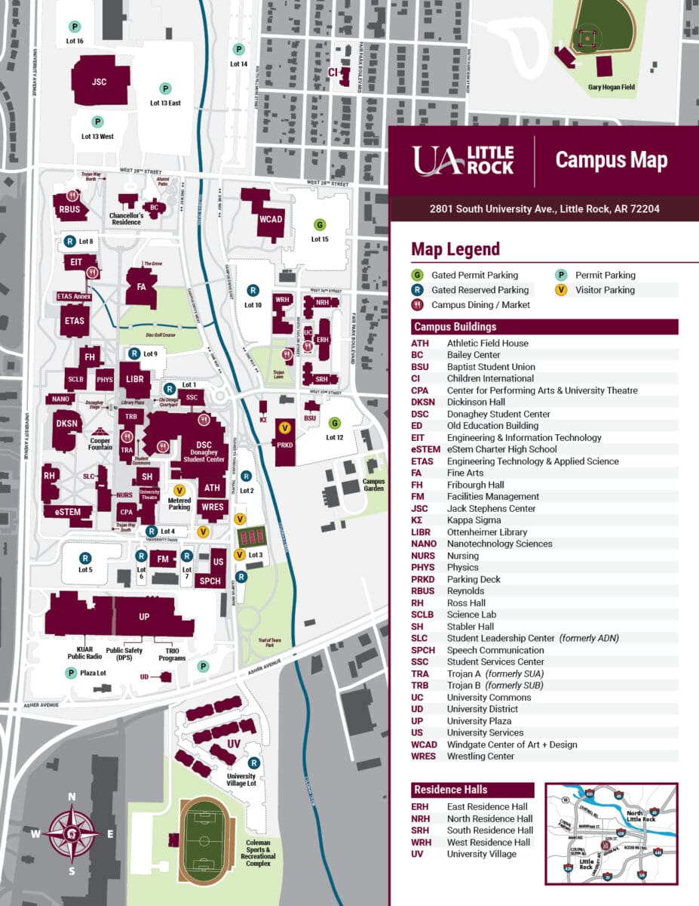
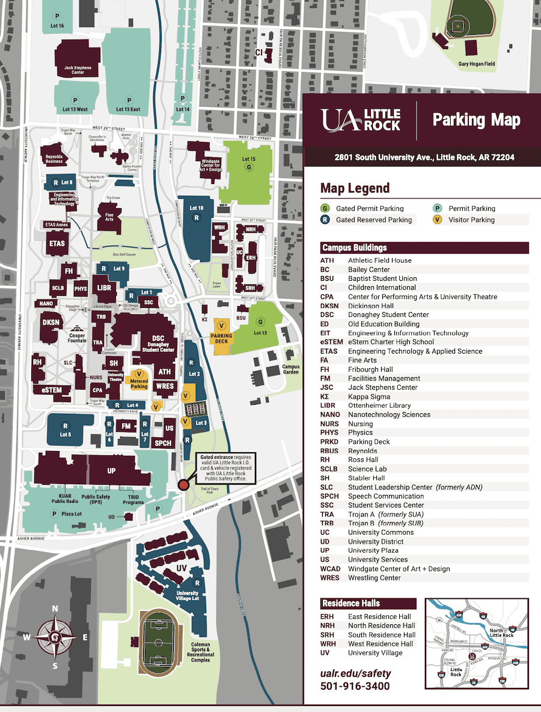
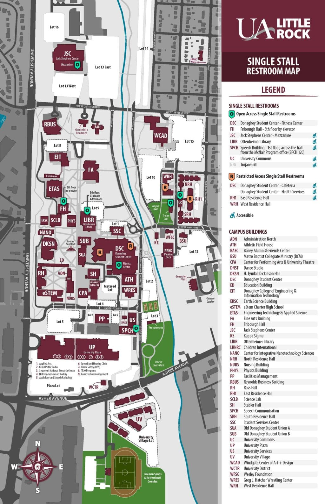

---
tags:
  - UALR
  - School
  - Wiki
---

Welcome to the University of Arkansas at Little Rock. Our campus is where students gather to learn, study, play, and interact. Stretching over 250 tree-covered acres in Little Rock’s midtown area, the main campus is home to more than 50 buildings, including many with LEED designations for their energy efficiency.

**Address:**  
2801 S. University Ave.  
Little Rock, AR 72204
## Parking and Campus Maps

[View information on parking permits](https://ualr.edu/safety/home/campus-parking/).

Campus Map

Parking Map

---

## Single Stall Restrooms on Campus

This [campus restroom map](../../files/2020-08-26_single-stall-restroom-map-web.pdf "PDF") shows where all single stall restrooms are located on campus. The sites include:

**Open Access Single Stall Restrooms:**

- Donaghey Student Center (DSC) – Fitness Center
- Fribourgh Hall (FH) – 5th floor by elevator
- Jack Stephens Center (JSC) – Mezzanine (Accessible)
- Ottenheimer Library (LIBR) – 5th floor (Accessible)
- Speech Building (SPCH) – 1st floor, across the hall from the McNair Program office (SPCH 120) (Accessible)
- Trojan Grill (Accessible)
- University Commons (UC) (Accessible)

**Restricted Access Single Stall Restrooms:**

- Donaghey Student Center (DSC) – Cafeteria (Accessible)
- Donaghey Student Center (DSC) – Health Services (Accessible)
- East Residence Hall (Accessible)
- West Residence Hall

Single Stall Restroom Map
