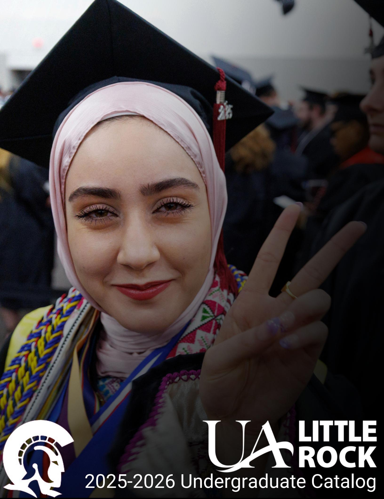
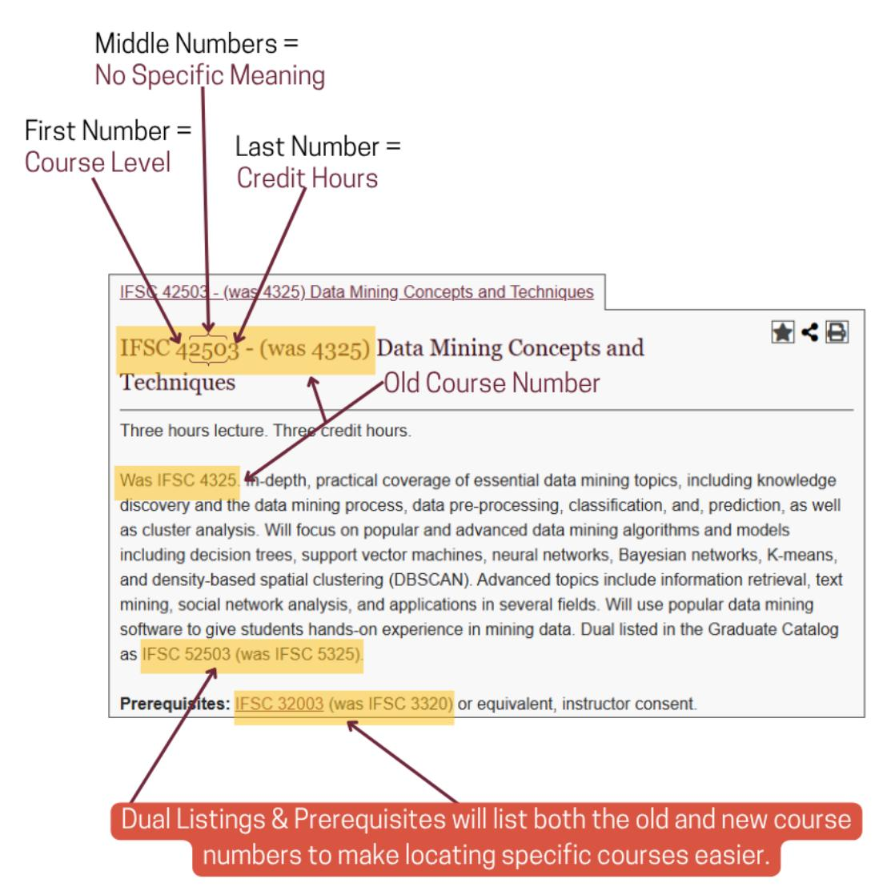

# **About UA Little Rock**

# **2025-2026 Academic Catalog**

**University of Arkansas at Little Rock | 2801 South University Little Rock, AR 72204 | 501-916-3000 |** ualr.edu

# **Christy Drale, Ph.D., Chancellor**

The University of Arkansas at Little Rock is committed to providing quality education to all persons without regard to religion, sex, creed, color, national origin, or disability.

In accordance with the requirement of 504 of the Rehabilitation Act of 1973 and Title II of the Americans with Disabilities Act (ADA), the University of Arkansas at Little Rock will not discriminate against qualified individuals with disabilities based on disability in its services, programs, or activities. UA Little Rock is an Equal Opportunity/Affirmative Action University.]

Published annually by the University of Arkansas at Little Rock

Online version is available.

# **Accreditation**

The University of Arkansas at Little Rock is fully accredited by the Higher Learning Commission, a regional accreditation agency recognized by the U.S. Department of Education.

The Higher Learning Commission 230 South LaSalle Street, Suite 7-500 Chicago, IL 60604

Phone: (800) 621-7440/ (312) 263-0456

Fax: (312) 263-7462 www.hlcommission.org

### **Accreditations and Affiliations**

UA Little Rock is designated a Military Friendly® School by Victory Media, the leader in successfully connecting the military and civilian worlds.

Specific degree programs are also accredited or affiliated with many external accrediting/certifying bodies. A complete list is located on the Accreditation website ualr.edu/accreditation.

# **History**

The University of Arkansas at Little Rock was founded in 1927 as Little Rock Junior College under the supervision of the Little Rock Board of Education. During the first semester, there were eight instructors and about 100 students. By 1929, the college was accredited by the North Central Association of Colleges and Schools, a status it has kept through changes in size and status.

For other numbers, consult the University Directory and search for the office title that matches your needs; the Office of Undergraduate Admissions and the Office of Records and Registration are most often needed by incoming students.

These offices are located on the second floor of the Charles W. Donaldson Student Services Center.

The Academic Advisors provide advice on the selection of required courses and programs for undeclared majors. All students who are undecided about a specific field of study must contact this office, located on the third floor of the Student Services Center.

If you have decided on a major or have narrowed your choice to a few areas, contact the academic advisor or chairperson of the appropriate department or the dean of the college or school.

If you have a problem or concern regarding student life on campus or have a question about student judicial affairs, start at the Student Experience Center, located on the upper level of the Donaghey Student Center.

The Information Center is also located in the Donaghey Student Center on the first floor across from the bookstore; personnel there can assist you with specific questions.

Department chairpersons and deans are appropriate people to contact for any academic problem at any time. All academic units are under the direction of the provost and executive vice chancellor.

The Catalog provides you with background information about the university and available programs. You will also find other important information to assist you. Information can be accessed via college and department sections and via program listings and course descriptions. Each of these sections describes the requirements for major and/or minor programs. Most courses are scheduled at least once every two years. The Interdisciplinary Studies section lists degree programs that involve work in more than one department or college.

# **Table of Contents**

| About OA Little Rock                                      |     |
|-----------------------------------------------------------|-----|
| About the Undergraduate Catalog                           |     |
| 2025-2026 Academic Calendars                              | 10  |
| University Policies                                       | 13  |
| Academic Requirements, Regulations, & Policies            | 17  |
| Quick Start Guide                                         | 32  |
| Admissions                                                | 34  |
| International Students                                    | 42  |
| Transfer Student Services                                 | 47  |
| Financial Aid & Scholarships                              | 51  |
| Tuition, Fees, Payments, & Refunds                        | 54  |
| Academic Requirements, Regulations, & Policies            | 17  |
| Academic Advising                                         | 63  |
| Records & Registration                                    | 64  |
| Student Life, Activities, & Services                      | 70  |
| Undergraduate Programs (By Degree)                        | 83  |
| Course Descriptions                                       | 89  |
| Undergraduate Programs By College                         | 370 |
| College of Humanities, Arts, Social Sciences, and         |     |
| Education                                                 | 372 |
| College of Business, Health, and Human Services           | 443 |
| Donaghey College of Science, Technology, Engineering, and |     |
| Mathematics                                               | 489 |
| General Core Requirements                                 | 556 |
| First Year Experience Courses                             | 562 |
| Donaghey Scholars Honors Program                          | 563 |
| Administration                                            | 564 |
| Faculty Listing                                           | 566 |

# **About the Undergraduate Catalog**

The Undergraduate Catalog is an official publication of UA Little Rock published annually by the Office of the Provost in conjunction with the Office of Records and Registration.

Curriculum and policy revision is regulated by the Undergraduate Council, Graduate Council, and Council on Core Curriculum and Policies of the Faculty Senate in conjunction with the Office of the Provost while adhering to the rules and regulations of applicable institutional or regional accreditation organizations.

The online version of the catalog is a snapshot of the printed version also updated annually or when substantive mistakes are identified.

**Please note:** The printed version is a replica of the Adobe PDF version available online and is used to determine graduation requirements.

Copies of previous catalogs (Archived Versions) may be found on the catalog archive website and hard copies of every year are kept in the Office of Records and Registration.

This catalog establishes the graduation requirements set forth by a specific program of study within each college. Typically, students who enter a program within UA Little Rock, follow the program of study listed for the academic year the catalog is published. Each college within UA Little Rock reserves the right to change graduation requirements for its program. Students should meet regularly with their academic advisors to be certain that they are aware of any changes in graduation requirements that may apply to them.

Admission to UA Little Rock in any program of study does not guarantee that the university will continue to offer that program of study indefinitely. UA Little Rock reserves the right to change, phase out, or discontinue any program at any time in the best interest of the University.

The Undergraduate Catalog provides information about degree programs, course offerings, and academic regulations that affect undergraduate students. The catalog is compiled and edited by the Office of the Provost, with assistance from college associate deans and department chairpersons.

# **Right to Change**

Any policy, course listing, website, catalog, or class schedule is only intended to announce available courses and applicable policies. If a course appears in this catalog or any other publication, it should not be regarded as a guarantee. Keeping within standards set by other universities with the University of Arkansas System, UA Little Rock reserves the right to:

- add or delete courses or programs from its offerings,
- change times, locations, or instructors of courses or programs,
- modify academic calendars without notice,
- cancel any course for insufficient student registrations, or
- revise regulations, charges, fees, schedules, courses, requirements for degrees, and any other policy or regulation affecting students whenever it is considered to be in the best interests of UA Little Rock.

# **How to Get Help**

Often the information you need can be obtained on the UA Little Rock website at ualr.edu or by telephone at 501-916-3000. Departmental numbers are included in their respective sections within the Catalog.

Housed at first in public school buildings, the college moved in 1949 to its present location in southwest Little Rock on a beautifully wooded site donated by Raymond Rebsamen, a Little Rock businessman. By that time, the college was the sole beneficiary of a continuing trust established by former Governor George W. Donaghey.

The institution began a four-year degree program in 1957. At that time, the University was independent and privately supported under a separate board of trustees and took the name Little Rock University. In September 1969, after several years of discussion and study, Little Rock University merged with the University of Arkansas System to create the University of Arkansas at Little Rock. That was a major step in the creation of a multi-campus system. Within this structure, UA Little Rock is state-supported, operationally separate, and specifically oriented toward serving the educational needs of Arkansas.

The University of Arkansas merger began a period of rapid growth, which saw UA Little Rock go from about 3,500 students and 75 full-time faculty members in 1969 to about 12,000 students and 500 full-time faculty members today. The University's expanded offerings now include more than 100 undergraduate and graduate degrees, and an extensive schedule of night, weekend, and extended programs. We also provide a wide range of community educational services. UA Little Rock began offering graduate and professional work in 1975 and the UA Little Rock Graduate School was created in 1977. Besides the juris doctor, UA Little Rock has ten doctoral programs and 39 graduate and professional programs, as well as joint programs with other campuses of the University of Arkansas System. UA Little Rock is classified by the Carnegie Foundation for the Advancement of Teaching as a Doctoral/Research University.

Presidents of the Little Rock Junior College and Little Rock University include R.C. Hall (1927-1930), John A. Larson (1930- 1950), Granville Davis (1950-1954), E.Q. Brothers (acting president 1954-1956), and Carey V. Stabler (1956-1969).

Chancellors of the University of Arkansas at Little Rock include Carey V. Stabler (1969-1972), James H. Fribourgh (acting chancellor 1972-1973, 1982), G. Robert Ross (1973-1982), James H. Young (1982-1992), Joel E. Anderson (interim chancellor 1993), Charles E. Hathaway (1993-2002), Joel E. Anderson (2003-2016), Andrew Rogerson (2016 – 2019), and Christy Drale (2019-present).

# **Student Body**

One of the most exciting things about UA Little Rock is the diversity reflected in the student body. The campus includes people ranging from the usual college ages of 18 to 21 to students over 60. Most students work at least part-time, and many are married and/or have children at home. Many attend college part-time and take one, two, or three courses a semester. Some students take courses for personal enrichment or job advancement without immediate plans to get a degree. About a third are going to college at night only. More than 60 percent of the students are women, about 21 percent are African-American, 3 percent identify as Hispanic/Latino, about 10 percent identify as two or more races and a growing number are international students. *(according to 2024 data)*

# **Mission Statement**

# **University of Arkansas System Mission**

The University of Arkansas System is a comprehensive, multi-campus, publicly-aided institution dedicated to the improvement of the mind and spirit through the development and dissemination of knowledge. The University embraces and expands the historic trust inherent in the land-grant philosophy by providing access to academic and professional education, developing intellectual growth and cultural awareness in its students, and applying knowledge and research skills to an ever-changing human condition. (Adopted by the University of Arkansas Board of Trustees, 1989)

Most universities today develop and publish statements explaining their purposes and describing their programs. Official boards that govern a campus or coordinate its activities with other campuses also develop and publish such statements. UA Little Rock has mission statements and role and scope statements developed at three levels: the University of Arkansas

System, the statewide coordinating board, and the campus. Although not identical, the statements are similar and consistent in content, each reflecting a different perspective from a different level of responsibility.

The mission statement is typically brief, general, and philosophical. It states why the institution exists. It addresses fundamental purposes and permanent commitments. It distinguishes the university from other social institutions such as a church, a factory, a political party, or an elementary school.

The role and scope statement is more concrete and specific than the mission statement. Elements of a role and scope statement have only relative permanence. The role and scope statement distinguishes one university from other universities. Each university campus has a role to play in a larger cast of actors. Thus, role and scope statements tend to be of particular concern to officials responsible for governing or coordinating multiple university campuses.

The role and scope statement typically discloses the nature and range of the institution's responsibilities and activities, geographical service area, disciplines in which programs are provided, levels of degree offerings, e.g., associate, baccalaureate, master's, doctoral, dominant characteristics of the student clientele, other constituencies to be served, emphasis areas, and sometimes future directions.

Included in this chapter are the mission statement of the University of Arkansas System, the role and scope statement for UA Little Rock adopted by the University of Arkansas Board of Trustees, and the role and scope statement for UA Little Rock published by the Arkansas Department of Higher Education and adopted by the Arkansas Higher Education Coordinating Board. They are followed by the current mission, objectives, and role and scope statements developed at UA Little Rock.

### **UA Little Rock Mission**

The mission of the University of Arkansas at Little Rock is to develop the intellect of students, discover and disseminate knowledge, serve and strengthen society by enhancing awareness in scientific, technical, and cultural arenas, and promote humane sensitivities and understanding of interdependence. Within this broad mission are the responsibilities to use quality instruction to instill in students a lifelong desire to learn, to use knowledge in ways that will contribute to society, and to apply the resources and research skills of the University community to the service of the city, the state, the nation, and the world in ways that will benefit humanity. (Adopted by the UA Little Rock Faculty Senate, 1988)

# **UA Little Rock Objectives**

The University, through its various programs, works toward six mission objectives:

- 1. **Excellence in Instruction:** The University has a responsibility to provide excellence in instruction to ensure a highquality education for our students. This responsibility includes developing faculty teaching skills, awareness of the ways students learn, assessing student learning outcomes, and enhancement of resources to support effective instruction.
- 2. **Scholarly Inquiry:** The University has a responsibility to use scholarly inquiry to advance the discovery, preservation, and dissemination of knowledge. This responsibility includes the creation of a university environment that supports diverse research activities by faculty, staff, and students.
- 3. **Service to Society:** The University has a responsibility to serve society through the application of knowledge and research skills. This responsibility includes applying the University's resources to local, state, national, and international needs to improve the human condition.
- 4. **Community of Learning:** The University has a responsibility to provide a community of learning through the creation of an academic environment that stimulates students, faculty, and staff to become lifelong learners. This environment should heighten the intellectual, cultural, and humane sensitivities of students, faculty, and staff.

- 5. **Accessibility:** The University has a responsibility to serve the needs of a heterogeneous student population and to make its resources accessible to the general public and local, state, national, and international groups. This responsibility includes creating opportunities for access to the University's academic and other resources.
- 6. **Responsiveness:** The University has a responsibility to remain responsive to a changing environment and society. This responsibility includes a continuous assessment of the University's strengths and weaknesses in planning for and meeting internal and external needs. It also includes developing the faculty, staff, and students' desire and capacity to create an academic community that is open to change and ready to meet the demands of a dynamic environment and student body.

(Adopted by the UA Little Rock Faculty Senate, 1988)

### **UA Little Rock Role and Scope Developed by the University of Arkansas Board of Trustees**

The University of Arkansas at Little Rock (UA Little Rock) is a Carnegie "Doctoral/Research University" offering a comprehensive range of undergraduate, master's, and doctoral programs, and a first professional degree in law. Due to its location in the state's capital city and largest, most complex metropolitan area, the demand for UA Little Rock to offer graduate, professional, and doctoral education continues to increase, and, thus, post-baccalaureate offerings will become a larger part of the institution's instructional program. Because of its metropolitan location, UA Little Rock assumes a special role about the needs of urban areas in modern society in its instruction, research, and public service programs. UA Little Rock recognizes and accepts that in the 21st Century, universities are critical to regional and state economic development.

UA Little Rock serves a diverse student body. While it serves traditional students as do most other universities, UA Little Rock also serves large numbers of nontraditional students who enroll part-time, commute to campus, have job and family responsibilities, and may be older than the traditional college student. The university also enrolls international students from more than 50 countries. Honors courses and a nationally recognized undergraduate scholars program respond to the needs of superior students while students with developmental needs are afforded organized assistance in meeting their educational goals. UA Little Rock emphasizes excellence in teaching by all faculty. Developing technological competence in students receives particular attention.

UA Little Rock is strongly committed to research and public service. Faculty engage in applied and basic research appropriate to their academic disciplines and respond to economic development needs and other state and regional needs. The university is committed to supporting research and development, often in cooperative relationships, leading to intellectual property and commercialization. UA Little Rock's public service mission is reflected in numerous outreach activities by individual faculty members, academic units, and several specialized units established to aid and expertise to organizations and groups in the community and across the state.

Partnerships are very important to UA Little Rock for they enable the university to extend its reach, increase its effectiveness, and leverage its resources. UA Little Rock works with other institutions of higher education-particularly the University of Arkansas for Medical Sciences, the University of Arkansas Cooperative Extension Service, the University of Arkansas Clinton School of Public Service, and Pulaski Technical College-to coordinate instructional programs. UA Little Rock partners with and complements the research activities of the University of Arkansas for Medical Sciences. UA Little Rock gives and receives benefits from partnerships with businesses, schools, governmental offices, neighborhood groups, cultural organizations, and nonprofit organizations.

(Adopted by the University of Arkansas Board of Trustees, 1978, revised 1982, 1989, 1991, 2006)

# **UA Little Rock Role and Scope Developed by the Arkansas State Board of Higher Education**

### Audiences

As the state's metropolitan university, the University of Arkansas at Little Rock (UA Little Rock) has the responsibility for serving:

- Residents of Arkansas and the Little Rock metropolitan area who have completed their high school education and are seeking either a college degree or continuing professional education. As a metropolitan university, the institution serves adult, part-time students in particular.
- Employers across the state, particularly in the region, both public and private, seeking well-educated employees, technical assistance, and applied research.
- Economic development interests and entrepreneurs in the region and across the state.
- The research community.
- The community and area by providing a broad range of academic and cultural activities and public events.
- Area K-12 schools seeking college general education courses for advanced students.
- Two-year college transfer students.

### Array of Programs and Services

UA Little Rock serves these audiences by providing

- Baccalaureate programs in arts and humanities, the natural sciences, and social sciences appropriate to a teaching institution with a predominantly undergraduate student body.
- Associate, baccalaureate, and master's programs in the professional fields of particular importance in the region, including journalism and communications, public administration and community services, computer and information science, nursing, human services (including social work and criminal justice), education, engineering, and business.
- Doctoral programs most needed by regional and state employers, most importantly, education programs and applied science.
- Services specifically designed to meet the needs of statewide and regional economic development–continuing professional education, technical and professional services, support of small businesses and entrepreneurs, and technology transfer.

## **UA Little Rock Role and Scope Developed by the UA Little Rock Faculty Senate**

The University of Arkansas at Little Rock offers certificates and degree programs at the associate, baccalaureate, master's, specialist, and doctoral levels. Disciplines in which degrees are offered include applied science, the arts, business, health, public administration, communication, education, engineering technology, the humanities, law, social, physical and life sciences, and social work. The institution emphasizes the liberal education of undergraduate students and offers more focused professional study, particularly at graduate levels.

The University of Arkansas at Little Rock, taking advantage of its metropolitan location, offers programs and services that respond to the special needs and interests of individuals, organizations, institutions, businesses, and governmental units. Academic programs, student services, research activities, public service projects, and institutional policies reflect the University's commitment to a diverse student body composed of recent high school graduates, students returning to school after other experiences, retirees, international students, disabled students, and professionals seeking a career change or enrichment. A significant percentage of these students attend school part-time and work full- or part-time. As a result, many UA Little Rock students bring experience and a high level of motivation into the classroom.

The University of Arkansas at Little Rock strives to make higher education accessible to all who can benefit. The institution's academic courses are offered in flexible and varied periods and learning formats, at off-campus locations, in traditional classrooms, and by radio, telecommunication, and newspaper. In all of these forms, the quality of instruction is of paramount importance. The University has a nationally recognized scholars program and curriculum, honors courses, and other programs for superior students. Specialized programs and assistance are offered to educationally disadvantaged students. The University is committed to international education, supporting programs and courses that attract international students and offer opportunities for all students to explore and experience other cultures.

The University of Arkansas at Little Rock recognizes its responsibility to contribute to bodies of knowledge through research and to disseminate ideas through instruction. The University fosters basic and applied research appropriate to its programs and faculty. The University supports grant applications and other attempts to gain sponsorship for research. Many research activities address the problems of Arkansas as it interacts with an increasingly complex and interdependent world.

The University of Arkansas at Little Rock shares its resources with the larger community through public service. Activities include noncredit educational offerings ranging from college preparatory classes to courses for personal enrichment and awareness, special programs for pre-collegiate students, programs for professional advancement, and institutes and centers to focus research and study on such areas as teaching and learning, technology, government, management, and urban affairs. The University serves the State of Arkansas in economic development through assistance from businesses, seminars for managers and workers, and support for entrepreneurial ventures. The University provides leadership in cultural enrichment and makes its resources available to the community. Relationships with local, state, and national governments in addition to business and industry strengthen the curriculum and provide students and faculty opportunities to apply theory and research.

The University anticipates continued growth in the number of students and the number and size of academic programs. The primary aim of the University in all of its varied activities will continue to be maintaining and improving the quality of education for all its students.

(Adopted by the UA Little Rock Faculty Senate, 1988)

# **Assessment**

Units across campus regularly engage in research to assess UA Little Rock's success in meeting these objectives. Assessment at UA Little Rock is designed to help the academic programs – whether core, undergraduate, or graduate – focus on what should be taught in the program and whether it is being taught successfully.

This involves a variety of methods of inquiry to examine student needs, attributes, and success in learning. Each academic unit at UA Little Rock has an assessment program to conduct research that will be used to make decisions to improve its curriculum, instruction, and both academic and career advising. Students, alumni, and various stakeholders participate in a variety of assessment activities designed to assess learning in the major and the core curriculum.

# **2025-2026 Academic Calendars**

# **FALL 2025**

|                                                                       |                   |                                       |         |         | Part of Term: |         |         |         |
|-----------------------------------------------------------------------|-------------------|---------------------------------------|---------|---------|---------------|---------|---------|---------|
| Term Event:                                                           | 1                 | 510                                   | 520     | 530     | 710           | 720     | 910     | 920     |
| Priority Registration Opens (Grad/Post Bacc/Senior/Special Groups) | Mar. 31           | Mar. 31                               | Mar. 31 | Mar. 31 | Mar. 31       | Mar. 31 | Mar. 31 | Mar. 31 |
| Priority Registration Opens (Juniors)                                 | Apr. 02           | Apr. 02                               | Apr. 02 | Apr. 02 | Apr. 02       | Apr. 02 | Apr. 02 | Apr. 02 |
| Priority Registration Opens (Sophomores)                              | Apr. 03           | Apr. 03                               | Apr. 03 | Apr. 03 | Apr. 03       | Apr. 03 | Apr. 03 | Apr. 03 |
| Priority Registration Opens (Freshmen)                                | Apr. 04           | Apr. 04                               | Apr. 04 | Apr. 04 | Apr. 04       | Apr. 04 | Apr. 04 | Apr. 04 |
| All Priority Registration Ends                                        | Apr. 04           | Apr. 04                               | Apr. 04 | Apr. 04 | Apr. 04       | Apr. 04 | Apr. 04 | Apr. 04 |
| Regular Registration Opens                                            | Apr. 04           | Apr. 04                               | Apr. 04 | Apr. 04 | Apr. 04       | Apr. 04 | Apr. 04 | Apr. 04 |
| Senior Citizen Registration Opens                                     | Aug. 19           | Aug. 19                               | Sep. 25 | Oct. 31 | Aug. 19       | Oct. 14 | Aug. 19 | Oct. 02 |
| Regular Registration Closes                                           | Aug. 19           | Aug. 19                               | Sep. 25 | Oct. 31 | Aug. 19       | Oct. 14 | Aug. 19 | Oct. 02 |
| Classes Begin                                                         | Aug. 20           | Aug. 20                               | Sep. 26 | Nov. 01 | Aug. 20       | Oct. 15 | Aug. 20 | Oct. 03 |
| Late Registration Opens                                               | Aug. 20           | Aug. 20                               | Sep. 26 | Nov. 01 | Aug. 20       | Oct. 15 | Aug. 20 | Oct. 03 |
| Senior Citizen/Late Registration Closes                               | Aug. 26           | Aug. 21                               | Sep. 29 | Nov. 04 | Aug. 22       | Oct. 17 | Aug. 22 | Oct. 07 |
| Census 1 Date                                                         | Sep. 04           | Sep. 04                               | Oct. 02 | Nov. 07 | Sep. 04       | Oct. 21 | Sep. 04 | Oct. 09 |
| Individual Class Drop Deadline                                        | Oct. 16           | Sep. 08                               | Oct. 14 | Nov. 20 | Sep. 17       | Nov. 11 | Sep. 23 | Nov. 05 |
| Withdraw All Classes Deadline                                         | Dec. 03           | Sep. 23                               | Oct. 29 | Dec. 10 | Oct. 09       | Dec. 10 | Oct. 21 | Dec. 10 |
| Classes End                                                           | Dec. 03           | Sep. 24                               | Oct. 30 | Dec. 11 | Oct. 12       | Dec. 11 | Oct. 22 | Dec. 11 |
| Consultation Day                                                      | Dec. 04           | *                                     | *       | *       | *             | *       | *       | *       |
| Finals Begin                                                          | Dec. 05           | *                                     | *       | *       | *             | *       | *       | *       |
| Finals                                                                | *                 | Sep. 24                               | Oct. 30 | Dec. 11 | Oct. 12       | Dec. 11 | Oct. 22 | Dec. 11 |
| Finals End                                                            | Dec. 11           | *                                     | *       | *       | *             | *       | *       | *       |
| Grades Due                                                            | Dec. 15           | Sep. 26                               | Oct. 31 | Dec. 15 | Oct. 12       | Dec. 15 | Oct. 24 | Dec. 15 |
| Labor Day (Campus Closed)                                             | Mon Sep. 01, 2025 |                                       |         |         |               |         |         |         |
| Fall Break Week (No Class)                                            |                   | SunNov. 23, 2025, to SatNov. 29, 2025 |         |         |               |         |         |         |
| Fall Break Week (Campus Closed)                                       |                   | ThuNov. 27, 2025, toSatNov. 29, 2025  |         |         |               |         |         |         |
| Commencement                                                          | Sat Dec. 13, 2025 |                                       |         |         |               |         |         |         |

# **SPRING 2026**

|                                                                       |                   |                                      |         |         | Part of Term |         |         |         |
|-----------------------------------------------------------------------|-------------------|--------------------------------------|---------|---------|--------------|---------|---------|---------|
| Term Event                                                            | Full Term         | 510                                  | 520     | 530     | 710          | 720     | 910     | 920     |
| Priority Registration Opens (Grad/Post Bacc/Senior/Special Groups) | Oct. 27           | Oct. 27                              | Oct. 27 | Oct. 27 | Oct. 27      | Oct. 27 | Oct. 27 | Oct. 27 |
| Priority Registration Opens (Juniors)                                 | Oct. 29           | Oct. 29                              | Oct. 29 | Oct. 29 | Oct. 29      | Oct. 29 | Oct. 29 | Oct. 29 |
| Priority Registration Opens (Sophomores)                              | Oct. 30           | Oct. 30                              | Oct. 30 | Oct. 30 | Oct. 30      | Oct. 30 | Oct. 30 | Oct. 30 |
| Priority Registration Opens (Freshmen)                                | Oct. 31           | Oct. 31                              | Oct. 31 | Oct. 31 | Oct. 31      | Oct. 31 | Oct. 31 | Oct. 31 |
| All Priority Registration Ends                                        | Oct. 31           | Oct. 31                              | Oct. 31 | Oct. 31 | Oct. 31      | Oct. 31 | Oct. 31 | Oct. 31 |
| Regular Registration Opens                                            | Oct. 31           | Oct. 31                              | Oct. 31 | Oct. 31 | Oct. 31      | Oct. 31 | Oct. 31 | Oct. 31 |
| Senior Citizen Registration Opens                                     | Jan. 16           | Jan. 16                              | Feb. 24 | Apr. 07 | Jan. 16      | Mar. 13 | Jan. 16 | Feb. 27 |
| Regular Registration Closes                                           | Jan. 19           | Jan. 19                              | Feb. 24 | Apr. 07 | Jan. 19      | Mar. 15 | Jan. 19 | Mar. 01 |
| Classes Begin                                                         | Jan. 20           | Jan. 20                              | Feb. 25 | Apr. 08 | Jan. 20      | Mar. 16 | Jan. 20 | Mar. 02 |
| Late Registration Opens                                               | Jan. 20           | Jan. 20                              | Feb. 25 | Apr. 08 | Jan. 20      | Mar. 16 | Jan. 20 | Mar. 02 |
| Senior Citizen/Late Registration Closes                               | Jan. 26           | Jan. 21                              | Feb. 26 | Apr. 09 | Jan. 22      | Mar. 18 | Jan. 22 | Mar. 04 |
| Census 1 Date                                                         | Feb. 03           | Feb. 03                              | Mar. 03 | Apr. 14 | Feb. 03      | Mar. 20 | Feb. 03 | Mar. 06 |
| Individual Class Drop Deadline                                        | Mar. 17           | Feb. 05                              | Mar. 13 | Apr. 24 | Feb. 16      | Apr. 17 | Feb. 20 | Apr. 09 |
| Withdraw All Classes Deadline                                         | May. 04           | Feb. 20                              | Apr. 06 | May. 11 | Mar. 10      | May. 11 | Mar. 30 | May. 07 |
| Classes End                                                           | May. 04           | Feb. 23                              | Apr. 07 | May. 12 | Mar. 11      | May. 12 | Mar. 31 | May. 08 |
| Consultation Day                                                      | May. 05           | *                                    | *       | *       | *            | *       | *       | *       |
| Finals Begin                                                          | May. 06           | *                                    | *       | *       | *            | *       | *       | *       |
| Finals                                                                | *                 | Feb. 23                              | Apr. 07 | May. 12 | Mar. 11      | May. 12 | Mar. 31 | May. 08 |
| Finals End                                                            | May. 12           | *                                    | *       | *       | *            | *       | *       | *       |
| Grades Due                                                            | May. 14           | Feb. 25                              | Apr. 08 | May. 14 | Mar. 13      | May. 14 | Apr. 02 | May. 12 |
|                                                                       |                   | Full Term Events                     |         |         |              |         |         |         |
| MLK Day (Campus Closed)                                               | Mon Jan. 20, 2025 |                                      |         |         |              |         |         |         |
| Spring Break Week (No Class)                                          |                   | SunMar. 22, 2026 to ThuMar. 26, 2026 |         |         |              |         |         |         |
| Spring Break Week (Campus Closed)                                     |                   | FriMar. 27, 2026 toSatMar. 28, 2026  |         |         |              |         |         |         |
| Commencement                                                          | Sat May. 16, 2026 |                                      |         |         |              |         |         |         |

# **SUMMER 2026**

|                                                                       |                   | Part of Term: |         |         |  |  |
|-----------------------------------------------------------------------|-------------------|---------------|---------|---------|--|--|
| Term Event:                                                           | 1                 | 2             | 3       | 4       |  |  |
| Priority Registration Opens (Grad/Post Bacc/Senior/Special Groups) | Mar. 30           | Mar. 30       | Mar. 30 | Mar. 30 |  |  |
| Priority Registration Opens (Juniors)                                 | Apr. 01           | Apr. 01       | Apr. 01 | Apr. 01 |  |  |
| Priority Registration Opens (Sophomores)                              | Apr. 02           | Apr. 02       | Apr. 02 | Apr. 02 |  |  |
| Priority Registration Opens (Freshmen)                                | Apr. 03           | Apr. 03       | Apr. 03 | Apr. 03 |  |  |
| All Priority Registration Ends                                        | Apr. 03           | Apr. 03       | Apr. 03 | Apr. 03 |  |  |
| Regular Registration Opens                                            | Apr. 03           | Apr. 03       | Apr. 03 | Apr. 03 |  |  |
| Senior Citizen Registration Opens                                     | May. 22           | May. 22       | Jun. 06 | Jul. 02 |  |  |
| Regular Registration Closes                                           | May. 25           | May. 25       | Jun. 08 | Jul. 05 |  |  |
| Classes Begin                                                         | May. 26           | May. 26       | Jun. 09 | Jul. 06 |  |  |
| Late Registration Opens                                               | May. 26           | May. 26       | Jun. 09 | Jul. 06 |  |  |
| Senior Citizen/Late Registration Closes                               | May. 28           | May. 27       | Jun. 11 | Jul. 07 |  |  |
| Census 1 Date                                                         | Jun. 01           | Jun. 01       | Jun. 15 | Jul. 10 |  |  |
| Individual Class Drop Deadline                                        | Jun. 26           | Jun. 11       | Jul. 07 | Jul. 22 |  |  |
| Withdraw All Classes Deadline                                         | Jul. 27           | Jun. 26       | Jul. 30 | Aug. 06 |  |  |
| Classes End                                                           | Jul. 28           | Jun. 29       | Jul. 31 | Aug. 07 |  |  |
| Finals                                                                | Jul. 28           | Jun. 29       | Jul. 31 | Aug. 07 |  |  |
| Grades Due                                                            | Jul. 30           | Jul. 01       | Aug. 04 | Aug. 11 |  |  |
|                                                                       | Full Term Events  |               |         |         |  |  |
| Memorial Day (Campus Closed)                                          | Mon May. 25, 2026 |               |         |         |  |  |
| Independence Day (Campus Closed)                                      | Fri Jul. 03, 2026 |               |         |         |  |  |

# **University Policies**

**\*All UA Little Rock policies are posted on the [policy website.](https://ualr.edu/deanofstudents/university-rules-regulations/)** 

# **Equal Access for Students with Disabilities**

In compliance with federal regulations, it is the policy of UA Little Rock to respond to student requests for course accommodation, substitution, and other adjustments because of a documented disability on an individual basis and in a manner that does not result in discrimination. Where requests are complex and not easily handled through the regular course substitution procedures, the Disability Resource Center will review the case and decide in conjunction with academic departments when appropriate. The Disability Resource Center will work through the interactive process with the student to determine accommodations. Students who wish to request academic adjustments because of a disability should consult the academic adjustment procedures printed in the UA Little Rock Student Handbook, or contact the Disability Resource Center at 501.916.3143.

The syllabus for each UA Little Rock course should include the following statement:

"Students with Disabilities: Your success in this class is important to me, and it is the policy and practice of the University of Arkansas at Little Rock to create inclusive learning environments consistent with federal and state law. If you have a documented disability (or need to have a disability documented) and need accommodation, please contact me privately as soon as possible, so that we can discuss with the Disability Resource Center (DRC) how to meet your specific needs and the requirements of the course. The DRC offers resources and coordinates reasonable accommodations for students with disabilities. Reasonable accommodations are established through an interactive process among you, your instructor(s), and the DRC. Thus, if you have a disability, please contact me and/or the DRC, at 501.916.3143 or 501.246.8296. For more information, please visit the DRC website, or telephone (501) 916-3143."

# **Family Educational Rights and Privacy Act (FERPA)**

Students at the University of Arkansas at Little Rock have certain rights concerning their educational records as stipulated by the Family Educational Rights and Privacy Act (FERPA). Students should consult the UA Little Rock Student Handbook for the delineation of those rights.

# **HIV**

In support of its mission to discover and disseminate knowledge and to promote humane sensitivities and understanding of interdependence, the University of Arkansas at Little Rock endorses the following policy for responding to Human Immunodeficiency Virus (HIV) infection.

Based on conclusive evidence from the U.S. Public Health Services and Centers for Disease Control and Prevention, people living with HIV infection pose no threat of transmission through casual contact with those who are not infected. Because many people are infected and don't know it, the University accepts an inclusive approach that recognizes any individual could be HIV positive. No screening or inquiries regarding HIV status will be made for admission or employment.

### **Access**

People with HIV/AIDS are protected from discrimination by Section 504 of the Rehabilitation Act of 1973 and the Americans with Disabilities Act. Appropriate, reasonable accommodations will be made for students and employees who are infected and they will be accorded all rights of access and responsibilities in every aspect of University life. Acts of discrimination or abuse will not be tolerated. Confidentiality will be observed.

### **Prevention and Education**

The University will provide ongoing training for students and employees that include the following:

- Facts about infection, transmission, prevention, testing sites, and disclosure
- Skill development and equipment for self-protection
- A climate that fosters care and respect for self and others

For information about educational programs contact the Offices of Health Services or Human Resource Services.

# **Support Services**

The Health Services Office is the primary point of confidential contact for people living with HIV and will serve as a resource to the campus community regarding HIV issues on campus.

Support services and referrals are also available in the following offices: Counseling and Career Planning Services, Disability Resource Center, and the Arkansas Employee Assistance Program.

### **Policy Implementation and Review**

The University Health and Wellness Committee will be responsible for the implementation of this policy. They will review this policy semi-annually or as scientific information emerges and submit revisions to the University Assembly for approval. (Adopted by the Faculty Senate, 4/19/96)

# **Name Changes**

### **U.S. citizens**

To comply with several government agency reporting requirements, the University must record each student's name as it appears on his/her social security card. Students who need to change their names on UA Little Rock records must complete a name change form (available at the Office of Records and Registration) and present a social security card and picture identification when submitting the form. After the change is implemented, the name on the UA Little Rock transcript, diploma, and other documents will read as printed on the social security card. If the social security card is incorrect, students must change their records with the Social Security Administration Office first. No changes will be made to the UA Little Rock record until a new Social Security Card is issued and presented to the Office of Records and Registration.

### **International students**

International students who need to change their names on UA Little Rock records should consult with the Director of Records and Registration, who will specify appropriate documentation.

# **Nondiscrimination**

UA Little Rock adheres to a policy that enables all individuals, regardless of race, color, gender, national origin, age, religion, sexual orientation, veteran's status, or disability, to work and study in an environment unfettered by discriminatory behavior or acts. Harassment of an individual or group will not be condoned, and any person (student, faculty, or staff member) who violates this policy will be subject to disciplinary action.

Any person who believes they have been discriminated against should contact the Human Resources Office to obtain assistance and information concerning the filing of complaints, at (501) 916-3180.

Harassment that is considered discriminatory includes actions or conduct (verbal, graphic, gestural, or written) directed against any person or group with the intent to demean or create a hostile or threatening environment. It is not the intent of this policy to infringe upon or limit educational, scholarly, or artistic expression. Any person who believes he or she has been discriminated against should contact the Office of Human Relations to obtain assistance and information concerning the filing of a complaint.

At the same time, the university prohibits discriminatory practices, it promotes equal opportunity through affirmative action. Non-discriminatory, affirmative action, and equal opportunity policies apply to recruitment, hiring, job classification, and placement, work conditions, promotional opportunities, demotions/transfers, terminations, training, compensation, choice of contractors and suppliers of goods and services, educational opportunities, disciplinary action, recreational and social activities, use of facilities, housing, and university-sponsored programs.

[Policy 201.1 appears on the policy website.](https://ualr.edu/policy/admin/non-discrimination/)

# **Prohibiting Sexual Harassment**

The University of Arkansas at Little Rock does not discriminate based on sex in the education programs and activities that it operates and is prohibited from doing so by Title IX of the Education Amendments of 1972, 20 U.S.C. § 1681 et seq., and the U.S. Department of Education's implementing regulations, 34 CFR Part 106. The University's nondiscrimination policy extends to admission, employment, and other programs and activities. Inquiries regarding the application of Title IX and 34 C.F.R. Part 106 may be sent to the University's Title IX Coordinator, the U.S. Department of Education Assistant Secretary for Civil Rights, or both.

Sexual harassment as defined in this policy (including sexual assault) is a form of sex discrimination and is prohibited. Title IX requires the University to promptly and reasonably respond to sexual harassment in the University's educational programs and activities, provided that the harassment was perpetrated against a person in the United States. At the time that a formal complaint is filed, the complainant must be participating in (or attempting to participate in) an education program or activity of the University. An education program or activity includes locations, events, or circumstances over which the University exercised substantial control over both the respondent and the context in which the sexual harassment occurs, and also includes any building owned or controlled by a student organization that is officially recognized by a postsecondary institution.

This policy applies to allegations and complaints of sexual harassment as defined herein. All other complaints of discrimination or misconduct that do not fall within the jurisdiction of Title IX may be made through other campus procedures.

This policy shall not be construed or applied to restrict academic freedom at the University. Further, it shall not be construed to restrict any rights protected under the First Amendment, the Due Process Clause, or any other constitutional provisions. This policy also does not limit an employee's rights under Title VII of the Civil Rights Act. All complaints or any concerns about conduct that may violate this policy should be submitted to the Title IX Coordinator, Senior Title IX Deputy Coordinator, or Title IX Deputy Coordinators. All references to the Title IX Coordinator in this policy implicitly include the Senior Deputy Title IX Coordinator or designee.

UA Little Rock's complete policy for Title IX Policy for Complaints of Sexual Assault and Other Forms of Sexual Harassment – [401.7 appears on the policy website.](https://ualr.edu/policy/2017/08/09/title-ix-policy-401-7-updated/)

# **Smoke-Free Campus**

Smoking on UA Little Rock campuses is regulated under the authority of the Arkansas Clean Air Act, A.C.A. §6-60-801 et. seq., and Act 847 of 2015.

In accordance with Arkansas state law, UA Little Rock is a smoke-free campus. Smoking, including the use of e-cigarettes or vapor devices, is strictly prohibited in all locations of the University, including the main campus, the William H. Bowen School of Law, and the UA Little Rock Benton Center.

Any person who is convicted of a violation of this law may be punished by a fine. Additionally, students, staff, and faculty who fail to comply with this policy are subject to the disciplinary actions of the university. (Chancellor's Office, 8/16/09)

# **Academic Requirements, Regulations, & Policies**

**Please Note: Policies are reviewed often and are subject to change.**

# **Academic Year**

The academic year includes two regular semesters in the fall and spring, each with seven accelerated terms within the semester, and a summer semester with four terms. The unit of credit is the semester hour. This unit is defined as credit earned for the completion of one hour per week in class for one semester. Two hours or more of laboratory work per week for one term equals a one-semester hour of credit. UA Little Rock offers night and weekend courses, web-based courses, and face-to-face and hybrid courses on campus and at various off-campus locations.

# **Baccalaureate Degree Requirements**

To receive a baccalaureate degree, a student must complete 120 hours (academic majors and colleges may specify additional and/or more restrictive requirements) of which 30 hours must be in residence and 45 must be upper-level (3000 level or above). At least 15 upper-level hours must be completed in residence. A baccalaureate degree program may require more than 120 semester hours of college credit if prior approval has been granted by the Board of Trustees or if it is a requirement of an independent licensing or accrediting body. Except for majors that must adhere to standards established by national accrediting agencies, students must select at least 12 elective hours outside their program in addition to the UA Little Rock Core Curriculum.

These required hours must include:

- A minimum of a 2.0 cumulative grade point on all work attempted at the university.
- A minimum of a 2.0 cumulative grade point on all work attempted in the academic major.
- A core curriculum must include a 3-hour course in U.S. History or U.S. Government and a 3-hour course in College Algebra, College Math, or a higher-level math course. See Core Requirements for Bachelor Degrees.
- A major.

# **Associate Degree Requirements**

Except for certain programs as specified by the program, all students receiving the associate degree (the AA or AS) must complete at least 60 hours.

Graduation with an associate degree requires a C average (2.0 cumulative grade-point average) on all work attempted at the University; completion of at least 20 hours above the freshman level unless specified otherwise in the program; and completion of at least 15 hours (excluding credit by examination) in residence. Hours earned as credit by examination are counted as hours toward graduation but are not counted as hours in residence. See "Credit by Examination."

Courses completed for an associate degree at UA Little Rock will be counted toward the appropriate requirements for the baccalaureate degree.

# **Second Associate Degree**

An associate degree may be conferred as a second degree when the first degree is either a baccalaureate or another associate degree, subject to these provisions:

• The second associate degree must be in a different discipline from the first degree.

- Students must complete at least 15 credit hours in residence (excluding credit by examination) beyond their first degree.
- Only credit earned at UA Little Rock after completing the first degree will normally apply toward the second degree. However, students in their final semester of studies toward the first degree may complete the course load for that semester with courses applicable to the second degree. Students must file a written statement of their intent to seek a second degree with the Office of Records and Registration at the time of registration.
- A major must be completed. Courses completed within the previous degree that satisfy requirements for the second major may be accepted as satisfying course requirements, but not as hours toward the second degree. These hours do not count as part of the 30, except as specified in Item 3 above.
- The core curriculum component in the second associate degree is not required. However, if not taken as a part of another baccalaureate degree, a course in United States History or Government (HIST 21103, HIST 21203, or PLSC 20003) must be completed. See "Policy 503.3 – General Education Requirements for Baccalaureate and Associate Degrees – U.S. Traditions: United States History or Government Requirement."

# **Post-Baccalaureate Students**

### **Second Baccalaureate Degree**

All students who have received a bachelor's degree from an institutionally or regionally accredited institution, including UA Little Rock graduates, and who wish to pursue an additional undergraduate degree or certificate at UA Little Rock are required to apply for undergraduate admission to the university by the published deadline. After all admission requirements have been met, these students will be admitted into Post-baccalaureate status. This policy also applies to International students who received an equivalent degree (as determined by UA Little Rock) from an institution outside the U.S. and who wish to pursue a 2nd undergraduate degree at UA Little Rock.

Additional baccalaureate degree(s) may be conferred subject to these provisions:

- Students must complete at least 30 credit hours in residence, including courses completed previously at UA Little Rock, but excluding transfer credit, credit-by-examination, experiential credit, and repeated courses.
- All program requirements must be completed for each additional baccalaureate degree. Courses completed within the previous degree(s) that satisfy requirements for the additional program(s) may be accepted as satisfying program requirements for the additional degree(s), subject to approval by the program faculty.
- A minor is not required for additional baccalaureate degrees.
- If not taken as a part of another baccalaureate degree, a course in United States History or Government (HIST 21103, HIST 21203, or PLSC 20003) must be completed, see "Policy 503.3 General Education Requirements for Baccalaureate and Associate Degrees – U.S. Traditions: United States History or Government Requirement." However, other general education requirements do not apply to additional baccalaureate degrees.

(Academic majors and colleges may specify additional and/or more restrictive requirements. There is no second language proficiency requirement for students seeking additional baccalaureate degrees).

# **Prior Learning Assessment Programs and Policies**

UA Little Rock recognizes several methods for earning university credit for undergraduate and graduate-level learning, including rigorous high school curricula, professional or military experience, professional licensures and certifications, and work experiences. To receive university credit, these competencies must undergo systematic evaluation against established program or course learning outcomes. \*

A student may earn a maximum of 50% of program degree requirements through PLA (excluding the General Education Core), however, some academic programs may enforce a lower maximum for PLA credits. The PLA credit awarded for a specific program of study may not be recognized should the student change majors, programs, or transfer to another

institution. Portfolio and licensure credit may not be applied to the General Education Core. Finally, PLA credit may not be awarded for senior theses or projects, thesis hours, dissertation hours, field research, or field professional experience hours. To be eligible for PLA, the student must be currently admitted and/or enrolled in the university and good standing. All PLA credits must be awarded before the student's last semester before graduation. Prior learning credits will be noted on the student's transcript as having been awarded through PLA. Credit through PLA is not recorded as grades on the student's transcript and does not affect the student's GPA.

\*Graduate programs will specify if they will accept PLA, what forms of PLA they will accept, and the maximum percentage or number of hours they will accept.

### Further restrictions on PLA credit:

- Credit through PLA cannot replace a failing grade;
- Credit may only be awarded for courses applicable to the student's declared degree plan;
- A student may not receive credit twice for a course that has been awarded through PLA;
- PLA credits do not count toward the residency requirement for the student's degree program;
- PLA credits do not satisfy eligibility requirements for financial aid or loan deferment.

For information on Undergraduate degree programs that consider PLA credit, please contact the following departments:

Bachelor in Applied Science: 501.916.3296 or lfscivally@ualr.edu

Computer Science and Cybersecurity: 501.916.3130 Construction Management: 501.916.3133 Criminal Justice: 501.916.3195 Information Sciences: 501.916.3951 Word Languages: 501.916.3272

For information on Graduate degree programs that consider PLA credit, please contact the Graduate School at 501.916.3206, or via email at gradschool@ualr.edu.

# **Test Score Placement Guide and Course Eligibility Standards**

Test scores on the ACT, SAT, and Accuplacer serve two purposes. The first is to serve as criteria for admission, and the second is to help decide the placement of students into the appropriate courses. The most current information for course eligibility standards and developmental course options can be found on our Testing Services webpage located at ualr.edu/testing.

# **Regulations**

These provisions apply to baccalaureate degrees:

- Hours earned as credit by examination are counted as hours toward graduation but are not counted as hours in residence. See "Policy 503.5 – Credit by Examination."
- A student may elect to graduate under the provisions of the UA Little Rock Undergraduate Catalog in effect during any semester in residence at UA Little Rock before qualifying for a degree. Students who interrupt their enrollment at UA Little Rock for more than five consecutive calendar years must use the catalog current at the time of readmission or later. A student transferring to UA Little Rock from institutionally or regionally accredited four-year institutions, community colleges, or junior colleges with 13 or more hours of accepted credit may graduate under the provisions of a UA Little Rock Undergraduate Catalog in effect during any semester of the previous five years in which they were enrolled at the other institution. Note: At no time may a student follow the provisions of a UA Little Rock Undergraduate Catalog that is more than five years old at the time of the student's entry into UA Little Rock.

- A student enrolled at UA Little Rock who intends to enroll concurrently or a transient student at another institutionally or regionally accredited institution should obtain advance approval.
- A senior may participate in commencement exercises before the completion of all degree requirements if the student has:
  - o A cumulative 2.0 grade-point average on all work attempted at UA Little Rock.
  - o A cumulative 2.0 grade-point average in the academic major and the academic minor.
  - o No more than nine hours remaining to complete degree requirements.
  - o Submitted a graduation application following prescribed procedures. See "Graduation Procedure" in the UA Little Rock Undergraduate Catalog.

(Academic majors and colleges may specify more restrictive requirements that supersede these regulations and are detailed in the academic section of the catalog.)

[Policy 507.1 – Baccalaureate and Associate Degree Requirements,](https://ualr.edu/policy/student/degree-requirements/) July 1, 2020.

# **Commencement Participation**

A senior may participate in commencement exercises before the completion of all degree requirements if the student has achieved the following:

- A cumulative 2.0 grade-point average on all work attempted at UA Little Rock.
- A cumulative 2.0 Grade point in the academic major and the academic minor.
- No more than nine hours remaining to complete degree requirements.
- Submitted a graduation application following prescribed procedures. See "Graduation."

# **Academic Adjustment**

In compliance with federal regulations, it is the policy of UA Little Rock to respond to student requests for course accommodation, substitution, and other adjustments because of a documented disability on an individual basis and in a manner that does not result in discrimination. Where requests are complex and not easily handled through the regular course substitution procedures, an established committee will review the case and decide.

Students who wish to request academic adjustments because of a disability should consult the academic adjustment procedures, which are printed in the [UA Little Rock Student Handbook,](https://ualr.edu/deanofstudents/student-handbook/) or contact Disability Resource Center at (501) 916- 3143.

The syllabus for each UA Little Rock course should include the following statement:

Students with Disabilities: Your success in this class is important to me, and it is the policy and practice of the University of Arkansas at Little Rock to create inclusive learning environments consistent with federal and state law. If you have a documented disability (or need to have a disability documented) and require accommodation, please contact me privately as soon as possible, so that we can discuss with the Disability Resource Center (DRC) how to meet your specific needs and the requirements of the course. The DRC offers resources and coordinates reasonable accommodations for students with disabilities. Reasonable accommodations are established through an interactive process among you, your instructor(s), and the DRC. Thus, if you have a disability, please contact me and/or the DRC, at 501.916.3143 (V/TTY) or 501.246.8296 (VP). For more information, go to ualr.edu/disability.

# **Academic Dishonesty**

The student has the right to attend classes until the appeal is resolved. The student may not withdraw from a course while an allegation of academic dishonesty in that course is being adjudicated. If the student withdraws from a course after

receiving notification of an allegation of academic dishonesty; the student will be reinstated, pending final adjudication of the allegation.

After the adjudication process:

- If academic dishonesty is found, a grade of "F" in the course is assigned, then the failing grade will be recorded and remain on the student's transcript.
- If academic dishonesty is found, and a penalty less than a grade of "F" for the course is assigned, then the student may continue in the course or withdraw from the course at that time.
- If academic dishonesty is not found, the student may continue in the course or withdraw from the course at that time.
- If the adjudication process is not completed before the end of the semester, a temporary grade not affecting the student's GPA will be submitted until the adjudication process is completed.

The student may retake a course in which a grade of "F" is assigned as a penalty for academic dishonesty. However, in such cases, the original grade of "F" will not be replaced but instead, be included in the calculation of the student's cumulative GPA along with the subsequent grade received.

# **Academic Hours**

UA Little Rock students are encouraged to spend sufficient time outside of classes to master the subject content of their courses. Academic working hours include the time spent in classes as well as the time spent outside of classes on homework. The number of academic working hours can vary widely from student to student, depending on the preparation and ability of the student, the norms of different academic disciplines, and the expectations of individual faculty members.

However, an average academic workload can be estimated from the general thumb rule that at least two hours of homework per hour of classes are necessary for an average student to master subject content with average ('C') grades.

Thus, the minimum number of academic working hours per week can be estimated by multiplying total credit hours by a factor of three. For example, a full-time student taking 15 credit hours should plan to spend at least 45 academic working hours per week attending classes and doing homework, e.g., reading, writing, studying, etc. Mastering the subject content of courses with above-average ('B') or superior ('A') grades may require more time and effort. Finally, since mastery of subject content is the goal, no amount of study time can guarantee academic success–course grades and course credits are awarded for mastery of subject content, not time on task.

# **Academic Offenses**

The most common offenses subject to grade penalty and/or disciplinary action are:

- **Cheating on an examination or quiz:** To give or receive, to offer or solicit information on any quiz or examination including (a) copying from another student's paper; (b) using prepared materials, notes, or texts other than those specifically permitted by the professor during an examination; (c) collaborating with another student during an examination; (d) buying, selling, stealing, soliciting, or transmitting an examination, or any material purported to be the unreleased content of an upcoming examination or the use of such material; (e) substituting for another person during an examination or allowing such substitution for oneself; (1) bribing a person to obtain examination information.
- **Plagiarism:** To adopt and reproduce as one's own, to appropriate for one's use and incorporate in one's work without acknowledgment, the ideas of others or passages from their writings and works.
- **Collusion:** To obtain from another party, without specific approval in advance by the professor, assistance in the production of work offered for credit to the extent that the work reflects the ideas or skills of the party consulted rather than those of the person in whose name the work is submitted.

• **Duplicity:** To offer for credit previously submitted work in two or more courses, without specific advance approval of the professors involved.

The university has developed certain regulations to make possible an orderly academic environment where all members of the community have the freedom to develop to the fullest extent.

Academic dishonesty cannot be condoned or tolerated in the university community. Such behavior is considered a student conduct violation and students found responsible for committing an academic offense on the campus, or in connection with an institution-related or sponsored activity, or while representing the university or academic department, will be disciplined by the university.

[Policy 501.13 – Academic Integrity and Grievance,](https://ualr.edu/policy/student/academic-integrity-and-grievance/) November 1, 2024.

# **Academic Probation and Suspension**

Students will be placed on academic probation at the end of the semester if their cumulative grade point average (GPA) drops below 2.0. Students on academic probation cannot enroll for more than 13 credit hours each semester. Students will continue on academic probation for as long as their cumulative GPA continues to remain below 2.0.

Students on probation or suspension **must see their academic advisor.** Additional campus services are offered to assist students in returning to good academic standing. Success Coaches and Student Support Specialists help students enhance academic skills such as note-taking, study habits, and test-taking strategies. They also help students address social/emotional/life challenges that may impact their academic success. Students should schedule a coaching or student support meeting by requesting an appointment at Student Success. Student-athletes on academic probation must report to their Academic Advisor or their coaching staff member in Athletics. Non-Degree Seeking Students are exempt from this requirement.

# **Suspension (From UA Little Rock)**

Suspension occurs after the third successive semester of academic probation where the cumulative GPA and semester GPA is below 2.0. Students who have finished their academic suspension are required to contact the [Office of Records and](mailto:records@ualr.edu)  [Registration](mailto:records@ualr.edu) for information on how to have their suspension lifted. These returning students will be placed on academic probation with enrollment restriction which limits them to enrollment in a maximum of 13 credit hours. In addition, this status of academic probation after suspension status requires that the students achieve a semester GPA of 2.0 or greater for each term until the student's cumulative GPA is 2.0 or higher. Failure to achieve a semester GPA of 2.0 or greater while in this probationary status will result in an academic suspension for **two full semesters.** Students will remain in this probationary status until their cumulative GPA rises above 2.0. Both International Freshmen and International Transfer Students on academic suspension must report to the Office of International Student Services so they can be informed of their options regarding their immigration status.

Students needing fewer than 18 credit hours to complete all academic requirements for graduation may request an exemption to the enrollment restriction from their academic advisor or department chairperson. If this request is approved, the Office of Records and Registration will need to be notified by the department so that the student's record can be adjusted. Denial of this request may be appealed to the dean of the college and the provost.

Students admitted to the university with academic deficiencies will be limited to a maximum enrollment of 13 credit hours each semester. When such a student achieves both a semester and cumulative GPA of 2.0, the enrollment restriction will be removed. If the student fails to obtain the required semester or cumulative GPA, then the student will be placed on academic probation. Such students will not be subject to academic suspension until the end of the third semester unless they were admitted on a single-semester contract basis.

A student suspended from UA Little Rock who earns academic credit from another institutionally or regionally accredited college or university during the period of suspension may receive credit for the course at UA Little Rock when readmitted if the course is transferable.

# **Suspension (from an Institution Other than UA Little Rock)**

A student under their first academic suspension from an institutionally or regionally accredited college or university may be admitted to UA Little Rock and allowed to enroll in a probationary status. The student may enroll for a maximum of 3 hours (Summer) or 7 hours (Spring and Fall) and must attain a cumulative GPA of at least 2.0. Failure to attain the minimum 2.0 GPA in the first semester will result in a suspension from UA Little Rock.

# **Advanced Placement Program**

Advanced Placement (AP) examinations are administered by selected secondary schools. Students who take AP exams should have official score reports sent directly to the Office of Testing Services for evaluation. You may also contact the College Board at (888) 225-5427 to request scores be released to UA Little Rock. The school code for UA Little Rock is 6368.

A list of AP course eligibility, exemption, or credit by score may be found on the Testing Services and Student Life Research website.

# **Attendance Requirements**

Each faculty member has the prerogative of setting specific attendance requirements for classes. In some courses, active student participation is an integral part of the course, and the instructor may base a portion of the student's grades on attendance and participation. In general, students are expected to attend class regularly. Students who miss class are responsible for finding out about the material covered, homework assignments, and any announcements or examinations.

On the 10th day of classes, students who have not attended class will be administratively withdrawn by the instructor. Students may be administratively withdrawn from a class by the instructor for excessive absences during the semester.

# **Auditing a Course**

A student who may enroll in a course but not participate in the formal assignments of the class nor receive a grade or credit. Enrollment is entered on the student's permanent record. Criteria to receive the audit grade may be set forth by the instructor of the course. Auditing is subject to the professor's approval and the payment of the applicable fees. Auditors may not change their registration to credit after the deadline listed in the Academic Calendar, which is normally the end of the registration period.

# **Changes in Enrollment (Course Drop Dates)**

A student can drop a course up to the 5th day of classes through the schedule change process. Dropping a course in this period will not result in a record of the drop on the student's transcript. From the 6th day through the 41st day of classes, a student wishing to drop a class must follow the course drop process as found on the Office of Records and Registration website. Courses cannot be dropped after the 41st day of classes. The cutoff dates in this paragraph refer to the day of classes in a 15-week semester (five days equals one week). In shorter semesters the cut-off dates will be adjusted proportionately. See the Academic Calendar for course drop dates.

# **Clemency**

Any undergraduate student who has previously attended UA Little Rock or its predecessor institutions (Little Rock Junior College or Little Rock University) and whose attendance at UA Little Rock or any institution of higher education has been interrupted for at least two years may qualify to request academic clemency providing he or she meets all of the criteria specified below. Under this policy, a student may apply to have grades and credits earned at UA Little Rock previous to the separation removed from his or her grade point average. Approval of a request for clemency requires the signature of the student's advisor and the provost.

After re‐entering UA Little Rock following a separation of at least two years from any institution of higher education, a student may request academic clemency at the Office of Records and Registration. The student shall specify the term(s) for which clemency is desired. The request will be forwarded, along with appropriate permanent record information, to the student's advisor for approval. The advisor shall forward the request to the provost.

Clemency shall cover all credits earned during the term(s) for which clemency is requested. A student who requests and receives academic clemency remains eligible to graduate with honors under the Honors policy (501.7). The student's complete record will remain on the transcript with the added notation of academic clemency received.

Any petition for academic clemency must be requested and granted before the awarding of a degree. Once the degree is awarded, the record is closed and the academic clemency policy cannot be invoked.

Academic clemency may be approved only once. For purposes of degree requirements, a student who receives clemency must follow the provisions of the Undergraduate Catalog in effect at the time of re-enrollment.

# **Consortium Agreements**

UA Little Rock participates in an online consortium through Acadeum that offers online courses through consortia partnerships for students to enroll in for University credit. Upon advising students to take these courses, the program faculty and the Provost's Office will approve these courses. Acadeum courses are listed on the UA Little Rock transcript as UA Little Rock's courses and are included in attempted hours, earned hours, and grade point averages. Once enrolled, students in courses hosted by a partner institution will be contacted directly by the host school through their UA Little Rock email address. Students are required to meet all requirements as outlined by the host school and will be required to meet all add/drop and withdrawal dates published by the host school for each Acadeum course. Tuition for Acadeum courses will be assessed based on the University tuition rates and financial policies for the term in which the student is enrolled.

# **Course Load and Enrollment Limits**

UA Little Rock must define enrollment statuses by the mandate of the U.S. Department of Education. These definitions are used to determine eligibility for financial aid and scholarships and are used consistently throughout the campus.

- A full-time undergraduate student must be enrolled for a minimum of 12 credit hours a semester. (**Note:** Some scholarships may require additional hours.)
- A three-quarter-time undergraduate student must be enrolled in 9 to 11 hours a semester.
- A half-time undergraduate student must be enrolled in 6, 7, or 8 hours a semester.

Undergraduate summer semester enrollment hours include hours from all summer terms. The full-time, three-quarter, and half-time enrollments are the same as the fall or spring semesters. Course load definitions for graduate students are different and can be found in the UA Little Rock Graduate Catalog.

A student may not enroll for more than 18 credit hours in a regular semester (Fall or Spring) or more than 7 credit hours in a five-week Summer term without the prior permission of the person who approves his or her degree plan.

Please see the "Academic Hours" section for an expectation of hours spent out of the classroom.

# **Courses Taken at Other Colleges and Universities**

Students may choose to enroll at another college or institution that is institutionally or regionally accredited as recognized by the US Department of Education while attending UA Little Rock. To ensure that the credit for coursework to be taken elsewhere meets UA Little Rock degree program requirements, students should contact the Office of Transfer Student Services if the course is to count toward core requirements and contact their major advisor and minor program coordinator if the course is to count toward major or minor requirements. This should be done before taking the coursework.

# **Credit by Examination**

UA Little Rock offers students the opportunity to obtain credit through examinations in certain courses. There are currently six sources of examination credit:

- Departmental Examination Program (DEP)
- College Level Examination Program (CLEP)
- Excelsior College Examinations (formerly Regents College and ACT-PEP)
- Advanced Placement Program (AP)
- Defense Activity for Non-Traditional Education Support (DANTES)
- International Baccalaureate (IB)

All tests conform to these general regulations:

- Students who successfully test out of a course shall receive credit hours for that course with a credit grade (CR) but no grade points.
- The examination shall be administered at least once per semester and in such a manner as to facilitate access for the student.
- Departmental tests and CLEP subject examinations are administered at UA Little Rock. Excelsior College Examinations are computer-based tests administered at Pearson VUE Testing Centers. Any prospective, currently enrolled, or continuing student may take these tests.

Students who take CLEP, AP, DANT, ES, IB, or Excelsior College Examinations should have official score reports sent directly to the Office of Testing Services for evaluation. Credit obtained through examination is recorded as approved hours on the student's official, permanent record without grade or grade points after the student has been enrolled at UA Little Rock for one semester. Additional information may be obtained from Testing Services by calling (501) 916-3198 or at ualr.edu/testing.

# **Developmental Courses**

If a student does not meet the minimum score for eligibility in math, composition, and/or reading, that student must be enrolled in a developmental course to gain the skills necessary to be successful in those classes. The developmental courses at UA Little Rock are MATH 0321 Pre-Core Mathematics I, ENGL 03103 - (was RHET 0310) Writing and Reading Strategies, and ENGL 03203 - (was RHET 0321) Academic Literacy. The university admission policy requires that all developmental courses be completed during a student's first 42 hours of coursework.

Students may not take any developmental course at UA Little Rock more than twice. A student is considered to have taken a developmental course if he or she receives a grade of NC or W for the course. Students who have failed to pass a particular developmental course twice should speak to their advisors or the department offering the course to explore other options for covering the material. A student is not considered to have taken a developmental course if he or she has been granted academic clemency since that time.

### **Developmental Courses and GPA**

Grades from developmental courses will not be computed into a student's official grade point average (GPA). Credit hours earned from developmental courses do not count towards the minimum required for the student's degree.

# **Final Examinations**

Final examinations must be taken at the time scheduled. Makeup examinations may be given to students who, because of unforeseeable circumstances involving illness, accident, or serious family emergency, were unable to take the regular examination. Such exams will be given only with the approval of the instructor and the department chairperson.

# **Grade Changes**

All grade changes must be approved by the department chairperson under whose jurisdiction the course was taught. Forms for securing that approval are available in the departmental offices. Grades cannot be changed after a student graduates from UA Little Rock.

A final course grade may not be changed based on a second final examination or additional course work undertaken or completed after a student's final course grade has been reported by the instructor to the Office of Records and Registration.

Students at UA Little Rock have the right to appeal any grade that they feel was undeserved. The formal process through which a student can appeal a decision on a final grade is described in detail in the "Grade Appeals" section of the [UA Little](https://ualr.edu/deanofstudents/student-handbook/)  [Rock Student Handbook,](https://ualr.edu/deanofstudents/student-handbook/) which is available in the Office of Educational and Student Services, Dean of Students.

# **Grades and Grading System**

Grade reports are made available online to each student at the end of each semester in residence by accessing Workday. If written confirmation is needed, contact the Office of Records and Registration.

| Permanent letter grades             | Point Values |
|-------------------------------------|--------------|
| A – Superior work                | 4            |
| B – Good work, above average     | 3            |
| C – Average work                 | 2            |
| D – Passing work, below average  | 1            |
| F – Failing work                 | 0            |
| I – Incomplete                   |              |
| CR – Credit                      |              |
| NC – No credit                   |              |
| IP – In progress (Graduate Only) |              |

# **Administrative Symbols:**

AU Audit MG Missing grade W Withdrawal

Students may take one course each semester on a "CR/NC" basis with instructor approval arranged at the time of registration. The selection of courses is limited to electives. Courses in which a department requires "CR/NC" grading are not included in this limitation.

The designation of "I" or incomplete, is appropriate where the instructor deems that circumstances beyond the student's control prevented the timely completion of course requirements. The designation normally is given by the instructor only after consultation with the student and after the student has been informed in writing; additionally, a copy of the written notice is filed with the department chairperson regarding the work to be completed and the completion date.

The work must be completed and the "I" converted by the instructor to the appropriate grade within 90 days for undergraduate courses and within one year for graduate courses from the time the "I" was recorded. Failure to do so will result in the "I" being administratively changed to an "F."

A request to extend the deadline to complete an "I" must be completed by the instructor and forwarded to the Office of Records and Registration before the 90-day expiration date. The request must include a specific date by which all coursework will be completed.

# **Graduation Process**

Students must apply for fall, spring, or summer terms to be considered for graduation for that term. Refer to the Academic Calendar for exact dates. If the student does not meet the original expected term graduation date, he or she must reapply.

To be included in the Fall or Spring Commencement Program, all fall or spring applicants must submit their application online through Workday Student.

Program printing deadlines will not enable the University to include the names of students submitting applications after the deadline. Please refer to Workday Student for more information.

Students pursuing a double major must submit two graduation applications.

### **Graduation Term**

To be awarded a degree in the term of graduation, a student must complete all requirements and obligations no later than the date grades are due as listed in the Academic Calendar. This includes but is not limited to grades of "I," "MG," and "IP." Students failing to meet this deadline must reapply for graduation and will be awarded their UA Little Rock degree the following term, provided all requirements have been met.

# **Honors**

### **Chancellor's and Dean's List**

Names of undergraduate students whose academic performances have been superior are recorded on the Chancellor's and the Dean's Lists. This recognition is also noted on the student's grade report and official transcripts. This status will be granted at the end of each semester in which the following qualifications have been met:

### Chancellor's List:

- At least nine hours for credit with a grade of A, B, C, or CR
- At least a 3.9 grade-point average for the semester
- No D, F, I, or NC grades on the semester grade report

### Dean's List:

- At least nine hours for credit with a grade of A, B, C, or CR
- At least a 3.5 grade-point average for the semester
- No D, F, I, or NC grades on the semester grade report

# **Departmental Honors**

Several departments at UA Little Rock offer honors programs to exceptional students. Admission to an honors program is generally tied to the student's grade point average and year standing and may require nomination by a faculty member. Such programs are distinct from graduation with honors; in addition to meeting and maintaining a certain grade-point average, qualifying students also take a special curriculum in the major. Requirements may include advanced study, seminars, or a research project and presentation. Departmental honors are posted on the student's academic transcript at graduation. Contact individual departments for more information.

# **Graduation Honors**

To qualify for graduation honors, a student must have completed a minimum of 60 hours in residence at UA Little Rock. Graduation honors are calculated on all academic work completed in UA Little Rock credit-bearing courses. For repeated courses, only the grade from the final iteration of the course will be included in the calculation of the cumulative grade point average for determining graduation honors. All work completed at all other institutions, whether accepted as transfer credit at UA Little Rock or not, will not be included in the final calculation of honors (except as noted below).

The bachelor's degree with honors will be conferred upon candidates who graduate and earn a minimum cumulative grade point on all credit courses taken at UA Little Rock as follows:

- Summa cum laude: minimum grade point average of 3.90
- Magna cum laude: minimum grade point average of 3.70
- Cum laude: minimum grade point average of 3.50

Students who do not complete the minimum of 60 hours in residence at UA Little Rock may request, in writing, that all work completed at all other institutions, whether accepted as transfer credit at UA Little Rock or not, be used in the final calculation of honors. Requests can be sent to the Records office via email at records@ualr.edu. For repeated courses at other institutions, only the grade from the final iteration of the course will be included in the calculation of the cumulative grade point average for determining graduation honors. Some courses from institutions outside of the U.S. are calculated in the admissions process on a pass/not pass basis. For a student to be considered for honors, all credentials from institutions outside of the U.S. must be evaluated to determine an A, B, or C equivalency.

Students granted academic clemency are still eligible to qualify for graduation honors, but they must complete a minimum of 60 hours in residence at UA Little Rock, not including the hours for which clemency was granted.

The associate degree with honors will be conferred upon candidates who have completed a minimum of 30 hours in residence at UA Little Rock and graduated earned a minimum cumulative grade point of 3.7 on all academic work completed in UA Little Rock credit-bearing courses. The recipient must have met all requirements for graduation with an associate degree and must not have completed more than 83 credit hours. Students who are granted academic clemency are still eligible to receive an associate degree with honors, but they must complete a minimum of 30 hours in residence at UA Little Rock, not including the hours for which clemency was granted.

A student who has earned a baccalaureate degree from UA Little Rock and is pursuing a second baccalaureate degree at UA Little Rock is granted graduation honors based on the credit hours earned after the posting of the first degree. If fewer than 30 credit hours are completed at UA Little Rock after completion of the first UA Little Rock degree, the level of

graduation honors can be no higher than that obtained on the first degree. If 30 or more credit hours are completed at UA Little Rock after completion of the first UA Little Rock degree, the level of graduation honors on the second degree is based on the cumulative grade point average on coursework after the first degree.

Students who graduate from another college or university and pursue a second undergraduate degree at UA Little Rock must complete a minimum of 30 hours in residence at UA Little Rock to be eligible for honors. Graduation honors on the second degree are based on the cumulative grade point average on all UA Little Rock coursework after the first degree.

University and departmental honors (but not awards) may be posted on the academic transcript.

For more information, visit the [Academic Honors Policy.](https://ualr.edu/policy/student/honors/)

# **Repeated Courses**

If an undergraduate student repeats a course for credit, only the last grade will be computed into the cumulative grade point average. (The earlier grade will remain on the transcript with an "E" indicating exclusion from the grade point average.)

If there have been any changes in course numbers or titles, the student must first obtain the approval of the chairperson of the department offering the course to be assured it is an identical course.

Once a degree has been awarded, repeated courses will not be accepted.

# **Student Classifications**

### **Level**

**Freshman:** a student who has satisfactorily completed fewer than 30 credit hours.

**Sophomore:** a student who has satisfactorily completed at least 30 credit hours and fewer than 60 credit hours. **Junior:** a student who has satisfactorily completed at least 60 credit hours and fewer than 90 credit hours.

**Senior:** a student who has satisfactorily completed at least 90 credit hours.

### **Status**

**Regular:** a student who is admitted as a degree candidate.

**Temporary:** a student who is admitted as non-degree seeking. See the "Admissions" page for additional classifications. **Transient:** a student who is admitted for one semester or summer and who is in good standing at his or her primary institution.

**Post-baccalaureate:** a student who has already earned a baccalaureate degree and is enrolled in undergraduate work for credit.

# **Student Email**

Student email accounts are created within 24 hours of class registration and are an official means of communication between the University and the student. Important University-related information will be sent to individual email accounts. Students are responsible for regularly reading email messages. Types of communication include but are not limited to financial aid information, inclement weather closings, e-bills and payment deadlines, registration information, and library notices. The UA Little Rock email system can be accessed through the UA Little Rock portal at my.ualr.edu.

# **Transcripts**

The Office of Records and Registration officially issues undergraduate and graduate University of Arkansas at Little Rock transcripts, except Bowen School of Law transcripts which are issued directly via Bowen School of Law. Please be aware that transcript requests require three days of processing regardless of how requests are submitted.

There are two ways to order and pay for a transcript:

- 1. In-Person Visit the Charles W. Donaldson Student Services Center 2nd floor lobby and sign in at the Information Desk for the Office of Records and Registration. You will receive a transcript order form that will require your payment of the transcript fee at the 1st-floor Cashier's window.
- 2. Online Visit the [Office of Records & Registration's](https://ualr.edu/records/transcript-request/) Transcript Request web page and follow the instructions listed there.

# **Second Language Requirement**

Some degree programs require a demonstration of proficiency in a second language. Different programs have unique foreign language requirements. Check with your advisor or the Chair of the Department of World Languages at (501) 916- 3272 to see if your program has a language requirement.

Options for completing program language requirements include the following:

- Completing requisite coursework at UA Little Rock in French and Spanish (offered through the Department of World Languages) and American Sign Language-English (offered by the School of Counseling, Human Performance and Rehabilitation (CHPR).
- Transferring foreign language credit from another college or university, including colleges or universities abroad.
- Testing out with the Computer Adaptive Placement Exam (CAPE) in French or Spanish, described in the Language Placement section below.
- Testing out with a score of 3 or higher on an Advanced Placement (AP) exam in a foreign language.
- Testing out with the College Level Examination Program (CLEP) in French or Spanish; contact the Department of World Languages for more information.

# **American Sign Language (ASL)**

Options for completing program language requirements include the following:

• Completing a two-part test in American Sign Language administered by CHPR's Interpreter Education Program (IEP). The first part of the test is a written multiple-choice exam; the second part is an interview with program faculty conducted in ASL. Contact CHPR at (501) 916-3169.

# **English as a Second Language**

Options for completing program language requirements include the following:

- If your first language is not English, you can use the following core courses (9 credits) to satisfy a second language requirement: ENGL 10103 - (was RHET 1311) Composition I, ENGL 10203 - (was RHET 1312) Composition II, and ENGL 21103 - (was 2337) World Literature or ENGL 28833 - (was 2338) World Literature Themes or PHIL 23093 - (was 2320) Ethics and Society.
- Students who complete the 9-credit Intensive English Language Program can use these credits to satisfy a language requirement.

Second language course waivers may be granted to students with verified disabilities after examination by a special committee. Students seeking such a waiver should contact the Associate Vice Chancellor for Academic Affairs at (501) 916- 3204

### **Language Placement**

If you studied a second language in high school or another college or university, or you have prior knowledge of a second language, you should take a placement exam before enrolling in a language course at UA Little Rock. The test is free, and your score is available immediately. The Computer Adaptive Placement Exam (CAPE) in Spanish and French is administered through the Office of Testing Services, located in Donaldson Student Services Center, Room 315. Scores are interpreted by the chair of the Department of World Languages. The CAPE exam is available in languages other than French and Spanish; contact World Languages at (501) 916-3204 for more information.

For placement in American Sign Language, contact the [School of Counseling, Human Performance, and Rehabilitation](https://ualr.edu/chpr/) at (501) 916-3169 for more information.

# **Quick Start Guide**

**Have the heart of a Trojan? Join us and enjoy big-city living filled with some of the nicest people in the state! We offer world-class facilities, state-of-the-art technology, knowledgeable professors, and great internship opportunities. This quick guide will get you started.**

# **Apply for Admission:**

Complete an application for admission and pay the non-refundable **\$40 application fee** online. There's no application fee for military students. Request your waiver here.

**Tip:** Your application will be reviewed by your admission counselor. We'll communicate with you via email, so be sure to provide the correct addresses on your application so you don't miss updates.

# **Submit Required Documents:**

Check your admission application status by logging in as a returning user to view your application and list of missing and submitted documents. You will also receive an email confirming your application has been received and what documents will be required for submission. Submit documents to:

**UA Little Rock Office of Undergraduate Admissions 2801 South University Ave. Little Rock, AR 72204-1099** 

**Tip:** Shot records can be sent via mail, emailed to admissions@ualr.edu, or faxed to (501) 916-3128. Transcripts should come directly from the school's registrar. If hand-delivered, it must be in a sealed envelope from the issuing institution.

**Tip:** Testing Services provides placement testing and credit by examination. Contact the Office of Testing Services at 501.916.3198 or visit them in the Student Services Center, Room 315.

# **Apply for Scholarships & Financial Aid**

**Step 1:** Follow the steps listed here.

**Tip**: UA Little Rock's FAFSA school code is 001101.

**Tip:** Pay attention to deadlines and required materials for each scholarship.

**Step 2:** Complete the YOUniversal application on the ADHE website for state financial aid programs like the Academic Challenge Scholarship.

If you are entitled to the GI Bill®, contact our Office of Military Student Success at military@ualr.edu or (501) 916-3387.

# **Apply for Housing**

View on-campus housing options and policies, and complete the application [online.](https://ualr.edu/housing/apply/)

**Tip:** Applying early increases your chance of getting your preferred residence hall and roommate.

# **Attend New Student Orientation**

**Step 1:** Visit our website for New Student Orientation events & opportunities. Go2Orientation is an online orientation experience for new students designed to tell you all about being a Trojan. You'll also meet our Orientation Leaders, your campus guides.

**Step 2:** For help with financial aid, transfer student support, student accounts, or general questions about campus, visit the ASK Desk on the second floor of the Student Services Building. You can also call (501) 916-3000 or email ask@ualr.edu.

**Tip:** The Orientation Leaders run @ualrnewstudents on Instagram & TikTok - check it out for the latest updates & events to get connected to campus.

**Tip**: Want to make sure you are ready for the first day of classes? Check out the [New Student Checklist.](https://ualr.edu/newstudents/new-student-checklist/)

# **Academic Advising and Registration**

All degree-seeking students must meet with an academic advisor before registering for classes. Your advisor will provide instructions for registering for classes and assistance in doing so if you encounter problems.

### Freshmen

Freshmen are advised in one of three college advising centers. Your advisor will contact you after you are admitted about making an advising appointment, so watch your email and phone for a message from your advisor.

### Transfers

A person from one of three college advising centers will contact you to get you connected with your advisor, so watch your email and phone for a message. Your advisor will then contact you to make an appointment for a personalized, one-on-one advising session and ensure that you are able to register for classes.

Visit [advising](https://ualr.edu/advising/) and follow the [freshman](https://ualr.edu/advising/new-trojans/) or [transfer](https://ualr.edu/advising/transfers/) path to learn more details.

# **Rent or Buy Books**

Take your schedule to the UA Little Rock Bookstore to find the books you need. Renting is usually less expensive, and you may be able to use financial aid to pay for books. You can also check them out online.

**Tip:** The bookstore price matches Amazon and local competitors.

# **Pay Your Bill**

View your account balance in Workday Student to pay in full or set up an installment payment plan. Deadlines are available online at the Bursar's office.

Questions? Contact the Bursar's Office at 501-916-3450 or studentaccounts@ualr.edu.

# **Admissions**

**Office of Admissions | Donaldson Student Services Center, 2nd Floor | phone (501) 916-3127, (800) 482- 8892 (toll-free) | fax (501) 916-3128 | ualr.edu/admissions**

# **How to Apply for Undergraduate Admission to UA Little Rock**

- 1. Visit apply.ualr.edu to complete an application for undergraduate admission and submit the \$40 **non-refundable** application fee.
- 2. Applicants with fewer than 12 transferable college credit hours should request that an official high school transcript or GED score be sent to the Office of Admissions. Only official transcripts will be accepted and must be submitted in a sealed, stamped envelope from the issuing institution or sent via electronic data interchange from the high school.
- 3. Applicants with fewer than 12 transferable college credit hours may need to request official ACT or SAT scores from the testing agency (UA Little Rock ACT Code 0132; UA Little Rock SAT code 6368), if the official high school transcript does not include scores and the student did not indicate UA Little Rock as a score recipient at the time of testing. ACT, SAT, COMPASS, or Accuplacer. ACT, SAT, and COMPASS scores must be from tests taken within the last five years and Accuplacer within the last four years. Students have the option of taking the Accuplacer test available through UA Little Rock's Office of Testing Services.
- 4. Any applicant previously enrolled at another institution(s) must request that an official college transcript(s) be sent to the Office of Admissions. Only official transcripts will be accepted and must be submitted in a sealed, stamped envelope from the issuing institution or sent via electronic data interchange from the previous institution. Students may submit an official "In Progress" transcript from the institution at which they are currently enrolled for admission purposes, but will still be required to submit a final, official transcript once all grades have been posted. Freshmen who completed high school concurrent credit at an institution other than UA Little Rock must submit an official college transcript.
- 5. Students born after January 1, 1957, must submit proof of two MMR (measles, mumps, and rubella) immunizations.

# **Admission Types and Standards**

### **Freshmen**

Students who have no college credit or earned college credit while in high school or during the summer immediately after high school graduation are classified as first-time entering freshmen. High school students can be admitted for a future term (after graduation) as early as completion of the eleventh grade. These students are expected to continue their academic success in high school and submit a final transcript after graduation. To be considered for admission, first-time entering freshman applicants are required to submit:

- An application for admission and a **non-refundable** \$40 application fee at apply.ualr.edu. There is no application fee for military students, request your waiver at this link.
- Proof of two MMR (measles, mumps, and rubella) immunizations or the titer test with the test date showing immunity. (required of all applicants born after January 1, 1957)
- An official high school transcript or GED scores. A final high school transcript will also be required with the graduation date listed.
- Official ACT, SAT, or Accuplacer scores. ACT and SAT scores are only valid for five years and Accuplacer scores are valid for four years.
- Freshmen who completed high school concurrent credit at an institution other than UA Little Rock must submit an official college transcript from that institution.

### **Freshman Admission Standards**

### Option #1:

- 19 ACT composite score OR 1010 SAT total score OR Accuplacer (ANG1) Reading 253, (ANG2) Writing 253, (ANG4) Quantitative Reasoning Algebra and Statistics 253, **and**
- Have a high school GPA (no minimum GPA required)

### Option #2:

- 3.00 high school GPA, and
- Have a "complete" college entrance exam score from the last 5 years.
- Complete means that all sections of the exam are included in the submitted scores (no minimum test score required).

### Option #3:

- 2.25 high school GPA, and one of the following:
  - o 15 ACT sub scores in English, math, and reading, **or**
  - o SAT (S12) Math 515, (S13) Reading 26, and (S14) Writing 26, **or**
  - o Accuplacer (ANG1) Reading 234, (ANG2) Writing 234, (ANG4) Quantitative Reasoning Algebra and Statistics 234

### GED/Homeschool:

- 15 ACT sub scores in English, math, and reading, **or**
- SAT (S12) Math 515, (S13) Reading 26, and (S14) Writing 26, **or**
- Accuplacer (ANG1) Reading 234, (ANG2) Writing 234, (ANG4) Quantitative Reasoning Algebra and Statistics 234

### Over 24 years of age:

- 2.0 high school GPA on a 4.0 scale, **and**
- Must take ACT/SAT/ACCUPLACER (no minimum score required)

### **Freshmen Transfers**

Students with fewer than 12 transferable college credit hours earned after high school are classified as freshman transfers. Freshman transfers are required to submit both freshman and transfer credentials. These students will be admitted if they meet freshman admission standards.

## **Transfer Students**

Transfer students are those who have been enrolled previously in a college or university accredited by institutional or regional accrediting agencies as recognized by the US Department of Education, earned at least 12 transferable college credit hours with a grade point average of at least 2.00 on all previous college coursework, or have earned an AA/AS/AAS degree from their immediately previous institutionally or regionally accredited Institution will be granted admission. Applicants must submit the following:

• An application for admission and a **non-refundable** \$40 application fee at apply.ualr.edu.

**\*There is no application fee for military students. Request a waiver at [this link.](https://slate.ualr.edu/register/vet-app-fee-waiver)** 

- Proof of two MMR (measles, mumps, and rubella) immunizations or the titer test with the test date showing immunity. (required of all applicants born after January 1, 1957)
- Official transcript(s) from each college previously enrolled submitted in a sealed, stamped envelope from the issuing institution or sent via electronic data interchange from the previous institution.

### **UA Little Rock Office of Admissions 2801 South University Little Rock, AR 72204**

Transfer students who last attended their previous post-secondary institutionally or regionally accredited Institution seven or more years before the application term will be admitted.

A previously enrolled student who has attended another institution since attending UA Little Rock must reapply for admission and submit the additional official transcript(s). Transfer students whose admission is denied may complete an admission appeal form and submit additional documentation for review to be reconsidered. The Initial enrollment of students admitted on appeal may be limited by the Admissions and Transfer Credit Committee. For further details, contact the Office of Admissions.

### Provisional Admission of Transfer Students

Transfer students who have not submitted all official academic credentials necessary for admission may be admitted provisionally provided that official in-progress transcripts support admissibility. Students must submit the missing credentials to register for subsequent terms. Students admitted provisionally may not be changed to non-degree-seeking student status.

Transfer work will be evaluated upon receipt of all required official academic transcript(s). If an evaluation of the final academic transcript shows that the provisionally admitted student does not meet UA Little Rock's minimum admission requirements, the student will be immediately placed on academic probation and required to earn a minimum 2.0 UA Little Rock grade point average in their first semester to continue enrollment.

UA Little Rock cannot accurately evaluate transfer hours, advise, or release financial aid funding for which students may be eligible, or guarantee registration in degree-appropriate courses until all final, official admission credentials have been received and processed.

# **Dual Enrollment for High School Students**

Current high school students who wish to attend classes on the UA Little Rock campus may be considered for admission as dual-enrolled high school students with the following qualifications:

- Cumulative 2.5 high school grade point average, and
- An ACT composite score of 19, a 1010 SAT total score, or a comparable Accuplacer score.
- Additional requirements or testing may be necessary.

### Dual-Enrolled applicants must submit:

- An application for admission and a **non-refundable** \$40 application fee at apply.ualr.edu.
- Proof of two MMR (measles, mumps, and rubella) immunizations or the titer test with the test date showing immunity
- An official high school transcript.
- Official ACT, SAT, or Accuplacer scores.
- Written permission from a parent/legal guardian.

• Recommendation from high school principal or designee.

UA Little Rock is not responsible for guaranteeing high school diplomas under this arrangement; however, campus officials will cooperate with state or local school administrators concerning regulations for awarding a diploma to successful participants in this program. College credit earned as a dual-enrolled student may apply toward a degree at UA Little Rock. Students in this category are not eligible for scholarships or financial aid. Admission under these guidelines does not guarantee that a student may be enrolled in a particular course. University departments may restrict enrollment into specific courses.

# **Concurrent High School Students**

UA Little Rock offers concurrent enrollment through several participating Arkansas high schools. High school concurrent students enroll in UA Little Rock courses offered on their high school campus. Prospective students for high school concurrent enrollment should contact the concurrent enrollment coordinator at their high school. Official academic credentials will be submitted to the Office of Admissions by the high school's concurrent enrollment coordinator.

Applicants must meet the following requirements to be eligible for high school concurrent enrollment:

- Cumulative high school grade point average of 2.5 on a 4.0 scale, and
- An ACT composite score of 19, a 1010 SAT total score, or a comparable Accuplacer score.

Admission under these guidelines does not guarantee that a student may be eligible for a particular course. University departments may restrict enrollment into specific courses.

# **Non-degree-seeking Students**

Non-degree-seeking students enroll in classes for personal enrichment or professional development and are not eligible for financial aid or veteran benefits. Non-degree-seeking student status is not a means to regular degree-seeking status. It does not represent admission nor implies admission to a program at a later date.

Non-degree-seeking applicants must submit the following:

- An application for admission and a **non-refundable** \$40 application fee at apply.ualr.edu. There's no application fee for military students, request your waiver at this link.
- Proof of two MMR (measles, mumps, and rubella) immunizations or the titer test with the test date showing immunity (required of all applicants born after January 1, 1957)

A student who wishes to move from non-degree-seeking status to degree-seeking status must:

- Submit a completed application for admission for a future term for the new student type.
- Submit the required credentials based on the student type for which you are applying. (See Freshman and Transfer Student sections for a list of required documents).

Qualifying for admission into a degree-seeking status from a non-degree status can be completed in one of the following ways:

- Satisfy the requirements for admission as a Freshman or Transfer student type.
- Demonstrate a record of successful course completion at UA Little Rock by completing a minimum of 12 hours of University core or other hours directly applicable to a specific degree or certificate program with a grade of "C" or better and having completed 12 hours of the last 15 hours attempted with a minimum GPA of 2.0.

# **Post-Baccalaureate Students**

Students who already have a bachelor's degree and wish to take additional undergraduate courses may be admitted as post-baccalaureate students.

Applicants must submit the following:

- An application for admission and a **non-refundable** \$40 application fee at apply.ualr.edu.
  - o There is no application fee for military students, request your waiver at [this link.](https://slate.ualr.edu/register/vet-app-fee-waiver)
- Proof of two MMR (measles, mumps, and rubella) immunizations or the titer test with the test date showing immunity. (Required of all applicants born after January 1, 1957)
- Official transcript from the institution that granted the bachelor's degree with the date of degree conferred.

# **Reapplicants**

Degree-seeking students who were previously enrolled, have not registered at UA Little Rock for two years or longer, and have not attended another institution since last attending UA Little Rock must reapply for admission online at apply.ualr.edu and submit the **non-refundable** \$40 application fee. There's no application fee for military students, request your waiver at this link.

# **Visiting Students**

Students enrolled in an institution of higher education to which they intend to return can be admitted as visiting students. This status is limited to one semester. Further enrollment in this status is not permitted until the student has returned to his or her original institution, attended another institution before returning to UA Little Rock, or re-applied as a degree-seeking student at UA Little Rock. Applicants must submit the following:

- An application for admission and a **non-refundable** \$40 application fee at apply.ualr.edu. There's no application fee for military students, request your waiver at this link.
- Letter of Good Standing from the current institution or official transcript indicating good standing from the institution in which are currently enrolled.

# **International Students**

International students must apply online at apply.ualr.edu and submit complete credentials before being considered for admission. The application and credential deadlines are as follows: Fall semester – July 15, Spring semester – November 15, and Summer semester – May 15.

### **International Freshman**

Applicants must submit the following:

- An application for admission to ualr.edu.
- **Non-refundable** \$40 application
- Proof of two MMR (measles, mumps, and rubella) immunizations. (required of all applicants born after January 1, 1957). This document must be in English, signed by a physician, and list the dates of the two MMR immunizations.
- Proof of English language proficiency (see the following section)
- Official high school transcript or official secondary school completion
- [Online Immigration Verification Form and demonstration of financial support](https://ualr.edu/international/ivinstructions/). See [International Student Services](https://ualr.edu/international) for more information.

### **International Transfer Students**

Applicants must submit the following:

- An application for admission at apply.ualr.edu.
- **Non-refundable** \$40 application
- Proof of two MMR (measles, mumps, and rubella) immunizations or the titer test with test date showing immunity (required of all applicants born after January 1, 1957). This document must be in English, signed by a physician, and list the dates of the two MMR immunizations.
- Proof of English language proficiency (see the following section)
- Official high school transcript or official secondary school completion
- [Online Immigration Verification Form and demonstration of financial support](https://ualr.edu/international/ivinstructions/). See [International Student Services](https://ualr.edu/international) for more information.
- Official course-by-course transcript evaluation from all post-secondary institutions from IEE (or other NACES evaluation service approved by the Director of Admissions)

### **International Post-baccalaureate Students**

Applicants must submit the following:

- An application for admission at apply.ualr.edu.
- **Non-refundable** \$40 application
- Proof of two MMR (measles, mumps, and rubella) immunizations or the titer test with the test date showing immunity (required of all applicants born after January 1, 1957). This document must be in English, signed by a physician, and list the dates of the two MMR immunizations.
- Proof of English language proficiency (see the following section)
- [Online Immigration Verification Form and demonstration of financial support](https://ualr.edu/international/ivinstructions/). See I[nternational Student Services](https://ualr.edu/international) for more information.
- Official course-by-course transcript evaluation from the post-secondary institution in which you received your bachelor's degree; this can be from IEE (or another NACES evaluation service approved by the Director of Admissions)

## **Proof of English Language Proficiency for International Students**

Applicants whose native language is not English must submit proof of English language and academic skill proficiency before admission to UA Little Rock can be granted. Students may satisfy the English language requirement in one of the following ways:

- A score of at least 525 (paper-based) or 61 (iBT) earned within the last two years on the Test of English as a Foreign Language (TOEFL) (UA Little Rock Code is 6368); or
- A score of at least 6 on the IELTS earned within the last two years; or
- Completion of Composition I and II at an institutionally or regionally accredited post-secondary U.S. institution with a grade of C or better; or
- Attendance at a U.S. school for the past six years; or
- Successful completion of the UA Little Rock Intensive English Language Program through the final level. (Please call (501) 916-3566 for additional information.); or
- An official ACT score of at least 19 on both the English and Reading sections of ACT earned within the last five years;
- An official SAT score of at least 330 in the evidence-based reading/writing (test taken after March 2016); or
- Citizenship of an exempt country: Canada (except Quebec), Ireland, United Kingdom, Australia, New Zealand, or the Commonwealth Caribbean.

- ACTFL-TEP with a score equivalent to 61 on the TOEFL; or
- Coursework taken within the U.S.;
  - o Earn grade C or better on Comp I & II taken from a U.S. institutionally or regionally accredited institution within the last 6 years.
  - o Official transcript showing attendance at a U.S. school for the past 6 years.

For more information, go to the [International Student Services](https://ualr.edu/international) page.

# **Senior Citizens**

Arkansas residents who are at least 60 years of age and have been admitted as degree-seeking students at UA Little Rock are eligible for a tuition waiver by submitting proof of age to the Bursar's Office. Students qualifying for the waiver will be permitted to register only on the last day of the regular and late registration periods each academic term. If a course section has no available slots and additional students are attempting to register, students receiving the waiver may be removed from that course section. Exceptions may be granted to students who agree to forgo the waiver of tuition.

# **Veterans**

### **Application fee waiver and special tuition rate**

All military students, (i.e., active-duty, guard, reserve, and veterans who were separated under honorable conditions) are eligible to receive a waiver of the \$40 admission fee and a special tuition rate which excludes most fees associated with enrollment (Technology Lab Fees and the Nursing Lab Fee will still be assessed).

During the completion of the undergraduate admission application, the military fee waiver form will become available to print. Complete the application until payment is requested, then close the application and submit this form to the Office of Admissions with a copy of one of the following documents:

- Military ID
- Military orders
- DD Form 214

Once you apply, have any official military transcripts (CCAF or JST) and/or transcripts from other institutions sent to:

**University of Arkansas at Little Rock Office of Admissions 2801 S. University Ave. Little Rock, AR 72204** 

# **Residency Status and Fees for Veterans and Military Personnel and their Spouses and Dependents**

Per UA Board Policy 520.7, members of the armed forces, honorably discharged veterans, spouses, and some dependents are eligible for the in-state rate for tuition and fees applicable for all programs of study, including distance learning programs. To be considered, please complete the Residency Reclassification Request form online at ualr.edu/admissions/forms.

# **Residency**

Student residency status is governed by the [UA Board of Trustees policy 520.8](https://uasys.edu/policies/board-policies/).

Students classified as nonresidents of Arkansas must pay non-resident tuition in addition to regular registration fees. Residents of contiguous states who are admitted as degree-seeking may be eligible for a waiver of the out-of-state portion of their tuition charges (excludes Bowen School of Law).

Residency information regarding reclassification and appeals is available at ualr.edu/admissions/residency. Please use this online form to view the documents needed to be considered for reclassification. Deadlines are enforced each semester. Questions regarding residency should be directed to the Director of Admissions.

# **International Students**

# Office of International Student Services

**Speech Building, Room 101 | (501) 916-3566 | E-mail:** internationalservices@ualr.edu

The mission of the Office of International Student Services (OISS) is to promote international and intercultural understanding actively and to cultivate a mutual commitment and support for international education throughout the campus community. Our team serves all incoming and currently enrolled international students and scholars at UA Little Rock, the Bowen School of Law, and the Clinton School of Public Service. Our office assists prospective international undergraduate applicants and supports current international students and scholars in immigration advising, and social, cultural, and academic issues during their stay. In addition, ISS always seeks to increase international ambiance on campus by identifying and implementing new opportunities between domestic and international students through workshops, and collaboration with the International Club for social programs, trips, and cultural excursions.

# **Admissions**

Students seeking admission into UA Little Rock's Graduate School should consider the following:

- Graduate admissions for prospective graduate certificates, master's, and doctoral students are handled through the Graduate School. Identify the program you are interested in and research its webpage, course catalog, and course descriptions. Graduate students will want to contact their Graduate Coordinator for degree-specific application information. and ask questions to their graduate program coordinator to ensure that it is the right degree program for their academic goals.
- Decide when to begin your studies at UA Little Rock. Take note of the program deadlines. Some programs have strictly enforced deadlines, while others have rolling admissions. Application for admission can be submitted up to twelve months in advance of the semester in which you wish to begin your studies at UA Little Rock. Any applications received after the deadlines will automatically be deferred to the next semester.
- Summer Start Date: F and J students considering beginning a program in the summer must be sure there are enough on-campus classes to be enrolled full-time.

# **Requirements**

To apply for admission to UA Little Rock, all the following documents must be submitted:

- 1. Complete Application Form
  - o Apply online at https://apply.ualr.edu.
  - o Pay application Fee of \$40.00.
  - o The application fee for undergraduate and graduate programs is \$40. Students can pay their application fee with major credit cards (e.g., Visa, Mastercard, Discover) or US bank checks. Cash or non-US bank checks are not accepted. Application fees are non-refundable.
- 2. Submit Academic Records
  - o Submit transcripts of the applicant's entire academic record in secondary school, college, or university. Originals or official copies with certified English translations are accepted. University records received at foreign institutions must be articulated with a course-by-course credential evaluation. Visit www.naces.org/members.htm for a list of nationally recognized accreditation services.
  - o **Undergraduate Students** must submit official high school and post-secondary school transcripts, accompanied by translations and credential evaluations as needed. See the Admission Types section for all required documents and admission standards. Academic records should be sent to the Office of Admissions.

- 3. Submit the Immigration Verification Form
  - o The Immigration Verification Form (IMVF) is electronic from required for all international students as part of the admission process. The form helps us understand your current and future immigration status so please submit the Immigration Verification Form along with the required supporting documents. Through the IMVF, you will verify your legal name and date of birth, your current immigration status and residence, your financial capability (for F-1 and J-1 visas), dependent information, and method of shipping.
  - o Complete Immigration Verification Form at https://ualr.edu/international/ivform.
  - o Transfer Students with an active SEVIS record must submit the Transfer-In Request in addition to the Immigration Verification Form. The Transfer Request Form will be completed by the student and the International Advisor (DSO or ARO) of the previous institution.
  - o H Visa holders must submit the H1/H4 approval notice, I-94, and travel visa stamp in their passports.
  - o H4 visa holders will also include the spouse's H1 visa approval notice, a letter from the H1 spouse's employer, and/or your spouse's recent pay stubs.
- 4. Proof of Financial Support
  - o Proof of financial support for the estimated cost of attendance is required for F-1 and J-1 students to receive Form I-20 or DS-2019 (respectively). Dependent Forms I-20 or DS-2019 require additional funding (\$4500 for a spouse; \$2500 per child). Learn more about acceptable forms of financial proof.
- 5. Demonstrate Proof of English Proficiency
  - o Proof of English proficiency can be demonstrated through TOEFL, IELTS, 2 years of U.S. coursework, completion of IELP (undergraduate only - See Admissions section for specific information.), or citizenship from an exempt country. Find the specific English requirements per educational level.
- 6. Submit Immunization Records
  - o Before registering for classes, all students are required to submit proof of vaccinations for 2 doses of MMR (measles, mumps, and rubella). Additionally, non-citizens must take a T-Spot test for Tuberculosis screening from within the United States. These tests and shots may be taken after arrival through Student Health Services. If you have received one or both of the MMR vaccines, you may submit documentation to suffice the requirement.

Sending Documents for Undergraduate Applicants:

- Scan documents to admissions@ualr.edu)
- Mail documents to

**University of Arkansas at Little Rock Office of Admissions Student Services Center Room # 219 2801 South University Avenue Little Rock, AR 722204 USA** 

# **Financial Guarantee**

If you are joining UA Little Rock as an F-1 or J-1 student, you are only authorized for on-campus employment and must be able to finance your expenses apart from employment. Before the issuance of I-20 or DS-2019, an applicant must provide documentation of financial resources for the tuition, fees, insurance, and cost of living for at least one academic year at UA Little Rock. Find the current estimated cost of attendance.

The proof of financial guarantee must be issued within the past 6 months and include the signature of a bank official. Funds for the dependents accompanying you to the U.S. must also be included. Form I-20 or DS-2019 may only be issued when you show satisfactory financial arrangements for meeting the expenses of his/her entire program of study.

Proof of financial guarantee may be provided as any of the following or a combination of several sources dated within the past 6 months. Bank letters may be from either US or foreign banks and foreign currency may be provided. All documentation must be in English.

- A personal bank reference letter from a bank official verifying that you possess all or a portion of the estimated cost of attendance
  - o Note: A record of transactions is not required
- A sponsor's bank reference letter verifying that he/she possesses all or a portion of the amount above and a written statement or affidavit from your sponsor verifying his or her intent to sponsor your education at UA Little Rock
- UA Little Rock Scholarship or Graduate Assistantship (GA) award letter
- Financial Guarantee from your government

While the proof of financial guarantee is only required for the first year, the funds must also be available for the duration of a student's study. A subsequent financial guarantee is required if a student requests an extension of his or her program of study or changes the program level.

In addition to the estimated cost of attendance required for the principal F-1 or J-1, if a student is bringing a spouse or children, the student must also include additional financial support for their dependents. The additional amount required is \$4500 for a spouse and \$2500 per child.

# **International Student Orientation & Mandatory Immigration Reporting**

Failure to complete the mandatory new student orientation and report OISS may result in losing immigration status. Due to this, the Office of International Student Services (OISS) holds orientation sessions at the beginning of every semester throughout the year. During orientation, you will fulfill your required immigration reporting obligation. Remember to bring your immigration documents and know your local U.S. address.

Attendance at the International Student Orientation is mandatory for all incoming international students.

It is essential to complete orientation before registering for classes.

# **Employment Information**

U.S. immigration laws permit F/J international students who are enrolled full-time and in good academic standing in UA Little Rock undergraduate and graduate programs to work on campus for up to 20 hours a week during the academic year and full-time during university breaks, including summer, winter, and spring break. However, prior employment authorization must be obtained from OIS.

Tuition and Fees (See the Tuition and Fees chart for non-resident costs.)

# Intensive English Language Program (IELP)

### **Stabler Hall, Room 301 | (501) 916-3468 |** ualr.edu/ielp

The Intensive English Language Program (IELP) offers non-English speakers a full-time program in English language skills: speaking, listening, reading, and writing. IELP courses are listed in the Department of World Languages (LANG). After completing IELP, students with the necessary academic qualifications may be admitted to UA Little Rock without taking the Test of English as a Foreign Language (TOEFL) and the Test of Written English (TWE), or the International English Language Testing System (IELTS).

Conditional admission to UA Little Rock may be granted to IELP students with acceptable secondary school, college, or university grades.

IELP provides language training as well as cultural and academic orientation programs for the following students:

- International undergraduate or graduate students applying for admission to a U.S. college or university must first improve their language skills.
- International undergraduate or graduate students who have been admitted to UA Little Rock but require further language preparation.
- Community residents who want to improve their English language skills for personal or professional purposes.

### **IELP Objectives**

- To help students improve their speaking, listening, reading, and writing skills and enable them to successfully undertake work in regular university classes.
- To enable students to participate actively in most conversational situations.
- To introduce students to American culture in terms of a typical U.S. campus and community.
- To foster international and intercultural awareness and understanding.

# **IELP Eligibility**

Only students who are 17 years of age or older are eligible for admission to IELP. No prior knowledge of English is necessary. Foreign students must provide documentation to establish their ability to support themselves while in the U.S.

### English as a Second Language (ESL)

Credit and non-credit courses in ESL are offered during the fall, spring, and summer sessions. Intensive English classes focus on preparation for university study. Placement testing for the three-level intensive English program is held at the beginning of each semester. Students receive English instruction at the appropriate level of difficulty.

- **Placement**: Upon arrival, students are placed at the appropriate level based on diagnostic tests.
- **Levels**: The IELP offers three levels of instruction: Foundations, Intermediate, and Pre-university/TOEFL.
- **Classes**: Each student has at least 20 hours of instruction per week; every student works to acquire grammar, pronunciation, culture, reading, writing, listening, speaking, and study skills. TOEFL preparation is offered at the highest level.
- **Time frame**: There are three semesters of instruction each year, each term is approximately fifteen weeks in length. Students may progress from foundations to the pre-university/TOEFL level in one year. However, determination and diligence determine how quickly individuals advance to the next level.

### Visa Requirements

Prospective students who are not in the U.S. must follow standard U.S. Immigration and Naturalization Service procedures for entry into the U.S. A student planning to study in the U.S. must obtain an F-1 visa. UA Little Rock is authorized to issue a Certificate of Student Eligibility (I-20) to eligible students. Students with the F-1 visa must remain full-time students to maintain F-1 status.

### IELP Application and Admission

The student should initiate the application process at least three months before planning to enter UA Little Rock. To apply:

- Complete and submit UA Little Rock's Immigration Verification Form and choose "IELP" as the student type.
- Submit supporting financial data (data must be verified by a bank stamp or the local U.S. Embassy or Consulate) and a copy of the student's passport information page.
- An I-20 will be sent to qualified applicants. Please allow one month for return.

### **IELP Tuition**

Students should check the IELP website for up-to-date information on costs for tuition, medical insurance, and other fees.

### **Working While at IELP**

IELP Students are not allowed to work while they are studying at IELP. Once an IELP student graduates from the program, he/she might be able to work on campus, but the student must obtain prior approval from the Office of International Services (Education Building, Room 101).

# **Transfer Student Services**

### **Charles W. Donaldson Student Services Center, Suite 218 | 501-916-3273 | fax: 501-916-3168 |** ualr.edu/transfer

The University of Arkansas at Little Rock welcomes transfer students and is committed to making their transition to campus and transfer of credit a smooth process. The Office of Transfer Student Services (OTSS) was established to expedite the articulation of general transfer credit and provide dynamic student service to meet the transfer credit evaluation needs of transfer students. Our main goal is to make transferring to UA Little Rock easier for students to accomplish and the transfer process easier to understand. We provide a friendly starting place for transfer students to connect with essential information and resources.

IMPORTANT NOTE: UA Little Rock cannot accurately evaluate transfer hours, advise, release financial aid funding for which students may be eligible, or guarantee registration in degree-appropriate courses until ALL final admission credentials have been received and processed. Students may receive an unofficial evaluation of general core curriculum transfer credits before admission to UA Little Rock by requesting an evaluation from the Office of Transfer Students Services (OTSS) online. Unofficial evaluations require the submission of transcripts to OTSS.

# **Transferring Credit to UA Little Rock**

Credit can be transferred to UA Little Rock in a variety of ways, but please be aware that UA Little Rock does not accept the following types of credits:

- Remedial/developmental/study skill courses. (These course(s) are posted to the UA Little Rock transcript but no credit hours are transferred.)
- Courses marked "in progress."
- Courses from post-secondary institutions that do not have accredited or candidacy status in an institutionally or regionally accrediting association.
- Courses designated as credit/no credit, pass/fail, audit, or satisfactory.

Earlier attempts of a course repeated at a transfer college or university (for courses not otherwise designated as repeatable courses). Only the credit hours earned on the latest attempted course will transfer.

# **Transfer Credit Policies**

Only credit hours earned at other institutionally or regionally accredited institutions will transfer and be posted on the UALR transcript. Grades and GPA do not transfer and are not calculated in the student's GPA earned at UALR. However, all grades from all prior post-secondary institutions are calculated for awarding graduation honors.

# **"D" Transfer Policy**

Only courses with grades of C or greater will transfer automatically; however, a student may request to transfer as many as 6 credit hours with a grade of D from any institutionally or regionally accredited college or university. Credit for the hours will be accepted as transfer credit if the course satisfies a degree program requirement and if the student would be allowed to earn a grade of "D" if the class was offered at UA Little Rock. A student may request a D credit transfer via the Non-Standard Credit Request form at any time before the awarding of an undergraduate degree. For more information on the transfer of D grades, please see UA Little Rock Policy 501.10.

### **Limitations on Transfer Credit**

There is no limit on the number of credits that a student may transfer to UA Little Rock, but students graduating with fouryear degrees (baccalaureate) must earn 30 hours in residence at UA Little Rock.

Students graduating with two-year degrees (associate) must earn 15 hours of credit in residence at UA Little Rock. Please note that some degree programs may have restrictions on the number of upper-level courses that may be used to satisfy major or minor program requirements. For certain degree programs, some credits may not be applied to satisfy a degree requirement due to when the course was earned or content changes over time.

### **Transfer Students and Undergraduate Catalog Choice**

Transfer Students may choose to follow the requirements of an older undergraduate catalog of requirements at UA Little Rock. A student transferring to UA Little Rock from institutionally or regionally accredited four-year institutions, community colleges, or junior colleges with 13 or more hours of accepted credit may graduate under the provisions of a UA Little Rock Undergraduate Catalog in effect during any semester of the previous five years in which they were enrolled at the other institution.

**Note:** At no time may a student follow the provisions of a UA Little Rock Undergraduate Catalog that is more than five years old at the time of the student's entry into UA Little Rock.

# **Accreditation Requirements**

UA Little Rock recognizes academic credits earned at other institutionally or regionally accredited post-secondary institutions

Transcripts from institutions not accredited by the institutional or regional accrediting associations will be handled at the discretion of the Registrar. Students presenting such transcripts may appeal for consideration of credit transfer to the Registrar. Only official transcripts including complete records of the courses taken and sent to UA Little Rock by the institution(s) attended will be accepted for evaluation. The Registrar may also request that a course description or syllabus be presented.

# **Core Transfer Reciprocity Policy**

- 1. Transfer students from public Arkansas institutions shall be deemed to have met all UA Little Rock core requirements and shall not be required to complete any additional core courses if they transfer in a completed designated transfer degree (an AA, AS, or AAT) or 60 completed hours that include 35 hours of the state minimum core.
- 2. Transfer students from public Arkansas institutions shall be deemed to have met a specific core requirement and shall not be required to complete an additional core course for that requirement if they transfer in a course included in the Arkansas Course Transfer System (ACTS) that matches a course in the UA Little Rock core.
- 3. Transfer students from public Arkansas institutions, including students transferring between UA Little Rock colleges, shall be deemed to have met the requirements of a specific core curricular area and shall not be required to complete an additional core course in that area if they transfer to a course taken to meet a core curricular area requirement at the sending institution or UA Little Rock college.
- 4. Transfer students from institutionally or regionally accredited out-of-state or private institutions, including those transferring in completed associate degrees, who have completed 35 credit hours of coursework in the following distribution shall be deemed to have met the core requirement in that core curricular area and shall only be required to take coursework from the area(s) they are missing:
  - o English/Communications: 6-9 hours
  - o Math: 3 hours

o Science: 8 hours

o Fine Arts/Humanities: 6-9 hours

- o Social Sciences: 9-12 hours, including 3 hours of US History or American National Government
- 5. A "designated transfer degree" is an Associate of Arts, Associate of Science, or Associate of Arts in Teaching or any future associate degree program approved by ADHE–that includes a 35-hour state core curriculum.
- 6. "Core curricular area" refers to one of the five categories established in the State Minimum Core Curriculum by Act 98 of 1989: English/Communications, Math, Science, Fine Arts/Humanities, and Social Sciences.
- 7. This policy shall not keep individual programs from requiring students to complete specific core courses as (1) degree program requirements, (2) prerequisites for degree program requirements, or (3) licensing requirements.

# **Special Transfer Credit**

### **Transferring Credit by Examination**

Students who take CLEP, AP, DANTES, International Baccalaureate, and Excelsior College Examinations must have official score reports sent directly to the UA Little Rock Office of Testing Services for evaluation. Credit obtained through examination is recorded as approved hours on the student's official transcript without a grade. Course credit from examinations will not count toward residency requirements or GPA calculation. A maximum of 30 hours may be awarded for all forms of Credit by Examination. Because there are a variety of ways whereby a student may achieve credit for a specific course (for instance (IB, AP, CLEP, placement test, concurrent, transfer course, UA Little Rock course) under no circumstances should a student receive multiple credits for the same course. Additional information may be obtained from Testing Services by calling (501) 916-3198 or on the Testing Services website.

# **Transferring Military Service Credit**

Via a unanimous vote in 2008, the Faculty Senate approved accepting military credit certified by ACE as equivalent to college-level courses for transfer to UA Little Rock. Official transcripts must be provided for evaluation and should be requested based on the branch of service (Joint Services Transcript). Military transcripts should be submitted to UA Little Rock's Office of Admission, which after document imaging, will be forwarded to the Office of Transfer Services to evaluate for the awarding of potential core academic credit. Please note that UA Little Rock does not automatically transfer military credits based on evaluations by other universities. Students should meet with their major degree program advisor to review the application of military service credits for meeting degree program requirements.

## **Transferring Technical and/or Vocational Credit**

UA Little Rock does not automatically transfer technical and/or vocational credits from other universities. Students with technical and/or vocational credits who would like this credit considered for application toward a specific degree program may consult with their departmental advisor after officially declaring a major. Any transfer of technical and/or vocational credit requires the signature of a departmental advisor on a Request to Receive Credit for Technical and/or Military Credit form to be submitted to the Office of Records and Registration for processing.

# **Transferring International Credit**

Students who have earned college-level credit at an international college or university should submit officially evaluated post-secondary school transcripts to the Office of Admissions (If obtained from a foreign institution, transcripts must be evaluated and translated by International Education Evaluations, Inc. (foreigntranscripts.com) or a NACES approved agencies (naces.org) with a document by document/course by course evaluation). International transfer students must meet additional admission requirements as detailed in the Office of Admissions portion of this catalog.

After international transfer credits are verified and posted to the UA Little Rock transcript, and once all admission credentials have been received and processed, the student's file will be forwarded to the Office of Transfer Student Services to

evaluate the application of Fordits. For international transfer credits to be articulated, the student must provide English translations of course descriptions to the Office of Transfer Student Services.

# **Transferring Occupational Programs Credit**

UA Little Rock will accept up to 16 hours of lower-level undesignated elective credit for occupational programs from institutionally or regionally accredited institutions. Students to whom this might apply should consult with their major degree program advisor to see if this is an option for them, and submit transcripts to the Office of Records and Registration (501) 916-3110. An evaluation of credit will not be made until after a student is enrolled at UA Little Rock.

### **Transferring Credit after Enrollment at UA Little Rock**

UA Little Rock students may choose to enroll at another institutionally or regionally accredited institution while attending or intending to return to UA Little Rock as degree-seeking students. To ensure that the credit received elsewhere meets UA Little Rock degree program requirements, students are strongly advised to consult with their academic advisor (if declared majors) or if they intend to take core curriculum courses at another college or university before the declaration of a major, students should consult with the Office of Transfer Student Services at (501) 916-3273. International students should always consult with the Office of International Student Services before taking any courses offered by an institution other than UA Little Rock after they have enrolled at UA Little Rock.

# **Application of Transfer Credit to Degree Program Requirements**

Transfer students must be academically advised before registering for classes. Visit UA Little Rock Advising to find an academic advisor. Students may potentially enroll in UA Little Rock courses before the final transcript credit articulation is completed. Transfer credit articulation is an ongoing process until all final transcripts have been submitted. Because transfer credit articulation impacts course placement and registration, transfer students with a provisional admission status may need registration overrides to register for certain courses. The process of transfer credit articulation can take several weeks to process after a student has been admitted to UA Little Rock

The Arkansas Course Transfer System (ACTS) contains information about the transferability of courses within Arkansas public colleges and universities. Students are guaranteed the transfer of applicable credits and equitable treatment in the application of credits for admissions and degree requirements. Students may complete specified General Education courses anywhere in the public system as well as many courses in the degree/major that have been pre-identified for transfer. We hope this site is helpful for students, parents, and campus personnel. This system is designed to assist in planning from the high school level through the adult workforce.

The Transfer Equivalency Guide (TEG) for Arkansas and regional schools is available on the Records and Registration website and includes upper-level (junior and senior) courses that are not part of ACTS.

**Note:** If a particular institution of higher learning does not appear in the TEG, that does not mean that UA Little Rock will not accept coursework from that institution. Also, if an institution appears in the guide, but the particular course you are seeking is only listed as being accepted for general elective credit, please consult further with your academic advisor. One often misunderstood point is that a given course may be accepted toward the total hours required for a degree at UA Little Rock, but may not be accepted as meeting a specific course requirement of the core curriculum or for a major or minor.

# **Financial Aid & Scholarships**

**Student Services Center, 2nd Floor | (501) 916-3035 |** ualr.edu/financialaid **| Email:** financialaid@ualr.edu

Students who want to enroll at UA Little Rock should correspond with the Office of Financial Aid as soon as possible because an official determination of eligibility for financial aid can be made only upon receipt of official credentials.

UA Little Rock offers aid from various sources including federal and state governments, UA Little Rock, and private organizations, to help students pay for their studies. Financial aid and Scholarships are meant to supplement a student's ability to pay for college costs including tuition and fees, room and board, books, supplies, transportation, and other educational expenses.

To be eligible for any form of financial aid, a student must be accepted for admission with an eligible admission status and be enrolled at UA Little Rock as a degree-seeking student. Students who wish to apply for financial assistance must complete the Free Application for Federal Student Financial Aid (FAFSA) each year. Students may apply online at fafsa.gov. Applications are available in October of each year for the upcoming academic year that begins in August students are encouraged to apply early.

Additional information on financial aid can be obtained at (501) 916-3035 or financialaid@ualr.edu.

# **Types of Financial Aid**

Financial aid available to UA Little Rock students includes grants, loans, scholarships, and employment. Aid packages can include a combination of different types of aid.

- 1. **Grants**: financial aid that the recipient does not have to pay back.
- 2. **Loans**: borrowed money that must be repaid with interest.
- 3. **Scholarships**: gift aid with eligibility based on academic achievements, talents, skills, or merit.
- 4. **Employment**: part-time on-campus and community service jobs that allow the student to earn money to help pay for school.

The majority of the financial aid available at UA Little Rock is provided by the federal government. The State of Arkansas also provides student aid, as do UA Little Rock and its contributors.

# **Federal Aid**

The U.S. Department of Education provides funding for grants, student loans, scholarships, and employment. Most awards are based on financial need while some are based on merit. Federal student aid includes the Federal Pell Grant, Federal Stafford Loans, Federal Parent Loans for Undergraduate Students, Federal Graduate PLUS Loans, Federal Supplemental Educational Opportunity Grants, Federal Work Study, and various scholarship awards. The Free Application for Federal Student Aid (FAFSA) is the application required for all federal financial aid and can be completed online at fafsa.gov. **The UA Little Rock school code is 001101.**

### **State Aid**

The Arkansas Department of Higher Education (ADHE) provides loans, grants, and scholarships to Arkansas residents enrolled at UA Little Rock. Award criteria include financial need, academic achievement, and/or study of specific subjects. For additional information about financial aid, call ADHE at (800) 54-STUDY, or in the Little Rock area, (501) 371-2050, or visit www.adhe.edu. Programs like the Arkansas Academic Challenge (lottery) Scholarship require the YOUniversal application to be completed by June 1. Awards may be renewable and can be a great financial supplement.

### **Private Aid**

UA Little Rock offers scholarships and grants-in-aid provided by institutional and departmental funds, private foundations, corporations, and individuals. Eligibility requirements vary. Criteria for different scholarships include academic achievement, demonstrated talent or ability, a specific major or student classification, university or community involvement, and/or financial need. Some scholarships are available for part-time students.

Different scholarships have different final deadlines. Learn more about scholarship opportunities at ualr.edu/scholarships. Scholarships may be awarded for academic merit, talent, or in support of your academic program of study. Students are encouraged to apply for the many funding opportunities.

### **Veterans Benefits**

The U.S. Department of Veterans Affairs provides basic programs for veterans and service members seeking assistance for education or training. Veterans and service members who entered the military from January 1, 1977, through June 30, 1985, may receive educational assistance under the Veterans Educational Assistance Program (VEAP) contributory plan. Individuals entering while on active duty after June 30, 1985, may receive benefits under the Montgomery GI Bill® contributory plan. Another educational entitlement program, referred to as the Montgomery GI Bill® Selected Reserve (chapter 1606 and 1607 REAP), is available for members of the Selected Reserve, including the National Guard. Note: The Post 9/11 GI Bill® is a new education benefit program for individuals who served on active duty on or after September 11, 2001. Please visit the GI Bill® website or call 1-888-GIBILL-1 for additional information.

The noncontributory GI Bill® ended on December 31, 1989. No benefits are payable for any training pursued on or after January 1, 1990, under this bill.

Monthly educational assistance benefits are based on the number of hours of enrollment. Full-time enrollment for an undergraduate student during fall and spring terms is 12 hours or more, three-quarter enrollment is 9 to 11 hours, and halftime enrollment is 6 to 8 hours. For fewer than six hours only tuition and fees are reimbursed, except in the case of the MGIB for Selected Reserve/National Guard (Chapter 1606), these benefits are based on one-fourth of the full-time amount. Full-time enrollment for graduate students during fall and spring terms is 9 hours or more, three-quarters enrollment is 6 to 8 hours, and half-time enrollment is 3 to 5 hours. Summer benefits for both graduate and undergraduate students are based on the number of hours enrolled and the number of weeks in the term.

There are Survivors/Dependents benefits for eligible persons. For further information contact the VA Regional Office at (800) 827-1000.

Other services available under the Veteran's Affairs educational benefits include tutorial assistance, educational loans, and work-study.

Students classified as non-degree seeking or provisional may be eligible to receive Veteran's Education benefits for one semester.

All eligible persons wishing to apply for Veteran's Affairs educational benefits should contact the Office of Veterans Affairs at (501) 682-VETS (8387).

# **Scholarships for Freshmen**

UA Little Rock offers several competitive scholarships. Chancellor's Leadership Corps Scholarships are awarded to freshmen who have demonstrated outstanding leadership capability in high school activities. Donaghey Scholars Honors Program Scholarships are most often awarded to high school seniors with exceptional academic promise.

EIT Scholar scholarships are awarded to outstanding entering students in Computer Science, Information Science, and Systems Engineering. EAST Scholarships are available to selected students who participated in the EAST Program in high school. Science Scholars is a scholarship and enrichment program for students majoring in biology, chemistry, and earth science.

Entering Freshman Scholarships are based on the availability of funds and are awarded to selected high school seniors who meet admission criteria as well as the required academic criteria for the scholarships. A Freshman Award may also be available to students with an ACT composite score of at least 20. There are also scholarships available to students transferring from Arkansas public junior and community colleges. Applications and further information for these scholarships are available online.

### **Private Scholarships and Awards**

The Office of Development publishes a comprehensive list of private scholarships and awards available to all students. Additional information and applications can be obtained by contacting the Office of Alumni and Development at (501) 916- 3194.

Interested students should inquire early. Call 501-916-3035 for general information or a referral to the appropriate scholarship advisor or view the scholarship information online at ualr.edu/scholarships.

# **Tuition, Fees, Payments, & Refunds**

The following tuition and fee information was subject to approval at the time of publication. For the most accurate and comprehensive tuition and fee information, visit ualr.edu/bursar. Tuition and fee charges for classes that are taken for audit are the same as those for credit classes.

Other fees for seminars and special courses may be charged. All fees are subject to change without notice. All tuition and fees are due at the time of the student's registration. UA Little Rock accepts MasterCard, Visa, and Discover.

Any student who is an Arkansas resident and has reached the age of 60 years or older by the last day of Regular registration may enroll (on a space-available basis) free of tuition. Students must provide proof of age, via a valid Arkansas Driver's License or State-Issued ID, to the Office of Student Accounts.

# **2025-2026 Tuition and Fees**

# **Undergraduate Tuition by College (Per Credit Hour)**

*NOTE: For the most accurate and comprehensive tuition and fee information, visit* ualr.edu/bursar*.*

### **College of Business, Health, and Human Services**

| Programs                                                                                                                                              | Tuition, Resident* (per credit hour) | Tuition, Non-Resident* (per credit hour) | Technology Fee* (per credit hour) |
|-------------------------------------------------------------------------------------------------------------------------------------------------------|--------------------------------------------|---------------------------------------------------|--------------------------------------------|
| • Accounting • Business Administration • Business Information Systems • Economics and Finance • Management • Marketing and Advertising | \$246.00                                   | \$665.00                                          | \$15.50                                    |
| • Counseling, Human Performance, and Rehabilitation (School) • Nursing • Social Work (School) • Speech Language Pathology              | \$227.00                                   | \$654.00                                          | \$15.50                                    |
| • Criminal Justice                                                                                                                                    | \$227.00                                   | \$654.00                                          | \$15.50                                    |

**\*Military students pay tuition rates above plus the college tech fee only.**

### **Donaghey College of Science, Technology, Engineering, and Mathematics**

| Programs                                                                                                                                                                                       | Tuition, Resident* (per credit hour) | Tuition, Non-Resident* (per credit hour) | Technology Fee* (per credit hour) |
|------------------------------------------------------------------------------------------------------------------------------------------------------------------------------------------------|--------------------------------------------|---------------------------------------------------|--------------------------------------------|
| • Computer Science • Construction Management and Civil and Construction Engineering • Earth Sciences • Engineering Technology • Information Science • Systems Engineering | \$246.00                                   | \$665.00                                          | \$15.50                                    |
| Biology • • Chemistry • Mathematics and Statistics • Physics and Astronomy                                                                                                         | \$227.00                                   | \$654.00                                          | \$15.50                                    |

**\*Military students pay tuition rates above plus the college tech fee only.**

# **College of Humanities, Arts, Social Sciences, and Education**

| Programs                                                                                                                                              | Tuition, Resident* (per credit hour) | Tuition, Non-Resident* (per credit hour) | Technology Fee* (per credit hour) |
|-------------------------------------------------------------------------------------------------------------------------------------------------------|-----------------------------------------|------------------------------------------------|--------------------------------------|
| • Applied Communication • Mass Communications • Psychology • Public Affairs • Rhetoric and Writing • Sociology and Anthropology        | \$227.00                                | \$654.00                                       | \$15.50                              |
| • Art and Design • English • History • Music • Philosophy • Theatre Arts and Dance • World Languages • Interdisciplinary Studies | \$227.00                                | \$654.00                                       | \$15.50                              |
| • Education (School)                                                                                                                                  | \$227.00                                | \$654.00                                       | \$15.50                              |

**\*Military students pay tuition rates above plus the college tech fee only.**

### **Other Fees**

| Type                       | Rate        |
|----------------------------|-------------|
| General                    | \$21.50/hr. |
| Athletic                   | \$22.00/hr. |
| Health Services            | \$5.25/hr.  |
| Technology Infrastructure  | \$9.00/hr.  |
| Facilities                 | \$17.25/hr. |
| UA System Infrastructure   | \$10.87/hr. |
| Distance Ed Technology     | \$25.00/hr. |
| Speech Pathology Practicum | \$20.00     |
| Art Studio Materials       | \$25.00/hr. |
| Performing Arts Production | \$12.00/hr. |

# **Graduate Tuition by College (Per Credit Hour)**

*NOTE: For the most accurate and comprehensive tuition and fee information, visit* ualr.edu/bursar*.*

### **College of Business, Health, and Human Services**

| Program Name                                                                                                                                          | Tuition, Resident* (per credit hour) | Tuition, Non-Resident* (per credit hour) | Technology Fee* (per credit hour) |
|-------------------------------------------------------------------------------------------------------------------------------------------------------|--------------------------------------------|---------------------------------------------------|--------------------------------------------|
| • Accounting • Business Administration • Business Information Systems • Economics and Finance • Management • Marketing and Advertising | \$362.00                                   | \$775.00                                          | \$15.50                                    |
| • Criminal Justice                                                                                                                                    | \$335.00                                   | \$759.00                                          | \$15.50                                    |
| • Counseling, Human Performance, and Rehabilitation (School) • Nursing • Social Work (School) • Speech Language Pathology                 | \$335.00                                   | \$759.00                                          | \$15.50                                    |

## **Donaghey College of Science, Technology, Engineering, and Mathematics**

| Program                                                                                                                                                                                     | Tuition, Resident* (per credit hour) | Tuition, Non-Resident* (per credit hour) | Technology Fee* (per credit hour) |
|---------------------------------------------------------------------------------------------------------------------------------------------------------------------------------------------|-----------------------------------------------|---------------------------------------------------|--------------------------------------------|
| • Computer Science • Construction Management and Civil and Construction Engineering • Earth Sciences • Engineering Technology • Information Science • Systems Engineering | \$362.00                                      | \$775.00                                          | \$15.50                                    |
| • Biology • Chemistry • Mathematics and Statistics • Physics and Astronomy                                                                                                         | \$335.50                                      | \$759.00                                          | \$15.50                                    |

### **College of Humanities, Arts, Social Sciences, and Education**

| Programs                                                                                                                                              | Tuition, Resident* (per credit hour) | Tuition, Non-Resident* (per credit hour) | Technology Fee* (per credit hour) |
|-------------------------------------------------------------------------------------------------------------------------------------------------------|-----------------------------------------|------------------------------------------------|--------------------------------------|
| • Art and Design • English • History • Music • Philosophy • Theatre Arts and Dance • World Languages • Interdisciplinary Studies | \$335.00                                | \$759.00                                       | \$15.50                              |
| • Education (School)                                                                                                                                  | \$335.00                                | \$759.00                                       | \$15.50                              |
| • Applied Communication • Mass Communications • Psychology • Public Affairs • Rhetoric and Writing • Sociology and Anthropology        | \$335.00                                | \$759.00                                       | \$15.50                              |

## **Other Fees**

| Type                       | Rate        |
|----------------------------|-------------|
| General                    | \$21.50/hr. |
| Athletic                   | \$22.00/hr. |
| Health Services            | \$5.25/hr.  |
| Technology Infrastructure  | \$9.00/hr.  |
| Facilities                 | \$17.25/hr. |
| UA System Infrastructure   | \$10.87/hr. |
| Distance Ed Technology     | \$25.00/hr. |
| Speech Pathology Practicum | \$20.00     |
| Art Studio Materials       | \$25.00/hr. |

# **Special Fees (As Applicable)**

| Campus ID Card Replacement                           | \$15.00                                         |
|------------------------------------------------------|-------------------------------------------------|
| Installment Payment Plan                             | \$50.00                                         |
| International Student Application                    | \$40.00                                         |
| International Student Service (per term)             | \$150.00                                        |
| International Student Health Insurance (Market Rate) | \$841.08 per semester                           |
| Late Installment Payment (per month)                 | \$50.00                                         |
| Late Registration                                    | \$100.00                                        |
| Library Non-student User Circulation                 | \$45.00 per semester \$100.00 per year |
| Optional Individual Math Skills Review               | \$150.00                                        |
| Insufficient Funds Charge                            | \$30.00                                         |
| Transcript (Official Copy)                           | \$8.00                                          |
|                                                      |                                                 |

### **Program Specific Fees**

| Ph.D. and Ed.D. Degree Graduation Fee                                        | \$80.00                                      |
|------------------------------------------------------------------------------|----------------------------------------------|
| Thesis Publication Fee                                                       | \$45.00                                      |
| Dissertation Publication Fee                                                 | \$55.00                                      |
| Art Studio Materials                                                         | \$25.00                                      |
| Speech Pathology Practicum                                                   | \$20.00                                      |
| Education Field Placement                                                    | \$25.00                                      |
| Experimental Learning Fee (per course)                                       | \$25.00-\$60.00                              |
| Praxis Testing (Dependent upon subject)                                      | \$65.00-\$90.00                              |
| Student Teacher Practicum Supervision                                        | In-state: \$210.00 Out-of-state: \$315.00 |
| Machine Shop Course Fee                                                      | \$100.00                                     |
| Anthropology Materials Fee                                                   | \$50.00                                      |
| Media Production Fee                                                         | \$50.00                                      |
| Music                                                                        |                                              |
| Private Applied Instruction half-hour lesson (1 credit hour course)       | \$60.00                                      |
| Private Applied Instruction one-hour lesson (2 and 4 credit hour courses) | \$100.00                                     |
| Performing Arts Production                                                   | \$12.00 per hour                             |
| Nursing                                                                      |                                              |
| Nursing Simulation Supply Fee                                                | \$15.00 per hour                             |
| Clinical Nursing                                                             | \$30.00 per hour                             |
| Gross Anatomy Course Fee                                                     | \$200.00                                     |
| Social Work Placement (per semester)                                      | \$60.00                                      |

### **Campus Living Fees**

| General Fees              | per term   |
|---------------------------|------------|
| Application Processing    | \$75.00    |
| Activity Fee              | \$19.00    |
| Residence Halls           |            |
| Laundry Fee               | \$35.00    |
| East Hall Double Bedroom  | \$2,030.00 |
| East Hall Private Bedroom | \$3,045.00 |
| West Hall Double Bedroom  | \$2,698.00 |
| Apartments                |            |
| Four-Bedroom Apartment    | \$2,874.00 |
| Two-Bedroom Apartment     | \$3,152.00 |
| One-Bedroom Apartment     | \$3,600.00 |
| Summer (per term)         |            |
| Four-Bedroom Apartment    | \$715.00   |
| Two-Bedroom Apartment     | \$750.00   |

# **UA Little Rock-owned Rent Houses**

Depending on size, furnishings, and condition. \$400.00-\$800.00

### **Meal Plans**

| Residential Plans (per term)                                  | \$1,166.00-\$2,362.00 |
|---------------------------------------------------------------|-----------------------|
| Commuter Plans (per term)                                     | \$210.00-\$420.00     |
| All Trojan Plan - \$950 Dining Dollars plus 16 meal swipes | \$950.00              |

*NOTE: For the most accurate and comprehensive tuition and fee information, visit* ualr.edu/bursar*.*

# **Parking Fees**

Every student who parks a motorized vehicle on the main UA Little Rock campus is required to register that vehicle with the Department of Public Safety and display a parking permit as instructed. Commuter Parking Permits are available at \$40 per semester.

Reserved parking fees are \$165.00 annually for twenty-four-hour access. Lot choices are numbers 3, 4, 5, 7, 8, 9, and the lower level of the parking deck. Reserved parking is available on a first-come, first-served basis. Reserved parking may be arranged at the Department of Public Safety. Students are also allowed to park in the metered lots or UA Little Rock's parking deck. The fee for parking in the meter lots is \$1.00 per hour with a 2-hour time limit, and the fee for the parking deck is \$1.00 per exit.

# **Payments**

### **Bursar's Office**

The Cashier's Office provides billing, receipting, and cashiering functions for student tuition and fees to assure accurate, timely, and effective service to students, as well as providing receipting and prepayment functions for the University departments. We also distribute payroll and accounts payable checks and request and disburse all travel advance checks. You can contact the Cashier's Office at (501) 916-5540 or cashiers@ualr.edu.

The Student Accounts Office provides student billing, third-party sponsorship posting, tuition discounts, and collection processes. You can contact the Student Accounts Office at (501) 916-3450 or studentaccounts@ualr.edu.

### **Refunds When Withdrawing from UA Little Rock**

Students voluntarily withdrawing from UA Little Rock must complete the University Withdrawal Form to officially update their educational records. Those students receiving financial aid will need an exit interview with a staff member in the Office of Financial Aid and Scholarships. The last day to officially withdraw from the University without a grade penalty is listed in the Academic Calendar. Students who fail to officially withdraw will be reported as having failed the coursework for the semester, and grades of F will appear on their official transcripts. Students who have questions about withdrawing should contact the Office of Records and Registration.

Any student who withdraws or drops before the first day of class will be refunded at 100%. Note: programs that have Board approved special refund policies will supersede this policy

### **Notes:**

- 1. Non-attendance does not constitute a withdrawal.
- 2. An official withdrawal does not penalize or prevent a student from re-enrolling at a future date.

Students who officially withdraw from UA Little Rock (withdrawal from all classes) during a regular fall or spring semester are entitled to an adjustment of tuition and fees per the following schedule:

| Semester                             | 100%                                   |
|--------------------------------------|----------------------------------------|
| Sixteen-week courses (Fall & Spring) | First through the tenth-class day   |
| Ten to twelve-week courses           | First through the tenth-class day   |
| Seven to nine-week courses           | First through the seventh-class day |
| Five or six-week courses             | First through the fifth-class day   |
| one to four-week courses             | Prior to the start of classes          |

To avoid charges for a summer term, a registered student must officially withdraw from all classes before the first day of classes for that term. Students who reduce their course load by dropping one or more courses may or may not be entitled to a reduction in charges.

You may withdraw from the university in one of two ways:

- 1. [Online](https://ualr.edu/records/add-drop-and-course-withdrawal/) or
- 2. In-person visit to the [Records and Registration](https://ualr.edu/records/) office on campus.

Whenever possible, students should submit the University Withdrawal Form online via our automated process.

If you are withdrawing in person you must come by the Office of Records and Registration with a photo ID and you will be guided through the online withdrawal form.

Tuition and Fee Adjustment schedules for current terms are available at ualr.edu/bursar/refunds.

### **Tax-Deductible Educational Expenses**

The cost of college education expenses may be deductible on an individual's federal income tax return if classes are taken:

- To maintain or improve the skills required in the individual's trade or business, or required in performing a present job
- To meet the specific requirements of an employer or the requirements of the law for retention of present employment, salary, or status
- Such that the criteria for the American Opportunity Credit or the Lifetime Learning Credit are met

These credits can be applied to tax returns if the student meets the eligibility requirements.

This section should not be construed as tax advice. Students should consult a tax advisor or contact the local office of the Internal Revenue Service.

### **Acknowledgment of Financial Responsibility**

Upon registering for classes, students will be required to acknowledge their financial responsibility, as follows:

- I understand that upon my registration, I have made a contractual financial obligation to pay all tuition and fees associated with any classes in which I register, unless I drop/withdraw by the tuition and fee adjustment schedule dates listed on the Bursar's website. **"Not Attending" does not remove this obligation.**
- I am responsible for reading and following the **drop/withdrawal policy** of the university, as posted on the Bursar's website.
- I understand I am responsible for tuition and fee charges for courses dropped outside of the **Adjustment Schedule** found on the Bursar's website.
- I authorize UA Little Rock to apply any financial aid I receive toward my account balance. If my aid is reduced or canceled, I understand that I will be fully responsible for all charges not covered by financial aid and am required to make payment arrangements. **Failure to make payment arrangements will result in a hold on my account, and up to class selections being deleted.**
- UA Little Rock's official method of correspondence with students, including billing, is via the UA Little Rock assigned email address. I accept my responsibility to access my UA Little Rock assigned email account regularly and to take any required action.
- I understand and agree that UA Little Rock will assess financial penalties on any past-due accounts. The penalties assessed are \$50 for each late payment. At semester end, I understand and agree that if I have a past due account, my account may be referred to an outside collection agency and result in additional charges that are up to 33% of the outstanding principal debt.

Please visit Collection Procedures for Student Receivables to review the collection procedures for student receivables. Further questions may be directed to the Bursar's Office at 501-916-3450.

# **Academic Advising**

All degree-seeking undergraduate students are required to meet with an academic advisor before registering for classes. Regular contact with an academic advisor is essential to student success.

Based on their major, students are advised either in one of three college advising centers or in academic departments.

# **New Freshmen**

New freshmen are contacted by a professional advisor to set an advising appointment.

# **New Transfer Students and Other New Students**

New transfer students, new degree-seeking post-baccalaureate students, and students returning to UA Little Rock after not having enrolled for two years are contacted by one of the college's advising centers to be connected with an advisor.

# **Current Students**

Continuing students taking classes for at least one semester can locate their advisor in Workday Student.

### **More Information**

For more information, please visit the [Advising Department online](https://ualr.edu/advising) and follow the path for your student status. Students interested in graduate studies in healthcare should contact their principal advisor. All other students interested in graduate studies should visit the [Graduate School online.](https://ualr.edu/gradschool/)

# **Majors Grouped by Colleges and Advising Center Contact Information**

**College of Business, Health, and Human Services (CBHHS) Center for Student and Career Services**

**RBUS Suite 109C | 501-916-3009 |<https://ualr.edu/cbhhs/advising/>**

|                              | International Business     | K-12 Health and Physical       |
|------------------------------|----------------------------|--------------------------------|
| Accounting                   | Management                 | Education                      |
| Business Analytics           |                            | Health Education and Promotion |
| Business Information Systems | Marketing                  | Interpretation: American Sign  |
|                              | Communication Sciences and | Language/English               |
| Economics                    | Disorders                  |                                |
| Finance                      | Criminal Justice           | Nursing                        |
|                              |                            | Social Work                    |

64

### **College of Humanities, Arts, Social Sciences, and Education (CHASSE) Student Success Center**

**Fine Arts Bldg. 256 | 501-916-6700 | chasse-advising@ualr.edu**

Art Applied Communication

Undecided Music

Associate of Arts in General

Studies Theater Professional and Technical Writing

English Anthropology International Studies

History Political Science Community Management and

Development Legal Studies

Mass Communication

Philosophy Psychology Interdisciplinary Studies

World Languages Sociology Education: Elementary, Middle, and

Special Education

**Donaghey College of Science, Technology, Engineering, and Mathematics (DCSTEM) Student Services**

**EIT Bldg. 117 | 501-916-3226 | cstem-advising@ualr.edu**

Physics Web Development and Design

Biology

Computer Science Engineering Technology

Chemistry

Electrical and Computer Construction Management

Cybersecurity Engineering

Civil and Construction Engineering

Earth Science Information Science

Math

# **Undecided Students and Choosing a Major**

Students who are undecided about a major will be advised in the **College of Humanities, Arts, Social Sciences, and Education Student Success Center**, which will help students align their interests, aptitudes, and goals with a major

Students who have already declared a major and would like to change to a different major should consult with their existing advisor about how to change majors.

# **Records and Registration**

**Student Services Center, 2nd Floor | (501) 916-3110 |** ualr.edu/records **|** [Get Registered](https://ualr.edu/records/get-registered/)

# **Registration at UA Little Rock**

The Office of Records and Registration acts as a registration resource for students and the campus community. The office provides several online services to students through their Workday Student accounts, including:

- Registration (Sign up for classes)
- Enrollment Verification
- Degree Verification
- Official Transcripts (**Note:** Students may also print an unofficial transcript through Workday Student.)

For other important services provided by Records and Registration, please visit our website.

# **Things to Know**

### **The Academic Year**

The academic year includes two regular semesters in the fall and spring, each with seven accelerated terms within the semester, and a summer semester with four terms. The unit of credit is the semester hour. This unit is defined as credit earned for the completion of one hour per week in class for one semester. Two hours or more of laboratory work per week for one term equals a one-semester hour of credit. UA Little Rock offers night and weekend courses, web-based courses, face-to-face, and hybrid courses on campus and at various off-campus locations.

# **About Online Registration**

After you have been advised, the next step toward taking courses at UA Little Rock is to view the UA Little Rock Registration Guide and Class Search web pages.

The UA Little Rock Registration Guide and Class Search web pages contain information on the web registration process and list the courses that will be offered during specific semesters by course, time, location, and instructor. At the Office of Records and Registration website, you will also find the academic calendar, the final examination schedule, and deadlines for various activities, including course drops and withdrawals, during the semester.

Please be aware that students may not enroll for more than 18 credit hours in a regular semester (Fall or Spring) or more than seven credit hours in a five-week Summer term without the prior permission of the person who approves their degree plan.

Courses and programs are also offered through web-based delivery as well as at off-campus locations. Off-campus and online credit courses are identified by location in the UA Little Rock Registration Guide and Class Search.

During a full, 15-week semester or term, the usual three-credit-hour daytime course will meet for 50 minutes a day on Monday, Wednesday, and Friday, or for 1 hour and 15 minutes on either Monday and Wednesday or Tuesday and Thursday. Some classes will meet on different time schedules, such as one three-hour session per week. All these options are part of UA Little Rock's effort to offer classes in times and places that suit the needs of all students, but it also means you have to read the UA Little Rock Class Search carefully.

### **Additional Things you need to know**

Only credit hours earned at other institutions that have either regional or institutional accreditation as recognized by the US Department of Education will transfer and be posted on the UALR transcript. UA Little Rock will also transfer any courses from institutions with which we have a standing MOU. Grades and GPA do not transfer and are not calculated in the student's GPA earned at UA Little Rock.

**IMPORTANT NOTE:** UA Little Rock cannot accurately evaluate transfer hours, advise, release financial aid funding for which students may be eligible, or guarantee registration in degree-appropriate courses until ALL final admission credentials have been received and processed.

The Office of Records and Registration also offers online services for your convenience. You may drop or withdraw from classes by using our online form. You may submit your requests for an official transcript online as well. Please visit our website for more information about our processes, services, and important dates/deadlines.

# **How to Read Class Search**

Here's what you'll need to know to register in Workday:

### **Subject – Ex.: RHET** 10103

The four-letter code that correlates to the curriculum or department it refers to. In this case, it is "RHET" for the Rhetoric and Writing Department.

### **Course Number – Ex.:** RHET **10103**

The five-digit course number assigned by the department indicates the level and number of credit hours for the course.

**\*\*Note:** The first number indicates the course level (1-Freshman, 2-Sophomore, etc.) and the final number indicates the number of credit hours received for taking and passing the course. In the example above, the course would be available to first-year students and give them three credit hours upon passing.

### **Title – Ex.:** RHET 10103 **Composition I**

The course title. Abbreviated versions of longer course titles may be used. Descriptions of all courses appear within their respective departments in numerical order by course number.

### **Section – Ex.: 23**

The section number assigned by the department.

### **Available Seats – Ex.: 20**

The total number of students allotted for the class.

### **Class Meets – Ex.: MWF** or **TR**

The days of the week the class will meet. See list below:

- W Wednesday
- MW Monday, Wednesday
- MWF Monday, Wednesday, Friday
- TR Tuesday, Thursday
- S Saturday
- U Sunday
- TBA To Be Announced (typically used for online courses)

### **Time – Ex.: 6:50 p.m. – 8:50 p.m.**

The time the class begins and ends. The department will be updating the exact time for TBA courses.

### **Instructor: Freeland, Betty T.**

The name of the instructor assigned to this class. If "Staff" appears here, no one has been assigned yet.

# **Commencement**

Commencement is the ceremony that recognizes students who apply and qualify for graduation. The graduation process is the review and awarding of degrees that occurs after commencement and final grades for the graduation application term.

## **Graduation Process**

Students must apply for fall, spring, or summer terms to be considered for graduation for that term. Refer to the Academic Calendar for more information. If students do not meet the original expected term graduation date, they must reapply.

To be included in the Fall or Spring Commencement Program, all fall or spring (summer by spring deadline) applicants must submit their application online. The graduation application is completed in Workday Student.

**NOTE:** If you initially apply for Spring graduation and later determine you need to apply for Summer graduation, you must contact the Office of Records and Registration. The Spring application MUST be deactivated before a Summer application can be submitted.

### **Continue to review and update information on the application until you can apply.**

**NOTE:** The application will ask if you are planning on attending the ceremony. Even if you list that you will be attending the ceremony, you will still need to keep watch in your UA Little Rock (@ualr.edu) email address for any updates or additional RSVP requirements that may be sent out.

Program printing deadlines will not enable the University to include the names of students submitting applications after the deadline. Please refer to our Apply to Graduate webpage for more information.

Students pursuing multiple majors must submit a graduation application for each major they finish in that term.

### **Graduation Term**

To be awarded a degree in the term of graduation, a student must complete all requirements and obligations no later than the date grades are due as listed in the Academic Calendar. This includes but is not limited to grades of "I," "MG," and "IP." Students failing to meet this deadline must reapply for graduation and will be awarded their UA Little Rock degree the following term, provided all requirements have been met.

# **Honors**

### **Chancellor's and Dean's List**

Names of undergraduate students with superior academic performance are recorded on the Chancellor's and the Dean's Lists. This recognition is also noted on the student's grade report and official transcripts. This status will be granted at the end of each semester in which the following qualifications have been met:

### Chancellor's List:

- At least nine hours for credit with a grade of A, B, C, or CR
- At least a 3.9 grade-point average for the semester
- No D, F, I, or NC grades on the semester grade report

### Dean's List:

- At least nine hours for credit with a grade of A, B, C, or CR
- At least a 3.5 grade-point average for the semester
- No D, F, I, or NC grades on the semester grade report

### **Departmental Honors**

Several departments at UA Little Rock offer honors programs to exceptional students. Admission to an honors program is generally tied to the student's grade point average and class standing and may require nomination by a faculty member. Such programs are distinct from graduation with honors; In addition to meeting and maintaining a certain grade-point average, qualifying students also take a special curriculum in the major. Requirements may include advanced study, seminars, or a research project and presentation. Departmental honors are posted on the student's academic transcript at graduation. Contact individual academic departments for more information.

### **Graduation Honors**

To qualify for graduation honors, a student must have completed a minimum of 60 hours in residence at UA Little Rock. Graduation honors are calculated on all academic work completed in UA Little Rock credit-bearing courses. For repeated courses, only the grade from the final iteration of the course will be included in the calculation of the cumulative grade point average for determining graduation honors. All work completed at all other institutions, whether accepted as transfer credit at UA Little Rock or not, will not be included in the final calculation of honors (except as noted below).

The bachelor's degree with honors will be conferred upon candidates who graduate and earn a minimum cumulative grade point on all credit courses taken at UA Little Rock as follows:

- *Summa cum laude:* minimum grade point average of 3.90
- *Magna cum laude:* minimum grade point average of 3.70
- *Cum laude:* minimum grade point average of 3.50

Students who do not complete the minimum of 60 hours in residence at UA Little Rock may request, in writing, that all work completed at all other institutions, whether accepted as transfer credit at UA Little Rock or not, be used in the final calculation of honors. For repeated courses at other institutions, only the grade from the final iteration of the course will be included in the calculation of the cumulative grade point average for determining graduation honors. Some courses from institutions outside of the U.S. are calculated in the admissions process on a pass/not pass basis. For a student to be considered for honors, all credentials from institutions outside of the U.S. must be evaluated to determine an A, B, or C equivalency.

Students granted academic clemency are still eligible to qualify for graduation honors, but they must complete a minimum of 60 hours in residence at UA Little Rock, not including the hours for which clemency was granted.

The associate degree with honors will be conferred upon candidates who have completed a minimum of 30 hours in residence at UA Little Rock and graduation, have earned a minimum cumulative grade point average of 3.7 on all academic work completed in UA Little Rock credit-bearing courses. The recipient must have met all requirements for graduation with an associate degree and must not have completed more than 83 credit hours. Students who are granted academic

clemency are still eligible to receive an associate degree with honors, but they must complete a minimum of 30 hours in residence at UA Little Rock, not including the hours for which clemency was granted.

A student who has earned a baccalaureate degree from UA Little Rock and is pursuing a second baccalaureate degree at UA Little Rock is granted graduation honors based on the credit hours earned after the posting of the first degree. If fewer than 30 credit hours are completed at UA Little Rock after completion of the first UA Little Rock degree, the level of graduation honors can be no higher than that obtained on the first degree. If 30 or more credit hours are completed at UA Little Rock after completion of the first UA Little Rock degree, the level of graduation honors on the second degree is based on the cumulative grade point average on coursework after the first degree.

Students who graduate from another college or university and pursue a second undergraduate degree at UA Little Rock must complete a minimum of 30 hours in residence at UA Little Rock to be eligible for honors. Graduation honors on the second degree are based on the cumulative grade point average on all UA Little Rock coursework after the first degree.

University and departmental honors (but not awards) may be posted on the academic transcript.

# **Student Life, Activities, & Services**

# **Adult Learners (Nontraditional Students)**

An adult learner is defined as a student 25 years of age or older who is beginning or returning to school after being away from college for several years and who plans to enroll in credit courses. To respond more effectively to this group's needs, the Student Experience Center serves as an advocacy and referral office and assists new adult students.

The Non-Traditional Student Program (NTSP) is designed to help nontraditional students be successful in obtaining their educational goals. NTSP helps students navigate the university and provides information about resources, services, and opportunities that UA Little Rock offers. Additional information may be found on the website or by calling (501) 916-3208.

# **Alumni Association**

The UA Little Rock Alumni Association sponsors a variety of activities for students and former students, including Homecoming, reunions, speaker series, and other special events. The association offers several scholarships, including one to a second-generation student. The association also cosponsors GradFest each fall and spring semester. Alumni members receive on-campus discounts and receive the Daily Record, a newspaper of law and business information. The Alumni Association offers a basic membership option or membership in a specific constituency group and is open to all former students of UA Little Rock and its predecessor institutions (Little Rock University and Little Rock Junior College) for a small annual membership fee. Visit the Bailey Alumni & Friends Center at (501) 916-7208.

# **Bookstore**

The UA Little Rock Bookstore is located in the Donaghey Student Center complex and is the book center for UA Little Rock. In addition to providing required and recommended textbooks, the Bookstore has a general book department with a basic selection of books, special promotions, school and office supplies, and special-order service. The gift department includes jewelry, imprinted clothing, and greeting cards. University class rings are ordered individually for graduating students. The Bookstore is managed by Barnes and Noble Bookstores, Inc., and is a member of the National Association of College Stores and the Southwest College Bookstore Association.

# **Campus ID Card**

The UA Little Rock photo Campus Card is required to access the Donaghey Student Center Fitness and Aquatics Center, library, athletic events, and special activities, and to perform check cashing and enrollment adjustments.

The ID Card is also used as a debit card for those students on a meal plan and/or receiving book vouchers. The card may not be used by any person other than the one to whom it is issued, and it must be surrendered upon the request of any official of the University. If an ID card is lost, another can be obtained at the Donaghey Student Center for a fee. Campus Cards are issued at the Donaghey Student Center during regular operating hours.

# **Care Team**

The Care Team exists to assist current UA Little Rock students with situations that can potentially disrupt a student's academic progress. The goal is to intervene early, connecting students with campus and community resources to maintain academic and social well-being. The team reviews each case and coordinates appropriate outreach and follow-up. The Care Team understands that student life (no matter one's background or pathway) is stressful and helps students successfully navigate UA Little Rock.

Students can request support anytime from the Care Team for topics such as academic support, navigating campus resources, success coaching, meeting with a social worker, accessing technology support (laptops), emergency funding, food and housing resources, emotional and mental health support, and much more. More information and support can be found at ualr.edu/studentsuccess/care-team.

# **Student Experience Center**

Students involved in the Student Experience Center gain valuable experience in building teamwork, planning events, working with diverse personalities and populations, and much more! Services, programs, and events include the following:

- Fraternity and Sorority Life
- Registered Student Organizations
- Student Leadership Development
- Special Events and Student Engagement
- Student Activities Board
- Student Government Association
- Support Programs and Services
- The UA Little Rock Forum Student Newspaper

The Student Experience Center provides student development and leadership enhancement opportunities for UA Little Rock students. The office encourages a diversity of activities designed to entertain and educate while providing opportunities for student development through extracurricular experiences. For more information, contact the Student Experience Center at (501) 916-3308 or by email at studentexperience@ualr.edu.

# **Academic Affairs Retention Office**

The Academic Affairs Retention Office (AARO) helps students find the best version of themselves through personalized coaching and connections to campus services. Student Success Coaches work one-on-one in collaboration with the student to develop skills for success in and out of the classroom, navigate UA Little Rock, and develop a balance between school and life. Peer coaches are available in the Learning Commons to support students with quick drop-in study tips, time management, and note-taking skills throughout the academic year. To learn more, visit [Student Success](https://ualr.edu/studentsuccess/) or email studentsuccess@ualr.edu.

### AARO Services include:

- Care Team (connections to campus and community resources)
- Child Care Connections program
- Peer coaching (academic success skills for all students located in the Learning Commons
- Student success coaching (academic success skills, classroom success, and life skills)

# **Learning Commons and Academic Assistance Centers**

The Learning Commons is a collaborative open space located on the first floor of the Ottenheimer Library. This space houses four University Academic Assistance Centers (listed below). Students are invited to come and use the space to meet with their peers, form study groups, find academic assistance in person or virtually (i.e., tutoring, consulting, feedback, homework help, etc.), and use our computers and printing services. The Learning Commons is open and available during Library hours for general use. Hours, as well as virtual services, vary for each academic assistance center. For more information, please visit us online or email us at learningcommons@ualr.edu.

For additional tutoring services, please visit us online if not served by the centers in the Learning Commons.

# **Communication Skills Center**

The Communication Skills Center (CSC) helps take the panic out of public speaking! The CSC is a free campus resource devoted to helping students, faculty, and staff with all stages of the speech creation process. Our services are offered inperson as well as virtually and include but are not limited to managing anxiety, brainstorming topics, conducting research, organizing content, outlining, designing, and integrating effective presentational aids, and rehearsing traditionally, as well as via video, with personalized feedback. We also offer individualized help as well as group and class workshops on other communication-based skills, such as team communication, leadership communication, interviewing, and conflict resolution. For more information, call (501) 916-3966, visit the CSC in the Learning Commons on the first floor of the Ottenheimer Library, or make an appointment.

# **Mathematics Assistance Center**

The Mathematics Assistance Center is an excellent place for students to meet with qualified peer tutors to find support in remedial to high-level math courses. Located on the first floor of the Ottenheimer Library in the Learning Commons, students can work closely with tutors to help them instill confidence in their mathematical abilities, increase competence in mathematics, reduce stress related to 'math anxiety', and foster problem-solving skills. The Math Assistance Center has a long-standing history of helping students dispel myths and negative attitudes about mathematics and equipping them with the proper skills necessary to succeed in mathematics. For more information, please visit the Mathematics Assistance Center or book an appointment at The Learning Commons.

### **Trojan Tutoring**

Trojan Tutoring assists with General Education/Core Curriculum subjects and courses (generally 1000/2000 level courses that are not already provided by existing academic assistance centers). Trojan Tutors focus on equipping students with effective study tips and learning strategies to aid them on their academic journey. This service aims to provide support to students who need additional academic guidance to achieve their educational goals. Students can meet with tutors in person in the Learning Commons, or they can meet virtually. To learn more, students are invited to visit The Learning Commons online or find us on the first floor of the Ottenheimer Library in the Learning Commons.

# **University Writing Center**

The University Writing Center (UWC) offers writing assistance to any student at any level and at any stage of the writing process. The UWC provides a comfortable place to write, receive productive feedback, use tools and resources in a community environment, and receive encouragement. The UWC serves as a center of encouragement, development, and growth in the pursuit of excellence in rhetoric and composition through individual assistance. Computers for word processing are also available. For more information, call (501) 916-3343, visit the UWC website, or visit the UWC in the Learning Commons on the first floor of the Ottenheimer Library. Visit us online to book an appointment.

Online writing assistance and writing resources can also be found at the University Writing Center Online Writing Lab (OWL).

# **Chancellor's Leadership Corps**

The Chancellor's Leadership Corps (CLC) is a leadership development program that provides a student-centered experience focused on leadership building, academic success, and cultivates an environment dedicated to service learning that will positively impact the community. The CLC Program has a rich tradition here at the University of Arkansas at Little Rock. We give the scholars a family atmosphere, so they always feel at home. It is a great opportunity for guidance, success, campus involvement, and community involvement. CLC is a comprehensive program designed to develop and enhance the skills necessary to prepare each participant for assuming leadership positions on campus and beyond.

Scholars develop leadership skills by facilitating campus-wide celebrations and participating in campus organizations. Visit our website to learn more.

# **Career Center**

Students can connect to education and employment opportunities through the Career Center. The Center coordinates internships and cooperative education experiences, which offer students work experience related to their academic area of interest. The Center offers resume and cover letter writing assistance. In addition to assistance with interviewing skills, the Center also offers resources through Handshake, an online job search platform. To learn more, please visit the Career Center website or email the Center at careers@ualr.edu.

# **Child Care Connections**

Child Care Connection assists undergraduate students in reaching their education goals by providing high-quality consumer education concerning child care, and assists students who qualify for quality child care through the Department of Education C.C.A.M.P.I.S. grant. Child Care Connections is a single point of access to help students better understand childcare options and services. Child Care Connections assists students in connecting with community resources to help meet each student's needs.

# **Counseling Services**

Counseling is a service provided by professionally and clinically trained mental health providers, who promote mental health and wellness within an individual, group, and community format. We assist clients who are goal-oriented and want to make positive changes in their lives. Counselors guide clients in overcoming personal barriers and life stressors in meeting their personal and professional goals. We assist our clients in exploring and accessing their strengths and equip them with healthy and sustainable coping skills. For more information, call (501) 916-3185.

# **Disability Resource Center**

The Disability Resource Center collaborates with faculty, staff, and students to make UA Little Rock accessible to everyone. Their expertise is at the intersection of disability and design, and so the DRC works with the campus community to ensure that physical, web environments are designed to be barrier-free to the extent possible. Some barriers to access can't be removed promptly, and so that's when they work one-on-one with students to determine accommodations. This is a collaborative process between the DRC and the student, and when needed, with faculty.

The DRC believes that disability is an aspect of diversity that is integral to our society and the UA Little Rock campus community. The DRC also believes that creating and maintaining usable, equitable, inclusive, and sustainable learning environments is a shared responsibility of the campus community. Designing learning environments with usability in mind benefits all students at UA Little Rock. The ultimate indicator of our success is when students with disabilities can access their environments as seamlessly as non-disabled students.

The DRC strives to work proactively with the campus on accessibility issues by serving on many committees and by doing presentations to colleges and departments across campus on good course design and accessibility issues.

For more information, contact the Disability Resource Center; call (501) 916-3143. The office is located in the Donaghey Student Center, Room 103.

# **Donaghey Student Center**

Located at the heart of the campus, the Donaghey Student Center (DSC) supports the University of Arkansas at Little Rock in its dedication to development, service, and community. The DSC provides facilities and services unique to university life. It is one of the few buildings in the nation that combines a traditional student center with a fitness and aquatics center.

The Information Desk is located on the first floor of the Donaghey Student Center, Room 101. An attendant is available from 8:00 a.m. to 6:00 p.m. Monday through Thursday, and 8:00 a.m. to 5:00 p.m. on Friday.

### **Offices in the DSC**

| Office                                                   | Number         |
|----------------------------------------------------------|----------------|
| Administration (Room 101)                                | (501) 916-8078 |
| General Office                                           | (501) 916-3362 |
| Aquatics (Room 106)                                      | (501) 916-3362 |
| Student Experience Center (Room 216)                     | (501) 916-3308 |
| Conference Services (Room 210A)                          | (501) 916-3324 |
| Dining Services (Room 211B)                              | (501) 916-3361 |
| Disability Resource Center (Room 103)                    | (501) 916-3143 |
| Educational, Student Services, & Student Life (Room 215) | (501) 916-3328 |
| Equipment Services (Room 106D)                           | (501) 916-8284 |
| Environmental Services (Room 101)                        | (501) 916-7127 |
| Fit/Well (Room 109D1B)                                   | (501) 916-3228 |
| Information and Call Center (Room 101A)                  | (501) 916-3362 |
| Intramural teams (Room 109D1C)                           | (501) 916-3362 |
| Health Services (Room 102)                               | (501) 916-3188 |
| Reception Services (Room 101D)                           | (501) 916-3413 |

# **Graduate Student Association**

Every UA Little Rock graduate student is a member of the Graduate Student Association (GSA). The GSA is the voice of UA Little Rock's graduate students, advocating for their interests, hosting social, professional, and academic events throughout the school year, and sponsoring an annual research forum at which graduate students present their scholarly works.

The GSA is led by the Executive Team, composed of the President, Vice President, Treasurer, Secretary, Social Media Director, and Parliamentarian. Senators act as liaisons between Colleges and the GSA as a whole. This format promotes dialogue between Colleges and encourages productive academic and social relationships between students. In addition, the Executive Team consults with various campus committees and administrative groups on behalf of the graduate student body and helps the GSA with a variety of programs throughout the year, such as workshops, recruitment, and the Student Research and Creative Works Expo.

The GSA performs its duties through monthly meetings, open discussions, and committee work. Senators of the GSA exercise their full rights as representatives by attending and participating in these monthly meetings.

As part of its representation of the GSA before the Graduate School and the University, the GSA elects student representatives to attend the Graduate Faculty Council (GC) and to serve on the GC's two subcommittees, the Personnel Subcommittee and the Curriculum Subcommittee. The GSA members who attend the GC will provide feedback to the GSA from the meetings about issues relevant to the student body. Visit the GSA website or email them at gsa@ualr.edu.

# **Fraternities & Sororities**

UA Little Rock has a wide variety of Greek-lettered Social Fraternities and Sororities. These student organizations provide democratic, social, and leadership experience, give value beyond the college years, create an ever-widening circle of service beyond membership, and fill the need to belong.

Membership is by invitation, following a recruitment/intake process during which each sorority and fraternity holds events/opportunities for potential new members to learn about the organizations. At UA Little Rock, we have over ten Fraternities and Sororities that interested students can join. For more information or to inquire about a certain Fraternity or Sorority on campus, call the Student Experience Center at (501) 916-3308 or email greeklife@ualr.edu.

# **Health Services**

Health Services is an outpatient medical clinic that provides inclusive, evidence-based, quality health care and wellness promotion to students and employees of UA Little Rock.

Health Services is under the Division of Student Affairs and is conveniently located in the Donaghey Student Center (Suite 102) next to the Information Desk and across from the bookstore. The medical staff includes board-certified advanced practice registered nurses, registered nurses, and a consulting physician.

### Services

Services include evaluation and treatment of illnesses (including prescriptions when needed); physical exams; STD screening and treatment; women's health visits, including annual exams and birth control; immunizations; tuberculosis screening; allergy injections; international travel consultations; and lab testing.

Students are encouraged to complete their medical history forms found at ualr.medicatconnect.com within the first week of classes. This will greatly decrease the time it takes to check in on the first visit to Health Services.

The Campus Wellness Center (located in DSC 201J) serves as the health promotion area within Health Services and offers free consultations on nutrition, weight management, smoking cessation, and exercise. There are also physical activity challenges throughout the year and a variety of programs on health-related topics, including drug and alcohol abuse prevention.

### Hours of Operation

Monday – Friday | 8:00 a.m. – 5:00 p.m.

### How to Access Care

Schedule an appointment with Health Services by calling 501-916-3188 or with the Campus Wellness Center by calling 501- 907-8974.

### Cost

The student health fee included in tuition costs covers the cost of most office visits. There are additional charges for vaccines, labs, and certain procedures. Health Services can bill most insurance providers, or charges can be posted to a student's Workday Student account. Charges must be paid in full before the end of each semester.

### **\*All programs and services offered through the Campus Wellness Center are free\***

# **Campus Living**

Living on campus at UA Little Rock is an opportunity to be in the middle of it all. Being a part of a residential community has many perks, from a greater chance at academic success to a built-in social setting that is brimming with possibility.

UA Little Rock offers a variety of housing options to meet the needs of a diverse student body. Each of the four halls and the University Village is equipped with amenities such as furnished rooms, wireless access, cable streaming with Xfinity, and reserved student parking. And let's not forget about the unlimited laundry, recreation areas, and the UA Little Rock Dining Experience.

Review the choices and decide which one best fits your needs before completing the housing application. You must be a fully admitted student before applying for campus housing. UA Little Rock does not require a housing deposit, only a nonrefundable application fee of \$75. UA Little Rock does not have a residential live-in requirement; however, some scholarships may require residential status.

UA Little Rock adheres to all federal and state regulations and guidelines regarding nondiscrimination in housing. ADA accommodations may be requested through the DRC and the housing application. Inquiries may be made to Campus Living at (501) 916-3743.

# **Information Center**

The Information & Call Center is located on the first floor of the Donaghey Student Center (DSC), Room 101. A team representative is available at the desk during our regularly scheduled hours to assist you.

The Information Center is open from 7:30 a.m. to 6:00 p.m., Monday through Thursday, and 7:30 a.m. – 5:00 p.m. Friday (during regular sessions). The Information Center's telephone number is (501) 916-3362.

# **Intercollegiate Athletics**

The UA Little Rock athletic program is a member of the National Collegiate Athletic Association Division I and abides by NCAA rules and regulations. Men's and women's teams compete in the Sun Belt Conference. Men's sports include baseball, basketball, cross country, tennis, and water polo. Women's sports include basketball, cross country, soccer, swimming, tennis, track, and volleyball.

Any student interested in intercollegiate sports participation is encouraged to try out. Interested students should contact the Director of Athletics.

# **Intramural Sports and Campus Recreation**

The purpose of the Office of Campus Recreation is to provide opportunities for a diversified population to recreate, exercise, and socialize through a variety of programs. The Office of Campus Recreation helps stimulate student learning and development as well as enhance the quality of life for the students, faculty, and staff. The Office Campus Recreation offers the following programs:

- **Fitness & Wellness Classes** Offers approximately thirty (30) group exercise classes, personal programming, personal training, incentive programs, personal assessments, and CPR/First Aid classes during the academic year.
- **Intramural Sports** Offers approximately fifteen (15) individual and/or team sports during the academic year.

- **Outdoor Adventures–** Offers students the opportunity to experience the outdoors through the rental of camping equipment.
- **Special Events–** Offers opportunities for leisure, education, socialization, fitness, and fun through a variety of alternative events. The program's purpose is to provide off-campus connections with other universities' participants through competitive and recreational events

For more information, call (501) 916-3308.

# **International Services**

The Office of International Services is responsible for foreign student orientation and assists international students regarding living and studying on an American campus, with housing, advisory services for matters involving nonacademic concerns, and helps develop programs to bring foreign and U.S. students together. The office works in cooperation with other units on campus that serve international students. For more information, phone (501) 916-3566. (See the International Services section of this catalog.)

# **New Student Orientation**

### **Undergraduate Students**

Your life changes when you enter college. Your days will soon be even busier and filled with new challenges, priorities, and activities. Students who become familiar with their campus, the faculty and staff, and available resources enhance their chances for success. Students admitted to UA Little Rock will receive an email invitation, at the email address provided on the admission application, to complete online orientation or attend orientation on campus.

Additional information is available on our New Student page, or you may contact the Student Experience Center at (501) 916-3000.

### **Graduate Students**

Providing a unique educational experience to graduate students, the UA Little Rock Graduate School conducts orientation online. It is required that all newly admitted graduate students complete this orientation.

### **Orientation Leaders**

Orientation leaders assist in a variety of activities designed to welcome new students and their families. Criteria for orientation leader selection include the ability to interact well with others and to communicate information about the University's successful scholastic achievements, and evidence of previous leadership roles. Faculty, staff, and administrators are invited to recommend students for orientation leader selection. For more information, contact the Trojan Transition and Assistance Center.

# **Military Student Success Center**

The **Office of Military Student Success** serves over 700 Active Duty, Reservists, National Guardsmen, Veterans, and their family members.

The **Military Student Success Center** is the place to start. We are here to help you with your educational journey. The Center has a lounge, a study area with computers, a conference area, and a kitchen area.

Our staff consists of two full-time employees—the Director and Assistant Director—as well as a team of VA Work Study Students. Both the Director and Assistant Director are advocates for the military student population and can assist you with any concerns you may have about your student experience and facilitate a resolution.

Contact us by email: military@ualr.edu.

**Phone: (501) 916-VETS (8387) | Fax: (501) 916-3157 | In Person: Trojan A, Room 102A Office Hours: Monday–Friday | 8:00 a.m. to 5:00 p.m.**

# **Multicultural Center**

The Multicultural Center offers a wide array of programming, such as the Student Affairs Diversity Initiatives (SADI), the SADI Mentoring Program, cultural celebrations - such as Hispanic Heritage Month and Black History Month - and more. We also host events like First Fridays at the MC, a safe space for students of color to connect and decompress, and Reality Checks, where our mentors present on topics relevant to you. Learn more on our website, and if you have questions, email us at multicultural@ualr.edu.

# **Ottenheimer Library**

The Ottenheimer Library provides students, faculty, and staff with access to a wide range of physical and digital collections, including more than 375,000 physical and 525,000 electronic books, journals, and videos.

The library delivers digital copies of print articles and chapters upon demand and can order additional books, articles, and other materials from libraries throughout North America via interlibrary loan.

In addition, the library offers

- Wireless access
- Computers, printers, copiers, and scanners
- Laptops for in-library and home use
- Collaborative study rooms and media tables
- Quiet individual study carrels

A collaborative team of information professionals is available to answer questions, as well as to assist and instruct students in finding and evaluating sources for their research. Within the Library's Learning Commons, consultants and tutors are available to assist students in writing papers, creating and practicing presentations, and increasing their knowledge and skill in math or other subjects.

For additional information, visit [Ottenheimer Library online](https://ualr.edu/library/) or call 501.916.3123. Virtual assistance is available via chat, email, phone, and text at ualr.libanswers.com/ask.

# **Public Safety**

The UA Little Rock Department of Public Safety (DPS) is responsible for maintaining an orderly, safe environment for the pursuit of education, and it works in many ways to serve, protect, and assist the students, faculty, staff, and guests. Police service is provided 24 hours a day, seven days a week, and UA Little Rock police officers are commissioned law enforcement officers with the same authority and arrest powers as city police officers. The public safety telephone number is (501) 916-3400 or 911 for emergencies.

Public Safety provides parking and traffic control, individual assistance, crowd control at campus events, crime control, and crime prevention information. Brochures listing traffic, parking, bicycle, pet, and other regulations are available in the public safety office, and these regulations are detailed in the UA Little Rock Student Handbook. University police officers are there to help, but students are responsible for knowing and obeying University regulations.

The department should be notified immediately in the event of theft, assault, public drunkenness, or other disturbances, or any other criminal, dangerous, or suspicious activity. The Student Patrol trained students equipped with radios, flashlights, and identifying caps and badges regularly patrol the campus buildings and parking lots, and are available on request as escorts to on-campus destinations.

Emergency telephones, direct lines to the public safety dispatcher, are located around campus, and their use is encouraged. These phones are in small, gray metal boxes on poles topped with flashing blue lights. Simply pick up the receiver and wait for the dispatcher to answer.

UA Little Rock complies with federal law requiring disclosure of statistics regarding arrests and certain crimes.

# **Recreation Services**

The purpose of the University of Arkansas at Little Rock's Office of Campus Recreation is to provide opportunities for a diversified population to recreate, exercise, and socialize through a variety of programs. The Office of Campus Recreation helps stimulate student learning and development as well as enhance the quality of life for the students, faculty, and staff. The Office Campus Recreation offers the following programs:

- Fitness & Wellness Classes
- Intramural Sports
- Outdoor Adventures
- Special Events

For more information, call (501) 916-3362.

# **Students Affected by the Military**

Students Affected by the Military (SAM) is a UA Little Rock student organization with a mission to foster and develop support and a social network for UA Little Rock students affected by the military.

SAM wants to help you

- **D**evelop Social Networks
- **R**eceive Outreach Services (Counseling, Advising, Help when you need it)
- **E**njoy the Company of Others Who Share Your Experiences
- **A**chieve Your Educational Goals
- **M**ake Your Interests Known

UA Little Rock is a chapter of the Student Veterans of America (SVA) organization. SVA is a chapter-based student veteran membership organization that provides military veterans with the resources, support, and advocacy needed to succeed in higher education and post-graduation. Visit the website or contact the UA Little Rock military ombudsman at (501) 916- 3387.

# **Student Directory**

Under the provisions of the Family Educational Rights and Privacy Act of 1974 (commonly known as FERPA), a student at UA Little Rock has the right to withhold the following information, which is considered to be directory information, will be

subject to public disclosure unless the student informs the campus Office of Records and Registration in writing, that he or she does not want any information designated as directory information.

### This includes:

- Student's name,
- Address,
- Telephone number,
- Date and place of birth,
- Major field of study,
- number of credit hours enrolled and/or completed,
- withdrawal record,
- Participation in registered activities and sports,
- weight and height (for members of athletic teams only),
- class rank,
- scholarship,
- Honors, degrees, and awards received,
- previously attended a certain high school, college, or university
- E-mail addresses.

# **Student Government Association**

The UA Little Rock Student Government Association (SGA) offers an opportunity for students to play an active role in the University's affairs and provides information on campus policies, events, and organizations, and an avenue for students to make known their feelings about campus policies.

SGA officers are selected by campus-wide election and represent the student body in the UA Little Rock University Assembly, and the SGA President is a member of the Faculty Senate. The SGA appoints student members to UA Little Rock's administrative and standing committees, provides an appeal system for parking and traffic violation tickets, maintains open lines of communication between University policymakers and students, and provides meeting space for student organizations. For more information or to become involved with the student government, call (501) 916-3567.

# **Student Handbook**

### **All Students**

Student rights, responsibilities, and behavior, as well as other information on matters of conduct and due process, are described in the UA Little Rock Student Handbook. This publication is given to students at orientation or may be obtained from the Office of the Dean of Students. Students are considered to be mature individuals who neither lose their rights nor escape their responsibilities of citizenship through enrollment at UA Little Rock.

### **Graduate Students**

In addition to the UA Little Rock Student Handbook, graduate students are further required to familiarize themselves with the Graduate Student Handbook, Dissertation and Thesis Guidelines, and the UA Little Rock Graduate Catalog.

# **Registered Student Organizations**

There are a variety of student organizations and clubs registered at UA Little Rock. These groups offer opportunities for leadership and student development experiences, recognize scholarship and leadership achievements at either the

undergraduate or graduate level, and provide social experiences and opportunities to promote common interests in such areas as social action, politics, religion, philosophy, ethics, recreation, and hobbies. A complete list of active registered student organizations can be found in the RSO directory. To learn more or to register a student organization, contact the Student Experience Center at (501) 916-3308 or email studentexperience@ualr.edu.

# **Student Publications**

UA Little Rock recognizes three official student publications on campus.

- 1. *Equinox* is a student-run journal of contemporary literature and art at UA Little Rock.
- 2. *The Forum* is the UA Little Rock student newspaper. It is published weekly during the fall and spring semesters and four times during the summer.
- 3. *Quills and Pixels* is the peer-reviewed, student publication of the UA Little Rock Writers' Network, an organization dedicated to spotlighting the importance of writing in society.

# **Study Abroad**

### **Administration North, Room 205, (501) 916-6480,** ualr.edu/studyabroad

The Study Abroad Program at UA Little Rock offers you a unique and valuable experience—the opportunity not only to study but also to immerse yourself in another country and culture, thus expanding your view of the world. While working to fulfill major and minor coursework requirements, you also have an unparalleled opportunity to acquire firsthand knowledge of another culture, develop or improve fluency in another language, and gain a global perspective. Your time abroad will be full of vivid and amazing experiences that you will remember for the rest of your life, no matter where you choose to go. Our students have traveled the world, from Austria and China to Costa Rica and Spain. The photo opportunities are just part of the big picture – UA Little Rock students are interacting with other cultures, immersing themselves, and picking up the skills necessary to thrive in an increasingly interconnected world. For more information, call (501) 916-6480 or [visit the website.](https://ualr.edu/studyabroad/)

# **Testing Services**

### **Student Services Center, Room 315, (501) 916-3198,** ualr.edu/testing

Testing Services provides high-quality assessments that adhere to national, state, and professional standards to validate exam results. Testing programs include examinations for placement, credit, admission, graduate and professional schools, licensing and certification, distance education, and proctoring for students who receive accommodations.

The office maintains the policies and articulates credit for prior learning assessments such as Advanced Placement (AP), CLEP, DANTES Subject Standardized Tests (DSST), Excelsior College Examinations (ECE), International Baccalaureate (IB), and UA Little Rock Departmental Exams. Information regarding scheduling, programs, and current policy is available online.

# **Student Activities Board**

The Student Activities Board (SAB) is a student-run programming board that serves as an extension of the Student Experience Center. SAB provides movie nights, carnivals, festivals, and more.

Any student who wishes to participate in SAB may become a member. Students who participate share in the presentation of student activity programs from beginning to end and may also serve in leadership positions within the organization. SAB members have the opportunity to work with many different groups to provide programs for a diverse campus population.

Graduate with the experiential education that SAB programs provide! The SAB is funded by the student activity fee and therefore, all events sponsored by the SAB are free to enrolled UA Little Rock students. If you would like more information about the Student Activities Board, please contact the Student Experience Center at (501) 916-3308.

# **Vehicle Registration and Parking**

Every student who owns or operates a motorized vehicle on the campus is required to register that vehicle and display a parking permit as instructed. A student may register one vehicle for open parking free of charge. Contact the Department of Public Safety for more information on registering vehicles (501) 916-5304.

# **Undergraduate Programs (By Degree)**

### **Associate of Arts**

General Studies, A.A.

# **Associate of Applied Science**

Nursing, LPN/Paramedic to RN Option, A.A.S

# **Associate of Engineering Technology**

- Electronics & Computer Engineering Technology, A.E.T.
- o Mechanical Engineering Technology, A.E.T.

### **Associate of Science**

- American Sign Language Studies, A.S.
- o Computer Science, A.S.
- Construction Science, A.S.
- Law Enforcement, A.S.

# **Bachelor of Applied Science**

Applied Science, B.A.S.

### **Bachelor of Arts**

- Anthropology, B.A.
- Applied Communication, B.A.
- Art. Art Education Concentration. B.A.
- Art, Art History Concentration, B.A.
- Art, Studio Art Concentration, B.A.
- o Chemistry, B.A.
- Criminal Justice, B.A.
- o English, B.A.
- English, Creative Writing Emphasis, B.A.
- English, English Education Track, B.A.
- History, B.A.
- History, Education Track: Social Studies History, B.A.
- History, Education Track: Social Studies Political Science, B.A.
- Interdisciplinary Studies, B.A.
- Interpretation: ASL/English, B.A.
- Mass Communication, Journalism Emphasis, B.A.

- Mass Communication, Mass Media Emphasis, B.A.
- Mass Communication, Media Production Emphasis, B.A.
- Mass Communication, Motion Picture Emphasis, B A
- Mass Communication, Strategic Public Relations Emphasis, B.A.
- Mathematics Education, B.A.
- Mathematics, B.A.
- Music, B.A.
- Music, Music History Track, B.A.
- Music, Music Theory Track, B.A.
- Philosophy, B.A.
- o Philosophy, Law Concentration, B.A.
- o Physics, B.A.
- Political Science with Education Licensure, B.A.
- Political Science, B.A.
- Political Science, International Studies Concentration, B.A.
- Political Science, Law Concentration, B.A.
- o Professional and Technical Writing, B.A.
- Psychological Science, B.A.
- Sociology, B.A.
- Theatre Arts, B.A.
- Web Design & Development, B.A.
- World Languages: Spanish, B.A.

### **Bachelor of Business Administration**

- Accounting, B.B.A.
- Business Analytics, B.B.A.
- Business Information Systems, B.B.A.
- o Economics, B.B.A.
- Finance, Financial Services and Risk Management Emphasis, B.B.A.
- Finance, General Finance Emphasis, B.B.A.
- o Finance, Real Estate Emphasis, B.B.A.
- International Business, B.B.A.
- Management, B.B.A.
- Marketing, B.B.A.

#### **Bachelor of Fine Arts**

Studio Art, B.F.A

### **Bachelor of Music**

- Music Education, Instrumental, B.M.
- Music Education, Vocal, B.M.

### **Bachelor of Professional Studies**

Construction Concentration, B.P.S.

# **Bachelor of Science**

- Biology, Clinical Biology Concentration, B.S.
- o Biology, Education Track, B.S.
- Biology, General Biology Concentration, B.S.
- Biology, Molecular Biotechnology Concentration, B S
- o Chemistry, B.S.
- Civil and Construction Engineering, B.S.
- Communication Sciences and Disorders, B.S.
- o Computer Science, B.S.
- Computer Science, GAME, B.S.
- Construction Management, B.S.
- Cybersecurity, B.S.
- Electrical and Computer Engineering, B.S.
- Electronics & Computer Engineering Technology, B.S.
- Geology, B.S.
- Geology, Environmental Geology Concentration, B.S.
- Health Education and Promotion, B.S.
- Information Science, B.S.
- o K-12 Health and Physical Education, B.S.
- Mathematics Education, B.S.
- o Mathematics, B.S.
- Mechanical Engineering Technology, B.S.
- Mechanical Engineering, B.S.
- o Physics, B.S.

### **Bachelor of Science in Education**

- Elementary Education K-6, B.S.E.
- Middle Childhood Education, B.S.E.
- Special Education, B.S.E.

# **Bachelor of Science in Nursing**

- Nursing RN to BSN Completion, B.S.N.
- Nursing, B.S.N.

### **Bachelor of Social Work**

Social Work, B.S.W.

# **Associate of Engineering Technology/Bachelor of Science**

 Electronics & Computer Engineering Technology, A.E.T./B.S.

### **Bachelor of Arts and Juris Doctor**

Philosophy, B.A. and J.D.

# **Early Entry Programs**

- Applied Communication Studies, Bachelor's Degree to M.A.
- Applied Statistics, Bachelor's Degree to Graduate Certificate
- Business Analytics, B.B.A. to Business Information Systems and Analytics, M.S.
- Business Information Systems, B.B.A. to Business Information Systems, M.S.
- Electrical and Computer Engineering, B.S. to Electrical and Computer Engineering, M.S.
- Health Education and Promotion, B.S. to M.S.
- Information Science, B.S. to Information Quality, M.S.
- Information Science, B.S. to M.S.
- o Mass Communication, B.A. to M.A.
- Mathematics, B.A. to M.S.
- Mathematics, B.S. to M.S.
- Mechanical Engineering, B.S. to Mechanical Engineering M.S.
- Public Administration, bachelor's degree to M.P.A.

### Minor

- Accounting Minor
- Actuarial Science Minor
- Anthropology Minor
- Applied Communication Minor
- Applied Design Minor
- Art History Major/Studio Art Minor
- Art History Minor
- Bioinformatics Minor
- Biology Minor
- Business Information Systems Minor

- Chemistry Minor
- Computer Integrated Manufacturing, Minor
- Computer Science Minor
- Construction Management Minor
- Criminal Justice Minor
- Digital Arts Minor
- Educational Interpreting Minor
- Engineering Technology Minor
- English Minor
- Exercise Science Minor
- Film Minor (English)
- Gender Studies Minor
- General Finance Minor
- Geography Minor
- Gerontology Minor
- Health Sciences Minor
- History Minor
- Human Resource Management Minor
- Human Services Minor
- Information Assurance Minor
- Information Technology Minor
- Innovation and Entrepreneurship Minor
- o Journalism Minor
- Legal Studies Minor
- Linguistics Minor
- Management Minor
- Mass Media Minor
- Mathematics Minor
- Media Production and Design Minor
- Middle Eastern Studies Minor
- o Music Minor
- Nonprofit Leadership Studies Minor
- Personal Finance Minor
- Philosophy Minor
- Philosophy/Religious Studies Minor
- Photography Minor
- Physics Minor
- Political Science Minor
- Professional Communication Minor
- Professional Selling Minor
- Race and Ethnicity Minor
- Real Estate Minor
- Religious Studies Minor
- Sign Language Studies Minor
- Social Work Minor
- Sociology Minor
- Spanish Minor
- Sport Management Minor
- Statistics Minor
- Strategic Public Relations Minor
- Studio Art Minor
- Theatre Arts Minor

Writing Minor

### **Educator Endorsement**

- Journalism Endorsement
- K-12 Coaching Endorsement for Arkansas

### Licensure

- Praxis II: # 5095 Physical Education: Content and Design
- Educator Preparation
- Applied Communication, Educator Preparation

### **Teacher Licensure**

Education Minor and Teacher Licensure

### **Technical Certificate**

- Advanced Cybersecurity Technical Certificate
- Advanced Software Development Technical Certificate
- Cybersecurity Technical Certificate
- Graphic Design Technical Certificate

# **Certificate of Proficiency**

- Applied Archeology Certificate of Proficiency
- Applied Design Certificate of Proficiency
- Banking Certificate of Proficiency
- Business Analytics Certificate of Proficiency
- Chemical Technician Certificate of Proficiency
- Computer Science Certificate of Proficiency
- Construction Level I Certificate of Proficiency
- Cybersecurity Fundamentals Certificate of Proficiency
- Cybersecurity Governance Certificate of Proficiency
- Cybersecurity Operations Certificate of Proficiency
- Data Security Certificate of Proficiency
- Digital Arts Certificate of Proficiency
- Digital Forensics Certificate of Proficiency
- Earth Science Certificate of Proficiency
- Ethics Certificate of Proficiency
- Game Design and Development Certificate of Proficiency
- Information Technology Technical Certificate
- Management Certificate of Proficiency

- Middle Eastern Studies Certificate of Proficiency
- Nonprofit Leadership Studies Certificate of Proficiency
- Photography Certificate of Proficiency
- Professional and Technical Writing Certificate of Proficiency
- o Professional Sales Certificate of Proficiency
- Workplace Spanish Certificate of Proficiency

# **Honors Program**

Donaghey Scholars Honors Program

### **Pre-Professional Studies**

Pre-professional Studies

# **Allied Health Programs**

The UA Little Rock and UAMS partnership is known as the AAGS 2+2 UAMS Degree in:

- Bachelor of Science Cytotechnology
- Bachelor of Science Dental Hygiene
- Bachelor of Science Medical Laboratory Science
- Bachelor of Science Nuclear Medicine Imaging Sciences
- Bachelor of Science Ophthalmic Medical Technology
- Bachelor of Science Radiologic Imaging Sciences
- Bachelor of Science Respiratory Care

### Post-Baccalaureate

 Communication Sciences and Disorders, B.S., Post-Bac Sequence

### **Advanced Certificate**

 Communication Sciences and disorders Post-Baccalaureate, Advanced Certificate

# **Four-letter Course Codes-Undergraduate**

The following is a listing of all undergraduate course codes. Click on the four-letter prefix code to review the courses within that discipline.

To find classes being offered for the upcoming semester, use the Class Search.

Graduate courses are found within the Graduate Catalog, the Clinton School of Public Service Website, and the Law School Website.

# **Common Course Numbering System (Starting Catalog 2025-2026)**

The University of Arkansas at Little Rock will start using the Common Course Numbering System in the 2025- 2026 catalog. To learn how the course numbers and codes have changed, and how to search for your specific courses in the catalogs, please see our CCN diagram below for your convenience or visit the [University of](https://ualr.edu/records/common-course-numbering-crosswalk/)  [Arkansas at Little Rock's Common Course Numbering Index.](https://ualr.edu/records/common-course-numbering-crosswalk/)

# **Accounting**

### **ACCT 20003 - (was 2310) Principles of Accounting I**

Three credit hours.

Was ACCT 2310. Introduction to the field of accounting, fundamentals of financial accounting, recording, summarizing, and reporting cycle. Principles of asset valuation and income measurement; accounting systems and internal controls. (ACTS Course Number ACCT 2003)

**Prerequisites:** 70% score on Information Technology Qualifying Exam and MATH 11003.

### **ACCT 20103 - (was 2330) Principles of Accounting II**

Three credit hours.

Was ACCT 2330. Accounting course. Continuation of ACCT 20003. Reporting for external investors. Management accounting and decision making. (ACTS Course Number ACCT 2013)

**Prerequisites:** 70% score on Information Technology Qualifying Exam, and ACCT 20003 and MATH 11003. Note: A grade of C or higher is required in ACCT 20003 and ACCT 2330 to register in any higher level

### **ACCT 30053 - (was 3311) Intermediate Financial Accounting I**

Three credit hours.

Was ACCT 3311. Conceptual and historical framework underlying contemporary accounting and financial reporting; form and content of financial statements; revenue recognition; present value mathematics in accounting; measuring and reporting for cash and receivables; inventories; property, plant, and equipment.

**Prerequisites:** ACCT 20003 and ACCT 20103, each with a grade of C or greater; MATH 11003 or equivalent; 70% score on the Accounting Qualifying Exam, 70% score on Information Technology Qualifying Exam.

### **ACCT 30153 - (was 3312) Intermediate Financial Accounting II**

Three credit hours.

Was ACCT 3312. Continuation of financial accounting. Measuring and reporting, current liabilities and

contingencies, long-term liabilities, stockholders equity, income taxes, pensions, leases, cash flows, and special revenue recognition situations.

**Prerequisites:** ACCT 20003, ACCT 20103, and ACCT 30053, each with a grade of C or greater.

### **ACCT 30253 - (was 3330) Intermediate Cost and Managerial Accounting I**

Three credit hours.

Was ACCT 3330. Conceptual framework for managerial accounting, measurement, and reporting of cost information, including historical and standard cost systems, cost behavior analysis, budgeting, variance analysis, responsibility accounting, performance measurement, and management control systems.

**Prerequisites:** ACCT 20003, ACCT 20103, and ECON 21043, each with a grade of C or greater; MATH 11003; 70% score on the Information Technology Qualifying Exam.

### **ACCT 30553 - (was 3341) Accounting Information Systems**

Three credit hours.

Was ACCT 3341. Review of the evolution of accounting systems from manual systems to advanced automated systems, with emphasis on processing requirements and the EDP tools used in the automation of information systems; study of the internal control needs of accounting systems, both manual and EDP; microcomputer-based projects.

**Prerequisites:** ACCT 20003, ACCT 20103, and ACCT 30053, each with a grade of C or greater.

### **ACCT 32163 - (was 3321) Federal Taxation I**

Three credit hours.

Was ACCT 3321. Introduction to federal income taxation, with emphasis on personal business and investment income and deductions, property transactions, and other topics related to the taxation of individuals.

**Prerequisites:** ACCT 20003 and ACCT 20103 with C or greater or instructor consent.

### **ACCT 36163 - (was 3361) Accounting for Governments, NotforProfits, and Other Financial Issues**

Three credit hours.

Was ACCT 3361. Fund accounting for governmental and not-for-profit entities. Financial and budgetary control, the budgetary process in government, special accounting, and reporting problems of the public and not-for-profit sector.

**Prerequisites:** ACCT 30053 with C or greater.

### **ACCT 39163 - (was 3391) Cooperative Education in Accounting**

Three credit hours.

Was ACCT 3391. Provides experience in an organizational setting designed to integrate accounting theory and practice. A written project, designed in consultation with the faculty member, and a minimum of 200 hours working for a participating employer during a semester are required. The exact activities and responsibilities related to the work experience must be specified in written agreements between the student, faculty member, employer, and the Office of Cooperative Education. Course is offered on a credit/no credit basis only, with credit being equivalent to C or greater performance.

**Prerequisites:** ACCT 20003, ACCT 20103, and ACCT 30053, each with a grade of C or greater; major in Accounting; junior standing; GPA of 3.0 or higher in all work completed; consent of Department Chair prior to registration.

**Concurrent:** ACCT 30053 permitted

### **ACCT 41163 - (was 4311) Accounting Issues**

Was ACCT 4311. This is the capstone course for the undergraduate accounting major. Topics to be covered include career planning, professional certifications, ethical standards for accountants, and emerging issues for the accounting profession. Accounting program assessment is done in this course.

**Prerequisites:** ACCT 20003, ACCT 20103, ACCT 30053, ACCT 30153, ACCT 32163, ACCT 30253, ACCT 30553, ACCT 36163, ACCT 41463, and ACCT 45163, each with a grade of C or greater.

**Concurrent:** ACCT 32163, ACCT 36163, ACCT 41463, and ACCT 45163 permitted.

### **ACCT 41463 - (was 4314) Advanced Financial Accounting**

Three credit hours.

Was ACCT 4314. Accounting for temporary and longterm investments, business combinations, consolidated financial reporting, and international operations.

**Prerequisites:** ACCT 30153 with a grade of C or better.

### **ACCT 41663 - (was 4316) International Accounting**

Three credit hours.

Was ACCT 4316. This course examines international financial reporting developments, procedures, and standards (IFRS) with an emphasis on the convergence of US GAAP and International Financial Reporting Standards. Attention is also given to the financial reporting requirements of multinational enterprises operating in a global environment.

**Prerequisites:** ACCT 20003, ACCT 20103, ACCT 30053, ACCT 30153, and ACCT 41463, each with a grade of C or greater.

### **ACCT 42263 - (was 4322) Federal Taxation II**

Three credit hours.

Was ACCT 4322. Federal income tax topics related to partnerships and partners, corporations and shareholders, trusts and estates, research methods in tax practice, survey of the unified estate and gift tax law. Dual listed in the Graduate Catalog as ACCT 52263 (Was ACCT 5322).

**Prerequisites:** ACCT 32163 with C or greater.

### **ACCT 42363 - (was 4323) Research in Federal Taxation**

Three credit hours.

Was ACCT 4323. Methods and tools of tax research as applied to both closed fact and controllable fact cases. Methods for locating and assessing relevant authority on specific tax questions are emphasized.

**Prerequisites:** ACCT 32163 with C or greater.

### **ACCT 45163 - (was 4351) Auditing Theory and Practice I**

Three credit hours.

Was ACCT 4351. Nature, history, and social role of auditing. Fundamentals of contemporary auditing theory and practice with emphasis on collection and evaluation of audit evidence and the audit report. Introduction to operations auditing, statistical sampling, and auditing EDP systems.

**Prerequisites:** ACCT 20003, ACCT 20103, ACCT 30053, ACCT 30153, ACCT 30253, and ACCT 30553, each with C or greater.

### **ACCT 46663 - (was 4366) Federal Corporate Taxation**

Was ACCT 4366. Study of federal income taxation provisions affecting the formation, operation, liquidation, acquisition, and reorganization of Subchapter C corporations. There will be an emphasis on research and tax planning.

**Prerequisites:** ACCT 32163 – ACCT 20003, ACCT 20103, ACCT 30053, ACCT 30153, ACCT 30253, ACCT 30553, and ACCT 42363, each with a grade of C or greater.

**Concurrent:** ACCT 42363 is permitted.

### **ACCT 48163 - (was 4381) Legal, Ethical, and Regulatory Environment for Accountants**

Three credit hours.

Was ACCT 4381. A comprehensive overview of business law and ethics topics, such as the Uniform Commercial Code, accountant's liability, government regulation of business, agency, contracts, debtor-creditor relationships, real property, insurance, and other topics covered in the CPA exam. Dual listed in the Graduate Catalog as ACCT 58163 (was 5381).

**Prerequisites:** MKTG 28073 - (was 2380) Legal Environment of Business (or equivalent) with C or greater.

### **ACCT 49263 - (was 4392) Internship**

Three credit hours.

Was ACCT 4392. Practical experience in an organizational setting designed to integrate accounting theory and applications. A written report is required.

Offered on a CR/NC basis only, with credit being equivalent to C or greater performance.

**Prerequisites:** At least 90 semester hours earned with a minimum overall grade point average of 3.00, B, or higher in all upper-level accounting courses completed to include a minimum of twelve credit hours, instructor and department chairperson consent.

### **ACCT 49861 - (was 4199) Independent Study**

Two or three credit hours.

Was ACCT 4199. Independent investigation under faculty supervision of topics not offered in regular courses.

**Prerequisites:** Senior standing, Instructor consent.

### **ACCT 49962 - (was 4299) Independent Study**

Two or three credit hours.

Was ACCT 4299. Independent investigation of topics not offered in regular courses under faculty supervision.

**Prerequisites:** Senior standing, Instructor consent.

### **ACCT 49973 - (was 4399) Independent Study**

Two or three credit hours.

Was ACCT 4399. Independent investigation of topics not offered in regular courses under faculty supervision.

**Prerequisites:** Senior standing, Instructor consent.

# **Adult Education**

### **ADLL 40103 - (was ADED 4301) Psychology of Adult Learning**

Three credit hours.

Was ADED 4301. Examination of the research related to adult learning and development as it can be applied to the practice of adult education. Adult learning theories of the cognitivists, behaviorists, and humanists; stages and basic theories of development. Dual listed in the Graduate Catalog as ADLL 50103.

**Prerequisites:** Coursework in Adult Education.

### **ADLL 40303 - (was ADED 4303) Teaching Adults**

Three credit hours.

Was ADED 4303. Examination of the teaching/learning process from planning to presentation. Micro-teaching involving the integration of adult learning principles will be conducted. Dual listed in the Graduate Catalog as ADLL 50303.

**Prerequisites:** Coursework in adult education.

### **ADLL 40403 - (was ADED 4304) Methods and Materials in Adult Education**

Three credit hours.

Was ADED 4304. An overview of the methods used to create an adult learning environment and techniques that are considered most effective. A process used for evaluating adult education materials will also be considered. Dual listed in the Graduate Catalog as ADLL 50403.

**Prerequisites:** Coursework in adult education.

# **Advertising**

### **ADPR 30003 - (was ADVT 3300) Advertising: an IMC Approach**

Three credit hours.

Was ADVT 3300. Fundamentals of local, national, and international advertising are covered, including social, ethical, and legal/regulatory aspects. Major members of the industry are discussed including advertisers, agencies, and the media. The advertising process is detailed, including research, strategic marketing planning, copyrighting, art direction, and media planning and selection.

**Prerequisites:** MKTG 35073.

### **ADPR 31003 - (was ADVT 3310) Advertising IMC Development**

Three credit hours.

Was ADVT 3310. Fundamentals of advertising from the advertiser's perspective as an integrated element of the promotion mix are covered, including the administration of advertising campaigns, budgets, media planning, and

advertising research.

**Prerequisites:** ADPR 30003.

### **ADPR 34003 - (was ADVT 3340) Public Relations**

Three credit hours.

Was ADVT 3340. The history and development of public relations as an influential part of the management function is discussed, including the public relations process of fact-finding, opinion research, planning, communicating, and evaluating. Decision-making and application of management policy as it relates to the organization's various publics are covered.

**Prerequisites:** ADPR 30003.

### **ADPR 49002 - (was ADVT 4290) Independent Study**

Two or three credit hours.

Was ADVT 4290.

**Prerequisites:** prior Instructor consent., marketing or advertising/public relations major or minor with a minimum 3.00 GPA.

### **ADPR 49103 - (was ADVT 4390) Independent Study**

Two or three credit hours.

Was ADVT 4390.

**Prerequisites:** prior Instructor consent., marketing or advertising/public relations major or minor with a minimum 3.00 GPA.

### **ADPR 49703 - (was ADVT 4397) Internship**

Three credit hours.

Was ADVT 4397.

# **Anthropology**

### **ANTH 11503 - (was 1315) Physical Anthropology**

Three credit hours.

The origin, Development, and Evaluation of human beings and biological organisms.

### **ANTH 11534 - (was 1415) Biological Anthropology**

Three hours lecture. Two hours laboratory per week. Four credit hours.

Was ANTH 1415. A hands-on examination of the study of past and present human and nonhuman primates as biological organisms. Topics include human genetics, variation and osteology, nonhuman primate taxonomy and behavior, forensic anthropology, and the human fossil record.

### **ANTH 20103 - (was 2316) Understanding Cultures**

Three credit hours.

Was ANTH 2316. Examines the concept of culture, cultural processes, and anthropological theories. Topics include subsistence strategies, politics, religion, gender, ethnicity, economics, marriage, stratification, and socialization. Case studies from both small-scale and large-scale societies. Required for majors. (ACTS was ANTH 2013)

**Prerequisites:** ENGL 10103 recommended.

### **ANTH 20133 - (was 2301) World Cultures**

Was ANTH 2301. A study of the traditional culture of major world areas emphasizing values and systems that lead to cultural unity and cultural diversity, followed by a study of the modernization of each culture and the extent to which the cultures have interacted and changed as a result of intercultural contact during the 19th and 20th centuries.

### **ANTH 21003 - (was 2310) World Regions**

Three credit hours.

Was ANTH 2310. World regional patterns of population, natural resources, and economic activities.

### **ANTH 31303 - (was 3313) Archaeology**

Three credit hours.

Was ANTH 3313. What do we know about past human cultures from the remains they left behind? This course is an introduction to the methods and goals of archaeological discovery. How and why do archaeologists choose research questions and what techniques do they use to answer them? What is archaeology's role in addressing cultural heritage issues and other contemporary social concerns? Will develop problem-solving skills, ethics, and a greater

understanding of the diversity of human ways of life. Lecture, discussion, and activities.

### **ANTH 31633 - (was 3316) Japanese Culture/Society**

Three credit hours.

Was ANTH 3316. The anthropological and sociological study of Japanese culture and society; covers Japanese history, major social institutions, and aspects of culture which are unique to Japan.

**Prerequisites:** ANTH 20103 or SOCI 10103

### **ANTH 31703 - (was 3317) Intro to Study of Lang**

Three credit hours.

Was ANTH 3317. An introductory linguistics course. Includes phonology, syntax, and semantics.

### **ANTH 31803 - (was 3318) Sexuality, Society, and Culture**

Three credit hours.

Was ANTH 3318. This course provides a social scientific examination of the nature of sexuality cross-culturally and in Western society. Examines sexuality in a broader sociocultural context and cultural construction used from prehistoric to postmodern eras as a form of reproduction and a means for the deep expression of intimacy with others and as a device for the domination and exploitation of people of various social categories.

### **ANTH 31903 - (was 3319) Cultures of the Middle East**

Three credit hours.

Was ANTH 3319. The anthropological study of Middle Eastern culture and society; covers the political conflicts and cultural adaptations in the region. The course also focuses on ethnic differentiation and the influence of Islam upon all the cultures and peoples of the Middle East.

### **ANTH 32003 - (was 3320) Buried Cities, Ancient Lives**

Three credit hours.

Was ANTH 3320. Asking the question "How did we get here?", this course offers a long-term perspective on human diversity and the forces of cultural change by

examining the archaeological record. Why, how, and where did early cities and states arise? What did ancient cultures contribute to today's world? Investigation of the daily lives of past peoples, technological innovations, ancient religions, and the emergence of complex economic, agricultural, and political systems. Lecture and discussion.

### **ANTH 32103 - (was 3312) North American Indians**

Three credit hours.

Was ANTH 3312. A study of Indian cultures from the Arctic to northern Mexico from immediately after European contact to the present.

**Prerequisites:** ANTH 20103.

### **ANTH 33303 - (was 3333) Women in Changing Society**

Three credit hours.

Was ANTH 3333. An analysis of the socialization of women for their ascribed roles, with emphasis on the molding forces of culture and the changes taking place in women's roles in contemporary, US, and other societies.

**Prerequisites:** SOCI 10103

### **ANTH 34003 - (was 3340) Experiences Black Americans**

Three credit hours.

Was ANTH 3340. The experiences of blacks in America are subdivided into significant periods with corresponding motifs. Attempts will be made to conceptualize the major influences from each motifperiod in the struggle of blacks for sociopolitical and economic equality in a dominantly white society.

**Prerequisites:** SOCI 10103

### **ANTH 35303 - (was 3378) Medical Anthropology**

Three credit hours.

Was ANTH 3378. Comparison of non-Western and Western medical systems, definitions of health and disease, kinds of treatment, and varieties of cures; examination of the problem of how to adapt Western medicine to the needs of diverse cultural and ethnic groups.

**Prerequisites:** ANTH 11534 or ANTH 20103.

### **ANTH 36603 - (was 3366) Religious Counterculture**

Three credit hours.

Was ANTH 3366. A cross-cultural survey of sects and cults throughout history, emphasizing contemporary groups in America. Examination of relevant issues concerning cults; the definitions of sect and cult; the relationship between cults and main line religions; brainwashing, deprogramming, government regulation.

### **ANTH 38103 - (was 3381) Social Statistics**

Three credit hours.

Was ANTH 3381. Basic statistical techniques and their corresponding theoretical premises often used in statistical reasoning in sociology. Qualitative variables, characteristics of attributes, measures of their variation, correlation, and tests of significance are stressed.

**Prerequisites:** Recommended: MATH 11103 or MATH 1301 or equivalent.

### **ANTH 38303 - (was 3383) Human Paleontology**

Three credit hours.

Was ANTH 3383. Study of the fossil evidence for human evolution and the scientific principles that apply to that study, interpretation of morphological patterns in a functional and adaptive framework, and the interaction of cultural and biological aspects of hominid development.

**Prerequisites:** ANTH 11534 or BIOL 10004, BIOL 10104, or BIOL 10284, or permission of instructor

### **ANTH 38803 - (was 3388) Relatives and Relations: Anthropology of Kinship, Marriage, and Family**

Three credit hours.

Was ANTH 3388. Systematic treatment of marriage, descent, and alliances on a cross-cultural basis. Examination of social behavior and terminologies related to kinship systems drawn from traditional and modern societies.

### **ANTH 40006 - (was 4600) Archaeological Field Research**

Six credit hours.

Was ANTH 4600. Introduction to methods and theory of

archaeological research, Arkansas prehistory, and public archaeology through excavation, laboratory experience, and lectures. Meets daily, off campus. Dual listed in the Graduate Catalog as ANTH 50006 (was 5600)

### **ANTH 40503 - (was 4305) Environmental Quality**

Three credit hours.

Was ANTH 4305.

### **ANTH 41033 - (was 4310) Urban Anthropology**

Three credit hours.

Was ANTH 4310. A survey of urbanization throughout the world, with emphasis on urban adaptation of rural migrants and the phenomenon of urbanization in emerging nations. Dual listed in the Graduate Catalog as ANTH 51033 (was 5310).

### **ANTH 41103 - (was 4311) Environment & Culture**

Three credit hours.

Was ANTH 4311.

### **ANTH 41203 - (was 4312) Eating Cultures**

Three credit hours.

Was ANTH 4312. Are we what we eat? Where does our food come from? Broad exploration of human foodways from local to global scales. Students will learn to critically consider issues including social and cultural food diversity, early foodways, traditional diets, nutritional anthropology, small-scale vs. industrial food production, the relationship of food to the environment, hunger and obesity, local food movements, and food as a means of social negotiation and communication. Special emphasis on food issues in the US and Arkansas today.

### **ANTH 41333 - (was 4313) Race and Human Variation**

Three credit hours.

Was ANTH 4313. This course explores the role of genetics, evolution, and adaptation in producing modern human biological variation. It will also focus on how this variation is/was interpreted around the world in general and in modern and historic North America in particular. We will explore the fallacy of biological race and the simultaneous importance of the cultural concept of race. Dual listed in the Graduate Catalog as ANTH

51333 (was 5313).

**Prerequisites:** ANTH 11534 and ANTH 20103

### **ANTH 41603 - (was 4316) Linguistic Anthropology**

Three credit hours.

Was ANTH 4316. Introduction to the subfield of linguistic anthropology. Examines the impact of linguistic structure on culture, socioeconomic factors in linguistic variation, and intercultural/intracultural verbal and nonverbal communication. Also examines the theories and methods of descriptive anthropological linguistics applied to non-Indo-European languages and introduces the student to structural linguistic analysis. Required for majors.

### **ANTH 42033 - (was 4320) Sociocultural Change**

Three credit hours.

Was ANTH 4320. Sociocultural change resulting from contact of acculturation, the question of acceptance and rejection, pressures toward change, the role of the individual, appraisal of anthropological information and theory in a changing world. Dual listed in the Graduate Catalog as ANTH 52033 (was 5320)

**Prerequisites:** Either ANTH 20103 or SOCI 10103 are suggested

### **ANTH 42103 - (was 4321) Religion, Society, and Culture**

Three credit hours.

Was ANTH 4321. Introduction to the role of shamans, witches, diviners, cultic and magic belief systems, the functions of myth, ritual, religious symbolism, the meaning of spirit possession, revitalization, and ancestor worship in tribal, peasant, and modern societies.

### **ANTH 42433 - (was 4324) The City**

Was ANTH 4324. Interdisciplinary course that focuses on "The City." Looking at the city through the lenses of anthropology, history, urban planning, geography, and the history of architecture. We will focus on the city in the imagination (the idea of the city), the city in space (urban designs and plans), and the city in time (the development of cities over the years). While readings and examples will range throughout history and across the globe, each of the three parts of the course will

include an assignment looking specifically at our urban laboratory: Little Rock.

### **ANTH 42503 - (was 4325) Egyptology**

Three credit hours.

Was ANTH 4325. Surveys the archaeology of Egyptian civilization, from the earliest settlement of the Nile River Valley through the conquest of Alexander the Great and his successors. The course will also consider the origins of the field of Egyptology as well as several key archaeological sites representing the lives of both the elite and ordinary citizens of the Nile River Valley.

### **ANTH 42733 - (was 4327) Internship**

Three credit hours.

Was ANTH 4327. Practical experience consisting of at least 90 hours of supervised work in a private or public organization. The objective is for students to apply theoretical orientations and anthropological skills in a work situation.

### **ANTH 43203 - (was 4332) Population Analysis**

Three credit hours.

Was ANTH 4332. Population growth; description of population dynamics; analysis of economic, social, political, and ecological implications of population growth or decrease.

**Prerequisites:** SOCI 10103

### **ANTH 43403 - (was 4334) Honors Linguistic Anthropology**

Was ANTH 4334. Course fulfills requirements of ANTH 41603 Linguistic Anthropology for anthropology major and program honors course for University Honors. Admission to Honors College is a prerequisite.

### **ANTH 44004 - (was 4440) Applied Anthropology**

Four credit hours.

Was ANTH 4440. Students take anthropological practices from the classroom to the real world, applying research and analytic skills to social services and social planning, especially in the fields of education, health care, law enforcement, and economic development. Culminates with a class research project in the local community.

### **ANTH 44113 - (was 4341) North American Archaeology**

Three credit hours.

Was ANTH 4341. An overview of the archaeology of the United States and Canada, with specific emphasis on the Southeastern and South-Central regions. Topics to be covered include initial peopling, technologies, subsistence strategies, settlement patterns, migration, symbolism and iconography, and the effects of early European colonization. Dual listed in the Graduate Catalog as ANTH 54113. Dual listed in the Graduate Catalog as ANTH 5341.

**Prerequisites:** ANTH 31303, ANTH 32003, or equivalent course.

### **ANTH 44203 - (was 4342) Applied Archaeology**

Three credit hours.

Was ANTH 4342. An introduction to professional, nonacademic archaeology, primarily as practiced in the United States. Topics to be covered include federal, state, and local laws governing the treatment of archaeological sites and artifacts; methods for conducting applied archaeological research; ethically engaging with stakeholder communities; and professionalization for applied archaeological careers. Dual listed in the Graduate Catalog as ANTH 54203 (was 5342).

**Prerequisites:** ANTH 31303 or ANTH 32003 or equivalent course.

### **ANTH 45501 - (was 4155) Forensic Anthropology Laboratory**

One credit hour.

Was ANTH 4155. Emphasizes hands-on experience in using anthropometric, morphological, and statistical techniques employed in age and stature estimation as well as sex and race determination. Laboratory exercises also include forensic archaeology, treatment and proper handling of forensic anthropology evidence, and how to write a forensic anthropology report. Dual listed in the Graduate Catalog as ANTH 55501 (was 5155).

**Prerequisites:** ANTH 45533.

**Corequisites:** ANTH 45533

### **ANTH 45533 - (was 4355) Forensic Anthropology**

Three credit hours.

Was ANTH 4355. Forensic anthropology applied knowledge of human variation to legal matters. The primary emphasis will be on human skeletal variation. The theoretical basis of sex determination, age estimation, and ethnic origin classification based on skeletal characteristics will be examined. Other issues such as fire death scene investigation, interval since death, and forensic archaeology will also be addressed. Dual listed in the Graduate Catalog as ANTH 55533 (was 5355). This course is offered once a year.

**Prerequisites:** ANTH 11534 or Instructor consent.

### **ANTH 46704 - (was 4467) Primatology**

Four credit hours.

Was ANTH 4467. Explores the social systems, behavior, and ecology of nonhuman primates through the examination of behavioral and biological diversity within the primate order from an evolutionary perspective. Course material will draw heavily on field studies of primates and emphasize their behavior in natural environmental and social settings. The lab portion of the class will complement lecture and reading material with practical experience in scientific research and writing. In addition to lectures, we will also meet regularly at the Little Rock Zoo to practice observational field methods used by primatologists.

**Prerequisites:** ANTH 11534, BIOL 10004, BIOL 10104 or BIOL 10284, or permission of instructor.

### **ANTH 48001 - (was 4180) Independent Study**

One, two, or three credit hours.

Was ANTH 4180.

**Prerequisites:** ANTH 11534 or ANTH 20103, junior or senior standing, consent of chairperson.

### **ANTH 48032 - (was 4280) Independent Study**

One, two, or three credit hours.

Was ANTH 4280.

**Prerequisites:** ANTH 11534 or ANTH 20103, junior or senior standing, consent of chairperson.

### **ANTH 48043 - (was 4380) Independent Study**

One, two, or three credit hours.

Was ANTH 4380.

**Prerequisites:** ANTH 11534 or ANTH 20103, junior or senior standing, and consent of chairperson.

### **ANTH 48203 - (was 4382) Anthropological Theory**

Three credit hours.

Was ANTH 4382. Examines the range of theories that describe and explain variability in sociocultural phenomena. Explores the organization of particular theories and issues that separate divergent theories. Major theoretical orientations to be explored include evolutionism, Marxism, Freudianism, structuralism, structural-functionalism, ethnoscience, diffusionism, historical particularism, cultural ecology, sociobiology, and cultural materialism. Required for majors.

**Prerequisites:** ANTH 11534 or ANTH 20103.

### **ANTH 48403 - (was 4384) Honors Anthropological Theory**

Three credit hours.

Was ANTH 4384.

### **ANTH 48534 - (was 4485) Ethnographic Methods**

Four credit hours.

Was ANTH 4485. Instruction and supervised practice in data gathering methods and analyses in native or ethnic settings. Lectures and discussions twice weekly. The fourth hour is reserved for field study. Data gathering methods, and analysis in native or ethnic settings. Dual listed in the Graduate Catalog as ANTH 58534 (was 5485).

**Prerequisites:** ANTH 20103.

### **ANTH 48704 - (was 4487) Archaeological Investigation**

Four credit hours.

Was ANTH 4487. Hands-on experience in archaeological methods. Focus on how and why to conduct archaeological research and public archaeology. Emphasis on field and laboratory activities,

methodologies, and research design that respects and involves living human communities. May be repeated once for additional credit.

**Prerequisites:** ANTH 31303 or ANTH 32003, or Instructor consent.

### **ANTH 49033 - (was 4390) Teaching Internship**

Three credit hours.

Was ANTH 4390. Working with individual instructors, upper-level majors assist lower-level students by holding study sessions twice a week for those enrolled in ANTH 1300, 1315, or ANTH 20103 and performing other tasks determined through consultation with the instructor.

**Prerequisites:** Instructor consent.

### **ANTH 49503 - (was 4395) Senior Seminar in Holism**

Three credit hours.

Was ANTH 4395. Senior capstone course. Students read and discuss current work bridging the subfields of anthropology and write essays on their understandings of selected goals for the major.

**Prerequisites:** Completion of major core.

### **ANTH 49531 - (was 4195) Senior Seminar**

Three credit hours.

Was ANTH 4195. Senior capstone course. Students read and discuss current work bridging the subfields of anthropology and write essays on their understanding of selected goals for the major.

**Prerequisites:** Completion of major core.

### **ANTH 49703 - (was 4397) Teaching Applications**

Three credit hours.

Was ANTH 4397.

### **ANTH 49801 - (was 4198) Special Topics in Anthropology**

One credit hour.

Was ANTH 4198. Selected Topics in Anthropology Dual listed in the Graduate Catalog as ANTH 59801 (was 5198).

### **ANTH 49803 - (was 4398) Special Topics**

Three credit hours.

Was ANTH 4398. Selected topics in anthropology.

### **ANTH 49903 - (was 4399) Anthropology Cooperative Learning Internship**

Three credit hours.

Was ANTH 4399. Students will work under the direction of specialists in these areas or specialists in related areas. Credit will be awarded based on at least 200 hours of work during the semester and fulfillment of the contractual obligations agreed to by both UA Little Rock and the public/private agency where placement occurs.

**Prerequisites:** Declared major, 60 hours of coursework completed, consent of the department chairperson and director of cooperative education. Placement in an applied work experience in either physical or cultural anthropology or archaeology.

# **Arabic**

### **ARAB 11103 - (was 1311) Elementary Arabic I**

Three credit hours.

Was ARAB 1311. For beginners with no knowledge of Arabic. Instruction in correct pronunciation, aural comprehension, and simple speaking ability leads to active mastery of basic grammar and limited reading ability. Chinese culture is also introduced.

### **ARAB 11203 - (was 1312) Elementary Arabic II**

Three credit hours.

Was ARAB 1312. Continuation of ARAB 11103.

**Prerequisites:** ARAB 11103 or equivalent.

### **ARAB 21103 - (was 2311) Intermediate Arabic**

Three credit hours.

Was ARAB 2311. A continuation of ARAB 11203, the intermediate course leads to greater facility in the spoken language and more advanced reading skills.

**Prerequisites:** ARAB 11203 or equivalent.

# **Applied Design**

### **ARAD 30503 - (was 3305) Surface Design**

Three credit hours.

Was ARAD 3305. Designed to teach surface design techniques on fabric and other fiber surfaces used in production fibers. Students will develop surface design techniques including but not limited to the use of stamping, silk screening basics, discharge dyes, fabric paint, beading, stitchery, and collage.

**Prerequisites:** ARTS 21503 and ARTS 31233

### **ARAD 30603 - (was 3306) Beginning Weaving**

Three credit hours.

Was ARAD 3306. This course will teach basic off-loom and loom weaving techniques. Students will learn the basic steps in the weaving process, selection of yarns, reading pattern drafts and finishing techniques. A historical perspective of weaving will be included along with research of fiber artists. Three credit hours.

**Prerequisites:** ARTS 21503 and ARTS 31233

### **ARAD 30803 - (was 3308) Ceramic Research**

Three credit hours.

Was ARAD 3308. This course focuses on technical and professional skills needed to maintain a crafts studio. Glazing and firing proficiency specific for an active production studio will be explored. This research experience will provide students the background for what is needed to become a working craftsperson in the ceramic field. The course will be a concentrated investigation of craft theory and self- initiated projects to build a personal approach to utilitarian ceramics. Three credit hours.

### **ARAD 31003 - (was 3310) Introduction to Woodworking**

Three credit hours.

Was ARAD 3310. An introduction to woodworking and furniture design. Application of the principles of design taught through fundamental woodworking techniques. Students learn both traditional and contemporary methods, hand tool use, machine tool operations, design and planning strategies, and digital technologies.

Prerequisite for all other woodworking courses. No previous experience is necessary.

### **ARAD 32003 - (was 3320) Introduction to Jewelry and Metals**

Three credit hours.

Was ARAD 3320. Introduction to principal techniques involved in jewelry making and metalsmithing. Students learn traditional metalsmithing techniques such as basic fabrication, forming, cold connections, stone setting, and surface and finishing treatments. In addition to many traditional techniques, students will be exposed to historical and contemporary jewelers and metalsmiths throughout the semester. Emphasizing the student's mastery of creative problem solving, layout and design, and attention to craftsmanship in completing their projects. The skills acquired in this course will provide the foundation for subsequent ideas and techniques related to the metalsmithing and jewelry fields.

### **ARAD 35003 - (was 3350) Introduction to Ceramics**

Three credit hours.

Was ARAD 3350. Introductory course that includes the history, development, and aesthetics of ceramic vessels and sculpture. Students will learn basic technical aspects of building with clay, working with glazes, and the firing of ceramic objects. Emphasis will be placed on problemsolving and the development of ideas. The creative process, critical thinking, and the development of design skills are also important elements of this course.

### **ARAD 35103 - (was 3351) Wheel Throwing**

Three credit hours.

Was ARAD 3351. Further study in the medium of clay, with emphasis on the use of the potter's wheel. Introduction of reduction glazes and firing of the kiln.

### **ARAD 40603 - (was 4306) Intermediate Weaving**

Three credit hours.

Was ARAD 4306. This course will include multiharness loom weaving techniques. Students will learn advanced weaving processes, selection of yarns, reading and designing pattern drafts and finishing techniques. Use of computer-assisted draft designs and weaving on a compu-dobby production loom will be included in this

course. A historical perspective of weaving will be included along with research of fiber artists.

**Prerequisites:** ARAD 30603

### **ARAD 40703 - (was 4307) Ceramic Studio Practice**

Three credit hours.

Was ARAD 4307. This course will allow students to concentrate on the production of a body of functional ceramics. This approach will enable students to create a personal body of work and documented portfolio that is applicable for the consumer market. Within this continued research, students will generate and exhibit an independent studio practice and work ethic that will sustain craftsmanship and creative development while refining efficiency and focus on a mature line of marketable work. Three credit hours.

**Prerequisites:** ARAD 30803

### **ARAD 41003 - (was 4310) Advanced Woodworking I**

Three credit hours.

Was ARAD 4310. Continued exploration of the materials, processes, and technologies of woodworking and furniture design in the construction of creative and functional forms. Emphasis on increased complexity of design and construction while developing the individual aesthetic of the designer-artist.

**Prerequisites:** ARAD 31003.

### **ARAD 41103 - (was 4311) Advanced Woodworking II**

Three credit hours.

Was ARAD 4311. Concentrated focus on the development of personal design aesthetics and creation of complex woodworking projects exhibiting high degrees of technical proficiency.

**Prerequisites:** ARAD 31003, ARAD 41003

### **ARAD 41501 - (was 4115) Advanced Problems in Design**

One, two, or three credit hours.

Was ARAD 4115. Experimental materials and techniques in applied design, including the correlation of visual design elements with those of various multidimensional works not usually covered by normal

course offerings. Course content, subtitle, and organization vary.

### **ARAD 41503 - (was 4315) Advanced Problems in Design**

One, two, or three credit hours.

Was ARAD 4315. Experimental materials and techniques in applied design, including the correlation of visual design elements with those of various multidimensional works not usually covered by normal course offerings. Course content, subtitle, and organization vary.

### **ARAD 41532 - (was 4215) Advanced Problems in Design**

One, two, or three credit hours.

Was ARAD 4215. Experimental materials and techniques in applied design, including the correlation of visual design elements with those of various multidimensional works not usually covered by normal course offerings. Course content, subtitle, and organization vary.

### **ARAD 42003 - (was 4320) Advanced Jewelry & Metals I**

Three credit hours.

Was ARAD 4320. Continued exploration of the materials, processes, and field of jewelry and metalsmithing. Build upon the foundational techniques learned in ARAD 32003. Students will become more familiar with and proficient in complex fabrication methods. The development of mechanisms, additional surface treatments, and stone-setting techniques will be covered. The resulting pieces will be directed to thoughtfully consider a relationship to the body and firmer knowledge of the historical and contemporary field of jewelry and metalsmithing. Emphasis will be placed on developing an individual aesthetic through discussion, research, and increased complexity of design and construction.

**Prerequisites:** ARAD 32003

### **ARAD 42103 - (was 4321) Small Metal Casting**

Three credit hours.

Was ARAD 4321. After building an understanding of the principal techniques, materials, and thought in the jewelry and metalsmithing field, casting will be explored as a method for developing three-dimensional forms in metal derived from constructed and found models. Students will investigate direct and machine-enabled methods of mold making and casting. Additional processes surrounding the mass production of components will be considered in this course. Alternative methods and materials for casting will also be introduced in this course. Emphasis will be placed on combining previously learned techniques with newly acquired techniques in a method that is visually cohesive and technically proficient.

**Prerequisites:** ARAD 32003

### **ARAD 42203 - (was 4322) Advanced Jewelry & Metals II**

Three credit hours.

Was ARAD 4322. Reinforces technical competency in conjunction with the exploration of personal design aesthetics. A conceptual basis for the assignment in this course will require students to gain an awareness of thoughtfully integration function and aesthetics as they give their ideas physical from large-scale vessel forming advanced stone setting techniques, and alternative materials will be explored. An emphasis will be placed on research of historic and contemporary examples, design, appropriate technical methods, and selection and integration of materials. Students will be responsible for the comprehensive and sophisticated integration of previously acquired techniques to conceive and execute the final pieces.

**Prerequisites:** ARAD 32003, ARAD 42003

### **ARAD 45003 - (was 4350) Advanced Ceramics I**

Three credit hours.

Was ARAD 4350. Comprehensive exploration of building and firing techniques for the creation of both utilitarian vessels and nonfunctional ceramic sculptures. There will be further emphasis on exploring ceramic studio tools and techniques and continued exploration of clay and glaze formulation and application. Also addresses both traditional and alternative tiring

processes.

**Prerequisites:** ARAD 35003.

### **ARAD 45103 - (was 4351) Advanced Ceramics II**

Three credit hours.

Was ARAD 4351. Emphasis on clay as an expressive medium, stressing sculptural and functional concepts. Continued experience with glaze and clay formulation and application; students will also explore traditional and alternative methods of kiln firing.

**Prerequisites:** ARAD 35003, ARAD 45003

### **ARAD 49001 - (was 4190) Advanced Studio Project**

One credit hour.

Was ARAD 4190. Intended for students who have completed a majority of studio courses offered in the applied design area of the students' emphasis. Instructor approval must be obtained before enrollment. In this advanced course, students will propose an appropriate studio project for their design. May be repeated for additional credit.

**Prerequisites:** Instructor consent.

### **ARAD 49003 - (was 4390) Advanced Studio Project**

Three credit hours.

Was ARAD 4390. Intended for students who have completed most, or all, studio courses offered in the applied design area of the student's emphasis. Instructor approval must be obtained before enrollment. In this advanced course, students will propose an appropriate studio project of their design. Repeatable for additional credit.

**Prerequisites:** Instructor consent.

# **Art Education**

### **ARED 34502 - (was 3245) Art for Elementary Teachers**

Two credit hours.

Was ARED 3245. An investigation of elementary-level art education focusing on materials and methods for teaching art history, art criticism, and studio production to children. Attention is given to the relationship of the

visual arts to general education, the developmental growth of children in art, curriculum planning, and current issues in art education. This course is offered for preprofessional teachers in the College of Education's Early Childhood Education program.

### **ARED 40036 - (was 4600) Internship**

Six credit hours.

Was ARED 4600. An educational internship in Art Education with a field component of a minimum of 12 weeks (420 hours) of internship in a classroom setting under the supervision of a cooperating teacher. Total field experience hours must reflect exposure at both the lower (K-6) and upper (7-12) grades.

**Prerequisites:** EDHP 48303, EDHP 42103, ARED 42803/ARED 42901, 2.75 GPA.

**Concurrent:** EDHP 43003.

### **ARED 41003 - (was 4310) Special Topics in Art Education**

Three credit hours.

Was ARED 4310. Special topics for the study of Art Education as it may relate to social, political, legal, or other topical interests especially areas not covered by normal course offerings. Course content, subtitle, and organization vary.

### **ARED 42503 - (was 4325) Foundations of Art Education**

Three credit hours.

Was ARED 4325. An introduction to the field of art education focused on K-12 practices. Content includes inquiry into art education theory, contemporary art, child-centered pedagogy, and curriculum construction. For Art Education majors only.

### **ARED 42603 - (was 4326) Art, Children and Youth**

Three credit hours.

Was ARED 4326. An inquiry into constructions of childhood, adolescence, and child/youth art within several cultural contexts. Examines historical, anthropological, psychological, and philosophical notions of children, youth, and child/youth art.

**Corequisites:** ARED 42901

### **ARED 42703 - (was 4327) Art Theory and Criticism**

Three credit hours.

Was ARED 4327. Prepares majors to discuss and analyze visual images found within the art world. Students will learn techniques and approaches for teaching aesthetics, art criticism, and art history that can be implemented in the curriculum for various grade levels.

### **ARED 42803 - (was 4328) Differentiation and Inclusion**

Three credit hours.

Was ARED 4328. An exploration of the potential of art education via a disabilities studies lens, with a focus on curricular and instructional differentiation for students of varying abilities in art classrooms. Dual listed in the Graduate Catalog as ARED 5328

**Prerequisites:** ARED 42503, ARED 42603, ARED 42703.

### **ARED 42901 - (was 4129) Art Education Practicum**

One credit hour.

Was ARED 4129. Focuses on helping students reflect on and evaluate their art pedagogical practice.

**Prerequisites:** ARED 42503, ARED 42603, and ARED 42803.

### **ARED 49403 - (was 4394) Independent Study**

May be taken for one, two, or three credit hours.

Was ARED 4394. Research on a subject selected in consultation with the instructor.

**Prerequisites:** Admission to this course must be approved by the art education advisor before registration.

### **ARED 49441 - (was 4194) Independent Study**

May be taken for one, two, or three credit hours.

Was ARED 4194. Research on a subject selected in consultation with the instructor. Admission to this course must be approved by the art education advisor before registration.

**Prerequisites:** Instructor consent.

### **ARED 49452 - (was 4294) Independent Study**

May be taken for one, two, or three credit hours.

Was ARED 4294. Research on a subject selected in consultation with the instructor.

**Prerequisites:** Admission to this course must be approved by the art education advisor before registration.

# **Art History and Appreciation**

Prerequisites for all advanced courses in the history of art: ARHS 20003 for ancient and medieval; ARHS 21003 for all other courses; or Instructor consent. ARHS 20003 must precede ARHS 21003. Upper-level courses are offered no more frequently than once every two years; they are offered on an irregular basis during summer terms.

Each art history credit hour requires three clock hours of work each week. One hour is scheduled in class and an additional two hours are scheduled outside class.

The undraped human figure appears as a significant subject throughout much of art history and is evident within the art history curriculum.

### **ARHS 10003 - (was ARHA 2305) Introduction to Visual Art**

Three credit hours.

Was ARHA 2305. Introduction to the creative process and history of art, vocabulary and descriptive terms used in the visual arts, and how to write about them. Attendance at arts events is required. Students will learn through writing, reading, discussing, listening, and participating in critical thinking and problem-solving activities. Fulfills core requirements in fine arts. (ACTS Course Number ARTA 1003)

**Prerequisites:** Recommended ENGL 10103.

### **ARHS 20003 - (was ARHA 2310) World Art Survey I**

Three credit hours.

Was ARHA 2310. (ACTS Equivalency = ARTA 2003) ARHS 20003 Explores art and architecture from around the world from ancient art to 1300. It is the first course

in the three World Art Surveys which are designed to acquaint the student with the arts of Asia, Africa, the Americas, the Pacific Islands, and Europe. In addition, this course aims to hone students' research, writing, and critical thinking skills. This course is required for most art majors and art history majors and minors. It may be an elective course for other students. (ACTS Course Number ARTA 2003)

### **ARHS 20303 - (was ARHA 2303) Art & Architecture Study Tour**

Three credit hours.

Was ARHA 2303.

### **ARHS 20603 - (was ARHA 2306) Introduction to Architecture**

Three credit hours.

Was ARHA 2306. Introduction to the creative design process, functions, and cultural history of architecture. Students will learn the vocabulary of architecture, specifically elements of form and space and principles of design. Visits to and reports on sites of architectural significance are required. Students will learn through writing, reading, discussing, listening, and participating in critical thinking and problem-solving activities. Fulfills core requirements in fine arts.

**Prerequisites:** Recommended ENGL 10103.

### **ARHS 21003 - (was ARHA 2311) World Art Survey II**

Three credit hours.

Was ARHA 2311. ARHS 21003 is the second course in the three World Art Surveys. It explores art and architecture from around the world from about 1300 to about 1840. The course is part of a three-semester survey sequence that is designed to acquaint the student with the arts of Asia, Africa, Europe, the Americas, and the Pacific Island. In addition, this course aims to hone students' research writing and critical thinking skills. Required for most art majors, art history majors, and minors. It may be an elective course for other students. (ACTS Course Number ARTA 2103)

**Prerequisites:** ARHS 20003 or Instructor consent.

### **ARHS 21203 - (was ARHA 2312) Survey of Non-Western Art**

Three credit hours.

Was ARHA 2312. Introduction to art outside the Western European tradition which focuses on the major artistic traditions of India, China, Japan, Africa, Oceania, and the Americas. Emphasis is placed on the recognition of major works of art and artistic style and what they reveal about the cultures that produced them.

**Prerequisites:** ARHS 20003 or Instructor consent.

### **ARHS 30403 - (was ARHA 3304) Medieval Art**

Three credit hours.

Was ARHA 3304. Early Christian, Byzantine, Carolingian, Ottonian, Romanesque, and Gothic art.

**Prerequisites:** ARHS 20003 or Instructor consent.

### **ARHS 30903 - (was ARHA 3309) History of Design**

Three credit hours.

Was ARHA 3309. This course will present major artists and movements in the history of textiles, ceramics, metals, wood, and graphic design, with an emphasis on the modern period.

**Prerequisites:** ARHS 21003 or instructor consent.

### **ARHS 31203 - (was ARHA 3312) World Art Survey III**

Three credit hours.

Was ARHA 3312. ARHS 31203 is the third course in the three World Art Surveys. It explores art and architecture from around the world from about the mid-19th century to the present. The course is part of a threesemester survey sequence that is designed to acquaint the student with the arts of Asia, Africa, Europe, the Americas, and the Pacific Island. In addition, this course aims to hone students' research, writing, and critical thinking skills. This course is required for most art majors and art history majors and minors. It may be an elective course for other students.

### **ARHS 40033 - (was ARHA 4300) Studies in the History of Art**

Three credit hours.

Was ARHA 4300. A seminar for advanced students involving research on topics in art history, criticism, and aesthetics selected for study by students in consultation with art history faculty. Dual listed in the Graduate Catalog as ARHS 50033 (was ARHA 5300).

**Prerequisites:** ARHS 21003 or Instructor consent.

### **ARHS 40133 - (was ARHA 4301) Art and Architecture Study Tour**

Three credit hours.

Was ARHA 4301. Travel study tour involving directed reading and research on objects to be seen during the tour.

**Prerequisites:** ARHS 21003 or Instructor consent.

### **ARHS 40203 - (was ARHA 4302) Art History Internship**

Three credit hours.

Was ARHA 4302. Internship with a local art museum or similar organization, to include one or more of the following areas: curatorial, education, administrative.

**Prerequisites:** 6 hours of upper-level art history courses or permission of instructor.

### **ARHS 40703 - (was ARHA 4307) Eighteenth and Nineteenth Century Art in Europe**

Three credit hours.

Was ARHA 4307. Painting, sculpture, and architecture in Europe during the eighteenth and nineteenth centuries. Dual listed in the Graduate Catalog as ARHA 5307.

**Prerequisites:** ARHS 21003 or Instructor consent.

### **ARHS 40803 - (was ARHA 4308) Art Since 1945**

Three credit hours.

Was ARHA 4308. The study of major artists and art movements. Emphasis is placed on 1945 to the present, as well as the importance of new materials, techniques, and the critic's role in art. Dual listed in the Graduate Catalog as ARHA 5308.

### **ARHS 40903 - (was ARHA 4309) History of Arkansas Architecture**

Three credit hours.

Was ARHA 4309. The development of architecture in Arkansas from its origins to the present. Dual listed in the Graduate Catalog as ARHA 5309.

**Prerequisites:** ARHS 21003 or Instructor consent.

### **ARHS 41001 - (was ARHA 4110) Special Topics in Art History**

One, two, or three credit hours.

Was ARHA 4110. Special topics for the study of individual artists, particular periods, geographic areas, or media in the history of art, especially areas not covered by normal course offerings. Course content, subtitle, and organization vary. Dual listed in the Graduate Catalog as ARHS 51001 (was ARHA 5110)

### **ARHS 41003 - (was ARHA 4310) Special Topics in Art History**

One, two, or three credit hours.

Was ARHA 4310. Special topics for the study of individual artists, particular periods, geographic areas, or media in the history of art, especially areas not covered by normal course offerings. Course content, subtitle, and organization vary. Dual listed in the Graduate Catalog as ARHS 51003 (was ARHA 5310).

### **ARHS 41032 - (was ARHA 4210) Special Topics in Art History**

One, two, or three credit hours.

Was ARHA 4210. Special topics for the study of individual artists, particular periods, geographic areas, or media in the history of art, especially areas not covered by normal course offerings. Course content, subtitle, and organization vary.

### **ARHS 41103 - (was ARHA 4311) Global Contemporary Art**

Three credit hours.

Was ARHA 4311. This course is designed to introduce students to major artists and works throughout the world after 1989. In readings and class lectures, we will examine the aesthetics, media, and the theoretical and

social contexts of the art of this period. Dual listed in the Graduate Catalog as ARHA 5311

### **ARHS 42003 - (was ARHA 4320) Art of Ancient Americas**

Three credit hours.

Was ARHA 4320.

### **ARHS 42133 - (was ARHA 4321) African-American Art**

Was ARHA 4321. This course is designed to introduce students to major African American artists and works from the seventeenth century to the contemporary period. In reading and class lectures, we will examine the aesthetics, media, and theoretical and social contexts of African American Art. Dual listed in the Graduate Catalog as ARHS 52133 (was ARHA 5321)

### **ARHS 42233 - (was ARHA 4322) Arts of Africa**

Three credit hours.

Was ARHA 4322. This course is designed to introduce students to the arts of sub-Saharan Africa. In readings and class lectures, we will examine the function, materials, and aesthetics of the art and architecture of this part of the world and will discuss how they reflect the social, religious, political, and economic situations of the people who made them. We will also grapple with the issue of art markets, colonization, and museum display. Dual listed in the Graduate Catalog as ARHS 52233 (was ARHA 5322)

### **ARHS 48303 - (was ARHA 4304) Ancient Art**

Three credit hours.

Was ARHA 4304. A study of the history of ancient art and architecture with emphasis on the Greek and Roman periods.

**Prerequisites:** ARHS 20003 or Instructor consent.

### **ARHS 48503 - (was ARHA 4305) Italian Renaissance Art**

Three credit hours.

Was ARHA 4305. Painting, sculpture, and architecture in Italy from c. 1300 to c. 1600. Dual listed in the Graduate Catalog as ARHS 58503 (was ARHA 5305).

**Prerequisites:** ARHS 21003 or Instructor consent.

### **ARHS 48603 - (was ARHA 4306) Renaissance Art in Northern Europe**

Three credit hours.

Was ARHA 4306. Painting, sculpture, architecture, and graphic arts in northern Europe (especially the Low Countries, France, and England), from the end of the Gothic period through the Reformation. Dual listed in the Graduate Catalog as ARHS 58603 (was ARHA 5306).

**Prerequisites:** ARHS 21003 or Instructor consent.

### **ARHS 48703 - (was ARHA 4384) Baroque Art**

Three credit hours.

Was ARHA 4384. Painting, sculpture, and architecture in northern Europe (the Netherlands, France), Spain, and Italy from 1600 to c. 1725. Dual listed in the Graduate Catalog as ARHS 58703 (was ARHA 5384).

**Prerequisites:** ARHS 21003 or Instructor consent.

### **ARHS 48733 - (was ARHA 4387) Late Nineteenth-and Early Twentieth-Century Art in Europe**

Three credit hours.

Was ARHA 4387. Painting, sculpture, graphic arts, and architecture from the postimpressionist period until WWII. Dual listed in the Graduate Catalog as ARHS 58733 (was ARHA 5387).

**Prerequisites:** ARHS 21003 or Instructor consent.

### **ARHS 49132 - (was ARHA 4291) Independent Study**

One, two, or three credit hours.

Was ARHA 4291. Open only to superior students who seek to do special research on a topic selected in consultation with the instructor.

**Prerequisites:** consent of Department of Art and Design faculty.

### **ARHS 49141 - (was ARHA 4191) Independent Study**

One, two, or three credit hours.

Was ARHA 4191. Open only to superior students who seek to do special research on a topic selected in consultation with the instructor.

**Prerequisites:** consent of Department of Art and Design faculty.

### **ARHS 49153 - (was ARHA 4391) Independent Study**

One, two, or three credit hours.

Was ARHA 4391. Open only to superior students who seek to do special research on a topic selected in consultation with the instructor.

**Prerequisites:** consent of Department of Art and Design faculty.

### **ARHS 49733 - (was ARHA 4397) Capstone in Art History**

Three credit hours.

Was ARHA 4397. An independent research project under faculty guidance. The project must be presented in writing and orally. Normally taken in a student's final semester. Offered Fall and Spring.

**Prerequisites:** 21 hours in art history, including ARHS 40033. Required for art history majors.

# **Studio Art**

Each studio art credit hour requires four clock hours of work each week. Two of these hours are scheduled and the additional hours occur outside of scheduled class time in the open studio workspace. Each studio is scheduled to be open for these additional hours.

The undraped human figure is a significant subject within the studio art curriculum.

### **ARTS 10133 - (was ARST 1310) Basic Drawing**

Three credit hours.

Was ARST 1310. A drawing course with a focus on building foundational technical skills and thought processes associated with the practice of drawing. Emphasis is placed on drawing from observation. Topics to be covered include line, value, the representation of light on form, mark-making, composition, and perspective.

### **ARTS 10142 - (was ARST 1201) FYE: Visual Arts**

Two credit hours.

Was ARST 1201. Students will be introduced to a wide range of facilities, faculty, and programs in the Department of Art. Students will be engaged in a range of assignments that will prepare students for coursework they will encounter in their art studies. Assignments and activities will include research problems, presentations, class readings, gallery visits, and critical dialogs. Students will build a foundational understanding of concepts and ideas that will encourage confidence and critical awareness in the visual arts.

### **ARTS 13133 - (was ARST 1315) Two-Dimensional Design**

Three credit hours.

Was ARST 1315. Introduction to concepts of design and organization of elements in two-dimensional visual art.

### **ARTS 21033 - (was ARST 2310) Figure Drawing**

Three credit hours.

Was ARST 2310. Introduction to figure drawing; emphasis on anatomy, composition, and orientation to media. The undraped human figure is the primary subject.

**Prerequisites:** ARTS 10133.

### **ARTS 21503 - (was ARST 2315) Three-Dimensional Design**

Three credit hours.

Was ARST 2315. Concepts of three-dimensional design. Emphasis on both form and content.

**Prerequisites:** ARTS 13133.

### **ARTS 21803 - (was ARST 2318) Computer Applications in Art**

Three credit hours.

Was ARST 2318. Problems in design utilizing computer technologies for the visual artist with an emphasis on proficiency in computer applications, design, and computer-aided imagery.

### **ARTS 29901 - (was ARST 2199) Portfolio**

One credit hour.

Was ARST 2199. Students will learn various techniques for documenting artwork for portfolio development and presentation. Students should take this class when enrolled in their final studio art prerequisites.

**Prerequisites:** Students must have completed 3 of the 5 required studio prerequisites: ARTS 10133, ARTS 13133, ARTS 21033, ARTS 21503, ARTS 21803.

### **ARTS 31003 - (was ARST 3320) Painting Fundamentals I**

Three credit hours.

Was ARST 3320. An introduction to oil painting by working primarily from still life and landscape, emphasizing representational and expressive approaches.

**Prerequisites:** ARTS 10133, ARTS 13133, or Instructor consent.

### **ARTS 31033 - (was ARST 3310) Drawing: Creative Invention**

Three credit hours.

Was ARST 3310. An advanced course with an emphasis on invention and personal creative investigation.

**Prerequisites:** ARTS 21033.

### **ARTS 31233 - (was ARST 3312) Contemporary Craft**

Three credit hours.

Was ARST 3312. Introduces students to the four areas of Contemporary Craft: wood, metal, ceramics, and fiber through demos and assignments. The course will focus on developing proper techniques associated with each material, developing a personal design aesthetic through the making of one-of-a-kind objects as well as the development of a high level of craftsmanship. This course will require some use of hand and power tools while students develop items from each area.

### **ARTS 32133 - (was ARST 3321) Painting Fundamentals II**

Three credit hours.

Was ARST 3321. Continuation of previous study with emphasis on more complex and varied assignments.

**Prerequisites:** ARTS 31003, or Instructor consent.

### **ARTS 33003 - (was ARST 3330) Printmaking Basics**

Three credit hours.

Was ARST 3330. Introduction to basic woodcut, linoleum cut, etching, and lithography.

**Prerequisites:** ARTS 10133 and ARTS 13133.

### **ARTS 33103 - (was ARST 3331) Lithography Techniques**

Three credit hours.

Was ARST 3331. A complete study in lithography using a variety of drawing media and methods to include Bavarian Limestone and aluminum plate processes.

**Prerequisites:** ARTS 33003.

### **ARTS 34033 - (was ARST 3340) Introduction to Graphic Design**

Three credit hours.

Was ARST 3340. Instruction in the aesthetic, creative, and technical aspects of graphic design. Focus is given to the application of the elements of art and the principles of design to graphic design solutions, as well as the effective use of typography.

**Prerequisites:** ARTS 10133, ARTS 13133, and ARTS 21803 with a grade of C or better or Instructor consent.

### **ARTS 34133 - (was ARST 3341) Typography**

Three credit hours.

Was ARST 3341. An exploration of the art and practice of type as a tool for visual communication; this course covers the history of typography, type anatomy, terminology, and technical handling. Critical thinking and problem-solving skills will be encouraged with the practical application of design principles.

**Prerequisites:** ARTS 34033 with a grade C or better.

### **ARTS 38003 - (was ARST 3370) Introduction to Photography**

Three credit hours.

Was ARST 3370. An introduction to fine art photography. The course emphasizes the technical skills, visual organization, and conceptual content of an effective photograph. This course is a prerequisite for all other photography courses. Students must provide a digital camera with features specified by the instructor.

**Prerequisites:** ARTS 13133

### **ARTS 38033 - (was ARST 3380) Introduction to Illustration**

Three credit hours.

Was ARST 3380. Instruction in the use of traditional media and visualization techniques for illustrative purposes. Projects encourage visual thinking skills using black and white and color media including wet and dry processes with an emphasis on achieving technical proficiency. A variety of media and surfaces will be explored.

**Prerequisites:** ARTS 10133, ARTS 13133 and ARTS 21033.

### **ARTS 38133 - (was ARST 3385) Vector Graphics for Illustrators and Designers**

Three credit hours.

Was ARST 3385. A study of computer illustration software covering the most popular vector illustration programs in use today. Emphasis on aesthetic judgment and technical proficiency in developing works of art for illustration and design portfolio.

**Prerequisites:** ARTS 10133, ARTS 13133, and ARTS 21803 or instructor consent.

### **ARTS 38143 - (was ARST 3381) Visual Storytelling**

Three credit hours.

Was ARST 3381. Instruction in the production of artwork for the publishing industry in book and editorial markets. Discussion topics and projects develop students' skills in using professional production practices to interpret stories and manuscripts with unique visual

imagery.

**Prerequisites:** ARTS 38033

### **ARTS 38603 - (was ARST 3386) Digital Imaging for Illustrators and Designers**

Three credit hours.

Was ARST 3386. Studio illustration and design techniques in Adobe Photoshop. Emphasis is placed on aesthetic judgment, technical proficiency, and production techniques.

**Prerequisites:** ARTS 10133, ARTS 13133, and instructor consent.

### **ARTS 41003 - (was ARST 4310) Drawing: Concept Development**

Three credit hours.

Was ARST 4310. Exploration of perceptual and conceptual issues in drawing, including the study of contemporary artists and trends to stimulate self-directed projects.

**Prerequisites:** ARTS 31033 or Instructor consent.

### **ARTS 41103 - (was ARST 4311) Drawing: Contemporary Trends**

Three credit hours.

Was ARST 4311. A continuation of issues introduced in ARTS 41003 (was ARST 4310). Students will continue to expand their work in the context of current issues, aesthetic trends, and the current cultural milieu.

**Prerequisites:** ARTS 41003 or Instructor consent.

### **ARTS 41203 - (was ARST 4312) Drawing: Personal Content**

Three credit hours.

Was ARST 4312. Continuance of previous research and self-directed study in drawing and preparation of works for the senior exhibition. This course may be repeated once for an additional three credit hours.

**Prerequisites:** ARTS 41103 or Instructor consent.

### **ARTS 41501 - (was ARST 4115) Advanced Problems in Design**

One, two, or three credit hours.

Was ARST 4115. Experimental materials and techniques in two- and three-dimensional design, including the correlation of visual design elements with those of various multidimensional works not usually covered by normal course offerings. Course content, subtitle, and organization vary.

### **ARTS 41502 - (was ARST 4215) Advanced Problems in Design**

One, two, or three credit hours.

Was ARST 4215. Experimental materials and techniques in two- and three-dimensional design, including the correlation of visual design elements with those of various multidimensional works not usually covered by normal course offerings. Course content, subtitle, and organization vary.

### **ARTS 41533 - (was ARST 4315) Advanced Problems in Design**

One, two, or three credit hours.

Was ARST 4315. Experimental materials and techniques in two- and three-dimensional design, including the correlation of visual design elements with those of various multidimensional works not usually covered by normal course offerings. Course content, subtitle, and organization vary. Dual listed in the Graduate Catalog as ARTS 51533 (was ARST 5315).

### **ARTS 42033 - (was ARST 4320) Painting: Personal Content I**

Three credit hours.

Was ARST 4320. An introduction to self-directed study with emphasis on various painting concepts while focusing on the establishment of a personal direction in painting.

**Prerequisites:** ARTS 32133, or Instructor consent.

### **ARTS 42133 - (was ARST 4321) Painting: Personal Content II**

Three credit hours.

Was ARST 4321. Continuation of previous research and self-directed study in painting emphasizing a more advanced level.

**Prerequisites:** ARTS 42033, or Instructor consent.

### **ARTS 42433 - (was ARST 4324) Painting Portfolio**

Three credit hours.

Was ARST 4324. Emphasis on the continuing creation of a body of work in preparation for advancement to the next academic level; graduate school, career, etc.

**Prerequisites:** ARTS 42333, or instructor consent.

### **ARTS 43003 - (was ARST 4330) Color Intaglio-Etching Basics**

Three credit hours.

Was ARST 4330. Exploration of intaglio-etching basic color separation processes and multiple-plate printing techniques.

**Prerequisites:** ARTS 33003.

### **ARTS 43103 - (was ARST 4331) Advanced Color Intaglio-Etching**

Three credit hours.

Was ARST 4331. Instruction in advanced color etchingintaglio techniques to include traditional and current trends in printmaking.

**Prerequisites:** ARTS 43003.

### **ARTS 43203 - (was ARST 4332) Mixed Media Color Printmaking**

Three credit hours.

Was ARST 4332. Instruction in advanced color techniques to reflect current trends and innovative approaches to printmaking.

**Prerequisites:** ARTS 43103.

### **ARTS 43303 - (was ARST 4333) Monoprinting**

Three credit hours.

Was ARST 4333.

### **ARTS 44003 - (was ARST 4340) Print Design**

Three credit hours.

Was ARST 4340. Instruction in various aspects of graphic design theory, emphasizing visual communication, client restrictions, and deadlines. Students also explore the production aspects of graphic design and technical proficiency in creating print-ready digital mechanicals.

**Prerequisites:** ARTS 34133 with a grade C or better.

### **ARTS 44133 - (was ARST 4341) Package Design**

Three credit hours.

Was ARST 4341. Advanced graphic design practice with an exploration of 3D forms and surface graphics. Students encounter design problems outside the scope of traditional print layouts by designing containers, pointof-purchase, and prototypes.

**Prerequisites:** ARTS 34133 with a grade of C or better.

### **ARTS 44233 - (was ARST 4342) Graphic Design Methodologies**

Was ARST 4342. A study of advanced graphic design theory challenging students to address alternative design problems through conceptual and technical innovation. Exploration of traditional and new media techniques with print layout, multiple component design, advanced typography, and motion graphics through both individual and collaborative projects.

**Prerequisites:** ARTS 44133 or Instructor consent.

### **ARTS 44833 - (was ARST 4348) Web Design**

Three credit hours.

Was ARST 4348. Concentration is on wireframing and design of website prototypes along with the development, implementation, and updating of websites utilizing compliant HTML and CSS code. Lectures, inclass demonstrations, research, readings, and coursework educates the student in various structural and navigational approaches. Emphasis is placed on site

structure, interface design, design aesthetics, and usability along with the use of industrystandard computer applications.

**Prerequisites:** ARTS 34133 with a grade of C or better.

### **ARTS 45133 - (was ARST 4351) Intermediate Ceramics Studio**

Three credit hours.

An advanced ceramics course with emphasis on creative use of clay as a sculptural medium; continued experience with glazes and kiln firing.

**Prerequisites:** Instructor consent.

### **ARTS 46003 - (was ARST 4360) Metal Casting Techniques**

Three credit hours.

Was ARST 4360. Design and assembly of small and large-scale functional objects and sculptures to cast in metal. The class focuses on the complete process from inception of design to finished cast product. Different casting, patternmaking, spruing, and patina finishing techniques are explored.

### **ARTS 46303 - (was ARST 4363) Metal Welding and Fabrication**

Three credit hours.

Was ARST 4363. Explore basic techniques of welding using oxyacetylene, electric arc, TIG, MIG, cutting methods using plasma torch and oxyacetylene, basic fabrication techniques for model building, and design approaches for assembly of small- and large-scale functional objects and sculpture.

### **ARTS 47003 - (was ARST 4370) Photographic Lighting**

Three credit hours.

Was ARST 4370. Overview of portrait and commercial photography with an emphasis on studio lighting techniques.

**Prerequisites:** ARTS 38003.

### **ARTS 47103 - (was ARST 4371) Alternative Photo Methods**

Three credit hours.

Was ARST 4371. Exploration of alternative and historical methods of photographic image creation and presentation. Assignments challenge each student to question traditional techniques and materials.

**Prerequisites:** ARTS 38003.

### **ARTS 47203 - (was ARST 4372) Digital Color Photography**

Three credit hours.

Was ARST 4372. Introduction to digital color photography with an emphasis on the technical skills required. Students explore the theory and expressive uses of color as it pertains to photography.

**Prerequisites:** ARST 3370.

### **ARTS 47303 - (was ARST 4373) Advanced Problems in Photography**

Three credit hours.

Was ARST 4373. Further exploration of concepts introduced in other photography courses. Individual assignments are based on each student's previous experience and interest. May be repeated for additional credit.

**Prerequisites:** ARTS 47003, ARTS 47103, ARTS 47203, or permission of the instructor based upon demonstrated equivalent experience.

### **ARTS 47433 - (was ARST 4374) View Camera**

Three credit hours.

Was ARST 4374. Introduction to the traditional largeformat view camera and use of 4x5" sheet film. Camera and accessories are provided by the department.

**Prerequisites:** ARTS 38003

### **ARTS 48003 - (was ARST 4380) Concept Illustration**

Three credit hours.

Was ARST 4380. Instruction in the production of conceptual artwork for the movie and videogame

industry. Discussions and projects include preliminary work, visualization methods, and the creation of artwork in both traditional and digital media.

**Prerequisites:** ARTS 38143 or Instructor consent.

### **ARTS 48103 - (was ARST 4381) Sequential Media**

Three credit hours.

Was ARST 4381. Exploration of illustrated sequential storytelling practices. Discussion topics and projects develop students' skills in using professional illustration production practices to interpret and visualize narratives.

**Prerequisites:** ARTS 38033

### **ARTS 48703 - (was ARST 4387) Motion Graphics**

Three credit hours.

Was ARST 4387. Fundamentals of time-based motion design and animation using After Effects software. Emphasis is placed on aesthetic judgment, technical proficiency, and production techniques.

**Prerequisites:** ARTS 10133, ARTS 13133, and ARTS 21803

### **ARTS 49201 - (was ARST 4192) Independent Study**

One, two, or three credit hours.

Was ARST 4192. Open only to the advanced student who seeks to do special research on a subject selected in consultation with the instructor. Admission must be approved by the art department before registration.

### **ARTS 49202 - (was ARST 4292) Independent Study**

One, two, or three credit hours.

Was ARST 4292. Open only to the advanced student who seeks to do special research on a subject selected in consultation with the instructor. Admission must be approved by the art department before registration.

### **ARTS 49233 - (was ARST 4392) Independent Study**

One, two, or three credit hours.

Was ARST 4392. Open only to the advanced student who seeks to do special research on a subject selected in consultation with the instructor.

**Prerequisites:** Admission to this course must be approved by the art department before registration.

### **ARTS 49403 - (was ARST 4394) Art Theory and Criticism**

Three credit hours.

Was ARST 4394. Discussion, examination, and analysis of visual imagery in the art industry. Students will apply various techniques and approaches to study aesthetics, art criticism, and art history.

**Prerequisites:** ARTS 10133, ARTS 13133, ARTS 21033, ARTS 21503, ARTS 21803, and completion of art history survey requirements.

### **ARTS 49503 - (was ARST 4395) BFA Project**

Three credit hours.

Was ARST 4395. The final term of advanced research, concept development, and art production in the student's concentration area. Students continue to meet with Faculty and BFA peers at regular intervals for critique and discussion. Specific course requirements are contracted with the BFA thesis adviser. Final requirements include a portfolio of work, an artist's statement, and an exhibition of the thesis project work in a format appropriate to the subject area. Cannot be taken concurrently with BFA Thesis Project 1.

**Prerequisites:** Completion of 3000-level coursework in the emphasis area, acceptance to BFA Program, and completion of ARTS 49403.

### **ARTS 49603 - (was ARST 4396) Internship**

Three credit hours.

Was ARST 4396. This experience provides the student with practical work experience in a professional setting. Students work under the supervision of a professional artist, business, agency, or other organization that offers opportunities for the student to apply their academic skills and background. May be repeated for credit.

**Prerequisites:** Junior classification.

### **ARTS 49703 - (was ARST 4397) Professional Practice**

Three credit hours.

Was ARST 4397. Course topics include building an artistic brand, networking, marketing concepts and

plans, business structures, building strong financial habits, legal concerns of the artist-entrepreneur, and managing visual assets.

# **Applied Science**

### **ASCI 41003 - (was 4310) Introduction to Signal Processing**

Three hours lecture. Three credit hours.

Was ASCI 4310. Introduction to the fundamental concepts and mathematics in signal processing. Use of the fundamental transform techniques (Laplace transform, discrete Fourier transform, ztransform). Discrete-time representation of signals, linear timeinvariant systems. Correlation, coherence, power spectral density, and time delays. Bode plots, poles and zeros, state space. Standard system models (ARMA, ARMAX). FIR and IIR filters. Dual listed in the Graduate Catalog as ASCI 51003 (was 5310). Cross listed as (SYEN 4310).

**Prerequisites:** MATH 32263 or equivalent.

### **ASCI 44503 - (was 4345) Microcontrollers**

Three credit hours.

Was ASCI 4345. Experimental, project-oriented; architecture, programming, interfacing, design of systems; based on single chip microcontroller. Offered on demand.

### **ASCI 46003 - (was 4360) Potential Theory**

Three credit hours.

Was ASCI 4360. The solution to the Laplace equation by using different boundaries and initial conditions. One-, two-, and three-dimensional equations will be analyzed. Various coordinate systems (rectangular, cylindrical, and spherical) will be used in the solution of the Laplace equation. Bessel function and orthogonality of Bessel function. Legendre function, Associate Legendre function, and orthogonality of Legendre function. Dual listed in the Graduate Catalog as ASCI 56003 (was 5360).

### **ASCI 47303 - (was 4373) Elastic Wave Theory**

Three credit hours.

Was ASCI 4373. Dual listed in the Graduate Catalog as ASCI 57303 (was 5373).

# **Astronomy**

### **ASTR 10101 - (was 1100) Observational Astronomy**

One credit hour.

Was ASTR 1100. An introduction to telescopes, the apparent movements of the sun, and constellations. Special facilities include the 12-inch computercontrolled telescope with an electronic camera and the Planetarium. The course includes lectures, discussions, demonstrations, and laboratory experiments. Offered nights only.

### **ASTR 12031 - (was 1101) Introduction to Astronomy Laboratory**

One credit hour.

Was ASTR 1101. A laboratory course designed to accompany ASTR 12043. Various activities in data acquisition and analysis tie concepts discussed in the classroom to real-world experiences. Open laboratory, the planetarium, and observatory activities. (ACTS Course Number PHYS 1204)

**Prerequisite or Corequisite:** ASTR 12043 or 1311.

### **ASTR 12043 - (was 1301) Introduction to Astronomy**

Three credit hours.

Was ASTR 1301. Study of the process of science by which knowledge about our place in the cosmos is obtained. Examples of possible observations and the inferences drawn from them. Emphasis on how we obtain our knowledge and the certainty of various parts of it. A core curriculum course. (ACTS Course Number PHYS 1204).

### **ASTR 20103 - (was 2300) Intermediate Astronomy**

Three hours lecture.

Was ASTR 2300. An Allegra-based astronomy course, with an emphasis on applying the tools of physics to understand the processes inherent in galaxies, cosmology, and the structure and evolution of stars.

**Prerequisites:** MATH 03263 or higher required. ASTR 12043 recommended.

### **ASTR 30103 - (was 3301) Astronomical Techniques**

Three credit hours.

Was ASTR 3301. A thorough introduction to the techniques of observational astronomy, starting with the basics of positional astronomy and systems of time. Includes discussions on the basics of light and the effects of the atmosphere on astronomical observations, optical telescopes, detectors (including CCDs), photometry, astrometry, spectroscopy, and statistical methods.

**Prerequisites:** PHYS 20403. ASTR 20103 is recommended but not required.

### **ASTR 30134 - (was 3401) Scientific Computing and Image Processing in Astronomy**

Four credit hours.

Was ASTR 3401. Students work in a scientific computing environment using the UNIX/Linux operating system. Professional image processing software is used to analyze astronomical images from real data. Extensive use is made of internet resources. An integrated self-paced course equivalent to three lecture hours and two laboratory hours per week.

### **ASTR 40103 - (was 4301) Astrophysics**

Three hours lecture. Three credit hours.

Was ASTR 4301. An upper-level course with an emphasis on applying the tools of mechanics, electromagnetism, thermodynamics, and quantum theory to understand the processes inherent in galaxies, cosmology, and the structure and evolution of stars. Dual listed in the Graduate Catalog as ASTR 50103 (was ASTR 5301). Offered in the Spring only.

**Prerequisites:** PHYS 20403 is required. ASTR 20103 is recommended, but not required.

# **Audiology/Speech Pathology**

### **AUDI 26003 - (was AUSP 2360) Introduction to Speech Language Pathology**

Three credit hours.

Was AUSP 2360. An overview of the field, clinical populations, and the child and adult impairments most frequently served by speech-language pathologists. Also includes ASHA content on areas such as the scope of practice and cultural competence expectations.

### **AUDI 34003 - (was AUSP 3340) Introduction to Audiology**

Three credit hours.

Was AUSP 3340. A survey of the fundamental aspects of sound, the functioning of the auditory mechanism, types, and causes of hearing loss, and the basic methods of audiometric evaluation.

### **AUDI 35003 - (was AUSP 3350) Applied Phonetics**

Three credit hours.

Was AUSP 3350. The study of phonetic perception and production and its application to the practice of speechlanguage pathology and related fields in the United States.

### **AUDI 36003 - (was AUSP 3360) Language Acquisition**

Three credit hours.

Was AUSP 3360. Includes interdisciplinary theoretical frameworks which underpin language acquisition, assessment, and intervention. Language development is emphasized; the course also includes an overview of child development; and experience with language sample analysis.

**Prerequisites:** Instructor consent.

### **AUDI 36103 - (was AUSP 3361) Speech Anatomy and Physiology**

Three credit hours.

Was AUSP 3361. Anatomy and physiology of the speech and hearing mechanism and associated structures.

### **AUDI 36303 - (was AUSP 3363) Speech Sound Disorders**

Three credit hours.

Was AUSP 3363. Theory, evaluation, and therapeutic procedures with functional and organic speech sound system disorders (e.g., articulation, phonology, and motor planning)

**Prerequisites:** AUDI 35003 with grade of C or above.

### **AUDI 36403 - (was AUSP 3364) Speech and Hearing Sciences**

Three credit hours.

Was AUSP 3364. Speech and Hearing Sciences will cover the physical and psychological aspects of sound, and the fundamental processes underlying the production, measurement, and perception of speech and hearing.

### **AUDI 36503 - (was AUSP 3365) Clinical Management**

Three credit hours.

Was AUSP 3365. The clinical knowledge and skills required for serving clients in a variety of professional settings. Includes content on evidenced-based clinical practice, standards of ethical conduct, contemporary professional issues, and regulations and policies relevant to clinical practice.

**Prerequisite/Concurrent:** AUDI 36603 (formerly AUSP 3366).

### **AUDI 36603 - (was AUSP 3366) Children with Language Impairments**

Three credit hours.

Was AUSP 3366. Developmental language impairments with an emphasis on preschoolers. Primary populations include children with late language emergence, language impairment, intellectual disabilities, and those on the Autism Spectrum. Includes differential assessment and functional intervention techniques.

**Prerequisites:** AUDI 36003 (was AUSP 3360).

### **AUDI 40101 - (was AUSP 4101) Independent Study**

One, two, or three credit hours.

Was AUSP 4101. Provides students with an opportunity for one-on-one mentoring on an agreed-upon topic in communication sciences and disorders. May be taken for credit more than one semester.

**Prerequisites:** Instructor consent.

### **AUDI 40132 - (was AUSP 4201) Independent Study**

One, two, or three credit hours.

Was AUSP 4201. Provides students with an opportunity

for one-on-one mentoring on an agreed-upon topic in communication sciences and disorders. May be taken for credit more than one semester.

**Prerequisites:** Instructor approval is required.

### **AUDI 40143 - (was AUSP 4301) Independent Study**

One, two, or three credit hours.

Was AUSP 4301. Provides students with an opportunity for one-on-one mentoring on an agreed-upon topic in communication sciences and disorders. May be taken for credit more than one semester.

**Prerequisites:** Instructor consent.

### **AUDI 40203 - (was AUSP 4302) Independent Research**

One, two, or three credit hours.

Was AUSP 4302. Provides students with an opportunity for one-on-one research mentoring on an agreed-upon area of investigation. May be taken for credit more than one semester.

**Prerequisites:** Instructor consent.

### **AUDI 40303 - (was AUSP 4303) Independent Study**

Three credit hours.

Was AUSP 4303. Provides students with an opportunity for one-on-one research mentoring on an agreed upon area of investigation. May be taken for one, two or three credit hours. May be taken for credit more than one semester.

**Prerequisites:** Instructor consent.

### **AUDI 41003 - (was AUSP 4310) Neural Processing in Speech and Language**

Three credit hours.

Was AUSP 4310. This course provides students with a scientific understanding of neuroanatomy and neurophysiology, including current research on nervous system structures and functions essential for speech and language.

### **AUDI 46201 - (was AUSP 4162) Practicum I in Speech Language Pathology**

One credit hour.

Was AUSP 4162. Provides clinical educational experiences in assessment, intervention, and oral and written communication skills. Includes clinical simulations and service to the community.

**Prerequisite/Concurrent:** AUDI 36503 and AUDI 36603.

### **AUDI 46301 - (was AUSP 4163) Practicum II in Speech Language Pathology**

One credit hour.

Was AUSP 4163. Provides clinical educational experiences in assessment, intervention, and oral and written communication. Includes clinical simulations and service to the community.

**Prerequisites:** AUDI 36603

**Concurrent:** AUDI 36603, AUDI 46201, and AUSP 4366.

### **AUDI 46333 - (was AUSP 4363) Voice and Stuttering Disorders**

Three credit hours.

Was AUSP 4363. Etiology, evaluative, and therapeutic procedures for persons with voice disorders and with various types of verbal disfluency behaviors.

**Prerequisites:** AUDI 26003, AUDI 36103, and AUDI 35003 or Instructor consent.

### **AUDI 46401 - (was AUSP 4164) Practicum III**

One credit hour.

Was AUSP 4164. For majors only. Supervised clinical activity in specialized areas. Requires 60 client clock hours. Only two practicums may be taken on the undergraduate level.

**Prerequisites:** AUDI 36503, instructor consent.

### **AUDI 46433 - (was AUSP 4364) Assessment in Speech Language Pathology**

Three credit hours.

Was AUSP 4364. Academic Capstone. Includes Skills in the Major Competency Areas. An understanding of psychometric criteria for interpreting assessment results, planning an assessment battery, interviewing competencies, and applying multicultural considerations. Includes hands-on practice with the administration of formal assessments, assessment strategies, and differential diagnosis.

**Prerequisites:** AUDI 36003.

**Prerequisite/Concurrent:** AUDI 36603 and AUDI 46333.

### **AUDI 46603 - (was AUSP 4366) Language Disorders**

Three credit hours.

Was AUSP 4366. Developmental language impairments with an emphasis on preschoolers. Primary populations include children with late language emergence, language impairment, intellectual disabilities, and those on the Autism Spectrum. Includes differential assessment and functional intervention techniques.

**Prerequisites:** AUDI 36003 or Instructor consent.

### **AUDI 46903 - (was AUSP 4369) Audiologic Rehabilitation**

Three credit hours.

Was AUSP 4369. Principles of audiologic habilitation/rehabilitation with infants, children, and adults with hearing loss. Discussion of communication and educational options for children with hearing loss, counseling techniques, communication strategies, and the use of amplification and other assistive technologies.

**Prerequisites:** AUDI 34003 or Instructor consent.

### **AUDI 47003 - (was AUSP 4370) Cultural Competence in CSD**

Three credit hours.

Was AUSP 4370. Clinical service provision must not vary in quantity or quality based on cultural variables such as age, disability, ethnicity, national origin,

religious/spiritual beliefs, socioeconomic status, etc. Designed to facilitate student knowledge and understanding of cultural diversity, and cultural competence in the field of communication sciences and disorders.

### **AUDI 47103 - (was AUSP 4371) Adults with Cognitive Language Disorders**

Three credit hours.

Was AUSP 4371. Provides students with an overview of common adult language and cognitive impairments, including an overview of the cognitive neuroscience underpinning language and other cognitive systems (e.g. attention, memory, and executive function). Also provides content on how these systems change during healthy aging and as a result of acquired neurogenic impairments.

### **AUDI 47203 - (was AUSP 4372) Research in Speech Language Pathology**

Three credit hours.

Was AUSP 4372. Covers the fundamentals of the scientific process: research design and development, common statistical methods in Speech-Language Pathology, test reliability and validity, and evidence-based practice.

**Prerequisite/Concurrent:** PSYC 21043 and SOCI 33003.

# **Bioinformatics**

### **BINF 34503 - (was 3345) Introduction to Bioinformatics**

Two hours lecture. One hour laboratory per week. Three credit hours.

Was BINF 3345. Introduces the student to bioinformatics: the application of information science to studies in the life sciences. Using a project-based approach, students will be exposed to programming, database, and analysis concepts and tools applicable to life, medical, and health sciences along with an interdisciplinary approach to understanding the evolving field of biomedical informatics.

**Prerequisites:** MATH 11003, BIOL 10004 or BIOL 10104, and IFSC 10202 (or equivalent programming course).

### **BINF 44504 - (was 4445) Bioinformatics Theory and Applications**

Three hours lecture. Two hours laboratory per week. Four credit hours.

Was BINF 4445. An overview of concepts central to the study and application of bioinformatics drawing upon the fields of biostatistics, computer and information science, and the life sciences. Dual listed in the Graduate Catalog as BINF 54504 (was BINF 5445).

**Prerequisites:** BINF 34503, BIOL 3300, IFSC 1202, or equivalents, or Instructor consent.

# **Business Information Systems**

### **BINS 11003 - (was BINS 1310) Fundamentals of Information Technology**

Three credit hours.

Was BINS 1310. An introduction to computer information system concepts and the components and capabilities of a computer system. Emphasis on the development of spreadsheet and word processing competencies. ACTS was CPSI 1003

### **BINS 13003 - (was 1330) Special Topics Info Systems**

Was BINS 1330. Information technology topics that are relevant to Business Information Systems professionals. Topics include but are not limited to mobile application development, introduction to object-oriented programming, and information security.

### **BINS 30503 - (was 3305) Info Technology for Decision Making**

Three credit hours.

Was BINS 3305. Introduces the use of information technology for decision-making. Students learn the key information technologies and concepts used in information systems of organizations with a focus on the integration of emerging technologies into the workplace. Introduces the fundamental concepts and principles of a relational database management system and data visualization for decision-making. Students learn to use software tools for data retrieval, analysis, and visualization as required for organizational decisionmaking.

**Prerequisite or Corequisite:** BINS 35203.

### **BINS 30703 - (was 3307) Systems Development Methodologies**

Three credit hours.

Was BINS 3307. Methods, tools, and techniques of system development. The system development life cycle will be studied using traditional and nontraditional methods. Development tools will be explored as well as key development techniques for system analysis and design.

### **BINS 31003 - (was 3310) Business Applications COBOL**

Three credit hours.

Was BINS 3310.

### **BINS 35203 - (was 3352) Data Analysis/Visualization**

Three credit hours.

Was BINS 3352. Development of analytical, data visualization, reporting, and collaboration skills necessary for success in a data-driven business environment. Focus on cutting-edge technologies in a business context.

**Prerequisites:** 70% score on Information Technology Qualifying Exam.

### **BINS 38003 - (was 3380) Business Communication**

Three credit hours.

Was BINS 3380. Theories of communication applied to internal and external business communication, including the composition of letters, memos, and reports. Emphasis on interpersonal communication theory and oral communication skills for business.

**Prerequisites:** ENGL 10203 and COMM 10073.

### **BINS 39203 - (was 3392) Cooperative Education I**

Three credit hours.

Was BINS 3392. Provides experience in an organizational setting designed to integrate theory and practice. This course is offered on a credit/no credit basis only, with credit being equivalent to C or greater performance.

**Prerequisites:** Consent of faculty sponsor and department chair prior to enrolling in the course.

### **BINS 40001 - (was 4100) Independent Study**

One or three credit hours.

Was BINS 4100. Individual study in the application of sound business principles to solve business problems.

**Prerequisites:** Senior standing, Business Information Systems major with a minimum GPA of 3.00, and Instructor consent.

### **BINS 40033 - (was 4300) Independent Study**

One or three credit hours.

Was BINS 4300. Individual study in the application of sound business principles to solve business problems.

**Prerequisites:** Senior standing, Business Information Systems major with a minimum GPA of 3.00, and Instructor consent.

### **BINS 40903 - (was 4309) Seminar: Special Topics in CIS/MIS**

Three credit hours.

Was BINS 4309. Topics especially relevant to Business Information Systems professionals will be offered on an elective basis. Such topics include, but are not limited to data communication, e-commerce technologies, and IS security.

### **BINS 41203 - (was 4312) Object-Oriented Programming**

Three credit hours.

Was BINS 4312. Beginning object-oriented programming course. Focuses on business problemsolving and solution development.

### **BINS 41403 - (was 4314) Advanced Programming**

Three credit hours.

Was BINS 4314. Focuses on development techniques for business applications using industry-standard tools and platforms. Advanced, Object-Oriented. Dual listed in the Graduate Catalog as BINS 51403.

**Prerequisites:** C or better in BINS 41203 or equivalent.

### **BINS 43103 - (was 4331) Management of Information Resources**

Three credit hours.

Was BINS 4331. A study of a manager's role and decisions regarding information systems strategy, information management, technology operations, and information systems projects within the organizational context of IT Audit and security. Dual listed in the Graduate Catalog as BINS 53103 (was BINS 5331).

### **BINS 45003 - (was 4350) Business Database Management Systems**

Three credit hours.

Was BINS 4350. Addresses the concepts and principles underlying the design and application of relational database management systems. The course provides an in-depth study of the key concepts of relational database systems. Projects, which are typically implemented using current commercial database management systems software, are used to reinforce most of the concepts. Dual listed in the Graduate Catalog as BINS 55003 (was BINS 5350).

**Prerequisites:** BINS 30503 or Instructor consent.

### **BINS 45103 - (was 4351) Data Analysis and Reporting**

Three credit hours.

Was BINS 4351. Students will gain practical experience using advanced database techniques, data visualization, data warehousing, reporting, and other Business Intelligence (BI) tools. Contemporary BI tools and techniques will be used to create solutions to realistic business problems. Dual listed in the Graduate Catalog as BINS 55103 (was BINS 5351).

**Prerequisites:** BINS 30503, BINS 45003, IFSC 32003, or Instructor consent.

### **BINS 45203 - (was 4352) Big Data Analytics Tools**

Was BINS 4352. Focuses on extracting information from large databases and designing decision support systems. The extracted knowledge is subsequently used to support decisions relating to summarization, prediction, and explanation of observed phenomena (e.g. patterns, trends, and consumer behavior). Students will have the opportunity to analyze real-world datasets using industry-standard analysis and visualization tools.

**Prerequisites:** BINS 35203 or Instructor consent.

### **BINS 45503 - (was 4355) Information Systems Development Project**

Three credit hours.

Was BINS 4355. Emphasis on developing an information system project using structured analysis methodology and tools developed in previous MIS courses. The class forms project teams, accepts developmental assignments, and follows the systems development life cycle process to design a new system. Students are required to produce a working system.

**Prerequisites:** BINS 30703, BINS 41203, and BINS 45003.

### **BINS 46003 - (was 4360) Bus Analytics Project Development**

Three credit hours.

Was BINS 4360. Students will investigate the integration of business analytics systems across different industries focusing on strategic value creation. from a project management perspective, student teams will track analytics systems from the needs analysis stage to project delivery. Related security and ethics issues will be analyzed.

**Prerequisites:** COMM 32073, BINS 45103, BINS 45203.

### **BINS 49303 - (was 4393) Cooperative Education II**

Three credit hours.

Was BINS 4393. Provides experience in an organizational setting designed to integrate theory and practice. This course is offered on a credit/no credit basis only, with credit being equivalent to C or greater performance.

**Prerequisites:** BINS 39203 and Instructor consent. and department chair prior to enrolling in the course.

### **BINS 49403 - (was 4394) Internship**

Three credit hours.

Was BINS 4394. Practical experience in an organizational setting designed to integrate theory and applications. A written report is required. May be repeated for a maximum of up to 6 credit hours. Course is offered on a credit/no credit basis only, with credit being equivalent to C or greater performance.

**Prerequisites:** At least 90 semester hours earned with a minimum overall grade point average of 3.0 or department approval, a minimum of 12 semester hours of upper-level business information systems courses completed, with instructor consent and department chair.

### **BUSI 20103 - (was BINS 2320) Business Communication Skills**

Three credit hours.

Was BINS 2320. Basic principles of effective language usage in written business communication. (ACTS was BUS 2013)

# **Biology**

### **BIOL 10004 - (was 1400) Evolutionary and Environmental Biology**

Three hours lecture. Two hours laboratory per week. Four credit hours.

Was BIOL 1400. Evolutionary, ecological, and environmental interrelationships among organisms. Basic biological principles and modern technology form the basis for inquiry and debate. The impact of society on global biodiversity is examined from competing viewpoints. The role of science in shaping society and the influence of society upon science are evaluated. Students learn through reading, writing, computer simulations, videos, field exercises, and participation in critical thinking and problem-solving activities. ACTS was BIOL 1004 (when combined lecture and lab).

### **BIOL 10104 - (was 1401) Science of Biology**

Three hours lecture. Two hours laboratory per week. Four credit hours.

Was BIOL 1401. The process of science, including observation, evaluation, and predictions, will be applied to the understanding of biological principles. Illustration of the methods of science in the study of major biological concepts, including cell theory, energy transformation, inheritance, and the theory of evolution. Selected biological systems will be surveyed to compare life forms and to examine related human issues. ACTS was BIOL 1014 (when combined lecture and lab).

### **BIOL 10284 - (was 1402) Biological Concepts I**

Three hours lecture. Three hours laboratory per week. Four credit hours.

Was BIOL 1402. Designed for the well-prepared student who intends to major in Biology. Focuses on the principles that unify the science of biology. Students will develop a deep understanding of how scientific principles have been used to demonstrate that all organisms are parts of interacting systems from the molecular to the ecosystem level. Relies heavily on the molecular and cellular basis of the structure and function of organisms.

### **BIOL 10291 - (was 1102) Introductory Biology Laboratory**

Two hours laboratory per week. One credit hour.

Was BIOL 1102. A laboratory course in introductory biology covering the general concepts of microscope use, cell organization, physical and chemical bases of life, energy processing, cell reproduction, plant tissue structures, animal structures, organismic reproduction and development, genetics, and evolution.

**Prerequisites:** Offered only to students who have transfer credit for three credit hours of introductory biology lecture or the equivalent.

### **BIOL 11191 - (was 1111) Introduction to Human Anatomy and Physiology I Laboratory**

Three hours laboratory per week. One credit hour.

Was BIOL 1111. After an introduction, the following topics will be discussed: basic chemistry, cell biology, histology, integumentary system, skeletal system, nervous system, and sensory system. This course cannot be used for credit toward a biology major or minor.

**Prerequisites:** Only for students that have taken A&P I lecture or equivalent elsewhere or completed an online A&P I lecture equivalent.

**Concurrent:** BIOL 24004

### **BIOL 11291 - (was 1112) Introduction to Human Anatomy and Physiology II Laboratory**

Three hours laboratory per week. One credit hour.

Was BIOL 1112. After an introduction, the following topics will be discussed: muscular, digestive, respiratory, circulatory, lymphatic, urinary, reproductive, and endocrine organ systems. Cannot be used for credit toward a biology major or minor.

**Prerequisites:** Only for students that have taken A&P II lecture or equivalent elsewhere or completed an online A&P II lecture equivalent.

**Concurrent:** BIOL 24104

### **BIOL 20194 - (was 2401) Microbiology**

Three hours lecture. Three hours laboratory per week. Four credit hours.

Was BIOL 2401. The morphology, physiology, and classification of microorganisms; the relationship of microorganisms to biotechnology, medicine, and nursing. (ACTS Course Number BIOL 2004)

**Prerequisites:** Grade of "C" or better required in BIOL 10004, BIOL 10104, BIOL 10284, BIOL 24004, or BIOL 24104, CHEM 1400 CHEM 10234, CHEM 10544, or their equivalents.

### **BIOL 20304 - (was 2402) Botany**

Three hours lecture. Three hours laboratory per week. Four credit hours.

Was BIOL 2402. The structure and function of plants at the molecular, cellular, and organismal levels; survey of major plant groups. ACTS was BIOL 1034 (when combined lecture and lab)

**Prerequisites:** BIOL 10004, BIOL 10104, or BIOL 10284, or equivalent with a grade of "C" or better.

### **BIOL 20504 - (was 2403) Zoology**

Three hours lecture. Three hours laboratory per week. Four credit hours.

Was BIOL 2403. Acquaints the student with the nature of animals. A study of general principles including taxonomy, organ systems, similarities of structure, function, and behavior of animals. ACTS was BIOL 1054 (when combined lecture and lab)

**Prerequisites:** BIOL 10004, BIOL 10104, BIOL 10284, or equivalent with a grade of "C" or better required.

### **BIOL 23394 - (was 1433) Essentials of Anatomy and Physiology**

Three hours lecture. Three hours laboratory per week. Four credit hours.

Was BIOL 1433. Study of the fundamentals of human anatomy and physiology. Topics include the hierarchy of body structure and organization, physiological processes, and basic cellular chemistry. The structures and physiological functions of each body system are studied experimentally and in theory, with emphasis on the contributions that each makes to homeostasis, human health, and disease. \***Note:** May not meet the requirements for Allied Health programs. Please consult the specific program's requirements. This course cannot be used for credit toward a biology major or minor.

### **BIOL 24004 - (was 1411) Introduction to Human Anatomy and Physiology I**

Three hours lecture. Three hours laboratory per week. Four credit hours.

Was BIOL 1411. The first of a two-semester course, emphasizing the anatomy and physiology of the human organism. After an introduction, the following topics will be discussed: basic chemistry, cell biology, histology, integumentary system, skeletal system, nervous system, and sensory system. Cannot be used for credit toward a biology major or minor. ACTS was BIOL 2404 (when combined lecture and lab).

### **BIOL 24104 - (was 1412) Introduction to Human Anatomy and Physiology II**

Three hours lecture. Three hours laboratory per week. Four credit hours.

Was BIOL 1412. Second of a two-semester course emphasizing the anatomy and physiology of the human organism. The muscular, digestive, respiratory, circulatory, lymphatic, urinary, reproductive, and endocrine organ systems will be covered during this term. This course cannot be used for credit toward a biology major or minor. ACTS was BIOL 2414 (when combined lecture and lab)

**Prerequisites:** BIOL 24004 or Instructor consent.

### **BIOL 30084 - (was 3400) Developmental Biology**

Three hours lecture. Three hours laboratory per week. Four credit hours.

Was BIOL 3400. The development of organisms, including the topics of gametogenesis, fertilization, cleavage, morphogenesis, organogenesis, cell differentiation, and regeneration. These topics will be approached from both the structural point of view of classical embryology and the more recent molecular mechanistic viewpoint.

**Prerequisites:** BIOL 10004, BIOL 10104, BIOL 20504, or their equivalents.

### **BIOL 30091 - (was 3100) Genetics Laboratory**

Three hours laboratory per week. One credit hour.

Was BIOL 3100. Selected experiments in genetics to emphasize techniques, analysis, and interpretation of the principles of inheritance in plants and animals.

**Prerequisite or Corequisite:** BIOL 30883.

### **BIOL 30294 - (was 3402) Human Anatomy**

Three hours lecture. Two hours laboratory per week. Four credit hours.

Was BIOL 3402. A study of the gross anatomy of mammalian organ systems with emphasis being placed on the human organism.

**Prerequisites:** BIOL 20504.

### **BIOL 30381 - (was 3103) Principles of Ecology Lab**

Three hours laboratory per week. One credit hour.

Was BIOL 3103. Basic methods and materials of ecological research.

**Prerequisite or Corequisite:** BIOL 30393.

### **BIOL 30393 - (was 3303) Principles of Ecology**

Three hours lecture. Three credit hours.

Was BIOL 3303. An introduction to living organisms and relationships to their environment including the structure and interactions of populations, communities, ecosystems, and the biosphere.

**Prerequisites:** BIOL 10004, BIOL 10104, BIOL 20304, BIOL 20504, or their equivalent.

**Corequisites:** Recommended: BIOL 30381.

### **BIOL 30494 - (was 3404) Comparative Vertebrate Morphology**

Two hours lecture. Four hours laboratory per week. Four credit hours.

Was BIOL 3404. The comparative anatomy of selected vertebrate animals; homologous structures in various animal groups.

**Prerequisites:** BIOL 10004, BIOL 10104, BIOL 20504, or their equivalent.

### **BIOL 30594 - (was 3405) Invertebrate Zoology**

Three hours lecture. Two hours laboratory per week. Four credit hours.

Was BIOL 3405. Comparative anatomy, physiology, embryology, adaptive radiation, and evolutionary relationships of invertebrate groups.

**Prerequisites:** BIOL 10004, BIOL 10104, BIOL 20504, or their equivalent.

### **BIOL 30883 - (was 3300) Genetics**

Three hours lecture. Three credit hours.

Was BIOL 3300. Basic principles and theories of inheritance with applications to plant, animal, and human heredity. Emphasis on roles of DNA and RNA and the genetics of microorganisms.

**Prerequisites:** 12 hours of biology including BIOL 10004, BIOL 10104, BIOL 10284, or equivalent and four hours of chemistry; microbiology is recommended.

### **BIOL 30894 - (was 3408) Vertebrate Histology**

Three hours lecture. Two hours laboratory per week. Four credit hours.

Was BIOL 3408. A study of the cell and fundamental tissues; the microscopic structure of the organ systems of representative vertebrates, and emphasis on the relationship between microscopic structure and function.

**Prerequisites:** BIOL 10004, BIOL 10104, BIOL 20504, or BIOL 24004 and BIOL 24104, or their equivalent.

### **BIOL 30994 - (was 3409) Vertebrate Zoology**

Two hours lecture. Four hours laboratory per week. Four credit hours.

Was BIOL 3409. A general study of vertebrates, including adaptations, reproduction, behavior, distribution, ecology, and taxonomy. Emphasis on Arkansas species and field studies.

**Prerequisites:** BIOL 10004, BIOL 10104, BIOL 20504, or their equivalents.

### **BIOL 31393 - (was 3313) Human Genetics**

Three hours lecture. Three credit hours.

Was BIOL 3313. The basic concepts and mechanisms of human genetics in relationship to human uniqueness; impact on advances in healthcare, biotechnology; public policy, and the law. Study of genetics technology for detecting, treating, and preventing genetic disorders. This course cannot be used for credit toward a biology major or minor.

**Prerequisites:** BIOL 10004 and BIOL 10104 or BIOL 24004 and BIOL 24104, or the instructor consent.

### **BIOL 31994 - (was 3499) Special Topics**

One to four hours lecture. One to four credit hours.

Was BIOL 3499. Each Special Topics course must be preapproved by the Biology Department, which will also decide if biology credit will be granted. The topics will represent specialized areas of study in the biological sciences. Credit will vary and will depend on the amount of time necessary to cover the topic.

**Prerequisites:** Variable, depending on the instructor and course content.

### **BIOL 39193 - (was 3391) Cooperative Education in Biology**

Three credit hours.

Was BIOL 3391. Cooperative education seeks to integrate academic and professional work experience. Students will be placed in a work setting consistent with their biological career objectives. This course requires a minimum of 200 semester work hours. No more than six hours of independent study, undergraduate research,

and/or cooperative education may be counted for biology elective credit.

**Prerequisites:** Junior standing, acceptance as a biology major, minimum GPA of 2.50, and consent of the department chairperson.

### **BIOL 39893 - (was 3399) Special Topics**

One to four hours lecture. One, two, three, or four credit hours.

Was BIOL 3399. Each Special Topics course must be preapproved by the Biology Department, which will also decide if biology credit will be granted. The topics will represent specialized areas of study in the biological sciences. Credit will vary and will depend on the amount of time necessary to cover the topic.

**Prerequisites:** Variable, depending on the instructor and course content.

### **BIOL 39982 - (was 3299) Special Topics**

One to four hours lecture. One to four credit hours.

Was BIOL 3299. Each Special Topics course must be preapproved by the Biology Department, which will also decide if biology credit will be granted. The topics will represent specialized areas of study in the biological sciences. Credit will vary and will depend on the amount of time necessary to cover the topic.

**Prerequisites:** Variable, depending on instructor and course content.

### **BIOL 39991 - (was 3199) Special Topics**

One hour lecture. One to four credit hours.

Was BIOL 3199. Each Special Topics course must be preapproved by the Biology Department, which will also decide if biology credit will be granted. The topics will represent specialized areas of study in the biological sciences. Credit will vary and will depend on the amount of time necessary to cover the topic.

**Prerequisites:** variable, depending on instructor and course content.

### **BIOL 40076 - (was 4600) Internship**

Was BIOL 4600. An educational internship with a field component of a minimum of 12 weeks (480 hours) of internship in a classroom setting under the supervision of a cooperating teacher. Total field experience hours must reflect exposure at the lower (K-6) and upper (7-9 and 10-12) grades. Each program will ensure that no less than 25% of total field experiences are completed in either grade range.

**Prerequisites:** EDHP 48303, EDHP 42103, 2.75 GPA, Praxis Il content area examination(s) as required by department/program.

**Concurrent:** EDHP 43003.

### **BIOL 40091 - (was 4100) Independent Study**

One, two, or three credit hours.

Was BIOL 4100. For students who wish to conduct library studies, curate museum collections, help faculty with a variety of special projects, or perform other activities. The student is expected to spend two to four hours per week on the project for each hour of credit earned. The exact hourly commitment per week will depend on the nature of the project and will be agreed on in advance by the student and instructor. No more than six hours of independent study, cooperative education, and/or undergraduate research may be counted for biology elective credit (See "Independent Research and Study").

**Prerequisites:** Senior standing, at least 20 hours in biology, and instructor consent.

### **BIOL 40192 - (was 4200) Independent Study**

One, two, or three credit hours.

Was BIOL 4200. For students who wish to conduct library studies, curate museum collections, help faculty with a variety of special projects, or perform other activities. The student is expected to spend two to four hours per week on the project for each hour of credit earned. The exact hourly commitment per week will depend on the nature of the project and will be agreed on in advance by the student and instructor. No more than six hours of independent study, cooperative education, and/or undergraduate research may be counted for biology elective credit (See "Independent Research and Study").

**Prerequisites:** Senior standing, at least 20 hours in biology, and instructor consent.

### **BIOL 40293 - (was 4300) Independent Study**

One, two, or three credit hours.

Was BIOL 4300. For students who wish to conduct library studies, curate museum collections, help faculty with a variety of special projects, or perform other activities. The student is expected to spend two to four hours per week on the project for each hour of credit earned. The exact hourly commitment per week will depend on the nature of the project and will be agreed on in advance by the student and instructor. No more than six hours of independent study, cooperative education, and/or undergraduate research may be counted for biology elective credit (See "Independent Research and Study").

**Prerequisites:** Senior standing, at least 20 hours in biology, and instructor consent.

### **BIOL 40394 - (was 4403) Comparative Physiology**

Three hours lecture. Three hours laboratory per week. Four credit hours.

Was BIOL 4403. Organ functions in a wide range of organisms, including vertebrates and invertebrates. A comprehensive survey of functional relationships in more than one group of animals. Dual listed in the Graduate Catalog as BIOL 50394 (was BIOL 5403).

**Prerequisites:** BIOL 10004, BIOL 10104, BIOL 20504, CHEM 14204, or the equivalent.

### **BIOL 40494 - (was 4404) Mammalogy**

Two hours lecture. Four hours laboratory per week. Four credit hours.

Was BIOL 4404. Classification, distribution, ecology, and natural history of mammals. Emphasis on Arkansas species. Field studies, preparation of study specimens. Dual listed in the Graduate Catalog as BIOL 50494 (was BIOL 5404).

**Prerequisites:** BIOL 10004, BIOL 10104, BIOL 20504, BIOL 30494 or BIOL 30994, or equivalent, or Instructor consent.

### **BIOL 40593 - (was 4305) Animal Behavior**

Three hours lecture. Three credit hours.

Was BIOL 4305. Description of the known behavior of various vertebrate and invertebrate phyla with emphasis on adaptive significance. Special attention to mating, defensive, nutritive, and social behavior. The ontogeny of behavioral patterns will be presented where known. Behavior will be related to the ecology of various animal populations. Dual listed in the Graduate Catalog as BIOL 50593 (was BIOL 5305).

**Prerequisites:** BIOL 10004 or BIOL 10104, and BIOL 20504.

### **BIOL 40694 - (was 4401) Cell Biology**

Three hours lecture. Three hours laboratory per week. Four credit hours.

Was BIOL 4401. A study of the organization of cells as related to the structure and function of biological molecules. Emphasis is placed on eukaryotic cells. Dual listed in the Graduate Catalog as BIOL 50694 (was BIOL 5401).

**Prerequisites:** BIOL 10004, or BIOL 10104, or CHEM 14204, plus 12 additional hours in biology; microbiology is strongly encouraged.

### **BIOL 40894 - (was 4408) Advanced Field Biology**

Ninety laboratory/field trip activity/ hours lecture. Four credit hours.

Was BIOL 4408. An analysis of major ecological habitats. Comparison of these areas concerning their physiographic floral and faunal components. Emphasis on vertebrates. Students will spend extended time in the field. Enrollment is by application only, and a separate field fee is charged.

**Prerequisites:** BIOL 10004, BIOL 10104, BIOL 20304, BIOL 20504, BIOL 30393, BIOL 30994, or equivalent.

### **BIOL 40983 - (was 4309) Wildlife Management Techniques**

One hour lecture. Six hours laboratory per week. Three credit hours.

Was BIOL 4309. Techniques and equipment that are used to obtain biological information and manage wildlife on a scientific basis. Fundamental procedures of planning and conducting wildlife investigations.

**Prerequisites:** BIOL 10004 or BIOL 10104, and BIOL 20504.

### **BIOL 40994 - (was 4409) Plant Taxonomy**

Two hours lecture. Four hours laboratory per week. Four credit hours.

Was BIOL 4409. A study of the principles of plant identification, classification, systematics, and nomenclature. Major families of flowering plants with emphasis on the floristics of the immediate area. Dual listed in the Graduate Catalog as BIOL 50994 (was BIOL 5409).

**Prerequisites:** BIOL 10004 or BIOL 10104, BIOL 20304 or their equivalent.

### **BIOL 41093 - (was 4310) Evolution**

Three hours lecture. Three credit hours.

Was BIOL 4310. Basic principles of evolutionary biology are covered including Darwinian Theory, principles of inheritance, microevolution, and speciation processes. The evolution of humans is also discussed. Dual listed in the Graduate Catalog as BIOL 51093 (was BIOL 5310).

**Prerequisites:** BIOL 10004 or BIOL 10104, and junior standing. Graduate standing is required if the student is enrolled in 5310.

### **BIOL 41184 - (was 4411) Ornithology**

Three hours lecture. Weekend field trips and three hours laboratory per week. Four credit hours.

Was BIOL 4411. This course is designed to introduce students to selected aspects of avian biology. Emphasis is placed on ecology, evolutionary biology, natural history, and classification of birds. Dual listed in the Graduate Catalog as BIOL 51184 (was BIOL 5411).

**Prerequisites:** 16 hours in biology including BIOL 20504.

### **BIOL 41193 - (was 4311) Neurobiology**

Three hours lecture. Three credit hours.

Was BIOL 4311. This course examines the functioning of the nervous system, with emphasis on vertebrates—in particular, humans. The course covers the structure and function of neurons as the fundamental unit of the nervous system, functional neuroanatomy, and the basic principles of nervous system development. The students will learn the mechanisms of cell-cell communication, neural circuits, nervous system degeneration and repair,

and to some extent, cognitive neuroscience. At the end of the semester, the students shall understand how the brain network controls human behaviors.

**Prerequisites:** 16 hours in Biology, which includes BIOL 24004 and BIOL 24104, or BIOL 23394, or BIOL 30294, or instructor consent.

### **BIOL 41284 - (was 4412) Plant Ecology**

Three hours lecture. Two hours laboratory per week. Four credit hours.

Was BIOL 4412. Study of plant species ecology (life history and reproductive biology) and vegetation ecology (abundance, structure, dispersion, patterns, and dynamics), with emphasis on quantitative methodology and management principles. Dual listed in the Graduate Catalog as BIOL 51284 (was BIOL 5412).

**Prerequisites:** BIOL 10004 or BIOL 10104, BIOL 20304 or BIOL 20504, BIOL 30393, or their equivalents.

### **BIOL 41293 - (was 4312) Population and Community Ecology**

Three hours lecture. Three credit hours.

Was BIOL 4312. Basic principles of population ecology will be discussed, including niche concepts, demography, population growth and regulation, life history patterns, sociality, competition, predation, mutualisms, and control of community structure. Dual listed in the Graduate Catalog as BIOL 51293 (was BIOL 5312).

**Prerequisites:** BIOL 30393 and junior standing. Graduate standing is required if the student is enrolled in BIOL 51293 (was BIOL 5312).

### **BIOL 41384 - (was 4413) Immunology**

Three hours lecture. Three hours laboratory per week. Four credit hours.

Was BIOL 4413. Immunobiology and immunochemistry of humoral and cellular mechanisms of immunity. Dual listed in the Graduate Catalog as BIOL 51384 (was BIOL 5413).

**Prerequisites:** BIOL 10004 or BIOL 10104, BIOL 20194, CHEM 10234, CHEM 14204.

### **BIOL 41493 - (was 4314) Soil Biology**

Three hours lecture. Three credit hours.

Was BIOL 4314. Concepts of soils are presented with an emphasis on biological processes and soil/ecosystem relationships. Hands-on laboratory exercises and field exercises will supplement course lectures. Dual listed in the Graduate Catalog as BIOL 51493 (was BIOL 5314).

**Prerequisites:** BIOL 10004 or BIOL 10104, BIOL 20194, and BIOL 20504; Successful completion of BIOL 30393 is strongly recommended. If taken for graduate credit, the prerequisites also include a BS in biology or permission of the instructor.

### **BIOL 41584 - (was 4415) Biometry**

Two hours lecture. Four hours laboratory per week. Four credit hours.

Was BIOL 4415. A computer-based course in experimental design, data analysis, and interpretation. The objective of the course is to teach the application of statistical procedures relevant to the academic emphasis of students, not statistics per se. Designed to be especially beneficial to those students planning to seek an advanced degree upon completion of their baccalaureate or to go into quality control or research positions. Dual listed in the Graduate Catalog as BIOL 51584 (was BIOL 5415).

**Prerequisites:** 12 hours of biology, environmental health science or earth science (in combination or singularly), MATH 11003 or a higher-numbered mathematics course, and three hours of statistics, or Instructor consent. Graduate standing is required if the student is enrolled in BIOL 51584 (was BIOL 5415).

### **BIOL 41593 - (was 4315) Toxicology**

Three hours lecture. Three credit hours.

Was BIOL 4315. Principles of toxicology are presented with an emphasis on toxicokinetic and toxicity mechanisms. Laboratory testing, risk analysis, and study design requirements are applied to various settings. Lectures will be supplemented with case studies. Dual listed in the Graduate Catalog as BIOL 51593 (was BIOL 5315).

**Prerequisites:** BIOL 10104, BIOL 20194, and BIOL 20504; Successful completion of BIOL 30294 or BIOL 41384 is strongly recommended. If taken for graduate credit, the prerequisites also include a BS in biology or permission of the instructor.

### **BIOL 41784 - (was 4417) Molecular Biology**

Two hours lecture. Four hours laboratory per week. Four credit hours.

Was BIOL 4417. A study of molecular biology theory and practice. Emphasis is on the study of model systems to understand the current approaches and laboratory techniques necessary to answer basic questions in current molecular biology. Dual listed in the Graduate Catalog as BIOL 51784 (was BIOL 5417).

**Prerequisites:** 19 hours in biology including both BIOL 20194 and BIOL 30883, CHEM 1401 or CHEM 14204. Successful completion of either BIOL 30084 or BIOL 40694 is strongly encouraged. If taken for graduate credit, the prerequisites also include a BS in biology or permission of the instructor.

### **BIOL 41884 - (was 4418) Biotechnology**

Two hours lecture. Four hours laboratory per week. Four credit hours.

Was BIOL 4418. A study of the applied science of biotechnology designed to introduce students to the elements of a biotechnological career. Topics range from traditional biotechnology such as animal and plant tissue culture to contemporary molecular biotechnology and the use of recombinant DNA technology and genetic engineering in research and industry. Emphasizing current biomedical, pharmaceutical, and Agri/industrial applications. Graduate students must complete and defend a term paper. Dual listed in the Graduate Catalog as BIOL 51884 (was BIOL 5418).

**Prerequisites:** 19 hours of biology including BIOL 20194 and BIOL 30883, CHEM 1401 or CHEM 14204. BIOL 30084 and BIOL 40694 are strongly recommended. BIOL 41784 is also recommended or may be taken concurrently.

### **BIOL 41984 - (was 4419) Plant Physiology**

Three hours lecture. Three hours laboratory per week. Four credit hours.

Was BIOL 4419. Study of water relations, nutrition, and metabolism including photosynthesis, growth, and development. Dual listed in the Graduate Catalog as BIOL 51984 (was BIOL 5419).

**Prerequisites:** BIOL 10004 or BIOL 10104, BIOL 20304, CHEM 25034, or their equivalent, or Instructor consent.

**BIOL 42094 - (was 4420) General Biochemistry** Was BIOL 4420. See CHEM 42133.

### **BIOL 42284 - (was 4422) Human Physiology**

Three hours lecture. Three hours laboratory per week. Four credit hours.

Was BIOL 4422. General physiological principles and treatment of functions and interrelations of human systems. Dual listed in the Graduate Catalog as BIOL 52284 (was BIOL 5422).

**Prerequisites:** BIOL 20504, CHEM 14204 or with grade of C or better, or their equivalents.

### **BIOL 42684 - (was 4426) Plant and Human Nutrition**

Two hours lecture. Four case study and hours laboratory per week. Four credit hours.

Was BIOL 4426. Plant nutrition refers to the needs and uses of the basic chemical elements in plants, which are essential for plant growth and development. Thus, plant nutrition is an area of fundamental importance for both basic sciences (Plant physiology, Plant cell, and molecular biology, Plant development) and applied sciences (Agronomy, Crop physiology, Horticulture, Human nutrition and health). Human nutrition refers to the needs and uses of the basic chemical elements and compounds in the human body, which are essential for human development and healthy life. This course will focus on (1) Plant nutrients; (2) The uptake and transport of mineral nutrients in plants; (3) Functions of mineral nutrients in the growth and development of plants; (4) Nutrient deficiency and toxicity; (5) Uptake, transport and functions of mineral nutrients in human body; (6) Plant nutrients and their relationships to the human health; (7) Functional foods; and (80 Green Medicine. This course is designed for students who want to pursue a degree or update their knowledge in areas of plant sciences, agriculture, food science, and human nutrition. Dual listed in the Graduate Catalog as BIOL 52684 (was BIOL 5426).

**Prerequisites:** BIOL 10104, BIOL 20304, and BIOL 20504.

### **BIOL 42784 - (was 4427) Tissue Engineering**

Two hours lecture. Two hours laboratory per week. Four credit hours.

Was BIOL 4427. Tissue engineering (TE) is defined as the development and manipulation of laboratory-grown molecules, cells, tissues, or organs to replace and/or support the function of injured body parts. TE applies the principles and methods of biology, stem cell biology, immunology, life sciences, physical sciences, engineering, cell and drug delivery, nanobiotechnology, and bioinformatics to understand physiological systems and modify and create cells and tissues for therapeutic applications. TE is highly interdisciplinary. TE has resulted in both clinically used and experimental therapies for structure tissue repair (e.g. skin, bone, cartilage, tendon, muscle, and blood vessel), for enhancing metabolic function (e.g. liver) for improved drug delivery (localized delivery of a drug), and as a vehicle for cell-based gene therapy. Dual listed in the Graduate Catalog as BIOL 52784 (was 5427).

**Prerequisites:** BIOL 20194 - (was 2401) Microbiology and one of the following: BIOL 41384 - (was 4413) Immunology, or BIOL 40694 - (was 4401) Cell Biology, or BIOL 41784 - (was 4417) Molecular Biology, or BIOL 41984 - (was 4419) Plant Physiology.

### **BIOL 48973 - (was 4389) Undergraduate Research**

One, two, or three credit hours.

Was BIOL 4389. Students will design and conduct an independent scientific investigation. Paper reporting on the project in journal format is required for completion of the course. The student is expected to spend two to four hours per week on the project for each hour of credit earned. The exact hourly commitment per week will depend on the nature of the project and will be agreed upon in advance by the student and instructor. No more than six hours of independent study, cooperative education, and/or undergraduate research may be counted for biology elective credit (See "Independent Research and Study").

**Prerequisites:** Junior standing, at least 20 hours in biology, and instructor consent.

### **BIOL 48982 - (was 4289) Undergraduate Research**

One, two, or three credit hours.

Was BIOL 4289. Students will design and conduct an independent scientific investigation. Paper reporting on the project in journal format is required for completion

of the course. The student is expected to spend two to four hours per week on the project for each hour of credit earned. The exact hourly commitment per week will depend on the nature of the project and will be agreed upon in advance by the student and instructor. No more than six hours of independent study, cooperative education, and/or undergraduate research may be counted for biology elective credit (See "Independent Research and Study").

**Prerequisites:** Junior standing, at least 20 hours in biology, and instructor consent.

### **BIOL 48991 - (was 4189) Undergraduate Research**

One, two, or three credit hours.

Was BIOL 4189. Students will design and conduct an independent scientific investigation. Paper reporting on the project in journal format is required for completion of the course. The student is expected to spend two to four hours per week on the project for each hour of credit earned. The exact hourly commitment per week will depend on the nature of the project and will be agreed upon in advance by the student and instructor. No more than six hours of independent study, cooperative education, and/or undergraduate research may be counted for biology elective credit (See "Independent Research and Study").

**Prerequisites:** Junior standing, at least 20 hours in biology, and instructor consent.

### **BIOL 49091 - (was 4190) Biology Seminar**

One credit hour.

Was BIOL 4190. Preparation and presentation of papers including analysis and implications of investigations in biological sciences. Required of all majors. One hour per week.

**Prerequisites:** Senior standing and completion of or concurrent enrollment in biology core courses.

### **BIOL 49193 - (was 4391) Cooperative Education in Biology**

Three credit hours.

Was BIOL 4391. Cooperative education seeks to integrate academic and professional work experience. Students will be placed in a work setting consistent with their biological career objectives. This course requires a minimum of 200 semester work hours. No more than six hours of independent study, undergraduate research, and/or cooperative education may be counted for biology elective credit (See "Independent Research and Study").

**Prerequisites:** Senior standing, acceptance as a biology major, minimum GPA of 2.50, completion of BIOL 39193, and consent of the department chairperson.

### **BIOL 49961 - (was 4199) Special Topics in Biology**

Four hour laboratory combined with one to four hours lecture. One, two, three, or four credit hours.

Was BIOL 4199. Specialized study in the biological sciences. Credit varies and depends on the depth of the course content. Each topic is appropriate for both advanced undergraduate and graduate students. Dual listed in the Graduate Catalog as BIOL 59961 (was BIOL 5199).

**Prerequisites:** 20 hours in biology, Instructor consent, and other prerequisites may be required depending on the topic.

### **BIOL 49972 - (was 4299) Special Topics in Biology**

Four hour laboratory combined with one to four hours lecture. One, two, three, or four credit hours.

Was BIOL 4299. Specialized study in the biological sciences. Credit varies and depends on the depth of the course content. Each topic is appropriate for both advanced undergraduate and graduate students. Dual listed in the Graduate Catalog as BIOL 59972 (was BIOL 5299).

**Prerequisites:** 20 hours in biology, Instructor consent., and other prerequisites may be required, depending on the topic.

### **BIOL 49984 - (was 4499) Special Topics in Biology**

Four hour laboratory combined with one to four hours lecture. One, two, three, or four credit hours.

Was BIOL 4499. Specialized study in the biological sciences. Credit varies and depends on the depth of the course content. Each topic is appropriate for both advanced undergraduate and graduate students. Dual listed in the Graduate Catalog as BIOL 59984 was (BIOL 5499).

**Prerequisites:** 20 hours in Biology, Instructor consent.; other prerequisites may apply depending on the topic.

### **BIOL 49993 - (was 4399) Special Topics in Biology**

Four hour laboratory combined with one to four hours lecture. One, two, three, or four credit hours.

Was BIOL 4399. Specialized study in the biological sciences. Credit varies and depends on the depth of the course content. Each topic is appropriate for both advanced undergraduate and graduate students. Dual listed in the Graduate Catalog as BIOL 59993 (was BIOL 5399).

**Prerequisites:** 20 hours in biology, Instructor consent.; other prerequisites as required depending on the topic.

# **Gulf Coast Research Laboratory**

### **BIOL 35094 - (was 3450) Introduction to Marine Zoology**

Four credit hours.

Was BIOL 3450. A general introduction to the marine environment with emphasis on local fauna. Introduction to the marine environment and some of its physical, chemical, geological, and ecological characteristics that affect marine life. Emphasis on local fauna and estuarine species.

**Prerequisites:** Eight hours of biological science.

### **BIOL 35195 - (was 3550) Oceanography II: Marine Biology**

Five credit hours.

Was BIOL 3550. An overview of biological oceanography with emphasis on organisms, habitats, and fisheries of the Mississippi Sound and the Gulf of Mexico.

**Prerequisites:** Eight credit hours of biological science.

### **BIOL 40513 - (was 4351) Special Problems in Marine Science**

One, two, or three credit hours.

Was BIOL 4351. Special problems are researchoriented, and grades are based on reports submitted by students. Students who want to take a special problems course must submit a brief proposal of planned study to the GCRL registrar. Special problem proposal forms are available from the GCRL registrar. This proposal must

be approved by the student's advisor and the GCRL staff member directing the study.

**Prerequisites:** To be set by problem director.

### **BIOL 40523 - (was 4352) Coastal Vegetation**

Three credit hours.

Was BIOL 4352. A broad study of the general and specific aspects of coastal vegetation, emphasizing local examples such as tidal marshes, swamps, savannahs, woodlands, strand and island (insular) vegetation, and certain unique and peculiar areas. Vegetation composition, variation, succession, climax, and distribution, including survey and descriptive methods. Aerial techniques, ground truth, plant identification, delineation of vegetation types, and mapping.

**Prerequisites:** 10 hours of Biology including general botany.

### **BIOL 45075 - (was 4550) Marine Microbiology**

Five credit hours.

Was BIOL 4550. Introduction to marine microorganisms and pertinent literature sources. The role of microorganisms in the ecology of oceans and estuaries is stressed. Use of laboratory sampling equipment, methods of processing samples, and laboratory techniques useful in studying marine microorganisms.

**Prerequisites:** General Microbiology and Instructor consent.

### **BIOL 45076 - (was 4650) Marine Invertebrate Zoology**

Six credit hours.

Was BIOL 4650. A concentrated study of the important free-living marine and estuarine invertebrates of the Mississippi Sound and adjacent continental shelf of the northeastern Gulf of Mexico, emphasizing the structure, classification, phylogenetic relationships, larval development, and functional processes.

**Prerequisites:** 16 credit hours of Zoology, including an introductory course in invertebrate Zoology.

### **BIOL 45084 - (was 4450) Marine Botany**

Four credit hours.

Was BIOL 4450. A survey, based on local examples, of

the principal groups of marine algae and marine flowering plants, treating structure, reproduction, distribution, identification, and ecology.

**Prerequisites:** 10 credit hours of biology, including Botany.

### **BIOL 45156 - (was 4651) Marine Vertebrate Zoology and Ichthyology**

Six credit hours.

Was BIOL 4651. A general study of the marine Chordata, emphasizing fish, including lower groups, mammals, and birds. Groups of vertebrates occurring in the area are associated with marine environments, taxonomic characteristics used in their classification and identification, and functional adaptations of the organisms. The greatest emphasis is placed on local fish. For obvious reasons, no conscious attempt is made to duplicate material that could be easily offered to the student at his or her home institution. Every effort is made to take advantage of the unique teaching situation that the area provides.

**Prerequisites:** 16 credit hours of Zoology including comparative Morphology or Instructor consent.

### **BIOL 45175 - (was 4551) Marine Ecology**

Five credit hours.

Was BIOL 4551. A consideration of the relationship of marine organisms to their environment. The effects of temperature, salinity, light, nutrient concentration, currents, food, predation, and competition on the abundance and distribution of marine organisms are considered.

**Prerequisites:** 16 credit hours of biological science including general Zoology, general Botany, and invertebrate Zoology.

### **BIOL 45184 - (was 4451) Comparative Histology of Marine Organisms**

Four credit hours.

Was BIOL 4451. A detailed study of the histological organization of representative marine organisms. Fixation, processing, and study of tissues using light microscopy, transmission electron microscopy, and scanning electron microscopy. The relationship between structural changes and physiological changes during the life cycle of an organism. Histopathology concerning

tissue responses to infection and damage by toxic agents.

**Prerequisites:** General Histology, instructor consent.

### **BIOL 45191 - (was 4151) Special Problems in Marine Science**

One, two, or three credit hours.

Was BIOL 4151. Special problems are researchoriented, and grades are based on reports submitted by students. Students who want to take a special problems course must submit a brief proposal of planned study to the GCRL registrar. Special problem proposal forms are available from the GCRL registrar. This proposal must be approved by the student's advisor and the GCRL staff member directing the study.

**Prerequisites:** To be set by the program director.

### **BIOL 45266 - (was 4652) Parasites of Marine Animals**

Six credit hours.

Was BIOL 4652. A study of the parasites of marine and estuarine animals with emphasis on morphology, taxonomy, life histories, and host-parasite relationships.

**Prerequisites:** General Parasitology or Instructor consent.

### **BIOL 45284 - (was 4452) Marine Fisheries Management**

Four credit hours.

Was BIOL 4452. Practical marine fishery management problems. Trends in human population numbers, aggregations, and lifestyles with associated environmental impacts and resource allocation implications pose complex problems for fishery management scientists and administrators. International and local legal, political, social, and economic factors, as well as biological potential, must be considered in making rational decisions toward achieving optimum yield from marine fishery resources. The history of management scheme successes and failures, sources of information, and the current status of fishing technology, mariculture, management methods, legal problems, and educational needs will be explored.

**Prerequisites:** 16 hours of biological science or instructor consent.

### **BIOL 45292 - (was 4251) Special Problems in Marine Science**

One, two, or three credit hours.

Was BIOL 4251. Special problems are researchoriented, and grades are based on reports submitted by students. Students who want to take a special problems course must submit a brief proposal of planned study to the GCRL registrar. Special problem proposal forms are available from the GCRL registrar. This proposal must be approved by the student's advisor and the GCRL staff member directing the study.

**Prerequisites:** To be set by the program director.

### **BIOL 45376 - (was 4653) Aquaculture**

Six credit hours.

Was BIOL 4653. A review of the technology, principles, and problems relating to aquaculture science emphasizing the culture of marine species.

**Prerequisites:** 16 credit hours of Biology, including invertebrate Zoology, Natural History of Vertebrates, or Ichthyology.

### **BIOL 45384 - (was 4453) Behavior and Neurobiology of Marine Animals**

Four credit hours.

Was BIOL 4453. Survey of behavior, neuroanatomy, and neurophysiology of marine animals emphasizing the neural mechanisms underlying the behavior of selected invertebrates, fishes, birds, and mammals. Introduction to the experimental study of the behavior of marine animals in the field and laboratory. When possible, students will carry out independent studies on local species. Neural mechanisms underlying behavior; the anatomy and physiology of the nervous systems of marine invertebrates and vertebrates.

**Prerequisites:** 16 credit hours of Zoology or Instructor consent.

### **BIOL 45484 - (was 4454) Fauna and Faunistic Ecology of Tidal Marshes**

Four credit hours.

Was BIOL 4454. Survey and discussion of the taxonomy, distribution, trophic relationships, reproductive strategies, and adaptation of tidal marsh animals emphasizing those occurring in northern Gulf marshes.

**Prerequisites:** 16 credit hours of biological science or Instructor consent.

### **BIOL 45584 - (was 4455) Early Life History of Marine Fishes**

Four credit hours.

Was BIOL 4455. Reproductive strategies and early developmental processes of marine fishes. Includes discussion of temporal and spatial distribution patterns, population dynamics, and ecological interactions of fish eggs and larvae; role of early stages of fishes in fisheries oceanography, marine ecology, and systematics; methods of sampling and identifying fish eggs and larvae; data quantification and analysis; rearing experiments; techniques for studying larval fish dynamics.

**Prerequisites:** Ichthyology, Fisheries, Biology, Ecology, or Instructor consent.

### **BIOL 45684 - (was 4456) Salt Marsh Plant Ecology**

Four credit hours.

Was BIOL 4456. Botanical aspects of local marshes. Plant identification, composition, structure, distribution, and development of coastal marshes. Biological and physical interrelationships. Primary productivity and relation of marshes to estuaries and associated fauna.

**Prerequisites:** General Botany, Plant Taxonomy, Plant Physiology, general Ecology, or Instructor consent.

# **UAMS Molecular Biotechnology**

### **BIOT 31002 - (was BIOM 3210) Laboratory Principles and Techniques**

Two hours lecture.

Was BIOM 3210. Introduction to principles and techniques used in clinical and research laboratories. Emphasis on laboratory mathematics, safe practices, and basic instrumentation.

**Prerequisites:** Admission to the professional program in Medical Technology or Molecular Biotechnology.

### **BIOT 31102 - (was BIOM 3211) Introduction to Research**

Two hours lecture.

Was BIOM 3211. How to design, conduct, and interpret life science research including planning biomedical research, the principles of statistical design, sample size estimation, and designs in life science research. Also includes the correspondence between objectives, design, and analysis.

**Prerequisites:** Admission to the professional program in Medical Technology or Molecular Biotechnology.

### **BIOT 40503 - (was BIOM 4305) Cell Culture Principles and Techniques**

Two hours lecture. Three hours laboratory per week.

Was BIOM 4305. Introduction to principles and techniques of cell culture. Explores protocols for the culture, cloning, and selection of cells. Includes basic cell biology, growth characteristics and requirements, cell passing, and quantitation.

**Prerequisites:** Admission to the professional program in Molecular Biotechnology, BIOL 41784, and BIOL 41884.

### **BIOT 40601 - (was BIOM 4106) Technology Transfer**

One hour lecture.

Was BIOM 4106. Overview of the conversion from research to manufacturing, including the regulatory environment in which the production occurs.

**Prerequisites:** Admission to the professional program in Molecular Biotechnology, BIOL 41784, and BIOL 41884.

### **BIOT 40705 - (was BIOM 4507) Biotechnology Laboratory Internship**

Was BIOM 4507. Supervised experience in a biotechnology research laboratory. Emphasis on manual and automated techniques and the development of professional behavior. Includes research principles and techniques, laboratory organization, and materials management. Twenty clinic hours per week.

**Prerequisites:** Admission to the professional program in Molecular Biotechnology, BIOL 41784, and BIOL 41884.

# **Business Administration**

### **BSAD 1300 - Introduction to Business**

One hour lecture. One credit hour.

NOTE: BUSI 10081 satisfies the university's first-year experience requirement. This course provides an overview of business as a profession, including an introduction to frameworks for ethical decision-making and critical thinking. Through in-class discussion and outside assignments, students are introduced to the essential ideas of markets and the economic environment of business, management in organizations, leadership, financial management, accounting, production, and marketing, as well as the global dimensions of business and their social responsibilities. The overarching goal of the course is to introduce the student to the various dimensions of business and to help them to identify areas of study that are of personal interest.

**Prerequisites:** None.

### **BUSI 10081 - (was BSAD 1100) Business Perspectives**

One hour lecture. One credit hour.

Was BSAD 1100. This course satisfies the university's first-year experience requirement for business majors. The course provides an overview of business as a profession, including an introduction to frameworks for ethical decision-making and critical thinking. Through in-class discussion and outside assignments, students are introduced to the essential ideas of markets and the economic environment of business, management in organizations, leadership, financial management, accounting, production, and marketing, as well as the global dimensions of business and their social responsibilities. The overarching goal of the course is to introduce the student to the various dimensions of business and to help them identify areas of study that are of personal interest.

### **BUSI 21080 - (was BSAD 2010) Intro to Career Catalyst**

Zero credit hours.

Was BSAD 2010. Introduction to the Career Catalyst program for students either at the end of their sophomore year or the beginning of their junior year. The Career Catalyst program helps students identify experiences that are important to be successful in today's business world. Explanation of the requirements of the program for

business students and the reporting process. CR/NC grading.

### **BUSI 30081 - (was BSAD 3100) Business Professionalism**

One credit hour.

Was BSAD 3100. Principles and techniques of professionalism for the individual businessperson, and the management of professional image and conduct.

### **BUSI 41080 - (was BSAD 4010) Career Catalyst Completion**

Zero credit hours.

Was BSAD 4010. Involves an individual meeting with an adviser to confirm successful completion of the Career Catalyst program introduced in BUSI 21080. Satisfactory completion of BSAD 4010 is a graduation requirement for all business majors. CR/NC grading.

**Prerequisites:** Completion of BUSI 21080.

# **Chemistry**

### **CHEM 10004 - (was 1409) Chemistry and Society**

Three hours lecture. Three hours laboratory per week. Four credit hours.

Was CHEM 1409. Develops a base of chemical knowledge for students to consider the impact chemistry has on the world while meeting the goals of the University's core curriculum competencies in critical thinking, ethical and moral consciousness, historical consciousness, mathematics, philosophy, and methods of science. The material will address topics from the atomic and molecular foundations of chemistry to applying principles of scientific modeling to the environment, medicine, and public policy. Satisfies four hours of the University's laboratory science curriculum requirement and meets ACTS criteria. (ACTS Course Number CHEM 1004).

### **CHEM 10031 - (was 1100) Special Topics in the Laboratory for Transfer Students**

Three hours laboratory per week. One credit hour.

Was CHEM 1100. Intended for transient and transfer students who passed a lecture class without the accompanying laboratory.

**Prerequisites:** Grade of C or greater from another university in a class with lecture equivalent to CHEM 1400, CHEM 1401, CHEM 10234, or CHEM 14204.

### **CHEM 10133 - (was 1300) Preparation for General Chemistry**

Three hours lecture. Three credit hours.

Was CHEM 1300. The class prepares students to take the placement examination required to enroll in CHEM 10234. The class is for students who need to sharpen mathematical, problem-solving, and critical thinking skills while developing chemical knowledge. There will be frequent and comprehensive assessments of learning. The class cannot be combined with CHEM 10031 to satisfy four hours of the laboratory science requirement in the core curriculum.

**Prerequisites:** MATH 11003.

### **CHEM 10234 - (was 1402) General Chemistry I**

Three hours lecture. Three hours laboratory per week. Four credit hours.

Was CHEM 1402. Builds upon a knowledge foundation in chemistry and offers an inquiry into topics of scientific measurement, chemical nomenclature, expressing qualitative and quantitative statements about chemical reactions, qualitative atomic theory, electronic and molecular structure models, chemical periodicity, thermo-chemistry, gases, kinetic molecular theory, and nuclear chemistry. Meets ACTS criteria. Three onehour lectures, one one-hour supplemental instruction (SI) workshop, and one three-hour laboratory session per week. (ACTS Course Number CHEM 1414)

**Prerequisites:** 1) Completion of a high school Chemistry course or its equivalent, 2) completion of MATH 11003 or higher-level class with a minimum grade of C or a minimum ACT Math Score of 24, and 3) a minimum passing score on the Chemistry Placement Exam or a minimum ACT Science score of 24. Students who do not attain the minimum score may enroll in CHEM 10133. Finishing CHEM 10133 with a grade of C or better will substitute for meeting the minimum score on the placement examination.

### **CHEM 10533 - (was 1305) Science Skills**

Three credit hours.

Was CHEM 1305. Helps biology, chemistry, and earth science students reach their educational objectives.

Interactive instructional methods promote the development of skills that lead to success in college and a successful career in science. Students I) identify and use appropriate campus resources, 2) master common computer programs, 3) learn graphing and statistical methods, 4) develop better strategies to manage money, time, and stress wisely, and 5) explore the research conducted by UA Little Rock science faculty. Grading is based on projects, attendance, and participation. Cannot be used for credit toward a biology, chemistry, or earth science major or minor.

**Prerequisites:** Permission of the instructor.

### **CHEM 10544 - (was 1405) Fundamentals of GOB Chemistry**

Four credit hours.

Was CHEM 1405. Covers basic topics in General, Organic and Biological (GOB) chemistry including measurement and unit conversion, nomenclature, atomic and molecular structure of matter, periodicity, bonding, reactions, organic chemistry nomenclature, and the biochemistry of proteins, carbohydrates, and lipids. A one-semester course designed for students in health-related professions (nursing, dental hygiene, physical therapy, respiratory therapy...) or as a general education core course. The class consists of three hours of lecture, 3 hours of lab, and one hour of supplemental instruction per week. Fulfills four (4) hours of the general education core laboratory science course requirement.

**Prerequisites:** MATH 11003 or MATH 11103 with a grade of C or better.

### **CHEM 10634 - (was 1406) General Chemistry for Engineers**

Three hours lecture. Three hours laboratory per week. Four credit hours.

Was CHEM 1406. This course is designed for Engineering Students. This one-semester chemistry course will give engineering students key concepts and principles in chemistry needed for their basic background knowledge. Presented using engineeringrelevant examples and stresses applications in engineering and technology. Students completing 10634 and changing majors to chemistry may substitute CHEM 10234. Students may not receive credit for both CHEM 10234 and CHEM 14204 by completing 10634.

**Prerequisites:** 70 or higher score on a department placement test. Students who do not attain the minimum score may enroll in CHEM 10133. Instructor consent.

**Prerequisite/Concurrent:** MATH 12033 - (was 1342) Applied Calculus I for Business, Engineering Technology, and the Life Sciences, or MATH 12033 - (was 1342) Applied Calculus I for Business, Engineering Technology, and the Life Sciences, or MATH 24004 - (was 1451) Calculus I

### **CHEM 14204 - (was 1403) General Chemistry II**

Three hours lecture. Three hours laboratory per week. Four credit hours.

Was CHEM 1403. Continues to build upon the knowledge foundation in chemistry and offers inquiry into topics of chemical equilibrium including acids and bases and sparingly soluble salts, thermodynamics, kinetics, electrochemistry, and coordination compounds. Meets ACTS criteria. (ACTS Course Number CHEM 1424)

**Prerequisites:** CHEM 10234 with a grade of C or greater.

### **CHEM 21033 - (was 2310) Analytical Chemistry I**

Two hours lecture. Three hours laboratory per week. Three credit hours.

Was CHEM 2310. Investigates aqueous equilibrium systems including acid/base, complex species, solubility, and oxidation/reduction, statistical analysis of chemical data, classic titrimetric and gravimetric analysis, and laboratory report writing.

**Prerequisites:** CHEM 14204 with a grade of C or greater.

### **CHEM 21103 - (was 2311) Analytical Chemistry II**

Two hours lecture. Three hours laboratory per week. Three credit hours.

Was CHEM 2311. Studies modern instrumental analysis and separation of chemical systems, including electrochemical, spectroscopic, and chromatographic methods.

**Prerequisites:** CHEM 21033 with a grade of C or greater.

### **CHEM 25034 - (was 2450) Organic Survey**

Three hours lecture. Three hours laboratory per week. Four credit hours.

Was CHEM 2450. Appropriate for students needing a one-semester overview of organic chemistry. Topics include nomenclature, classification, synthetic pathways, and spectroscopy.

**Prerequisites:** A grade of "C" or greater in CHEM 10234 and a grade of "C" or greater in CHEM 14204 or CHEM 10544

### **CHEM 34033 - (was 3340) Introduction to Inorganic Chemistry**

Three hours lecture. Three credit hours.

Was CHEM 3340. A study of inorganic chemistry with emphasis on chemical bonding theories (both covalent and ionic molecules), periodic properties with isolation and synthesis associated with a few main group elements, acid/base concepts, introduction to transition metals, coordination complexes (name, structures, isomers, chelate effects). Required for BA and BS majors.

**Prerequisites:** CHEM 25034 or CHEM 36053 with a grade of C or greater.

### **CHEM 35032 - (was 3250) Qualitative Organic Analysis Laboratory**

Two three hours laboratory per week. Two credit hours.

Was CHEM 3250. Continues to build the knowledge base of organic chemistry laboratory techniques by requiring complex analytical problem-solving abilities along with advanced laboratory skills. Students receive unknown organic compounds and identify them by preparing and characterizing derivatives using IR, NMR, MS, and CG. BS Chemistry majors should take this laboratory instead of CHEM 36201.

**Prerequisites:** CHEM 36053 and CHEM 36051 with grades of C or greater.

**Prerequisite or Corequisite:** CHEM 36203 with a grade of C or greater.

### **CHEM 36051 - (was 3150) Organic Chemistry Laboratory I**

Three hours laboratory per week. One credit hour.

Was CHEM 3150. Organic compounds will be prepared and identified. Techniques include determining melting and boiling points, simple fractional and steam distillation, recrystallization, and extraction.

**Prerequisite or Corequisite:** CHEM 36053 with a grade of C or greater.

### **CHEM 36053 - (was 3350) General Organic Chemistry I**

Three hours lecture. Three credit hours.

Was CHEM 3350. The first of a two-course sequence designed to introduce science students to organic compounds. Topics include nomenclature, alkanes, alkenes, alkynes, halides, alcohols, ethers, functional groups, stereochemistry, acid-base concepts, organometallics, multiple-step synthesis, and reaction mechanisms. One-hour supplemental instruction (SI) workshop per week.

**Prerequisites:** CHEM 14204 with a grade of C or greater.

### **CHEM 36201 - (was 3151) Organic Chemistry Laboratory II**

Three hours laboratory per week. One credit hour.

Was CHEM 3151. This class continues to build the knowledge base of organic chemistry laboratory skills by introducing more advanced synthetic methodologies and characterization techniques including IR, NMR, MS, and GC. BS Chemistry majors should not enroll in this laboratory but in CHEM 35032.

**Prerequisite or Corequisite:** CHEM 36203 and CHEM 36051 with grades of C or greater.

### **CHEM 36203 - (was 3351) General Organic Chemistry II**

Three hours lecture. Three credit hours.

Was CHEM 3351. Continues to build the knowledge base of organic chemistry by adding conjugated systems, aromatic compounds, carbonyl compounds, carboxylic acids and derivatives, amines, phenols, aryl halides, spectroscopy, and data interpretation. One-hour

supplemental instruction (SI) workshop per week.

**Prerequisites:** CHEM 36053 with a grade of C or greater.

### **CHEM 37031 - (was 3170) Physical Chemistry Laboratory I**

Three hours laboratory per week. One credit hour.

Was CHEM 3170. An introduction to multivariate statistical methods and error analysis. Experiments include the synthesis of compounds, measurement of physical and electrochemical properties, determination of heat of reaction and reaction rates, and superconductivity studies.

**Prerequisite or Corequisite:** PHYS 20431, CHEM 37043 with a grade of C or greater.

### **CHEM 37043 - (was 3370) Physical Chemistry: Thermodynamics and Kinetics**

Three hours lecture. Three credit hours.

Was CHEM 3370. An introduction to theoretical chemistry including the study of gases and condensed phases, phase changes, solutions, chemical reactions, and reaction rates.

**Prerequisites:** CHEM 21103 with a grade of C or greater.

**Prerequisite or Corequisite:** MATH 25004 and PHYS 20403.

### **CHEM 37131 - (was 3171) Physical Chemistry Laboratory II**

Three hours laboratory per week. One credit hour.

Was CHEM 3171. Synthesis of inorganic compounds together with measurement of quantum mechanical spectroscopic properties, magnetic susceptibility, and properties of macromolecules.

**Prerequisites:** CHEM 21103, CHEM 37031, and CHEM 37043 with a grade of C or greater.

**Prerequisite or Corequisite:** CHEM 37143.

### **CHEM 37143 - (was 3371) Physical Chemistry: Quantum and Statistical Mechanics**

Three hours lecture. Three credit hours.

Was CHEM 3371. An introduction to theoretical chemistry to include the study of quantum and statistical mechanics of atomic and molecular systems.

**Prerequisites:** CHEM 21103 with a grade of C or greater.

**Prerequisite or Corequisite:** MATH 26004 and PHYS 20403.

### **CHEM 37235 - (was 3572) Physical Chemistry for the Life Sciences**

Recitation one hour. Three hours lecture. Three hours laboratory per week. Five credit hours.

Was CHEM 3572. An introduction to theoretical chemistry, with emphasis on the application of physical laws to biochemical systems, such as purified proteins and nucleic acids. Topics include spectroscopic techniques, thermodynamics, and kinetics.

**Prerequisites:** CHEM 21103, MATH 24004, PHYS 20203 and PHYS 20201 with a grade of C or greater.

### **CHEM 40031 - (was 4100) Independent Study**

One, two, three, or four credit hours.

Was CHEM 4100. Designed for students who want to carry out special investigations, which could include chemical education research or directed study of a specialized chemical topic of interest to the student. The topic and method of procedure must have the approval of the supervising faculty member. Frequent conferences with the instructor and a study of chemical literature with a final written report are required. The student is expected to spend four to six hours per week on the project for each hour of credit earned. The exact hourly commitment per week will depend on the nature of the project and will be agreed on in advance by the student and the instructor.

**Prerequisites:** Junior or senior standing and consent of the chairperson.

### **CHEM 40132 - (was 4200) Independent Study**

One, two, three, or four credit hours.

Was CHEM 4200. Designed for students who want to carry out special investigations, which could include chemical education research or directed study of a specialized chemical topic of interest to the student. The topic and method of procedure must have the approval of the supervising faculty member. Frequent conferences with the instructor and a study of chemical literature with a final written report are required. The student is expected to spend four to six hours per week on the project for each hour of credit earned. The exact hourly commitment per week will depend on the nature of the project and will be agreed on in advance by the student and the instructor.

**Prerequisites:** Junior or senior standing and consent of the chairperson.

### **CHEM 40233 - (was 4300) Independent Study**

One, two, three, or four credit hours.

Was CHEM 4300. Designed for students who want to carry out special investigations, which could include chemical education research or directed study of a specialized chemical topic of interest to the student. The topic and method of procedure must have the approval of the supervising faculty member. Frequent conferences with the instructor and a study of chemical literature with a final written report are required. The student is expected to spend four to six hours per week on the project for each hour of credit earned. The exact hourly commitment per week will depend on the nature of the project and will be agreed on in advance by the student and the instructor.

**Prerequisites:** Junior or senior standing and consent of the chairperson.

### **CHEM 40334 - (was 4400) Independent Study**

One, two, three, or four credit hours.

Was CHEM 4400. Designed for students who want to carry out special investigations, which could include chemical education research or directed study of a specialized chemical topic of interest to the student. The topic and method of procedure must have the approval of the supervising faculty member. Frequent conferences with the instructor and a study of chemical literature with a final written report are required. The student is expected to spend four to six hours per week on the

project for each hour of credit earned. The exact hourly commitment per week will depend on the nature of the project and will be agreed on in advance by the student and the instructor.

**Prerequisites:** Junior or senior standing, consent of the chairperson.

### **CHEM 40436 - (was 4600) Internship**

Was CHEM 4600. An educational internship with a field component of a minimum of 12 weeks (480 hours) of internship in a classroom setting under the supervision of a cooperating teacher. Total field experience hours must reflect exposure at the lower (K-6) and upper (7-9 and 10-12) grades. Each program will ensure that no less than 25% of total field experiences are completed in either grade range.

**Prerequisites:** EDHP 48303, EDHP 42103, 2.75 GPA, and Praxis Il content area examination(s) as required by department/program.

**Concurrent:** EDHP 43003.

### **CHEM 41144 - (was 4411) Instrumental Analysis**

Three hours lecture. Four hours laboratory per week. Four credit hours.

Was CHEM 4411. A study of the most common modern instrumental methods of analysis, including topics in spectroscopy, electrochemistry, and chromatography. Dual listed in the Graduate Catalog as CHEM 51144 (was CHEM 5411).

**Prerequisites:** CHEM 21103, CHEM 36053; PHYS 20403, PHYS 20431 or PHYS 20203 and PHYS 20201 with a grade of C or better and the instructor consent.

### **CHEM 42031 - (was 4120) Biochemistry I Laboratory**

Three hours laboratory per week. One credit hour.

Was CHEM 4120. Laboratory techniques will involve plasmid transformation, protein purification using chromatography, measurement of protein concentrations, enzyme kinetic studies, and gel electrophoresis study of proteins. Dual listed in the Graduate Catalog as CHEM 52031 (was CHEM 5120).

**Prerequisites:** CHEM 21033, CHEM 36203, and either CHEM 36201 or CHEM 35032 with a grade of C or greater.

### **CHEM 42133 - (was 4320) Biochemistry I Lecture**

Three hours lecture. Three credit hours.

Was CHEM 4320. A basic course covering the chemistry of metabolism of proteins, lipids, carbohydrates, and nucleic acids and the action of vitamins, hormones, and enzymes. Dual listed in the Graduate Catalog as CHEM 52133 (was CHEM 5320).

**Prerequisites:** CHEM 36201 and CHEM 36203 with a grade of C or greater.

### **CHEM 42233 - (was 4321) Biochemistry II**

Three hours lecture. Three credit hours.

Was CHEM 4321. Continuation of Biochemistry I, covering energy generation, metabolism of lipids and amino acids, integration of metabolism, DNA replication and repair, transcription, translation, and control of gene expression. Students who have completed CHEM 42233 may not enroll in CHEM 52133. Dual listed in the Graduate Catalog as CHEM 52233 (was CHEM 5321).

**Prerequisites:** CHEM 42133 or 52133 with a grade of C or greater.

### **CHEM 43033 - (was 4330) History of Chemistry**

Three credit hours.

Was CHEM 4330. This course is a survey of the growth and development of chemistry. Lectures will stress connections of modern chemistry to past chemists/scientists and how ideas are passed from generation to generation. The personality and human side of the scientists will be emphasized along with the interactions between science and society. Students who have completed CHEM 43033 may not enroll in CHEM 53033. Dual listed in the Graduate Catalog as CHEM 53033 (was CHEM 5330).

**Prerequisites:** CHEM 36053 with a grade of C or greater.

### **CHEM 44033 - (was 4340) Inorganic Chemistry**

Two hours lecture. Three hours laboratory per week. Three credit hours.

Was CHEM 4340. A theoretical treatment of inorganic chemistry to include atomic structure, valence bond, molecular orbital, and ligand field theories; the crystalline state; thermodynamic and kinetic aspects of transition metal chemistry. The laboratory will reinforce concepts developed in the lecture. Required for the BS major. Dual listed in the Graduate Catalog as CHEM 54033 (was CHEM 5340).

**Prerequisites:** CHEM 34033 with a grade of C or greater.

**Prerequisite or Corequisite:** CHEM 37143 with a grade of C or greater

### **CHEM 44233 - (was 4342) Environmental Chemistry**

Three hours lecture. Three credit hours.

Was CHEM 4342. A survey of environmental chemistry. Topics covered will include the composition of the atmosphere and behavior; energy and climate; principles of photochemistry and atmospheric chemistry; petroleum and coal chemistry and associated environmental problems; chemistries of soaps and surfactants; halo organics and pesticides, water and air pollution (tropospheric and stratospheric), and connections to climate change; elemental and molecular environmental chemistry in the geological media; water cycle and water treatment; principles of nuclear chemistry and radiochemistry; nuclear environmental chemistry; and evaluation of sustainable energy sources. Students who have completed CHEM 44233 may not enroll in CHEM 54233. Dual listed in the Graduate Catalog as CHEM 54233 (was CHEM 5342).

**Prerequisites:** CHEM 36053 and CHEM 21033 with a grade of C or greater.

### **CHEM 45033 - (was 4350) Intermediate Organic Chemistry**

Three hours lecture. Three credit hours.

Was CHEM 4350. Designed for students with special interests in organic chemistry who wish exposure to additional concepts beyond those covered in CHEM 36053 and CHEM 36203. Dual listed in the Graduate Catalog as CHEM 55033 (was CHEM 5350.)

**Prerequisites:** CHEM 36203 with a grade of C or greater.

### **CHEM 45132 - (was 4251) Organic Preparation**

Two three hours laboratory per week. Two credit hours.

Was CHEM 4251. Advanced experiments in organic chemistry employing special apparatus and techniques. Dual listed in the Graduate Catalog as CHEM 55132 (was CHEM 5251).

**Prerequisites:** CHEM 36201 or CHEM 35032 with a grade of C or greater.

### **CHEM 46033 - (was 4360) Medicinal Chemistry**

Three hours lecture. Three credit hours.

An introduction to the chemistry and theory of drug action that includes general drug design, drug-receptor interactions, drug design through enzyme inhibition, pharmacokinetics, and drug metabolism. Additionally, the mechanism of specific drug classes will be examined. This course cannot be used as a substitute for the biochemistry requirement of the ACS-certified degree. Dual listed in the Graduate Catalog as CHEM 56033 (was CHEM 5360).

**Prerequisites:** CHEM 36203, CHEM 36051, and CHEM 36201, or CHEM 35032, all with grades of C or greater.

### **CHEM 48033 - (was 4380) Introduction to Polymer Chemistry**

Two hours lecture. Three hours laboratory per week. Three credit hours.

Was CHEM 4380. Theoretical and practical aspects of polymer chemistry will be coordinated. Topics include history, types of polymerizations, kinetics, molecular weight, physical properties including thermal and spectroscopic characterization, biopolymers, and engineering resins. Dual listed in the Graduate Catalog as CHEM 58033 (was CHEM 5380).

**Prerequisites:** CHEM 36203, CHEM 36201, or CHEM 35032 with a grade of C or greater. Other courses that are recommended but not required are: CHEM 37043, CHEM 37143, CHEM 37031, CHEM 37131, and CHEM 37235.

### **CHEM 48734 - (was 4489) Undergraduate Research**

Two, three, or four credit hours.

Was CHEM 4489. Trains the student to analyze, plan, and conduct experimental work on a chemical problem. Frequent conferences and a study of chemical literature with a final written report are required. The student is expected to spend four to six hours per week on the project for each hour of credit earned. The exact hourly commitment per week will depend on the nature of the project and will be agreed on in advance by the student and the instructor.

**Prerequisites:** Consent of the department chairperson, junior or senior standing, compliance with approved guidelines (available from chairperson), and comments in the printed schedule.

### **CHEM 48833 - (was 4389) Undergraduate Research**

Two, three, or four credit hours.

Was CHEM 4389. Trains the student to analyze, plan, and conduct experimental work on a chemical problem. Frequent conferences and a study of chemical literature with a final written report are required. The student is expected to spend four to six hours per week on the project for each hour of credit earned. The exact hourly commitment per week will depend on the nature of the project and will be agreed on in advance by the student and the instructor.

**Prerequisites:** Consent of department chairperson, junior or senior standing, compliance with approved guidelines (available from chairperson), and comments in the printed schedule.

### **CHEM 48932 - (was 4289) Undergraduate Research**

Two, three, or four credit hours.

Was CHEM 4289. Trains the student to analyze, plan, and conduct experimental work on a chemical problem. Frequent conferences and a study of chemical literature with a final written report are required. The student is expected to spend four to six hours per week on the project for each hour of credit earned. The exact hourly commitment per week will depend on the nature of the project and will be agreed on in advance by the student and the instructor.

**Prerequisites:** Consent of department chairperson, junior or senior standing, compliance with approved guidelines (available from chairperson), and comments in the printed schedule.

### **CHEM 49031 - (was 4190) Chemistry Seminar**

One credit hour.

Was CHEM 4190. Presentation of papers, discussion, analysis, and implications of experimental investigations in the natural sciences. The seminar serves as the capstone course for assessment. Required of senior chemistry majors in their final semester before graduation. One hour per week.

### **CHEM 49933 - (was 4399) Special Topics in Chemistry**

Three hours lecture. Three credit hours.

Was CHEM 4399. For students interested in acquiring additional knowledge in selected topics in chemistry. Possible subjects include chemical carcinogenesis, environmental chemistry, solid-state chemistry, radiochemistry, macromolecules, surface chemistry, quantum chemistry, and others. Dual listed in the Graduate Catalog as CHEM 59933 (was CHEM 5399).

**Prerequisites:** Instructor consent.

# **Chinese**

### **CHIN 10103 - (was 1311) Elementary Mandarin Chinese I**

Three credit hours.

Was CHIN 1311. For beginners with no knowledge of Mandarin Chinese. Instruction in correct pronunciation, aural comprehension, and simple speaking abilities leading to active mastery of basic grammar and a limited reading ability. Chinese culture is also introduced.

### **CHIN 10203 - (was 1312) Elementary Mandarin Chinese II**

Three credit hours.

Was CHIN 1312. Continuation of CHIN 10103.

**Prerequisites:** CHIN 10103 or equivalent.

### **CHIN 20103 - (was 2311) Intermediate Mandarin Chinese**

Three credit hours.

Was CHIN 2311. A continuation of CHIN 10203, the intermediate course leads to greater facility in the spoken language and more advanced reading skills.

**Prerequisites:** CHIN 10203 or equivalent.

# **Classical Language**

### **WLLC 10103 - (was CLNG 1301) Elementary Classical Language I**

Three credit hours.

Was CLNG 1301. Offered in a designated classical language in response to student interest. Introduction to the grammar of a designated classical language. Elementary reading and translation in selected texts.

### **WLLC 10203 - (was CLNG 1302) Elementary Classical Language II**

Three credit hours.

Was CLNG 1302. Continuation of WLLC 10103.

**Prerequisites:** WLLC 10103 in specified classical language or equivalent.

### **WLLC 11133 - (was CLNG 1311) Elementary Biblical Hebrew**

Three credit hours.

Was CLNG 1311. Introduction to the grammar of biblical Hebrew. Elementary reading in selected biblical texts.

### **WLLC 11253 - (was CLNG 1312) Biblical Hebrew Reading**

Three credit hours.

Was CLNG 1312. Reading of selected biblical prose texts, leading toward the development of rapid reading ability.

**Prerequisites:** WLLC 11133 or Instructor consent.

### **WLLC 20103 - (was CLNG 2301) Intermediate Classical Language I**

Three credit hours.

Was CLNG 2301. Readings from the works of classical authors introduce the literature of the ancient world.

**Prerequisites:** WLLC 10203 or equivalent.

### **WLLC 20203 - (was CLNG 2302) Intermediate Classical Language II**

Three credit hours.

Was CLNG 2302. Readings from the works of classical authors prepare students for studies of prose and poetry written during the flowering of ancient civilizations.

**Prerequisites:** WLLC 20103 or equivalent.

### **WLLC 31103 - (was CLNG 3311) Advanced Biblical Hebrew**

Three credit hours.

Was CLNG 3311. Selected readings of poetic texts in the Hebrew Bible. Investigation of poetic syntax and meter.

**Prerequisites:** WLLC 11253.

# **Communication**

### **COMM 10073 - (was ACOM 1300) Introduction to Communication**

Three credit hours.

Was ACOM 1300. This course focuses on the development of effective and ethical communication skills needed to foster positive communication in a variety of contexts. Students will explore the basic principles of communication related to perception, verbal and nonverbal communication, interpersonal communication, and public speaking. Students can learn through service, writing, reading, discussing, listening, and participating in critical thinking and problemsolving activities.

### **COMM 21073 - (was ACOM 2310) Human Communication Concepts**

Three credit hours.

Was ACOM 2310. An introduction to the field of communication by an overview of communication theories and concepts, emphasizing how humans communicate to co-construct a social world with others. Students engage in practical and ethical application of concepts to their professional and personal lives.

**Prerequisites:** COMM 10073 or Instructor consent.; majors/minors should take in their first year in the program.

### **COMM 21173 - (was ACOM 2311) Introduction to Communication Research**

Three credit hours.

Was ACOM 2311. Introduction to applied research methods, increasing students' awareness of how such research is developed, conducted, and communicated. Topics include developing research questions, research ethics, types of research done in the field, and the role of case studies in applied communication research. Students will complete a case study project as part of the class.

**Prerequisite or Corequisite:** COMM 10073 or instructor consent; majors should take their first year in the program.

### **COMM 21473 - (was ACOM 2314) Communication Skill Center Undergraduate Internship**

Three credit hours.

Was ACOM 2314. An opportunity to apply communication concepts and skills in a professional setting. Interns gain experience working in the Communication Skill Center, assisting in its daily operation, and supporting the COMM 10073 program by being a peer mentor. An application and interview process must be completed before enrolling in this course. for up to 6 hours of credit.

**Prerequisites:** COMM 10073 or instructor consent.

### **COMM 23471 - (was ACOM 2134) Listening**

One credit hour.

Was ACOM 2134. An introduction to the knowledge, theory, and skills needed to improve listening. Extensive exercises and tests to promote the learning of productive listening techniques, note taking, and types of listening skills.

**Prerequisites:** COMM 21073

### **COMM 24071 - (was ACOM 2140) Applied Commun Ethics**

One credit hour.

Was ACOM 2140. Analysis of ethical issues in communication at multiple levels (interpersonal, small group, organizational, and public speaking). The course offers situations in which students consider the

implications of ethical decision making, respond to ethical alternatives and discuss the effects of various responses.

**Prerequisites:** COMM 21073

### **COMM 30073 - (was ACOM 3300) Interpersonal Communication**

Three credit hours.

Was ACOM 3300. Enhances the student's ability to understand and participate in effective interpersonal communication with a focus on positive communication to encourage strong social relationships. Focus on using major interpersonal theories and concepts to develop a heightened awareness of relationship issues, as well as communication competence in relationships.

**Prerequisites:** COMM 10073 or instructor consent.

### **COMM 30173 - (was ACOM 3301) Honors Interpersonal Communication**

Three credit hours.

Was ACOM 3301. Enhances the student's ability to understand and participate in effective interpersonal communication with a focus on positive communication to encourage strong social relationships. Focus on using major interpersonal theories and concepts to develop a heightened awareness of relationship issues, as well as communication competence in relationships. This course replaces COMM 30073 in the Applied Communication major for honors students.

**Prerequisites:** COMM 10073 with a grade of "C" or better or Instructor consent.; admission to UA Little Rock Honors College.

### **COMM 31573 - (was ACOM 3315) Gender Communication**

Three credit hours.

Was ACOM 3315. An examination of gender constructs as they influence verbal and nonverbal interaction. Topics include the ways communication in families, schools, media, and society creates and perpetuates gender roles, and how socially created gender differences in public and private settings affect success, satisfaction, and self-esteem. Focus on using major gender communication theories and concepts to develop a heightened awareness of gender issues that relate to human interaction.

### **COMM 31673 - (was ACOM 3316) Interviewing**

Three credit hours.

Was ACOM 3316. This course develops the student's ability to effectively prepare for and participate in a variety of interview situations. Topics include impression management, rapport building, interview organization, effective questions and answers, and effective listening. The focus is on using in-class activities to develop effective interviewing skills.

### **COMM 32073 - (was ACOM 3320) Persuasive Presentations**

Three credit hours.

Was ACOM 3320. This course develops the student's ability to prepare and deliver an effective persuasive presentation. Topics include audience analysis, critical thinking and listening, the use of supporting materials and presentational aids, ethical implications of public presentations, and the development of a communication orientation to public speaking.

**Prerequisites:** COMM 10073 or instructor consent; majors/ minors should take in their first year in the program.

### **COMM 32171 - (was ACOM 3121) Parliamentary Procedure**

One credit hour.

Was ACOM 3121. Principles of parliamentary procedure as used in most business and social organizations. Programmed cognitive learning and simulated practice in mock meetings.

**Prerequisites:** COMM 10073

### **COMM 32183 - (was ACOM 3321) Honors Persuasive Presentations**

Three credit hours.

Was ACOM 3321. This course develops the student's ability to prepare and deliver an effective persuasive presentation. Topics include audience analysis, critical thinking and listening, the use of supporting materials and presentational aids, ethical implications of public presentations, and the development of a communication orientation to public speaking. This course replaces COMM 32073 in the Applied Communication major for honors students.

**Prerequisites:** COMM 10073 with a grade of "C" or better or instructor consent; admissions to UA Little Rock Honors College; majors/ minors should take in their first year in the program.

### **COMM 32273 - (was ACOM 3322) Communicating & Working in Teams**

Three credit hours.

Was ACOM 3322. The principles of group/team interaction are studied and applied in a series of group discussions dealing with information gathering, problem-solving, and decision-making. Activities identify the effects of an individual's characteristics on the group and of group action on the individual. The focus is on using in-class and group activities to develop effective group interaction skills and presentation skills.

**Prerequisites:** COMM 10073 or instructor consent

### **COMM 32373 - (was ACOM 3323) Conflict Management**

Three credit hours.

Was ACOM 3323. Development of the student's ability to manage conflict in organizations, groups, and personal relationships effectively. Topics include theories, styles, patterns, and systems of conflict as well as conflict management techniques of negotiation and mediation. The course uses in-class activities to understand the factors and dynamics of conflict resolution better and to develop effective conflict management skills that include forgiveness and reconciliation.

### **COMM 32473 - (was ACOM 3324) Honors Conflict Management**

Three credit hours.

Was ACOM 3324. Development of the student's ability to manage conflict in organizations, groups, and personal relationships effectively. Topics include theories, styles, patterns, and systems of conflict as well as conflict management techniques of negotiation and mediation. The course uses in-class activities to understand the factors and dynamics of conflict resolution better and to develop effective conflict management skills that include forgiveness and reconciliation. This course replaces COMM 32373 in the Applied Communication major for honors students.

**Prerequisites:** COMM 10073 with a grade of "C" or

better or instructor consent; admission to UA Little Rock Honors College.

### **COMM 33073 - (was ACOM 3330) Professional Communication**

Three credit hours.

Was ACOM 3330. This course focuses on building positive relationships in organizations. Topics include effective leadership, coaching/mentoring, dealing with difficult people, and civility in the workplace. In-class activities, presentations, and case studies are used to develop effective professional communication skills.

### **COMM 34073 - (was ACOM 3340) Communication Ethics**

Three credit hours.

Was ACOM 3340. This course explores the relationship between positive communication, personal character, and the common ethical questions encountered in communication. These questions look at what principles should guide human behavior, what it takes to communicate wisely and ethically, and what the relational, cultural, social, and organizational consequences of ethical and unethical communicative behaviors are. The focus is on illustrating the importance of ethics through practical applications of communication-based principles.

**Prerequisites:** COMM 10073 or instructor consent.

### **COMM 34173 - (was ACOM 3341) Honors Communication Ethics**

Three credit hours.

Was ACOM 3341. This course explores the relationship between positive communication, personal character, and the common ethical questions encountered in communication. These questions look at what principles should guide human behavior, what it takes to communicate wisely and ethically, and what the relational, cultural, social, and organizational consequences of ethical and unethical communicative behaviors are. The focus is on illustrating the importance of ethics through practical applications of communication–based principles. This course replaces COMM 34073 in the Applied Communication major for honors students.

**Prerequisites:** COMM 10073 or instructor consent, and admission to UA Little Rock Honors College.

### **COMM 35073 - (was ACOM 3350) Nonverbal Communication**

Three credit hours.

Was ACOM 3350. Examination of codes of nonverbal communication within personal, interpersonal, and professional contexts. Topics include the role of appearance, body language, space, touch, paralanguage, artifacts, and time in communication, interpersonal attractiveness, credibility, dominance, and impression management. Focus on using major nonverbal communication theories and concepts to develop a heightened awareness of the role of nonverbal communication in human interaction.

### **COMM 40073 - (was ACOM 4300) Senior Capstone Project**

Was ACOM 4300. Integration of learning about human communication in various contexts, culminating in an applied qualitative research project and presentation. Intended to be taken in the last semester before graduation.

**Prerequisites:** COMM 21073, COMM 21173, COMM 30073, COMM 32073, and COMM 34073 or instructor consent.

### **COMM 40171 - (was ACOM 4101) Independent Study**

One credit hour.

Was ACOM 4101. Students will read and do research in a selected area of communication. Projects and papers must be approved by the instructor and department chair prior to registration.

**Prerequisites:** ACOM 2301 and COMM 21173 or instructor consent.

### **COMM 40182 - (was ACOM 4201) Independent Study**

Two credit hours.

Was ACOM 4201. Students will read and do research in a selected area of communication. Projects and papers must be approved by the instructor and department chair prior to registration. This may be repeated for up to 6 credit hours.

**Prerequisites:** COMM 21073 and COMM 21173 or instructor consent.

### **COMM 40193 - (was ACOM 4301) Independent Study**

Two credit hours.

Was ACOM 4301. Students will read and do research in a selected area of communication. Projects and papers must be approved by the instructor and department chair prior to registration. This may be repeated for up to 6 credit hours.

**Prerequisites:** COMM 21073 and COMM 21173 or instructor consent.

### **COMM 41071 - (was ACOM 4110) Senior Portfolio**

Was ACOM 4110. The course is designed to complement and enhance knowledge and skills acquired from previous courses and experience while majoring in Applied Communication, with an emphasis on personal, social, and professional development. Students will create a career portfolio of their work, representing the learning goals of the major.

**Prerequisite or Corequisite:** COMM 40073.

### **COMM 41083 - (was ACOM 4310) Applied Communication Research**

Three credit hours.

Was ACOM 4310. Examination of the applied role of communication research in a variety of contemporary organizations using quantitative and/or qualitative approaches. Focus on identifying the practical applications of research for organizational members by completing a quantitative or qualitative research study. Dual listed in the Graduate Catalog as COMM 51083.

**Prerequisites:** COMM 21173 or instructor consent.

### **COMM 41173 - (was ACOM 4311) Organizational Communication**

Three credit hours.

Was ACOM 4311. Students develop an ability to understand and apply major theories and concepts from communication theories to varied organizational contexts. Topics such as leadership, motivation, planned change, conflict, diversity, and decision-making are explored through practical application to cases and during class activities. Dual listed in the Graduate Catalog as COMM 51173.

**Prerequisites:** Junior Standing

### **COMM 41273 - (was ACOM 4312) Intercultural Communication**

Three credit hours.

Was ACOM 4312. An exploration of the relationship between communication and varied ethnic and national cultures across multiple contexts, including work, community, medical, and interpersonal. Topics such as culture shock, language, conflict, and cultural identity are explored. Class activities and case studies focused on developing competent and ethical applications of major intercultural theories and concepts. Dual listed in the Graduate Catalog as COMM 51273.

**Prerequisites:** Junior Standing

### **COMM 41373 - (was ACOM 4313) Seminar: Studies in Communication**

Three credit hours.

Was ACOM 4313. Investigation of specific communication theories, skills, and practices. Focus is on an in-depth treatment of a content area not typically represented in other courses in the major. May be repeated for credit. Dual listed in the Graduate Catalog as COMM 51373.

**Prerequisites:** Junior Standing

### **COMM 41473 - (was ACOM 4314) Communication Skill Center Internship**

Three credit hours.

Was ACOM 4314. An opportunity to apply communication concepts and skills in a professional setting within the department. Interns gain experience working in the Communication Skill Center, assisting in its daily operation. Focus is on experiencing and analyzing communication in real-world situations. An application and interview process must be completed before enrolling in this course. May be repealed for up to 12 hours of credit: 6 hours toward fulfillment of the major (3 hours for the minor) and 6 hours toward fulfillment of general electives.

**Prerequisites:** COMM 10073 or consent of the Communication Skill Center director.

### **COMM 41573 - (was ACOM 4315) Internship in Communication**

One hundred fifty hours minimum of work for three credit hours.

Was ACOM 4315. An opportunity to apply communication concepts and skills in a professional setting outside the department. Focus on experiencing and analyzing communication in real-world situations. An application and interview process must be completed before enrolling in this course. May be repeated for up to 6 hours of credit. May be repeated up to 12 hours of credit: 6 hours toward fulfillment of the major (3 hours for the minor) and 6 hours toward fulfillment of general electives.

**Prerequisites:** junior standing; 2.50 overall GPA and 3.00 within the department, minimum of 18 hours in the program and approval of the internship director.

### **COMM 41673 - (was ACOM 4316) Applied Comm at Work**

Three credit hours.

Was ACOM 4316. The focus of this course is to apply and analyze relevant communication concepts, theories, and skills to a student's workplace experience. Verification of employment and interview process must be completed before enrolling in this course. One hundred fifty (150) hours minimum of verified work for three credit hours. May be repeated up to 6 hours of credit: 3 hours toward fulfillment of the major (3 hours for the minor) and 3 hours toward fulfillment of general electives.

**Prerequisites:** Junior standing and approval of the instructor

### **COMM 41773 - (was ACOM 4317) Honors Intercultural Communication**

Three credit hours.

Was ACOM 4317. An exploration of the relationship between communication and varied ethnic and national cultures across multiple contexts, including work, community, medical, and interpersonal. Topics such as culture shock, language, connection, and cultural identity are explored. Class activities and case studies focused on developing competent and ethical applications of major intercultural theories and concepts. This course replaces COMM 41273 in the applied communication major for honors students.

**Prerequisites:** COMM 10073 with a grade of "C" or better, or declared major/minor in International Studies, or instructor consent; admission to UA Little Rock Honors College.

### **COMM 42073 - (was ACOM 4320) Public Add: Speakers/Aud**

Three credit hours.

Was ACOM 4320. This course introduces students to theories and issues in the field of health communication and personal transformation practices. The focus is on using in-class activities to better understand the dynamics of meanings of health and to develop effective personal-management skills.

### **COMM 42173 - (was ACOM 4321) General Semantics**

Three credit hours.

Was ACOM 4321. Comprehensive examination of the ways human beings use word symbols to define themselves, verbally map their environment, describe the past, and project the future. Study of the distortions that can occur between symbolic representation and actual events, the impact of this disparity on human behavior, and the means of adjustment. Survey of the origins of spoken symbols and the process of developing symbol systems.

**Prerequisites:** COMM 21073

### **COMM 42373 - (was ACOM 4323) Family Communication**

Three credit hours.

Was ACOM 4323. Study of communication phenomena in the family setting. Examination of how communication creates and influences the development, maintenance, and enhancement of family relationships. Case analysis and course activities focus on coconstructing family relationships with effective communication skills.

**Prerequisites:** Junior Standing

### **COMM 42473 - (was ACOM 4324) Organizational Communication Seminar**

Three credit hours.

Was ACOM 4324. Special topics in organizational communication include but are not limited

to organizational identification, risk and issue management, organizational change, or critical approaches to organizational communication. Focus on giving students an in-depth understanding of a specialized aspect of organizational communication. Dual listed in the Graduate Catalog as COMM 52473.

**Prerequisites:** Junior Standing

### **COMM 42673 - (was ACOM 4326) Transformations in Health Communication**

Three credit hours.

Was ACOM 4326. This course introduces students to theories and issues in the field of health communication and personal transformation practices. The focus is on using in-class activities to better understand the dynamics of the meanings of health and to develop effective personal-management skills. Dual listed in the Graduate Catalog as COMM 52673.

### **COMM 42773 - (was ACOM 4327) Social Media and Communication**

Three credit hours.

Was ACOM 4327. This course is designed to help students acquire theoretical and practical knowledge about social media and understand the ways in which social media influences communication in various personal and professional contexts. Specifically, it aims to address how different forms of computer-mediated communication are used in various contexts and how social media shapes the way we connect to and build relationships with others. Strategies are presented to help individuals and organizations use social media effectively and ethically. Dual listed in the Graduate Catalog as COMM 52773.

### **COMM 43073 - (was ACOM 4330) Listening and Civil Dialogue**

Three credit hours.

Was ACOM 4330. This course is designed to introduce students to perspectives on dialogue and deliberation with an emphasis on creating and maintaining ethical communication practices which value the worth of another person while being willing to interrupt narratives that can lead to intractable conflicts. Students will learn (a) intrapersonal skills to depolarize their own thinking, (b) interpersonal skills to help difficult interactions go more smoothly, and (c) intergroup skills to use when

working in groups to bridge differences. Dual listed in the Graduate Catalog as COMM 53073.

### **COMM 45073 - (was ACOM 4350) Effective Crisis Communication**

Three credit hours.

Was ACOM 4350. This course investigates and analyzes instances of effective and ineffective crisis communication. Students will examine the internal organizational processes and the larger environment within which various organizations exist focusing on issues such as stakeholders, legal environments, and the larger social and cultural contexts. Focus on media, image, and resiliency theories of crisis communication and their practical implications for organizations. Dual listed in the Graduate Catalog as COMM 55073.

**Prerequisites:** Junior Standing

### **COMM 45773 - (was ACOM 4357) Communication and Managing Difference**

Three credit hours.

Was ACOM 4357. This course explores communication and differences in such areas as race and ethnicity, social class, age, sexual orientation, and disability. By applying communication theories and ideas to our experiences in each of the targeted areas, we can emerge with tools to manage communication across lines of difference and create more positive social worlds. Dual listed in the Graduate Catalog as COMM 55773.

**Prerequisites:** Junior Standing

# **Computer Science**

### **CPSI 10003 - (was CPSC 1370) Computing Essentials**

Three hours lecture. Three credit hours.

Was CPSC 1370. An introduction to the digital world for students without prior programming or computer systems experience. This course will introduce tools and concepts of computing in personal, internet, and cloud environments, provide an overview of computer hardware and software, and introduce cybersecurity concepts. Focuses on practical problem-solving using word processing, spreadsheets, databases, and web applications. This course may not be counted for credit toward a computer science major or a cybersecurity minor. (ACTS Course Number was CPSI 1003)

### **CPSI 10501 - (was CPSC 1105) First Year Experience for Computing Majors**

Two hours laboratory per week. One credit hour.

Was CPSC 1105. Builds a foundation for first year and transfer students interested in the majors and options offered in computer science and information science. The student's interests may be in software development, web design, cybersecurity, e-commerce, machine learning, data science, Virtual/Augmented Reality, or any of the other lucrative sub-disciplines of the computing sciences. Introduces available resources and develops personal skills essential to life-long success through learning experiences and academic development inside and outside the classroom. Class sessions and assignments foster problem-solving, team building, communication, and ethical and professional conduct. A service-learning project is required.

### **CPSI 11003 - (was CPSC 1310) Internet Technologies**

Was CPSC 1310. See IFSC 11003 - (was 1310) Web Technologies.

### **CPSI 17503 - (was CPSC 1375) Programming I**

Two hours lecture. Two hours laboratory per week. Three credit hours.

Was CPSC 1375. Problem-solving and algorithm development in a modern object-oriented programming language. Control structures, types, member functions and prototypes, arrays, pointers and references, utilizing application program interfaces (APIs), classes, objects, and basic object-oriented programming concepts. Debugging computer programs.

**Prerequisites:** MATH 11003 or equivalent.

### **CPSI 23803 - (was CPSC 2386) Machine Learning Fundamentals**

Three credit hours.

Was CPSC 2386. With no prior programming skills assumed, this course covers the foundations of ML theory, bringing its main concepts and practices closer to non-technical user profiles who want to adapt their skills to the current state of the art in Al. More specifically, students will be exposed to the design of data-driven intelligent solutions through hands-on activities covering several algorithms and the tasks involved in any model engineering pipeline.

**Prerequisites:** Instructor consent

### **CPSI 27603 - (was CPSC 2376) Programming II**

Two hours lecture. Two hours laboratory per week. Three credit hours.

Was CPSC 2376. Advanced programming concepts including abstract data types, details of object-oriented concepts such as encapsulation and polymorphism in a current object-oriented language as well as an introduction to object-oriented analysis and design, software design patterns, and software-engineering topics. The laboratory provides ample opportunity to deepen programming skills and practical experiences in current software development technologies.

**Prerequisites:** CPSI 17503 or equivalent.

### **CPSI 27703 - (was CPSC 2377) Introduction to Game Programming**

Three hours lecture. Three credit hours.

Was CPSC 2377. Will explore concepts around the design and implementation of computer-game software. This will include GUI/Engine design model, basic 2d sprite animation, dynamic object management, component model, use of 3rd-party graphics and physics APIs, and basic design of non-player entities. Relevant software design patterns will be discussed.

**Prerequisites:** CPSI 27603 or equivalent.

### **CPSI 28003 - (was CPSC 2380) Algorithms**

Three hours lecture. Three credit hours.

Was CPSC 2380. Concentrates on the design and analysis of algorithms. Topics include the correctness of algorithms, asymptotic notation, and time complexity of algorithms. Algorithm design techniques will be discussed such as divide and conquer, dynamic programming, network flow, and greedy algorithms. Algorithms based on these techniques and appropriate data structures will be studied for searching and sorting as well as graph theory and optimization problems.

**Prerequisites:** CPSI 27603 or equivalent and MATH 26103 or equivalent.

### **CPSI 28204 - (was CPSC 2482) Computer Organization**

Three hours lecture. Two hours laboratory per week. Four credit hours.

Was CPSC 2482. A hands-on approach to understanding computer subsystems and their components, instruction set architecture, computer arithmetic, computer-memory design, bus systems, and I/O devices. Concepts in computer performance with architecture examples.

**Prerequisites:** MATH 26103 or equivalent.

### **CPSI 29103 - (was CPSC 2391) Cooperative Education**

Three credit hours.

Was CPSC 2391. Designed to complement and extend the classroom learning experience through the application of theoretical concepts in a professional work environment. A minimum of 200 hours of work with a participating employer. The exact number of work hours, activities, and responsibilities are dependent on the nature of the work experience and must be specified in written agreements coordinated with the Office of Cooperative Education.

**Prerequisites:** Major in computer science, CPSI 27603 or CPSI 27703, and consent of the department chairperson.

### **CPSI 29903 - (was CPSC 2399) Special Topics**

Three hours lecture. Three credit hours.

Was CPSC 2399. Introduction to a programming language to be selected from the following list: Visual BASIC, C, ADA, Perl, XML, scripting languages, or Internet programming. May be repeated in a different language. Not accepted for credit in the computer science major or minor.

**Prerequisites:** CPSI 10003, CPSI 17503, or equivalent or the instructor consent.

### **CPSI 36703 - (was CPSC 3367) Mobile Application Development**

Three hours lecture. Three credit hours.

Was CPSC 3367. Mobile devices are ubiquitous, and developers are rushing to build applications for them. Introduces developing applications for popular mobile device platforms. Students will learn to create and

deploy real-world mobile applications.

**Prerequisites:** CPSI 27603 or equivalent. Solid programming skills, experience in application development, and good knowledge of basic software engineering are necessary to be successful in this course.

### **CPSI 36803 - (was CPSC 3368) Modern Software Development**

Three credit hours.

Was CPSC 3368. Introduces students to the relevant principles, practices, and tools existing today for implementing robust and high-quality software products promptly, thus filling the gap between classic academic programming teaching and real-world professional software development demands. Topics addressed will enable students to effectively manage software development as individuals or in a team.

**Prerequisites:** CPSI 27603 or IFSC 20003

### **CPSI 36903 - (was CPSC 3369) Introduction to Computer Architecture and Assembly Language**

Three hours lecture. Three credit hours.

Was CPSC 3369. Introduction to computer architecture and assembly language programming. Modern processor architectures, for example, x86, and instruction sets, data representation, and addressing modes. Assembly language programming, including usage within C/C++ programs. Assembling, linking, executing, and tracing assembly-language programs. Problem-solving in assembly language.

**Prerequisites:** CPSI 28204 or equivalent.

### **CPSI 37503 - (was CPSC 3375) Database Concepts**

Three hours lecture. Three credit hours.

Was CPSC 3375. Introduction to logical and physical database design and database management systems. Database normalization, data dependencies, entityrelationship modeling, structured query language (SQL), object-relation mapping, transaction management, integrity, and programming with databases.

**Prerequisites:** CPSI 28003 or equivalent.

### **CPSI 37703 - (was CPSC 3377) Advanced Game Programming**

Three hours lecture. Three credit hours.

Was CPSC 3377. Targeted at programming and problem-solving using the C++ programming language to develop interactive computer games. Will cover implementing numerous advanced programming techniques (e.g., resource management, graphical interfaces, physics, collision detection and resolution, non-player characters, and media integration). The examples and programming assignments make extensive use of multiple external C++ libraries. Also covers select theoretical aspects of computer game programming and development.

**Prerequisites:** CPSI 27703 or equivalent.

### **CPSI 38003 - (was CPSC 3380) Operating Systems**

Three hours lecture. Three credit hours.

Was CPSC 3380. An exploration of the hardware designs, data structures, and algorithms that inform operating-system design. Topics include hardware privilege levels and their interaction with privileged software instructions, process creation and management, scheduling algorithms, security aspects, multithreading/concurrency, and data consistency implications of asynchronous systems.

**Prerequisites:** CPSI 27603 or equivalent and MATH 26103 or equivalent.

### **CPSI 38103 - (was CPSC 3381) Enterprise COBOL Application Development**

Three hours lecture. Three credit hours.

Was CPSC 3381. Accelerated programming in COBOL. Syntax, structure, application development methodologies, and best practices. Also available as a Professional Skills Development course.

**Prerequisites:** CPSI 27603 or equivalent or instructor consent.

### **CPSI 38203 - (was CPSC 3382) RPG Programming**

Three hours lecture. Three credit hours.

Was CPSC 3382. RPG (Report Program Generator) is a high-level language for business applications found today in numerous enterprises. This course will

introduce the RPG language, cover best practices, and provide practical skills for RPG developers. Also available as a Professional Skill Development course.

**Prerequisites:** Junior or Senior standing and CPSI 27603 or equivalent.

### **CPSI 38303 - (was CPSC 3383) Programming Languages**

Three hours lecture. Three credit hours.

Was CPSC 3383. Programming language classifications and paradigms, including functional programming. Programming language structures such as parameterargument correspondence, first-class functions, and aspect-oriented programming. Grammars of programming languages. Programming exercises in representative programming languages. Understanding which language types are suited to which computational problems.

**Prerequisites:** CPSI 28003 or equivalent.

### **CPSI 38403 - (was CPSC 3384) Computer Networks**

Three hours lecture. Three credit hours.

Was CPSC 3384. Introduction to design and analysis of computer networks. Computer communications architecture and protocols, local and wide area networks, IP networks, bridging and routing, Ethernet, wireless LANs, socket programming, and distributed applications.

**Prerequisites:** CPSI 28204 or equivalent.

### **CPSI 38703 - (was CPSC 3387) Simulation Methods**

Three hours lecture. Three credit hours.

Was CPSC 3387. Introduction to the design and analysis of discrete probabilistic systems using simulation. Basic concepts in modeling and analysis for continuous and discrete systems are covered. Combined simulation methods, including integrated qualitative/quantitative system modeling. Emphasizes model construction and simulation language.

**Prerequisites:** CPSI 28003 equivalent, STAT 35203 or equivalent, MATH 25004 equivalent.

### **CPSI 39103 - (was CPSC 3391) Cooperative Education**

Three credit hours.

Was CPSC 3391. Further work experiences to complement and extend the classroom learning experience through the application of theoretical concepts in a professional work environment. A minimum of 200 hours of work with a participating employer. The exact number of work hours, activities, and responsibilities are dependent on the nature of the work experience and must be specified in written agreements coordinated with the Office of Cooperative Education.

**Prerequisites:** major in computer science, completion of the computer science freshman and sophomore core, and consent of department chairperson.

### **CPSI 39903 - (was CPSC 3399) Special Topics**

Three hours lecture. Three credit hours.

Was CPSC 3399. Topics in areas of current interest in Computer Science. Refer to the semester schedule for specific topics offered.

**Prerequisites:** At least 20 hours in computer science or Instructor consent.

### **CPSI 40101 - (was CPSC 4100) Independent Study**

One credit hour.

Was CPSC 4100. Designed for students who want to carry out special investigations. The topic and method of procedure must have the approval of the supervising faculty member. Sixty hours of work per credit hour.

**Prerequisites:** Senior standing, at least 20 hours in computer science, Instructor consent.

### **CPSI 40202 - (was CPSC 4200) Independent Study**

Two credit hours.

Was CPSC 4200. Designed for students who want to carry out special investigations. The topic and method of procedure must have the approval of the supervising faculty member. Sixty hours of work per credit hour.

**Prerequisites:** Senior standing, at least 20 hours in computer science, Instructor consent.

### **CPSI 40303 - (was CPSC 4300) Independent Study**

Three credit hours.

Was CPSC 4300. Designed for students who want to carry out special investigations. The topic and method of procedure must have the approval of the supervising faculty member. Sixty hours of work per credit hour.

**Prerequisites:** Senior standing, at least 20 hours in computer science, Instructor consent.

### **CPSI 40404 - (was CPSC 4400) Independent Study**

Four credit hours.

Was CPSC 4400. Designed for students who want to carry out special investigations. The topic and method of procedure must have the approval of the supervising faculty member. Sixty hours of work per credit hour.

**Prerequisites:** Senior standing, at least 20 hours in computer science, Instructor consent.

### **CPSI 40505 - (was CPSC 4500) Independent Study**

Five credit hours.

Was CPSC 4500. Designed for students who want to carry out special investigations. Topic and method of procedure must have the approval of the supervising faculty member. Sixty hours of work per credit hour.

**Prerequisites:** Senior standing, at least 20 hours in computer science, and Instructor consent.

### **CPSI 46003 - (was CPSC 4360) Computer Security**

Three hours lecture. Three credit hours.

Was CPSC 4360. Increasing reliance on our computerbased infrastructure elements with the informationdriven nature of today's business requires a solid and indepth understanding of security issues pertinent to the systems. The topics include threats, assumptions, assurance, confidentiality, integrity, availability, access control matrix and policies, security models, requirements imposed by policies, protection models, covert channels, formal methods for security, designing and evaluating systems, intrusion detection, auditing, and other contemporary issues. Dual listed in the Graduate Catalog as CPSI 56003 (was CPSC 5360).

**Prerequisites:** Junior standing or above, CPSI 38003 or equivalent, or Instructor consent.

### **CPSI 46603 - (was CPSC 4366) Interactive Computer Graphics and Animation**

Three hours lecture. Three credit hours.

Was CPSC 4366. An introduction to interactive 3d computer graphics, including the design of modern graphics architectures. Topics include 3d modeling, transformation in 3d space, lighting and shading, and animation techniques. A current graphics API with hardware support will be used for practical work. Dual listed in the Graduate Catalog as CPSI 56603 (was CPSC 5366).

**Prerequisites:** CPSI 27603 or equivalent and MATH 26103 or equivalent or instructor consent.

### **CPSI 46803 - (was CPSC 4368) 3D Modeling for Game Design**

Three credit hours.

Was CPSC 4368. Students will learn a foundation in modeling in 3D space as well as how to model increasingly complex 3D objects. Topics include box modeling, spline modeling, edge-flow topography, basic texturing, UV layouts, and the use of material shaders. This is a computer-based laboratory course with handson exercises. Dual listed in the Graduate Catalog as CPSI 56803 (was CPSC 5368).

**Prerequisites:** Senior standing in computer science or instructor consent.

### **CPSI 47003 - (was CPSC 4370) Theory of Computation**

Three hours lecture. Three credit hours.

Was CPSC 4370. Introduction to and overview of models of computation: finite-state automata, pushdown automata, and Turing machines. Study of grammars and their relation to automata. Chomsky hierarchy and relations between classes of formal languages. Discussion of computational complexity including NPcompleteness, limits of computability as well as insolvability, and the Church-Turing thesis. Dual listed in the Graduate Catalog as CPSI 57003 (was CPSC 5370).

**Prerequisites:** CPSI 28003 or equivalent.

### **CPSI 47303 - (was CPSC 4373) Software Engineering**

Three hours lecture. Three credit hours.

Was CPSC 4373. Methodologies for successful software development. Requirements definition and analysis, use cases, domain models. Object-oriented architecture, high-level and detailed design in UML and BPMN. Analysis of designs for robustness, maintainability, performance, testability, and security. Agile development, sprints, scrums. Software project management. Students develop requirements, software architecture, design, and a project plan for a software project. Dual listed in the Graduate Catalog as CPSI 57303 (was CPSC 5373).

**Prerequisites:** CPSI 38003 or equivalent, CPSI 38303 or equivalent, and MATH 25004 or equivalent.

### **CPSI 47803 - (was CPSC 4378) Immersive Technologies**

Three hours lecture.

Was CPSC 4378. Provides students with a comprehensive introduction to the extended reality (XR) landscape in its different forms—virtual reality (VR), augmented reality (AR), and mixed reality (MR) encompassing the theoretical principles as well as the design and development of applications at a practical level. More specifically, guides students through the different stages of software development for both VR and AR solutions, introducing a design thinking mindset of leading XR development platforms as well as key methods and tools.

**Prerequisites:** CPSI 37703

### **CPSI 47903 - (was CPSC 4379) Principles of UI and UX**

Three credit hours.

Was CPSC 4379. A general introduction to the theory and practice of software user interface (UI) and user experience (UX) design, including theories underlying industry-standard techniques for effective user interfaces. Modern UI/UX design and implementation approaches for software interfaces in a variety of systems (e.g., online computer games, mobile applications). Practical portfolio work provides ample opportunity for hands-on UI/UX project experience. Dual listed in the Graduate Catalog as CPSI 57903 (was CPSC 5379).

**Prerequisites:** Senior standing or instructor consent.

### **CPSI 48003 - (was CPSC 4380) Web Stack-Client-Side Tech**

Three credit hours.

Was CPSC 4380. An introduction to developing webbased applications used both as the front-end of modern web services and as the basis of hybrid mobile apps. Students will learn how to create and deploy real-world web-based applications using a variety of APIs. Dual listed in the Graduate Catalog as CPSI 58003 (was CPSC 5380).

**Prerequisites:** IFSC 30003 or instructor consent.

### **CPSI 48203 - (was CPSC 4382) Compiler Construction and Theory**

Three hours lecture. Three credit hours.

Was CPSC 4382. Fundamental principles of compiler design such as finite state machine and context-free grammar. Compilation techniques include compile and run-time symbol tables, lexical analysis, syntax analysis, semantic analysis, object code generation, error diagnostics, and optimization. Dual listed in the Graduate Catalog as CPSI 58203 (was CPSC 5382).

**Prerequisites:** CPSI 38303 or equivalent.

### **CPSI 48303 - (was CPSC 4383) Artificial Intelligence**

Three hours lecture. Three credit hours.

Was CPSC 4383. Introduction to machine intelligence. Emphasis on different paradigms for problem solving such as various state-space search strategies. Exposure to one or more key areas such as robotics, logic programming, machine learning, expert systems, neural networks, and natural language processing. Dual listed in the Graduate Catalog as CPSI 58303 (was CPSC 5383).

**Prerequisites:** CPSI 27603 or equivalent, MATH 25004 or equivalent, MATH 26103 or equivalent, and junior/senior level undergraduate, or entry-level graduate standing, or instructor consent.

### **CPSI 48703 - (was CPSC 4387) Distributed Computing**

Three hours lecture. Three credit hours.

Was CPSC 4387. Fundamental principles of parallel

computing, parallel programming experience on multicore processors and cloud computing architectures, and design of algorithms and applications in parallel computing. Dual listed in the Graduate Catalog as CPSI 58703 (was CPSC 5387).

**Prerequisites:** CPSI 38003 or equivalent.

### **CPSI 49103 - (was CPSC 4391) Cooperative Education**

Three credit hours.

Was CPSC 4391. Continuation of CPSI 39103. Work experiences complement and extend the classroom learning experience through the application of theoretical concepts in a professional work environment. A minimum of 200 hours of work with a participating employer. The exact number of work hours, activities, and responsibilities are dependent on the nature of the work experience and must be specified in written agreements coordinated with the Office of Cooperative Education.

**Prerequisites:** Major in computer science, CPSI 39103, and consent of the department chairperson.

### **CPSI 49203 - (was CPSC 4392) Capstone Project**

Three credit hours.

Was CPSC 4392. Student-led teams design, develop, test, and deploy a practical software application involving multiple areas of the Computer Science curriculum. Teams may, but are not required, utilize upstream requirements and designs developed in CPSI 47303. Each team is required to present their project solution as an oral presentation and a companion written report. Fluency with all aspects of the solution is required of every team member. Deliverables and schedules are determined by the instructor.

**Prerequisites:** CPSI 47303 or equivalent.

### **CPSI 49503 - (was CPSC 4395) Internship**

Credit/No Credit hours.

Was CPSC 4395. Professional experience related to student discipline under the supervision of an advisor. Sixty hours of work per credit hour.

**Prerequisites:** Senior standing in computer science, approval of assignment by advisor.

### **CPSI 49903 - (was CPSC 4399) Special Topics**

Three hours lecture. Three credit hours.

Was CPSC 4399. Advanced topics in areas of current interest in computer science. Refer to the semester schedule for specific topics offered. Dual listed in the Graduate Catalog as CPSI 59903 (was CPSC 5399).

**Prerequisites:** Instructor consent.

# **Construction Management**

In general, courses are offered only in the terms that are indicated in the course description. However, courses may be offered in other terms if sufficient student demand exists and if qualified instructors are available.

### **CNMG 10101 - (was 1101) First-Year Colloquium in Construction**

Two hours laboratory per week. One credit hour.

Was CNMG 1101. An introduction to construction engineering and construction management, along with goal setting, time management, and the on- and offcampus resources needed for success at UA Little Rock. Hands-on activities and group projects explore various concepts in construction. Satisfies the First Year Colloquium requirement. Fall only.

### **CNMG 10102 - (was 1201) The Construction Industry**

One hour lecture. Three hours laboratory per week. Two credit hours.

Was CNMG 1201. Introduction to the construction industry and the career opportunities available within residential, building, heavy civil, and industrial construction. The different roles of the various participants are examined along with industry history and traditions. Proper dress and safety requirements for office and field site visits are discussed. Includes guest speakers, field trips, and project site visits. Fall only.

### **CNMG 10503 - (was 1305) Drawings and Specifications**

Two hours lecture. Two hours laboratory per week. Three credit hours.

Was CNMG 1305. Introduction to basic construction drawings and specification interpretation. Emphasis on construction drawings and blueprint reading, CSI

specifications and master format, project manual, shop drawings, as-built drawings, and proper construction terminology. Fall and Spring.

### **CNMG 18500 - (was 1085) Architecture, Engineering, and Construction (AEC) Seminar**

Zero credit hours.

Was CNMG 1085. This non-credit seminar is required for all undergraduate students majoring in construction management, architectural and construction engineering, civil and construction engineering, and environmental engineering. The seminar meets once per month, up to five times per semester, and provides students with opportunities for professional development and social interaction. Activities will include learning about student organizations and student competitions, hearing guest speakers from industry and government, learning about employment opportunities, attending senior design project final presentations, and social events. One hour per month. Fall and Spring.

### **CNMG 18503 - (was 1385) Infrastructure, Environment, and Society**

Two hours lecture. Two hours laboratory per week. Three credit hours.

Was CNMG 1385. Examines the relationships between the natural environment, the built environment, and society. By studying the civil infrastructure that provides shelter, clean air and water, and transportation systems for people and cargo, the disciplines and subdisciplines of architectural, environmental, civil, and construction engineering are introduced. Students deliver oral presentations and listen to and critique the presentations of others. Fall only.

### **CNMG 21303 - (was 2313) Construction Materials and Methods**

Two hours lecture. Two hours laboratory per week. Three credit hours.

Was CNMG 2313. Introduction to specifications, standards, codes, quality control, and quantity survey as they pertain to the execution of selected construction materials. Topics include site work, concrete, masonry, steel, rough and finish carpentry, thermal and moisture protection, doors and windows, finishes, and specialties. Fall and Spring.

**Prerequisite/Concurrent:** CNMG 10503.

### **CNMG 21403 - (was 2314) Mechanical, Electrical, and Plumbing (MEP) Systems**

Two hours lecture. Two hours laboratory per week. Three credit hours.

Was CNMG 2314. Introduction to functions of service systems within a modern structure. Includes heating, ventilating, air-conditioning (HVAC), plumbing, fire protection, electrical, and conveying systems. Fall and Spring.

**Prerequisite/Concurrent:** CNMG 10503.

### **CNMG 21603 - (was 2316) Construction Surveying with Lab**

Two hours lecture. Two hours laboratory per week. Three credit hours.

Was CNMG 2316. Introduction to the principles of construction surveying, project layout, field performance, and surveying equipment management. Topics will include the use and care of surveying instruments, directions, angles, surveying calculations, errors, and computations of areas and volumes. Fall and Spring.

**Prerequisites:** CNMG 10503, and MATH 12003 or MATH 13004.

### **CNMG 21803 - (was 2318) Building Information Modeling**

Two hours lecture. Two hours laboratory per week. Three credit hours.

Was CNMG 2318. Focuses on utilizing the basic functions of Building Information Modeling (BIM) for residential and commercial construction. Students will examine geometry, spatial relationships, geographic information, quantities, and properties of building components. Students will create virtual models of buildings that can be used for quantity take-offs. Spring only.

**Prerequisites:** CNMG 10503.

### **CNMG 23303 - (was 2333) Statics and Strength of Materials**

Two hours lecture. Two hours laboratory per week. Three credit hours.

Was CNMG 2333. An analytical and practical approach

to the principles and physical concepts of statics and strength of materials related to construction. Fall only.

**Prerequisites:** MATH 12003 or MATH 13004.

### **CNMG 27003 - (was 2370) Engineering Statics**

Two hours lecture. Two hours laboratory per week. Three credit hours.

Was CNMG 2370. Static equilibrium of particles, equivalent systems of forces, equilibrium of rigid bodies, centroids and centers of gravity, analysis of structures, dry friction, and moments of inertia. Fall only. Cross listed as MEEG 27043.

**Prerequisites:** Grade of C or higher in PHYS 20303.

**Prerequisite/Concurrent:** MATH 26004.

### **CNMG 29901 - (was 2199) Special Topics in Construction**

One, two, or three credit hours.

Was CNMG 2199. Designed to meet the special needs of students or industry to cover the application of construction management or construction engineering to specific problems. Meets the equivalent of one hour per week for each credit hour value. May be taken more than once for credit. Offered on demand.

**Prerequisites:** Instructor consent. based on the relevance of subject matter to student career goals.

### **CNMG 29902 - (was 2299) Special Topics in Construction**

One, two, or three credit hours.

Was CNMG 2299. Designed to meet the special needs of students or industry to cover the application of construction management or construction engineering to specific problems. Meets the equivalent of one hour per week for each credit hour value. May be taken more than once for credit. Offered on demand.

**Prerequisites:** Instructor consent based on the relevance of the subject matter to student career goals.

### **CNMG 29903 - (was 2399) Special Topics in Construction**

One, two, or three credit hours.

Was CNMG 2399. Designed to meet the special needs of students or industry to cover the application of construction management or construction engineering to specific problems. Meets the equivalent of one hour per week for each credit hour value. May be taken more than once for credit. Offered on demand.

**Prerequisites:** Instructor consent based on the relevance of the subject matter to student career goals.

### **CNMG 30203 - (was 3302) Engineering Economy**

Three hours lecture. Three credit hours.

Was CNMG 3302. Introduction to engineering economic decisions for evaluating the worth of products, services, projects and systems, time value of money, economic equivalence concepts, comparison of investment alternatives, evaluating economic life and replacement analysis, inflation, depreciation, and impact of taxes on engineering decisions, and economic risk analysis. Fall only. Cross listed as SYEN 3301.

**Prerequisites:** Grade of C or higher in MATH 12033, MATH 12033 or MATH 24004.

### **CNMG 31203 - (was 3312) Engineering Structural Analysis**

Two hours lecture. Two hours laboratory per week. Three credit hours.

Was CNMG 3312. Structural analysis of trusses, beams, frames, cables, and arches, including determinate and indeterminate structures; deflections of beams and frames; introduction to stiffness methods, and matrix analysis of structures. Fall only.

**Prerequisites:** Grades of C or higher in MATH 26004 and CNMG 37603.

### **CNMG 31303 - (was 3313) Civil Engineering Materials with Lab**

Two hours lecture. Two hours laboratory per week. Three credit hours.

Was CNMG 3313. Properties of materials and materials science, including atomic structure and bonding, lattice structures and defects, grain structure, alloys, and phase

diagrams. Construction engineering materials, including steel, aluminum, aggregates, Portland cement, concrete, masonry, asphalt, wood, and composites. Fall only.

**Prerequisites:** Grades of C or higher in CHEM 10234 or CHEM 10634, and in CNMG 37603.

### **CNMG 32103 - (was 3321) Steel Construction**

Two hours lecture. Two hours laboratory per week. Three credit hours.

Was CNMG 3321. Structural steel materials; shapes and uses. Structural steel specifications and construction practices. Structural steel fabrication and erection techniques, practices, and estimation. Bolting, welding, and cutting of structural steel. Construction techniques for stairs, bar joists and girders, tilt-ups, and steel decks. Steel drawings, including set-up, design, detail, and erection drawings. Estimating structural steel quantities and pricing. Spring only.

**Prerequisites:** CNMG 10503.

### **CNMG 32203 - (was 3322) Concrete Construction**

Two hours lecture. Two hours laboratory per week. Three credit hours.

Was CNMG 3322. Provides an in-depth examination of the principles and applications of concrete construction. Study of the process of placing ready mix concrete from batching to curing along with the design, analysis, and economics of formwork. Reinforcing steel, the ACI field technician applications, and the ACI Flatwork Technician Certification are also covered. Fall only.

**Prerequisites:** CNMG 10503 and CNMG 21303

### **CNMG 32403 - (was 3324) Heavy Civil Construction**

Two hours lecture. Two hours laboratory per week. Three credit hours.

Was CNMG 3324. Introduces construction management concepts applicable to heavy civil projects, such as highways, bridges, and water treatment plants. Topics include estimating, bidding, planning, scheduling, contract administration, and construction safety. Emphasizes the differences between the management of heavy civil construction projects and commercial building construction projects. Offered on demand.

### **CNMG 32703 - (was 3327) Field Engineering and Construction Equipment**

Two hours lecture. Two hours laboratory per week. Three credit hours.

Was CNMG 3327. Principles of construction project field supervision and construction equipment. Leadership, motivation, communications, problemsolving, decision-making, production control, quality control, and computerized reporting. Earthmoving fundamentals, equipment ownership and operating costs, and equipment selection and usage. Fall and Spring.

**Prerequisites:** Junior standing or higher.

### **CNMG 33903 - (was 3339) Estimating I**

Two hours lecture. Two hours laboratory per week. Three credit hours.

Was CNMG 3339. Theory and practice of construction project bidding and estimating. Topics include proposal solicitation and preparation, bidding strategy, estimate types and content, quantity survey, ethics, and an introduction to computer use in estimating. Fall and Spring.

**Prerequisites:** MATH 12003 or MATH 13004, and CNMG 21303 and CNMG 21403.

### **CNMG 34703 - (was 3347) Engineering Soil Mechanics with Lab**

Two hours lecture. Two hours laboratory per week. Three credit hours.

Was CNMG 3347. Introduction to soils and foundation engineering and construction soil mechanics technology. Students will study engineering properties of soils, soil field exploration procedures, soil test reports, soil compaction and stabilization construction methods, water movement in soils, moisture control and drainage procedures, in-situ stress distribution in shallow and deep soils, shear strength of clay, silt and sand soils and design of shallow building foundations. Students will perform ASTM soil testing to support the course content and generate laboratory technical reports for major laboratory tests performed during the course. Fall and Spring.

**Prerequisites:** CNMG 23303 or CNMG 37603.

### **CNMG 35703 - (was 3357) Introduction to Environmental Engineering with Lab**

Two hours lecture. Two hours laboratory per week. Three credit hours.

Was CNMG 3357. The study of the fundamental principles of environmental processes, pollution, and pollution control. Topics include mass transfer, water chemistry and microbiology, water and air pollution, and solid- and hazardous-waste management. Spring only.

**Prerequisites:** Grade of C or higher in CHEM 10234 or CHEM 10634.

**Prerequisite/Concurrent:** MATH 32263.

### **CNMG 37103 - (was 3371) Engineering Dynamics**

Two hours lecture. Two hours laboratory per week. Three credit hours.

Was CNMG 3371. Kinematics and kinetics of particles, systems of particles, and rigid bodies; energy and momentum methods; mechanical vibrations and resonance; introduction to structural dynamics due to time-varying loads, such as wind and seismic loading. Offered on demand.

**Prerequisites:** Grade of C or higher in CNMG 27003.

### **CNMG 37403 - (was 3374) Hydraulic Engineering with Lab**

Two hours lecture. Two hours laboratory per week. Three credit hours.

Was CNMG 3374. Properties of water; hydrostatics; water flow in pipes; pipelines and piping networks; water pumps; water flow in open channels; basic fluid mechanics measurement equipment and techniques. Fall only.

**Prerequisites:** Grade of C or higher in CNMG 27003.

### **CNMG 37603 - (was 3376) Engineering Structural Mechanics**

Two hours lecture. Two hours laboratory per week. Three credit hours.

Was CNMG 3376. The study of deformation in structural materials: stresses and strains due to tension, compression, torsion, and bending; internal shear forces and bending moments; stress and strain transformations; design of beams and analysis of beam deflections; buckling of columns; introduction to the deformation of structures. Spring only.

**Prerequisites:** Grade of C or higher in CNMG 27003.

### **CNMG 37803 - (was 3378) Engineering Thermodynamics**

Three hours lecture. Three credit hours.

Was CNMG 3378. Properties of pure substances, thermodynamic processes, heat and work, the first law of thermodynamics, closed systems, enthalpy, open systems, the second law of thermodynamics, entropy, exergy, and an introduction to power and refrigeration cycles. Spring only.

**Prerequisites:** Grades of C or higher in CHEM 10234, PHYS 20303, and MATH 25004.

### **CNMG 39501 - (was 3195) Community Service Projects**

Three hours laboratory per week. One credit hour.

Was CNMG 3195. Students will complete at least 40 hours of on- or off-campus community service on an approved project. Fall only.

**Prerequisites:** Sophomore standing and Instructor consent.

### **CNMG 40001 - (was 4100) Independent Study**

One, two, or three credit hours.

Was CNMG 4100. The topic and method of procedure must have the approval of the supervising faculty member. Four to six hours per week of work on the project for each hour of credit earned. The exact hourly commitment per week and credit hour value depends on the nature of the project and is agreed on in advance by the student and the instructor. Offered on demand.

**Prerequisites:** Junior standing or higher.

CNMG 40002 - (was 4200) Independent Study

One, two, or three credit hours.

Was CNMG 4200. Topic and method of procedure must have approval of the supervising faculty member. Four to six hours per week of work on the project for each hour of credit earned. The exact hourly commitment per

week and credit hour value depends on the nature of the project and is agreed on in advance by the student and the instructor. Offered on demand.

**Prerequisites:** Junior standing or higher.

### **CNMG 40003 - (was 4300) Independent Study**

One, two, or three credit hours.

Was CNMG 4300. The topic and method of procedure must have the approval of the supervising faculty member. Four to six hours per week of work on the project for each hour of credit earned. The exact hourly commitment per week and credit hour value depends on the nature of the project and is agreed on in advance by the student and the instructor. On demand.

**Prerequisites:** Junior standing or higher.

### **CNMG 41003 - (was 4310) Construction Financial Management**

Two hours lecture. Two hours laboratory per week. Three credit hours.

Was CNMG 4310. Concepts and principles of construction financial management: construction financial systems and transactions, financial statements, depreciation analysis, labor burden, overhead determination, bid profit margins, and profit center analysis. Spring only.

**Prerequisites:** Junior standing or higher.

### **CNMG 41103 - (was 4311) Estimating II**

Two hours lecture. Two hours laboratory per week. Three credit hours.

Was CNMG 4311. Advanced applications and concepts of construction project estimating. Topics include computer-aided estimating, correcting estimating errors, labor and equipment productivity, risk adjustment to price, pricing by asset utilization, markup, and ethics. Students compete in mock bids on different types of construction projects. Spring only.

**Prerequisites:** CNMG 32103 or grade of C or better in CNMG 47103, CNMG 32203 or grade of C or better in CNMG 42103, and CNMG 33903.

### **CNMG 41303 - (was 4313) Construction Management Fundamentals**

Three credit hours.

Was CNMG 4313. Provides an overview of construction management fundamentals such as delivery systems, estimating, scheduling, and administration. Also covers construction practices such as safety, construction materials, methods, quality, and productivity. Topics include site work, concrete, masonry, steel, rough and finish carpentry, thermal and moisture protection, doors and windows, finishes, and electrical and mechanical systems. On demand.

### **CNMG 41503 - (was 4315) Construction Business Operations**

Two hours lecture. Two hours laboratory per week. Three credit hours.

Was CNMG 4315. Identify and explore the tasks required for the successful operation of a construction company. Beginning with startup, students will study and participate in the operation of a medium-sized construction through a fiscal year. Coursework will include daily, weekly, monthly, quarterly, and annual tasks. The course will cover portions of the Arkansas Contractor's Licensing requirements. On demand.

**Prerequisites:** Junior standing or higher.

### **CNMG 41803 - (was 4318) Advanced BIM**

Two hours lecture. Two hours laboratory per week. Three credit hours.

Was CNMG 4318. Building information modeling (BIM) functions will be used for complex commercial construction; topographic information of sites, project datum, quantities and properties of building components, building sustainability analysis, documenting projects, and detailing of MEP or structural designs; Rendering of exterior and interior views. Fall only.

**Prerequisites:** CNMG 21803.

### **CNMG 42103 - (was 4321) Reinforced Concrete Design**

Two hours lecture. Two hours laboratory per week. Three credit hours.

Was CNMG 4321. Behavior and design of reinforced concrete elements, including beams, columns, slabs,

footings, foundations, and retaining walls; introduction to prestressed concrete design. Fall only.

**Prerequisites:** Grade of C or higher in CNMG 31203.

### **CNMG 42303 - (was 4323) Construction Administration**

Two hours lecture. Two hours laboratory per week. Three credit hours.

Was CNMG 4323. An introduction to construction project control and administration through computer applications. Topics include project team development, standard agreements, contract document utilization, record keeping, submittals, subcontract management, purchasing, expediting, change orders, claims, progress payments, closeout, and internet-based project control. Fall and Spring.

**Prerequisites:** CNMG 43403.

### **CNMG 42703 - (was 4327) Temporary Structures**

Two hours lecture. Two hours laboratory per week. Three credit hours.

Was CNMG 4327. The study of engineering standards, designs, practices, and procedures for erecting temporary structures used to facilitate construction. Topics include earth-retaining structures, slurry walls, dewatering, underpinning, scaffolding, formwork, falsework and shoring, bracing, and guying for stability. Offered on demand.

**Prerequisites:** CNMG 32103 and CNMG 32203.

### **CNMG 42903 - (was 4329) Construction Planning and Scheduling**

Two hours lecture. Two hours laboratory per week. Three credit hours.

Was CNMG 4329. An in-depth study of creating and monitoring a construction project schedule. Creation of project schedules in a variety of scheduling software. Fall and Spring.

**Prerequisites:** CNMG 33903.

### **CNMG 43403 - (was 4334) Construction Contracts and Law**

Two hours lecture. Two hours laboratory per week. Three credit hours.

Was CNMG 4334. A study of construction contracts concerning project delivery systems and the basic principles of construction law. Case studies are used to analyze selected areas that affect the construction process. Topics include standard agreements and conditions, negligence, risk, indemnities, modifications, mechanics lien, claims, dispute resolution, conflicts of interest, ethical consideration, and labor law. Fall and Spring.

**Prerequisites:** Junior standing or higher.

### **CNMG 44203 - (was 4342) Construction Safety**

Two hours lecture. Two hours laboratory per week. Three credit hours.

Was CNMG 4342. A study of construction safety management and OSHA 29 CFR PART 1926. The OSHA Construction Industry Training Course has 500 topics covered in depth. Students develop a company safety plan and hazardous communications program, perform safety analysis, conduct safety meetings, and write accident investigation reports. Students complete the topic requirements for the OSHA 10-hour and 30 hour Construction Safety and Health training card. Fall and Spring.

**Prerequisites:** Junior standing or higher.

### **CNMG 44503 - (was 4345) Construction Management Capstone**

Two hours lecture. Two hours laboratory per week. Three credit hours.

Was CNMG 4345. Capstone. Students develop and organize a simulated construction project. Project contracts are awarded and contract administration is required. Preparation for the Constructor Qualifying Examination.

**Prerequisites:** Restricted to students in their final semester of the construction management program, CNMG 41103, CNMG 42303, and CNMG 42903.

### **CNMG 45103 - (was 4351) Foundation Design**

Two hours lecture. Two hours laboratory per week. Three credit hours.

Was CNMG 4351. The main portion of the course is composed of selected geotechnical aspects of foundation design, including shallow and deep foundations. Topics include ultimate bearing capacity, allowable bearing capacity, consolidation settlement of shallow foundations, pile foundations for bearing and friction piles, lateral earth pressure and retaining wall design, foundation design on difficult soils, and specialty soil improvement and ground modification. Spring only.

**Prerequisites:** Grade of C or higher in CNMG 34703

### **CNMG 45403 - (was 4354) Highway Engineering**

Three hours lecture. Three credit hours.

Was CNMG 4354. An introduction to highway engineering and traffic analysis. Topics include the geometric design of highways, pavement design, traffic flow, highway capacity, level-of-service analysis, traffic control devices and safety, travel demand, and traffic forecasting. Fall only.

**Prerequisites:** Grade of C or higher in CNMG 21603.

### **CNMG 45703 - (was 4357) Water and Wastewater Engineering**

Three hours lecture. Three credit hours.

Was CNMG 4357. An introduction to drinking water treatment and distribution and wastewater collection and treatment. Topics include coagulation; flocculation; softening; ion exchange; membrane filtration; sedimentation; filtration; disinfection; wastewater microbiology; primary, secondary, and tertiary treatment of wastewater, and residual management. Spring only.

**Prerequisites:** Grades of C or higher in CNMG 35703 and CNMG 37403.

### **CNMG 46103 - (was 4361) Green Construction**

Two hours lecture. Two hours laboratory per week. Three credit hours.

Was CNMG 4361. Overview of design and construction delivery systems for high-performance green buildings; relevant criteria and established guidelines; green standards; high-performance green buildings and

sustainability; vocabulary associated with sustainability and green buildings; physical limitations of materials. Spring only.

**Prerequisites:** Junior standing or higher.

### **CNMG 46203 - (was 4362) Water Resources Engineering**

Two hours lecture. Two hours laboratory per week. Three credit hours.

Was CNMG 4362. Analysis and design of hydraulic facilities including water supply and distribution systems, stormwater and wastewater collection systems, pumps and turbines, open channels, culverts, and groundwater wells. Analysis of rainfall and river flow; surface and subsurface water storage. Spring only.

**Prerequisites:** Grade of C or higher in CNMG 37403.

### **CNMG 46403 - (was 4364) Air Pollution Engineering**

Two hours lecture. Two hours laboratory per week. Three credit hours.

Was CNMG 4364. The study of the fundamental principles of air pollution, sources, effects, and management mechanisms. Discussion of air quality standards, regulations, criteria, meteorological factors, and dispersion modeling. Spring only.

**Prerequisites:** Grades of C or higher in CNMG 35703 and CHEM 14204.

### **CNMG 46603 - (was 4366) Solid and Hazardous Waste Management**

Two hours lecture. Two hours laboratory per week. Three credit hours.

Was CNMG 4366. Overview of fundamental principles related to solid and hazardous waste management including collection, handling, costs, and disposal. Discussion of rules, regulations, and management systems for proper destruction, immobilization and control of solid and hazardous wastes. Evaluation of engineering systems to minimize costs and assessment of the environmental impact of a management system. Fall only.

**Prerequisites:** Grade of C or higher in CNMG 35703.

### **CNMG 46803 - (was 4368) Environmental Risk Assessment**

Two hours lecture. Two hours laboratory per week. Three credit hours.

Was CNMG 4368. Fundamentals of risk assessment, including ecological and human risk and applications in environmental engineering. Topics include hazard identification, dose-response assessment, exposure assessment, and risk characterization. Fall only.

**Prerequisites:** Grades of C or higher in BIOL 20194 and CNMG 35703.

**Prerequisite/Concurrent:** STAT 35203.

### **CNMG 46903 - (was 4369) Soil and Groundwater Remediation**

Two hours lecture. Two hours laboratory per week. Three credit hours.

Was CNMG 4369. Overview of fundamental principles related to groundwater and soil remediation. Discussion of physical, chemical, and biological remediation technologies for contaminated groundwater and soil by in-situ and ex-situ applications. Spring only.

**Prerequisites:** Grade of C or higher in CNMG 35703.

**Prerequisite/Concurrent:** GEOL 47304.

### **CNMG 47103 - (was 4371) Structural Steel Design**

Two hours lecture. Two hours laboratory per week. Three credit hours.

Was CNMG 4371. Behavior and design of structural steel elements, including connectors, tension and compression members, columns, and braced and unbraced beams; members under combined forces; joints and connecting elements; connections. Spring only.

**Prerequisites:** Grade of C or higher in CNMG 31203.

### **CNMG 47903 - (was 4379) Heat Transfer**

Three hours lecture. Three credit hours.

Was CNMG 4379. Steady and transient heat conduction; forced, natural, and multiphase convection; heat exchanger design and analysis; radiation heat transfer; mass transfer. Offered on demand.

**Prerequisites:** Grade of C or higher in CNMG 37403 or SYEN 4374.

**Prerequisite/Concurrent:** MATH 32263.

### **CNMG 48003 - (was 4380) Heating, Ventilating, Air-Conditioning, and Refrigeration (HVACR) Engineering Fundamentals**

Two hours lecture. Two hours laboratory per week. Three credit hours.

Was CNMG 4380. Fundamentals of heating, ventilating, air-conditioning, and refrigeration (HVACR) engineering; refrigeration cycles; psychometrics; indoor air quality and ventilation; heating and cooling loads. Spring only. Cross listed as SYEN 4380.

**Prerequisites:** Grade of C or higher in CNMG 37803.

### **CNMG 48103 - (was 4381) Thermal Powerplant Engineering**

Two hours lecture. Two hours laboratory per week. Three credit hours.

Was CNMG 4381. Thermodynamics of combustion and power cycles; internal combustion engines; steam turbine powerplants; gas turbine powerplants; combined cycle powerplants; introduction to alternative energy systems. Offered on demand. Cross listed as SYEN 4381.

**Prerequisites:** Grade of C or higher in CNMG 37803.

### **CNMG 48501 - (was 4185) Professional Engineering Seminar**

Four hours laboratory per week. One credit hour.

Was CNMG 4185. Students learn about the importance of engineering licensure, gain an understanding of professional and ethical responsibility including principles of sustainability in design, enhance the ability to function on and lead a multidisciplinary team, and begin preliminary work on the senior design project, which continues in CNMG 48502. Students must pass the AC and FE exams to pass the course. Fall only. **Prerequisites:** Grades of C or higher in either CNMG 46203 or CNMG 47103. Restricted to students within 12 months of graduation.

### **CNMG 48502 - (was 4285) Engineering Design Project**

One hour lecture. Three hours laboratory per week. Two credit hours.

Was CNMG 4285. Continuation of CNMG 48501. Prepare for engineering practice by designing a major architectural, environmental, or civil engineering project, based on knowledge and skills acquired in earlier coursework and incorporating appropriate engineering codes and standards, and multiple realistic constraints (e.g., economic, ethical, safety). Spring.

**Prerequisites:** Grade of C or higher in CNMG 48501. Restricted to students in their final semester of one of the engineering programs.

### **CNMG 48903 - (was 4389) Professional Engineering Licensure**

Two hours lecture. Two hours laboratory per week. Three credit hours.

Was CNMG 4389. Legal, regulatory, and ethical issues related to the practice of engineering; preparation for engineering licensure examinations. Offered on demand. Cross listed as SYEN 4389

**Prerequisite/Concurrent:** Senior standing or above and registration for the Fundamentals of Engineering exam.

### **CNMG 49103 - (was 4391) Cooperative Education**

Three credit hours.

Was CNMG 4391. Requires at least 200 contact hours on the job. Offered on demand.

**Prerequisites:** Junior standing or above, declared major in construction management or construction engineering, cumulative GPA of at least 2.50, and assignment approval of the department chairperson.

### **CNMG 49503 - (was 4395) Professional Development**

Three credit hours.

Was CNMG 4395. Partnerships between students and nonprofit community organizations will be established. Students use skills in construction management or construction engineering to assist with constructionrelated projects. Service hours will be established at the beginning of the course. Offered on demand.

**Prerequisites:** Senior standing or above and instructor consent.

### **CNMG 49901 - (was 4199) Special Topics in Construction**

One, two, or three credit hours.

Was CNMG 4199. Designed to meet the special needs of students or industry to cover the application of construction management or construction engineering to specific problems. Meets the equivalent of one hour per week for each credit hour value. May be taken more than once for credit. Offered on demand.

**Prerequisites:** Instructor consent based on the relevance of the subject matter to student career goals.

### **CNMG 49902 - (was 4299) Special Topics in Construction**

One, two, or three credit hours.

Was CNMG 4299. Designed to meet the special needs of students or industry to cover the application of construction management or construction engineering to specific problems. Meets the equivalent of one hour per week for each credit hour value. May be taken more than once for credit. On Demand

**Prerequisites:** Instructor consent based on the relevance of subject matter to student career goals.

### **CNMG 49903 - (was 4399) Special Topics in Construction**

One, two, or three credit hours.

Was CNMG 4399. Designed to meet the special needs of students or industry to cover the application of construction management or construction engineering to specific problems. Meets the equivalent of one hour per week for each credit hour value. May be taken more than once for credit. Offered on demand.

**Prerequisites:** Instructor consent based on the relevance of the subject matter to student career goals.

# **Criminal Justice**

### **CRJU 10203 - (was 2300) Introduction to Criminal Justice**

Three credit hours.

Was CRJU 2300. Basic understanding of legal and ethical foundations of criminal justice and the major components of the criminal justice system. (ACTS Course Number CRJU 1023).

### **CRJU 30103 - (was 3301) Criminal Evidence**

Three credit hours.

Was CRJU 3301. An analysis of the legal problems associated with the investigation of crime; the acquisition, preservation, and presentation of evidence; principles of proof in criminal proceedings.

**Prerequisites:** CRJU 10203.

### **CRJU 30203 - (was 3302) Legal Aspects of Law Enforcement**

Three credit hours.

Was CRJU 3302. A study of the leading constitutional cases in criminal justice with particular emphasis on cases dealing with search and seizure, the privilege against self-incrimination, assistance of counsel, and fair trial guarantees.

**Prerequisites:** CRJU 10203.

### **CRJU 30303 - (was 3303) Survey of Corrections**

Three credit hours.

Was CRJU 3303. Explores the operation of the correctional system within the context of society and the criminal justice system, the integration of criminology, courts and corrections, the relationship the correctional system has to society, its interaction with the other components within the criminal justice system, and its historical foundations.

### **CRJU 30403 - (was 3304) Police and Society**

Three credit hours.

Was CRJU 3304. Examines the relationship between the police and the community from several different

perspectives. Starts with an introduction to the history, practices, and issues related to the law enforcement function in our society, followed by an overview of police functions and responsibilities at the local, state, and federal levels. Police operations will be examined relative to effectiveness in crime control, delivery of services, and maintenance of order. We will review contemporary policy issues, programs and strategies. Finally, we will examine existing programs, problems, potential directions, and successes and failures in policing. Primary emphasis will be placed on community policing and its impact on policing in the 21st century.

### **CRJU 30501 - (was 3105) Seminar in Criminal Justice**

One, two, or three credit hours.

Was CRJU 3105. A study of special problems, issues, or trends relating to the criminal justice system. May be repeated with a change of subject and with permission of the department chairperson.

**Prerequisites:** CRJU 10203.

### **CRJU 30533 - (was 3305) Seminar in Criminal Justice**

One, two, or three credit hours.

Was CRJU 3305. A study of special problems, issues, or trends relating to the criminal justice system. May be repeated with a change of subject and with permission from the department chairperson.

**Prerequisites:** CRJU 10203.

### **CRJU 30602 - (was 3205) Seminar in Criminal Justice**

One, two, or three credit hours.

Was CRJU 3205. A study of special problems, issues, or trends relating to the criminal justice system. May be repeated with a change of subject and with permission from the department chairperson.

**Prerequisites:** CRJU 10203.

### **CRJU 30633 - (was 3306) Police Administration and Management**

Three credit hours.

Was CRJU 3306. Basic understanding of the part the police plays within society and the criminal justice system. Explores the relationship between police and society, their interaction with other components of the criminal justice system, and historical foundations. Discusses management strategies that have been employed over the past century in policing emphasizing the daily administration of a police agency.

### **CRJU 30703 - (was 3307) Criminal Law**

Three credit hours.

Was CRJU 3307. An analysis of criminal acts, elements of specific crimes, and defenses permitted in the United States legal system.

**Prerequisites:** CRJU 10203.

### **CRJU 30903 - (was 3309) Cybercrime**

Three credit hours.

Was CRJU 3309. Designed to acquaint students with law enforcement's response to crimes committed using computers, networks, and the internet.

**Prerequisites:** CESC 11004 or Instructor consent.

### **CRJU 31003 - (was 3310) Race/Ethnicity and Criminal Justice**

Three credit hours.

Was CRJU 3310. An exploration of the differing experiences of racial/ethnic groups as they meet crime and the criminal justice system.

**Prerequisites:** CRJU 10203.

### **CRJU 31103 - (was 3311) Gangs**

Three credit hours.

Was CRJU 3311. The historical, cross-cultural, and current state of gang involvement.

**Prerequisites:** CRJU 10203.

CRJU 31203 - (was 3312) Victimology

Three credit hours.

Was CRJU 3312. A review of the distribution and causes of crime from the victim's point of view, and detailing the interface between victims and the legal and social service communities.

**Prerequisites:** CRJU 10203.

### **CRJU 31303 - (was 3313) Crime and Science: An Introduction to Forensic Science**

Three credit hours.

Was CRJU 3313. A general overview of forensic science, the application of "science," and the scientific method to the law. Topics such as criminalistics, including firearms and tool marks, trace evidence, fingerprints, toxicology, and biological evidence, such as serology and DNA. Forensic pathology, forensic odontology, forensic anthropology, and forensic psychology will be introduced. An experience-oriented component will be provided by currently active forensic specialists.

### **CRJU 31403 - (was 3314) Statistics in Criminal Justice**

Three credit hours.

An introduction to data analysis in criminology and criminal justice. The primary goal is to introduce students to the statistics and the problems that are commonly encountered in crime research. Emphasis will be placed on applying quantitative measures to the study of prevention, interdiction, and suppression of criminal behavior.

### **CRJU 31503 - (was 3315) Sex Crimes**

Three credit hours.

Was CRJU 3315. An in-depth look at sex offenders and sex crimes. Students will explore possible causes of sex crimes, treatment options for sex offenders, victimization issues, and types of sex offenders. Current research involving special topics, as they relate to sex offenses, will also be addressed in this course.

### **CRJU 33703 - (was 3337) Juvenile Delinquency**

Three credit hours.

Was CRJU 3337. Juvenile delinquent behavior, problems, theory, cause, control, and prevention.

### **CRJU 33803 - (was 3338) Criminological Theory**

Three credit hours.

Was CRJU 3338. Provides the student with a comprehensive examination of criminological theory. Surveys the major schools of thought related to crime causation and particular theories about crime and

delinquency, places these theories in a historical context, and reviews the primary assumptions of these theories and conclusions reached in criminological research.

### **CRJU 34803 - (was 3348) Internship I**

Three credit hours.

Was CRJU 3348. Experience in law enforcement agencies, juvenile courts, probation and parole departments, other correctional institutions, delinquency control programs, and public or voluntary agencies.

**Prerequisites:** Instructor consent.

### **CRJU 34903 - (was 3349) Internship II**

Three credit hours.

Was CRJU 3349. A continuation of CRJU 34803.

### **CRJU 39003 - (was 3390) Neighborhood Studies**

Was CRJU 3390. Little Rock, like other cities, is made up of multiple neighborhoods, each with a unique culture and history. Emphasizes community engagement through active study of the University District/ Promise Neighborhood communities, using the disciplinary tools of art, criminal justice, and history. After studying neighborhoods through the lenses of these disciplines, students will engage in service learning with Promise Neighborhood Advisory Board members to address neighborhood issues.

### **CRJU 39603 - (was 3396) Psychology and the Criminal Process**

Three credit hours.

Was CRJU 3396. An exploration of the contributions of psychology to the practice of law, law enforcement, and other related areas, illustrated in terms of testimony and court procedures, psychopathology, correctional services, the development of laws, and social psychology.

### **CRJU 40033 - (was 4300) Crime and Behavior**

Three credit hours.

Was CRJU 4300. Enables students to identify and understand the major schools of thought in criminology and to integrate them into a comprehensive application to the real world. Dual listed in the Graduate Catalog as CRJU 50033 (was CRJU 5300)

### **CRJU 40103 - (was 4301) Judicial System and Process**

Three credit hours.

Was CRJU 4301. A survey of state, local, and federal judicial systems and their interrelationships. Examines judicial structures, functions, and decision-making procedures. Dual listed in the Graduate Catalog as CRJU 50103 (was CRJU 5301).

**Prerequisites:** CRJU 10203.

### **CRJU 40203 - (was 4302) Law and Society**

Three credit hours.

Was CRJU 4302.The origins and history of law in society, including the evolving roles of judges, juries, defense attorneys, and prosecutors. Examines the evolution of civil and criminal law, the adversary system, and the concept of justice. Dual listed in the Graduate Catalog as CRJU 50203 (was CRJU 5302).

**Prerequisites:** CRJU 10203.

### **CRJU 40303 - (was 4303) Readings in Criminal Justice**

Three credit hours.

Was CRJU 4303. A survey of the current literature on crime and law enforcement, emphasizing special research reports, periodicals, and journal articles in criminal justice, law sociology, and related fields.

**Prerequisites:** CRJU 10203.

### **CRJU 40403 - (was 4304) Research Methods**

Three credit hours.

Was CRJU 4304. Instruction in reading and comprehension of reports and research within the criminal justice field, identifying the application of various research techniques and statistical methods, and producing a draft research proposal.

### **CRJU 40503 - (was 4305) Juvenile Law and Process**

Three credit hours.

Was CRJU 4305. The philosophical basis, process, legal rights of juveniles, and roles of the major participants in

the juvenile justice system.

**Prerequisites:** CRJU 10203.

### **CRJU 40703 - (was 4307) Drug Abuse**

Three credit hours.

Was CRJU 4307. Frequently abused drugs, with emphasis on the personal, social, and legal consequences of drug abuse and the treatment of drug addiction.

### **CRJU 40903 - (was 4309) Crime Prevention**

Three credit hours.

An overview of the fundamental concept of crime prevention, beginning with a review of crime statistics and crime causation theories and their relevance in the prevention of crime. Review current crime prevention strategies relating to crime prevention efforts and explore physical environments that positively influence human behavior.

### **CRJU 41003 - (was 4310) Terrorism**

Three credit hours.

Was CRJU 4310. An overview of terrorism as a political weapon, definitions of terrorism, an examination of the causes of terrorism, precepts of domestic and international terrorism, and the religious foundations of terrorism. Review current active terrorist groups, their organizational structures, philosophies, and networks.

### **CRJU 41103 - (was 4311) Security Management**

Three credit hours.

Was CRJU 4311. The principles and issues of organizational security management. The historical development of public and private security and its form and practice in modern society. Students will examine the fundamental challenges embodied in various aspects of security such as personnel, facility, and information security.

### **CRJU 41203 - (was 4312) Homeland Security**

Was CRJU 4312. An introduction to the theory and practice of homeland security in both the public and private sectors at the national, regional, state, and local levels. Students will explore the practical, legal, policy, and theoretical aspects of counterterrorism and

counterintelligence to defend the US against foreign and domestic attacks.

### **CRJU 41303 - (was 4313) Information Security**

Three credit hours.

Was CRJU 4313. The administrative aspects of information security management. Designed to develop knowledge and skills for the protection of information and information systems within organizations. Students will be exposed to a wide spectrum of security activities, methods, methodologies, and procedures.

### **CRJU 42001 - (was 4120) Independent Study**

One, two, or three credit hours.

Was CRJU 4120. Advanced study and research.

**Prerequisites:** 15 hours of CRJU courses, senior standing with 3.00 GPA, Instructor consent.

### **CRJU 42033 - (was 4320) Independent Study**

One, two, or three credit hours.

Was CRJU 4320. Advanced study and research.

**Prerequisites:** 15 hours of CRJU courses, senior standing with 3.00 GPA, Instructor consent.

### **CRJU 42102 - (was 4220) Independent Study**

One, two, or three credit hours.

Was CRJU 4220. Advanced study and research.

**Prerequisites:** 15 hours of CRJU courses, senior standing with 3.00 GPA, Instructor consent.

### **CRJU 43203 - (was 4332) Corrections Psychology**

Three credit hours.

Was CRJU 4332. A review of theoretical and applied issues in the practice of correctional psychology. Focus on relevant empirical studies and their application in the correctional context.

**Prerequisites:** CRJU 10203.

### **CRJU 43303 - (was 4333) Cooperative Education**

Three credit hours.

Was CRJU 4333. Experience in law enforcement agencies, juvenile courts, probation and parole departments, other correctional institutions, delinquency control programs, and public or voluntary agencies.

**Prerequisites:** Instructor consent.

### **CRJU 45103 - (was 4351) Constitutional Law II**

Three credit hours.

Was CRJU 4351. Civil liberties, analysis of leading constitutional decisions focusing on human freedom and fundamental rights. Emphasis on religious liberty, freedom of expression, racial equality, privacy, criminal procedures, and the dynamics of Supreme Court decision-making. Cross listed as PLSC 45153.

### **CRJU 48003 - (was 4380) Comparative Criminal Justice Systems**

Three credit hours.

Was CRJU 4380. An analysis of the law enforcement, judicial, and correctional systems of other nations, with emphasis on comparison with the United States system of criminal justice. Dual listed in the Graduate Catalog as CRJU 58003 (was 5380).

**Prerequisites:** CRJU 10203.

### **CRJU 49901 - (was 4199) Criminal Justice Workshop**

One or two credit hours.

Was CRJU 4199. Subjects vary. Sixteen hours of workshop time will equal one credit hour.

### **CRJU 49932 - (was 4299) Criminal Justice Workshop**

One or two credit hours.

Was CRJU 4299. Subjects vary. Sixteen hours of workshop time will equal one credit hour.

# **Cybersecurity**

### **NOTE: Subject code will change to CSEC starting spring 2026**

### **CESC 11004 - (was CSEC 1410) Cybersecurity I**

Four credit hours.

Was CSEC 1410. Introduces fundamental cybersecurity concepts, including security principles, ethics, cryptography, access control, data security, network architecture, and system control. A hands-on lab component is included to develop practical skills in implementing security measures and protecting information systems.

### **CESC 11104 - (was CSEC 1411) Cybersecurity II**

Four credit hours.

Was CSEC 1411. Continues to cover foundational cybersecurity topics in software security, attack methodologies, defense strategies, governance, law and policy, risk management, human factors in security, and privacy issues. A hands-on lab component is included to develop practical skills associated with foundational topics.

**Prerequisite/Concurrent:** CESC 11004

### **CESC 21403 - (was CSEC 2314) Incident Response**

Three hours lecture. Three credit hours.

Was CSEC 2314. Cybersecurity incidents are inevitable for organizations. Prepares students for the lifecycle of planning for, responding to, and recovering from cybersecurity incidents. Topics include (i) the technical mechanisms for log review, identification, containment, and eradication, and (ii) the organizational management of cybersecurity incident response, business continuity, and disaster recovery functions.

**Prerequisites:** CESC 11104.

### **CESC 22033 - (was CSEC 2320) Access Control**

Three hours lecture. Three credit hours.

Was CSEC 2320. Covers logical and physical access control policy and mechanisms for cyber systems. Also covers the role of authorization, identification, authentication, and monitoring in access control.

**Prerequisites:** CESC 11104

### **CESC 22433 - (was CSEC 2324) Network Security**

Three hours lecture. Three credit hours.

Was CSEC 2324. Fundamentals in network protocols and design, routing, local and wide-area communications, and wireless networks. Covers inherent security design flaws, network attacks, and network defense mechanisms including firewalls, intrusion detection systems, and an introduction to secure protocols.

**Prerequisites:** CESC 11104

### **CESC 30003 - (was CSEC 3300) Digital Forensics**

Three hours lecture. Three credit hours.

Was CSEC 3300. Covers the legal, technical, and procedural methodologies associated with digital forensic investigations. Topics include imaging procedures, mobile forensics, static and dynamic analysis, legal basis, and courtroom presentation.

**Prerequisites:** CESC 11004, CPSI 17503

### **CESC 31203 - (was CSEC 3312) Applied Cryptography**

Three hours lecture. Three credit hours.

Was CSEC 3312. A survey and study of the major cryptographic techniques, algorithms, and implementations, emphasizing applications to data security and network security. This course provides an overview of the current art and science of cryptosystems and cryptanalysis.

**Prerequisites:** CESC 11104 or CPSI 27603, and MATH 26103.

### **CESC 31603 - (was CSEC 3316) Threat Analytics**

Three hours lecture. Three credit hours.

Was CSEC 3316. Understanding the adversarial threat and mechanisms to identify and mitigate threats in realtime. Covers (i) the various types of adversaries to consider when protecting cyber systems, (ii) threat hunting using system-generated audit logs and network traffic, and (iii) threat intelligence gathering and sharing.

**Prerequisites:** CESC 22433

### **CESC 32003 - (was CSEC 3320) IoT Security**

Three hours lecture. Three credit hours.

Was CSEC 3320. Covers the Internet of Things (IoT) and fog computing model, cybersecurity challenges with loT, mechanisms for high assurance, and automated maintenance in secure operations. Explores various threat models and societal impacts associated with broad loT cyber-attacks.

**Prerequisites:** CESC 22433

### **CESC 32203 - (was CSEC 3322) Software Security**

Three hours lecture. Three credit hours.

Was CSEC 3322. Covers fundamental design principles and security requirements for secure software development, mitigating common software security flaws, and testing for software security vulnerabilities.

**Prerequisites:** CPSI 27603

### **CESC 32403 - (was CSEC 3324) Data Security**

Three hours lecture. Three credit hours.

Was CSEC 3324. Covers the security of data at rest, during processing, and in transit. Specific topics include database security, file encryption, data integrity, authentication, destruction, and data security law.

**Prerequisites:** CESC 31203

**Prerequisite/Concurrent:** CPSI 37503

### **CESC 33003 - (was CSEC 3330) Industrial System Security**

Three credit hours.

This course equips students with the essential skills to secure industrial systems by focusing on both digital and physical assets. Key topics include identifying and analyzing critical system functions, simplifying components to reduce vulnerabilities, and assessing cyber risks. Students will learn to implement secure architectures, understand industrial system dependencies, and promote cybersecurity awareness within industrial environments. This course is ideal for those looking to protect critical infrastructure from evolving cyber threats.

### **CESC 34003 - (was CSEC 3340) Industrial Cyber Defense**

Three credit hours.

Provides students with advanced skills in securing operational technology environments, focusing on engineered controls, layered defenses, supply chain risk management, information protection, and incident response. Students will learn to identify, test, and validate defense strategies to minimize cybersecurity risks in industrial processes.

**Prerequisites:** CESC 33003

### **CESC 41003 - (was CSEC 4310) Risk Management**

Three hours lecture. Three credit hours.

Was CSEC 4310. Covers the practices necessary for organizations to manage cybersecurity risk in support of the organization's mission. This course includes topics in cybersecurity on (i) risk assessment, (ii) governance and policy, and (iii) strategy and planning.

**Prerequisites:** CESC 11104

### **CESC 41203 - (was CSEC 4312) Cloud Security**

Three hours lecture. Three credit hours.

Was CSEC 4312. Covers virtualization and cloud infrastructure and the assurance necessary to provide secure cloud architectures. Specific topics include network security, cryptographic key management, data security, and threat hunting concerning the cloud computing environment.

**Prerequisites:** CESC 22433, CESC 31203

### **CESC 41403 - (was CSEC 4314) Human Behavior and Privacy**

Three hours lecture. Three credit hours.

Was CSEC 4314. Covers human interaction in the security of cyber systems, including adversarial threats, understanding the way humans interact with cybersecurity controls, and the personal impacts cybersecurity has on humans.

**Prerequisites:** CESC 11104

### **CESC 41803 - (was CSEC 4318) Cybersecurity Data Analytics**

Three hours lecture. Three credit hours.

Was CSEC 4318. Examines cybersecurity vulnerability and threat data sources, information exchange, analytics automation through artificial intelligence, and legal issues associated with vulnerability and threat sharing. Dual listed in the Graduate Catalog as CESC 51803 (was CSEC 5318).

**Prerequisites:** CESC 32203 & CPSI 38003

### **CESC 42003 - (was CSEC 4320) Cybersecurity and Privacy Law, Policy and Compliance**

Three hours lecture. Three credit hours.

Was CSEC 4320. Covers ethics, laws, and policies related to cybersecurity. Familiarizes students with the practice of law in relation to cybercrime and covers various regulatory compliance frameworks. Students will understand the global, social, economic, and legal impacts of cybersecurity in society. Dual listed in the Graduate Catalog as CESC 52003 (was CSEC 5320).

**Prerequisites:** CESC 11104

### **CESC 42203 - (was CSEC 4322) Malware Analysis**

Three hours lecture. Three credit hours.

Was CSEC 4322. A thorough analysis of malware including cutting-edge techniques to detect malware, protect against it, and track malware through the phases of an attack. Also covers the technical analysis and investigation of current malicious code to develop better protection mechanisms.

**Prerequisites:** CESC 11104 and CPSI 36903

### **CESC 44003 - (was CSEC 4340) Advanced Digital Forensics and Incident Response**

Three hours lecture. Three credit hours.

Was CSEC 4340. Provides the competitive skills and ability to conduct forensic analyses of operating and network systems, preserve logs, and create reports which will prepare students with the technical and communication expertise necessary to thrive as digital forensic and incident response professionals in the broader industry. Cross listed as CESC 54003 (was CSEC 5340).

**Prerequisites:** CESC 30003 and CPSI 38003

### **CESC 49504 - (was CSEC 4495) Internship**

Four hours lecture. Four credit hours.

Was CSEC 4495. Professional experience related to students' discipline under the supervision of an advisor. 37.5 hours of work per credit hour.

**Prerequisites:** Senior standing in Computer Science, approval of assignment by advisor

### **CESC 49533 - (was CSEC 4395) Cybersecurity Capstone I**

Three hours lecture. Three credit hours.

Was CSEC 4395. Students individually design and implement cybersecurity controls for a cyber system. Students also develop a detailed undergraduate portfolio for a comprehensive review of their undergraduate work. Project work involves the development, implementation, testing, and documentation of security controls including access control, identification and authentication, incident response, personnel security, physical security, risk management, systems and communication protection, and system and information integrity.

**Prerequisite/Concurrent:** CESC 41003

### **CESC 49545 - (was CSEC 4595) Internship**

Five hours lecture. Five credit hours.

Was CSEC 4595. Professional experience related to students' discipline under the supervision of an advisor. 37.5 hours of work per credit hour.

**Prerequisites:** Senior standing in Computer Science, approval of assignment by an advisor.

### **CESC 49603 - (was CSEC 4396) Cybersecurity Capstone II**

Three hours lecture. Three credit hours.

Was CSEC 4396. Students individually design and implement cybersecurity controls for a cyber system. Students also develop a detailed undergraduate portfolio for a comprehensive review of their undergraduate work. Project work involves the development, implementation, testing, and documentation of security controls including access control, identification and authentication, incident response, personnel security, physical security, risk management, systems and communication protection,

and system and information integrity.

**Prerequisite/Concurrent:** CESC 41003

# **Early Education**

### **ECED 40001 - (was 4100) Field Experience in ECED**

One credit hour.

Was ECED 4100. A supervised field experience in a state-accredited 3- or -1-year-old early childhood setting that implements the Arkansas Child Development and Early Learning Standards. This course is within a block of 15 hours of new Early childhood courses that lead to an endorsement in Pre-K (Ages 3-4). Restrictions will be department-enforced. Covers classroom participation during the semester during which candidates are expected to plan curriculum, implement instructional methods, guide management of child behavior, explore professional ethics, assess children, and establish partnerships between staff and families. Dual listed in the Graduate Catalog as ECED 50001 (was 5100).

**Prerequisites:** Admission to Elementary Ed Program or K-6 Licensure

### **ECED 40032 - (was 4200) Field Experience in ECED**

Two credit hours.

Was ECED 4200. Supervised field experience in a stateaccredited 3- or -l-year-old early childhood setting that implements the Arkansas Child Development and Early Learning Standards. This course is within a block of 15 hours of new Early Childhood courses leading to an endorsement in Pre-K (Ages 3-4). Restrictions will be department-enforced. Covers classroom participation during the semester during which candidates are expected to plan curriculum, implement instructional methods, guide management of child behavior, explore professional ethics, assess children, and establish partnerships between staff and families. Dual listed in the Graduate Catalog as ECED 50032 (was 5200).

**Prerequisites:** Admission to Elementary Ed Program or K-6 Licensure

### **ECED 41003 - (was 4310) Building Family and Community Relationships**

Three credit hours.

Was ECED 4310. This course is within a block of 15 hours of new Early Childhood courses that lead to an

endorsement in Pre-K (Ages 3-4). Restrictions will be department-enforced. Focuses on understanding parental issues and concerns within diverse family systems, understanding the dimensions of parenting children from birth to kindergarten, and the interrelation of diverse cultures, lifestyles, abilities, language, and multicultural perspectives in parenting when planning parenting involvement strategies. Dual listed in the Graduate Catalog as ECED 51003 (was 5310).

**Prerequisites:** Admission to Elementary Ed Program or K-6 Licensure

### **ECED 42003 - (was 4320) Health, Safety, and Physical Education**

Three credit hours.

Was ECED 4320. This course is within a block of 15 hours of new Early Childhood courses leading to an endorsement in Pre-K (ages 3-4). Students will explore national standards for young children's physical education, nutrition, health, and safety. Students will attend lectures, complete assigned readings, develop lesson plans, complete projects in the field, and make presentations. Dual listed in the Graduate Catalog as ECED 52003 (was 5320).

**Prerequisites:** Admission to Elementary Ed Program or License to teach K-6

**Corequisites:** ECED 40001 or 40032

### **ECED 43003 - (was 4330) Using Content Knowledge to Build Meaningful Curriculum**

Three credit hours.

Was ECED 4330. This course is within a block of 15 hours of new Early Childhood courses leading to an endorsement in Pre-K (Ages 3-1). Restrictions will be department-enforced. Focuses on using content knowledge and resources in the academic disciplines of language and

literacy, mathematics, science, technology, the arts, and creative expression through music, creative movement, dance drama, and visual arts to design, implement, and evaluate learning experiences that promote positive development and learning for children ages 3-4. Dual listed in the Graduate Catalog as ECED 53003 (was 5330).

**Prerequisites:** Admission to Program

**Corequisites:** ELED 40002

### **ECED 44003 - (was 4340) Using Developmentally Effective Approaches for Building Learning Environments**

Three credit hours.

Was ECED 4340. This course is within a block of 15 hours of new Early Childhood courses leading to endorsement in Pre-K (Ages 3-4). Restrictions will be department-enforced. Students will learn the theoretical base for guiding young children toward becoming cooperative, contributing, self-disciplined, and criticalminded participants in settings for young children. Students will learn how to design and maintain effective learning environments, plan several activities for children from diverse backgrounds, and use basic guidance and interaction strategies to guide children through activities effectively. Dual listed in the Graduate Catalog as ECED 54003 (was 5340).

**Prerequisites:** Admission to the Elem Ed Program or K-6 Elementary Licensure

**Corequisites:** ECED 40032

# **Electronics & Computer Engineering Technology**

### **ECET 10203 - (was 1302) Freshman Year Experience in Technology & Computers**

Three credit hours.

Was ECET 1302. Provides introductory experience in modern technology through hands-on laboratory activities, teamwork, cooperative learning, and problemsolving. Builds on a thematic learning platform to provide integrative learning and design experience, time management experience, and information-gathering skills.

### **ECET 10404 - (was 1404) Circuit Analysis I**

Three hours lecture. Three hours laboratory per week. Four credit hours.

Was ECET 1404. An introduction to DC (direct current) and AC (alternating current) circuit analysis techniques involving resistors, inductors, and capacitors. Other topics include reactance, AC power factor correction, three-phase circuits, and motors.

**Prerequisites:** MATH 11003 with a grade of C or better.

### **ECET 20001 - (was 2100) Methods of Engineering Computation**

One hour lecture. One hour laboratory per week. One credit hour.

Was ECET 2100. Use of microcomputers for technical data analysis, manipulation, and reports. Application of the computer to engineering problem-solving.

**Corequisites:** MATH 12003.

### **ECET 20033 - (was 2300) Numerical Methods for Technologists**

Three credit hours.

Was ECET 2300. An introductory course in symbolic language programming with application to engineering problems. Related material in numerical methods of solution is presented.

**Prerequisites:** IFSC 10202 or equivalent.

**Corequisites:** MATH 12033.

### **ECET 20501 - (was 2105) Circuits and Simulation Laboratory**

Three hours laboratory per week. One credit hour.

Was ECET 2105. Laboratory experiments to supplement classroom instruction in ECET 20533. Introduction to electronics simulation software and its applications to laboratory exercises.

**Corequisites:** ECET 20533.

### **ECET 20533 - (was 2305) Circuit Analysis II**

Three hours lecture. Three credit hours.

Was ECET 2305. Network theorems applied to the steady-state response of DC (direct current) and AC (alternating current) circuits. The application of the concepts of complex impedance and phasors to the solution of AC circuits. Transients in RC and RL circuits.

**Prerequisites:** Grades of C or greater in ECET 10404 and MATH 12003.

### **ECET 20544 - (was 2405) Electrical Technology**

Three hours lecture. Three hours laboratory per week. Four credit hours.

Was ECET 2405. An introductory course in electrical technology for majors other than electronics and computer engineering technology. A review of basic quantities including current, voltage, power, and energy. An introduction to machines and transformers, including direct current motors, induction motors, stepper motors, synchronous generators, and transformers.

**Prerequisites:** Grade of C or greater in MATH 12003.

**Corequisites:** PHYS 20203 and PHYS 20201.

### **ECET 23003 - (was 2330) Electronics and Controls**

Two hours lecture. Three hours laboratory per week. Three credit hours.

Was ECET 2330. Intended for majors other than electronics and computer engineering technology. Fundamental elements of power electronics needed to understand the operation and maintenance of electronic equipment. Introduction of power semiconductor devices including diodes and thyristors. The electronic control of motors, including variable frequency drives. Controlling the operation of equipment and processes with programmable logic controllers.

**Prerequisites:** Grade of C or greater in ECET 20544.

### **ECET 25001 - (was 2150) Microprocessor Fundamentals**

One hour lecture. One credit hour.

Was ECET 2150. Study includes number systems, basic types of instructions and addressing modes, and an overview of the functional organization inside a microprocessor.

**Prerequisites:** A grade of C or greater in ECET 10404, sophomore standing.

### **ECET 25201 - (was 2152) Introductory Digital Laboratory**

Three hours laboratory per week. One credit hour.

Was ECET 2152. Lab exercises to provide practical knowledge of logic devices and their applications.

**Corequisites:** ECET 25233.

### **ECET 25233 - (was 2352) Introduction to Digital Systems**

Three hours lecture. Three credit hours.

Was ECET 2352. Introduction to digital circuits and systems. Number systems, Boolean algebra, and applications of basic logic gates; exercises in the analysis and design of combinational and sequential logic circuits, including encoders, decoders, multiplexers, flipflops, registers, and counters. Microprocessor architecture software and programming.

**Prerequisites:** Grade of C or greater in ECET 10404 or equivalent.

### **ECET 26901 - (was 2169) Sophomore Design Project**

Three hours laboratory per week. One credit hour.

Was ECET 2169. Schematic layout through CAD; PCB design to include SMT components; complete fabrication with mechanical consideration, and casing. Both written reports and oral presentations are required.

**Prerequisite/Concurrent:** ECET 30504 or Instructor consent.

### **ECET 29101 - (was 2191) Cooperative Education**

One credit hour.

Was ECET 2191. Industrial experience under the supervision of a faculty advisor to supplement coursework. Students who take this course may not take ECET 29132. Requires at least 240 contact hours on the job.

**Prerequisites:** Sophomore standing in engineering technology and approval of department's chairperson; cumulative GPA of 2.50; minimum GPA of 2.30 for the previous semester.

### **ECET 29132 - (was 2291) Cooperative Education**

Two credit hours.

Was ECET 2291. Industrial experience under the supervision of an advisor to supplement coursework. Students who take this course may not take ECET 29101. Requires at least 480 contact hours on the job.

**Prerequisites:** Sophomore standing and approval of

department's chairperson; cumulative GPA of 2.50; minimum GPA of 2.30 for the previous semester.

### **ECET 30003 - (was 3300) Independent Study**

Three credit hours.

Was ECET 3300. Study of assigned topics chosen to develop investigative, analytical, research, or professional skills related to engineering. The student is expected to spend 8 to 10 hours per week on the project. The exact hourly commitment depends on the complexity of the project and is agreed on in advance by the student and the instructor.

**Prerequisites:** Instructor consent.

### **ECET 30504 - (was 3405) Electronic Devices I**

Three hours lecture. Three hours laboratory per week. Four credit hours.

Was ECET 3405. A study of the characteristics and applications of electronic elements including diodes, BJTs, and op-amps. Includes load lines, biasing techniques, single and multistage signal amplifiers, power amplifiers, and transistor switching characteristics. Laboratory exercise also includes computer simulation.

**Prerequisites:** Grades of C or greater in ECET 20533 and ECET 20501.

### **ECET 30604 - (was 3406) Electronic Devices II**

Three hours lecture. Three hours laboratory per week. Four credit hours.

Was ECET 3406. A detailed study of the operational amplifier, including gain considerations and frequency response. Selected applications of the op-amp to instrumentation, control, and active filters; computeraided analysis is fully integrated into all topics. Other topics include oscillators and timing circuits.

**Prerequisites:** Grade of C or greater in ECET 30504.

### **ECET 30803 - (was 3308) Robotics and Programmable Logic Controllers (PLCs)**

Two hours lecture. Three hours laboratory per week. Three credit hours.

Was ECET 3308. A study of the operation of PLCs, including ladder logic programming and interfacing to industrial-type equipment, such as motors. Programming topics include bit addressing, timers, counters, and switches. The application of PLCs for robotic control will be examined.

**Prerequisites:** Grade of C or greater in ECET 10404 or ECET 20544.

### **ECET 30904 - (was 3409) Signal Analysis**

Three hours lecture. Three hours laboratory per week. Four credit hours.

Was ECET 3409. Laplace transform method applied to network analysis, filters, and feedback systems. Fourier series and Fourier transform techniques with application to communication signals. Introduction to Z-transform for digital signal processing. The laboratory projects include computer simulation using MATLAB.

**Prerequisites:** Grades of C or better in ECET 30604 and MATH 12133.

### **ECET 31603 - (was 3316) Power Systems and Equipment**

Two hours lecture. Two recitation and hours laboratory per week. Three credit hours.

Was ECET 3316. Basic principles of AC power systems analysis, with emphasis on three-phase systems. Load and fault analysis and economic operation. Major equipment items, including motors, generators, transformers, and switching and control equipment.

**Prerequisites:** Grades of C or greater in ECET 20533 and MATH 12033.

### **ECET 35004 - (was 3450) Microcontroller Applications**

Three hours lecture. Three hours laboratory per week. Four credit hours.

Was ECET 3450. An introduction to programming microcontrollers using assembly and C languages. Hardware applications include keypads, LCDs, timers, ADCs, and PWM.

**Prerequisites:** Grades of C or greater in ECET 25233, ECET 25201, and CPSI 17503.

### **ECET 36003 - (was 3360) Data Acquisition and Sensors**

Two hours lecture. Three hours laboratory per week. Three credit hours.

Was ECET 3360. A practice-oriented course emphasizes the use of sensors in instrumentation and control. Provides an understanding of the techniques of acquisition and manipulation of experimental and sensory data using computer hardware and software to build a coordinated and optimal automated system. Principles of process control using personal computers to provide an inexpensive solution for isolated or smallscale industrial process control are also discussed.

**Prerequisites:** Grades of C or greater in ECET 25233, ECET 30604, and CPSI 17503 or Instructor consent.

### **ECET 39101 - (was 3191) Cooperative Education**

One credit hour.

Was ECET 3191. Industrial experience under the supervision of an advisor to supplement coursework. Students who take this course may not take ECET 39132. Requires at least 240 contact hours on the job.

**Prerequisites:** Junior standing in engineering technology and approval of department's chairperson; cumulative GPA of 2.50, minimum GPA of 2.30 for the previous semester.

### **ECET 39132 - (was 3291) Cooperative Education**

Two credit hours.

Was ECET 3291. Work experience related to student objectives under the supervision of an advisor. Students who take this course may not take ECET 39101. Requires at least 480 contact hours on the job.

**Prerequisites:** Junior standing in engineering technology and approval of chairperson; cumulative GPA of 2.50; minimum GPA of 2.30 for the previous semester.

### **ECET 40403 - (was 4304) Industrial Controls**

Two hours lecture. Three hours laboratory per week. Three credit hours.

Was ECET 4304. A detailed study of industrial controls based around microcontrollers. Practical applications are emphasized. Topics include interface devices, such as opto-isolators and solid-state relays.

**Prerequisites:** Grade of C or greater in ECET 40704.

### **ECET 40603 - (was 4306) Data and Computer Communications**

Three hours lecture. Three credit hours.

Was ECET 4306. Discusses principles and practices in data communications with an emphasis on the hardware aspects of data communication. Topics include transmission, encoding, decoding, data interfacing, error detection and correction, link control, networking, and protocols. Internetworking over the internet.

**Prerequisites:** Grade of C or greater in ECET 30904.

### **ECET 40704 - (was 4407) Digital System Design**

Three hours lecture. Three hours laboratory per week. Four credit hours.

Was ECET 4407. Advanced concepts in digital system design to include programmable devices, and state machines using HDL. Laboratory projects include computer simulation.

**Prerequisites:** Grade of C or better in ECET 35004.

### **ECET 40903 - (was 4309) Applied Signal Processing**

Two hours lecture. Two hours laboratory per week. Three credit hours.

Was ECET 4309. A hands-on experience in digital signal processing through laboratory exercises in a computer environment. Sampling theorem, discrete-time signals and systems, DFT, FFT, and digital filters.

**Prerequisites:** Grade of C or greater in ECET 30904.

### **ECET 44901 - (was 4149) Photovoltaics and Renewable Energy Lab**

Three hours laboratory per week. One credit hour.

Was ECET 4149. Laboratory experiments and projects to provide practical know-how and training in power electronics necessary to interface renewable energy generators to load and grid. Examine the effects of angle of tilt, shading, and irradiance on PY power production. The project will include the design of a low-power mppt-controlled standalone PY system.

Also includes simulation.

**Corequisites:** ECET 44933

### **ECET 44933 - (was 4349) Photovoltaics and Renewable Energy**

Three hours lecture. Three credit hours.

Was ECET 4349. Renewable energy system resources, including thermal-solar, photovoltaic, wind, geothermal systems, biomass, and other current topics. Focuses on the theory of photovoltaics power generation, maximum power point tracking, power electronics and interfacing, microinverters, energy storage, practical applications, and design of standalone and grid-connected systems. Also includes topics in safety, the economics of alternative renewable energy systems compared to conventional systems, and emerging green energy technology.

**Prerequisites:** Grade of C or better in ECET 30604 or ECEG 35203 or Instructor consent.

### **ECET 45004 - (was 4450) Embedded Systems**

Three hours lecture. Three hours laboratory per week. Four credit hours.

Was ECET 4450. Advanced topics in ARM-based (or other current) microcontroller applications and programming, using the C language. Topics include touchscreen-based and Wi-Fi control applications.

**Prerequisites:** Grade of C or greater in ECET 35004.

### **ECET 45103 - (was 4351) System Design**

Three hours lecture. Three credit hours.

Was ECET 4351. Methods of approaching design problems, software control of hardware, modeling of applications, and hardware/software tradeoffs in the design process. Students work in teams to solve substantive design problems. Integrates at the system level the hardware/software knowledge of the electronics and computer engineering technology major.

**Prerequisites:** Grades of C or greater in ECET 36003 and ECET 45004 or Instructor consent.

### **ECET 45303 - (was 4353) Optical Electronic Devices and Systems**

Two hours lecture. Two hours laboratory per week. Three credit hours.

Was ECET 4353. Applications of optoelectronic devices to communications, robotics, and automated manufacturing.

**Prerequisites:** Grades of C or greater in ECET 30604 and ECET 40704.

### **ECET 45403 - (was 4354) Computer Hardware Architecture**

Three hours lecture. Three credit hours.

Was ECET 4354. Study of the various hardware designs and their relationship to architecture. Includes an overview of mainframe, supercomputers, and multicomputers.

**Prerequisites:** Grade of C or greater in ECET 40704.

### **ECET 46203 - (was 4362) Real-Time Systems**

Three hours lecture. Three credit hours.

Was ECET 4362. Real-time specification and design techniques, real-time kernels, intertask communication and synchronization, real-time memory management, system performance analysis and optimization.

**Prerequisites:** Grade of C or greater in CPSI 27603 or equivalent.

### **ECET 46303 - (was 4363) Network Technology and Management**

Two hours lecture. Two hours laboratory per week. Three credit hours.

Was ECET 4363. Continuation of the studies of the principles and practices in data communication and includes topics such as switches and switching fabric, frame relay, ATM, and emerging technologies. Protocols and techniques for monitoring and managing computer networks and computer security issues are discussed.

**Prerequisites:** Grade of C or greater in ECET 40603.

### **ECET 47003 - (was 4370) Senior Design Project**

Five hours laboratory per week. Three credit hours.

Was ECET 4370. Students work independently with a faculty mentor on a design/research problem. The project could be developed through industry collaboration, faculty research, or at the student's initiative through literature search. The project requires electronics and computer engineering technology faculty approval, formal oral and written presentation, and demonstration of the project. Students meet with the mentor weekly to discuss their designs.

**Prerequisites:** Grade of C or greater in ECET 45103.

### **ECET 47904 - (was 4479) Communication Systems**

Three hours lecture. Three hours laboratory per week. Four credit hours.

Was ECET 4479. Spectral analysis of signals; noise; linear modulation and demodulation; AM, SSB, angle modulation and demodulation; phase locked hoops, and digital communication techniques.

**Prerequisites:** Grade of C or greater in ECET 30904.

### **ECET 48004 - (was 4480) Digital Communication**

Three hours lecture. Three hours laboratory per week. Four credit hours.

Was ECET 4480. Advanced study of techniques and hardware employed in digital, microwave, satellite, and fiber optic communications.

**Prerequisites:** Grade of C or greater in ECET 47904.

### **ECET 49901 - (was 4199) Special Technical Topics I**

One credit hour.

Was ECET 4199. Designed to meet the special needs of students or industry to cover the application of technology to specific industrial problems. Meets the equivalent of one hour.

**Prerequisites:** Instructor consent based on the relevance of the subject matter to student career goals.

### **ECET 49903 - (was 4399) Special Technical Topics III**

Three credit hours.

Was ECET 4399. Designed to meet the special needs of

students or industry to cover the application of technology to specific industrial problems. Meets the equivalent of three hours.

**Prerequisites:** Instructor consent. based on the relevance of the subject to student career goals.

# **Economics**

### **ECON 21003 - (was 2323) Principles of Macroeconomics**

Three credit hours.

Was ECON 2323. The monetary system, macroeconomic analysis of income, employment, price level, business fluctuations, and elements of international trade. (ACTS was ECON 2103)

**Prerequisites:** MATH 11003 and ECON 22003.

### **ECON 21043 - (was 2310) Business Statistics I**

Three credit hours.

Was ECON 2310. An introduction to statistical methods from an economic and business perspective, including descriptive statistics, index numbers, probability theory as applied to statistical analysis, and an introduction to hypothesis testing.

**Prerequisites:** MATH 12033 with a grade of C or greater.

### **ECON 21143 - (was 2311) Business Statistics II**

Three credit hours.

Was ECON 2311. An introduction to regression analysis with emphasis on underlying assumptions, violations of assumptions, and possible corrective measures. Students are required to develop and estimate a realistic regression model and interpret results.

**Prerequisites:** ECON 21043.

### **ECON 21243 - (was 2312) Quantitative Methods**

Three credit hours.

Was ECON 2312. An introduction to quantitative methods frequently used in business. Topics include regression analysis, decision analysis and expected values, Chi-Square, sampling techniques, forecasting, linear programming, simulation, transportation problems, and queuing analysis. Students shall complete a term project.

**Prerequisites:** MATH 12033 with a grade of C or greater and ECON 21043.

### **ECON 21403 - (was 2301) Survey of Economics**

Three credit hours.

Was ECON 2301. The wants of individuals and societies are unlimited, while the resources for satisfying these wants are limited. Consequently, choices must be made. Economics is the science of choice. Survey of Economics introduces students to the ability to use theories or models to make sense of the real world and devise policy solutions to economic problems. Both individual and firm choices (microeconomics) and society choices (macroeconomics) are examined. The role of markets in summarizing choices and allocating resources introduced. Will not satisfy the University Core Curriculum requirements if ECON 22003 and ECON 21003 are taken for graduation credit.

### **ECON 22003 - (was 2322) Principles of Microeconomics**

Three credit hours.

Was ECON 2322. The theory of the individual firm in the economy, cost and price determination, income distribution, and welfare economics. (ACTS was ECON 2203)

**Prerequisites:** MATH 11003.

### **ECON 30143 - (was 3301) Survey of Economics**

Three credit hours.

Was ECON 3301. An overview of the science of economics. Basic economic laws and methods are presented followed by a survey of the two primary areas of economics: microeconomics and macroeconomics. Students will be introduced to the functioning of markets and the choice process individuals and societies are faced with while making economic decisions. Not for credit by business or economics majors.

### **ECON 30303 - (was 3315) Intermediate Microeconomic Analysis**

Three credit hours.

Was ECON 3315. Price and production theory. Consumer demand, the supply function, market pricing, and various degrees of competition.

**Prerequisites:** ECON 21043, ECON 22003, ECON 21003.

### **ECON 31043 - (was 3310) Money and Banking**

Three credit hours.

Was ECON 3310. The nature and functions of money and the development of the Federal Reserve System, the role and activities of the Federal Reserve in the development of monetary policy.

**Prerequisites:** ECON 21003.

### **ECON 31303 - (was 3330) Intermediate Macroeconomic Theory**

Three credit hours.

Was ECON 3330. National income analysis and its implications for public policy; its historical development and present status, including recent business cycle development.

**Prerequisites:** ECON 22003, ECON 21003.

### **ECON 31443 - (was 3314) Mathematical Economics**

Three credit hours.

Was ECON 3314. Analysis of economic problems and theory using mathematics. Mathematical methods are used to demonstrate economic principles.

**Prerequisites:** ECON 21143, ECON 21243, ECON 22003, or ECON 21003.

### **ECON 32043 - (was 3320) Business Forecasting**

Three credit hours.

Was ECON 3320. Business fluctuations; seasonal, cyclical, trend, and secular components; measurement of fluctuations; and methods of predicting changes in business activity.

**Prerequisites:** ECON 21243, ECON 22003, ECON 21003.

### **ECON 35543 - (was 3355) Quantitative Business Analysis**

Three credit hours.

Was ECON 3355. Students will use common business software in applications covering multiple regression and correlation, goodness of fit, chi-square and tests of independence, decision analysis and expected values, analysis of variance, sampling techniques, forecasting (including how to decompose a time series into its components), and nonparametric tests.

**Prerequisites:** 70% score on Information Technology Qualifying exam, 70% score on ECON 3355 qualifying exam, and ECON 21043 or MATH 21003

### **ECON 40543 - (was 4305) Advanced Microeconomics**

Three credit hours.

Was ECON 4305. Theoretical microeconomics covering the theory of distribution, general equilibrium, welfare economics, and other advanced topics.

**Prerequisites:** ECON 30303 or equivalent.

### **ECON 41043 - (was 4310) History of Economic Thought**

Three credit hours.

Was ECON 4310. The development of contemporary economic theory. A study of the development of economic concepts, methods of analysis, and philosophies and their relation to contemporary theory.

**Prerequisites:** ECON 22003, ECON 21003.

### **ECON 42043 - (was 4320) International Economics**

Three credit hours.

Was ECON 4320. The theory and mechanics of international trade, balance of payments problems, commercial policy, and international investments.

**Prerequisites:** ECON 22003, ECON 21003.

### **ECON 42243 - (was 4322) Resource Economics**

Three credit hours.

Was ECON 4322. Applied microeconomics regarding natural resources as they are used to maximize society's total utility. Both the theoretical and actual aspects of natural resources as inputs to the production process are explored.

**Prerequisites:** ECON 22003 and ECON 21003 or equivalents.

### **ECON 42443 - (was 4324) Environmental Economics**

Three credit hours.

Was ECON 4324. Applied microeconomics covering various aspects of environmental economics. The problems of preventing future pollution and cleaning past pollution in an economically efficient manner are explored. Economic theory, actual practice, and legal aspects of pollution are explored in the context of the trade-offs that must be considered.

**Prerequisites:** Junior standing.

### **ECON 43043 - (was 4330) Public Finance**

Three credit hours.

Was ECON 4330. The economic functions of government, public goods theory, public sector decision making, financing, and consequences;, and public sector growth and institutions.

**Prerequisites:** ECON 22003, ECON 21003.

### **ECON 44043 - (was 4340) Labor Economics**

Three credit hours.

Was ECON 4340. Economics of labor as a factor in the production process, legislative aspects of labormanagement relations, measurement of human capital; effects of union growth, and the role of organized labor in the economy.

**Prerequisites:** ECON 22003, ECON 21003.

### **ECON 44443 - (was 4344) Introduction to Financial Economics**

Three credit hours.

Was ECON 4344. Survey of capital markets and security market efficiency and introduction to portfolio theory, capital asset pricing, and agency theory. Implications for corporate financial policy decisions and financial market regulatory policy.

**Prerequisites:** ECON 21003 or equivalent.

### **ECON 44743 - (was 4347) Economics of Development**

Three credit hours.

Was ECON 4347. The study of how countries change their productive arrangements and real per-capita income over time. Various development strategies are discussed.

**Prerequisites:** ECON 22003 and ECON 21003 or equivalents.

### **ECON 45043 - (was 4350) Applied Econometrics**

Three credit hours.

Was ECON 4350. Introduces students to the skills used in empirical research including, but not limited to, data collection, model specification, regression analysis, violations of regression assumptions and corrections, indicator variables, linear restrictions tests, and limited dependent variable models. Focuses on the intuition and application of econometric methods and statistical software will be used extensively. Students will be required to complete an independent research project involving the application of regression analysis.

**Prerequisites:** ECON 35543

### **ECON 46043 - (was 4360) Independent Study**

Three credit hours.

Was ECON 4360. Research and independent investigation in areas of economic analysis, economic policy, history of economic thought, and economic development.

**Prerequisites:** Senior standing, consent of chairperson and instructor.

### **ECON 49643 - (was 4396) Cooperative Education I**

Three credit hours.

Was ECON 4396. Designed to complement and extend the classroom learning experience of applying theories and concepts in a professional work environment. A written project, designed in consultation with a faculty member, and a minimum of 200 hours with a participating employer during the semester are required. The exact number of weekly work hours, activities, and responsibilities depend on the nature of the work experience and must be specified in written agreements between the student, faculty member, and the Office of Cooperative Education. This course is accepted as elective credit in the economics major.

**Prerequisites:** Senior standing, economics major, completion of at least 9 hours of upper-level economics courses with a grade of C or greater, cumulative GPA of 2.50, and consent of department chairperson before registration.

### **ECON 49743 - (was 4397) Seminar in Economics**

Three credit hours.

Was ECON 4397. Advanced economic topics in a modular format and usually team-taught. Topics will come from both the microeconomic and macroeconomic areas and may vary according to need.

**Prerequisites:** Senior standing and consent of faculty teaching course.

### **ECON 49843 - (was 4398) Teaching Internship**

Three credit hours.

Was ECON 4398. Working with individual instructors, upper-level majors assist students by holding study sessions twice a week for students enrolled in ECON 21043 or ECON 35543 and performing other tasks determined through consultation with the instructor. Unrestricted Elective.

**Prerequisites:** Consent of the department chair and the supervising faculty.

# **Educational Foundations**

### **EDFD 19001 - (was EDFN 1190) Career Planning and Life Options**

One credit hour.

Was EDFN 1190. A systematic approach to developing decision‐making skills and an orientation to the world of work. The focal point of the course is the student and his or her goals. Emphasis is on clarifying and formulating realistic career goals and an appropriate career plan and strategy to achieve these goals.

### **EDFD 20003 - (was EDFN 2300) American Education**

Three credit hours.

Was EDFN 2300. The philosophical, sociological, psychological, and historical foundations of American education, especially in public schools. Provides opportunities for each student to develop an official certification/degree plan and to apply for admission to the teacher education program.

**Prerequisites:** Sophomore standing.

### **EDFD 30403 - (was EDFN 3304) Assessment in the Middle School Curriculum**

Three credit hours.

Was EDFN 3304. Study of available assessment methods and the integration of these methods in planning, modifying, and evaluating instruction, and reporting outcomes to varied constituencies. After completing this course, students will meet basic assessment competencies as outlined in the Arkansas Principles for Licensure for Beginning Teachers and The Standards for Teacher Competence in the Educational Assessment of Students (1990).

### **EDFD 32003 - (was EDFN 3320) Introduction to Educational Psychology**

Three credit hours.

Was EDFN 3320. Focuses on the acquisition and application of psychological principles relevant to the learning and teaching processes. The learning process, cognitive development, social development, discipline, intelligence, evaluation, and measurement are explored with emphasis on culture and diversity.

### **EDFD 40001 - (was EDFN 4100) Independent Study in Educational Foundations**

One, two, three, four, or five credit hours.

Was EDFN 4100. In-depth study of topics in educational foundations for pre-service elementary teachers, junior or senior high school teachers, or adult education teachers.

### **EDFD 40032 - (was EDFN 4200) Independent Study in Educational Foundations**

One, two, three, four, or five credit hours.

Was EDFN 4200. In-depth study of topics in educational foundations for pre-service elementary teachers, junior or senior high school teachers, or adult education teachers.

### **EDFD 40043 - (was EDFN 4300) Independent Study in Educational Foundations**

One, two, three, four, or five credit hours.

Was EDFN 4300. In-depth study of topics in educational foundations for pre-service elementary teachers, junior or senior high school teachers, or adult education teachers.

### **EDFD 40064 - (was EDFN 4400) Independent Study in Educational Foundations**

One, two, three, four, or five credit hours.

Was EDFN 4400. In-depth study of topics in educational foundations for pre-service elementary teachers, junior or senior high school teachers, or adult education teachers.

### **EDFD 40075 - (was EDFN 4500) Independent Study in Educational Foundations**

One, two, three, four, or five credit hours.

Was EDFN 4500. In-depth study of topics in educational foundations for pre-service elementary teachers, junior or senior high school teachers, or adult education teachers.

### **EDFD 40502 - (was EDFN 4205) Diagnostic and Evaluative Procedures in Education**

Two credit hours.

Was EDFN 4205. A study of fundamental statistical concepts and their use in understanding standardized test results. Emphasis on the exploration of qualitative methods and evaluating and reporting progress.

### **EDFD 41503 - (was EDFN 4315) Applied Statistics for Practitioners**

Three credit hours.

Was EDFN 4315. Introduction to descriptive and inferential statistics commonly used in research in education and the health professions for data-driven decision-making to improve evidence-based practice. Topics include commonly used descriptive statistics, inferential reasoning, hypothesis testing, parametric and nonparametric procedures, and their assumptions including ANOVA models and linear regression. Emphasis is on understanding the logical bases of statistical tests of significance and understanding analysis sections of empirical reports.

### **EDFD 45801 - (was EDFN 4158) Educational Foundations Workshop**

One, two, three, or four credit hours.

Was EDFN 4158. Designed to strengthen offerings in education and meet the needs of teachers for further training at the in-service level.

### **EDFD 45832 - (was EDFN 4258) Educational Foundations Workshop**

One, two, three, or four credit hours.

Was EDFN 4258. Designed to strengthen offerings in education and meet the needs of teachers for further training at the in-service level.

### **EDFD 45843 - (was EDFN 4358) Educational Foundations Workshop**

One, two, three, or four credit hours.

Was EDFN 4358. Designed to strengthen offerings in education and meet the needs of teachers for further training at the in-service level.

### **EDFD 45854 - (was EDFN 4458) Educational Foundations Workshop**

One, two, three, or four credit hours.

Was EDFN 4458. Designed to strengthen offerings in education and meet the needs of teachers for further training at the in-service level.

# **Elementary Education**

### **ELED 20002 - (was ELEM 2200) Field Experience I**

Two credit hours.

Was ELEM 2200. Provides teacher candidates with one semester of clinical experience in an approved K-6 school setting. Candidates will attend the field classroom 2 days per week for 11 weeks. The focus is to develop an understanding of the Arkansas Teacher Excellence and Support System (TESS), the state-approved teacher evaluation system through the practical application of required coursework connected to clinical experiences.

### **ELED 20033 - (was ELEM 2300) Foundations of Elementary Ed.**

Three credit hours.

Was ELEM 2300. Equips candidates with basic psychological sophistication to prepare them for classroom teaching. Theories and examples of theories will be discussed to help candidates understand how to apply theories to classroom teaching. An emphasis is placed on the intelligent use of theory and research to improve instruction. Candidates will focus on theories in field settings.

**Prerequisites:** Admission to the Elementary Education Program.

### **ELED 20103 - (was ELEM 2301) Children's Literature**

Three credit hours.

Was ELEM 2301. Candidates explore a broad range of children's literature genres, including literature from different cultures and informational texts for students in K-6th grades. Candidates learn criteria information for evaluating and selecting quality, and developmentally appropriate reading materials to create a literate classroom environment for all students. Also focuses on wide reading and genres to develop and implement activities aligned with Common Core State Standards'

literacy goals in language arts, social studies, science, and math.

**Prerequisites:** Admission to the Elementary Education Program.

### **ELED 20203 - (was ELEM 2302) Child Growth and Development**

Three credit hours.

Was ELEM 2302. A study of environmental and hereditary effects on the cognitive, affective, and psychomotor development of typically and atypically developing children from birth to adolescence. Candidates consider unique and predictable developmental patterns due to sexual, socioeconomic, cultural, and normal variations in inherited characteristics.

**Prerequisites:** Admission to the Elementary Education Program.

**Corequisites:** ELED 20002 - (was ELEM 2200) Field Experience I.

### **ELED 20303 - (was ELEM 2303) Emergent Literacy**

Three credit hours.

Was ELEM 2303. Focuses on the foundations of early literacy in a natural learning environment for K through second grade. Emphasis will be given to learning to teach through the components of a balanced literacy program with special attention placed on designing and managing literate environments, appropriate book selection, language development activities, and using observational assessment strategies to guide instruction.

**Prerequisites:** Admission to the Elementary Education Program.

**Corequisites:** ELED 20002 - (was ELEM 2200) Field Experience I

### **ELED 20403 - (was ELEM 2304) Integrated Science K-3**

Three credit hours.

Was ELEM 2304. Teaches science content knowledge for K-3. This course involves the planning and facilitation of research-based science teaching strategies, the selection and use of materials, and the implementation of assessment theory and techniques.

Candidates will design and implement grade-level appropriate instructional activities by their understanding of what it means to know and learn science. Candidates will work in teams to formulate questions, make predictions, design investigations, collect and analyze data, make products, and share ideas. Additionally, explores ways in which curriculum and technology are used in classroom settings to build relationships among teachers and students. Candidates will learn how content and pedagogy combine to make effective teaching.

**Prerequisites:** Admission to the Elementary Education Program.

### **ELED 30002 - (was ELEM 3200) Field Experience II**

Two credit hours.

Was ELEM 3200. Provides teacher candidates with second one-semester clinical experience in an approved K-6 school setting. Focus is to develop an understanding of the Arkansas Teacher Excellence and Support System (TESS), the state-approved teacher evaluation system through the practical application of required coursework connected to clinical experiences.

**Prerequisites:** Admission to the Elementary Education Program.

### **ELED 30003 - (was ELEM 3300) Building Learning Environments**

Three credit hours.

Was ELEM 3300. Candidates will learn how to design, establish, and maintain effective physical and psychosocial learning environments. Candidates will learn the theoretical base and applied strategies for guiding students from diverse backgrounds toward becoming cooperative, contributing, self-disciplined, and critical-minded participants in school. Candidates will practice applying strategies in a field/lab setting.

**Prerequisites:** Admission to the Elementary Education Program, ELED 20002 - (was ELEM 2200) Field Experience I, and ELED 20203 - (was ELEM 2302) Child Growth and Development.

**Corequisites:** ELED 30002 - (was ELEM 3200) Field Experience II.

### **ELED 30133 - (was ELEM 3301) Integrated Lit. and Language I**

Three credit hours.

Was ELEM 3301. Continues a higher literacy level of Emergent Literacy and addresses the needs of students. Focuses on the foundations of the early and fluent stages of literacy for third- and fourth-grade students. Emphasis is given to learning to teach through the components of a comprehensive literacy program with special attention placed on independent reading, literature study and comprehension, integrating literacy in content, and the reading and writing connection.

**Prerequisites:** Admission to the Elementary Education Program, ELED 20103 - (was ELEM 2301) Children's Literature, and ELED 20303 - (was ELEM 2303) Emergent Literacy.

**Corequisites:** ELED 30002 - (was ELEM 3200) Field Experience II.

### **ELED 30203 - (was ELEM 3302) Social Studies Methods**

Three credit hours.

Was ELEM 3302. Provides the opportunity for candidates to analyze and develop integrated curricula in social studies from a variety of historical and current perspectives within the context of professional, state, and local standards. Candidates integrate knowledge from the six disciplines of social studies (history, anthropology, sociology, political science, geography, and economics) into a constructivist, inquiry-based social studies curriculum. The course explores ways children come to learn about themselves and others. Emphasis on meeting the needs of all children, including attention to diverse linguistic and cultural backgrounds, and different learning abilities and styles.

**Prerequisites:** Admission to the Elementary Education program.

### **ELED 40002 - (was ELEM 4200) Field Experience III**

Two credit hours.

Was ELEM 4200. Will acquaint candidates with a variety of primary school experiences. Candidates will be oriented to the structure of the school district, school, and classroom setting. Students are placed with a cooperating teacher in a fourth- through sixth-grade classroom for the full day each Wednesday for 14

weeks. Candidates must submit a "field reflection" each week to their university supervisor and organize a "field notebook" with the required items.

**Prerequisites:** Admission to the Elementary Education Program.

### **ELED 40003 - (was ELEM 4300) Assessment Methods K-6**

Three credit hours.

Was ELEM 4300. A study of fundamental observation, assessment, and evaluation concepts and tools. Emphasis will be placed on both qualitative and quantitative methods of reporting student progress. Principles of classroom test construction, alternative assessment techniques, and measurement strategies at various developmental levels K-6 will be addressed. Candidates will learn to accurately interpret standardized test results and be exposed to ethical and legal considerations surrounding the use and reporting of assessment results.

**Prerequisites:** Admission to the Elementary Education Program.

**Corequisites:** ELED 40002 - (was ELEM 4200) Field Experience III.

### **ELED 40049 - (was ELEM 4900) Internship II**

Nine credit hours.

Was ELEM 4900. One full semester in a classroom (16.5 weeks). Designed such that the candidate begins with observation and selected teaching activities and gradually assumes complete responsibility for teaching in the classroom. They will plan, teach, assess, and reflect on all aspects of the teaching process including communication with colleagues and families and collaboration with teaching partners. Students will prepare to work with students with special needs. They are expected to use all of the resources of the school and exhibit competence with technology.

**Prerequisites:** Admission to Elementary Education Program.

**Corequisites:** ELED 40603 - (was ELEM 4306) Internship Seminar II.

### **ELED 40103 - (was ELEM 4301) Integrated Lit and Language II**

Three credit hours.

Was ELEM 4301. Focuses on effective literacy instruction in the upper elementary grades (5-6). Teacher candidates will learn how to plan and implement instruction for all learners that continue the development of reading and writing in a balanced literacy setting with emphasis on fluency, vocabulary development, and comprehension in expository and informational texts. Content includes, but is not limited to, major approaches for teaching literacy, effective strategies for differentiating literacy instruction, teaching students how to effectively read and comprehend complex texts, systematic assessment of reading and writing, and an introduction to critical literacy.

**Prerequisites:** Admission to the Elementary Education Program; ELED 20103 - (was ELEM 2301) Children's Literature; ELED 30133 - (was ELEM 3301) Integrated Lit. and Language I

**Corequisites:** ELED 40002 - (was ELEM 4200) Field Experience III.

### **ELED 40109 - (was ELEM 4901) Internship I**

Nine credit hours.

Was ELEM 4901. Provides teacher candidates with one semester of clinical experience in an approved K-6 school setting; part of a year-long internship. The semester of clinical experience for candidates will begin with the mentor teacher and school, returning to the classroom in the fall or spring and complete at 16 weeks. Candidates will gain competence in planning, teaching, and assessment practices working in collaboration with mentor teachers and university personnel. The Arkansas Teacher Excellence and Support System (TESS), the state-approved teacher evaluation system, will be utilized as the performance assessment for candidates during their clinical experiences.

**Prerequisites:** Admission to the Elementary Education Program.

**Corequisites:** ELED 40403

### **ELED 40209 - (was ELEM 4902) Internship II**

Nine credit hours.

Was ELEM 4902. Provides teacher candidates with one semester of clinical experience in a K-6 school

setting: part of a year-long internship. The semester of clinical experience for candidates will begin with the mentor teacher and school returning to the classroom in the fall or spring and complete at 16 weeks. Candidates will gain competence in planning, teaching, and assessment of practices working in collaboration with mentor teachers and university personnel. The Arkansas Teacher Excellence and Support System (TESS), the state-approved teacher evaluation system will be utilized as the performance assessment for candidates ongoing during clinical experience.

**Prerequisites:** ELED 40109

**Corequisites:** ELED 40503

### **ELED 40233 - (was ELEM 4302) Science Methods K-6**

Three credit hours.

Was ELEM 4302. Prepares prospective teachers to teach science content with the best-practice pedagogical methods. Developmentally appropriate content and teaching strategies for elementary science will be explored, modeled, and discussed based on the Arkansas science standards. Specifically, they will develop and deliver student-centered lessons, develop lab investigations and assessments employing safety measures, problem-solving, and inquiry-based learning. Observation hours will be required to complete assignments.

**Prerequisites:** Admission to the Elementary Education Program.

### **ELED 40403 - (was ELEM 4304) Internship Seminar I**

Three credit hours.

Was ELEM 4304. Will provide teacher candidates with professional development to gain a deep understanding of the knowledge, skills, and dispositions needed to be Day 1 prepared for classroom teaching. This course will emphasize planning, teaching, using assessment to inform instruction, and becoming a reflective practitioner in the K-6 classroom. Teacher candidates will collaborate with university personnel and mentor teachers to connect this course with authentic clinical experience during a year-long internship. The state of Arkansas-approved teacher evaluation system, the Teacher Excellence and Support System (TESS), will be utilized in this course to provide teacher candidates an in-depth understanding of the four domains as they participate in the year-long internship experience to ensure that they are Day 1 ready for the elementary classroom.

**Prerequisites:** Admission to the Elementary Education Program.

### **ELED 40403 - (was ELEM 4304) Math Methods K-6**

Three credit hours.

Was ELEM 4304. Prepares prospective teachers to evaluate, plan, and deliver math lessons that are appropriate for learners in kindergarten through 6th grade and assesses student math knowledge and skills through a student-centered, inquiry approach. Students will be introduced to methods for teaching all children developmentally appropriate topics in numbers and operations, algebra, geometry, measurement, data analysis, and probability. Developmentally appropriate content and teaching strategies for elementary mathematics will be explored, modeled, and discussed based on the NCTM content standards and the Arkansas Mathematics standards. Observation hours will be required to complete assignments.

**Prerequisites:** Admission to the Elementary Education Program.

### **ELED 40503 - (was ELEM 4305) Collaborations w/ Family and Professionals**

Three credit hours.

Was ELEM 4305. Focuses on understanding parental issues and concerns within diverse family systems, the dimensions of parenting children from birth to adolescence, and knowledge of multicultural perspectives in parenting and planning parenting education strategies. Candidates will research several parenting education models and their effectiveness in increasing parental involvement in schools.

**Prerequisites:** Admission to the Elementary Education Program.

### **ELED 40601 - (was ELEM 4106) Integrated Math/Sci Teaching**

One credit hour.

Was ELEM 4106. Prepares prospective teachers to teach integrated science and math content with best-practice pedagogical methods. Developmentally appropriate content and teaching strategies for elementary science and math will be explored, modeled, and discussed based on the Arkansas science and math standards. Specifically, they will develop and deliver studentcentered lessons and assessments employing safety

measures, problem-solving, and inquiry-based learning. Observation hours will be required to complete assignments.

**Prerequisites:** Admission to the Elementary Education Program.

### **ELED 40603 - (was ELEM 4306) Internship Seminar II**

Six credit hours.

Was ELEM 4306. Concurrent with the candidate's final field experience. It further advances the knowledge, skills, and dispositions introduced and developed throughout the program. Topics address all four domains of the assessment criteria for internship, planning, and preparation, the classroom learning environment, teaching, and professionalism. Candidates' analyses of day-to-day teaching experiences are integrated into discussing these topics. Includes preparing a portfolio of materials for applying for jobs and supporting them through their first year of teaching.

**Prerequisites:** Admission to Elementary Education Program.

**Corequisites:** ELED 40049 - (was ELEM 4900) Internship II.

# **Literature**

### **ENGL 21103 - (was 2337) World Literature**

Three credit hours.

Was ENGL 2337. Study of selected texts reflecting a variety of cultural literary heritages and traditions. Assigned works represent several national literatures, historical periods, and literary genres. (ACTS was ENGL 2113)

### **ENGL 28033 - (was 2330) Writing about Literature**

Three credit hours.

Was ENGL 2330. Students will learn to write analytical, thesis-driven essays on fiction, poetry, and/or drama that rely on summary, evaluation, analysis, and research. Emphasizes the importance of audience, voice, and purpose in writing with attention to incorporating sources and the revision process. Though not a prerequisite for any other English course, English majors are encouraged to take this class early in their major.

### **ENGL 28533 - (was 2335) Introduction to Literature**

Three credit hours.

Was ENGL 2335. For the beginning student of literature. Topics vary and include selections from poetry, fiction, and drama.

### **ENGL 28833 - (was 2338) World Literature Themes**

Three credit hours.

Was ENGL 2338. Addresses the same competencies as ENGL 21103, but through exploration of a specific topic.

**Prerequisites:** Completion of the first-year writing requirement.

### **ENGL 29033 - (was 2339) Mythology**

Three credit hours.

Was ENGL 2339. Examines myths from around the world, exploring how archetypal themes and motifs reflect shared moral, philosophic, and aesthetic concerns. Emphasizes how these myths are transmitted across literary periods and how they remain relevant to contemporary life.

### **ENGL 29133 - (was 2341) Topics in Fiction**

Three credit hours.

Was ENGL 2341. Introductory level topics in the study of fiction.

### **ENGL 29233 - (was 2342) Topics in Poetry**

Three credit hours.

Was ENGL 2342. Introductory level topics in the study of poetry.

### **ENGL 35003 - (was 3321) American Literature I**

Three credit hours.

Was ENGL 3321. Selected works from the earliest writings to American romanticism. ACTS was ENGL 2653 (ACTS course will satisfy content but will not get upper-level equivalency)

### **ENGL 35103 - (was 3370) Introduction to Folklore**

Three credit hours.

Was ENGL 3370. The theory, form, and applications of folklore across cultural groups. Practical field experience may be included.

### **ENGL 35133 - (was 2343) Topics in Drama**

Three credit hours.

Was ENGL 2343. Introductory level topics in the study of poetry.

### **ENGL 35833 - (was 3358) Visual Literatures**

Was ENGL 3358. Focuses on the subversive and traditionally undervalued range of diverse literatures that integrate image and word. The course explores text types from comics to picture books, anime to illustrated novels, multimedia projects to narrative video games, video essays to interactive fiction, and more. Students engage in these texts through literary, hermeneutic, semiotic, phenomenological, historical, industry, and comparative analyses - all toward the purposeful reading, discussion, and appreciation of visual literature.

### **ENGL 36133 - (was 3361) The Film as Literature**

Three credit hours.

Was ENGL 3361. An introduction to the capabilities of film as literature, using many genres as illustration.

### **ENGL 36333 - (was 3323) American Literature III**

Three credit hours.

Was ENGL 3323. Representative writings of American authors from 1920 to the present.

### **ENGL 36533 - (was 3325) Literature of the South**

Three credit hours.

Was ENGL 3325. Presentation of representative southern writers. Emphasis on writers of the Southern Renaissance of the twentieth century.

### **ENGL 36603 - (was 3322) American Literature II**

Three credit hours.

Was ENGL 3322. Representative writings of American Authors from 1820 to 1920. ACTS was ENGL 2663 (ACTS course will satisfy content but will not get upperlevel equivalency)

### **ENGL 36633 - (was 3326) African American Literature I**

Three credit hours.

Was ENGL 3326. Representative writings of African American authors from the colonial period to the 1910s.

### **ENGL 36703 - (was 3331) British Literature I**

Three credit hours.

Was ENGL 3331. Representative writings of British authors from the beginning to 1603. ACTS was ENGL 2673 (ACTS course will satisfy content but will not get upper-level equivalency)

### **ENGL 36733 - (was 3327) African American Literature II**

Three credit hours.

Was ENGL 3327. Representative writings of African American authors from 1919 to the present.

### **ENGL 36803 - (was 3332) British Literature II**

Three credit hours.

Was ENGL 3332. Representative writings of British authors from 1603 to 1789. ACTS was ENGL 2683 (ACTS course will satisfy content but will not get upper-level equivalency)

### **ENGL 37033 - (was 3330) Approaches to Literature**

Three credit hours.

Was ENGL 3330. An introduction to literary analysis and criticism, including a survey of critical approaches, genres, and literary terminology. Required for English Majors.

### **ENGL 37233 - (was 3372) English Laboratory**

Three credit hours.

Was ENGL 3372. Designed as a place for experimentation in the teaching of literacy/English/Language. The English Laboratory asks three essential questions: 1). What skills and methods will English teachers need to know and understand to prepare students for essential literacy needs? 2). How does learning theory help English teachers prepare to help students for their future classrooms? 3). What will be the roles of English content: reading, literature, grammar, and writing in future English/literacy classrooms?

**Prerequisites:** Recommended junior-level course in ENGL.

### **ENGL 37333 - (was 3333) British Literature III**

Three credit hours.

Was ENGL 3333. Representative writings of British authors from 1789 to the present.

### **ENGL 38033 - (was 3340) Women in Literature**

Three credit hours.

Was ENGL 3340. The study of selected texts by women writers and/or the study of depictions of women in literature.

### **ENGL 38433 - (was 3344) Modern Drama**

Three credit hours.

Was ENGL 3344. A close analysis of selected British, American, and European plays.

### **ENGL 38833 - (was 3348) School Books**

Was ENGL 3348. Focuses on reading, understanding, and analyzing canonical British, American, and contemporary literature taught in secondary schools in the US. Prepares students in the Education program to learn the content required for the Praxis Content exam and novice ELA teachers. Engages this literature as well as other literature seminars and is open to all students.

### **ENGL 39003 - (was 3360) Selected Topics in Literature**

Three credit hours.

Was ENGL 3360. Special topics in literature vary each semester. Topics cross geographic and temporal lines and usually deal with a specific genre or theme.

### **ENGL 39033 - (was 3390) Digital Humanities Approaches**

Three credit hours.

Was ENGL 3390. Explores the impact of digital tools and technology on the traditional modes of humanistic inquiry. Students will survey the new protocols of reading and creativity that constitute the digital humanities.

### **ENGL 42803 - (was 4328) Seventeenth-Century Literature**

Three credit hours.

Was ENGL 4328. English poetry and prose from 1600 to 1660, with emphasis on Donne and Milton.

### **ENGL 45033 - (was 4350) Honors Seminar**

Three credit hours.

Was ENGL 4350. An examination of several special topics in language and literature.

### **ENGL 45053 - (was 4300) Independent Study**

Was ENGL 4300. For the student of superior ability who seeks special research in the field. For English majors and minors only. No more than 6 hours total of Independent Study courses may count toward the major or minor.

### **ENGL 45076 - (was 4600) Internship**

Was ENGL 4600. An educational internship with a field component of a minimum of 12 weeks (480 hours) of internship in a classroom setting under the supervision of a cooperating teacher. Total field experience hours must reflect exposure at the lower (K-6) and upper (7-9 and 10-12) grades. Each program will ensure that no less than 25% of total field experiences are completed in either grade range.

**Prerequisites:** EDHP 48303, EDHP 42103, 2.75 GPA, Praxis Il content area examination(s) as required by department/ program

**Concurrent:** EDHP 43003.

### **ENGL 45133 - (was 4351) British Novel I**

Three credit hours.

Was ENGL 4351. Representative readings in the development of the British novel during a specific period.

**Prerequisites:** Recommended: Junior-level course in British literature.

### **ENGL 45141 - (was 4100) Independent Study**

Was ENGL 4100. For the student of superior ability who seeks special research in the field. For English majors and minors only. No more than 6 hours total of Independent Study courses may count toward the major or minor.

### **ENGL 45232 - (was 4202) Teaching Literature in Secondary Schools**

Two credit hours.

Was ENGL 4202. A methods course team-taught by faculty from the Departments of English and Rhetoric and Writing. Topics to be addressed include planning literature, reading, and composition instruction in ELA (English/Language Arts), implementing pedagogy and curriculum goals, addressing and integrating research and policy into planning and instruction, managing the ELA classroom and understanding students' lives relative to ELA literacy goals, evaluating and integrating textbooks and literature. Dual listed in the Graduate Catalog as ENGL 55232 (was ENGL 5202).

**Corequisites:** To be taken in conjunction with ENGL 40282

### **ENGL 45233 - (was 4311) Medieval Literature**

Three credit hours.

Was ENGL 4311. Students will discuss, analyze, and research works in English literature from A.D. 450 to 1500 as well as works in translation from medieval German, Latin, and romance literature. Students with credit for ENGL 4311 may take ENGL 5311 with

instructor approval. Dual listed in the Graduate Catalog as ENGL 55233 (was ENGL 5311)

### **ENGL 45333 - (was 4303) Teaching English**

Was ENGL 4303. A required English/Language Arts (ELA) methods course for students in the English Education program focuses on planning literature, reading, and composition instruction. Implementing pedagogy and curriculum goals, addressing and integrating research and policy into planning and instruction, managing the ELA classroom, understanding students' lives relative to ELA literacy goals, and evaluating and integrating textbooks and literature. The course includes a minimum 15-hour placement in a 7-12 classroom under the supervision of a cooperating teacher and successful teaching of at least two lessons guided by the mentor teacher and observed by a university supervisor.

**Prerequisites:** Recommended that students have completed the Praxis Core Combined exam before taking this course. Recommended prerequisite of juniorlevel English course or instructor approval.

### **ENGL 45433 - (was 4354) Postcolonial Literature**

Three credit hours.

Was ENGL 4354. Seminar on postcolonial literature from Africa, Asia, and/or the Americas, exploring the development of postcolonial consciousness and writing by focusing on major themes characteristic of postcolonial writing. Dual listed in the Graduate Catalog as ENGL 55433 (was ENGL 5354).

**Prerequisites:** Completion of one junior-level English course.

### **ENGL 45533 - (was 4355) Readings in European Literature**

Three credit hours.

Was ENGL 4355. Selected readings in European literature from at least 2 national traditions. Dual listed in the Graduate Catalog as ENGL 55533 (was ENGL 5355).

### **ENGL 45633 - (was 4314) Topics in Medieval and Renaissance Literature**

Three credit hours.

Was ENGL 4314. Students will discuss, analyze, and

research selected topics in medieval and Renaissance literature. Dual listed in the Graduate Catalog as Students with credit for ENGL 45633 (was 4314) may enroll in ENGL 55633 (was 5314) with the instructor's approval.

### **ENGL 46031 - (was 4160) Honors Tutorial**

One or two credit hours.

Was ENGL 4160. Independent study of topics in literature and language.

**Prerequisites:** Consent of program director.

### **ENGL 46043 - (was 4312) Chaucer**

Three credit hours.

Was ENGL 4312. Selected works including Troilus and Criseyde and The Canterbury Tales.

### **ENGL 46052 - (was 4260) Honors Tutorial**

One or two credit hours.

Was ENGL 4260. Independent study of topics in literature and language.

**Prerequisites:** Consent of program director.

### **ENGL 46073 - (was 4360) Topics in Modern Literature**

Three credit hours.

Was ENGL 4360. Selected topics in modern literature.

### **ENGL 46133 - (was 4321) English Renaissance Drama**

Three credit hours.

Was ENGL 4321. Major playwrights, including Marlowe, Kyd, Jonson, Beaumont, Fletcher, and Webster; excluding Shakespeare. Dual listed in the Graduate Catalog as ENGL 56133 (was 5321)

### **ENGL 46333 - (was 4313) Arthurian Literature**

Three credit hours.

Was ENGL 4313. A study of Arthurian chronicles and romance from Celtic beginnings through Malory, with the examination of nineteenth- and twentieth-century

developments of the legend. Dual listed in the Graduate Catalog as ENGL 56333 (was ENGL 5313).

### **ENGL 46433 - (was 4324) Shakespeare**

Three credit hours.

Was ENGL 4324. Selected works, including the major comedies and tragedies. Dual listed in the Graduate Catalog as ENGL 56433 (was ENGL 5324)

### **ENGL 46443 - (was 4343) Victorian Literature**

Three credit hours.

Was ENGL 4343. Representative writers, including Tennyson, Browning, Arnold, and Hopkins. Dual listed in the Graduate Catalog as ENGL 56443 (was ENGL 5343).

### **ENGL 46533 - (was 4325) Topics in Shakespeare**

Three credit hours.

Was ENGL 4325. Selected, specialized topics in Shakespeare studies. Dual listed in the Graduate Catalog as ENGL 56533 (was ENGL 5325).

### **ENGL 46633 - (was 4366) Contemporary Literature**

Three credit hours.

Was ENGL 4366. Students will discuss, analyze, and research the major trends in fiction, poetry, and drama since 1945, emphasizing British, American, and European writers. Dual listed in the Graduate Catalog as ENGL 56633 (was 5366).

### **ENGL 46733 - (was 4367) Short Story Survey**

Three credit hours.

Was ENGL 4367. Wide reading of American and foreign short fiction. Dual listed in the Graduate Catalog as ENGL 56733 was (5367).

### **ENGL 46833 - (was 4368) Literary Theory**

Three credit hours.

Was ENGL 4368. Students will discuss, analyze, and research the major literary theories, emphasizing recent issues. Dual listed in the Graduate Catalog as ENGL 56833 (was 5368).

### **ENGL 46933 - (was 4369) The Theory and Craft of Poetry**

Three credit hours.

Was ENGL 4369. Study and practice of forms, techniques, and theories of poetry, emphasizing the views of the poets. Dual listed in the Graduate Catalog as ENGL 56933 (was ENGL 5369).

**Prerequisites:** ENGL 35933 or Instructor consent.

### **ENGL 47032 - (was 4270) Honors Project**

Two credit hours.

Was ENGL 4270. Honor projects are typically scholarly or creative works. Program advisors and the director must approve all projects.

**Prerequisites:** Consent of the program director.

### **ENGL 47043 - (was 4370) Seminar in Language or Literature**

Three credit hours.

Was ENGL 4370. Selected topics in language or literature. May be repeated when topic differs. Dual listed in the Graduate Catalog as ENGL 57043 (was ENGL 5370).

**Prerequisites:** Senior standing and instructor consent.

### **ENGL 47133 - (was 4331) Restoration and Eighteenth-Century English Literature**

Was ENGL 4331. English drama, poetry, fiction, and nonfiction 1660-1780.

### **ENGL 47233 - (was 4372) Creative Writing Workshop**

Three credit hours.

Was ENGL 4372. Provides continued study and practice writing in a variety of contemporary genres. Focuses on students composing and editing in a workshop format. Special topics will be selected depending on the instructor. Dual listed in the Graduate Catalog as ENGL 57233 (was ENGL 5372).

**Prerequisites:** ENGL 20103 with a grade of C or higher. Recommended: Junior-level English course.

### **ENGL 47533 - (was 4375) Young Adult Literature**

Three credit hours.

Was ENGL 4375. Students will read and discuss adolescent and young adult literature. Students with credit for ENGL 47533 may not take the dual-listed ENGL 57533 in the UA Little Rock Graduate School Catalog. Dual listed in the Graduate Catalog as ENGL 57533 (was 5375).

### **ENGL 47633 - (was 4376) Essay**

Three credit hours.

Was ENGL 4376. Focuses on reading, interpreting, analyzing, and teaching essays, especially related to literature. The literary study of the essay form relative to the studies of poetry, short stories, novels, and hybrid forms provides students with a framework for critically engaging essays and their diversity.

**Prerequisites:** Recommended: Junior-level English course or instructor approval.

### **ENGL 47833 - (was 4378) Drama in the Classroom**

Three credit hours.

Was ENGL 4378. Provides students with opportunities to learn about and enact dramatic structures, creative dramatics, and improvisational opportunities for teaching English Language Arts. Content will also include textual analysis of poetry, short stories, novels, and plays. Students will learn how to create drama scripts, enact story drama, and engage in various pedagogical theories and techniques.

### **ENGL 47933 - (was 4379) The Theory and Craft of Fiction**

Three credit hours.

Was ENGL 4379. Survey of the forms, techniques, and theories of fiction, emphasizing the views of fiction writers. Dual listed in the Graduate Catalog as ENGL 57933 (was 5379).

**Prerequisites:** ENGL 35843 or instructor consent.

### **ENGL 48033 - (was 4380) Studies in Major American Writers**

Three credit hours.

Was ENGL 4380. The study of one or two major figures in American literature. Subject varies. Repeatable for credit if the topic changes.

**Prerequisites:** Recommended one junior-level course in American or African American literature.

### **ENGL 48133 - (was 4381) American Fiction**

Three credit hours.

Was ENGL 4381. Representative readings in the development of American fiction. Dual listed in the Graduate Catalog as ENGL 58133 (was 5381).

### **ENGL 48233 - (was 4341) English Romanticism**

Three credit hours.

Was ENGL 4341. English poetry, fiction, and nonfiction from the Romantic Century, 1750-1850. Dual listed in the Graduate Catalog as ENGL 58233 (was 5341).

### **ENGL 48433 - (was 4384) American Poetry**

Three credit hours.

Was ENGL 4384. Representative readings in American poetry from the beginning to 1912.

### **ENGL 48533 - (was 4345) Topics in Nineteenth-Century Literature**

Three credit hours.

Was ENGL 4345. Students will discuss, analyze, and research selected writers and texts in American literature of the nineteenth century. Dual listed in the Graduate Catalog as ENGL 58533 (was 5345).

**Prerequisites:** Recommended: Junior-level course in American literature.

### **ENGL 49033 - (was 4390) Internship**

Three credit hours.

Was ENGL 4390. Provides practical experience in a professional setting. Students work in a business, school, state agency, or similar location that offers opportunities

to apply their academic background and skills. Course may be repeated for credit.

**Prerequisites:** Junior standing, Instructor consent.

### **ENGL 49931 - (was 4199) Seminar in Career Perspectives**

One credit hour.

Was ENGL 4199. Required for majors. A capstone course for English majors to develop and assess their career, educational, and personal goals.

# **Creative Writing**

Creative writing courses (except ENGL 20103) may be repeated for credit one time.

### **ENGL 20103 - (was 2336) Introduction to Creative Writing**

Three credit hours.

Was ENGL 2336. Study and practice in the writing of fiction, poetry, and drama. Class discussion/workshop. ACTS was ENGL 2013

**Prerequisites:** ENGL 10103, ENGL 10203, or Instructor consent.

### **ENGL 35843 - (was 3318) The Essential Elements of Fiction**

Three credit hours.

Was ENGL 3318. Study and practice of writing fiction. Class discussion/workshop and individual conferences. Course may be repeated as elective credit.

**Prerequisites:** ENGL 20103 or Instructor consent.

### **ENGL 35933 - (was 3319) The Essential Elements of Poetry**

Three credit hours.

Was ENGL 3319. Study and practice writing fiction. Class discussion/workshop and individual conferences. Course may be repeated as elective credit.

**Prerequisites:** ENGL 20103 or Instructor consent.

### **ENGL 36033 - (was 3320) Screenwriting**

Three credit hours.

Was ENGL 3320. Individual work in dramatic writing for film and television. Class discussion and individual conferences.

**Prerequisites:** ENGL 20103.

### **ENGL 45143 - (was 4301) Advanced Creative Writing Project**

Three credit hours.

Was ENGL 4301. Independent study in the writing of fiction, poetry, or drama.

**Prerequisites:** Three creative writing classes or instructor consent.

### **ENGL 45631 - (was 4116) Seminar in Creative Writing**

One, two, or three credit hours.

Was ENGL 4116. Continued study and practice in creative writing. Class discussion/studio workshop/field placement. May be repeated when the topic varies. Dual listed in the Graduate Catalog as ENGL 55631 (was 5116), ENGL 55642 (was 5216), and ENGL 55653 (was 5316).

**Prerequisites:** ENGL 4398, 4399, or Instructor consent.

### **ENGL 45642 - (was 4216) Seminar in Creative Writing**

One, two, or three credit hours.

Was ENGL 4216. Continued study and practice in creative writing. Class discussion/studio workshop/field placement. May be repeated when the topic varies. Dual listed in the Graduate Catalog as ENGL 55631, 55642, and 55653 (were ENGL 5116, 5216, and 5316).

### **ENGL 45653 - (was 4316) Seminar in Creative Writing**

One, two, or three credit hours.

Was ENGL 4316. Continued study and practice in creative writing. Class discussion/studio workshop/field placement. May be repeated when the topic varies. Dual listed in the Graduate Catalog as ENGL 55631, 55642, and 55653 (were ENGL 5116, 5216, and 5316).

# **Language and Linguistics**

### **ENGL 25133 - (was 2311) Vocabulary Building**

Three credit hours.

Was ENGL 2311. Study of Greek and Latin origins and word families.

### **ENGL 35133 - (was 3311) History of the English Language**

Three credit hours.

Was ENGL 3311. Development of the English language from the Old English period to the present.

### **ENGL 35233 - (was 3312) Grammar, Morphology, & Syntax**

Three credit hours.

Was ENGL 3312. Studies in the structure of modern English.

### **ENGL 35333 - (was 3313) Introduction to the Study of Language**

Three credit hours.

Was ENGL 3313. An introductory linguistics course. Includes phonology, syntax, and semantics.

### **ENGL 35433 - (was 3314) Phonology and Dialect**

Three credit hours.

Was ENGL 3314. A study of English dialects and the dynamics of dialectic variation and use.

### **ENGL 45052 - (was 4200) Independent Study**

One or two credit hours.

Was ENGL 4200. Open to English majors only. For the student of superior ability who seeks special research in the field.

**Prerequisites:** Senior standing, 18 hours of English.

### **ENGL 45543 - (was 4315) World Englishes**

Three credit hours.

Was ENGL 4315. A study of national, regional, and social varieties of English with special attention to the political, cultural, and economic issues facing the use of English as a world language or lingua franca. Dual listed in the Graduate Catalog as ENGL 55543 (was ENGL 5315).

**Prerequisites:** Recommended ENGL 35133 or ENGL 35333.

### **ENGL 45733 - (was 4317) Literary Linguistics**

Three credit hours.

Was ENGL 4317. An application of recent theories and methodologies of linguistics and language arts to the reading, analysis, and appreciation of literature. Dual listed in the Graduate Catalog as ENGL 55733 (was ENGL 5317).

**Prerequisites:** Recommended ENGL 35133 or ENGL 35333.

### **ENGL 47043 - (was 4370) Seminar in Language or Literature**

Three credit hours.

Was ENGL 4370. Selected topics in language or literature. May be repeated when topic differs. Dual listed in the Graduate Catalog as ENGL 57043 (was ENGL 5370).

**Prerequisites:** senior standing, Instructor consent.

# **Earth Science**

### **GEOL 10503 - (was ERSC 1305) Science Skills**

Three credit hours.

Was ERSC 1305. Assists biology, chemistry, and earth science students reach their educational objectives. Interactive instructional methods promote the development of skills that lead to success in college and a successful career in science. Students I) identify and use appropriate campus resources, 2) master common computer programs, 3) learn graphing and statistical methods, 4) develop better strategies to manage money, time, and stress wisely, and 5) explore the research

conducted by UA Little Rock science faculty. Grading is based on projects, attendance, and participation. This course cannot be used for credit toward a biology, chemistry, or earth science major or minor.

**Prerequisites:** Permission of the instructor.

### **GEOL 11101 - (was ERSC 1102) Physical Geology Laboratory**

Two hours laboratory per week. One credit hour.

Was ERSC 1102. A laboratory course designed to accompany GEOL 11103. Students observe, gather and manipulate data, interpret data, and make field measurements using minerals, rocks, graphs, and maps. (ACTS Course Number GEOL 1114 when taken with GEOL 11103)

**Prerequisite or Corequisite:** GEOL 11103.

### **GEOL 11103 - (was ERSC 1302) Physical Geology**

Three hours lecture. Three credit hours.

Was ERSC 1302. Earth, and how society and geology interact. Active learning applied to natural processes shaping the earth's surface, producing the solid and fluid earth, and historical development of geological paradigms. (ACTS Course Number GEOL 1114 when taken with GEOL 11101)

### **GEOL 11201 - (was ERSC 1104) Earth and the Environment Lab**

Two hours laboratory per week. One credit hour.

Was ERSC 1104. A laboratory course designed to accompany GEOL 11203. Students make observations and interpretations from case studies, gather, manipulate, and interpret data, make field measurements and problem-solve using minerals, rocks, graphs, and the university campus.

**Prerequisite or Corequisite:** GEOL 11203.

### **GEOL 11203 - (was ERSC 1304) Earth and the Environment**

Was ERSC 1304. This is an introductory environmental geology course that examines interactions between human beings and our changing planet, the effects of natural/geologic hazards on humans, and anthropogenic (human-caused) impacts on nature, geology, and society. Fundamental geologic concepts such as plate tectonics,

geologic time, and surficial processes are used as a basis for understanding a variety of natural processes. The course topics include natural and anthropogenic geologic hazards (earthquakes, volcanoes, landslides, and land subsidence), climate change, environmental issues, as well as the impact of mineral extraction and water resource utilization.

### **GEOL 11331 - (was ERSC 2103) Historical Geology Laboratory**

Two hours laboratory per week. One credit hour.

Was ERSC 2103. Designed to accompany GEOL 11343. Students are involved with geologic data gathering, manipulation, and interpretation along with field measurements and problem solving. (ACTS was GEOL 1134 Lab)

**Prerequisites:** GEOL 11103/GEOL 11101

**Prerequisite or Corequisite:** GEOL 11343.

### **GEOL 11343 - (was ERSC 2303) Historical Geology**

Three hours lecture. Three credit hours.

Was ERSC 2303. An introduction to the science of geology; how geologists have learned about the Earth using geological time as a theme. Active learning is applied to various measurements of time, the documentation of evolutionary changes presented by the geologic record, and the development of geologic paradigms used in interpreting this record. (ACTS was GEOL 1134 Lecture)

**Prerequisites:** GEOL 11103/GEOL 11101

### **GEOL 20003 - (was ERSC 2300) Science and Technology in Society**

Was ERSC 2300. Introduction to how society is impacted by and responds to science-driven decisionmaking. Examines how society embraces and applies (including governmental institutions) scientific principles and technological advances to solving global societal problems such as sustainability of natural resources, development of new energy resources due to population and economic growth, changes in climate and weather, pollution, and human health issues. Case studies will examine societal responses (particularly governmental) to past and current global scientific and technological issues.

**Prerequisites:** Recommended ENGL 10103.

### **GEOL 31004 - (was ERSC 3410) Mineralogy**

Three hours lecture. Two hours laboratory per week. Four credit hours.

Was ERSC 3410. Introduction to the concepts of crystal chemistry, petrography, and the geochemical analysis of important rock-forming minerals. Laboratory includes hand-specimen and microscopic identification of minerals and use of computer software to examine crystal structures. A term project and field trip are required.

**Prerequisites:** GEOL 11103/GEOL 11101 and CHEM 10234 or Instructor consent.

### **GEOL 31104 - (was ERSC 3411) Igneous and Metamorphic Petrology**

Three hours lecture. Two hours laboratory per week. Four credit hours.

Was ERSC 3411. Composition, characteristics, classification, occurrence, and petrogenesis of the igneous and metamorphic rocks. Megascopic and microscopic methods of description.

**Prerequisites:** C or better in GEOL 31004.

### **GEOL 32003 - (was ERSC 3320) Field Geology I**

Two hours lecture. Three hours laboratory per week. Three credit hours.

Was ERSC 3320. Introduction to geologic field methods. Topics include outcrop description, map and aerial photo interpretation, navigation skills, stratigraphic section measurement, cross-section construction, GPS and GIS techniques, computer drafting techniques, and geologic mapping in the Ouachita Mountains.

**Prerequisites:** GEOL 11103/GEOL 11101

### **GEOL 33004 - (was ERSC 3430) Structural Geology**

Three hours lecture. Two hours laboratory per week. Four credit hours.

Was ERSC 3430. The description and analysis of geological structures in Earth's crust. Topics covered include the description of geological structures, stress, strain, rheology, the kinematics and dynamics of folding and faulting, and microstructural analysis.

**Prerequisites:** GEOL 34004

### **GEOL 33303 - (was ERSC 3333) Introduction to Geospatial Technologies**

Three credit hours.

Was ERSC 3333. Students will be introduced to several geospatial technologies and gain hands-on experience. Geospatial technologies include the global positioning system (GPS), satellite imagery, and geographic information systems (GIS). Students will be exposed to practical applications of these technologies that span the physical and social sciences. This course should be completed before enrolling in GIS I. Cross listed as GEOG 33343.

### **GEOL 34004 - (was ERSC 3440) Sedimentology and Stratigraphy**

Three hours lecture. Four credit hours.

Was ERSC 3440. Covers the properties, processes, and depositional environments of sediments and sedimentary rocks. Lateral and vertical relationships between rock units and how these can be used to understand geologic resources and interpret Earth's history are also covered.

**Prerequisites:** GEOL 11343 and GEOL 11331

### **GEOL 40001 - (was ERSC 4100) Independent Problems**

One, two, or three credit hours.

Was ERSC 4100. Field or laboratory problem in consultation with an instructor. One, two, or three hours or equivalent per week. Dual listed in the Graduate Catalog as GEOL 50001 (was 5100).

**Prerequisites:** Instructor consent., generally given only with senior standing and/or 20 hours of Geology.

### **GEOL 40032 - (was ERSC 4200) Independent Problems**

One, two, or three credit hours.

Was ERSC 4200. Field or laboratory problem in consultation with an instructor. One, two, or three hours or equivalent per week. Dual listed in the Graduate Catalog as GEOL 50032 (was ERSC 5200).

**Prerequisites:** Instructor consent., generally given only with senior standing and/or 20 hours of Geology.

### **GEOL 40043 - (was ERSC 4300) Independent Problems**

One, two, or three credit hours.

Was ERSC 4300. Field or laboratory problem in consultation with an instructor. One, two, or three hours or equivalent per week. Dual listed in the Graduate Catalog as GEOL 50043 (was ERSC 5300).

**Prerequisites:** Instructor consent., generally given only with senior standing and/or 20 hours of Geology.

### **GEOL 41001 - (was ERSC 4110) Prof. Meeting Attendance**

One credit hour.

Was ERSC 4110. Students will attend and participate in a professional meeting of their choosing (e.g. Geological Society of America (GSA). The meeting selected must be approved by the course instructor. These scientific meetings bring together geoscientists from around the region and/or world. The meeting presents an opportunity for students to learn about cutting-edge research in Earth Sciences. Network with other geoscientists meet with potential graduate schools and employers, and present student research. Requires meeting attendance during the semester either in-person or virtual. Dual listed in the Graduate Catalog as GEOL 51001 (was 5110).

### **GEOL 41904 - (was ERSC 4419) Geomorphology**

Three hours lecture. Two field study per week or two hours laboratory per week. Four credit hours.

Was ERSC 4419. The study of form and process at the Earth's surface. The interactions between erosional and depositional processes at the Earth's surface with tectonic processes operating within the Earth are examined regarding landform evolution. Laboratory includes the analysis of maps, digital imagery, and field applications of GPS/GIS technology. Dual listed in the Graduate Catalog as GEOL 51904 (was ERSC 5419).

**Prerequisites:** GEOL 32003, or Instructor consent.

### **GEOL 42003 - (was ERSC 4320) Field Geology II**

Three credit hours.

Was ERSC 4320. Advanced geologic mapping techniques. Three weeks of fieldwork and instruction at various locations in the United States. Requires 8 hours

in the field every day for three weeks. Additional fees for transportation, food, and other field costs.

**Prerequisites:** GEOL 32003, GEOL 33004 and GEOL 34004.

### **GEOL 42104 - (was ERSC 4421) GIS I**

Three hours lecture. Two hours laboratory per week. Four credit hours.

Was ERSC 4421. Introduces Geographic Information Systems (GIS) and the use of spatial data for problemsolving in science. Lectures are prepared as online technical screencasts and geospatial concept explanations. The creation, acquisition, management, display, exploration, analysis, and display of spatial data are described by practical skill-building exercises. Class meetings utilize a project-based methodology incorporating applications from geography, geology, biology, environmental science, and the social sciences to foster basic to intermediate-level GIS software proficiency. ArcGIS Desktop is the primary platform used although other applications will be introduced. Students produce a portfolio of their work. Dual listed in the Graduate Catalog as GEOL 52104 (was ERSC 5421). Cross listed as GEOG 42144 - (was 4421) Introduction to Geographic Information Systems (GIS) I.

**Prerequisites:** GEOL 33303 or instructor consent.

### **GEOL 42203 - (was ERSC 4322) Environmental Geology**

Three hours lecture. Three credit hours.

Was ERSC 4322. Humans as geologic agents, geologic environmental hazards, geology and land use studies, urban geology, and case histories. Dual listed in the Graduate Catalog as GEOL 52203 (was ERSC 5322).

**Prerequisites:** GEOL 11103/GEOL 11101 and MATH 11003 or Instructor consent.

### **GEOL 42234 - (was ERSC 4422) GIS II**

Three hours lecture. Two hours laboratory per week. Four credit hours.

Was ERSC 4422. Builds on the fundamental concepts of Geographic Information Systems (GIS) from GIS I. Focuses on advanced GIS applications, emphasizing problem-solving, advanced analysis techniques, and database management. Dual listed in the

Graduate Catalog as GEOL 52234 (was GEOG/ERSC 5422.)

**Prerequisites:** GEOG 42144 /GEOL 42104 or Instructor consent.

### **GEOL 42303 - (was ERSC 4323) Geology of Arkansas**

Three hours lecture. Three credit hours.

Was ERSC 4323. Regional geomorphology, structure, stratigraphy, and paleontology of Arkansas. Includes field trips to Ozark dome, Ouachita fold belt, Arkansas Valley, and Mississippi Embayment/Gulf Coastal Plain. Dual listed in the Graduate Catalog as GEOL 52303 (was ERSC 5323).

**Prerequisites:** GEOL 11103/GEOL 11101 or Instructor consent.

### **GEOL 42604 - (was ERSC 4426) Introduction to Remote Sensing**

Three hours lecture. Two hours laboratory per week. Four credit hours.

Was ERSC 4426. Introduces the fundamentals of manipulating and interpreting the electromagnetic spectrum. The lecture portion covers concepts of remote sensing including how data is collected, processed, analyzed, and interpreted. The lab portion of the class is focused on building proficiency in several imageprocessing software programs and spatial data for problem-solving in science. Dual listed in the Graduate Catalog as GEOL 52604 (was ERSC 5426).

**Prerequisites:** GEOL 42104/GEOG 42144 or Instructor consent.

### **GEOL 44404 - (was ERSC 4444) Geophysics**

Three hours lecture. Two hours laboratory per week. Four credit hours.

Was ERSC 4444. Introduction to the many applications of physics to study of Earth's structure and dynamics from crust to core. Lecture topics include plate tectonics and plate kinematics, seismic reflection, seismic refraction, earthquake seismology, gravity and isostasy, magnetics, geodesy, and heat flow. Laboratory exercises will provide hands-on experience in the measurement and analysis of geophysical data. Dual listed in the Graduate Catalog as GEOL 54404 (was ERSC 5444).

**Prerequisites:** Introductory Physics (PHYS

20103 or PHYS 20303), and introductory Geology (GEOL 11103 or GEOL 11203), or instructor consent.

**Prerequisite/Concurrent:** A course in Calculus MATH 24004 or MATH 12033

### **GEOL 45004 - (was ERSC 4450) Geochemistry**

Three hours lecture. Two hours laboratory per week. Four credit hours.

Was ERSC 4450. Presents natural processes and principles of geochemistry that range from the critical zone (intersection of the geosphere/lithosphere, hydrosphere, and biosphere), through the crust, and into the mantle of the Earth. Possible topics include surficial and environment mineralogy, aqueous systems, carbonate geochemistry, biogeochemical cycles, chemical weathering and soils, isotope geochemistry, mineral phase equilibria, and geothermobarometry. Geochemical instrumentation will also be reviewed. Dual listed in the Graduate Catalog as GEOL 55004 (was ERSC 5450).

**Prerequisites:** GEOL 11103 and CHEM 10234.

### **GEOL 45303 - (was ERSC 4353) Geology and Ecology of Bahamas**

Three credit hours.

Was ERSC 4353. Explores the geology and ecology of the shallow-water marine environment by examining the preeminent modern example, the Bahamas platform. The Bahamas provides an excellent model for understanding modern and ancient carbonate and reef deposits and a variety of terrestrial/aquatic habitats. Biological processes are ultimately responsible for many of the geological features of the Bahamas, so the course considers the biology/ecology of marine organisms in addition to geological topics. The field component is based at the Gerace Field Center for Geological, Biological, and Anthropological Research on San Salvador Island, Bahamas. Seventy-five hours of lecture/laboratory/field activity. Dual listed in the Graduate Catalog as GEOL 55303 (was ERSC 5353).

**Prerequisites:** Eight hours of core science and Instructor consent.

### **GEOL 45403 - (was ERSC 4354) Geology of the National Parks**

Three credit hours.

Was ERSC 4354. Designed to explore the diverse geology found in national parks throughout the United States of America. National parks provide an ideal natural environment for investigating geological formations and processes because these places often receive their national park designation due to unusual and unique rock formations. This course includes several required field trips to national parks. Seventy-five hours of lecture/ laboratory/field activity. Dual listed in the Graduate Catalog as GEOL 55403 (was ERSC 5354).

**Prerequisites:** Instructor consent and 8 hours of science credits are recommended.

### **GEOL 46004 - (was ERSC 4460) Paleobiology**

Three hours lecture. Four credit hours.

The evolution and ecological structure of the biosphere from the origin of life to the present emphasize the evolution and paleobiology of animal life as shown by the fossil record. Lectures discuss the methods used to interpret fossil records and cover topics such as ontogeny, speciation, phylogeny and systematics, functional anatomy, biogeography, biostratigraphy, paleoecology, and macroevolution. Laboratories will focus on palaeobiological principles demonstrated by the major groups of invertebrates common in the geologic record. Dual listed in the Graduate Catalog as GEOL 56004 (was ERSC 5460).

**Prerequisites:** GEOL 11343/GEOL 11331, BIOL 10004 or BIOL 10104 or Instructor consent.; GEOL 32003 recommended.

### **GEOL 47003 - (was ERSC 4370) Climate Studies**

Was ERSC 4370. Provides students with a fundamental understanding of the Earth's Climate system. Topics covered in the course include climate variability and change, climate records, policy, and how solar energy, atmospheric circulation, heat storage and transfer, ocean interactions, volcanism, albedo, and greenhouse gases can impact the climate. Dual listed in the Graduate Catalog as GEOL 57003 (was ERSC 5370).

**Prerequisites:** 4 hours of Earth Science, Biology, Chemistry, or Physics.

### **GEOL 47103 - (was ERSC 4371) Engineering Geology**

Two hours lecture. Two hours laboratory per week. Three credit hours.

Was ERSC 4371. Study of the interaction of rock, soil, and geologic processes with the engineering activities of man by applying geological data, techniques, and principles. Integration of geological, geotechnical, and geophysical investigative methods will be emphasized. Lecture topics will include soil and rock mechanics and rock deformation, the assessment of the spatial-temporal variability of sub-surface materials, slope stability analysis and slope failure mitigation, earthquake engineering, hydrologic system management, and the application of GIS and geology. Dual listed in the Graduate Catalog as GEOL 57103 (was ERSC 5371).

**Prerequisites:** MATH 12003 or higher or instructor consent.

### **GEOL 47203 - (was ERSC 4372) Surface Water Hydrology**

Three hours lecture. Three credit hours.

Was ERSC 4372. Hydrologic cycle, basin analysis, runoff analysis, stream hydraulics, flooding, case histories, field methods in hydrology, and hydrologic planning. Dual listed in the Graduate Catalog as GEOL 57203 (was ERSC 5372).

**Prerequisites:** GEOL 11103/GEOL 11101 and MATH 12033 or MATH 24004.

### **GEOL 47304 - (was ERSC 4473) Hydrogeology**

Three hours lecture. Two hours laboratory per week. Four credit hours.

Was ERSC 4473. Groundwater occurrence, flow, porosity, permeability, aquifer analysis, groundwater geology, water well logging, water chemistry, water quality, well development, case histories, field methods, and hydrogeologic planning. Dual listed in the Graduate Catalog as GEOL 57304 (was ERSC 5473).

**Prerequisites:** GEOL 11103/GEOL 11101 and MATH 11003 or higher.

### **GEOL 48003 - (was ERSC 4380) Oceanography**

Three hours lecture. Three credit hours.

Was ERSC 4380. Introduces the historical, physical,

chemical, geological, and biological aspects of the oceans and their importance to the global system. Dual listed in the Graduate Catalog as GEOL 58003 (was ERSC 5380).

### **GEOL 48903 - (was ERSC 4389) Undergraduate Research**

Three credit hours.

Was ERSC 4389. Various topics for thorough research will be selected by the student in consultation with an advisor. Fieldwork and/or experimental or laboratory work resulting in a report to be critiqued by at least two faculty members (no oral defense). The student is expected to spend at least nine hours per week on the project. The exact hourly commitment per week will depend on the nature of the project and will be agreed on in advance by the student and the instructor.

**Prerequisites:** Instructor consent.

### **GEOL 49001 - (was ERSC 4190) Senior Seminar**

One credit hour.

Was ERSC 4190. Discussion of current topics in geology and career preparation. A semester project presentation is required. One hour per week.

**Prerequisites:** Senior standing and Geology major or minor.

### **GEOL 49004 - (was ERSC 4490) Weather Studies**

Was ERSC 4490. Looks at broad-scale concepts of weather and climatology to help understand the physical impact of weather on geopolitical applications and human behavior. This class is taught as an interactive online class both as a regular classroom and online in eLearning format. Online NOAA and AMS resources will be used throughout the classes. The lab sessions will provide hands-on amplification of the lectures and theory.

### **GEOL 49103 - (was ERSC 4391) Cooperative Education in Earth Science**

Three credit hours.

Was ERSC 4391. Supervised professional experience related to the students' discipline with governmental agencies, industry, and consulting firms. This course requires a minimum of 200 semester work hours. Dual listed in the Graduate Catalog as GEOL 59103 (was

ERSC 5391).

**Prerequisites:** Consent and approval of assignment by advisor.

### **GEOL 49501 - (was ERSC 4195) Internship in Earth Science**

One, two, or three credit hours.

Was ERSC 4195. Supervised professional experience related to students' discipline with governmental agencies, industry, and consulting firms. Forty hours of supervised work per credit hour.

**Prerequisites:** Consent and approval of assignment by advisor.

### **GEOL 49532 - (was ERSC 4295) Internship in Earth Science**

One, two, or three credit hours.

Was ERSC 4295. Supervised professional experience related to students' discipline with governmental agencies, industry, and consulting firms. Forty hours of supervised work per credit hour.

**Prerequisites:** Consent and approval of assignment by advisor.

### **GEOL 49543 - (was ERSC 4395) Internship in Earth Science**

One, two, or three credit hours.

Was ERSC 4395. Supervised professional experience related to the students' discipline with governmental agencies, industry, and consulting firms. Forty hours of supervised work per credit hour.

**Prerequisites:** Consent and approval of assignment by advisor.

### **GEOL 49901 - (was ERSC 4199) Special Topics**

One, two, three, or four credit hours.

Was ERSC 4199. Advanced and specialized topics in the geological sciences, especially those of current interest. Refer to the semester schedule for the special topics offered. Credit will vary depending on the course topic. One, two, three, or four hours or equivalent per week. Dual listed in the Graduate Catalog as GEOL 59901 (was ERSC 5199).

**Prerequisites:** Instructor consent.

### **GEOL 49932 - (was ERSC 4299) Special Topics**

One, two, three, or four credit hours.

Was ERSC 4299. Advanced and specialized topics in the geological sciences, especially those of current interest. Refer to the semester schedule for the special topics offered. Credit will vary depending on the course topic. One, two, three, or four hours or equivalent per week. Dual listed in the Graduate Catalog as GEOL 59932 (was ERSC 5299).

**Prerequisites:** Instructor consent.

### **GEOL 49943 - (was ERSC 4399) Special Topics**

One, two, three, or four credit hours.

Was ERSC 4399. Advanced and specialized topics in the geological sciences, especially those of current interest. Refer to the semester schedule for special topics offered. Credit will vary depending on the course topic. One, two, three, or four hours or equivalent per week. Dual listed in the Graduate Catalog as GEOL 59943 (was ERSC 5399).

**Prerequisites:** Instructor consent.

### **GEOL 49954 - (was ERSC 4499) Special Topics**

One, two, three, or four credit hours.

Was ERSC 4499. Advanced and specialized topics in the geological sciences, especially those of current interest. Refer to the semester schedule for the special topics offered. Credit will vary depending on the course topic. One, two, three, or four hours or equivalent per week. Dual listed in the Graduate Catalog as GEOL 59954 (was ERSC 5499).

**Prerequisites:** Instructor consent.

# **Engineering Technology (Mechanical)**

### **ETME 10003 - (was 1300) Computer Graphics**

Two hours lecture. Three hours laboratory per week. Three credit hours.

Was ETME 1300. Study of graphics and the types of engineering drawings used in design. Sketching and

computer-aided design tools are used to create the various views needed for design and documentation.

### **ETME 11001 - (was 1110) FYC: Engineering Technology**

Three hours laboratory per week. One credit hour.

Was ETME 1110. Meets the university requirement for a first-year colloquium (FYC) course. Covers the review of educational goals, time management, balancing work and course load, and campus resources. Also covers the planning of educational and experience goals, including cooperative education, licensing, and certification. The role and practice of engineering technology, including career paths. Graduation requirement but not a degree requirement.

### **ETME 20203 - (was 2302) Properties of Materials**

Two hours lecture. Two hours laboratory per week. Three credit hours.

Was ETME 2302. Physical structure of metals, properties, testing, phase diagrams, and applications. Ferrous metals, metal treatment, nonferrous metals, corrosion, plastics, other engineering materials and applications.

**Prerequisites:** ENGL 10103, MATH 11003, or Instructor consent.

### **ETME 20303 - (was 2303) Computer-Aided Design (CAD)**

Two hours lecture. Three hours laboratory per week. Three credit hours.

Was ETME 2303. A study of 2D and 3D computer-aided design software used in industry. Detailed and working drawings, and design documentation using CAD. Importing and exporting CAD data and various methods of output. Introduction to 3D modeling.

**Prerequisites:** Grade of C or greater in ETME 10003 and basic computer skills, or Instructor consent.

### **ETME 21003 - (was 2310) Applied Statics**

Two hours lecture. Two hours laboratory per week. Three credit hours.

Was ETME 2310. An analysis of force systems applied to rigid bodies at rest. Application of principles on computation of reactions, shears, moments, and forces

for simple structures. Centroids and moments of inertia are included.

**Corequisites:** MATH 12033.

### **ETME 21701 - (was 2117) Manufacturing Processes Laboratory**

Three hours laboratory per week. One credit hour.

Was ETME 2117. Introduction to machine shop equipment and processes, metal fabricating applications including metal cutting such as turning, drilling, milling, welding, measurement, and inspection. Course project and the application of ethics and safety in design and manufacturing.

**Corequisites:** ETME 21703.

### **ETME 21703 - (was 2317) Manufacturing Processes**

Three hours lecture. Three credit hours.

Was ETME 2317. Traditional manufacturing processes: casting, forging, and cold working. Metal removal processes: turning, milling, drilling, finishing processes, metal joining, and plastics. Manufacturing process laboratory course is available.

**Corequisites:** ETME 21701.

### **ETME 22003 - (was 2320) Fluid Mechanics and Power**

Two hours lecture. Two hours laboratory per week. Three credit hours.

Was ETME 2320. Hydraulics and pneumatics. The flow of water, air, and oil. Calibration of metering devices, pipe friction, elementary hydraulic tests, friction, energy loss, and devices for making fluid measurements.

**Prerequisites:** Grade of C or greater in MATH 12003.

### **ETME 23303 - (was 2333) Advanced Computer-Aided Design**

Two hours lecture. Three hours laboratory per week. Three credit hours.

Was ETME 2333. Graphic design process using an interactive computer-aided design system. Includes sophisticated functions beyond two-dimensional shape and size description and three-dimensional capabilities of CAD/CAM systems in advanced design situations. Calculation and analysis programs are used to improve the students' design. Students work on design problems related to their chosen field using the CAD system.

**Prerequisites:** Grade of C or greater in ETME 20303, or Instructor consent.

### **ETME 29101 - (was 2191) Cooperative Education**

One credit hour.

Was ETME 2191. Industrial experience under the supervision of a faculty advisor to supplement coursework. Students who take this course may not take ETME 29102. Requires at least 240 contact hours on the job.

**Prerequisites:** Sophomore standing in Engineering Technology and approval of department's chairperson; cumulative GPA of 2.50; minimum GPA of 2.30 for the previous semester.

### **ETME 29102 - (was 2291) Cooperative Education**

Two credit hours.

Was ETME 2291. Industrial experience under the supervision of an advisor to supplement coursework. Students who take this course may not take ETME 29101. Requires at least 480 contact hours on the job.

**Prerequisites:** Sophomore standing and approval of department's chairperson, cumulative GPA of 2.50, minimum GPA of 2.30 for the previous semester.

### **ETME 30003 - (was 3300) Independent Study**

Three credit hours.

Was ETME 3300. Study of assigned topics chosen to develop investigative, analytical, research, or professional skills related to engineering. The student spends 8 to 10 hours per week on the project. The exact hourly commitment depends on the complexity of the project and is agreed on in advance by the student and the instructor.

**Prerequisites:** Instructor consent.

### **ETME 30103 - (was 3301) Applied Mechanics of Materials**

Three hours lecture. Three credit hours.

Was ETME 3301. Topics include stress and strain, direct and sheering stress, torsion, bending,

deflection, columns, and riveted, bolted, and welded joints.

**Prerequisites:** ETME 20203, a grade of C or greater in ETME 31704, or instructor consent.

### **ETME 30303 - (was 3303) Applied Thermal Science**

Two hours lecture. Two hours laboratory per week. Three credit hours.

Was ETME 3303. Basic thermal properties and heat transfer modes. Theory, operation, and selection of thermal industrial equipment including engines, turbines, boilers, furnaces, and heat exchangers.

**Prerequisites:** PHYS 20103 and ETME 22003.

### **ETME 30503 - (was 3305) Industrial Energy Utilization**

One hour lecture. Five hours laboratory per week. Three credit hours.

Was ETME 3305. Study of the efficient utilization of energy in manufacturing and industrial applications. Components of an energy conservation program, assessments of existing processes, and analysis and application of energy conservation techniques.

**Prerequisites:** ETME 21703, ETME 30303, and ECET 30803, or Instructor consent.

### **ETME 30603 - (was 3306) Solar Energy Systems**

Two hours lecture. Two hours laboratory per week. Three credit hours.

Was ETME 3306. Analysis of solar energy systems and methods of determining the capacity and functional requirements of system elements in terms of applications.

**Prerequisites:** Grade of C or greater in ETME 30303.

### **ETME 30703 - (was 3307) Applied Dynamics**

Two hours lecture. Two hours laboratory per week. Three credit hours.

Was ETME 3307. Topics include scalar treatment of kinematics and kinetics of particles, rigid bodies in planar motion, Newton's laws, work and energy, impulse and momentum, impact, and vibration.

**Prerequisites:** Grade of C or greater in ETME 21003.

### **ETME 31103 - (was 3311) Mechanical Instrumentation**

Two hours lecture. Three hours laboratory per week. Three credit hours.

Was ETME 3311. Measurement of mechanical phenomena including stress, strain, deflection, temperature, pressure, and flow. Automatic data acquisition and handling. Applications to process monitoring and product testing.

**Prerequisites:** ETME 30103 and IFSC 10202 or Instructor consent.

### **ETME 31203 - (was 3312) Production Systems**

Three hours lecture. Three credit hours.

Was ETME 3312. Production systems and applications. System planning for products and services. Operational planning, Just-In-Time (JIT), Total Quality Management (TQM), process control, and system management. System analysis and computer simulation. Facility planning.

**Prerequisites:** ETME 21701, ETME 21703, ETME 10003, or Instructor consent.

### **ETME 31303 - (was 3313) Tool Design**

Two hours lecture. Three hours laboratory per week. Three credit hours.

Was ETME 3313. Optimum uses of tool function, geometry, design applications, cutting tools, gages, jigs and fixtures, punch press tools, plastic tools, and special production tools for N/C machines.

**Prerequisites:** Grades of C or greater in ETME 21701, ETME 21703, and MATH 12003.

### **ETME 31403 - (was 3314) Metallurgy Applications**

Three hours lecture. Three credit hours.

Was ETME 3314. Study of the principles relating crystalline structure to chemical, physical, and electrical properties of metals and alloys. The testing, heat treating, and engineering applications of ferrous and nonferrous alloys are considered.

**Prerequisites:** Grade of C or greater in ETME 20203.

### **ETME 31503 - (was 3315) Thermal Systems Design**

Two hours lecture. Two hours laboratory per week. Three credit hours.

Was ETME 3315. Study of air conditioning, refrigeration, steam, fluid, thermal systems, and heat transfer processes for commercial and industrial applications. Emphasis is on systems design, operation, and component selection and specification.

**Prerequisites:** ETME 30303.

### **ETME 31704 - (was 3417) Statics and Dynamics**

Four hours lecture. Four credit hours.

Was ETME 3417. Engineering mechanics involving the study of both statics and dynamics. The equilibrium of bodies at rest or moving with constant velocity and bodies that have a change of motion.

**Prerequisites:** PHYS 20103 or PHYS 20303. **Prerequisite or Corequisite:** MATH 12033, MATH 24004, or equivalent.

### **ETME 31803 - (was 3318) Industrial and Environmental Safety**

Three hours lecture. Three credit hours.

Was ETME 3318. Need and justification for safety in the workplace. Legal aspects of safety and the OSHA Act. Environmental requirements and emission standards. Scope of human factors and safety management. Planning and implementation of safety measures to counteract various industrial hazards such as mechanical, electrical, fire, noise, and toxic substances.

**Prerequisites:** Grades of C or greater in ETME 21701 and ETME 21703, or Instructor consent.

### **ETME 32203 - (was 3322) Project Management**

Three hours lecture. Three credit hours.

Was ETME 3322. Study of project planning and scheduling using the network methods as presented by PERT and CPM. Network planning, solution methods, and practical applications. Probabilistic time estimates, resource leveling, cost optimization, and cost control techniques. Includes application of computer solution methods.

**Prerequisites:** MATH 11003.

### **ETME 32403 - (was 3324) Plastics and Composites**

Three hours lecture. Three credit hours.

Was ETME 3324. Introduction to plastics part design, materials, production methods, tooling, and equipment. Process cost analysis and optimization.

**Prerequisites:** CHEM 10234 or instructor consent.

### **ETME 32803 - (was 3328) Computer Aided Manufacturing (CAM)**

Two hours lecture. Three hours laboratory per week. Three credit hours.

Was ETME 3328. A study of the programming standards used in industry to control NC and CNC equipment. G and M codes, and specific control commands used in manual programs. Computer-aided design and manufacturing software to generate part geometry and tool path information. Preparation of the final program used by the CNC controllers to machine the designed parts.

**Prerequisites:** Grades of C or greater in ETME 20303, ETME 23303, and ETME 21703.

### **ETME 33003 - (was 3330) Quality Control**

Three hours lecture. Three credit hours.

Was ETME 3330. Statistical foundation for modern quality control. Process control techniques and applications. Product specifications and process capability. Planning and application of acceptance sampling including such plans as the Dodge-Romig, military standards 105 and 414. Computer application problems.

**Prerequisites:** Grades of C or greater in ETME 21701, ETME 21703, and MATH 11003.

### **ETME 36103 - (was 3361) Cost Analysis and Estimation**

Three hours lecture. Three credit hours.

Was ETME 3361. Cost estimation methods include labor, materials, and overhead. Product, project, and system cost estimation. Estimate sensitivity and contract consideration. Cost-performance analysis and improvement techniques. Benchmarking as a means of gauging cost and quality performance.

**Prerequisites:** ETME 31203.

### **ETME 39101 - (was 3191) Cooperative Education**

One credit hour.

Was ETME 3191. Industrial experience under the supervision of an advisor to supplement coursework. Students who take this course may not take ETME 39102. Requires at least 240 contact hours on the job.

**Prerequisites:** Junior standing in Engineering Technology and approval of department's chairperson, cumulative GPA of 2.50, and a minimum GPA of 2.30 for the previous semester.

### **ETME 39102 - (was 3291) Cooperative Education**

Two credit hours.

Was ETME 3291. Work experience related to the student's objectives under the supervision of an advisor. Students who take this course may not take ETME 39101. Requires at least 480 contact hours on the job.

**Prerequisites:** Junior standing in Engineering Technology and approval of the department chairperson, cumulative GPA of 2.50, and a minimum GPA of 2.30 for the previous semester.

### **ETME 41703 - (was 4317) Machine Design**

Two hours lecture. Three hours laboratory per week. Three credit hours.

Was ETME 4317. Basic procedures of engineering machine design from concept to specifications. Material selection, tolerances, variable loads and stress concentrations, combined stresses, shaft design, couplings, bearings, gears, power transmitting elements, brakes, clutches, and welded joints. Emphasis on a logical procedure for the design of a complete machine, its components, their functions, and layout.

**Prerequisites:** ETME 30103.

### **ETME 41903 - (was 4319) Plant Engineering**

Two hours lecture. Two hours laboratory per week. Three credit hours.

Was ETME 4319. A practicum on the design and operation of mechanical systems for commercial and industrial applications. Thermal processes, wastewater, ducts, piping, and other mechanical systems. Plant

operation and maintenance.

**Prerequisites:** ETME 31503 or Instructor consent.

### **ETME 42103 - (was 4321) Computer Aided Engineering (CAE)**

Two hours lecture. Two hours laboratory per week. Three credit hours.

Was ETME 4321. Advanced computer-aided analysis, stress analysis, kinematics, computer simulation, advanced design software and applications, and project documentation.

**Prerequisites:** ETME 23303 and a grade of C or greater in ETME 30103, or consent of instructor.

### **ETME 48501 - (was 4185) Robotics Laboratory**

Three hours laboratory per week. One credit hour.

Was ETME 4185. Robot setup and programming using control pendants, programmable controllers, ARMBASIC, and AML2 languages. Robot capabilities, including positioning accuracy, repeatability, and compliance. Robot manufacturing tasks, including sorting, machine loading, and assembly. Vision system and applications.

**Prerequisite or Corequisite:** Grade of C or greater in ETME 48503.

### **ETME 48503 - (was 4385) Robotics and Automation**

Two hours lecture. Two hours laboratory per week. Three credit hours.

Was ETME 4385. Industrial robots, types, and methods of control and programming. Automation and application to various industrial processes. Human factors considerations. Robot system planning and justification.

**Prerequisites:** ETME 31203 and knowledge of computer programming or Instructor consent.

### **ETME 48603 - (was 4386) Maintenance Management**

Three hours lecture. Three credit hours.

Was ETME 4386. Planning, organization, measurement, and control of maintenance activities. The planning, acquisition, and control of replacement parts and

maintenance of management information systems. Case studies and project work included.

### **ETME 48702 - (was 4287) Senior Project I**

Two hours lecture. One hour laboratory per week. Two credit hours.

Was ETME 4287. Product design/manufacturing cycle. The design process from market research through production and service, Concurrent engineering, design evaluation, and ethics in design and manufacturing. Project selection and planning for the second phase of the senior project to be completed in ETME 48703.

**Prerequisites:** ETME 30103.

**Corequisites:** ETME 41703.

### **ETME 48703 - (was 4387) Senior Project II**

Two hours lecture. Three hours laboratory per week. Three credit hours.

Was ETME 4387. Design problems obtained from industry, current applied research, or the student's initiative are researched in advance, and assigned as senior projects. Issues are defined and analyzed, the design is solved, and a final report is presented. Final reports include design calculations, drawings, and production plans, and may, depending on the project scope, be demonstrated and tested using a prototype.

**Prerequisites:** ETME 31203, ETME 41703, and ETME 48702, or Instructor consent.

### **ETME 48803 - (was 4388) Manufacturing Systems Design**

One hour lecture. Three hours laboratory per week. Three credit hours.

Was ETME 4388. Manufacturing problems obtained from actual industrial situations are assigned to senior students. Each issue is analyzed, designed, and presented orally and in a formal written report by the student. Student reports include drawings, manufacturing plans, cost, and schedule and may be demonstrated by a prototype whenever possible.

**Prerequisites:** Senior standing

### **ETME 49501 - (was 4195) Technology Internship**

One credit hour.

Was ETME 4195. Professional experience related to the student's discipline under the supervision of an advisor. Credit hours based on internship work experience hours. 80-hour work assignment.

**Prerequisites:** Junior standing in Engineering Technology, cumulative GPA of 2.50, minimum GPA of 2.30 for the previous semester, approval of assignment by advisor.

### **ETME 49502 - (was 4295) Technology Internship**

Two credit hours.

Was ETME 4295. Professional experience related to the student's discipline under the supervision of an advisor. Credit hours based on internship work experience hours. 160-hour work assignment.

**Prerequisites:** Junior standing in Engineering Technology, cumulative GPA of 2.50, minimum GPA of 2.30 for the previous semester, approval of assignment by advisor.

### **ETME 49503 - (was 4395) Technology Internship**

Three credit hours.

Was ETME 4395. Professional experience related to the student's discipline under the supervision of an advisor. Credit hours based on internship work experience hours. 240-hour work assignment.

**Prerequisites:** Junior standing in Engineering Technology, cumulative GPA of 2.50, minimum GPA of 2.30 for the previous semester, and approval of assignment by advisor.

### **ETME 49901 - (was 4199) Special Technical Topics I**

One credit hour.

Was ETME 4199. Designed to meet the special needs of students or industry to cover the application of technology to specific industrial problems. Meets the equivalent of one hour.

**Prerequisites:** Instructor consent.

### **ETME 49903 - (was 4399) Special Technical Topics III**

Three credit hours.

Was ETME 4399. Designed to meet the special needs of students or industry to cover the application of technology to specific industrial problems.

**Prerequisites:** Instructor consent based on the relevance of the subject to the student's career goals.

### **MEEG 31203 - Optimization Methods/Engr**

Three hours lecture. Three credit hours.

Mathematical foundations, optimality criteria for unconstrained and constrained problems, onedimensional search methods, gradient and Newtonian methods, linear programming, nonlinear programming, discrete optimization, advanced techniques.

**Prerequisites:** MATH 26004 and MATH 31263, or Instructor consent.

### **MEEG 31803 - (was 3318) Decision and Risk Analysis**

Three hours lecture. Three credit hours.

Was MEEG 3318. Principles and analytic techniques for rational decision-making. How to address uncertainty, conflicting objectives, and risk attitudes. How to model uncertainty. Constructing value trees and hierarchies, decision trees, and influence diagrams. Defining and calculating the value of information. Incorporating risk attitudes into analysis. Conducting sensitivity analyses. Simulating complex decisions and risks. examples drawn from the field of mechanical engineering.

**Prerequisites:** STAT 35003

# **Finance**

### **FINN 20103 - (was FINC 2300) Personal Finance**

Three credit hours.

Was FINC 2300. Personal financial planning, including bank deposits, savings accounts, life insurance, property and casualty insurance, retirement accounts, investment in stocks and bonds, and housing. May not be taken for credit by business majors.

### **FINN 30503 - (was FINC 3340) Financial Markets and Institutions**

Three credit hours.

Was FINC 3340. Examination and analysis of financial markets, such as savings institutions, banks, insurance companies, mutual funds, pension funds, and others.

**Prerequisites:** FINN 37103 with a grade of C or greater

### **FINN 30603 - (was FINC 3350) Investment Analysis**

Three credit hours.

Was FINC 3350. Alternative investment opportunities, analysis of the economy, its industries, and particular businesses to determine the most desirable use of funds in terms of the objectives of individual and institutional investment programs.

**Prerequisites:** FINN 37103 with a grade of C or greater.

### **FINN 33003 - (was FINC 3330) Principles of Insurance**

Three credit hours.

Was FINC 3330. The phenomena of risk and risk bearing, including insurance and other methods of handling risks; introduction to the areas of property, marine, liability, disability, life insurance, and fidelity and surety bonding.

### **FINN 37103 - (was FINC 3310) Business Finance**

Three credit hours.

Was FINC 3310. Business finance with emphasis on the modern corporation, methods of securing and managing assets, problems of bankruptcy, reorganizations, and business combination.

**Prerequisites:** ECON 21043 and ECON 21003 or ECON 22003, ACCT 20003, and ACCT 20103

**Concurrent:** ECON 21003 and ACCT 20103.

### **FINN 39303 - (was FINC 3370) Real Estate Principles**

Three credit hours.

Was FINC 3370. Introduction to principles of the real estate business, the relationship of real estate to the national and local economies, legal instruments, appraisals, property sales, and management.

### **FINN 42033 - (was FINC 4320) Bank Financial Management**

Three credit hours.

Was FINC 4320. Analysis and management of the asset and liability portfolio of depository financial institutions.

**Prerequisites:** FINN 37103 with a grade of C or greater and FINN 30503.

### **FINN 43003 - (was FINC 4330) International Finance**

Three credit hours.

Was FINC 4330. Multinational corporate finance. Practices and problems in international finance. Balance of payments and exchange problems. Recent developments and trends in international finance.

**Prerequisites:** FINN 37103 with a grade of C or greater.

### **FINN 44003 - (was FINC 4340) Life Insurance**

Three credit hours.

Was FINC 4340. Development of the human life value concept and financial consequences of economic death, types of insurers, types of life insurance and annuity contracts and their uses, premium and reserve calculations, and introduction to programming for individuals, families, and institutions.

### **FINN 44103 - (was FINC 4372) Real Estate Valuation and Appraisal**

Three credit hours.

Was FINC 4372. Principles of valuation and appraisal of housing and investment property, market, replacement, and income approaches. A term project appraising an existing income property is required.

**Prerequisites:** FINN 39303.

### **FINN 44133 - (was FINC 4341) Commercial Property and Liability Insurance**

Three credit hours.

Was FINC 4341. Students will learn about commercial insurance coverage and how the business of insurance is conducted in practice. Topics covered include underwriting, sales, marketing, claims adjustment, and pricing.

**Prerequisites:** FINN 37103.

### **FINN 44303 - (was FINC 4371) Real Estate Finance and Investment**

Three credit hours.

Was FINC 4371. Elements of mortgage financing for housing and investment property, sources of funds, application and approval, real estate investment analysis, and effects of financing and income taxation upon investment returns. A term project analyzing a proposed real estate investment is required.

**Prerequisites:** FINN 37103 or FINN 39303, or instructor consent.

### **FINN 45003 - (was FINC 4350) Financial Modeling**

Was FINC 4350. Develops the financial modeling skills required by many finance jobs, with hands-on financial model building using Excel. Applications will include fixed-income problems. Dual listed in the Graduate Catalog as FINN 55003 (was FINC 5350).

**Prerequisites:** FINN 37103 with a grade of C or higher.

### **FINN 45503 - (was FINC 4355) Predictive Data Analysis**

Three credit hours.

Was FINC 4355. Students will apply analytical techniques informed by economic theory and probability theory to solve real-life practical problems taken from a diverse set of applications such as anticipating

behavioral outcomes and estimating worst-case scenarios. Dual listed in the Graduate Catalog as FINN 55503 (was ECON 5355).

**Prerequisites:** ECON 35543

### **FINN 46003 - (was FINC 4360) Risk Management**

Three credit hours.

Was FINC 4360. Introduction to the fundamentals of risk management. Scope and fundamentals of property and liability insurance; analysis of contracts, rating, underwriting, insurers, and loss adjustments and procedures.

**Prerequisites:** FINN 37103 with a grade of C or higher.

### **FINN 46203 - (was FINC 4362) Derivatives**

Three credit hours.

Was FINC 4362. The cash, futures, and options markets for commodities and financial instruments will be examined. An economic perspective will be used to analyze the development, functions, and mechanics of these markets. The goal is to integrate an understanding of these markets into specific economic situations to improve the decision-making process Dual listed in the Graduate Catalog as FINN 56203 (was FINC 5362).

**Prerequisites:** FINN 37103 and FINN 30603 with a grade of C or higher.

### **FINN 46303 - (was FINC 4363) Financing Entrepreneurial Ventures**

Three credit hours.

Was FINC 4363. Financing alternatives for new and growing ventures; debt financing from investment banks, commercial banks, and SBIC, as well as equity financing from angel investors, private placements, venture capitalists, and public equity markets. Students use firm valuation methods and calculate returns to investors to create a capital plan for a growing enterprise.

**Prerequisites:** FINN 37103 and MGMT 30073.

### **FINN 46403 - (was FINC 4364) Employee Benefits**

Three credit hours.

Was FINC 4364. Analysis of the nature of health and

social insurance; causes, extent, and economic consequences of old-age dependency, unemployment, and disability; hospitalization and medical insurance, surgical benefits, major medical coverages, disability income contracts; review of Social Security and related social insurance programs.

### **FINN 46503 - (was FINC 4365) Estate Planning**

Three credit hours.

Was FINC 4365. The importance of and techniques for risk identification and analysis as a basis for recognition of insurance requirements and application of coverages to business and personal needs.

### **FINN 46603 - (was FINC 4366) Introduction to Actuarial Science**

Three credit hours.

Was FINC 4366. Introduction to the mathematics of insurance as the basis for rate making, reserve and cash value calculations, and underwriting; importance of correct actual practices to company solvency and liquidity.

**Prerequisites:** FINN 44003.

### **FINN 46803 - (was FINC 4368) Professional Financial Planning**

Three credit hours.

Was FINC 4368. Professional financial planning is the capstone course for the financial planning track of the Insurance and Financial Services major. The course covers all the significant aspects of financial planning, including gathering data and determining goals and constraints, analyzing current financial status, and developing and presenting a financial plan. Includes case studies.

**Prerequisites:** FINN 37103 with a grade of C or greater, and permission of instructor.

### **FINN 47333 - (was FINC 4373) Real Estate Development and Management**

Three hours lecture. Three credit hours.

Was FINC 4373. The course analyzes an eight-stage model of real estate development using examples in the local community as well as national cases. Students will learn the roles of city planners, legislators, regulators, land planners, lawyers, lenders, property managers, and

other constituencies within the development process. The course requires site and interactions with development professionals. Dual listed in the Graduate Catalog as FINN 57333 (was FINC 5373).

**Prerequisites:** FINN 39303 or FINN 37103 with C or better or equivalent; FINC 7100 or equivalent.

### **FINN 47703 - (was FINC 4377) Independent Study in Real Estate**

One, two, or three credit hours.

Was FINC 4377. Supervised independent study in a real estate area of particular interest to the student. No more than six credit hours of Independent Study in Real Estate may apply toward a degree. Credit to be determined at the beginning of the semester.

**Prerequisites:** Consent of chairperson and instructor.

### **FINN 47731 - (was FINC 4177) Independent Study in Real Estate**

One, two, or three credit hours.

Was FINC 4177. Supervised independent study in a real estate area of particular interest to the student. No more than six credit hours of Independent Study in Real Estate may apply toward a degree. Credit to be determined at the beginning of the semester.

**Prerequisites:** Consent of chairperson and instructor.

### **FINN 47742 - (was FINC 4277) Independent Study in Real Estate**

One, two, or three credit hours.

Was FINC 4277. Supervised independent study in a real estate area of particular interest to the student. No more than six credit hours of Independent Study in Real Estate may apply toward a degree. Credit to be determined at the beginning of the semester.

**Prerequisites:** Consent of chairperson and instructor.

### **FINN 47803 - (was FINC 4378) Real Estate Law**

Three credit hours.

Was FINC 4378. An introduction to the nature of real property; ownership rights and estates; descriptions; easements, fixtures, liens, sales, land contracts; mortgage law; deeds and property transfers; cooperatives and

condominiums; wills and intestate succession; zoning; and recent developments.

**Prerequisites:** FINN 39303 and MKTG 28073.

### **FINN 48003 - (was FINC 4380) Portfolio Management**

Three credit hours.

Was FINC 4380. Investment risks, returns, and requirements. Portfolio policies for the individual and institutional investor, functions of the stock exchange, investment bankers, and brokers.

**Prerequisites:** FINN 37103 with a grade of C or greater, FINN 30603.

### **FINN 48333 - (was FINC 4383) Applied Equity Analysis**

Three credit hours.

Was FINC 4383. Using modern models of equity valuation, students analyze company and industry data, estimate fair value for equities, and then present their recommendations to a panel of industry experts. Once approved, the students' equity selections will then be implemented in the Ford Investment Trust. Students must apply to enroll in this course, and check with the department for application forms and deadlines. Dual listed in the Graduate Catalog as FINN 58333 (was FINC 5383).

**Prerequisites:** FINN 30603, and FINN 45003 with a grade of C or above and consent of chairperson and instructor.

### **FINN 49503 - (was FINC 4395) Advanced Financial Management**

Three credit hours.

Was FINC 4395. Sophisticated techniques of financial management. Application of the body of financial theory to specific problems.

**Prerequisites:** FINN 30603 and FINN 45003 with a grade of C or higher.

### **FINN 49603 - (was FINC 4396) Cooperative Education I**

Three credit hours.

Was FINC 4396. Designed to complement and extend

the classroom learning experience by applying theories and concepts in a professional work environment. A written project, designed in consultation with a faculty member, and a minimum of 200 hours with a participating employer during the semester are required. The exact number of weekly work hours, activities, and responsibilities depend upon the nature of the work experience and must be specified in written agreements between the student, faculty member, and the Office of Cooperative Education. This course is accepted as elective credit in the finance major.

**Prerequisites:** Senior standing, finance major, completion of at least 9 hours of upper-level finance courses, cumulative GPA of 2.50, and consent of department chairperson prior to registration.

### **FINN 49703 - (was FINC 4397) Seminar in Finance**

Three credit hours.

Was FINC 4397. Advanced finance topics are offered in a modular format and are usually team-taught. Topics come from corporate and investment areas and may vary according to need.

**Prerequisites:** Senior standing and consent of faculty teaching course.

### **FINN 49803 - (was FINC 4398) Teaching Internship**

Three credit hours.

Was FINC 4398. Working with individual faculty instructors, upper-level majors assist students by holding review sessions twice a week for students enrolled in FINN 37103 and performing other supplemental teaching tasks as determined through consultation with the instructor. Unrestricted elective.

**Prerequisites:** Consent of department chair and the supervising faculty.

### **FINN 49903 - (was FINC 4399) Independent Study**

Three credit hours.

Was FINC 4399. Research and independent investigation in specific areas of finance of interest to the student.

**Prerequisites:** Senior standing, consent of chairperson and instructor.

# **French**

### **FREN 10103 - (was 1311) Applied French I**

Three credit hours.

Was FREN 1311. For beginners with no knowledge of French. This first-semester course is designed around an interactive communicative approach, focusing on communication in meaningful professional and personal contexts. Incorporates a balanced emphasis on the three modes of communication at the novice level (i.e. presentational, interpersonal, interpretive) as learners work toward a novice-mid level of proficiency. Use of authentic texts (video, audio, and print) provides the basis for developing linguistic skills, communicative competence, and intercultural awareness. (ACTS was FREN 1013)

### **FREN 10203 - (was 1312) Applied French II**

Three credit hours.

Was FREN 1312. Continuation of FREN 10103. This second-semester course is designed around an interactive, communicative approach focusing on communication in meaningful professional and personal contexts. Incorporates a balanced emphasis on the three modes of communication at the novice level (i.e. presentational, interpersonal, interpretive) as learners work toward a novice-high level of proficiency. Use of authentic texts (video, audio, and print) provides the basis for the development of linguistic skills, communicative, and intercultural awareness. (ACTS Course Number was FREN 1023)

**Prerequisites:** FREN 10103 or equivalent.

### **FREN 11503 - (was 1315) Conversational French**

Three credit hours.

Was FREN 1315. A performance course with emphasis on elementary conversation and discussion. For students with a basic knowledge of French grammar.

**Prerequisites:** FREN 10203 or Instructor consent.

### **FREN 20103 - (was 2311) Applied French III**

Three credit hours.

Was FREN 2311. This third-semester language course leads to greater facility in the spoken language and more advanced communicative skills at a novicehigh/intermediate-low level of proficiency, focusing primarily on interpretive and interpersonal communication. Use of authentic materials provides enhanced intercultural awareness and informs the development of increasing communicative performance. (ACTS Course Number was FREN 2013)

**Prerequisites:** FREN 10203 or equivalent.

### **FREN 20143 - (was 2301) Reading French for Research**

Was FREN 2301. Important grammatical concepts, reading strategies, and the vocabulary necessary for understanding scholarly texts in French. No prior knowledge of French is necessary. Does not count toward a major or minor in French.

### **FREN 21503 - (was 2315) Intermediate Conversational French**

Three credit hours.

Was FREN 2315. A performance course with emphasis on intermediate-level conversation and discussion.

**Prerequisites:** FREN 20103.

### **FREN 31003 - (was 3310) Integrated Skills I**

Three credit hours.

Was FREN 3310. An integrated approach to skill acquisition leading to intermediate-high proficiency. Within the rubric of communication, content focuses on the presentational mode.

**Prerequisites:** FREN 20103 or equivalent proficiency.

### **FREN 31103 - (was 3311) Integrated Skills II**

Three credit hours.

Was FREN 3311. An integrated approach to skill acquisition leading to intermediate-high proficiency. Within the rubric of communication, content focuses on the interpersonal mode.

**Prerequisites:** FREN 20103 or equivalent proficiency.

### **FREN 31203 - (was 3312) Integrated Skills III**

Three credit hours.

Was FREN 3312. An integrated approach to skill

acquisition leading to intermediate-high proficiency. Within the rubric of communication, content focuses on the interpretive mode.

**Prerequisites:** FREN 20103 or equivalent proficiency.

### **FREN 31501 - (was 3115) Advanced Conversation**

May be taken one, two, or three hours per semester to a maximum of six credit hours.

Was FREN 3115. Special topics for discussion at an advanced level. Leads to expanded vocabulary mastery and greater fluency in the spoken idiom.

### **FREN 31603 - (was 3316) French Pronunciation**

Three credit hours.

Was FREN 3316. The sounds and phonetic symbols of the French language regarding phrasing, stress, rhythm, and intonation.

**Prerequisites:** FREN 20103 or Instructor consent.

### **FREN 31631 - (was 3116) Advanced Conversation**

May be taken one, two, or three hours per semester to a maximum of six credit hours.

Was FREN 3116. Special topics for discussion at an advanced level. Leads to expanded vocabulary mastery and greater fluency in the spoken idiom.

### **FREN 31701 - (was 3117) Advanced Conversation**

May be taken one, two, or three hours per semester to a maximum of six credit hours.

Was FREN 3117. Special topics for discussion at an advanced level. Leads to expanded vocabulary mastery and greater fluency in the spoken idiom.

### **FREN 32103 - (was 3321) French Short Stories**

Three credit hours.

Was FREN 3321. Reading and criticism of short stories by outstanding authors.

**Prerequisites:** FREN 20103 or Instructor consent.

### **FREN 33203 - (was 3332) Introduction to French Literature**

Three credit hours.

Was FREN 3332. History of literature from the end of the seventeenth century to the present.

**Prerequisites:** FREN 20103.

### **FREN 33303 - (was 3333) Selected Readings in French Literature**

Three credit hours.

Was FREN 3333. Reading and discussion of selected works from French literature.

**Prerequisites:** 3000-level French course or Instructor consent.

### **FREN 33403 - (was 3334) French Culture and Civilization I**

Three credit hours.

Was FREN 3334. Historical, sociological, and cultural background of the French people.

**Prerequisites:** FREN 20103 or equivalent (may be corequisite with instructor consent).

### **FREN 33503 - (was 3335) French Culture and Civilization II**

Three credit hours.

Was FREN 3335. A continuation of FREN 33403.

**Prerequisites:** FREN 20103 or equivalent.

### **FREN 33603 - (was 3336) Francophone Cultures**

Three credit hours.

Was FREN 3336. History and culture of francophone communities outside of metropolitan France, including French overseas departments (Martinique, Guadeloupe), the Maghreb, West Africa, and North America (Québec, Louisiana).

**Prerequisites:** FREN 20103 or equivalent proficiency.

### **FREN 39903 - (was 3399) Special Topics**

Three credit hours.

Was FREN 3399. Exploration of special topics of global French languages, literature, cultures, particular periods geographic areas, or media. Course content, subtitle, and organization vary. May be repeated for credit when topic differs

**Prerequisites:** FREN 31003, FREN 31103, or FREN 31203, or Instructor consent.

### **FREN 40101 - (was 4101) Independent Study**

One, two, or three credit hours.

Was FREN 4101. Reading from a selected bibliography of French authors. Credit is determined at the beginning of the course according to the problem and will not be altered.

**Prerequisites:** Two 3000-level French courses and instructor consent.

### **FREN 40132 - (was 4201) Independent Study**

One, two, or three credit hours.

Was FREN 4201. Reading from a selected bibliography of French authors. Credit is determined at the beginning of the course according to the problem and will not be altered.

**Prerequisites:** Two 30000-level French courses and instructor consent.

### **FREN 40143 - (was 4301) Independent Study**

One, two, or three credit hours.

Was FREN 4301. Reading from a selected bibliography of French authors. Credit is determined at the beginning of the course according to the problem and will not be altered.

**Prerequisites:** Two 30000-level French courses and instructor consent.

### **FREN 41603 - (was 4316) Advanced Listening and Pronunciation**

Three credit hours.

Was FREN 4316. Advanced listening and pronunciation

skills regarding varieties of French spoken in the Francophone world.

**Prerequisites:** Two 30000-level French courses.

### **FREN 43103 - (was 4331) Writings: Historical Perspective**

Three credit hours.

Was FREN 4331. Reading and criticism of works of outstanding authors to the end of the 19th century.

**Prerequisites:** Two 30000-level French courses.

### **FREN 44101 - (was 4141) French Practicum**

May be taken one hour per semester to a maximum of three credit hours.

Was FREN 4141. Special problems in French syntax and stylistics. Offers students an opportunity to enrich and reinforce knowledge of syntax and stylistics for greater mastery in written communication.

**Prerequisites:** FREN 31203 and two other 30000-level French courses.

### **FREN 44133 - (was 4341) Writings: Modern Perspective**

Three credit hours.

Was FREN 4341. Reading and criticism of outstanding authors from the early 20th century to the present time.

**Prerequisites:** Two 30000-level French courses.

### **FREN 44201 - (was 4142) French Practicum**

May be taken one hour per semester to a maximum of three credit hours.

Was FREN 4142. Special problems in French syntax and stylistics. Offers students an opportunity to enrich and reinforce knowledge of syntax and stylistics for greater mastery in written communication.

**Prerequisites:** FREN 31203 and two other 30000-level French courses.

### **FREN 44331 - (was 4143) French Practicum**

May be taken one hour per semester to a maximum of three credit hours.

Was FREN 4143. Special problems in French syntax and stylistics. Offers students an opportunity to enrich and reinforce knowledge of syntax and stylistics for greater mastery in written communication.

**Prerequisites:** FREN 31203 and two other 30000-level French courses.

### **FREN 45003 - (was 4350) Senior Project**

Three credit hours.

Was FREN 4350. An independent project requiring research, oral presentation, and written documentation under the guidance of French faculty. Topic must be approved before registration.

**Prerequisites:** Two 30000-level French courses.

### **FREN 45103 - (was 4351) Cinema**

Three credit hours.

Was FREN 4351. Viewing and discussion of French films including how French films both shape and reflect aspects of French cultural identity.

**Prerequisites:** Two 30000-level French courses.

### **FREN 46133 - (was 4361) Seminar**

Three credit hours.

Was FREN 4361. In-depth exploration of advanced topics in French and francophone languages, literature, and cultures. May be repeated when the topic differs. Dual listed in the Graduate Catalog as FREN 56133 (was FREN 5361).

**Prerequisites:** Two 3000-level FREN courses or instructor consent.

### **FREN 46203 - (was 4362) Seminar**

Three credit hours.

Was FREN 4362. In-depth exploration of advanced topics in French and francophone languages, literature, and cultures. May be repeated when topic differs. Dual listed in the Graduate Catalog as FREN 56203 (was FREN 5362).

**Prerequisites:** Two 3000-level FREN courses or instructor consent.

# **Geography**

### **GEOG 11103 - (was 2312) Cultural Geography**

Three credit hours.

Was GEOG 2312. The nature, distribution, and development of various cultural systems as they interact with each other and with their environment. A study is made of spatial patterns in the elements of culture, including population, religion, language, political ideology, economic activities, and settlement. Examination of the processes that have changed the natural landscape into a cultural landscape. (ACTS Course Number was GEOG 2113)

### **GEOG 11143 - (was 1311) Introduction to Physical Geography**

Three credit hours.

Was GEOG 1311. Study of earth/sun relationships that produce weather elements, including temperature, precipitation, atmospheric pressure, and air circulation. Patterns of climate and their interrelationship with soil and vegetation systems. Study of major landform processes, which shape the earth's surface, referencing North America.

### **GEOG 20042 - (was 2200) History/Geography & the News**

Was GEOG 2200. Thematic examination of the historical and geographic context of current events in the United States and the World, and how history and geography inform news accounts.

### **GEOG 21003 - (was 2310) World Regional Geography**

Three credit hours.

Was GEOG 2310. World regional patterns of population, natural resources, and economic activities with reference to the nature of regions and their characteristics. Regional patterns of Europe, North America, Latin America, Africa, and East and South Asia. (ACTS Course Number was GEOG 2103)

### **GEOG 30143 - (was 3301) Geography of Europe**

Three credit hours.

Was GEOG 3301. Examines and analyzes the cultural and environmental geography of the European region. Topics include the geodemography of Europe with special attention placed on the challenges posed by low regional birth rates and high immigration, the opportunities and constraints associated with the uneven distribution of natural resources, and the paradox of ongoing regional integration and fragmentation considering historical and contemporary geographic contexts.

### **GEOG 30543 - (was 3305) Environmental Conservation**

Three credit hours.

Was GEOG 3305. Survey of the human environment with resources. Examination of major resources and their use regarding North America and Arkansas.

### **GEOG 30743 - (was 3307) Geography of Food**

Was GEOG 3307. Focuses on the importance of place and geography in the production, distribution, and consumption of food. The role of culture and environment are critical in understanding why, what, how much, and where we eat. In the United States, we are increasingly removed from the farm and reliant upon processed foods, so understanding and appreciating the place of food becomes increasingly critical. Geographic concepts like nature-society relationships, spatial interconnections and patterns, and site and situation, will be applied to help us understand why food is produced and consumed where it is, by whom, and the changing nature of these relationships.

### **GEOG 31573 - (was 3315) Geography of Arkansas**

Three credit hours.

Was GEOG 3315. Study of Arkansas' natural and cultural environments with emphasis on how various groups, past and present, interact with the state's natural regions. Geological, climate, soil, and vegetation patterns are examined. Settlement patterns and economic activities including agriculture, forestry, mining, and industry. Population distributions are analyzed and placed together with the state's natural regions.

### **GEOG 32043 - (was 3320) Urban Geography**

Three credit hours.

Was GEOG 3320. Study of the urban landscape and the specific land uses found in United States cities. Current geographic pattern of industrial, commercial, residential, public, and recreational activities in cities throughout Arkansas.

### **GEOG 33343 - (was 3333) Introduction to Geospatial Technologies**

Three credit hours.

Was GEOG 3333. Introduces a variety of geospatial technologies and hands-on experience with these technologies. Geospatial technologies include the global positioning system (GPS), satellite imagery, and geographic information systems (GIS). Students will be exposed to practical applications of these technologies that span the physical and social sciences. This course should be completed before enrolling in GIS I. Cross listed as GEOL 33303.

### **GEOG 40142 - Special Topics**

Two credit hours.

(was 4200) Topics will be chosen based on contemporary interest and demand and will be focused on providing an in-depth understanding of the issue.

### **GEOG 40343 - (was 4300) Special Topics**

Three credit hours.

Was GEOG 4300. Topics will be chosen based on contemporary interest and demand and will be focused on providing an in-depth understanding of the issue. Dual listed in the Graduate Catalog as GEOG 50343 (was GEOG 5300).

**Prerequisites:** Instructor consent., nine hours of geography, or an associated discipline that complements the seminar topic.

### **GEOG 41143 - (was 4311) History and Philosophy of Geography**

Three credit hours.

Was GEOG 4311. Investigates how geography has been recognized, perceived, and evaluated, from its early acknowledgment in ancient Greece to its disciplined form in today's world of shared ideas and mass

communication. Includes an assessment of current geographic research.

### **GEOG 42143 - (was 4321) Geomorphology**

Three credit hours.

Was GEOG 4321. The study of the shaping of the earth's surface. The processes of weathering, mass movement, erosion, and deposition involved in the evolution of landforms; geomorphic cycles and regional physiography; applications to environmental studies. Laboratory includes analysis of maps, aerial photos, and fieldwork. Two hours of lecture, and three hours of laboratory or field study per week. Dual listed in the Graduate Catalog as GEOG 52143 (was GEOG 5321).

**Prerequisite or Corequisite:** GEOL 11103 and GEOL 11101 or Instructor consent.

### **GEOG 42144 - (was 4421) Introduction to Geographic Information Systems (GIS) I**

Four credit hours.

Was GEOG 4421. This course introduces Geographic Information Systems (GIS) and the use of spatial data for problem-solving in science. Lectures are prepared as online technical screencasts and geospatial concept explanations. The creation, acquisition, management, display, exploration, and analysis and display of spatial data are described via the use of practical skill-building exercises. Class meetings utilized a project-based methodology that incorporates applications from geography, geology, biology, environmental science, and the social sciences to foster basic to intermediatelevel GIS software proficiency. ArcGIS Desktop is the primary platform used although other applications will be introduced. Students produce a portfolio of their work. Same as GEOL 42104. Dual listed in the Graduate Catalog as GEOG 52144 (was GEOG 5421); same as GEOL 52104 (was ERSC 5421).

**Prerequisites:** GEOG 33343 or Instructor consent.

### **GEOG 42244 - (was 4422) Introduction to Geographic Information Systems (GIS) II**

Four credit hours.

Was GEOG 4422. This course builds on the fundamental concepts of Geographic Information Systems (GIS) from GEOG/ERSC 4421, GISI. It focuses on advanced applications in GIS with an emphasis on problemsolving, advanced analysis techniques, and database

management. Same as GEOL 42234. Dual listed in the Graduate Catalog as GEOG 52244 (was GEOG 5422); Same as GEOL 52234 (was ERSC 5422).

**Prerequisites:** GEOG 42144 /GEOL 42104 or Instructor consent.

### **GEOG 42543 - (was 4325) Map Design and Web Mapping**

Three credit hours.

Was GEOG 4325. Introduces the map as a complex and interdisciplinary infographic. Students are taught the art and science of map design, i.e. cartography. Sub-topics include principles of infographic design, map anatomy, layout, color theory, and typography. The role of maps as story-telling devices are emphasized and print and web-based map outputs are produced. Students gain hands-on experience in the production of maps using GIS platforms (ArcGIS Desktop, QGIS), web mapping tools (Tableau, Google Sites, ESRI Story Maps, Google My Maps), and graphic design software (Adobe Illustrator). Fully online course. Dual listed in the Graduate Catalog as GEOG 52543 (was GEOG 5325).

**Prerequisites:** GEOG 42144 /GEOL 42104 or Instructor consent.

### **GEOG 43343 - (was 4332) Population Geography**

3 hours lecture. Three credit hours.

Was GEOG 4332. Focus on global, national, and subnational population processes, issues, and policies. Emphasis placed on the basic demographic components of fertility, mortality, and migration; on population structures; and on the factors which influence the demographic components and the population structures over time. Policy implications of the population processes and changes explored. Issued addressed from a spatial perspective. Dual listed in the Graduate Catalog as GEOG 53343 (was GEOG 5332).

### **GEOG 49042 - (was 4290) Independent Study**

Two or three credit hours.

Was GEOG 4290. Research and reading in various areas of geography. Projects reflect student interest and career objectives along with departmental emphasis.

**Prerequisites:** 15 hours of geography including GEOG 11143, GEOG 11103, and Instructor consent.

### **GEOG 49043 - (was 4390) Independent Study**

Two or three credit hours.

Was GEOG 4390. Research and reading in various areas of geography. Projects reflect student interest and career objectives along with departmental emphasis.

**Prerequisites:** 15 hours of Geography including GEOG 11143, GEOG 11103, and Instructor consent.

### **GEOG 49743 - (was 4397) Social Studies Teaching Applications**

Three credit hours.

Was GEOG 4397. Social studies content linked with practical applications for classroom instruction. Content from history, geography, political science, sociology/anthropology, and psychology. Content modeled for prospective secondary education teachers to illustrate how content can be applied in the classroom. Critical components of each of the disciplines are integrated into the content presentations and the demonstrated applications. Team taught.

# **Gerontology**

### **GERO 20003 - (was 2300) Introduction to Aging and Older Adults**

Three credit hours.

Was GERO 2300. An overview of the aged as they relate to their social environment, emphasizing the biological, psychological, and sociological aspects of aging.

**Prerequisites:** ENGL 10103 and ENGL 10203 or equivalents. SOCI 10103 or PSYC 20043 is recommended.

### **GERO 40103 - (was 4301) Psychology of Adult Learning**

Three credit hours.

Was GERO 4301. Explores research-based practice in adult learning and development, emphasizing advances in neuroscience. Dual listed in the Graduate Catalog as GERO 50103 (was GERO 5301). Cross listed as ADLL 40103.

### **GERO 40303 - (was 4303) Teaching Adults**

Three credit hours.

Was GERO 4303. Best practices in contemporary teaching and learning processes and methods for adults, emphasizing individual and group learning methods and procedures, selecting materials appropriate for adult learners. Dual listed in the Graduate Catalog as GERO 50303 (was GERO 5303). Cross listed as ADLL 40303.

### **GERO 41003 - (was 4310) Social Gerontology**

Three credit hours.

Was GERO 4310. Explores the social aspects of aging – how do older adults affect society and how does society affect older adults? The interaction between older adults and society is examined along with many of our social institutions such as family, healthcare, government, and the economy. Also examined are the issues associated with our aging population and how those issues affect people of all ages. Several current controversies in our changing population structure will be discussed. Dual listed in the Graduate Catalog as GERO 51003 (was 5310).

### **GERO 41503 - (was 4315) Interdisciplinary Health Care of the Elderly**

Three credit hours.

Was GERO 4315. Designed to increase the clinical knowledge, skills, and attitudes of students in the health professions and other fields related to health promotion and maintenance for the elderly. In-depth exploration of the multiple factors associated with the physiological process of aging, psychosocial developmental tasks, and typical environments of aged people. Dual listed in the Graduate Catalog as GERO 51503 (was GERO 5315).

### **GERO 43603 - (was 4336) The Social Aspects of Death and Dying**

Three credit hours.

Was GERO 4336. Gerontology and social work seek to apply knowledge from the social sciences, medicine, and the humanities with the skills and values of helping professions. The multidisciplinary study of death (thanatology) itself comes out of studying these different disciplines. There are many social, psychological, philosophical, and religious theories concerning the passage of death—for us and those around us. We will study many diverse contributions to the social aspects of

death and dying. Dual listed in the Graduate Catalog as GERO 53603 (was GERO 5336).

### **GERO 43703 - (was 4337) Adult Development and Aging**

Three credit hours.

Was GERO 4337. Emphasizes the life course perspective as we examine adult development and aging within the social environment. Aspects of "successful aging" covered include growth and development from emerging adulthood to old age and the impact that culture, gender, ethnicity, and individual differences have on these processes. Human development and aging are examined during early, middle, and late adulthood. Aspects of development common to persons of all ages across the life course, individual differences in development, and differences that characterize the separate age cohorts. Dual listed in the Graduate Catalog as GERO 53703 (was GERO 5337).

### **GERO 44603 - (was 4346) Family in Late Life**

Three credit hours.

Was GERO 4346. Family life of the elderly, including late-life marital relationships, widowhood and living alone, and relations with children, grandchildren, siblings, and other kin. Alternative and innovative lifestyles, family neglect and abuse of the elderly, and demographic and structural changes in the family and society that affect these matters. Exploration of dynamic and therapeutic models of family problems and processes to provide a foundation of concepts for later training in counseling families with elderly members. The family as a natural support system for the elderly, along with the potential and limitations of such a system in the context of community support networks, will be core concepts.

**Prerequisites:** GERO 20003.

### **GERO 48503 - (was 4385) Topics Seminar**

Three credit hours.

Was GERO 4385. Special topics of critical and current interest to those interested and involved in the aging field. Topics range from Social Security, legislation affecting the elderly, and targeted programs to clinical and research developments in aging and lifespan developmental issues. May be taken more than once under different topics. Dual listed in the Graduate Catalog as GERO 58503 (was GERO 5385).

**Prerequisites:** Instructor consent.

### **GERO 49001 - (was 4190) Directed Study**

One, two, or three credit hours.

Was GERO 4190. Study directed by a faculty member in a content area or competency relevant to research on aging or practical matters concerning the elderly. May include field placement at an agency working with or for the elderly. Forty-five clock hours of study or work onsite (in field placements) per credit hour is presumed.

**Prerequisites:** Junior or senior standing and GERO 20003, or instructor consent.

### **GERO 49032 - (was 4290) Directed Study**

One, two, or three credit hours.

Was GERO 4290. Study directed by a faculty member in a content area or competency relevant to research on aging or practical matters concerning the elderly. May include field placement at an agency working with or for the elderly. Forty-five clock hours of study or work onsite (in field placements) per credit hour is presumed.

**Prerequisites:** Junior or senior standing and GERO 20003 or Instructor consent.

### **GERO 4900349003 - (was 4390) Directed Study**

One, two, or three credit hours.

Was GERO 4390. Study directed by a faculty member in a content area or competency relevant to research on aging or practical matters concerning the elderly. May include field placement at an agency working with or for the elderly. Forty-five clock hours of study or work onsite (in field placements) per credit hour is presumed.

**Prerequisites:** Junior or senior standing and GERO 20003, or Instructor consent.

# **Gender Studies**

### **GNST 20003 - (was 2300) Introduction to Gender Studies**

Three credit hours.

Was GNST 2300. A cross-cultural, interdisciplinary analysis of gender. Includes examination of gender identity, social roles, and cultural symbolism in politics, economics, family, health, socialization, religion, and language.

**Prerequisites:** Recommended ENGL 10103.

### **GNST 49032 - (was 4290) Independent Study**

One, Two, Three, or Four credit hours.

Was GNST 4290. Selective reading and a formal written project on a topic must be submitted by the student and approved by the coordinator before registration. Credit is determined at the beginning of the semester.

**Prerequisites:** 15 hours of Gender Studies courses including GNST 20003 or Instructor consent.

### **GNST 49043 - (was 4390) Independent Study**

One, Two, Three, or Four credit hours.

Was GNST 4390. Selective reading and a formal written project on a topic must be submitted by the student and approved by the coordinator before registration. Credit is determined at the beginning of the semester.

**Prerequisites:** 15 hours of Gender Studies courses including GNST 20003 or Instructor consent.

### **GNST 49201 - (was 4190) Independent Study**

One, Two, Three, or Four credit hours.

Was GNST 4190. Selective reading and a formal written project on a topic must be submitted by the student and approved by the coordinator before registration. Credit hours are determined at the beginning of the semester.

**Prerequisites:** 15 hours of Gender Studies courses including GNST 20003 or Instructor consent.

### **GNST 49501 - (was 4195) Internship**

One, Two, Three, or Four credit hours.

Was GNST 4195. Students are assigned an internship in the community. The objective is for students to apply theoretical perspectives to real-world situations. Credit is determined at the beginning of the semester. Each credit hour requires at least 30 hours of supervised work during the semester.

**Prerequisites:** 15 hours of Gender Studies courses including GNST 20003 or director consent.

### **GNST 49532 - (was 4295) Internship**

One, Two, Three, or Four credit hours.

Was GNST 4295. Students are assigned an internship in the community. The objective is for students to apply theoretical perspectives to real-world situations. Credit is determined at the beginning of the semester. Each credit hour requires at least 30 hours of supervised work during the semester.

**Prerequisites:** 15 hours of Gender Studies courses including GNST 20003 or director consent.

### **GNST 49543 - (was 4395) Internship**

One, Two, Three, or Four credit hours.

Was GNST 4395. Students are assigned an internship in the community. The objective is for students to apply theoretical perspectives to real-world situations. Credit is determined at the beginning of the semester. Each credit hour requires at least 30 hours of supervised work during the semester.

**Prerequisites:** 15 hours of Gender Studies courses including GNST 20003 or director consent.

# **Health, Human Performance and Sport Management**

### **HEAL 10003 - (was HHPS 1370) Personal Health**

Three hours lecture. Three credit hours.

Was HHPS 1370. Designed to develop understanding, attitudes, and practices that contribute to optimum physical, mental, and social well-being. Emphasis on major health problems and causes of death in various age groups. (ACTS was HEAL 1003)

### **HHPR 10101 - (was HHPS 1101) Dieting and Weight Control**

One credit hour.

Was HHPS 1101. Designed to teach the proper methods of dieting and controlling body weight. Students will be taught how to determine, achieve, and maintain their correct body mass by using the scientific principles of proper nutrition and exercise. The futility of using drugs and fad diets to control weight will be explained.

### **HHPR 10201 - (was HHPS 1102) Substance Abuse and Addiction**

One credit hour.

Was HHPS 1102. Designed to provide basic knowledge of drug abuse and addiction. Students will evaluate the role of drugs and other addictive behaviors in their lives and identify their risk factors for abuse or dependence. Students will be given information on available resources and options for change in behavior and coping skills.

### **HHPR 10301 - (was HHPS 1103) Smoking Cessation**

One credit hour.

Was HHPS 1103. Designed to explore nicotine dependency/addiction and smoking cessation options. Based on the assessment of individual tobacco use and knowledge of the advantages and disadvantages of smoking cessation options students will plan and implement, if appropriate, a strategy for long-term smoking cessation.

### **HHPR 10401 - (was HHPS 1104) Stress Management**

One discussion and hour lecture. One credit hour.

Was HHPS 1104. Designed to assist the individual in identifying sources and situations that trigger reactions, both positive and negative, that display the physiological stress response. The individual will be taught how to identify stressors in their lives and explore possible ways of changing responses to develop satisfactory reactions to these stressors. The approach to this course is both personal and practical.

### **HHPR 11601 - (was HHPS 1116) Cardiopulmonary Respiration**

Two hours laboratory per week. One credit hour.

Was HHPS 1116. Current lifesaving techniques used on individuals with heart or breathing emergencies. Appropriate first-aid techniques also included.

### **HHPR 20303 - (was HHPS 2303) The Theory and Practice of Health Education**

Three hours lecture. Three credit hours.

Was HHPS 2303. An introduction to the scientific basis for developing health education interventions from program assessment through program evaluation.

History, theory, concepts, and applications will be discussed. Issues related to the design of relevant, practical, and effective health education programs will be considered.

### **HHPR 23003 - (was HHPS 2330) Introduction to Sport Management**

Three hours lecture. Three credit hours.

Was HHPS 2330. Provides an overview of all facets of sports including management, career opportunities, marketing and promotion, public relations, fund raising, economics and finance, legal and ethical issues, events and facilities management.

### **HHPR 27203 - (was HHPS 2372) Care and Prevention of Injuries**

Three laboratory and hours lecture. Three credit hours.

Was HHPS 2372. Care, prevention, and treatment of injuries to various parts of the body, taping and wrapping; laboratory practicum activities, exercise therapy techniques, and basic understanding necessary to sound exercise programs.

### **HHPR 27403 - (was HHPS 2374) Family Life and Sex Education**

Three hours lecture. Three credit hours.

Was HHPS 2374. A study of dating, engagements, marriage, children, divorce, and sexual behavior patterns.

### **HHPR 30104 - (was HHPS 3401) Nutrition**

Four demonstration and lecture hours. Four credit hours.

Was HHPS 3401. Fundamental principles of human nutrition, nutritional value of foods, nutritional requirements of individuals of all ages, and application of principles of nutrition under various physiological and economic conditions.

### **HHPR 30203 - (was HHPS 3302) Exercise Physiology**

Two hours lecture. Two hours laboratory per week. Three credit hours.

Was HHPS 3302. The relationship between regular, moderate exercise and the resultant increase in the efficiency of the heart, lungs, and muscles. Students learn to assess fitness using various laboratory

instruments and techniques and to improve fitness by the judicious use of specific training programs.

### **HHPR 30234 - (was HHPS 3402) Structural Kinesiology**

Four demonstration and lecture hours. Four credit hours.

Was HHPS 3402. A study of muscles, bones, and joints as they are involved in the science of movement. Several physiological and mechanical principles are included to increase understanding of the structures discussed in the course content.

### **HHPR 31003 - (was HHPS 3310) Coaching Theory and Methodology**

Three hours lecture. Three credit hours.

Was HHPS 3310. Designed to improve the knowledge and understanding of methods and coaching theories. Students learn how to manage young athletes in conditioning, skill development, competition, motivation, and strategies.

### **HHPR 31103 - (was HHPS 3311) Health and Safety in Early Childhood**

Three hours lecture. Three credit hours.

Was HHPS 3311. Health and Safety in Early Childhood provides basic concepts of health and safety in early childhood environments. Specific attention is given to the recognition of common illnesses in young children, obesity & physical inactivity, injury prevention, and cardiopulmonary resuscitation and/or automated external defibrillation from the American Heart Association. Some of the regulations that guide health and safety practices in early education environments will be examined. Hybrid course.

### **HHPR 31204 - (was HHPS 3412) Applied Human Science**

Three hours lecture. One hour laboratory per week. Four credit hours.

Was HHPS 3412. Designed to develop within the prospective health, physical education, and wellness professional understanding and applicable knowledge of the human organism. Those systems appropriate for understanding humans within the activity setting are emphasized such as the skeletal, muscular, nervous, circulatory, endocrine, and respiratory.

### **HHPR 32003 - (was HHPS 3320) History of Physical Education**

Three hours lecture. Three credit hours.

Was HHPS 3320. A study of the historical development of organized physical activity designed to improve the understanding and appreciation of the purpose, value, nature, scope, and significance of physical education throughout history.

### **HHPR 32244 - (was HHPS 3422) Exercise, Wellness & Lifestyle**

Three hours lecture. One hour laboratory per week. Four credit hours.

Was HHPS 3422. Designed to give the student an initial fitness assessment and exercise prescription experience. Basic concepts of assessment and principles of physical training will be covered. Students will implement an individual training program and demonstrate proficiency in assessment techniques of various skill and healthrelated fitness components. Requires students to actively participate in fieldwork consisting of advice and motivation, leadership of exercise groups, nutrition planning, and modification of exercise prescriptions.

### **HHPR 33003 - (was HHPS 3330) Teaching PK-6 Physical Education**

Three hours lecture. Three credit hours.

Was HHPS 3330. Designed to help students understand the need for an effective PK-6 physical education program. Provides the prospective PK-6 school classroom teacher, as well as the PK-6 physical education specialist, with a knowledge base in the principles of physical fitness, elementary physical education curriculum planning, and appropriate selection of physical activities for children. The students will be working with hands-on projects integrating the discipline of physical education and other curriculum subjects found in grades PK-6. Proper nutrition for elementary students will also be discussed.

### **HHPR 33143 - Legal/Ethical Issues in Sport**

Three hours lecture. Three credit hours.

Was HHPS 3331. Designed to provide standard information on legal and ethical issues in the sports industry and the risk managers are responsible for. This course will focus on the three major areas of the law that have a direct impact on the management of sports: tort

liability and risk management, contract law, and constitutional law. Identifying management strategies and education for proactive rather than reactive responses will be a major emphasis. Additionally, time will be spent investigating moral issues in sport, and judgments about right and wrong behavior among athletes, coaches, spectators, and others.

**Prerequisites:** HHPR 23003.

### **HHPR 33203 - (was HHPS 3332) Sport Facility and Management**

Three hours lecture. Three credit hours.

Was HHPS 3332. Sports and entertainment (amateur and professional) activities are held in facilities that create unique opportunities for the sports and entertainment business manager. Offers a comprehensive look at the discipline of facility management and event planning/operations.

**Prerequisites:** HHPR 23003.

### **HHPR 33303 - (was HHPS 3333) Governance & Management of Sport**

Three hours lecture. Three credit hours.

Was HHPS 3333. Designed to familiarize students with the concepts of governance, policy, decision-making, organizational behavior, and human resource management in the sports context. Through various individual and group assignments, students will gain knowledge and develop skills relevant to becoming an effective sports administrator. Emphasis will be placed on learning the structure of common sports organizations at various levels (scholastic, recreational, amateur, professional, and others) as well as organizational behavior theory and common human resource issues (staffing, performance appraisal, and leadership).

**Prerequisites:** HHPR 23003.

### **HHPR 33403 - (was HHPS 3334) Sports Marketing Management**

Three hours lecture. Three credit hours.

Was HHPS 3334. Investigates principles and processes in sports marketing and sales. Focuses on research and development, sports promotion, sports sponsorship, advertising, merchandising, and distribution of sporting goods.

**Prerequisites:** HHPR 23003.

### **HHPR 33503 - (was HHPS 3335) Sport Finance and Economics**

Three hours lecture. Three credit hours.

Was HHPS 3335. Students will be introduced to current economic and financial issues confronting managers in the sports industry.

**Prerequisites:** HHPR 23003.

### **HHPR 34004 - (was HHPS 3440) Teaching Individual Sports**

Four credit hours.

Was HHPS 3440. An examination of the theory and practice of K-12 teaching/coaching team sports. Students will be introduced to the rules, procedures, strategies, and skill performance of various individual sports and how each sport should be planned and implemented into the teaching/coaching curriculum. Traditional sports such as tennis, golf, tumbling, and track and field may be covered as well as nontraditional sports such as ultimate frisbee and others. Hybrid.

### **HHPR 34104 - (was HHPS 3441) Teaching Team Sports**

Four credit hours.

Was HHPS 3441. An examination of the theory and practice of k-I2 teaching/coaching team sports. Students will be introduced to the rules, procedures, strategies, and skill performance of various team sports and how each sport should be planned and implemented into the teaching/coaching curriculum. Traditional sports such as soccer, baseball, football, basketball, volleyball, field hockey, and non-traditional sports such as speedball, team handball, lacrosse, and ultimate frisbee, among others, may be covered. Hybrid.

### **HHPR 34304 - (was HHPS 3443) Exercise Principles and Method**

Four credit hours.

Was HHPS 3443. Prepares students to obtain Health Fitness Certifications and Personal Training Certifications through different nationally recognized organizations. The course addresses principles of exercise testing and the prescription of apparently healthy individuals and individuals in different demographics. Topics include the use of energy during exercise, principles of training, aerobic training, gender and exercise, strength training, interval training, and training special populations.

### **HHPR 37203 - (was HHPS 3372) Advanced First Aid**

Three hours lecture. Three credit hours.

Was HHPS 3372. Training individuals to realize ethical and legal obligations in rendering competent first aid in case of accident or injury until a physician can be found. American Heart Association advanced first aid certification on successful completion of the course.

### **HHPR 37403 - (was HHPS 3374) Community Health Agencies**

Three hours lecture. Three credit hours.

Was HHPS 3374. Principles and practices of public health and voluntary health programs and agencies. Students make guided observations in laboratory situations and engage in seminars.

### **HHPR 37703 - (was HHPS 3377) Drug Ed. K-12**

Three hours lecture. Three credit hours.

Was HHPS 3377. An in-depth study of drug education designed to help teachers, administrators, and other special interest groups present drug education programs.

### **HHPR 38303 - (was HHPS 3383) Introduction to Epidemiology**

Three hours lecture. Three credit hours.

Was HHPS 3383. Introduces the basic principles and methods of epidemiology, including epidemiological terminology, the fundamental principles of epidemiology, the exploration of disease patterns, threats to health, epidemiological methods for prevention, and control and treatment. Upon completing the course, students will be able to describe how disease is distributed within populations and communities. Intended for undergraduate students interested in any health education-related career or may need to use data and conclusions from epidemiological research studies.

### **HHPR 39103 - (was HHPS 3391) Cooperative Education in Health Education**

Three credit hours.

Was HHPS 3391. Cooperative education seeks to

integrate academic and professional work experiences. Students will be placed in a work setting consistent with their Health, Human Performance & Sport Management career objectives. This course requires a minimum of 200 semester work hours.

**Prerequisites:** Junior standing, acceptance as a Health, Human Performance & Sport Management major, minimum GPA of 2.50, and consent of program coordinator.

### **HHPR 39501 - (was HHPS 3195) Practicum in Health Education**

One credit hour.

Was HHPS 3195. Directed observation and supervised fieldwork in a health education professional setting. Emphasis on planning, conducting, and evaluating activities in the program. One credit hour for 30 clock hours.

**Prerequisites:** Junior standing, consent of program coordinator.

### **HHPR 39601 - (was HHPS 3196) Practicum in Exercise Science**

One credit hour.

Was HHPS 3196. Practicum students will administer physical fitness tests to those enrolled in HHPS 2302 at both the beginning and end of the semester. They will help prescribe exercise and be responsible for helping HHPS 2302 class members achieve their stated fitness goals. This aid will consist of advice and motivation, leadership of exercise groups, nutrition planning, and modification of exercise prescriptions where required. One credit hour for 30 clock hours.

**Prerequisites:** HHPS 2302, consent of program coordinator and instructor of HHPS 2302.

### **HHPR 40001 - (was HHPS 4100) Independent Study in Health Education**

One, two, three, four, five, or six credit hours.

Was HHPS 4100. Provides an opportunity for advanced students to conduct in-depth study in a specific area of interest or a special problem. May be taken for one to six credit hours. The student is expected to spend two to four hours per week on the project for each hour of credit earned. The exact hourly commitment per week will depend on the nature of the project and will be

agreed on in advance by the student and instructor.

**Prerequisites:** Consent of department chairperson.

### **HHPR 40055 - (was HHPS 4500) Independent Study in Health Education**

One, two, three, four, five, or six credit hours.

Was HHPS 4500. Provides an opportunity for advanced students to conduct in-depth study in a specific area of interest or a special problem. May be taken for one to six credit hours. The student is expected to spend two to four hours per week on the project for each hour of credit earned. The exact hourly commitment per week will depend on the nature of the project and will be agreed on in advance by the student and instructor.

**Prerequisites:** Consent of department chairperson.

### **HHPR 40066 - (was HHPS 4600) Internship**

Was HHPS 4600. An educational internship with a field component of a minimum of 12 weeks (480 hours) of internship in a classroom setting under the supervision of a cooperating teacher. Total field experience hours must reflect exposure to the lower- (K-6 or 7-12) and upper- (7-9 and 10-12) grades. Each program will ensure that no less than 25% of total field experiences are completed in either grade range.

**Prerequisites:** EDHP 48303, EDHP 42103, 2.75 GPA, Praxis Il content area examination(s) as required by department/program.

**Concurrent:** EDHP 43003.

### **HHPR 40234 - (was HHPS 4402) Fitness Management**

Two program/facility fieldwork and hours lecture. Four credit hours.

Was HHPS 4402. Designed to train students in the theory and skills required for the administration of fitness programs in industry, YMCAs, rehabilitation clinics, and similar facilities. Emphasis will be on standards and guidelines for facility staffing, programming, and equipment. Overview and discussion of organizational structure, client screening, emergency/safety procedures, and legal issues.

**Prerequisites:** BIOL 24004, BIOL 24104, and HHPR 30203, or the equivalents.

### **HHPR 43004 - (was HHPS 4430) Epidemiology: Env and Hlth**

4 hours lecture. Four credit hours.

Was HHPS 4430. The principles of health and environmental epidemiology are introduced with specific emphasis on its application to various health and environmental settings. Statistical methods used for analyzing health and environmental epidemiological data are introduced. Computer applications will be presented in lecture and laboratory sessions. The role of health and environmental epidemiology in anti-terrorism programs will be presented. Lectures will be supplemented with laboratory computer exercises, site visits, and field studies. Dual listed in the Graduate Catalog as HHPR 53004 (was HHPS 5430).

### **HHPR 44003 - (was HHPS 4340) Adapted Physical E. K-12**

Three hours lecture. Three credit hours.

Was HHPS 4340. Presents the philosophy and methods for the adaptation of physical education for handicapped and exceptional students. A basic knowledge of handicapped conditions and their complications for participating in physical education along with classroom, laboratory, and practical experience will be provided to increase the awareness of the handicapped and to facilitate the application of knowledge to real-life situations. Dual listed in the Graduate Catalog as HHPS 5340.

### **HHPR 45003 - (was HHPS 4350) Methods and Techniques of Teaching Physical Education 6-12**

Three hours lecture. Three credits credit hours.

Was HHPS 4350. Provides a detailed review of the analysis and application of the major responsibilities and competencies required for teaching physical education 6- 12. Emphasis is on learning the State Standards for Physical Education, Wellness, & Leisure (SSPEWL) K-12 licensure requirements and preparation for the ETS PRAXIS Series exams. Designated capstone course for the BS in Health Human Performance and Sport Management: emphasis in Health and Exercise Science, Minor in Secondary Education. Dual listed in the Graduate Catalog as HHPS 5350.

**Prerequisites:** HHPR 32003 and HHPR 31003, or department approval.

### **HHPR 47103 - (was HHPS 4371) Health Education Concepts and Applications**

Three hours lecture. Three credit hours.

Was HHPS 4371. Examination of the concepts, philosophy, and applications of health education in public, private, professional, and commercial organizations that exist to improve and maintain health. Dual listed in the Graduate Catalog as HHPR 57103 (was HHPS 5371).

### **HHPR 47203 - (was HHPS 4372) First Aid Instructor Training**

Three hours lecture. Three credit hours.

Was HHPS 4372. Students under supervision develop a lesson plan, observe teachers, develop tests, and participate in the American Red Cross first aid program. Instructor training course for candidates to become certified by the American Red Cross to teach standard first aid and personal safety.

**Prerequisites:** HHPR 37203 and current American Red Cross first aid certification.

### **HHPR 47303 - (was HHPS 4373) Controversial Issues in Health Education**

Three hours lecture. Three credit hours.

Was HHPS 4373. Designed to expand the health educator's knowledge of health issues as they are influenced by laws, public opinion, and scientific knowledge. An in-depth study of current controversial issues in health education. Dual listed in the Graduate Catalog as HHPR 57303 (was HHPS 5373).

### **HHPR 47603 - (was HHPS 4376) Mental Health Education**

Three hours lecture. Three credit hours.

Was HHPS 4376. Examination of methods to be used by teachers to develop the mental health of individual students. Emphasis on the health educator's role in reducing mental and emotional problems.

### **HHPR 47803 - (was HHPS 4378) Organization and Administration of Health Education Programs**

Three hours lecture. Three credits credit hours.

Was HHPS 4378. Designed to provide a foundation in

the organization and management of community-based health education programs. The purpose of this course is to introduce the fundamental concepts of management, administration, and leadership as well as demonstrate their application in various health education, health promotion, and wellness programs. Dual listed in the Graduate Catalog as HHPR 57803 (was HHPS 5378).

### **HHPR 47903 - (was HHPS 4379) Methods and Techniques of Teaching Health Education**

Three hours lecture. Three credit hours.

Was HHPS 4379. Will focus on basic philosophic structure of an efficient, meaningful, and effective application of health education, teaching methods, learning models, and theories. Students will gain experience in the organization and planning of programs intended to motivate, sustain individual behavior, and change community attitudes and policies.

### **HHPR 48003 - (was HHPS 4380) Health Education Program Evaluation**

Three hours lecture. Three credit hours.

Was HHPS 4380. Provides students with an opportunity to learn about program evaluation and measurement concepts in health education and their application. Content includes evaluation terminology, how to write measurable objectives, how to identify evidence-based models, design and collect data using quantitative and qualitative methods, and interpret data.

**Prerequisites:** HHPR 47103 or department approval.

### **HHPR 48103 - (was HHPS 4381) Health, Human Performance & Sport Management Seminar**

Three hours lecture. Three credit hours.

Was HHPS 4381. Emphasizes the National Commission for Health Education Credentialing seven areas of responsibility. It is the designated capstone course for the emphasis area of Health Education and Promotion in the Department of Health Human Performance and Sport Management Bachelor of Science Degree and prepares students for the Certified Health Education Specialist exam. The course evaluation will incorporate a portfolio component consisting of artifacts from the prerequisite courses.

**Prerequisites:** HHPR 20303, HHPR 47103, and HHPR 47303, or department approval.

### **HHPR 48203 - (was HHPS 4382) Cultural Competence in Health Education**

Was HHPS 4382. Designed to increase knowledge and understanding of the importance of cultural competence in health education and community health promotion. Focus will be on culturally appropriate communication, health literacy, health disparities, and effective strategies in planning, implementing, and evaluating culturally appropriate health education programs. Self-assessments and participation in cultural engagement activities will be encouraged to help increase cultural competency. Graduate students, in addition, will be required to develop an innovative cultural competency model or activity. Responsibilities of a certified health education specialist will be addressed. Dual listed in the Graduate Catalog as HHPS 5382.

### **HHPR 48403 - (was HHPS 4384) Motor Development**

Three hours lecture. Three credit hours.

Was HHPS 4384. Analyzes the basic concepts relating to human motor development. Basic research and relevant theories of general human development are discussed concerning motor development and the learning of motor skills. Provides an understanding of motor development from early childhood through adulthood.

### **HHPR 49103 - (was HHPS 4391) Cooperative Education in Health Education**

Three credit hours.

Was HHPS 4391. Cooperative education seeks to integrate academic and professional work experiences. Students will be placed in a work setting consistent with their Health, Human Performance & Sport Management career objectives. This course requires a minimum of 200 semester work hours.

**Prerequisites:** Junior standing, acceptance as a Health, Human Performance & Sport Management major, minimum GPA of 2.50, minimum of one semester of HHPR 39103, and consent of program coordinator.

### **HHPR 49401 - (was HHPS 4194) Workshop in Health Education**

One, two, or three credit hours.

Was HHPS 4194. Provides opportunities for students, in-service teachers, and interested individuals to work and study with health education professionals. The

student can expect to spend two to four hours per week (15-week semester) on the workshop for each hour of credit earned. The exact hourly commitment per week will depend on the nature of the workshop and will be specified in advance by the instructor.

### **HHPR 49432 - (was HHPS 4294) Workshop in Health Education**

One, two, or three credit hours.

Was HHPS 4294. Provides opportunities for students, in-service teachers, and interested individuals to work and study with health education professionals. The student can expect to spend two to four hours per week (15-week semester) on the workshop for each hour of credit earned. The exact hourly commitment per week will depend on the nature of the workshop and will be specified in advance by the instructor.

### **HHPR 49443 - (was HHPS 4394) Workshop in Health Education**

One, two, or three credit hours.

Was HHPS 4394. Provides opportunities for students, in-service teachers, and interested individuals to work and study with health education professionals. The student can expect to spend two to four hours per week (15-week semester) on the workshop for each hour of credit earned. The exact hourly commitment per week will depend on the nature of the workshop and will be specified in advance by the instructor.

### **HHPR 49506 - (was HHPS 4695) Internship in Health Education**

Six credit hours.

Was HHPS 4695. Directed observation and supervised fieldwork in a health education professional setting. Emphasis on administration, supervision, and program leadership in public, private, or voluntary health agencies, institutions, or businesses. Six hours credit for 200 clock hours.

**Prerequisites:** Senior standing, HHPR 39501, HHPR 39601, and consent of program coordinator.

### **HHPR 49903 - (was HHPS 4399) HHPR Special Topics**

3 hours lecture. Three credit hours.

Was HHPS 4399. Selected topics of current relevance reflect interest in specialized areas of health education, human performance, and sports management. Course topics will be announced in advance. Dual listed in the Graduate Catalog as HHPR 59903 (was HHPS 5399).

**Prerequisites:** HHPR 23003.

# **History**

### **HIST 11103 - (was 1311) History of Civilization I**

Three credit hours.

Was HIST 1311. The history of the world's significant civilizations from their beginnings to approximately AD 1600: the development of integrated political, social, economic, religious, intellectual, and artistic traditions and institutions within each culture. Significant intercultural exchanges. (ACTS was HIST1113)

**Prerequisites:** Recommended ENGL 10103.

### **HIST 11203 - (was 1312) History of Civilization II**

Three credit hours.

Was HIST 1312. The history of the world's significant civilizations since approximately AD 1600: examination of the persistence of traditional civilizations and the changes in the world order due to the development of modern industrial society, modern science, and the nation-state. (ACTS was HIST 1123)

**Prerequisites:** Recommended ENGL 10103.

### **HIST 11453 - (was 1314) First-Year Colloquium in History**

Three credit hours.

Was HIST 1314. Introduces students to the discipline of history by examining a single topic chosen by the professor. Students will also learn basic research skills, gain experience in time management, and carry out a long-term group project. Furthermore, students will use the insights gained in the classroom to engage with the community around them through a service-learning project.

### **HIST 20053 - (was 2200) History/Geography & the News**

Three credit hours.

Was HIST 2200. Thematic examination of the historical

and geographic context of current events in the United States and the World, and how history and geography inform news accounts.

### **HIST 21103 - (was 2311) U.S. History to 1877**

Three credit hours.

Was HIST 2311. Description, analysis, and explanation of the major political, social, economic, and diplomatic events through "Reconstruction." Special attention is devoted to the cross-cultural development of three civilizations, Native American, European, and African, within the geographical context of the North American continent. Major topics for study include European colonial empires; the American Revolution; the Constitution of 1787; evolution of a national government federal in system and republican in form; social and economic theories and practices; relationship with foreign governments; and the American Civil War. (ACTS was HIST 2113)

### **HIST 21203 - (was 2312) U.S. History since 1877**

Three credit hours.

Was HIST 2312. Description, analysis, and explanation of the political, social, economic, and diplomatic events to the present time. Special attention is devoted to the forces of Modernity and the impact of cultural pluralism on traditional institutions. Major topics for study include industrialization; agrarianism; labor; immigration; reform movements; total and limited war; economic theory and practice; and the U.S.'s role in world affairs. (ACTS was HIST 2123)

### **HIST 30153 - (was 3301) Ancient History and Thought**

Three credit hours.

Was HIST 3301. Social, intellectual, and cultural history of ancient Mesopotamian, Egyptian, Greek, and Roman peoples.

### **HIST 30253 - (was 3302) History of Ancient Greece**

Three credit hours.

Was HIST 3302. A political, constitutional, and social history of Greece from the Homeric Age to the fall of the Athenian Empire in 404 BC.

### **HIST 30353 - (was 3303) The Hellenistic Age**

Three credit hours.

Was HIST 3303. The study of Greek civilization from the fall of the Athenian Empire (404 BC) through the reign of Alexander the Great to the collapse of his successors' kingdoms before the advance of Rome (c. 146 BC).

### **HIST 30403 - (was 3336) Islam and the Modern Middle East**

Three credit hours.

Was HIST 3336. An examination of the role of Islam as the primary cohesive element in the social, political, and cultural development of the modern Middle East. Comparison and contrast of Western and Middle Eastern perspectives on relevant current issues.

### **HIST 30453 - (was 3304) History of the Roman Republic**

Three credit hours.

Was HIST 3304. The history of the expansion of the city of Rome from a small village on the banks of the Tiber to a world empire.

### **HIST 30553 - (was 3305) The History of the Roman Empire**

Three credit hours.

Was HIST 3305. A history of the Roman Empire from the reign of Augustus and the rise of Christianity to the end of antiquity.

### **HIST 31033 - (was 3312) History of Medieval Civilization**

Three credit hours.

Was HIST 3312. A study of the interaction of the social class structure and Christianity in forming the institutions of medieval civilization (c. AD 400-1400).

### **HIST 31353 - (was 3313) The Renaissance, 1300-1550**

Three credit hours.

Was HIST 3313. A study of urban and court life at the time of the Renaissance. Examines such themes as

humanism, the arts, discovery, and gender issues in Italy and northern Europe.

### **HIST 31553 - (was 3315) Early Modern Europe, 1600- 1815**

Three credit hours.

Was HIST 3315. Survey of major developments from the Thirty Years' War through the French Revolution. Examines the role of international conflict, national state-building, commercialization, the scientific revolution, and the enlightenment in the formation and disintegration of the Old Regime.

### **HIST 31653 - (was 3316) Europe in the Age of Revolution, 1789-1914**

Three credit hours.

Was HIST 3316. Survey of European history from the French Revolution to the outbreak of the First World War. Emphasis on revolutionary movements, nationalism, industrialization, class society, and imperialism.

### **HIST 31753 - (was 3317) Twentieth-Century Europe**

Three credit hours.

Was HIST 3317. World War I and its consequences, depression, totalitarianism, World War II, the reconstruction of Europe, and the Cold War.

### **HIST 31853 - (was 3318) History and Globalization of the Drug Trade**

Three credit hours.

Was HIST 3318. A comprehensive understanding of the global drug trade. Specifically, this course utilizes economic models of trade, historical and cultural perspectives on the global drug trade, and criminal justice theories to provide students with a multidimensional understanding of the global drug trade. Further, this course, with a focus on infusing historical perspectives, economic models, and criminal correlates, explores how the globalization of the drug trade affects metropolitan cities across the United States.

### **HIST 32033 - (was 3321) History of Britain to 1688**

Three credit hours.

Was HIST 3321. The period from the earliest times to the Glorious Revolution.

### **HIST 32253 - (was 3322) History of Britain since 1688**

Three credit hours.

Was HIST 3322. The period from the Glorious Revolution to the present.

### **HIST 32353 - (was 3323) British Empire**

Three credit hours.

Was HIST 3323. The political, social, and economic development of the British Empire, the foundations of the Commonwealth, and the emergence of the dominions and the dependent empire as autonomous units with the Commonwealth.

### **HIST 32853 - (was 3328) Modern France**

Three credit hours.

Was HIST 3328. The French political community from the Old Regime to the Fifth Republic, emphasizing the interrelationship of politics, class, and culture.

### **HIST 33053 - (was 3330) Early Modern Germany 1495- 1806**

Three credit hours.

Was HIST 3330. Survey of the major social, political, and cultural developments in Germany from the Reformation to the French Revolution. Topics include political fragmentation and intra-German conflict, religious conflict, absolutism, the Enlightenment, the collapse of the Holy Roman Empire as well as everyday life, art, and literature.

### **HIST 33133 - (was 3331) Modern Germany since 1806**

Three credit hours.

Was HIST 3331. German history from the French Revolution to Re-Unification. Topics include nationalism and unification, revolutionary movements, industrialization and class society, Nazism and the Holocaust, postwar division, democratization and

Europeanization, reunification, and the shifting nature of German identity.

### **HIST 34133 - (was 3352) American Revolution, 1763- 1787**

Three credit hours.

Was HIST 3352. Colonial society in 1763, British imperial policy and the American response, the war for independence, and effects of the Revolution on American ideas and institutions.

### **HIST 34153 - (was 3341) East Asia Foundations: Culture & History to 1600**

Three credit hours.

Was HIST 3341. Development of the political, economic, social, and intellectual patterns within the East Asian cultural sphere from prehistory to the sixteenth century, emphasizing China and Japan.

### **HIST 34233 - (was 3353) The New Republic: The US, 1787-1848**

Three credit hours.

Was HIST 3353. The formation of the Constitution, the emergence of American political institutions, economic and social development, and nationalism.

### **HIST 34433 - (was 3355) American Civil War and Reconstruction, 1848-1876**

Three credit hours.

Was HIST 3355. The origins of the American Civil War, its course, and subsequent efforts at reconciling North and South. Emphasis on the social, economic, and cultural background and its impact on American society.

### **HIST 34533 - (was 3356) The Gilded Age: The US, 1876-1900**

Three credit hours.

Was HIST 3356. United States history from the end of Reconstruction through the presidential administration of William McKinley. The course emphasizes the changing character of America in this era, including the farmers' revolt, industrialization, foreign affairs, and major social trends.

### **HIST 34553 - (was 3345) People's Republic of China**

Three credit hours.

Was HIST 3345. The origins of the Chinese Communist Party and the development of China under Communist rule.

### **HIST 34733 - (was 3358) Recent America: The US, 1939-present**

Three credit hours.

Was HIST 3358. A history of the American people in recent times, including economic, social, and cultural developments as well as political, diplomatic, and military events.

### **HIST 34753 - (was 3347) History of Japan**

Three credit hours.

Was HIST 3347. Development of the political, social, economic, and intellectual patterns of Japanese life from prehistory to the present.

### **HIST 35033 - (was 3372) History of Latin America: Republican Period**

Three credit hours.

Was HIST 3372. Formation of the Latin American countries emphasizing political, economic, social, and cultural factors as well as the role of Latin America in world affairs.

### **HIST 35153 - (was 3351) Colonial America, 1607- 17631**

Three credit hours.

Was HIST 3351. English settlements in the New World, the development of colonial society, American colonies, and the British Empire.

### **HIST 35203 - (was 3342) Modern China**

Three credit hours.

Was HIST 3342. Early modern Chinese development, reaction to contacts with Western Civilization, continuity, modernity, and revolution from the sixteenth century to the present.

### **HIST 35403 - (was 3325) History of Russia to 1917**

Three credit hours.

Was HIST 3325. History of Russia from prehistoric origins through Kievan, Muscovite, and Tsarist periods with consideration of political, intellectual, economic, and religious factors. Emphasis on Tsarist policies.

### **HIST 35503 - (was 3326) The Soviet Union and Russia since 1917**

Three credit hours.

Was HIST 3326. Survey of major social, political, and cultural developments including the Russian Revolution, Stalinism, the Cold War, everyday life, the collapse of the Soviet Union, and the post-Soviet era.

### **HIST 35753 - (was 3357) The Age of Reform: The US, 1900-1939**

Three credit hours.

Was HIST 3357. The political, economic, social, and diplomatic development of the United States between 1900 and 1939.

### **HIST 37153 - (was 3371) History of Latin America: Colonial Period**

Three credit hours.

Was HIST 3371. Indian culture. Colonial European discovery, conquest, and colonial development, the Spanish colonial regime in the New World from 1492 to 1820, and wars of independence.

### **HIST 39053 - (was 3390) Neighborhood Studies**

Was HIST 3390. Little Rock, like other cities, is made up of multiple neighborhoods, each with a unique culture and history. Emphasizes community engagement through active study of the University District/ Promise Neighborhood communities, using the disciplinary tools of art, criminal justice, and history. After studying neighborhoods through the lenses of these disciplines, students will engage in service learning with Promise Neighborhood Advisory Board members to address neighborhood issues.

### **HIST 40066 - (was 4600) Internship**

Six credit hours.

Was HIST 4600. An educational internship in Social Studies Education with a field component of a minimum of 12 weeks (480 hours) of internship in a social studies classroom setting under the supervision of a qualified cooperating teacher. Total field experience hours must reflect experience in grades (7-9) and (10-12) as governed by ADE licensure rules.

**Prerequisites:** EDHP 48303, EDHP 42103, HIST 49763/PLSC 49753, HIST 49751, and 2.75 GPA.

**Concurrent:** EDHP 43003

### **HIST 40153 - (was 4301) History of Technology**

Three credit hours.

Was HIST 4301. A survey of the role of technology from the Stone Age to the nuclear age.

### **HIST 40253 - (was 4302) Magic, Science, and the Occult from Antiquity to Newton**

Three credit hours.

Was HIST 4302. A survey of humans' attempts to explain and control the cosmos from antiquity to the emergence of modern science around 1700, including the contributions of pseudoscientific, occult, and magical worldviews; internal developments in the history of science; and the relationship between scientific thought and the historical context. Dual listed in the Graduate Catalog as HIST 50253 (was HIST 5302).

### **HIST 40453 - (was 4304) Alexander the Great**

Three credit hours.

Was HIST 4304. This undergraduate/graduate seminar will examine the career of one of the most interesting and important figures in world history. Alexander expanded the domain of Greek civilization from the Mediterranean and Aegean Seas to the lands of Afghanistan and India. Dual listed in the Graduate Catalog as HIST 50453 (was HIST 5304).

### **HIST 40553 - (was 4305) Environmental History**

Three credit hours.

Was HIST 4305. Study of humanity's interrelationship

with the natural environment throughout history, emphasizing historical factors relating to current environmental problems. Dual listed in the Graduate Catalog as HIST 50553 (was 5305).

### **HIST 40653 - (was 4306) History with Objects**

Three credit hours.

Was HIST 4306. The role of objects in U.S. History, including how different academic disciplines study artifacts; how to identify, authenticate, and evaluate artifacts (using decorative arts to learn visual literacy), and the impact of objects (especially their manufacturing and marketing) on American life. Dual listed in the Graduate Catalog as HIST 50653 (was HIST 5306).

**Prerequisites:** HIST 21103 and HIST 21203 or Instructor consent. based on individual student need and ability.

### **HIST 40853 - (was 4308) The Roman Revolution**

Three credit hours.

Was HIST 4308. Examines the fall of the Roman Republic and the rise of the Roman Empire. Students in this seminar are expected to acquire a reasonable mastery of major events and developments of this transitional period and to demonstrate at least adequate skill in written analysis of this material. Dual listed in the Graduate Catalog as HIST 50853 (was HIST 5308).

### **HIST 40953 - (was 4309) The Historian's Craft**

Three credit hours.

Was HIST 4309. Introduction to historical methods (how historians go about doing history) and to historiography (the study of the many ways in which historians have written about the past), through a focus on a single historical topic.

### **HIST 41233 - (was 4368) African American History to 1865**

Three credit hours.

Was HIST 4368. An overview of the African American experience from Slavery to the Civil War and Emancipation, examining political, cultural, social, legal, constitutional, and economic developments. Dual listed in the Graduate Catalog as HIST 51233 (was HIST 5368).

### **HIST 41333 - (was 4369) African American History Since 1865**

Three credit hours.

Was HIST 4369. An overview of the African American experience from the Civil War and Emancipation through Reconstruction, the Age of Segregation, the Civil Rights Movement, and the Black Power Movement to present, examining political, cultural, social, legal, constitutional, and economic developments. Dual listed in the Graduate Catalog as HIST 51333 (was HIST 5369).

### **HIST 41353 - (was 4313) Apocalypse Now and Then: A History of Apocalyptic Thought and Movements**

Three credit hours.

Was HIST 4313. Offers a history of beliefs about the end of the world in the Western Judeo-Christian tradition. Through lectures and readings, we will examine such topics as the birth of apocalyptic thought, the medieval development of various aspects of traditions about the End (such as the figure of the Antichrist and millenarian traditions), millennial influences on the discovery and colonization of the New World, millennial movements of the last two centuries (such as the Millerites and the Mormons), and contemporary apocalyptic scenarios. A major theme of the course will be the flexibility of apocalyptic language, its ability to interpret various historical situations, and its power to move people to acceptance or action. Dual listed in the Graduate Catalog as HIST 51353 (was HIST 5313).

### **HIST 41453 - (was 4314) A History of the Future: Millennial Visions in Film and Literature**

Three credit hours.

Was HIST 4314. Examines past moments in which people take stock of the present by gazing into the future. Through literature and film, studies predictions of the future in their historical contexts. Looks at positive and negative views of the future, secular and religious predictions for humans' fate. Dual listed in the Graduate Catalog as HIST 51453 (was HIST 5314).

### **HIST 41533 - (was 4355) History of Arkansas**

Three credit hours.

Was HIST 4355. Focuses on selected topics central to Arkansas history, covering its political, social, cultural, geographic, and economic development from settlement to present. Dual listed in the Graduate Catalog as HIST 51533 (was HIST 5355).

### **HIST 41653 - (was 4316) Ideology and Revolution in Eighteenth-Century Europe**

Three credit hours.

Was HIST 4316. The late eighteenth-century age of revolution and its background. The crisis of the Old Regime; the contributions of Jansenism, the Enlightenment, constitutionalism, and the politics of gender to the formation of a revolutionary ideology; the course of revolution during the last decade of the eighteenth century. Emphasis on France, but some attention to Britain, Germany, Italy, and America.

### **HIST 41853 - (was 4318) Modern Revolutions: From France to China**

Three credit hours.

Was HIST 4318. A comparative examination of five modern revolutions: the French Revolution (1789-1815), The Meiji "Restoration" in Japan (1853-1890), the Mexican Revolution (19101920), the Russian Revolution (1917-1932), and the Chinese Revolution (1919-1949). We will consider such issues as the extent of real turnover in the state apparatus, the prevalence of state-driven "revolutions from above" as opposed to "revolutions from below" in modern history, the balance of internal and external causation, and the nature of revolutionary violence. Dual listed in the Graduate Catalog as HIST 51853 (was HIST 5318).

### **HIST 41953 - (was 4319) Military History of the Western World**

Three credit hours.

Was HIST 4319. A survey of military developments from the time of the Greeks until the end of World War II. Investigates how internal institutions, international goals, organizational skills, leadership, and the application of technology by nations have affected the evolution of warfare in the West. These factors are examined to help students understand the nature of Western military systems and how they have been used as instruments of national policy.

### **HIST 42253 - (was 4322) Honors Thesis**

Three credit hours.

Was HIST 4322. Students will write a thesis, under the guidance of a thesis committee, based on research in primary sources. Before enrolling in the class, a student must discuss possible topics with the faculty member(s) they plan to work with and draft a thesis proposal. On acceptance of the thesis proposal, students will be cleared to enroll in the thesis class.

### **HIST 42653 - (was 4326) History of the Atlantic World**

Three credit hours.

Was HIST 4326. Examines the processes that brought together the history of Europe, Africa, North America, and South America across the Atlantic Ocean. Major themes include the Atlantic Ocean as a frontier and zone of interaction and the political, economic, and social changes resulting from inter-Atlantic connections. Dual listed in the Graduate Catalog as HIST 52653 (was HIST 5326).

### **HIST 42753 - (was 4327) Africa in World History**

Three credit hours.

Was HIST 4327. We will examine Africa's development from ancient times to the present. In particular, we will explore Africa's relationships with other areas of the world and discuss the points where the African experience converges and diverges from the experience of other regions. We will also focus on three forces driving Africa's development: geographical contexts, economic systems, and cultural relationships. Dual listed in the Graduate Catalog as HIST 52753 (was HIST 5327).

### **HIST 42853 - (was 4328) South Africa in World History**

Three credit hours.

Was HIST 4328. We will examine South Africa's development from the seventeenth century to the present. In particular, we will explore how the geography of southern Africa shaped the emergence of a group of distinct cultures, and how the expansion of racial divisions influenced South African society. We will also focus on the forces of tradition and modernity in the new South Africa. Dual listed in the Graduate Catalog as HIST 52853 (was HIST 5328).

### **HIST 42953 - (was 4329) Empires and Cultures, 1850- 1914**

Three credit hours.

Was HIST 4329. We will explore the intersection of empires and cultures in world history between the midnineteenth century and the start of the First World War. We will read texts that describe the cultural encounter between imperial regimes and colonial cultures. These readings by indigenous and European authors will let us ask questions and find answers to the issues surrounding the clash between empires and cultures in the late nineteenth century. Dual listed in the Graduate Catalog as HIST 52953 (was HIST 5329).

### **HIST 43353 - (was 4333) European Social and Cultural History**

Three credit hours.

Was HIST 4333. Interdisciplinary survey of major European social and cultural developments from the Enlightenment. Explores the interrelationship between a changing society and its beliefs. Examines the political impact of modern ideologies, the sciences, and the arts.

### **HIST 43553 - (was 4335) History at the Movies**

Three credit hours.

Was HIST 4335. Designed to introduce students of the past to the potentials and pitfalls of film as a medium of historical exposition. Over the twentieth century, movies became a primary medium of artistic and commercial expression. The advent of commercial filmmaking in America also marked the first appearance of a particular "genre" of cinematic format—Historical drama—one of the first full-length feature films made in the United States, in 1915. Entitled Birth of a Nation, the movie purported to be a historical "facsimile" that chronicled the aftermath of the Civil War in the United States. Its commercial success guaranteed that movies with historical themes would continue to be made. Ever since the makers of motion pictures have found the past to be a creative playground and a lucrative idiom. How do these movies relate to History? Dual listed in the Graduate Catalog as HIST 53553 (was HIST 5335).

### **HIST 43853 - (was 4338) Holocaust**

Was HIST 4338. The Holocaust as both a German and international event, with special emphasis on the role of the United States. Major topics include the tradition of anti-Semitism and the rise of biological racism in the

Western world, the Nazi seizure of power, the politics of immigration especially in the United States, the planning and execution of the Final Solution, the complicity of non-Germans, Jewish and non-Jewish resistance, the mixed role of the Allied powers especially the United States, the settling of accounts at Nuremberg, and the impact of the Holocaust on survivors and anti-Semitism in the United States.

### **HIST 43953 - (was 4393) Seminar in World History**

Three credit hours.

Was HIST 4393. Advanced study of a topic in non-US history chosen by the instructor. Includes a major research and writing project incorporating the department's goals of identifying a problem, establishing a thesis, gathering, evaluating, and analyzing evidence, and writing in an appropriate scholarly format. Dual listed in the Graduate Catalog as HIST 53953 (was HIST 5393).

**Prerequisites:** HIST 11103, HIST 11203, and three hours of upper-level non-US history.

### **HIST 44553 - (was 4345) Chinese Film and History**

Three credit hours.

Was HIST 4345. Looks at the traumatic twentieth century through the lenses of Chinese filmmakers, particularly focusing on how a century of revolution affected urban and rural areas, the roles of women, and the daily lives of people in general. Dual listed in the Graduate Catalog as HIST 54553 (was HIST 5345).

### **HIST 44603 - (was 4352) The American West: Trans-Mississippi**

Three credit hours.

Was HIST 4352. A study of the westward expansion of the United States, United States penetration into the Trans-Mississippi River West after the Lewis and Clark expedition, social, political, and economic development. Culture of the indigenous Indians of the northern and southern plains.

### **HIST 44653 - (was 4346) Violence in Medieval Europe**

Three credit hours.

Was HIST 4346. Examines various forms of violence in medieval European societies, the role of violence in maintaining or disrupting social order, and medieval

efforts to regulate violent behaviors. Dual listed in the Graduate Catalog as HIST 54653 (was HIST 5346).

### **HIST 44753 - (was 4347) Age of Charlemagne**

Three credit hours.

Was HIST 4347. Explores the history of Western Europe in the eighth and ninth centuries CE. The Carolingian dynasty of Charlemagne is best known for its political and military domination and for the cultural and intellectual achievements it fostered Carolingian Renaissance. We will examine both of these topics in detail, but we will also aim for a fuller picture of the Carolingian world, including its institutions and social structures, its economy, its cultural assumptions, and the patterns of life for the men and women who lived far from the imperial court. Dual listed in the Graduate Catalog as HIST 54753 (was HIST 5347).

### **HIST 44903 - (was 4315) Religious History of the United States**

Three credit hours.

Was HIST 4315. Development of Protestantism including evangelicalism, new denominations, and fundamentalism; incorporation of Catholicism and Judaism into mainstream; relationship between religion and social and political issues including church and state, minority religious beliefs, and organizations. Varying roles of men and women in religious organizations. Dual listed in the Graduate Catalog as HIST 54903 (was HIST 5315).

### **HIST 45603 - (was 4353) The Old South**

Three credit hours.

Was HIST 4353. The development of Southern institutions and ideas from the colonial period through the Civil War.

### **HIST 45653 - (was 4356) History of Race and Ethnicity in America**

Three credit hours.

Was HIST 4356. A survey of the history of race and ethnicity in the United States from prehistory to the present with a special focus on selected topics in the experience of African Americans, Asian Americans, European Americans, Latino Americans, and Native Americans. Dual listed in the Graduate Catalog as HIST 55653 (was HIST 5356).

### **HIST 45703 - (was 4354) The New South**

Three credit hours.

Was HIST 4354. Continuity and change within the Southern states from Reconstruction to the present.

### **HIST 45853 - (was 4358) Civil Rights since 1954**

Three credit hours.

Was HIST 4358. An examination of race relations in the United States from the landmark 1954 Brown v. Board of Education U.S. Supreme Court school desegregation decision to present, looking at, among other topics, the impact of the Civil Rights Movement, the Black Power Movement, Busing, and Affirmative Action. Dual listed in the Graduate Catalog as HIST 55853 (was HIST 5358).

### **HIST 45953 - (was 4359) American Urban History**

Three credit hours.

Was HIST 4359. Beginnings and growth of urbanization in America from colonial times to the present. Emphasis on the economic base of urban expansion, development of urban policies, services, and municipal administration. The image of the city in popular thought. The impact of industrialization, transportation, population, and the frontier on urbanization.

### **HIST 46353 - (was 4363) Law in American History**

Three credit hours.

Was HIST 4363. The development of legal institutions in America from their English origins to the present. The rule of law, legal thought and the legal profession, the independent judiciary, civil rights, and the law's role in economic development. Dual listed in the Graduate Catalog as HIST 56353 (was HIST 5363).

### **HIST 46453 - (was 4364) History of American Enterprise**

Three credit hours.

Was HIST 4364. Development of business enterprise in America from its roots in English colonialism through the advent of industrialism; growth of commerce, geopolitical foundations of a national marketplace, and the dawn of the corporate age. Relationship between property and the state, social values and the profit motive, innovation, and economic

advance. Dual listed in the Graduate Catalog as HIST 56353 (was HIST 5363).

### **HIST 46553 - (was 4365) Modern U.S. Culture**

Three credit hours.

Was HIST 4365. An examination of the historical development of mass culture in modern America. Concentration on the historical dimensions of culture and how Americans have redefined their values in response to technological and social change. It will explore the impact of various mechanisms through which a mass culture emerged, including movies, magazines, radio, and television. Considers the relationship between culture and national character currently debated by leading historians.

### **HIST 46753 - (was 4367) American Labor History**

Three credit hours.

Was HIST 4367. A study of American labor history from colonial times to the present: Indentured servitude, slavery, seagoing and free labor, the impact of immigration and the introduction of the factory system, patterns of organization, mass production industries, automation, and the emergence of subsequent problems of the modern labor movement.

### **HIST 47153 - (was 4371) Women in World History**

Three credit hours.

Was HIST 4371. An examination of the conditions of women in history with an emphasis on problems in European history, attitudes toward women as reflected in religious, legal, and philosophical literature, and the role expectations of women in various societies.

### **HIST 47253 - (was 4372) Perspectives on Women in American History**

Three credit hours.

Was HIST 4372. Consideration of conditions and problems of women in American history from colonial to modern times regarding European background and parallels when appropriate.

### **HIST 47353 - (was 4373) History of Family and Childhood in Modern Europe**

Three credit hours.

Was HIST 4373. The history of childhood and family life in nineteenth and twentieth-century Europe. Dual listed in the Graduate Catalog as HIST 57353 (was HIST 5373).

### **HIST 47853 - (was 4378) The History of U.S.-Latin American Relations**

Three credit hours.

Was HIST 4378. Survey of U.S.-Latin American relations from the pre-Columbian period to the present emphasizing the nineteenth and early twentieth centuries. Focus on the diplomatic and economic relationships, including dollar diplomacy, intervention, dictatorship, and revolution. Dual listed in the Graduate Catalog as HIST 57853 (was HIST 5378).

### **HIST 48033 - (was 4391) Seminar in United States History**

Three credit hours.

Was HIST 4391. Advanced study of a topic in United States history chosen by the instructor. Includes a major research and writing project incorporating the department's goals of identifying a problem, establishing a thesis, gathering, evaluating, and analyzing evidence, and writing in an appropriate scholarly format. Dual listed in the Graduate Catalog as HIST 58033 (was HIST 5391).

**Prerequisites:** HIST 21103, HIST 21203, and six hours of upper-level United States history.

### **HIST 48133 - (was 4396) Seminar in Arkansas History**

Three credit hours.

Was HIST 4396. Discussion, directed readings, research, and writing on selected issues. Topics will vary. A major research and writing project incorporating the department's goals of identifying a problem, establishing a thesis, gathering, evaluating, and analyzing evidence, and writing in an appropriate scholarly format is required. May be repeated as topics vary for up to six credit hours. Dual listed in the Graduate Catalog as HIST 58133 (was HIST 5396).

**Prerequisites:** Instructor consent.

### **HIST 48553 - (was 4385) U.S. Diplomatic History**

Three credit hours.

Was HIST 4385. The origins, character, and consequences of United States foreign policy and its transformations through the nineteenth century, World War I, World War II, the Cold War, and the modern world.

### **HIST 48903 - (was 4390) Special Topics in History**

Three credit hours.

Was HIST 4390. Specialized study of selected topics in history. Course content changes each semester; refer to the semester class directory. Dual listed in the Graduate Catalog as HIST 58913 (was HIST 5390).

### **HIST 49533 - (was 4395) History Internship**

Three credit hours.

Was HIST 4395. Field experience with a history-related business or public agency. The student will work under the supervision of an individual at the internship agency and a member of the History faculty.

**Prerequisites:** Junior or senior standing, 15 credit hours of history, and the student must secure permission from both supervisors before registration.

### **HIST 49751 - (was 4197) Social Studies Teaching Practicum**

Was HIST 4197. Field experience practicum in grades 7- 12 social studies education.

**Concurrent:** HIST 49763

### **HIST 49763 - (was 4397) Teaching Applications**

Three credit hours.

Was HIST 4397. Links social studies content with practical applications for classroom instruction. The content information comes from history, geography, political science, sociology/anthropology, and psychology. This content is modeled for prospective secondary education teachers to illustrate how content can be applied in the classroom. The critical components of each of the disciplines will be integrated into the content presentations and the demonstrated applications. This course will be team-taught. Dual listed in the

Graduate Catalog as HIST 59763 (was HIST 5397). Cross listed as GEOG 49743 and PLSC 49753

### **HIST 49951 - (was 4199) Independent Study**

One, two, or three credit hours.

Was HIST 4199. For students of superior ability who seek special research in the field.

**Prerequisites:** Senior standing, 15 credit hours of history. Open to history majors only.

### **HIST 49962 - (was 4299) Independent Study**

One, two, or three credit hours.

Was HIST 4299. For students of superior ability who seek special research in the field.

**Prerequisites:** Senior standing, 15 credit hours of history. Open to history majors only.

### **HIST 49963 - (was 4399) Independent Study**

One, two, or three credit hours.

Was HIST 4399. For students of superior ability who seek special research in the field.

**Prerequisites:** Senior standing and 15 credit hours of history. Open to history majors only.

# **International Business**

### **BUSI 41483 - (was IBUS 4314) International Business Strategy**

Three credit hours.

Was IBUS 4314. An integrated course that explores the key tasks facing international business managers including financial, managerial, and marketing objectives and strategies. Heavy emphasis on decision-making and developing skills necessary for conducting international business. Coursework will be project-based and case analysis.

**Prerequisites:** ECON 42043, FINN 43003, MGMT 47773, and MKTG 42073, or instructor consent.

### **BUSI 41683 - (was IBUS 4316) Field Study in International Business**

Three credit hours.

Was IBUS 4316. Includes an international trip that provides students an opportunity to explore firsthand the international dimensions of business, identify and pursue strategic issues in businesses, and gain an awareness of how cultural, economic, political, and legal environments influence business practices. Before travel, students study and prepare reports on the country to be visited and upon return, prepare reports of their experiences, comparing pre- and post-visit perceptions. This course has a fee to cover travel costs and host institution charges. If the course is repeated, travel must be to a different country. Dual listed in the Graduate Catalog as BUSI 51683 (was IBUS 5316).

**Prerequisites:** Junior standing; repeatable subject to consent of International Business Program Coordinator.

### **BUSI 49083 - (was IBUS 4390) Cooperative Education**

Was IBUS 4390. Designed to complement and extend the classroom learning experiences through the application of theories and concepts in a professional work environment. A deliverable project, designed in consultation with a faculty member, and a minimum of 200 hours with a participating employer during the semester are required.

**Prerequisites:** 6 hours from ECON 42043, FINN 43003, BUSI 41683, MKTG 42073, MGMT 47773 and consent of the BUSI coordinator.

# **Interdisciplinary Studies**

- *The content of each of these courses changes with each offering. Interested students should consult the list of current course offerings for the title, description, and teachers of each course. More information can be obtained from one of the instructors listed.*
- *In general, interdisciplinary courses address a theme or a problem from the viewpoints of several academic disciplines or a subject that does not fall within one of those disciplines.*
- *These courses are often supervised by more than one teacher.*
- *Each interdisciplinary studies course carries a number and title indicating the course's level, credit hours, and subject. All such courses apply as credit hours toward the total needed for graduation and as elective hours. Their*

*applicability toward a major or minor is determined by the department, college, or school of the student's major or minor field.*

### **IDST 35043 - (was 3350) Reasoning Across the Disciplines**

Three credit hours.

Was IDST 3350. Students will study interdisciplinary processes and concerns that apply to the liberal arts, including reading and thinking critically, making effective arguments, exploring research techniques, and writing effectively.

### **IDST 45003 - (was 4350) Interdisciplinary Studies Colloquium**

Three credit hours.

Was IDST 4350. A capstone course. Students will employ interdisciplinary methodology and critical thinking skills to examine and evaluate an interdisciplinary topic. The development and presentation of an interdisciplinary thesis/project will also be required.

# **Information Science**

### **IFSC 10202 - (was 1202) Introduction to Objectoriented Technology**

Two hours laboratory per week. Two credit hours.

Was IFSC 1202. An introduction to application development using an integrated development environment emphasizing understanding object-oriented programming. Topics covered include programming fundamentals (sequence, decision, and repetition), working with forms and controls, and manipulating user input and elementary files. This is a laboratory computer-based course with hands-on exercises.

### **IFSC 10501 - (was 1105) First Year Experience for Computing Majors**

Two hours laboratory per week. One credit hour.

Was IFSC 1105. Builds a foundation for first-year and transfer students interested in the majors and options offered in computer science and information science. The student's interests may be in software development, web design, cybersecurity, e-commerce, machine learning, data science, Virtual/Augmented Reality, or

any of the other lucrative subdisciplines of the computing sciences. Also, introduces available resources and develops personal skills essential to life-long success through learning experiences and academic development in and out of the classroom. Class sessions and assignments foster problem-solving, team building, communication, and ethical and professional conduct. A service-learning project is required.

### **IFSC 11003 - (was 1310) Web Technologies**

Three hours lecture. Three credit hours.

Was IFSC 1310. Introduction to client-side technologies and standards-based web development. Will cover the critical components of any website. Core components include Structure, Content, Presentation, and Behavior with particular attention paid to website design.

### **IFSC 20002 - (was 2200) Ethics in the Profession**

Two hours lecture. Two credit hours.

Was IFSC 2200. Survey of ethics and its applications to Engineering, Computing, and Information Technology Professions. It has the twin objectives of (i) Studying the professional code of ethics and the responsibilities placed on technology professionals and (ii) Investigating the background and implications of ethical concerns in the real-world professional environment.

### **IFSC 20003 - (was 2300) Object-oriented Technology**

Two hours lecture. Two hours laboratory per week. Three credit hours.

Was IFSC 2300. Computer programming in Java. Language used to implement applications that employ objects and demonstrate software development by refinement and inheritance. Topics include data types, control structures, repetitive structures; data structures including arrays, lists, queues, stacks, trees, recursion, and File I/O.

**Prerequisites:** IFSC 10202 or equivalent or instructor consent.

### **IFSC 20503 - (was 2305) Computer Systems**

Three hours lecture. Three credit hours.

Was IFSC 2305. In-depth introduction to the components of a personal computer. Topics include number systems, identification and organization of CPU, memory, peripherals; cache technology, bus technology, upgrading, troubleshooting, and maintaining a personal computer. Incorporates hands-on laboratory experiences.

**Prerequisites:** IFSC 10202 or equivalent or instructor consent.

### **IFSC 21503 - (was 2315) Information Systems Software**

Three hours lecture. Three credit hours.

Was IFSC 2315. Computer operating system concepts including processor and memory management, multiprocessing and multiprogramming, inter-process communication, scheduling, virtual memory, device management, input/output, secondary storage and file management, and protection.

**Prerequisites:** IFSC 20003 and IFSC 20503.

### **IFSC 24003 - (was 2340) Human Computer Interface**

Three hours lecture. Three credit hours.

Was IFSC 2340. In-depth study of building user interfaces; user requirements, design, aesthetics, and programming.

**Prerequisites:** IFSC 11003 and IFSC 20003, or Instructor consent.

### **IFSC 30003 - (was 3300) Web Client Applications**

Three hours lecture. Three credit hours.

Was IFSC 3300. Hands-on. The technologies and concepts for creating dynamic and interactive websites with a special emphasis on client-side technologies. Topics will cover techniques such as how to build efficient and dynamic interactive user interfaces, interface with data using standardized, portable formats, store/validate data, and make data more accessible to other applications.

**Prerequisites:** IFSC 11003, MCOM 31043, ARTS 44833, ITEC 31006 or equivalent Web Design course, along with a course that covers programming fundamentals like IFSC 10202, CPSI 17503, BINS 41203, ITEC 35006 or equivalent, or Instructor consent.

### **IFSC 31503 - (was 3315) Applied Networking**

Three hours lecture. Three credit hours.

Was IFSC 3315. Provides a comprehensive understanding of networks, internet applications, and their underlying hardware architecture and software theories. Topics include network protocols, data communication concepts, packet switching technologies, internet protocols, and network issues such as performance, security, and management. Lab exercises are used to demonstrate how network concepts are implemented in practice.

**Prerequisites:** IFSC 20003 or equivalent or Instructor consent.

### **IFSC 32003 - (was 3320) Database Concepts**

Three hours lecture. Three credit hours.

Was IFSC 3320. Offers an introduction to the fundamentals and use of relational databases and focuses on four major topics: ER diagram, relational algebra, SQL language, and Oracle.

**Prerequisites:** Junior standing or instructor consent.

### **IFSC 33003 - (was 3330) Current Trends in Database Technology**

Three hours lecture. Three credit hours.

Was IFSC 3330. Current trends in database design and management emphasize typical applications in business, medicine, and science. Survey of modern database technologies including object-related database technology, query processing and optimization, transaction processing concepts, concurrency control techniques, database security and authorization, data mining, data warehousing, and web search engine technology. Discussion of database management and distributed database management issues.

**Prerequisites:** IFSC 32003 or equivalent or instructor consent.

### **IFSC 34203 - (was 3342) Mobile Web Development**

Two hours lecture. One hour laboratory per week. Three credit hours.

Was IFSC 3342. Takes an in-depth look at modem web technologies used in the creation of standards-based websites for use on desktop and mobile devices. We will evaluate and test many approaches to establish maintainable workflows and create highly usable sites using a "Mobile First" design philosophy. In addition, this course will explore various tools for testing, versioning, and distributing project assets.

**Prerequisites:** IFSC 11003 or Instructor Approval.

### **IFSC 36003 - (was 3360) System Analysis and Design**

Three hours lecture. Three credit hours.

Was IFSC 3360. Fundamental concepts of objectoriented software analysis and design including requirements specification, analysis, and design of software. Issues in software reuse, software packaging, and software management.

**Prerequisites:** IFSC 20003 or equivalent or instructor consent.

### **IFSC 39103 - (was 3391) Junior Cooperative Education I**

Three credit hours.

Was IFSC 3391. May be substituted for a major elective with the consent of the chairperson. Work experience to complement and extend the classroom experience through the application of a student's academic experiences in a professional information technology environment. A minimum of 200 hours of work with the participating employer is required. The exact number of hours per week, activities, and responsibilities are dependent on the nature of the work experience and must be specified in written agreements coordinated with the Office of Cooperative Education.

**Prerequisites:** Junior standing in Information Science or completion of the Information Technology Minor.

### **IFSC 39203 - (was 3392) Junior Cooperative Education II**

Three credit hours.

Was IFSC 3392. Designed as a continuing cooperative learning experience beyond IFSC 39103 and may be substituted for a major elective with the consent of the chairperson. Work experience to complement and extend the classroom experience through the application of a student's academic experiences in a professional information technology environment. A minimum of 200 hours of work with the participating employer is required. The exact number of hours per week, activities, and responsibilities depend on the nature of the work experience and must be specified in written agreements coordinated with the Office of Cooperative Education.

**Prerequisites:** Junior standing in Information Science or completion of the Information Technology Minor.

### **IFSC 40001 - (was 4100) Independent Study**

One, two, three, four, five, or six credit hours.

Was IFSC 4100. Individual research by the advanced student. Topics are determined based on faculty interest and availability. Two to four hours per week per credit hour. The exact time and nature of the experience depends on the subject matter and is agreed upon at the beginning of the term by the student and the instructor. Agreement must be in writing and filed with the chairperson. A maximum of six credit hours can be applied toward IFSC major requirements. May be repeated.

**Prerequisites:** Consent of chairperson.

### **IFSC 40002 - (was 4200) Independent Study**

One, two, three, four, five, or six credit hours.

Was IFSC 4200. Individual research by the advanced student. Topics are determined based on faculty interest and availability. Two to four hours per week per credit hour. The exact time and nature of the experience depends on the subject matter and is agreed upon at the beginning of the term by the student and the instructor. Agreement must be in writing and filed with the chairperson. May be repeated. A maximum of six credit hours can be applied toward IFSC major requirements.

**Prerequisites:** Consent of chairperson.

### **IFSC 40003 - (was 4300) Independent Study**

One, two, three, four, five, or six credit hours.

Was IFSC 4300. Individual research by the advanced student. Topics are determined based on faculty interest and availability. Two to four hours per week per credit hour. The exact time and nature of the experience depends on the subject matter and is agreed upon at the beginning of the term by the student and the instructor. Agreement must be in writing and filed with the chairperson. May be repeated. A maximum of six credit hours can be applied toward IFSC major requirements.

**Prerequisites:** Consent of chairperson.

### **IFSC 40004 - (was 4400) Independent Study**

One, two, three, four, five, or six credit hours.

Was IFSC 4400. Individual research by the advanced student. Topics are determined based on faculty interest and availability. Two - four hours per week per credit hour. The exact time and nature of the experience depends on the subject matter and is agreed upon at the beginning of the term by the student and the instructor. Agreement must be in writing and filed with the chairperson. May be repeated. A maximum of six credit hours can be applied toward IFSC major requirements.

**Prerequisites:** Consent of chairperson.

### **IFSC 40005 - (was 4500) Independent Study**

One, two, three, four, five, or six credit hours.

Was IFSC 4500. Individual research by the advanced student. Topics are determined based on faculty interest and availability. Two to four hours per week per credit hour. The exact time and nature of the experience depends on the subject matter and is agreed upon at the beginning of the term by the student and the instructor. Agreement must be in writing and filed with the chairperson. Maximum of six credit hours can be applied toward IFSC major requirements.

**Prerequisites:** Consent of chairperson.

### **IFSC 40006 - (was 4600) Independent Study**

One, two, three, four, five, or six credit hours.

Was IFSC 4600. Individual research by the advanced student. Topics are determined based on faculty interest and availability. Two to four hours per week per credit hour. The exact time and nature of the experience depends on the subject matter and is agreed upon at the beginning of the term by the student and the instructor. Agreement must be in writing and filed with the chairperson. Maximum of six credit hours can be applied toward IFSC major requirements.

**Prerequisites:** Consent of chairperson.

### **IFSC 40103 - (was 4301) Information, Computing, and the Future**

Three hours lecture. Three credit hours.

Was IFSC 4301. Topics on information and computing and their interactions with society. Emphasizes the

history and present status of information and computing technologies and their implications for possible future changes in the profession, the field, and society. Includes discussion of change as a factor in personal career preparation, goals, and activities. Topics may vary based on student interest and current events. Dual listed in the Graduate Catalog as IFSC 50103 (was IFSC 5301).

### **IFSC 42503 - (was 4325) Data Mining Concepts and Techniques**

Three hours lecture. Three credit hours.

Was IFSC 4325. In-depth, practical coverage of essential data mining topics, including knowledge discovery and the data mining process, data pre-processing, classification, and, prediction, as well as cluster analysis. Will focus on popular and advanced data mining algorithms and models including decision trees, support vector machines, neural networks, Bayesian networks, K-means, and density-based spatial clustering (DBSCAN). Advanced topics include information retrieval, text mining, social network analysis, and applications in several fields. Will use popular data mining software to give students hands-on experience in mining data. Dual listed in the Graduate Catalog as IFSC 52503 (was IFSC 5325).

**Prerequisites:** IFSC 32003 (was IFSC 3320) or equivalent, instructor consent.

### **IFSC 43003 - (was 4330) Database Security**

Three hours lecture. Three credit hours.

Was IFSC 4330. Focus on security issues in database systems and introduction of how current and future commercial systems may be designed to ensure secrecy and confidentiality. Topics include security models, basic security mechanisms and software, statistical database security, intrusion detection, security models for next-generation databases, tested techniques and proven strategies for securing an Oracle environment from the operating system to the database to the network, and how to implement security using Oracle's built-in tools. Dual listed in the Graduate Catalog as IFSC 53003 (was IFSC 5330).

**Prerequisites:** IFSC 33003 or equivalent or instructor consent.

### **IFSC 43903 - (was 4339) Network Security**

Three hours lecture. Three credit hours.

Was IFSC 4339. Provides students with a concise and in-depth overview of security issues in current computer networks. Brief introduction to cryptographic algorithms and protocols underlying network security applications, including encryption, hash function, public key algorithm, digital signatures, and key exchanges. Focuses on the security issues in current computer networks and network security tools and applications. Covers network intrusion/detection techniques and systems. Dual listed in the Graduate Catalog as IFSC 59903 (was IFSC 5399).

**Prerequisites:** IFSC 31503, CPSI 38403, ECEG 33203, MGMT 4310, or Instructor consent.

### **IFSC 44503 - (was 4345) Information Visualization**

Three hours lecture. Three credit hours.

Was IFSC 4345. The design and presentation of information. Use of graphics, animation, sound, visualization software, and hypermedia to help users understand information. Methods of presenting complex information to enhance comprehension and analysis. Incorporation of visualization techniques into humancomputer interfaces. Dual listed in the Graduate Catalog as IFSC 54503 (was IFSC 5345).

**Prerequisites:** MATH 24004 and IFSC 20003, or instructor consent.

### **IFSC 45003 - (was 4350) Electronic Commerce**

Three hours lecture. Three credit hours.

Was IFSC 4350. Seminar-style; Designed for students to describe and apply different electronic commerce business models, and understand technologies in electronic commerce including the Internet and WWW, security systems, electronic payment systems, and intelligent agents.

**Prerequisites:** IFSC 11003, ITEC 31006, or equivalent, and junior standing or Instructor consent.

### **IFSC 46003 - (was 4360) Social Computing**

Three hours lecture. Three credit hours.

Was IFSC 4360. Hands-on. Focuses on concepts of the social and information networks, Web as graph, models (such as Power law distribution, scale-free models, preferential attachment models, etc.) that simulate behavioral characteristics of these graphs, basic graph theoretical concepts, characteristics of social media and Web 2.0 or the Social Web (such as blogs, microblogging, social friendship networks, social bookmarking, social news, social media sharing, wikis, etc.), understanding and developing API and mashups, issues and challenges in data crawling and web analytics, network data visualization, exposure to information extraction and retrieval concepts aiming at the highly dynamic and noisy nature of social media, harnessing the collective and web intelligence, and basic concepts of cloud computing. Dual listed in the Graduate Catalog as IFSC 56003 (was IFSC 5360).

**Prerequisites:** IFSC 11003 and IFSC 20003, equivalent, or Instructor consent.

IFSC 46503 - Web Server Applications

(was 4365) Three hours lecture. Three credit hours.

Was IFSC 4365. Programming. Focusing on the technologies and concepts for creating dynamic and interactive websites with an emphasis on server-side technologies using a modern web server language. Topics will include web languages, form interaction, form validation, querying a database, web security, and standardized data formats such as XML and JSON.

**Prerequisites:** IFSC 30003 or Instructor Consent.

### **IFSC 49103 - (was 4391) Senior Cooperative Education I**

Three credit hours.

Was IFSC 4391. Work experience to complement and extend the classroom experience through the application of a student's academic experiences in information science in a professional information technology environment. A minimum of 200 hours of work with the participating employer is required. The exact number of hours per week, activities, and responsibilities are dependent on the nature of the work experience and must be specified in written agreements coordinated with the Office of Cooperative Education.

**Prerequisites:** Senior standing in Information Science and consent of chairperson if substituted for a major elective.

### **IFSC 49203 - (was 4392) Senior Cooperative Education II**

Three credit hours.

Was IFSC 4392. Designed as a continuing cooperative learning experience beyond IFSC 49103. Work experience to complement and extend the classroom experience through the application of a student's academic experiences in information science in a professional information technology environment. A minimum of 200 hours of work with the participating employer is required. The exact number of hours per week, activities, and responsibilities depend on the nature of the work experience and must be specified in written agreements coordinated with the Office of Cooperative Education.

**Prerequisites:** Senior standing in Information Science and consent of chairperson if substituted for a major elective.

### **IFSC 49503 - (was 4395) Internship**

Three or six credit hours.

Was IFSC 4395. Professional experience related to the student's major emphasis under the supervision of an advisor. A minimum of four hours of work on-site per week for each credit hour. The advisor files a grade contract with the chairperson.

**Prerequisites:** Junior or senior standing in Information Science and consent of the chairperson if substituted for a major elective.

### **IFSC 49506 - (was 4695) Internship**

Three or six credit hours.

Was IFSC 4695. Professional experience related to the student's major emphasis under the supervision of an advisor. A minimum of four hours of work on-site per week for each credit hour. The advisor files a grade contract with the chairperson.

**Prerequisites:** Junior or senior standing in Information Science and consent of the chairperson if substituted for a major elective.

### **IFSC 49603 - (was 4396) Capstone Project I**

Three credit hours.

Was IFSC 4396. Capstone course in which student

teams do an analysis of a live information system, document, and present their conclusions. Projects are chosen at the end of IFSC 33003. Teams coordinate their efforts on a sponsor's site and make regular reports to the instructor. Classroom meetings are held as necessary to conduct orientations and hear presentations.

**Prerequisites:** IFSC 33003 and IFSC 36003.

### **IFSC 49803 - (was 4398) Capstone Project II**

Three credit hours.

Was IFSC 4398. Continued capstone course in which student teams pursue the design and implementation of system improvements identified in IFSC 49603. Deliverables and schedules are determined by the instructor. Classroom meetings are held as necessary to conduct orientations and hear presentations.

**Prerequisites:** IFSC 49603.

### **IFSC 49901 - (was 4199) Special Topics**

One, two, three, or four hours lecture. One, two, three, or four credit hours.

Was IFSC 4199. Advanced, specialized topics of current interest in information science. May be repeated up to a maximum of 12 credit hours counting toward the major. Dual listed in the Graduate Catalog as IFSC 59901, 59902, 59903, & 59904 (was IFSC 5199, 5299, 5399, & 5499).

**Prerequisites:** Junior standing or instructor consent.

### **IFSC 49902 - (was 4299) Special Topics**

One, two, three, or four hours lecture. One, two, three, or four credit hours.

Was IFSC 4299. Advanced, specialized topics of current interest in information science. May be repeated up to a maximum of 12 credit hours counting toward the major. Dual listed in the Graduate Catalog as IFSC 59901, 59902, 59903, & 59904 (was IFSC 5199, 5299, 5399, & 5499).

**Prerequisites:** Junior standing or Instructor consent.

### **IFSC 49903 - (was 4399) Special Topics**

One, two, three, or four hours lecture. One, two, three, or four credit hours.

Was IFSC 4399. Advanced, specialized topics of current interest in information science. May be repeated up to a maximum of 12 credit hours counting toward the major. Dual listed in the Graduate Catalog as IFSC 59901, 59902, 59903, & 59904 (was IFSC 5199, 5299, 5399, & 5499).

**Prerequisites:** Junior standing or Instructor consent.

### **IFSC 49904 - (was 4499) Special Topics**

One, two, three, or four hours lecture. One, two, three, or four credit hours.

Was IFSC 4499. Advanced, specialized topics of current interest in information science. May be repeated up to a maximum of 12 credit hours counting toward the major. Dual listed in the Graduate Catalog as IFSC 59901, 59902, 59903, & 59904 (was IFSC 5199, 5299, 5399, & 5499).

**Prerequisites:** Junior standing or Instructor consent.

# **Interpreting for The Deaf**

### **INTR 12003 - (was 1320) American Sign Language I**

Three credit hours.

Was INTR 1320. A web-enhanced elementary course in American Sign Language (ASL) using a natural language approach to introduce culturally appropriate signed concepts related to the immediate environment. Common communicative events and interactions are utilized to acquire a basic working vocabulary and grammar. Includes development of appropriate linguistic/cultural behaviors and awareness of/and respect for Deaf Culture. Receptive and expressive skills are fostered through interactive ASL lessons without voice.

### **INTR 12103 - (was 1321) American Sign Language II**

Three credit hours.

Was INTR 1321. An intermediate ASL course progressing from common, concrete communicative events and interactions to language usage expressing abstract ideas. Emphasis is on the comprehension and production of increasingly complex linguistic structures focusing on dialogues and conversational expressions. More complex receptive and expressive skills are fostered through interactive ASL lessons without voice.

**Prerequisites:** INTR 12003 with a grade of C or greater.

### **INTR 14003 - (was 1340) Deaf Culture**

Three credit hours.

Was INTR 1340. An interdisciplinary study of American Deaf culture and the factors that contribute to defining the Deaf Community as a cultural minority, focusing on an awareness and understanding of cultural diversity and preservation of language. Covers the cultural identity, group norms, rules of social interaction, values, and traditions held by members who are deaf. Societal attitudes regarding deafness and issues such as cultural oppression and language power by the majority culture will be discussed, as well as the contributions of folklore, literature, plays, and works of art made by persons who are deaf to the larger American culture and their community organizations. The impact of modern technology, emerging issues, trends, and advocacy with the Deaf Community are presented.

### **INTR 22003 - (was 2320) American Sign Language III**

Three credit hours.

Was INTR 2320. Continuation of the Signing Naturally curriculum. Emphasizes developing fluent conversational skills utilizing grammatical nonmanual signals and markers. Students will learn how to narrate, describe, compare, and comment. Videotaped narratives of native language users are used to build students' comprehension skills and to review language features taught in class. Interactive ASL lessons without voice lead to expanded vocabulary mastery and fluency.

**Prerequisites:** INTR 12103 with a grade of C or greater.

### **INTR 22133 - (was 2321) American Sign Language IV**

Three credit hours.

Was INTR 2321. An advanced ASL performance course integrating cultural and linguistic competencies from informal to formal communication events. Emphasis is on greater fluency in idiomatic language usage and mastery of vocabulary and syntax. Linguistic competence is enhanced through interactive discourse with native language users.

**Prerequisites:** INTR 22003 with a grade of C or greater.

### **INTR 23003 - (was 2330) Manually Coded English in Educational Settings**

Three credit hours.

Was INTR 2330. Designed to expose students to a variety of signed English systems. Students learn the rules governing the selection of signs and the rationale for sign language systems in the educational setting. Focus is on learning Signing Exact English (SEE II) as adopted by educational systems and state schools for the deaf.

**Prerequisites:** INTR 12103.

### **INTR 24403 - (was 2344) Comparative Linguistics: ASL and English**

Three credit hours.

Was INTR 2344. Introduces students to the basic concepts of linguistics: phonology, morphology, syntax, and language use. Students will compare and contrast the fundamental linguistic structures of American Sign Language and English and learn to think critically about languages and language use.

**Prerequisites:** INTR 22003 and INTR 23003.

### **INTR 26002 - (was 2260) Service Learning in the Deaf Community**

Two credit hours.

Was INTR 2260. Students learn the definition of civic engagement by interacting with key members of the ASL Community. The course provides concrete experiences that allow opportunities for students to reflect on their understanding of ASL and the individuals who use it. Students will design community service projects for various organizations within the ASL Community. Taking this course at the end of the associate's program allows students to integrate academic and experiential learning.

**Prerequisites:** INTR 22003

### **INTR 28002 - (was 2280) Fingerspelling**

Two credit hours.

Was INTR 2280. Designed to develop expressive and receptive fingerspelling skills. Emphasis will be on

whole-word and phrase recognition, as well as on reading fingerspelling embedded in signed sentences. Expressive skills will focus on the attainment of normal speed, clarity, and fluency. Extensive interaction and drills with the instructor-student(s) will enhance receptive and expressive speed and skill. Videotaped fingerspelling lessons of varying speeds embedded in sentences will be utilized for the practice of receptive comprehension.

**Prerequisites:** INTR 12003.

### **INTR 32003 - (was 3320) American Sign Language V**

Was INTR 3320. Advanced ASL performance course integrating cultural and linguistic competencies from informal to formal communication. Emphasis is on fluency in idiomatic language usage and mastery of vocabulary and syntax. Linguistic competence is enhanced through interactive discourse with native language users.

**Prerequisites:** The completion of an Associate of Science in American Sign Language Studies, and an intermediate level on the Signed Communication Proficiency Interview (SCPI).

**Corequisites:** INTR 34403.

### **INTR 34403 - (was 3344) Interpretation Theory and Process**

Three credit hours.

Was INTR 3344. A Process-oriented approach to applying the essential cognitive strategies to interpretation. These strategies include organizing and manipulating visual images, analyzing messages for meaning, and self-monitoring for message accuracy. Transition from language learning to beginning interpretation from American Sign Language to English.

**Prerequisites:** INTR 2342

**Corequisites:** INTR 22133.

### **INTR 34703 - (was 3347) Introduction to Interpreting**

Three credit hours.

Was INTR 3347. Designed to provide students with a working knowledge of the interpreting profession, including the Code of Professional Conduct, certification criteria, the roles and responsibilities of an interpreter, and compensation. Discussions of the interpreter role in

several professional settings including educational, medical, legal, rehabilitation, and mental health.

**Prerequisites:** The completion of an Associate of Science in American Sign Language Studies.

### **INTR 35003 - (was 3350) Artistic Interpreting in Educational Settings**

Three credit hours.

Was INTR 3350. Designed to teach students the skills needed to interpret music, prose, poetry, and drama in a visually artistic manner. Emphasizes appropriate use of conceptually accurate signs, facial expression, movement, and rhythm.

**Prerequisites:** INTR 12103.

### **INTR 36303 - (was 3363) Interpreting Specialized Terminology**

Three credit hours.

Was INTR 3363. Students will acquire skills and vocabulary for interpreting in specialized settings such as medical, mental health, legal, rehabilitation, counseling, technical, and religious fields. Emphasis is on the acquisition of specific terminology, concepts, and protocols in each area.

**Prerequisites:** The completion of an Associate of Science in ASL Studies, and an intermediate level on the Signed Communication Proficiency Interview (SCPI).

### **INTR 36403 - (was 3364) Sign to Voice Interpreting/Transliterating**

Three credit hours.

Was INTR 3364. Designed to develop skills in sign-tovoice interpreting for persons who are deaf. Students will learn to voice simultaneously and consecutively when viewing videotapes of native signers who use several signing modalities to communicate. Audiotapes provide students with immediate feedback.

**Prerequisites:** INTR 32003 & INTR 34403

### **INTR 36603 - (was 3366) Voice to Sign Interpreting/Transliterating**

Three credit hours.

Was INTR 3366. Designed to develop interpreting and transliterating skills through interactive videotapes and audiotapes. Students also will learn to select and assess appropriate modality and language levels. Emphasis will be on interpreting and developing fluency, speed, and accuracy.

**Prerequisites:** INTR 32003 & INTR 34403.

### **INTR 37203 - (was 3372) Interpreting for Persons who are Hard of Hearing**

Three credit hours.

Was INTR 3372. A study of the mechanics and skills needed for interpreting for persons who are deaf and hard of hearing and use assistive listening technology, oral transliterating, cued Speech, or speech-to-text services. Students will develop and practice appropriate techniques necessary for interpreting for persons who are deaf and hard of hearing, who do not know sign language, and who use the above methods for communication.

### **INTR 38003 - (was 3380) Introduction to Interpreting Research**

Three credit hours.

Was INTR 3380. Designed to introduce students to conducting research, quantitative and qualitative data collection and analysis, and reporting research results. Students will learn ethical practices in the conduct of research. Students will critically evaluate research in sign language linguistics and spoken and sign language interpreting research.

**Prerequisites:** INTR 24403 or permission of the program coordinator.

### **INTR 40201 - (was 4102) Workshop**

One, two, or three credit hours.

Was INTR 4102. Special topics. Dual listed in the Graduate Catalog as INTR 50201 (was INTR 5102).

### **INTR 40233 - (was 4302) Workshop**

Three credit hours.

Was INTR 4302. Special topics. Dual listed in the Graduate Catalog as INTR 50233 (was INTR 5302)

### **INTR 40242 - (was 4202) Workshop**

Two credit hours.

Was INTR 4202. Special topics. Dual listed in the Graduate Catalog as INTR 50242 (was INTR 5202)

### **INTR 40801 - (was 4108) Independent Study**

One, two, or three credit hours.

Was INTR 4108. Special topics.

**Prerequisites:** Consent of coordinator.

### **INTR 40833 - (was 4308) Independent Study**

One, two, or three credit hours.

Was INTR 4308. Special topics.

**Prerequisites:** Consent of coordinator.

### **INTR 40842 - (was 4208) Independent Study**

One, two, or three credit hours.

Was INTR 4208. Special topics.

**Prerequisites:** Consent of coordinator.

### **INTR 42033 - (was 4320) Communication Methods**

Three credit hours.

Was INTR 4320. Communication methods/systems and languages (English and American Sign Language) used by children and adults who are deaf or hard of hearing; understanding the intra- and cross- cultural communication issues that provide the impetus for choice of communication method and/or language; focus will be on development of conceptually accurate sign language skills utilizing English structure in an interactive approach for receptive and expressive sign language fluency. Dual listed in the Graduate Catalog as INTR 52033 (was INTR 5320).

### **INTR 43033 - (was 4330) Interpreting I**

Three credit hours.

Was INTR 4330. Intermediate-level interpreting skills course designed to enhance both linguistic competencies and interpreting skills. This course is divided into four 3 week blocks focusing on a specific topic/setting.

Business practices regarding self-employment and record-keeping will be infused into each learning block. Students will practice specialized vocabulary, participate in simulated interpreting experiences, apply ethical decision-making, tour environments, and interact with professionals from targeted settings: medical, video relay/employment, social services, religious, and business.

**Prerequisites:** The completion of INTR 36403, INTR 36603, QAST Level I/I or equivalent interpreting credential.

### **INTR 43203 - (was 4332) Interpreting II**

Was INTR 4332. Advanced-level interpreting skills course designed to enhance both linguistic competencies and interpreting skills. This course is divided into four 3 week blocks focusing on a specific topic/setting. Business practices regarding self-employment and record-keeping will be infused into each learning block. Students will practice specialized vocabulary, participate in simulated interpreting experiences, apply ethical decision-making, tour environments, and interact with professionals from targeted settings: video relay and remote interpreting, government agencies, mental health, and legal.

**Prerequisites:** INTR 43033 and INTR 47003.

### **INTR 44603 - (was 4346) Principles of Educational Interpreting**

Three credit hours.

Was INTR 4346. Issues related to interpreting in classrooms at the elementary, secondary, and postsecondary levels. Students will analyze the major transitions from childhood to adolescence to adulthood and the changes required in professional roles, responsibilities, and ethical decision-making. Topics will include: working with children and adolescents, their parents, and educators, sign systems used in educational settings, educational goals and language policies, certification issues, working conditions, analyzing classroom interpreting tasks, and the knowledge, skills, and attitudes needed for educational interpreting.

**Prerequisites:** INTR 38003, QAST Level I/I or equivalent, or permission of program coordinator.

### **INTR 45803 - (was 4358) Interpreting for Persons who are Deaf-Blind**

Three credit hours.

Was INTR 4358. Students will study the major causes of deaf blindness and the impact of it on communication, mobility, and lifestyle. Emphasis is on learning and practicing the various modes of communication used by persons who are deafblind for interpreters and intervenors. Students will become familiar with human guide techniques and the aids and devices available to persons who are deafblind. Tactile forms of communication will be emphasized during role-play situations. A service-learning component will provide the opportunity to apply classroom knowledge and skills in real-life situations while meeting community needs. Reflective discussion and writing are emphasized throughout the course.

**Prerequisites:** INTR 36403, INTR 36603, QAST I/I or equivalent.

### **INTR 47003 - (was 4370) Ethical Standards for Interpreters**

Three credit hours.

Was INTR 4370. Designed to teach and practice a model for ethical decision-making within the field of interpretation. Students will study codes from international interpreting organizations, the NADRlD Code of Professional Conduct, the QAST Code of Ethics, and the Arkansas Code for interpreters in the judiciary. The RlD Ethical Practices System will be reviewed. Various interpreting scenarios presenting ethical dilemmas will be discussed and/or roleplayed applying the Humphrey/Alcorn Decision-Making Model to the NADRID Code of Professional Conduct.

**Prerequisites:** INTR 36403, INTR 36603 and QAST Level l/1, or permission of program coordinator.

### **INTR 47037 - (was 4770) Internship**

Seven credit hours.

Was INTR 4770. Practical experience in settings such as educational, rehabilitation, community service centers, and agencies serving children, adolescents, and/or adults who are deaf or hard of hearing. Designed to provide students with the opportunity to synthesize practical and academic experiences gained during the in-residence portion of the program. The site, supervision, and plan of activity will be agreed upon mutually by the student and

instructor before the semester begins.

**Prerequisites:** Completion of all B.A. requirements.

### **INTR 47039 - (was 4970) Internship**

Nine credit hours.

Was INTR 4970. Practical experience in settings such as educational, rehabilitation, community service centers, and agencies serving children, adolescents, and/or adults who are deaf or hard of hearing. Designed to provide students with the opportunity to synthesize practical and academic experiences gained during the in-residence portion of the program. The site, supervision, and plan of activity will be mutually agreed upon by the student and instructor before the semester begins.

**Prerequisites:** Completion of all B.A. degree course requirements.

### **INTR 48003 - (was 4380) Advanced Transliteration: English – English**

Three credit hours.

Was INTR 4380. Continuation of sign-to-voice and voice-to-sign transliterating skills development. Includes practice in an appropriate sign/spoken vocabulary selection, the matching or register in the formal setting, and quality voice production. Students will focus on transliterating signed/spoken English in highly technical situations and develop specialized vocabulary in areas typically utilizing transliterators.

**Prerequisites:** INTR 43033, INTR 47003, QAST Level I/I or equivalent, or permission of program coordinator.

**Corequisites:** INTR 48203. Restricted to students who have been admitted to the Interpretation program.

### **INTR 48203 - (was 4382) Advanced Interpretation: ASL – English**

Three credit hours.

Was INTR 4382. Continuation of the interpretation process between ASL and English including application of process skills, contrastive ASL English linguistics, contrastive cultural analysis, and teaming skills for the consecutive and simultaneous interpretation process. Designed to include the practice of requisite skills and process tasks of increased complexity with unplanned and planned language samples, such as dialogues, monologues, interviews, and lectures from

several interpreting settings.

**Prerequisites:** INTR 43033, INTR 47003, QAST Level I/I or equivalent, or permission of program coordinator.

**Corequisites:** INTR 48003. Restricted to students who have been admitted to the Interpretation program.

### **INTR 48403 - (was 4384) Interpreting Academic Subjects**

Three credit hours.

Was INTR 4384. Acquisition of interpreting/transliterating skills across several academic subjects commonly taught in elementary through postsecondary settings. Emphasis on incorporating and pairing conceptually accurate sign usage within several English-bound sign systems, and the acquisition of specialized sign vocabulary for academic content areas.

**Prerequisites:** INTR 43033, INTR 47003, INTR 44603, QAST Level I/I or equivalent, or permission of program coordinator. Restricted to students who have been admitted to the Interpretation program.

# **International Studies**

### **INTS 2301 - World Cultures**

Three credit hours.

A study of traditional culture of major world areas emphasizing values and systems that lead to cultural unity and cultural diversity, followed by a study of the modernization of each culture and the extent to which the cultures have interacted and changed as a result of intercultural contact during the 19th and 20th centuries.

### **INTS 2302 - Global Issues**

Three credit hours.

A study of issues of concern throughout the modern world, the reaction of cultural entities to those issues, global dynamics, and the ways in which international assessments are made.

### **INTS 2303 - Introduction to Globalization**

Three credit hours.

Interdisciplinary introduction to the many different

facets of globalization. The course will introduce students to a range of major issues related to globalization, such as transnational trade and financial flows, cultural change and Americanization, climate change and the environment, international law and organizations, transnational crime and disease, and inequality. We will examine important debates about globalization and consider how different social science disciplines attempt to understand the richness and evolving nature of global political, economic, and cultural patterns. Students will learn to distinguish among different theoretical explanations for understanding globalization, think critically about their strengths and weaknesses, and apply them to a range of historical and contemporary issues.

### **INTS 3321 - Topics in Modern International Studies**

Three credit hours.

This course addresses a set of important contemporary and/or historical global or regional issues. The specific focus of the course will vary from time to time. It may be repeated for credit if the content is different.

### **INTS 3350 - Cooperative Education Work Experience I**

Three credit hours.

Designed to complement and extend the classroom learning experience through application of theoretical concepts in a professional work environment with an international dimension. The exact number of work hours, activities, and responsibilities is dependent on the nature of the work experience and must be specified in a written agreement between employer and student in coordination with the Office of Cooperative Education.

**Prerequisites:** Major in international studies, INTS 2301, INTS 2302, ECON 2321, FREN, GERM, or SPAN 2312, at least six upper-level required international studies hours, basic computer literacy, and consent of the international studies coordinator.

### **INTS 3351 - Cooperative Education Work Experience II**

Three credit hours.

Designed to complement and extend the classroom learning experience by applying theoretical concepts in a professional work environment with an international dimension. The exact number of work hours, activities, and responsibilities is dependent on the nature of the work experience. It must be specified in a written

agreement between the employer and student in coordination with the Office of Cooperative Education.

**Prerequisites:** Major in international studies, INTS 2301, INTS 2302, ECON 2321, FREN, GERM, or SPAN 2312, at least six upper-level required international studies hours, basic computer literacy, and consent of the international studies coordinator.

### **INTS 4101 - Senior Research Project**

One credit hour.

Proposal. Required for international studies majors. An independent research project that is completed over two semesters under the guidance of a faculty supervisor whose field is related to the proposed area of investigation. The project has three components, consisting of a proposal (4101), a formal paper (INTS 4102), and an oral presentation (INTS 4103), each providing one hour of academic credit.

**Prerequisites:** A student may enroll in INTS 4102 and INTS 4103 only after completing an acceptable proposal (INTS 4101) in the previous semester.

### **INTS 4102 - Senior Research Project**

Three credit hours.

Formal Paper. Required for international studies majors. An independent research project that is completed over two semesters under the guidance of a faculty supervisor whose field is related to the proposed area of investigation. The project has three components, consisting of a proposal (INTS 4101), a formal paper (4102), and an oral presentation (INTS 4103), each providing one hour of academic credit.

**Prerequisites:** A student may enroll in INTS 4102 and INTS 4103 only after completing an acceptable proposal (INTS 4101) in the previous semester.

### **INTS 4103 - Senior Research Project**

One credit hour.

Oral Presentation. Required for international studies majors. An independent research project that is completed over two semesters under the guidance of a faculty supervisor whose field is related to the proposed area of investigation. The project has three components, consisting of a proposal (INTS 4101), a formal paper (INTS 4102), and an oral presentation (INTS 4103),

each providing one hour of academic credit.

**Prerequisites:** A student may enroll in INTS 4102 and 4103 only after completing an acceptable proposal (INTS 4101) in the previous semester.

### **INTS 4300 - Seminar**

Three credit hours.

For international studies majors. An integrative, in-depth study of a specified regional problem or global issue, related to the area of concentration, requiring analysis of traditional values and current issues and problems.

### **INTS 4350 - Internship**

Three credit hours.

For international studies majors or minors. Field experience with businesses, industries, and agencies involved in the international arena. Supervised by the company or agency and a faculty member. Students are expected to apply theoretical concepts to active world situations and develop appropriate working skills and experience. Credit, no credit grading available on request.

### **INTS 4360 - International Studies Capstone**

Three credit hours.

Capstone experience designed to review and apply interdisciplinary theories and concepts to global issues through the completion of a major project. Topics will vary by semester.

**Prerequisites:** Senior Standing.

# **Information Technology**

### **ITEC 31006 - (was 3610) Introduction to Information Technology and Applications**

Six credit hours.

Was ITEC 3610. The first semester of the Information Technology program contains instruction covering technical, business, and soft skills. Upon successful completion, students will demonstrate mastery in the following topics: Information Literacy / Discovery skills, Advanced techniques for leveraging search engine functionality, Working with cloud-based apps (Google Docs / Virtual Machines / Using VPNs), Web-based

publishing using WordPress and Wiki, Advanced topics in Desktop publishing (Word/PowerPoint power user tips and tricks), Advanced MS Excel / Google Spreadsheets, Introduction to programming fundamentals (Visual Basic 38; JavaScript), Introduction to core web technologies (HTML5 / CSS / JavaScript), Search Engine Optimization (SEO), Social Media Management, Entrepreneurship, and Interpersonal Communication skills.

### **ITEC 35006 - (was 3650) Guided Applications in Information Technology and Industry Processes**

Six credit hours.

Was ITEC 3650. The second semester of the program will continue to build on concepts and skills acquired in the previous semester with a focus on advanced problem-solving techniques and team project work. The course will cover advanced web design and development including HTML5 APIs (geolocation, audio, video, data schema), CSS3 media queries and animation, Google Analytics, usability testing, designing for mobile devices, and an introduction to server-side technologies. Additional topics include relational database concepts using MS Access and MySql, project management, proposal writing, interviewing clients, collaborative problem-solving, team-based communication skills, and conflict resolution. The semester culminates with an applied project with real-world clients.

**Prerequisites:** ITEC 31006.

### **ITEC 41006 - (was 4610) Project Development and Portfolio Defense**

Six credit hours.

Was ITEC 4610. The three components are intertwined this semester. Under the direction of an IT Minor Capstone Coordinator, student teams will work with a private sector client to develop a quality IT solution to address organizational needs. These projects typically have a web and database component requiring students to apply skills acquired in previous semesters. This is accomplished in two phases. The first is Project Planning and Portfolio Development, which includes problem identification, needs assessment, and project planning. The second phase, Project Completion, and Portfolio Development, design, testing, verification, and customer satisfaction. In addition to the capstone project, students will create a web-based portfolio showcasing skills acquired during the project.

**Prerequisites:** ITEC 35006.

# **Learning Systems Technology Education**

### **LSTE 30502 - (was 3205) Introduction to Instructional Tech**

Two credit hours.

Was LSTE 3205. Introduces instructional technologies that can be integrated into teaching educational content in a digital format. Students will learn how digital technologies impact education and explore innovative ways to integrate these technologies for educational purposes. Students will examine the dynamic interactions between content, pedagogy, and technology to develop their skills in building learning materials to be integrated for online and hybrid delivery.

# **General Foreign Language**

### **WLLC 11002 - (was LANG 1210) Language for Travel and Business**

Two credit hours.

Was LANG 1210. Conversational skills in a designated foreign language for individuals interested in language primarily for travel and business. Will not substitute for either WLLC 11143 or WLLC 11243 course.

### **WLLC 11101 - (was LANG 1111) Elementary Language Laboratory I**

One credit hour.

Was LANG 1111. Offered in a designated foreign language. Supervised laboratory practice in listening, speaking, and aural comprehension.

**Corequisites:** WLLC 11143.

### **WLLC 11143 - (was LANG 1311) Elementary Language I**

Three credit hours.

Was LANG 1311. Offered in a designated foreign language in response to student interest. A course for beginners with no knowledge of the specified language. Instruction in correct pronunciation, aural comprehension, and simple speaking ability leading to active mastery of basic grammar and a limited reading ability.

### **WLLC 11201 - (was LANG 1112) Elementary Language Laboratory II**

One credit hour.

Was LANG 1112. Continuation of WLLC 11101.

**Corequisites:** WLLC 11243.

### **WLLC 11232 - (was LANG 1212) Language for Travel and Business II**

Two credit hours.

Was LANG 1212. Continuation of WLLC 11002. Will not substitute for either WLLC 11143 or WLLC 11243 language course.

### **WLLC 11243 - (was LANG 1312) Elementary Language II**

Three credit hours.

Was LANG 1312. Continuation of WLLC 11143.

**Prerequisites:** WLLC 11143 in specified language or equivalent.

### **WLLC 19003 - (was LANG 1390) Language Study Abroad**

Was LANG 1390. A language skills acquisition course often accompanied by a study of the culture and civilization of the region visited. Level of credit determined by student's placement abroad in a University-sanctioned program. Hours of credit are determined before departure and based on program content and duration. These courses do not satisfy the second language proficiency requirement.

**Prerequisites:** Study of the language of the region visited. Offered for study abroad only.

### **WLLC 19103 - (was LANG 1391) Language Study Abroad**

Was LANG 1391. A language skills acquisition course often accompanied by a study of the culture and civilization of the region visited. Level of credit determined by student's placement abroad in a University-sanctioned program. Hours of credit are determined before departure and based on program content and duration. These courses do not satisfy the second language proficiency requirement.

**Prerequisites:** Study of language of region visited. Offered for study abroad only.

### **WLLC 20233 - (was LANG 2302) Foreign Language for Music Students**

Three credit hours.

Was LANG 2302. Study and practice of pronunciation of Italian, French, and German for music students. Selections from opera, folk music, and standard vocal repertoire. Cannot be used to fulfill requirements in the department.

### **WLLC 21103 - (was LANG 2311) Intermediate Language I**

Three credit hours.

Was LANG 2311. A continuation of WLLC 11243, the intermediate course leads to greater facility in the spoken language and more advanced reading skills.

**Prerequisites:** WLLC 11243 in specified language or equivalent.

### **WLLC 21203 - (was LANG 2312) Intermediate Language II**

Three credit hours.

Was LANG 2312. Continuation of WLLC 21103.

**Prerequisites:** WLLC 21103 in specified language or equivalent.

### **WLLC 25003 - (was LANG 2350) Foreign Language Study Trip**

Three credit hours.

Was LANG 2350. In addition to practical experience in language usage, students will undertake various projects requiring language use. Does not satisfy the second language proficiency requirement.

**Prerequisites:** Appropriate WLLC 11243 or consent of department chairperson. Offered with study abroad programs only.

### **WLLC 29003 - (was LANG 2390) Language Study Abroad**

Was LANG 2390. A language skills acquisition course often accompanied by a study of the culture and civilization of the region visited. Level of credit determined by student's placement abroad in a University-sanctioned program. Hours of credit are determined before departure and based on program content and duration. These courses do not satisfy the second language proficiency requirement.

**Prerequisites:** Study of language of region visited. Offered for study abroad only.

### **WLLC 29103 - (was LANG 2391) Language Study Abroad**

Was LANG 2391. A language skills acquisition course often accompanied by a study of the culture and civilization of the region visited. Level of credit determined by student's placement abroad in a University-sanctioned program. Hours of credit are determined before departure and based on program content and duration. Does not satisfy the second language proficiency requirement.

**Prerequisites:** Study of language of region visited. Offered for study abroad only.

### **WLLC 32103 - (was LANG 3321) Independent Study**

Three credit hours.

Was LANG 3321. Advanced language instruction in a lesser-taught language or literary and cultural content studied in target language.

### **WLLC 39003 - (was LANG 3390) Language Study Abroad**

Was LANG 3390. A language skills acquisition course often accompanied by a study of the culture and civilization of the region visited. Level of credit determined by student's placement abroad in a University-sanctioned program. Hours of credit are determined before departure and based on program content and duration. This course replaces Does not satisfy the second language proficiency requirement.

**Prerequisites:** Study of language of region visited. Offered for study abroad only.

### **WLLC 39036 - (was LANG 3690) Language Study Abroad**

Was LANG 3690. A language skills acquisition course often accompanied by a study of the culture and civilization of the region visited. Level of credit determined by student's placement abroad in a University-sanctioned program. Hours of credit are determined before departure and based on program content and duration. This course replaces Does not satisfy the second language proficiency requirement.

**Prerequisites:** Study of language of region visited. Offered for study abroad only.

### **WLLC 39103 - (was LANG 3391) Language Study Abroad**

Was LANG 3391. A language skills acquisition course often accompanied by a study of the culture and civilization of the region visited. Level of credit determined by student's placement abroad in a University-sanctioned program. Hours of credit are determined before departure and based on program content and duration. This course replaces Does not satisfy the second language proficiency requirement.

**Prerequisites:** Study of language of region visited. Offered for study abroad only.

### **WLLC 39136 - (was LANG 3691) Language Study Abroad**

Was LANG 3691. A language skills acquisition course often accompanied by a study of the culture and civilization of the region visited. Level of credit determined by student's placement abroad in a University-sanctioned program. Hours of credit are determined before departure and based on program content and duration. This course replaces Does not satisfy the second language proficiency requirement.

**Prerequisites:** Study of language of region visited. Offered for study abroad only.

### **WLLC 39206 - (was LANG 3692) Language Study Abroad**

Was LANG 3692. A language skills acquisition course often accompanied by a study of the culture and civilization of the region visited. Level of credit determined by student's placement abroad in a University-sanctioned program. Hours of credit are determined before departure and based on program content and duration. This course replaces Does not

satisfy the second language proficiency requirement.

**Prerequisites:** Study of language of region visited. Offered for study abroad only.

### **WLLC 39306 - (was LANG 3693) Language Study Abroad**

Was LANG 3693. A language skills acquisition course often accompanied by a study of the culture and civilization of the region visited. Level of credit determined by student's placement abroad in a University-sanctioned program. Hours of credit are determined before departure and based on program content and duration. This course replaces Does not satisfy the second language proficiency requirement.

**Prerequisites:** Study of language of region visited. Offered for study abroad only.

### **WLLC 40006 - (was LANG 4600) Internship**

Six credit hours.

Was LANG 4600. An educational internship with a field component of a minimum of 12 weeks (480 hours) of internship in a classroom setting under the supervision of a cooperating teacher. Total field experience hours must reflect exposure at the lower (K-6 or 7-12) and upper (7- 9 and 10-12) grades. Each program will ensure that no less than 25% of total field experiences are completed in either grade range.

**Prerequisites:** EDHP 48303, EDHP 42103, 2.75 GPA, Praxis Il content area examination(s) as required by department/ program.

**Concurrent:** EDHP 43003.

### **WLLC 40333 - (was LANG 4303) Exploring US Latino Cultures**

Three credit hours.

Was LANG 4303. Designed to teach students in the service professions (e.g., nursing, social work, nonprofit and public service, business, criminal justice, construction management, education, public health, etc.) about issues relating to language and culture impacting U.S. Latino communities in Arkansas to help them provide better services to these communities. This course replaces Because this course is taught in English, it does not meet many programs' language proficiency requirements. Dual listed in the Graduate Catalog as WLLC 50333 (was LANG 5303).

### **WLLC 45003 - (was LANG 4350) Advanced Foreign Language Study Trip**

Three credit hours.

Was LANG 4350. In addition to gaining practical experience in language usage, students will choose and undertake a research project of their choice, requiring fluency. This course does not satisfy the second language proficiency requirement.

**Prerequisites:** Appropriate language at the junior level or consent of department chairperson (given for equivalent knowledge). Offered with study abroad programs only.

### **WLLC 49033 - (was LANG 4390) Language Study Abroad**

Was LANG 4390. A language skills acquisition course often accompanied by a study of the culture and civilization of the region visited. Level of credit determined by student's placement abroad in a University-sanctioned program. Hours of credit are determined before departure and based on program content and duration. This course replaces Does not satisfy the second language proficiency requirement.

**Prerequisites:** Study of language of region visited. Offered for study abroad only.

# **Mathematics**

### **MATH 01061 - (was 0102) College Algebra Lab**

One hour laboratory per week. One credit hour.

Was MATH 0102. Foundations of College Algebra, or an ACT MATH score of 18 or greater, or an SAT Mathematics score of 450 or greater. This course provides additional support and instruction to a certain group of students enrolled in MATH 11003 who do not meet the placement requirement for a regular class of MATH 11003.

**Prerequisites:** A grade of C or greater in MATH 03263

### **MATH 01161 - (was 0121) Quantitative and Math Reasoning Lab**

One hour laboratory per week. One credit hour.

Was MATH 0121. This course provides additional support and instruction to a certain group of students enrolled in MATH 11103 who do not meet the placement requirement for a regular class of MATH 11103.

### **MATH 03063 - (was 0300) Elementary Algebra**

Three hours lecture. Three credit hours.

Basic arithmetic, signed numbers, variables, polynomials, exponents, linear equations in one variable, special formulas, factoring second degree polynomials, graphing equations in two variables, roots and radicals, ratios, proportions, and variation. Note: MATH 03063 (was MATH 0300) will not count for credit toward a degree for any student. Grading for this course will be A, B, C, no credit.

### **MATH 03163 - (was 0301) Intermediate Algebra**

Three hours lecture. Three credit hours.

Was MATH 0301. Prerequisite: a grade of C or greater in MATH 03063 (was MATH 0300), its equivalent, or an ACT Mathematics score of 19 or 20, or ACT Elementary Algebra score of 10, or SAT Mathematics score between 460 and 499 inclusive. (See Mathematics Placement Tests). Fundamental operations with real numbers; linear and quadratic equations; systems of linear equations; inequalities; graphs, logarithms; fractional and negative exponents. Note: MATH 03163 (was MATH 0301) will not count for credit toward a degree for any student. Grading for this course will be A, B, C, no credit. Three hours lecture. Three credit hours.

### **MATH 03263 - (was 0332) Foundations of College Algebra**

Three hours lecture. Threes credit hours.

Was MATH 0332. This is a course that is designed to prepare students with the necessary skills to be successful in College Algebra. Topics include operations with real numbers, algebraic expressions, linear inequalities, linear and quadratic equations, polynomials, factoring, rational expressions, and exponents.

### **MATH 11003 - (was 1302) College Algebra**

Three hours lecture. Three credit hours.

Was MATH 1302. Study of functions, including but not limited to, absolute value, quadratic, polynomial, rational, logarithmic, and exponential; systems of equations; and matrices. (ACTS was MATH 1103)

**Prerequisites:** A grade of C or greater in Intermediate Algebra or an equivalent transfer course, or an ACT Mathematics score of 21, or SAT Mathematics score greater than or equal to 500.

### **MATH 11103 - (was 1321) Quantitative and Mathematical Reasoning**

Three hours lecture. Three credit hours.

Was MATH 1321. The overarching goal of Quantitative and Mathematical Reasoning is to provide students with mathematical understandings and skills to be productive workers, discerning consumers, and informed citizens. Students will solve problems using mathematical reasoning involving logic, proportions, algebra, and relations. In keeping with the tenets of student performance in a general education course, this course is designed to deliver instruction that focuses on process, conceptual understanding, communication, and problemsolving found in the following strands: (a) Personal, state, and national finance (b) Statistics and probability (c) Mathematical modeling (d) Quantities and measurement. Students seeking a degree in a NonSTEM major are advised to take this course. Note: This course satisfies the state-mandated requirement for the baccalaureate degree. (ACTS was MATH 1113)

**Prerequisites:** A grade of C or greater in Intermediate Algebra or an equivalent transfer course or a MATH ACT score of 19 or greater, or an SAT Mathematics score of 480 or greater.

### **MATH 12003 - (was 1303) Trigonometry**

Three hours lecture. Three credit hours.

Was MATH 1303. Circular functions and their graphs, identities, angles and their measure, functions of angles, right triangles, Law of Sines, Law of Cosines, inverses of circular functions, solutions of trigonometric equations, complex numbers, and DeMoivre's Theorem. (ACTS was MATH 1203)

**Prerequisites:** Grade of C or greater in MATH 11003, an equivalent transfer course, or a suitable score on a mathematics placement test.

**Corequisites:** MATH 11003 with Instructor consent.

### **MATH 12033 - (was 1342) Applied Calculus I for Business, Engineering Technology, and the Life Sciences**

Three hours lecture. Three credit hours.

Was MATH 1342. Differential and integral calculus of algebraic, exponential, and logarithmic functions with applications to economics, management sciences, engineering technology, and the life sciences. (ACTS was MATH 2203)

**Prerequisites:** Grade of C or greater in MATH 11003 or MATH 13004, an equivalent transfer course, or an ACT Mathematics score of 24.

### **MATH 12133 - (was 1343) Applied Calculus II for Business, Engineering Technology, and the Life Sciences**

Three hours lecture. Three credit hours.

Was MATH 1343. Differential and integral calculus of algebraic, transcendental, and vector-defined functions. Integration techniques, parametric equations, and differential equations.

**Prerequisites:** Grades of C or better in MATH 12003 and either MATH 12033 or MATH 24004, or equivalent transfer courses.

### **MATH 12362 - (was 1223) Introduction to Mathematics Software**

Four hours laboratory per week. Two credit hours.

Was MATH 1223. Symbolic and numerical manipulations in a Computer Algebra System (CAS); graphing; simple programming; spreadsheet fundamentals and mathematical typesetting.

**Prerequisites:** Grades of C or greater in MATH 11003 and MATH 12003, equivalent transfer courses.

### **MATH 13004 - (was 1401) Pre-Calculus**

Four credit hours.

Was MATH 1401. Concepts in algebra and trigonometry that directly apply to success in calculus; includes functions, equations, trigonometric identities, systems of equations, and conic sections. MATH 13004 may serve in place of MATH 11003 and MATH 12003 and as a prerequisite for MATH 24004 or MATH 12033. Either MATH 11003 or Math 13004 may be counted for

degree credit, not both. (ACTS was MATH 1305)

**Prerequisites:** ACT Math score of 24 or other suitable score on a mathematics placement test.

### **MATH 24004 - (was 1451) Calculus I**

Three hours lecture. Two hours laboratory per week. Four credit hours.

Was MATH 1451. Limits and limit theorems, continuity, derivatives and the chain rule, implicit differentiation, applications, the definite integral, the Fundamental Theorems of Calculus, and applications of integration. (ACTS was MATH 2405)

**Prerequisites:** Grades of C or greater in MATH 11003 and MATH 12003, grade C or better in MATH 13004, and equivalent transfer courses or a suitable score on a mathematics placement test.

### **MATH 25004 - (was 1452) Calculus II**

Three hours lecture. Two hours laboratory per week. Four credit hours.

Was MATH 1452. Integration, the definite and indefinite integrals, L'Hopital's rule, improper integrals, Taylor polynomials, infinite series, power series, polar coordinates, and conic sections. (ACTS was MATH 2505).

**Prerequisites:** Grade of C or greater in MATH 24004 or an equivalent transfer course.

### **MATH 26004 - (was 2453) Calculus III**

Three hours lecture. Two hours laboratory per week. Four credit hours.

Was MATH 2453. Three-dimensional analytic geometry, vectors, lines, planes, partial derivatives, multiple integrals, line integrals, and gradient fields. (ACTS was MATH 2603)

**Prerequisites:** Grade of C or greater in MATH 25004 or equivalent transfer course.

### **MATH 26103 - (was 2310) Discrete Mathematics**

Three hours lecture. Three credit hours.

Was MATH 2310. Emphasizes applications of mathematics in computer science and other areas of modern technology. Topics include mathematical

reasoning, set theory, proofs by induction, number systems, relations, directed graphs, trees, and related.

**Prerequisites:** Grade of C or greater in MATH 11003.

### **MATH 30263 - (was 3302) Intro to Mathematical Proof**

Three hours lecture. Three credit hours.

Was MATH 3302. Introduction to formal mathematical proof writing in the context of axiomatic systems. The proofs will relate to functions and relations, cardinality, algebraic structures, and analysis. Emphasizes the context of the proof writing experience.

**Prerequisites:** Grade of C or greater in MATH 24004 and MATH 26103

### **MATH 31103 - (was 3310) Algebraic Structures I**

Three hours lecture. Three credit hours.

Was MATH 3310. Introduction to modern algebraic structures. Topics include equivalence relations, groups, isomorphisms, direct products, rings, fields, and integral domains.

**Prerequisites:** Grade of C or greater in MATH 30263.

### **MATH 31263 - (was 3312) Linear Algebra**

Three hours lecture. Three credit hours.

Was MATH 3312. Vector spaces, bases, polynomials, Cayley-Hamilton Theorem, invariant subspaces, linear transformations, eigenvalues and eigenvectors, selected applications, Jordan canonical form.

**Prerequisites:** Grade of C or greater in MATH 25004.

### **MATH 32003 - (was 3311) Number Theory**

Three hours lecture. Three credit hours.

Was MATH 3311. Topics include the Well-ordering principle, Euclidean division algorithm, prime numbers, the fundamental theorem of arithmetic, fundamentals of congruences and conditional congruences, and basics of cryptography.

**Prerequisites:** Grade of C or greater in MATH 26103.

### **MATH 32263 - (was 3322) Introduction to Differential Equations**

Three hours lecture. Three credit hours.

Was MATH 3322. Methods of forming and solving some important types of ordinary differential equations and their application to selected physical and biological models.

**Prerequisites:** Grade of C or greater in MATH 25004 (may be a corequisite with Instructor consent.).

### **MATH 33063 - (was 3330) College Geometry I**

Three hours lecture. Three credit hours.

Was MATH 3330. A survey of secondary school geometry, the axiomatic method; Euclidean geometry; an introduction to non-Euclidean geometry.

**Prerequisites:** Grade of C or greater in MATH 24004.

### **MATH 40036 - (was 4600) Internship**

Was MATH 4600. An educational internship with a field component of a minimum of 12 weeks (420 hours) of internship in a classroom setting under the supervision of a cooperating teacher. Total field experience hours must reflect exposure at the lower (K-6 or 7-12) and upper (7- 9 and 10-12) grades. Each program will ensure that no less than 25% of total field experiences are completed in either grade range.

**Prerequisites:** EDHP 48303, EDHP 42103, 2.75 GPA, Praxis Il content area examination(s) as required by department/ program.

**Concurrent:** EDHP 43003.

### **MATH 40043 - (was 4300) Independent Study**

Three hours lecture. One, two, or three credit hours.

Was MATH 4300. Assigned topics chosen to develop investigative, analytical, research, or professional skills related to mathematics, culminating in a written paper.

**Prerequisites:** Consent of department chairperson and supervising faculty member.

### **MATH 40052 - (was 4200) Independent Study**

Three hours lecture. One, two, or three credit hours.

Was MATH 4200. Studies of assigned topics chosen to develop investigative, analytical, research, or professional skills related to mathematics, culminating in a written paper.

**Prerequisites:** Consent of department chairperson and supervising faculty member.

### **MATH 40061 - (was 4100) Independent Study**

Three hours lecture. One, two, or three credit hours.

Was MATH 4100. Studies of assigned topics chosen to develop investigative, analytical, research, or professional skills related to mathematics, culminating in a written paper.

**Prerequisites:** Consent of department chairperson and supervising faculty member.

### **MATH 40563 - (was 4305) Financial Mathematics**

Three hours lecture. Three credit hours.

Was MATH 4305. Covers some key procedures of financial mathematics: determining equivalent measures of interest, discounting, accumulating, determining yield rates, estimating the rate of return on a fund, and amortization. Dual listed in the Graduate Catalog as MATH 50563 (was MATH 5305).

**Prerequisites:** MATH 24004 or equivalent.

### **MATH 40663 - (was 4306) Topology**

Three credit hours.

Was MATH 4306. Ration axioms, metric spaces, sequences, completeness, Urysohn's metrization theorem. Additional topics selected from the Tychonoff theorem, compactifications, homotopy, the fundamental group, retractions and fixed points, and the fundamental group of surfaces. Dual listed in the Graduate Catalog as MATH 50663 (was MATH 5306).

**Prerequisites:** Grade of C or greater in MATH 30263 and MATH 26004.

### **MATH 41103 - (was 4310) Algebraic Structures II**

Three credit hours.

Was MATH 4310. Continues the topics of Algebraic Structures I into more advanced topics of modern algebra including factor groups, polynomial rings, quotient rings, and extension fields.

**Prerequisites:** Grade of C or greater in MATH 31103.

### **MATH 41103 - (was 4310) Numerical Analysis**

Three hours lecture. Three credit hours.

Was MATH 4310. Error analysis, fixed points and roots, interpolation, approximations, numerical differentiation and integration, linear systems, and differential equations. Dual listed in the Graduate Catalog as MATH 52363 (was MATH 5323).

**Prerequisites:** Grades of C or greater in MATH 26004, MATH 31263, or equivalent courses. Knowledge of a scientific programming language.

### **MATH 44403 - (was 4302) Complex Functions**

Three hours lecture. Three credit hours.

Was MATH 4302. Algebra of complex numbers, analytic functions, integration, power series, Laurent series, and elementary conformal mappings. Dual listed in the Graduate Catalog as MATH 54403 (was MATH 5302).

**Prerequisites:** Grade of C or greater in MATH 26004 or equivalent.

### **MATH 45103 - (was 4303) Advanced Calculus I**

Three hours lecture. Three credit hours.

Was MATH 4303. A study of the theorems and their proofs in calculus. Topics include the real numbers, sequence, limits of functions, derivatives, and L'Hospital's rule. Dual listed in the Graduate Catalog as MATH 55113 (was MATH 5303).

**Prerequisites:** Grade of "C" or greater in MATH 26004 and MATH 30263.

### **MATH 45203 - (was 4304) Advanced Calculus II**

Three hours lecture. Three credit hours.

Was MATH 4304. A continuation of the study of the theorems and their proofs in calculus. Topics include antiderivatives, integrals, and convergence of sequences and series in function spaces. Dual listed in the Graduate Catalog as MATH 55213 (was MATH 5304).

**Prerequisites:** Grade of C or greater in MATH 45103 /5303

### **MATH 46163 - (was 4361) History of Mathematics I**

Three credit hours.

Was MATH 4361. Provides an overview of aspects of the history of mathematics from the Early Beginnings (before the sixth century B.C.), Classical Period (sixth century B.C. to fifth century), and Medieval and Renaissance Periods (sixth century to sixteenth century). This survey course discusses a broad range of the history of mathematics including a variety of topics over many consecutive periods, and is organized so that there is more discussion than lecture. The course will consider both the growth of mathematical ideas and the context in which these ideas developed, in various civilizations around the world. Attention will be paid to how the history of mathematics or mathematical ideas is important in the teaching of these ideas in both secondary school and college. Dual listed in the Graduate Catalog as MATH 56163 (was MATH 5361).

**Prerequisites:** Grade of C or greater in MATH 25004.

### **MATH 46263 - (was 4362) History of Mathematics II**

Three credit hours.

Was MATH 4362. Provides an overview of aspects of the history of mathematics from the Early Modern Period (seventeenth and eighteenth centuries) and the Modern Period (nineteenth and twentieth centuries). This survey course discusses a broad range of the history of mathematics including a variety of topics over many consecutive periods and is organized so that there is more discussion than lecture. Will consider both the growth of mathematical ideas and the context in which these ideas developed in various civilizations worldwide. Attention is paid to how the history of mathematics or mathematical ideas is important to the teaching of these ideas in both secondary school and college. Dual listed in the Graduate Catalog as MATH 56263 (was MATH 5362).

**Prerequisites:** Grade of C or greater in MATH 25004.

### **MATH 48503 - (was 4385) Math Methods K-8**

Three credit hours.

Was MATH 4385. For students enrolled in Elementary and Middle Childhood Education programs, designed to develop pedagogical knowledge and practice for teaching mathematics. The topics include innovative perspectives in K-8 curricula, national and state standards, methods and strategies, technology, and manipulatives in mathematics teaching and learning. Emphasizes reasoning communication, and problemsolving, highlighting connections between theory and practice.

### **MATH 49063 - (was 4390) Senior Seminar**

Three credit hours.

Was MATH 4390. Students prepare and present senior projects and portfolios, prepare and take the Major Fields Assessment Test in mathematics, and pick, solve, and submit the solution of a problem from the problem sections of professional journals. This course is offered in the spring semester only and is to be taken by mathematics majors planning to graduate in the fall or the following spring.

**Prerequisites:** Senior standing and major status in the Department of Mathematics and Statistics.

### **MATH 49943 - (was 4399) Selected Topics**

One hour lecture. One, two, or three credit hours.

Was MATH 4399. The content of this course changes on demand. For a descriptive title of the content refer to the semester schedule. Dual listed in the Graduate Catalog as MATH 59943 (was MATH 5399).

**Prerequisites:** Instructor consent.

### **MATH 49952 - (was 4299) Selected Topics**

Two credit hours.

Was MATH 4299. Prerequisite: Instructor consent. Course content changes on demand. For a descriptive title of the content refer to the semester schedule. Onehour lecture for each hour credit. Dual listed in the Graduate Catalog as MATH 59952 (was MATH 5299).

### **MATH 49961 - (was 4199) Selected Topics**

One hour lecture. One, two, or three credit hours.

Was MATH 4199. The content of this course changes on demand. For a descriptive title of the content refer to the semester schedule. Dual listed in the Graduate Catalog as MATH 59961 (was MATH 5199).

**Prerequisites:** Instructor consent.

# **Mathematics Education**

### **MATH 38063 - (was 3380) Math I for Elementary Education**

Two hours lecture. Two hours laboratory per week. Three credit hours.

Was MATH 3380. First mathematics education course for elementary education majors, K-6. Problem-solving, number systems of whole numbers and integers, models and properties, development of computational algorithms, number sense, mental computation techniques, estimation, data analysis, and probability. Includes mathematics content, mathematics manipulatives, and technology. Emphasis on problemsolving, reasoning, communication, and connections. This course is not for mathematics majors.

**Prerequisites:** Grade of C or greater in MATH 11003 or MATH 11103.

### **MATH 38263 - (was 3382) Mathematics II for Elementary Education**

Two hours lecture. Two hours laboratory per week. Three credit hours.

Was MATH 3382. Second mathematics education course for elementary education majors, K-6. Problemsolving, geometrical shapes and properties, development of geometric thinking, spatial sense, the concept of measurement and measurement systems, measurement of two- and three-dimensional objects, transformations, symmetries, locations, congruence and similarity, including mathematics content, mathematics manipulatives, and technology. Emphasis on problemsolving, reasoning, communication, and connections. This course is not for mathematics majors.

**Prerequisites:** Successful completion (C or greater) of MATH 38063.

### **MATH 38363 - (was 3383) Math III for ELEM and MCED**

Two hours lecture. Two hours laboratory per week. Three credit hours.

Was MATH 3383. Third mathematics education course for elementary education majors, K-6. First mathematics course for middle childhood education (mathematics/science specialty) majors. Problemsolving, sets, number systems of rational and real numbers, number theory, algebra, graphing, matrices, and proportional reasoning. Includes mathematics content, teaching techniques, mathematics manipulatives, and technology. Emphasis on problemsolving, reasoning, communication, and connections. This course is not for mathematics majors.

**Prerequisites:** Admission to elementary education and C or better in MATH 38263 or admission to the middlegrade program with successful completion (C or greater) of MATH 11003.

### **MATH 38463 - (was 3384) Concepts in Geometry**

Two hours lecture. Two hours laboratory per week. Three credit hours.

Was MATH 3384. Problem-solving, logic and sets, proofs, geometry as an axiomatic system, geometric figures in two and three dimensions, systems of measurement, congruence and similarity, geometry using coordinates, geometry using transformations, proportional reasoning, modeling real-world situations using geometry, networks, technology, and historical developments in geometry. Includes mathematics content, teaching techniques, mathematics manipulatives, and technology. Emphasis on problemsolving, reasoning, communication, and connections.

**Prerequisites:** Admission to the middle childhood education program and a grade of C or greater in MATH 38363 or MATH 38063.

### **MATH 48063 - (was 4380) Concepts in Probability and Statistics**

Two hours lecture. Two hours laboratory per week. Three credit hours.

Was MATH 4380. Problem-solving, organizing data, averages and variation, regression and correlation, probability theory, normal distributions, sampling distributions, estimation, hypothesis testing involving one population, inferences about differences, proportional reasoning, technology, and historical developments in probability and statistics. Includes

mathematics content, teaching techniques, mathematics manipulatives, and technology. Emphasizes problemsolving, reasoning, communication, and connections.

**Prerequisites:** Admission to the Middle Childhood Education, B.S.E. program and a grade of C or greater in MATH 38063 or MATH 38363.

### **MATH 48164 - (was 4481) Teaching Mathematics in Secondary School**

Four credit hours.

Was MATH 4481. An overview of methods and materials used to teach secondary mathematics, techniques considered most effective, and appropriate assessment strategies. A link between mathematics content/skills and practical applications for classroom instruction. Includes mathematics content, teaching techniques, mathematics manipulatives, and technology. Connections to the Arkansas Mathematics Standards will be investigated. Emphasis on problem-solving, reasoning, communication, and connections. Required for secondary mathematics teacher licensure. This course requires 15 hours of field experience in a secondary school setting. Three hours at UA Little Rock and one field experience in a secondary school setting. Spring semester offering.

**Prerequisites:** Admission to education minor program or instructor consent.

### **MATH 48363 - (was 4383) Technology in Math Education**

Two hours lecture. Two hours laboratory per week. Three credit hours.

Was MATH 4383. Applications of technology in the secondary mathematics classroom. An overview of mathematics software appropriate for the secondary mathematics classroom. Emphasis throughout on problem-solving, reasoning, communication, and connections. Required for secondary mathematics teacher licensure. Fall semester offering.

**Prerequisites:** At least 9 upper-level hours in mathematics or mathematics education courses, or Instructor consent.

# **Middle Childhood Education**

### **EDHP 41503 - (was TCED 4315) Supporting Struggling Readers**

Three credit hours.

Was TCED 4315. Focuses on the necessary components of good reading and writing instruction to benefit struggling readers. Components of high-quality reading instruction, including phonemic awareness, phonics, fluency, vocabulary, and comprehension, will be covered. The study of writing instruction includes transcription skills, the generation of text, and selfregulatory processes such as goal setting, among others. Observation hours will be required to complete assignments.

### **GATE 40003 - (was 4300) Gifted, Creative, Talented Education**

Three credit hours.

Was GATE 4300. Characteristics, needs of young gifted children, emerging adolescents, adolescents. Impact of culture and economic affordances on talent development. Role of classroom teacher in talent spotting. Types of educational, services available. Instructional adaptations for advanced learners. Requires classroom observation.

### **MLED 30333 - (was MCED 3303) Middle Childhood Curriculum and Planning**

Three credit hours.

Was MCED 3303. Students will be oriented to the scope of the middle grades curriculum, varying patterns of curriculum organization, activities, transition-based teaching, and general problem-solving for instructional planning assessment and management. Introduction of the materials and various technology media used in teaching at the middle level. Field-based experience is required.

### **MLED 30501 - (was MCED 3105) Field Experience I**

One credit hour.

Was MCED 3105. This field experience will acquaint students with an upper-grade range (6th, 7th, or 8th grades) classroom and provide a 40-hour experience in a middle school classroom. Students will be oriented to the structure of a school district, the school, and the classroom setting. All concurrent courses in the

education block will include assignments or specific tasks to be completed by students during the 40-hour classroom placement.

### **MLED 31401 - (was MCED 3140) Field Experience II**

One credit hour.

Was MCED 3140. Acquaints students with a lowergrade range (4th, 5th, or 6th) classroom and provides a 40-hour experience in a middle school classroom. Students will be oriented to the structure of a school district, the school, and the classroom setting. All concurrent courses in the education block will include assignments or specific tasks to be completed by students during the 40-hour classroom placement in this field experience.

### **MLED 32003 - (was MCED 3320) Integrated Mid-level Curriculum**

Four credit hours.

Was MCED 3320. Prospective teachers will explore effective design and implementation of instruction informed by the learning sciences and adolescent development. Students will use the content to develop lesson plans and thematic concepts and utilize the Internet and technology as an integrative tool to develop pedagogical techniques and materials concerning wholecourse design with a cross-disciplinary focus and active student involvement.

**Prerequisites:** Admission to the Middle Childhood Education, B.S.E. program and completion of eight hours of science and nine hours of mathematics.

### **MLED 33044 - (was MCED 3430) Integrated Mid-Level Curriculum**

Four credit hours.

Prospective teachers will explore effective design and implementation of instruction informed by the learning sciences and adolescent development. Students will use the content to develop lesson plans and thematic concepts and utilize the Internet and technology as an integrative tool to develop pedagogical techniques and materials concerning whole-course design with a crossdisciplinary focus and active student involvement.

**Prerequisites:** Admission to the Middle Childhood Education Program, eight hours of Science, and nine hours of Mathematics.

### **MLED 40106 - (was MCED 4601) Internship I**

Six credit hours.

Was MCED 4601. Classroom observation and participation in classroom routines with the gradual assumption of complete classroom teaching responsibilities. Students plan, teach, and reflect on the total experience. Students make accommodations for children with special needs. All of the school resources are used, and competence in using technology is required.

**Prerequisites:** Admission to the Middle Childhood Education, B.S.E. program and completion of the Introduction to the Profession and Curriculum Applications semesters.

**Corequisites:** MLED 41003 and MLED 43003.

### **MLED 40203 - (was MCED 4302) Introduction to Middle Level Education**

Three credit hours.

Was MCED 4302. The history, philosophy, and major concepts of middle-level education. Organizational components of middle-level schools, current issues and trends in middle-level education, current research in reflective practice, and diversity in family structures are studied. Relationships between schools and community organizations, between schools and families, and between schools and diverse societies are discussed. Strategies are presented for working with families, state agencies, and community organizations, and for linking early adolescent learning to community resources. Assessment and evaluation of practice in middlelevel settings is conducted.

### **MLED 40236 - (was MCED 4602) Internship II**

Six credit hours.

Was MCED 4602. The final field placement course. Students plan, teach, and reflect on the experience. Students are responsible for all aspects of the classroom environment, including accommodations for children with special needs. All of the school resources will be used, and competence in using technology is required.

**Prerequisites:** Admission to the middle childhood education program and the successful completion of Internship I.

**Corequisites:** Concurrent enrollment in EDHP 42003.

### **MLED 40333 - (was MCED 4303) Professional Seminar**

Three credit hours.

Was MCED 4303. Prospective teachers will explore such topics as legal issues affecting educational practice; how to create and maintain a professional portfolio to demonstrate growth; preparation for job interviews; what to expect during the first teaching year; how to reflect on personal development; and meeting the Arkansas Teacher Licensure Standards.

### **MLED 41003 - (was MCED 4310) Middle Level Content Literacy**

Three credit hours.

Was MCED 4310. Emphasis on the development of reading in the content areas for middle school students. Focus on the concepts of developing meaningful literacy experiences for adolescents of all ability levels, with a continued focus on language and literature as an integral part of the curriculum. Involves a study of major theories and current teaching strategies in literacy for adolescents. Evaluation and assessment strategies explored.

### **MLED 42001 - (was MCED 4120) Licensure Seminar**

One credit hour.

Was MCED 4120. A review of educational psychology, assessment, motivation, and student expectations. Classroom scenarios requiring the application of teacher decision-making skills and classroom management strategies will be presented. In addition, students will analyze case studies. Prepares students for the Praxis II examination. In order to pass this seminar, students must attain the standard set by the Arkansas State Board of Education.

### **MLED 43003 - (was MCED 4330) Classroom Management**

Three credit hours.

Was MCED 4330. Students will develop communication, organization, and human relations skills needed for creating a fair and productive classroom. Emphasizes fundamental principles underlying middle childhood developmental programs in middle-level

grades, including the creation of and fostering of classroom management techniques and strategies for the design of environments, that are conducive to a safe place for teaching, learning, and connecting the community to the school for effective discipline and parental support and involvement. May not be repeated for credit. Dual listed in the Graduate Catalog as EDHP 53003 (was TCED 5330).

# **Mass Communication**

### **MCOM 10043 - (was 1300) Careers in Mass Media FYC**

Was MCOM 1300. Orientation to mass communication major, mass media profession, and UA Little Rock. Helps students reach their educational objectives. Interactive instructional methods promote the development of critical thinking skills and positive educational values. Students 1) learn to identify and use appropriate resources both on campus and within the community, 2) acquire skills needed to promote study, personal wellness, goal setting, and achievement, and 3) develop strategies to manage time, stress, and conflict resolution.

### **MCOM 20043 - (was 2300) Introduction to Media Production**

Three credit hours.

Was MCOM 2300. Required in Media Design and Production sequence. Fundamentals of audio controlroom procedures, audio recording and editing, single camera field production, and video editing. Emphasis on proper use and handling of equipment. Minimal exposure to video study practices.

### **MCOM 20643 - (was 2306) Introduction to Motion Pictures**

Three credit hours.

Was MCOM 2306. Basic elements of movies, the process of movie making, and the approaches to movie aesthetics and criticism. Assignments may include viewing motion pictures at local theatres.

### **MCOM 20843 - (was 2308) Introduction to Scriptwriting**

Three credit hours.

Was MCOM 2308. Study and practice in basic writing

and scripting skills needed to produce electronic media messages and programs. Use of the SMC computer labs.

### **MCOM 23043 - (was 2330) Mass Media and Society**

Three credit hours.

Was MCOM 2330. Required in all School of Mass Communication majors and some minors. Survey of relationships involving mass media, culture, and various other interconnected systems, both nationally and globally. Includes discussion of functions, freedoms, and responsibilities of mass media and effects on individuals and groups. Topics will include newspapers, magazines, radio, television, Internet, and developing media.

### **MCOM 25043 - (was 2350) Beginning Reporting**

Three credit hours.

Was MCOM 2350. Introduction to basic news and feature writing skills. Style and story structure for print and electronic media. Laboratory instruction and practice in writing for publication.

### **MCOM 28043 - (was 2380) Public Relations Principles**

Three credit hours.

Was MCOM 2380. An examination of the evolution of strategic public relations, its impact on organizations and publics, the principles, processes, theory, and planning that directs strategic public relations in all fields as well as the ethics and values that an organization must use to shape the successful implementation of a strategic public relations plan.

### **MCOM 31043 - (was 3310) Introduction to Web Principles and Design**

Three credit hours.

Was MCOM 3310. Introduces students to web design and development from the mass-communication perspective. It will serve as an introduction to the World Wide Web and basic web design techniques. Concentrates on history, social implications, navigation, authoring, and basic validation and submission of information across the Internet. In addition to theoretical and analytical foundations, the primary technologies employed are HTML 4.x; SHTML; Cascading Style Sheets; File Transfer Protocol; and Document Object Modeling.

### **MCOM 31543 - (was 3315) Mass Media Research**

Three credit hours.

Was MCOM 3315. Introduces students to a survey of research methods and their application in the study of mass communication. Students will also receive practice in determining the appropriate research method for a mass communication problem of their choosing.

### **MCOM 32043 - (was 3320) Advanced Reporting**

Three credit hours.

Was MCOM 3320. Application of principles of news writing to journalism practice, development of skills in evaluating the news, interviewing, and gathering information. Laboratory instruction and practice in objective reporting. Materials submitted as assignments are subject to dissemination through print and broadcast media and on the World Wide Web.

**Prerequisites:** MCOM 25043.

### **MCOM 33043 - (was 3330) Photojournalism**

Three credit hours.

Was MCOM 3330. Fundamentals of news and feature photography for newspapers, magazines, and the Web. Materials submitted as assignments are subject to publication. Use of the SMC computer labs.

**Prerequisites:** MCOM 25043

### **MCOM 34543 - (was 3345) Studio Production**

Three credit hours.

Was MCOM 3345. A practical study and application of video production emphasizing studio and multicamera productions.

**Prerequisites:** MCOM 20043.

### **MCOM 35043 - (was 3350) Introduction to News Editing**

Three credit hours.

Was MCOM 3350. Introduction to news editing. Instruction and practice in print, audio, and video editing regarding content and style. Use of computers to edit copy and images; fundamentals of design for print and online media.

**Prerequisites:** MCOM 25043.

### **MCOM 35543 - (was 3355) History of the American Movies**

Three credit hours.

Was MCOM 3355. History and development of the American entertainment motion picture industry from the technological to the aesthetic and social to the economic perspectives. Includes the evolution of the movie industry as it relates to audience uses and gratifications.

### **MCOM 35643 - (was 3356) Movie Criticism**

Three credit hours.

Was MCOM 3356. Criticism of contemporary movies, concentrating on the creative elements used in the service of aesthetics and the application of scholarly and popular critical standards. Certain historical references are included. Assignments include the viewing of motion pictures at local theatres.

### **MCOM 35743 - (was 3357) Film Genres**

Three credit hours.

Was MCOM 3357. History and development of film genres, focusing on defining different genres, observing their iconography, recognizing the conventions used, and understanding their cultural impact. Also, an analysis of the Hollywood style of filmmaking and its impact on genre pictures.

### **MCOM 35843 - (was 3358) Film Directors**

Three credit hours.

Was MCOM 3358. Examines how film directors imprint their lives, styles, and thematic interests on the films they make. The work of major directors from classic Hollywood, overseas, and contemporary America will be studied.

### **MCOM 36043 - (was 3360) Law, Policy, Ethics**

Three credit hours.

Was MCOM 3360. Examines current legal, policy, and ethical issues affecting broadcast, cable, print, and interactive media.

**Prerequisite or Corequisite:** MCOM 23043

### **MCOM 36543 - (was 3365) Radio-Television Journalism**

Three credit hours.

Was MCOM 3365. Provides study and practice in the basic methods of writing and producing for radio and television news. Will also evaluate audio and video streaming of material on news-related websites and may include having student work presented online. Collaboration with University/UALR TV on programs and/or productions.

**Prerequisites:** MCOM 25043

**Corequisites:** MCOM 20043 is recommended but not

required.

### **MCOM 36643 - (was 3366) Electronic News Gathering**

Three credit hours.

Was MCOM 3366. Production of programs for electronic media. Students function individually and on news teams to develop high-quality on-the-air news programs, with video streaming of appropriate student work and some use of the Web for research. Collaboration with University/UALR TV on programs and/or productions.

**Prerequisites:** MCOM 20043, MCOM 25043, and MCOM 36543. MCOM 31543 is strongly recommended but is not required.

### **MCOM 36743 - (was 3367) News Producing and Anchoring**

Three credit hours.

Was MCOM 3367. Teaches students the rudiments of radio and television newscast producing and anchoring, emphasizing TV. Students will be encouraged to develop critical thinking skills about selecting and organizing news material and graphics, writing and delivering stories, and managing, timing, and promoting newscasts. Collaboration with University/UALR TV on programs and/ or productions.

**Prerequisites:** MCOM 20043, MCOM 25043, and MCOM 36543, or Instructor consent. based upon documented media experience.

### **MCOM 37043 - (was 3370) Announcing and Performance**

Three credit hours.

Was MCOM 3370. Development of performance skills necessary for effective communication via electronic media. Emphasis on announcing and visual presentation techniques, script reading, and adapting to the demands of electronic media technologies. Collaboration with University/UALR TV on programs and /or productions.

### **MCOM 37543 - (was 3375) Multimedia News Reporting**

Was MCOM 3375. Introduction to multimedia news reporting in the discipline of journalism. Using various tools to write and produce journalistic content for online media and mobile platforms. Produce multimedia stories consisting of text, images, audio, video, data, and social media content. Application of principles of news writing and producing to journalism practice. Development of skills in evaluating the news, interviewing, and gathering information. Materials submitted as assignments are subject to dissemination through print and broadcast media and on the World Wide Web. Collaboration with University/UALR TV on programs and/or productions.

**Prerequisites:** MCOM 20043, MCOM 25043, and MCOM 36543 or Instructor consent.

**Prerequisite or Corequisite:** MCOM 36643

### **MCOM 38011 - (was 3180) Mass Communication Practicum**

One credit hour.

Was MCOM 3180. Work experience in on-campus media under the direction of a school of Mass Communication professor. Periodic written and oral reports to the professor coordinating the study. May be repeated for a maximum of 6 hours of practicum credit.

**Prerequisites:** Junior Standing

### **MCOM 38012 - (was 3280) Mass Communication Practicum**

Two credit hours.

Was MCOM 3280. Work experience in on-campus media under the direction of a School of Mass Communication professor. Periodic written and oral reports to the professor coordinating the practicum. May be repeated for a maximum of 6 hours of practicum

credit.

**Prerequisites:** Junior Standing

### **MCOM 38043 - (was 3380) Mass Communication Practicum**

Three credit hours.

Was MCOM 3380. Work experiences in on-campus media under the direction of a School of Mass Communication professor. Periodic written and oral reports to the professor coordinating the study. May be repeated for a maximum of 6 hours of practicum credit.

**Prerequisites:** Junior standing.

### **MCOM 39043 - (was 3390) Non-linear Video Editing I**

Three credit hours.

Was MCOM 3390. The basics of non-linear editing and use of Adobe Premier software.

**Prerequisites:** MCOM 20043.

### **MCOM 40843 - (was 4308) Screenwriting**

Three credit hours.

Was MCOM 4308. Learn the process, structure, and skills used in writing minor picture screenplays.

### **MCOM 41243 - (was 4312) PR Management Strategies**

Three credit hours.

Was MCOM 4312. Examines public relations as a management function for an organization and its key stakeholders, and in society, particularly as it relates to the topics that include (but are not limited to) media relations, employee relations, community relations, government relations, consumer relations, issues management and crisis communications. Examines the organization and management of public relations functions, principles, and theories and their roles in society. Dual listed in the Graduate Catalog as MCOM 51243 (was MCOM 5312).

**Prerequisites:** MCOM 2380

### **MCOM 42043 - (was 4320) Non-linear Video Editing II**

Three credit hours.

Was MCOM 4320. A practical study of non-linear editing in the field of video production.

**Prerequisites:** MCOM 20043, and MCOM 39043.

### **MCOM 43043 - (was 4330) Lighting and Cinematography**

Three credit hours.

Provides students with a practical study and application of lighting and cinematography techniques for video production. Students will learn studio and location lighting.

**Prerequisites:** MCOM 20043

### **MCOM 43243 - (was 4332) Digital Audio Production**

Three credit hours.

Was MCOM 4332. Study and practice of advanced audio preproduction, production, and postproduction elements used in radio, television, the Internet, and other electronic media.

**Prerequisites:** MCOM 20043

### **MCOM 44043 - (was 4340) Introduction to Digital Graphics and Animation**

Three credit hours.

Was MCOM 4340.Encompasses a basic understanding of the design elements of Adobe Photoshop and After Effects. Students will be exposed to several photographic challenges geared toward creative problem-solving and real-life experience in video production presentations.

**Prerequisites:** MCOM 20043, and MCOM 39043.

### **MCOM 44243 - (was 4342) Cinema Techniques**

Three credit hours.

Was MCOM 4342. A practical study and application of video production emphasizing movie-making techniques. The class will start by making a movie together and then, with the skills learned, will proceed to make their own movies in groups.

**Prerequisites:** MCOM 20043 and MCOM 39043.

### **MCOM 45043 - (was 4350) Visual Journalism**

Three credit hours.

Was MCOM 4350. Story-telling using photography, infographics (charts, graphs, tables, maps, etc.), animation. Principles of typography, publication design, and printing processes. Experience in the use of computers to design camera-ready materials for publication including online. Dual listed in the Graduate Catalog as MCOM 55043 (was MCOM 5350).

**Prerequisites:** MCOM 25043

### **MCOM 45243 - (was 4352) News Media and the First Amendment**

Three credit hours.

Was MCOM 4352. The restrictions, obligations, and responsibilities of the news media. The law and its effect on publishing and broadcasting. Relations between the law and freedoms protected by the U.S. Constitution. Dual listed in the Graduate Catalog as MCOM 55243 (was MCOM 5352).

**Prerequisites:** Junior standing.

### **MCOM 45343 - (was 4353) History of the Mass Media in America**

Three credit hours.

Was MCOM 4353. Development of the mass media from their beginnings. Emphasis on the interaction between the media and the political, economic, technological, and social factors surrounding the media.

**Prerequisites:** Junior standing.

### **MCOM 45443 - (was 4354) Documentary Techniques**

Three credit hours.

Was MCOM 4354. A practical study and application of video production with an emphasis on documentaries. The class will start out making features together. Then, with newly learned skills, will proceed to make documentaries in smaller groups.

**Prerequisites:** MCOM 20043 and MCOM 39043.

### **MCOM 45743 - (was 4357) Seminar in Radio-Television Journalism**

Three credit hours.

Was MCOM 4357. Broadcast news policies, history, governmental and other forms of regulation, social implications, and influence of various publics on radio-television news coverage. Dual listed in the Graduate Catalog as MCOM 55743 (was MCOM 5357).

**Prerequisites:** Junior standing.

### **MCOM 45943 - (was 4359) Feature and Magazine Journalism**

Three credit hours.

Was MCOM 4359. Planning, researching, and writing feature articles for newspapers, magazines, and online publications. Emphasis on humanistic reporting and providing a context for the news through thorough research and application of this research to the article. Materials submitted as assignments are subject to publication. Dual listed in the Graduate Catalog as MCOM 55943 (was MCOM 5359).

**Prerequisites:** MCOM 37543 and MCOM 25043.

### **MCOM 46843 - (was 4368) News Practices**

Three credit hours.

Was MCOM 4368. Production of programs for the electronic media. Students function individually and on news teams to develop high-quality on-the-air news programs with video streaming of appropriate student work and some use of the Web for research, and webcasting, when appropriate. Collaboration with University/UALR TV on programs and/ or productions.

**Prerequisites:** MCOM 25043, MCOM 36543, and MCOM 36643

### **MCOM 47043 - (was 4370) Hip Hop Music and Culture**

Three hours lecture. Three credit hours.

Was MCOM 4370. Provides a critical examination of hip-hop in the US and its role as a communicative, linguistic, cultural, political, and artistic resource and commodity. The course identifies and examines the foundations of hip-hop culture and rap music. Through readings, documentaries, discographies, and projects,

students will develop an understanding of the conceptual fundamentals of hip-hop philosophy and the community from which it originated. Focus will be given to the implications of that background, music, style, and its impact on the nation and the globe. Dual listed in the Graduate Catalog as MCOM 57043 (was MCOM 5370).

### **MCOM 47243 - (was 4372) Introduction to Sports Media**

Three hours lecture. Three credit hours.

Was MCOM 4372. Designed to help students write about sports and sports figures and to help students more critically view the role of sports media in American culture. Students will examine the influence of/relationship between sports media and issues such as race, gender, nationalism, and capitalism/consumerism. Students will also examine issues regarding journalism ethics and sports media production. Dual listed in the Graduate Catalog as MCOM 57243 (was MCOM 5372).

**Prerequisites:** MCOM 25043

### **MCOM 47543 - (was 4375) Journalistic Freedom and Responsibility**

Three credit hours.

Was MCOM 4375. Journalistic ethics and practices, professional conduct, and responsibilities of the journalist in a free society. Dual listed in the Graduate Catalog as MCOM 57543 (was MCOM 5375).

**Prerequisites:** Junior standing.

### **MCOM 47743 - (was 4377) Public Relations Ethics**

Three hours lecture. Three credit hours.

Was MCOM 4377. An introduction to the legal and regulatory environment that affects the public relations profession and the ethical standards and decision-making processes on which PR professionals must rely. Provides an understanding of those interconnecting concepts and responsibilities emphasizing the individual process we use to make an ethical decision. Dual listed in the Graduate Catalog as MCOM 57743 (was MCOM 5377).

**Prerequisites:** MCOM 28043

### **MCOM 47843 - (was 4378) Government Public Relations**

Three hours lecture. Three credit hours.

Was MCOM 4378. An introduction to political Public Relations, election campaign tactics, constituent relations, crisis communications, issue management, issue framing, strategic communications planning, and presidential Public Relations. Dual listed in the Graduate Catalog as MCOM 57843 (was MCOM 5378).

**Prerequisites:** MCOM 28043

### **MCOM 48043 - (was 4380) Public Relations Writing**

Three credit hours.

Was MCOM 4380. The journalistic function in public relations; includes writing and processing news and feature releases for print and electronic media and editing internal and external publications. Dual listed in the Graduate Catalog as MCOM 58043 (was MCOM 5380).

**Prerequisites:** MCOM 25043.

**Prerequisite or Corequisite:** MCOM 28043

### **MCOM 48143 - (was 4381) Public Relations Cases**

Three credit hours.

Was MCOM 4381. Study of recent public relations cases involving business, industry, institutions, and government. Students will also be introduced to public relations theories as they are applied in case studies and will analyze cases in terms of the components. Dual listed in the Graduate Catalog as MCOM 58143 (was MCOM 5381).

**Prerequisites:** MCOM 23043 and MCOM 28043

**Corequisites:** MCOM 31543.

### **MCOM 48243 - (was 4382) Public Relations Campaigns**

Three credit hours.

Was MCOM 4382. Capstone course for the Strategic Communication sequence. A study of the planning and implementation of the public relations campaign with special emphasis on the application of public relations principles. Includes student service learning project.

**Prerequisites:** MCOM 23043, MCOM 25043, MCOM 31543, MCOM 48043, and MCOM 48143, or Instructor consent.

### **MCOM 48443 - (was 4384) Topics in Mass Communication**

Three credit hours.

Was MCOM 4384. Advanced and specialized topics in mass communication, especially those of current interest and relevance to mass communication professionals. Possible subjects include the following: journalism, entertainment, production and design, Web and media, strategic communication, mass media, etc. Classes will provide an in-depth understanding of the topics chosen. Refer to the semester schedule for specific topics offered. Dual listed in the Graduate Catalog as MCOM 58443 (was MCOM 5384).

**Prerequisites:** Junior standing and/or Instructor consent.

### **MCOM 48543 - (was 4385) Advanced Web Design**

Three credit hours.

Was MCOM 4385. Serves as part two in a sequence of courses dealing with mass communication and the World Wide Web. A specific concentration in server communication and publishing corporate web pages, and using basic programming logic combined with HTML.

**Prerequisites:** MCOM 31043

### **MCOM 48643 - (was 4386) Images of Minorities in the Media**

Three credit hours.

Was MCOM 4386. Examines the material and ideological representations of various racial and ethnic groups in the United States as reflected in the media including historical and contemporary depictions. Students explore theories including racial formation, otherness, and commodification among others. In this course, students learn the origins of ideological and material representations of minorities; how they are maintained in the culture and the media; the similarities and differences in depictions among and across racial and ethnic groups; and the impact of these representations on the various minority groups and society as a whole. Dual listed in the Graduate Catalog as MCOM 58643 (was MCOM 5386).

### **MCOM 48843 - (was 4388) Reporting Public Affairs**

Three credit hours.

Was MCOM 4388. Practice in gathering materials and writing in-depth stories on public affairs; emphasis on courts, police, government, education, ecology, the economy, and social issues. Materials submitted as assignments are subject to online postings. Dual listed in the Graduate Catalog as MCOM 58843 (was MCOM 5388).

**Prerequisites:** MCOM 25043 and MCOM 37543.

**Prerequisite or Corequisite:** MCOM 31543; MCOM 36043 or MCOM 45243. Class may also be taken with the instructor consent based upon demonstrable advanced media experience.

### **MCOM 48943 - (was 4389) Independent Study**

One, two, or three credit hours.

Was MCOM 4389. Individual in-depth study, research, or designated on-campus practicum related to broadcast journalism, news-editorial, public relations options, or professional and technical writing. Up to three hours may be counted toward the major.

**Prerequisites:** Junior standing, Instructor consent., approval of independent study proposal before registration.

### **MCOM 49043 - (was 4390) Mass Communication Internship**

Three credit hours.

Was MCOM 4390. Work experiences either in the commercial media or in other designated media under the direction of a mass communication professional. Periodic written and oral reports to the professor coordinating the study.

**Prerequisites:** 2.5 major GPA, junior standing, Instructor consent.

### **MCOM 49143 - (was 4391) Mass Communication Cooperative Education**

Three credit hours.

Was MCOM 4391. Work experiences either in the commercial media under direction of professional journalists or in positions under supervision of public relations specialists. Periodic written and oral reports to the professor coordinating the study. Credit awarded for employment involving at least 20 hours per week and successful completion of specific instructional objectives that provide new learning on the job and in the major. Students who take this course may not take MCOM 49043.

**Prerequisites:** 2.5 Major GPA, junior standing, Instructor consent.

### **MCOM 49443 - (was 4394) Multimedia Journalism Capstone**

Three credit hours.

Was MCOM 4394. Capstone class focused on news writing for digital media. Students will write and publish news stories and create multimedia projects for several on-campus and off-campus news outlets. Students will report and gather information using records, documents, and interviewing sources. Students will edit and post articles online and use social media to provide updates, live coverage, and promote their work. Collaboration with University/UALR TV on programs and/or productions.

**Prerequisites:** MCOM 25043, MCOM 36543, MCOM 36643, and MCOM 37543

### **MCOM 49543 - (was 4395) Media Production Capstone**

Three credit hours.

Was MCOM 4395. Production of programs for digital media. Students function individually and on teams to develop high-quality electronic content (short films, documentaries, news, information programs, etc.) to be distributed on the University/UALR TV and the School of Mass Communication's websites via video streaming when appropriate.

**Prerequisites:** MCOM 20043, MCOM 39043, and MCOM 44243 or MCOM 45443.

**Corequisites:** MCOM 43043 may be taken as a corequisite.

# **Management**

### **BUSI 10103 - (was MGMT 1300) Introduction to Business**

Three credit hours.

Was MGMT 1300. A survey of business organization and operation, the various fields of business, basic business problems and procedures, the vocabulary of business, and the opportunities open to college graduates in business. Not open to junior and senior majors within the college. (ACTS Course Number BUS 1013)

### **MGMT 20073 - (was 2300) Supervisory Management**

Three credit hours.

Was MGMT 2300. The supervisor and his or her relations with subordinates, superiors, colleagues, unions, and society. Emphasis on managerial aspects common to all supervisory positions, regardless of the technical specialty involved or the nature of the organization.

### **MGMT 30073 - (was 3300) Principles of Management**

Three credit hours.

Was MGMT 3300. Introduction to organizational operations, internal and external forces, planning, decision, and control processes. Introduction to the various organizational functions required to operate a successful business or nonprofit organization.

**Prerequisites:** ENGL 10103 with C or higher and Junior Standing.

### **MGMT 30473 - (was 3304) Operations Management**

Three credit hours.

Was MGMT 3304. Concepts, tools, and methods that managers use to solve operating problems in manufacturing and service environments. Takes a customer-centric approach to internal business processes and highlights the linkages between these processes. Topics are selected from project management, operations strategy, quality management, inventory management, capacity planning, theory of constraints, transportation/ assignment problems, and an introduction to supply chain management.

**Concurrent:** BINS 38003 and ECON 35543

### **MGMT 32073 - (was 3320) Human Resources Management**

Three credit hours.

Was MGMT 3320. Principles of planning, directing, and controlling the personnel function. Emphasis on the effective implementation of a comprehensive personnel program, including recruitment, development, evaluation, and motivation of employees.

**Prerequisites:** Junior standing.

### **MGMT 34073 - (was 3340) Managing People in Organizations**

Three credit hours.

Was MGMT 3340. A study and integration of basic managerial concepts and behavioral sciences as they affect people in organizations. Emphasis on environmental and inter-organizational forces that influence membership behavior.

**Prerequisites:** MGMT 30073 or equivalent.

### **MGMT 36273 - (was 3362) Venture Management and Decision Making**

Three credit hours.

Was MGMT 3362. The operation of a successful small business, including feasibility studies for expansion/growth, business plans, strategic management, marketing, financing, and human resource considerations.

**Corequisites:** MGMT 30073 or Instructor consent.

### **MGMT 36473 - (was 3364) Family Business Management**

Three credit hours.

Was MGMT 3364. Management of family firm issues such as the interaction of family members, business objectives versus family objectives, succession planning, management development, motivation, and estate planning. Emphasis on the transition from personal management practices to professional management practices.

**Prerequisites:** MGMT 30073.

### **MGMT 39273 - (was 3392) Cooperative Education I**

Three credit hours.

Was MGMT 3392. Provides experience in an organizational setting designed to integrate theory and practice. Offered on a credit/no credit basis only, with credit being equivalent to C or greater performance.

**Prerequisites:** Consent of faculty sponsor and Department Chair before enrollment.

### **MGMT 40071 - (was 4100) Independent Study**

One or three credit hours.

Was MGMT 4100. Individual study in the application of sound management principles to solving business problems.

**Prerequisites:** Senior standing, Management major with a minimum GPA of 3.00, Instructor consent.

### **MGMT 40083 - (was 4300) Independent Study**

One or three credit hours.

Was MGMT 4300. Individual study in the application of sound management principles to solving business problems.

**Prerequisites:** Senior standing, Management major with a minimum GPA of 3.00, Instructor consent.

### **MGMT 40473 - (was 4304) Supply Chain Management**

Three credit hours.

Was MGMT 4304. Students are introduced to different concepts and issues firms face in managing supply chains. Addresses different frameworks and quantitative methods for designing, managing, and analyzing the supply chain operations needed to support a firm's business strategy. Students will study the structure of supply chain operations, and analyze the relationship between supply chain structure and performance, developing analytical models.

**Prerequisites:** MGMT 30473.

### **MGMT 44173 - (was 4341) Labor and Industrial Relations**

Three credit hours.

Was MGMT 4341. The industrial relations system and environment, including legal and economic constraints on participants in the bargaining process. Emphasizing collective bargaining as a power relationship in a conflict situation.

**Prerequisites:** Junior standing.

### **MGMT 46073 - (was 4360) Compensation Management**

Three credit hours.

Was MGMT 4360. Administration of the total compensation program as a management tool, as well as the use of job descriptions, job analysis and evaluation, and other necessary considerations in initiating and executing wage and salary administration.

**Prerequisites:** MGMT 32073.

### **MGMT 46173 - (was 4361) Business Planning and Product Introduction**

Three credit hours.

Was MGMT 4361. The role of the entrepreneur in new venture development. Identifying, assessing, and developing entrepreneurial opportunities. Dual listed in the Graduate Catalog as MGMT 56173 (was MGMT 5361).

**Prerequisites:** MGMT 36273 or Instructor consent.

### **MGMT 46373 - (was 4363) Financing Entrepreneurial Ventures**

Three credit hours.

Was MGMT 4363. Financing alternatives for new and growing ventures; debt financing from investment banks, commercial banks, and SBIC, as well as equity financing from angel investors, private placements, venture capitalists, and public equity markets. Students use firm valuation methods and calculate returns to investors to create a capital plan for a growing enterprise.

**Prerequisites:** FINN 37103 and MGMT 30073.

### **MGMT 46573 - (was 4365) Business Consulting**

Three credit hours.

Was MGMT 4365. Teams of students consult with local small businesses recommended by the Arkansas Small Business and Technology Development Center or other business resources. Students work on problems in accounting, production, marketing, personnel, finance, insurance, law, and information systems. Student teams write reports outlining issues and recommended solutions. Dual listed in the Graduate Catalog as MGMT 56573 (was MGMT 5365).

**Prerequisites:** MGMT 36273 or Instructor consent.

### **MGMT 46673 - (was 4366) New Venture Launch**

Three hours lecture. Three credit hours.

Was MGMT 4366. Basic steps required to plan, start, and run a business by completing all activities involved in a startup. Students will work in teams to develop a consumer product or service and market it to customers. Requirements include identifying "real" business customers, defining and delivering products and services, and financing company operations. This realworld, real-time experience will be supplemented by classroom analysis and the sharing of lessons. Dual listed in the Graduate Catalog as MGMT 56673 (was MGMT 5366).

**Prerequisites:** MGMT 46173 or Instructor consent.

### **MGMT 46773 - (was 4367) HR Analytics and Metrics**

Three hours lecture. Three credit hours.

Was MGMT 4367. Focuses on the application of analytics in human resource management and development. Students are provided skills to be thoughtful, critical users of analytics for decisions about people and for advising upper management. Students will examine types of data and measures, analytical techniques to use in various situations, and legal, ethical, and practical uses of data and information resulting from analyses.

**Prerequisites:** MGMT 30073 and BINS 30503 or Instructor consent.

### **MGMT 46873 - (was 4368) Staffing and Talent Management**

Was MGMT 4368. Provides students with an understanding of the recruitment, selection, and human resource management and development processes. Legal, ethical, and practical processes will be emphasized, focusing on the competitive advantage the organization's human resource contributes.

**Prerequisites:** MGMT 32073.

### **MGMT 47773 - (was 4377) International Business Management**

Three credit hours.

Was MGMT 4377. Key objectives are to define and evaluate the field of international business, to analyze the international operating context with an emphasis on the basics of cultural differences, and to discuss the management of key functional activities in firms operating in global markets. Major topics include the nature of international business, economic theory, international business operations, international systems and institutions, and the analysis of key dimensions of the overseas operating environment. Management of the primary functional activities in international firms is emphasized, focusing on strategies, tactics, and structures for dealing with the special problems and challenges arising in global markets.

**Prerequisites:** MGMT 30073 or instructor consent.

### **MGMT 48073 - (was 4380) Business Strategy**

Three credit hours.

Was MGMT 4380. Integration of business concepts and techniques and their application to the development of corporate strategy and strategic planning by senior corporate executives. Includes setting objectives, developing business purposes, determining opportunities and threats, and implementing decision and control systems across functional areas. A grade of "C" or better is required to receive degree credit for all business majors.

**Prerequisites:** MGMT 30073, BINS 35203, BINS 38003, MGMT 30473, ECON 35543 or ECON 21243, FINN 37103, MKTG 35073, and be an officially accepted College of Business major.

### **MGMT 48373 - (was 4383) Entrepreneurial Perspectives**

Three credit hours.

Was MGMT 4383. A significant exposure to the entrepreneurial process. Interaction with real-world entrepreneurs enhances the entrepreneurial decisionmaking abilities of students. Entrepreneurs address topics such as ideation, the startup process, paths to financing, pivoting, technology ventures, family business, intrapreneurship, growth strategies, technology transfer, and franchising. Dual listed in the Graduate Catalog as MGMT 58373 (was MGMT 5383).

**Prerequisites:** Junior standing.

### **MGMT 48573 - (was 4385) Special Topics in Management**

Three credit hours.

Was MGMT 4385. Topics of current relevance to management professionals.

**Prerequisites:** Junior standing.

### **MGMT 49173 - (was 4391) Employment Law**

Three credit hours.

Was MGMT 4391. Examines legal problems involving employment discrimination based on race, color, religion, sex, national origin, or age. Examines the impact of developing principles of employment law on pre-employment inquiries and testing, seniority and promotions, and other personnel policies, practices, and procedures. Affirmative action requirements, state and federal law used to resolve employment discrimination claims, the procedural framework for raising and adjudicating such claims before administrative agencies and the courts, requirements of the Fair Labor Standards Act, Equal Pay Act, ERISA, Worker's Compensation, OSHA, and current issues such as sexual harassment and employee dismissal.

**Prerequisites:** Junior standing.

### **MGMT 49373 - (was 4393) Cooperative Education II**

Three credit hours.

Was MGMT 4393. Provides experience in an organizational setting designed to integrate theory and practice. Offered on a credit/no credit basis only, with credit being equivalent to C or greater performance.

**Prerequisites:** MGMT 39273 with Instructor consent. and Department Chair before enrollment.

### **MGMT 49473 - (was 4394) Internship**

Three credit hours.

Was MGMT 4394. Practical experience in an organizational setting designed to integrate management theory and applications. A written report is required. May be repeated for a maximum of 6 credit hours. Offered on a credit/no credit basis only, with credit being equivalent to C or greater performance.

**Prerequisites:** At least 90 semester hours earned with a minimum overall grade point average of 3.0 or department approval, a minimum of 12 semester hours of upper-level management courses completed, with Instructor consent. and Department Chair.

### **MGMT 49573 - (was 4395) Applications in HR Management**

Three credit hours.

Was MGMT 4395. Application-oriented in which students get the opportunity to practice Human Resource Management knowledge and skills. Designed to help students become better equipped in the identity and use of successful Human Resource Management concepts and practices at their current or future workplaces. Helps students become better managers and leaders in their organizations.

**Prerequisites:** MGMT 32073 or MGMT 49173.

# **Marketing**

### **MKTG 28073 - (was 2380) Legal Environment of Business**

Three credit hours.

Was MKTG 2380. Introduction to the American legal system. It provides a background of the legal environment concerning profit and nonprofit organizations, along with ethical considerations and social and political influences as they affect such organizations.

**Prerequisites:** ENGL 10103 with a grade of C or higher.

### **MKTG 30073 - (was 3300) Business Professionalism**

Three credit hours.

Was MKTG 3300. Principles and techniques of professionalism for the individual sales and marketing executive, and professional image and conduct management.

### **MKTG 35073 - (was 3350) Principles of Marketing**

Three credit hours.

Was MKTG 3350. Introduction to the structure and functions of the marketing system of the economy and marketing practices of organizations. Includes examination of the environments of marketing decisionmaking, marketing institutions and agencies, and marketing practices of organizations.

**Prerequisites:** ENGL 10103 with C or higher and junior standing.

### **MKTG 35273 - (was 3352) Seminar in Current Topics**

Three credit hours.

Was MKTG 3352. Topics of current interest and importance in marketing and advertising/public relations.

**Prerequisites:** 54 or more credit hours.

### **MKTG 35373 - (was 3353) Professional Selling**

Three credit hours.

Was MKTG 3353. An examination of the requirements and responsibilities of professional sales representatives, including knowledge and skill requirements, market development, preparation, effective sales communications, and customer relations.

**Prerequisites:** MKTG 35073

### **MKTG 35503 - (was 3385) Consumer Analysis and Behavior**

Three credit hours.

Was MKTG 3385. An analysis of the personal, environmental, and interpersonal forces affecting consumer decisions and or their implications for marketing strategy development.

**Prerequisites:** PSYC 20043 or SOCI 10103 and MKTG

35073.

**MKTG 38173 - (was 3381) Advanced Business Law**

Three credit hours.

Was MKTG 3381. A comprehensive overview of business law including the law of contracts, commercial paper, bankruptcy, agency, organizations, sales, property, securities, and other topics of interest to business students and particularly to those majoring in accounting who intend to take the CPA exam. This course does not apply toward the marketing elective requirement.

**Prerequisites:** MKTG 28073.

**MKTG 41073 - (was 4310) Marketing Research**

Three credit hours.

Was MKTG 4310. A study of the development and use of information for marketing decision-making research methods applied to problems of market segmentation, pricing, distribution, promotional strategy, and development of marketing strategies.

**Prerequisites:** MKTG 35073 and BINS 30503 or Instructor consent.

### **MKTG 41573 - (was 4315) Social Media Marketing Strategy**

Three credit hours.

Was MKTG 4315. Focuses on the use of social media by marketers to increase brand awareness, identify key audiences, generate leads, and build meaningful relationships with customers. Social media allows businesses to gain a competitive advantage through the creation and distribution of valuable, relevant, and consistent content to attract and retain clearly defined audiences.

**Prerequisites:** MKTG 35073 or Instructor consent.

### **MKTG 41673 - (was 4316) Digital Marketing**

Three credit hours.

Was MKTG 4316. Marketing via the internet, email, social media, mobile, and other evolving digital tools. Integration of digital marketing with other marketing

efforts via traditional and developing marketing concepts.

**Prerequisites:** MKTG 35073 or instructor consent.

### **MKTG 42073 - (was 4320) International Marketing**

Three credit hours.

Was MKTG 4320. Introduction to the major dimensions of the international marketing environment. Study of planning for and managing international marketing operations. The focus is on strategies, procedures, and structures for dealing with the particular problems and challenges arising in the international marketing process. **Prerequisites:** MKTG 35073.

### **MKTG 44173 - (was 4341) Brand and Market Consulting**

Three credit hours.

Was MKTG 4341. Examines the key tasks facing brand managers, including analyzing the marketing environment and developing objectives and strategies for the product or service. Involves the day-to-day responsibilities for managing either a single product or service or a closely related product line. Heavy emphasis on marketing mix decisions concerning pricing, product, service, promotion, and distribution strategies. Students work in brand management teams to develop a marketing plan for a product or service.

**Prerequisites:** MKTG 35073.

### **MKTG 45173 - (was 4351) Sales Management**

Three credit hours.

Was MKTG 4351. Administration of the professional sales force. Includes recruitment, selection, training, organization, motivation, compensation, routing and scheduling, and control of sales staff.

**Prerequisites:** MKTG 35073 and MKTG 35373.

### **MKTG 45573 - (was 4355) Advanced Professional Selling**

Three credit hours.

Was MKTG 4355. Advanced techniques of salesmanship, field application of selling techniques, and improving communications skills. Key focus is key account selling and relationship management. Problemsolving as the basis of consultative selling. Business-tobusiness emphasis.

**Prerequisites:** MKTG 35073 and MKTG 35373.

### **MKTG 47073 - (was 4370) Business-to-Business Marketing**

Three credit hours.

Was MKTG 4370. Cases and concepts of marketing products from one business to another. This course includes specific strategies and techniques for the development of product policy, pricing, promotion, and distribution of business products.

**Prerequisites:** MKTG 35073.

### **MKTG 48573 - (was 4385) Marketing Management**

Three credit hours.

Was MKTG 4385. The application of marketing concepts and techniques to the solution of marketing problems, includes product positioning, product and product line, price, channels of distribution, advertising, and personal selling. The case study method is emphasized.

**Prerequisites:** Senior standing, MKTG 35073, MKTG 35503, MKTG 41073, ADPR 30003, MKTG 35373.

### **MKTG 49073 - (was 4390) Independent Study**

Three credit hours.

Was MKTG 4390. Research and independent investigation in specific areas of marketing of interest to the student.

**Prerequisites:** Instructor consent. and Department Chair, minimum 3.00 GPA.

### **MKTG 49403 - (was 4394) Internship**

Three credit hours.

Was MKTG 4394. Practical experience in an organizational setting designed to integrate marketing theory and applications. A written report is required. May be repeated for a maximum of 6 credit hours. Course is offered on a credit/ no credit basis only, with credit being equivalent to C or greater performance.

**Prerequisites:** At least 90 semester hours earned with a

minimum overall grade point average of 3.0 or department approval, a minimum of 12 semester hours of upper-level management courses, and the Instructor consent. and Department Chair.

### **MKTG 49583 - (was 4395) Cooperative Education I**

Three credit hours.

Was MKTG 4395. Designed to complement and extend the classroom learning experience through the application of marketing theories and concepts in a professional work environment. A written project, designed in consultation with the faculty member, and a minimum of 200 hours with a participating employer during the semester are required. The exact number of weekly work hours, activities, and responsibilities are dependent upon the nature of the work experience and must be specified in written agreements between the student, faculty member, and the Office of Cooperative Education. This course replaces Accepted as elective credit in the marketing or advertising/public relations major. Course is offered on a credit/no credit basis only.

**Prerequisites:** Senior standing, major in marketing or advertising, completion of at least nine hours of upperlevel marketing or advertising courses with a grade of C or greater, cumulative GPA of 2.50, and consent of a sponsoring faculty member prior to registration.

### **MKTG 49673 - (was 4396) Cooperative Education II**

Three credit hours.

Was MKTG 4396. Designed as the continuation of MKTG 49583. A written project, designed in consultation with the faculty member, and a minimum of 200 hours with a participating employer during the semester are required. The exact number of weekly work hours, activities, and responsibilities are dependent upon the nature of the work experience and must be specified in written agreements between the student, faculty member, and the Office of Cooperative Education. This course replaces This course is not accepted as elective credit in the marketing or advertising/public relations major. Course is offered on a credit/no credit basis only.

**Prerequisites:** Credit for the completion of MKTG 49583 and consent of a sponsoring faculty member before registration.

### **MKTG 49971 - (was 4199) Honors Seminar in Marketing**

One credit hour.

Was MKTG 4199. Accelerated seminar on the latest developments in marketing strategy and marketing management, team-taught by the departmental faculty. Students will prepare and present an honors paper.

**Prerequisites:** Senior standing and consent of department chairperson.

# **Military Science**

### **UNIV 10093 - (was MSCI 1300) Boots to Books**

Three hours lecture. Three credit hours.

Was MSCI 1300. Designed to help veteran students transition into a successful academic journey. It will help students reach their educational objectives. The interactive instructional methods promote the development of critical thinking skills and positive educational values. The students will (I) learn about UA Little Rock's systems and resources available to the students to aid in their success; (2) build connections with faculty, peers, and the Military Student Success Center staff; (3) discover how skills they learned in the military transfer into the civilian sector; (4) acquire skills needed to promote study, personal wellness, goal setting and achievement; and (5) explore career possibilities within different majors. This course replaces This is a three-credit-hour course that meets the First-Year Experience Courses requirements.

**Prerequisites:** Must be a veteran or military member.

# **Applied Music**

# **Group and Private Lessons**

*An applied music fee is charged for all individual instruction. See "Tuition and Fees." Audition repertoire guidelines are available from the instructor in each performance area and on the department website.*

### **MUAP 10050 - (was 1000) Recital Attendance**

Was MUAP 1000. Attendance at concerts, recitals, student convocations, etc., as required by departmental policies.

### **MUAP 10061 - (was 1100) Third-Age Piano Class**

One credit hour.

Was MUAP 1100. Designed for individuals who are interested in pursuing piano study in a less formal group setting. Various technical, reading, and harmonization topics explored for the performance of solo and ensemble works. May be repeated for credit.

**Prerequisites:** Instructor consent.

### **MUAP 10152 - (was 1201) Guitar Reading I**

Two credit hours.

Was MUAP 1201. Instrumental laboratory for guitarists, emphasizing reading studies in a variety of music styles.

**Prerequisites:** MUAP 10352 with B or greater or instructor consent. based on audition to demonstrate familiarity with guitar and music fundamentals.

### **MUAP 10252 - (was 1202) Guitar Reading II**

Two credit hours.

Was MUAP 1202. A continuation of MUAP 10152 - (was 1201) Guitar Reading I emphasizing chord chart reading. Comping in various styles will be discussed and more advanced materials will be used to improve simple line reading.

**Prerequisites:** MUAP 10152 or Instructor consent.

### **MUAP 10352 - (was 1203) Pop Guitar Class**

Two credit hours.

Was MUAP 1203. Designed as an alternative to conventional class guitar, this course teaches theory, technique, and control through the performance of songs in the pop-rock idiom. Class time is divided between the introduction of a concept or technique and its application in the songs provided. Open to anyone.

### **MUAP 10451 - (was 1104) Vocal Study**

Was MUAP 1104. Group vocal studies designed for beginning music majors. Group application of proper breathing, phrasing, and general attributes of correct vocal production. Introduction to study of the International Phonetic Alphabet. For music majors only.

### **MUAP 10462 - (was 1204) Voice Class I**

Two credit hours.

Was MUAP 1204. For beginning voice students. Application of vocal principles to develop singing facility. Group application of proper breathing, phrasing, and general attributes of correct vocal production.

### **MUAP 11151 - (was 1111) First Year Experience**

Was MUAP 1111. Designed to provide first-time music majors with experiences that will help them succeed at the university and as musicians in the field. Together, we will work to establish habits that will help students succeed and we will explore tools and information that will be useful to students when they leave the university.

### **MUAP 14452 - (was 1244) Voice Class II**

Two credit hours.

Was MUAP 1244. Group vocal instruction, emphasizing the development of vocal technique and individual performance of art songs.

**Prerequisites:** MUAP 10462 or Instructor consent.

### **MUAP 15002 - (was 1250) Piano for Non-Majors**

Two credit hours.

Was MUAP 1250. Specifically, for non-music majors. Students will learn foundational skills of piano playing in a group setting. Topics addressed include basic piano technique, music reading, and elemental repertoire.

### **MUAP 16151 - (was 1161) Piano Proficiency I**

One credit hour.

Was MUAP 1161. For music majors. Basic skills required to play the piano will be addressed in a group setting. Topics explored include piano technique, music reading, basic harmonization, transposition and theory, and keyboard fundamentals. Music majors only.

**Corequisites:** MUTH 16133 and MUTH 16101

### **MUAP 16251 - (was 1162) Piano Proficiency II**

One credit hour.

Was MUAP 1162. Continuation of MUAP 16151. Continues development of keyboard facility through technique, sight reading, harmonization, and a variety of solo and ensemble piano repertoire. Music majors only.

**Prerequisites:** MUAP 16151, MUTH 16133, and MUTH 16101.

**Corequisites:** MUTH 16233 and MUTH 16201.

### **MUAP 20151 - (was 2101) Diction I**

One credit hour.

Was MUAP 2101. Introduction to the International Phonetic Alphabet. Use of English and Latin language in lyric diction.

### **MUAP 20251 - (was 2102) Diction II**

One credit hour.

Was MUAP 2102. Italian, German, and French language as applied to lyric diction, employing the principles of the International Phonetic Alphabet (IPA).

**Prerequisites:** MUAP 20151.

### **MUAP 21852 - (was 2218) Voice for Musical Theatre**

Two credit hours.

Was MUAP 2218. A vocal performance class studying the techniques for singing in musical theatre. Staging of individual numbers and audition preparation.

**Prerequisites:** MUAP 10462 or Instructor consent.

### **MUAP 25053 - (was 2350) Songwriting**

Three credit hours.

Was MUAP 2350. The organizational factors needed to identify the components of song form and integrate formal design and enlarged key areas into music. Designed for non-music and music majors.

### **MUAP 25451 - (was 2154) Special Topics**

One, two, or three credit hours.

Was MUAP 2154. Class vocal or piano instruction in various forms of musical repertoire and style, such as musical theatre, jazz, and pop, or religious solos.

**Prerequisites:** MUAP 10462, MUAP 14452, or Instructor consent.

### **MUAP 25472 - (was 2254) Special Topics**

One, two, or three credit hours.

Was MUAP 2254. Class vocal or piano instruction in various forms of musical repertoire and style, such as musical theatre, jazz, and pop, or religious solos.

**Prerequisites:** MUAP 10462 and MUAP 14452, or Instructor consent.

### **MUAP 25483 - (was 2354) Special Topics**

One, two, or three credit hours.

Was MUAP 2354. Class vocal or piano instruction in various forms of musical repertoire and style, such as musical theatre, jazz, and pop, or religious solos.

**Prerequisites:** MUAP 10462 and MUAP 14452, or Instructor consent.

### **MUAP 26151 - (was 2161) Piano Proficiency III**

One credit hour.

Was MUAP 2161. Continuation of MUAP 16251. Designed to hone the skills introduced in Piano Class II, with an emphasis on sight reading, playing from lead sheets, and playing a variety of intermediate solo and ensemble repertoire from various stylistic periods. Music majors only.

**Prerequisites:** MUTH 16233, MUTH 16201, and MUAP 16251.

**Corequisites:** MUTH 26133 and MUTH 26101.

### **MUAP 26251 - (was 2162) Piano Proficiency IV**

One credit hour.

Was MUAP 2162. Continuation of MUAP 26151. Beginning with an intensive review of basic functional piano skills, more advanced sight reading at the keyboard, harmonization skills, improvisation techniques, simple accompaniments, and solo piano repertoire will be explored. Music majors only.

**Prerequisites:** MUTH 26133, MUTH 26101, and MUAP 26151.

**Corequisites:** MUTH 26243 and MUTH 26232.

### **MUAP 31151 - (was 3111) English Diction**

Was MUAP 3111. Will broaden students' understanding of English-language sounds as they are applied to both speech and classical singing and impart an understanding of the American Standard, Mid-Atlantic, and British Received Pronunciation dialects. Students will be introduced to the International Phonetic Alphabet and learn its application to English-language Opera and Art Songs. Frequent performances in the classroom setting will allow students to directly apply this knowledge to their performance craft.

**Prerequisites:** Instructor consent.

### **MUAP 31251 - (was 3112) Italian Diction**

Was MUAP 3112. Will broaden students' understanding of Italian-language sounds as they are applied to both speech and classical singing. Students will learn to transcribe Italian with the International Phonetic Alphabet and learn its application to Italian-language Opera and Art Songs. Frequent performances in the classroom setting will allow students to directly apply this knowledge to their performance craft.

**Prerequisites:** MUAP 31151 with grade of C or greater, Instructor consent.

### **MUAP 31351 - (was 3113) German Diction**

Was MUAP 3113. Will broaden students' understanding of German-language sounds as they are applied to both speech and classical singing. Students will learn to transcribe German with the International Phonetic Alphabet and learn its application to German-language Opera and Art Songs. Frequent performances in the classroom setting will allow students to directly apply this knowledge to their performance craft.

**Prerequisites:** MUAP 31151 with grade of C or greater; Instructor consent.

### **MUAP 31451 - (was 3114) French Diction**

One credit hour.

Was MUAP 3114. Will broaden students' understanding of French-language sounds as they are applied to classical singing and distinguished from the spoken language. Students will learn to transcribe French with the International Phonetic Alphabet and learn its application to French-language Opera and Art Songs. Frequent performances in the classroom setting will allow students to directly apply this knowledge to their

performance craft.

**Prerequisites:** MUAP 31151 with grade of C or greater, Instructor consent.

### **MUAP 32462 - (was 3224) Conducting I**

Two credit hours.

Was MUAP 3224. Fundamentals of conducting, applicable to both instrumental and choral ensembles; patterns and basic conducting techniques, conducting of musical examples in both genres.

**Prerequisites:** MUTH 26243 with a grade of C or greater or Instructor consent.

### **MUAP 32552 - (was 3225) Conducting II**

Three credit hours.

Was MUAP 3225. Conducting techniques relative to both choral and instrumental ensembles, including blend, balance, phrasing, diction, instrumental transposition, expressive devices, and basic styles of choral/instrumental music literature. Conducting music examples in both genres.

**Prerequisites:** MUAP 32462, or Instructor consent.

### **MUAP 42053 - (was 4320) Strategies for Innovation**

Three credit hours.

Was MUAP 4320. Students learn skill sets for creative thinking in an interdisciplinary environment, studying examples from multiple fields such as music, art, business, science, and entrepreneurship. Course activities include readings, lectures, discussions, writing, and small group projects. Dual listed in the Graduate Catalog as MUAP 52053 (was MUAP 5320) is not open to students who already have credit for MUAP 42053 (was MUAP 4320). Cross listed as IFSC 40203/IFSC 50203 (was IFSC 4302/5302).

**Prerequisites:** Junior-level standing in a major.

# **Music Education**

### **MUED 20042 - (was 2200) Foundations of Music Education**

Was MUED 2200. Students will explore the historical, philosophical, and social foundations of music education. Additionally, students will examine resources for music teaching and will investigate twentieth-century developments in music education.

**Prerequisites:** For music majors only.

### **MUED 20141 - (was 2101) Woodwind Techniques**

Was MUED 2101. Designed for students pursuing a degree in music education. Students will explore teaching techniques appropriate for public school students learning to play woodwind instruments. Students will learn the basic principles of playing by performing on each of the woodwind instruments. Topics include ranges, fingerings, transpositions, basic instrument maintenance, method books, and teaching techniques.

**Prerequisites:** For music majors only.

### **MUED 20241 - (was 2102) Brass Techniques**

One credit hour.

Was MUED 2102. Designed for students pursuing a degree in music education. Students will explore teaching techniques appropriate for public school students learning to play brass instruments. Students will learn the basic principles of playing by performing on each of the brass instruments and they will learn to diagnose problems typical of young players. Topics will include a range of brass instruments, fingerings, transpositions, basic instrument maintenance, method books, and teaching techniques.

**Prerequisites:** For music majors only.

### **MUED 20341 - (was 2103) Percussion Techniques**

Was MUED 2103. Designed for music education majors pursuing teaching careers in instrumental music education. Course objectives include study of rhythm, technique, sound production, repertoire, and pedagogy on snare drum, marching percussion, drum set, hand drums, timpani, and other percussion instruments.

**Prerequisites:** For music majors only.

### **MUED 20441 - (was 2104) String Techniques**

Was MUED 2104. Designed for students pursuing a degree in music education. Students will explore

teaching techniques appropriate for public school students learning to play string instruments. Students will learn the basic principles of playing by performing on each of the string instruments and they will learn to diagnose problems typical of young players. Topics will include ranges of string instruments, fingerings, basic instrument maintenance, method books, and teaching techniques.

**Prerequisites:** For music majors only.

### **MUED 30243 - (was 3302) Piano Pedagogy**

Three credit hours.

Was MUED 3302. Study of methods and pedagogical material for piano teachers.

### **MUED 31441 - (was 3114) Vocal Pedagogy**

One credit hour.

Was MUED 3114. Designed as an introduction to the art and science of vocal teaching. Information on the special physiological and acoustical conditions found in child and adolescent voices will be explored. Students will gain knowledge and understanding of the vocal instrument and will learn to apply this knowledge to their singing and teaching.

**Prerequisites:** For music majors only.

### **MUED 31452 - (was 3214) Vocal Pedagogy**

Two credit hours.

Was MUED 3214. Study of methods and pedagogical literature for voice teachers.

### **MUED 33242 - (was 3232) Early Classroom Music**

Was MUED 3232. Emphasizes activities, creative projects, and developing vocal and instrumental skills useful to the early childhood teacher for both musical and nonmusical integrated classroom activities. Students will develop skills in making lesson plans for musical activities and integrating music with other arts, other subjects, and other people, places, and cultures. Not open to music majors for credit.

### **MUED 40066 - (was 4600) Internship**

Six credit hours.

Was MUED 4600. An educational internship with a field component of a minimum of 12 weeks (480 hours) of internship in a classroom setting under the supervision of a cooperating teacher. Total field experience hours must reflect exposure at both the lower (K-6 or 7-12) and upper (7-9 and 10-12) grades. Each program will ensure that no less than 25% of total field experiences are completed in either grade range.

**Prerequisites:** EDHP 48303, EDHP 42103, and at least a 2.75 GPA.

**Concurrent:** EDHP 43003.

### **MUED 40140 - (was 4001) Student Teaching Seminar**

Was MUED 4001. A seminar through which students exchange information, share reflections, and document observations and activities before and during student teaching.

**Prerequisites:** For Music Majors or with Instructor consent.

**Corequisites:** MUED 40066.

### **MUED 40152 - (was 4201) Ensemble Literature**

Two credit hours.

Was MUED 4201. A focus on repertoire for developing instructional programs in band, choir, and orchestra. Field experience required.

**Prerequisites:** MUED 20042.

### **MUED 40166 - (was 4601) Student Teaching Seminar**

Six credit hours.

Was MUED 4601. A seminar through which students exchange information, share reflections, and document observations and activities before and during student teaching. Focused study on music pedagogy and a research topic of interest.

**Prerequisites:** MUED 40066; for Music majors only or with Instructor consent.

### **MUED 40173 - (was 4301) Student Teaching Seminar**

Three credit hours.

Was MUED 4301. A seminar through which students exchange information, share reflections, and document observations and activities before and during student teaching. Focused study on music pedagogy.

**Prerequisites:** MUED 40066; for music majors only or with Instructor consent.

### **MUED 40252 - (was 4202) Ensemble Methods**

Two credit hours.

Was MUED 4202. Foundations of Music Education. Materials and procedures for developing instructional programs in band, choir, and orchestra. Field experience required.

**Prerequisites:** MUED 20042.

### **MUED 42252 - (was 4222) Teaching General Music**

Two credit hours.

Was MUED 4222. A practical course for music teachers, emphasizing selection of music and methods of teaching classroom music to children in elementary school. Students will learn: characteristics of child growth and their implications in music, how to establish music objectives, and how to translate objectives into a developmental sequence of experiences.

**Prerequisites:** MUED 20042; For music majors only or with the Instructor consent.

### **MUED 45252 - (was 4252) Perspectives on Careers in Music**

Two credit hours.

Was MUED 4252. Objective is to broaden the student's understanding of the range of careers in the world of professional music. Will explore music as both a creative endeavor and as a product. Students will learn how music progresses from artistic creation to a consumable product, and how the participants in the music business make a living utilizing skills in marketing, performance, teaching, recording, technology, venue management, etc. Dual listed in the Graduate Catalog as MUED 55252 (was MUED 5252). MUED 55252 (was MUED 5252) is not open to students who already have credit for MUED 45252 (was MUED

4252).

**Prerequisites:** Must have passed the upper-level qualifying jury in MUPR, as well as MUTH 26133 and MUTH 2292, or Instructor consent.

### **MUED 45263 - (was 4352) Piano Practicum**

Three credit hours.

Was MUED 4352. Practice teaching and observation of class instruction in piano at beginning levels for children and adults, and of individual instruction in piano from elementary through intermediate levels. Lesson plans and procedures for teaching specific concepts in piano performance.

**Prerequisites:** MUED 30243

### **MUED 49241 - (was 4192) Special Studies and Workshops**

One, two, or three credit hours.

Was MUED 4192. Individual and group participation in special studies and workshops in music education. Dual listed in the Graduate Catalog as MUED 59241 (was MUED 5192).

**Prerequisites:** Consent of music chairperson.

### **MUED 49252 - (was 4292) Special Studies and Workshops**

One, two, or three credit hours.

Was MUED 4292. Individual and group participation in special studies and workshops in music education. Dual listed in the Graduate Catalog as MUED 59252 (was MUED 5292)

**Prerequisites:** Consent of music chairperson.

### **MUED 49263 - (was 4392) Special Studies and Workshops**

Three credit hours.

Was MUED 4392. Individual and group participation in special studies and workshops in music education. Dual listed in the Graduate Catalog as MUED 59263 (was MUED 5392)

**Prerequisites:** Consent of music chairperson.

# **Music Ensemble**

### **MUEN 10441 - (was 1104) Techniques of Accompanying**

One credit hour.

Was MUEN 1104. Designed to equip the keyboard major to function as an accompanist. This course offers both theoretical and practical experience.

**Prerequisites:** Audition

### **MUEN 11341 - (was 1113) University Concert Choir**

One credit hour.

Was MUEN 1113. For experienced choral singers; open to students of any major. The concert choir is a large, select soprano, alto, tenor, bass (SATB) choral ensemble that performs with a repertoire of selections representative of the Renaissance through the contemporary periods.

**Prerequisites:** Audition scheduled with instructor.

### **MUEN 11741 - (was 1117) Chamber Singers**

One credit hour.

Was MUEN 1117. A small, select soprano, alto, tenor, bass (SATB) choral ensemble that performs repertoire from various stylistic periods especially written for performance by a small ensemble.

**Prerequisites:** Instructor consent.; open to students of any major.

### **MUEN 13741 - (was 1137) Women's Chorus**

One credit hour.

Was MUEN 1137. Small group of soprano, mezzo, and alto voices performing a variety of music arranged or composed for women's voices. Includes instrumental accompaniment.

**Prerequisites:** Instructor consent.

### **MUEN 14041 - (was 1140) UALR Community Chorus**

One credit hour.

Was MUEN 1140. Open to community members, UA

Little Rock students, faculty, and staff of all experience levels. Prepares and performs major choral literature. May be repeated for credit.

**Prerequisites:** Audition and Instructor consent.

### **MUEN 15041 - (was 1150) Opera Performance**

Once credit hours.

Was MUEN 1150. Study, through exercises and performances of acting techniques, that aids the singing actor in the dramatic presentation of operatic repertoire.

**Prerequisites:** Instructor consent.; open to students of any major.

### **MUEN 15341 - (was 1153) Jazz Ensemble**

One credit hour.

Was MUEN 1153. An ensemble studying and performing music in the jazz and jazz-rock styles, emphasizing instrumental repertoire.

**Prerequisites:** Instructor consent.

### **MUEN 16041 - (was 1160) Jazz Combo**

One credit hour.

Was MUEN 1160. A small ensemble studying and performing music in jazz styles.

**Prerequisites:** Instructor consent.

### **MUEN 16741 - (was 1167) University Gospel Chorale**

One credit hour.

Was MUEN 1167. A performance class that develops the execution of traditional, standard, contemporary, and original compositions of African-American gospel music. Vocal and instrumental techniques, as well as ensemble and improvisational skills, will be developed and improved.

### **MUEN 17341 - (was 1173) Percussion Ensemble**

One credit hour.

Was MUEN 1173. A small ensemble featuring repertoire written for several percussion instruments.

**Prerequisites:** Instructor consent.

### **MUEN 18341 - (was 1183) Piano Ensemble**

One credit hour.

Was MUEN 1183. Ensemble performances involving piano duos from various musical periods.

**Prerequisites:** Instructor consent.

### **MUEN 18841 - (was 1188) Guitar Ensemble**

One credit hour.

Was MUEN 1188. A performance class for guitarists and bass guitarists. Standard and original works arranged in jazz, pop, and rock styles; will develop reading ability, ensemble, and improvisational skills.

### **MUEN 19441 - (was 1194) Basketball Band**

One credit hour.

Was MUEN 1194. An ensemble that performs at UALR basketball games.

**Prerequisites:** Instructor consent.

### **MUEN 19641 - (was 1196) Chamber Ensembles**

One credit hour.

Was MUEN 1196. Small chamber ensembles, such as trios, quartets, and quintets, of woodwinds, brass, and stringed instruments for chamber music experiences.

**Prerequisites:** Instructor consent.

### **MUEN 20441 - (was 2104) Techniques of Accompanying**

One credit hour.

Was MUEN 2104. Designed to equip the keyboard major to function as an accompanist. Offers both theoretical and practical experience.

**Prerequisites:** Audition.

### **MUEN 21341 - (was 2113) University Concert Choir**

One credit hour.

Was MUEN 2113. For experienced choral singers but also open to students of any major. Large, select soprano, alto, tenor, bass (SATB) choral ensemble that performs with a repertoire of selections representative of the Renaissance through the contemporary periods.

**Prerequisites:** Audition scheduled with instructor.

### **MUEN 21741 - (was 2117) Chamber Singers**

One credit hour.

Was MUEN 2117. A small, select soprano, alto, tenor, bass (SATB) choral ensemble that performs repertoire from various stylistic periods especially written for performance by a small ensemble.

**Prerequisites:** Instructor consent.; open to students of any major.

### **MUEN 23741 - (was 2137) Women's Chorus**

One credit hour.

Was MUEN 2137. Small group of soprano, mezzo, and alto voices performing different music arranged or composed for women's voices. Includes instrumental accompaniment.

**Prerequisites:** Instructor consent.

### **MUEN 24041 - (was 2140) UALR Community Chorus**

One credit hour.

Was MUEN 2140. Open to community members, UA Little Rock students, faculty, and staff of all experience levels. Prepares and performs major choral literature. May be repeated for credit.

**Prerequisites:** Audition and Instructor consent.

### **MUEN 25041 - (was 2150) Opera Performance**

One credit hour.

Was MUEN 2150. Study, through exercises and performances of acting techniques, that aids the singing actor in the dramatic presentation of operatic repertoire.

**Prerequisites:** Instructor consent.; open to students of any major.

### **MUEN 25341 - (was 2153) Jazz Ensemble**

One credit hour.

Was MUEN 2153. An ensemble studying and

performing music in the jazz and jazz-rock styles, emphasizing instrumental repertoire.

**Prerequisites:** Instructor consent.

### **MUEN 26041 - (was 2160) Jazz Combo**

One credit hour.

Was MUEN 2160. A small ensemble studying and performing music in jazz styles.

**Prerequisites:** Instructor consent.

### **MUEN 26741 - (was 2167) University Gospel Chorale**

One credit hour.

Was MUEN 2167. A performance class that develops the execution of traditional, standard, contemporary, and original compositions of African-American gospel music. Vocal and instrumental techniques, as well as ensemble and improvisational skills, will be developed and improved.

### **MUEN 27341 - (was 2173) Percussion Ensemble**

One credit hour.

Was MUEN 2173. A small ensemble featuring repertoire written for a number of percussion instruments.

**Prerequisites:** Instructor consent.

### **MUEN 28341 - (was 2183) Piano Ensemble**

One credit hour.

Was MUEN 2183. Ensemble performances involving piano duos from various musical periods.

**Prerequisites:** Instructor consent.

### **MUEN 28841 - (was 2188) Guitar Ensemble**

One credit hour.

Was MUEN 2188. A performance class for guitarists and bass guitarists. Standard and original works arranged in jazz, pop, and rock styles; will develop reading ability, ensemble, and improvisational skills.

### **MUEN 29441 - (was 2194) Basketball Band**

One credit hour.

Was MUEN 2194. An ensemble that performs at UALR basketball games

**Prerequisites:** Instructor consent.

### **MUEN 29641 - (was 2196) Chamber Ensembles**

One credit hour.

Was MUEN 2196. Small chamber ensembles, such as trios, quartets, and quintets, of woodwinds, brass, and stringed instruments for chamber music experiences.

**Prerequisites:** Instructor consent.

### **MUEN 30441 - (was 3104) Techniques of Accompanying**

One credit hour.

Was MUEN 3104. Designed to equip the keyboard major to function as an accompanist. Offers both theoretical and practical experience.

**Prerequisites:** Audition.

### **MUEN 31341 - (was 3113) University Concert Choir**

One credit hour.

Was MUEN 3113. For experienced choral singers but also open to students of any major. A large, select soprano, alto, tenor, bass (SATB) choral ensemble that performs with a repertoire of selections representative of the Renaissance through the contemporary periods.

**Prerequisites:** Audition scheduled with instructor.

### **MUEN 31741 - (was 3117) Chamber Singers**

One credit hour.

Was MUEN 3117. A small, select soprano, alto, tenor, bass (SATB) choral ensemble that performs repertoire from various stylistic periods especially written for performance by a small ensemble.

**Prerequisites:** Instructor consent.; open to students of any major.

### **MUEN 33541 - (was 3135) Wind Ensemble**

One credit hour.

Was MUEN 3135. An ensemble that focuses on the performance of masterworks for winds/percussion from all musical styles.

**Prerequisites:** Audition.

### **MUEN 33741 - (was 3137) Women's Choir**

One credit hour.

Was MUEN 3137. Small group of soprano, mezzo, and alto voices performing different music arranged or composed for women's voices. Includes instrumental accompaniment.

**Prerequisites:** Instructor consent.

### **MUEN 34041 - (was 3140) Community Choir**

One credit hour.

Was MUEN 3140. Open to community members, UA Little Rock students, faculty, and staff of all experience levels. Prepares and performs major choral literature. May be repeated for credit.

**Prerequisites:** Audition and Instructor consent.

### **MUEN 35041 - (was 3150) Opera Performance**

One credit hour.

Was MUEN 3150. Study, through exercises and performances of acting techniques, that aids the singing actor in the dramatic presentation of operatic repertoire.

**Prerequisites:** Instructor consent.; open to students of any major.

### **MUEN 35341 - (was 3153) Jazz Ensemble**

One credit hour.

Was MUEN 3153. An ensemble studying and performing music in the jazz and jazz-rock styles, emphasizing instrumental repertoire.

**Prerequisites:** Instructor consent.

### **MUEN 36041 - (was 3160) Jazz Combo**

One credit hour.

Was MUEN 3160. A small ensemble studying and performing music in jazz styles.

**Prerequisites:** Instructor consent.

### **MUEN 36741 - (was 3167) University Gospel Chorale**

One credit hour.

Was MUEN 3167. A performance class that develops the execution of traditional, standard, contemporary, and original compositions of African American gospel music. Vocal and instrumental techniques, as well as ensemble and improvisational skills, will be developed and improved.

### **MUEN 37341 - (was 3173) Percussion Ensemble**

One credit hour.

Was MUEN 3173. A small ensemble featuring repertoire written for several percussion instruments.

**Prerequisites:** Instructor consent.

### **MUEN 38341 - (was 3183) Piano Ensemble**

One credit hour.

Was MUEN 3183. Ensemble performances involving piano duos from various musical periods.

**Prerequisites:** Instructor consent.

### **MUEN 38841 - (was 3188) Guitar Ensemble**

One credit hour.

Was MUEN 3188. A performance class for guitarists and bass guitarists. Standard and original works arranged in jazz, pop, and rock styles; will develop reading ability, ensemble, and improvisational skills.

### **MUEN 39441 - (was 3194) Basketball Band**

One credit hour.

Was MUEN 3194. An ensemble that performs at UA Little Rock basketball games.

**Prerequisites:** Instructor consent.

### **MUEN 39641 - (was 3196) Chamber Ensembles**

One credit hour.

Was MUEN 3196. Small chamber ensembles, such as trios, quartets, and quintets, of woodwinds, brass, and stringed instruments for chamber music experiences.

**Prerequisites:** Instructor consent.

### **MUEN 40141 - (was 4101) Community Orchestra**

One credit hour.

Was MUEN 4101. Open to community members, UA Little Rock students, faculty, and staff of all experience levels. Prepares and performs music in all styles in the full orchestra medium. May be repeated for credit.

**Prerequisites:** Instructor consent.; no audition required.

### **MUEN 40441 - (was 4104) Techniques of Accompanying**

One credit hour.

Was MUEN 4104. Designed to equip the keyboard major to function as an accompanist. Offers both theoretical and practical experience.

**Prerequisites:** Audition.

### **MUEN 41341 - (was 4113) University Concert Choir**

One credit hour.

Was MUEN 4113. For experienced choral singers; open to students of any major. The concert choir is a large, select soprano, alto, tenor, bass (SATB) choral ensemble that performs with a repertoire of selections representative of the Renaissance through the contemporary periods.

**Prerequisites:** Audition scheduled with instructor.

### **MUEN 41741 - (was 4117) Chamber Singers**

One credit hour.

Was MUEN 4117. A small, select soprano, alto, tenor, bass (SATB) choral ensemble that performs a repertoire from various stylistic periods especially written for performance by a small ensemble.

**Prerequisites:** Instructor consent.; open to students of any major.

### **MUEN 43741 - (was 4137) Women's Chorus**

One credit hour.

Was MUEN 4137. Small group of soprano, mezzo, and alto voices a variety of music arranged or composed for women's voices. Includes instrumental accompaniment.

**Prerequisites:** Instructor consent.

### **MUEN 44041 - (was 4140) UALR Community Chorus**

One credit hour.

Was MUEN 4140. Open to community members, UA Little Rock students, faculty, and staff of all experience levels. Prepares and performs major choral literature. May be repeated for credit.

**Prerequisites:** Audition and Instructor consent.

### **MUEN 45041 - (was 4150) Opera Performance**

One credit hour.

Was MUEN 4150. Study, through exercises and performances of acting techniques, that aids the singing actor in the dramatic presentation of operatic repertoire.

**Prerequisites:** Instructor consent.; open to students of any major.

### **MUEN 45341 - (was 4153) Jazz Ensemble**

One credit hour.

Was MUEN 4153. An ensemble studying and performing music in the jazz and jazz-rock styles, emphasizing instrumental repertoire.

**Prerequisites:** Instructor consent.

### **MUEN 46041 - (was 4160) Jazz Combo**

One credit hour.

Was MUEN 4160. A small ensemble studying and performing music in jazz styles.

**Prerequisites:** Instructor consent.

### **MUEN 46741 - (was 4167) University Gospel Chorale**

One credit hour.

Was MUEN 4167. A performance class that develops the execution of traditional, standard, contemporary, and original compositions of African-American gospel music. Vocal and instrumental techniques, as well as ensemble and improvisational skills, will be developed and improved.

### **MUEN 47341 - (was 4173) Percussion Ensemble**

One credit hour.

Was MUEN 4173. A small ensemble featuring repertoire written for several percussion instruments.

**Prerequisites:** Instructor consent.

### **MUEN 48341 - (was 4183) Piano Ensemble**

One credit hour.

Was MUEN 4183. Ensemble performances involving piano duos from various musical periods.

**Prerequisites:** Instructor consent.

### **MUEN 48841 - (was 4188) Guitar Ensemble**

One credit hour.

Was MUEN 4188. A performance class for guitarists and bass guitarists. Standard and original works arranged in jazz, pop, and rock styles; will develop reading ability, ensemble, and improvisational skills.

### **MUEN 49441 - (was 4194) Basketball Band**

One credit hour.

Was MUEN 4194. An ensemble that performs at UA Little Rock basketball games.

**Prerequisites:** Instructor consent.

### **MUEN 49641 - (was 4196) Chamber Ensembles**

One credit hour.

Was MUEN 4196. Small chamber ensembles, such as trios, quartets, and quintets, of woodwinds, brass, and stringed instruments for chamber music experiences.

**Prerequisites:** Instructor consent.

### **MUEN 49741 - (was 4197) Indian Percussion Ensemble**

Was MUEN 4197. Group and individual instruction in Indian percussion instruments, primarily chenda (South Indian drum), wood block (upon which chenda patterns are learned before instruction on the chenda), and to a lesser extent, ilattalam (cymbals) and tabla (North Indian drums). Offered every semester.

# **Music History and Literature**

### **MUHS 32243 - (was MUHL 3322) Survey of Western Art Music**

Three credit hours.

Was MUHL 3322. A survey of Western art music development from antiquity to the present, and an introduction to selected non-Western traditions, emphasizing the study of music literature through recordings. Required for all BA music major emphases. Lecture.

**Prerequisites:** MUSC 20003.

### **MUHS 33143 - (was MUHL 3331) Music History I**

Three credit hours.

Was MUHL 3331. A survey of the development of music in Western civilization from 1750 to the present, and in selected non-Western cultures during that period, emphasizing the study of music through scores and recordings. Required for all music majors.

**Prerequisites:** Reading knowledge of written music.

### **MUHS 34143 - (was MUHL 3341) Music History II**

Three credit hours.

Was MUHL 3341. A continuation of Music History I. A survey of music in Western civilization from 1750 to the present.

**Prerequisites:** MUHS 33143 and MUTH 26133

### **MUHS 35143 - (was MUHL 3351) The History of Rock**

Three credit hours.

Was MUHL 3351. Study of the evolution of rock music from its pre-rock origins to the present.

### **MUHS 36143 - (was MUHL 3361) Jazz History and Styles**

Three credit hours.

Was MUHL 3361. Study of the development and styles of jazz and its principal exponents.

### **MUHS 37143 - (was MUHL 3371) Non-Western Music**

Three credit hours.

Was MUHL 3371. A study of selected areas of world music outside Europe and North America through several approaches: playing the music, clapping or singing, listening, and studying it in its cultural context. Satisfies music literature requirement for music majors and minors.

**Prerequisites:** MUSC 20003 or Instructor consent.

### **MUHS 38143 - (was MUHL 3381) American Music**

Three credit hours.

Was MUHL 3381. Study of American musical traditions of the last four centuries, including classical, ragtime, jazz, blues, slave music, spirituals, gospel, musical theatre, white Protestant, popular, rock, American Indian, and country. Satisfies music literature requirement for music majors and minors.

**Prerequisites:** MUSC 20003 or Instructor consent.

### **MUHS 39143 - (was MUHL 3391) Opera**

Three credit hours.

Was MUHL 3391. Survey of the development of opera, with emphasis on the study of opera through scores and videos. Specifically recommended for voice majors and minors with an interest in opera.

**Prerequisites:** MUSC 20003 or Instructor consent.

### **MUHS 39243 - (was MUHL 3392) Orchestral Music**

Three credit hours.

Was MUHL 3392. Survey of the development of orchestral music through scores and recordings. Specifically recommended for strings, winds, and percussion majors and minors.

**Prerequisites:** MUSC 20003 or Instructor consent., and a reading knowledge of written music.

### **MUHS 39343 - (was MUHL 3393) Choral Music History**

Three credit hours.

Was MUHL 3393. Survey of the development of choral music through scores and recordings. Specifically recommended for voice majors and minors with an interest in choral music.

**Prerequisites:** MUSC 20003 or Instructor consent. and a reading knowledge of written music.

### **MUHS 49141 - (was MUHL 4191) Special Studies**

One, two, or three credit hours.

Was MUHL 4191. Special individual or group research in music history.

**Prerequisites:** Consent of Music Chairperson.

### **MUSC 20003 - (was MUHL 2305) Introduction to Music**

Three credit hours.

Was MUHL 2305. Introduction to the creative process and history of music, vocabulary and descriptive terms used in the musical arts, and how to write about them. Attendance at arts events is required. Students will learn through writing, reading, discussing, listening, and participating in critical thinking and problem-solving activities. Fulfills core requirements in aesthetics along with ARHS 10003 or THTR 10003. (ACTS was MUSC 1003)

**Prerequisites:** Recommended ENGL 10103.

# **Private Music**

*Credits earned on the basis of lesson duration. An upper-level course number implies advanced proficiency in performance technique and repertoire.*

*MUSC 1xxxx-Minor or elective study, may be repeated for credit.* 

*MUSC 2xxxx-First-year principal performance area for music major, 2 semesters. By audition only.*

*MUSC 3xxxx-Second-year major study, 2 semesters. By passing jury for MUPR 2xxx only.*

*MUSC 4xxxx-Optional third-year major study, 2 semesters. By passing jury for MUPR 3xxx only (may be repeated for credit).*

*A one-credit lesson means a 30-minute lesson weekly, and requires a minimum of one hour of daily practice. A two-credit lesson means a 55-minute lesson weekly, and requires a minimum of two hours of daily practice. BA music majors are expected to perform at least once per year in a public recital such as Student Recital Hour.*

*An applied music fee is charged for all individual instruction. See "Tuition and Fees." Audition repertoire guidelines are available from the instructor in each performance area, and on the department website.*

### **MUSC 30000 - (was MUPR 3000) Junior Recital**

Was MUPR 3000. Performance of a 30-minute recital by students completing the third year of their music study.

**Prerequisites:** Instructor consent.

### **MUSC 40000 - (was MUPR 4000) Junior Recital**

Was MUPR 4000. Performance of a 60-minute recital by students completing the fourth year of their music study.

**Prerequisites:** Instructor consent.

### **MUSC 40101 - (was MUPR 4101) Music History Capstone I**

Was MUPR 4101. Initial stages of an individualized research project in music history (topic selected with instructor approval).

### **MUSC 40132 - (was MUPR 4201) Music History Capstone II**

Two credit hours.

Was MUPR 4201. Completion of an individualized research project in music history (topic selected with instructor approval).

### **MUSC 40301 - (was MUPR 4103) Music Theory Capstone I**

Was MUPR 4103. Initial stages of an individualized research project in music theory (topic selected with instructor approval).

### **MUSC 40332 - (was MUPR 4203) Music Theory Capstone II**

Two credit hours.

Was MUPR 4203. Completion of an individualized research project in music theory (topic selected with instructor approval).

### **MUSC 40832 - (was MUPR 4208) Collaborative Piano**

Was MUPR 4208. Private study in collaborative piano.

**Prerequisites:** Instructor consent.

### **MUSC 41832 - (was MUPR 4218) Vocal Coaching**

Two credit hours.

Was MUPR 4218. Private study in vocal coaching.

**Prerequisites:** Instructor consent.

### **MUSC 43032 - (was MUPR 4230) Advanced Composition**

Two credit hours.

Was MUPR 4230. Individual study of methods and styles of musical composition. May be repeated for credit.

**Prerequisites:** MUTH 42003, Instructor consent., and approval of chair.

# **Music Theory**

### **MUTH 10003 - (was 1310) Music Fundamentals**

Three credit hours.

Was MUTH 1310. Designed to serve both as a preparatory music theory course for the music major and as a music fundamentals course for the nonmajor or music minor. Students will learn about the fundamental rhythmic, melodic, and harmonic practices in Western music and the notational terms and symbols commonly

used to communicate these aspects of a musical language. In addition to learning written materials, students participating in this web-enhanced class will gain basic keyboard knowledge, basic aural skills, and fundamental theory concepts through computer-based theory tutorial software and various web-based theory tutorials. Lecture, laboratory, and online components. Upon completing this course, students wishing to continue with music theory courses must pass a theory fundamentals assessment with a grade of 80% or greater. Will fulfill the MUTH requirement for the minor.

### **MUTH 16101 - (was 1161) Aural Skills I**

One credit hour.

Was MUTH 1161. Lab course. Students will learn fundamental principles of aural training, including singing alone and with others, basic intervals, diatonic scales, tonal patterns, and rhythms. Movable-do solfege will also be introduced.

**Corequisites:** MUTH 16133 and MUAP 16151.

### **MUTH 16133 - (was 1361) Music Theory I**

Three credit hours.

Was MUTH 1361. Lecture course. Foundational in music theory for the music major. Topics include fundamental rhythmic, melodic, and harmonic practices in Western music and the notational terms and symbols commonly used to communicate these aspects of a musical language.

**Corequisites:** MUTH 16101 and MUAP 16151.

### **MUTH 16201 - (was 1162) Aural Skills II**

One credit hour.

Was MUTH 1162. Lab course. A continuation of MUTH 16101. Diatonic music will be the focus of sight singing and dictation exercises in simple and compound meters. Rhythmic reading with conducting patterns. Listening techniques will include error detection, interval, scale and chord identification, triad factor identification, and melodic, rhythmic dictation.

**Prerequisites:** MUTH 16133, MUTH 16101, and MUAP 16151 with a grade of C or greater.

**Corequisites:** MUTH 16233 and MUAP 16251.

### **MUTH 16233 - (was 1362) Music Theory II**

Three credit hours.

Was MUTH 1362. Lecture course. Students will learn about cadences, nonharmonic tones, voice leading in four voices, harmonic progression and harmonic rhythm, dominant seventh chords, leading-tone seventh chords, and non-dominant seventh chords.

**Prerequisites:** MUTH 16133, MUTH 16101, and MUAP 16151.

**Corequisites:** MUTH 16201 and MUAP 16251.

### **MUTH 26101 - (was 2161) Aural Skills III**

One credit hour.

Was MUTH 2161. Lab course. Simple chromatic usage will be featured in melodic and harmonic dictation exercises and sight singing. Rhythms in simple and compound meters with varying subdivisions.

**Prerequisites:** MUTH 16233, MUTH 16201, and MUAP 16251 with a grade of C or greater.

**Corequisites:** MUTH 26133 and MUAP 26151.

### **MUTH 26133 - (was 2361) Music Theory III**

Three credit hours.

Was MUTH 2361. Lecture. Students will develop advanced knowledge of rhythm, melody, and harmony through mastery of the structural elements of Common Practice Period music.

**Prerequisites:** MUTH 16201, MUTH 16233, and MUAP 16251

**Corequisites:** MUTH 26101 and MUAP 26151.

### **MUTH 26232 - (was 2162) Aural Skills IV**

One credit hour.

Was MUTH 2162. Lab. More advanced ear training and sight singing.

**Prerequisites:** MUTH 26101, MUTH 26133, and MUAP 26151 with a grade of C or greater.

**Corequisites:** MUAP 26251 and MUTH 26243

### **MUTH 26243 - (was 2362) Music Theory IV**

Three credit hours.

Was MUTH 2362. Lecture. Students will continue developing advanced skills in music theory, including written traditional Roman numeral score analysis of modalities, harmonies, and structural components of late Common Practice Period and early 20th-century music.

**Prerequisites:** MUTH 26101, MUTH 26133, and MUAP 26151.

**Corequisites:** MUTH 26232 and MUAP 26251.

### **MUTH 32001 - (was 3120) Special Topics**

One, two, or three credit hours.

Was MUTH 3120. Harmonic or formal practices and styles such as fugue, sonata form, serial composition, or form and analysis.

**Prerequisites:** Four semesters of theory or Instructor consent., based on placement examination.

### **MUTH 32032 - (was 3220) Special Topics**

One, two, or three credit hours.

Was MUTH 3220. Harmonic or formal practices and styles such as fugue, sonata form, serial composition, or form and analysis.

**Prerequisites:** Four semesters of theory or Instructor consent., based on placement examination.

### **MUTH 32043 - (was 3320) Special Topics**

One, two, or three credit hours.

Was MUTH 3320. Harmonic or formal practices and styles such as fugue, sonata form, serial composition, or form and analysis.

**Prerequisites:** Four semesters of theory or Instructor consent. based on placement examination.

### **MUTH 33003 - (was 3330) Jazz Theory**

Three credit hours.

Was MUTH 3330. Theoretical survey of jazz harmonic, melodic, and rhythmic principles beginning with blues and modal vehicles. Lecture and lab.

### **MUTH 33132 - (was 3231) Form and Analysis**

Two credit hours.

Was MUTH 3231. Survey of forms, shapes, and genres in music of the common practice period (16001900) emphasizing the designations and categories of form. Principles of variety and unity and the language of musical analysis in standard tonal structure will be the topic of study.

**Prerequisites:** Grades of C or greater for declared music majors or Instructor consent. or department advisor.

### **MUTH 41003 - (was 4310) Arranging**

Three credit hours.

Was MUTH 4310. Study of the characteristics and styles of arranging for band, orchestral instruments, and chorus. A historical survey of choral and instrumental writing in the Renaissance, Baroque, Classical, Romantic, and Twentieth Century, with arranging exercises for each period.

**Prerequisites:** MUTH 26133.

### **MUTH 42003 - (was 4320) Basic Composition**

Three credit hours.

Was MUTH 4320. Study of methods and styles of musical compositions written by students. Various methods of beginning an original composition are discussed and demonstrated in addition to lectures and demonstrations on the small forms of composition. Students have the opportunity to apply prior theory knowledge and receive individual attention.

**Prerequisites:** MUTH 26133 or Instructor consent.

### **MUTH 49001 - (was 4190) Special Studies**

One, two, or three credit hours.

Was MUTH 4190. Special individual or group research in music theory.

**Prerequisites:** Consent of music chairperson.

### **MUTH 49032 - (was 4290) Special Studies**

One, two, or three credit hours.

Was MUTH 4290. Special individual or group research

in music theory.

**Prerequisites:** Consent of music chairperson.

### **MUTH 49043 - (was 4390) Special Studies**

One, two, or three credit hours.

Was MUTH 4390. Special individual or group research in music theory.

**Prerequisites:** Consent of music chairperson.

# **Nonprofit Leadership Studies**

### **NPLS 10001 - (was 1100) Introduction to Nonprofit Professional Studies**

One credit hour.

Was NPLS 1100. Introduces the nonprofit or third sector in the US with an emphasis on the historical and philosophical foundations of youth and human service organizations. Topics covered include the roles of nonprofit organizations in meeting human service needs, the philanthropic structure of nonprofit organizations, the importance of a mission orientation for nonprofit organizations, and possible careers in nonprofit organizations.

### **NPLS 30003 - (was 3300) Management of Nonprofit Agencies**

Three credit hours.

Was NPLS 3300. An overview of nonprofit management. Topics include board and committee development, fundraising principles and practices, human resource development and supervision, general nonprofit management, nonprofit accounting and financial management, nonprofit marketing, program planning, and risk management. It also includes at least one group project and is required for Nonprofit Leadership Studies minors.

**Prerequisites:** NPLS 10001, attendance at approved NPLS workshop, or permission of the instructor.

### **NPLS 40103 - (was 4301) Internship**

Three credit hours.

Was NPLS 4301. Requires 150 hours of supervised field experience in a nonprofit organization (50 hours for each hour of credit). It is designed to further allow students to develop their selected certification competencies. May be repeated for up to six hours of credit.

**Prerequisites:** NPLS minor, senior standing, 2.0 grade point average, and permission of the instructor.

### **NPLS 40203 - (was 4302) Internship**

Three credit hours.

Was NPLS 4302. Requires 150 hours of supervised field experience in a nonprofit organization (50 hours for each hour of credit). It is designed to further allow students to develop their selected certification competencies. May be repeated for up to six hours of credit.

**Prerequisites:** NPLS minor, senior standing, 2.0 grade point average, and permission of the instructor.

### **NPLS 41001 - (was 4110) Leadership and Service Practicum**

One credit hour.

Was NPLS 4110. Students gain practical leadership and service experience in association with the Nonprofit Leadership Student Association.

**Prerequisites:** Instructor consent.

### **NPLS 41003 - (was 4310) Strategic Fund Development**

Three credit hours.

Was NPLS 4310. Introduction to the organizational components, concepts, and methods of effective strategic fund development for 501(c)(3) nonprofit organizations. This includes developing the ability to evaluate elements of fundraising communications (such as internal and external cases for support), annual giving efforts, special event viability, stewardship, and an organization's overall fundraising plan.

### **NPLS 42001 - (was 4120) Independent Study**

Three credit hours.

Was NPLS 4120. Advanced assignments in selected areas.

**Prerequisites:** Consent of NPLS Director.

### **NPLS 42003 - (was 4320) Volunteer Management**

Three credit hours.

Was NPLS 4320. Prepares students for managing volunteers in nonprofit organizations in the 21st century. It covers reasons for volunteering; strategies for fostering volunteer/staff relationships, the components of a volunteer program; processes for planning, developing, and implementing a volunteer program, and techniques for the recruitment, orientation, training, motivation, supervision, evaluation, recognition, and retention of volunteers.

### **NPLS 48001 - (was 4180) Independent Study**

Three credit hours.

Was NPLS 4180. Advanced assignments in selected areas.

**Prerequisites:** Consent of NPLS Director.

### **NPLS 48003 - (was 4380) Independent Study**

Three credit hours.

Was NPLS 4380. Advanced assignments in selected areas.

**Prerequisites:** Consent of NPLS Director.

### **NPLS 49003 - (was 4390) Special Topics**

Three credit hours.

Was NPLS 4390. Selected topics in nonprofit professional studies.

# **Nursing Lower-Level**

### **NURS 10082 - (was 1200) Introduction to Nursing: Concepts I**

Two credit hours.

Was NURS 1200. The first of two fundamental courses for beginning nursing students necessary to establish the foundational knowledge, skills, and attitudes needed to successfully move forward through the nursing program. Provides students with an introduction to Evidence-Based/Patient-Centered Healthcare Concepts,

Concepts of the Professional Role and the Global Concepts of the Nursing Process, Technical Skills, Critical Thinking/Clinical Judgment, and Safety. Classroom theory will be applied in the Skills Lab. Split Credit Hours: One and a half (1.5) credit hours of theory. Half-credit (.5) hour of clinical.

### **NURS 10182 - (was 1201) Medication Calculations for Nursing**

Two credit hours.

Was NURS 1201. Elective. Web-based. Designed to provide nursing students with an understanding of medication calculations. Provides the framework for understanding the calculation of medication dosages by presenting terms, symbols, forms and methods commonly practiced by healthcare providers.

### **NURS 10193 - (was 1301) Medical Terminology for Nursing**

Three credit hours.

Was NURS 1301. Elective. Web-based. Provides an understanding of medical terminology. Provides the framework for understanding medical records by presenting terms, abbreviations, symbols, forms, and formats commonly used by healthcare providers.

### **NURS 10282 - (was 1202) Nursing: Concepts II**

Two credit hours.

Was NURS 1202. Second of two fundamental courses for beginning nursing students necessary to establish the foundational knowledge, skills, and attitudes needed to successfully move forward through the nursing program. Provides students with an introduction to Evidence-Based/Patient-Centered Healthcare Concepts, Concepts of the Professional Role and the Global Concepts of the Nursing Process, Technical Skills, Critical Thinking/Clinical Judgment, and Safety. Classroom theory will be applied in the Skills Lab, then will culminate in the SimCare setting. Split Credit Hours: One and a half (1.5) credit hours of theory. Half (.5) credit hour of clinical.

**Prerequisite/Concurrent:** NURS 10082.

### **NURS 11083 - (was 1310) Adult Nursing I: Acute Care**

Three credit hours.

Was NURS 1310. Introduction to the nurse's role in delivering patient-centered care as a multidisciplinary team member emphasizing the growth and development in older adulthood, fundamental nursing assessment, and interventions to promote functioning and comfort. Introduction to cultural considerations, pharmacology, physical and environmental safety, evidence-based practice, legal/ethical principles, quality improvement, and informatics is incorporated through exemplars of chronic health problems and physical changes requiring acute or long-term management. Learning activities include class and laboratory experiences in simulation, acute care, and community settings. Split Credit Hours: One and a half (1.5) credit hours of theory. One and a half (1.5) credit hours of clinical.

**Prerequisites:** NURS 10082, NURS 10282, and BIOL 23394 or BIOL 24004 and BIOL 24104

**Concurrent:** BIOL 23394 or BIOL 24004 and BIOL 24104

### **NURS 11094 - (was 1410) Adult Nursing II**

Four credit hours.

Was NURS 1410. Builds on NURS 11083 and NURS 12083 focusing on the coordination of patient-centered care and the evidence base for planning priorities based on the health problem, symptoms, and client/caregiver beliefs and values. Exemplars include acute and chronic health problems common in middle adulthood that require interdisciplinary management. Students continue to develop nursing knowledge, skills, and attitudes in the competencies of safety, teamwork and collaboration, quality improvement, and informatics with laboratory experiences in structured healthcare settings and completion of a service learning activity. Half semester. Split Credit Hours: Two (2) credit hours of theory. Two (2) credit hours of clinical.

**Prerequisites:** NURS 10082, NURS 10282, NURS 11083, and NURS 12083, as well as BIOL 23394, or BIOL 24004 and BIOL 24104

### **NURS 12083 - (was 1320) Adult Nursing I: Chronic Care**

Three credit hours.

Was NURS 1320. Introduction to the nurse's role in

delivering patient-centered care as a multidisciplinary team member emphasizing the growth and development in older adulthood, fundamental nursing assessment, and interventions to promote functioning and comfort. Introduction to cultural considerations, pharmacology, physical and environmental safety, evidence-based practice, legal/ethical principles, quality improvement, and informatics is incorporated through exemplars of chronic health problems and physical changes requiring acute or long-term management. Learning activities include class and laboratory experiences in simulation, long-term care, and community settings. Split Credit Hours: One and a half (1.5) credit hours of theory. One and a half (1.5) credit hours of clinical.

**Prerequisites:** NURS 10082 and NURS 10282, and BIOL 23394 or BIOL 24004 and BIOL 24104

**Concurrent:** BIOL 23394 or BIOL 24004 and BIOL 24104

### **NURS 12094 - (was 1420) Mental Health Nursing**

Four credit hours.

Was NURS 1420. Builds on NURS 11083 and NURS 12083 or NURS 13003 and NURS 13001 focusing on mental health/illness across the lifespan and communication with patients, families, and the health care team, including principles of conflict management. Exemplars include psychosocial assessment in acute and chronic mental illness, symptom management, and patient advocacy. Students continue to develop nursing knowledge, skills, and attitudes in the competencies of safety, quality improvement, informatics through learning experiences in the classroom, and acute care/community mental health facilities. Split Credit Hours: Two (2) credit hours of theory. Two (2) credit hours of clinical. Traditional option: One-half semester; Transition option: Summer term.

**Prerequisites:** NURS 11083 and NURS 12083, or NURS 13001 and NURS 13003, and BIOL 24104 or BIOL 23394.

### **NURS 13001 - (was 1130) Transition to RN Scope & Role**

One credit hour.

Was NURS 1130. Introduces LPNs, LPTNs, and paramedics to the knowledge, skills, and attitudes required for the registered nurse in evidence-based practice, patient-centered healthcare, concepts of the professional role, global concepts of the nursing process, technical skills, critical thinking, clinical judgment, and

safety. Summer - one 5-week semester.

**Prerequisites:** BIOL 24004 or BIOL 23394 and BIOL

24104.

**Corequisites:** NURS 13003

### **NURS 13003 - (was 1330) Concepts of Adult Nursing**

Three credit hours.

Was NURS 1330. Focuses on the coordination of patient-centered care and the evidence for planning priorities based on the health problem, symptoms, client/caregiver beliefs, and the values of adult clients. Exemplars include acute and chronic health problems common in adulthood that require interdisciplinary management. Students develop nursing knowledge, skills, and attitudes in the competencies of safety, teamwork and collaboration, quality improvement, and informatics with laboratory experiences in structured healthcare settings and completion of a service learning activity with direct faculty supervision. Split Credit Hours: Two (2) credit hours of theory. One (1) credit hour clinical. Summer - one 5-week semester.

**Prerequisites:** BIOL 23394, or BIOL 24004, and BIOL

24104

**Corequisites:** NURS 13001

### **NURS 20182 - (was 2201) Pharmacology for Nurses**

Two credit hours.

Was NURS 2201. Elective. Web-based. Presents essential concepts of pharmacology. Designed to promote clinical decision-making and the integration of pharmacological concepts to meet the health needs of individuals across the lifespan.

**Prerequisites:** NURS 11083 & NURS 12083 or NURS 13003 & NURS 13001

### **NURS 20282 - (was 2202) Diagnostic Studies in Nursing**

Two credit hours.

Was NURS 2202. Elective. Web-based. Presents common laboratory and diagnostic tests and procedures commonly used to diagnose and treat common health problems. Designed to promote clinical decision-making in patient preparation and education for procedures.

**Prerequisites:** NURS 11083 & NURS 12083 or NURS 13003 & NURS 13001

### **NURS 21084 - (was 2410) OB/Reproductive Health Nursing**

Four credit hours.

Was NURS 2410. A study of the current evidence base for patient-centered care during the reproductive years, emphasizing normal childbearing processes. Exemplars illustrating expected processes and common problems occurring during childbearing will be used to facilitate students' application of decision-making skills to prioritize care as multidisciplinary team members. Students will provide patient/family discharge teaching and implement original community teaching projects, further developing quality improvement and informatics skills. Laboratory experiences will occur in simulation, acute care, and community settings. Split Credit Hours: Two (2) credit hours of theory. Two (2) credit hours of clinical.

**Prerequisites:** NURS 11094 or NURS 12094 or NURS 13003 & NURS 13001.

**Prerequisite/Concurrent:** CHEM 10234 or CHEM 10544.

### **NURS 22084 - (was 2420) Pediatric Nursing**

Four credit hours.

Was NURS 2420. The growth and development of infancy through adolescence within the family context. Common acute and chronic health problems occurring during childhood will be incorporated through exemplars in which students must examine the current evidence base and prioritize care as multidisciplinary team members. Students will collaborate in developing a planned change related to safety needs across developmental stages in several settings. Knowledge and skills related to quality improvement and informatics as they relate to the care of children will continue to develop through classroom and laboratory experiences. Laboratory experiences will occur in simulation, acute care, and community settings. Split Credit Hours: Two (2) credit hours of theory. Two (2) credit hours of clinical. Traditional option: One-half semester; Traditional Accelerated option: Summer term.

**Prerequisites:** NURS 11094, NURS 12094 or NURS 13003, and NURS 13001.

**Prerequisite/Concurrent:** CHEM 10234 or CHEM 10544.

### **NURS 25073 - (was 2350) Competency for Entry into Practice**

Three credit hours.

Was NURS 2350. Focuses on supporting transitioning to practicing nursing through the synthesis of knowledge. Students will demonstrate the knowledge, skills, and attitudes in the program competencies of patientcentered care, evidence-based practice, teamwork and collaboration, safety, quality improvement, and informatics. The competencies will be demonstrated within a structured preceptor-supervised practicum, during a practical management experience, and/or during an interdisciplinary simulation-based learning experience. A comprehensive review will support student readiness for the NCLEXRN examination. Five weeks. Two theory; One lab

**Prerequisites:** NURS 21084, NURS 22084, and CHEM 10234 or CHEM 10544.

**Prerequisite/Concurrent:** NURS 25095, BIOL 20194

### **NURS 25082 - (was 2250) Competency for Entry into Prac**

Two credit hours.

Focuses on supporting the transition to practicing nursing through synthesis of knowledge. Students will demonstrate the knowledge, skills, and attitudes in the program competencies of patient-centered care, evidence-based practice, teamwork and collaboration, safety, quality improvement, and informatics. Comprehensive review will support student readiness for the NCLEX-RN examination. Five weeks. Two (2) credit hours of theory.

**Prerequisites:** NURS 21084, NURS 22084, and CHEM 10234 or CHEM 10544.

**Prerequisite or Corequisite:** NURS 25095 and BIOL 20194.

### **NURS 25095 - (was 2550) Adult Nursing III**

Five credit hours.

Was NURS 2550. Focuses on further developing the knowledge, skills, and attitudes related to clinical decision-making in delivering nursing care to adults. Complex health problems will be incorporated through exemplars in which students must prioritize care as multidisciplinary team members. Laboratory experiences

will include simulation and managing care for groups of patients and providing leadership within the nursing team, emphasizing the provision of evidence-based, patient-centered care in acute care settings. Competencies of safety, quality improvement, and informatics will be incorporated into laboratory experiences. Nine weeks. Split Credit Hours: Three (3) credit hours of theory. Two (2) credit hours of clinical.

**Prerequisites:** NURS 21084, NURS 22084, and CHEM 10234 or CHEM 10544.

**Prerequisite/Concurrent:** BIOL 20194.

### **NURS 29933 - (was 2399) Special Topics in Nursing**

One, two, or three credit hours.

Was NURS 2399. Elective. Provides opportunities for second-year nursing students to use clinical decisionmaking and evidence-based practice to explore and coordinate projects of their choosing as healthcare professionals in community and service learning settings.

**Prerequisites:** NURS 11094, NURS 12094, or NURS 13003.

### **NURS 29981 - (was 2199) Special Topics in Nursing**

One, two, or three credit hours.

Was NURS 2199. Elective. Provides the opportunity for second-year students to use clinical decision-making and evidence-based practice to explore and coordinate projects of their choosing as healthcare professionals in community and service learning settings.

**Prerequisites:** NURS 11094 or NURS 12094 or NURS 13003 & NURS 13001

### **NURS 29992 - (was 2299) Special Topics in Nursing**

One, two, or three credit hours.

Was NURS 2299. Elective. Provides opportunities for second-year students to use clinical decision-making and evidence-based practice to explore and coordinate projects of their choosing as healthcare professionals in community and service learning settings.

**Prerequisites:** NURS 11094 or NURS 12094, or NURS 13003 & NURS 13001.

### **NURS 30182 - (was 3201) Pharmacology for Nurses: Specialty Medications**

Two credit hours.

Was NURS 3201. Elective. Web-based. Presenting the essential concepts of pharmacology in specialized areas of nursing practice. Designed to promote clinical decision-making and the integration of pharmacological concepts to meet the health needs of individuals across the lifespan within specialized care areas.

**Prerequisite/Concurrent:** NURS 20182; or with instructor consent.

# **Nursing Upper-Level**

### **NURS 30583 - (was 3305) Informatics in Nursing (Elective)**

Three credit hours.

Was NURS 3305. Explores knowledge, skills, and attitudes associated with accessing, managing, and communicating information, particularly on the creation, structure, and delivery of health-related information with the use of technology. Emphasizing the use of information technology to improve practice and support lifelong learning. Partial term.

### **NURS 31083 - (was 3310) Professional Nursing Role Development**

Three credit hours.

Was NURS 3310. Prerequisite to all other required upper-level nursing courses except NURS 32082 and NURS 32982. Focuses on the process of socialization into nursing as a profession. The process explores the impact of historical and current events in the development of the professional role of the nurse. Knowledge, skills, and attitudes related to QSEN competencies (EBP, T/C, QI, S, PCC, and I) in professional nursing and the BSN curriculum are included. A personal philosophy of nursing will be explored within the framework of various nursing theories. Partial term.

**Prerequisites:** Admission into the BSN Program.

### **NURS 32052 - (was 3205) Transcultural Nursing**

Two credit hours.

Was NURS 3205. Presents a basic nursing theory of transcultural nursing care. Unfolding case studies, lectures, clinical judgment scenarios, and collaborative projects guide students in providing culturally appropriate care for a patient, family, or group from commonly observed cultural backgrounds in the United States. The essential competencies for the course are outlined by the Quality and Safety Education for Nurses (QSEN) competencies: quality improvement, teamwork and collaboration, patient-centered care, evidence-based practice, informatics, and safety. An end-of-course collaborative project is designed to provide experiences to expand the synthesis of the competencies.

**Prerequisites:** Enrollment in the AAS or BSN nursing program

### **NURS 32082 - (was 3220) Nursing Health Assessment I**

Two credit hours.

Was NURS 3220.First in a two-course sequence that focuses on client assessment. It provides the knowledge, skills, and attitudes for competency that focuses on the role of the professional nurse in performing a comprehensive health history, physical, and psychosocial assessment. A variety of assessment tools and techniques are utilized. Further focus is on data collection and accurate documentation to communicate findings to the health care team. Part of term course.

**Prerequisites:** RN or enrolled in the final semester of a state-accredited associate degree or diploma program with the approval of the department chairperson.

### **NURS 32184 - (was 3420) Wellness Promotion**

Fours (3 theory; 1 lab) credit hours.

Was NURS 3420. Provides an overview of knowledge, skills, and attitudes inherent in the nurse's role as educator. Emphasis is on principles of teaching and learning in diverse populations to implement evidencebased practices to improve outcomes. Assessment of the learning needs of patients and communities will be explored. Culminates in students designing an integrated practice project as an avenue for nurses to advance health. Part of term course.

**Prerequisite/Concurrent:** NURS 31083; NURS 32082; NURS 32982.

### **NURS 32982 - (was 3230) Nursing Health Assessment II**

Two credit hours.

Was NURS 3230. Second in a two-course sequence that focuses on client assessment. It provides the knowledge, skills, and attitudes for competency that focuses on the role of the professional nurse in performing a comprehensive health history, physical, and psychosocial assessment. A variety of assessment tools and techniques are utilized. Further focus is on data collection and accurate documentation to communicate findings to the health care team. Students are STRONGLY encouraged to take the course immediately following NURS 32082. Part of term course;

**Prerequisites:** Grade of C or better in NURS 32082.

### **NURS 32994 - (was 3430) Healthcare Economics**

Fours (3 theory; 1 lab) credit hours.

Was NURS 3430. Focuses on knowledge, skills, and attitudes that relate to factors affecting costs of health care. Students will research cost/benefit analyses related to quality outcomes in the business of health care. Current local, state, and national health policy issues as they relate to patient-centered care will be discussed from a nursing perspective. The integrated practice project will be completed. Part of term course.

**Prerequisites:** NURS 31083.

### **NURS 34084 - (was 3440) Research and Evidenced-Based Practice in Nursing**

Four (3 theory; 1 lab) credit hours.

Was NURS 3440. Provides an overview of scientific evidence integrated into nursing practice. Focusing on knowledge, skills, and attitudes required for the research process, including evaluating and disseminating best practices to improve healthcare outcomes. Further emphasis is on the significance of research as it contributes to the nursing profession. An integrated practice project will be completed. Part of term course.

**Prerequisites:** PSYC 21043, SOCI 33003/, MATH

21003, or EDFD 41503

**Prerequisite/Concurrent:** NURS 31083.

### **NURS 35083 - (was 3350) Ethics, Legalities, and Advocacy**

Three credit hours.

Was NURS 3350. Explores various ethical guidelines that inform and guide the decision-making of nurses, including the framework of the American Nurses Association Code of Ethics. Emphasis is on the knowledge, skills, and attitudes included in the legal and ethical responsibilities of nurses in all aspects of care. Patient-centered care is explored from the perspective of advocating for the patient within the interdisciplinary team. Part of term course.

**Prerequisite/Concurrent:** NURS 31083.

### **NURS 40583 - (was 4305) Standardized Participant in Simulation**

Three credit hours.

Was NURS 4305. Students will be assigned to specific SimCare courses. Under the guidance and direction of the simulation faculty facilitators, students will participate in simulation-based learning experiences (SBLE) as standardized participants (SP) in roles as patients, caregivers, and interdisciplinary team members. Students will have opportunities to experience, practice, and model the essential nursing competencies: quality improvement, teamwork/collaboration, patient-centered care, evidence-based practice, informatics, and safety within the SBLE. Open to students from many disciplines.

**Prerequisites:** Instructor approval is required.

### **NURS 41071 - (was 4110) Special Topics in Nursing**

One, Two, or Three credit hours.

Was NURS 4110. Upper level elective nursing course that provides opportunities for BSN nursing students to use clinical decision making and evidence-based practice (EBP) to explore and coordinate role development projects in the areas of teaching, research, and/or community service. Part of term course.

**Prerequisites:** Consent of BSN Program Coordinator.

### **NURS 41092 - (was 4210) Special Topics in Nursing**

One, Two, or Three credit hours.

Was NURS 4210. Upper level elective nursing course

that provides opportunities for BSN nursing students to use clinical decision making and evidence-based practice (EBP) to explore and coordinate role development projects in the areas of teaching, research, and/or community service. Part of term course.

**Prerequisites:** Consent of BSN Program Coordinator.

### **NURS 41183 - (was 4310) Special Topics in Nursing**

One, Two, or Three credit hours.

Was NURS 4310. Upper level elective nursing course that provides opportunities for BSN nursing students to use clinical decision making and evidence-based practice (EBP) to explore and coordinate role development projects in the areas of teaching, research, and/or community service. Part of term course.

**Prerequisites:** Consent of BSN Program Coordinator.

### **NURS 41584 - (was 4415) Community Health Needs**

Three hours lecture. One hour laboratory per week. Four credit hours.

Was NURS 4415. Introduces knowledge, skills, and attitudes for community health nursing, including issues related to public health and concepts of epidemiology. Emphasis is on health promotion and illness prevention or disease management of specified groups. The integrated practice project focuses on the professional nurse's role in community assessment and development of an interventional project to meet identified community needs. Part of term course.

**Prerequisites:** NURS 31083.

### **NURS 42084 - (was 4420) Leadership and Management**

Three hours lecture. One hour laboratory per week. Four credit hours.

Was NURS 4420. Provides the opportunity to develop knowledge, skills, and attitudes required for leadership and management in nursing. Leadership, organizational management, and change theories are examined, with emphasis on conflict management, workplace diversity, resource allocation, quality, and performance. The integrated practice project is designed to provide experiences to expand the application of leadership and management skills. Part of term course.

**Prerequisites:** NURS 31083.

### **NURS 43084 - (was 4430) Integration of Concepts**

Three hours lecture. One hour laboratory per week. Four credit hours.

Was NURS 4430. Focuses on the synthesis of the essential competencies of the RNBSN program systematically and comprehensively to provide a framework for the transition to the BSN role. The essential competencies are: Quality improvement, teamwork/collaboration, patient-centered care, evidencebased practice, informatics, and safety. The integrated practice project is designed to provide experiences to expand the analysis and synthesis of these competencies. Part of term course.

**Prerequisites:** Must be taken in the final term. Instructor approval is required.

**Prerequisite/Concurrent:** NURS 41584; NURS 42084.

# **Public Administration**

### **PADM 31003 - (was 3310) Public Policy Process**

Three credit hours.

Was PADM 3310. Examines alternative approaches for analyzing policy-making, the political and institutional context affecting the policy process, and selected public policies and decisions. Cross listed as PLSC 31053

**Prerequisites:** PLSC 31053, junior standing, or instructor consent.

### **PADM 33103 - (was 3331) Leadership & Public Management**

Three credit hours.

Was PADM 3331. Trends in contemporary leadership and public management, including managing public organizations, multi-sector collaborative governance, administrative powers and responsibilities, and administrative ethics. Cross listed as PLSC 33153

**Prerequisites:** PLSC 20003 and junior standing or permission of instructor.

### **PADM 41303 - (was 4313) Public Personnel Administration**

Three credit hours.

Was PADM 4313. Analysis of the policies, practices, and issues of public personnel administration, including recruitment and selection processes, classification and pay plans, training, career management, separation, grievances and appeals, and unionization and collective bargaining.

### **PADM 44103 - (was 4341) Seminar: Comparative Public Administration**

Three credit hours.

Was PADM 4341. A seminar survey of similarities and differences in bureaucratic structures and processes. Analysis of the organization, staffing, and role of administrative systems in contrasting social and cultural contexts of the Western and non-Western worlds. Dual listed in the Graduate Catalog as PADM 54103 (was PADM 5341).

**Prerequisites:** Senior standing.

### **PADM 45303 - (was 4353) Seminar in Budgeting**

Three credit hours.

Was PADM 4353. Budgeting theory and practice. Topics include budgeting as allocations, process games, rituals, history, and politics. It examines institutions and their roles in budgeting and current issues such as uncontrollability, balanced budgets, and variance budgeting. Dual listed in the Graduate Catalog as PADM 55303 (was PADM 5353).

**Prerequisites:** PLSC 20003.

### **PLSC 41153 - (was POLS 4313) Human Resource Mgt Public Orgs**

Three credit hours.

Was POLS 4313. Analysis of the changing structure, environment, key principles, and operating characteristics of public sector human resource management. Topics include laws governing the workplace, recruitment, selection, employee motivation, compensation, employee-friendly policies, unions, and the government. Cross listed as PADM 41303.

**Prerequisites:** PLSC 20003, junior standing, or instructor consent.

# **Personal Awareness**

### **UNIV 10083 - (was PEAW 1300) The First Year Experience**

Three credit hours.

Was PEAW 1300. Helps students reach their educational objectives. Interactive instructional methods promote the development of critical thinking skills and positive educational values. Students 1) complete a personal assessment to enhance their understanding of communication and learning styles, lifestyle risks, and loci of control; 2) learn to identify and use appropriate resources both on campus and within the community; 3) acquire skills needed to promote study, personal wellness, goal setting and achievement; 4) develop strategies to manage money, time and stress wisely; and 5) participate in a service learning experience outside the classroom in a setting designed to foster community service. Final course grades are A, B, C, and NC.

### **UNIV 11093 - (was PEAW 1310) Library Research and Resources**

Three credit hours.

Was PEAW 1310. Basic techniques for using the library effectively. Use of information resources, including online catalog, computerized databases, bibliographies, and indexes. Attention to students' individual subject needs.

### **UNIV 12491 - (was PEAW 1124) Practicum: Leadership Training**

One credit hour.

Was PEAW 1124. Designed to recognize and enhance the development of student leaders through an orientation to campus and community resources and participation in service projects and social activities. Enrollment is restricted to students participating in official university leadership groups. Final course grade is credit/no-credit.

### **UNIV 19091 - (was PEAW 1190) Career Planning and Life Options**

One credit hour.

Was PEAW 1190. A systematic approach to developing decision-making skills and an orientation to the world of work. The focal point of the course is the student and their goals. Emphasizing clarifying and formulating realistic career goals and an appropriate career plan and strategy to achieve them. Final course grade is credit/nocredit.

### **UNIV 22491 - (was PEAW 2124) Practicum: Leadership Training**

One credit hour.

Was PEAW 2124. Designed to recognize and enhance the development of student leaders through an orientation to campus and community resources and participation in service projects and social activities. Final course grade is credit/no-credit.

**Prerequisites:** Enrollment is restricted to students participating in official university leadership groups.

### **UNIV 32491 - (was PEAW 3124) Practicum: Leadership Training**

One credit hour.

Was PEAW 3124. Designed to recognize and enhance the development of student leaders through an orientation to campus and community resources and participation in service projects and social activities. Final course grade is credit/no-credit.

**Prerequisites:** Enrollment is restricted to students participating in official university leadership groups.

### **UNIV 42491 - (was PEAW 4124) Practicum: Leadership Training**

One credit hour.

Was PEAW 4124. Designed to recognize and enhance the development of student leaders through an orientation to campus and community resources and participation in service projects and social activities. Final course grade is credit/no-credit.

**Prerequisites:** Enrollment is restricted to students participating in official university leadership groups.

# **Professional Selling**

### **MKTG 49573 - (was PFSL 4395) Cooperative Education I**

Three credit hours.

Was PFSL 4395. The application of sales concepts and techniques in a field setting. A written project, designed in consultation with the faculty member, and a minimum of 200 hours with a participating employer during the semester are required. The exact number of weekly work hours, activities, and responsibilities depend on the nature of the work experience and must be specified in written agreements between the student, the faculty member, and the Office of Cooperative Education. Course is offered on a credit/no credit basis only.

**Prerequisites:** MKTG 35073, MKTG 35373 with grades of C or greater, a cumulative GPA of 2.5, and consent of a sponsoring faculty member prior to registration.

# **Philosophy**

### **PHIL 10003 - (was 1330) Introduction to Critical Thinking**

Three credit hours.

Was PHIL 1330. An introduction to reasoning skills. This course focuses on the development of critical thinking skills including the nature, use, and evaluation of arguments, the recognition of informal fallacies, and the role of evidence and inference in scientific, legal, and moral reasoning (ACTS was PHIL 1003)

### **PHIL 11003 - (was 1310) The Philosophical Life**

Three credit hours.

Was PHIL 1310. An introduction to basic themes, ideas, and methods of philosophy through reading and discussion of selected texts. Themes may include concepts of morality, justice, beauty, truth, and power; relations between mind and body, individual and society, or humanity and nature; and the nature and role of reason. Readings will represent a variety of philosophical approaches from different historical periods and both Western and non-Western traditions. (ACTS was PHIL 1103).

### **PHIL 11031 - (was 1110) Introduction to Ethics**

One hour lecture. One credit hour.

Was PHIL 1110. Overview of ethical theory and moral reasoning; case-based approach emphasizing ethical issues in business and technology.

### **PHIL 22133 - (was 2321) Ethics and Society: Professional Applications**

Three credit hours.

Was PHIL 2321. Study of selected texts reflecting a variety of ethical systems from Western and non-Western literary heritages and ethical traditions. Assigned works represent several national ethical literatures, with at least one major ethical text from each of four periods: antiquity, medieval, early modern, and contemporary. Students will reflect on how these texts and ethical systems bear on specific ethical controversies arising in the workplace and professional life.

### **PHIL 23093 - (was 2320) Ethics and Society**

Three credit hours.

Was PHIL 2320. Study of selected texts reflecting a variety of ethical systems from Western and non-Western literary heritages and ethical traditions. Assigned works represent several national ethical literatures, with at least one major ethical text from each of four periods: antiquity, medieval, early modern, and contemporary. (ACTS was PHIL 1103),

### **PHIL 31033 - (was 3310) Theories of Knowledge**

Three credit hours.

Was PHIL 3310. Introducing the field of epistemology. Skeptical and realist positions will be assessed by analyzing internal and external accounts of knowledge (including coherence, foundation, naturalized, and reliabilist theories). The connection between epistemology and artificial intelligence will also be examined.

**Prerequisites:** PHIL 11003 or PHIL 23093 or instructor consent.

### **PHIL 31233 - (was 3312) Science and Culture**

Three credit hours.

Was PHIL 3312. Examination of the methods,

presuppositions, and implications of empirical science. Special emphasis will be given to the metaphysical assumptions that ground the scientific enterprise and the interface between the pursuit of science and the moral interests of society.

**Prerequisites:** PHIL 23093 or PHIL 11003 or Instructor consent.

### **PHIL 31533 - (was 3315) Philosophy and Narrative**

Three credit hours.

Was PHIL 3315. Focuses on philosophical issues relevant to one or more of the following areas: philosophical issues in literature and film, theories of drama and performance, the politics of narrative, and recent hermeneutical theory.

### **PHIL 32033 - (was 3320) Modern Philosophy**

Three credit hours.

Was PHIL 3320. Examines the writings of early modern philosophers (including Descartes, Locke, Berkeley, Hume, and Kant) and their influence on nineteenthcentury philosophers (including Hegel, Marx, and Kierkegaard).

**Prerequisites:** PHIL 11003 or PHIL 23093, or instructor consent.

### **PHIL 32133 - (was 3321) Kant & 19th-Century Philosophy**

Three credit hours.

Was PHIL 3321. Investigates American, British, and/or continental European philosophy after the eighteenth century, emphasizing selected major figures, works, or themes.

**Prerequisites:** PHIL 11003, or PHIL 23093, or instructor consent (granted on the basis of similar preparation).

### **PHIL 32233 - (was 3322) Contemporary Philosophy**

Three credit hours.

Was PHIL 3322. Explores major developments in twentieth- and twenty-first-century philosophy. The themes and central figures under investigation will vary, but special emphasis will be placed on topics of current philosophical debate and those that bear directly on

wider contemporary concerns.

**Prerequisites:** PHIL 11003, PHIL 23093, or instructor consent.

### **PHIL 33003 - (was 3330) Logic**

Three credit hours.

Was PHIL 3330. Introduction to logic, understood as the method of constructing and evaluating arguments, including translation of sentences into formal systems, categorical propositions, propositional logic, natural deduction, syllogisms, formal fallacies, proofs of validity and consistency, and inductive logic. Also includes LSAT prep material.

**Prerequisites:** PHIL 10003

### **PHIL 33533 - (was 3335) Medical Ethics**

Three credit hours.

Was PHIL 3335. Analysis of ethical medical issues affecting patients, healthcare workers, and the public. Materials drawn from medical, legal, philosophical, and psychiatric sources, addressing topics such as euthanasia, abortion, assisted suicide, involuntary commitment, resource distribution, AIDS, and health insurance.

**Prerequisites:** PHIL 11003 or PHIL 23093 or instructor consent.

### **PHIL 34133 - (was 3341) Contemporary Ethical Theory**

Three credit hours.

Was PHIL 3341. Examines some fundamental issues in 20th- and 21st-century ethical theory. In addition to exploring recent defenses and criticisms of leading normative theories. Focuses on recent work in metaethics; in particular, debates about moral realism and non-realism.

**Prerequisites:** PHIL 11003, or PHIL 23093, or instructor consent (granted on the basis of similar preparation).

### **PHIL 34533 - (was 3345) Ancient Greek Philosophy**

Three credit hours.

Was PHIL 3345. Philosophical positions of ancient Greek philosophers (Plato, Aristotle, Epicurus, and

others) and their influence on medieval philosophers (Augustine, Aquinas, Averroes, and others).

**Prerequisites:** PHIL 11003 or PHIL 23093 or instructor consent.

#### **PHIL 34633 - (was 3346) Social and Political Philosophy**

Was PHIL 3346. Surveys several different approaches to social and political philosophy. Students will have the opportunity to investigate and consider the role of the government, the engagement of individuals within society, and the relationship between law and politics. Similarly, students will read texts from throughout the history of philosophy to gain an appreciation of the varieties of theoretical approaches to society and the state.

**Prerequisites:** PHIL 11003, PHIL 23093, or instructor consent.

#### **PHIL 34733 - (was 3347) Philosophy of Law**

Three credit hours.

Was PHIL 3347. Examination of topics and areas of study in jurisprudence such as the justification for coercion and punishment; the nature, moral foundation, and authority of law; liberty and freedom of expression under the law; feminist legal theory; critical race theory and other contemporary challenges.

**Prerequisites:** PHIL 23093 or PHIL 11003 or Instructor consent.

#### **PHIL 35033 - (was 3350) Eastern Thought**

Three credit hours.

Was PHIL 3350. Survey of the beliefs, practices, and group structures of the major Eastern religious and social traditions (including Hinduism, Mahayana and Zen Buddhism, Shintoism, and Confucianism).

**Prerequisites:** 3 hours of Philosophy, or 3 hours of Religious Studies, or instructor consent.

#### **PHIL 36033 - (was 3360) Philosophy of Religion**

Three credit hours.

Was PHIL 3360. Major issues in the philosophy of religion including the knowledge of God, the problem of evil, life after death, religious language and experience, and the relationship of faith and reason.

**Prerequisites:** 3 hours of Philosophy, or 3 hours of Religious Studies, or instructor consent.

### **PHIL 37033 - (was 3370) Existentialism**

Three credit hours.

Was PHIL 3370. Survey of the existential philosophers of the nineteenth and twentieth-centuries including Kierkegaard, Nietzsche, Heidegger, Sartre, Camus, Jaspers, Marcel, and Tillich.

**Prerequisites:** Introductory philosophy course or instructor consent.

### **PHIL 37233 - (was 3372) Philosophy and the Arts**

Three credit hours.

Was PHIL 3372. Investigates influential historical and/or contemporary contributions to aesthetics, philosophy of the arts, and philosophy of arts criticism. Topics may include: the nature of art and beauty; principles of criticism, standards of taste, and uniquely correct interpretations; the nature of an appropriate response to an artwork; the reality of aesthetic properties; and the relations between art, morality, and emotion.

### **PHIL 37533 - (was 3375) Environmental Philosophy**

Was PHIL 3375. Explores key texts and themes within the field of Environmental Philosophy. It will explore several questions concerning the relationship between human beings and the natural world. Such questions may include, but are not limited to, what constitutes nature, the relationship between humanity and our environment, and our obligations toward nonhuman animals and natural habitats.

**Prerequisites:** PHIL 11003, PHIL 23093, or instructor consent.

### **PHIL 37731 - (was 3177) Applied Ethics Practicum**

One, two, or three credit hours.

Was PHIL 3177. Internship or practicum credit is given to students pursuing ethics-oriented activities outside the classroom. This includes, but is not limited to, working with local high schools in preparation for the Arkansas High School Ethics Bowl or participation on the UA Little Rock Ethics Bowl Team in preparation for the National Intercollegiate Ethics Bowl.

**Prerequisites:** Instructor approval required.

### **PHIL 37733 - (was 3377) Applied Ethics Practicum**

One, two, or three credit hours.

Was PHIL 3377. Internship or practicum credit is given to students pursuing ethics-oriented activities outside the classroom. This includes, but is not limited to, working with local high schools in preparation for the Arkansas High School Ethics Bowl or participation on the UA Little Rock Ethics Bowl Team in preparation for the National Intercollegiate Ethics Bowl.

**Prerequisites:** Instructor approval required.

### **PHIL 37743 - (was 3382) Ethics of Technology**

Three credit hours.

Was PHIL 3382. Explores emerging technologies in our society from the point of view of ethical theory. It will include several questions related to the rapid development of new technologies and their integration into our lives, such as: What is technology? How can we collect and use data while respecting the right to privacy? Is advertising necessarily exploitative? Is there a way to make useful algorithms that avoid bias and discrimination? Is artificial intelligence possible or desirable? To what extent is gene editing permissible? Can robots make good friends or romantic partners?

### **PHIL 37832 - (was 3277) Applied Ethics Practicum**

One, two, or three credit hours.

Was PHIL 3277. Internship or practicum credit is given to students pursuing ethics-oriented activities outside the classroom. This includes, but is not limited to, working with local high schools in preparation for the Arkansas High School Ethics Bowl or participation on the UA Little Rock Ethics Bowl Team in preparation for the National Intercollegiate Ethics Bowl.

**Prerequisites:** Instructor approval is required.

### **PHIL 38633 - (was 3386) Ethics Bowl**

Three credit hours.

Was PHIL 3386. Allows students to study normative ethical theories and apply those theories to several current, real-world cases in the context of preparing for and competing in a regional Intercollegiate Ethics Bowl competition. Travel to and participation in a regional Ethics Bowl as part of the UA Little Rock Ethics Bowl Team is a course requirement.

**Prerequisites:** Instructor approval required.

### **PHIL 43333 - (was 4333) Feminist Theory**

Three credit hours.

Was PHIL 4333. Studies major issues in feminist theory, including historical and contemporary debates. Seeks a broad understanding of the development of various strands of feminist thought and the resulting range of interpretive possibilities. It may include explorations of feminist perspectives on epistemology, metaphysics, social and political theory, and ethics, as well as race, class, sexuality, and nationality. Dual listed in the Graduate Catalog as PHIL 53333 (was 5333).

### **PHIL 45033 - (was 4350) Classical Political Theory**

Three credit hours.

Was PHIL 4350. Major political ideas and doctrines of political thinkers from Plato to Montesquieu, emphasizing the contributions of each to the theory and practice of government. Dual listed in the Graduate Catalog as PLSC 58053 (was POLS 5380).

**Prerequisites:** PLSC 20003 or junior standing.

### **PHIL 45503 - (was 4355) Constitutional Law: Government Powers**

Three credit hours.

Was PHIL 4355. The Supreme Court as a political institution in American democracy. Analysis of leading constitutional decisions exploring judicial review, federalism, separation of powers, regulation of commerce, due process, and equal protection. The dynamics of Supreme Court decision-making. Only open to Philosophy majors in the Law Track. Cross listed as PLSC 45053

**Prerequisites:** PLSC 20003 or junior standing.

### **PHIL 45633 - (was 4356) Constitutional Law: Civil liberties**

Three hours lecture. Three credit hours.

Was PHIL 4356. Civil liberties; analysis of leading constitutional decisions focusing on human freedom and fundamental rights. Emphasizing religious liberty,

freedom of expression, racial equality, privacy, criminal procedures, and the dynamics of Supreme Court decision-making. Cross listed as CRJU 45103 and PLSC 45153.

**Prerequisites:** PLSC 20003 or junior standing. Only open to Philosophy majors in the Law Track.

### **PHIL 46033 - (was 4360) Modern Political Theory**

Three credit hours.

Was PHIL 4360. [See course description for PLSC 49053 (was POLS 4390) Modern Political Theory.]

### **PHIL 47333 - (was 4373) Philosophy of Race**

Three credit hours.

Was PHIL 4373. An introduction to the philosophy of race and ethnicity. It will explore the philosophical assumptions behind concepts of race, including 1) historical origins and contemporary views of race and racial identities; 2) the intersection of racism and other forms of oppression; or 3) race in the history of philosophy. Dual listed in the Graduate Catalog as PHIL 57333 (was PHIL 5373).

### **PHIL 48132 - (was 4280) Topics in Philosophy**

Two credit hours.

Was PHIL 4280. Feminism, philosophy of art, metaphysics, and race theory are possible topics. Topics and course offering varies on demand. Dual listed in the Graduate Catalog as PHIL 58132 (was PHIL 5280)

### **PHIL 48533 - (was 4385) Seminar in History of Philosophy**

Three credit hours.

Was PHIL 4385. This seminar allows participants to pursue the intensive study of a pivotal movement or central figure in the history of philosophy or the development of a particular idea. Topics may include Plato, Hellenistic Philosophy, Stoicism, Skepticism: Ancient and Modern, German Idealism, Marx and Marxism, Rationalism, Logical Positivism, Analytic Philosophy, or Post-structuralism. Dual listed in the Graduate Catalog as PHIL 58533 (was PHIL 5385).

**Prerequisites:** PHIL 11003 and PHIL 23093 or Instructor Consent.

### **PHIL 48633 - (was 4386) Seminar in Social/Political Philosophy**

Three credit hours.

Was PHIL 4386. This seminar allows participants to pursue the intensive study of a pivotal movement or central figure in the history of philosophy or the development of a particular idea. Topics may include Plato, Hellenistic Philosophy, Stoicism, Skepticism: Ancient and Modern, German Idealism, Marxism, Rationalism, Logical Positivism, Analytic Philosophy, or Poststructuralism. Dual listed in the Graduate Catalog as PHIL 58633 (was PHIL 5386).

**Prerequisites:** PHIL 11003 and PHIL 23093 or Instructor Consent.

### **PHIL 48733 - (was 4387) Seminar in Moral Philosophy**

Three credit hours.

Was PHIL 4387. Offers an opportunity to explore in greater depth a topic within moral philosophy that has been introduced in other courses offered by the department or explore a topic that is not covered in other regularly offered courses. Dual listed in the Graduate Catalog as PHIL 58733 (was PHIL 5387).

**Prerequisites:** PHIL 11003 and PHIL 23093 or Instructor Consent.

### **PHIL 48833 - (was 4388) Seminar in Metaphysics / Epistemology**

Three credit hours.

Was PHIL 4388. Offers an opportunity to explore in greater depth a topic within metaphysics or epistemology that has been introduced in other courses offered by the department or explore a topic that is not covered in other regularly offered courses. Dual listed in the Graduate Catalog as PHIL 58833 (was PHIL 5388).

**Prerequisites:** PHIL 11003 and PHIL 23093 or Instructor Consent.

### **PHIL 49032 - (was 4290) Independent Study**

Two or three credit hours.

Was PHIL 4290. Selective reading and written project on a topic submitted by the student and approved by the instructor before registration. Dual listed in the Graduate Catalog as PHIL 59032 (was PHIL 5290).

**Prerequisites:** Senior standing, 15 hours of philosophy. Open only to students with demonstrated ability to write research papers of superior quality in philosophy. Applicants unknown to the instructor should submit academic transcripts and samples of their philosophy research papers.

### **PHIL 49033 - (was 4390) Independent Study**

Two or three credit hours.

Was PHIL 4390. Selective reading and written project on a topic submitted by the student and approved by the instructor before registration. Open only to students with demonstrated ability to write research papers of superior quality in philosophy. Applicants unknown to the instructor should submit academic transcripts and samples of their research papers in philosophy. Dual listed in the Graduate Catalog as PHIL 59033 (was PHIL 5390).

**Prerequisites:** Senior standing, 15 hours of philosophy, Instructor consent.

### **PHIL 49083 - (was 4380) Topics in Philosophy**

Two or three credit hours.

Was PHIL 4380. Feminism, philosophy of art, metaphysics, and race theory are possible topics. Topics and course offering varies on demand. Dual listed in the Graduate Catalog as PHIL 59083 (was PHIL 5380).

# **Physics**

### **PHYS 11031 - (was 1110) Physical Concepts Laboratory**

Two hours laboratory per week. One credit hour.

Was PHYS 1110. Designed to examine some experimental aspects of topics discussed in PHYS 11133.

**Prerequisite or Corequisite:** PHYS 11133.

### **PHYS 11133 - (was 1310) Physical Concepts**

Three hours lecture. Three credit hours.

Was PHYS 1310. A one-semester course for students in health-related profession programs. An introduction to the concepts of mechanics, properties of matter, heat, sound, electricity and magnetism, light, and atomic and

nuclear physics.

**Prerequisites:** MATH 03263 or higher

### **PHYS 20101 - (was 1121) College Physics I Laboratory**

Covering topics in PHYS 20103 (was PHYS 1321) with two hours laboratory per week. One credit hour.

Was PHYS 1121. Students explore concepts and principles using laboratory skills of inquiry, measuring techniques, mathematical analysis, graphing, and modeling. (ACTS Course Number PHYS 2014)

**Prerequisite/Concurrent:** PHYS 20103.

### **PHYS 20103 - (was 1321) College Physics I**

One hour optional discussion and three hours lecture. Three credit hours.

Was PHYS 1321. Introduction to the fundamental principles underlying the foundations of classical and modern physics, including kinematics, Newtonian mechanics, fluids, thermodynamics, simple harmonic motion, and wave motion. An algebra-based course designed for majors in the life sciences, pre-professional students, and engineering technology students, but is open to any student who meets the prerequisites.

**Prerequisites:** Grade of C or better in MATH 11003 or MATH 13004.

### **PHYS 20201 - (was 1122) College Physics II Laboratory**

Covering topics in PHYS 20203 (was PHYS 1322) with two hours laboratory per week. One credit hour.

Was PHYS 1122. Students explore concepts and principles using laboratory skills of inquiry, measuring techniques, mathematical analysis, graphing, and modeling. (ACTS Course Number PHYS 2024)

**Prerequisite/Concurrent:** PHYS 20203.

### **PHYS 20203 - (was 1322) College Physics II**

One hour optional discussion and three hours lecture. Three credit hours.

Was PHYS 1322. Continuation of PHYS 20103, including topics of electricity, magnetism, electromagnetism, electromagnetic radiation, geometric and physical optics, and selected topics from modern physics, including radioactivity.

**Prerequisites:** PHYS 20103 with a grade of C or better.

### **PHYS 20303 - (was 2321) Physics for Scientists and Engineers I**

One hour optional discussion and three hours lecture. Three credit hours.

Was PHYS 2321. A calculus-based introduction to the fundamental principles underlying classical physics and modern physics and the applications of those principles in science and engineering.

**Prerequisites:** MATH 1304 or MATH 24004.

### **PHYS 20331 - (was 2121) Physics for Scientists and Engineers I Laboratory**

Two hours laboratory per week. One credit hour.

Was PHYS 2121. (ACTS was PHYS 2034 Lab must have Lecture)

**Prerequisite or Corequisite:** PHYS 20303.

### **PHYS 20403 - (was 2322) Physics for Scientists and Engineers II**

One hour optional discussion and three hours lecture. Three credit hours.

Was PHYS 2322. Continuation of PHYS 20303 for students majoring in physics, astronomy, chemistry, computer science, engineering, geology, information science, mathematics, and systems engineering. Topics include electricity, magnetism, optics, relativity, and quantum physics. (ACTS Course Number PHYS 2044)

**Prerequisites:** PHYS 20303 and MATH 1305 or MATH 25004.

### **PHYS 20431 - (was 2122) Physics for Scientists and Engineers II Laboratory**

Two hours laboratory per week. One credit hour.

Was PHYS 2122. (ACTS was PHYS 2044 Lab must have Lecture)

**Prerequisite or Corequisite:** PHYS 20403.

### **PHYS 29133 - (was 2391) Cooperative Education Work Experience I**

Three credit hours.

Was PHYS 2391. Designed to enhance college education through career exploration in astronomy, engineering physics, or physics. A minimum of nine hours work per week. Exact number of hours will depend on the nature of the work experience and will be specified by a contract.

**Prerequisites:** consent of department chairperson.

**Corequisites:** PHYS 20103, PHYS 20101 or PHYS 20303, PHYS 20331.

### **PHYS 31533 - (was 3315) Teaching Physics in the Secondary School**

Three hours lecture. Three credit hours.

Was PHYS 3315. A study of physics laboratory experiments and demonstrations available for secondary school physics courses.

**Prerequisites:** Instructor consent.

### **PHYS 32331 - (was 3123) Physics for Scientists and Engineers III Laboratory**

Three hours laboratory per week. One credit hour.

Was PHYS 3123.

**Prerequisite or Corequisite:** PHYS 32343.

### **PHYS 32343 - (was 3323) Physics for Scientists and Engineers III**

Three to four hours lecture. Three credit hours.

Was PHYS 3323. A continuation of topics in relativity and quantum physics introduced in PHYS 20403 or PHYS 20203 for students majoring in physics, astronomy, chemistry, computer science, engineering, geology, information science, mathematics, and systems engineering.

**Prerequisites:** PHYS 20403 or PHYS 20203 and MATH 25004 or MATH 26004.

### **PHYS 33031 - (was 3130) Medical Physics Laboratory**

Three hours laboratory per week. One credit hour.

Was PHYS 3130. Approximately 18 hours of hospital time supplemented by laboratory work in the Physics Department.

**Prerequisite or Corequisite:** PHYS 33043.

### **PHYS 33043 - (was 3330) Medical Physics**

Three hours lecture. Three credit hours.

Was PHYS 3330. The applications of the concepts, methods, and principles of physics in the diagnosis and treatment of human disease.

**Prerequisites:** PHYS 20103, PHYS 20203 or PHYS 20303, PHYS 20403.

### **PHYS 34003 - (was 3340) Biophysics**

Three hours lecture. Three credit hours.

Was PHYS 3340. A one-semester course for biology, chemistry, physics, and engineering majors. An introduction to allometry, fractals, proteins, water molecules, photosynthesis, diffusion, and biomechanics.

**Prerequisites:** PHYS 20103 or PHYS 20303

### **PHYS 35033 - (was 3350) Electronics**

One hour lecture. Four hours laboratory per week. Three credit hours.

Was PHYS 3350. DC & AC electronics, semiconductors, operational amplifiers, and digital logic circuits with lab applications in experimental physics.

**Prerequisites:** PHYS 20403 or PHYS 20203 and instructor consent.

### **PHYS 39133 - (was 3391) Cooperative Education Work Experience II**

Three credit hours.

Was PHYS 3391. Further work experiences to enhance college education through an internship in astronomy, engineering physics, or physics. A minimum of nine hours work per week. The exact number of hours will depend on the nature of the work experience and will be specified by a contract.

**Prerequisites:** Major in physics, junior standing, and consent of department chairperson.

### **PHYS 40031 - (was 4100) Independent Study**

One, two, or three credit hours.

Was PHYS 4100. Individual research by the advanced student. Topics are determined based on faculty interests and availability. One to three hours per credit hour. Exact time and nature of the experience will depend on the particular subject of the independent study and be agreed upon at the beginning of the term by the student and the instructor.

**Prerequisites:** Consent of chairperson.

### **PHYS 40232 - (was 4200) Independent Study**

One, two, or three credit hours.

Was PHYS 4200. Individual research by the advanced student. Topics are determined based on faculty interests and availability. One to three hours per credit hour. Exact time and nature of the experience will depend on the particular subject of the independent study and will be agreed on at the beginning of the term by the student and the instructor.

**Prerequisites:** Consent of chairperson.

### **PHYS 40333 - (was 4300) Independent Study**

One, two, or three credit hours.

Was PHYS 4300. Individual research by the advanced student. Topics are determined based on faculty interests and availability. One to three hours per credit hour. Exact time and nature of the experience will depend on the particular subject of the independent study and agreed upon at the beginning of the term by the student and the instructor.

**Prerequisites:** Consent of chairperson.

### **PHYS 40636 - (was 4600) Internship**

Was PHYS 4600. Field component minimum of 12 weeks (480 hours) in a classroom setting under the supervision of a cooperating teacher in the upper grades (7-9 and 10-12). Each program will ensure that no less than 25% of total field experiences are completed in either grade range.

**Prerequisites:** EDHP 48303, 2.75 GPA, Praxis II content area examination(s) must be passed.

**Concurrent:** EDHP 43003.

### **PHYS 41033 - (was 4310) Statistical Thermodynamics**

Three to four hours lecture. Three credit hours.

A microscopic, unified approach to thermodynamics and statistical mechanics with applications to ideal gases, including blackbody radiation and conduction electrons, magnetic systems, the Debye model, and chemical and phase equilibria. Dual listed in the Graduate Catalog as PHYS 51033 (was PHYS 5310).

**Prerequisites:** PHYS 20403, PHYS 32343.

### **PHYS 41131 - (was 4111) Advanced Laboratory I**

Three to six hours laboratory per week. One or two credit hours.

Was PHYS 4111. Advanced experiments to acquaint the student with the problems and techniques of research activities. Equipment such as a 12-inch computercontrolled telescope with an electronic camera, a 17-inch heliostat, and audio spectrum analyzers are available for student use. The advanced laboratory exposes students to modern research techniques and provides many traditional laboratory experiences.

**Prerequisites:** Instructor consent.

### **PHYS 41153 - (was 4311) Classical Mechanics**

One hour optional discussion and three hours lecture. Three credit hours.

Was PHYS 4311. Concepts of Newtonian mechanics, dynamics of particles and systems of particles, gravitation, vector analysis, dynamics of rigid bodies, moving coordinate systems, continuous media, small oscillations, and the methods of Lagrange and Hamilton. Dual listed in the Graduate Catalog as PHYS 51153 (was PHYS 5311).

**Prerequisites:** PHYS 20303, MATH 2306 or MATH 25004, or instructor consent.

### **PHYS 41231 - (was 4112) Advanced Laboratory II**

Three to six hours laboratory per week. One to two credit hours.

Was PHYS 4112. Continuation of PHYS 41131.

**Prerequisites:** PHYS 41131

### **PHYS 41242 - (was 4212) Advanced Laboratory II**

Three to six hours laboratory per week. One or two credit hours.

Continuation of PHYS 41131 or PHYS 41231.

**Prerequisites:** PHYS 4111 or 4112.

### **PHYS 42133 - (was 4321) Electromagnetism I**

Three to four hours lecture. Three credit hours.

Was PHYS 4321. Includes the Coulomb and Gauss laws, the Poisson and Laplace equations and solutions in several coordinate systems, electric and magnetic energy, AC and DC circuits, Ampere's and Faraday's laws, the vector potential, Maxwell's equations, and the propagation of electromagnetic waves. Dual listed in the Graduate Catalog as PHYS 52133 (was PHYS 5321).

**Prerequisites:** PHYS 20403.

### **PHYS 42233 - (was 4322) Electromagnetism II**

One hour optional discussion and three hours lecture. Three credit hours.

Was PHYS 4322. Continuation of PHYS 42133.

**Prerequisites:** PHYS 42133.

### **PHYS 43033 - (was 4330) Mathematical Methods in the Physical Sciences**

Three to four hours lecture. Three credit hours.

Was PHYS 4330. Review of vector calculus, differential equations of physics, and solution techniques. Fourier series, statistics, probability, error theory, partial differentiation, and functions of a complex variable. Dual listed in the Graduate Catalog as PHYS 53033 (was PHYS 5330).

**Prerequisites:** MATH 25004.

### **PHYS 44033 - (was 4340) Solid State Physics**

One hour optional discussion and three hours lecture. Three credit hours.

Was PHYS 4340. Structure of crystals, dispersion relations, specific heat, phonons, electric and magnetic properties of insulators and metals, band theory of metals, insulators, semiconductors, and superconductivity.

**Prerequisites:** PHYS 32343.

### **PHYS 45033 - (was 4350) Quantum Mechanics I**

One hour optional discussion and three hours lecture. Three credit hours.

Was PHYS 4350. Concepts and history of quantum mechanics, experimental basis, the uncertainty principle, the Schrodinger equation with applications to simple systems, the hydrogen atom, perturbation theory, the interpretations of quantum mechanics, symmetry principles. Dual listed in the Graduate Catalog as PHYS 55033 (was PHYS 5350).

**Prerequisites:** PHYS 32343.

### **PHYS 46033 - (was 4360) High Energy and Nuclear Physics**

One hour optional discussion and three hours lecture. Three credit hours.

Was PHYS 4360. Properties of the nuclei, nuclear structure and stability, quark-gluon structure of hadrons, thermodynamics of large ensembles of hadrons, nuclear reactions, instrumentation, and accelerators. Dual listed in the Graduate Catalog as PHYS 56033 (Was PHYS 5360).

**Prerequisites:** PHYS 32343.

### **PHYS 48033 - (was 4380) Wave Motion and Optics**

One to four hours lecture. Three credit hours.

Was PHYS 4380. The wave equation and solutions, wave propagation, coherence, interference, diffraction, polarization, refraction and reflection, dispersion, the interactions of light with matter, Huygens' principle, optical instruments, quantum optics. Dual listed in the Graduate Catalog as PHYS 58033 (was PHYS 5380).

**Prerequisites:** PHYS 20403.

### **PHYS 48902 - (was 4289) Undergraduate Research**

Two, three, or four credit hours.

Was PHYS 4289. Trains the student to analyze, plan, and conduct experimental work on a research problem. Frequent conferences and a study of research literature with a final report are required. May extend over two semesters. Four to six hours per week for each hour of credit earned. Exact hourly commitment per week will depend on the nature of the project and will be agreed on in advance by the student and the instructor.

**Prerequisites:** Consent of department chairperson, junior or senior standing, compliance with approved guidelines (available from chairperson).

### **PHYS 48933 - (was 4389) Undergraduate Research**

Two, three, or four credit hours.

Was PHYS 4389. Trains the student to analyze, plan, and conduct experimental work on a research problem. Frequent conferences and a study of research literature with a final report are required. May extend over two semesters. Four to six hours per week for each hour of credit earned. Exact hourly commitment per week will depend on the nature of the project and will be agreed upon in advance between the student and the instructor.

**Prerequisites:** Consent of department chairperson, junior or senior standing, and compliance with approved guidelines (available from chairperson).

### **PHYS 48944 - (was 4489) Undergraduate Research**

Two, three, or four credit hours.

Was PHYS 4489. Trains the student to analyze, plan, and conduct experimental work on a research problem. Frequent conferences and a study of research literature with a final report are required. May extend over two semesters. Four to six hours per week for each hour of credit earned. The exact hourly commitment per week will depend on the nature of the project and will be agreed upon in advance by the student and the instructor.

**Prerequisites:** Consent of department chairperson, junior or senior standing, and compliance with approved guidelines (available from chairperson).

### **PHYS 49031 - (was 4190) Seminar**

One hour lecture. One credit hour.

Was PHYS 4190. Presentation of selected papers by students, faculty members, and invited speakers at weekly departmental meetings. Discussions, analysis, and implications of theoretical and experimental studies in the physical sciences.

### **PHYS 49931 - (was 4199) Special Topics**

One, two, three, or four hours lecture. One credit hour.

Was PHYS 4199. Advanced, specialized topics of current interest in physics and astronomy. Dual listed in the Graduate Catalog as PHYS 59931 (was PHYS 5199)

**Prerequisites:** Instructor consent.

### **PHYS 49942 - (was 4299) Special Topics**

One, two, three, or four hours lecture. One, two, three, or four credit hours.

Was PHYS 4299. Advanced, specialized topics of current interest in physics and astronomy. Dual listed in the Graduate Catalog as PHYS 59942 (was PHYS 5299)

**Prerequisites:** Instructor consent.

### **PHYS 49953 - (was 4399) Special Topics**

One, two, three, or four hours lecture. Three credit hours.

Was PHYS 4399. Advanced, specialized topics of current interest in physics and astronomy. Dual listed in the Graduate Catalog as PHYS 59953 (was PHYS 5399).

**Prerequisites:** Instructor consent.

# **Political Science**

### **PLSC 20003 - (was POLS 1310) American National Government**

Three credit hours.

Was POLS 1310. Introduction to the political institutions, processes, and patterns of the national government of the United States, focusing on the Congress, presidency, and courts, and on their

interrelationships. Attention is given to suffrage and elections, political parties, interest groups, and public opinion. Significant issues and national policies, such as civil rights and civil liberties, are considered. (ACTS was PLSC 2003)

### **PLSC 20353 - (was POLS 2303) Introduction to International Politics**

Three credit hours.

Was POLS 2303. Introduction to the Political Science subfields of Comparative Politics and International Relations. Analysis of the various types of political structures around the world and how they shape the behavior of individuals and groups. Examination of the interaction of several actors on the international stage, such as states, multinational organizations, activists, and transnational terrorist groups. Introduction to investigating these phenomena as a social science, the major theoretical and empirical approaches in both subfields, and enduring questions of domestic and international politics.

### **PLSC 20453 - (was POLS 2304) Introduction to Political Science**

Three hours lecture. Three credit hours.

Was POLS 2304. Introduction to social science concepts as applied to political analysis. Analysis of individuals, groups, and society, particularly the study of social, economic, and political structures and behavior. Introduction to political science as a social science, including enduring questions about politics, the nature of political analysis, major theoretical and empirical approaches, and critiques of the discipline.

### **PLSC 23053 - (was POLS 2330) Introduction to Sustainability**

Three hours lecture. Three credit hours.

Was POLS 2330. Interdisciplinary. Introduces students to sustainability and the greatest challenges of our time related to natural, social, built, and managed systems. Students will study each module in class, prepare a research presentation related to one topic module, and participate in a community engagement service learning project related to one module. The course will challenge students to act toward increased personal sustainability and responsibility.

### **PLSC 30053 - (was POLS 3300) American Political Parties**

Three credit hours.

Was POLS 3300. The nature, function, and history of political parties in the United States and the process by which the will of the electorate is applied to public problems through suffrage, nominations, campaigns, and elections.

**Prerequisites:** PLSC 20003 or junior standing.

### **PLSC 30153 - (was POLS 3101) Seminar in Political Science**

Was POLS 3101. [See course description for PLSC 30173 Seminar in Political Science]

### **PLSC 30162 - (was POLS 3201) Seminar in Political Science**

Was POLS 3201. [See course description for PLSC 30173 Seminar in Political Science]

### **PLSC 30173 - (was POLS 3301) Seminar in Political Science**

One, two, or three credit hours.

Was POLS 3301. Special problems, issues, or trends in the theory and practice of politics and government. May be repeated with a change of subject and permission of department chairperson.

**Prerequisites:** PLSC 20003 or junior standing.

### **PLSC 30253 - (was POLS 3302) Methods of Political Inquiry**

Three credit hours.

Was POLS 3302. Introduction to basic research methods in empirical political analysis. Research design in political science, data collection techniques, data analysis and hypothesis testing, statistics, and computer use for political science.

### **PLSC 30453 - (was POLS 3304) Qualitative Methods in Political Science**

Three credit hours.

Was POLS 3304. An introduction to qualitative research

in political science, including examination of research design, question selection, literature reviews, and methods of gathering, coding, and analyzing information.

### **PLSC 30553 - (was POLS 3305) Elections and Public Opinion**

Three credit hours.

Was POLS 3305. The roles of elections and public opinion within the democratic system are thoroughly analyzed, emphasizing factors leading to different electoral behavior and opinion within the public.

**Prerequisites:** PLSC 20003 or junior standing.

### **PLSC 30753 - (was POLS 3307) Violence, Peace, and Justice**

Three hours lecture. Three credit hours.

Was POLS 3307. Explores how societies deal with the legacies of violence and human rights abuses- e.g., how they punish those responsible, rehabilitate victims, heal deep social and ideological divisions, and remember or forget the past. Students survey the transitional justice field to examine varied conceptual, empirical, and ethical questions related to dealing with histories of conflict and repression. Topics may include: how transitional justice influences democratization processes; why countries deal with troubled pasts in different ways; the role of the international community in transitional justice processes; the tension between different conceptions of and demands for justice that exist at local, national, and international levels; and the moral basis for engaging in various forms of transitional justice.

### **PLSC 30853 - (was POLS 3308) International Human Rights**

Three hours lecture. Three credit hours.

Was POLS 3308. Examines the growing importance of human rights in international politics. Topics will explore the nature of human rights, their origins, international institutions, and law devoted to human rights, and how the global community has sought to deal with gross human rights violations.

### **PLSC 31003 - (was POLS 3303) American State and Local Government**

Three credit hours.

Was POLS 3303. Problems of state and local government; the party system in the state; organization, functions, and powers of the legislative, executive, and judicial branches of the state government; organization and operation of county, city, village, and township government in the United States; emphasizes the effect of federalism on American state and local governments.

### **PLSC 31053 - (was POLS 3310) Public Policy Process**

Three credit hours.

Was POLS 3310. Examines alternative approaches for analyzing policy making, the political and institutional context affecting the policy process, and selected public policies and decisions. Cross listed as PADM 31003

**Prerequisites:** PLSC 20003, junior standing, or instructor consent.

### **PLSC 31153 - (was POLS 3311) International Law**

Three hours lecture. Three credit hours.

Was POLS 3311. Introduces students to the study and practice of international law. International law is inherently political and cannot be understood in isolation from domestic and international politics. Students evaluate the logic and evidence supporting various political science theories on the causes and consequences of international law. Also examines how international law is formed and operates across a variety of substantive areas such as economic affairs, human rights, and armed conflicts.

### **PLSC 32053 - (was POLS 3320) The American Presidency**

Three credit hours.

Was POLS 3320. Powers, duties, and responsibilities of our greatest executive officer. Centering on historic and contemporary conceptions of the office and the presidency as an administrative institution.

**Prerequisites:** PLSC 20003 or junior standing.

### **PLSC 32553 - (was POLS 3325) Legislative Process and Behavior**

Three credit hours.

Was POLS 3325. Legislative politics in the United States Congress: socialization; role of party, constituency, and legislative institutions as they affect legislative behavior and public policy.

**Prerequisites:** PLSC 20003 or junior standing.

### **PLSC 33153 - (was POLS 3331) Leadership & Public Management**

Three credit hours.

Was POLS 3331. Trends in contemporary leadership and public management, including managing public organizations, multi-sector collaborative governance, administrative powers and responsibilities, and administrative ethics. Cross listed as PADM 33103

**Prerequisites:** PLSC 20003, junior standing, or instructor consent.

### **PLSC 33853 - (was POLS 3338) Cooperative Education in Political Science I & II**

Three credit hours.

Was POLS 3338. Cooperative Education in Political Science is designed to give a student majoring in the discipline an educationally applied field work learning experience. A maximum of six hours of Cooperative Education may be taken in the major.

**Prerequisites:** Declared major in political science, PLSC 20003, at least one upper-level course in political science, basic computer literacy, and consent of the department's cooperative education coordinator. PLSC 31003 is strongly recommended but not required.

### **PLSC 33953 - (was POLS 3339) Cooperative Education in Political Science I & II**

Three credit hours.

Was POLS 3339. Cooperative Education in Political Science is designed to give a student majoring in the discipline an educationally applied field work learning experience. A maximum of six hours of Cooperative Education may be taken in the major.

**Prerequisites:** Declared major in political science, PLSC 20003, at least one upper-level course in political science, basic computer literacy, and consent of the department's cooperative education coordinator. PLSC 31003 is strongly recommended but not required.

### **PLSC 34853 - (was POLS 3348) Internship I**

Three credit hours.

Was POLS 3348. Public service learning in an applied setting. Provides undergraduate students interested in politics and government with practical governmental experience. Students synthesize practical and theoretical learning in government, politics, and law, culminating in writing a primary internship paper and attending periodic intern seminars.

**Prerequisites:** At least 45 hours of completed work and instructor consent.

### **PLSC 35053 - (was POLS 3350) Arkansas Government and Politics**

Three credit hours.

Was POLS 3350. Study of contemporary politics and the government of Arkansas with a brief introduction to the state's political history and a concentration on the twentieth-century experience. Topics include elections, the constitution, organization of Arkansas state and local government, and the operation of the executive, legislative, and judicial branches.

**Prerequisites:** PLSC 20003 or junior standing.

### **PLSC 36053 - (was POLS 3360) Comparative Government: Western**

Three credit hours.

Was POLS 3360. The structure, powers, and principles of the national governments of the leading European nations, including the former Soviet republics, and Canada, as compared to one another and the United States.

**Prerequisites:** PLSC 20003 or junior standing.

### **PLSC 36553 - (was POLS 3365) The European Union**

Three credit hours.

Was POLS 3365. Examines the structures and functions of European governance, at the nation-state and the EU

level, and tackles some of the concepts behind, impediments to, and consequences of European integration in theory and practice. Students will become familiar with the politics of both large and small member states and how these politics are reflected in governance at the EU level.

### **PLSC 37053 - (was POLS 3370) Comparative Politics: Developing Areas**

Three credit hours.

Was POLS 3370. Examination of the major themes and practical problems central to third world politics, regarding development, state-society relations, and change. A general focus on cases from Africa, Asia, and Latin America will help ground thematic discussions. PLSC 36053 is recommended as background.

**Prerequisites:** PLSC 20003 or junior standing.

### **PLSC 39053 - (was POLS 3390) American Political Thought**

Three credit hours.

Was POLS 3390. The lives and ideas of leading political thinkers of the United States from the colonial period to the present.

**Prerequisites:** PLSC 20003 or junior standing.

### **PLSC 40051 - (was POLS 4100) Independent Study**

One, two, or three credit hours.

Was POLS 4100. Advanced study and research. The student should prepare a prospectus before applying for independent study.

**Prerequisites:** Senior standing, 15 credit hours of political science, and instructor consent.

### **PLSC 40062 - (was POLS 4200) Independent Study**

One, two, or three credit hours.

Was POLS 4200. Advanced study and research. The student should prepare a prospectus before applying for independent study.

**Prerequisites:** Senior standing, 15 credit hours of political science, and instructor consent.

### **PLSC 40073 - (was POLS 4300) Independent Study**

One, two, or three credit hours.

Was POLS 4300. Advanced study and research. The student should prepare a prospectus before applying for independent study.

**Prerequisites:** Senior standing, 15 credit hours of political science, and instructor consent.

### **PLSC 40153 - (was POLS 4301) Judicial System and Process**

Three credit hours.

Was POLS 4301. A survey of state, local, and federal judicial systems and their interrelationships. Examines judicial structure, functions, and decision-making procedures.

### **PLSC 40253 - (was POLS 4302) Law and Society**

Three credit hours.

Was POLS 4302. Examination of the origins and history of law in society, including the evolving roles of judges, juries, defense attorneys, and prosecutors. Also examines the evolution of civil and criminal law, the adversary system, and the concept of justice.

### **PLSC 40853 - (was POLS 4308) Topics in Urban Studies**

Three credit hours.

Was POLS 4308. In-depth analysis of selected urban topics and themes. Course emphasizes the multidisciplinary nature of urban issues and various approaches used to characterize, investigate, and understand urban phenomena. May be repeated for credit with a change of subject and permission of the department chairperson. Dual listed in the Graduate Catalog as PLSC 50853 (was POLS 5308).

### **PLSC 41053 - (was POLS 4310) Seminar in American National Government**

Three credit hours.

Was POLS 4310. Research seminar dealing with selected phases of politics and government in the United States. It allows students to bring analytical skills and substantive knowledge gained in prior courses to bear on a selected topic of importance, and will involve a

substantial writing project. Dual listed in the Graduate Catalog as PLSC 51053 (was POLS 5310).

**Prerequisites:** Senior standing.

### **PLSC 41553 - (was POLS 4315) Capitol Hill Seminar**

Three credit hours.

Was POLS 4315. Introduction to politics and government in Washington, DC politics. Through meetings with Washington decision-makers from the three branches of government, the major governmental linkage institutions, and lobbyists, congressional staffers, members of the media, think tanks, and political analysts, the course facilitates understanding of the theoretical and practical worlds of American politics from an insider, Capitol Hill, perspective.

### **PLSC 41563 - (was POLS 4353) Public Budgeting & Fiscal Policy**

Three credit hours.

Was POLS 4353. An examination of the politics of public budgeting, the theory of public budgeting, budget practice, and fiscal policy. Topics include the role of institutions and budget actors, and current issues such as balanced budgets, tax policy, fiscal policy, and budget reform. Cross listed as PADM 45303.

**Prerequisites:** PLSC 31053, junior standing, or instructor consent.

### **PLSC 42053 - (was POLS 4320) American Foreign Policy**

Three credit hours.

Was POLS 4320. Examines the goals and motivation of American foreign policy and relations, the actors and processes that shape policies and decisions, and selected foreign policy problems and issues. Dual listed in the Graduate Catalog as PLSC 52053 (was POLS 5320).

**Prerequisites:** PLSC 20003 or junior standing.

### **PLSC 42153 - (was POLS 4321) Honors American Foreign Policy**

Three credit hours.

Was POLS 4321. Prerequisite: POLS 1310 or junior standing and acceptance into the Honors College. Examines the goals and motivations

of American foreign policy and relations, the actors and processes that shape policies and decisions, and selected foreign policy problems and issues. Dual-listed in the Graduate Catalog as PLSC 52053 (was POLS 5320).

### **PLSC 43153 - (was POLS 4331) International Organizations**

Three credit hours.

Was POLS 4331. Explores the conception and modern functions of many International Organizations, and the international and domestic political forces that impact their effectiveness. We will study major governmental IOs, including the IMF, NATO, the UN, and the League of Arab States, as well as non-governmental IOs like Doctors without Borders and Amnesty International. In particular, the course will focus on the role of IOs in issues of war and peace, human rights, and development. Students will research and participate in International Organization "models" and will gain knowledge about the internal and procedural workings of Ios and the major issues they address.

### **PLSC 43353 - (was POLS 4333) Seminar in State Politics**

Three credit hours.

Was POLS 4333. Research seminar dealing with selected aspects of state politics, such as comparative policy making, political culture variations, and problem solving. Dual listed in the Graduate Catalog as PLSC 53353 (was POLS 5333).

### **PLSC 44053 - (was POLS 4340) International Relations**

Three credit hours.

Was POLS 4340. Provides a conceptual foundation for understanding and analyzing the international system, states, and actors. Examines economic, political, and military aspects of national security, power, and national interest, and patterns of national decision-making.

**Prerequisites:** PLSC 20003 or junior standing.

### **PLSC 44153 - (was POLS 4341) Seminar in International Relations**

Three credit hours.

Was POLS 4341. Special problems, issues, or trends in the study of international relations. May be repeated

with a change of subject and permission of the department chairperson. Dual listed in the Graduate Catalog as PLSC 54153 (was POLS 5341).

### **PLSC 44353 - (was POLS 4343) Seminar in Local Politics**

Three credit hours.

Was POLS 4343. Research seminar dealing with selected aspects of local politics, such as community power structure, local autonomy, and comparative administration. Dual listed in the Graduate Catalog as PLSC 54353 (was POLS 5343).

### **PLSC 44553 - (was POLS 4345) The Clinton Presidency**

Three credit hours.

Was POLS 4345. The presidency of Bill Clinton from several perspectives, all grounded in the discipline of political science: the administration's policy making; presidential power and leadership; crises and turning points in the Clinton administration; campaigning and communications skill of the president; relations with the press, political parties, and groups; and the legacy of the Clinton presidency. Dual listed in the Graduate Catalog as PLSC 54553 (was POLS 5345).

**Prerequisites:** Instructor consent.

### **PLSC 44853 - (was POLS 4348) Internship II**

Three credit hours.

Was POLS 4348. A public service learning experience that allows students to blend practical concepts learned on the job with their academic coursework in political science. Students attend periodic seminars and participate in a substantial writing assignment aimed at fully integrating and synthesizing their public service experience. Dual listed in the Graduate Catalog as PLSC 54853 (was POLS 5348).

**Prerequisites:** Senior standing and instructor consent.

### **PLSC 45053 - (was POLS 4350) Constitutional Law: Governmental Powers**

Three credit hours.

Was POLS 4350. The Supreme Court as a political

institution in American democracy. Analysis of leading constitutional decisions exploring judicial review, federalism, separation of powers, regulation of commerce, due process, and equal protection. The dynamics of Supreme Court decision-making. Civil liberties: analysis of leading constitutional decisions focusing on human freedom and fundamental rights. Emphasizing religious liberty, freedom of expression, racial equality, privacy, criminal procedures, and the dynamics of Supreme Court decision-making.

**Prerequisites:** PLSC 20003 or junior standing.

### **PLSC 45153 - (was POLS 4351) Constitutional Law: Civil liberties**

Three credit hours.

Was POLS 4351. Civil liberties: analysis of leading constitutional decisions focusing on human freedom and fundamental rights. Emphasizing religious liberty, freedom of expression, racial equality, privacy, criminal procedures, and the dynamics of Supreme Court decision-making. Cross listed as CRJU 45103.

**Prerequisites:** PLSC 20003 or junior standing.

### **PLSC 45553 - (was POLS 4355) Urban Planning and Land Use**

Three credit hours.

Was POLS 4355. A view of urban planning and land use from a critical, analytical urban studies perspective. Inquires into the meaning of planning for communities and cities. Uses case studies to explore positive and negative impacts of planning techniques and professionalism. Considers historical and modern alternatives to planning and subsequent land use, and how urban planning and land use relate to the quality of urban life. Dual listed in the Graduate Catalog as PLSC 55553 (was POLS 5355).

### **PLSC 45653 - (was POLS 4356) Urban Policy and Government**

Three credit hours.

Was POLS 4356. Explores urban policy-making and urban government from a critical, analytical urban studies perspective. Considers historical and modern variations of urban government and intergovernmental relations, and how this relates to urban policy making, political will, and quality of urban life issues. Dual listed in the Graduate Catalog as PLSC 55653 (was POLS 5356).

### **PLSC 46053 - (was POLS 4360) Selected Topics in Political Science**

Three credit hours.

Was POLS 4360. Allows students to bring analytical skills and substantive knowledge gained in prior courses to bear on a selected topic of special importance, and will involve a substantial writing project. Students should contact the department regarding the topics addressed in a semester.

**Prerequisites:** Senior standing.

### **PLSC 46153 - (was POLS 4361) Political Parties**

Three hours lecture. Three credit hours.

Was POLS 4361. A comparative approach to study the formation, evolution, and role political parties play in societies. Students will examine party systems across multiple countries, including looking at the impact of these systems on electoral strategies, governance, and voting behavior.

**Prerequisites:** PLSC 20003 or junior standing.

### **PLSC 46553 - (was POLS 4365) Seminar in Comparative Politics**

Three credit hours.

Was POLS 4365. Special problems, issues, or trends in the study of comparative politics. May be repeated with a change of subject and permission from the department chairperson.

**Prerequisites:** PLSC 20003 or junior standing.

### **PLSC 47053 - (was POLS 4370) Readings in Political Science**

Three credit hours.

Was POLS 4370. Reading Seminar: Several outstanding books, including classics and notable current works, are assigned for analysis and discussion. Allows students to consider fundamental themes that perennially concern the discipline: the nature of power, politics, and governance.

**Prerequisites:** Senior standing.

### **PLSC 47553 - (was POLS 4375) Politics of the Middle East**

Three credit hours.

Was POLS 4375. Covers the politics and political dynamics of the Middle East, introducing the student to the main issues and actors (state and nonstate) of the contemporary Middle East. Explores the nature of contemporary politics in the region, including the impact of the complex relationships among great power intervention, economics, ethnicity, nationalism, and religion. Dual listed in the Graduate Catalog as PLSC 57553 (was POLS 5375).

### **PLSC 47653 - (was POLS 4376) Global Terrorism**

Three credit hours.

Was POLS 4376. Covers history, contemporary nature, and defense against terrorism, emphasizing the post 09/11 "war on terror." Dual listed in the Graduate Catalog as PLSC 57653 (was POLS 5376).

### **PLSC 48053 - (was POLS 4380) Classical Political Theory**

Three credit hours.

Was POLS 4380. Major political ideas and doctrines of political thinkers from Plato to Montesquieu, emphasizing the contributions of each to the theory and practice of government. Dual listed in the Graduate Catalog as PLSC 58053 (was POLS 5380).

**Prerequisites:** PLSC 20003 or junior standing.

### **PLSC 48753 - (was POLS 4387) Great Decisions in American Foreign Policy**

Three credit hours.

Was POLS 4387. Examines eight current foreign policy issues. Explores the origin of each issue, alternative proposals and strategies for American foreign policy, other nations' proposals and strategies, and the consequences of past and current international problems for the United States and the world community. Dual listed in the Graduate Catalog as PLSC 58753 (was POLS 5387).

**Prerequisites:** PLSC 20003, HIST 21103, or junior standing.

### **PLSC 49053 - (was POLS 4390) Modern Political Theory**

Three credit hours.

Was POLS 4390. A continuation of PLSC 48053; from Edmund Burke to the present, emphasizing the more recent political theories and systems of democracy, communism, and socialism. Dual listed in the Graduate Catalog as PLSC 59053 (was POLS 5390).

**Prerequisites:** PLSC 20003 or junior standing.

### **PLSC 49553 - (was POLS 4395) Seminar in Political Science Research**

Three credit hours.

Was POLS 4395. Special problems, issues, or trends in the study of politics. Involves student participation in conducting political science research. May be repeated with a change of subject and permission of department chairperson.

### **PLSC 49753 - (was POLS 4397) Social Studies Teaching Applications**

Three credit hours.

Was POLS 4397. A link between social studies content and practical applications for classroom instruction. Content information comes from history, geography, political science, sociology/anthropology, and psychology. Modeled for prospective secondary education teachers to illustrate how content can be applied in the classroom. Critical components of each discipline are integrated into the content presentations and the demonstrated applications. Team taught. Cross listed as GEOG 49743 and HIST 49763.

### **PLSC 49953 - (was POLS 4399) Undergraduate Research Seminar**

Three credit hours.

Was POLS 4399. Completion of a major research project in political science. The student should complete a research proposal before applying.

**Prerequisites:** Junior or senior standing, PLSC 30253, 15 credit hours of political science, and instructor consent.

# **Psychology**

### **PSYC 20043 - (was 2300) Psychology and the Human Experience**

Three credit hours.

Was PSYC 2300. Focuses on the development of the individual in the context of physical and social environments. Topics include the scientific method and its application to the study of the individual, the relationship between brain and behavior, social and personality development, theories of motivation, maladaptive behavior, social cognition and interaction, and the effects of membership in different groups. Students learn through writing, reading, discussing, listening, and participating in critical thinking and problem-solving activities. (ACTS was PSYC 1103)

**Prerequisites:** ENGL 10103 or ENGL 10203.

### **PSYC 21003 - (was 3356) Developmental Psychology**

Three credit hours.

Was PSYC 3356. Development of the individual from conception through adolescence. Topics include prenatal, intellectual, emotional, social, and personality development. (ACTS was PSYC 1103)

**Prerequisites:** PSYC 20043.

### **PSYC 21043 - (was 2310) General Psychological Statistics**

Three credit hours.

Was PSYC 2310. A general survey of statistical methods in psychology, including descriptive and inferential techniques. Emphasis on application and interpretation of the statistical procedures. May be useful in preparation for required statistics courses. Accepted by some majors. See program advisor for information. Does not fulfill the requirement for psychology majors or count toward the minimum of 31 hours of psychology courses for majors.

**Prerequisites:** MATH 11003 or equivalent.

### **PSYC 30103 - (was 3350) Social Psychology**

Three credit hours.

Was PSYC 3350. An introduction to theories, research, and problems regarding inter-relationships of social structure, interpersonal interaction, and behavior of individuals. Topics include human aggression, prejudice, attraction, persuasion, self-perception, and conformity.

**Prerequisites:** PSYC 20043.

### **PSYC 30203 - (was 3360) Abnormal Psychology**

Three credit hours.

Was PSYC 3360. The causes, symptoms, and treatment of abnormalities in human behavior.

**Prerequisites:** PSYC 20043.

### **PSYC 30543 - (was 3305) Sensation-Perception**

Three credit hours.

Was PSYC 3305. Study of the perception of external events and sensory processes underlying that perception. **Prerequisites:** PSYC 20043.

### **PSYC 30843 - (was 3308) Urban Environmental Psychology**

Three credit hours.

Was PSYC 3308. Study of the effects of physical environments on individuals. Topics include individual perceptions of local environments, pollution, and energy costs; individual privacy needs versus crowding; unique environments, such as wilderness, museums, and zoos; and the design of more livable homes.

**Prerequisites:** PSYC 20043.

### **PSYC 31003 - (was 3380) Cognitive Psychology**

Three credit hours.

Was PSYC 3380. An introduction to theories and research regarding human information processing. Topics include attention, memory, problem solving, information representation, and individual differences in cognitive ability.

**Prerequisites:** PSYC 20043.

### **PSYC 31043 - (was 3310) Motivation and Emotion**

Three credit hours.

Was PSYC 3310. Detailed coverage of important forms of human motivation and cursory treatment of emotions.

**Prerequisites:** PSYC 20043.

### **PSYC 31233 - (was 3320) Applied Psychology**

Three credit hours.

Was PSYC 3320. Introduction to the application of psychology to multiple problems concerning mental and physical health, communication, motivation, the use of tests and other psychological techniques in industry and government, social engineering, environmental issues, and the legal system. Also covers careers in psychology, their educational requirements, and career planning.

**Prerequisites:** PSYC 20043.

### **PSYC 31733 - (was 3370) Industrial Psychology**

Three credit hours.

Was PSYC 3370. A survey of the field of industrial psychology. Application of psychological principles to prediction, performance criteria, job analysis, employee evaluation, training, work environment, management, motivation, and job satisfaction. Recommended for business students and those interested in applied psychology.

**Prerequisites:** PSYC 20043.

### **PSYC 33043 - (was 3330) Health Psychology**

Three credit hours.

Was PSYC 3330. The causes of stress and how stress impacts health, behavioral contributions to an individual's or community's health status, and how health is being re-conceptualized.

**Prerequisites:** PSYC 20043.

### **PSYC 33543 - (was 3335) Statistics and Methods for Non-majors**

Three credit hours.

Was PSYC 3335. Restricted to Nursing students. A study of descriptive and inferential statistical techniques. Topics include central tendency, dispersion, graphical displays of data, probability distributions for discrete and continuous variables, frequency distributions, percentiles, null hypothesis testing, power, effect sizes, type I and II errors, one and two-tailed tests, sampling distributions, chi square, correlation, and regression.

**Prerequisites:** RN to BSN online students in the Department of Nursing only. MATH 11003, MATH 11103, or equivalent.

### **PSYC 33554 - (was 3435) Statistics and Methods I**

Three hours lecture. Two hours laboratory per week. Four credit hours.

Was PSYC 3435. For Psychology majors only. A study of descriptive and inferential statistical techniques. Topics include central tendency, dispersion, graphical displays of data, probability distributions for discrete and continuous variables, frequency distributions, percentiles, null hypothesis testing, power, effect sizes, type I and type II errors, one and two-tailed tests, sampling distributions, chi square, correlation, and regression. Students must pass both lab and lecture components of the course with a minimum of a C grade to pass the overall course.

**Prerequisites:** MATH 11003 or MATH 11103 or equivalent with a C or better.

### **PSYC 34043 - (was 3340) Meditation Techniques**

Three credit hours.

Was PSYC 3340. Theoretical framework for understanding the meditation experience—namely, Jung's depth psychology, yoga psychology, and Buddhist psychology; training in specific meditation techniques of various religious traditions, including Hatha Yoga, Zen, the Silence, and self-analysis of dreams. Cross listed as RELS 34003.

### **PSYC 34104 - (was 3441) Research Methods I**

Four credit hours.

Was PSYC 3441. Designed as a survey of methods used in psychological research, with equal treatment given to quasi-experimental and experimental designs. Topics will include experiments, survey research, qualitative field research, and unobtrusive research, emphasizing their purposes, strengths, and weaknesses. This is a writing-intensive course. Students will apply their knowledge towards developing a

literature review that results in hypotheses for a research study in compliance with APA style. Students must pass this writing assignment with a D or better to pass the course. The grade in the writing assignment is a requirement.

**Prerequisites:** PSYC 33554 and PSYC 20043 with grades of "C" or greater.

### **PSYC 34243 - (was 3342) Statistics and Methods II**

Three credit hours.

Was PSYC 3342. A study of inferential research techniques, emphasizing the design and statistical analysis of controlled experimental procedures. Topics include sampling procedures and distributions, hypothesis testing, within and between subjects designs, tests of the difference between two means, and one-way and factorial analyses of variance.

**Prerequisites:** PSYC 33543 with a "C" or greater.

### **PSYC 35743 - (was 3357) Infancy**

Three credit hours.

Was PSYC 3357. Theory and research on infant psychological development. Topics include sensory and perceptual, intellectual, social and emotional, and physical development during the first two years of life.

**Prerequisites:** PSYC 20043, PSYC 21003, or instructor consent.

### **PSYC 35843 - (was 3358) Adolescent Psychology**

Three credit hours.

Was PSYC 3358. Theory and research on the psychological development of adolescents to include the physical, social, personality, and intellectual development during adolescence, and major theories concerning adolescence.

**Prerequisites:** PSYC 20043, PSYC 21003, or instructor consent.

### **PSYC 36143 - (was 3361) Psychology of Religion**

Three credit hours.

Was PSYC 3361. Various interpretations of religious experience in terms of modern Western psychology and their use in religious counseling. Varieties of religious experiences, psychological interpretations of religious experiences, religion and stages of human development, and techniques of religious counseling.

**Prerequisites:** PSYC 20043 or instructor consent.

### **PSYC 36543 - (was 3365) Fundamentals of Psychosexual Behavior**

Three credit hours.

Was PSYC 3365. The emotional, attitudinal, and developmental parameters of human sexual motivation and behavior, masculinity-femininity, sexual deviation, and prevalent sexual behaviors.

**Prerequisites:** PSYC 20043.

### **PSYC 36643 - (was 3366) Psychology of Women**

Three credit hours.

Was PSYC 3366. The study of the psychology of women, emphasizing the different views of women in our society, the bases of these views, and their implications for men and women.

**Prerequisites:** PSYC 20043.

### **PSYC 36943 - (was 3369) Internship**

Three or four credit hours.

Was PSYC 3369. Provides practical experience in a professional urban setting. Students work in a business, government agency, state mental health institution, or similar location, allowing them to apply their academic background to develop applied skills.

**Prerequisites:** Junior standing, Instructor consent.

### **PSYC 36954 - (was 3469) Internship**

Three or four credit hours.

Was PSYC 3469. Provides practical experience in a professional urban setting. Students work in a business, government agency, state mental health institution, or similar location, allowing them to apply their academic background to develop applied skills.

**Prerequisites:** Junior standing, instructor consent.

### **PSYC 37543 - (was 3375) Psychology of Consumer Behavior**

Three credit hours.

Was PSYC 3375. Psychology of advertising: motivational, perceptual, social, and learning variables influencing consumer choice. Recommended for advertising, marketing, business, and psychology majors.

**Prerequisites:** PSYC 20043.

### **PSYC 40143 - (was 4301) Drug Abuse**

Three credit hours.

Was PSYC 4301. A study of drug abuse and addiction emphasizing pharmacological, psychological, and behavioral aspects of abused drugs. Also emphasizes the differing treatments used in the attempt to control these addictions.

**Prerequisites:** PSYC 20043.

### **PSYC 40343 - (was 4300) Drugs and Behavior**

Three credit hours.

Was PSYC 4300. An analysis of the effects of drug administration on ongoing behavior and learning. Emphasis on drugs of clinical application and usages. Dual listed in the Graduate Catalog as PSYC 50343 (was PSYC 5300).

**Prerequisites:** PSYC 20043, senior standing, or Instructor consent.

### **PSYC 40603 - (was 4370) Psychology of Personality**

Three credit hours.

Was PSYC 4370. A critical survey of modern approaches to the organization and development of personality, with extensive reading to integrate experimental, clinical, biographical, and cultural evidence.

**Prerequisites:** PSYC 20043 and PSYC 30203.

### **PSYC 40703 - (was 4330) Learning and Memory**

Three credit hours.

Was PSYC 4330. Fundamental principles of

conditioning and learning. Topics include traditional and modern approaches to reinforcement, punishment, generalization, discrimination, constraints on learning, and applications of learning principles. Dual listed in the Graduate Catalog as PSYC 50713 (was PSYC 5330).

**Prerequisites:** PSYC 20043.

### **PSYC 41043 - (was 4310) Counseling Psychology**

Three credit hours.

Was PSYC 4310. A survey of the counseling field and its philosophy, emphasizing the counseling relationship. Educational, vocational, industrial, and personal counseling are covered. Dual listed in the Graduate Catalog as PSYC 51043 (was PSYC 5310).

**Prerequisites:** PSYC 20043, senior standing, or instructor consent.

### **PSYC 41254 - (was 4412) Computer Applications in Psychology**

Two hours lecture. four hours laboratory per week. Four credit hours.

Was PSYC 4412. The basic instrumentation involved in psychological research, emphasizing the use of programming language in experimental situations and interfacing microcomputers with common laboratory equipment.

**Prerequisites:** Instructor consent.

### **PSYC 41333 - (was 4320) Physiological Psychology**

Three credit hours.

Was PSYC 4320. Principal neuroanatomical structures, emphasizing their behavioral correlates.

**Prerequisites:** PSYC 20043.

### **PSYC 41403 - (was 4345) History of Psychology**

Three credit hours.

Was PSYC 4345. An examination of concepts, methods, and systems that have contributed to the development of modern psychology. Provides excellent preparation for the Advanced Psychology GRE. Dual listed in the Graduate Catalog as PSYC 51413 (was PSYC 5345)

**Prerequisites:** PSYC 20043.

### **PSYC 42133 - (was 4321) Independent Study**

Two or three credit hours.

Was PSYC 4321. Readings and research in various areas of psychology.

**Prerequisites:** Senior standing psychology major, instructor consent.

### **PSYC 42141 - (was 4121) Independent Study**

Two or three credit hours.

Was PSYC 4121. Readings and research in various areas of psychology.

**Prerequisites:** Senior standing psychology major, instructor consent.

### **PSYC 42242 - (was 4221) Independent Study**

Two or three credit hours.

Was PSYC 4221. Readings and research in various areas of psychology.

**Prerequisites:** Senior standing psychology major, instructor consent.

### **PSYC 42543 - (was 4325) Personnel Psychology**

Three credit hours.

Was PSYC 4325. Analysis of industrial psychology in terms of personnel work. Topics include predictors and related issues, criteria and related issues, statistical analysis for selection and placement, testing, interviews and other non-test procedures, personnel development, and attitude measurement. Dual listed in the Graduate Catalog as PSYC 52543 (was PSYC 5325).

**Prerequisites:** PSYC 20043, three hours of statistics.

### **PSYC 43543 - (was 4335) Personality and Social Development**

Three credit hours.

Was PSYC 4335. Examines the interaction between developing children and the social environment and the implications for adult personality using an Eriksonian stage model. Constitutional predispositions, parental care giving, modeling, peer interaction, and social institutions considered.

**Prerequisites:** PSYC 20043. Recommended: PSYC 21003.

### **PSYC 43643 - (was 4336) Cognitive Development**

Three credit hours.

Was PSYC 4336. An introduction to the theories and research on the development of thinking in infants, children, and adolescents. Dual listed in the Graduate Catalog as PSYC 53643 (was PSYC 5336).

**Prerequisites:** PSYC 20043, PSYC 21003, and senior standing or instructor consent.

### **PSYC 43743 - (was 4337) Adult Psychology and Aging**

Three credit hours.

Was PSYC 4337. Focuses on typical transitional aspects of development across the adult lifespan, including physical, cognitive, emotional, and social development domains. Theoretical perspectives and practical applications from psychology are emphasized, including cross-cultural, gender, ethnic, familial, historical perspectives, and temporal culture interventions.

**Prerequisites:** PSYC 20043 with grade of C or greater.

### **PSYC 44043 - (was 4340) Shaping of Human Behavior**

Three credit hours.

Was PSYC 4340. The application of principles of learning and conditioning to the shaping of the behavior of people in a variety of settings. Ethical issues in changing human behavior. Dual listed in the Graduate Catalog as PSYC 54043 (was PSYC 5340).

**Prerequisites:** PSYC 20043, and senior standing or instructor consent.

### **PSYC 45054 - (was 4450) Experimental Psychology**

Three hours lecture. Two hours laboratory per week. Four credit hours.

Was PSYC 4450. General methodological principles and techniques of psychological experimentation. Students design, conduct, analyze, and report experiments in their areas of interest.

**Prerequisites:** PSYC 20043.

### **PSYC 45543 - (was 4355) Psychology of Personal Adjustment**

Three credit hours.

Was PSYC 4355. A study of the healthy personality, emphasizing characteristics, development, and mental health promotion.

**Prerequisites:** PSYC 20043.

### **PSYC 46043 - (was 4360) Psychological Tests and Measurement**

Three credit hours.

Was PSYC 4360. Examination of classical test theory with extensive reliability, validity, item analysis, and standardization treatments. An introduction to other scaling and test construction approaches is included. The construction and use of common psychological tests are considered.

**Prerequisites:** PSYC 20043 with grade of C or greater, and three hours of college-level statistics.

### **PSYC 46343 - (was 4363) Organizational Psychology**

Three credit hours.

Was PSYC 4363. An analysis of the interplay of individuals and the organizations for which they work. Topics include job satisfaction, motivation, morale, leadership, group dynamics, conflict, communication, union-management relations, and organizational growth and development.

**Prerequisites:** PSYC 20043 or instructor consent.

### **PSYC 46543 - (was 4365) Psychological Disorders of Childhood**

Three credit hours.

Was PSYC 4365. A study of the nature, causes, and treatment of disturbed behavior in children and their families. Topics include childhood psychoses, attention deficit disorder, autism, depression, behavior problems, and the abused child. Dual listed in the Graduate Catalog as 56543 (was PSYC 5365).

**Prerequisites:** PSYC 20043 and PSYC 21003 or PSYC 30203, and senior standing or instructor consent.

### **PSYC 48033 - (was 4390) Senior Seminar**

Two or three credit hours.

Was PSYC 4390. Topics vary with instructor.

**Prerequisites:** PSYC 33543 and senior status in a psychology major.

### **PSYC 48043 - (was 4380) Human Factors Psychology**

Three credit hours.

Was PSYC 4380. An analysis of relevant information about human behavior for the design of physical objects people use, the methods for their use, and the design of environments in which people live and work.

**Prerequisites:** PSYC 20043.

### **PSYC 48543 - (was 4385) Psychology and Public Health**

Three credit hours.

Was PSYC 4385. Considers how psychological science and applications can help shape community and public health efforts. Issues related to health psychology research, community psychology, preventive health, and public health practice will be considered. Will explore innovative public health models in which psychological science or applications have been prominent. Dual listed in the Graduate Catalog as PSYC 58543 (was PSYC 5385).

**Prerequisites:** PSYC 20043, and senior standing, or instructor consent for undergraduates; graduate standing for graduates.

### **PSYC 49042 - (was 4290) Senior Seminar**

Two or three credit hours.

Was PSYC 4290. Topics vary with instructor.

**Prerequisites:** PSYC 33543 and senior status in psychology major.

### **PSYC 49204 - (was 4492) Capstone**

Four credit hours.

Was PSYC 4492. For the psychology major. Designed to complement and enhance knowledge and skills acquired from previous psychology courses,

emphasizing personal, social, and professional development. Includes a culminating assignment that relies on skills learned in Research Methods—writing a literature review. Students must pass this writing assignment with a D or better to pass the course. The grade in the writing assignment is a requirement.

**Prerequisites:** PSYC 34104 with a grade of C or better and senior standing with 30 hours in psychology or instructor consent.

### **PSYC 49554 - (was 4495) Practicum in Psychology**

Four credit hours.

Was PSYC 4495. The student will perform independent laboratory research or assist in the instructional process.

**Prerequisites:** Senior standing, instructor consent.

### **PSYC 49743 - (was 4397) Social Studies Teaching Applications**

Three credit hours.

Was PSYC 4397. A link between social studies content and practical applications for classroom instruction. Information comes from history, geography, political science, sociology/anthropology, and psychology. Content modeled for prospective secondary education teachers to illustrate how content can be applied in the classroom. Critical components of each discipline are integrated into the content presentations and the demonstrated applications. Team taught.

### **PSYC 49943 - (was 4399) Special Topics in Psychology**

Three credit hours.

Was PSYC 4399. Advanced specialized topics of current interest in psychology. Topics vary with faculty interest and availability. With a different topic, the course may be repeated for credit.

**Prerequisites:** PSYC 20043.

# **Race and Ethnicity**

### **RACE 20103 - (was 2301) Introduction to Race and Ethnicity**

Three credit hours.

Was RACE 2301. An overview of the key concepts and issues in the interdisciplinary study of race and ethnicity. Serves as an introduction to complex issues such as the social construction of race and ethnicity, white privilege, the role of media in that construction, the effect of immigration on conversations about race, individual and institutional discrimination, multiple differences, and intersecting oppressions. Students will explore their own racial identities, biases, and prejudices. Course materials facilitate engagement in critical analysis of textual and statistical information from several disciplinary sources. This course is required for the minor in Race and Ethnicity.

### **RACE 40001 - (was 4100) Independent Study Race and Ethnicity**

One, Two, or Three credit hours.

Was RACE 4100. Available to students minoring in Race and Ethnicity only. For the student of superior ability who wishes to pursue research in the field.

**Prerequisites:** Instructor consent.

### **RACE 40002 - (was 4200) Independent Study Race and Ethnicity**

One, Two, or Three credit hours.

Was RACE 4200. Available to students minoring in Race and Ethnicity only. For the student of superior ability who wishes to pursue research in the field.

**Prerequisites:** Instructor consent.

### **RACE 40003 - (was 4300) Independent Study Race and Ethnicity**

One, Two, or Three credit hours.

Was RACE 4300. Available to students minoring in Race and Ethnicity only. For the student of superior ability who wishes to pursue research in the field.

**Prerequisites:** Instructor consent.

### **RACE 45603 - (was 4356) History of Race and Ethnicity in America**

Three credit hours.

Was RACE 4356. A survey of the history of race and ethnicity in the United States from prehistory to present, with a special focus on selected topics in the experience of African Americans, Asian Americans, European Americans, Hispanic Americans, and Native Americans. Dual listed in the Graduate Catalog as RACE 55603 (was RACE 5356).

# **Reading**

### **READ 32203 - (was 3322) Foundations of Reading**

Three credit hours.

Was READ 3322. Introduces teacher candidates to the principles of literacy development, factors affecting literacy development, and different approaches to reading instruction. Focusing on phonemic awareness, phonics, fluency, vocabulary development, comprehension, and selection of appropriate materials to influence motivation for reading, teacher candidates will explore instructional strategies that address struggling readers and high-risk learners in a balanced approach to literacy instruction. Candidates will be introduced to concepts in the Science of Reading as codified by the Arkansas Department of Education.

### **READ 42203 - (was 4322) Literacy Assessment of Students with Special Needs**

Three credit hours.

Was READ 4322. Provides candidates with the knowledge of current concepts and issues associated with literacy assessment, ranging from kindergarten to grade twelve students with special needs. Focusing on appropriate selection, administration, and interpretation of curriculum-based assessments, authentic assessments, and standardized reading assessments, candidates will also explore connections between referral and IEP processes, and RTI with attention to research-based intervention reading strategies embedded in field activities.

**Prerequisites:** READ 32203.

# **Religious Studies**

### **RELS 20503 - (was 2305) World Religions**

Three credit hours.

Was RELS 2305. Examines the beliefs, practices, histories, and selected sacred texts of major Eastern and Western religions, including Hinduism, Buddhism, Confucianism, Daoism, Judaism, Christianity, and Islam. It will examine how religious texts and traditions represent total symbol systems and expressions of cultures, and it will emphasize themes that reflect common values across different religious perspectives while acknowledging key differences.

**Prerequisites:** ENGL 10103 recommended.

### **RELS 30003 - (was 3300) Theories of Religion**

Three credit hours.

Was RELS 3300. Familiarizes students with several theoretical approaches and methods used in studying religions, both currently and historically. It also highlights central issues that arise from the academic perspective, including but not limited to: the difficulties of defining religion, the differences between "insider" and "outsider" perspectives, the challenges present in comparing religions, and attempts to explain the origin of religion.

**Prerequisites:** ENGL 10103 recommended.

### **RELS 32003 - (was 3320) Christianity**

Three credit hours.

Was RELS 3320. A survey of major developments in the history of Christian thought from its origins in the New Testament through the Protestant Reformation.

**Prerequisites:** RELS 20503 or instructor consent.

### **RELS 33003 - (was 3330) Religious Countercultures**

Three credit hours.

Was RELS 3330. A cross-cultural survey of sects and cults throughout history, emphasizing contemporary groups in America. Examination of relevant issues concerning cults, the definitions of sect and cult, the relationship between cults and mainline religions, brainwashing, deprogramming, and government regulation. Cross listed as ANTH 3366.

### **RELS 33303 - (was 3333) Reading Sacred Texts**

Three credit hours.

Was RELS 3333. Designed to provide both an opportunity to examine the texts of a particular religious tradition in detail and to introduce students to interdisciplinary methods for interpreting such texts.

### **RELS 33603 - (was 3336) Islam**

Three credit hours.

Was RELS 3336. An examination of the role of Islam as the primary cohesive element in the social, political, and cultural development of the modern Middle East. Comparison and contrast of Western and Middle Eastern perspectives on relevant current issues.

**Prerequisites:** RELS 20503 or instructor consent.

### **RELS 33803 - (was 3338) Religion and Modern South Asia**

Three credit hours.

Was RELS 3338. The role of religion (Hinduism, Buddhism, Islam, Christianity) in formulating South Asian responses to Anglicization, Westernization, and Modernization. Cross listed as HIST 3338.

### **RELS 34003 - (was 3340) Meditation Techniques**

Three credit hours.

Was RELS 3340. Theoretical framework for understanding the meditation experience, namely, Jung's depth psychology, yoga psychology, and Buddhist psychology, training in specific meditation techniques of various religious traditions, including Hatha Yoga, Zen, and the Silence, and the self-analysis of dreams. Cross listed as PSYC 34043.

### **RELS 35003 - (was 3350) Eastern Thought**

Three credit hours.

Was RELS 3350. Survey of the beliefs, practices, and group structures of the major Eastern religious and social traditions (including Hinduism, Mahayana and Zen Buddhism, Shintoism, and Confucianism).

**Prerequisites:** Three hours of Philosophy or Religious Studies, or instructor consent.

### **RELS 36003 - (was 3360) Philosophy of Religion**

Three credit hours.

Was RELS 3360. Major issues in the philosophy of religion including the knowledge of God, the problem of evil, life after death, religious language and experience, and the relationship of faith and reason.

**Prerequisites:** Three hours of Philosophy or Religious Studies, or instructor consent.

### **RELS 36303 - (was 3363) Psychology of Religion**

Three credit hours.

Was RELS 3363. See PSYC 36143.

### **RELS 37003 - (was 3370) Judaism**

Three credit hours.

Was RELS 3370. A survey of major developments in the history of Jewish thought from its origins in the Hebrew Bible through the present.

**Prerequisites:** RELS 20503 or instructor consent.

### **RELS 41303 - (was 4313) Apocalypse Now...and Then: A History of Apocalyptic Thought and Movements**

Was RELS 4313. See HIST 41353. Dual listed in the Graduate Catalog as RELS 51303 (Was RELS 5313).

### **RELS 41503 - (was 4315) Religious History of the United States**

Three credit hours.

Was RELS 4315. See HIST 44903. Dual listed in the Graduate Catalog as RELS 51503 (Was RELS 5315).

### **RELS 42103 - (was 4321) Religion, Society, and Culture**

Three credit hours.

Was RELS 4321. Introduction to the role of shamans, witches, diviners, cultic and magic belief systems, function of myth, ritual, religious symbolism, meaning of spirit possession, revitalization, and ancestor worship in tribal, peasant, and modern societies. Cross listed as ANTH 42103 (Was ANTH 4321).

### **RELS 48001 - (was 4180) Topics in Religion**

One, two, or three credit hours.

Was RELS 4180. Analysis of selected issues in religious studies. Course content will change. For the descriptive title of the content, refer to the semester class schedule.

**Prerequisites:** Instructor consent.

### **RELS 48032 - (was 4280) Topics in Religion**

One, two, or three credit hours.

Was RELS 4280. Analysis of selected issues in religious studies. Course content will change. For the descriptive title of the content, refer to the semester class schedule.

**Prerequisites:** Instructor consent.

### **RELS 48043 - (was 4380) Topics in Religion**

One, two, or three credit hours.

Was RELS 4380. Analysis of selected issues in religious studies. Course content will change. For the descriptive title of the content, refer to the semester class schedule.

**Prerequisites:** Instructor consent.

### **RELS 48503 - (was 4385) Seminar in Major Religions**

Three credit hours.

Was RELS 4385. Provides for a more in-depth examination of a particular religious tradition. The tradition is typically non-Western and varies by semester. Check with the department for details.

### **RELS 49002 - (was 4290) Independent Study**

Two or three credit hours.

Was RELS 4290. Selective reading and a formal written project on a topic submitted by the student and approved by the instructor, via conference before registration. Open only to students with demonstrated ability to write research papers of superior quality in religious studies. Applicants unknown to the instructor should submit academic transcripts and samples of their research papers in religious studies.

**Prerequisites:** Instructor consent; see Philosophy website for independent study guidelines.

### **RELS 49033 - (was 4390) Independent Study**

Two or three credit hours.

Was RELS 4390. Selective reading and a formal written project on a topic submitted by the student and approved by the instructor at a conference in advance of registration. Open only to students with demonstrated ability to write research papers of superior quality in religious studies. Applicants unknown to the instructor should submit academic transcripts and samples of their research papers in religious studies.

**Prerequisites:** Instructor consent, see Philosophy website for independent study guidelines.

# **Rhetoric & Writing**

### **ENGL 03103 - (was RHET 0310) Writing and Reading Strategies**

Three credit hours.

Was RHET 0310. Deliberate practice in writing, emphasizing the development of stronger fluency in reading comprehension, writing, editing, and critical thinking skills. Does not fulfill the core curriculum requirement and is intended for students who are not ready for ENGL 10103. Institutional credit only: final grades are A, B, C, or NC.

**Concurrent:** ENGL 10103

### **ENGL 03203 - (was RHET 0321) Academic Literacy**

Three credit hours.

Was RHET 0321. Practice in academic writing and reading with an emphasis on developing strategies and skills for college success: reading and writing fluency, editing techniques, reading comprehension, and vocabulary development. This fulfills the requirement for developmental reading and writing, but does not fulfill a core curriculum requirement. Institutional credit only; final grades are A, B, C, or No Credit. This is a combined lecture/lab course.

### **ENGL 10103 - (was RHET 1311) Composition I**

Three credit hours.

Was RHET 1311. Practice in writing, with an emphasis on personal, expressive writing, as well as transactional writing. Students will focus on organizing and revising

ideas and writing well-organized, thoroughly developed papers that achieve the writer's purpose, meet the readers' needs, and develop the writer's voice. Students must complete this course with a grade of C or greater to take ENGL 10203. Final course grades are A, B, C, or NC. (ACTS was ENGL 1013)

**Prerequisites:** A minimum ACT English score of 19, a minimum SAT I verbal score of 450, ENGL 03103, or ENGL 03203.

### **ENGL 10203 - (was RHET 1312) Composition II**

Three credit hours.

Was RHET 1312. Practice in writing, with an emphasis on academic forms. Students will focus on analysis, argumentation, research, and documentation writing. Final course grades are A, B, C, or NC. (ACTS was ENGL 1023)

**Prerequisites:** ENGL 10103 with a C or greater or equivalent. Those students required by state law to enroll in ENGL 03203 must successfully complete that course before enrolling in this course.

### **ENGL 11031 - (was RHET 1110) Composition Fundamentals Writing Laboratory (University Writing Center)**

One credit hour.

Was RHET 1110. Individualized supplemental help for students enrolled in ENGL 03103 or ENGL 10103. Practice basic grammar and writing skills. May be used as a refresher course before taking ENGL 10103; may be used to prepare for composition test-outs. Graded CR/NC.

### **ENGL 12033 - (was RHET 1320) Honors Composition**

Three credit hours.

Was RHET 1320. For students with superior achievement in English. Fulfills first-year composition core curriculum requirement. Admission by invitation.

### **ENGL 13031 - (was RHET 1130) Writing on Computers (The University Writing Center)**

One credit hour.

Was RHET 1130. A practical course for writers to use the computer in the composing process. Students will learn one-word processing program well, integrate it into their writing processes, and use other software that supports writing on computers.

### **ENGL 20091 - (was RHET 2100) Writing Laboratory (The University Writing Center)**

One credit hour.

Was RHET 2100. Individualized supplemental help for students enrolled in ENGL 10203 or who have completed composition courses. May be used as a refresher course. Graded CR/NC.

### **ENGL 24603 - (was RHET 2312) Advanced Composition**

Three credit hours.

Was RHET 2312. Designed to offer the student advanced practice in essay and other academic writing forms, including review of composition modes, grammar, and mechanics. Especially appropriate for returning, transfer, and other students who want or need additional writing practice in preparation for performance in upper-level coursework, or students who wish to have additional writing practice before entering a writing major.

**Prerequisites:** ENGL 10203 or equivalent.

### **ENGL 30093 - (was RHET 3300) Introduction to Research**

Three credit hours.

Was RHET 3300. Introduction to quantitative and qualitative research methods and the research process as applied to the study of written communication.

**Prerequisites:** ENGL 10203 or the equivalent.

### **ENGL 30193 - (was RHET 3301) Editing for Usage, Style, and Clarity**

Three credit hours.

Was RHET 3301. An introductory editing course that focuses on basic editing and proofreading skills. Course includes a review of grammar, punctuation, and mechanics. Editing practice includes work with the student's writing and secondary texts.

**Prerequisites:** ENGL 10103 and ENGL 10203 or equivalents.

### **ENGL 30203 - (was RHET 3326) Technical Writing**

Three credit hours.

Was RHET 3326. Intensive instruction in the theory and practice of technical communication. Emphasis on understanding audiences, establishing a clear purpose, using technology, acquiring a sense of the profession, and developing strategies for successfully producing individual and collaborative documents. Practice writing genres such as reports, instructions, descriptions, specifications, and proposals.

**Prerequisites:** ENGL 10203 or the equivalent.

### **ENGL 31593 - (was RHET 3315) Persuasive Writing**

Three credit hours.

Was RHET 3315. A theoretical and practical introduction to the art of written persuasion. Emphasizes persuasive techniques and their ethical consequences.

**Prerequisites:** ENGL 10203 or the equivalent.

### **ENGL 31693 - (was RHET 3316) Writing for the Workplace**

Three credit hours.

Was RHET 3316. Study and practice of workplace communication is required of professionals who write as part of their jobs. Emphasis on developing a sense of audience and purpose, writing in teams, and learning problem-solving strategies. Intensive practice writing workplace documents such as memos, letters, emails, résumés, and reports.

**Prerequisites:** ENGL 10203 or the equivalent.

### **ENGL 31793 - (was RHET 3317) Nonfiction**

Three credit hours.

Was RHET 3317. Study and practice of nonfiction writing to explore, investigate, and explain ideas, experiences, and perspectives. Emphasis on style, voice, revision, and collaboration.

**Prerequisites:** ENGL 10203 or the equivalent.

### **ENGL 32093 - (was RHET 3320) Contemporary Issues in Language and Rhetoric**

Three credit hours.

Was RHET 3320. A study of contemporary issues in language research from rhetorical and social perspectives.

**Prerequisites:** ENGL 10103 and ENGL 10203 or equivalents.

### **ENGL 32293 - (was RHET 3322) Introduction to Professional and Technical Writing**

Was RHET 3322. An introduction to the Rhetoric and Writing major and professional and technical writing theory and practice.

**Prerequisites:** ENGL 10203 or the equivalent.

### **ENGL 40082 - (was RHET 4200) Independent Study**

One or two credit hours.

Was RHET 4200. For the student of superior ability who wishes to undertake an independent writing project.

**Prerequisites:** Senior standing with 12 hours of upperlevel RHET courses.

### **ENGL 40091 - (was RHET 4100) Independent Study**

One or two credit hours.

Was RHET 4100. For the student of superior ability who wishes to undertake an independent writing project.

**Prerequisites:** Senior standing and 12 hours of upperlevel RHET courses.

### **ENGL 40173 - (was RHET 4301) Theories of Rhetoric and Writing**

Three credit hours.

Was RHET 4301. A study of rhetoric and writing theories. Dual listed in the Graduate Catalog as RHET 50173 (was RHET 5301).

**Prerequisites:** ENGL 31593 with a grade of C or greater, or instructor consent.

### **ENGL 40282 - (was RHET 4202) Teaching Writing in Secondary Schools**

Two credit hours.

Was RHET 4202. A methods course taught by faculty from the Departments of English and Rhetoric and Writing. Topics include making classroom presentations, managing small-group work, responding to student writing, evaluating and using secondary school literature and composition textbooks, and learning approaches to teaching literature and writing. Taken in conjunction with ENGL 45232. Dual listed in the Graduate Catalog as RHET 50282 (was RHET 5202).

**Prerequisites:** ENGL 10203.

### **ENGL 40473 - (was RHET 4304) Technical Style and Editing**

Three credit hours.

Was RHET 4304. Studies the nature of technical communication and its editing needs. Practice in editing for correctness, consistency, accuracy, and completeness—accomplished by establishing levels of edit, making multiple passes, and setting up/keeping style sheets. Major project for a "real-world" client provides an opportunity to put what they've learned into practice. Dual listed in the Graduate Catalog as RHET 50473 (was RHET 5304).

**Prerequisites:** ENGL 30193 with a grade of C or better, or instructor consent.

### **ENGL 40573 - (was RHET 4305) Document Design**

Three credit hours.

Was RHET 4305. Study and practice of the use of visual elements in technical communication. Emphasis on typography, page layout, data displays, pictorial communication, and usability testing for print and online documents. Dual listed in the Graduate Catalog as RHET 50573 (was RHET 5305).

**Prerequisites:** ENGL 31693 or ENGL 30203.

### **ENGL 40673 - (was RHET 4306) Writing for Business and Government**

Three credit hours.

Was RHET 4306. Theory of and practice in writing for government and business organizations. Topics will

include training manuals, job descriptions, policy writing, records, and correspondence. Dual listed in the Graduate Catalog as RHET 50673 (was RHET 5306).

**Prerequisites:** ENGL 31693 or ENGL 30203 with a grade of C or greater, or instructor consent.

### **ENGL 40733 - (was RHET 4373) Game Design**

Three credit hours.

Was RHET 4373. An Introduction to principles, practices, and technologies of game design. Topics covered include game mechanics and aesthetics, game narrative design, game-specific UI/UX, game balancing, and game engines and related technologies. Dual listed in the Graduate Catalog as RHET 50733 (Was RHET 5373).

**Prerequisites:** ENGL 31693, ENGL 30203, IFSC 11003, CPSI 17503, or instructor consent.

### **ENGL 40773 - (was RHET 4307) Writing Software Documentation**

Three credit hours.

Was RHET 4307. Study and practice of writing documentation for computer software, including printed manuals, tutorials, reference guides, and online help systems. Emphasis on analyzing prospective users and their tasks, interviewing subject matter experts, developing help for different levels of users, writing user-friendly text, editing documentation for style and clarity, and working on a documentation team. Intensive practice with RoboHELP HTML software for composing online help. Dual listed in the Graduate Catalog as RHET 50773 (was RHET 5307).

**Prerequisites:** ENGL 31693 or ENGL 30203 with a grade of C or greater, or instructor consent.

### **ENGL 41573 - (was RHET 4315) Advanced Persuasive Writing**

Three credit hours.

Was RHET 4315. Intensive study of classical and new rhetorics. Emphasizes solving rhetorical problems. Dual listed in the Graduate Catalog as RHET 51573 (was RHET 5315).

**Prerequisites:** ENGL 31593 with a grade of C or greater, or instructor consent.

### **ENGL 41773 - (was RHET 4317) The Personal Essay**

Was RHET 4317. Introduces students to the study and practice of the personal essay as a genre, emphasizing form, techniques, and research methods appropriate to shorter nonfiction. Dual listed in the Graduate Catalog as RHET 51773 (Was RHET 5317).

**Prerequisites:** ENGL 31793.

### **ENGL 41843 - (was RHET 4318) Memoir**

Was RHET 4318. Introduces students to the study and practice of memoir as a genre, emphasizing narrative structures, techniques, and research methods appropriate to extended nonfiction. Dual listed in the Graduate Catalog as RHET 51843 (was RHET 5318).

**Prerequisites:** ENGL 31793. Prerequisite for RHET 51843 (was RHET 5318) is graduate standing.

### **ENGL 41973 - (was RHET 4319) Digital Nonfiction**

Seminar hours lecture. Three credit hours.

Was RHET 4319. Students will consider how alphabetic text has been privileged as a primary method of creating circulating knowledge and will attempt to challenge this privilege by crafting digital narratives that explore multimodality, challenge assumptions of linear storytelling, and advocate for community concerns. Dual listed in the Graduate Catalog as RHET 51973 (was RHET 5319).

### **ENGL 42173 - (was RHET 4321) Editing for Publication**

Three credit hours.

Was RHET 4321. Hands-on experience in preproduction editing for publication. Includes study of the editing process, manuscript acquisition, the peer review process, manuscript editing, editorial correspondence, and preproduction manuscript preparation. Dual listed in the Graduate Catalog as RHET 52173 (was RHET 5321).

**Prerequisites:** ENGL 30193.

### **ENGL 42273 - (was RHET 4322) Advanced Editing**

Three credit hours.

Was RHET 4322. Topics include editing graphics,

illustrations, and document design, editing for comprehension and organization, editing text electronically, applying styles to text and creating templates, legal and ethical issues in editing, acquiring project management, and effective teamwork skills. Students work with real-world clients for their document needs. Dual listed in the Graduate Catalog as RHET 52273 (was RHET 5322).

**Prerequisites:** ENGL 40473 or ENGL 42173, or comparable skills as determined by the instructor.

### **ENGL 42373 - (was RHET 4323) Production for Editors**

Three credit hours.

Was RHET 4323. Designed to help future editors learn about and participate in producing a book-length collection of nonfiction essays. Class focuses on creating tables of contents, arranging essays into thematic sequences, book layout and design using high-end desktop publishing software, final proofreading, page proofing, and working with printers. Dual listed in the Graduate Catalog as RHET 52373 (was RHET 5323).

**Prerequisites:** ENGL 30193 with a grade of C or better, or instructor consent.

### **ENGL 42473 - (was RHET 4324) Publishing Inside Out**

Three credit hours.

Was RHET 4324. Introduces students to the publishing process and provides insight into the roles and career paths available in publishing today. Offers guided practice in conceiving and developing a proposal for a nonfiction book and teaches core skills in content editing, market research, and project development. Students may repeat for graduate credit. Dual listed in the Graduate Catalog as RHET 52473 (was RHET 5324).

### **ENGL 42573 - (was RHET 4325) Legal Writing, Reasoning, and Argument**

Three credit hours.

Was RHET 4325. Designed for all majors, particularly for prelaw students and writers interested in the discourse of the law. Students will read a variety of judicial decisions on current issues, such as Freedom of Speech, and complete several relatively short assignments focusing on legal reasoning and argument. Students will also learn how to find information on legal decisions and issues. Dual listed in the Graduate Catalog as RHET 52573 (was RHET 5325).

**Prerequisites:** ENGL 31593 or instructor consent.

### **ENGL 42673 - (was RHET 4326) Technology of the Book**

Was RHET 4326. Presents an overview of book printing and publishing technologies from 1450 to the present. Students will explore the implications of different publishing technologies for literacy, learning, and civic participation, focusing particularly on current debates about the shift from print to digital publishing. Students will evaluate changes in the responsibilities of authors, editors, and publishers as they explore the future of the book, including print and digital books, and who will control the publishing process and profit from it. Students may repeat for graduate credit. Dual listed in the Graduate Catalog as RHET 52673 (was RHET 5326).

### **ENGL 43073 - (was RHET 4370) Writing for Social Media**

Seminar hours lecture. Three credit hours.

Was RHET 4370. Presents an overview of the need for social media writers and managers in the workplace. Students will analyze online audiences and write content that will attract more readers, build trust with those readers, and keep them coming back. Students will create an editorial calendar based on social media strategy, plan a social media campaign, and execute this plan by writing the content or managing a social media team. Dual listed in the Graduate Catalog as RHET 53073 (was RHET 5370).

### **ENGL 43173 - (was RHET 4371) Writing on the Web**

Three credit hours.

Was RHET 4371. Ability to compose effective technical writing and/or computer competency. Introduction to basic web design and construction. Course emphasizes audience(s), purpose(s), and accessibility issues such as website navigation, multiple browsers, and ADA compliance. Dual listed in the Graduate Catalog as RHET 53173 (was RHET 5371).

**Prerequisites:** ENGL 31693 or ENGL 30203 with a grade of C or greater, instructor consent.

### **ENGL 43273 - (was RHET 4372) Usability Testing and Design**

Three credit hours.

Was RHET 4372. An introduction to principles of user experience (UX) design, usability, and usability testing in the context of new media. Topics covered include interaction design, audience and requirements analysis, prototyping, document aesthetics, and usability testing procedures. Dual listed in the Graduate Catalog as RHET 53273 (was RHET 5372).

**Prerequisites:** ENGL 31693, ENGL 30203, IFSC 11003, ARTS 21803, or instructor consent.

### **ENGL 43573 - (was RHET 4375) Grant Writing**

Three credit hours.

Was RHET 4375. Survey, theory, and practice of grant writing (solicited and non-solicited) and the philanthropic sector. Topics include, but are not limited to, finding and researching a foundation, resources for each stage of the grant writing process, developing a problem statement, creating objectives and goals, creating a budget, and working with foundations. Dual listed in the Graduate Catalog as RHET 53573 (was RHET 5375).

**Prerequisites:** ENGL 31693 or ENGL 30203 with a grade of C or greater, or instructor consent.

### **ENGL 44091 - (was RHET 4190) Colloquium in Rhetoric and Writing**

One credit hour.

Was RHET 4190. Focuses on professional development and synthesizing the major rhetorical/writing theory concepts.

**Prerequisites:** Senior standing.

### **ENGL 44182 - (was RHET 4291) Writing Internship**

One or two credit hours.

Was RHET 4291. On-the-job training for students planning to enter a writing career or teach writing. For assignment, see the director of the University Writing Center in the Department of Rhetoric and Writing. CR/NC grading optional.

**Prerequisites:** Junior standing, Director's consent.

### **ENGL 44191 - (was RHET 4191) Writing Internship**

One or two credit hours.

Was RHET 4191. On-the-job training for students planning to enter a writing career or teach writing. For assignment, see the director of the University Writing Center in the Department of Rhetoric and Writing. CR/NC grading optional.

**Prerequisites:** Junior standing, Director's consent.

### **ENGL 44573 - (was RHET 4345) Topics in Persuasive Writing**

Three credit hours.

Was RHET 4345. Theory and practice of persuasion with topics varying each semester. Dual listed in the Graduate Catalog as RHET 54573 (was RHET 5345).

**Prerequisites:** ENGL 31593 with a grade of C or greater, instructor consent.

### **ENGL 44583 - (was RHET 4395) Cooperative Education**

Three credit hours.

Was RHET 4395. Designed to complement and extend the classroom learning experience through the application of theoretical concepts in a professional workplace. Exact number of work hours, activities, and responsibilities depends on the work experience and must be specified in a written agreement between the employer and student in coordination with the Office of Cooperative Education.

**Prerequisites:** ENGL 31593, ENGL 31693, or ENGL 31793; recommendation of the departmental cooperative education coordinator.

### **ENGL 44673 - (was RHET 4346) Topics in Technical Communication**

Three credit hours.

Was RHET 4346. The theory and practice of technical communication. Topics vary each semester. Dual listed in the Graduate Catalog as RHET 54673 (was RHET 5346).

**Prerequisites:** ENGL 31693 or ENGL 30203 with a grade of C or greater, or instructor consent.

### **ENGL 44683 - (was RHET 4396) Cooperative Education**

Three credit hours.

Was RHET 4396. Designed to complement and extend the classroom learning experience through the application of theoretical concepts in a professional workplace. Exact number of work hours, activities, and responsibilities depends on the work experience and must be specified in a written agreement between the employer and student in coordination with the Office of Cooperative Education.

**Prerequisites:** ENGL 31593, ENGL 31693, or ENGL 31793; recommendation of the departmental cooperative education coordinator.

### **ENGL 44773 - (was RHET 4347) Topics in Nonfiction Writing**

Three credit hours.

Was RHET 4347. Theory and practice of nonfiction writing with topics varying each semester. Dual listed in the Graduate Catalog as RHET 54773 (was RHET 5347).

**Prerequisites:** ENGL 31793 with a grade of C or greater, or instructor consent.

### **ENGL 44873 - (was RHET 4398) Senior Writing Project**

Three credit hours.

Was RHET 4398. Student will complete either a portfolio or a final project written in a cooperative arrangement with an advisor from both their major and minor departments.

**Prerequisites:** senior writing major or minor with 12 hours of upper-level courses.

### **ENGL 44973 - (was RHET 4399) Senior Writing Project**

Three credit hours.

Was RHET 4399. Student will complete either a portfolio or a final project written in a cooperative arrangement with an advisor from both their major and minor departments.

**Prerequisites:** Senior writing major or minor with 12 hours of upper-level courses.

# **Secondary Education**

### **SEED 10131 - (was SCED 1101) Step 1: Inquiry Teaching (FYC)**

One credit hour.

Was SCED 1101. Prepare, implement, and reflect on lessons designed to teach elementary students to obtain and analyze data. (qualifies as a Freshman Experience Course)

### **SEED 10231 - (was SCED 1102) Step 2: Inquiry Lesson Design**

One credit hour.

Was SCED 1102. Prepare, implement, and reflect on lessons aligned with district math and/or science curriculum at the middle/junior high school level.

### **SEED 38333 - (was SCED 3383) Knowing and Learning**

Three credit hours.

Was SCED 3383. Develop a powerful tool kit of approaches to knowing and learning in mathematics and science. Focuses on issues of what it means to learn and know science and mathematics. Topics covered will include: standards of knowing, structures for knowing and learning, cross-disciplinary learning, concepts of assessment, and utilities of technology.

**Prerequisite or Corequisite:** SEED 10231 and admission to the secondary education minor for science and mathematics.

### **SEED 38433 - (was SCED 3384) Classroom Interactions**

Three credit hours.

Was SCED 3384. Apply theoretical and practical frameworks to analyze various instruction activities, focus on content development through teacher-student, student-student, and group interactions.

### **SEED 48533 - (was SCED 4385) Perspectives**

Was SCED 4385. Perspectives on Science and Mathematics explores a selection of topics and episodes in the history of science and mathematics. Illustrates how knowledge has often emerged through many

struggles, against obstinate resistance, and within cultural, religious, and social structures. Candidates are brought to understand that science is not merely a body of facts, theories, and techniques; science involves diverse processes by which it is continually generated and reformulated.

**Prerequisites:** SCED/ IGSC 1102 and admission to the secondary education minor for science and mathematics.

### **SEED 48733 - (was SCED 4387) Project Based Instruction**

Three credit hours.

Was SCED 4387. Design, implement, and evaluate authentic learning processes (challenge-based, problembased, project-based, etc.).

### **SEED 48936 - (was SCED 4689) Apprentice Teaching**

Was SCED 4689. Engage in an intensive, culminating experience that equips students with the tools needed for their first teaching experience.

# **Scholars**

### **HNRS 100H3 - (was SCHL 1300) Rhetoric and Communication I**

Three credit hours.

Was SCHL 1300. Logic combined with oral and written communication, critical examination of ideas and facts in a rhetorical context, and effective communication.

**Prerequisites:** Admission to the Scholars Program or Program Director consent.

### **HNRS 101H1 - (was SCHL 1101) Scholars Colloquium I**

One credit hour.

Weekly discussions with faculty and community representatives and a time for advising, testing, and other organizational aspects of the program.

**Prerequisites:** Admission to the Scholars Program or Program Director consent.

### **HNRS 103H1 - (was SCHL 1102) Scholars Colloquium II**

One credit hour.

Was SCHL 1102. Weekly discussions with faculty and community representatives and a time for advising, testing, and other organizational aspects of the program.

**Prerequisites:** Admission to the Scholars Program or Program Director consent.

### **HNRS 104H3 - (was SCHL 1301) Rhetoric and Communication II**

Three credit hours.

Was SCHL 1301. Logic combined with oral and written communication, critical examination of ideas and facts in a rhetorical context, and effective communication.

**Prerequisites:** Admission to the Scholars Program or Program Director consent.

### **HNRS 120H3 - (was SCHL 1320) Science and Society I**

Three credit hours.

Was SCHL 1320. Science as a mode of thought and a method of inquiry; impact of scientific thought and scientific technological discoveries on humanity.

**Prerequisites:** Admission to the Scholars Program or Program Director consent.

### **HNRS 121H3 - (was SCHL 1321) Science and Society II**

Was SCHL 1321. Science as a mode of thought and a method of inquiry; the impact of scientific thought and scientific technological discoveries on humanity.

**Prerequisites:** Admission to the Scholars Program or Program Director consent.

### **HNRS 200H3 - (was SCHL 2300) History of Ideas I**

Three credit hours.

Was SCHL 2300. Three recurring themes: humanity's conceptions of and perceived relationships to the divine, humanity's conceptions of reality in general and perceived methods of knowing this reality, and humanity's conceptions of the roles people do and should play as individuals and as members of the social order.

These themes are studied in both Western and non-Western cultures, using the methods of history, philosophy, and the study of literature. This is a threesemester course; all three semesters must be taken. The normal sequence is II, III, I.

**Prerequisites:** Admission to the Scholars Program or Program Director consent.

### **HNRS 201H3 - (was SCHL 2301) History of Ideas II**

Three credit hours.

Was SCHL 2301. Three recurring themes: humanity's conceptions of and perceived relationships to the divine, humanity's conceptions of reality in general and perceived methods of knowing this reality, and humanity's conceptions of the roles people do and should play as individuals and as members of the social order. These themes are studied in both Western and non-Western cultures, using the methods of history, philosophy, and the study of literature. This is a threesemester course; all three semesters must be taken. The normal sequence is II, III, I.

**Prerequisites:** Admission to the Scholars Program or Program Director consent.

### **HNRS 210H3 - (was SCHL 2310) Individual and Society I**

Three credit hours.

Was SCHL 2310. Individual and group relationships, combining views from political science, anthropology, psychology, literature, and history.

**Prerequisites:** Admission to the Scholars Program or Program Director consent.

### **HNRS 211H3 - (was SCHL 2311) Individual and Society II**

Three credit hours.

Was SCHL 2311. Individual and group relationships, combining views from political science, anthropology, psychology, literature, and history.

**Prerequisites:** Admission to the Scholars Program or Program Director consent.

### **HNRS 302H3 - (was SCHL 3300) History of Ideas III**

Three credit hours.

Was SCHL 3300. Three recurring themes: humanity's conceptions of and perceived relationships to the divine, humanity's conceptions of reality in general and perceived methods of knowing this reality, and humanity's conceptions of the roles people do and should play as individuals and as members of the social order. These themes are studied in both Western and non-Western cultures, using the methods of history, philosophy, and the study of literature. This is a threesemester course, all three semesters must be taken. The normal sequence is II, III, I.

**Prerequisites:** Admission to the Scholars Program or Program Director consent.

### **HNRS 310H3 - (was SCHL 3310) Individual and the Creative Arts I**

Three credit hours.

Was SCHL 3310. An examination of the role of artistic endeavors in enriching human life, including material from art, architecture, music, dance, literature, and theatre. Students must attend and discuss concerts, plays, exhibits, and related events.

**Prerequisites:** Admission to the Scholars Program or Program Director consent.

### **HNRS 311H3 - (was SCHL 3311) Individual and the Creative Arts II**

Three credit hours.

Was SCHL 3311. An examination of the role of artistic endeavors in enriching human life, including material from art, architecture, music, dance, literature, and theatre. Students must attend and discuss concerts, plays, exhibits, and related events.

**Prerequisites:** Admission to the Scholars Program or Program Director consent.

### **HNRS 350H1 - (was SCHL 3150) Scholars Seminar**

One credit hour.

Was SCHL 3150. Special courses on topics that vary from semester to semester. Scholars seminars will explore issues in depth from an interdisciplinary perspective. These seminars involve active modes of

learning (such as reports, projects, or fieldwork). Enrollment is normally limited to 15. Non-scholars students are admitted when space is available.

**Prerequisites:** Admission to the Scholars Program or Program Director consent.

### **HNRS 350H3 - (was SCHL 3350) Scholars Seminar**

Three credit hours.

Was SCHL 3350. Special courses on topics that vary from semester to semester. Scholars seminars will explore issues in depth from an interdisciplinary perspective. These seminars involve active modes of learning (such as reports, projects, or fieldwork). Enrollment is normally limited to 15. Non-scholars students are admitted when space is available.

**Prerequisites:** Admission to the Scholars Program or Program Director consent.

### **HNRS 351H2 - (was SCHL 3250) Scholars Seminar**

Two credit hours.

Was SCHL 3250. Special courses on topics that vary from semester to semester. Scholars' seminars will explore issues in depth from an interdisciplinary perspective. These seminars involve active modes of learning (such as reports, projects, or fieldwork). Enrollment is normally limited to 15. Non-scholar students are admitted when space is available.

**Prerequisites:** Admission to the Scholars Program or Program Director consent.

### **HNRS 499H3 - (was SCHL 4399) Independent Study**

Three credit hours.

Was SCHL 4399. Designed for students engaged in research leading to the Scholar's final project. Topic and thesis committee must be approved by the Scholars Policy Council.

**Prerequisites:** Admission to the Scholars Program or Program Director consent.

# **Sociology**

### **SOCI 10103 - (was 2300) Introduction to Sociology**

Three credit hours.

Was SOCI 2300. Introduction to sociological concepts. Analysis of society, particularly the study of human organization. An overview of the theories and methods utilized in the discipline is provided and will be used as a framework for critical analysis. Students will learn to investigate group and societal connections in major social institutions-religion, family, politics, economics, education. (ACTS was SOCI 1013).

**Prerequisites:** Recommended: ENGL 10103.

### **SOCI 30033 - (was 3300) Sociology of Sports**

Three credit hours.

Was SOCI 3300. An overview of sports in the contemporary United States; covers the athletes, the spectators (on site, television, and radio), the therapeutic functions for individuals, and the impact of sports on other institutions in society. Explores the commercialization of sports and its effects on other economic activities.

### **SOCI 30103 - (was 3334) Social Problems**

Three credit hours.

Was SOCI 3334. Application of sociological principles to the study of social problems, such as juvenile delinquency, sex-based inequality, educational systems, ethnic groups, ethnic group conflict, crime, industrial conflict and unemployment, poverty, and the maintenance of a free society. ACTS was SOCI 2013 (ACTS course will satisfy content, but does not qualify for upper-level equivalency)

**Prerequisites:** SOCI 10103.

### **SOCI 31233 - (was 3312) North American Indians**

Three credit hours.

Was SOCI 3312. A study of Indian cultures from the Arctic to northern Mexico, from immediately after European contact to the present.

**Prerequisites:** ANTH 20103.

### **SOCI 31503 - (was 3341) Urban Sociology**

Three credit hours.

Was SOCI 3341. Analysis of elements of change in cities and suburbs in contemporary society. Social problems related to urbanization and urban centers.

**Prerequisites:** SOCI 10103.

### **SOCI 31633 - (was 3316) Japanese Culture and Society**

Three credit hours.

Was SOCI 3316. The anthropological and sociological study of Japanese culture and society; covers Japanese history, major social institutions, and aspects of culture that are unique to Japan.

**Prerequisites:** ANTH 20103 or SOCI 10103.

### **SOCI 31833 - (was 3318) Sexuality, Society, and Culture**

Was SOCI 3318. See ANTH 31803.

### **SOCI 32643 - (was 3346) Family Sociology**

Three credit hours.

Was SOCI 3346. The family as a major unifying force for the individual, the community, and the total society, with emphasis on parental and marital dynamics; analysis of the changes associated with the emergence of urban industrial societies.

**Prerequisites:** SOCI 10103.

### **SOCI 32713 - (was 3327) Sociology of World Societies**

Three hours lecture. Three credit hours.

Students will become familiar with the world's societies. Basics of world geography, politics, and current affairs throughout the semester. Social, cultural, and historical backgrounds of the Global North and the Global South, paying special attention to the sociology of social change, development, and inequality (social stratification, sex and gender, race and ethnic relations, etc.). Globalization and its implications, as well as the sociology of human rights, are other important topics.

### **SOCI 33003 - (was 3381) Social Statistics**

Three credit hours.

Was SOCI 3381. Basic statistical techniques and their corresponding theoretical premises which are often used in statistical reasoning in sociology. Qualitative variables, characteristics of attributes, measures of their variation, correlation, and tests of significance are stressed.

**Prerequisites:** SOCI 10103. Recommended: MATH 11103 or equivalent.

### **SOCI 33033 - (was 3330) Racial and Minority Groups**

Three credit hours.

Was SOCI 3330. Analysis of social processes in a pluralistic society, with emphasis on the cultural contributions and ethos of the different ethnic groups.

**Prerequisites:** SOCI 10103.

### **SOCI 33103 - (was 3385) Research Methods**

Three credit hours.

Was SOCI 3385. Methods of research in sociology, trends in methodology, and use of computers in processing data and presentation of research reports.

**Prerequisites:** SOCI 10103. Recommended: MATH 11103 or equivalent.

### **SOCI 33333 - (was 3333) Women in a Changing Society**

Three credit hours.

Was SOCI 3333. An analysis of the socialization of women for their ascribed roles, with emphasis on the molding forces of culture and the changes in women's roles in contemporary, US, and other societies.

**Prerequisites:** SOCI 10103.

### **SOCI 34033 - (was 3340) Experiences of Black Americans**

Three credit hours.

Was SOCI 3340. The experiences of Black Americans are subdivided into significant periods with corresponding motifs. Attempts will be made to

conceptualize the major influences from each motifperiod in the struggle of Black Americans for sociopolitical and economic equality in a dominantly white society.

**Prerequisites:** SOCI 10103.

### **SOCI 34333 - (was 3343) Social Stratification**

Three credit hours.

Was SOCI 3343. Analysis of selected theories of stratification, various lifestyles, other bases of social differentiation, and their consequences for individuals and society.

**Prerequisites:** SOCI 10103.

### **SOCI 35033 - (was 3350) Family Violence**

Three credit hours.

Was SOCI 3350. A consideration of abuse, neglect, and conflict within the family. Review of basic theories of interpersonal violence and conflict resolution. Focus on abuse of children, siblings, spouses, and elders. Discussion of social policy responses and appropriate interventions.

### **SOCI 37033 - (was 3370) The Sociology of Mental Health**

Three credit hours.

Was SOCI 3370. The cultural, social, and socialpsychological aspects of mental health. Examination of issues such as who is normal, how one is declared abnormal, theories of mental health and illness, and various modes of treatment.

### **SOCI 38333 - (was 3383) Classical Sociological Theory**

Three credit hours.

Was SOCI 3383. The conceptual and historical framework of classical sociological theories will be considered. Special emphasis will be given to pretwentieth-century theory and the philosophical underpinnings of sociological theory.

**Prerequisites:** SOCI 10103.

### **SOCI 38433 - (was 3384) Contemporary Sociological Theory**

Three credit hours.

Was SOCI 3384. Introduction to and critical examination of contemporary sociological theory. Offers an overview of the concepts, methods, and theoretical perspectives employed by contemporary sociologists. Students are encouraged to take this course after completing SOCI 38333.

**Prerequisites:** SOCI 10103.

### **SOCI 39233 - (was 3392) Environmental Sociology**

Three credit hours.

Was SOCI 3392. The environment viewed from a sociological perspective. The environmental movement and issues, such as the transition to an ecologically sound society, as they relate to the social structure of U.S. society.

**Prerequisites:** SOCI 10103.

### **SOCI 40233 - (was 4302) Special Topics in Sociology**

Three credit hours.

Was SOCI 4302. Addresses themes that are timely and/or absent from the regular course catalog. Applies a sociological lens to a variety of interesting issues. Taken together, the topics these courses may cover will demonstrate the breadth of issues sociology may address and the relevance of the discipline to either current events or student interests. Dual listed in the Graduate Catalog as SOCI 50233 (was SOCI 5302).

### **SOCI 42033 - (was 4320) Sociocultural Change**

Was SOCI 4320. See ANTH 42033.

### **SOCI 42133 - (was 4321) Religion, Society, and Culture**

Three credit hours.

Was SOCI 4321. See ANTH 42103.

### **SOCI 42833 - (was 4328) Internship**

Three credit hours.

Was SOCI 4328. Practical experience consisting of at

least 90 hours of supervised work in a community agency or any other context of sociological interest. The objective is for students to apply theoretical orientations to real-world situations and to develop working skills. May be repeated one time.

**Prerequisites:** SOCI 10103, senior standing, or consent of chairperson.

### **SOCI 43233 - (was 4332) Life, Death, and Data**

Three credit hours.

Was SOCI 4332. Advanced introduction to the social scientific study of population in the contemporary world. Major areas within sociology are integrated with the study of population dynamics, including child survival and mortality, family and households, social and economic inequality, gender, aging, urbanization, and international migration. Dual listed in the Graduate Catalog as SOCI 53233 (was SOCI 5332).

### **SOCI 45333 - (was 4353) The Sociology of Developing Nations**

Three credit hours.

Was SOCI 4353. A study of the socioeconomic characteristics of third world nations with emphasis on the sociocultural values and dynamics relevant to economic development theories and programs.

**Prerequisites:** SOCI 10103.

### **SOCI 46533 - (was 4365) Sociology of Organizations**

Three credit hours.

Was SOCI 4365. Examination of a variety of complex organizations in modern society, including schools, hospitals, corporations, universities, and the government. Organizational structures and processes are analyzed with emphasis on interorganizational and organizationenvironment relations. The students will learn the meanings and significance of the statement "Ours is an organizational society." Systematically introduces various sociological and organizational theories, concepts, and ideas as well as macro- and microsociological readings and case studies. Dual listed in the Graduate Catalog as SOCI 56533 (was SOCI 5365).

**Prerequisites:** SOCI 10103

### **SOCI 47633 - (was 4376) Sociology of Health and Illness**

Three credit hours.

Was SOCI 4376. A critical examination of how cultural, social-structural, and institutional forces shape our understanding and experience of health and illness. We will discuss several topics, such as how gender, race/ethnicity, and socioeconomic status (SES) affect health outcomes. We will explore these topics using multidisciplinary and international perspectives. Dual listed in the Graduate Catalog as SOCI 5376.

### **SOCI 48733 - (was 4387) Senior Capstone Seminar**

Was SOCI 4387. Capstone experience designed to review and apply fundamentals of sociological understanding and research.

**Prerequisites:** SOCI 10103, SOCI 33003, SOCI 38333 or SOCI 38433, SOCI 33103, and senior standing.

### **SOCI 49031 - (was 4190) Independent Study**

One, two, or three credit hours.

Was SOCI 4190. Advanced assignments in selected areas.

**Prerequisites:** SOCI 10103, SOCI 33003, SOCI 38333 or SOCI 38433, SOCI 33103, or 15 hours in departmental courses, senior standing, or Chairperson consent.

### **SOCI 49042 - (was 4290) Independent Study**

One, two, or three credit hours.

Was SOCI 4290. Advanced assignments in selected areas.

**Prerequisites:** SOCI 10103, SOCI 33003, SOCI 38333, or SOCI 38433, SOCI 33103, or 15 hours in departmental courses, senior standing, or Chairperson consent.

### **SOCI 49053 - (was 4390) Independent Study**

One, two, or three credit hours.

Was SOCI 4390. Advanced assignments in selected areas.

**Prerequisites:** SOCI 10103, SOCI 33003, SOCI 38333 or SOCI 38433, SOCI 33103, or 15 hours in departmental courses, senior standing, or Chairperson consent.

### **SOCI 49333 - (was 4393) Sociology Internship in the SNRC**

Was SOCI 4393. Students will work under the direction of the directors of the SNRC in areas

**Prerequisites:** Declared major, 60 hours of coursework completed, Department Chairperson and the Director of the Sequoyah National Research Center (SNRC) consent.

# **Social Work**

### **SCWK 13003 - (was SOWK 1301) Introduction to Social Work**

Three credit hours.

Was SOWK 1301. Focuses on the major concepts and principles of professional social work, including: the development of social welfare, history of social work, knowledge, skills, and value base of social work, models of social work methods, and current social work practice applications. The course also looks at the basis of knowledge from which the theories of social justice and diversity spring and lays a foundation for social workers' professional entry into both public and private arenas.

### **SCWK 30233 - (was SOWK 3302) Responsive Social Work Practice**

Three credit hours.

Was SOWK 3302. This course focuses on the strengths and challenges faced by different groups. Students will learn about the characteristics of competent social work practice and the knowledge, attitudes, and skills for working with different populations.

**Prerequisites:** Formal admission to the Social Work program and SCWK 13003 with a grade of "C" or above.

### **SCWK 30333 - (was SOWK 3303) Human Behavior in the Social Environment I**

Three credit hours.

Was SOWK 3303. Part one of a two-course sequence, this course provides students with the content necessary to understand the complexities of human development and behavior. Students learn to evaluate various social environmental influences that affect human behavior and functioning, as well as how the social environment can impede or promote well-being. Particular attention is paid to life span development of infancy, early childhood, and adolescence, as well as highlighting issues of oppression, privilege, and discrimination.

**Prerequisites:** Formal admission to the Social Work Program and SCWK 13003 with a grade of "C" or above.

### **SCWK 30433 - (was SOWK 3304) Human Behavior in the Social Environment II**

Three credit hours.

Was SOWK 3304. Part two of a two-course sequence, this course continues to analyze theories of the development and behavior of individuals, families, communities, groups, and organizations, as well as the interactions of these systems with and among one another in larger sociocultural environments. Particular attention is paid to life span development of young adulthood, middle adulthood, and older adulthood.

**Prerequisites:** Formal admission to the Social Work Program and SCWK 13003 and SCWK 30333 with a grade of "C" or above.

### **SCWK 31333 - (was SOWK 3313) Social Welfare Policy**

Three credit hours.

Was SOWK 3313. Social Welfare Policy explores topics such as (1) history and current structures of social welfare services, (2) the role of policy in service delivery and social work practice, (3) attainment of individual and social well-being, and (4) comparative and international social welfare. The course also emphasizes understanding of current developments in social welfare, factors affecting the structure and dynamics of social welfare policies/services, as well as the role of the social work profession within that framework. Additionally, models for analyzing social welfare policy are introduced, and students apply these models to past

policy decisions and current issues.

**Prerequisites:** Formal admission to the Social Work Program or Human Services Minor and SCWK 13003 with a grade of "C" or above.

### **SCWK 31433 - (was SOWK 3314) Social Welfare Policy II**

Three credit hours.

Was SOWK 3314. Part two of a two-course sequence. Explores topics such as (1) history and current structures of social welfare services, (2) the role of policy in service delivery and social work practice, (3) attainment of individual and social well-being, and (4) comparative and international social welfare. Also emphasizes understanding of current developments in social welfare, factors affecting the structure and dynamics of social welfare policies/services, as well as the role of the social work profession within that framework. Additionally, models for analyzing social welfare policy are introduced, and students apply these models to past policy decisions and current issues.

**Prerequisites:** Formal admission to the Social Work Program, as well as SCWK 13003 and SCWK 31333 with a grade of "C" or above.

### **SCWK 31803 - (was SOWK 3318) Social Welfare Policy**

Three credit hours.

Was SOWK 3318. Social Welfare Policy explores topics such as (1) history and current structures of social welfare services, (2) the role of policy in service delivery and social work practice, (3) attainment of individual and social well-being, and (4) comparative and international social welfare. The course also emphasizes understanding of current developments in social welfare, factors affecting the structure and dynamics of social welfare policies/services, as well as the role of the social work profession within the framework. Additionally, models for analyzing social welfare policy are introduced, and students apply these models to past policy decisions and current issues.

**Prerequisites:** Formal admission to the Social Work Program or Human Services Minor, and SCWK 13003 with a grade of "C" or above.

### **SCWK 32233 - (was SOWK 3322) Methods of Social Work Research**

Was SOWK 3322. An overview of the approaches to and uses of research in generalist social work practice. Emphasis is placed on the practice-research link with a focus on conducting practice and program evaluation within a social work agency setting. Ethical and human diversity issues are considered throughout.

**Prerequisites:** MATH 11003 or MATH 11103, and formal admission to the Social Work Program.

### **SCWK 33133 - (was SOWK 3331) Social Work Practice I**

Three credit hours.

Was SOWK 3331. First of a three-course practice sequence; introduces therapeutic relationship building, interviewing, and client-system assessment. The primary objective of the sequence is to prepare students to engage in culturally-competent, family-centered practice, which incorporates a strength perspective needed for practice with individuals, families, groups, organizations, and communities.

**Prerequisites:** SCWK 30333 and formal admission to the Social Work Program.

### **SCWK 33205 - (was SOWK 3325) Case Management in SOWK**

Three credit hours.

Was SOWK 3325. Prepares bachelor-level social workers to be competent case managers in social service settings. Assists students in developing professional skills associated with effective case management using a strengths-based model and culturally sensitive strategies for diverse populations. Students will learn generalist case management skills with individuals and families while also learning about differences in case management across diverse settings, including medical, child welfare, homelessness, and substance abuse. Students will learn how to work with their clients in setting up service plans, identifying resources, developing strategies to implement services, and creating a working alliance with clients in both voluntary and involuntary settings.

**Prerequisites:** SCWK 13003 and admission to BSW Program

### **SCWK 38133 - (was SOWK 3381) Statistics for Social Workers**

Three credit hours.

Was SOWK 3381. Introduction to statistics and their use in analyzing and interpreting data. Designed to teach statistics applicable to social work practice and decisionmaking. Also, an introduction to probability, descriptive statistics, and inferential statistics. Covers basic descriptive statistics and introduces the student to hypothesis testing and bivariate statistics. Students will use the knowledge of statistics learned in this course to interpret and critique statistical analyses published in journal articles. Students will also analyze real data, interpret the findings, and write reports.

**Prerequisites:** SCWK 13003 and formal admission to the Social Work Program.

### **SCWK 41033 - (was SOWK 4310) Social Gerontology**

Three credit hours.

Was SOWK 4310. Explores the social aspects of aging—how older adults affect society and how society affects older adults. The interaction of older adults with society is examined, as well as the common social institutions, such as family, healthcare, government, and the economy. Also examined are the issues associated with our aging population and how those issues affect people of all ages. Several current controversies regarding our changing population structure will be discussed in class. Dual listed in the Graduate Catalog as SCWK 51033 (was SOWK 5310).

### **SCWK 41232 - (was SOWK 4212) Field Seminar I**

Two credit hours.

Was SOWK 4212. The first of a two-course seminar that provides students with opportunities to integrate knowledge and insights developed in the classroom by exploring the field experience through the group process. The practice model of engagement, assessment, planning, implementation, evaluation, and termination is the basis for student learning and self-evaluation. Introduces the student to "use of self" within the group context and utilizes presentations, case consultations, group process, agency resources, ethical dilemmas, and personal development to achieve professional awareness and identity. Students must receive a "B" or higher to move on to Field Seminar II.

**Prerequisites:** Formal admission to the BSW program, a "C" or better in SCWK 13003, SCWK 30333, SCWK

30433, SCWK 31333, SCWK 31433, SCWK 30233, and SCWK 33133, a 2.5 cumulative GPA in all social work courses taken to date; a 2.5 overall GPA; and formal admission to the Field Experience.

**Corequisites:** SCWK 44133/SCWK 44155.

**Prerequisite or Corequisite:** SCWK 43233.

### **SCWK 41332 - (was SOWK 4213) Field Seminar II**

Two credit hours.

Was SOWK 4213. The second of two seminars that provide students with opportunities to integrate knowledge and insights developed in the classroom by exploring the field experience through the group process. The Generalist Intervention Model of engagement, assessment, planning, implementation, evaluation, and termination is the basis for student learning and selfevaluation. Builds on the strengths and experience of Seminar I to further student development toward full integration of knowledge, skills, and values in generalist practice. Group discussion and process, the basis and coordination of skills, establishment of values, collaboration with colleagues, and community visits provide the framework to identify as a professional social worker. Students must receive a "B" or higher to move on to graduate.

**Prerequisites:** Formal admission to the BSW program, a "C" or better in SCWK 13003, SCWK 30333, SCWK 30433, SCWK 31333, SCWK 31433, SCWK 30233, and SCWK 33133, a "B" in SCWK 41232 and SCWK 44133/SCWK 44155, a 2.5 cumulative GPA in all social work courses taken to date, a 2.5 overall GPA, and formal admission to the Field Experience.

**Corequisites:** SCWK 44233/SCWK 44235.

**Prerequisite or Corequisite:** SCWK 43333.

### **SCWK 41633 - (was SOWK 4316) Addictions and Mental Health**

Three credit hours.

Was SOWK 4316. Intended to introduce core concepts and ideas in the fields of addiction and mental health. An overview of historical, biological, and psychosocial perspectives on addiction and mental health will be provided, ending with a summary of the current trends in addiction, substance use, and mental health. This includes the influence of multicultural factors, including race, ethnicity, sexuality, and culture of origin, historical and contemporary advocacy, and policies regarding

substance abuse and mental health, as well as prevention and interventions. Building on this knowledge base, students will learn foundational concepts that underpin how addiction and mental health are understood and treated by professionals. This includes preventive interventions, basic assessment methods, evidence-based interventions for substance use and mental health from a strengths perspective, and relapse prevention. Family and social influences are understood to be part of these discussions, as well as resources for prevention and intervention.

**Prerequisites:** Formal admission to the Social Work Program and SCWK 13003 with a grade of "C" or above.

### **SCWK 43233 - (was SOWK 4332) Social Work Practice II**

Three credit hours.

Was SOWK 4332. The second in the three-course sequence builds on the foundation of interviewing and client-system assessment skills by introducing students to various intervention skills to be used with individuals, groups, communities, and in family-centered practice. The focus is on generalist practice utilizing problemsolving and solution-focused techniques. Skills learned in this course are integrated with actual practice experience through the SCWK 44155 - (was SOWK 4541) Field Experience I and SCWK 41232 - (was SOWK 4212) Field Seminar I.

**Prerequisites:** SCWK 33133.

### **SCWK 43333 - (was SOWK 4333) Social Work Practice III**

Three credit hours.

Was SOWK 4333. The third in the three-course sequence, this course builds on the foundation of interviewing and client-system assessment skills presented in Practice I and the various intervention skills to be used with individuals, groups, communities, and in family-centered practice, which were the focus of Practice II. Practice III introduces methods for terminating a client from service by focusing on final empowerment strategies and strategies for program and practice evaluation. The focus on program and practice evaluation, in correlation with social work values, will integrate research methods into the professional world of practice. Skills learned in this course will also help to prepare the student for supervisory and managerial positions within the agency arena and are integrated with actual practice experience through the SCWK 44235 -

(was SOWK 4542) Field Experience II and SCWK 41332 - (was SOWK 4213) Field Seminar II.

**Prerequisites:** SCWK 43233.

### **SCWK 43633 - (was SOWK 4336) Social Aspects Death & Dying**

Three credit hours.

Was SOWK 4336. Gerontology and social work seek to apply knowledge from the social sciences, medicine, and the humanities with the skills and values of the helping professions. The multidisciplinary study of death (thanatology) itself comes out of studying these different disciplines. There are many social, psychological, philosophical, and religious theories concerning the passage of death, for both ourselves and those around us. We will study many diverse contributions in the social aspects of death and dying. Dual listed in the Graduate Catalog as SCWK 53633 (was SOWK 5336).

### **SCWK 43733 - (was SOWK 4337) Adult Development and Aging**

Three credit hours.

Was SOWK 4337. Emphasizes the life course perspective as it views adult development and aging within the context of the social environment. Aspects of "successful aging" that will be examined will be growth and development from emerging adulthood to old age, and the impact that culture, gender, ethnicity, and individual differences have on these processes. Human development and aging are examined during early adulthood, middle adulthood, and late adulthood. We will study aspects of development that are common to persons at all ages across the life course, individual differences in development, and differences that characterize the separate age cohorts. Dual listed in the Graduate Catalog as SCWK 53733 (was SOWK 5337).

### **SCWK 44133 - (was SOWK 4341) Field Experience I**

Three credit hours.

Was SOWK 4341. Field Experience I is the first of two opportunities for students to integrate knowledge and values acquired in the classroom into practice by observing and engaging with the client system under the supervision of a social worker in a human services agency. The introduction of the student to direct practice will involve the elements of the generalist intervention model: engagement, assessment, planning, implementation, evaluation, and termination. Field

Experience I provides a structured learning environment in which professional ethics, critical thinking, generalist practice, and applicable skills are explored for greater depth and application. The corequisite SCWK 41232 - (was SOWK 4212) Field Seminar I, is offered concurrently with Field Experience I for in-depth consultation with other students and the seminar instructor to allow feedback and consultation in a group process. SCWK 44155 is 240 hours in a field setting in the fall semester of the senior year for five credits. The student must receive a "B" to progress to Field Experience II.

**Prerequisites:** Formal admission to BSW program; a "C" or better in SCWK 13003, SCWK 30333, SCWK 30433, SCWK 31333, SCWK 31433, SCWK 30233, and SCWK 33133, a "B" in SCWK 41232 and SCWK 44155, a 2.5 cumulative GPA in all social work courses taken to date, a 2.5 overall GPA, and formal admission to the Field Experience.

**Corequisites:** SCWK 44235.

**Prerequisite or Corequisite:** SCWK 43233.

### **SCWK 44155 - (was SOWK 4541) Field Experience** I

Five credit hours.

Was SOWK 4541. Field Experience I is the first of two opportunities for the student to integrate knowledge and values acquired in the classroom into practice by observing and engaging with the client system under the supervision of a social worker in a human services agency. The introduction of the student to direct practice will involve the elements of the generalist intervention model: engagement, assessment, planning, implementation, evaluation, and termination. Field Experience I provides a structured learning environment in which professional ethics, critical thinking, generalist practice, and applicable skills are explored for greater depth and application. The corequisite SCWK 41232 - (was SOWK 4212) Field Seminar I, is offered concurrently with Field Experience I for in-depth consultation with other students and the seminar instructor, allowing feedback and consultation in a group process. SOWK 4541 is 240 hours in the field setting in the fall semester of the senior year for five credits. The student must receive a "B" to progress to Field Experience II.

**Prerequisites:** Formal admission to the BSW program; a "C" or better in SCWK 13003, SCWK 30333, SCWK 30433, SCWK 31333, SCWK 31433, SCWK 30233, and SCWK 33133, a "B" in SCWK 41232, a 2.5 cumulative GPA in all social work courses taken to

date, a 2.5 overall GPA; and formal admission to the Field Experience.

**Corequisites:** SCWK 44235.

**Prerequisite or Corequisite:** SCWK 43233.

### **SCWK 44233 - (was SOWK 4342) Field Experience II**

Three credit hours.

Was SOWK 4342. Field Experience II is the second of two opportunities for the student to integrate knowledge developed in the classroom into practice by working directly with the client system under the supervision of a social worker. Field Experience II provides a structured learning environment in which professional ethics, critical thinking, generalist practice, and applicable skills are explored for greater depth and application. The corequisite SCWK 41332 - (was SOWK 4213) Field Seminar II, is offered concurrently with Field Experience II for in-depth consultation with other students and the seminar instructor to allow feedback and consultation in a group process. SCWK 44235 is 240 hours in the field setting in the spring semester of the senior year for five credits. The student must receive a "B" to graduate from the social work program.

**Prerequisites:** Formal admission to the BSW program; a "C" or better in SCWK 13003, SCWK 30333, SCWK 30433, SCWK 31333, SCWK 31433, SCWK 30233, and SCWK 33133, a "B" in SCWK 41232 and SCWK 44133/SCWK 44155; a 2.5 cumulative GPA in all social work courses taken to date; a 2.5 overall GPA; and formal admission to the Field Experience.

**Corequisites:** SCWK 44235.

**Prerequisite or Corequisite:** SCWK 43333.

### **SCWK 44235 - (was SOWK 4542) Field Experience II**

Five credit hours.

Was SOWK 4542. Field Experience II is the second of two opportunities for the student to integrate knowledge developed in the classroom into practice by working directly with the client system under the supervision of a social worker. Field Experience II provides a structured learning environment in which professional ethics, critical thinking, generalist practice, and applicable skills are explored for greater depth and application. The corequisite SCWK 41332 - (was SOWK 4213) Field Seminar II, is offered concurrently with Field Experience II for in-depth consultation with other students and the seminar instructor, allowing for feedback and consultation in a group process. SOWK

4542 is 240 hours in the field setting in the spring semester of the senior year for five credits. The student must receive a "B" to graduate from the social work program.

**Prerequisites:** Formal admission to the BSW program; a "C" or better in SCWK 13003, SCWK 30333, SCWK 30433, SCWK 31333, SCWK 31433, SCWK 30233, and SCWK 33133, a "B" in SCWK 41232 and SCWK 44133/SCWK 44155; a 2.5 cumulative GPA in all social work courses taken to date; a 2.5 overall GPA; and formal admission to the Field Experience.

**Corequisites:** SCWK 44233.

**Prerequisite or Corequisite:** SCWK 43333.

### **SCWK 49031 - (was SOWK 4190) Independent Study**

One credit hour.

Was SOWK 4190. Advanced study and assignments in selected areas of social work.

**Prerequisites:** SCWK 13003, formal admission to the Social Work Program and instructor consent.

### **SCWK 49042 - (was SOWK 4290) Independent Study**

Two credit hours.

Was SOWK 4290. Advanced study and assignments in selected areas of social work.

**Prerequisites:** SCWK 13003, formal admission to the Social Work Program, and instructor consent.

### **SCWK 49053 - (was SOWK 4390) Independent Study**

Three credit hours.

Was SOWK 4390. Advanced study and assignments in selected areas of social work.

**Prerequisites:** SCWK 13003, formal admission to the Social Work Program, and instructor consent.

# **Spanish**

### **SPAN 10103 - (was 1311) Elementary Spanish I**

Three credit hours.

Was SPAN 1311. A course for students with no

knowledge of Spanish. Instruction in correct pronunciation, aural comprehension, and simple speaking ability. (ACTS was SPAN 1013)

### **SPAN 10133 - (was 1301) Reading Spanish**

Three credit hours.

Was SPAN 1301. Essential grammar for reading Spanish with minor emphasis on pronunciation. This course replaces Will not substitute for any other course in Spanish or apply toward a major or minor in Spanish.

### **SPAN 10203 - (was 1312) Elementary Spanish II**

Three credit hours.

Was SPAN 1312. Practice in correct pronunciation, aural comprehension, and simple speaking ability, leading to mastery of basic grammar and limited reading ability. (ACTS was SPAN 1023)

**Prerequisites:** SPAN 10103 or equivalent.

### **SPAN 11131 - (was 1111) Elementary Spanish Laboratory I**

One credit hour.

Was SPAN 1111. Supervised laboratory practice in listening, speaking, and aural comprehension.

**Corequisites:** SPAN 10103.

### **SPAN 11231 - (was 1112) Elementary Spanish Laboratory II**

One credit hour.

Was SPAN 1112. Continuation of SPAN 11131.

**Corequisites:** SPAN 10203.

### **SPAN 11533 - (was 1315) Conversational Spanish**

Three credit hours.

Was SPAN 1315. A performance course with emphasis on elementary conversation and discussion. For students with a basic knowledge of Spanish grammar.

**Prerequisites:** SPAN 10203 or Instructor consent.

### **SPAN 20103 - (was 2311) Intermediate Spanish**

Three credit hours.

Was SPAN 2311. The intermediate course leads to a greater facility in the spoken language and to more advanced reading skills. (ACTS was SPAN 2013)

**Prerequisites:** SPAN 10203 or equivalent.

### **SPAN 20203 - (was 2313) Intermediate Spanish II**

Three credit hours.

Was SPAN 2313. Continued development of essential speaking, listening, reading, and writing skills through the study of discipline-related vocabulary and appropriate content knowledge in relevant professional fields. (ACTS was SPAN 2023)

**Prerequisites:** SPAN 20103 or equivalent proficiency.

### **SPAN 21533 - (was 2315) Intermediate Spanish Conversation**

Three credit hours.

Was SPAN 2315. A course to practice oral skills on a wide range of topics. Students narrate, describe, compare, and comment.

**Prerequisites:** SPAN 20103 or instructor consent.

### **SPAN 30133 - (was 3301) Contextualized Spanish Grammar**

Three credit hours.

Was SPAN 3301. An intensive study of Spanish grammar and application of specific grammatical structures to authentic communicative contexts.

**Prerequisites:** SPAN 20103 or instructor consent.

### **SPAN 30333 - (was 3303) Spanish for Heritage Speakers**

Was SPAN 3303. An intensive study of Spanish language and cultural issues unique to heritage speakers to improve future academic and professional speaking and writing.

### **SPAN 31333 - (was 3313) Conversation and Presentation**

Three credit hours.

Was SPAN 3313. Practice listening and speaking in formal and informal settings, leading to expanded vocabulary, greater accuracy and fluency in the spoken language, and intermediate-high proficiency.

**Prerequisites:** SPAN 20103 or equivalent.

### **SPAN 31433 - (was 3314) Spanish for Writing**

Three credit hours.

Was SPAN 3314. Practice reading and writing in common styles. Leads to greater control of specific grammatical and syntactic structures, expanded vocabulary, ability to self-edit, and intermediate-high proficiency.

**Prerequisites:** SPAN 20103 or equivalent.

### **SPAN 31533 - (was 3315) Translation Studies**

Three credit hours.

Was SPAN 3315. Students refine their language skills and learn to express themselves more accurately through intensive translation practice in both Spanish-to-English and English-to-Spanish.

**Prerequisites:** SPAN 31333 and SPAN 31433, or SPAN 30333, or instructor consent.

### **SPAN 31541 - (was 3115) Advanced Spanish Conversation**

Three credit hours.

Was SPAN 3115. A course to practice oral skills on a wide range of topics. Leads to expanded vocabulary mastery and greater fluency in the spoken idiom.

**Prerequisites:** SPAN 20103 or higher, or instructor consent.

### **SPAN 31633 - (was 3316) Spanish Phonetics**

Three credit hours.

Was SPAN 3316. Introduces students to the sounds and phonetic symbols of the Spanish language regarding phrasing, stress, rhythm, and intonation.

**Prerequisites:** SPAN 31333 and SPAN 31433, or SPAN 30333, or instructor consent.

### **SPAN 31641 - (was 3116) Advanced Spanish Conversation**

Three credit hours.

Was SPAN 3116. A course to practice oral skills on a wide range of topics. Leads to expanded vocabulary mastery and greater fluency in the spoken idiom.

**Prerequisites:** SPAN 20103 or higher, or instructor consent.

### **SPAN 31733 - (was 3317) Introduction to Literary and Cultural Studies**

Three credit hours.

Was SPAN 3317. Introduces students to critical analyses and discussion about literary, filmic, and other cultural texts.

**Prerequisites:** SPAN 31333 or SPAN 31433 or equivalent.

### **SPAN 31741 - (was 3117) Advanced Spanish Conversation**

Three credit hours.

Was SPAN 3117. A course to practice oral skills on a wide range of topics. Leads to expanded vocabulary mastery and greater fluency in the spoken idiom.

**Prerequisites:** SPAN 20103 or higher, or instructor consent.

### **SPAN 32033 - (was 3320) Spanish Around the World**

Three credit hours.

Was SPAN 3320. An exploration of the variation in the Spanish language, focusing on the lexical and grammatical features that distinguish them, the social factors that determine current usage, and the historical sources of modern-day dialects. May be repeated.

**Prerequisites:** SPAN 31433 or equivalent.

### **SPAN 33333 - (was 3333) Selected Readings in Spanish Literature**

Three credit hours.

Was SPAN 3333. Reading and discussion of selected works from Spanish and Spanish American literature.

**Prerequisites:** 3000-level Spanish course or instructor consent.

### **SPAN 33433 - (was 3334) Hispanic Culture: Peninsular**

Three credit hours.

Was SPAN 3334. Historical, sociological, and cultural background of the people of the Iberian Peninsula.

**Prerequisites:** SPAN 20103 or equivalent (or corequisite with instructor consent).

### **SPAN 33533 - (was 3335) Hispanic Culture: Americas**

Three credit hours.

Was SPAN 3335. Historical, sociological, and cultural background of Hispano-America.

**Prerequisites:** SPAN 20103 or equivalent (may be corequisite with instructor consent).

### **SPAN 34433 - (was 3344) Advanced Spanish for the Professions**

Three credit hours.

Was SPAN 3344. An intensive exploration of vocabulary, high-frequency structures, and cultural issues related to one profession, which will be specified when offered (e.g., healthcare, legal, business, social work, education). May be repeated.

**Prerequisite or Corequisite:** SPAN 31333 or SPAN 31433.

### **SPAN 35133 - (was 3351) Survey of Latin American Literature**

Three credit hours.

Was SPAN 3351. Survey of Latin American literature from the 15th century to the present. Taught in Spanish. **Prerequisites:** SPAN 31333, SPAN 31433, SPAN 31733.

### **SPAN 35233 - (was 3352) Survey of Peninsular Literature**

Three credit hours.

Was SPAN 3352. Survey of Latin American literature from the 11th century to the present. Taught in Spanish.

**Prerequisites:** SPAN 31333, SPAN 31433, SPAN 31733.

### **SPAN 40141 - (was 4101) Independent Study**

One, two, or three credit hours.

Was SPAN 4101. Reading from a selected bibliography in Spanish. Credit is determined at the beginning of the semester by the complexity of the problem and will not be altered. Open only to majors.

**Prerequisites:** Instructor consent.

### **SPAN 40252 - (was 4201) Independent Study**

One, two, or three credit hours.

Was SPAN 4201. Reading from a selected bibliography in Spanish. Credit is determined at the beginning of the semester by the complexity of the problem and will not be altered. Open only to majors.

**Prerequisites:** Instructor consent.

### **SPAN 40333 - (was 4301) Independent Study**

One, two, or three credit hours.

Was SPAN 4301. Reading from a selected bibliography in Spanish. Credit is determined at the beginning of the semester by the complexity of the problem and will not be altered. Open only to majors.

**Prerequisites:** Instructor consent.

### **SPAN 41033 - (was 4310) Structured Internship**

Three credit hours.

Was SPAN 4310. Taken by permission, this course allows students to use Spanish in a professional setting in the Central Arkansas community. 90 hours of service at an external site are accompanied by structured

reflection activities.

**Prerequisites:** SPAN 31333, SPAN 31433, SPAN 31633, SPAN 31733.

### **SPAN 46133 - (was 4361) Seminar**

Three credit hours.

Was SPAN 4361. Advanced topics in language, literature, or linguistics. May be repeated for maximum of 6 hours per seminar course.

# **Special Education**

### **SPED 30433 - (was 3304) Multicultural Families and Collaborative Partnerships**

Three credit hours.

Was SPED 3304. Designed to promote development and effective use of skills in the areas of consultation and collaboration with families of diverse backgrounds and children with disabilities. The course examines the philosophies, roles, and services of various professionals providing services to individuals with disabilities in inclusive settings. Models of teaming, collaborative strategies, communication techniques, problem-solving approaches, and role management skills are explored. Candidates will study personal and professional dispositions required to support families of learners with disabilities. Methods for identifying resources within communities and processes for communicating and consulting with families and professionals are examined. Factors that affect family functioning and the family's influence on child development will be examined. Emphasizes the impact of individuals with disabilities on families. Strategies for assessing family strengths and needs. Techniques for communicating and collaborating with families are also explored.

### **SPED 40131 - (was 4101) Field Experience I Mild Disabilities**

One credit hour.

Was SPED 4101. In field experience, candidates observe the application and assessment of teaching content, practices, and methodologies for students with mild to moderate disabilities in elementary, middle, and high school settings.

### **SPED 40143 - (was 4301) Education of Exceptional Learners**

Three credit hours.

Was SPED 4301. Introduction to the psychological, sociological, philosophical, legal, and educational implications of educating exceptional learners in the mainstream; the role of teachers, professionals, and parents as team members in providing appropriate education and necessary adaptations for exceptional learners. Dual listed in the Graduate Catalog as SPED 50143 (was SPED 5301).

**Prerequisites:** PSYC 20043 or Instructor consent.

### **SPED 40169 - (was 4901) Internship I (K-6)**

Nine credit hours.

Was SPED 4901. This is the first full-time (12-week) internship in the preservice teacher's experience in which they will practice and demonstrate skills and competencies required to effectively teach learners with disabilities in a K-6th-grade setting. Supervision is provided by faculty from the university.

**Concurrent:** SPED 43133.

### **SPED 40231 - (was 4102) Workshop**

One, two, or three credit hours.

Was SPED 4102. Subjects vary.

### **SPED 40242 - (was 4202) Workshop**

One, two, or three credit hours.

Was SPED 4202. Subjects vary.

### **SPED 40253 - (was 4302) Workshop**

One, two, or three credit hours.

Was SPED 4302. Subjects vary.

### **SPED 40269 - (was 4902) Internship II (7-12)**

Nine credit hours.

Was SPED 4902. This is the second full-time (12-week) internship in the preservice teacher's experience during which they will practice and demonstrate skills and competencies required to effectively teach learners with

disabilities in a 7th- to 12th-grade setting. Supervision is provided by faculty from the university.

**Concurrent:** SPED 43233.

### **SPED 40331 - (was 4103) Field Experience II Severe Disabilities**

One credit hour.

Was SPED 4103. In field experience, candidates observe the application and assessment of teaching content, practices, and methodologies for students with severe to profound disabilities in elementary, middle, and high school settings.

### **SPED 40343 - (was 4303) Assistive Technology in Special Education**

Three credit hours.

Was SPED 4303. Prepares teachers to respond to individuals' functional needs to enhance access to the general or special education curricula. Candidates will identify and assess how to evaluate, select, and use both hardware and software for the purposes of enhancing instruction, assisting students with school-related tasks, and helping students communicate and function better in their environment.

**Prerequisites:** Successful completion of the Teacher Education Block.

### **SPED 40343 - (was 4303) Assistive Technology in SPED**

Three hours lecture. Three credit hours.

Was SPED 4303. Prepares teachers to respond to individuals' functional needs to enhance general or special education curricula access. Candidates will identify and assess how to evaluate, select, and use hardware and software to enhance instruction. Candidates will also learn to assist students with schoolrelated tasks, help students communicate, and help students function better in their environment. Dual listed in the Graduate Catalog as SPED 50343 (was SPED 5303)

**Prerequisites:** Successful completion of the Teacher Education Block.

### **SPED 40633 - (was 4306) Characteristics and Methods of Mild/Moderate Disabilities**

Three credit hours.

Was SPED 4306. Methods and materials for educating students with mild disabilities in regular and special education environments, including behavior management, programming for secondary students with mild disabilities, career education, teacher-made materials, and commercially available materials appropriate for use with students with mild disabilities.

**Prerequisites:** an introductory course in exceptional learners and/or characteristics of students with mild disabilities.

### **SPED 40831 - (was 4108) Independent Study**

One, two, or three credit hours.

Was SPED 4108. An in-depth study of a selected problem or trend in special education for advanced students.

**Prerequisites:** Department Chairperson's consent.

SPED 40842 - (was 4208) Independent Study

One, two, or three credit hours.

Was SPED 4208. An in-depth study of a selected problem or trend in special education for advanced students.

**Prerequisites:** Department Chairperson's consent.

### **SPED 40853 - (was 4308) Independent Study**

One, two, or three credit hours.

Was SPED 4308. An in-depth study of a selected problem or trend in special education for advanced students.

**Prerequisites:** Department Chairperson's consent.

### **SPED 41133 - (was 4311) Behavior Management**

Three credit hours.

Was SPED 4311. Positive approaches to behavior management. Students receive firsthand experience in using behavior analysis in field settings. Dual listed in the Graduate Catalog as SPED 51133 (was SPED 5311). **Prerequisites:** EDFD 20003.

### **SPED 41233 - (was 4312) Medical Problems in Child Development**

Three credit hours.

Was SPED 4312. Reviews medical conditions and events arising during prenatal, postnatal, and early childhood, which contribute to the nature and cause of major educational disabilities. Special attention is given to syndromes associated with mental retardation, disorders of the central nervous system, infections disease, and a wide range of conditions placing children at-risk for developmental delays. Emphasis is directed toward early medical identification, prevention of secondary disabilities, and strategies for responding to chronic health conditions in educational settings. Guest lectures by physicians and other health-related professionals are an integral part of the course. Dual listed in the Graduate Catalog as SPED 51233 (was SPED 5312).

**Prerequisites:** Admission to the Elementary education Program and eligible for admission to Block III with a 2.75 GPA or greater.

### **SPED 42033 - (was 4320) Behavior Management**

Three credit hours.

Was SPED 4320. Theory, research, and application for behavior management. Current issues and research in applied behavioral analysis and other forms of classroom management, cognitive, verbal behavioral, and emerging management procedures, with emphasis on application of research. An emphasis will also be on applied behavior analysis and methods to observe, track, and evaluate programming for students with mild to severe learning or behavioral disabilities. Dual listed in the Graduate Catalog as SPED 52033 (was SPED 5320).

### **SPED 42333 - (was 4323) Language Development and Disorders**

Three credit hours.

Was SPED 4323. Focuses primarily on the acquisition of language by children, including the acquisition of phonology (the sound system of the language), semantics (the meaning of units in the language), syntax (the structure of sentences), morphology (the structure of words), and pragmatics (language use). The course will address the acquisition of human language, issues in language development, and the effects of disability

and/or trauma on language and cognition. Although the major portion of the course will focus on the acquisition of English, the course content will include language development for other cultures and languages. Content will additionally observe the language development of other spoken and signed languages. Sessions will consist of lectures, demonstrations, discussions, video, and individual and group activities. Dual listed in the Graduate Catalog as SPED 52333 (was SPED 5323).

### **SPED 42633 - (was 4326) Assessment in Special Education**

Three credit hours.

Was SPED 4326. Addresses assessment strategies for K-12 special education. A specific focus will be given to the principles of assessment. Various aspects of the learning environment are examined, and procedures for gathering assessment data are explored. The general goal of this course is to develop competencies in assessment. Candidates will use content from foundational knowledge and skills related to the characteristics of disability and ways to identify disability. Major emphasis will focus on assessment for eligibility for special educational services. Specific emphasis will be placed upon developing skills to observe learners for disabilities, identify and evaluate relevant formal and informal assessment strategies that contribute to the identification, placement, and instructional planning for students with learning problems in both early and school-age populations. Candidates will learn to identify the needs of children related to health and/or sensory impairments, and the identification of abilities in the developmental domains along various age groups. Dual listed in the Graduate Catalog as SPED 52633 (was SPED 5326).

### **SPED 42833 - (was 4328) Teaching Content in Special Education**

Three credit hours.

Was SPED 4328. Candidates will learn to individualize instruction for learners with various disabilities. Candidates will use formal and informal assessment data to design instruction in general academic content. Additionally, candidates will identify strategies to modify and adapt the curriculum for delivery in inclusive settings. Candidates will align instruction to Common Core State Standards, use evidence-based best practices to individualize instruction, and design curriculum-based assessments. Dual listed in the Graduate Catalog as SPED 52833 (Was SPED 5328).

**Prerequisites:** Successful completion of Teacher

Education Block, SPED 41133, SPED 40143, EDFD 32003, and SPED 42633.

### **SPED 43033 - (was 4330) Characteristics & Methods of Severe Disabilities**

Three credit hours.

Was SPED 4330. Focuses on current best practices in curriculum, and methods for students with severe disabilities, including specific strategies for teaching students with severe disabilities, general strategies for working with heterogeneous groups of students in inclusive settings, and methods for adapting the general education curriculum to include students with severe disabilities in elementary, middle, and high school. Dual listed in the Graduate Catalog as SPED 53033 (was SPED 5330).

### **SPED 43133 - (was 4331) Internship Seminar 1**

Was SPED 4331. This is a corequisite course to the first student teaching experience. Students will practice and demonstrate skills and competencies required to effectively teach learners with mild to moderate disabilities in grades K-6. This Seminar course will help the preservice teacher to make sense of the student teaching experience. It will provide an opportunity for candidates to discuss activities and concerns and to explore ways to ensure that the student teaching experience is rich and provides a quality professional experience. During course meetings, candidates discuss varied expectations of the student teaching experience, including planning, assessment, instruction, and classroom management. Candidates will have opportunities to explore questions about their student teaching experiences. The course is designed to help students develop the professional competencies and dispositions of professional special educators. Candidates will reflect on teaching and gain confidence in self-assessment through questions. The goal of the seminar is to engage in socialization for the teaching profession and develop professionals who are committed to special education, the teaching profession, and the frameworks that create a competent and reflective practitioner. Supervision is provided by faculty from the university.

**Concurrent:** SPED 40169.

### **SPED 43233 - (was 4332) Disability Law**

Three credit hours.

Was SPED 4332. Provides students with the basic

understanding of the legal and ethical issues that impact assessment, eligibility, placement, and delivery of services to students with disabilities. The focus will be on the due process procedures and elements of Free Appropriate Public Education (FAPE) necessary for successful teaching of students with disabilities as found in the Individuals with Disabilities Education Act (IDEA), Section 504 of the Rehabilitation Act of 1973, and the Americans with Disabilities Act (ADA). Dual listed in the Graduate Catalog as SPED 54433 (was SPED 5344).

### **SPED 43233 - (was 4332) Internship Seminar 2**

Three credit hours.

Was SPED 4332. As a corequisite to the second student teaching experience, it helps the preservice teacher to enhance their skills/competencies in delivering instruction to learners with disabilities in the experience in grades 712. It will provide a forum for students to discuss activities, concerns, and explore ways to ensure that the experience is rich and provides quality professional development. During course meetings, candidates discuss varied expectations, including planning, assessment, instruction, and classroom management. Candidates will have opportunities to explore questions about the student teaching experience. The course is designed to help the preprofessional hone the professional competencies and dispositions of the professional special educator in their second internship setting. Becoming a reflective educator is a focus of this experience, in addition to evaluating professional development. The goal of the seminar is to enhance their socialization into the teaching profession, prepare for the required exit exams, and develop a professional teaching portfolio.

### **SPED 45333 - (was 4353) Transition and Life Adjustment**

Three credit hours.

Was SPED 4353. Presents information regarding the transition and life adjustment of persons with mild to severe disabilities. The focus is on the development and implementation of transition plans for adolescents with disabilities, self-advocacy development, and services available to adolescents and adults with disabilities. Course activities will include assisting students who present more challenging learning/behavioral problems and requiring more intensive interventions for behavioral concerns. Candidates will complete course activities in three functional areas. 1) Students who present with challenging learning or behavioral concerns, 2) Students requiring transition and life adjustment planning, and 3)

Accessing and informing transition planning through teaming and planning skills. Dual listed in the Graduate Catalog as SPED 55333 (was SPED 5353).

**Prerequisites:** Successful completion of the Teacher Education Block.

# **Statistics**

### **MATH 21003 - (was STAT 2350) Introduction to Statistical Methods**

Three hours lecture. Three credit hours.

Was STAT 2350. Introduction to the fundamental ideas of statistics, including descriptive statistics, normal distributions, sampling experiments, tests of hypotheses, and elementary probability. This course cannot be applied as upper-level credit toward a major in mathematics. (ACTS was MATH 2103)

**Prerequisites:** MATH 11003 or MATH 11103, or equivalent.

### **STAT 35003 - (was 3350) Introduction to Probability**

Three hours lecture. Three credit hours.

Was STAT 3350. Combinatorial theory, random variables, continuous and discrete distributions, expected value, jointly distributed random variables, conditional expectation, law of large numbers, central limit theorem.

**Prerequisites:** A grade of C or greater in MATH 25004.

### **STAT 35103 - (was 3351) Statistical Inference**

Three hours lecture. Three credit hours.

Was STAT 3351. Point estimation, interval estimation, tests of statistical hypotheses, distribution-free methods, regression, and order statistics.

**Prerequisites:** A grade of C or greater in STAT 35003.

### **STAT 35203 - (was 3352) Applied Statistics I**

Three hours lecture. Three credit hours.

Was STAT 3352. Measures of central tendency and variation, probability distributions, sampling distributions, tests of hypotheses, confidence intervals. **Prerequisites:** A grade of C or greater in either MATH 24004 or MATH 12033.

### **STAT 35303 - (was 3353) Applied Statistics II**

Three hours lecture. Three credit hours.

Was STAT 3353. Analysis of variance, factorial experiments, unequal subclasses, multiple regression and correlation, analysis of covariance, uses of chi-square tests, tests of independence, goodness of fit.

**Prerequisites:** A grade of C or greater in STAT 35203 and knowledge of a scientific programming language.

### **STAT 44203 - (was 4342) Introduction to SAS**

Three credit hours.

Was STAT 4342. This course is designed to introduce students in all disciplines to conducting data analyses and managing data using the SAS system and SAS programming language. Students will learn the basics of the SAS language and SAS data sets, reading SAS logs, viewing and printing output, inputting data into SAS, manipulating data and creating new variables using SAS procedures, generating descriptive statistics and frequency distributions using SAS Insight. They will be able to perform hypothesis tests and construct confidence intervals, build categorical models, build and interpret simple and multiple linear regression models, as well as construct AN OVA models using SAS procedures and Analyst. Dual listed in the Graduate Catalog as STAT 54203 (was STAT 5342).

**Prerequisites:** A grade of C or greater in STAT 35203.

### **STAT 45203 - (was 4352) Distribution-Free Statistical Methods**

Three hours lecture. Three credit hours.

Was STAT 4352. Comparison of classical and distribution-free tests of hypotheses, test assumptions, efficiency and related characteristics, Fisher's method of randomization, ranking tests, tests based on the binomial distribution.

**Prerequisites:** A grade of C or greater in STAT 35203 or its equivalent.

### **STAT 45403 - (was 4354) Design and Analysis of Experiments**

Three hours lecture. Three credit hours.

Was STAT 4354. Factorial experiments, randomized block designs, Latin squares, Graeco-Latin squares, analysis of covariance, incomplete block designs, distribution-free methods.

**Prerequisites:** STAT 35103.

# **Systems Engineering**

### **ECEG 10103 - (was 1301) Introduction to Computer Systems**

Two hours lab and two hours lecture. Four hours laboratory per week. Three credit hours.

Was ECEG 1301. Introduction to the fundamental hardware and software underpinning of computing systems, MOS transistors, logic gates, latches, logic structure, memory, von Neumann model of execution, organization, and architecture of a simple computer; machine, assembly, and high-level language programming. Required for systems engineering students in the computer systems option, but open to all students on a space-available basis.

**Prerequisites:** Instructor consent.

### **ECEG 10403 - (was 1304) Introduction to Electrical Engineering**

Two hours lecture. Two hours laboratory per week. Three credit hours.

Was ECEG 1304. Direct current fundamentals; alternating current and components; electrical and electronic component functions, digital logic devices, computer architecture, computer components; semiconductors; the load line; CMOS logic and memory, other semiconductor devices and circuits, fabrication of ICs and MEMS, power generation, transmission, and distribution, wireless communication systems, digital signal processing, and electronics terminology. Required for systems engineering students in the computer systems and students in the electrical systems option, but open to all students on a space-available basis.

**Prerequisites:** Instructor consent.

### **ECEG 21001 - (was 2110) Computational Engineering Laboratory**

Three hours laboratory per week. One credit hour.

Was ECEG 2110. Introduction to engineering problem solving using Matlab, vector and matrix operations, data input and output, program flow control, Matlab functions, graphics in 2D and 3D, symbolic mathematics, and engineering examples.

**Prerequisite/Concurrent:** SYEN 1302 or Instructor consent.

### **ECEG 21501 - (was 2115) Circuits and Systems Laboratory**

Two hours laboratory per week. One credit hour.

Was ECEG 2115. Structured exercises to illustrate class topics. Both SPICE simulation and breadboarding/measurement exercises. Use of spectrum analyzer to determine frequency response and system identification.

**Prerequisite or Corequisite:** ECEG 21503.

### **ECEG 21503 - (was 2315) Circuits and Systems**

Three hours lecture. Three credit hours.

Was ECEG 2315. DC and AC circuits. Electrical units. Passive linear components including resistors, capacitors, and inductors. Basic circuit laws. Thevenin and Norton equivalent circuits. Transient and frequency domain analysis of linear circuits. Power and power transfer in circuits. Impedances.

**Prerequisite or Corequisite:** PHYS 20403 and MATH 32263.

### **ECEG 33001 - (was 3130) Digital Systems Laboratory**

Two hours laboratory per week. One credit hour.

Was ECEG 3130. Weekly laboratory providing practical knowledge in designing, assembling, testing, and simulating combinational and sequential digital circuits.

**Prerequisite or Corequisite:** ECEG 33003.

### **ECEG 33003 - (was 3330) Digital Systems**

Three hours lecture. Three credit hours.

Was ECEG 3330. An introduction to digital system design necessary to do modern digital design. Exposure to a balanced treatment of logic design, digital system design, and computer system design basics. New paradigms that cover classical topics and integrate modern technology into the discussion for a real-world viewpoint of modern computer systems.

**Prerequisites:** SYEN 1302 and ECEG 21503.

### **ECEG 33203 - (was 3332) Communication Networks**

Three hours lecture. Three credit hours.

Was ECEG 3332. Comprehensive study of the major communication networks. Essentials of communication engineering. Circuit switching networks. Packet switching networks. OSI model. TCP/IP model. Connection and connectionless applications. LAN and WAN. SONET. ATM. Quality of service (QoS).

**Prerequisite or Corequisite:** SYEN 3314.

### **ECEG 33401 - (was 3134) Advanced Microprocessor Systems Laboratory**

Two hours laboratory per week. One credit hour.

Was ECEG 3134. Laboratory course to accompany ECEG 33403 - (was 3334) Advanced Microprocessor Systems.

**Prerequisite or Corequisite:** ECEG 33403.

### **ECEG 33403 - (was 3334) Advanced Microprocessor Systems**

Three hours lecture. Three credit hours.

Was ECEG 3334. The 80×86 Intel series of microprocessors (from the 8086 to the Pentium members of the series). Principles of microprocessor system design. Architecture of microprocessors, memory interfacing, assembly language programming, I/O programming, I/O peripheral devices, I/O interface design, and data communications.

**Prerequisites:** ECEG 33003.

### **ECEG 33603 - (was 3336) Computer Architecture**

Three hours lecture. Three credit hours.

Was ECEG 3336. The evolution of computers, design methodology, processor basics, data path and control design, memory organization, and system organization.

**Prerequisites:** ECEG 33003, or instructor consent.

### **ECEG 35003 - (was 3350) Signals and Systems**

Three hours lecture. Three credit hours.

Was ECEG 3350. Linear system theory, convolution, sampling theorem, Fourier series representation, Laplace transform, Fourier transform, digital filtering.

**Prerequisites:** MATH 32263.

**Corequisites:** MATH 26004.

### **ECEG 35103 - (was 3351) Network Analysis**

Three hours lecture. Three credit hours.

Was ECEG 3351. Basic circuit laws; Circuit analysis methods; Capacitive and inductive transients and equivalent circuits; Initial, final, and first-order circuits; Laplace transforms; Circuit analysis with Laplace transforms; Transfer functions; Sinusoidal steady-state analysis; Frequency response analysis and Bode plots; Waveform analysis; Fourier analysis.

**Prerequisites:** ECEG 21503 and ECEG 21501.

### **ECEG 35201 - (was 3152) Analog and Digital Electronics Laboratory**

Two hours laboratory per week. One credit hour.

Was ECEG 3152. Laboratory course.

**Prerequisite or Corequisite:** ECEG 35203.

### **ECEG 35203 - (was 3352) Analog and Digital Electronics**

Three hours lecture. Three credit hours.

Was ECEG 3352. Electronic systems; measurement sensors and actuators; amplification; feedback; semiconductors and diodes; field effect transistors; bipolar junction transistors; analog signal processing; digital systems; sequential logic; digital devices;

microcomputers; data acquisition and conversion; system design.

**Prerequisites:** ECEG 21503 and ECEG 21501.

### **ECEG 35401 - (was 3154) Digital and Analog Communications Laboratory**

Two hours laboratory per week. One credit hour.

Was ECEG 3154. Weekly laboratory experiments to accompany Communication Systems I.

**Prerequisite or Corequisite:** ECEG 35403.

### **ECEG 35403 - (was 3354) Digital and Analog Communication**

Three hours lecture. Three credit hours.

Was ECEG 3354. Introduction to communication systems, signals and spectra, signal transmission over communication channels, filtering, linear and exponential CW modulation, sampling, pulse modulation, random signals, and noise in communication systems.

**Prerequisites:** ECEG 35003.

**Corequisites:** SYEN 3314.

### **ECEG 35603 - (was 3356) Electromagnetic Fields and Waves**

Three hours lecture. Three credit hours.

Was ECEG 3356. Vector algebra and vector calculus; electrostatics, magnetostatics, Maxwell's equations for time-varying fields, plane-wave propagation; transmission lines; wave reflection and transmission; radiation, and antennas.

**Prerequisites:** ECEG 21503 and MATH 26004.

### **ECEG 35801 - (was 3158) Power Systems Laboratory**

Two hours lecture. One credit hour.

Was ECEG 3158. Includes the tests of transformers, DC and AC motors, and power electronic systems.

**Prerequisites:** ECEG 21501

**Prerequisite or Corequisite:** ECEG 35803

### **ECEG 35803 - (was 3358) Fundamentals of Power Systems**

Three hours lecture. Three credit hours.

Was ECEG 3358. Electrical machines: generators, motors, and transformers; Electrical and electronic drives: motor control and power electronics; Electric utility power systems: generation, transmission, distribution, and utilization of electricity.

**Prerequisites:** ECEG 35103

### **ECEG 36403 - (was 3364) Introduction to Control Systems Engineering**

Three hours lecture. Three credit hours.

Was ECEG 3364. Introduction to feedback control systems, linear differential equation models of physical systems, transfer function and state variable models, block diagrams, stability analysis, performance criteria, cascade controller design using root locus, pole placement design, models of sampled-data systems, and digital controller design.

**Prerequisites:** MATH 31263 and MATH 32263 with a grade of C or above.

### **ECEG 39103 - Coop Educ in Elect Comp Eng I**

Three credit hours.

For qualified students who would like to combine classroom study with at least 200 hours of engineeringrelated paid employment. Collaboration between the student, employer, systems engineering faculty, and the Office of Cooperative Education. An individualized Cooperative Education Learning Agreement will specify the detailed work assignment, including employer, supervisor, job title, work schedule, and rate of pay, as well as the academic requirements, including learning objectives, learning activities, documentation of learning, learning assessments, and grading policy. Cooperative education courses can satisfy up to six hours of program electives.

**Prerequisites:** Declaration of Electrical and Computer Engineering major, at least 60 total credit hours with an overall GPA of 2.5 or higher, 20 or more credit hours of engineering courses with a GPA of 2.5 or higher, and the ECEG Program Coordinator's consent.

### **ECEG 45303 - Adv Digital Communications**

Three hours lecture. Three credit hours.

Provides an in-depth examination of digital communication design strategies. Topics include digital modulation, radio wave propagation, signal detection, BER and channel models, BER performance improvement, simulation techniques, RF/hardware architectures, TOMA and CDMA techniques, and design issues for wireless systems. Students with credit for ECEG 45303 cannot take ECEG 55303 for credit. Dual listed in the Graduate Catalog as ECEG 55303

**Prerequisites:** ECEG 35403 or instructor consent.

### **ECEG 48501 - ECE Capstone Design I**

Two hours laboratory per week. One credit hour.

First semester of Electrical and Computer Engineering capstone design sequence. Focuses on the requirements definition process to design a system, component, or process to meet desired needs within economic, environmental, ethical, health and safety, and manufacturability constraints using appropriate engineering standards. Students work in teams on electrical and computer engineering design projects and make formal written and oral presentations of their preliminary work.

**Prerequisites:** 35 credit hours of Electrical and Computer Engineering courses or instructor consent.

### **MEEG 10742 - (was 1207) Introduction to Mechanical Engineering**

Two hours lecture. Two credit hours.

Was MEEG 1207. The mechanical engineering profession, problem-solving skills, forces in structures, mechanical design, and introduction to code of ethics for professional engineers.

**Prerequisites:** C or better in MATH 11003 or equivalent.

### **MEEG 21741 - (was 2117) Fabrication Laboratory I**

Three hours laboratory per week. One credit hour.

Was MEEG 2117. Introduction to machine shop equipment and processes, metal fabricating applications, including metal cutting, such as turning, drilling, milling, welding, measurement, and inspection. Course

project and the application of Ethics and safety in design and manufacturing.

**Prerequisites:** MEEG 10742.

### **MEEG 21841 - (was 2118) Fabrication lab II**

Two hours laboratory per week. One credit hour.

Was MEEG 2118. Introduces engineering students to alternative and advanced fabrication techniques, such as 3D printing, mold-making and plastics, CNC fabrication, and welding.

### **MEEG 23342 - (was 2233) Solid Modeling and Design**

One hour lecture. Two hours laboratory per week. Two credit hours.

Was MEEG 2233. Modern engineers use computeraided design and engineering (CAD/CAE) programs to improve the design process. Introduces the concepts of three-dimensional part modeling and assembly for analysis and manufacturing. The principle method for design communication is through two-dimensional standard drawing practices which can be easily extracted from three-dimensional models. Covers the basic nomenclature to allow engineers to communicate with manufacturers. Some focus will be applied to the intersection of tolerances, as expressed on engineering drawings, with design and manufacturing processes. Will introduce how to interface solid models with CAE simulations, such as a Finite Element Analysis program.

**Prerequisites:** MEEG 21741 or equivalent.

### **MEEG 27043 - (was 2370) Engineering Statics**

Three hours lecture. Three credit hours.

Was MEEG 2370. Static equilibrium of particles, equivalent systems of forces, equilibrium of rigid bodies, centroids and centers of gravity, analysis of structures, dry friction, and moments of inertia.

**Prerequisites:** PHYS 20303 or Instructor consent.

**Prerequisite/Concurrent:** MATH 26004 or Instructor consent.

### **MEEG 32003 - (was 3320) Operations Management**

Three hours lecture. Three credit hours.

Was MEEG 3320. Introduction to the systems design

process, including identification of requirements, evaluation of design concepts, initial design, testing and integration, production, deployment, life-cycle analysis, and operation and support. Basic analysis tools, including economic evaluation and statistical process control. Tools for engineering program management and evaluation. Tools for project management and planning.

**Prerequisites:** STAT 35003

### **MEEG 37043 - (was 3370) Introduction to Vibrations**

Three hours lecture. Three credit hours.

Was MEEG 3370. Free and forced vibrations of one and two degrees of freedom systems. Natural frequencies. Analysis of rotating unbalance. Damping and vibration isolation. Applications of mathematics to engineering problems. Introduction to continuous systems.

**Prerequisites:** MEEG 37143 (or equivalent).

### **MEEG 37143 - (was 3371) Dynamics I**

Three hours lecture. Three credit hours.

Was MEEG 3371. Coordinate transformations, kinematics of vectors, kinetics of particles, systems of particles, rigid bodies, energy, and momentum methods. Applications of mathematics to engineering problems.

**Prerequisites:** MEEG 27043 or CNMG 27003 (or equivalent), and C or better in MATH 32263 (or equivalent).

### **MEEG 37243 - (was 3372) Engineering Materials**

Three hours lecture. Three credit hours.

Was MEEG 3372. Atomic structure and atomic bonding in solids; crystalline structures of solids; introduction to crystalline imperfections and diffusion. Mechanical properties of metals; failure and their types: fracture, fatigue, and creep. Introduction to phase diagrams. Processing of metal alloys and applications. Introduction to polymers, ceramics, composites, and their applications. Corrosion.

**Prerequisites:** MATH 24004 (or equivalent) with a grade of C or better and CHEM 10234 or CHEM 10634**.** 

### **MEEG 37343 - (was 3373) Mechanics of Materials I**

Three hours lecture. Three credit hours.

Was MEEG 3373. Concepts of infinitesimal stress and strain will be introduced, and stress-strain relations for isotropic materials will be developed. Axially loaded members, torsion of circular shafts, and bending of beams will be covered. Stress transformation and Mohr's circle will be introduced. Advanced topics, including buckling in columns, pressure vessels, thermal stresses, and interference fits will be introduced as time and interest permits. Applications of mathematics to engineering problems.

**Prerequisites:** MEEG 27043 or CNMG 27003 or equivalent.

### **MEEG 37443 - (was 3374) Fluid Mechanics I**

Three credit hours.

Was MEEG 3374. Provides a comprehensive understanding of the basic theories and principles of fluid mechanics, with emphasis on the three commonly used analysis methods: finite control volume (also known as "integral") analysis, differential analysis, and dimensional analysis. Topics covered include fluid statics, inviscid, and viscous flow motions (dynamics). The governing equations that dictate fluid motions are discussed: continuity, linear momentum, and energy equations. Applications of mathematics to engineering problems.

**Prerequisites:** MEEG 37843 or CNMG 37803 (or equivalent).

### **MEEG 37843 - (was 3378) Thermodynamics I**

Three hours lecture. Three credit hours.

Was MEEG 3378. Properties of pure substances, thermodynamic processes, heat and work, the first law of thermodynamics, closed systems, enthalpy, open systems, the second law of thermodynamics, entropy, energy, and an introduction to power and refrigeration cycles.

**Prerequisites:** CHEM 10234 or CHEM 10634, PHYS 20303, and MATH 25004, or Instructor consent.

### **MEEG 37943 - (was 3379) Elements of Mechanical Design**

Two hours lecture. Four hours laboratory per week. Three credit hours.

Was MEEG 3379. Introduction to the design, integration, and best practices for using mechanical elements such as springs, gears, cams and mechanisms, clutches and brakes, and bearings. Methods of joining such as fasteners, welds, press, shrink fit, and shaft coupling will be covered. Performance and failure analysis for components and machines will be covered. Solid modeling of machine assemblies for documentation and basic analysis will be emphasized. A semester-long design project in which a mechanical system is designed, fabricated, and characterized will serve as the practical application of these concepts. Students must evaluate the fidelity of their design relative to design specifications.

**Prerequisites:** MEEG 23342 (or equivalent) and MEEG 37343 (or equivalent).

### **MEEG 41543 - (was 4315) Dynamics II**

Three hours lecture. Three credit hours.

Was MEEG 4315. Kinematics of translating and rotating vectors. Dynamics of systems of particles and rigid bodies. Angular momentum. Newtonian mechanics. Lagrangian mechanics. Examples are drawn from the fields of robotics, biological motion, and planetary motion. Dual listed in the Graduate Catalog as MEEG 51543 (was MEEG 5315).

**Prerequisites:** MEEG 37143

### **MEEG 42643 - (was 4326) Measurement Techniques**

Two hours lecture. Two hours laboratory per week. Three credit hours.

Was MEEG 4326. Principles of operation and implementation of transducers used in electronic measuring systems. Sensors used for the measurement of strength, capacitance, pressure, flow, force velocity, temperature, humidity, vibration, sound, and acceleration are discussed. Interfacing transducers with a digital system will be emphasized. The effects of quantization, scaling, sampling time, and bandwidth will be examined. Dual listed in the Graduate Catalog as MEEG 52643 (was MEEG 5326).

**Prerequisites:** MEEG 37343 or equivalent and MEEG 37443 or equivalent.

### **MEEG 42743 - (was 4327) Acoustics I**

Three credit hours.

Was MEEG 4327. Development of the equations for acoustics. Transducers for measurement of sound. The ear as a transducer and standard units for sound, for instance, sound pressure level. Analog and digital processing of signals, including spectral analysis and adaptive signal processing. Simple sources, resonators, and reflection. Applications to noise analysis and control and machinery diagnosis through sound. Dual listed in the Graduate Catalog as MEEG 52743 (was MEEG 5327).

**Prerequisites:** MEEG 37443 or equivalent

### **MEEG 43543 - (was 4335) Mechatronics I**

Three hours lecture. Three hours laboratory per week. Three credit hours.

Was MEEG 4335. The combination of classical mechanical design, electronic analysis and design, control engineering, and computer programming in the design of complex electric-mechanicalcontrolled systems. Commonly used sensors (Encoders, potentiometers, accelerometers) and actuators (stepping motors, DC motors) are studied. Interfacing sensors and actuators to a microcontroller, state-space, and discrete controller design. Introduction to real-time programming. Dual listed in the Graduate Catalog as MEEG 53543 (was MEEG 5335).

**Prerequisites:** MATH 31263 and MATH 32263 or equivalent.

### **MEEG 47143 - (was 4371) Thermodynamics II**

Three hours lecture. Three credit hours.

Was MEEG 4371. Using a first principles approach, the fundamental conservation laws of energy, entropy, and enthalpy will be covered, including irreversibility. Application to thermal systems. Introduction to chemical thermodynamics, including reacting flows and combustion. Dual listed in the Graduate Catalog as MEEG 57143 (was MEEG 5371).

### **MEEG 47443 - (was 4374) Fluid Mechanics II**

Three credit hours.

Was MEEG 4374. The important features of compressible flows of ideal gas will be discussed with particular attention on the role of Mach number and speed of sound in the analysis. Characteristics of isentropic and non-isentropic flows including normal shock waves will be investigated. Turbomachines such as pumps, fans, compressors, and turbines will be introduced. The angular momentum equation will be used to analyze the performance characteristics of these turbomachines. Dual listed in the Graduate Catalog as MEEG 57443 (was MEEG 5374).

**Prerequisites:** MEEG 37443

### **MEEG 47451 - (was 4174) Mechanical Engineering Laboratory I**

Two hours laboratory per week. One credit hour.

Was MEEG 4174. Standard mechanical testing measurements. Mechanical sensors, such as pressure, flow, and temperature. Analysis of experimental data, data acquisition and processing, report writing and presentation, and design of experiments.

**Prerequisites:** MEEG 37843

### **MEEG 47641 - (was 4176) Mechanical Engineering Laboratory II**

Two hours laboratory per week. One credit hour.

Was MEEG 4176. Standard mechanical testing measurements, such as axial stress, torsional stress, 3 point bending, and fatigue testing. Mechanical sensors, such as force, acceleration, position, and torque. Analysis of experimental data, data acquisition and processing, report writing and presentation, and design of experiments.

**Prerequisites:** MEEG 37843.

### **MEEG 47643 - (was 4376) Mechanics of Materials II**

Three hours lecture. Three credit hours.

Was MEEG 4376. Stress, strain, and stress-strain relations in two and three dimensions; two-dimensional elasticity; advanced beam bending theory; torsion; beams on elastic foundations; energy methods; plates and shells; failure criteria. Dual listed in the Graduate

Catalog as MEEG 57643 (was MEEG 5376).

**Prerequisites:** MEEG 37243 and MEEG 37343

### **MEEG 47943 - (was 4379) Heat Transfer**

Three hours lecture. Three credit hours.

Was MEEG 4379. Steady and transient heat conduction; forced, natural, and multiphase convection; heat exchanger design and analysis, radiation heat transfer; applications of mathematics to engineering problems.

**Prerequisites:** MEEG 37443 or equivalent

### **MEEG 48443 - (was 4384) Computational Fluid Dynamics**

Three hours lecture. Three credit hours.

Was MEEG 4384. Modeling and simulation of thermalfluid problems using commercial software ANSYS Fluent. The topics discussed include finite difference method, finite volume method, solution of discretized equations, solution algorithms for pressure-velocity coupling, turbulence models, uncertainly analysis in CFD modeling, methods for dealing with complex geometrics, heat transfer, and unsteady flows. Dual listed in the Graduate Catalog as MEEG 58443 (was MEEG 5384).

**Prerequisites:** MEEG 37443 or equivalent

### **MEEG 48501 - (was 4185) Mechanical Engr Capstone 1**

Half hour lecture. One hour laboratory per week. One credit hour.

Was MEEG 4185. First semester of mechanical engineering capstone design sequence. Focuses on the requirements definition process to design a system, component, or process to meet desired needs within realistic constraints such as economic, environmental, ethical, health and safety, and manufacturability using appropriate engineering standards.

**Prerequisites:** Completion of 35 credit hours of MEEG courses or Instructor consent.

### **MEEG 48601 - (was 4386) Mechanical Engr Capstone 11**

Six hours laboratory per week. Three credit hours.

Was MEEG 4386. Second semester of mechanical engineering capstone design sequence. Involves designing a mechanical system or component to meet desired needs within realistic constraints such as economic, environmental, ethical, health and safety, and manufacturability using appropriate engineering standards. Students must evaluate the fidelity of their design relative to design specifications and perform cost estimation on the final design. Requires a written report and oral presentation.

**Prerequisites:** C or better in MEEG 48501

# **Teacher Education**

### **EDHP 10001 - (was TCED 1100) Introduction to Teaching and Learning**

One credit hour.

Was TCED 1100. Satisfies the First-Year Course requirements for first-year students and is an introduction to teaching and learning in American elementary and secondary schools. Open for all firsttime students, but is especially applicable for those considering a major or minor in education and teaching as a career. Includes introductions to the field of education, current issues in teaching and learning in schools, and a service-learning project involving the teaching and learning of school-age students in the Little Rock area.

### **EDHP 10032 - (was TCED 1200) Preparation for Education**

Two credit hours.

Was TCED 1200. Prepares candidates for the requirements necessary for entrance into the undergraduate, initial licensure teacher education programs (Elementary Education, Middle Childhood Education, Special Education, or the Secondary Education Minor). Not a required course for any of the Teacher Education programs, but it will better prepare candidates to complete entrance requirements, especially in passing the state-required entrance exam.

### **EDHP 31203 - (was TCED 3302) Child Growth and Development**

Three credit hours.

Was TCED 3302. A study of environmental and hereditary effects on the cognitive, affective, and psychomotor development of typically and atypically developing children from birth to adolescence. Candidates consider both predictable developmental patterns and unique patterns due to sexual, socioeconomic, cultural, and normal variations in inherited characteristics. Observation hours will be required to complete assignments.

### **EDHP 40001 - (was TCED 4100) Workshop**

One, two, or three credit hours.

Was TCED 4100. Designed to provide an opportunity for preservice and in-service teachers to explore areas of interest and prepare educational materials through a workshop format. Dual listed in the Graduate Catalog as EDHP 50001 (was TCED 5100).

**Prerequisites:** Instructor consent based on the student's experience and coursework in the education area.

### **EDHP 40102 - (was TCED 4200) Workshop**

One, two, or three credit hours.

Was TCED 4200. Designed to provide an opportunity for preservice and in-service teachers to explore areas of interest and prepare educational materials through a workshop format. Dual listed in the Graduate Catalog as EDHP 50102 (was TCED 5200).

**Prerequisites:** Instructor consent based on the student's experience and coursework in the education area.

### **EDHP 40203 - (was TCED 4300) Workshop**

One, two, or three credit hours.

Was TCED 4300. Designed to provide an opportunity for preservice and in-service teachers to explore areas of interest and prepare educational materials through a workshop format. Dual listed in the Graduate Catalog as EDHP 50203 (was TCED 5300).

**Prerequisites:** Instructor consent based on the student's experience and coursework in the education area.

### **EDHP 40303 - (was TCED 4301) Introduction to Instructional Technology**

Three credit hours.

Was TCED 4301. The selection, use, and creation of 10 different types of fundamental media software found in today's educational institutions. The student is required to teach a single unit using media created within the media center laboratory.

**Prerequisites:** EDFD 20003.

### **EDHP 40436 - (was TCED 4600) Internship**

Was TCED 4600. An educational internship with a field component of a minimum of 12 weeks (480 hours) of internship in a classroom setting under the supervision of a cooperating teacher. Total field experience hours must reflect exposure at both the lower (K-6 or 7-12) and upper (7-9 and 10-12) grades. Each program will ensure that 25% of total field experiences are completed in either grade range. Cross listed as ARED 40036/BIOL 40076/CHEM 40436/ENGL 45076/HHPR 40066/HIST 40066/WLLC 40006/MATH 40036/MUED 40066/PHYS 40636/.

**Prerequisites:** EDHP 48303, EDHP 42103, 2.75 GPA, Praxis Il content area examination(s) as required by department/program.

**Concurrent:** EDHP 43003.

### **EDHP 42003 - (was TCED 4320) Interactive Technology for Middle School**

Three credit hours.

Was TCED 4320. The production and application of Interactive Instructional units where the microcomputer is the controlling medium for such peripherals as CD-ROM players and web browsers.

### **EDHP 42103 - (was TCED 4321) Teaching Diverse Learners**

Three credit hours.

Was TCED 4321. Provides knowledge of educational psychology, special education, and diversity and incorporates technology for learning and teaching. Course assignment requires students to observe classes in several school settings with diverse populations. Includes a field component of 15 hours of classroom observation under the supervision of a cooperating

teacher. May not be repeated for credit. Dual listed in the Graduate Catalog as EDHP 52103 (was TCED 5321).

### **EDHP 43003 - (was TCED 4330) Classroom Management**

Three credit hours.

Was TCED 4330. Emphasizes the creation and fostering of classroom management techniques and strategies for designing environments that are a safe space for teaching and learning. Includes connecting the school-homecommunity connections. Incorporates technology for learning and teaching. Dual listed in the Graduate Catalog as EDHP 53003 (was TCED 5330).

**Prerequisites:** Candidates must have taken or passed the Praxis CORE.

**Corequisites:** EDHP 40436

### **EDHP 48303 - (was TCED 4383) Instructional Skills**

Three credit hours.

Was TCED 4383. Provides knowledge of instructional skills, assessment, and disciplinary literacy. Lesson planning and design, evaluation, equity, legal issues, technology implementation, and content area literacy strategies will be addressed. Includes a field component of 15 hours of individualized or small group instruction/support in a K-12 classroom setting under the supervision of a cooperating teacher. May not be repeated for credit. Dual listed in the Graduate Catalog as EDHP 58303 (was TCED 5383).

### **EDHP 48403 - (was TCED 4384) Science Methods**

Three credit hours.

Was TCED 4384. Science Methods prepares prospective teachers to teach science content with the best-practice pedagogical methods. Prospective teachers will also be able to read and plan lessons based on the Arkansas science standards. Specifically, they will develop and deliver student-centered lessons as well as lab investigations and assessments while employing safety measures, problem-solving, and inquiry-based learning. Observation hours will be required to complete assignments.

# **Teaching Students who are Deaf or Hard of Hearing**

### **SPED 40153 - (was TDHH 4301) Foundations of Education for Deaf and Hard of Hearing Students**

Three credit hours.

Was TDHH 4301. This foundations course is a broad‐based introductory course to the profession of teaching students who are deaf or hard of hearing. This course articulates the historical background, philosophical approaches, and current trends, problems, and issues in the education of the deaf and hard of hearing. An overview of the psychological, emotional, and educational problems of the deaf and hard of hearing is included. Knowledge of contemporary educational processes and programs for deaf or hard of hearing infants, children, and adolescents are incorporated into the course content. Dual listed in the Graduate Catalog as SPED 50153 (was TDHH 5301).

# **Theatre**

### **THTR 10003 - (was THEA 2305) Introduction to Theatre & Dance**

Three credit hours.

Was THEA 2305. An exploration of the components of the creative process as related to the making of theatre and dance. The purpose of this study is to develop in students an understanding of the theatrical experience. Attendance at arts events is required. (ACTS Course Number DRAM 1003)

### **THTR 10233 - (was THEA 1301) FYE: Theatre Arts**

Three credit hours.

Was THEA 1301. This course is designed for individuals considering a major or minor in theatre arts. It frames the disciplines in terms of function in the department, the university, the community, and the industry so that students have a more complete understanding of the role that the performing arts play in society and the practitioners associated with each discipline. Additionally, students are immersed in a progression of exercises that fosters knowledge of the creative process, the ability to think critically and the development of strategies and skills for success in the academic environment as performing arts students.

### **THTR 11033 - (was THEA 1310) Introduction to Theatrical Design**

Three credit hours.

Was THEA 1310. To introduce the student to the conceptualized aesthetic approaches utilized in the creation of the visual and aural world of theatre production. Through hands-on creative endeavor that utilizes critical thinking, students will investigate how costume and makeup, scenery and props, lighting, and sound amplify and underpin the collaborative vision of a play.

### **THTR 21033 - (was THEA 2310) Costume Techniques**

Three credit hours.

Was THEA 2310. An exploration of craft skills used for costume construction including work with patterns, fabric, stitching and garment execution.

### **THTR 22033 - (was THEA 2320) Stagecraft/ Lighting Technology**

Three credit hours.

Was THEA 2320. This course will present the fundamentals of lighting technology and Stagecraft, and the equipment and methods used in both areas as it applies to theatre making. Students taking this class will practice skill sets needed in theatrical construction; including the use of power tools.

### **THTR 25233 - (was THEA 2352) Script Analysis**

Three credit hours.

Was THEA 2352. An exploration of in-depth analysis of a play's storyline, characters, dialogue, images, metaphors and themes. Students will read, view and analyze play scripts, learning how essential information is conveyed, how story elements are communicated through visual means, how a dramatic arc is built with cause and effect, and what makes a character credible and complex.

### **THTR 25933 - (was THEA 2359) IT for Theatre and Dance**

Three credit hours.

Was THEA 2359. An exploration of current forms of information technology to be used as marketing tools for career and self-promotion in the performing arts.

Emphasis is placed on web design, including document design, typography, and audio and basic video editing.

### **THTR 26043 - (was THEA 2360) Acting I**

Three credit hours.

Was THEA 2360. A beginning level performance course. Class exercises and projects are structured to emphasize the basic theories of acting at the core of the contemporary American theatre.

### **THTR 35033 - (was THEA 3350) Voice and Movement**

Three credit hours.

Was THEA 3350. An introductory voice and movement course which cultivates self- awareness and knowledge of the vocal/physical instrument, fosters efficient usage, and investigates techniques for self- expression. A specific progression of explorations in breath connection, vibration, resonation and articulation in combination with physical improvisation and movement composition will develop the student's fundamental approach to using the body and voice as a responsive and integrated instrument.

**Prerequisites:** THTR 26043 or Instructor consent.

### **THTR 35133 - (was THEA 3351) Acting II**

Three credit hours.

Was THEA 3351. Acting II is an intermediate level performance course devoted primarily to scene study. Class exercises and projects are designed to strengthen the student's facility in a range of acting skills derived from the Stanislavski system that are common to contemporary theatrical practice, and that is also applicable to on-camera acting. Other contemporary methodologies may also be utilized (e.g., Meisner technique; Viewpoints and Compositions; physical theatre; etc.) for the purposes of creative exploration and to expand one's acting skills.

**Prerequisites:** THTR 25233 and THTR 26043.

### **THTR 36031 - (was THEA 3160) Stage Production**

One credit hour.

Was THEA 3160. This course provides an immersive learning experience in the specific job skills required to execute one of the collaborative duties (scenery,

costumes, lighting, sound, acting, properties, stage management, box office) in theatrical productions.

### **THTR 36033 - (was THEA 3360) Stage Management**

Three credit hours.

Was THEA 3360. This course focuses on the skills and mechanics necessary to contribute collaboratively to the production process as a stage manager with a focus on organization, leadership, and communication. Students will learn to perform the duties, responsibilities and procedures of stage managers from pre- to postproduction and to use the industry-standard vocabulary.

### **THTR 36131 - (was THEA 3161) Stage Production**

One credit hour.

Was THEA 3161. This course provides an immersive learning experience in the specific job skills required to execute one of the collaborative duties (scenery, costumes, lighting, sound, acting, properties, stage management, box office) in theatrical productions.

### **THTR 36503 - (was THEA 3362) Directing I**

Three credit hours.

Was THEA 3362. A practical application course designed to introduce directorial skills and techniques, focusing on exploration of space and close reading of the text. Through a progressive series of analytical and creative encounters in conjunction with scene work, the director develops methodologies for reading for action, determining thematic focus, working with varied theatre configurations and communication with the acting ensemble. The course culminates in a public showing of a ten-minute scene.

**Prerequisites:** THTR 25233 and THTR 26043.

### **THTR 38033 - (was THEA 3380) Lighting Design**

Three credit hours.

Was THEA 3380. An exploratory class in the fundamentals of lighting design introducing students to design concepts for theatre and dance through the development of creative thinking and the specific language of the medium.

### **THTR 38133 - (was THEA 3381) Scenic Design**

Three credit hours.

Was THEA 3381. This course explores the creative making and artistry of scenic design. The student will develop the ability to perform an extrinsic interpretation of a play and then by use of skill-based experimentation create a design that supports his/her specific concept for the environment the actors will live in on stage.

### **THTR 38233 - (was THEA 3382) Costume Design**

Three credit hours.

Was THEA 3382. The students will combine acquired knowledge of design theory and practice, acquired skills of text analysis, and acquired skills of oral and written presentation to define, develop and demonstrate a creative process that utilizes costume as visual storytelling.

### **THTR 42303 - (was THEA 4350) History of Theatre I**

Three credit hours.

Was THEA 4350. This course is a historical survey of theatrical practices within a global framework from the 6th Century BCE through the 16th Century CE. Representative plays are considered, but the primary emphasis is on the cultures, concerns, persons and groups, production mechanisms, sites, aesthetics and conventions, and the functions of theatre in specific historical contexts. Attention is also paid to the various processes of preservation, adaptation, and appropriation which arise as "theatre" expands and develops within increasingly globalized contexts.

**Prerequisites:** Junior or Senior standing or permission of instructor.

### **THTR 44031 - (was THEA 4140) Special Topics in Theatre Arts**

One, two, or three credit hours.

Was THEA 4140. Special topics for the study of plays, playwrights, theatrical periods, styles, production methods, and other topics related to the general curriculum. The content and course subtitle change each time offered. Refer to the semester class schedule for a descriptive title of the content. Dual listed in the Graduate Catalog as the 5000-level.

### **THTR 44032 - (was THEA 4240) Special Topics in Theatre Arts**

One, two, or three credit hours.

Was THEA 4240. Special topics for the study of plays, playwrights, theatrical periods, styles, production methods, and other topics related to the general curriculum. The content and course subtitle change each time offered. Refer to the semester class schedule for a descriptive title of the content. Dual listed in the Graduate Catalog as THTR 58042 (was THEA 5240)

### **THTR 44073 - (was THEA 4340) Special Topics in Theatre Arts**

One, two, or three credit hours.

Was THEA 4340. Special topics for the study of plays, playwrights, theatrical periods, styles, production methods, and other topics related to the general curriculum. The content and course subtitle change each time offered. Refer to the semester class schedule for a descriptive title of the content. Dual listed in the Graduate Catalog as the 5000-level.

### **THTR 45133 - (was THEA 4351) History of Theatre II**

Three credit hours.

Was THEA 4351. This course is a historical survey of theatrical practices within a global framework from the 17th Century through the early 20th Century. Representative plays are considered, but the primary emphasis is on the cultures, concerns, persons and groups, production mechanisms, sites, aesthetics and conventions, and the functions of theatre in specific historical contexts. Attention is also paid to the various processes of preservation, adaptation, and appropriation which arise as "theatre" expands and develops within increasingly globalized contexts.

**Prerequisites:** Junior or Senior standing or permission of instructor.

### **THTR 45233 - (was THEA 4352) Dramatic Criticism and Theory**

Three credit hours.

Was THEA 4352. This course is an introduction to critical and aesthetic theory as applied to dramatic literature and theatrical production. Emphasis on the exploration of evolving theories in the 20th and 21st Centuries, including semiotics, phenomenology, poststructuralism, feminism, gender and queer studies, race, postcolonialism, performance studies, and cognitive studies.

**Prerequisites:** Junior or Senior standing or permission of instructor.

### **THTR 45333 - (was THEA 4353) African American Theatre**

Three credit hours.

Was THEA 4353. This class is a survey of major historical developments in African American theatre(1820-present) and parallel developments and crossover productions in African American cinema(1914-present). This will include the study of selected plays and films, including adaptations and their production histories. Students will analyze and discuss the spectrum of concerns and stylistic approaches in African dramatic representations and engage with questions of representation, historiography, and critical discourses surrounding dramatic productions by African Americans. Students will develop individual creative/research projects relating to African American theatre. This course may be applied toward the minors in Race, ethnicity, and Gender studies.

### **THTR 46031 - (was THEA 4160) Independent Study**

One, two, or three credit hours.

Was THEA 4160. Open only to qualified students who seek to do advanced research on a topic selected in consultation with an instructor.

**Prerequisites:** Consent of Theatre faculty.

### **THTR 46042 - (was THEA 4260) Independent Study**

One, two, or three credit hours.

Was THEA 4260. Open only to qualified students who seek to do advanced research on a topic selected in consultation with an instructor.

**Prerequisites:** Consent of Theatre faculty.

### **THTR 46053 - (was THEA 4360) Independent Study**

One, two, or three credit hours.

Was THEA 4360. Open only to qualified students who seek to do advanced research on a topic selected in consultation with an instructor.

# **Undergraduate Programs (By College)**

# **Interdisciplinary Fields**

The University provides opportunities for interdisciplinary study, combining aspects of several academic disciplines that may be affiliated with more than one department or college. These include baccalaureate and associate degrees, minors, and individual courses.

### Interdisciplinary Degree Programs

For more information about the programs below, students should consult the listings appearing under the appropriate department or college in this catalog.

- o Interdisciplinary Studies, B.A.
- o Applied Science, B.A.S.

### Interdisciplinary Minors

For more information about the minors below, students should consult the listings appearing under the appropriate department or college in this catalog.

o Legal Studies (Prelaw)

School of Public Affairs, Ross Hall 642 | (501) 916-3331| ualr.edu/publicaffairs

Students interested in pursuing a legal career through law school should get the most from their undergraduate education. UA Little Rock offers one program designed to build skills needed in the legal profession:

o Legal Studies Minor

# **Honors Program**

- o Donaghey Scholars Honors Program
- o The Donaghey Scholars Honors Program is UA Little Rock's University-wide honors program. Its interdisciplinary curriculum promotes critical thinking and active learning. Scholars' classes demand wide reading and extensive writing, leading to vigorous discussions and frequent independent study.
- o The Donaghey Scholars admissions process uses academic records, test scores, written essays, recommendations, and personal interviews to determine whether the student would benefit from admission to the program. Since space in the program is limited to a total of 100 students, admission is highly competitive. The program is open to incoming UA Little Rock Freshmen, continuing, and transfer students who meet the program requirements.
- o Students who are admitted to the program are granted an eight-semester scholarship equal to the full in-state tuition, a stipend (currently \$4,000 or \$5,000 per semester), and a generous subsidy for study abroad.
- o Scholars' classes are small, making it possible for faculty to get to know students and their interests. Informal advising is frequent. The Director and Associate Director advise all Scholars during their first year.
- o The Scholars Program has a specially designed interdisciplinary curriculum, which replaces the University's core curriculum requirements.
- o Graduates of the Donaghey Scholars Honors Program receive a special notation in their official university transcripts.

### Scholars Program Requirements:

- o Maintain a 3.25 cumulative GPA
- o Maintain full-time enrollment status
- o Fulfillment of the University's core curriculum mathematics requirement
- o US History or American National Government
- o A lab science course
- o Study abroad in an approved program
- o Final project

### Scholars Core Courses:

- o HNRS 101H1 (was SCHL 1101) Scholars Colloquium I
- o HNRS 103H1 (was SCHL 1102) Scholars Colloquium II
- o HNRS 100H3 (was SCHL 1300) Rhetoric and Communication I
- o HNRS 104H3 (was SCHL 1301) Rhetoric and Communication II
- o HNRS 120H3 (was SCHL 1320) Science and Society I
- o HNRS 121H3 (was SCHL 1321) Science and Society II
- o HNRS 210H3 (was SCHL 2310) Individual and Society I
- o HNRS 211H3 (was SCHL 2311) Individual and Society II
- o HNRS 310H3 (was SCHL 3310) Individual and the Creative Arts I
- o HNRS 311H3 (was SCHL 3311) Individual and the Creative Arts II
- o HNRS 200H3 (was SCHL 2300) History of Ideas I
- o HNRS 201H3 (was SCHL 2301) History of Ideas II
- o HNRS 302H3 (was SCHL 3300) History of Ideas III

# **College of Humanities, Arts, Social Sciences, and Education**

**Fine Arts, Suite 210 | (501) 916-3296 | fax (501) 916-3775 |** [ualr.edu/chasse](https://ualr.edu/chasse/)

| Dean                                                     | Sarah Beth Estes, Professor      |  |
|----------------------------------------------------------|----------------------------------|--|
| Associate Dean Michael B. Norton, Associate Professor |                                  |  |
| Associate Dean                                           | Jeremy Ecke, Associate Professor |  |
| Finance Director                                         | Ginny Oswalt                     |  |
| Assistant Finance Director Tammie Lunnie              |                                  |  |
| Institutional Assistant                                  | Kevin Fitzgerald                 |  |
| Director of Student Services                             | Sarah Haughenbury                |  |
| Student Support Specialist                               | Mercades Parker, LMSW            |  |

The College of Humanities, Arts, Social Sciences, and Education (CHASSE) includes disciplines in communications, humanities, the arts, social sciences, and education. The college also houses an Associate of Arts degree in General Studies, a B.A. in Interdisciplinary Studies, and a Bachelor of Applied Science. A large proportion of the core curriculum is offered in CHASSE.

# **Admissions Information for Majors**

For admission to most majors within the college, students must meet or exceed eligibility requirements to enroll in [RHET](https://catalog.ualr.edu/preview_entity.php?catoid=15&ent_oid=837&returnto=1494&tt4554) [1311 - Composition](https://catalog.ualr.edu/preview_entity.php?catoid=15&ent_oid=837&returnto=1494&tt4554) [I.](https://catalog.ualr.edu/preview_entity.php?catoid=15&ent_oid=837&returnto=1494&tt4554)

# **Minors**

Undergraduate students have the option to declare a minor program of study in addition to their major.

Students must contact their advisor within the department or college of their major to request a minor declaration. Please refer to the ["Contact" page](https://ualr.edu/advising/) for advisor contact information.

Teacher Preparation for Undergraduate Students (Minor in Education) (Required Info if applicable)

Students interested in teaching in public schools in Arkansas must be licensed by the state in a state-approved subject area. By earning your licensure in one of the areas listed below, you open up your options for employment.

All programs require the completion of a major in the chosen field and in some cases require additional courses, blocks of courses, or other special minors. When the hours accumulated within a content area, taken together with university core hours, second language hours, and 18 hours in the Education minor do not total 120 (of which at least 45 are upper-level), students must take additional general electives.

## Minors Leading to Licensure in Education

- Art Education Minor
- English Education Minor
- Music Education Minor
- Social Studies History Education Minor
- Social Studies—Political Science Education Minor

# **Teacher Preparation for Future Graduate Students (M.Ed.)**

Students holding a bachelor's degree who want to pursue teacher licensure may take 18 hours in a content area required for licensure as a post-baccalaureate student in CHASSE. For more specific information, students should consult the School of Education in CHASSE regarding licensure requirements.

# **Online Degrees**

The following degree programs are offered in both traditional face-to-face options and through our accelerated Online Programs. See the Online options below:

- Workplace Spanish Undergraduate Certificate
- Bachelor of Applied Science
- Bachelor of Arts in Applied Communication
- Bachelor of Arts in Interdisciplinary Studies
- Bachelor of Arts in Professional and Technical Writing
- Bachelor of Arts in Mass Communication, Mass Media
- Bachelor of Arts in Sociology
- o Bachelor of Science in Education in Middle-Level Education
- Bachelor of Arts in History
- Bachelor of Arts in History (Secondary Education Emphasis)
- Bachelor of Arts in Political Science
- o Bachelor of Arts in Mass Communication: Public Relations

Information regarding program content, cost, and admission can be found at ualr.edu/online.

## Allied Health Professions and Undergraduate Degrees

Students who wish to complete an undergraduate degree in the health profession at the University of Arkansas for Medical Sciences can earn a high-quality degree from both institutions in the most efficient manner possible. Students first earn the Associate of Arts in General Studies from UA Little Rock and are then eligible for admission consideration to the UAMS degree programs. The UALR and UAMS partnership is known as the AAGS 2+2 UAMS Degree programs:

- Bachelor of Science Cytotechnology
- Bachelor of Science Dental Hygiene
- Bachelor of Science Medical Laboratory Science
- Bachelor of Science Nuclear Medicine Imaging Sciences
- Bachelor of Science Ophthalmic Medical Technology
- Bachelor of Science Radiologic Imaging Sciences

Bachelor of Science – Respiratory Care

Students interested in pursuing one of the AAGS 2+2 UAMS Degree programs should speak with their advisor.

# **Academic Advising**

All degree-seeking undergraduate students must be advised each semester before registering for classes.

Freshmen: An advisor will contact you to make an advising appointment.

New Transfer Students: An advisor will contact you to make an advising appointment.

Find your advisor at <u>ualr.edu/advising/</u>. You can also sign up for an optional online orientation for transfer students and access some additional materials to help you prepare for your advising appointment.

Current Students and Undeclared Majors: If you're a current Trojan and have taken classes for at least one semester, you can locate your advisor in Workday Student.

# **University Core Requirements (35 hours)**

Standard Core (35 hours)

All Courses are approved by the Core Council. See "General Core Requirements."

### Centers and Public Service Units

- Jody Mahoney for Gifted and Talented Education Center
- Center for Literacy
- KLRE/KUAR Radio
- University Television

# College of Humanities, Arts, Social Sciences, and Education **Programs**

- Applied Science, B.A.S.
- General Studies, A.A.

### **Department of Applied Communication Programs**

- Applied Communication Minor
- Applied Communication Studies, bachelor's to M.A.
- Applied Communication, B.A.
- Applied Communication, Educator Preparation
- Professional Communication Minor

# School of Art and Design

- Applied Design Certificate of Proficiency
- Applied Design Minor
- Art History Major/Studio Art Minor
- Art History Minor
- Art, Art Education Concentration, B.A.
- Art, Art History Concentration, B.A.
- Art, Studio Art Concentration, B.A.
- Digital Arts Certificate of Proficiency
- Digital Arts Minor
- Graphic Design Technical Certificate
- Photography Certificate of Proficiency

- Photography Minor
- Studio Art Minor
- Studio Art, B.F. A.

### **School of Education**

#### **Programs**

- o Education Minor and Teacher Licensure
- o Elementary Education K-6, B.S.E.
- Middle Childhood Education, B.S.E.
- Special Education, B.S.E.

# **Department of History**

### **Programs**

- Geography Minor
- History Minor
- History, B.A.
- History, Education Track: Social Studies History, B.A.
- History, Education Track: Social Studies Political Science, B.A.
- Race and Ethnicity Minor

# **School of Human Inquiry**

### **Programs**

- Anthropology Minor
- Anthropology, B.A.
- Applied Archeology Certificate of Proficiency
- Ethics Certificate of Proficiency
- Gender Studies Minor
- Interdisciplinary Studies Online, B.A.
- o Interdisciplinary Studies, B.A.
- Philosophy Minor
- o Philosophy, B.A.
- Philosophy, B.A. and J.D.
- o Philosophy, Law Concentration, B.A.
- Philosophy/Religious Studies Minor
- o Religious Studies Minor
- Sociology Minor
- Sociology, B.A.
- Spanish Minor
- Workplace Spanish Certificate of Proficiency
- World Languages: Spanish, B.A.

# **School of Literary and Performing Arts Programs**

Creative Writing Minor

- English Minor
- o English, B.A.
- English, Creative Writing Emphasis, B.A.
- English, English Education Track, B.A.
- Film Minor (English)
- Linguistics Minor
- Music Education, Instrumental, B.M.
- Music Education, Vocal, B.M.
- Music Minor
- Music, B.A.
- Music, Music History Track, B.A.
- Music, Music Theory Track, B.A.
- Theatre Arts Minor
- o Theatre Arts, B.A.

### **School of Mass Communication**

### **Programs**

- Film Minor (Mass Communication)
- Journalism Endorsement
- Journalism Minor
- Mass Communication, B.A. to M.A.
- Mass Communication, Journalism Emphasis, B.A.
- Mass Communication, Mass Media Emphasis, B.A.
- Mass Communication, Media Production Emphasis, B.A.
- Mass Communication, Motion Picture Emphasis, B.A.
- Mass Communication, Strategic Public Relations Emphasis, B.A.
- o Mass Media Minor
- Media Production and Design Minor
- Strategic Public Relations Minor

# **Department of Psychological Science Programs**

- Psychological Science Minor
- Psychological Science, B.A.

# **School of Public Affairs**

- Legal Studies Minor
- Middle Eastern Studies Certificate of Proficiency
- Middle Eastern Studies Minor
- Nonprofit Leadership Studies Certificate of

- Proficiency
- Nonprofit Leadership Studies Minor
- Political Science Minor
- Political Science with Education Licensure, B.A.
- o Political Science, B.A.
- Political Science, International Studies Concentration, B.A.
- o Political Science, Law Concentration, B.A.
- Public Administration, bachelor's degree to M.P.A.

# **Department of Rhetoric & Writing**

- Professional and Technical Writing Certificate of Proficiency
- o Professional and Technical Writing, B.A.
- o Writing Minor

# **Associate of Arts**

### **General Studies, A.A.**

The Associate of Arts in General Studies (AAGS) is a 60 hour degree designed to reinforce academic achievement, to obtain professional advancement within the workplace, and to serve as a stepping-stone to a bachelor's degree.

**General:** 60 minimum total hours, includes 35 hours of General Education UA Little Rock Core; 15 hours of program electives; 10 hours of free electives. A grade point average of 2.00 and completion of 15 hours at UA Little Rock are required.

### **Core (35 hours)**

Refer to General Education Requirements, UA Little Rock Core Curriculum. It is recommended that students select their core courses based on their intended baccalaureate degree requirements.

### **Program Electives (15 hours)**

Program electives can be any 1000-level or 2000-level course selected from any General Education UA Little Rock Core curriculum category.

### **Electives (10 hours)**

Any course at the 1000-level or above. It is recommended students select electives based upon their intended baccalaureate degree. First Year Experience course can be included.

# **Bachelor of Applied Science**

# **Applied Science, B.A.S.**

### **Applied Science Program Requirements**

The College of Humanities, Arts, Social Sciences, and Education is home to the Bachelor of Applied Science (BAS). The BAS is a degree designed with the working adult in mind. It is an interdisciplinary degree, which means students will reap the benefit of taking classes that are designed to provide a seamless transition from technical fields to an appropriate bachelor's degree program.

The BAS is a degree-completion program. Students pursuing the BAS must have earned an Associate of Applied Science (AAS) from an institutionally or regionally accredited college or university, or 40 hours of technical military credits. The proposed degree program is designed for students who desire to enhance their knowledge, analytical abilities, and critical thinking skills for upward mobility in their field.

Contact the CHASSE advising office for further information at chasse-advising@ualr.edu.

**General:** 120 minimum total hours, including 45 hours of upper-level courses (3000-4000 level), and 30 hours in residence

First-Year Colloquium (0-3 hours)

Required of full-time freshmen entering college for the first time and transfer students with less than 12 hours of credit. (See Academic Requirements, Regulations, & Policies for details)

### **Core (35 hours)**

Second Language Proficiency

(none required)

### **Major (66-76 hours)**

Technical Area

minimum of 30 AAS hours or 40 hours military credit

### **Concentration**

36 hours related to the managerial, social, and behavioral aspects of organizational leadership, from required Organizational Leadership courses (18 hours) and Professional Course electives (18 hours). No more than 24 hours (8 courses) can be from the School of Business.

### **Required Organizational Leadership Courses (6 courses- 18 hours):**

- o COMM 33073 (was ACOM 3330) Professional Communication
- o MGMT 30073 (was 3300) Principles of Management

- o MGMT 32073 (was 3320) Human Resources Management
- o MGMT 34073 (was 3340) Managing People in Organizations
- o MKTG 35073 (was 3350) Principles of Marketing
- o ENGL 31693 (was RHET 3316) Writing for the Workplace

### **Professional Course Electives (18 hours)**

Other appropriate courses identified by the academic advisor may be used as electives

- o COMM 32073 (was ACOM 3320) Persuasive Presentations
- o COMM 34073 (was ACOM 3340) Communication Ethics
- o BINS 35203 (was 3352) Data Analysis/Visualization
- o GEOL 42104 (was ERSC 4421) GIS I
- o ITEC 31006 (was 3610) Introduction to Information Technology and Applications
- o MGMT 36273 (was 3362) Venture Management and Decision Making
- o MGMT 47773 (was 4377) International Business Management
- o MKTG 35503 (was 3385) Consumer Analysis and Behavior
- o MKTG 47073 (was 4370) Business-to-Business Marketing
- o PSYC 31733 (was 3370) Industrial Psychology
- o PSYC 42543 (was 4325) Personnel Psychology
- o PSYC 46343 (was 4363) Organizational Psychology
- o ENGL 30193 (was RHET 3301) Editing for Usage, Style, and Clarity
- o ENGL 31593 (was RHET 3315) Persuasive Writing
- o SOCI 33033 (was 3330) Racial and Minority Groups
- o SOCI 30103 (was 3334) Social Problems
- o SOCI 46533 (was 4365) Sociology of Organizations

### **Minor**

(none required)

### **Unrestricted General Electives**

Remaining hours to reach 120 total hours, 45 hours of upper-level courses and/or 30 hours in residence

# **Bachelor of Arts**

# **Anthropology, B.A.**

**General:** 120 minimum total hours, including 45 hours of upper-level courses (3000-4000 level), and 30 hours in residence

### **First-Year Colloquium (0-3 hours)**

Required of full-time freshmen entering college for the first time and transfer students with less than 12 hours of credit.

### **Core (35 hours)**

See "General Education Requirements."

### **Second Language Proficiency (0-6 hours)**

The foreign language program requirement is 6 hours of the same second language (Elementary I and II) or a minimum language competency equivalent to the Elementary II level.

### **Major (32 hours)**

Anthropology Foundation Courses (14 hours)

- o ANTH 11534 (was 1415) Biological Anthropology (also counts toward the core)
- o ANTH 20103 (was 2316) Understanding Cultures (also counts toward the core)
- o ANTH 31303 (was 3313) Archaeology **or**
- o ANTH 32003 (was 3320) Buried Cities, Ancient Lives
- o ANTH 48203 (was 4382) Anthropological Theory
- o ANTH 49531 (was 4195) Senior Seminar

### **Electives (18 hours)**

A minimum of 18 upper-level elective hours in Anthropology. Six of these hours may be taken in upperlevel courses outside of the Anthropology program. To

count toward this requirement, courses taken outside of the program must be selected in consultation with and approved by an anthropology advisor. Additionally, one or more of the following methods-intense courses is strongly recommended as part of the electives for the Anthropology major:

- o ANTH 38103 (was 3381) Social Statistics
- o ANTH 44004 (was 4440) Applied Anthropology
- o ANTH 45533 (was 4355) Forensic Anthropology **and**
- o ANTH 45501 (was 4155) Forensic Anthropology Laboratory
- o ANTH 46704 (was 4467) Primatology
- o ANTH 48534 (was 4485) Ethnographic Methods
- o ANTH 48704 (was 4487) Archaeological Investigation
- o ANTH 40006 (was 4600) Archaeological Field Research
- o ANTH 41603 (was 4316) Linguistic Anthropology

### **Minor**

(none required)

### **Unrestricted General Electives**

Remaining hours, if any needed to reach 120 minimum total hours, 45 hours of upper-level courses (3000-4000 level), and/or 30 hours in residence.

# **Applied Communication, B.A.**

**Note:** The subject code for courses previously identified by the ACOM subject codes are now identified by the COMM subject code. All courses taken prior to this change that bears the ACOM code still count toward all Applied Communication major and minor requirements.

**General:** 120 minimum total hours, including 45 hours of upper-level courses (30000-40000 level), and 30 hours in residence

### **First-Year Colloquium (0-3 hours)**

Required of full-time freshmen entering college for the first time and transfer students with less than 12 hours of credit.

### **Core (35 hours)**

See "General Education Requirements."

### **Major (37 hours)**

Required Courses: (25 hours)

### **Foundational Courses (18 hours)**

- o COMM 10073 (was ACOM 1300) Introduction to Communication [typically taken as core course]
- o COMM 21073 (was ACOM 2310) Human Communication Concepts
- o COMM 21173 (was ACOM 2311) Introduction to Communication Research
- o COMM 30073 (was ACOM 3300) Interpersonal Communication
- o COMM 32073 (was ACOM 3320) Persuasive Presentations (formerly Advanced Public Speaking)
- o COMM 34073 (was ACOM 3340) Communication Ethics

### **Applied Courses (9 hours)**

- o COMM 32273 (was ACOM 3322) Communicating & Working in Teams **or**
- o COMM 33073 (was ACOM 3330) Professional Communication
- o COMM 41273 (was ACOM 4312) Intercultural Communication **or**
- o COMM 45773 (was ACOM 4357) Communication and Managing Difference (formerly Communicating with Difference)
- o COMM 32373 (was ACOM 3323) Conflict Management

**or**

 COMM 43073 - (was ACOM 4330) Listening and Civil Dialogue

### **Capstone Courses (4 hours)**

o COMM 40073 - (was ACOM 4300) Senior Capstone Project (formerly Senior Seminar) o COMM 41071 - (was ACOM 4110) Senior Portfolio (formerly Senior Presentation)

### **Electives (Select 6 hours)**

Choose 3 hours of courses from BOTH of the following categories listed below (Personal Communication; Professional & Public Communication), for a total of 6 hours of coursework. Courses must not have been taken elsewhere in the major, and will not be double-counted in categories.

### **Personal Communication (3 hours)**

- o COMM 21473 (was ACOM 2314) Communication Skill Center Undergraduate Internship
- o COMM 31573 (was ACOM 3315) Gender Communication
- o COMM 32373 (was ACOM 3323) Conflict Management
- o COMM 35073 (was ACOM 3350) Nonverbal Communication
- o COMM 45773 (was ACOM 4357) Communication and Managing Difference
- o COMM 40171 (was ACOM 4101) Independent Study (max of 3 hours can count in this category)
- o COMM 40182 (was ACOM 4201) Independent Study (max of 3 hours can count in this category)
- o COMM 40193 (was ACOM 4301) Independent Study (max of 3 hours can count in this category)
- o COMM 41373 (was ACOM 4313) Seminar: Studies in Communication
- o COMM 41473 (was ACOM 4314) Communication Skill Center Internship (max of 3 hours can count in this category) **or**
- o COMM 41573 (was ACOM 4315) Internship in Communication (max of 3 hours can count in this category)
- **or** o COMM 41673 - (was ACOM 4316) Applied Comm at Work (max of 3 hours can count in this category)
- o o COMM 42373 - (was ACOM 4323) Family Communication
- o COMM 43073 (was ACOM 4330) Listening and Civil Dialogue

### **Professional & Public Communication (3 hours)**

- o COMM 21473 (was ACOM 2314) Communication Skill Center Undergraduate Internship
- o COMM 31673 (was ACOM 3316) Interviewing
- o COMM 33073 (was ACOM 3330) Professional Communication
- o COMM 40171 (was ACOM 4101) Independent Study (max of 3 hours can count in this category)
- o COMM 40182 (was ACOM 4201) Independent Study (max of 3 hours can count in this category)
- o COMM 40193 (was ACOM 4301) Independent Study (max of 3 hours can count in this category)
- o COMM 41173 (was ACOM 4311) Organizational Communication
- o COMM 41373 (was ACOM 4313) Seminar: Studies in Communication
- o COMM 41473 (was ACOM 4314) Communication Skill Center Internship (max of 3 hours can count in this category) **or**
- o COMM 41573 (was ACOM 4315) Internship in Communication (max of 3 hours can count in this category)

**or**

- o COMM 41673 (was ACOM 4316) Applied Comm at Work (max of 3 hours can count in this category)
- o COMM 42673 (was ACOM 4326) Transformations in Health Communication
- o COMM 45073 (was ACOM 4350) Effective Crisis Communication
- o COMM 42773 (was ACOM 4327) Social Media and Communication

### **Unrestricted General Electives**

Remaining hours, if any needed to reach 120 minimum total hours, 45 hours of upper-level courses (30000- 40000 level), and/or 30 hours in residence.

## **Art, Art Education Concentration, B.A.**

**General:** 120 minimum total hours, including 45 hours of upper-level courses (3000-4000 level), and 30 hours in residence

### **First-Year Colloquium (0-3 hours)**

o ARTS 10142 - (was ARST 1201) FYE: Visual Arts

### **Core (35 hours)**

See General Education Requirements. (It is recommended that ENGL 10103, ENGL 10203, HIST 11103, and HIST 11203 be taken before or concurrently with ARHS 20003 and ARHS 21003.)

### **Major (64 hours)**

### **Studio Prerequisites (15 hours)**

- o ARTS 10133 (was ARST 1310) Basic Drawing
- o ARTS 13133 (was ARST 1315) Two-Dimensional Design
- o ARTS 21033 (was ARST 2310) Figure Drawing
- o ARTS 21503 (was ARST 2315) Three-Dimensional Design
- o ARTS 21803 (was ARST 2318) Computer Applications in Art

### **Art History Foundation Courses (12 hours)**

- o ARHS 20003 (was ARHA 2310) World Art Survey I
- o ARHS 21003 (was ARHA 2311) World Art Survey II
- o ARHS 31203 (was ARHA 3312) World Art Survey III
- o One upper-level art history elective

### **Studio Art Foundation Courses (21 hours)**

- o ARAD 35003 (was 3350) Introduction to Ceramics
- o ARTS 31033 (was ARST 3310) Drawing: Creative Invention
- o ARTS 31233 (was ARST 3312) Contemporary Craft
- o ARTS 31003 (was ARST 3320) Painting Fundamentals 1
- o ARTS 33003 (was ARST 3330) Printmaking Basics

o ARTS 34033 - (was ARST 3340) Introduction to Graphic Design

**or**

- o ARTS 38033 (was ARST 3380) Introduction to Illustration
- o ARTS 38003 (was ARST 3370) Introduction to Photography

### **Art Education (13 hours)**

- o ARED 42503 (was 4325) Foundations of Art Education
- o ARED 42603 (was 4326) Art, Children and Youth
- o ARED 42703 (was 4327) Art Theory and Criticism
- o ARED 42803 (was 4328) Differentiation and Inclusion
- o ARED 42901 (was 4129) Art Education Practicum

### **Minor**

(18 hours)

**NOTE:** Education Minor Candidates must also complete a content methods course (or course pair) in their content area with a field placement in a K-12 classroom.

- o EDHP 43003 (was TCED 4330) Classroom Management
- o ARED 40036 (was 4600) Internship

### **Education Courses**

- o EDHP 48303 (was TCED 4383) Instructional Skills
- o EDHP 42103 (was TCED 4321) Teaching Diverse Learners

### **Education Elective (3 hours; choose 1)**

- o SPED 40143 (was 4301) Education of Exceptional Learners
- o ELED 20203 (was ELEM 2302) Child Growth and Development
- o MLED 41003 (was MCED 4310) Middle Level Content Literacy

### **Unrestricted General Electives**

Remaining hours, if any needed to reach 120 minimum total hours, 45 hours of upper-level courses (3000-4000 level), or 30 hours in residence.

# **Art, Art History Concentration, B.A.**

**General:** 120 minimum total hours, including 45 hours of upper-level courses (3000-4000 level), and 30 hours in residence

### **Degree Requirements**

Lynne Larsen, Coordinator

The B.A. in art/art history concentration is for students especially interested in the history, theory, and criticism of the visual arts. The major will provide a solid foundation for students who wish to pursue the master or Ph.D. programs in art history that are necessary for careers in university teaching, research, and the museum field.

### **First-Year Colloquium (0-3 hours)**

o ARTS 10142 - (was ARST 1201) FYE: Visual Arts

### **Core (35 hours)**

See General Education Requirements for requirement details. (It is recommended that ENGL 10103, ENGL 10203, HIST 11103, and HIST 11203 be taken before or concurrently with ARHS 20003 and ARHS 21003.)

### **Second Language Proficiency (0-9 hours)**

Completion of 2000-level second language course or demonstrate equivalent proficiency. See page (See Second Language Requirement for details.)

### **Major (45 hours)**

Studio Prerequisites (9 hours)

- o ARTS 10133 (was ARST 1310) Basic Drawing
- o ARTS 13133 (was ARST 1315) Two-Dimensional Design

**or**

- o ARTS 21503 (was ARST 2315) Three-Dimensional Design
- o One Upper-level Studio Course
  - o (A 2D Upper-level with 2D Design prereq)
  - o (A 3D Upper-level with 2D Design prereq)

### Art History Foundation (9 hours)

- o ARHS 20003 (was ARHA 2310) World Art Survey I
- o ARHS 21003 (was ARHA 2311) World Art Survey II
- o ARHS 31203 (was ARHA 3312) World Art Survey III

### Methods and Theory course (3 hours)

o ARHS 40033 - (was ARHA 4300) Studies in the History of Art

### Period Courses (select 12 hours)

- o ARHS 30403 (was ARHA 3304) Medieval Art
- o ARHS 48303 (was ARHA 4304) Ancient Art
- o ARHS 48503 (was ARHA 4305) Italian Renaissance Art
- o ARHS 48603 (was ARHA 4306) Renaissance Art in Northern Europe
- o ARHS 40703 (was ARHA 4307) Eighteenth and Nineteenth-Century Art in Europe
- o ARHS 40803 (was ARHA 4308) Art Since 1945
- o ARHA 4311-Global Contemporary Art
- o ARHS 48703 (was ARHA 4384) Baroque Art
- o ARHS 48733 (was ARHA 4387) Late Nineteenth-and Early Twentieth-Century Art in Europe

### Seminar and Special Topics course (select 3 hours)

o ARHS 41003 - (was ARHA 4310) Special Topics in Art History

### **Art History Electives (6 hours)**

o Any upper-level art history course

### **Capstone-Art History (3 hours)**

o ARHS 49733 - (was ARHA 4397) Capstone in Art History

### **Minor**

(12-29 hours—typical minor requires 18)

### **Art, Studio Art Concentration, B.A.**

**General:** 120 minimum total hours, including 45 hours of upper-level courses (3000-4000 level), and 30 hours in residence

### **First-Year Colloquium (0-3 hours)**

o ARTS 10142 - (was ARST 1201) FYE: Visual Arts

### **Core (35 hours)**

See General Education Requirements. (It is recommended that ENGL 10103, ENGL 10203, HIST 11103, and HIST 11203 be taken before or concurrently with ARHS 20003 and ARHS 21003.)

### **Major (49 hours)**

Portfolio (1 hour)

o ARTS 29901 - (was ARST 2199) Portfolio

Studio Prerequisites (15 hours)

- o ARTS 10133 (was ARST 1310) Basic Drawing
- o ARTS 13133 (was ARST 1315) Two-Dimensional Design
- o ARTS 21033 (was ARST 2310) Figure Drawing
- o ARTS 21503 (was ARST 2315) Three-Dimensional Design
- o ARTS 21803 (was ARST 2318) Computer Applications in Art

Art History Foundation Courses (9 hours)

### **6 hours from Survey Courses:**

- o ARHS 20003 (was ARHA 2310) World Art Survey I
- o ARHS 21003 (was ARHA 2311) World Art Survey II

o ARHS 31203 - (was ARHA 3312) World Art Survey III

### **3 hours upper-level Art History course**

Art Theory and Criticism (3 hours)

o ARTS 49403 - (was ARST 4394) Art Theory and Criticism

Studio Art Foundation Courses (12 hours)

### **6 hours of Two-Dimensional courses:**

- o ARTS 31033 (was ARST 3310) Drawing: Creative Invention
- o ARTS 31003 (was ARST 3320) Painting Fundamentals 1
- o ARTS 33003 (was ARST 3330) Printmaking Basics
- o ARTS 34033 (was ARST 3340) Introduction to Graphic Design
- o ARTS 38003 (was ARST 3370) Introduction to Photography
- o ARTS 38033 (was ARST 3380) Introduction to Illustration

### **6 hours of Three-Dimensional courses:**

- o ARAD 31003 (was 3310) Introduction to Woodworking
- o ARAD 32003 (was 3320) Introduction to Jewelry and Metals
- o ARAD 35003 (was 3350) Introduction to Ceramics
- o ARTS 31233 (was ARST 3312) Contemporary Craft

Upper-level Art Studio Electives (2 hours)

Two upper-level credit hours in art studio or applied design (ARST and / or ARAD)

### **Capstone (3 hours)**

o ARTS 49703 - (was ARST 4397) Professional Practice

**or**

o ARTS 49603 - (was ARST 4396) Internship

### **Minor**

(12-29 hours—typical minor requires 18)

### **Unrestricted General Electives**

Remaining hours, if any needed to reach 120 minimum total hours, 45 hours of upper-level courses (3000-4000 level), or 30 hours in residence.

# **English, B.A.**

**General:** 120 minimum total hours, including 45 hours of upper-level courses (3000-4000 level), and 30 hours in residence

### **First-Year Colloquium (0-3 hours)**

Required of full-time freshmen entering college for the first time and transfer students with less than 12 hours of credit. (See First-Year Experience Courses.)

### **University Core (35 hours)**

(See General Education Requirements.)

### **Major**

Program Foundation Courses

o ENGL 37033 - (was 3330) Approaches to Literature

Students should take this course as early as possible upon entry into the English program (after the completion of Composition II and the Humanities University Core requirements).

o ENGL 49931 - (was 4199) Seminar in Career Perspectives

Students should take this course in their senior year.

### **Study of Language (3 hours) Select One:**

- o ENGL 35133 (was 3311) History of the English Language
- o ENGL 35233 (was 3312) Grammar, Morphology, & Syntax
- o ENGL 35333 (was 3313) Introduction to the Study of Language

### **British Literature Requirement (6 hours):**

### Select one from below:

- o ENGL 36703 (was 3331) British Literature I
- o ENGL 36803 (was 3332) British Literature II
- o ENGL 37333 (was 3333) British Literature III

### **And**

### Select one from below:

- o ENGL 45233 (was 4311) Medieval Literature
- o ENGL 46043 (was 4312) Chaucer
- o ENGL 46333 (was 4313) Arthurian Literature
- o ENGL 45633 (was 4314) Topics in Medieval and Renaissance Literature
- o ENGL 46133 (was 4321) English Renaissance Drama
- o ENGL 46433 (was 4324) Shakespeare
- o ENGL 46533 (was 4325) Topics in Shakespeare
- o ENGL 42803 (was 4328) Seventeenth-Century Literature
- o ENGL 47133 (was 4331) Restoration and Eighteenth-Century English Literature
- o ENGL 48233 (was 4341) English Romanticism
- o ENGL 46443 (was 4343) Victorian Literature
- o ENGL 45133 (was 4351) British Novel I
- o Other course options that fulfill this requirement (such as Special Topics courses and Seminars) will be designated on the course schedule and disseminated by the department through advising.

### **American Literature Requirement (6 hours):**

### Select one from below:

- o ENGL 35003 (was 3321) American Literature I
- o ENGL 36603 (was 3322) American Literature II
- o ENGL 36333 (was 3323) American Literature III

### **And**

### Select one from below:

- o ENGL 48533 (was 4345) Topics in Nineteenth-Century Literature
- o ENGL 48033 (was 4380) Studies in Major American Writers
- o ENGL 48133 (was 4381) American Fiction
- o ENGL 48433 (was 4384) American Poetry

o Other course options that fulfill this requirement (such as Special Topics courses and Seminars) will be designated on the course schedule and disseminated by the department through advising.

### **Diverse Perspectives Requirement (3 hours) Select One:**

- o ENGL 36633 (was 3326) African-American Literature I
- o ENGL 36733 (was 3327) African-American Literature II
- o ENGL 38033 (was 3340) Women in Literature
- o ENGL 45433 (was 4354) Postcolonial Literature
- o Other course options that fulfill this requirement (such as Special Topics courses and Seminars) will be designated on the course schedule and disseminated by the department through advising.

### **Required ENGL Elective Courses (14 hours)**

At least 14 hours of English elective credit. At least 11 hours must be upper-level courses (3000 and 4000). Up to but no more than six hours of elective credit may be applied from:

- o ENGL 45141 (was 4100) Independent Study English Majors and Minors Only
- o ENGL 45052 (was 4200) Independent Study English Majors Only
- o ENGL 45053 (was 4300) Independent Study English Majors and Minors Only

### **Or**

o ENGL 49033 - (was 4390) Internship

### **Second Language Requirement**

6-7 hours of study in a Second Language, 6 hours must be in the same language. Students who have a previous background in a language may take a placement test and then enroll in the appropriate level to begin the 6 hours. Computer Programming language may count for this requirement, in which case, 7 hours is required:

- o CPSI 17503 (was CPSC 1375) Programming I
- o CPSI 27603 (was CPSC 2376) Programming II

### **Minor**

### **Requirement:**

- o Completion of a Minor (See a full list of available Minors at Undergraduate Programs.) **Or**
- o Completion of an individually designed Secondary Concentration outside of the student's major program (minimum of 15 hours, of which at least 6 must be upper-level). The Secondary Concentration is proposed by the student in writing to the student's major advisor along with a statement of explanation. The advisor and the department chairperson will evaluate the proposal and must approve it before it can become official. The Secondary Concentration should be organized in a coherent fashion and could include courses from any relevant program outside of the student's major program (note that some courses have pre-requisites, co-requisites, or other restrictions).

### **Unrestricted General Electives**

Remaining hours, if any needed to reach 120 minimum total hours, 45 hours of upper-level courses (3000-4000 level), and/or 30 hours in residence.

### **English, Creative Writing Emphasis, B.A.**

**General:** 120 minimum total hours, including 45 hours of upper-level courses (3000-4000 level), and 30 hours in residence.

### **First-Year Colloquium (0-3 hours)**

Required of full-time freshmen entering college for the first time and transfer students with less than 12 hours of credit.

### **University Core (35 hours)**

(See General Education Requirement.)

### **Major**

Prerequisite: (3 hours)

o ENGL 20103 - (was 2336) Introduction to Creative Writing

Students who wish to major in English, Creative Writing, B.A. must pass ENGL 2336 with a grade of C or better as a prerequisite to all upper-level creative writing courses.

### **Program Foundation Courses**

o ENGL 37033 - (was 3330) Approaches to Literature

Students should take this course as early as possible upon entry into the English program (after the completion of Composition II and the Humanities University Core requirements).

o ENGL 49931 - (was 4199) Seminar in Career Perspectives

Students should take this course in their senior year.

Study of Language (3 hours) Select One:

- o ENGL 35133 (was 3311) History of the English Language
- o ENGL 35233 (was 3312) Grammar, Morphology, & Syntax
- o ENGL 35333 (was 3313) Introduction to the Study of Language

### **British Literature Requirement (6 hours):**

Select one from below:

- o ENGL 36703 (was 3331) British Literature I
- o ENGL 36803 (was 3332) British Literature II
- o ENGL 37333 (was 3333) British Literature III

### **And**

Select one from below:

- o ENGL 45233 (was 4311) Medieval Literature
- o ENGL 46043 (was 4312) Chaucer
- o ENGL 46333 (was 4313) Arthurian Literature
- o ENGL 45633 (was 4314) Topics in Medieval and Renaissance Literature
- o ENGL 46133 (was 4321) English Renaissance Drama
- o ENGL 46433 (was 4324) Shakespeare

- o ENGL 46533 (was 4325) Topics in Shakespeare
- o ENGL 42803 (was 4328) Seventeenth-Century Literature
- o ENGL 47133 (was 4331) Restoration and Eighteenth-Century English Literature
- o ENGL 48233 (was 4341) English Romanticism
- o ENGL 46443 (was 4343) Victorian Literature
- o ENGL 45133 (was 4351) British Novel I
- o Other course options that fulfill this requirement (such as Special Topics courses and Seminars) will be designated on the course schedule and disseminated by the department through advising.

### **American Literature Requirement (6 hours):**

Select one from below:

- o ENGL 35003 (was 3321) American Literature I
- o ENGL 36603 (was 3322) American Literature II
- o ENGL 36333 (was 3323) American Literature III

### **And**

Select one from below:

- o ENGL 48533 (was 4345) Topics in Nineteenth-Century Literature
- o ENGL 48033 (was 4380) Studies in Major American Writers
- o ENGL 48133 (was 4381) American Fiction
- o ENGL 48433 (was 4384) American Poetry
- o Other course options that fulfill this requirement (such as Special Topics courses and Seminars) will be designated on the course schedule and disseminated by the department through advising.

### **Diverse Perspectives Requirement (3 hours) Select One:**

- o ENGL 36633 (was 3326) African-American Literature I
- o ENGL 36733 (was 3327) African-American Literature II
- o ENGL 38033 (was 3340) Women in Literature
- o ENGL 45433 (was 4354) Postcolonial Literature
- o Other course options that fulfill this requirement (such as Special Topics courses and Seminars) will be designated on the course schedule and disseminated by the department through advice.

### **General English Elective Requirement (2-3 hours):**

At least 2 hours of upper-level ENGL elective credits (literature or language courses).

### **Creative-Writing Requirements (12 hours)**

### **Select one from below:**

- o ENGL 35843 (was 3318) The Essential Elements of Fiction
- o ENGL 35933 (was 3319) The Essential Elements of Poetry

### **Select one from below:**

- o ENGL 47933 (was 4379) The Theory and Craft of Fiction
- o ENGL 46933 (was 4369) The Theory and Craft of Poetry

### **And**

o 6 hours of Creative Writing Upper-level Courses (*may include Creative Writing internship*)

### **Second Language Requirement**

6-7 hours of study in a Second Language, 6 hours must be in the same language. Students who have a previous background in a language may take a placement test and then enroll in the appropriate level to begin the 6 hours. Computer Programming language may count for this requirement, in which case, 7 hours is required:

- o CPSI 17503 (was CPSC 1375) Programming I
- o CPSI 27603 (was CPSC 2376) Programming II

### **Minor**

### **Requirement:**

- o Completion of a Minor (See a full list of available Minors at Undergraduate Programs.) **Or**
- o Completion of a Secondary Concentration: an individually designed area of concentration (minimum of 15 hours, of which at least 9 must be upper-level). The secondary concentration is proposed by the student in writing to the student's major advisor along with a statement of

explanation. The advisor and the department chairperson will evaluate the proposal and must approve it before it can become official. The secondary concentration should be organized in a coherent fashion and could include courses from any relevant program outside of the student's major program (note that some courses have prerequisites, co-requisites, or other restrictions).

### **Unrestricted General Electives**

Remaining hours, if any needed to reach 120 minimum total hours, 45 hours of upper-level courses (3000-4000 level), and/or 30 hours in residence.

### **English, English Education Track, B.A.**

**Note: Students in the Education Track must select the Education Minor.**

**General:** 120 minimum total hours, including 45 hours of upper-level courses (3000-4000 level), and 30 hours in residence

### **First-Year Colloquium (0-3 hours)**

Required of full-time freshmen entering college for the first time and transfer students with less than 12 hours of credit

### **University Core (35 hours)**

(See "General Education Requirements.")

### **Major**

Program Foundation Courses

o ENGL 37033 - (was 3330) Approaches to Literature

Students should take this course as early as possible upon entry into the English program (after the completion of Composition II and the Humanities University Core requirements).

o ENGL 49931 - (was 4199) Seminar in Career Perspectives

Students should take this course in their senior year.

Study of Language (3 hours)

o ENGL 35233 - (was 3312) Grammar, Morphology, & Syntax

### **British Literature Requirement (6 hours):**

Select one from below:

- o ENGL 36703 (was 3331) British Literature I
- o ENGL 36803 (was 3332) British Literature II
- o ENGL 37333 (was 3333) British Literature III

### **And**

Select one from below:

- o ENGL 45233 (was 4311) Medieval Literature
- o ENGL 46043 (was 4312) Chaucer
- o ENGL 46333 (was 4313) Arthurian Literature
- o ENGL 45633 (was 4314) Topics in Medieval and Renaissance Literature
- o ENGL 46133 (was 4321) English Renaissance Drama
- o ENGL 46433 (was 4324) Shakespeare
- o ENGL 46533 (was 4325) Topics in Shakespeare
- o ENGL 42803 (was 4328) Seventeenth-Century Literature
- o ENGL 47133 (was 4331) Restoration and Eighteenth-Century English Literature
- o ENGL 48233 (was 4341) English Romanticism
- o ENGL 46443 (was 4343) Victorian Literature
- o ENGL 45133 (was 4351) British Novel I
- o Other course options that fulfill this requirement (such as Special Topics courses and Seminars) will be designated on the course schedule and disseminated by the department through advising.

American Literature Requirement (6 hours):

Select one from below:

- o ENGL 35003 (was 3321) American Literature I
- o ENGL 36603 (was 3322) American Literature II
- o ENGL 36333 (was 3323) American Literature III

### **And**

Select one from below:

- o ENGL 48533 (was 4345) Topics in Nineteenth-Century Literature
- o ENGL 48033 (was 4380) Studies in Major American Writers
- o ENGL 48133 (was 4381) American Fiction
- o ENGL 48433 (was 4384) American Poetry
- o Other course options that fulfill this requirement (such as Special Topics courses and Seminars) will be designated on the course schedule and disseminated by the department through advising.

Diverse Perspectives Requirement (3 hours) Select One:

- o ENGL 36633 (was 3326) African-American Literature I
- o ENGL 36733 (was 3327) African-American Literature II
- o ENGL 38033 (was 3340) Women in Literature
- o ENGL 45433 (was 4354) Postcolonial Literature
- o Other course options that fulfill this requirement (such as Special Topics courses and Seminars) will be designated on the course schedule and disseminated by the department through advising.

### **English Teaching Foundation Courses (6 hours)**

English Language Arts Teaching

o ENGL 45333 - (was 4303) Teaching English

### **And**

Select one from below:

- o ENGL 47633 (was 4376) Essay
- o ENGL 30093 (was RHET 3300) Introduction to Research
- o ENGL 31593 (was RHET 3315) Persuasive Writing
- o ENGL 31793 (was RHET 3317) Nonfiction

### **English Language Arts Electives: Literature, Media, and Methods (9 hours)**

These courses build content knowledge and critical skills in engaging diverse texts. Students build skill in reading literature and informational texts, understanding varied

technologies and mediums, academic writing and understanding strategies in composing texts, understanding the performative and political aspects of ELA content.

### Select three from below:

- o ENGL 36633 (was 3326) African-American Literature I
- o ENGL 36733 (was 3327) African-American Literature II
- o ENGL 38833 (was 3348) School Books
- o ENGL 35833 (was 3358) Visual Literatures
- o ENGL 37233 (was 3372) English Laboratory
- o ENGL 45433 (was 4354) Postcolonial Literature
- o ENGL 47533 (was 4375) Young Adult Literature
- o ENGL 47833 (was 4378) Drama in the Classroom
- o Other course options that fulfill this requirement (such as Special Topics and Seminars) will be designated on the course schedule and disseminated by the department.

### **Second Language Requirement**

6-7 hours of study in a Second Language, 6 hours must be in the same language. Students who have a previous background in a language may take a placement test and then enroll in the appropriate level to begin the 6 hours. Computer Programming language may count for this requirement, in which case, 7 hours is required:

- o CPSI 17503 (was CPSC 1375) Programming I
- o CPSI 27603 (was CPSC 2376) Programming II

### **Education Minor**

NOTE: Education Minor Candidates must also complete a content methods course (or course pair) in their content area with a field placement in a K-12 classroom.

- o EDHP 42103 (was TCED 4321) Teaching Diverse Learners
- o EDHP 43003 (was TCED 4330) Classroom Management
- o EDHP 48303 (was TCED 4383) Instructional Skills
- o EDHP 40436 (was TCED 4600) Internship

### **Education Elective (3 hours; Choose One):**

- o ELED 20203 (was ELEM 2302) Child Growth and Development
- o MLED 41003 (was MCED 4310) Middle Level Content Literacy
- o SPED 40143 (was 4301) Education of Exceptional Learners

### **Unrestricted General Electives**

Remaining hours, if any needed to reach 120 minimum total hours, 45 hours of upper-level courses (3000-4000 level), and/or 30 hours in residence.

### **History, B.A.**

**General:** 120 minimum total hours, including 45 hours of upper-level courses (3000-4000 level), and 30 hours in residence

### **First-Year Colloquium (0-3 hours)**

Required of full-time freshmen entering college for the first time and transfer students with less than 12 hours of credit.

### **Core (35 hours)**

See General Education Requirements.

### **Major (36 hours)**

World History Surveys (6 hours)

- o HIST 11103 (was 1311) History of Civilization I (Also counts toward the core.)
- o HIST 11203 (was 1312) History of Civilization II (Also counts toward the core.)

### US History Surveys (6 hours)

- o HIST 21103 (was 2311) U.S. History to 1877 (Also counts toward the core.)
- o HIST 21203 (was 2312) U.S. History since 1877 (Also counts toward the core.)

### Methods Class (3 hours)

o HIST 40953 - (was 4309) The Historian's Craft

### Program Electives (21 hours)

- o Upper-level US history electives (6 hours)
- o Upper-level Non-US history electives (6 hours)
- o Upper-level electives in either US or Non-US history (9 hours)

### **Minor**

(12-29 hours—typical minor requires 18)

### **Unrestricted General Electives**

Remaining hours, if any needed to reach 120 minimum total hours, 45 hours of upper-level courses (3000-4000 level), and/or 30 hours in residence.

### **History, Education Track: Social Studies – History, B.A.**

**General:** 120 minimum total hours, including 45 hours of upper-level courses (3000-4000 level), and 30 hours in residence

### **First-Year Colloquium (0-3 hours)**

Required of full-time freshmen entering college for the first time and transfer students with less than 12 hours of credit. (See "Undergraduate Academic Advising.")

### **Core (35 hours)**

See "General Education Requirements."

### **Second Language Proficiency (0-9 hours)**

Completion of 2000-level second language course or demonstrate equivalent proficiency.

### **History Major with Secondary Social Studies Concentration (58 hours)**

- o HIST 11103 (was 1311) History of Civilization I \*
- o HIST 11203 (was 1312) History of Civilization II \*
- o HIST 21103 (was 2311) U.S. History to 1877 \*
- o HIST 21203 (was 2312) U.S. History since 1877 \*
- o HIST 49751 (was 4197) Social Studies Teaching Practicum
- o HIST 40953 (was 4309) The Historian's Craft
- o HIST 41533 (was 4355) History of Arkansas

- o HIST 49533 (was 4395) History Internship
- o HIST 49763 (was 4397) Teaching Applications
- o 6 hours U.S. History electives
- o 6 hours non-U.S. History electives (European, ancient, Latin American, or Asian)

### Social Studies Courses

Intermediate, (3rd semester or greater) proficiency in a second language Is required for this program.

- o ECON 21403 (was 2301) Survey of Economics\* or
- o ECON 22003 (was 2322) Principles of Microeconomics and
- o ECON 21003 (was 2323) Principles of Macroeconomics
- o PLSC 20003 (was POLS 1310) American National Government \*
- o PLSC 20353 PLSC 20353 (was POLS 2303) Introduction to International Politics
- o PSYC 20043 (was 2300) Psychology and the Human Experience \*
- o SOCI 10103 (was 2300) Introduction to Sociology \*
- o GEOG 11103 (was 2312) Cultural Geography \* or
- o GEOG 21003 (was 2310) World Regional Geography
- o 3 hours upper-level geography elective

**Note: \***If taken as part of C**or**e, can also count toward major.

### **Minor in Education**

**The minor is mandatory for the Bachelor of Arts in History Education Track in Social Studies – History.** 

**NOTE:** Education Minor Candidates must also complete a content methods course (or course pair) in their content area with a field placement in a K-12 classroom.

Licensure Area: Social Studies-History Education Minor (18 hours)

o EDHP 48303 - (was TCED 4383) Instructional Skills

- o EDHP 42103 (was TCED 4321) Teaching Diverse Learners
- o EDHP 43003 (was TCED 4330) Classroom Management
- o HIST 40066 (was 4600) Internship

### Education Elective (3 hours; choose 1)

- o SPED 40143 (was 4301) Education of Exceptional Learners
- o ELED 20203 (was ELEM 2302) Child Growth and Development
- o MLED 41003 (was MCED 4310) Middle Level Content Literacy

### **Unrestricted General Electives**

Remaining hours, if any needed to reach 120 minimum total hours, 45 hours of upper-level courses (3000-4000 level), and/or 30 hours in residence.

### **Praxis II Licensure Exams:**

Students earning the BA in History and Education must also pass the following Praxis II licensure exams:

o Social Studies: Content Knowledge and Interpretation – 5086

# **History, Education Track: Social Studies – Political Science, B.A.**

**General:** 120 minimum total hours, including 45 hours of upper-level courses (3000-4000 level), and 30 hours in residence

### **First-Year Colloquium (0-3 hours)**

Required of full-time freshmen entering college for the first time and transfer students with less than 12 hours of credit. (See "Undergraduate Academic Advising.")

### **Core (35 hours)**

See "General Education Requirements."

### **Second Language Proficiency (0-9 hours)**

Completion of 2000-level second language course or demonstrate equivalent proficiency.

### **Political Science Major with Secondary Social Studies Concentration**

- o PLSC 20003 (was POLS 1310) American National Government
- o POLS 2301 Introduction to International Politics
- o PLSC 49753 (was POLS 4397) Social Studies Teaching Applications

### **American Politics**

(choose 6 hrs from the following)

- o PLSC 30053 (was POLS 3300) American Political Parties
- o PLSC 31003 (was POLS 3303) American State and Local Government
- o PLSC 30553 (was POLS 3305) Elections and Public Opinion
- o PLSC 32053 (was POLS 3320) The American Presidency
- o PLSC 32553 (was POLS 3325) Legislative Process and Behavior
- o PLSC 35053 (was POLS 3350) Arkansas Government and Politics
- o PLSC 45053 (was POLS 4350) Constitutional Law: Governmental Powers
- o POLS 4351 Constitutional Law: Civil Liberties

### **International Politics**

(choose 6 hrs from the following)

- o PLSC 36053 (was POLS 3360) Comparative Government: Western
- o PLSC 36553 (was POLS 3365) The European Union
- o PLSC 37053 (was POLS 3370) Comparative Politics: Developing Areas
- o PLSC 42053 (was POLS 4320) American Foreign Policy
- o POLS 4331 International Organizations
- o PLSC 44053 (was POLS 4340) International Relations

### **Normative and Empirical Analysis**

(choose one class from the following)

o PLSC 30253 - (was POLS 3302) Methods of Political Inquiry

- o PLSC 39053 (was POLS 3390) American Political Thought
- o PLSC 48053 (was POLS 4380) Classical Political Theory
- o PLSC 49053 (was POLS 4390) Modern Political Theory

### **Electives: 6 hrs POLS courses Social Studies Courses**

\*If taken as part of C**or**e, can also count toward major.

- o ECON 21403 (was 2301) Survey of Economics\* or
- o ECON 22003 (was 2322) Principles of Microeconomics and
- o ECON 21003 (was 2323) Principles of Macroeconomics
- o HIST 11103 (was 1311) History of Civilization I \*
- o HIST 11203 (was 1312) History of Civilization II \*
- o HIST 21203 (was 2312) U.S. History since 1877 \*
- o HIST 41533 (was 4355) History of Arkansas
- o PSYC 20043 (was 2300) Psychology and the Human Experience \*
- o SOCI 10103 (was 2300) Introduction to Sociology \*
- o GEOG 11103 (was 2312) Cultural Geography \* or
- o GEOG 21003 (was 2310) World Regional Geography
- o HIST 49751 (was 4197) Social Studies Teaching Practicum

### **Minor in Education**

**The minor is mandatory for the Bachelor of Arts in History Education Track in Social Studies – Political Science.** 

NOTE: Education Minor Candidates must also complete a content methods course (or course pair) in their content area with a field placement in a K-12 classroom.

Licensure Area: Social Studies-Political Science (Education Minor 18 hours)

- o EDHP 48303 (was TCED 4383) Instructional Skills
- o EDHP 42103 (was TCED 4321) Teaching Diverse Learners
- o EDHP 43003 (was TCED 4330) Classroom Management
- o HIST 40066 (was 4600) Internship

Education Elective (3 hours; choose 1)

- o SPED 40143 (was 4301) Education of Exceptional Learners
- o ELED 20203 (was ELEM 2302) Child Growth and Development
- o MLED 41003 (was MCED 4310) Middle Level Content Literacy

### **Unrestricted General Electives**

Remaining hours, if any needed to reach 120 minimum total hours, 45 hours of upper-level courses (3000-4000 level), and/or 30 hours in residence.

### **Praxis II Licensure Exams:**

Students earning the BA in History and Education must also pass the following Praxis II licensure exams:

- o Social Studies: Content Knowledge and Interpretation – 5086
- o Principles of Learning and Teaching, grades 7-12 – 5624

## **Interdisciplinary Studies Online, B.A.**

The major in Interdisciplinary Studies is a degree program that can be completed wholly online.

Program requirements are the same as the on-campus program, but available concentration areas are limited to those from programs approved for the online campus.

Consult an advisor in the Department of Philosophy & Interdisciplinary Studies or the Office of the Dean of the College of Humanities, Arts, Social Sciences, and Education for a list of available concentrations and more information.

For more information about the Interdisciplinary Studies major online, visit ualr.edu/interdisciplinary.

### **Minor**

(none required)

## **Interdisciplinary Studies, B.A.**

### **Interdisciplinary Studies Program Requirements**

The major/minor program allows the student to combine aspects of several academic disciplines.

For more information about the Interdisciplinary Studies major, visit the website.

**General:** 120 minimum total hours, including 45 hours of upper-level courses (3000-4000 level), and 30 hours in residence

### **First-Year Colloquium (0-3 hours)**

Required of full-time freshmen entering college for the first time and transfer students with less than 12 hours of credit.

### **Core (35 hours)**

See General Education Requirements.

### **Major (60 hours)**

Required courses (6 hours)

- o IDST 35043 (was 3350) Reasoning Across the Disciplines
- o IDST 45003 (was 4350) Interdisciplinary Studies Colloquium

Three Disciplines of Study (18 hours in each; 54 hours total)

Students will choose two concentrations from programs housed in the College of Humanities, Arts, Social Sciences, and Education and a third concentration from these, programs offered in one of the two other colleges at the university, or an 18-hour course of study designed in consultation with (and at the discretion of) an academic advisor. Each concentration requires the completion of 18 hours.

Consult the School of Human Inquiry or the Office of the Dean of the College of Humanities, Arts, Social Sciences, and Education for a list of available concentrations and more information.

### **Minor**

(none required)

### **Unrestricted General Electives**

Remaining hours, if any needed to reach 120 minimum total hours, 45 hours of upper-level courses (3000-4000 level), and/or 30 hours in residence.

### **Mass Communication, Journalism Emphasis, B.A.**

**General:** 120 minimum total hours, including 45 hours of upper-level courses (3000-4000 level), and 30 hours in residence.

### **First-Year Colloquium (0-3 hours)**

Required of full-time freshmen entering college for the first time and transfer students with less than 12 hours of credit.

### **Core (35 hours)**

See "General Education Requirements."

### **Second Language Proficiency**

(none required)

### **Major (42 hours)**

School of Mass Communication Foundation Courses (9 hours)

- o MCOM 10043 (was 1300) Careers in Mass Media FYC
- o MCOM 23043 (was 2330) Mass Media and Society
- o MCOM 31043 (was 3310) Introduction to Web Principles and Design

### **Emphasis Requirements (30 hours)**

- o MCOM 20043 (was 2300) Introduction to Media Production
- o MCOM 25043 (was 2350) Beginning Reporting

- o MCOM 35043 (was 3350) Introduction to News Editing
- o MCOM 36543 (was 3365) Radio-Television Journalism
- o MCOM 36643 (was 3366) Electronic News Gathering
- o MCOM 37543 (was 3375) Multimedia News Reporting
- o MCOM 45243 (was 4352) News Media and the First Amendment
- o MCOM 45943 (was 4359) Feature and Magazine Journalism

**or**

- o MCOM 48843 (was 4388) Reporting Public Affairs
- o MCOM 49443 (was 4394) Multimedia Journalism Capstone
- o MCOM 38043 (was 3380) Mass Communication Practicum **or**
- o MCOM 49043 (was 4390) Mass Communication Internship

### Emphasis Electives (3 hours)

### Select one course from:

- o MCOM 31543 (was 3315) Mass Media Research
- o MCOM 33043 (was 3330) Photojournalism
- o MCOM 34543 (was 3345) Studio Production
- o MCOM 37043 (was 3370) Announcing and Performance
- o MCOM 38043 (was 3380) Mass Communication Practicum
- o MCOM 39043 (was 3390) Non-linear Video Editing I
- o MCOM 43043 (was 4330) Lighting and Cinematography
- o MCOM 43243 (was 4332) Digital Audio Production
- o MCOM 44043 (was 4340) Introduction to Digital Graphics and Animation
- o MCOM 45343 (was 4353) History of the Mass Media in America
- o MCOM 45443 (was 4354) Documentary Techniques
- o MCOM 47543 (was 4375) Journalistic Freedom and Responsibility

- o MCOM 48443 (was 4384) Topics in Mass Communication
- o MCOM 48543 (was 4385) Advanced Web Design
- o MCOM 4386 Images of Minorities in the Media
- o MCOM 49043 (was 4390) Mass Communication Internship
- o MCOM 49143 (was 4391) Mass Communication Cooperative Education

### Unrestricted General Electives

Remaining hours, if any needed to reach 120 minimum total hours, 45 hours of upper-level courses (3000-4000 level), and/or 30 hours in residence.

# **Mass Communication, Mass Media Emphasis, B.A.**

**General:** 120 minimum total hours, completion of University Core Requirements, 42 hours of major requirements, completion of an outside upper-level requirement (12 hours), UA Little Rock GPA of 2.0 overall.

### **First-Year Colloquium (0-3 hours)**

Required of full-time freshmen entering college for the first time and transfer students with less than 12 hours of credit.

### **Core (35 hours)**

See "General Education Requirements."

### **Second Language Proficiency**

(none required)

### **Major (42 hours)**

SMC Foundation Courses (9 hours)

- o MCOM 10043 (was 1300) Careers in Mass Media FYC
- o MCOM 23043 (was 2330) Mass Media and Society
- o MCOM 31043 (was 3310) Introduction to Web Principles and Design

Emphasis Requirements (6 hours)

- o MCOM 36043 (was 3360) Law, Policy, Ethics **or**
- o MCOM 45243 (was 4352) News Media and the First Amendment

### **Select one from below:**

- o MCOM 31543 (was 3315) Mass Media Research
- o MCOM 35643 (was 3356) Movie Criticism
- o MCOM 48643 (was 4386) Images of Minorities in the Media

### Emphasis Electives (27 hours)

- o Select 27 hours in Mass Communication classes, with at least 18 hours in upper-level courses.
- o Students will develop a course of study plan in consultation with their advisor.
- o All study plans must be approved by the student's advisor.

### **Minor**

### **(none required)**

### **Unrestricted General Electives**

Remaining hours, if any needed to reach 120 minimum total hours, 45 hours of upper-level courses (3000-4000 level), and/or 30 hours in residence.

# **Mass Communication, Media Production Emphasis, B.A.**

**General:** 120 minimum total hours, including 45 hours of upper-level courses (3000-4000level), and 30 hours in residence

### **First-Year Colloquium (0-3 hours)**

Required of full-time freshmen entering college for the first time and transfer students with less than 12 hours of credit.

### **Core (35 hours)**

See "General Education Requirements."

Second Language Proficiency (0-9 hours)

Completion of 2000-level second language course or demonstrate equivalent proficiency.

### **Major (42 hours)**

School of Mass Communication Foundation Courses (9 hours)

- o MCOM 10043 (was 1300) Careers in Mass Media FYC
- o MCOM 23043 (was 2330) Mass Media and Society
- o MCOM 31043 (was 3310) Introduction to Web Principles and Design

### Media Production Emphasis (9 hours)

- o MCOM 20043 (was 2300) Introduction to Media Production
- o MCOM 36043 (was 3360) Law, Policy, Ethics
- o MCOM 39043 (was 3390) Non-linear Video Editing I

### Media Production Area Option (18 hours)

- o MCOM 25043 (was 2350) Beginning Reporting
- o MCOM 34543 (was 3345) Studio Production
- o MCOM 36043 (was 3360) Law, Policy, Ethics
- o MCOM 44243 (was 4342) Cinema Techniques **or**
- o MCOM 45443 (was 4354) Documentary Techniques
- o MCOM 43243 (was 4332) Digital Audio Production

**or**

o MCOM 44043 - (was 4340) Introduction to Digital Graphics and Animation

**or**

- o MCOM 48543 (was 4385) Advanced Web Design
- o MCOM 42043 (was 4320) Non-linear Video Editing II

**or**

- o MCOM 43043 (was 4330) Lighting and Cinematography
- o MCOM 49543 (was 4395) Media Production Capstone

### **3 hours advisor-approved upper-level MCOM elective**

Media Production Electives (6 hours)

### **Research and Theory:**

o MCOM 31543 - (was 3315) Mass Media Research

**or**

o MCOM 45343 - (was 4353) History of the Mass Media in America

**or**

o MCOM 45743 - (was 4357) Seminar in Radio-Television Journalism

**or**

o MCOM 48443 - (was 4384) Topics in Mass Communication

**or**

o MCOM 48643 - (was 4386) Images of Minorities in the Media

### **Any advisor-approved upper-level MCOM course (3hours)**

### **Minor**

(none required)

### **Unrestricted General Electives**

Remaining hours, if any needed to reach 120 minimum total hours, 45 hours of upper-level courses (3000-4000 level), and/or 30 hours in residence.

# **Mass Communication, Motion Picture Emphasis, B.A.**

**General:** 120 minimum total hours, including 45 hours of upper-level courses (3000-4000 level), and 30 hours in residence

### **First-Year Colloquium (0-3 hours)**

Required of full-time freshmen entering college for the first time and transfer students with less than 12 hours of credit.

### **Core (35 hours)**

See "General Education Requirements."

### **Second Language Proficiency (0-9 hours)**

Completion of 2000-level second language course or demonstrate equivalent proficiency.

### **Major (42 hours)**

School of Mass Communication Foundation Courses (9 hours)

- o MCOM 10043 (was 1300) Careers in Mass Media FYC
- o MCOM 23043 (was 2330) Mass Media and Society
- o MCOM 31043 (was 3310) Introduction to Web Principles and Design

### Motion Picture Emphasis (33 hours)

- o MCOM 20643 (was 2306) Introduction to Motion Pictures
- o MCOM 28043 (was 2380) Public Relations Principles

### **Any of the following:**

- o MCOM 35543 (was 3355) History of the American Movies
- o MCOM 35643 (was 3356) Movie Critics
- o MCOM 35743 (was 3357) Film Genres **or**
- o MCOM 35843 (was 3358) Film Directors
- o MCOM 40843 (was 4308) Screenwriting
- o MCOM 44243 (was 4342) Cinema Techniques **or**
- o MCOM 45443 (was 4354) Documentary Techniques
- o MCOM 49543 (was 4395) Media Production Capstone

### **Mass Communication, Strategic Public Relations Emphasis, B.A.**

**General:** 120 minimum total hours, including 45 hours of upper-level courses (3000-4000 level), and 30 hours in residence

### **First-Year Colloquium (0-3 hours)**

Required of full-time freshmen entering college for the first time and transfer students with less than 12 hours of credit.

### **Core (35 hours)**

See "General Education Requirements."

### **Second Language Proficiency**

(none required)

### **Major (42 hours)**

School of Mass Communication Foundation Courses (9 hours)

- o MCOM 10043 (was 1300) Careers in Mass Media FYC
- o MCOM 23043 (was 2330) Mass Media and Society
- o MCOM 31043 (was 3310) Introduction to Web Principles and Design

### **Emphasis Requirements (24 hours)**

- o MCOM 25043 (was 2350) Beginning Reporting
- o MCOM 28043 (was 2380) Public Relations Principles
- o MCOM 31543 (was 3315) Mass Media Research
- o MCOM 32043 (was 3320) Advanced Reporting
- o MCOM 36043 (was 3360) Law, Policy, Ethics
- o MCOM 48043 (was 4380) Public Relations Writing
- o MCOM 48143 (was 4381) Public Relations Cases
- o MCOM 48243 (was 4382) Public Relations Campaigns

### **Emphasis Electives (9 hours)**

Choose one course from each of the following groups:

### Group I (3 hours):

- o ADPR 30003 (was ADVT 3300) Advertising: an IMC Approach
- o MKTG 35073 (was 3350) Principles of Marketing

o MCOM 49043 - (was 4390) Mass Communication Internship

### Group II (3 hours):

- o MCOM 41243 (was 4312) PR Management Strategies
- o MCOM 45043 (was 4350) Visual Journalism
- o MCOM 45943 (was 4359) Feature and Magazine Journalism
- o MCOM 48543 (was 4385) Advanced Web Design

### Group III (3 hours):

o Any upper-level course chosen in consultation with an advisor

### **Minor**

(none required)

Unrestricted General Electives

Remaining hours, if any needed to reach 120 minimum total hours, 45 hours of upper-level courses (3000-4000 level), and/or 30 hours in residence.

### **Music, B.A.**

**General:** 120 minimum total hours, including 45 hours of upper-level courses (3000-4000 level), and 30 hours in residence

### **First-Year Colloquium (1 hour)**

Required of full-time freshmen entering college for the first time and transfer students with less than 12 hours of credit.

o MUAP 11151 - (was 1111) First Year Experience recommended

Core (35 hours)

See General Education Requirements.

Second Language Proficiency (9 hours)

Completion of 2000-level second language course or demonstrate equivalent proficiency.

Major (49 hours)

Music Theory (18 hours)

- o MUTH 16133 (was 1361) Music Theory I
- o MUTH 16101 (was 1161) Aural Skills I
- o MUTH 16233 (was 1362) Music Theory II
- o MUTH 16201 (was 1162) Aural Skills II
- o MUTH 26133 (was 2361) Music Theory III
- o MUTH 26101 (was 2161) Aural Skills III
- o MUTH 26243 (was 2362) Music Theory IV
- o MUTH 26232 (was 2162) Aural Skills IV
- o MUTH 33132 (was 3231) Form and Analysis

Music History and Literature (9 hours)

- o MUHS 33143 (was MUHL 3331) Music History I
- o MUHS 34143 (was MUHL 3341) Music History II
- o MUHS 38143 (was MUHL 3381) American Music

**or**

o MUHS 36143 - (was MUHL 3361) Jazz History and Styles

Music History Elective (3 hours)

o One upper-level music history course (MUHL)

Electives (3 hours)

To be selected from any upper-level music course

Music Performance-MUPR (8 hours)

- o Studio lessons 4 hours of which to be completed at the 3000- or 4000-level.
- o A minimum of 4 hours to be completed at UA Little Rock.

Music Ensembles-MUEN (4 hours)

Piano Proficiency (4 hours)

- o MUAP 16151 (was 1161) Piano Proficiency I
- o MUAP 16251 (was 1162) Piano Proficiency II
- o MUAP 26151 (was 2161) Piano Proficiency III
- o MUAP 26251 (was 2162) Piano Proficiency IV

Recital Attendance (0 hours)

o Students must successfully complete 6 semesters of MUAP 10050 - (was 1000) Recital Attendance

### **Minor**

(12-29 hours-Typical minor requires 18 hours)

Unrestricted General Electives

Remaining hours, if any needed to reach 120 minimum total hours, 45 hours of upper-level courses (3000-4000 level), and/or 30 hours in residence.

### **Music, Music History Track, B.A.**

**General:** 120 minimum total hours, including 45 hours of upper-level courses (3000-4000 level), and 30 hours in residence

### **First-Year Colloquium (1 hour)**

- o Required of full-time freshmen entering college for the first time and transfer students with less than 12 hours of credit.
- o MUAP 11151 (was 1111) First Year Experience recommended

### **Core (35 hours)**

See General Education Requirements.

### **Second Language Proficiency (9 hours)**

Completion of 2000-level second language course or demonstrate equivalent proficiency.

### **Major (48 hours)**

Music Theory (18 hours)

- o MUTH 16133 (was 1361) Music Theory I
- o MUTH 16101 (was 1161) Aural Skills I
- o MUTH 16233 (was 1362) Music Theory II
- o MUTH 16201 (was 1162) Aural Skills II
- o MUTH 26133 (was 2361) Music Theory III
- o MUTH 26101 (was 2161) Aural Skills III
- o MUTH 26243 (was 2362) Music Theory IV
- o MUTH 26232 (was 2162) Aural Skills IV
- o MUTH 33132 (was 3231) Form and Analysis

Music History and Literature (9 hours)

- o MUHS 33143 (was MUHL 3331) Music History I
- o MUHS 34143 (was MUHL 3341) Music History II
- o MUHS 38143 (was MUHL 3381) American Music

**or**

o MUHS 36143 - (was MUHL 3361) Jazz History and Styles

Music History Capstone (3 hours)

Topic to be selected in consultation with music history faculty.

- o MUHS 49141 (was MUHL 4191) Special Studies
- o MUHL 4292 Music History Capstone II

Music Performance (8 hours)

- o Studio lessons 4 hours of which to be completed at the 3000- or 4000-level.
- o A minimum of 4 hours to be completed at UA Little Rock.

Music Ensembles (4 hours)

Piano Proficiency (4 hours)

- o MUAP 16151 (was 1161) Piano Proficiency I
- o MUAP 16251 (was 1162) Piano Proficiency II
- o MUAP 26151 (was 2161) Piano Proficiency III
- o MUAP 26251 (was 2162) Piano Proficiency IV

Recital Attendance (0 hours)

 Students must successfully complete 6 semesters of MUAP 10050 - (was 1000) Recital Attendance

Music History Elective (3 hours)

To be selected from any upper-level music course

o One upper-level music history course (MUHL)

Minor

(12-29 hours-Typical minor requires 18 hours)

### **Unrestricted General Electives**

Remaining hours, if any needed to reach 120 minimum total hours, 45 hours of upper-level courses (3000-4000 level), and/or 30 hours in residence.

### **Music, Music Theory Track, B.A.**

**General:** 120 minimum total hours, including 45 hours of upper-level courses (3000-4000 level), and 30 hours in residence

### **First-Year Colloquium (0-3 hours)**

Required of full-time freshmen entering college for the first time and transfer students with less than 12 hours of credit.

o MUAP 11151 - (was 1111) First Year Experience is recommended

### **Core (35 hours)**

See General Education Requirements.

### **Second Language Proficiency (0-9 hours)**

Completion of 2000-level second language course or demonstrate equivalent proficiency.

### **Major (48 hours)**

Music Theory (18 hours)

- o MUTH 16133 (was 1361) Music Theory I
- o MUTH 16101 (was 1161) Aural Skills I
- o MUTH 16233 (was 1362) Music Theory II
- o MUTH 16201 (was 1162) Aural Skills II
- o MUTH 26133 (was 2361) Music Theory III
- o MUTH 26101 (was 2161) Aural Skills III
- o MUTH 26243 (was 2362) Music Theory IV
- o MUTH 26232 (was 2162) Aural Skills IV
- o MUTH 33132 (was 3231) Form and Analysis

Music History and Literature (9 hours)

- o MUHS 33143 (was MUHL 3331) Music History I
- o MUHS 34143 (was MUHL 3341) Music History II

- o
- o MUHS 38143 (was MUHL 3381) American Music
- o **or**
- o MUHS 36143 (was MUHL 3361) Jazz History and Styles

Music Theory Capstone (3 hours)

Topic to be selected in consultation with music history faculty.

- o MUTH 4191 Theory Capstone I
- o MUTH 4292 Theory Capstone II

Music Performance (8 hours)

- o Studio lessons 4 hours of which to be completed at the 3000- or 4000-level.
- o A minimum of 4 hours to be completed at UA Little Rock.

Music Ensembles (4 hours)

Piano Proficiency (4 hours)

- o MUAP 16151 (was 1161) Piano Proficiency I
- o MUAP 16251 (was 1162) Piano Proficiency II
- o MUAP 26151 (was 2161) Piano Proficiency III
- o MUAP 26251 (was 2162) Piano Proficiency IV

Recital Attendance (0 hours)

o Students must successfully complete 6 semesters of MUAP 10050 - (was 1000) Recital Attendance

Music History Elective (3 hours)

o One upper-level music history course (MUHL)

Minor

(12-29 hours-Typical minor requires 18 hours)

Unrestricted General Electives

Remaining hours, if any needed to reach 120 minimum total hours, 45 hours of upper-level courses (3000-4000 level), or 30 hours in residence.

### **Philosophy, B.A.**

**General:** 120 minimum total hours, including 45 hours of upper-level courses (3000-4000 level), and 30 hours in residence.

### **First-Year Colloquium (0-3 hours)**

Required of full-time freshmen entering college for the first time and transfer students with less than 12 hours of credit.

### **Core (35 hours)**

See General Education Requirements.

### **Second Language Proficiency (0-9 hours)**

Completion of 2000-level second language course or demonstrate equivalent proficiency.

### **Major (30 hours)**

Philosophy Foundation Courses (6 hours)

- o PHIL 11003 (was 1310) The Philosophical Life and
- o PHIL 10003 (was 1330) Introduction to Critical Thinking or
- o PHIL 33003 (was 3330) Logic

Subfields (12 hours)

History (Select 6 hours)

- o PHIL 32033 (was 3320) Modern Philosophy
- o PHIL 32133 (was 3321) Kant & 19th-Century Philosophy
- o PHIL 32233 (was 3322) Contemporary Philosophy
- o PHIL 34533 (was 3345) Ancient Greek Philosophy
- o PHIL 35033 (was 3350) Eastern Thought
- o PHIL 48533 (was 4385) Seminar in History of Philosophy

Moral and Political (Select 3 hours)

o PHIL 33533 - (was 3335) Medical Ethics

- o PHIL 34133 (was 3341) Contemporary Ethical Theory
- o PHIL 34633 (was 3346) Social and Political Philosophy
- o PHIL 34733 (was 3347) Philosophy of Law
- o PHIL 37533 (was 3375) Environmental Philosophy
- o PHIL 45033 (was 4350) Classical Political Theory
- o PHIL 46033 (was 4360) Modern Political Theory
- o PHIL 47333 (was 4373) Philosophy of Race
- o PHIL 48633 (was 4386) Seminar in Social/Political Philosophy
- o PHIL 48733 (was 4387) Seminar in Moral Philosophy

### Mind, Knowledge and Culture (Select 3 hours)

- o PHIL 31033 (was 3310) Theories of Knowledge
- o PHIL 31233 (was 3312) Science and Culture
- o PHIL 31533 (was 3315) Philosophy and Narrative
- o PHIL 36033 (was 3360) Philosophy of Religion
- o PHIL 37033 (was 3370) Existentialism
- o PHIL 37233 (was 3372) Philosophy and the Arts
- o PHIL 48833 (was 4388) Seminar in Metaphysics / Epistemology
- o RELS 36003 (was 3360) Philosophy of Religion

### Philosophy Electives (Select 12 hours)

9 hours must be at the upper-level. Any unused course from above and:

- o PHIL 23093 (was 2320) Ethics and Society
- o PHIL 22133 (was 2321) Ethics and Society: Professional Applications
- o PHIL 37733 (was 3377) Applied Ethics Practicum
- o PHIL 38633 (was 3386) Ethics Bowl
- o PHIL 43333 (was 4333) Feminist Theory
- o PHIL 49083 (was 4380) Topics in Philosophy
- o PHIL 49033 (was 4390) Independent Study

### **Minor**

(12-29 hours-Typical minor requires 18 hours)

Completion of a minor or completion of an individuallydesigned secondary concentration (minimum of 15 hours, of which at least 9 must be upper-level). The secondary

concentration is proposed by the student in writing to the student's major advisor along with a statement of explanation. The advisor and the department chairperson will evaluate the proposal and must approve it before it can become official. The secondary concentration should be organized in a coherent fashion and could include courses from any relevant program outside of the student's major program (note that some courses have prerequisites, co-requisites, or other restrictions).

### **Unrestricted General Electives**

Remaining hours, if any needed to reach 120 minimum total hours, 45 hours of upper-level courses (3000-4000 level), and/or 30 hours in residence.

### **Philosophy, Law Concentration, B.A.**

**General:** 120 minimum total hours, including 45 hours of upper-level courses (3000-4000 level), and 30 hours in residence.

### **First Year Colloquium (0-3 hours)**

Required of full-time freshmen entering college for the first time and transfer students with less than 12 hours of credit.

### **Core (35 hours)**

See General Education Requirements.

### **Second Language Proficiency (0-9 hours)**

Completion of 2000-level second language course or demonstrate equivalent proficiency.

### **Major (39 hours)**

Philosophy Foundation Courses (6 hours)

- PHIL 11003 (was 1310) The Philosophical Life
- PHIL 33003 (was 3330) Logic

Philosophy Subfields (15 hours)

History (Select 3 hours)

o PHIL 32033 - (was 3320) Modern Philosophy

- o PHIL 32133 (was 3321) Kant & 19th-Century Philosophy
- o PHIL 32233 (was 3322) Contemporary Philosophy
- o PHIL 34533 (was 3345) Ancient Greek Philosophy
- o PHIL 35033 (was 3350) Eastern Thought
- o PHIL 48533 (was 4385) Seminar in History of Philosophy

### Law, Politics, Society (6 hours)

o PHIL 34733 - (was 3347) Philosophy of Law (required)

### and 3 hours from:

- o PHIL 34633 (was 3346) Social and Political Philosophy
- o PHIL 43333 (was 4333) Feminist Theory
- o PHIL 47333 (was 4373) Philosophy of Race
- o PHIL 48633 (was 4386) Seminar in Social/Political Philosophy

### Knowledge and Ethics (6 hours)

o PHIL 23093 - (was 2320) Ethics and Society (required)

### and 3 hours from:

- o PHIL 31033 (was 3310) Theories of Knowledge
- o PHIL 33533 (was 3335) Medical Ethics
- o PHIL 34133 (was 3341) Contemporary Ethical Theory
- o PHIL 37533 (was 3375) Environmental Philosophy
- o PHIL 48733 (was 4387) Seminar in Moral Philosophy
- o PHIL 48833 (was 4388) Seminar in Metaphysics / Epistemology

### Philosophy Electives (Select 3 hours)

### Any unused Upper-level course from above or below:

- o PHIL 31533 (was 3315) Philosophy and Narrative
- o PHIL 32033 (was 3320) Modern Philosophy
- o PHIL 36033 (was 3360) Philosophy of Religion
- o PHIL 37033 (was 3370) Existentialism

- o PHIL 37233 (was 3372) Philosophy and the Arts
- o PHIL 37733 (was 3377) Applied Ethics Practicum
- o PHIL 38633 (was 3386) Ethics Bowl
- o PHIL 45033 (was 4350) Classical Political Theory
- o PHIL 49083 (was 4380) Topics in Philosophy
- o PHIL 49033 (was 4390) Independent Study

### Law Courses (15 hours)

- o PLSC 32553 (was POLS 3325) Legislative Process and Behavior
- o PHIL 4355 Constitutional Law: Governmental Powers
- o PHIL 45633 (was 4356) Constitutional Law: Civil liberties
- o 3 hours of Upper-level RHET courses

### **Minor**

(12-29 hours—Typical minor requires 18 hours)

Completion of a minor or completion of an individuallydesigned secondary concentration (minimum of 15 hours, of which at least 9 must be upper-level). The secondary concentration is proposed by the student in writing to the student's major advisor along with a statement of explanation. The advisor and the department chairperson will evaluate the proposal and must approve it before it can become official. The secondary concentration should be organized in a coherent fashion and could include courses from any relevant program outside of the student's major program (note that some courses have prerequisites, co-requisites, or other restrictions).

### **Unrestricted General Electives**

Remaining hours, if any needed to reach 120 minimum total hours, 45 hours of upper-level courses (3000-4000 level), and/or 30 hours in residence.

### **Political Science with Education Licensure, B.A.**

**General:** 120 minimum total hours, including 45 hours of upper-level courses (3000-4000 level), and 30 hours in residence

### **First-Year Colloquium (0-3 hours)**

Required of full-time freshmen entering college for the first time and transfer students with less than 12 hours of credit

### **Core (35 hours)**

See "General Education Requirements."

### **Second Language Proficiency (0-9 hours)**

Completion of 2000-level second language course or demonstrate equivalent proficiency.

### **Major (36 hours)**

Political Science Foundation Courses (6 hours)

- o PLSC 20003 (was POLS 1310) American National Government (Also counts toward the core)
- o PLSC 20353 (was POLS 2303) Introduction to International Politics (Also counts toward the core)
- o PLSC 20453 (was POLS 2304) Introduction to Political Science

### American Politics (6 hours)

- o PLSC 30053 (was POLS 3300) American Political Parties
- o PLSC 31003 (was POLS 3303) American State and Local Government
- o PLSC 30553 (was POLS 3305) Elections and Public Opinion
- o PLSC 32053 (was POLS 3320) The American Presidency
- o PLSC 35053 (was POLS 3350) Arkansas Government and Politics
- o PLSC 45053 (was POLS 4350) Constitutional Law: Governmental Powers
- o POLS 4351 Constitutional Law: Civil Liberties

### International Politics (6 hours)

- o PLSC 36053 (was POLS 3360) Comparative Government: Western
- o PLSC 36553 (was POLS 3365) The European Union
- o PLSC 37053 (was POLS 3370) Comparative Politics: Developing Areas
- o PLSC 42053 (was POLS 4320) American Foreign Policy

- o PLSC 43153 (was POLS 4331) International Organizations
- o PLSC 44053 (was POLS 4340) International Relations

### Normative and Empirical Analysis (3 hours)

- o PLSC 30253 (was POLS 3302) Methods of Political Inquiry
- o PLSC 30453 (was POLS 3304) Qualitative Methods in Political Science
- o PLSC 39053 (was POLS 3390) American Political Thought
- o PLSC 48053 (was POLS 4380) Classical Political Theory
- o PLSC 49053 (was POLS 4390) Modern Political Theory
- o PLSC 49553 (was POLS 4395) Seminar in Political Science Research

### Electives (12 hours)

o Four upper-level political science (POLS) courses.

### **Field Experience**

Students must complete one of the following. Coursework taken to satisfy this requirement may also be used to satisfy a subfield or elective requirement for the major.

A paid or volunteer position of at least 15 weeks with a government agency, elected official, campaign, interest group, or other politically-oriented organization. (Students taking this option will not receive course credit but will have the requirement waived.) To use this option to satisfy the requirement, students must provide evidence of the position and submit a paper describing the work that they did to the internship coordinator for approval.

- o PLSC 33853 (was POLS 3338) Cooperative Education in Political Science I & II
- o PLSC 33953 (was POLS 3339) Cooperative Education in Political Science I & II
- o PLSC 34853 (was POLS 3348) Internship I
- o PLSC 44853 (was POLS 4348) Internship II
- o Any POLS course with a service-learning component.
- o Any travel course or study abroad program

### **Minor**

(12-29 hours-Typical minor requires 18 hours)

Students who want to complete the Political Science major with secondary teacher licensure must complete both the Secondary Education and Social Studies minors. (See "Secondary Teacher Licensure" for details.)

### **Unrestricted General Electives**

Remaining hours, if any needed to reach 120 minimum total hours, 45 hours of upper-level courses (3000-4000 level), and/or 30 hours in residence.

### **Political Science, B.A.**

**General:** 120 minimum total hours, including 45 hours of upper-level courses (30000-40000 level), and 30 hours in residence. Students must have a GPA of at least 2.0 to graduate.

### **First-Year Colloquium (0-3 hours)**

Required of full-time freshmen entering college for the first time and transfer students with less than 12 hours of credit.

### **Core (35 hours)**

See General Education Requirements for more details.

### **Second Language Proficiency (0-9 hours)**

Completion of 2000-level second language course or demonstrate equivalent proficiency. See General Education Requirements for more details.

### **Major (36 hours)**

Political Science Foundation Courses (6 hours)

- o PLSC 20003 (was POLS 1310) American National Government (Also counts toward the core)
- o PLSC 20353 (was POLS 2303) Introduction to International Politics (Also counts toward the core)
- o PLSC 20453 (was POLS 2304) Introduction to Political Science

American Politics (6 hours)

- o PLSC 30053 (was POLS 3300) American Political Parties
- o PLSC 31003 (was POLS 3303) American State and Local Government
- o PLSC 30553 (was POLS 3305) Elections and Public Opinion
- o PLSC 32053 (was POLS 3320) The American Presidency
- o PLSC 35053 (was POLS 3350) Arkansas Government and Politics
- o PLSC 45053 (was POLS 4350) Constitutional Law: Governmental Powers
- o PLSC 45153 (was POLS 4351) Constitutional Law: Civil liberties

### International Politics (6 hours)

- o PLSC 36053 (was POLS 3360) Comparative Government: Western
- o PLSC 36553 (was POLS 3365) The European Union
- o PLSC 37053 (was POLS 3370) Comparative Politics: Developing Areas
- o PLSC 42053 (was POLS 4320) American Foreign Policy
- o PLSC 43153 (was POLS 4331) International Organizations
- o PLSC 44053 (was POLS 4340) International Relations

### Normative and Empirical Analysis (3 hours)

- o PLSC 30253 (was POLS 3302) Methods of Political Inquiry
- o PLSC 30453 (was POLS 3304) Qualitative Methods in Political Science
- o PLSC 39053 (was POLS 3390) American Political Thought
- o PLSC 48053 (was POLS 4380) Classical Political Theory
- o PLSC 49053 (was POLS 4390) Modern Political Theory
- o PLSC 49553 (was POLS 4395) Seminar in Political Science Research

### Electives (12 hours)

o Four upper-level political science (POLS) courses.

### **Field Experience Requirement**

Coursework taken to satisfy this requirement may also be used to satisfy a subfield or elective requirement for the major. Students must complete one of the following:

- o PLSC 33853 (was POLS 3338) Cooperative Education in Political Science I & II
- o PLSC 33953 (was POLS 3339) Cooperative Education in Political Science I & II
- o PLSC 34853 (was POLS 3348) Internship I
- o PLSC 44853 (was POLS 4348) Internship II
- o Any POLS course with a service learning component
- o Any travel course or study abroad program
- o A paid or volunteer position of at least 15 weeks with a government agency, elected official, campaign, interest group, or other politically-oriented organization. (Students taking this option will not receive course credit, but will have the requirement waived.) To use this option to satisfy the requirement, students must provide evidence of the position and submit a paper describing the work that they did to the internship coordinator for approval.
- o Students in the online-only program who cannot complete one of the above will be given the option to take a second course in the Normative and Empirical Analysis subfield, instead.

### **Minor**

(none required)

### **Unrestricted General Electives**

Remaining hours, if any needed to reach 120 minimum total hours, 45 hours of upper-level courses (3000-4000 level), and/or 30 hours in residence.

### **Political Science, International Studies Concentration, B.A.**

General: 120 minimum total hours, including 45 hours of upper-level courses (3000-4000 level), and 30 hours in residence. Students must have a GPA of at least 2.0 to graduate.

### **First-Year Colloquium (0-3 hours)**

Required of full-time freshmen entering college for the first time and transfer students with less than 12 hours of credit.

### **Core (35 hours)**

See General Education Requirements for more details.

### **Second Language Proficiency (0-9 hours)**

Completion of 2000-level second language course or demonstrate equivalent proficiency. See General Education Requirements for more details.

### **Major (39 hours)**

Foundation Courses (6 hours)

- o PLSC 20003 (was POLS 1310) American National Government
- o PLSC 20353 (was POLS 2303) Introduction to International Politics

### American Politics (3 hours)

- o PLSC 30053 (was POLS 3300) American Political Parties
- o PLSC 31003 (was POLS 3303) American State and Local Government
- o PLSC 30553 (was POLS 3305) Elections and Public Opinion
- o PLSC 32053 (was POLS 3320) The American Presidency
- o PLSC 35053 (was POLS 3350) Arkansas Government and Politics
- o PLSC 45053 (was POLS 4350) Constitutional Law: Governmental Powers
- o PLSC 45153 (was POLS 4351) Constitutional Law: Civil liberties

### International Politics (3 hours)

- o PLSC 36053 (was POLS 3360) Comparative Government: Western
- o PLSC 36553 (was POLS 3365) The European Union
- o PLSC 37053 (was POLS 3370) Comparative Politics: Developing Areas
- o PLSC 42053 (was POLS 4320) American Foreign Policy
- o PLSC 43153 (was POLS 4331) International Organizations
- o PLSC 44053 (was POLS 4340) International Relations

Normative and Empirical Analysis (3 hours)

- o PLSC 30253 (was POLS 3302) Methods of Political Inquiry
- o PLSC 30453 (was POLS 3304) Qualitative Methods in Political Science
- o PLSC 39053 (was POLS 3390) American Political Thought
- o PLSC 48053 (was POLS 4380) Classical Political Theory
- o PLSC 49053 (was POLS 4390) Modern Political Theory
- o PLSC 49553 (was POLS 4395) Seminar in Political Science Research

### Internationally-Focused Electives (9 hours)

o 9 hours of Upper-level internationally-focused electives approved by the advisor, at least 3 of which must be in political science

### Advanced Foreign Language (6 hours)

o 6 hours beyond the third-semester level, generally the 2311 course, if taken at UA Little Rock

### Electives (9 hours)

o 9 hours of Upper-Level POLS Electives

### **Field Experience Requirement**

- o PLSC 33853 (was POLS 3338) Cooperative Education in Political Science I & II
- o PLSC 33953 (was POLS 3339) Cooperative Education in Political Science I & II
- o PLSC 34853 (was POLS 3348) Internship I
- o PLSC 44853 (was POLS 4348) Internship II
- o Any POLS course with a service-learning component
- o Any travel course or study abroad program
- o A paid or volunteer position of at least 15 weeks with a government agency, elected official, campaign, interest group, or other politically-oriented organization. (Students taking this option will not receive course credit, but will have the requirement waived.) To use this option to satisfy the requirement, students must provide evidence of the position and submit a paper describing the work that they did to the internship coordinator for approval.
- o Students in the online-only program who cannot complete one of the above will be given the

option to take a second course in the Normative and Empirical Analysis subfield, instead.

### **Minor**

(none required)

### **Unrestricted General Electives**

Remaining hours, if any needed to reach 120 minimum total hours, 45 hours of upper-level courses (3000-4000 level), and/or 30 hours in residence.

### **Political Science, Law Concentration, B.A.**

General: 120 minimum total hours, including 45 hours of upper-level courses (30000-40000 level), and 30 hours in residence. Students must have a GPA of at least 2.0 to graduate.

### **First-Year Colloquium (0-3 hours)**

Required of full-time freshmen entering college for the first time and transfer students with less than 12 hours of credit.

### **Core (35 hours)**

See General Education Requirements for more details.

### **Second Language Proficiency (0-9 hours)**

Completion of a 20000-level second language course or demonstrate equivalent proficiency. See General Core Requirements for more details.

### **Major (39 hours)**

Political Science Foundation Courses (6 hours)

- o PLSC 20003 (was POLS 1310) American National Government
- o PLSC 20353 (was POLS 2303) Introduction to International Politics

### American Politics (3 hours)

o PLSC 31003 - (was POLS 3303) American State and Local Government

- o PLSC 30553 (was POLS 3305) Elections and Public Opinion
- o PLSC 31053 (was POLS 3310) Public Policy Process
- o PLSC 32053 (was POLS 3320) The American Presidency
- o PLSC 32553 (was POLS 3325) Legislative Process and Behavior
- o PLSC 30053 (was POLS 3300) American Political Parties
- o PLSC 33153 (was POLS 3331) Leadership & Public Management
- o PLSC 35053 (was POLS 3350) Arkansas Government and Politics
- o PLSC 45053 (was POLS 4350) Constitutional Law: Governmental Powers
- o PLSC 45153 (was POLS 4351) Constitutional Law: Civil liberties

### International Politics (3 hours)

- o PLSC 30753 (was POLS 3307) Violence, Peace, and Justice
- o PLSC 30853 (was POLS 3308) International Human Rights
- o PLSC 31153 (was POLS 3311) International Law
- o PLSC 36053 (was POLS 3360) Comparative Government: Western
- o PLSC 36553 (was POLS 3365) The European Union
- o PLSC 37053 (was POLS 3370) Comparative Politics: Developing Areas
- o PLSC 42053 (was POLS 4320) American Foreign Policy
- o PLSC 43153 (was POLS 4331) International Organizations
- o PLSC 44053 (was POLS 4340) International Relations
- o PLSC 46153 (was POLS 4361) Political Parties

### Normative and Empirical Analysis (3 hours)

- o PLSC 30253 (was POLS 3302) Methods of Political Inquiry
- o PLSC 30453 (was POLS 3304) Qualitative Methods in Political Science
- o PLSC 39053 (was POLS 3390) American Political Thought
- o PLSC 48053 (was POLS 4380) Classical Political Theory

- o PLSC 49053 (was POLS 4390) Modern Political Theory
- o PLSC 49553 (was POLS 4395) Seminar in Political Science Research
- o PHIL 34633 (was 3346) Social and Political Philosophy
- o PHIL 45033 (was 4350) Classical Political Theory
- o PHIL 46033 (was 4360) Modern Political Theory

### Upper-Level Electives (9 hours)

o 9 hours of Upper-level Electives in the major

### Law Concentration (15 hours)

- o PLSC 45053 (was POLS 4350) Constitutional Law: Governmental Powers
- o PLSC 45153 (was POLS 4351) Constitutional Law: Civil liberties
- o PHIL 33003 (was 3330) Logic
- o 3 hours of Upper-level coursework in Rhetoric and Writing

### **Minor**

(none required)

### **Unrestricted General Electives**

Remaining hours, if any needed to reach 120 minimum total hours, 45 hours of upper-level courses (30000- 40000 level), and/or 30 hours in residence.

### **Professional and Technical Writing, B.A.**

**General:** 120 minimum total hours, including 45 hours of upper-level courses (3000-4000 level), and 30 hours in residence

### **First-Year Colloquium (0-3 hours)**

Required of full-time freshmen entering college for the first time and transfer students with less than 12 hours of credit

### **Core (35 hours)**

PTW majors are encouraged to take MCOM 23043 (was 2330) Mass Media and Society as part of their Social

Sciences requirement in the Core. See General Core Requirements.

### **Major (37 hours)**

College and/or Program Foundation Courses (22 hours)

- o ENGL 32293 (was RHET 3322) Introduction to Professional and Technical Writing
- o ENGL 30193 (was RHET 3301) Editing for Usage, Style, and Clarity
- o ENGL 31593 (was RHET 3315) Persuasive Writing
- o ENGL 30203 (was RHET 3326) Technical Writing
- o ENGL 31793 (was RHET 3317) Nonfiction
- o ENGL 40173 (was RHET 4301) Theories of Rhetoric and Writing
- o ENGL 40573 (was RHET 4305) Document Design
- o ENGL 44091 (was RHET 4190) Colloquium in Rhetoric and Writing

### Electives (15 hours)

The electives may not include ENGL 31693, not more than 6 hours total in the following: internships, independent writing projects, and/or upper-level MCOM courses. We recommend students take ENGL 30093 (was RHET 3300) Introduction to Research.

- o ENGL 30093 (was RHET 3300) Introduction to Research
- o ENGL 32093 (was RHET 3320) Contemporary Issues in Language and Rhetoric
- o ENGL 40091 (was RHET 4100) Independent Study
- o ENGL 40082 (was RHET 4200) Independent Study
- o ENGL 44191 (was RHET 4191) Writing Internship
- o RHET 4192 Writing Internship
- o ENGL 40473 (was RHET 4304) Technical Style and Editing
- o ENGL 40673 (was RHET 4306) Writing for Business and Government
- o ENGL 40773 (was RHET 4307) Writing Software Documentation
- o ENGL 41573 (was RHET 4315) Advanced Persuasive Writing

- o ENGL 41773 (was RHET 4317) The Personal Essay
- o ENGL 41843 (was RHET 4318) Memoir
- o ENGL 41973 (was RHET 4319) Digital Nonfiction
- o ENGL 42173 (was RHET 4321) Editing for Publication
- o ENGL 42273 (was RHET 4322) Advanced Editing
- o ENGL 42373 (was RHET 4323) Production for Editors
- o ENGL 42473 (was RHET 4324) Publishing Inside Out
- o ENGL 42573 (was RHET 4325) Legal Writing, Reasoning, and Argument
- o ENGL 42673 (was RHET 4326) Technology of the Book
- o ENGL 44573 (was RHET 4345) Topics in Persuasive Writing (may be repeated)
- o ENGL 44673 (was RHET 4346) Topics in Technical Communication (may be repeated)
- o ENGL 44773 (was RHET 4347) Topics in Nonfiction Writing (may be repeated)
- o ENGL 43073 (was RHET 4370) Writing for Social Media
- o ENGL 43173 (was RHET 4371) Writing on the Web
- o ENGL 43273 (was RHET 4372) Usability Testing and Design
- o ENGL 43573 (was RHET 4375) Grant Writing
- o ENGL 44583 (was RHET 4395) Cooperative Education
- o ENGL 44683 (was RHET 4396) Cooperative Education
- o ENGL 44873 (was RHET 4398) Senior Writing Project
- o ENGL 44973 (was RHET 4399) Senior Writing Project

### **Minor**

(none required)

### **Unrestricted General Electives**

Remaining hours, if any needed to reach 120 minimum total hours, 45 hours of upper-level courses (3000-4000 level), and/or 30 hours in residence.

# **Psychological Science, B.A.**

The minimum requirements for a psychology major are 36 hours of psychology coursework (16 hours must be completed in residence), as specified below, with a grade of C or higher in all psychology courses counted toward the major. Students pursuing a professional career in psychology are advised that the master's degree is the minimum training necessary. Prospective psychology majors, regardless of whether they plan to attend graduate school or not, should select courses with early and continuing advice from the department faculty. Students must plan their program of courses carefully. A wide range of courses is recommended as preparation for the requirements of different schools.

PSYC 36943 - (was 3369) Internship, PSYC 36954 - (was 3469) Internship, PSYC 42242 - (was 4221) Independent Study, PSYC 42133 - (was 4321) Independent Study, and PSYC 49554 - (was 4495) Practicum in Psychology are suggested for upper-level pre-professional majors. They provide experience in the actual work done by professional psychologists in ways not possible in lecture courses and are valuable credentials on a graduate school application. A maximum of six hours of these courses can be applied toward the major.

**General:** 120 minimum total hours, including 45 hours of upper-level courses (30000-40000 level), and 30 hours in residence

### **First-Year Colloquium (0-3 hours)**

Required of full-time freshmen entering college for the first time and transfer students with less than 12 hours of credit.

### **University Core (35 hours)**

See General Education Requirements.

### **Cultural Awareness: (0-6 hours)**

Completion of a second-semester foreign language course (SPAN 10203 - (was 1312) Elementary Spanish II or equivalent) or demonstrate equivalent proficiency.

### **or**

One 3-credit course in a foreign language (SPAN 10103 - (was 1311) Elementary Spanish I or equivalent) or demonstrate equivalent proficiency and one 3-credit course from the list below, as long as the course selected from the list below does not satisfy any other curricular requirement.

### **or**

Completion of two 3-credit courses from the following list, as long as the courses selected from the list below do not satisfy any other curricular requirement.

- o ANTH 31903 (was 3319) Cultures of the Middle East
- o ANTH 42503 (was 4325) Egyptology
- o ANTH 31303 (was 3313) Archaeology
- o ANTH 44004 (was 4440) Applied Anthropology
- o ANTH 41603 (was 4316) Linguistic Anthropology
- o ANTH 32003 (was 3320) Buried Cities, Ancient Lives
- o ARHS 31203 (was ARHA 3312) World Art Survey III
- o ENGL 36633 (was 3326) African-American Literature I
- o ENGL 36733 (was 3327) African-American Literature II
- o HIST 30403 (was 3336) Islam and the Modern Middle East
- o HIST 44553 (was 4345) Chinese Film and History
- o HIST 42953 (was 4329) Empires and Cultures, 1850-1914
- o PHIL 47333 (was 4373) Philosophy of Race
- o PLSC 36553 (was POLS 3365) The European Union
- o PLSC 37053 (was POLS 3370) Comparative Politics: Developing Areas
- o PLSC 43153 (was POLS 4331) International Organizations
- o PLSC 44053 (was POLS 4340) International Relations
- o PLSC 47553 (was POLS 4375) Politics of the Middle East
- o RELS 37003 (was 3370) Judaism
- o RELS 33603 (was 3336) Islam
- o RELS 42103 (was 4321) Religion, Society, and Culture

### **Or**

o SOCI 42133 - (was 4321) Religion, Society, and Culture

### **Or**

o ANTH 42103 - (was 4321) Religion, Society, and Culture

- o PHIL 35033 (was 3350) Eastern Thought **Or**
- o RELS 35003 (was 3350) Eastern Thought

### **Major (36 hours)**

### Required Courses (18 hours)

- o PSYC 20043 (was 2300) Psychology and the Human Experience
- o PSYC 31233 (was 3320) Applied Psychology
- o PSYC 34104 (was 3441) Research Methods I
- o PSYC 33554 (was 3435) Statistics and Methods I
- o PSYC 49204 (was 4492) Capstone

### Focus Areas (9 hours)

Students are required to take at least one upper-level course in each of the following three focus areas:

### Focus Area A (3 hours)

- o PSYC 33043 (was 3330) Health Psychology
- o PSYC 30103 (was 3350) Social Psychology
- o PSYC 21003 (was 3356) Developmental Psychology
- o PSYC 30203 (was 3360) Abnormal Psychology

### Focus Area B (3 hours)

- o PSYC 30543 (was 3305) Sensation-Perception
- o PSYC 31003 (was 3380) Cognitive Psychology
- o PSYC 41333 (was 4320) Physiological Psychology
- o PSYC 40703 (was 4330) Learning and Memory

### Focus Area C (3 hours)

- o PSYC 31733 (was 3370) Industrial Psychology
- o PSYC 37543 (was 3375) Psychology of Consumer Behavior
- o PSYC 42543 (was 4325) Personnel Psychology
- o PSYC 46343 (was 4363) Organizational Psychology
- o PSYC 48043 (was 4380) Human Factors Psychology

Psychology Electives (9 upper-level hours in PSYC)

### **Minor**

(12-29 hours-Typical minor requires 18 hours)

### **Unrestricted General Electives**

Remaining hours, if any needed to reach 120 minimum total hours, 45 hours of upper-level courses (30000- 40000 level), and/or 30 hours in residence.

### **Sociology, B.A.**

**General:** 120 minimum total hours, including 45 hours of upper-level courses (3000-4000 level), and 30 hours in residence

### **First-Year Colloquium (0-3 hours)**

Required of full-time freshmen entering college for the first time and transfer students with less than 12 hours of credit.

### **Core (35 hours)**

See "General Education Requirements."

Second Language Proficiency (0-6 hours)

The foreign language program requirement is 6 hours of the same second language (Elementary I and II) or a minimum language competency equivalent to the Elementary II level.

### **Major (30 hours)**

- o SOCI 10103 (was 2300) Introduction to Sociology
- o SOCI 33003 (was 3381) Social Statistics
- o SOCI 38333 (was 3383) Classical Sociological Theory

**or**

- o SOCI 38433 (was 3384) Contemporary Sociological Theory
- o SOCI 33103 (was 3385) Research Methods
- o SOCI 48733 (was 4387) Senior Capstone Seminar
- o 15 upper-level credit hours of SOCI courses

### **Minor**

(none required)

### **Unrestricted General Electives**

Remaining hours, if any needed to reach 120 minimum total hours, 45 hours of upper-level courses (3000-4000 level), and/or 30 hours in residence.

### **Theatre Arts, B.A.**

**General:** 120 minimum total hours, including 45 hours of upper-level courses (3000-4000 level), and 30 hours in residence

### **First-Year Colloquium (0-3 hours)**

Required of full-time freshmen entering college for the first time and transfer students with less than 12 hours of credit (See General Education Requirements for requirement details.)

### **Core (35 hours)**

See General Education Requirements for requirement details.

### **Major (36 hours)**

Students desiring to major in Theatre Arts are required to complete THTR 10233, THTR 25233, and THTR 26043. Students must attain a cumulative GPA of 2.6 in the three gateway courses to remain a major in Theatre Arts. Students may declare the major at any time before completing the three entrance classes

- o THTR 10233 (was THEA 1301) FYE: Theatre Arts
- o THTR 25233 (was THEA 2352) Script Analysis
- o THTR 26043 (was THEA 2360) Acting I
- o THTR 36503 (was THEA 3362) Directing I

### **Choose three hours from:**

- o THTR 21033 (was THEA 2310) Costume Techniques
- o THTR 22033 (was THEA 2320) Stagecraft/ Lighting Technology

### **Choose three hours from:**

- o THTR 38033 (was THEA 3380) Lighting Design
- o THTR 38133 (was THEA 3381) Scenic Design

o THTR 38233 - (was THEA 3382) Costume Design

### **Choose six hours from:**

- o THTR 42303 (was THEA 4350) History of Theatre I
- o THTR 45133 (was THEA 4351) History of Theatre II
- o THTR 45333 (was THEA 4353) African American Theatre
- o THTR 46433 (was THEA 4364) Contemporary Theatre

### **Stage Production Requirement - Choose three hours from:**

- o THTR 36031 (was THEA 3160) Stage Production
- o THTR 36131 (was THEA 3161) Stage Production
- o THTR 46131 (was THEA 4161) Stage Production
- o THTR 46231 (was THEA 4162) Stage Production

### **Senior Project - Choose three hours from:**

- o THTR 46233 (was THEA 4362) Capstone
- o THTR 46933 (was THEA 4369) Performance Internship
- o THTR 47033 (was THEA 4370) Design/Technical Internship

Choose six hours of upper-level THEA courses.

### **Minor, Concentration, or Certificate (15-21 hours)**

The concentration of 15-21 hours (nine of which must be upper-level) will be designed by the student and mentor/advisor and approved by the chair through Degree Works petition.

### **Unrestricted General Electives**

Remaining hours, if any needed to reach 120 minimum total hours, 45 hours of upper-level courses (3000-4000 level), and/or 30 hours in residence.

# **World Languages: Spanish, B.A.**

General: 120 minimum total hours, including 45 hours of upper-level courses (3000-4000 level), and 30 hours in residence

### **First-Year Colloquium (0-3 hours)**

Required of full-time freshmen entering college for the first time and transfer students with less than 12 hours of credit.

### **Core (35 hours)**

(See "General Education Requirements.")

### **Second Language Proficiency (0-9 hours)**

Completion of SPAN 20103 - (was 2311) Intermediate Spanish or demonstrate equivalent proficiency. (See " Second Language Requirement" for information about demonstrating proficiency.)

### **Major (30 hours)**

Blocks must be completed in order and with a grade of C or better to proceed to the next block. Courses within blocks may be taken in any order, unless otherwise specified.

### Block 1 (9 hours)

- o SPAN 20103 (was 2311) Intermediate Spanish (must be taken before 3313 and 3314)
- o SPAN 31333 (was 3313) Conversation and Presentation
- o SPAN 31433 (was 3314) Spanish for Writing

### Block 2 (12 hours)

- o SPAN 31733 (was 3317) Introduction to Literary and Cultural Studies
- o SPAN 33433 (was 3334) Hispanic Culture: Peninsular

**or**

o SPAN 33533 - (was 3335) Hispanic Culture: Americas

Spanish 3000-level Elective

Spanish 3000-level Elective

(Courses may be taken in any order and student may begin taking 4000-level courses after completing 3 courses in block 2; no sequence required in Block 3.)

Block 3 (9 hours)

- o SPAN 41033 (was 4310) Structured Internship **or**
- o WLLC 45003 (was LANG 4350) Advanced Foreign Language Study Trip
- o SPAN 46133 (was 4361) Seminar (student may repeat)

Spanish 3000-level elective or 4000-level elective

### **Minor**

(12-29 hours-Typical minor requires 18 hours)

### **Unrestricted General Electives**

Remaining hours, if any needed to reach general degree requirements.

# **Bachelor of Fine Arts**

### **Studio Art, B.F.A**

(Ceramics, Drawing, Furniture Design, Graphic Design, Illustration, Jewelry and Metals, Painting, Photography, Printmaking, Sculpture)

**General:** 120 minimum total hours, including 45 hours of upper-level courses (3000-4000 level), and 30 hours in residence

First-Year Colloquium (0-3 hours)

o ARTS 10142 - (was ARST 1201) FYE: Visual Arts

### **Core (35 hours)**

See General Education Requirements. (It is recommended that ENGL 10103, ENGL 10203, HIST 11103, and HIST 11203 be taken before or concurrently with ARHS 20003 and ARHS 21003.)

### **Major (70 hours)**

### Portfolio (1 hour)

o ARTS 29901 - (was ARST 2199) Portfolio

### Studio Prerequisites (15 hours)

- o ARTS 10133 (was ARST 1310) Basic Drawing
- o ARTS 13133 (was ARST 1315) Two-Dimensional Design
- o ARTS 21033 (was ARST 2310) Figure Drawing
- o ARTS 21503 (was ARST 2315) Three-Dimensional Design
- o ARTS 21803 (was ARST 2318) Computer Applications in Art

### Art History Foundation and Upper-level Courses (15 hours)

- o ARHS 20003 (was ARHA 2310) World Art Survey I
- o ARHS 21003 (was ARHA 2311) World Art Survey II
- o ARHS 31203 (was ARHA 3312) World Art Survey III
- o 6 hours upper-level art history course

### Art Theory and Criticism (3 hours)

 ARTS 49403 - (was ARST 4394) Art Theory and Criticism

### **Studio Art / Foundation Courses (15 hours)**

9 hours upper-level 2D Studio courses for emphasis and 6 hours upper-level 3D Studio courses for emphasis in a two-dimensional studio discipline; 6 hours in a twodimensional studio discipline and 9 hours for a threedimensional studio discipline emphasis.

- o ARTS 31033 (was ARST 3310) Drawing: Creative Invention
- o ARTS 31233 (was ARST 3312) Contemporary Craft
- o ARTS 31003 (was ARST 3320) Painting Fundamentals 1
- o ARTS 33003 (was ARST 3330) Printmaking Basics
- o ARTS 34033 (was ARST 3340) Introduction to Graphic Design
- o ARTS 38003 (was ARST 3370) Introduction to Photography

- o ARTS 38033 (was ARST 3380) Introduction to Illustration
- o ARAD 31003 (was 3310) Introduction to Woodworking
- o ARAD 32003 (was 3320) Introduction to Jewelry and Metals
- o ARAD 35003 (was 3350) Introduction to Ceramics

### **Advancement to BFA**

Advancement to BFA program via portfolio and transcript review following the completion of 15 hours of Studio Art Prerequisites, 6 hours of Art History and 3 hours of Studio Foundations in one's intended studio emphasis.

### **Upper-level art studio courses (12 hours)**

Upper-level art studio courses in emphasis beyond the beginning studio art foundation course (12 hours)

Select 12 hours from one of the appropriate 2D or 3D emphasis sequences.

Two-Dimensional Studio sequences:

### Drawing

- o ARTS 41003 (was ARST 4310) Drawing: Concept Development
- o ARTS 41103 (was ARST 4311) Drawing: Contemporary Trends
- o ARTS 41203 (was ARST 4312) Drawing: Personal Content
- o ARTS 41533 (was ARST 4315) Advanced Problems in Design (APD/Drawing)

### Painting

- o ARTS 32133 (was ARST 3321) Painting Fundamentals 2
- o ARTS 42033 (was ARST 4320) Painting: Personal Content I
- o ARTS 42133 (was ARST 4321) Painting: Personal Content II
- o ARTS 42433 (was ARST 4324) Painting Portfolio
- o ARTS 41533 (was ARST 4315) Advanced Problems in Design (APD/Painting)

### Printmaking

- o ARTS 33103 (was ARST 3331) Lithography Techniques
- o ARTS 43003 (was ARST 4330) Color Intaglio-Etching Basics
- o ARTS 43103 (was ARST 4331) Advanced Color Intaglio-Etching
- o ARTS 43203 (was ARST 4332) Mixed Media Color Printmaking
- o ARTS 41533 (was ARST 4315) Advanced Problems in Design (APD/Printmaking)

### Graphic Design

- o ARTS 34133 (was ARST 3341) Typography
- o ARTS 44003 (was ARST 4340) Print Design
- o ARTS 44133 (was ARST 4341) Package Design
- o ARTS 44833 (was ARST 4348) Web Design
- o ARTS 41533 (was ARST 4315) Advanced Problems in Design (APD/Graphic Design)

### Photography

- o ARTS 47003 (was ARST 4370) Photographic Lighting
- o ARTS 47103 (was ARST 4371) Alternative Photo Methods
- o ARTS 47203 (was ARST 4372) Digital Color Photography
- o ARTS 47303 (was ARST 4373) Advanced Problems in Photography
- o ARTS 47433 (was ARST 4374) View Camera
- o ARTS 41533 (was ARST 4315) Advanced Problems in Design (APD/Photography)

### Illustration

- o ARTS 38143 (was ARST 3381) Visual Storytelling
- o ARTS 38133 (was ARST 3385) Vector Graphics for Illustrators and Designers
- o ARTS 38603 (was ARST 3386) Digital Imaging for Illustrators and Designers
- o ARTS 41533 (was ARST 4315) Advanced Problems in Design (APD/Illustration)
- o ARTS 48003 (was ARST 4380) Concept Illustration
- o ARTS 48103 (was ARST 4381) Sequential Media
- o ARTS 48703 (was ARST 4387) Motion Graphics

### Three-Dimensional Studio sequences:

### Furniture & Woodworking

- o ARAD 41003 (was 4310) Advanced Woodworking I
- o ARAD 41103 (was 4311) Advanced Woodworking II
- o ARAD 41503 (was 4315) Advanced Problems in Design (APD/Furniture-woodwork)
- o ARAD 49003 (was 4390) Advanced Studio Project

### Ceramics

- o ARAD 45003 (was 4350) Advanced Ceramics I
- o ARAD 45103 (was 4351) Advanced Ceramics II
- o ARAD 41503 (was 4315) Advanced Problems in Design (APD/Ceramics)
- o ARAD 49003 (was 4390) Advanced Studio Project

### Metalsmithing & Jewelry

- o ARAD 42003 (was 4320) Advanced Jewelry & Metals I
- o ARAD 42103 (was 4321) Small Metal Casting
- o ARAD 42203 (was 4322) Advanced Jewelry & Metals II
- o ARAD 41503 (was 4315) Advanced Problems in Design (APD/Metals)
- o ARAD 49003 (was 4390) Advanced Studio Project

### Upper-level Studio art elective: ARAD or ARST (3 hours)

Capstone or Internship in selected emphasis (3-6 hours)

- o ARTS 49603 (was ARST 4396) Internship
- o ARTS 49703 (was ARST 4397) Professional Practice

### BFA Courses (3 hours)

o ARTS 49503 - (was ARST 4395) BFA Project

### **Minor**

(No minor required)

### **Unrestricted General Electives**

Remaining hours, if any needed to reach 120 minimum total hours, 45 hours of upper-level courses (3000-4000 level), and/or 30 hours in residence.

# **Bachelor of Music**

### **Music Education, Instrumental, B.M.**

**General:** 120 total hours, including 45 hours of upperlevel courses (3000-4000 level), and 30 hours in residence

### **First-Year Colloquium (1 hour)**

Required of full-time freshmen entering college for the first time and transfer students with less than 12 hours of credit

o MUAP 11151 - (was 1111) First Year Experience

### **Core (35 hours)**

See General Education Requirements.

### **Major (67 hours)**

Music Theory (18 hours)

- o MUTH 16133 (was 1361) Music Theory I
- o MUTH 16101 (was 1161) Aural Skills I
- o MUTH 16233 (was 1362) Music Theory II
- o MUTH 16201 (was 1162) Aural Skills II
- o MUTH 26133 (was 2361) Music Theory III
- o MUTH 26101 (was 2161) Aural Skills III
- o MUTH 26243 (was 2362) Music Theory IV
- o MUTH 26232 (was 2162) Aural Skills IV
- o MUTH 33132 (was 3231) Form and Analysis

### Piano Proficiency (4 hours)

- o MUAP 16151 (was 1161) Piano Proficiency I
- o MUAP 16251 (was 1162) Piano Proficiency II
- o MUAP 26151 (was 2161) Piano Proficiency III
- o MUAP 26251 (was 2162) Piano Proficiency IV

Music History and Literature (9 hours)

o MUHS 33143 - (was MUHL 3331) Music History I

- o MUHS 34143 (was MUHL 3341) Music History II
- o MUHS 38143 (was MUHL 3381) American Music

**or**

o MUHS 36143 - (was MUHL 3361) Jazz History and Styles

or

o MUHS 37143 - (was MUHL 3371) Non-Western Music

### **Music Performance (12 hours)**

Select twelve credit hours of MUPR with two semesters at the upper-division level:

- o Music Ensemble (7 semesters)
- o MUSC 30000 (was MUPR 3000) Junior Recital

### Recital Attendance (0 hours)

Students must successfully complete 6 semesters of MUAP 10050 - (was 1000) Recital Attendance

### Music Education MUED

Music Education (16 hours)

- o MUED 31441 (was 3114) Vocal Pedagogy
- o MUED 20042 (was 2200) Foundations of Music Education
- o MUED 40152 (was 4201) Ensemble Literature
- o MUED 40252 (was 4202) Ensemble Methods
- o MUED 42252 (was 4222) Teaching General Music
- o MUAP 32462 (was 3224) Conducting I
- o MUAP 32552 (was 3225) Conducting II

### Select **three** from the following:

- o MUED 20141 (was 2101) Woodwind Techniques
- o MUED 20241 (was 2102) Brass Techniques
- o MUED 20341 (was 2103) Percussion Techniques
- o MUED 20441 (was 2104) String Techniques

### Select **one** from the following:

o MUED 40140 - (was 4001) Student Teaching Seminar

- o MUED 40173 (was 4301) Student Teaching Seminar
- o MUED 40166 (was 4601) Student Teaching Seminar

### Education Minor (18 hours)

- o EDHP 48303 (was TCED 4383) Instructional Skills
- o EDHP 42103 (was TCED 4321) Teaching Diverse Learners
- o EDHP 43003 (was TCED 4330) Classroom Management
- o MUED 40066 (was 4600) Internship

### Education Elective (choose 1)

- o SPED 40143 (was 4301) Education of Exceptional Learners
- o ELED 20203 (was ELEM 2302) Child Growth and Development
- o MLED 41003 (was MCED 4310) Middle Level Content Literacy

### **Unrestricted General Electives**

Remaining hours, if any needed to reach 120 minimum total hours, 45 hours of upper-level courses (3000-4000 level), or 30 hours in residence.

# **Music Education, Vocal, B.M.**

**General:** 120 total hours, including 45 hours of upperlevel courses (3000-4000 level), and 30 hours in residence

### **First-Year Colloquium (1 hour)**

Required of full-time freshmen entering college for the first time and transfer students with less than 12 hours of credit

o MUAP 11151 - (was 1111) First Year Experience

### **Core (35 hours)**

See General Core Requirements.

### **Major (67 hours)**

Music Theory (18 hours)

- o MUTH 16133 (was 1361) Music Theory I
- o MUTH 16101 (was 1161) Aural Skills I
- o MUTH 16233 (was 1362) Music Theory II
- o MUTH 16201 (was 1162) Aural Skills II
- o MUTH 26133 (was 2361) Music Theory III
- o MUTH 26101 (was 2161) Aural Skills III
- o MUTH 26243 (was 2362) Music Theory IV
- o MUTH 26232 (was 2162) Aural Skills IV
- o MUTH 33132 (was 3231) Form and Analysis

### Piano Proficiency (4 hours)

- o MUAP 16151 (was 1161) Piano Proficiency I
- o MUAP 16251 (was 1162) Piano Proficiency II
- o MUAP 26151 (was 2161) Piano Proficiency III
- o MUAP 26251 (was 2162) Piano Proficiency IV

### Music History and Literature (9 hours)

- o MUHS 33143 (was MUHL 3331) Music History I
- o MUHS 34143 (was MUHL 3341) Music History II
- o MUHS 38143 (was MUHL 3381) American Music

**or**

o MUHS 36143 - (was MUHL 3361) Jazz History and Styles

or

o MUHS 37143 - (was MUHL 3371) Non-Western Music

### Music Performance (12 hours)

Select twelve credit hours of MUPR, with two semesters at the upper-division level:

- o Music Ensemble (7 semesters)
- o MUSC 30000 (was MUPR 3000) Junior Recital
- o Recital Attendance (0 hours) Students must complete 6 semesters of MUAP 10050 - (was 1000) Recital Attendance

### Music Education MUED

### Music Education (16 hours)

- o MUED 31441 (was 3114) Vocal Pedagogy
- o MUAP 20151 (was 2101) Diction I
- o MUAP 20251 (was 2102) Diction II

- o MUED 20042 (was 2200) Foundations of Music Education
- o MUED 40152 (was 4201) Ensemble Literature
- o MUED 40252 (was 4202) Ensemble Methods
- o MUED 42252 (was 4222) Teaching General Music
- o MUAP 32462 (was 3224) Conducting I
- o MUAP 32552 (was 3225) Conducting II

### Select one from the following:

- MUED 20141 (was 2101) Woodwind Techniques
- MUED 20241 (was 2102) Brass Techniques
- MUED 20341 (was 2103) Percussion Techniques
- MUED 20441 (was 2104) String Techniques

### Select one from the following:

- o MUED 40140 (was 4001) Student Teaching Seminar
- o MUED 40173 (was 4301) Student Teaching Seminar
- o MUED 40166 (was 4601) Student Teaching Seminar

### **Education Minor (18 hours)**

**NOTE:** Education Minor Candidates must also complete a content methods course (or course pair) in their content area with a field placement in a K-12 classroom.

- o EDHP 48303 (was TCED 4383) Instructional Skills
- o EDHP 42103 (was TCED 4321) Teaching Diverse Learners
- o EDHP 43003 (was TCED 4330) Classroom Management
- o MUED 40066 (was 4600) Internship

### Education Elective (choose 1)

- o SPED 40143 (was 4301) Education of Exceptional Learners
- o ELED 20203 (was ELEM 2302) Child Growth and Development
- o MLED 41003 (was MCED 4310) Middle Level Content Literacy

### **Unrestricted General Electives**

Remaining hours, if any needed to reach 120 minimum total hours, 45 hours of upper-level courses (3000-4000 level), or 30 hours in residence.

# **Bachelor of Science in Education**

### **Elementary Education K-6, B.S.E.**

**General:** 120 minimum total hours, including 45 hours of upper-level courses (3000-4000 level), and 30 hours in residence

### **First-Year Colloquium (0-3 hours)**

Required of full-time freshmen entering college for the first time and transfer students with less than 12 hours of credit. Recommended First Year Colloquium course is EDHP 10001 (was TCED 1100) Introduction to Teaching and Learning.

### **University Core (35)**

Must be completed before admission into this program as well as passing the Praxis 1 examination. Click here for additional program admissions requirements.

(See General Education Requirements.)

Majors have the option to take COMM 10073 or any Humanities course to fulfill the core requirements.

### **Second Language Proficiency**

(none required)

### **Major (85 hours)**

Year 1-Fall

o LSTE 30502 - (was 3205) Introduction to Instructional Tech

### Year 1-Spring

- o MATH 38063 (was 3380) Math I for Elementary Education
- o ELED 20033 (was ELEM 2300) Foundations of Elementary Ed.

### Year 1-Summer

o HIST 41533 - (was 4355) History of Arkansas

### Year 2-Fall

- o EDFD 32003 (was EDFN 3320) Introduction to Educational Psychology
- o MATH 38263 (was 3382) Mathematics II for Elementary Education

### Year 2-Spring

- o ELEM 3304 Teaching Eng.Lang.Learners
- o ELED 20103 (was ELEM 2301) Children's Literature

### Year 2-Summer

 EDHP 31203 - (was TCED 3302) Child Growth and Development

### Year 3-Fall praxis Block I**\*** (15 hrs.) **\*\***

- o ELED 30002 (was ELEM 3200) Field Experience II
- o MATH 38363 (was 3383) Math III for ELEM and MCED
- o ELED 40601 (was ELEM 4106) Integrated Math/Sci Teaching
- o ELED 40233 (was ELEM 4302) Science Methods K-6
- o ELED 40603 (was ELEM 4306) Internship Seminar II
- o EDHP 43003 (was TCED 4330) Classroom Management
- o MATH 48503 (was 4385) Math Methods K-8
- \* All courses in Block I require admission to the teacher education program.
- \*\* Teacher candidates are strongly encouraged to take the Praxis content tests after the Fall semester

### Year 3-Spring Literacy Block II**\*** (17 hrs.) **\*\*\***

- o ELED 30002 (was ELEM 3200) Field Experience II
- o READ 32203 (was 3322) Foundations of Reading
- o ELED 30133 (was ELEM 3301) Integrated Lit. and Language I

- o MLED 41003 (was MCED 4310) Middle Level Content Literacy
- o SPED 40143 (was 4301) Education of Exceptional Learners
- o ELED 30203 (was ELEM 3302) Social Studies Methods
- \*All courses in Block II require admission to the teacher education program.
- \*\*\* Teacher candidates are strongly encouraged to take the foundations of Reading exam at the conclusion of the Spring semester

### Year 3-Summer

o ELED 40003 - (was ELEM 4300) Assessment Methods K-6

### Year 4-Fall (12 hrs.)

- o ELED 40109 (was ELEM 4901) Internship I
- o ELED 40403 (was ELEM 4304) Internship Seminar I

### Year 4-Spring (12 hrs)

- o ELED 40503 (was ELEM 4305) Collaborations w/ Family and Professionals
- o ELED 40209 (was ELEM 4902) Internship II

### Minor

### None Required

### **Unrestricted General Electives**

Remaining hours, if any needed to reach 120 minimum total hours, 45 of upper-level courses (3-4000 level), or 30 hours in residence. The School of Education recommends the following electives:

- o HHPR 31103 (was HHPS 3311) Health and Safety in Early Childhood
- o HHPR 33003 (was HHPS 3330) Teaching PK-6 Physical Education
- o COMM 43073 (was ACOM 4330) Listening and Civil Dialogue
- o COMM 41273 (was ACOM 4312) Intercultural Communication
- o COMM 32273 (was ACOM 3322) Communicating & Working in Teams

- o COMM 33073 (was ACOM 3330) Professional Communication
- o ARED 42603 (was 4326) Art, Children and Youth
- o GEOG 31573 (was 3315) Geography of Arkansas
- o SCWK 30233 (was SOWK 3302) Responsive Social Work Practice

or other courses in consultation with an ELEM advisor.

### **Middle Childhood Education, B.S.E.**

**General:** 120 minimum total hours, including a minimum of 45 hours of upper-level courses (3000-4000 level), and 30 hours in residence

### **First-Year Colloquium (0-3 hours)**

Required of full-time freshmen entering college for the first time and transfer students with less than 12 hours of credit. EDHP 10001 is recommended.

### **Core (35 hours)**

It is recommended that ENGL 10103, RHET 1212, HIST 11103, and HIST 11203 be taken before or concurrently with ARHS 20003 and ARHS 21003. Click here for program admissions requirements.

### **Second Language Proficiency**

(none required)

### **Concentration Courses (36 hours)**

Candidates must select one content area and complete all required courses. Concentration courses suggested are based on required Praxis content knowledge examinations and must be completed with a grade of "C" or better.

### **Social Studies Concentration (24 total hours)**

(15 credit hours not from Core)

- o HIST 11103 (was 1311) History of Civilization I
- o HIST 11203 (was 1312) History of Civilization II
- o HIST 21103 (was 2311) U.S. History to 1877 **or**

- o HIST 21203 (was 2312) U.S. History since 1877
- o PLSC 20003 (was POLS 1310) American National Government
- o ECON 21403 (was 2301) Survey of Economics
- o GEOG 11143 (was 1311) Introduction to Physical Geography **or**
- o GEOG 11103 (was 2312) Cultural Geography **or**
- o GEOG 21003 (was 2310) World Regional Geography
- o HIST 41533 (was 4355) History of Arkansas
- o HIST 49763 (was 4397) Teaching Applications
- o Language Arts Concentration (21 total hours)
  - \* NOTE: These courses apply toward the concentration and major course hour requirements.
- o (15 credit hours not from Core.)
- o ENGL 10103 (was RHET 1311) Composition I
- o ENGL 10203 (was RHET 1312) Composition II
- o ENGL 21103 (was 2337) World Literature **or**
- o ENGL 29033 (was 2339) Mythology
- o ENGL 30193 (was RHET 3301) Editing for Usage, Style, and Clarity **or**
- o ENGL 47633 (was 4376) Essay
- o ENGL 38833 (was 3348) School Books **or**
- o ENGL upper-level course
- o ENGL 47533 (was 4375) Young Adult Literature
- o ENGL 45333 (was 4303) Teaching English

### **Math Concentration (24 total hours)**

(18 credit hours not from Core.)

- o MATH 11003 (was 1302) College Algebra
- o MATH 12033 (was 1342) Applied Calculus I for Business, Engineering Technology, and the Life Sciences
- o MATH 26103 (was 2310) Discrete Mathematics

- o MATH 21003 (was STAT 2350) Introduction to Statistical Methods
- o MATH 38463 (was 3384) Concepts in Geometry
- o MATH 12003 (was 1303) Trigonometry
- o MATH 38363 (was 3383) Math III for ELEM and MCED
- o MATH 48503 (was 4385) Math Methods K-8

### **Science Concentration (23 total hours)**

(15 credit hours not from Core.)

- o ASTR 12043 (was 1301) Introduction to Astronomy
  - **&**
- o ASTR 12031 (was 1101) Introduction to Astronomy Laboratory
- o BIOL 10104 (was 1401) Science of Biology
- o GEOL 11203 (was ERSC 1304) Earth and the Environment

**&**

- o GEOL 11201 (was ERSC 1104) Earth and the Environment Lab
- o PHYS 20103 (was 1321) College Physics I **&**
- o PHYS 20101 (was 1121) College Physics I Laboratory
- o EDHP 48403 (was TCED 4384) Science Methods

### **Major (59 hours)**

Formal admission to the Middle Childhood Education program is required to enroll in the following courses:

Fall Block I (16 hours)

o MLED 30501 - (was MCED 3105) Field Experience I

### **\*\*(6th-8th school classroom)**

- o MLED 40203 (was MCED 4302) Introduction to Middle Level Education
- o EDFD 32003 (was EDFN 3320) Introduction to Educational Psychology

- o SPED 40143 (was 4301) Education of Exceptional Learners
- o Elective (6 hrs) if needed to complete the concentration area or multiple concentrations to make more marketable.

### Spring Block I (17 hours)

o MLED 31401 - (was MCED 3140) Field Experience II

### **\*\*(4th-6th school classroom)**

- o GATE 40003 (was 4300) Gifted, Creative, Talented Education
- o MLED 33044 (was MCED 3430) Integrated Mid-Level Curriculum
- o EDHP 31203 (was TCED 3302) Child Growth and Development
- o EDHP 41503 (was TCED 4315) Supporting Struggling Readers
- o Elective (3 hrs) if needed to complete the concentration area or multiple concentrations to make more marketable.

### Summer (6 hours)

- o EDFD 30403 (was EDFN 3304) Assessment in the Middle School Curriculum
- o SPED 41133 (was 4311) Behavior Management

### Fall Block II (15 hours)

- o MLED 43003 (was MCED 4330) Classroom Management
- o MLED 41003 (was MCED 4310) Middle Level Content Literacy
- o MLED 40106 (was MCED 4601) Internship I

### **\*\*(4th-8th school classroom)**

o Concentration Methods Course **\*Math, Science, LA, SS (3hrs)**

### Spring Block II (15 hours)

- o EDHP 42003 (was TCED 4320) Interactive Technology for Middle School
- o MLED 40333 (was MCED 4303) Professional Seminar
- o MLED 40236 (was MCED 4602) Internship II

### **\*\*(4th-8th school classroom)**

o Elective - (3hrs) if needed to complete the concentration area or multiple concentrations to make more marketable, and/or 120 hours

### Note

- \* Field Experience and Internship courses will consist of student observation and teaching in a public-school classroom.
- \*\* These courses apply toward both the concentration and major course hour requirements. Concentration methods courses will depend on concentration areas selected: HIST 49763 (Social Studies), EDHP 40203 (Language Arts), MATH 38363 (Math), IGSC 4401 (Science)

### **Minor**

(none required)

### **Unrestricted General Electives**

Students may take general elective courses to fulfill any remaining hours to reach the 120 minimum total hours, the 45 hours of upper-level courses (3000-4000 level), or the 30 hours in residence.

## **Special Education, B.S.E.**

**General:** 122 minimum total hours, including 45 hours of upper-level courses (3000-4000 level), and 30 hours in residence

### **First-Year Colloquium (1 hour)**

Required of full-time freshmen entering college for the first time and transfer students with less than 12 hours of credit. Recommended First Year Colloquium course is EDHP 10001 (was TCED 1100) Introduction to Teaching and Learning.

### **University Core (35 hours)**

Must be completed before admission into this program as well as passing the Praxis Core examination.

### **Second Language Proficiency (6 hours)**

3 hours of a second language is suggested and INTR 12003 (was 1320) American Sign Language I is recommended.

### **Major (87 hours)**

Floating Block (10 hours)

Candidates may enroll in these courses without FULL admission to the Special Education Program

### **Second Language, ASL, or ESL Requirement**

- o EDHP 10001 (was TCED 1100) Introduction to Teaching and Learning
- o SPED 30433 (was 3304) Multicultural Families and Collaborative Partnerships
- o HIST 41533 (was 4355) History of Arkansas
- o INTR 12003 (was 1320) American Sign Language I

### **Teacher Education Courses (18 hours)**

- o SPED 40143 (was 4301) Education of Exceptional Learners
- o ELED 20203 (was ELEM 2302) Child Growth and Development
- o ELED 30003 (was ELEM 3300) Building Learning Environments
- o READ 32203 (was 3322) Foundations of Reading
- o EDHP 48303 (was TCED 4383) Instructional Skills
- o EDHP 42103 (was TCED 4321) Teaching Diverse Learners

### **Professional Special Education (62 hours)**

Professional Prep Courses taken ONLY in First Summer in the Program (12 hours)

- o SPED 41133 (was 4311) Behavior Management
- o SPED 41233 (was 4312) Medical Problems in Child Development

Second or Subsequent summers in the program

- o SPED 40343 (was 4303) Assistive Technology in SPED
- o SPED 45333 (was 4353) Transition and Life Adjustment

### Professional Prep I (13 hours)

- o SPED 40633 (was 4306) Characteristics and Methods of Mild/Moderate Disabilities
- o READ 42203 (was 4322) Literacy Assessment of Students with Special Needs
- o SPED 42033 (was 4320) Behavior Management
- o SPED 40131 (was 4101) Field Experience I Mild Disabilities (CR)

### Professional Prep II (13 hours)

- o SPED 42633 (was 4326) Assessment in Special Education
- o SPED 42833 (was 4328) Teaching Content in Special Education
- o SPED 43033 (was 4330) Characteristics & Methods of Severe Disabilities
- o SPED 42333 (was 4323) Language Development and Disorders
- o SPED 40331 (was 4103) Field Experience II Severe Disabilities (CR)

### Professional Prep III (12 hours)

- o SPED 40169 (was 4901) Internship I (K-6)
- o SPED 43133 (was 4331) Internship Seminar 1

### Professional Prep IV (12 hours)

- o SPED 40269 (was 4902) Internship II (7-12)
- o SPED 43233 (was 4332) Internship Seminar 2

### **Minor**

(none required)

### **Unrestricted General Electives**

Remaining hours, if any needed to reach 125 minimum total hours, 45 hours of upper-level courses (3000-4000 level), or 30 hours in residence.

# **Bachelor of Arts and Juris Doctor**

# **Philosophy, B.A. and J.D.**

The emphasis on legal and moral studies within the philosophy major is a cooperative program between the Department of Philosophy and the UA Little Rock William H. Bowen School of Law. This early acceptance program allows students to earn a BA and juris doctor (JD) in six years of full-time study (effectively fulfilling their minor requirements with their first successful year at the Law School), and grants acceptance into the UA Little Rock School of Law to those students who maintain the required standing in the program and fulfill certain requirements. Students in the program enter the School of Law in the beginning of their fourth year of undergraduate study. At the end of successful completion of the first year of the law curriculum, the students are awarded a BA in philosophy. At the end of their third year of study (or equivalent) at the School of Law, they are awarded a JD. For more information about the joint program, visit our website. To achieve early admittance to Bowen, students must meet the following requirements:

- o A major in philosophy with an emphasis in legal and moral studies.
- o A cumulative grade point average of 3.5 or above.
- o An LSAT score in the 75th percentile.
- o Completion of all UA Little Rock Core Curriculum requirements, including the requirement of foreign language proficiency.

Students who do not meet these criteria may complete their undergraduate degree and apply to the William H. Bowen School of Law during the equivalent of their fourth year of undergraduate study.

Students in the program must apply to Bowen by January 1st for enrollment the following fall. Once accepted to Bowen, students must take one of the jurisprudence courses offered there in their second or third year of law school study.

**General:** 120 minimum total hours, including 45 hours of upper-level courses (3000-4000 level), and 30 hours in residence

### **First-Year Colloquium (0-3 hours)**

Required of full-time freshmen entering college for the first time and transfer students with less than 12 hours of credit.

### **Core (35 hours)**

See General Education Requirements.

### **Second Language Proficiency (0-9 hours)**

Completion of 2000-level second language course or demonstrate equivalent proficiency.

### **Major (30 hours)**

Philosophy Foundation Courses (9 hours)

- o PHIL 11003 (was 1310) The Philosophical Life
- o PHIL 23093 (was 2320) Ethics and Society and
- o PHIL 10003 (was 1330) Introduction to Critical Thinking **or**
- o PHIL 33003 (was 3330) Logic

Subfields (15 hours)

### History (6 hours)

- o PHIL 32033 (was 3320) Modern Philosophy
- o PHIL 32133 (was 3321) Kant & 19th-Century Philosophy
- o PHIL 32233 (was 3322) Contemporary Philosophy
- o PHIL 34533 (was 3345) Ancient Greek Philosophy
- o PHIL 35033 (was 3350) Eastern Thought
- o PHIL 48533 (was 4385) Seminar in History of Philosophy

### Moral and Political (6 hours)

o PHIL 34733 - (was 3347) Philosophy of Law (required)

### Select one from below:

- o PHIL 33533 (was 3335) Medical Ethics
- o PHIL 34133 (was 3341) Contemporary Ethical Theory
- o PHIL 34633 (was 3346) Social and Political Philosophy
- o PHIL 37533 (was 3375) Environmental Philosophy
- o PHIL 45033 (was 4350) Classical Political Theory
- o PHIL 46033 (was 4360) Modern Political Theory
- o PHIL 47333 (was 4373) Philosophy of Race

- o PHIL 48633 (was 4386) Seminar in Social/Political Philosophy
- o PHIL 48733 (was 4387) Seminar in Moral Philosophy

Mind, Knowledge, and Culture (3 hours)

- o PHIL 31033 (was 3310) Theories of Knowledge
- o PHIL 31233 (was 3312) Science and Culture
- o PHIL 31533 (was 3315) Philosophy and Narrative
- o PHIL 36033 (was 3360) Philosophy of Religion
- o PHIL 37033 (was 3370) Existentialism
- o PHIL 37233 (was 3372) Philosophy and the Arts
- o PHIL 48833 (was 4388) Seminar in Metaphysics / Epistemology
- o RELS 36003 (was 3360) Philosophy of Religion

Philosophy Electives (6 hours)

Any unused 6 hours Upper-level. Any unused course from above and/or below:

- o PHIL 37733 (was 3377) Applied Ethics Practicum
- o PHIL 38633 (was 3386) Ethics Bowl
- o PHIL 43333 (was 4333) Feminist Theory
- o PHIL 49083 (was 4380) Topics in Philosophy
- o PHIL 49033 (was 4390) Independent Study

### **Minor**

(none required)

### **Unrestricted General Electives**

Remaining hours, if any needed to reach 120 minimum total hours, 45 hours of upper-level courses (3000-4000 level), and/or 30 hours in residence.

# **Early Entry Programs**

## **Applied Communication Studies, Bachelor's Degree to M.A.**

**Note:** *The Early Entry Bachelor's Degree to M.A. in Applied Communication is open to students who major or minor in Applied Communication and meet additional program requirements.*

Undergraduate students enrolled in the Applied Communication, B.A. or the Applied Communication Minor programs can apply to Graduate School using an early entry program form for admission into the Master of Arts in Applied Communication Studies.

The Bachelor's Degree to M.A. in Applied Communication Studies is designed to provide a student working towards a baccalaureate degree with a major or minor in Applied Communication a means to complete a master's degree in a shorter amount of time than the traditional path.

### **Admission Requirements**

- o Undergraduate students may apply after completing 75 hours of undergraduate coursework, but cannot enroll in graduate courses until they have completed 90 undergraduate hours by the time the first graduate course is taken.
- o All applicants must have at least a 3.0 overall GPA in all their undergraduate coursework, and a 3.2 GPA in 12 or more hours in the Applied Communications program to include:
- o COMM 21073 (was ACOM 2310) Human Communication Concepts
- o COMM 21173 (was ACOM 2311) Introduction to Communication Research
- o COMM 32073 (was ACOM 3320) Persuasive Presentations
- o And one additional ACOM or equivalent class

### **How to Apply**

### **Things to Know**

- o All applicants must complete an "Early Entry Program" form and be interviewed and approved by the Graduate Coordinator based on a review and discussion with graduate faculty.
- o A list of three faculty references with contact information is required as part of the recommendation process. Formal letters are not required.
- o The Early Entry form must be approved by the Graduate Coordinator before the student begins graduate course work. Failure to obtain prior approval negates the ability to "double count" courses.
- o After the Early Entry form is approved by the Graduate Coordinator, applicants must complete the Graduate School application and be accepted

into the UA Little Rock Graduate School to be officially accepted into the Applied Communication Studies program.

### **Application Instructions**

- o Complete graduate application form for the UA Little Rock Graduate School,
- o Complete Early Entry Program form for the program.
- o Submit a list of three faculty references with contact information as part of the recommendation process. Formal letters are not required
- o Submit your Early Entry Program application to the Graduate Coordinator. Applications may be submitted by email to appliedcomm@ualr.edu as a single W**or**D or PDF document.

### **Graduate Credit**

- o Once accepted into the graduate program, students can take up to 12 hours of approved MAACS coursework, which will count toward the baccalaureate degree and the MAACS degree.
- o Students must complete their baccalaureate degree before they complete 15 hours of graduate MAACS course work.

### **Program Restrictions**

- o Students must meet with the Graduate Coordinator after acceptance into the Early Entry program to map out and approve their graduate courses.
- o Accepted students will be granted provisional admission into the Graduate School. Their admission status will be changed to regular admission after the award of their baccalaureate degree if they have maintained a 3.2 GPA or higher in 12 hours of approved MAACS course work.
- o If at the end of a student's baccalaureate degree, an Early Entry student has failed to meet the following Graduate School admission requirements, the student will need to seek alternate paths to admission:
- o Maintain an overall undergraduate GPA of 2.7
- o Or maintained the program requirement of a 3.2 GPA or higher in 12 hours of approved MAACS coursework.

**Note:** If a student fails to meet either of these two requirements, the student can discuss their options with the Graduate Coordinator.

o Students accepted into the Early Entry program will be subject to the same policies as traditionally admitted MAACS graduate students.

Applied Communication Studies Courses

### **Mass Communication, B.A. to M.A.**

The Early Entry Bachelor of Arts to Master of Arts in Mass Communication program is designed to provide a student working towards a Bachelor of Arts (B.A.) in Mass Communication a means to complete the requirements for their undergraduate degree along with a Master of Arts (M.A.) degree in Mass Communication in a shorter amount of time than the traditional path.

Undergraduate students who are enrolled in the B.A. program in Mass Communication can apply to Graduate School using an early entry program form for admission into the M.A. program in Mass Communication.

### **Admission Requirements**

- o Undergraduate students may apply and be accepted provisionally into the M.A. program any time after completing 75 or more hours of undergraduate coursework. However, at least 90 hours of undergraduate coursework must have been completed by the time the first graduate course is taken.
- o All applicants must have at least a 3.2 overall GPA.
- o All applicants must complete an Early-Entry Application, be interviewed, and be approved for admission by the SMC graduate coordinator. The graduate coordinator's decision is final and cannot be appealed. The Early-Entry Application must be approved by the graduate coordinator before the student begins graduate coursework. Failure to obtain prior approval negates the ability to "double count" courses.
- o Early Entry applicants must complete the UA Little Rock Graduate School online application and be officially accepted into the SMC graduate program and UA Little Rock's Graduate School after the Early Entry form is approved by the SMC graduate coordinator.

o Contact the School of Mass Communication to apply.

### **Graduate Credit**

- o Once accepted into a graduate program, students can take up to 12 hours of graduate coursework, which will count towards both the baccalaureate degree and the graduate degree.
- o Students must complete their baccalaureate degrees before they complete 15 hours of graduate coursework.

### **Program Restrictions**

- o Students must meet with the SMC graduate coordinator after acceptance into the early entry program to plan and approve the graduate courses they will take.
- o Accepted students will have provisional status in the graduate program, pending the award of their baccalaureate degree.
- o Early Entry students who fail to meet the Graduate School admission requirement of an overall 3.0 undergraduate GPA and no grades below a B will be dismissed from the graduate program.
- o Students accepted into the Early Entry program will be subject to the same policies as traditionally matriculated graduate students.
- o The Early Entry program may not be used in conjunction with the credit reservation program; therefore, no graduate courses taken before admission to the Early Entry program may be applied to a graduate degree.

## **Public Administration, Bachelor's Degree to M.P.A.**

**Note:** *The Early Entry Bachelor's Degree to M.P.A. in Public Administration is open to any major at UA Little Rock as long as they meet program requirements.*

Exceptional undergraduate students may apply and be accepted into the Master of Public Administration (MPA) program and begin working toward their graduate degree while completing their baccalaureate degree. The Early Entry MPA program is open to all undergraduate majors. The program offers a streamlined process for graduating students who want to pursue professional careers in public or nonprofit organizations.

### **Admission Requirements**

- o Undergraduate students may apply and be accepted provisionally into the MPA graduate program any time after completing 75 or more hours of undergraduate course work. However, at least 90 hours of undergraduate coursework must have been completed by the time the first MPA course is taken.
- o All applicants must have at least a 3.2 cumulative GPA at UA Little Rock to be considered.

### How to Apply

- o Complete an Early Entry Program form. *(Contact the UA Little Rock School of Public Affairs for the form.)*
- o Complete an interview and gain approval for admission from the MPA graduate coordinator.

**Note:** The MPA graduate coordinator's decision is final and cannot be appealed. The Early Entry form must be approved by the MPA graduate coordinator before the student begins graduate course work. Failure to obtain prior approval negates the ability to "double count" courses.

o After the Early Entry program form is approved by the MPA graduate coordinator, complete the online graduate application to be officially accepted into the MPA program and the UA Little Rock Graduate School.

### **Program Restrictions**

- o Students must meet with the MPA graduate coordinator upon acceptance to map out and approve the course of study.
- o Accepted students get provisional status in the Graduate School, pending the award of their baccalaureate degree.
- o If at the end of the baccalaureate degree, the student has failed to meet the Graduate School admission requirement for the MPA program of 3.0 overall GPA, the student will be dismissed from the MPA program.
- o Students accepted into the Early Entry program will be subject to the same policies as traditionally matriculated students.
- o The Early Entry program may not be used in conjunction with the credit reservation program; therefore, no graduate courses taken before

admission to the Early Entry program may be applied to the MPA degree.

### **Graduate Credit**

- o Early Entry students will be required to enroll in only one course their first semester and they must make a B or better in the following course to continue the program:
- o PADM 7301 The Profession of Public Administration
- o Early Entry students can only enroll in 12 hours towards their MPA as an undergraduate student. These courses will count towards both the baccalaureate degree and the MPA degree.
- o Students must complete their baccalaureate degree before they complete 15 hours of graduate MPA coursework.

*\*Early entry students can enroll in only 12 MPA hours as an undergraduate.*

# **Minor**

# **Anthropology Minor**

### **Program Requirements (18 hours)**

A minor in anthropology requires 18 credit hours of anthropology:

- o ANTH 11534 (was 1415) Biological Anthropology
- o ANTH 20103 (was 2316) Understanding Cultures
- o Upper-level ANTH courses (a minimum of 11 hours)

# **Applied Communication Minor**

### **Program Requirements**

The minor in Applied Communication requires 18 hours beyond COMM 10073, including COMM 21073, COMM 32073, and 12 upper-level hours in applied communication.

## **Applied Design Minor**

### **Program Requirements**

Requires two prerequisite courses: ARTS 21503 - (was ARST 2315) Three-Dimensional Design and ARTS 31233 - (was ARST 3312) Contemporary Craft, 6 credits. Once these are completed a student may select the entry-level course from within one of three Applied Design sequences and two additional courses from the same sequence: Furniture & Woodworking, Metalsmithing & Jewelry, or Ceramics; for 9 additional hours, totaling 15 credit hours for the minor.

# **Art History Major/Studio Art Minor**

### **Program Requirements**

Students who pursue the art history track may choose to minor in studio art. Since ARTS 10133 - (was ARST 1310) Basic Drawing, ARTS 13133 - (was ARST 1315) Two-Dimensional Design, and ARTS 21503 - (was ARST 2315) Three-Dimensional Design are included in the art history major, students choosing a studio art minor will also complete ARTS 21033 - (was ARST 2310) Figure Drawing, and two upper-level studio art courses. These hours may be in one discipline (e.g. Painting Fundamentals 1 and Painting Fundamentals 2) or selected emphasis areas (e.g. Painting Fundamentals 1 and Introduction to Photography).

### **Art Courses as Electives**

Students who have training in related disciplines that prepare them for advanced art history courses (for example, history, English, and religious studies), may elect advanced courses in art history without taking ARHS 20003 and ARHS 21003. Students in doubt about their preparedness for art history should consult an art history advisor.

# **Art History Minor**

### **Program Requirements**

No grade less than C will be accepted in any art course required within any art major or minor.

A minor in art history consists of 18 hours in art history, including ARHS 20003, ARHS 21003, ARHS 21203, and 9 hours of electives, excluding ARHS 10003.

# **Creative Writing Minor**

### **Program Requirements (18 hours)**

A minor in Creative Writing requires 18 hours selected from the creative writing course list. Three of these hours will include ENGL 20103 - (was 2336) Introduction to Creative Writing (prerequisite). The remainder must be upper-level hours. Students can share up to 6 hours between the Creative Writing Minor and the English Major.

# **Digital Arts Minor**

### **Program Requirements**

The Minor in Digital Arts is open to all majors and makes it possible for non-degree seeking students and non-art majors to select an industry-specific minor in the arts. The curriculum for the minor consists of 15 hours in studio art.

### **(15 Hours)**

- o ARTS 13133 (was ARST 1315) Two-Dimensional Design
- o ARTS 21803 (was ARST 2318) Computer Applications in Art
- o ARTS 38133 (was ARST 3385) Vector Graphics for Illustrators and Designers
- o ARTS 38603 (was ARST 3386) Digital Imaging for Illustrators and Designers
- o ARTS 44833 (was ARST 4348) Web Design

## **English Minor**

### **Program Requirements (15 hours)**

A minor in English requires 15 hours of ENGL courses with a GPA of 2.0 or higher in these courses.

- o Only 6 hours of the total 15 hours may be lowerlevel courses (2000-level).
- o Only 6 hours of internship courses may count toward the 15-hour total.

# **Film Minor (English)**

### **Program Requirements (18 hours)**

The English Department participates in an interdisciplinary minor in film. Minors must take MCOM 20643 (was 2306) Introduction to Motion Pictures, and 15 hours of film courses in at least two disciplines. Interested students should contact the Film Studies minor coordinator in the School of Mass Communication.

# **Film Minor (Mass Communication)**

For guidance in determining which outside courses are appropriate in a given semester, please contact the School Director in Stabler Hall 705, or call (501) 916- 3250.

### **Program Requirements**

A minor in Film requires these 18 hours:

- o MCOM 20643 (was 2306) Introduction to Motion Pictures
- o Five additional film courses, at least one from outside the School.

### Film courses

Film courses offered in the School of Mass Communication are:

- o MCOM 35543 (was 3355) History of the American Movies
- o MCOM 35643 (was 3356) Movie Criticism
- o MCOM 39043 (was 3390) Non-linear Video Editing I
- o MCOM 40843 (was 4308) Screenwriting
- o MCOM 42043 (was 4320) Non-linear Video Editing II
- o MCOM 43043 (was 4330) Lighting and Cinematography
- o MCOM 44243 (was 4342) Cinema Techniques
- o MCOM 45443 (was 4354) Documentary Techniques
- o MCOM 3357 Film Genres
- o MCOM 3358 Film Directors

The following could apply, depending on the subject matter:

- o MCOM 48943 (was 4389) Independent Study
- o MCOM 49043 (was 4390) Mass Communication Internship
- o MCOM 49143 (was 4391) Mass Communication Cooperative Education

#### **Gender Studies Minor**

### **Program Requirements**

The Gender Studies program is an 18-hour interdisciplinary minor. The minor is designed to help students understand and define the changing roles of women and men brought about by social, economic, political, legal, and other changes in society.

### Required Courses

o GNST 20003 - (was 2300) Introduction to Gender Studies

### **Program Electives**

Select four courses from below:

- o COMM 31573 (was ACOM 3315) Gender Communication
- o ANTH 31803 (was 3318) Sexuality, Society, and Culture
- o ANTH 38803 (was 3388) Relatives and Relations: Anthropology of Kinship, Marriage, and Family
- o ENGL 38033 (was 3340) Women in Literature
- o GNST 49201 (was 4190) Independent Study
- o GNST 49032 (was 4290) Independent Study
- o GNST 49501 (was 4195) Internship
- o GNST 49532 (was 4295) Internship
- o GNST 49543 (was 4395) Internship
- o HIST 47153 (was 4371) Women in World History
- o HIST 47253 (was 4372) Perspectives on Women in American History
- o PHIL 43333 (was 4333) Feminist Theory
- o PSYC 36643 (was 3366) Psychology of Women
- o SOCI 33333 (was 3333) Women in a Changing Society
- o SOCI 32643 (was 3346) Family Sociology
- o SOCI 35033 (was 3350) Family Violence

# **Geography Minor**

### **Program Requirements**

A geography minor consists of 18 hours, including GEOG 11143 - (was 1311) Introduction to Physical Geography and GEOG 11103 - (was 2312) Cultural Geography, plus 12 additional hours of geography courses. Courses in geography may be used to complete the geography minor, to meet core curriculum requirements, and to meet part of the bachelor of arts in liberal arts program requirements.

For more information, contact the History Department at (501) 916-3236 or Kyungsun Lee**,** Coordinator, at klee1@ualr.edu.

## **History Minor**

### **Program Requirements (18 hours)**

Select two from below (6 hours):

- o HIST 11103 (was 1311) History of Civilization I
- o HIST 11203 (was 1312) History of Civilization II
- o HIST 21103 (was 2311) U.S. History to 1877
- o HIST 21203 (was 2312) U.S. History since 1877

### **and**

o 12 hours of Upper-level History Courses

#### **Journalism Minor**

### **Program Requirements**

A minor in journalism requires these 21 hours of courses:

- o MCOM 23043 (was 2330) Mass Media and Society
- o MCOM 25043 (was 2350) Beginning Reporting
- o MCOM 36043 (was 3360) Law, Policy, Ethics **or**
- o MCOM 45243 (was 4352) News Media and the First Amendment
- o MCOM 36543 (was 3365) Radio-Television Journalism
- o Six upper-level hours from one of the two journalism options

# **Legal Studies Minor**

### **Program Requirements**

Joseph D. Giammo, Coordinator | Ross Hall 642 | (501) 916-3331 | jdgiammo@ualr.edu

The legal studies minor provides the opportunity to develop a greater understanding of law and legal institutions. The program is broadly humanistic, giving students a general knowledge of the institutional, philosophical, and historical character of the legal system. Course work in the program is designed to help students understand and use written and spoken language, to foster a critical understanding of the human institutions and values with which the law deals, and to stimulate creative thinking.

A minor in legal studies is not designed specifically to prepare a student for law school. There is no recommended major or minor for law school. If you are interested in attending law school, the best preparation is an undergraduate curriculum that requires you to investigate information, analyze it, and explain your conclusions clearly. Most often a broad liberal arts background is the best preparation for these tasks. See "Legal Studies " for further information about preparation for law school.

The minor requires 18 hours, which must be approved by the coordinator. No more than nine hours may be chosen from any one discipline. The student's individual needs and interests are important considerations in the course selection process. This minor may also be chosen as one of the concentrations in the Bachelor of Arts in Interdisciplinary Studies curriculum. Before beginning the program, students should get a list of approved courses for the minor by contacting the coordinator.

For more information contact the coordinator, Dr. Joseph Giammo. His phone number is 501-916-3331 and his email address is jdgiammo@ualr.edu.

## **Linguistics Minor**

### **Program Requirements (15 hours)**

A minor in linguistics requires 15 hours.

Introductory Courses (3 hours)

Select one from below:

- o ENGL 35133 (was 3311) History of the English Language
- o ENGL 35233 (was 3312) Grammar, Morphology, & Syntax
- o ENGL 35333 (was 3313) Introduction to the Study of Language

### **Core Courses (6 hours)**

Select two courses from below (cannot repeat an introductory course):

- o ENGL 35133 (was 3311) History of the English Language
- o ENGL 35233 (was 3312) Grammar, Morphology, & Syntax
- o ENGL 35333 (was 3313) Introduction to the Study of Language
- o ENGL 35433 (was 3314) Phonology and Dialect
- o ENGL 45543 (was 4315) World Englishes
- o ENGL 45733 (was 4317) Literary Linguistics
- o ENGL 47043 (was 4370) Seminar in Language or Literature \*\*
- o ENGL 45141 (was 4100) Independent Study \*\*

### **Program Electives (6 hours)**

Select two courses from below (cannot repeat an introductory or core course)

### Select two from below:

- o COMM 21073 (was ACOM 2310) Human Communication Concepts
- o COMM 30073 (was ACOM 3300) Interpersonal Communication
- o COMM 31573 (was ACOM 3315) Gender Communication
- o COMM 41273 (was ACOM 4312) Intercultural Communication
- o ANTH 41603 (was 4316) Linguistic Anthropology
- o COMM 45773 (was ACOM 4357) Communication and Managing Difference
- o AUDI 26003 (was AUSP 2360) Introduction to Speech Language Pathology
- o AUDI 35003 (was AUSP 3350) Applied Phonetics
- o AUDI 36303 (was AUSP 3363) Speech Sound Disorders
- o AUDI 36403 (was AUSP 3364) Speech and Hearing Sciences
- o ENGL 35133 (was 3311) History of the English Language
- o ENGL 35233 (was 3312) Grammar, Morphology, & Syntax
- o ENGL 35333 (was 3313) Introduction to the Study of Language
- o ENGL 35433 (was 3314) Phonology and Dialect
- o ENGL 45733 (was 4317) Literary Linguistics
- o ENGL 45543 (was 4315) World Englishes

- o ENGL 47043 (was 4370) Seminar in Language or Literature \*\*
- o ENGL 45141 (was 4100) Independent Study \*\*

### **Mass Media Minor**

### **Program Requirements**

Students seeking a minor in Mass Media must meet with an advisor in the School of Mass Communication to design a plan of study for the minor prior to beginning coursework. All minor study plans must be approved by the student's School of Mass Communication advisor. No minor study plan will be considered approved until it is signed by the student's SMC advisor and the School of Mass Communication director. This minor is designed for the student who is seeking study in a specific area of mass media not addressed in the other minors offered by the School of Mass Communication.

A minor in Mass Media requires 18 hours, including the following two courses:

o MCOM 23043 - (was 2330) Mass Media and Society

### **Media Production and Design Minor**

### **Program Requirements**

A minor in Media Production and Design requires these 21 hours of courses:

- o MCOM 10043 (was 1300) Careers in Mass Media FYC
- o MCOM 20043 (was 2300) Introduction to Media Production
- o MCOM 20843 (was 2308) Introduction to Scriptwriting or
- o MCOM 25043 (was 2350) Beginning Reporting
- o MCOM 23043 (was 2330) Mass Media and Society
- o MCOM 34543 (was 3345) Studio Production **or**
- o MCOM 44243 (was 4342) Cinema Techniques **or**

- o MCOM 45443 (was 4354) Documentary Techniques
- o MCOM 39043 (was 3390) Non-linear Video Editing I
- o One Upper-level (3000 4000) elective from the Media Production and Design Program

#### **Middle Eastern Studies Minor**

Eric Wiebelhaus-Brahm, Coordinator

### **Faculty:**

- o Rebecca Glazier, Department of Political Science
- o Simon Hawkins, Department of Sociology and Anthropology
- o Krista Lewis, Department of Sociology and Anthropology
- o Eric Wiebelhaus-Brahm, Department of Political Science
- o Navin Shafeek Amin, Department of Sociology and Anthropology

### **Website**

The Middle Eastern Studies minor is an interdisciplinary program that gives student the opportunity to study the Middle East in-depth by combining existing course offerings from a number of disciplines. The minor is available to students from a wide variety of majors, and is particularly valuable option for students majoring in International Studies, Political Science, Anthropology, or History. The minor consists of 18 credit hours, including three required upper-division courses in politics, cultures and history of the Middle East, and three elective courses with a focus on the Middle East. The list of available elective courses is expanding.

The minor is a part of a broader Middle Eastern Studies Program, funded by the King Fahd endowment. The program offers, on competitive basis, grants for Middle Eastern Studies students studying at UA Little Rock and for UA Little Rock faculty with interest in the Middle East. The program also supports a series of monthly lectures and events on the Middle East. For further information, please contact the program chair.

### **Minor description:**

The minor requires 18 upper-level hours to include:

- o PLSC 47553 (was POLS 4375) Politics of the Middle East **and**
- o POLS 5375 Politics of the Middle East
- o ANTH 31903 (was 3319) Cultures of the Middle East
- o HIST 30403 (was 3336) Islam and the Modern Middle East

**or**

o HIST 48903 - (was 4390) Special Topics in History

### 9 hours of elective credit

Students can transfer their credits for other minor-related coursework, including study of Middle Eastern Languages. Other elective courses may be substituted with prior consent of the program coordinator.

9 hours of elective credit selected from courses with a Middle Eastern focus including the following courses:

- o PLSC 30173 (was POLS 3301) Seminar in Political Science
- o RELS 37003 (was 3370) Judaism
- o RELS 33603 (was 3336) Islam
- o ANTH 42503 (was 4325) Egyptology
- o GEOG 40142 Special Topics
- o PLSC 30153 (was POLS 3101) Seminar in Political Science

#### **Music Minor**

### **Program Requirements**

The Music Minor is designed to provide opportunities in music for students who wish to pursue more detailed studies of the art, but who do not wish to complete one of the four areas of concentration. Courses for the minor may be drawn from any offered by the department for which the student meets the stated prerequisites. This curriculum is not intended to prepare a student for a career in music and does not certify a student to teach privately or in public schools. The minor consists of 19 semester hours, including:

Transfer students who minor in music will need to complete a minimum of 9 semester hours in the Department of Music at UA Little Rock.

Music Theory 2-5 hours

Music History and Literature 6 hours

Electives 8-11 hours

Total 19 hours

### **Nonprofit Leadership Studies Minor**

### **Program Requirements**

The Nonprofit Leadership Studies Minor is a competencybased 18-hour minor designed to prepare students to work for nonprofit organizations. Requirements are as follows:

### **Required Courses**

- o NPLS 30003 (was 3300) Management of Nonprofit Agencies
- o NPLS 40103 (was 4301) Internship
- o NPLS 40203 (was 4302) Internship
- o NPLS 41003 (was 4310) Strategic Fund Development
- o NPLS 42003 (was 4320) Volunteer Management

### **Approved Elective**

One 3-hour elective must be taken from the following list:

- o NPLS 42001 (was 4120) Independent Study **or**
- o NPLS 48001 (was 4180) Independent Study **or**
- o NPLS 48003 (was 4380) Independent Study
- o NPLS 49003 (was 4390) Special Topics
- o MCOM 48043 (was 4380) Public Relations Writing (has prerequisite)
- o MKTG 35073 (was 3350) Principles of Marketing
- o ENGL 43573 (was RHET 4375) Grant Writing (has prerequisite or permission of instructor)
- o SCWK 30233 (was SOWK 3302) Responsive Social Work Practice (has prerequisite)
- o SCWK 32233 (was SOWK 3322) Methods of Social Work Research (has prerequisite)
- o HHPR 48003 (was HHPS 4380) Health Education Program Evaluation

- o HHPR 48203 (was HHPS 4382) Cultural Competence in Health Education
- o HHPR 47803 (was HHPS 4378) Organization and Administration of Health Education Programs
- o MGMT 30073 (was 3300) Principles of Management
- o ANTH 41033 (was 4310) Urban Anthropology

### **Philosophy Minor**

### **Foundation:**

2 courses, 6 hours Required

- o PHIL 11003 (was 1310) The Philosophical Life
- o PHIL 10003 (was 1330) Introduction to Critical Thinking **or**
- o PHIL 33003 (was 3330) Logic

### **Electives:**

4 courses, 12 hours Required

- o PHIL 23093 (was 2320) Ethics and Society (Also counts towards C**or**e.)
- o PHIL 22133 (was 2321) Ethics and Society: Professional Applications (Also counts towards C**or**e.)
- o PHIL 31033 (was 3310) Theories of Knowledge
- o PHIL 31233 (was 3312) Science and Culture
- o PHIL 31533 (was 3315) Philosophy and Narrative
- o PHIL 32033 (was 3320) Modern Philosophy
- o PHIL 32133 (was 3321) Kant & 19th-Century Philosophy
- o PHIL 32233 (was 3322) Contemporary Philosophy
- o PHIL 33533 (was 3335) Medical Ethics
- o PHIL 34133 (was 3341) Contemporary Ethical Theory
- o PHIL 34533 (was 3345) Ancient Greek Philosophy
- o PHIL 34633 (was 3346) Social and Political Philosophy
- o PHIL 34733 (was 3347) Philosophy of Law
- o RELS 35003 (was 3350) Eastern Thought
- o RELS 36003 (was 3360) Philosophy of Religion
- o PHIL 37033 (was 3370) Existentialism

- o PHIL 37233 (was 3372) Philosophy and the Arts
- o PHIL 37533 (was 3375) Environmental Philosophy
- o PHIL 37733 (was 3377) Applied Ethics Practicum
- o PHIL 38633 (was 3386) Ethics Bowl
- o PHIL 43333 (was 4333) Feminist Theory
- o PHIL 45033 (was 4350) Classical Political Theory
- o PHIL 46033 (was 4360) Modern Political Theory
- o PHIL 47333 (was 4373) Philosophy of Race
- o PHIL 49083 (was 4380) Topics in Philosophy
- o PHIL 48533 (was 4385) Seminar in History of Philosophy
- o PHIL 48633 (was 4386) Seminar in Social/Political Philosophy
- o PHIL 48733 (was 4387) Seminar in Moral Philosophy
- o PHIL 48833 (was 4388) Seminar in Metaphysics / Epistemology
- o PHIL 49033 (was 4390) Independent Study

### Philosophy/Religious Studies Minor

3 required foundation courses (9 hours)

- o PHIL 11003 (was 1310) The Philosophical Life
- o o PHIL 10003 - (was 1330) Introduction to Critical Thinking

**or**

- o PHIL 33003 (was 3330) Logic
- o RELS 20503 (was 2305) World Religions

### Additional Requirements

- o 3 elective courses (9 hours)
- o 1 upper-level course in Philosophy (PHIL)
- o 1 upper-level course in Religious Studies (RELS)
- o 1 upper-level course in either Philosophy or Religious Studies

# **Photography Minor**

### **Program Requirements (15 hours)**

The Minor in Photography challenges students to perfect their photographic skills, both as a means of artistic selfexpression and practical skill with many applications. The Photography Minor consists of 15 hours in photography, which include:

- o ARTS 13133 (was ARST 1315) Two-Dimensional Design
- o ARTS 38003 (was ARST 3370) Introduction to Photography

### Select three courses from below:

- o ARTS 47003 (was ARST 4370) Photographic Lighting
- o ARTS 47103 (was ARST 4371) Alternative Photo Methods
- o ARTS 47203 (was ARST 4372) Digital Color Photography
- o ARTS 47303 (was ARST 4373) Advanced Problems in Photography
- o ARTS 47433 (was ARST 4374) View Camera
- o ARTS 41533 (was ARST 4315) Advanced Problems in Design

#### **Political Science Minor**

### **Program Requirements**

A minor in political science requires 18 credit hours, including PLSC 20003 (was POLS 1310) American National Government, PLSC 20353 (was POLS 2303) Introduction to International Politics, and at least 9 hours of upper-level courses.

#### **Professional Communication Minor**

### **Program Requirements**

The minor in professional communication is designed to enhance professional communication skills necessary for success in a student's chosen career. The minor requires 18 hours beyond COMM 10073, including COMM 21073, COMM 32073, nine hours from COMM 31673, COMM 32273, COMM 32373, COMM 33073, COMM 34073, and COMM 41173 and 3 additional upper-level hours in Applied Communication.

## **Psychological Science Minor**

Require 18 hours, including PSYC 20043. A maximum of three hours of independent study, internship, or practicum may be applied to the required hours. Students should be

advised that it may take two years to complete a minor since some courses may only be offered every other year.

Note: Students may not major and minor in Psychological Science.

### **Additional Requirement (15 hours)**

15 hours selected from any upper-level courses.

(Minor is flexible enough to permit students to structure a program to meet personal needs and wishes.

### **Race and Ethnicity Minor**

The UA Little Rock History Department offers a minor in Race and Ethnicity.

### **Required courses (6 hours)**

- o RACE 20103 (was 2301) Introduction to Race and Ethnicity
- o HIST 45653 (was 4356) History of Race and Ethnicity in America or
- o RACE 45603 (was 4356) History of Race and Ethnicity in America

Elective courses (12 hours)

Select 12 hours from the list below:

- o ANTH 32103 (was 3312) North American Indians
- o ANTH 49803 (was 4398) Special Topics
- o CRJU 31003 (was 3310) Race/Ethnicity and Criminal Justice
- o GEOG 11103 (was 2312) Cultural Geography
- o MCOM 48443 (was 4384) Topics in Mass Communication
- o ENGL 36633 (was 3326) African-American Literature I
- o ENGL 36733 (was 3327) African-American Literature II
- o ENGL 45033 (was 4350) Honors Seminar
- o SOCI 34033 (was 3340) Experiences of Black Americans
- o SOCI 33033 (was 3330) Racial and Minority Groups

- o SOCI 4395 Special Topics: Native American History
- o HIST 34433 (was 3355) American Civil War and Reconstruction, 1848-1876
- o HIST 37153 (was 3371) History of Latin America: Colonial Period
- o HIST 42753 (was 4327) Africa in World History
- o HIST 42853 (was 4328) South Africa in World History
- o HIST 43853 (was 4338) Holocaust
- o HIST 4357 The Little Rock School Crisis
- o HIST 45853 (was 4358) Civil Rights since 1954
- o HIST 41233 (was 4368) African American History to 1865
- o HIST 41333 (was 4369) African American History Since 1865
- o HIST 47853 (was 4378) The History of U.S.- Latin American Relations
- o PHIL 47333 (was 4373) Philosophy of Race
- o MGMT 49173 (was 4391) Employment Law
- o MUHS 36143 (was MUHL 3361) Jazz History and Styles
- o SPAN 33533 (was 3335) Hispanic Culture: Americas
- o SPAN 46133 (was 4361) Seminar
- o COMM 41273 (was ACOM 4312) Intercultural Communication

# **Religious Studies Minor**

Most people experience religion from within some particular religious tradition. However, to study religion from the academic standpoint is to adopt the perspective of a detached but empathetic observer. Using the tools and methodologies of the humanities and social sciences, the student of religion seeks to better understand the perspective of religious people, to map and explain the various elements of religious life, and finally, to evaluate the claims made by religious people and the role of religion in human life. The minor is of value to students preparing for further study in religious studies or allied fields after graduation, such as graduate school or seminary, and to those who want to understand one of humanity's most basic responses to life.

### **Foundation:**

2 courses, 6 hours Required

- o RELS 20503 (was 2305) World Religions
- o RELS 30003 (was 3300) Theories of Religion

### Major Religious Traditions:

### 1 course, 3 hours Required

- o RELS 32003 (was 3320) Christianity
- o RELS 37003 (was 3370) Judaism
- o RELS 35003 (was 3350) Eastern Thought
- o RELS 33603 (was 3336) Islam
- o RELS 48503 (was 4385) Seminar in Major Religions

### Electives:

3 courses, 9 hours Required

Any unused course from above and:

- o RELS 33303 (was 3333) Reading Sacred Texts
- o RELS 33803 (was 3338) Religion and Modern South Asia
- o RELS 34003 (was 3340) Meditation Techniques
- o RELS 36003 (was 3360) Philosophy of Religion
- o RELS 36303 (was 3363) Psychology of Religion
- o RELS 41303 (was 4313) Apocalypse Now...and Then: A History of Apocalyptic Thought and Movements
- o RELS 41503 (was 4315) Religious History of the United States
- o RELS 42103 (was 4321) Religion, Society, and Culture
- o RELS 48043 (was 4380) Topics in Religion
- o RELS 49033 (was 4390) Independent Study

# **Sociology Minor**

A minor in sociology requires 18 credit hours of sociology, including SOCI 2300 Introduction to Sociology and either SOCI 3383 Classical Sociological Theory or SOCI 3384 Contemporary Sociological Theory.

### **Required Courses (6 hours)**

- o SOCI 10103 (was 2300) Introduction to Sociology
- o SOCI 38333 (was 3383) Classical Sociological Theory

**or**

o SOCI 38433 - (was 3384) Contemporary Sociological Theory

### Electives (12 hours)

- o ANTH 32103 (was 3312) North American Indians
- o GERO 43603 (was 4336) The Social Aspects of Death and Dying
- o Select 12 hours upper-level electives from any 3000-level or 4000-level SOCI courses,

# **Spanish Minor**

18 hours above the 1000 level. Fifteen hours must be in upper-level courses, with at least three hours at the 4000 level.

All of the courses listed below can be fulfilled by transfer or study abroad credit. Unless otherwise stated, students must complete all coursework with a grade of C or better in a block before proceeding to the next block.

### Block 1 (3 hours)

o SPAN 20103 - (was 2311) Intermediate Spanish or equivalent proficiency

### Block 2 (6 hours)

- o SPAN 31333 (was 3313) Conversation and Presentation
- o SPAN 31433 (was 3314) Spanish for Writing

### Block 3 (9 hours)

- o SPAN 3000-level course
- o SPAN 3000/4000-level course
- o SPAN 4000-level elective

### 18 Total Hours

# **Strategic Public Relations Minor**

### **Program Requirements**

A minor in Strategic Public Relations requires the following 21 hours:

- o MCOM 23043 (was 2330) Mass Media and Society
- o MCOM 25043 (was 2350) Beginning Reporting
- o MCOM 48043 (was 4380) Public Relations Writing

- o MCOM 48143 (was 4381) Public Relations Cases
- o ADPR 34003 (was ADVT 3340) Public Relations
- o MCOM 41243 (was 4312) PR Management Strategies

**or**

o ADPR 30003 - (was ADVT 3300) Advertising: an IMC Approach

**or**

o MKTG 35073 - (was 3350) Principles of Marketing

#### **Studio Art Minor**

### **Program Requirements**

A minor in studio art consists of 15 hours, including 3 hours of drawing, 3 hours of design, and 3 hours of prerequisites for upper-level study, and 6 hours of upperlevel electives in studio work.

### Art Courses as Electives

Non-art majors may elect to take studio art foundations courses numbered ARTS 10133, ARTS 13133, ARTS 21033, ARTS 21503, and ARTS 21803. Upon completion of prerequisites, students may enroll in any of the Studio Foundation courses (e.g., ARTS 31003 - (was ARST 3320) Painting Fundamentals 1, ARTS 32003 - (was ARST 3360) Introduction to Sculpture, ARTS 38003 - (was ARST 3370) Introduction to Photography, etc.) on either a pass/fail or grade basis. Although prerequisites are recommended, the following courses may be taken without prerequisites: ARAD 31003 - (was 3310) Introduction to Woodworking, ARAD 32003 - (was 3320) Introduction to Jewelry and Metals, ARAD 35003 - (was 3350) Introduction to Ceramics, ARTS 31003 - (was ARST 3320) Painting Fundamentals 1, and ARTS 38003 - (was ARST 3370) Introduction to Photography.

#### **Theatre Arts Minor**

### **Program Requirements**

The minor program is designed to provide a broad-based offering of courses in theory, performance, and stage production for interested students. The theatre arts minor requires 19 hours including THTR 10233, THTR 25233, THTR 26043, 9 upper-level hours in THEA of the

student's choice, plus a total of two credit hours of stage production experience. The stage production courses should be taken at the rate of one credit hour per semester from THTR 36031, THTR 36131, THTR 46131, or THTR 46231.

### **Writing Minor**

### **Program Requirements (18 hours)**

A minor in writing requires 18 hours beyond the core curriculum requirements, selected from rhetoric and writing courses.

### Program Requirements

The School of Mass Communication also offers a Journalism Endorsement curriculum for any teacher certified in grades 7-12. The Journalism Endorsement curriculum consists of the following four courses, at least three of which must be completed at UA Little Rock.

Students desiring to complete one class at a campus other than UA Little Rock must obtain prior approval from the School of Mass Communication.

- o MCOM 23043 (was 2330) Mass Media and Society
- o MCOM 25043 (was 2350) Beginning Reporting
- o MCOM 32043 (was 3320) Advanced Reporting
- o MCOM 33043 (was 3330) Photojournalism

# **Educator Preparation**

# **Applied Communication, Educator Preparation**

### **Program Requirements**

Students seeking a teacher licensure in Applied Communication or Speech should contact an advisor in Applied Communication at appliedcomm@ualr.edu. An advisor will provide you information about the appropriate coursework to prepare to take the subject matter Praxis exam upon graduating with a B.A. degree, and take an education graduate certificate or master's degree after graduating.

# **Teacher Licensure**

### **Education Minor and Teacher Licensure**

Students interested in teaching in public schools in Arkansas must be licensed by the state in a stateapproved subject area. UA Little Rock programs in teacher education are designed to prepare students for licensure. Candidates for licensure must complete the program, pass examinations mandated by the state, and pass a criminal background check.

### **Praxis Series Tests**

To complete the Education Minor, students must pass all required Praxis Subject Assessment content exams within their licensure area. The content exams are required by the State of Arkansas at the time of publication of this catalog but are subject to change. Students who do not pass the exams are eligible to graduate under an education program degree plan with a minor in education but are ineligible for teaching licensure. In such cases, students must sign a waiver to be able to graduate.

- o Students should consult an advisor in their licensure content area before registering to take exams.
- o Students must submit completed "Praxis Assessment" scores to the School of Education.

### **Education Minor (18 hours)**

Education Minor Candidates must also complete a content methods course (or course pair) in their content area with a field placement in a K-12 classroom (ARED 4128, ENGL 4103; & ENGL 45232/ENGL 40282, HIST 49751; & HIST 49763, HHPR 47903, IGSC 4101 & IGSC 4301 WLLC 42203, MATH 48164, or MUED 42252).

- o EDHP 48303 (was TCED 4383) Instructional Skills
- o EDHP 42103 (was TCED 4321) Teaching Diverse Learners
- o EDHP 43003 (was TCED 4330) Classroom Management
- o EDHP 40436 (was TCED 4600) Internship (or content specific section ARED/BIOL/CHEM/ENGL/HIST/HPPS/LANG/MA TH/MUED/PHYS of 4600 Internship)

- o SPED 40143 (was 4301) Education of Exceptional Learners
- o ELED 20203 (was ELEM 2302) Child Growth and Development
- o MLED 41003 (was MCED 4310) Middle Level Content Literacy

### **Licensure Area (Select a Major Below):**

All programs require the completion of a major in the chosen field and in some cases require additional courses, blocks of courses, or other special minors.

When the hours accumulated within a content area, taken together with university core hours, second language hours, and 18 hours in the Education minor do not total 120 (of which at least 45 are upper-level), students must take additional general electives.

### **Licensure Area: Art**

Students must major in Art, Art Education Concentration, B.A.

### **Licensure Area: Biology/Life Sciences**

Students must major in Biology, Education Track, B.S.

### **Licensure Area: Chemistry**

Students must major in Chemistry, Education Track, B.A.

### **Licensure Area: English Language Arts**

Students must major in English, English Education Track, B.A.

### **Licensure Area: K-12 Physical Education/Health**

Students must major in K-12 Health and Physical Education, B.S.

### **Licensure Area: Mathematics**

Students must major in Mathematics Education, B.A. or Mathematics Education, B.S.

### **Licensure Area: Music: Vocal/Instrumental**

### **Education Elective (choose 1)**

Students must major in Music Education, Instrumental, B.M. or Music Education, Vocal, B.M. and meet with the Music Department Chair each semester for advising.

### **Licensure Area: Physics**

Students must major in Physics, B.S. and complete the Minor in Education.

### **Licensure Area: Social Studies – History or Political Science**

Students must major in History, Education Track: Social Studies – History, B.A. or History, Education Track: Social Studies – Political Science, B.A. or Political Science with Education Licensure, B.A.

### **Licensure Area: World Languages**

Students must major in World Languages: French Education Track, B.A. or World Languages: Spanish Education Track, B.A.

### Endorsements (Select an Area below):

The following programs can be added to an existing teacher license by completing the program requirements.

### **Endorsement Area: Coaching**

Students wishing to coach in K-12 public school athletics in the State of Arkansas must complete a program of study to obtain a K-12 Coaching Endorsement for Arkansas

### **Endorsement Area: English as a Second Language**

The Department of World Languages offers the fourcourse endorsement in ESL Endorsement for Teachers per the requirements of the State of Arkansas.

### **Endorsement Area: Journalism**

The School of Mass Communication also offers a Journalism Endorsement curriculum for any teacher certified in grades 7-12.

# **Technical Certificate**

## **Graphic Design Technical Certificate**

### **Program Requirements**

The 30-hour Technical Certificate Program in Graphic Design covers a multitude of current graphic design and visual communication theories and trends as an alternative to the traditional BA or BFA degrees. Topics include aesthetic skill development, software proficiency, typography, print and package design and digital media. Upon completion of the certificate, students will develop a portfolio for employment in the design industry.

- o ARTS 10133 (was ARST 1310) Basic Drawing
- o ARTS 13133 (was ARST 1315) Two-Dimensional Design
- o ARTS 21803 (was ARST 2318) Computer Applications in Art
- o ARTS 34033 (was ARST 3340) Introduction to Graphic Design
- o ARTS 38003 (was ARST 3370) Introduction to Photography
- o ARTS 34133 (was ARST 3341) Typography
- o ARTS 44003 (was ARST 4340) Print Design
- o ARTS 44133 (was ARST 4341) Package Design

Program Electives (6 hours from the courses below)

- o ARTS 38133 (was ARST 3385) Vector Graphics for Illustrators and Designers
- o ARTS 38603 (was ARST 3386) Digital Imaging for Illustrators and Designers
- o ARTS 44833 (was ARST 4348) Web Design

# **Certificate of Proficiency**

# **Applied Archeology Certificate of Proficiency**

The Applied Archeology Certificate of Proficiency consists of 18-20 hours of coursework in Anthropology, Geology, and Geography. The structure of the certificate is 9 hours of required courses, 6-8 hours of methodology courses, and 3 hours of cultural area courses.

### **Prerequisite**

ANTH 31303 or ANTH 32003 or another archeology course approved by anthropology faculty.

### **Required Courses (9 hours)**

- o ANTH 44203 (was 4342) Applied Archaeology
- o ANTH 40006 (was 4600) Archaeological Field Research

**or**

o transfer course equivalent

**or**

o two (2) three-credit-hour field schools approved by the Anthropology faculty

### Group A:

2 methods courses; at least 1 must be a geospatial technology course **or** GIS (6-8 hours)

- o ANTH 48704 (was 4487) Archaeological Investigation
- o GEOG 33343 (was 3333) Introduction to Geospatial Technologies
- o **or** GEOL 33303 - (was ERSC 3333) Introduction to Geospatial Technologies
- o GEOG 42144 (was 4421) Introduction to Geographic Information Systems (GIS) I **or** GEOL 42104 - (was ERSC 4421) GIS I
- o GEOG 42244 (was 4422) Introduction to Geographic Information Systems (GIS) II **or**
- o GEOL 42234 (was ERSC 4422) GIS II
- o Other 3000 or 4000-level archaeology, biological anthropology, or geology methods-based course approved by Anthropology faculty

### Group B:

1 culture/region course (3 hours)

- o ANTH 44113 (was 4341) North American Archaeology
- o ANTH 32103 (was 3312) North American Indians

**or** SOCI 31233 - (was 3312) North American Indians

o Other 3000 or 4000-level regional archaeology or cultural anthropology course approved by Anthropology faculty

# **Applied Design Certificate of Proficiency**

### **Program Requirements**

The 18-hour Certificate of Proficiency in Applied Design guides students through a series of courses that educate participants in the primary aspects of sculptural and functional materials, combining studio pre-requisite art courses and upper-level courses within ceramics, furniture & woodworking or metalsmithing & jewelry. Upon completion of the certificate students will be skillful in the use of equipment, materials and the aesthetics related to applied design.

Applied Design Sequence (12 Hours)

Select one from below:

- o ARAD 31003 (was 3310) Introduction to Woodworking
- o ARAD 32003 (was 3320) Introduction to Jewelry and Metals
- o ARAD 35003 (was 3350) Introduction to Ceramics

**And**

o Select 3 Additional Courses from: (either furniture & woodworking, metalsmithing & jewelry, or ceramics courses)

Supplemental Courses (6 hours)

2 additional courses chosen with guidance from the student's emphasis area instructor (6 credit hours). It is preferred that these courses are from the student's emphasis area but may be any combination of courses from within the Department of Art+ Design.

18 Total Hours

# **Digital Arts Certificate of Proficiency**

The Certificate of Proficiency in Digital Arts caters to the diverse needs of students taking digital arts courses, providing tangible evidence of their acquired skill sets outside a traditional art subject area. Students in these courses seeking degrees outside traditional art degrees

(in computer sciences, information science, communications) greatly enhance their skill sets and employability. The certificate provides the opportunity for local professionals who already have an undergraduate degree and are seeking to advance or expand their career options.

### Foundational Courses (9 hours)

- o ARTS 10133 (was ARST 1310) Basic Drawing
- o ARTS 13133 (was ARST 1315) Two-Dimensional Design
- o ARTS 21803 (was ARST 2318) Computer Applications in Art

### Program Electives (9 hours)

### *Choose three:*

- o ARTS 38133 (was ARST 3385) Vector Graphics for Illustrators and Designers
- o ARTS 38603 (was ARST 3386) Digital Imaging for Illustrators and Designers
- o ARTS 44833 (was ARST 4348) Web Design
- o ARTS 48103 (was ARST 4381) Sequential Media
- o ARTS 48703 (was ARST 4387) Motion Graphics
- o ARTS 41533 (was ARST 4315) Advanced Problems in Design
- o ARAD 41503 (was 4315) Advanced Problems in Design

# **Ethics Certificate of Proficiency**

### **Program Requirements (15 hours)**

### Foundations (6 hours)

- o PHIL 10003 (was 1330) Introduction to Critical Thinking
  - **or**
- o PHIL 33003 (was 3330) Logic
- o PHIL 23093 (was 2320) Ethics and Society **or**
- o PHIL 22133 (was 2321) Ethics and Society: Professional Applications

### Moral Theory (3 hours)

Choose one of the following courses.

- o PHIL 34133 (was 3341) Contemporary Ethical Theory
- o PHIL 34633 (was 3346) Social and Political Philosophy
- o PHIL 43333 (was 4333) Feminist Theory
- o PHIL 48633 (was 4386) Seminar in Social/Political Philosophy
- o PHIL 48733 (was 4387) Seminar in Moral Philosophy

### Applied Ethics (3 hours)

Choose one of the following courses.

- o PHIL 33533 (was 3335) Medical Ethics
- o PHIL 34733 (was 3347) Philosophy of Law
- o PHIL 37533 (was 3375) Environmental Philosophy
- o PHIL 37733 (was 3377) Applied Ethics Practicum
- o PHIL 37743 (was 3382) Ethics of Technology
- o PHIL 38633 (was 3386) Ethics Bowl
- o PHIL 47333 (was 4373) Philosophy of Race

### Elective (3 hours)

Choose an additional course from either the Moral Theory or Applied Ethics category, an ethics-related independent study (must be approved by the program advisor), or an advisor-approved course in Ethics from outside the Philosophy program.

# **Middle Eastern Studies Certificate of Proficiency**

The Certificate of Proficiency in Middle Eastern Studies is an interdisciplinary certificate that provides students the opportunity to study the Middle East in-depth by combining existing course offerings from several disciplines.

The certificate will provide opportunities not only for UA Little Rock students but also for individuals/professionals from the local community/professionals who are interested in learning and/or advancing their learning about the Middle East region. The certificate will provide students with a deeper understanding of the historical, cultural, social, and political environment in the Middle East.

It will offer a foundation for graduate work that prepares students as they pursue their work as scholars and/or professionals of Middle East Studies.

The certificate will help students prepare and tackle job opportunities in business, government, and the nonprofit sector related to the Middle East and/or immigrants from the region.

### **Program Requirements (12 credit hours)**

In consultation with the Middle Eastern Studies Program Coordinator, students will select four courses focused on the Middle East including, but not limited to, the following:

- o ANTH 31903 (was 3319) Cultures of the Middle East
- o ANTH 42503 (was 4325) Egyptology
- o HIST 30403 (was 3336) Islam and the Modern Middle East
- o HIST 48903 (was 4390) Special Topics in History:
  - o Middle East Today,"
  - o Women and War in the Middle East,"
  - o American War in the Middle East"

### **or**

- o GEOG 40343 (was 4300) Special Topics: "Middle East Today"
- o PLSC 30173 (was POLS 3301) Seminar in Political Science
- o PLSC 47553 (was POLS 4375) Politics of the Middle East

# **Nonprofit Leadership Studies Certificate of Proficiency**

The Nonprofit Leadership Studies Certificate program students with a career-ready credential for a career in nonprofit organizations. The certificate requires 12 credit hours. Required course are as follows:

- o NPLS 30003 (was 3300) Management of Nonprofit Agencies
- o NPLS 41003 (was 4310) Strategic Fund Development
- o NPLS 42003 (was 4320) Volunteer Management
- o NPLS 49003 (was 4390) Special Topics

# **Photography Certificate of Proficiency**

### **Program Requirements (18 hours)**

The Photography Certificate of Proficiency challenges students to perfect their photographic skills, both as a means of artistic self-expression and practical skill with many applications. The Photography Certificate of Proficiency in consists of 18 hours in photography, which include:

- o ARTS 13133 (was ARST 1315) Two-Dimensional Design
- o ARTS 38003 (was ARST 3370) Introduction to Photography

### Select 4 courses from below:

- o ARTS 47003 (was ARST 4370) Photographic Lighting
- o ARTS 47103 (was ARST 4371) Alternative Photo Methods
- o ARTS 47203 (was ARST 4372) Digital Color Photography
- o ARTS 47303 (was ARST 4373) Advanced Problems in Photography
- o ARTS 47433 (was ARST 4374) View Camera
- o ARTS 41533 (was ARST 4315) Advanced Problems in Design

# **Professional and Technical Writing Certificate of Proficiency**

### **Program Requirements (16 hours)**

16 Upper-level RHET courses, to include

### **Required Courses (4 hours)**

- o ENGL 30193 (was RHET 3301) Editing for Usage, Style, and Clarity
- o ENGL 44091 (was RHET 4190) Colloquium in Rhetoric and Writing

### **Electives (12 hours)**

- o Two (2) 3000-level RHET courses
- o Two (2) 4000-level RHET courses

### **Prerequisites**

Completed first-year composition requirement through coursework or testing.

Students taking the stand-alone certificate may need to complete up to six (6) hours of FYC before enrolling. Students should also be aware that 4000-level courses may have 3000-level prerequisites.

Students are encouraged to complete an internship, which can count as one of the upper-level courses.

The certificate will be available both on the main campus and online.

# **Workplace Spanish Certificate of Proficiency**

### **Workplace Spanish Program Requirements**

### **Pre-requisites**

- o SPAN 10103 (was 1311) Elementary Spanish I
- o SPAN 10203 (was 1312) Elementary Spanish II

### **Block 1 (3 hours)**

o SPAN 20103 - (was 2311) Intermediate Spanish (must be taken before 3313 and 3314)

### **Block 2 (6 hours)**

- o SPAN 31333 (was 3313) Conversation and Presentation
- o SPAN 31433 (was 3314) Spanish for Writing

(No sequence required)

### **Block 3 (6 hours)**

- o SPAN 31533 (was 3315) Translation Studies
- o SPAN 3000-level Elective

(No sequence required)

15-21 Hours

# College of Business, Health, and Human Services

| Interim Dean                                                    | Tom Clifton                           |
|-----------------------------------------------------------------|---------------------------------------|
| Associate Dean                                                  | Tusty Ten Bensel, Associate Professor |
|                                                                 |                                       |
| Associate Dean                                                  | Sonya F. Premeaux, Professor          |
| Finance Director                                                | Ramon Henderson                       |
| Business Informatics Specialist                                 | Lynnette Brown                        |
| Administrative Specialist III                                   | Cynthia Kristopeit                    |
| Director of Career Development, Placement, and Student Services | Shannon Gwinn                         |
| Institutional Assistant                                         | Salina Ables                          |
| Director of Student Services                                    | Chicketta Jackson                     |
| Student Development Specialist                                  | Dechantria Wallace                    |
| Student Development Specialist                                  | Carolyn Fonville                      |
| Student Development Specialist                                  | Justin Williams                       |
| Student Development Specialist                                  | Tracy King                            |
| Student Development Specialist                                  | Shameka Jackson                       |
| Academic Counselor                                              | Belinda Nix                           |
| Academic Counselor                                              | Jonathan Hamilton                     |
| Student Support Specialist                                      | Mia Polk-Hampton                      |

The College of Business, Health, and Human Services is home to multiple professional programs offering associate, baccalaureate, master's, and doctorate degrees as well as certificates of proficiency, graduate certificates, and minors. Academic units within CBHHS include the School of Business, School of Counseling, Human Performance, and Rehabilitation, School of Criminal Justice and Criminology, School of Nursing, and School of Social work. CBHHS is also home to three centers and public service units including the Arkansas Small Business Technology and Development Center, Arkansas Economic Development Institute, and MidSouth.

### Minors

Undergraduate students have the option to declare a minor program of study in addition to their major for the majority of the majors in the college. However, a minor is required for the following programs:

- K-12 Health and Physical Education, B.S.
- Health Education and Promotion, B.S.
- o Interpretation: ASL/English, B.A.
- Communication Sciences and Disorders, B.S.

Students must contact their advisor within the department or college of their major to request a minor declaration. Please refer to the "Contact" page for advisor contact information.

Teacher Preparation for Undergraduate Students (Minor in Education)

Students interested in teaching in public schools in Arkansas must be licensed by the state in a state-approved subject area. By earning your licensure in one of the areas listed below, you open up your options for employment.

All programs require the completion of a major in the chosen field and in some cases require additional courses, blocks of courses, or other special minors. When the hours accumulated within a content area, taken together with university core hours, second language hours, and 18 hours in the Education minor do not total 120 (of which at least 45 are upper-level), students must take additional general electives.

## **Minor Leading to Licensure in Education**

K-12 Health and Physical Education

# **Teacher Preparation for Future Graduate Students (M.Ed.)**

Students preparing for careers in education with an emphasis on business education (4-12th grade), Health Sciences (K-12), or Physical Education (K-12) should complete one of the related majors offered by the CBHHS before entering the non-traditional, first-time licensure master of education (M.Ed.) in education program with an emphasis in the appropriate content area for licensure. Courses recommended by the Arkansas Department of Education for licensure are offered by the School of Business and the School of Counseling, Human Performance, and Rehabilitation.

Students should consult the School of Education in the College of Humanities, Arts, Social Sciences, and Education regarding licensure requirements.

# **Online Degrees**

The following degree programs are offered in both traditional face-to-face options and through our accelerated Online Programs. See the Online options below:

- Business Analytics Certificate of Proficiency
- Bachelor of Arts in Criminal Justice
- Bachelor of Business Administration in Accounting
- Bachelor of Business Administration in Business Analytics
- Bachelor of Business Administration in Business Information Systems
- Bachelor of Business Administration in Management (Human Resource Emphasis)
- Bachelor of Business Administration in Management (Innovation and Entrepreneurship Emphasis)
- Bachelor of Business Administration in Management (Management Emphasis)
- Bachelor of Business Administration in Marketing
- Bachelor of Science in Health Education and Promotion
- Bachelor of Science in Nursing Completion (RN-to-BSN)\*
- Bachelor of Social Work

Information regarding program content, cost, and admission can be found at ualr.edu/online.

## **Academic Advising**

All degree-seeking undergraduate students must be advised each semester before registering for classes.

Freshmen: New freshmen are advised as part of orientation. Watch ualr.edu/newstudents for details about orientation.

New Transfer Students: An advisor from the Center for Student and Career Services, phone number 501-916-3009, will contact you to make an appointment.

Pre-Admit Majors: Students who have declared a major in, but have not yet been admitted to or who have less than 45 completed credit hours in, the following programs are advised in the Center for Student and Career Services:

- American Sign Language/Interpreter Education
- Business (all programs)
- Communication Sciences and Disorders
- Health Education and Promotion
- K-12 Health & PE Licensure/Coaching
- Nursing
- Social Work

Students who are majoring in Criminal Justice will be advised in the School of Criminal Justice and Criminology.

**Undeclared Majors**: Students who have not yet declared a major are advised in the College of Humanities, Arts, Social Sciences, and Education Student Success Center until they formally declare a major or complete 45 credit hours.

**Current Students:** If you're a current Trojan and have taken classes for at least one semester, you can locate your advisor in Workday Student.

#### **University Core Requirements (35 hours)**

Standard Core (35 hours)

All Courses are approved by the Core Council. See "General Core Requirements."

### Centers and Public Service Units

- Arkansas Economic Development Institute
- Arkansas Small Business and Technology Development Center
- MidSouth

# College of Business, Health, and Human Services Departments

# School of Counseling, Human Performance, & Rehabilitation Programs:

- American Sign Language Studies, A.S.
- Communication Sciences and Disorders Minor
- Communication Sciences and disorders Post-Baccalaureate, Advanced Certificate
- Communication Sciences and Disorders, B.S.
- Communication Sciences and Disorders, B.S., Post-Bac Sequence
- Educational Interpreting Minor
- Exercise Science Minor
- Health Education and Promotion, B.S.
- Health Education and Promotion, B.S. to M.S.
- Health Sciences Minor

- Interpretation: ASL/English, B.A.
- K-12 Coaching Endorsement for Arkansas
- K-12 Health and Physical Education, B.S.
- Sign Language Studies Minor
- Sport Management Minor

# School of Criminal Justice and Criminology

- Criminal Justice Minor
- Criminal Justice, B.A.
- Law Enforcement, A.S.

# **School of Nursing**

### **Programs:**

- Nursing RN to BSN Completion, B.S.N.
- Nursing, B.S.N.
- Nursing, LPN/Paramedic to RN Option, A.A.S.
- Nursing, Traditional Option A.A.S.

### School of Social Work

### **Programs:**

- Gerontology Minor
- Human Services Minor
- Social Work Minor
- Social Work, B.S.W.

### **School of Business**

# **Department of Accounting, Economics & Finance**

### **Accounting Programs:**

- Accounting Minor
- o Accounting, B.B.A.

### **Economics and Finance Programs:**

- Economics Minor
- o Economics. B.B.A.
- Finance, Financial Services, and Risk Management Emphasis, B.B.A.
- o Finance, General Finance Emphasis, B.B.A.
- o Finance, Real Estate Emphasis, B.B.A.
- General Finance Minor
- Real Estate Minor

# Department of Management, Marketing, & Technology

### **Management Programs:**

- Human Resource Management Minor
- Innovation and Entrepreneurship Certificate of Proficiency
- Innovation and Entrepreneurship Minor
- Management Certificate of Proficiency Management Minor
- o Management, B.B.A.

### Marketing & Advertising Programs:

- Advertising Integrated Marketing Communication Minor
- Marketing Minor
- Marketing, B.B.A.
- Professional Sales Certificate of Proficiency
- Professional Selling Minor

# **Business Information Systems and Analytics Programs:**

- Business Analytics Certificate of Proficiency
- Business Analytics, B.B.A.
- Business Analytics, B.B.A. to Business Information Systems and Analytics, M.S.
- o Business Information Systems Minor
- Business Information Systems, B.B.A.
- Business Information Systems, B.B.A. to Business Information Systems, M.S.

### **International Business**

o International Business, B.B.A.

# **Associate of Applied Science**

# **Nursing, LPN/Paramedic to RN Option, A.A.S**

**General:** 60 minimum total hours, including 15 hours in residence. Click here for program admission information.

First Year Colloquium (0 - 3 hours)

Required of full-time freshmen entering college for the first time and transfer students with less than 12 hours of credit.

### **General Education Courses (27 hours)**

- o ENGL 10103 (was RHET 1311) Composition I
- o ENGL 10203 (was RHET 1312) Composition II
- o MATH 11003 (was 1302) College Algebra
- o **OR**
- o MATH 11103 (was 1321) Quantitative and Mathematical Reasoning
- o CHEM 10544 (was 1405) Fundamentals of GOB Chemistry
- o **OR**
- o CHEM 10234 (was 1402) General Chemistry I

### **Select one from below:**

- o PSYC 20043 (was 2300) Psychology and the Human Experience
- o SOCI 10103 (was 2300) Introduction to Sociology

### **Select one from below:**

- o HIST 21103 (was 2311) U.S. History to 1877
- o HIST 21203 (was 2312) U.S. History since 1877
- o PLSC 20003 (was POLS 1310) American National Government

### **Second Language Proficiency**

(None required)

### **Major (41 hours)**

### **Required Science Courses (8 credits minimum)**

o BIOL 23394 - (was 1433) Essentials of Anatomy and Physiology

### **or**

- o BIOL 24004 (was 1411) Introduction to Human Anatomy and Physiology I
- o **and**
- o BIOL 24104 (was 1412) Introduction to Human Anatomy and Physiology II (must have both if BIOL 1433 not taken)
- o BIOL 20194 (was 2401) Microbiology

### **Required Nursing A.A.S. Courses (33 credits)**

A.A.S. Courses Waived Based on LPN/Paramedic Certification (10 credits)

- o NURS 10082 (was 1200) Introduction to Nursing: Concepts I
- o NURS 10282 (was 1202) Nursing: Concepts II
- o NURS 11083 (was 1310) Adult Nursing I: Acute Care
- o NURS 12083 (was 1320) Adult Nursing I: Chronic Care

Remaining Required A.A.S. Courses (23 hours)

- o NURS 13001 (was 1130) Transition to RN Scope & Role
- o NURS 13003 (was 1330) Concepts of Adult Nursing
- o NURS 12094 (was 1420) Mental Health Nursing
- o NURS 21084 (was 2410) OB/Reproductive Health Nursing
- o NURS 22084 (was 2420) Pediatric Nursing
- o NURS 25095 (was 2550) Adult Nursing III
- o NURS 25082 (was 2250) Competency for Entry into Prac

### **Unrestricted General Electives**

(None Required)

### **Laboratory Credits**

Laboratory credits include one credit for three hours of laboratory time.

### **Graduation Requirements**

- o Minimum UA Little Rock GPA of 2.0.
- o Grade of C or greater in all required core courses.
- o Grade of C or greater in all required lower-level nursing courses.

### **Nursing, Traditional Option A.A.S.**

**General:** 60 minimum total hours, including 15 hours in residence. Click here for program admission information.

### **First-Year Colloquium (0-3 hours)**

Required of full-time freshmen entering college for the first time and transfer students with less than 12 hours of credit.

### **General Education Courses (19 hours)**

- o ENGL 10103 (was RHET 1311) Composition I
- o ENGL 10203 (was RHET 1312) Composition II
- o MATH 11003 (was 1302) College Algebra
- o or
- o MATH 11103 (was 1321) Quantitative and Mathematical Reasoning
- o CHEM 10544 (was 1405) Fundamentals of GOB Chemistry
- o **or**
- o CHEM 10234 (was 1402) General Chemistry I

### **Select one from below:**

- o HIST 21103 (was 2311) U.S. History to 1877
- o HIST 21203 (was 2312) U.S. History since 1877
- o PLSC 20003 (was POLS 1310) American National Government

### **Second Language Proficiency**

(none required)

### **Major (41 hours)**

### **Required Science Courses (8 credits minimum)**

- o BIOL 23394 (was 1433) Essentials of Anatomy and Physiology
  - **or**
- o BIOL 24004 (was 1411) Introduction to Human Anatomy and Physiology I **and**
- o BIOL 24104 (was 1412) Introduction to Human Anatomy and Physiology II (must have both if BIOL 23394 not taken)
- o BIOL 20194 (was 2401) Microbiology

### **Required Nursing Courses (33 credits)**

- o NURS 10082 (was 1200) Introduction to Nursing: Concepts I
- o NURS 10282 (was 1202) Nursing: Concepts II
- o NURS 11083 (was 1310) Adult Nursing I: Acute Care
- o NURS 12083 (was 1320) Adult Nursing I: Chronic Care
- o NURS 11094 (was 1410) Adult Nursing II
- o NURS 12094 (was 1420) Mental Health Nursing
- o NURS 21084 (was 2410) OB/Reproductive Health Nursing
- o NURS 22084 (was 2420) Pediatric Nursing
- o NURS 25095 (was 2550) Adult Nursing III
- o NURS 25082 (was 2250) Competency for Entry into Prac

### **Unrestricted General Electives**

(none required)

### **Laboratory Credits**

Laboratory credits include one credit for three hours of laboratory time.

### **Graduation Requirements**

- o Minimum UA Little Rock GPA of 2.0.
- o Grade of C or greater in all required core courses.
- o Grade of C or greater in all required lower-level nursing courses.

# **Associate of Science**

### **American Sign Language Studies, A.S.**

### **Program Requirements**

The Associate of Science degree requires 60 hours and is designed to develop American Sign Language skills for students who are interested in applying their skills to a future career and those pursuing careers in ASL-English interpretation. Coursework provides students with the knowledge of American Sign Language, English–based signing systems, and Deaf Culture. This program includes a service-learning project with individuals who are Deaf to foster meaningful language interaction and

involvement in the Deaf Community. Please contact the Interpreter Education Program at 501.916.3169 for more information.

**General:** 60 total hours, including 35 hours of core and 15 hours in residence.

### **First-Year Colloquium (0-3 hours)**

Required of full-time freshmen entering college for the first time and transfer students with less than 12 hours of credit.

(See First-Year Experience Courses for details)

### **Core (35 hours)**

See UA Little Rock Core (35 hours) for requirement details

### **Major (25 hours)**

### **Sign Language Studies Course (25 hours)**

- o INTR 12003 (was 1320) American Sign Language I
- o INTR 12103 (was 1321) American Sign Language II
- o INTR 14003 (was 1340) Deaf Culture
- o INTR 26002 (was 2260) Service Learning in the Deaf Community
- o INTR 28002 (was 2280) Fingerspelling
- o INTR 22003 (was 2320) American Sign Language III
- o INTR 22133 (was 2321) American Sign Language IV
- o INTR 23003 (was 2330) Manually Coded English in Educational Settings
- o INTR 24403 (was 2344) Comparative Linguistics: ASL and English

## **Law Enforcement, A.S.**

This two-year associate degree program in law enforcement requires 60 hours, including CRJU 10203 and CRJU 30403. Students pursuing the AS in law enforcement must take at least nine of the required criminal justice hours within the Department of Criminal Justice at UA Little Rock. Twenty of the 60 hours must be at the 2000-level or higher. Credits earned for the

associate degree may be applied to the Bachelor of Arts in Criminal Justice.

**General:** 60 minimum total hours, including 20 hours of 2000-level courses or higher, and 30 hours in residence.

### **First-Year Colloquium (0-3 hours)**

Required of full-time freshmen entering college for the first time and transfer students with less than 12 hours of credit.

### **Core (35 hours)**

See "General Education Requirements." CRJU 10203 (was 2300) Introduction to Criminal Justice (also counts toward the core)

### **Second Language Proficiency (0-6 hours)**

The foreign language program requirement is 6 hours of the same second language (Elementary I and Elementary II) or demonstration of equivalent proficiency.

### **Major (15 hours)**

### **Required Courses (6 hours)**

- CRJU 10203 (was 2300) Introduction to Criminal Justice (also counts toward the core)
- CRJU 30403 (was 3304) Police and Society

### **Electives (Select 9 hours)**

- o CRJU 30103 (was 3301) Criminal Evidence
- o CRJU 30203 (was 3302) Legal Aspects of Law Enforcement
- o CRJU 30303 (was 3303) Survey of Corrections
- o CRJU 30501 (was 3105) Seminar in Criminal Justice
- o CRJU 30602 (was 3205) Seminar in Criminal Justice
- o CRJU 30533 (was 3305) Seminar in Criminal Justice
- o CRJU 30633 (was 3306) Police Administration and Management
- o CRJU 30703 (was 3307) Criminal Law
- o CRJU 30903 (was 3309) Cybercrime
- o CRJU 31003 (was 3310) Race/Ethnicity and Criminal Justice

- o CRJU 31103 (was 3311) Gangs
- o CRJU 31203 (was 3312) Victimology
- o CRJU 31303 (was 3313) Crime and Science: An Introduction to Forensic Science
- o CRJU 31403 (was 3314) Statistics in Criminal Justice
- o CRJU 31503 (was 3315) Sex Crimes
- o CRJU 3318 History and Globalization of the Drug Trade
- o CRJU 33703 (was 3337) Juvenile Delinquency
- o CRJU 33803 (was 3338) Criminological Theory
- o CRJU 34803 (was 3348) Internship I
- o CRJU 34903 (was 3349) Internship II
- o CRJU 39003 (was 3390) Neighborhood Studies
- o CRJU 39603 (was 3396) Psychology and the Criminal Process
- o CRJU 49901 (was 4199) Criminal Justice Workshop
- o CRJU 49932 (was 4299) Criminal Justice Workshop
- o CRJU 40033 (was 4300) Crime and Behavior
- o CRJU 40103 (was 4301) Judicial System and Process
- o CRJU 40203 (was 4302) Law and Society
- o CRJU 40303 (was 4303) Readings in Criminal Justice
- o CRJU 40403 (was 4304) Research Methods
- o CRJU 40503 (was 4305) Juvenile Law and Process
- o CRJU 40703 (was 4307) Drug Abuse
- o CRJU 40903 (was 4309) Crime Prevention
- o CRJU 41003 (was 4310) Terrorism
- o CRJU 41103 (was 4311) Security Management
- o CRJU 41203 (was 4312) Homeland Security
- o CRJU 41303 (was 4313) Information Security
- o CRJU 42001 (was 4120) Independent Study
- o CRJU 42102 (was 4220) Independent Study
- o CRJU 42033 (was 4320) Independent Study
- o CRJU 43203 (was 4332) Corrections Psychology
- o CRJU 43303 (was 4333) Cooperative Education
- o CRJU 45103 (was 4351) Constitutional Law II
- o CRJU 48003 (was 4380) Comparative Criminal Justice Systems

### **Minor**

(none required)

### **Unrestricted General Electives**

Remaining hours, if any, needed to reach 60 minimum total hours, 20 hours of 2000-level courses or higher and/or 30 hours in residence.

# **Bachelor of Arts**

### **Criminal Justice, B.A.**

**General:** 120 minimum total hours, including 45 hours of upper-level courses (3000-4000 level), and 30 hours in residence

### **First-Year Colloquium (0-3 hours)**

Required of full-time freshmen entering college for the first time and transfer students with less than 12 hours of credit. (See Academic Requirements, Regulations, & Policies for details)

### **Core (35 hours)**

See "General Education Requirements."

### **Second Language Proficiency (0-6 hours)**

The foreign language program requirement is 6 hours of the same second language (Elementary I and Elementary II) or demonstration of equivalent proficiency.

### **Major (30 hours)**

### **Required Courses (15 hours)**

- o CRJU 10203 (was 2300) Introduction to Criminal Justice (also counts toward the core)
- o CRJU 30303 (was 3303) Survey of Corrections
- o CRJU 30403 (was 3304) Police and Society
- o CRJU 40033 (was 4300) Crime and Behavior
- o CRJU 40403 (was 4304) Research Methods

### **Electives (Select 15 hours)**

- o CRJU 30103 (was 3301) Criminal Evidence
- o CRJU 30203 (was 3302) Legal Aspects of Law Enforcement
- o CRJU 30501 (was 3105) Seminar in Criminal Justice
- o CRJU 30602 (was 3205) Seminar in Criminal Justice
- o CRJU 30533 (was 3305) Seminar in Criminal Justice

- o CRJU 30633 (was 3306) Police Administration and Management
- o CRJU 30703 (was 3307) Criminal Law
- o CRJU 30903 (was 3309) Cybercrime
- o CRJU 31003 (was 3310) Race/Ethnicity and Criminal Justice
- o CRJU 31103 (was 3311) Gangs
- o CRJU 31203 (was 3312) Victimology
- o CRJU 31303 (was 3313) Crime and Science: An Introduction to Forensic Science
- o CRJU 31403 (was 3314) Statistics in Criminal Justice
- o CRJU 31503 (was 3315) Sex Crimes
- o CRJU 3318 History and Globalization of the Drug Trade
- o CRJU 33703 (was 3337) Juvenile Delinquency
- o CRJU 33803 (was 3338) Criminological Theory
- o CRJU 34803 (was 3348) Internship I
- o CRJU 34903 (was 3349) Internship II
- o CRJU 39003 (was 3390) Neighborhood Studies
- o CRJU 39603 (was 3396) Psychology and the Criminal Process
- o CRJU 49901 (was 4199) Criminal Justice Workshop
- o CRJU 49932 (was 4299) Criminal Justice Workshop
- o CRJU 40103 (was 4301) Judicial System and Process
- o CRJU 40203 (was 4302) Law and Society
- o CRJU 40303 (was 4303) Readings in Criminal Justice
- o CRJU 40503 (was 4305) Juvenile Law and Process
- o CRJU 40703 (was 4307) Drug Abuse
- o CRJU 40903 (was 4309) Crime Prevention
- o CRJU 41003 (was 4310) Terrorism
- o CRJU 41103 (was 4311) Security Management
- o CRJU 41203 (was 4312) Homeland Security
- o CRJU 41303 (was 4313) Information Security
- o CRJU 42001 (was 4120) Independent Study
- o CRJU 42102 (was 4220) Independent Study
- o CRJU 42033 (was 4320) Independent Study
- o CRJU 43203 (was 4332) Corrections Psychology
- o CRJU 43303 (was 4333) Cooperative Education
- o CRJU 45103 (was 4351) Constitutional Law II
- o CRJU 48003 (was 4380) Comparative Criminal Justice Systems

### **Minor**

(none required)

### **Unrestricted General Electives**

Remaining hours, if any, needed to reach 120 minimum total hours, 45 hours of upper-level courses (3000-4000 level), and 30 hours in residence.

### **Interpretation: ASL/English, B.A.**

**General:** 120 total hours, including 45 hours of upperlevel courses (3000-4000 level), and 30 hours in residence

### **First-Year Colloquium (0-3 hours)**

Required of full-time freshmen entering college for the first time and transfer students with less than 12 hours of credit.

### **Core (35 hours)**

See General Core Requirements.

### **Second Language Proficiency (9 hours)**

Completion of 2000-level second language course or demonstrate equivalent proficiency. See Academic Requirements, Regulations, & Policies for details.

**NOTE:** INTR 12003, INTR 12103, INTR 22003, as part of the program, satisfies the 9-hour second language proficiency requirement.

### **Major (67 hours)**

### **Sign Language Studies Courses (25 hours)**

- o INTR 12003 (was 1320) American Sign Language I
- o INTR 12103 (was 1321) American Sign Language II
- o INTR 22003 (was 2320) American Sign Language III
- o INTR 22133 (was 2321) American Sign Language IV
- o INTR 26002 (was 2260) Service Learning in the Deaf Community
- o INTR 14003 (was 1340) Deaf Culture
- o INTR 28002 (was 2280) Fingerspelling

- o INTR 23003 (was 2330) Manually Coded English in Educational Settings
- o INTR 24403 (was 2344) Comparative Linguistics: ASL and English

### **Foundation Courses (6 hours)**

- o INTR 34703 (was 3347) Introduction to Interpreting
- o INTR 38003 (was 3380) Introduction to Interpreting Research

### **Interpreting Courses (27 hours)**

- o INTR 32003 (was 3320) American Sign Language V
- o INTR 36303 (was 3363) Interpreting Specialized Terminology
- o INTR 36403 (was 3364) Sign to Voice Interpreting/Transliterating
- o INTR 36603 (was 3366) Voice to Sign Interpreting/Transliterating
- o INTR 43033 (was 4330) Interpreting I
- o INTR 43203 (was 4332) Interpreting II
- o INTR 45803 (was 4358) Interpreting for Persons who are Deaf-Blind
- o INTR 48003 (was 4380) Advanced Transliteration: English – English
- o INTR 48203 (was 4382) Advanced Interpretation: ASL – English

### **Capstone Course (9 hours)**

INTR 47039 - (was 4970) Internship

# **Bachelor of Science**

### **Communication Sciences and Disorders, B.S.**

**General:** 120 minimum total hours, including 45 hours of upper-level courses (3000-4000 level), and 30 hours in residence. Students earning a B.S. degree in Communication Sciences and Disorders have the option of completing a minor or completing a minimum of 18 hours of AUSP Directed Electives. Directed Elective hours do not also count toward the UA Little Rock Core. For more information, go to ualr.edu/audiospeech.

### **First-Year Colloquium (0-3 hours)**

Required of full-time freshmen entering college for the first time and transfer students with less than 12 hours of credit. (See "Undergraduate Academic Advising.")

### **Core (35 hours)**

The American Speech-Language-Hearing Association (ASHA) requires students preparing for a degree in Speech-Language Pathology to successfully complete non-CSD coursework in four areas.

Some Physical Science courses completed at other Universities may also meet this requirement. Please contact the Undergraduate Program Coordinator for additional information.

These courses are not prerequisite courses for entry into the B.S. CSD Program and are not required for the B.S. degree.

For additional information, see "General Education Requirements."

### **3 Hours of Biological Science**

- o BIOL 10004 (was 1400) Evolutionary and Environmental Biology **or**
- o BIOL 10104 (was 1401) Science of Biology

### **3 Hours of Statistics**

- o SOCI 33003 (was 3381) Social Statistics **or**
- o PSYC 21043 (was 2310) General Psychological Statistics

**or**

o PSYC 33554 - (was 3435) Statistics and Methods I

### **3 Hours of Social Sciences**

- o PSYC 20043 (was 2300) Psychology and the Human Experience or
- o SOCI 10103 (was 2300) Introduction to Sociology

### **3 Hours of Physical Science**

o CHEM 10234 - (was 1402) General Chemistry I **or**

o CHEM 10004 - (was 1409) Chemistry and Society

or

o PHYS 20103 - (was 1321) College Physics I

### **Minor**

Students pursuing a bachelor's degree in another major may earn a minor in Communication Science and Disorders. The minor requires 18 hours and includes the following courses AUDI 26003, AUDI 35003, AUDI 36003, AUDI 36103, AUDI 36303, AUDI 36603. Students interested in completing a minor should contact the Undergraduate Coordinator.

### **Second Language Proficiency**

(none required)

### **Major (41 hours)**

All courses with the exception of AUDI 46201 and AUDI 46301, are 3-hour didactic courses. Note: See the following page for course descriptions and prerequisites.

- o AUDI 26003 (was AUSP 2360) Introduction to Speech Language Pathology
- o AUDI 35003 (was AUSP 3350) Applied Phonetics
- o AUDI 36003 (was AUSP 3360) Language Acquisition
- o AUDI 36103 (was AUSP 3361) Speech Anatomy and Physiology
- o AUDI 36303 (was AUSP 3363) Speech Sound Disorders
- o AUDI 36403 (was AUSP 3364) Speech and Hearing Sciences
- o AUDI 36503 (was AUSP 3365) Clinical Management
- o AUDI 46201 (was AUSP 4162) Practicum I in Speech Language Pathology
- o AUDI 46301 (was AUSP 4163) Practicum II in Speech Language Pathology
- o AUDI 41003 (was AUSP 4310) Neural Processing in Speech and Language
- o AUDI 46433 (was AUSP 4364) Assessment in Speech Language Pathology
- o AUDI 36603 (was AUSP 3366) Children with Language Impairments
- o AUDI 34003 (was AUSP 3340) Introduction to Audiology

- o AUDI 46903 (was AUSP 4369) Audiologic Rehabilitation
- o AUDI 47103 (was AUSP 4371) Adults with Cognitive Language Disorders

### **Unrestricted General Electives**

Remaining hours, if any needed to reach 120 minimum total hours, 45 hours of upper-level courses (3000-4000 level), and/or 30 hours in residence.

### **Health Education and Promotion, B.S.**

**General:** 120 minimum total hours, including 45 hours of upper-level courses (3000-4000 level), and 30 hours in residence

### **First-Year Colloquium (0-3 hours)**

Required of full-time freshmen entering college for the first time and transfer students with less than 12 hours of credit.

### **University Core (35 hours)**

(See General Education Requirements.)

### **Second Language Proficiency**

(none required)

### **Major (67 hours)**

### **Area Requirements (8 hours)**

- o HHPS 1-hour Elective
- o HHPR 38303 (was HHPS 3383) Introduction to Epidemiology
- o HHPR 31204 (was HHPS 3412) Applied Human Science

### **Major Requirements (50 hours)**

- o HEAL 10003 (was HHPS 1370) Personal Health
- o HHPR 20303 (was HHPS 2303) The Theory and Practice of Health Education
- o HHPR 27403 (was HHPS 2374) Family Life and Sex Education

- o HHPR 32003 (was HHPS 3320) History of Physical Education
- o HHPR 37203 (was HHPS 3372) Advanced First Aid
- o HHPR 37403 (was HHPS 3374) Community Health Agencies
- o HHPR 37703 (was HHPS 3377) Drug Ed. K-12
- o HHPR 30104 (was HHPS 3401) Nutrition
- o HHPR 32244 (was HHPS 3422) Exercise, Wellness & Lifestyle
- o HHPR 47103 (was HHPS 4371) Health Education Concepts and Applications
- o HHPR 47303 (was HHPS 4373) Controversial Issues in Health Education
- o HHPR 47603 (was HHPS 4376) Mental Health Education
- o HHPR 47803 (was HHPS 4378) Organization and Administration of Health Education Programs
- o HHPR 47903 (was HHPS 4379) Methods and Techniques of Teaching Health Education
- o HHPR 48003 (was HHPS 4380) Health Education Program Evaluation \*
- o HHPR 48203 (was HHPS 4382) Cultural Competence in Health Education

\*These courses have a prerequisite requirement. Contact the instructor for the course for permission to register.

### **Professional Area Requirements (9 hours)**

- o HHPR 48103 (was HHPS 4381) Health, Human Performance & Sport Management Seminar \*
- o HHPR 49506 (was HHPS 4695) Internship in Health Education (to be completed during student's last semester) **\***

### **Minor (18 hours)**

This major requires a minor of 18 hours. Suggested, but not required, minors include Exercise Science Minor or Sport Management Minor.

### **Unrestricted General Electives**

Remaining hours, if any needed to reach 120 minimum total hours, 45 hours of upper-level courses (3000-4000 level), and/or 30 hours in residence.

### **K-12 Health and Physical Education, B.S.**

### **Program Requirements**

The K-12 Health and Physical Education licensure program prepares students to become licensed K-12 Health and Physical education teachers. Students earning this undergraduate licensure degree will also complete the courses necessary to obtain a K-12 coaching endorsement. The K-12 Health & PE licensure program requires an overall cumulative grade point average of 2.75, a C in all content coursework, and the passing of the Next Generation Reading exam, Next Generation Math exam, and WritePlacer exam to be admitted into the School of Education. After earning admission into the school of education, students must pass the following to be eligible for licensure upon graduation: Physical Education and Health (K-12) Health and Physical Education: Content Knowledge 5857/155

Contact Chad Sanders, the K-12 Health and Physical Education Program Coordinator, at cxsanders@ualr.edu for more information.

**General:** 120 minimum total hours, including 45 hours of upper-level courses (3000-4000 level), and 30 hours in residence

### **First-Year Colloquium (0-3 hours)**

Required of full-time freshmen entering college for the first time and transfer students with less than 12 hours of credit.

### **Core (35 hours)**

See "General Core Requirements."

### **Second Language Proficiency**

(none required)

### **Major (63 hours)**

### Area Requirements (8 hours)

- HHPS 1 hour Elective
- HHPR 27403 (was HHPS 2374) Family Life and Sex Education

 \*These courses have a prerequisite requirement. Contact the instructor for the course for permission to register.

HHPR 30104 - (was HHPS 3401) Nutrition

### Major Requirements

- o HHPR 27203 (was HHPS 2372) Care and Prevention of Injuries
- o HHPR 31103 (was HHPS 3311) Health and Safety in Early Childhood
- o HHPR 30203 (was HHPS 3302) Exercise Physiology
- o HHPR 33003 (was HHPS 3330) Teaching PK-6 Physical Education
- o HHPR 37203 (was HHPS 3372) Advanced First Aid
- o HHPR 37403 (was HHPS 3374) Community Health Agencies
- o HHPR 37703 (was HHPS 3377) Drug Ed. K-12
- o HHPR 30234 (was HHPS 3402) Structural Kinesiology
- o HHPR 31204 (was HHPS 3412) Applied Human Science
- o HHPR 32244 (was HHPS 3422) Exercise, Wellness & Lifestyle
- o HHPR 44003 (was HHPS 4340) Adapted Physical E. K-12
- o HHPR 47903 (was HHPS 4379) Methods and Techniques of Teaching Health Education
- o HHPR 48403 (was HHPS 4384) Motor Development

### **Major Teaching Requirements (17 hours)**

These courses are required for capstone courses and artifacts.

- o HHPR 34004 (was HHPS 3440) Teaching Individual Sports
- o HHPR 34104 (was HHPS 3441) Teaching Team Sports
- o HHPR 31003 (was HHPS 3310) Coaching Theory and Methodology
- o HHPR 32003 (was HHPS 3320) History of Physical Education
- o HHPR 45003 (was HHPS 4350) Methods and Techniques of Teaching Physical Education 6-12 (Capstone course for degree)

### **Education Minor (Required Licensure Courses 18 hours)**

### Block I (must have required scores):

o EDHP 48303 - (was TCED 4383) Instructional Skills

### Block II:

- o EDHP 42103 (was TCED 4321) Teaching Diverse Learners
- o ELED 20203 (was ELEM 2302) Child Growth and Development

### Block III (must pass Praxis content test before entering this block):

- o EDHP 43003 (was TCED 4330) Classroom Management
- o HHPR 40066 (was HHPS 4600) Internship

### Praxis Subject Assessment K-12 PEWL Licensure Exam

o Health and Physical Education: Content Knowledge—5857

### **Unrestricted General Electives**

Remaining hours, if any needed to reach 120 minimum total hours, 45 hours of upper-level courses (3000-4000 level), and/or 30 hours in residence.

# **Bachelor of Science in Nursing**

### **Nursing RN to BSN Completion, B.S.N.**

The Bachelor of Science in Nursing (BSN) Completion option offers RN graduates, of either an associate or diploma program an avenue to pursue a BSN. The BSN ladder program offers UA Little Rock AAS graduates a seamless transition into the final year of the nursing program. The coursework for the BSN builds on the curriculum foundation of the core Registered Nurse program. It is available as an online program. Click here for program admission information.

The BSN program is accredited by the Accreditation Commission for Education in Nursing (ACEN), 3390 Peachtree Road, NE, Suite 1400 | Atlanta, GA 30326, (404) 975-5000. Additional information is located at ualr.edu/nursing.

### **RN-BSN Completion Curriculum Plans**

### **12-Month Track (Curriculum Plan)**

| TERM 1                         |                                | TERM 2                         |               | TERM 3                         |               |
|--------------------------------|--------------------------------|--------------------------------|---------------|--------------------------------|---------------|
| Session 1                   | Session 2                   | Session 1                   | Session 2  | Session 1                   | Session 2  |
| NURS 32082 NURS 31083 | NURS 32982 NURS 32184 | NURS 34084 NURS 35083 | NURS 41584 | NURS 32994 NURS 42084 | NURS 43084 |

### **18-Month Track (Curriculum Plan)**

| TER M 1                                     |                       | TER M 2            |                       | TER M 3            |                       | TER M 4            |                       | TER M 5            |
|------------------------------------------------|-----------------------|-----------------------|-----------------------|-----------------------|-----------------------|-----------------------|-----------------------|-----------------------|
| Sessi on 1                                  | Sessi on 2         | Sessi on 1         | Sessi on 2         | Sessi on 1         | Sessi on 2         | Sessi on 1         | Sessi on 2         | Sessi on 1         |
| NUR S 3208 2 NUR S 3108 3 | NUR S 3298 2 | NUR S 3218 4 | NUR S 3299 4 | NUR S 3408 4 | NUR S 3508 3 | NUR S 4158 4 | NUR S 4208 4 | NUR S 4308 4 |

## **Nursing, B.S.**

**General:** 120 minimum total hours, including 45 hours of upper-level courses (3000-4000 level), and 30 hours in residence

### **First Year Colloquium (0 - 3 hours)**

Required of full-time freshmen entering college for the first time and transfer students with less than 12 hours of credit.

### **University Core (35 hours)**

See General Core Requirements

### **Second Language Proficiency**

**(none required)** 

### **Major (86 hours)**

### **Required Science Courses (12 credits)**

Students are required to complete 12 hours of science courses; 8 of these hours fall under the University Core. See General Core Requirements for a list of core science courses.

### **Required Lower-Level Nursing Courses (33 credits)**

\*\*Students may have 33 hours of lower-level nursing courses waived for having a valid, unencumbered RN license. \*\*

- o NURS 10082 (was 1200) Introduction to Nursing: Concepts I
- o NURS 10282 (was 1202) Nursing: Concepts II
- o NURS 11083 (was 1310) Adult Nursing I: Acute Care
- o NURS 12083 (was 1320) Adult Nursing I: Chronic Care
- o NURS 11094 (was 1410) Adult Nursing II
- o NURS 12094 (was 1420) Mental Health Nursing
- o NURS 21084 (was 2410) OB/Reproductive Health Nursing
- o NURS 22084 (was 2420) Pediatric Nursing
- o NURS 25073 (was 2350) Competency for Entry into Practice
- o NURS 25095 (was 2550) Adult Nursing III

### **Required Upper-Level Nursing Courses (34 credits)**

Students must have a valid RN license or be a recent graduate of an approved nursing program prior to taking these courses.

- \*\* Must Achieve a C or Greater
  - o NURS 32082 (was 3220) Nursing Health Assessment I
  - o NURS 32982 (was 3230) Nursing Health Assessment II
  - o NURS 31083 (was 3310) Professional Nursing Role Development \*\*
  - o NURS 32184 (was 3420) Wellness Promotion \*\*
  - o NURS 32994 (was 3430) Healthcare Economics \*\*
  - o NURS 34084 (was 3440) Research and Evidenced-Based Practice in Nursing \*\*

- o NURS 35083 (was 3350) Ethics, Legalities, and Advocacy \*\*
- o NURS 41584 (was 4415) Community Health Needs \*\*
- o NURS 42084 (was 4420) Leadership and Management \*\*
- o NURS 43084 (was 4430) Integration of Concepts \*\*

### **One of the Following:**

- \* Please note that the required statistics course is not a business course.
  - o PSYC 21043 (was 2310) General Psychological Statistics
  - o MATH 21003 (was STAT 2350) Introduction to Statistical Methods
  - o SOCI 33003 (was 3381) Social Statistics

### **One of the Following:**

- o ENGL 31693 (was RHET 3316) Writing for the Workplace
- o ENGL 30203 (was RHET 3326) Technical Writing

### **Minor**

None Required

### **Unrestricted General Electives**

Remaining hours, if any needed to reach 120 minimum total hours, 45 hours of upper-level courses (3000-4000 level), and/or 30 hours in residence.

**Note:** Typically, a BSN student will have 8 upper-level unrestricted elective credits to fulfill.

### **Upper-Level Elective Options**

### **The Department of Nursing offers the following upper-level elective options:**

- o NURS 30583 (was 3305) Informatics in Nursing (Elective)
- o NURS 41071 (was 4110) Special Topics in Nursing
- o NURS 40583 (was 4305) Standardized Participant in Simulation

o NURS 41183 - (was 4310) Special Topics in Nursing

### **Program Progression**

Completion of the baccalaureate of science degree in nursing requires a minimum grade of C in all upper-level nursing courses and required core courses. Students who do not successfully complete NURS 3310 may not enroll in additional upper-level nursing courses until a passing grade in NURS 3310 is earned. Recent associate nursing graduates must obtain an RN license before registering for BSN classes beyond the NURS 3220, 3230, 3310, and 3420 courses. Students must maintain unencumbered RN licensure, maintain required nursing program documents and forms, and demonstrate professional conduct in the student role. A minimum UA Little Rock cumulative grade point average of at least 2.00 on all work attempted at the University must be maintained. The program must be completed within three years from the date of initial enrollment in NURS 3310.

### **Integrated Practice Experience Credits (IPE)**

Courses that include integrated practice projects (IPP) are three credit hours theory and one credit hour lab.

### **Graduation Requirements**

- o Minimum UA Little Rock GPA of 2.0.
- o Grade of C or greater in all required core courses.
- o Grade of C or greater in all required upper-level nursing courses.

## **Nursing, B.S.N.**

### **Completion Curriculum Plans**

### **12-Month Track (Curriculum Plan)**

| TERM 1        |               | TERM 2        |              | TERM 3        |              |
|---------------|---------------|---------------|--------------|---------------|--------------|
| Session 1  | Session 2  | Session 1  | Session 2 | Session 1  | Session 2 |
| NURS 32082 | NURS 32982 | NURS 34084 | NURS         | NURS 32994 | NURS         |
| NURS 31083 | NURS 32184 | NURS 35083 | 41584        | NURS 42084 | 43084        |

### **18-Month Track (Curriculum Plan)**

| TER M 1                                     |                       | TER M 2            |                       | TER M 3            |                       | TER M 4            |                       | TER M 5            |
|------------------------------------------------|-----------------------|-----------------------|-----------------------|-----------------------|-----------------------|-----------------------|-----------------------|-----------------------|
| Sessi on 1                                  | Sessi on 2         | Sessi on 1         | Sessi on 2         | Sessi on 1         | Sessi on 2         | Sessi on 1         | Sessi on 2         | Sessi on 1         |
| NUR S 3208 2 NUR S 3108 3 | NUR S 3298 2 | NUR S 3218 4 | NUR S 3299 4 | NUR S 3408 4 | NUR S 3508 3 | NUR S 4158 4 | NUR S 4208 4 | NUR S 4308 4 |

**General:** 120 minimum total hours, including 45 hours of upper-level courses (3000-4000 level), and 30 hours in residence

### **First-Year Colloquium (0-3 hours)**

Required of full-time freshmen entering college for the first time and transfer students with less than 12 hours of credit.

### **University Core (35 hours)**

See General Core Requirements

### **Second Language Proficiency**

None Required

### **Major (86 hours)**

### **Required Science Courses (12 credits)**

Students are required to complete 12 hours of science courses; 8 of these hours fall under the University Core. See General Core Requirements for a list of core science courses.

### **Required Lower-Level Nursing Courses (33 credits)**

Students may have 33 hours of lower-level nursing courses waived for having a valid, unencumbered RN license.

o NURS 10082 - (was 1200) Introduction to Nursing: Concepts I

- o NURS 10282 (was 1202) Nursing: Concepts II
- o NURS 11083 (was 1310) Adult Nursing I: Acute Care
- o NURS 12083 (was 1320) Adult Nursing I: Chronic Care
- o NURS 11094 (was 1410) Adult Nursing II
- o NURS 12094 (was 1420) Mental Health Nursing
- o NURS 25073 (was 2350) Competency for Entry into Practice
- o NURS 21084 (was 2410) OB/Reproductive Health Nursing
- o NURS 22084 (was 2420) Pediatric Nursing
- o NURS 25095 (was 2550) Adult Nursing III

### **Required Upper-Level Nursing Courses (34 credits)**

(Students must have a valid RN license or be a recent graduate of an approved nursing program prior to taking these courses)

- NURS 32082 (was 3220) Nursing Health Assessment I
- NURS 32982 (was 3230) Nursing Health Assessment II

Students must achieve a C or greater in each of these courses.

- o NURS 31083 (was 3310) Professional Nursing Role Development
- o NURS 32184 (was 3420) Wellness Promotion
- o NURS 32994 (was 3430) Healthcare Economics
- o NURS 34084 (was 3440) Research and Evidenced-Based Practice in Nursing
- o NURS 35083 (was 3350) Ethics, Legalities, and Advocacy
- o NURS 41584 (was 4415) Community Health Needs
- o NURS 42084 (was 4420) Leadership and Management
- o NURS 43084 (was 4430) Integration of Concepts

### **One of the following\*:**

**\***Please note that the required statistics course is not a business statistics course.

o PSYC 21043 - (was 2310) General Psychological Statistics

- o MATH 21003 (was STAT 2350) Introduction to Statistical Methods
- o SOCI 33003 (was 3381) Social Statistics
- o PSYC 33554 (was 3435) Statistics and Methods I
- o EDFD 41503 (was EDFN 4315) Applied Statistics for Practitioners

### One of the following:

- o ENGL 31693 (was RHET 3316) Writing for the Workplace
- o ENGL 30203 (was RHET 3326) Technical Writing

### **Minor**

(none required)

### **Unrestricted General Electives**

Remaining hours, if any needed to reach 120 minimum total hours, 45 hours of upper-level courses (3000-4000 level), and/or 30 hours in residence.

**Note:** Typically, a BSN student will have 8 upper-level unrestricted elective credits to fulfill.

### **Upper-level elective options:**

### **The Department of Nursing offers the following upper-level elective options:**

- o NURS 30583 (was 3305) Informatics in Nursing (Elective)
- o NURS 41071 (was 4110) Special Topics in Nursing
- o NURS 41092 (was 4210) Special Topics in Nursing
- o NURS 41183 (was 4310) Special Topics in Nursing
- o NURS 40583 (was 4305) Standardized Participant in Simulation

### **Program Progression**

Completion of the baccalaureate of science degree in nursing requires a minimum grade of C in all upper-level nursing courses and required core courses. Students who do not successfully complete NURS 31083 may not enroll in additional upper-level nursing courses until a passing grade in NURS 31083 is earned. Students must maintain

unencumbered RN licensure, maintain required nursing program documents and forms, and demonstrate professional conduct in the student role. A minimum UA Little Rock cumulative grade point average of at least 2.00 on all work attempted at the University must be maintained. The program must be completed in three years from the date of initial enrollment in NURS 31083.

### **Integrated Practice Experience Credits (IPE)**

Courses which include integrated practice projects (IPP) are three credit hours theory and one credit hour lab.

### **Graduation Requirements**

- o Minimum UA Little Rock GPA of 2.0.
- o Grade of C or greater in all required core courses.
- o Grade of C or greater in of all required upperlevel nursing courses.

# **Bachelor of Social Work**

### **Social Work, B.S.W.**

**General:** 120 minimum total hours, including 65 hours of upper-level courses (3000-4000 level), and 30 hours in residence.

### **First-Year Colloquium (0-3 hours)**

Required of full-time freshmen entering college for the first time and transfer students with less than 12 hours of credit. (See Academic Requirements, Regulations, & Policies for details)

### **Core (35 hours)**

3 hours of Social Sciences in the Core must be satisfied by either PSYC 20043 or SOCI 10103, both of which are prerequisites for the major. 3 hours of Interdisciplinary Studies should be satisfied by COMM 10073.

### **Second Language Requirement**

(None required)

### **Major (68 hours)**

### **Program Prerequisite (3 hours)**

o SCWK 13003 - (was SOWK 1301) Introduction to Social Work

### **Social Work Foundation Courses (33 hours)**

- o SCWK 30233 (was SOWK 3302) Responsive Social Work Practice
- o SCWK 30333 (was SOWK 3303) Human Behavior in the Social Environment I
- o SCWK 31803 (was SOWK 3318) Social Welfare Policy
- o SCWK 30433 (was SOWK 3304) Human Behavior in the Social Environment II
- o SCWK 33133 (was SOWK 3331) Social Work Practice I
- o SCWK 38133 (was SOWK 3381) Statistics for Social Workers
- o SCWK 32233 (was SOWK 3322) Methods of Social Work Research
- o SCWK 33205 (was SOWK 3325) Case Management in SOWK
- o SCWK 43233 (was SOWK 4332) Social Work Practice II
- o SCWK 41633 (was SOWK 4316) Addictions and Mental Health
- o SCWK 43333 (was SOWK 4333) Social Work Practice III

### **Social Work Field Courses (14 hours)**

- o SCWK 41232 (was SOWK 4212) Field Seminar I
- o SCWK 44155 (was SOWK 4541) Field Experience I
- o SCWK 41332 (was SOWK 4213) Field Seminar II
- o SCWK 44235 (was SOWK 4542) Field Experience II

### **Other Required Courses (6 hours)**

- o PSYC 30203 (was 3360) Abnormal Psychology
- o One 3-hour upper-level RHET (3000/4000) course

### **Upper-Level Rhetoric Course**

- o ENGL 30193 (was RHET 3301) Editing for Usage, Style, and Clarity
  - **or**
- o ENGL 31593 (was RHET 3315) Persuasive Writing
  - **or**
- o ENGL 30203 (was RHET 3326) Technical Writing

### **Upper-Level Related Field Electives (12 hours)**

These courses include but are not limited to 3000 or 4000 level courses in Gerontology, Political Science, Sociology and Anthropology, Psychology, Criminal Justice, Human Services Administration, Health Sciences, & Public Administration.

### **Minor**

(None required)

### **Unrestricted General Electives**

Remaining hours, if any needed to reach 120 minimum total hours, 45 hours of upper-level courses (3000-4000 level), and/or 30 hours in residence.

# **Early Entry Programs**

### **Health Education and Promotion, B.S. to M.S.**

The Early Entry Bachelor of Science in Health Education and Promotion to Master of Science in Health Education and Promotion program is designed to provide a student working towards a Bachelor of Science (B.S.) in Health Education and Promotion a means to complete the requirements for their undergraduate degree along with a Master of Science (M.S.) degree in Health Education and Promotion in a shorter amount of time than the traditional path.

Undergraduate students who are enrolled in the B.S. program in Health Education and Promotion program can apply to Graduate School using an early entry program form for admission into the M.S. program in Health Education and Promotion.

### **Admission Requirements**

- o Undergraduate students may apply and be accepted any time after completing 75 or more hours of undergraduate coursework. However, at least 90 hours of undergraduate coursework must have been completed by the time the first graduate course is taken.
- o All applicants must have at least a 3.2 overall GPA. students who have transferred to our program can participate in the Early Entry program provided their relevant transfer coursework (i.e., courses taken at other institutions that are being used to meet our BS/MS degree requirements) also meet the 3.2 minimum GPA criteria. Applicants ·with an overall GPA of less than 3.2 are not eligible to participate in the Accelerated BS to MS program.
- o All applicants must complete an application for and be accepted into the Early Entry B.S. to M.S. in Health Education and Promotion program and the UA Little Rock Graduate School.
- o All applicants must complete an Early Entry Program form and be approved for admission by the School of Counseling, Human Performance, and Rehabilitation graduate coordinator and the UA Little Rock Graduate School. The Early Entry form must be approved by the graduate coordinator before the student begins graduate coursework. Failure to obtain prior approval negates the ability to "double count" courses.

Contact the School of Counseling, Human Performance and Rehabilitation to apply

### **Graduate Credit**

- o Once accepted into a graduate program, students can take up to 12 hours of graduate coursework, which will count towards both the baccalaureate degree and the graduate degree. Individual graduate programs may allow fewer graduate hours to be taken at the undergraduate level; students should check with their prospective program to determine these limits.
- o Students must finish their baccalaureate degrees before they complete 15 hours of graduate coursework.

### **Program Restrictions**

- o To ensure that they follow the proper degree plan, students must meet with a graduate-level advisor upon acceptance to the Early Entry program to map out the graduate courses they will take.
- o Accepted students will have provisional status in the graduate program, pending the award of their baccalaureate degree.
- o Early Entry students who fail to meet the Graduate School admission requirement of an overall 3.0 undergraduate GPA and no grades below a B once they obtain their baccalaureate degree will be dismissed from the graduate program.
- o Students accepted into the Early Entry program will be subject to the same policies as traditionally matriculated graduate students.
- o The Early Entry program may not be used in conjunction with the credit reservation program; therefore, no graduate courses taken before admission to the Early Entry program may be applied to a graduate degree.

### **Additional Information**

- o Once a completed application has been received by the School of Counseling, Human Performance, and Rehabilitation, the student will be notified quickly, generally within 30 days, whether they have been accepted into the Early Entry program. The program accepts a limited number of students each year, and applicants will be considered for admission on a competitive basis.
- o Acceptance into the program indicates a commitment by the student to pursue the MS degree (after the completion of the BS in Health Education and Promotion)
- o Note: Students may request a break of up to two semesters between the completion of their BS and the start of their MS Health Education and Promotion courses per the UA Little Rock Graduate Student Leave of Absence Policy (Policy #509.12). However, if a student does not resume their graduate studies after their approved leave time expires, the student will then be released from the Early Entry Program. The student is then welcome to apply to the MS program using the regular admission process and to be advised accordingly.

# **Minor**

### **Communication Sciences and Disorders Minor**

Students interested in pursuing a minor in the Communication Sciences and Disorders Minor are encouraged to contact the Program Coordinator. The minor requires a minimum of 18 hours of coursework.

The courses are offered once per year during the fall semester. Many of the courses have required major prerequisites. There are no online courses available. No minor courses are offered during the summer months.

### **Program Requirements (18 hours)**

- o AUDI 26003 (was AUSP 2360) Introduction to Speech Language Pathology
- o AUDI 35003 (was AUSP 3350) Applied Phonetics
- o AUDI 36003 (was AUSP 3360) Language Acquisition
- o AUDI 36103 (was AUSP 3361) Speech Anatomy and Physiology
- o Elective Courses (6 hours)

#### **Criminal Justice Minor**

The minor in criminal justice is offered to students outside the criminal justice major. It requires 18 hours of coursework. Three hours must be CRJU 10203 - (was 2300) Introduction to Criminal Justice, while the remaining 15 hours may be taken from any 30000 or 40000-level criminal justice courses.

### **Required Courses (3 hours)**

o CRJU 10203 - (was 2300) Introduction to Criminal Justice

### **Electives (15 hours)**

- o CRJU 30103 (was 3301) Criminal Evidence
- o CRJU 30203 (was 3302) Legal Aspects of Law Enforcement
- o CRJU 30303 (was 3303) Survey of Corrections
- o CRJU 30403 (was 3304) Police and Society
- o CRJU 30501 (was 3105) Seminar in Criminal Justice

- o CRJU 30533 (was 3305) Seminar in Criminal Justice
- o CRJU 30602 (was 3205) Seminar in Criminal Justice
- o CRJU 30633 (was 3306) Police Administration and Management
- o CRJU 30703 (was 3307) Criminal Law
- o CRJU 30903 (was 3309) Cybercrime
- o CRJU 31003 (was 3310) Race/Ethnicity and Criminal Justice
- o CRJU 31103 (was 3311) Gangs
- o CRJU 31203 (was 3312) Victimology
- o CRJU 31303 (was 3313) Crime and Science: An Introduction to Forensic Science
- o CRJU 31403 (was 3314) Statistics in Criminal Justice
- o CRJU 31503 (was 3315) Sex Crimes
- o CRJU 33703 (was 3337) Juvenile Delinquency
- o CRJU 33803 (was 3338) Criminological Theory
- o CRJU 34803 (was 3348) Internship I
- o CRJU 34903 (was 3349) Internship II
- o CRJU 39003 (was 3390) Neighborhood Studies
- o CRJU 39603 (was 3396) Psychology and the Criminal Process
- o CRJU 40033 (was 4300) Crime and Behavior
- o CRJU 40103 (was 4301) Judicial System and Process
- o CRJU 40203 (was 4302) Law and Society
- o CRJU 40303 (was 4303) Readings in Criminal Justice
- o CRJU 40403 (was 4304) Research Methods
- o CRJU 40503 (was 4305) Juvenile Law and Process
- o CRJU 40703 (was 4307) Drug Abuse
- o CRJU 40903 (was 4309) Crime Prevention
- o CRJU 41003 (was 4310) Terrorism
- o CRJU 41103 (was 4311) Security Management
- o CRJU 41203 (was 4312) Homeland Security
- o CRJU 41303 (was 4313) Information Security
- o CRJU 42001 (was 4120) Independent Study
- o CRJU 42033 (was 4320) Independent Study
- o CRJU 42102 (was 4220) Independent Study
- o CRJU 43203 (was 4332) Corrections Psychology
- o CRJU 43303 (was 4333) Cooperative Education
- o CRJU 45103 (was 4351) Constitutional Law II
- o CRJU 48003 (was 4380) Comparative Criminal Justice Systems
- o CRJU 49901 (was 4199) Criminal Justice Workshop

o CRJU 49932 - (was 4299) Criminal Justice Workshop

## **Educational Interpreting Minor**

### **(Interpretation Majors Only)**

All Bachelor of Arts degree in Interpretation: ASL/English will complete an 18-hour minor in Educational Interpreting-The program is designed to provide students majoring in Interpretation with the special skills necessary for interpreting in K-12 educational settings. Courses in the minor are:

### **Program Requirements**

- o INTR 34403 (was 3344) Interpretation Theory and Process
- o INTR 35003 (was 3350) Artistic Interpreting in Educational Settings
- o INTR 37203 (was 3372) Interpreting for Persons who are Hard of Hearing
- o INTR 44603 (was 4346) Principles of Educational Interpreting
- o INTR 47003 (was 4370) Ethical Standards for Interpreters
- o INTR 48403 (was 4384) Interpreting Academic Subjects

#### **Exercise Science Minor**

The minor in Exercise Science focuses on the development of knowledge and skills in the areas of anatomy, physiology, and physical training. This minor provides students with the practical skills necessary for successful careers in the fitness industry.

### **Program Requirements**

*The Exercise Science minor requires 18 credit hours selected from among the following courses:* 

- o BIOL 24004 (was 1411) Introduction to Human Anatomy and Physiology I
- o BIOL 24104 (was 1412) Introduction to Human Anatomy and Physiology II
- o HHPR 27203 (was HHPS 2372) Care and Prevention of Injuries
- o HHPR 30203 (was HHPS 3302) Exercise Physiology

- o HHPR 31003 (was HHPS 3310) Coaching Theory and Methodology
- o HHPR 30234 (was HHPS 3402) Structural Kinesiology
- o HHPR 34304 (was HHPS 3443) Exercise Principles and Method
- o HHPR 48403 (was HHPS 4384) Motor Development

# **Gerontology Minor**

### **Total (18 hours)**

*A minor in gerontology requires 18 credit hours of gerontology, including these three required courses:* 

### **Required Courses (9 hours)**

- o GERO 20003 (was 2300) Introduction to Aging and Older Adults (Older Adults) **or**
- o GERO 41003 (was 4310) Social Gerontology **or**
- o SCWK 41033 (was SOWK 4310) Social Gerontology
- o GERO 43603 (was 4336) The Social Aspects of Death and Dying **or**
- o SCWK 43633 (was SOWK 4336) Social Aspects Death & Dying
- o GERO 43703 (was 4337) Adult Development and Aging **or**
- o SCWK 43733 (was SOWK 4337) Adult Development and Aging

### **Electives (9 hours)**

Up to two pre-approved courses with aging content in other disciplines can be substituted for two of the electives. For more information, consult the Gerontology Coordinator in the School of Social Work.

### **Choose from approved electives:**

- o GERO 41503 (was 4315) Interdisciplinary Health Care of the Elderly
- o GERO 4330 Animal Assisted Therapy

**or**

- o GERO 44603 (was 4346) Family in Late Life **or**
- o SOWK 4346 Family in Late Life
- o GERO 48503 (was 4385) Topics Seminar
- o GERO 4900349003 (was 4390) Directed Study

#### **Health Sciences Minor**

### **Program Requirements**

The minor in Health Sciences is designed for students interested in health education. This minor is not for Health Education & Promotion majors. This minor requires 18 credit hours that should include the following courses:

- o HEAL 10003 (was HHPS 1370) Personal Health
- o HHPR 48203 (was HHPS 4382) Cultural Competence in Health Education
- o o HHPR 30104 - (was HHPS 3401) Nutrition
- o **or**
- o HHPR 32244 (was HHPS 3422) Exercise, Wellness & Lifestyle
- o **or**
- o HHPR 30203 (was HHPS 3302) Exercise Physiology
- o HHPR 37703 (was HHPS 3377) Drug Ed. K-12
- o **or**

o

- o HHPR 47303 (was HHPS 4373) Controversial Issues in Health Education
- o o HHPR 47603 - (was HHPS 4376) Mental Health Education
- o **or**
- o HHPR 47103 (was HHPS 4371) Health Education Concepts and Applications
- o o HHPR 37403 - (was HHPS 3374) Community Health Agencies
- o **or**
- o HHPR 47803 (was HHPS 4378) Organization and Administration of Health Education Programs

#### **Human Services Minor**

The interdisciplinary human services minor provides an opportunity to sample course work in several professional areas in human services. This minor is an excellent option for students whose career path may bring them into contact with various social services, law enforcement or public administration.

*The Human Services Minor requires 18 hours of coursework.* 

### **Required Courses (12 hours)**

- o GERO 20003 (was 2300) Introduction to Aging and Older Adults
- o PADM 33103 (was 3331) Leadership & Public Management
- o SCWK 13003 (was SOWK 1301) Introduction to Social Work
- o COMM 21073 (was ACOM 2310) Human Communication Concepts

### **Program Electives (6 hours)**

### **Select two from below:**

- o COMM 41173 (was ACOM 4311) Organizational Communication
- o CRJU 40503 (was 4305) Juvenile Law and Process
- o CRJU 40703 (was 4307) Drug Abuse
- o AUDI 26003 (was AUSP 2360) Introduction to Speech Language Pathology
- o GERO 41503 (was 4315) Interdisciplinary Health Care of the Elderly
- o GERO 43603 (was 4336) The Social Aspects of Death and Dying
- o GERO 44603 (was 4346) Family in Late Life
- o SOCI 30103 (was 3334) Social Problems
- o SOCI 35033 (was 3350) Family Violence
- o SCWK 31333 (was SOWK 3313) Social Welfare Policy
- o COMM 42373 (was ACOM 4323) Family Communication

# **Sign Language Studies Minor**

### **(Non-Interpretation Majors Only)**

The minor in Sign Language Studies requires 18 hours. The program is designed to provide a basic knowledge of American Sign Language and English-based sign language systems and the field of deafness. Students interested in becoming professional interpreters for

persons who are deaf, deaf-blind, or hard of hearing will need additional coursework beyond the requirements of this minor.

### **Required Courses**

- o INTR 12003 (was 1320) American Sign Language I
- o INTR 12103 (was 1321) American Sign Language II
- o INTR 22003 (was 2320) American Sign Language III
- o INTR 14003 (was 1340) Deaf Culture

### **Six Hours from the Following:**

- o INTR 22133 (was 2321) American Sign Language IV
- o INTR 28002 (was 2280) Fingerspelling
- o INTR 23003 (was 2330) Manually Coded English in Educational Settings
- o INTR 24403 (was 2344) Comparative Linguistics: ASL and English

### **Social Work Minor**

### **Program Requirements**

The social work minor is intended only for students who have previously been admitted to the Bachelor of Social Work (BSW) Program but did not complete their degree. This minor consists of 18 credits and includes the following courses: SCWK 13003 and 15 credits from the following courses: SCWK 30233, SCWK 30333, SCWK 30433, SCWK 31333, SCWK 31433, SCWK 32233, SCWK 33133, and SCWK 38133. To minor in social work, students must have been admitted to the BSW Program, have successfully completed any course they wish to count towards the minor with a grade of C or above and have a 2.5 GPA in all social work courses. It should be noted that the Council on Social Work Education, the accrediting body for social work education, does not recognize a minor in social work. Consequently, no professional privileges or practice rights will stem from the minor in social work and the students who minor in it will not graduate with the BSW degree.

## **Sport Management Minor**

### **Program Requirements (18 hours)**

Sports Management is an interdisciplinary field of study that emphasizes a broad understanding of both sport and business. The Sports Management minor encourages the development of this interdisciplinary knowledge base and provides the students with the practical skills necessary for successful careers in management, promotion, administration, marketing, organizing and leading a sports business or organization. This minor requires 18 credit hours from the following courses:

 HHPR 23003 - (was HHPS 2330) Introduction to Sport Management

### Select 15 hours from below:

- o HHPR 33143 Legal/Ethical Issues in Sport
- o HHPR 33203 (was HHPS 3332) Sport Facility and Management
- o HHPR 33303 (was HHPS 3333) Governance & Management of Sport
- o HHPR 33403 (was HHPS 3334) Sports Marketing Management
- o HHPR 33503 (was HHPS 3335) Sport Finance and Economics
- o HHPR 49903 (was HHPS 4399) HHPR Special Topics

# **Educator Endorsement**

# **K-12 Coaching Endorsement for Arkansas**

Students wishing to coach in K-12 public school athletics in the State of Arkansas must complete a program of study to obtain a K-12 Coaching Endorsement from the Arkansas Department of Education.

All individuals enrolled in teacher licensure programs who wish to coach can contact the HHPS Program Coordinator at (501) 916-3169 for admittance into this 24 credit-hour endorsement program. Upon completion, students must take the Praxis 5095 test.

### **Program Requirements (22 hours)**

o HHPR 30203 - (was HHPS 3302) Exercise Physiology

- o HHPR 37203 (was HHPS 3372) Advanced First Aid
- o HHPR 27203 (was HHPS 2372) Care and Prevention of Injuries
- o HHPR 45003 (was HHPS 4350) Methods and Techniques of Teaching Physical Education 6-12
- o HHPR 33003 (was HHPS 3330) Teaching PK-6 Physical Education
- o HHPR 31003 (was HHPS 3310) Coaching Theory and Methodology
- o HHPR 30234 (was HHPS 3402) Structural Kinesiology

### **Licensure**

Praxis II: # 5095 Physical Education: Content and Design

# **Post-Baccalaureate**

# **Communication Sciences and Disorders, B.S., Post-Bac Sequence**

Admission into the Post-Baccalaureate Course Sequence for Speech-Language Pathology requires:

o A meeting with the Undergraduate Coordinator.

*There is no specific prerequisite coursework required.*

### **Courses for Post Baccalaureate**

The course sequence begins in the Fall Semester and each class is taught once per year, no courses are offered during the summer, and no online courses are offered. Students may attend full or part-time.

The Post-Baccalaureate Sequence requires a minimum of 30 hours; typically, PB students do not enroll in AUSP 2360, 4369, 4301, 4162 or 4163.

### **Fall Courses**

- o AUDI 26003 (was AUSP 2360) Introduction to Speech Language Pathology
- o AUDI 34003 (was AUSP 3340) Introduction to Audiology
- o AUDI 35003 (was AUSP 3350) Applied Phonetics
- o AUDI 36003 (was AUSP 3360) Language Acquisition

- o AUDI 36103 (was AUSP 3361) Speech Anatomy and Physiology
- o AUDI 46201 (was AUSP 4162) Practicum I in Speech Language Pathology
- o AUDI 41003 (was AUSP 4310) Neural Processing in Speech and Language

### **Spring Courses**

- o AUDI 36303 (was AUSP 3363) Speech Sound Disorders
- o AUDI 36403 (was AUSP 3364) Speech and Hearing Sciences
- o AUDI 36503 (was AUSP 3365) Clinical Management
- o AUDI 36603 (was AUSP 3366) Children with Language Impairments
- o AUDI 46301 (was AUSP 4163) Practicum II in Speech Language Pathology
- o AUDI 46433 (was AUSP 4364) Assessment in Speech Language Pathology
- o AUDI 46903 (was AUSP 4369) Audiologic Rehabilitation
- o AUDI 47103 (was AUSP 4371) Adults with Cognitive Language Disorders

### **Elective Courses**

With Instructor approval:

- o AUDI 40101 (was AUSP 4101) Independent Study
- o AUDI 40132 (was AUSP 4201) Independent Study
- o AUDI 40143 (was AUSP 4301) Independent Study
- o AUDI 40203 (was AUSP 4302) Independent Research
- o AUDI 47003 (was AUSP 4370) Cultural Competence in CSD
- o AUDI 47203 (was AUSP 4372) Research in Speech Language Pathology

Additional Coursework Required By the American Speech, Language, Hearing Association (ASHA)

The American Speech-Language-Hearing Association (ASHA) requires the completion of 4 specific undergraduate level courses in science, statistics, and social science, prior to employment as a speechlanguage pathologist.

Students enrolled in the Post-Baccalaureate Coursework are encouraged to complete these courses prior to graduate school. Examples of acceptable courses to meet these requirements include a biology course (e.g., Evolutionary and Environmental Biology, Science of Biology), a physical science course in chemistry or physics (e.g., Fundamental Chemistry, College Physics I), a statistics course (e.g., General Psychological Statistics), and a social science course (e.g., Psychology, Sociology, Anthropology).

Please contact the Undergraduate Coordinator if you have questions about the ASHA coursework.

# **Advanced Certificate**

## **Communication Sciences and disorders Post-Baccalaureate, Advanced Certificate**

The CSD post-Baccalaureate Advanced Certificate of proficiency includes 30 credit hours in Communication Sciences and Disorders. Elective courses are available for students taking less than 15 hours of course work in a semester. The course sequence and semesters offered are listed below:

### **Fall Courses (15 Hours)**

- o AUDI 35003 (was AUSP 3350) Applied Phonetics
- o AUDI 36003 (was AUSP 3360) Language Acquisition
- o AUDI 36103 (was AUSP 3361) Speech Anatomy and Physiology
- o AUDI 41003 (was AUSP 4310) Neural Processing in Speech and Language

### **Spring Courses (15 Hours)**

- o AUDI 36303 (was AUSP 3363) Speech Sound Disorders
- o AUDI 36403 (was AUSP 3364) Speech and Hearing Sciences
- o AUDI 36503 (was AUSP 3365) Clinical Management
- o AUDI 46433 (was AUSP 4364) Assessment in Speech Language Pathology

### **Elective Courses**

- o AUDI 46903 (was AUSP 4369) Audiologic Rehabilitation
- o AUDI 40143 (was AUSP 4301) Independent Study

### **American Speech Language Hearing Association (ASHA)**

The American Speech Language Hearing Association (ASHA) has additional course requirements outside the major which must be completed prior to the beginning your Clinical Fellow Experience. A review of your undergraduate transcript(s) provides evidence you have met the following requirements.

- o 3 hrs Biological Sciences
- o 3 hrs Statistics
- o 3 hrs Behavioral or Social Sciences
- o 3 hrs Chemistry or Physics

Undergraduate degree in Communication Sciences and Disorders/Speech Language Pathology is required to practice in the U.S. ASHA has additional requirements for clinical practice. Arkansas has 5 universities which offer this graduate degree. UAMS, Harding, UCA, AR State & UA-Fayetteville

**Program Coordinator:** Stephen Kintz, Ph.D., sgkintz@ualr.edu

# **School of Business**

| Director                          | Robert B. Mitchell, Professor |
|-----------------------------------|-------------------------------|
| Administrative Support Specialist | Mark Pellegrini               |

The School of Business is home to multiple professional programs at both the undergraduate and graduate levels. The school provides quality business education, delivered by research engaged faculty in partnership with the business community, to prepare students for professional careers and enhance regional economic development.

# **Admission Information for Majors**

To be accepted into any program in the School of Business, the student must have completed MATH 1302 - College Algebra and RHET 1312 - Composition II, with a grade of C or greater, and have a minimum of 2.25 overall GPA (at UA Little Rock or transferring school) or 2.25 overall GPA on the most recently completed 15 hours at UA Little Rock. The GPA on the most recent 15 hours will be calculated on all hours attempted during the semester(s) in which the 15-hour requirement is met.

# **Transfer of Credits**

In general, credits earned with a grade of C or greater at other appropriately accredited institutions may be transferred for credit toward majors and minors offered by the School, unless otherwise noted within departmental sections. Credits for upper-level business courses completed at schools not accredited by AACSB International are withheld pending review and validation by the department offering the course(s).

Credits earned at community colleges in business courses offered by UA Little Rock at the upper-level are not transferable toward a business degree. Students must complete at UA Little Rock at least 50 percent of the major department degree requirements and at least 50 percent of all School of Business courses required for a business degree.

Transfer students must make an appointment with the Advising Center in the College of Business, Health, and Human Services Center for Student and Career Services prior to their first registration.

# **Upper-Level Credit Policies**

Credit for an upper-level business course is not granted if students complete such courses before accumulating 54 semester credit hours. Credit is not granted toward a degree for any business course taken without the prerequisites stated in this catalog. Students may be administratively withdrawn from courses for which they are enrolled without the prerequisites.

# **Concurrent and Transient Enrollment**

The general policy is that students seeking UA Little Rock business degrees are expected to meet School of Business degree requirements with courses taken at UA Little Rock. Under exceptional circumstances, a student may be permitted to take a course at another institution. Written permission to take a course at another institution must be obtained in advance from the major department chairperson and the College Dean. Appropriate request forms may be obtained from the Office of Records and Registration.

# The following are the departments that comprise the School of Business:

o Banking Certificate of Proficiency

# **Business Information Systems and Analytics**

### **Programs**

- o Business Analytics Certificate of Proficiency
- o Business Analytics, B.B.A.
- o Business Analytics, B.B.A. to Business Information Systems and Analytics, M.S.
- o Business Information Systems Minor
- o Business Information Systems, B.B.A.
- o Business Information Systems, B.B.A. to Business Information Systems, M.S.

# **Department of Accounting, Economics & Finance**

### **Programs**

- o Accounting Minor
- o Accounting, B.B.A.
- o Economics Minor
- o Economics, B.B.A.
- o Finance, Financial Services and Risk Management Emphasis, B.B.A.
- o Finance, General Finance Emphasis, B.B.A.
- o Finance, Real Estate Emphasis, B.B.A.
- o General Finance Minor
- o Personal Finance Minor
- o Real Estate Minor

# **Department of Management, Marketing, & Technology**

### **Programs**

o International Business, B.B.A.

# **Management**

### **Programs**

- o Human Resource Management Minor
- o Innovation and Entrepreneurship Certificate of Proficiency
- o Innovation and Entrepreneurship Minor
- o Management Certificate of Proficiency
- o Management Minor
- o Management, B.B.A.

# **Marketing & Advertising**

- o Digital Marketing Minor
- o Marketing, B.B.A.
- o Professional Sales Certificate of Proficiency
- o Professional Selling Minor

# **Bachelor of Business Administration**

### **Accounting, B.B.A.**

**General:** (120 total minimum hours, including 45 hours upper-level courses (3000-4000 level) and 30 hours in residence; students must complete at UA Little Rock at least 50 percent of the major department degree requirements and at least 50 percent of all COB courses required for a business degree)

### **First-Year Colloquium (0-3 hours)**

Required of full-time freshmen entering college for the first time and transfer students with less than 12 hours of credit.

### **Core (35 hours)**

See "General Education Requirements."

### **Second Language Proficiency**

(none required)

### **Major (79 hours)**

### **General-business Courses (21 hours)**

- o MATH 12033 (was 1342) Applied Calculus I for Business, Engineering Technology, and the Life Sciences
- o ACCT 20003 (was 2310) Principles of Accounting I
- o ACCT 20103 (was 2330) Principles of Accounting II
- o ECON 21043 (was 2310) Business Statistics I
- o ECON 22003 (was 2322) Principles of Microeconomics
- o ECON 21003 (was 2323) Principles of Macroeconomics
- o MKTG 28073 (was 2380) Legal Environment of Business

### **Professional Business Studies Foundation (28 hours)**

- o Career Catalyst (BUSI 21080, BUSI 41080)
- o BINS 30503 (was 3305) Info Technology for Decision Making

- o BINS 35203 (was 3352) Data Analysis/Visualization
- o BINS 38003 (was 3380) Business Communication
- o BUSI 30081 (was BSAD 3100) Business Professionalism
- o ECON 35543 (was 3355) Quantitative Business Analysis
- o FINN 37103 (was FINC 3310) Business Finance
- o MGMT 30073 (was 3300) Principles of Management
- o MGMT 30473 (was 3304) Operations Management
- o MGMT 48073 (was 4380) Business Strategy
- o MKTG 35073 (was 3350) Principles of Marketing

### **Accounting Course Requirements (30 hours)**

Nine courses (27 hours) must be the following:

- o ACCT 30053 (was 3311) Intermediate Financial Accounting I
- o ACCT 30153 (was 3312) Intermediate Financial Accounting II
- o ACCT 32163 (was 3321) Federal Taxation I
- o ACCT 30253 (was 3330) Intermediate Cost and Managerial Accounting I
- o ACCT 30553 (was 3341) Accounting Information Systems
- o ACCT 36163 (was 3361) Accounting for Governments, NotforProfits, and Other Financial Issues
- o ACCT 41163 (was 4311) Accounting Issues
- o ACCT 41463 (was 4314) Advanced Financial Accounting
- o ACCT 45163 (was 4351) Auditing Theory and Practice I
- o One course (3 hours) chosen from any ACCT 43XX course

### **Minor**

(none required; pre-business and professional business studies courses fill all hours)

### **Unrestricted General Electives**

Remaining hours, if any needed to reach 120 minimum total hours, 45 hours of upper-level courses (3000-4000 level), and/or 30 hours in residence.

### **Business Analytics, B.B.A.**

**General:** 120 minimum total hours, including 45 hours of upper-level courses (3000-4000 level), and 30 hours in residence.

A high impact experiential learning activity, such as an internship, competition, or industry-based project, is required for graduation from the BBA in Business Analytics degree.

### **First-Year Colloquium (0-3 hours)**

Required of full-time freshmen entering college for the first time and transfer students with less than 12 hours of credit.

### **Core (35 hours)**

See "General Core Requirements."

### **Second Language Proficiency**

(none required)

### **Major (82 hours)**

### **General-business Courses (21 hours)**

- o MATH 12033 (was 1342) Applied Calculus I for Business, Engineering Technology, and the Life Sciences
- o ACCT 20003 (was 2310) Principles of Accounting I
- o ACCT 20103 (was 2330) Principles of Accounting II
- o ECON 21043 (was 2310) Business Statistics I
- o ECON 22003 (was 2322) Principles of Microeconomics
- o ECON 21003 (was 2323) Principles of Macroeconomics
- o MKTG 28073 (was 2380) Legal Environment of Business

### **Professional Business Studies Foundation (28 hours)**

- o Career Catalyst (BUSI 21080, BUSI 41080)
- o BINS 30503 (was 3305) Info Technology for Decision Making

- o BINS 35203 (was 3352) Data Analysis/Visualization
- o BINS 38003 (was 3380) Business Communication
- o BUSI 30081 (was BSAD 3100) Business Professionalism
- o ECON 35543 (was 3355) Quantitative Business Analysis
- o FINN 37103 (was FINC 3310) Business Finance
- o MGMT 30073 (was 3300) Principles of Management
- o MGMT 30473 (was 3304) Operations Management
- o MGMT 48073 (was 4380) Business Strategy
- o MKTG 35073 (was 3350) Principles of Marketing

### **Emphasis Area (18 hours)**

- o BINS 41203 (was 4312) Object-Oriented Programming
- o BINS 45103 (was 4351) Data Analysis and Reporting
- o BINS 45203 (was 4352) Big Data Analytics Tools
- o BINS 46003 (was 4360) Bus Analytics Project Development
- o FINN 45503 (was FINC 4355) Predictive Data Analysis
- o MKTG 41073 (was 4310) Marketing Research
- o COMM 32073 (was ACOM 3320) Persuasive Presentations

### **Electives (9 hours)**

- o BINS 39203 (was 3392) Cooperative Education I
- o BINS 40903 (was 4309) Seminar: Special Topics in CIS/MIS
- o BINS 45003 (was 4350) Business Database Management Systems
- o BINS 49403 (was 4394) Internship
- o ECON 45043 (was 4350) Applied Econometrics
- o FINN 45003 (was FINC 4350) Financial Modeling
- o IFSC 44503 (was 4345) Information Visualization
- o MGMT 40473 (was 4304) Supply Chain Management
- o MGMT 46773 (was 4367) HR Analytics and Metrics

- o MKTG 35503 (was 3385) Consumer Analysis and Behavior
- o MKTG 41673 (was 4316) Digital Marketing

### **Minor**

(none required)

(Pre-business and professional business studies courses fill all hours)

### **Unrestricted General Electives**

5-6 hours, if any, to reach 120 minimum total hours, 45 hours of upper-level courses (3000-4000 level), and/or 30 hours in residence.

### **Business Information Systems, B.B.A.**

**General:** 120 minimum total hours, including 45 hours of upper-level courses (3000-4000 level), and 30 hours in residence.

A high impact experiential learning activity, such as an internship, competition, or industry-based project, is required for graduation from the Business Information Systems degree.

### **First-Year Colloquium (0-1 hours)**

Required of full-time freshmen entering college for the first time and transfer students with less than 12 hours of credit.

### **Core (35 hours)**

See "General Education Requirements."

### **Second Language Proficiency**

(none required)

### **Major (79 hours)**

### **General-business Courses (21 hours)**

o MATH 12033 - (was 1342) Applied Calculus I for Business, Engineering Technology, and the Life Sciences

- o ACCT 20003 (was 2310) Principles of Accounting I
- o ACCT 20103 (was 2330) Principles of Accounting II
- o ECON 21043 (was 2310) Business Statistics I
- o ECON 22003 (was 2322) Principles of Microeconomics
- o ECON 21003 (was 2323) Principles of Macroeconomics
- o MKTG 28073 (was 2380) Legal Environment of Business

### **Professional Business Studies Foundation (28 hours)**

- o Career Catalyst (BUSI 21080, BUSI 41080)
- o BINS 30503 (was 3305) Info Technology for Decision Making
- o BINS 35203 (was 3352) Data Analysis/Visualization
- o BINS 38003 (was 3380) Business Communication
- o BUSI 30081 (was BSAD 3100) Business Professionalism
- o ECON 35543 (was 3355) Quantitative Business Analysis
- o FINN 37103 (was FINC 3310) Business Finance
- o MGMT 30073 (was 3300) Principles of Management
- o MGMT 30473 (was 3304) Operations Management
- o MGMT 48073 (was 4380) Business Strategy
- o MKTG 35073 (was 3350) Principles of Marketing

### **Emphasis Area (30 hours)**

- o BINS 30703 (was 3307) Systems Development Methodologies
- o BINS 41203 (was 4312) Object-Oriented Programming
- o BINS 41403 (was 4314) Advanced Programming
- o BINS 43103 (was 4331) Management of Information Resources
- o BINS 45003 (was 4350) Business Database Management Systems
- o BINS 45103 (was 4351) Data Analysis and Reporting
- o BINS 45203 (was 4352) Big Data Analytics Tools

o BINS 45503 - (was 4355) Information Systems Development Project

### **Two courses (6 hours) from the following:**

### **Technical Option**

- o ARTS 21803 (was ARST 2318) Computer Applications in Art \*\*
- o ARTS 44833 (was ARST 4348) Web Design \*\*
- o BINS 40903 (was 4309) Seminar: Special Topics in CIS/MIS
- o CPSI 17503 (was CPSC 1375) Programming I
- o CRJU 30533 (was 3305) Seminar in Criminal Justice
- o CRJU 30903 (was 3309) Cybercrime \*
- o CRJU 41103 (was 4311) Security Management
- o CESC 11004 (was CSEC 1410) Cybersecurity I \*
- o CESC 30003 (was CSEC 3300) Digital Forensics **\***
- o IFSC 11003 (was 1310) Web Technologies **\*\***
- o IFSC 30003 (was 3300) Web Client Applications
- o IFSC 34203 (was 3342) Mobile Web Development **\*\***
- o IFSC 43003 (was 4330) Database Security \*
- o IFSC 43903 (was 4339) Network Security \*
- o IFSC 45003 (was 4350) Electronic Commerce
- o IFSC 46003 (was 4360) Social Computing
- o ENGL 40773 (was RHET 4307) Writing Software Documentation **\*\***
- o ENGL 43273 (was RHET 4372) Usability Testing and Design \*\*

### **Management/Entrepreneurship Option**

- o MGMT 32073 (was 3320) Human Resources Management
- o MGMT 34073 (was 3340) Managing People in Organizations
- o MGMT 36273 (was 3362) Venture Management and Decision Making
- o MGMT 46173 (was 4361) Business Planning and Product Introduction \*\*
- o MGMT 48373 (was 4383) Entrepreneurial Perspectives
- o MGMT 4391 Employment Law
- o COMM 32073 (was ACOM 3320) Persuasive Presentations
- **Business Analytics Option\*\*\***

- o ECON 45043 (was 4350) Applied Econometrics
- o GEOL 42104 (was ERSC 4421) GIS I
- o FINN 45503 (was FINC 4355) Predictive Data Analysis
- o IFSC 42503 (was 4325) Data Mining Concepts and Techniques
- o IFSC 44503 (was 4345) Information Visualization
- o MGMT 40473 (was 4304) Supply Chain Management
- o o MKTG 35503 - (was 3385) Consumer Analysis and Behavior
- o Or
- o MKTG 41073 (was 4310) Marketing Research

### **Note:**

**\***Options in Information Assurance Minor **\*\***Options in UX Design and Web/Mobile Development Certificate

**\*\*\***Options in Business Analytics Certificate

### **Minor**

(none required; pre-business and professional business studies courses fill all hours)

### **Unrestricted General Electives**

5-6 hours, if any, to reach 120 minimum total hours, 45 hours of upper-level courses (3000-4000 level), and/or 30 hours in residence.

# **Economics, B.B.A.**

**General:** (120 total minimum hours, including 45 hours upper-level courses (3000-4000 level) and 30 hours in residence; students must complete at UA Little Rock at least 50 percent of the major department degree requirements and at least 50 percent of all COB courses required for a business degree)

### **First-Year Colloquium (0-3 hours)**

Required of full-time freshmen entering college for the first time and transfer students with less than 12 hours of credit.

### **Core (35 hours)**

See "General Education Requirements."

### **Second Language Proficiency**

(none required)

### **Major (75 hours)**

### **General-business Courses (21 hours)**

- o MATH 12033 (was 1342) Applied Calculus I for Business, Engineering Technology, and the Life Sciences
- o ACCT 20003 (was 2310) Principles of Accounting I
- o ACCT 20103 (was 2330) Principles of Accounting II
- o ECON 21043 (was 2310) Business Statistics I
- o ECON 22003 (was 2322) Principles of Microeconomics
- o ECON 21003 (was 2323) Principles of Macroeconomics
- o MKTG 28073 (was 2380) Legal Environment of Business

### **Professional Business Studies Foundation (28 hours)**

- o Career Catalyst (BUSI 21080, BUSI 41080)
- o Career Catalyst (BUSI 21080, BUSI 41080)
- o BINS 30503 (was 3305) Info Technology for Decision Making
- o BINS 35203 (was 3352) Data Analysis/Visualization
- o BINS 38003 (was 3380) Business Communication
- o BUSI 30081 (was BSAD 3100) Business Professionalism
- o ECON 35543 (was 3355) Quantitative Business Analysis
- o FINN 37103 (was FINC 3310) Business Finance
- o MGMT 30073 (was 3300) Principles of Management
- o MGMT 30473 (was 3304) Operations Management
- o MGMT 48073 (was 4380) Business Strategy
- o MKTG 35073 (was 3350) Principles of Marketing

### **Emphasis Area (24 hours)**

### **Economics Required Courses (9 hours)**

- o ECON 30303 (was 3315) Intermediate Microeconomic Analysis
- o ECON 31303 (was 3330) Intermediate Macroeconomic Theory
- o ECON 45043 (was 4350) Applied Econometrics

### **Economics Elective Courses (15 hours)**

- o ECON 42043 (was 4320) International Economics
- o ECON 42443 (was 4324) Environmental Economics
- o ECON 46043 (was 4360) Independent Study
- o ECON 49743 (was 4397) Seminar in Economics
- o FINN 30503 (was FINC 3340) Financial Markets and Institutions
- o FINN 30603 (was FINC 3350) Investment Analysis
- o FINN 46003 (was FINC 4360) Risk Management
- o Other course as approved by department chair

### **Minor**

(none required)

### **Unrestricted General Electives**

Remaining hours, if any needed to reach 120 minimum total hours, 45 hours of upper-level courses (3000-4000 level), and/or 30 hours in residence.

# **Finance, Financial Services and Risk Management Emphasis, B.B.A.**

**General:** 120 total minimum hours, including 45 hours upper-level courses (3000-4000 level) and 30 hours in residence; students must complete at UA Little Rock at least 50 percent of the major department degree requirements and at least 50 percent of all COB courses required for a business degree.

### **First-Year Colloquium (0-3 hours)**

Required of full-time freshmen entering college for the first time and transfer students with less than 12 hours of credit.

### **University Core (35 hours)**

See General Education Requirements.

### **Major (75 hours)**

### **General Business Courses (21 hours)**

- o ACCT 20003 (was 2310) Principles of Accounting I
- o ACCT 20103 (was 2330) Principles of Accounting II
- o ECON 21043 (was 2310) Business Statistics I
- o ECON 22003 (was 2322) Principles of Microeconomics
- o ECON 21003 (was 2323) Principles of Macroeconomics
- o MKTG 28073 (was 2380) Legal Environment of Business
- o MATH 12033 (was 1342) Applied Calculus I for Business, Engineering Technology, and the Life Sciences

### **Professional Business Studies Foundation (28 hours)**

- o BUSI 21080 (was BSAD 2010) Intro to Career Catalyst \*\*
- o BUSI 30081 (was BSAD 3100) Business Professionalism
- o BUSI 41080 (was BSAD 4010) Career Catalyst Completion \*\*
- o BINS 30503 (was 3305) Info Technology for Decision Making
- o BINS 35203 (was 3352) Data Analysis/Visualization
- o BINS 38003 (was 3380) Business Communication
- o FINN 37103 (was FINC 3310) Business Finance
- o MGMT 30073 (was 3300) Principles of Management
- o MGMT 30473 (was 3304) Operations Management
- o MGMT 48073 (was 4380) Business Strategy
- o MKTG 35073 (was 3350) Principles of Marketing

### **Career Catalyst program\*\***

o ECON 35543 - (was 3355) Quantitative Business Analysis

### **Financial Services and Risk Management (27 hours)**

### **Required Courses (12 hours)**

- o FINN 33003 (was FINC 3330) Principles of Insurance
- o FINN 30503 (was FINC 3340) Financial Markets and Institutions
- o FINN 30603 (was FINC 3350) Investment Analysis
- o FINN 46003 (was FINC 4360) Risk Management

### **Select Five Courses from below (15 hours):**

Select no more than 2 courses (6 hours) from below:

- o ACCT 32163 (was 3321) Federal Taxation I
- o FINN 44133 (was FINC 4341) Commercial Property and Liability Insurance
- o FINN 49603 (was FINC 4396) Cooperative Education I
- o FINN 49903 (was FINC 4399) Independent Study

### **And**

### **Select the remaining courses from below:**

- o FINN 42033 (was FINC 4320) Bank Financial Management
- o FINN 45503 (was FINC 4355) Predictive Data Analysis
- o FINN 46203 (was FINC 4362) Derivatives
- o FINN 46303 (was FINC 4363) Financing Entrepreneurial Ventures
- o FINN 46403 (was FINC 4364) Employee Benefits
- o FINN 44303 (was FINC 4371) Real Estate Finance and Investment
- o FINN 48003 (was FINC 4380) Portfolio Management
- o FINN 48333 (was FINC 4383) Applied Equity Analysis
- o Other courses as approved by Department Chair

### **Minor**

(none required)

### **Unrestricted General Electives**

Remaining hours, if any needed to reach 120 minimum total hours, 45 hours of upper-level courses (3000-4000 level), and/or 30 hours in residence.

### **Finance, General Finance Emphasis, B.B.A.**

**General:** 120 total minimum hours, including 45 hours upper-level courses (3000-4000 level) and 30 hours in residence; students must complete at UA Little Rock at least 50 percent of the major department degree requirements and at least 50 percent of all COB courses required for a business degree.

### **First-Year Colloquium (0-3 hours)**

Required of full-time freshmen entering college for the first time and transfer students with less than 12 hours of credit.

### **University Core (35 hours)**

See General Education Requirements.

# **Major (72 hours)**

### **General-business Courses (21 hours)**

- o ACCT 20003 (was 2310) Principles of Accounting I
- o ACCT 20103 (was 2330) Principles of Accounting II
- o ECON 21043 (was 2310) Business Statistics I
- o ECON 22003 (was 2322) Principles of Microeconomics
- o ECON 21003 (was 2323) Principles of Macroeconomics
- o MKTG 28073 (was 2380) Legal Environment of Business
- o MATH 12033 (was 1342) Applied Calculus I for Business, Engineering Technology, and the Life Sciences

### **Professional Business Studies Foundation (28 hours)**

o Career Catalyst (BUSI 21080, BUSI 41080)

- o BINS 30503 (was 3305) Info Technology for Decision Making
- o BINS 35203 (was 3352) Data Analysis/Visualization
- o BINS 38003 (was 3380) Business Communication
- o BUSI 30081 (was BSAD 3100) Business Professionalism
- o ECON 35543 (was 3355) Quantitative Business Analysis
- o FINN 37103 (was FINC 3310) Business Finance
- o MGMT 30073 (was 3300) Principles of Management
- o MGMT 30473 (was 3304) Operations Management
- o MGMT 48073 (was 4380) Business Strategy
- o MKTG 35073 (was 3350) Principles of Marketing

### **General Finance Emphasis (24 hours)**

### **Required courses (12 hours):**

- o FINN 30503 (was FINC 3340) Financial Markets and Institutions
- o FINN 30603 (was FINC 3350) Investment Analysis
- o FINN 45003 (was FINC 4350) Financial Modeling
- o FINN 49503 (was FINC 4395) Advanced Financial Management

### **Select Four Courses from below (12 hours):**

Two of which MUST be FINC courses from the following:

- o FINN 42033 (was FINC 4320) Bank Financial Management
- o FINN 43003 (was FINC 4330) International Finance
- o FINN 45503 (was FINC 4355) Predictive Data Analysis
- o FINN 46003 (was FINC 4360) Risk Management
- o FINN 46203 (was FINC 4362) Derivatives
- o FINN 46303 (was FINC 4363) Financing Entrepreneurial Ventures
- o FINN 44303 (was FINC 4371) Real Estate Finance and Investment
- o FINN 44103 (was FINC 4372) Real Estate Valuation and Appraisal

- o FINN 48003 (was FINC 4380) Portfolio Management
- o FINN 48333 (was FINC 4383) Applied Equity Analysis
- o FINN 49603 (was FINC 4396) Cooperative Education I
- o FINN 49703 (was FINC 4397) Seminar in Finance
- o FINN 49903 (was FINC 4399) Independent Study
- o ACCT 30053 (was 3311) Intermediate Financial Accounting I
- o ACCT 30153 (was 3312) Intermediate Financial Accounting II
- o ECON 30303 (was 3315) Intermediate Microeconomic Analysis
- o ECON 31303 (was 3330) Intermediate Macroeconomic Theory
- o ECON 45043 (was 4350) Applied Econometrics
- o BINS 45103 (was 4351) Data Analysis and Reporting
- o BINS 45203 (was 4352) Big Data Analytics Tools
- o Other courses as approved by the Department Chair.

### **Minor**

(none required)

### **Unrestricted General Electives**

Remaining hours, if any needed to reach 120 minimum total hours, 45 hours of upper-level courses (3000-4000 level), and/or 30 hours in residence.

### **Finance, Real Estate Emphasis, B.B.A.**

**General:** 120 total minimum hours, including 45 hours upper-level courses (3000-4000 level) and 30 hours in residence; students must complete at UA Little Rock at least 50 percent of the major department degree requirements and at least 50 percent of all COB courses required for a business degree.

### **First-Year Colloquium (0-3 hours)**

Required of full-time freshmen entering college for the first time and transfer students with less than 12 hours of credit.

### **University Core (35 hours)**

See General Education Requirements.

### **Major (75 hours)**

### **General Business Courses (21 hours)**

- o ACCT 20003 (was 2310) Principles of Accounting I
- o ACCT 20103 (was 2330) Principles of Accounting II
- o ECON 21043 (was 2310) Business Statistics I
- o ECON 22003 (was 2322) Principles of Microeconomics
- o ECON 21003 (was 2323) Principles of Macroeconomics
- o MKTG 28073 (was 2380) Legal Environment of Business
- o MATH 12033 (was 1342) Applied Calculus I for Business, Engineering Technology, and the Life Sciences

### **Professional Business Studies Foundation (28 hours)**

- o BUSI 21080 (was BSAD 2010) Intro to Career Catalyst \*\*
- o BUSI 30081 (was BSAD 3100) Business Professionalism
- o BUSI 41080 (was BSAD 4010) Career Catalyst Completion \*\*
- o BINS 30503 (was 3305) Info Technology for Decision Making
- o BINS 35203 (was 3352) Data Analysis/Visualization
- o BINS 38003 (was 3380) Business Communication
- o FINN 37103 (was FINC 3310) Business Finance
- o MGMT 30073 (was 3300) Principles of Management
- o MGMT 30473 (was 3304) Operations Management
- o MGMT 48073 (was 4380) Business Strategy
- o MKTG 35073 (was 3350) Principles of Marketing

### **Career Catalyst program\*\***

o ECON 35543 - (was 3355) Quantitative Business Analysis

### **Real Estate Emphasis Courses (27 hours)**

- o FINN 30603 (was FINC 3350) Investment Analysis
- o FINN 39303 (was FINC 3370) Real Estate Principles
- o FINN 44303 (was FINC 4371) Real Estate Finance and Investment
- o FINN 44103 (was FINC 4372) Real Estate Valuation and Appraisal
- o FINN 47333 (was FINC 4373) Real Estate Development and Management
- o FINN 47803 (was FINC 4378) Real Estate Law

### **Select One of the 9-hour Tracks:**

### Professional Selling

- o MKTG 35373 (was 3353) Professional Selling
- o MKTG 45573 (was 4355) Advanced Professional Selling

### And

### **Select one from below:**

- o MKTG 45173 (was 4351) Sales Management
- o MKTG 47073 (was 4370) Business-to-Business Marketing

### Built Environment

- o CNMG 10503 (was 1305) Drawings and Specifications
- o CNMG 21303 (was 2313) Construction Materials and Methods
- o CNMG 21403 (was 2314) Mechanical, Electrical, and Plumbing (MEP) Systems

### **Financing**

- o FINN 30503 (was FINC 3340) Financial Markets and Institutions
- o FINN 45003 (was FINC 4350) Financial Modeling
- o FINN 46003 (was FINC 4360) Risk Management

### **Minor**

(none required)

### **Unrestricted General Electives**

Remaining hours, if any needed to reach 120 minimum total hours, 45 hours of upper-level courses (3000-4000 level), and/or 30 hours in residence.

### **International Business, B.B.A.**

### **International Business Program Requirements**

**General:** (120 total minimum hours, including 45 hours upper-level courses (3000-4000 level) and 30 hours in residence; students must complete at UA Little Rock at least 50 percent of the major department degree requirements and at least 50 percent of all COB courses required for a business degree)

### **First-Year Colloquium (0-1 hours)**

Required of full-time freshmen entering college for the first time and transfer students with less than 12 hours of credit. (See Academic Requirements, Regulations, & Policies for details.)

o BUSI 10081 recommended

### **Core (35 hours)**

See "General Core Requirements."

### **Major (72-75 hours)**

### **General-business Courses (21 hours)**

- o ACCT 20003 (was 2310) Principles of Accounting I
- o ACCT 20103 (was 2330) Principles of Accounting II
- o ECON 21043 (was 2310) Business Statistics I
- o ECON 22003 (was 2322) Principles of Microeconomics
- o ECON 21003 (was 2323) Principles of Macroeconomics
- o MKTG 28073 (was 2380) Legal Environment of Business
- o MATH 12033 (was 1342) Applied Calculus I for Business, Engineering Technology, and the Life Sciences

### **Professional Business Studies Foundation (28 hours)**

- o BUSI 21080 (was BSAD 2010) Intro to Career Catalyst
- o BUSI 41080 (was BSAD 4010) Career Catalyst Completion
- o BINS 30503 (was 3305) Info Technology for Decision Making
- o BINS 35203 (was 3352) Data Analysis/Visualization
- o BINS 38003 (was 3380) Business Communication
- o BUSI 30081 (was BSAD 3100) Business Professionalism
- o ECON 35543 (was 3355) Quantitative Business Analysis
- o FINN 37103 (was FINC 3310) Business Finance
- o MGMT 30073 (was 3300) Principles of Management
- o MGMT 30473 (was 3304) Operations Management
- o MGMT 48073 (was 4380) Business Strategy
- o MKTG 35073 (was 3350) Principles of Marketing

### **International Business Required Courses (15 hours):**

- o ECON 42043 (was 4320) International Economics
- o FINN 43003 (was FINC 4330) International Finance
- o MGMT 47773 (was 4377) International Business Management
- o MKTG 42073 (was 4320) International Marketing
- o BUSI 41683 (was IBUS 4316) Field Study in International Business

### **International Business Electives (3 hours)**

Select one course from below:

- o ACCT 30053 (was 3311) Intermediate Financial Accounting I
- o ACCT 41663 (was 4316) International Accounting
- o ECON 45043 (was 4350) Applied Econometrics
- o FINN 46203 (was FINC 4362) Derivatives
- o MKTG 41073 (was 4310) Marketing Research

- o MGMT 32073 (was 3320) Human Resources Management
- o MGMT 34073 (was 3340) Managing People in Organizations
- o MGMT 46173 (was 4361) Business Planning and Product Introduction
- o MGMT 46573 (was 4365) Business Consulting
- o NOTE: other courses as approved by the program coordinator

### **Demonstrate Cultural Awareness U.S. Resident Option (3 hours):**

### **Available to U.S. Residents only.**

- o FREN 33403 (was 3334) French Culture and Civilization I
- o SPAN 33433 (was 3334) Hispanic Culture: Peninsular
- o SPAN 33533 (was 3335) Hispanic Culture: Americas
- o HIST 31753 (was 3317) Twentieth-Century Europe
- o HIST 32853 (was 3328) Modern France
- o HIST 33133 (was 3331) Modern Germany since 1806
- o HIST 30403 (was 3336) Islam and the Modern Middle East
- o HIST 35033 (was 3372) History of Latin America: Republican Period
- o HIST 47853 (was 4378) The History of U.S.- Latin American Relations
- o PLSC 36053 (was POLS 3360) Comparative Government: Western
- o PLSC 37053 (was POLS 3370) Comparative Politics: Developing Areas
- o PLSC 48053 (was POLS 4380) Classical Political Theory
- o NOTE: Other courses as approved by the coordinator

### **Demonstrate Cultural Awareness Non-U.S. Resident Student Option (3 hours):**

### **Available to non-U.S. Resident Students only.**

- o HIST 34733 (was 3358) Recent America: The US, 1939-present
- o HIST 45703 (was 4354) The New South
- o HIST 45853 (was 4358) Civil Rights since 1954
- o HIST 46453 (was 4364) History of American Enterprise

- o HIST 46553 (was 4365) Modern U.S. Culture
- o HIST 47853 (was 4378) The History of U.S.- Latin American Relations
- o PLSC 32053 (was POLS 3320) The American Presidency
- o PLSC 32553 (was POLS 3325) Legislative Process and Behavior
- o PLSC 42053 (was POLS 4320) American Foreign Policy
- o PLSC 44053 (was POLS 4340) International Relations
- o COMM 41273 (was ACOM 4312) Intercultural Communication
- o NOTE: Other courses as approved by the coordinator

### **Emphasis Areas, Select One:**

Select one of the following four tracks or certificates:

### **Foreign Language Track**

### **Option One - Completion of:**

- o SPAN 20103 (was 2311) Intermediate Spanish
- o SPAN 20203 (was 2313) Intermediate Spanish II
- o SPAN 31333 (was 3313) Conversation and Presentation
- o or
- o FREN 20103 (was 2311) Applied French III
- o FREN 21503 (was 2315) Intermediate Conversational French
- o FREN 31103 (was 3311) Integrated Skills II or equivalent foreign language courses.
- o Students may take a placement test (SCAPE or F-CAPE).

### **Option Two - For students whose first language in not English, completion of:**

- o ENGL 10103 (was RHET 1311) Composition I
- o ENGL 10203 (was RHET 1312) Composition II

### **and one of the following:**

- o ENGL 21103 (was 2337) World Literature
- o ENGL 28833 (was 2338) World Literature Themes
- o PHIL 23093 (was 2320) Ethics and Society

# Choose three additional courses (9 hours) from the Demonstrate Cultural Awareness list above, using the appropriate option.

### **Professional Sales Certificate**

### **Program Requirements**

The department offers a certificate in Professional Sales. The certificate requires MKTG 3350, MKTG 3353, MKTG 4351, MKTG 4355.

### **Business Analytics Certificate**

### **Program Requirements (18 hours)**

### **Required (9 hours):**

- o BINS 3305 Info Technology for Decision Making
- o BINS 4351 Data Analysis and Reporting
- o BINS 4352 Big Data Analytics Tools

### **Electives (9 hours):**

- o BINS 4312 Object-Oriented Programming
- o ECON 4350 Applied Econometrics
- o FINC 4350 Financial Modeling
- o FINC 4355 Predictive Data Analysis
- o IFSC 4325 Data Mining Concepts and Techniques
- o IFSC 4345 Information Visualization
- o MGMT 4304 Supply Chain Management
- o MGMT 4367 HR Analytics and Metrics
- o MKTG 4310 Marketing Research
- o MKTG 4316 Digital Marketing

### Note:

If you have not completed BINS 3352 as a degree requirement, it should be taken as an elective.

### **Minor**

(none required)

### **Unrestricted General Electives**

Remaining hours, if any needed to reach 120 minimum total hours, 45 hours of upper-level courses (3000-4000 level), and/or 30 hours in residence.

### **Cultural Awareness Track**

### **Management, B.B.A.**

**General:** (120 total minimum hours, including 45 hours upper-level courses (3000-4000 level) and 30 hours in residence; students must complete at UA Little Rock at least 50 percent of the major department degree requirements and at least 50 percent of all COB courses required for a business degree)

### **First-Year Colloquium (0-3 hours)**

Required of full-time freshmen entering college for the first time and transfer students with less than 12 hours of credit.

### **University Core (35 hours)**

See General Education Requirements.

### **Second Language Proficiency**

(none required)

### **Major (75 hours)**

### **General-business Courses (21 hours)**

- o MATH 12033 (was 1342) Applied Calculus I for Business, Engineering Technology, and the Life Sciences
- o ACCT 20003 (was 2310) Principles of Accounting I
- o ACCT 20103 (was 2330) Principles of Accounting II
- o ECON 21043 (was 2310) Business Statistics I
- o ECON 22003 (was 2322) Principles of Microeconomics
- o ECON 21003 (was 2323) Principles of Macroeconomics
- o MKTG 28073 (was 2380) Legal Environment of Business

### **Professional Business Studies Foundation (28 hours)**

- o Career Catalyst (BUSI 21080, BUSI 41080)
- o BINS 30503 (was 3305) Info Technology for Decision Making
- o BINS 35203 (was 3352) Data Analysis/Visualization

- o BINS 38003 (was 3380) Business Communication
- o BUSI 30081 (was BSAD 3100) Business Professionalism
- o ECON 35543 (was 3355) Quantitative Business Analysis
- o FINN 37103 (was FINC 3310) Business Finance
- o MGMT 30073 (was 3300) Principles of Management
- o MGMT 30473 (was 3304) Operations Management
- o MGMT 48073 (was 4380) Business Strategy
- o MKTG 35073 (was 3350) Principles of Marketing

### **Emphasis Areas (Select One):**

### **Management Emphasis (30 hours)**

### **Management Required Courses (12 hours)**

- o MGMT 32073 (was 3320) Human Resources Management
- o MGMT 34073 (was 3340) Managing People in Organizations
- o MGMT 36273 (was 3362) Venture Management and Decision Making
- o MGMT 40473 (was 4304) Supply Chain Management

### **Six courses (18 hours) chosen from the following:**

- o COMM 32373 (was ACOM 3323) Conflict Management
- o BINS 43103 (was 4331) Management of Information Resources
- o BINS 45203 (was 4352) Big Data Analytics Tools
- o BUSI 41683 (was IBUS 4316) Field Study in International Business
- o MGMT 36473 (was 3364) Family Business Management
- o MGMT 44173 (was 4341) Labor and Industrial Relations
- o MGMT 46073 (was 4360) Compensation Management
- o MGMT 46173 (was 4361) Business Planning and Product Introduction
- o MGMT 46573 (was 4365) Business Consulting
- o **or**

- o MGMT 46673 (was 4366) New Venture Launch
- o MGMT 46773 (was 4367) HR Analytics and Metrics
- o MGMT 46873 (was 4368) Staffing and Talent Management
- o MGMT 47773 (was 4377) International Business Management
- o MGMT 48373 (was 4383) Entrepreneurial Perspectives
- o MGMT 48573 (was 4385) Special Topics in Management
- o MGMT 49173 (was 4391) Employment Law
- o MGMT 49473 (was 4394) Internship **or**
- o MGMT 39273 (was 3392) Cooperative Education I
- o MGMT 49573 (was 4395) Applications in HR Management

### **Human Resource Management Emphasis (27 hours)**

### **Six courses (18 hours) must be the following:**

- o MGMT 32073 (was 3320) Human Resources Management
- o MGMT 34073 (was 3340) Managing People in Organizations
- o MGMT 46073 (was 4360) Compensation Management **or**
- o MGMT 46873 (was 4368) Staffing and Talent Management
- o MGMT 46773 (was 4367) HR Analytics and Metrics
- o MGMT 49173 (was 4391) Employment Law
- o MGMT 49573 (was 4395) Applications in HR Management

### **Three courses (9 hours) chosen from the following:**

- o BINS 45203 (was 4352) Big Data Analytics Tools
- o BUSI 41683 (was IBUS 4316) Field Study in International Business

- o MGMT 36273 (was 3362) Venture Management and Decision Making
- o MGMT 36473 (was 3364) Family Business Management
- o MGMT 44173 (was 4341) Labor and Industrial Relations
- o MGMT 47773 (was 4377) International Business Management
- o MGMT 48573 (was 4385) Special Topics in Management
- o MGMT 49473 (was 4394) Internship
- o **or**
- o MGMT 39273 (was 3392) Cooperative Education I
- o COMM 32373 (was ACOM 3323) Conflict Management

### **Innovation and Entrepreneurship Emphasis (30 hours)**

### **Required Courses (15 hours)**

- o MGMT 36273 (was 3362) Venture Management and Decision Making
- o MGMT 46173 (was 4361) Business Planning and Product Introduction
- o MGMT 46673 (was 4366) New Venture Launch
- o MGMT 48373 (was 4383) Entrepreneurial Perspectives
- o MKTG 35373 (was 3353) Professional Selling

### **Electives - Select 5 Courses (15 hours)**

### **Select at least 2 Courses from below:**

- o MGMT 36473 (was 3364) Family Business Management
- o MGMT 46373 (was 4363) Financing Entrepreneurial Ventures
- o MKTG 41073 (was 4310) Marketing Research

### **Select at least 3 Courses from below:**

- o MGMT 32073 (was 3320) Human Resources Management
- o MGMT 34073 (was 3340) Managing People in Organizations
- o MGMT 49173 (was 4391) Employment Law
- o MKTG 45573 (was 4355) Advanced Professional Selling

- o BINS 45203 (was 4352) Big Data Analytics Tools
- o MKTG 41573 (was 4315) Social Media Marketing Strategy
- o **or**
- o MKTG 41673 (was 4316) Digital Marketing

o

o Other electives with permission of program coordinator based on career interests.

### **Minor**

(none required)

### **Unrestricted General Electives**

Remaining hours, if any needed to reach 120 minimum total hours, 45 hours of upper-level courses (3000-4000 level), and/or 30 hours in residence.

### **Marketing, B.B.A.**

**General:** (120 total minimum hours, including 45 hours upper-level courses (3000-4000 level) and 30 hours in residence; students must complete at UA Little Rock at least 50 percent of the major department degree requirements and at least 50 percent of all COB courses required for a business degree)

### **First-Year Colloquium (0-1 hours)**

Required of full-time freshmen entering college for the first time and transfer students with less than 12 hours of credit. (See Academic Requirements, Regulations, & Policies for details.)

o BUSI 10081 - (was BSAD 1100) Business Perspectives is recommended

### **University Core (35 hours)**

See General Education Requirements.

### **Second Language Proficiency**

(none required)

# **Major (75 hours)**

### **General Business Courses (21 hours)**

- o MATH 12033 (was 1342) Applied Calculus I for Business, Engineering Technology, and the Life Sciences
- o ACCT 20003 (was 2310) Principles of Accounting I
- o ACCT 20103 (was 2330) Principles of Accounting II
- o ECON 21043 (was 2310) Business Statistics I
- o ECON 22003 (was 2322) Principles of Microeconomics
- o ECON 21003 (was 2323) Principles of Macroeconomics
- o MKTG 28073 (was 2380) Legal Environment of Business
- o Professional Business Courses (28 hours)
- o BUSI 21080 (was BSAD 2010) Intro to Career Catalyst
- o BUSI 41080 (was BSAD 4010) Career Catalyst Completion
- o BINS 30503 (was 3305) Info Technology for Decision Making
- o BINS 35203 (was 3352) Data Analysis/Visualization
- o BINS 38003 (was 3380) Business Communication
- o ECON 35543 (was 3355) Quantitative Business Analysis
- o FINN 37103 (was FINC 3310) Business Finance
- o MGMT 30073 (was 3300) Principles of Management
- o MGMT 30473 (was 3304) Operations Management
- o MGMT 48073 (was 4380) Business Strategy
- o MKTG 35073 (was 3350) Principles of Marketing

### **Marketing Major Requirements (15 hours)**

- o ADPR 30003 (was ADVT 3300) Advertising: an IMC Approach
- o MKTG 35373 (was 3353) Professional Selling
- o MKTG 35503 (was 3385) Consumer Analysis and Behavior
- o MKTG 41073 (was 4310) Marketing Research
- o MKTG 48573 (was 4385) Marketing Management

### **Required Marketing Electives (15 hours)**

Select 5 Courses from the Following 3 Blocks of Courses (9 hours must be from one of the two Emphases):

- o ADPR 31003 (was ADVT 3310) Advertising IMC Development
- o ADPR 34003 (was ADVT 3340) Public Relations
- o MGMT 46673 (was 4366) New Venture Launch
- o MKTG 35273 (was 3352) Seminar in Current Topics
- o MKTG 42073 (was 4320) International Marketing
- o MKTG 44173 (was 4341) Brand and Market Consulting

Select One Emphasis from below:

### **Digital Marketing Emphasis**

- o BINS 45203 (was 4352) Big Data Analytics Tools
- o MKTG 41573 (was 4315) Social Media Marketing Strategy
- o MKTG 41673 (was 4316) Digital Marketing

### **Professional Sales Emphasis**

- o MKTG 45173 (was 4351) Sales Management
- o MKTG 45573 (was 4355) Advanced Professional Selling
- o MKTG 47073 (was 4370) Business-to-Business Marketing

### **Minor**

(none required)

### **Unrestricted General Electives (5-6 hours)**

Remaining hours, if any needed to reach 120 minimum total hours, 45 hours of upper-level courses (3000-4000 level), and/or 30 hours in residence.

# **Early Entry Programs**

**Business Analytics, B.B.A. to Business Information Systems and Analytics, M.S.** 

Undergraduate students enrolled in the B.B.A. program in Business Analytics can apply to Graduate School using an early entry program form for admission into the M.S. program in Business Information Systems and Analytics.

The Bachelor of Business Administration to Master of Science in Business Information Systems and Analytics is designed to provide a student working towards a B.B.A. in Business Analytics a means to complete the requirements for their undergraduate degree along with an M.S. degree in Business Information Systems and Analytics in a shorter amount of time than the traditional path.

Students are strongly encouraged to apply to the Early Entry B.B.A. to M.S. program before the end of their junior year to help ensure that they have the full subsequent year to begin taking appropriate courses for graduate credit, lessening the course load they will need to carry in their fifth year.

### **Admission Requirements**

- o Undergraduate students may apply after completing 75 hours of undergraduate coursework, but cannot enroll in graduate courses until they have completed 90 undergraduate hours by the time the first graduate course is taken.
- o All applicants must have at least a 3.0 overall GPA in all their undergraduate coursework, and a 3.2 GPA in 12 or more hours in the Business Analytics program.

### **How to Apply**

### **Things to Know**

- o All applicants must complete an "Early Entry Program" form and have it approved by the graduate coordinator of the MS in Business Information Systems and Analytics program, the graduate director of the School of Business, and the Graduate School.
- o The Early Entry form must be approved by the graduate director of the School of Business before the student begins graduate coursework. Failure to obtain prior approval negates the ability to "double count" courses.
- o After the Early Entry form is approved by the Graduate Coordinator, applicants must complete the Graduate School application and be accepted into the UA Little Rock Graduate School to be officially accepted into the program.

### **Application Instructions**

- o Complete graduate application form for the UA Little Rock Graduate School.
- o Complete the Early Entry Program form for the program.
- o Submit a list of three faculty references with contact information as part of the recommendation process. Formal letters are not required
- o Submit your Early Entry Program application to the Graduate Coordinator. Applications may be submitted by email to rbmitchell@ualr.edu as a single WORD or PDF document.

### **Graduate Credit**

- o Once accepted into the master's program, the student may enroll in up to 12 hours of graduate courses during the senior year.
- o These graduate courses would count toward completion of the BBA degree requirements and be credited toward the MS in Business Information Systems degree.

### **Program Restrictions**

- o To ensure that they follow the proper degree plan, students must meet with a graduate level advisor upon acceptance to the early entry program to map out the graduate courses they will take.
- o Accepted students will have provisional status in the graduate program, pending the award of their baccalaureate degree.
- o If, at the end of his/her baccalaureate degree, an early entry student has failed to meet the Graduate School admission requirement of a 3.0 overall undergraduate GPA with no grades below a B, she/he will be dismissed from the graduate program.
- o Students accepted into the early entry program will be subject to the same policies as traditionally matriculated graduate students.
- o The early entry program may not be used in conjunction with the credit reservation program; therefore, no graduate courses taken before admission to the early entry program may be applied to a graduate degree.

**Note:** Students may request a break of up to two semesters between completion of their BBA degree and the start of their MS in Business Information Systems and Analytics courses, as stated in the UA Little Rock

Graduate Student Leave of Absence Policy (Policy #509.12). If a student does not resume graduate studies after the approved leave time expires, the student will then be released from the Early Entry Business Analytics, BBA to MS in Business Information Systems and Analytics program. The student may then reapply to the graduate program using the regular admission process.

Undergraduate students enrolled in the B.B.A. program Business Information Systems can apply to Graduate School using an early entry program form for admission into the M.S. program in Business Information Systems.

The Bachelor of Business Administration to Master of Science in Business Information Systems is designed to provide a student working towards a B.S. in Business Information Systems a means to complete the requirements for their undergraduate degree along with an M.S. degree in Business Information Systems in a shorter amount of time than the traditional path.

Students are strongly encouraged to apply to the Early Entry B.S. to M.S. program before the end of their junior year to help ensure that they have the full subsequent year to begin taking appropriate courses for graduate credit, lessening the course load they will need to carry in their fifth year.

### **Admission Requirements**

- o Undergraduate students may apply after completing 75 hours of undergraduate coursework, but cannot enroll in graduate courses until they have completed 90 undergraduate hours by the time the first graduate course is taken.
- o All applicants must have at least a 3.0 overall GPA in all their undergraduate coursework, and a 3.2 GPA in 12 or more hours in the Business Analytics program.

### **How to Apply**

### **Things to Know**

o All applicants must complete an "Early Entry Program" form and have it approved by the graduate coordinator of the MS in Business Information Systems program, the graduate director of the College of Business, and the Graduate School.

- o The Early Entry form must be approved by the graduate director of the College of Business before the student begins graduate course work. Failure to obtain prior approval negates the ability to "double count" courses.
- o After the Early Entry form is approved by the Graduate Coordinator, applicants must complete the Graduate School application and be accepted into the UA Little Rock Graduate School to be officially accepted into the program.

### **Application Instructions**

- o Complete graduate application form for the UA Little Rock Graduate School.
- o Complete the Early Entry Program form for the program.
- o Submit a list of three faculty references with contact information as part of the recommendation process. Formal letters are not required
- o Submit your Early Entry Program application to the Graduate Coordinator. Applications may be submitted by email to rbmitchell@ualr.edu as a single WORD or PDF document.

### **Graduate Credit**

- o Once accepted into the master's program, the student may enroll in up to 12 hours of graduate courses during the senior year.
- o These graduate courses would count toward completion of the BBA degree requirements and be credited toward the MS in Business Information Systems degree.

### **Program Restrictions**

- o To ensure that they follow the proper degree plan, students must meet with a graduate level advisor upon acceptance to the early entry program to map out the graduate courses they will take.
- o Accepted students will have provisional status in the graduate program, pending the award of their baccalaureate degree.
- o If, at the end of his/her baccalaureate degree, an early entry student has failed to meet the Graduate School admission requirement of a 3.0 overall undergraduate GPA with no grades below a B, she/he will be dismissed from the graduate program.

- o Students accepted into the early entry program will be subject to the same policies as traditionally matriculated graduate students.
- o The early entry program may not be used in conjunction with the credit reservation program; therefore, no graduate courses taken before admission to the early entry program may be applied to a graduate degree.

**Note:** Students may request a break of up to two semesters between completion of their BBA degree and the start of their MS in Business Information Systems courses, as stated in the UA Little Rock Graduate Student Leave of Absence Policy (Policy #509.12). If a student does not resume graduate studies after the approved leave time expires, the student will then be released from the Early Entry BBA to MS in Business Information Systems Program. The student may then reapply to the graduate program using the regular admission process.

# **Minor**

### **Accounting Minor**

### **Program Requirements**

A minor in accounting requires ACCT 20003, ACCT 20103, ACCT 30053, ACCT 30153, and two accounting electives.

# **Business Information Systems Minor**

### **Program Requirements (15 hours)**

### **Required Courses (6 hours)**

- o BINS 30503 (was 3305) Info Technology for Decision Making
- o BINS 35203 (was 3352) Data Analysis/Visualization

### **Select 3 Courses from below (9 hours):**

Select courses with approval of the management department chair:

- o BINS 30703 (was 3307) Systems Development Methodologies
- o BINS 40903 (was 4309) Seminar: Special Topics in CIS/MIS

- o BINS 41203 (was 4312) Object-Oriented Programming
- o BINS 43103 (was 4331) Management of Information Resources
- o BINS 45003 (was 4350) Business Database Management Systems
- o BINS 45103 (was 4351) Data Analysis and Reporting
- o BINS 45203 (was 4352) Big Data Analytics Tools
- o BINS 45503 (was 4355) Information Systems Development Project

### **Digital Marketing Minor**

### **Program Requirements**

### **A minor in marketing requires (12 hours) from**

- o MKTG 35073 (was 3350) Principles of Marketing
- o MKTG 41673 (was 4316) Digital Marketing

### **Two courses (6 hours) from the following**

- o ADPR 30003 (was ADVT 3300) Advertising: an IMC Approach
- o MKTG 35503 (was 3385) Consumer Analysis and Behavior
- o MKTG 41073 (was 4310) Marketing Research
- o MKTG 41573 (was 4315) Social Media Marketing Strategy
- o MKTG 47073 (was 4370) Business-to-Business Marketing
- o BINS 45203 (was 4352) Big Data Analytics Tools

#### **Economics Minor**

### **Program Requirements**

The minor in economics, available to students majoring outside the COB, provides a market-oriented complement for many major fields of study. Students pursuing the economics minor must take ECON 22003, ECON 21003, ECON 30303, ECON 31303, and six additional hours of approved upper-level electives in economics for a total of 18 hours.

#### **General Finance Minor**

### **Program Requirements**

A minor in general finance for students majoring outside the College requires ACCT 20003 and ACCT 20103, ECON 22003 and ECON 21003, and FINN 37103 and FINN 30603. Students should be aware that ECON 21043 (or its equivalent) is a prerequisite for FINN 37103 and that MATH 12033 (or its equivalent) is a prerequisite for ECON 21043.

# **Human Resource Management Minor**

### **Program Requirements (15 hours)**

- o MGMT 30073 (was 3300) Principles of Management
- o MGMT 32073 (was 3320) Human Resources Management

### **Three courses from the following:**

- o MGMT 34073 (was 3340) Managing People in Organizations
- o MGMT 44173 (was 4341) Labor and Industrial Relations
- o MGMT 46773 (was 4367) HR Analytics and Metrics
- o MGMT 46873 (was 4368) Staffing and Talent Management
- o MGMT 48573 (was 4385) Special Topics in Management
- o MGMT 49173 (was 4391) Employment Law

### **Innovation and Entrepreneurship Minor**

### **Program Requirements (15 hours)**

- o MGMT 30073 (was 3300) Principles of Management
- o MGMT 36273 (was 3362) Venture Management and Decision Making
- o MGMT 46173 (was 4361) Business Planning and Product Introduction
- o MGMT 48373 (was 4383) Entrepreneurial Perspectives

### **One course (3 hours) from:**

o BINS 35203 - (was 3352) Data Analysis/Visualization

- o MGMT 32073 (was 3320) Human Resources Management
- o MGMT 36473 (was 3364) Family Business Management
- o MGMT 46573 (was 4365) Business Consulting

## **Management Minor**

### **Program Requirements (15 hours)**

### **Required Courses (6 hours)**

- o MGMT 30073 (was 3300) Principles of Management
- o MGMT 34073 (was 3340) Managing People in Organizations

### **3 courses (9 hours) from below:**

- o MGMT 32073 (was 3320) Human Resources Management
- o MGMT 36273 (was 3362) Venture Management and Decision Making
- o MGMT 46873 (was 4368) Staffing and Talent Management
- o MGMT 47773 (was 4377) International Business Management
- o MGMT 48573 (was 4385) Special Topics in Management
- o MGMT 49173 (was 4391) Employment Law

### **Personal Finance Minor**

### **Program Requirements**

A minor in Personal Finance provides students with the knowledge and skills necessary to manage their personal financial wealth.

Students pursuing the minor must take BUSI 10103, ECON 21403, FINN 20103, FINN 33003, FINN 39303, and one additional course from the following electives: FINN 44003 or FINN 46503.

## **Professional Selling Minor**

### **Program Requirements**

A minor in professional selling requires 12 hours from the MKTG 35073, MKTG 35373, MKTG 45173, MKTG

45573. A cumulative GPA of 2.5 in all minor coursework is required.

### **Real Estate Minor**

### **Program Requirements**

A minor in real estate for students majoring outside the COB requires ECON 22003 and ECON 21003, FINN 37103, FINN 39303, FINN 44303, and FINN 44103. Students should be aware that ECON 21043 (or its equivalent) is a prerequisite for FINN 37103 and that MATH 12033 (or its equivalent) is a prerequisite for ECON 21043.

# **Certificate of Proficiency**

# **Banking Certificate of Proficiency**

The Banking Certificate of Proficiency requires a total of 18 Credit Hours:

### **15 Credit Hours**

- o FINN 37103 (was FINC 3310) Business Finance
- o FINN 30503 (was FINC 3340) Financial Markets and Institutions
- o FINN 30603 (was FINC 3350) Investment Analysis
- o FINN 42033 (was FINC 4320) Bank Financial Management
- o FINN 45003 (was FINC 4350) Financial Modeling

### **3 Credit Hours Banking Elective**

- o FINN 49903 (was FINC 4399) Independent Study
- o MKTG 35373 (was 3353) Professional Selling
- o FINN 46303 (was FINC 4363) Financing Entrepreneurial Ventures

# **Business Analytics Certificate of Proficiency**

**Program Requirements (18 hours)** 

**Required (9 hours):** 

# **Donaghey College of Science, Technology, Engineering, and Mathematics**

**EIT, Room 621 | (501) 916-3333 | (501) 916-3002 (fax) |** [ualr.edu/cstem](http://ualr.edu/cstem)

| Dean                                                     | Tansel Karabacak, Professor |
|----------------------------------------------------------|-----------------------------|
| Associate Dean                                           | Anindya Ghosh, Professor    |
| Associate Dean                                           | Jeffrey Connelly, Professor |
| Finance Director                                         | Lana Swope                  |
| Assistant Finance Director                               | Tonya Bell                  |
| Institutional Assistant                                  | Javon Fells                 |
| Senior Research Assistant                                | Brian Butler                |
| Director of Student Services                             | Erin Flowers                |
| Academic Advisor                                         | Carla Griffin               |
| Academic Advisor                                         | Alisha Harris               |
| Academic Advisor                                         | Louis Scivally              |
| Student Support Specialist                               | TBA                         |
| Student Development Specialist                           | Michelle Goza               |
| Assistant Director of STEM Careers and Outreach Services | Jami Eubanks                |

The Donaghey College of Science, Technology, Engineering, and Mathematics (DCSTEM) is committed to providing the STEM workforce that will build Arkansas' future, and to developing a quality faculty that can contribute to both our overall educational needs and the intellectual base of the state. To accomplish these goals, DCSTEM provides the necessary intellectual foundation for students to be successful and provides its faculty with the facilities and resources to make major contributions to our state. We work closely with UAMS and other educational institutions in the state and enhance our resources by acquiring external funds from federal agencies, private foundations, and other private enterprises.

Outreach to the community includes partnering with high schools statewide for in-school activities and summer programs on the UA Little Rock campus. Specific emphasis is on partnerships with local and regional industries, including an extensive internship program, company- sponsored senior design projects, and advisory council participation that provides direct external input into DCSTEM curricula.

DSTEM strives to be the college of choice for students from the state interested in a STEM-based education, has a faculty that is admired and respected regionally, nationally, and internationally, and is the institution that area employers turn to for new employees and intellectual support for their growth strategies.

# **Admissions Information for Majors**

For admission to most majors within the college, students must meet or exceed eligibility requirements to enroll in RHET 1311 – Composition I. Students should check the admission requirements for their program of interest, as most majors in the college have additional requirements for admission.

### **Minors**

Undergraduate students can declare a minor program of study in addition to their major.

Students must contact their advisor within the department or college of their major to declare a minor. Please refer to the Contact Page for your advisor's information.

## **Teacher Preparation for Undergraduate Students (Minor in Education)**

Students interested in teaching in public schools in Arkansas must be licensed by the state in a state-approved subject area. All programs require the completion of a major in the chosen field, an Education Minor, and in some cases, additional courses or blocks of courses.

When hours accumulated within a content area, added to university core hours, second language hours, and 18 hours in the Education Minor fail to total 120 credit hours (of which at least 45 are upper-level), students must take additional general electives.

#### **Licensure Areas:**

- Biology
- Chemistry
- Mathematics
- o Physics

### **Pre-Professional Studies:**

Students interested in pursuing careers in the following disciplines who are new freshmen or transfer students with less than 45 credit hours are advised by professional advisors in their respective departments.

- o Pre-Medical
- Pre-Dental
- Pre-Vet
- Pre-Pharmacy
- Pre-Physician's Assistant
- Pre-Optometry
- Pre-Occupational and Physical Therapy

The Pre-Professional Advisor in the College of Science, Technology, Engineering, and Mathematics will advise students who have reached approximately 45 hours. Keep in mind that all professional schools in the health field have different requirements, but all institutions require a combination of chemistry, physics, and biology courses. This includes completing core courses early in the student's academic career to graduate within four years.

Consequently, students should be advised of pre-professional disciplines in their freshman year.

## **Academic Advising**

All degree-seeking undergraduate students must be advised each semester before registering for classes.

Freshmen: New freshmen are advised during orientation. Visit <u>ualr.edu/newstudents</u> for details about orientation.

New Transfer Students: The DC STEM Director of Student Services, Erin Flowers (<u>eeflowers@ualr.edu</u>), will contact you to make an advising appointment.

Current Students and Undeclared Majors: Locate your advisor in Workday Student.

### **University Core Requirements (35 hours)**

Standard Core (35 hours)

All Courses are approved by the Core Council. See "General Core Requirements."

### **Center and Public Service Unit**

STEM Education Center

# Donaghey College of Science, Technology, Engineering, and Mathematics Programs

# **Department of Biology**

### **Programs**

- Biology Minor
- Biology, Clinical Biology Concentration, B.S.
- Biology, Ecology & Organismal Concentration, B.S.
- Biology, Education Track, B.S.
- Biology, General Biology Concentration, B.S.
- Biology, Molecular Biotechnology Concentration, B.S.

# **Department of Computer Science**

#### **Programs**

- Advanced Software Development Technical Certificate
- Computer Science Certificate of Proficiency
- Computer Science Minor Computer Science, A.S. Computer Science, B.S. Computer Science, GAME, B.S.
- Advanced Cybersecurity Technical Certificate
- Cybersecurity Fundamentals Certificate of Proficiency
- Cybersecurity Governance Certificate of

#### Proficiency

- Cybersecurity Operations Certificate of Proficiency
- Cybersecurity Technical Certificate
- Cybersecurity, B.S.

# Department of Construction Management & Civil and Construction Engineering Programs

- Civil and Construction Engineering, B.S.
   Construction Concentration, B.P.S.
- Construction Level I Certificate of Proficiency
- Construction Level II Certificate of Proficiency
- Construction Management Minor Construction Management, B.S.
- Construction Science, A.S.

# **Department of Information Science Programs:**

- Bioinformatics Minor Information Science, B.S.
- Information Science, B.S. to Information Quality, M.S.
- Information Science, B.S. to M.S.
- Information Technology Minor
- Web Design & Development, B.A.
- Information Technology Technical Certificate

# **Department of Mathematics & Statistics Programs:**

- Actuarial Science Minor
- Applied Statistics, Bachelor's Degree to Graduate Certificate Mathematics Education, B.A.
- Mathematics Education, B.S.
- Mathematics Minor Mathematics, B.A.
- Mathematics, B.A. to M.S. Mathematics, B.S.
- o Mathematics, B.S. to M.S. Statistics Minor

# School of Engineering and Engineering Technology Engineering Technology Programs:

- Computer Integrated Manufacturing, Minor
  - Electronics & Computer Engineering Technology, A.E.T.
  - Electronics & Computer Engineering Technology, A.E.T./B.S.
  - Electronics & Computer Engineering Technology, B.S.
  - Engineering Technology Minor
  - Mechanical Engineering Technology, A.E.T.
  - Mechanical Engineering Technology, A.E.T./B.S. • Mechanical Engineering Technology, B.S.

# Systems Engineering

### **Programs:**

- Electrical and Computer Engineering, B.S.
- Electrical and Computer Engineering, B.S. to Electrical and Computer Engineering, M.S.
- Mechanical Engineering, B.S.
- Mechanical Engineering, B.S. to Mechanical Engineering M.S.

# **School of Physical Sciences**

### Chemistry

### **Programs:**

- Chemical Technician Certificate of Proficiency
- Chemistry Minor
- o Chemistry, B.A.
- o Chemistry, B.S.
- o Chemistry, Education Track, B.A.

### Geology

### **Programs:**

- Earth Science Certificate of Proficiency
- Environmental Geology Minor
- Geology Minor
- Geology, B.S.
- Geology, Environmental Geology Concentration, B.S.

### **Physics**

- Astronomy Minor
- Physics Minor Physics, B.A.
- o Physics, B.S.

# **Associate of Engineering Technology**

# **Electronics & Computer Engineering Technology, A.E.T.**

**General:** 61 [approved exception] total hours, including 20 hours above the freshman level, and 15 hours in residence.

### **First-Year Colloquium (0-1 hours)**

Required of full-time freshmen entering college for the first time and transfer students with less than 12 hours of credit. (See "Undergraduate Academic Advising.")

o ETME 11001 - (was 1110) FYC: Engineering Technology

### First Semester (13 hours)

- o ETME 11001 (was 1110) FYC: Engineering Technology
- o ENGL 10103 (was RHET 1311) Composition I
- o MATH 11003 (was 1302) College Algebra
- o HIST 21103 (was 2311) U.S. History to 1877
- o **or**
- o HIST 21203 (was 2312) U.S. History since 1877
- o **or**
- o PLSC 20003 (was POLS 1310) American National Government
- o o ETME 10003 - (was 1300) Computer Graphics

### Second Semester (15 hours)

- o ENGL 10203 (was RHET 1312) Composition II
- o MATH 12003 (was 1303) Trigonometry
- o ECET 10404 (was 1404) Circuit Analysis I
- o IFSC 10202 (was 1202) Introduction to Objectoriented Technology
- o PHIL 23093 (was 2320) Ethics and Society

### Third Semester (17 hours)

- o MATH 12033 (was 1342) Applied Calculus I for Business, Engineering Technology, and the Life Sciences
- o PHYS 20103 (was 1321) College Physics I
- o PHYS 20101 (was 1121) College Physics I Laboratory

- o ECET 20533 (was 2305) Circuit Analysis II
- o ECET 20501 (was 2105) Circuits and Simulation Laboratory
- o ECET 30803 (was 3308) Robotics and Programmable Logic Controllers (PLCs)
- o ENGL 31693 (was RHET 3316) Writing for the Workplace
- o **or**

o

- o ENGL 30203 (was RHET 3326) Technical Writing
- o **or**
- o BINS 38003 (was 3380) Business Communication

### Fourth Semester (17 hours)

- o ECET 25233 (was 2352) Introduction to Digital Systems
- o ECET 25201 (was 2152) Introductory Digital Laboratory
- o CPSI 17503 (was CPSC 1375) Programming I
- o PHYS 20203 (was 1322) College Physics II
- o PHYS 20201 (was 1122) College Physics II Laboratory
- o ECET 26901 (was 2169) Sophomore Design Project
- o ECET 30504 (was 3405) Electronic Devices I

Mechanical Engineering Technology, A.E.T.

### **General: 63 [approved exception] total hours**

Including 20 hours above the freshman level, and 15 hours in residence

### First Semester (13 hours)

- o ETME 11001 (was 1110) FYC: Engineering Technology
- o MATH 11003 (was 1302) College Algebra
- o ENGL 10103 (was RHET 1311) Composition I
- o o HIST 21103 - (was 2311) U.S. History to 1877
- o **or**
- o HIST 21203 (was 2312) U.S. History since 1877 o **or**
- o PLSC 20003 (was POLS 1310) American National Government

### Fine Arts Core (3 hours)

### Second Semester (17 hours)

- o ETME 10003 (was 1300) Computer Graphics
- o ECET 10404 (was 1404) Circuit Analysis I
- o ENGL 10203 (was RHET 1312) Composition II
- o MATH 12003 (was 1303) Trigonometry
- o ETME 21703 (was 2317) Manufacturing Processes
- o ETME 21701 (was 2117) Manufacturing Processes Laboratory

### Third Semester (16 hours)

- o ETME 20303 (was 2303) Computer-Aided Design (CAD)
- o ETME 20203 (was 2302) Properties of Materials
- o ECET 30803 (was 3308) Robotics and Programmable Logic Controllers (PLCs)
- o PHYS 20103 (was 1321) College Physics I
- o PHYS 20101 (was 1121) College Physics I Laboratory
- o MATH 12033 (was 1342) Applied Calculus I for Business, Engineering Technology, and the Life Sciences

### Fourth Semester (17 hours)

- o ETME 23303 (was 2333) Advanced Computer-Aided Design
- o ETME 31704 (was 3417) Statics and Dynamics
- o PHIL 23093 (was 2320) Ethics and Society
- o ETME 22003 (was 2320) Fluid Mechanics and Power
- o PHYS 20203 (was 1322) College Physics II
- o PHYS 20201 (was 1122) College Physics II Laboratory

# **Associate of Science**

# **Computer Science, A.S.**

The Computer Science, A.S. degree requires at least 60 hours including the core computer science courses and approved electives selected from computer science, mathematics, statistics, accounting, management, and engineering technology. Approved electives are chosen via consultation with a Departmental advisor.

### Suggested Curriculum

### Freshman Year

- o CPSI 10501 (was CPSC 1105) First Year Experience for Computing Majors
- o ENGL 10103 (was RHET 1311) Composition I
- o o HIST 21103 - (was 2311) U.S. History to 1877
- o **or**
- o HIST 21203 (was 2312) U.S. History since 1877
- o **or**

o

- o PLSC 20003 (was POLS 1310) American National Government
- o MATH 12003 (was 1303) Trigonometry
- o CPSI 17503 (was CPSC 1375) Programming I
- o MATH 26103 (was 2310) Discrete Mathematics
- o ENGL 10203 (was RHET 1312) Composition II
- o MATH 24004 (was 1451) Calculus I
- o o IFSC 11003 - (was 1310) Web Technologies
- o **or**
- o CPSI 11003 (was CPSC 1310) Internet Technologies
- o HIST 11103 (was 1311) History of Civilization I
- o **or**

o

- o HIST 11203 (was 1312) History of Civilization II
- o o CPSI 27603 - (was CPSC 2376) Programming II

### Sophomore Year

- o COMM 10073 (was ACOM 1300) Introduction to Communication (flex)
- o MATH 25004 (was 1452) Calculus II
- o CPSI 28204 (was CPSC 2482) Computer Organization
- o PHYS 20303 (was 2321) Physics for Scientists and Engineers I
- o and
- o PHYS 20331 (was 2121) Physics for Scientists and Engineers I Laboratory
- o CPSI 28003 (was CPSC 2380) Algorithms

### Fine Arts

### Humanities

### Social Science

o PHYS 20403 - (was 2322) Physics for Scientists and Engineers II

- o and
- o PHYS 20431 (was 2122) Physics for Scientists and Engineers II Laboratory

### **Construction Science, A.S.**

The associate of science construction science program prepares students to work in the construction industry and continue their studies seamlessly in the baccalaureate construction management program.

A minor is not required. Students seeking an Associate of Science in Construction Management degree must achieve at least a 2.00 grade point average (GPA) in the major (all required CNMG courses).

**General:** 63 total hours, including 20 hours above the freshman level, and 15 hours in residence

### **First-Year Colloquium (0-1 hour)**

Required of full-time freshmen entering college for the first time and transfer students with less than 12 hours of credit. (See First-Year Colloquium Section for details)

Transfer, postbaccalaureate, and other students with more than 12 hours of prior college work may substitute a CNMG elective for CNMG 10101 and CNMG 10102, at the discretion of the program coordinator.

o CNMG 10101 - (was 1101) First-Year Colloquium in Construction

### **UA Little Rock General Education Requirements (35 credit hours)**

See General Core Requirements.

### **Major Requirements (27 credit hours)**

### **Business/Construction Electives (6 hours)**

o Any six hours of ACCT, BINS, CNMG, ECON, FINC, IBUS, MGMT, or MKTG courses

### **Construction Core (12 credit hours)**

Transfer, postbaccalaureate, and other students with more than 12 hours of prior college work may substitute a CNMG elective for CNMG 10101 and CNMG 10102, at the discretion of the program coordinator.

- o CNMG 10101 (was 1101) First-Year Colloquium in Construction (1)
- o CNMG 10102 (was 1201) The Construction Industry (1)
- o CNMG 10503 (was 1305) Drawings and Specifications
- o CNMG 21303 (was 2313) Construction Materials and Methods
- o CNMG 21403 (was 2314) Mechanical, Electrical, and Plumbing (MEP) Systems

### **Construction Electives (9 credit hours)**

o Any nine hours of CNMG courses

### **Minor**

(none required)

### **Unrestricted General Electives**

Remaining hours, if any needed to reach 60 minimum total hours, 20 hours above the freshman level, and/or 15 hours in residence.

# **Bachelor of Arts**

## **Chemistry, B.A.**

**General:** 120 total hours, including 45 hours of upperlevel courses (3000-4000 level), and 30 hours in residence

### **First-Year Colloquium (0-3 hours)**

Required of full-time freshmen entering college for the first time and transfer students with less than 12 hours of credit. (See Academic Requirements, Regulations, & Policies for details)

### **Core (35 hours)**

See General Education Requirements. (Completion of CHEM 10234/CHEM 14204 in the chemistry major, 4 hours of lab science core requirement also met.)

### **Second Language Proficiency (0-9 hours)**

Completion of 2000-level second language course or demonstrate equivalent proficiency. See Academic Requirements, Regulations, & Policies for details.

### **Major (46 hours)**

### **Chemistry Foundation Courses (34 hours)**

- o CHEM 10234 (was 1402) General Chemistry I
- o CHEM 14204 (was 1403) General Chemistry II
- o CHEM 21033 (was 2310) Analytical Chemistry I
- o CHEM 21103 (was 2311) Analytical Chemistry II
- o CHEM 36053 (was 3350) General Organic Chemistry I
- o CHEM 36051 (was 3150) Organic Chemistry Laboratory I
- o CHEM 36203 (was 3351) General Organic Chemistry II
- o CHEM 36201 (was 3151) Organic Chemistry Laboratory II
- o CHEM 37235 (was 3572) Physical Chemistry for the Life Sciences
- o CHEM 34033 (was 3340) Introduction to Inorganic Chemistry
- o CHEM 49031 (was 4190) Chemistry Seminar
- o CHEM Elective 3 hours upper-level courses (3000 level or higher)

### **Supporting Courses (12 hours)**

- o PHYS 20103 (was 1321) College Physics I
- o PHYS 20203 (was 1322) College Physics II
- o PHYS 20101 (was 1121) College Physics I Laboratory
- o PHYS 20201 (was 1122) College Physics II Laboratory
- o MATH 24004 (was 1451) Calculus I

### **Minor**

### **(12-29 hours—typical minor requires 18)**

### **Unrestricted General Electives**

Remaining hours, if any needed to reach 120 minimum total hours, 45 hours of upper-level courses (3000-4000 level), and/or 30 hours in residence.

# **Chemistry, Education Track, B.A.**

**General:** 120 total hours, including 45 hours of upperlevel courses (3000-4000 level), and 30 hours in residence

### **First-Year Colloquium (0-3 hours)**

Required of full-time freshman entering college for the first time and transfer students with less than 12 hours of credit. EDHP 10001 First Year Experience is recommended.

### **Core (35 hours)**

See "General Education Requirements." (Completion of CHEM 10234 and PHYS 20103/PHYS 20101 in the chemistry major complete the 8-hours of lab science core requirement.) The following core courses must have passed with a C or higher: COMM 10073, ENGL 10103, ENGL 10203, and MATH 24004.

### **Major (47 hours)**

### **Chemistry Foundation Courses (35 hours)**

- o CHEM 10234 (was 1402) General Chemistry I
- o CHEM 14204 (was 1403) General Chemistry II
- o CHEM 21033 (was 2310) Analytical Chemistry I
- o CHEM 21103 (was 2311) Analytical Chemistry II
- o CHEM 36053 (was 3350) General Organic Chemistry I
- o CHEM 36051 (was 3150) Organic Chemistry Laboratory I
- o CHEM 36203 (was 3351) General Organic Chemistry II
- o CHEM 36201 (was 3151) Organic Chemistry Laboratory II
- o CHEM 34033 (was 3340) Introduction to Inorganic Chemistry
- o CHEM 37235 (was 3572) Physical Chemistry for the Life Sciences
- o CHEM 49031 (was 4190) Chemistry Seminar
- o CHEM 4301 Integrated Science Pedagogy
- o CHEM 4101 Integrated Science Pedagogy Practicum

### **Supporting Courses (12 hours)**

- o PHYS 20101 (was 1121) College Physics I Laboratory
- o PHYS 20201 (was 1122) College Physics II Laboratory
- o PHYS 20103 (was 1321) College Physics I
- o PHYS 20203 (was 1322) College Physics II
- o MATH 24004 (was 1451) Calculus I

### **Minor -Teacher Education Courses (18 hours)**

Praxis CORE must be passed before enrolling in EDHP 43003. Praxis II Chemistry: Content Knowledge 5245 must be passed. GPA of 2.75 is required for admission to the education program.

**NOTE:** Education Minor Candidates must also complete a content methods course (or course pair) in their content area with a field placement in a K-12 classroom.

- o EDHP 48303 (was TCED 4383) Instructional Skills
- o EDHP 42103 (was TCED 4321) Teaching Diverse Learners
- o EDHP 43003 (was TCED 4330) Classroom Management

### **Elective (choose 1):**

- o SPED 40143 (was 4301) Education of Exceptional Learners
- o ELED 20203 (was ELEM 2302) Child Growth and Development
- o MLED 41003 (was MCED 4310) Middle Level Content Literacy
- o CHEM 40436 (was 4600) Internship

### **Unrestricted General Electives**

Remaining hours, if any needed to reach 120 minimum total hours, 45 hours of upper-level courses (3000-4000 level), and/or 30 hours in residence.

# **Mathematics Education, B.A.**

**General:** 120 minimum total hours, including 45 hours of upper-level courses (3000-4000 level), and 30 hours in residence

### **First-Year Colloquium (0-3 hours)**

Required of full-time freshmen entering college for the first time and transfer students with less than 12 hours of credit.

### **University Core (35 hours)**

See General Education Requirements.

### **Second Language Proficiency (0-9 hours)**

Completion of 2000-level second language course or demonstrate equivalent proficiency.

### **Major**

### **Mathematics Foundation Course (34 hours)**

- o MATH 24004 (was 1451) Calculus I (satisfies the core requirement in mathematics.)
- o MATH 12362 (was 1223) Introduction to Mathematics Software
- o MATH 25004 (was 1452) Calculus II
- o MATH 26103 (was 2310) Discrete Mathematics
- o MATH 26004 (was 2453) Calculus III
- o MATH 30263 (was 3302) Intro to Mathematical Proof
- o MATH 31103 (was 3310) Algebraic Structures I
- o MATH 31263 (was 3312) Linear Algebra
- o MATH 32263 (was 3322) Introduction to Differential Equations
- o MATH 33063 (was 3330) College Geometry I
- o MATH 46163 (was 4361) History of Mathematics I
- o MATH 49063 (was 4390) Senior Seminar
- o STAT 35203 (was 3352) Applied Statistics I

### **Education Option**

- o MATH 46163 (was 4361) History of Mathematics I
- o MATH 48363 (was 4383) Technology in Math Education
- o MATH 48164 (was 4481) Teaching Mathematics in Secondary School

### **Electives (9 hours)**

o Nine hours of approved MATH or STAT courses numbered above 3000.

### **Education Minor (18 hours)**

- o EDHP 48303 (was TCED 4383) Instructional Skills
- o EDHP 42103 (was TCED 4321) Teaching Diverse Learners
- o EDHP 43003 (was TCED 4330) Classroom Management
- o MATH 40036 (was 4600) Internship

### **Education Elective (choose 1)**

- o SPED 40143 (was 4301) Education of Exceptional Learners
- o MLED 41003 (was MCED 4310) Middle Level Content Literacy

### **Praxis Exams**

A GPA of 2.7 is required for admission to the education program. Praxis Content Knowledge must be passed prior to graduation. Completion of 2000-level second language course or demonstrate equivalent proficiency.

### **Unrestricted General Electives**

Remaining hours, if any needed to reach 120 minimum total hours, 45 hours of upper-level courses (3000-4000 level), or 30 hours in residence.

### **Mathematics, B.A.**

**General:** 120 minimum total hours, including 45 hours of upper-level courses (3000-4000 level), and 30 hours in residence

### **First-Year Colloquium (0-3 hours)**

Required of full-time freshmen entering college for the first time and transfer students with less than 12 hours of credit.

o SCED 1101 – Step 1 recommended

### **Core (35 hours)**

See General Education Requirements.

### **Second Language Proficiency (0-9 hours)**

Completion of 2000-level second language course or demonstrate equivalent proficiency.

### **Major (40 hours)**

### **Mathematics Foundation Courses (34 hours)**

- o MATH 24004 (was 1451) Calculus I (satisfies the core requirement in mathematics.)
- o MATH 12362 (was 1223) Introduction to Mathematics Software
- o MATH 25004 (was 1452) Calculus II
- o MATH 26103 (was 2310) Discrete Mathematics

- o MATH 26004 (was 2453) Calculus III
- o MATH 30263 (was 3302) Intro to Mathematical Proof
- o MATH 31103 (was 3310) Algebraic Structures I
- o MATH 31263 (was 3312) Linear Algebra
- o MATH 32263 (was 3322) Introduction to Differential Equations
- o MATH 45103 (was 4303) Advanced Calculus I
- o MATH 49063 (was 4390) Senior Seminar
- o STAT 35203 (was 3352) Applied Statistics I

### **Electives (6 hours)**

o Six hours of approved MATH or STAT courses numbered above 3000.

### **Minor**

(Optional) 12-29 hours—typical minor requires 18 hours

### **Unrestricted General Electives**

Remaining hours, if any needed to reach 120 minimum total hours, 45 hours of upper-level courses (3000-4000 level), or 30 hours in residence.

### **Physics, B.A.**

**General:** 120 minimum total hours, including 45 hours of upper-level courses (3000-4000 level), and 30 hours in residence

### **First-Year Colloquium (0-3 hours)**

Required of full-time freshmen entering college for the first time and transfer students with less than 12 hours of credit. (See Academic Requirements, Regulations, & Policies for details)

### **Core (35 hours)**

See General Education Requirements.

### **Second Language Proficiency (0-9 hours)**

Completion of 2000-level second language course or demonstrate equivalent proficiency.

### **Major (27 hours)**

Physics Foundation Courses: (27 hours)

- o PHYS 20303 (was 2321) Physics for Scientists and Engineers I
- o PHYS 20331 (was 2121) Physics for Scientists and Engineers I Laboratory
- o PHYS 20403 (was 2322) Physics for Scientists and Engineers II
- o PHYS 20431 (was 2122) Physics for Scientists and Engineers II Laboratory
- o PHYS 32343 (was 3323) Physics for Scientists and Engineers III
- o PHYS 32331 (was 3123) Physics for Scientists and Engineers III Laboratory
- o PHYS 41131 (was 4111) Advanced Laboratory I
- o PHYS 49031 (was 4190) Seminar
- o PHYS 41153 (was 4311) Classical Mechanics
- o PHYS 42133 (was 4321) Electromagnetism I
- o Plus, seven additional credit hours of upper-level physics courses.

### **Minor**

(12-29 hours—typical minor requires 18)

Typical minors would include Math or Computer Science. Students can double major in an area instead of Major/Minor.

### **Unrestricted General Electives**

Remaining hours, if any needed to reach 120 minimum total hours, 45 hours of upper-level courses (3000-4000 level), or 30 hours in residence.

# **Web Design & Development, B.A.**

### **Web Design & Development Program Requirements**

This B.A. in Web Design and Development was collaboratively developed by from the departments of Art + Design, Rhetoric and Writing, Mass Communication, and Information Science.

The program is designed to accommodate a diverse range of individuals, including traditional university students and professionals from various fields. In today's landscape, industries and disciplines across the board, from healthcare to retail, recognize the significance of responsive websites and mobile apps as vital tools for effective stakeholder communication. Consequently, this

program offers opportunities for recent graduates, those seeking professional advancement or certification, and employees aiming to revitalize their skill sets.

By enrolling in this program, students can explore the multifaceted nature of art, writing, communication, and technology at the intersection of these disciplines. Its adaptable Capstone Courses provide flexibility to cater to individual needs, ensuring a comprehensive learning experience.

Embrace the prospects that the digital age presents, as this program equips students with the knowledge and skills necessary to thrive academically and professionally. It welcomes individuals seeking to broaden their horizons, enhance their expertise, or gain a competitive edge in the contemporary job market.

**General:** 120 total hours, including 45 hours of upperlevel courses (3000-4000 level), and 30 hours in residence

### **First-Year Colloquium (1 hour)**

Required of full-time freshmen entering college for the first time and transfer students with less than 12 hours of credit.

o IFSC 10501 - (was 1105) First Year Experience for Computing Majors

### **University Core (35 hours)**

See General Core Requirements.

### **Degree Credit Hours (84 hours)**

### **Foundations (18 hours)**

- o IFSC 11003 (was 1310) Web Technologies
- o ARTS 10133 (was ARST 1310) Basic Drawing
- o ARTS 13133 (was ARST 1315) Two-Dimensional Design
- o ARTS 21803 (was ARST 2318) Computer Applications in Art
- o MCOM 20043 (was 2300) Introduction to Media Production
- o ENGL 30203 (was RHET 3326) Technical Writing

### **Content Courses (45 hours)**

- o ITEC 31006 (was 3610) Introduction to Information Technology and Applications (IT Minor First Semester)
- o ITEC 35006 (was 3650) Guided Applications in Information Technology and Industry Processes (IT Minor First Semester)
- o MCOM 31043 (was 3310) Introduction to Web Principles and Design Prerequisite: MCOM 20043
- o MCOM 39043 (was 3390) Non-linear Video Editing I
- o ARTS 34033 (was ARST 3340) Introduction to Graphic Design
- o ARTS 34133 (was ARST 3341) Typography
- o MCOM 44043 (was 4340) Introduction to Digital Graphics and Animation
- o ARTS 44833 (was ARST 4348) Web Design Prerequisite: ARTS 21803
- o MCOM 48543 (was 4385) Advanced Web Design Prerequisite: MCOM 20043
- o ENGL 43173 (was RHET 4371) Writing on the Web
- o ENGL 40573 (was RHET 4305) Document Design
- o IFSC 49903 (was 4399) Special Topics IFSC 34203
- o ENGL 43273 (was RHET 4372) Usability Testing and Design

### **Cooperative Experience (Capstone 6 hours)**

 ITEC 41006 - (was 4610) Project Development and Portfolio Defense (IT Minor Capstone Semester)

### **General Elective Hours (15 hours)**

### Program Electives

### **Information Science**

- o IFSC 30003 (was 3300) Web Client Applications
- o IFSC 46003 (was 4360) Social Computing
- o IFSC 40103 (was 4301) Information, Computing, and the Future
- o IFSC 45003 (was 4350) Electronic Commerce
- o IFSC 32003 (was 3320) Database Concepts

### **Art**

- o ARTS 38133 (was ARST 3385) Vector Graphics for Illustrators and Designers
- o ARTS 38603 (was ARST 3386) Digital Imaging for Illustrators and Designers
- o ARTS 44003 (was ARST 4340) Print Design
- o ARTS 44133 (was ARST 4341) Package Design

### **Mass Communications**

- o MCOM 42043 (was 4320) Non-linear Video Editing II
- o MCOM 45043 (was 4350) Visual Journalism

### **Rhetoric and Writing**

o ENGL 40773 - (was RHET 4307) Writing Software Documentation

### **Minor**

(none required)

### **Unrestricted General Electives**

Remaining hours, if any needed to reach 120 minimum total hours, 45 hours of upper-level courses (3000-4000 level), and/or 30 hours in residence.

# **Bachelor of Professional Studies**

### **Construction Concentration, B.P.S.**

### **Construction Concentration Program Requirements**

The professional studies program is an interdisciplinary baccalaureate degree program that develops communication and management skills and provides basic knowledge in the field of construction.

A minor is not required. Students seeking a Bachelor of Professional Studies—Construction Concentration degree must achieve at least a 2.00 grade point average (GPA) in the concentration (all required CNMG courses).

**General:** 120 total hours, including 45 hours of upperlevel courses (3000-4000 level), and 30 hours in residence

### **First-Year Colloquium (0-1 hour)**

Required of full-time freshmen entering college for the first time and transfer students with less than 12 hours of credit.

Transfer, postbaccalaureate, and other students with more than 12 hours of prior college work may substitute a CNMG elective for CNMG 10101 and CNMG 10102, at the discretion of the program coordinator.

o CNMG 10101 - (was 1101) First-Year Colloquium in Construction

### **UA Little Rock General Education Requirements (35 credit hours)**

See General Core Requirements.

### **Major (39 hours)**

### **BPS Professional Core (15 hours)**

- o MGMT 30073 (was 3300) Principles of Management
- o MGMT 32073 (was 3320) Human Resources Management
- o MGMT 34073 (was 3340) Managing People in Organizations
- o ENGL 31693 (was RHET 3316) Writing for the Workplace
- o COMM 32073 (was ACOM 3320) Persuasive Presentations

### **BPS Core Electives (6 hours – select from the following)**

- o ITEC 31006 (was 3610) Introduction to Information Technology and Applications
- o PSYC 31733 (was 3370) Industrial Psychology
- o PSYC 42543 (was 4325) Personnel Psychology
- o PSYC 46343 (was 4363) Organizational Psychology
- o ENGL 30193 (was RHET 3301) Editing for Usage, Style, and Clarity
- o ENGL 31593 (was RHET 3315) Persuasive Writing
- o COMM 33073 (was ACOM 3330) Professional Communication
- o COMM 34073 (was ACOM 3340) Communication Ethics

- o SOCI 33033 (was 3330) Racial and Minority Groups
- o SOCI 30103 (was 3334) Social Problems
- o SOCI 46533 (was 4365) Sociology of Organizations

### **Construction Concentration (18 credit hours)**

### **Required Construction Courses (12 hours)**

- o CNMG 10503 (was 1305) Drawings and Specifications
- o CNMG 21303 (was 2313) Construction Materials and Methods
- o CNMG 21403 (was 2314) Mechanical, Electrical, and Plumbing (MEP) Systems
- o CNMG 21803 (was 2318) Building Information Modeling

### **Construction Electives (6 hours – select from the following)**

- o CNMG 32103 (was 3321) Steel Construction
- o CNMG 32703 (was 3327) Field Engineering and Construction Equipment
- o CNMG 33903 (was 3339) Estimating I
- o CNMG 41003 (was 4310) Construction Financial Management
- o CNMG 41103 (was 4311) Estimating II
- o CNMG 41803 (was 4318) Advanced BIM
- o CNMG 42303 (was 4323) Construction Administration
- o CNMG 42903 (was 4329) Construction Planning and Scheduling
- o CNMG 43403 (was 4334) Construction Contracts and Law
- o CNMG 44203 (was 4342) Construction Safety

### **Minor**

(none required)

### **Unrestricted General Electives**

Remaining hours, if any needed to reach 120 minimum total hours, 45 hours of upper-level courses (3000-4000 level), or 30 hours in residence.

### **Goals, Objectives, and Outcomes for the Professional Studies – Construction Concentration Program**

The goals of the professional studies – construction concentration program are to:

- o Prepare students for successful careers in the architecture, engineering, and construction (AEC) industry or related fields.
- o Provide employers with a well-educated workforce that is ready and able to perform valuable construction services immediately after graduation.
- o Encourage the growth of knowledge-based industry and stimulate economic growth in Arkansas.

Program educational objectives are broad statements that describe what graduates are expected to attain within a few years after graduation. Program educational objectives are based on the needs of the program's constituencies. The educational objectives of the professional studies – construction concentration program are to produce graduates who:

Rapidly become employed in architecture, engineering, construction, or related fields or pursuing graduate or professional education in construction management, building construction, business, law, etc.

Engage in lifelong learning, through on-the-job training, participation in professional societies, additional formal education, continuing education and professional development, research, and self-study, to use state-ofthe-art knowledge to build safe and effective buildings and infrastructure and/or provide high quality service to the general public, employers, clients, and other professionals.

Student outcomes describe what students are expected to know and be able to do by the time of graduation. These relate to the knowledge, skills, and behaviors that students acquire as they progress through the program. The professional studies – construction concentration program will produce graduates who have:

an ability to apply knowledge of mathematics and applied and/or natural sciences to areas relevant to the

an ability to design and conduct experiments, or test hypotheses, as well as to analyze and interpret data

an ability to formulate or design a system, process, procedure or program to meet desired needs

an ability to function on multidisciplinary teams

an ability to identify and solve technical or scientific problems

an understanding of professional and ethical responsibility

an ability to communicate effectively

the broad education necessary to understand the impact of technical and/or scientific solutions in a global and societal context

a recognition of the need for and an ability to engage in life-long learning

knowledge of contemporary issues

an ability to use the techniques, skills, and modern scientific and technical tools necessary for professional practice.

# **Bachelor of Science**

# **Biology, Clinical Biology Concentration, B.S.**

This concentration is designed to prepare students to enter the workforce of health care and medical services or other related programs. This concentration can be used to move toward specific graduate programs, employment in governmental agencies, non-profit organizations, or positions where an integrating clinical biology degree is required.

Students can use the clinical biology concentration to ready themselves for the following clinical biology options:

- o Cytotechnology
- o Cardio-Respiratory Care
- o Dental Hygiene
- o Medical Laboratory Sciences
- o Nuclear Medicine
- o Imaging Sciences
- o Radiologic Imaging Sciences
- o Diagnostic Medical Sonography
- o Physical therapy
- o Physician Assistant

Students completing this program have a broad background and have enough upper-level courses to build depth in clinical biology theory.

This concentration provides sufficient flexibility to tailor their coursework to fit broader or more specific career needs.

### **First Year Colloquium (0-3 hours)**

Required for full-time first-year students entering college for the first time and transfer students with less than 12 hours of credit.

### **University Core (35 hours)**

\*See General Education Requirements. In completing courses required in the biology major, 8-hour lab science core requirement must also be met and can be done by using BIOL 10104 with BIOL 10004 or CHEM 10234 needed for the major.

### **Second Language Proficiency**

(None Required)

### **Major (61 hours)**

### **Biology Foundation Courses - All Concentrations (23 hours)**

Students must achieve a C or higher in each of these courses to complete the foundation course requirements.

- o BIOL 10004 (was 1400) Evolutionary and Environmental Biology
- o BIOL 10104 (was 1401) Science of Biology
- o BIOL 20194 (was 2401) Microbiology
- o BIOL 20304 (was 2402) Botany
- o BIOL 20504 (was 2403) Zoology
- o BIOL 30883 (was 3300) Genetics
- o BIOL 30393 (was 3303) Principles of Ecology
- o BIOL 49091 (was 4190) Biology Seminar

### **Clinical Biology Elective Courses (17 hours required)**

Must include at least three courses with laboratories either as part of the course or as a separately numbered laboratory course.

- o BIOL 30091 (was 3100) Genetics Laboratory
- o BIOL 30084 (was 3400) Developmental Biology
- o BIOL 30294 (was 3402) Human Anatomy
- o BIOL 48991 (was 4189) Undergraduate Research
- o BIOL 41193 (was 4311) Neurobiology
- o BIOL 41593 (was 4315) Toxicology
- o BIOL 40694 (was 4401) Cell Biology
- o BIOL 41384 (was 4413) Immunology
- o BIOL 41584 (was 4415) Biometry
- o BIOL 41784 (was 4417) Molecular Biology
- o BIOL 41884 (was 4418) Biotechnology
- o BIOL 42284 (was 4422) Human Physiology
- o BIOL 42684 (was 4426) Plant and Human Nutrition
- o BIOL 42784 (was 4427) Tissue Engineering

### **Additional Requirements (21 hours)**

Students must complete at least eight hours of freshman chemistry, four hours of organic chemistry, six hours of physics, and three hours of computer science or statistics or bioinformatics.

- o CHEM 10234 (was 1402) General Chemistry I
- o CHEM 14204 (was 1403) General Chemistry II
- o **OR**
- o CHEM 10544 (was 1405) Fundamentals of GOB Chemistry
- o CHEM 25034 (was 2450) Organic Survey
- o **OR**

o

- o CHEM 36051 (was 3150) Organic Chemistry Laboratory I
- o **AND**
- o CHEM 36053 (was 3350) General Organic Chemistry I
- o PHYS 20103 (was 1321) College Physics I
- o **AND**

o

o

- o PHYS 20203 (was 1322) College Physics II
- o **\*or equivalent**
- o CPSI 11003 (was CPSC 1310) Internet Technologies
- o CPSI 10003 (was CPSC 1370) Computing Essentials
- o **OR**
- o CPSI 17503 (was CPSC 1375) Programming I
- o o MATH 21003 - (was STAT 2350) Introduction to Statistical Methods **\*or equivalent**

503

o BINF 34503 - (was 3345) Introduction to Bioinformatics **\*or equivalent**

### **Minor**

(none required)

### **Unrestricted General Electives**

Remaining hours to reach 120 minimum total hours, 45 hours of upper-level courses (3000-4000 level), and 30 hours in residence.

**\*Note:** Specific Clinical Biology Professions can require additional courses for admission. Check with your program of interest for more information.

# **Biology, Ecology & Organismal Concentration, B.S.**

This concentration is designed to prepare students interested in ecology, conservation, and organismal biology for entry into graduate programs, employment in governmental agencies, non-profit organizations, or positions requiring an integrating organismal and ecological background. This program's students have a broad background and enough upper-level courses to build depth in knowledge and skills. The program provides sufficient flexibility that students can tailor their programs to specific needs

**General:** 120 minimum total hours, including 45 hours of upper-level courses (3000-4000 level), and 30 hours in residence

### **First-Year Colloquium (0-3 hours)**

Required for full-time first-year students entering college for the first time and transfer students with less than 12 hours of credit.

### **University Core (35 hours)**

See General Education Requirements.

### **Minor**

(none required)

### **Unrestricted General Electives**

Remaining hours, if any needed to reach 120 minimum total hours, 45 hours of upper-level courses (3000-4000 level), or 30 hours in residence.

### **Basic Foundation Courses (23 hours)**

- o BIOL 10004 (was 1400) Evolutionary and Environmental Biology
- o or
- o BIOL 10104 (was 1401) Science of Biology
- o or
- o BIOL 10284 (was 1402) Biological Concepts I
- o BIOL 20194 (was 2401) Microbiology
- o BIOL 20304 (was 2402) Botany
- o BIOL 20504 (was 2403) Zoology
- o BIOL 30883 (was 3300) Genetics
- o BIOL 30393 (was 3303) Principles of Ecology
- o BIOL 49091 (was 4190) Biology Seminar

### **Elective Courses (17 hours) \***

- o BIOL 30381 (was 3103) Principles of Ecology Lab
- o BIOL 3310-Environmental & Natural Resource Management
- o BIOL 3340- Water Quality management
- o BIOL 30594 (was 3405) Invertebrate Zoology
- o BIOL 30994 (was 3409) Vertebrate Zoology
- o BIOL 40593 (was 4305) Animal Behavior
- o BIOL 41093 (was 4310) Evolution
- o BIOL 41193 (was 4311) Neurobiology
- o BIOL 41293 (was 4312) Population and Community Ecology
- o BIOL 41493 (was 4314) Soil Biology
- o BIOL 41593 (was 4315) Toxicology
- o BIOL 48973 (was 4389) Undergraduate Research
- o BIOL 40494 (was 4404) Mammalogy
- o BIOL 41184 (was 4411) Ornithology
- o BIOL 41284 (was 4412) Plant Ecology
- o BIOL 41584 (was 4415) Biometry
- o BIOL 41984 (was 4419) Plant Physiology
- o GEOL 42104 (was ERSC 4421) GIS I

### **Additional Requirements (21 hours)**

o **8 hours of freshman chemistry**

**\*** must include at least three courses with labs either as part of the course or as separately numbered laboratory course. Maximum Research or Independent Study credit allowed:6

- o CHEM 10234 and
- o CHEM 14204 or
- o CHEM 10544

### o **4 hours of organic chemistry**

- o CHEM 25034 or
- o CHEM 36053 and CHEM 36051

### o **6 hours of physics**

- o PHYS 20103 and PHYS 20203 or
- o PHYS 20303 and PHYS 20403

### o **3 hours of computer science or statistics**

- o CPSI 11003 or
- o CPSI 10003 or
- o CPSI 17503 or
- o MATH 21003

### **No minor required**

### **Biology, Education Track, B.S.**

General: **120 minimum total hours, including 45 hours of upper-level courses (3000-4000 level), and 30 hours in residence.** 

### **First-Year Colloquium (0-3 hours)**

Required for full-time first-year students entering college for the first time and transfer students with less than 12 hours of credit.

### **University Core (35 hours)**

See General Education Requirements. (In completing courses required in the biology major, 8-hour lab science core requirement also met.) The following core courses must be passed with a C or higher: COMM 10073, ENGL 10103, ENGL 10203, and MATH 24004.

### **Major (65 hours)**

### **Biology Foundation Courses (27 hours)**

o BIOL 10004 - (was 1400) Evolutionary and Environmental Biology

o **or**

o

- o BIOL 10104 (was 1401) Science of Biology
- o BIOL 20194 (was 2401) Microbiology
- o BIOL 20304 (was 2402) Botany
- o BIOL 20504 (was 2403) Zoology
- o BIOL 30883 (was 3300) Genetics
- o BIOL 30393 (was 3303) Principles of Ecology
- o BIOL 49091 (was 4190) Biology Seminar
- o PHYS 49031 (was 4190) Seminar

### **Biology Electives (17 hours)**

Must include at least three courses with laboratories either as part of the course or as a separately numbered laboratory course. Students may choose these electives from the remaining biology course offerings on the basis of individual preference or need. Students choosing to specialize may select an emphasis in botany, cell biology and physiology, ecology or zoology.

### **Supporting Courses (21 hours)**

Students must complete at least eight hours of freshman chemistry, four hours of organic chemistry, six hours of physics (PHYS 20103 and PHYS 20203 or equivalent) and three hours of computer science or statistics.

### **Minor – Education Course (18 hours)**

Praxis CORE must be passed before enrolling in EDHP 43003. Praxis II Biology: Content Knowledge 5235 must be passed. GPA of 2.75 is required for admission to the education program.

**NOTE:** Education Minor Candidates must also complete a content methods course (or course pair) in their content area with a field placement in a K-12 classroom.

- o EDHP 48303 (was TCED 4383) Instructional Skills
- o EDHP 42103 (was TCED 4321) Teaching Diverse Learners
- o EDHP 43003 (was TCED 4330) Classroom Management
- o BIOL 40076 (was 4600) Internship

### **Elective (choose one):**

o SPED 40143 - (was 4301) Education of Exceptional Learners

- o ELED 20203 (was ELEM 2302) Child Growth and Development
- o TCED 4310 Content Area Literacy

### **Unrestricted General Electives**

Remaining hours, if any needed to reach 120 minimum total hours, 45 hours of upper-level courses (3000-4000 level), or 30 hours in residence.

# **Biology, General Biology Concentration, B.S.**

**General:** 120 minimum total hours, including 45 hours of upper-level courses (3000-4000 level), and 30 hours in residence.

### **First-Year Colloquium (0-3 hours)**

Required of full-time freshmen entering college for the first time and transfer students with less than 12 hours of credit.

### **University Core (35 hours)**

(See General Education Requirements) (In completing courses required in the biology major, 8-hour lab science core requirement must also be met.)

### **Second Language Proficiency**

(none required)

### **Major (61 hours)**

### **Biology Foundation Courses-All Concentrations (23 hours)**

Students must achieve a C or greater in each of these courses to complete the Foundation Course requirements.

o BIOL 10004 - (was 1400) Evolutionary and Environmental Biology

**or**

- o BIOL 10104 (was 1401) Science of Biology
- o o BIOL 20194 - (was 2401) Microbiology
- o BIOL 20304 (was 2402) Botany

- o BIOL 20504 (was 2403) Zoology
- o BIOL 30883 (was 3300) Genetics
- o BIOL 30393 (was 3303) Principles of Ecology
- o BIOL 49091 (was 4190) Biology Seminar

### **General Biology Required Courses (38 hours)**

Biology Electives: (17 hours)

Must include at least three courses with laboratories either as part of the course or as a separately numbered laboratory course. Students may choose these electives from the remaining biology course offerings on the basis of individual preference or need. Students choosing to specialize further may select an emphasis in botany, cell biology and physiology, ecology, or zoology.

### **Additional requirements: (21 hours)**

Students must complete at least eight hours of freshman chemistry, four hours of organic chemistry, six hours of physics (PHYS 20103 and PHYS 20203 or equivalent) and three hours of computer science or statistics.

### **Minor**

(none required)

### **Unrestricted General Electives**

Remaining hours, if any needed to reach 120 minimum total hours, 45 hours of upper-level courses (3000-4000 level), and/or 30 hours in residence.

# **Biology, Molecular Biotechnology Concentration, B.S.**

**General:** 120 minimum total hours, including 45 hours of upper-level courses (3000-4000 level), and 30 hours in residence.

### **First-Year Colloquium (0-3 hours)**

Required of full-time freshmen entering college for the first time and transfer students with less than 12 hours of credit.

### **University Core (35 hours)**

(See General Education Requirements) (In completing courses required in the biology major, 8-hour lab science core requirement must also be met and can be done by using BIOL 10104 with BIOL 10004 or CHEM 10234 needed for the major.)

### **Second Language Proficiency**

(none required)

### **Major (61 hours)**

Biology Foundation Courses-All Concentrations (23 hours)

Students must achieve a C or more extraordinary in each of these courses to complete the Foundation Course requirements.

o BIOL 10004 - (was 1400) Evolutionary and Environmental Biology

**or**

- o BIOL 10104 (was 1401) Science of Biology
- o BIOL 20194 (was 2401) Microbiology
- o BIOL 20304 (was 2402) Botany
- o BIOL 20504 (was 2403) Zoology
- o BIOL 30883 (was 3300) Genetics
- o BIOL 30393 (was 3303) Principles of Ecology
- o BIOL 49091 (was 4190) Biology Seminar

### **Molecular Biotechnology Major Only Concentration (11 hours)**

- o Required 3hrs of Research Credits (BIOL 48991, BIOL 48982, or BIOL 48973 to equal 3hrs)
- o Molecular Biology BIOL 41784
- o Biotechnology BIOL 41884

### **Plus, Elective Courses (6 hours required)**

List of current approved Molecular Biotechnology electives

- o BIOL 30091 (was 3100) Genetics Laboratory
- o BIOL 30084 (was 3400) Developmental Biology
- o BIOL 30294 (was 3402) Human Anatomy
- o BIOL 48991 (was 4189) Undergraduate Research or
- o BIOL 48982 (was 4289) Undergraduate Research

- or
- o BIOL 48973 (was 4389) Undergraduate Research
- o BIOL 41193 (was 4311) Neurobiology
- o BIOL 41593 (was 4315) Toxicology
- o BIOL 40694 (was 4401) Cell Biology
- o BIOL 41384 (was 4413) Immunology
- o BIOL 41584 (was 4415) Biometry
- o BIOL 41984 (was 4419) Plant Physiology
- o BIOL 42284 (was 4422) Human Physiology
- o BIOL 42684 (was 4426) Plant and Human Nutrition
- o BIOL 42784 (was 4427) Tissue Engineering
- \* Must include at least three courses with laboratories either as part of the course or as a separately numbered laboratory course

### **Additional Requirements (21 hours)**

- o **8 hours** of freshman chemistry (CHEM 10234, CHEM 14204, or CHEM 10544)
- o **4 hours** of organic chemistry (CHEM 25034 or CHEM 36053 /CHEM 36051)
- o **6 hours** of physics (PHYS 20103 and PHYS 20203, or PHYS 20303 and PHYS 20403)
- o **3 hours** of computer science or statistics (CPSI 11003, CPSI 10003, CPSI 17503, MATH 21003)

### **Minor**

### **(none required)**

### **Unrestricted General Electives**

Remaining hours, if any needed to reach 120 minimum total hours, 45 hours of upper-level courses (3000-4000 level), and/or 30 hours in residence.

# **Chemistry, B.S.**

**General:** 120 total hours, including 45 hours of upperlevel courses (3000-4000 level), and 30 hours in residence

### **First-Year Colloquium (0-3 hours)**

Required of full-time freshmen entering college for the first time and transfer students with less than 12 hours of credit.

### **Core (35 hours)**

See General Education Requirements. (Completion of CHEM 10234/CHEM 14204 in the chemistry major, 4 hours of lab science core requirement also met.)

### **Second Language Proficiency**

(none required)

### **Major (71 hours)**

Chemistry Foundation Courses (48 hours)

- o CHEM 10234 (was 1402) General Chemistry I
- o CHEM 14204 (was 1403) General Chemistry II
- o CHEM 21033 (was 2310) Analytical Chemistry I
- o CHEM 21103 (was 2311) Analytical Chemistry II
- o CHEM 36053 (was 3350) General Organic Chemistry I
- o CHEM 36051 (was 3150) Organic Chemistry Laboratory I
- o CHEM 36203 (was 3351) General Organic Chemistry II
- o CHEM 35032 (was 3250) Qualitative Organic Analysis Laboratory
- o CHEM 37043 (was 3370) Physical Chemistry: Thermodynamics and Kinetics
- o CHEM 37143 (was 3371) Physical Chemistry: Quantum and Statistical Mechanics
- o CHEM 37031 (was 3170) Physical Chemistry Laboratory I
- o CHEM 37131 (was 3171) Physical Chemistry Laboratory II
- o CHEM 34033 (was 3340) Introduction to Inorganic Chemistry
- o CHEM 44033 (was 4340) Inorganic Chemistry
- o CHEM 41144 (was 4411) Instrumental Analysis
- o CHEM 49031 (was 4190) Chemistry Seminar
- o CHEM 42133 (was 4320) Biochemistry I Lecture
- o **and**

o

- o CHEM 42031 (was 4120) Biochemistry I Laboratory
- o o CHEM 48932 - (was 4289) Undergraduate Research

### **Supporting Courses (23 hours)**

- o PHYS 20303 (was 2321) Physics for Scientists and Engineers I
- o PHYS 20331 (was 2121) Physics for Scientists and Engineers I Laboratory
- o PHYS 20403 (was 2322) Physics for Scientists and Engineers II
- o PHYS 20431 (was 2122) Physics for Scientists and Engineers II Laboratory
- o MATH 24004 (was 1451) Calculus I
- o MATH 25004 (was 1452) Calculus II
- o MATH 26004 (was 2453) Calculus III
- o MATH Elective 3 hours upper-level courses (3000 level or higher)

### **Minor**

(None required)

### **Unrestricted General Electives**

Remaining hours, if any needed to reach 120 minimum total hours, 45 hours of upper-level courses (3000-4000 level), and/or 30 hours in residence.

### **Civil and Construction Engineering, B.S.**

The Civil and Construction Engineering program is accredited by the Engineering Accreditation Commission of ABET. While the curriculum focuses on structural engineering, geotechnical engineering, and construction engineering, students are also exposed to other major areas of civil engineering, including materials engineering, hydraulics, surveying, and building information modeling.

The culminating senior design experience is a twosemester project during which students role play as engineers applying their classroom knowledge to a realworld design problem, meeting regularly with industry professionals for guidance and feedback.

A minor is not required. Students seeking a Bachelor of Science in Civil and Construction Engineering degree must pass each CNMG course with a grade of C or greater, must achieve at least a 2.00 grade point average (GPA) in the major (all required MATH, STAT, CHEM, PHYS, and CNMG courses) and also must pass the Fundamentals of Engineering (FE) examination and the Associate Constructor (AC) examinations.

**General:** 128 total hours, including 45 hours of upperlevel courses (3000-4000 level), and 30 hours in residence.

### **First-Year Colloquium (0-3 hours)**

Required of full-time freshmen entering college for the first time and transfer students with less than 12 hours of credit. (See First-Year Colloquium Section for details)

o CNMG 10101 - (was 1101) First-Year Colloquium in Construction

**or**

o any other FYC course

### **UA Little Rock Core Curriculum (35 hours)**

See General Education Requirements.

### **Second Language Proficiency**

(none required)

### **Major (93 hours)**

### **Mathematics and Science (32 credit hours)**

- o CHEM 10634 (was 1406) General Chemistry for Engineers
  - **or**
- o CHEM 10234 (was 1402) General Chemistry I
- o MATH 31263 (was 3312) Linear Algebra
- o MATH 24004 (was 1451) Calculus I
- o MATH 25004 (was 1452) Calculus II
- o MATH 26004 (was 2453) Calculus III \*\*
- o MATH 32263 (was 3322) Introduction to Differential Equations \*\*
- o PHYS 20303 (was 2321) Physics for Scientists and Engineers I
- o PHYS 20331 (was 2121) Physics for Scientists and Engineers I Laboratory
- o STAT 35203 (was 3352) Applied Statistics I \*\*

### **Basic Science Requirement, choose one**:

o ASTR 12043 - (was 1301) Introduction to Astronomy

- o BIOL 10004 (was 1400) Evolutionary and Environmental Biology
- o BIOL 10104 (was 1401) Science of Biology
- o GEOL 11103 (was ERSC 1302) Physical Geology
- o GEOL 11203 (was ERSC 1304) Earth and the Environment
- o GEOL 33303 (was ERSC 3333) Introduction to Geospatial Technologies
- o GEOL 47003 (was ERSC 4370) Climate Studies or
- o GEOG 11143 (was 1311) Introduction to Physical Geography

### **Engineering and Construction (75 credit hours)**

- o CNMG 10503 (was 1305) Drawings and Specifications
- o CNMG 21303 (was 2313) Construction Materials and Methods
- o CNMG 21403 (was 2314) Mechanical, Electrical, and Plumbing (MEP) Systems
- o CNMG 21603 (was 2316) Construction Surveying with Lab
- o CNMG 21803 (was 2318) Building Information Modeling
- o CNMG 27003 (was 2370) Engineering Statics
- o CNMG 30203 (was 3302) Engineering Economy
- o CNMG 31203 (was 3312) Engineering Structural Analysis
- o CNMG 31303 (was 3313) Civil Engineering Materials with Lab
- o CNMG 32703 (was 3327) Field Engineering and Construction Equipment
- o CNMG 33903 (was 3339) Estimating I
- o CNMG 34703 (was 3347) Engineering Soil Mechanics with Lab
- o CNMG 37403 (was 3374) Hydraulic Engineering with Lab
- o CNMG 37603 (was 3376) Engineering Structural Mechanics
- o CNMG 41103 (was 4311) Estimating II
- o CNMG 41803 (was 4318) Advanced BIM
- o CNMG 42103 (was 4321) Reinforced Concrete Design
- o CNMG 42303 (was 4323) Construction Administration
- o CNMG 42903 (was 4329) Construction Planning and Scheduling

- o CNMG 43403 (was 4334) Construction Contracts and Law
- o CNMG 44203 (was 4342) Construction Safety
- o CNMG 45103 (was 4351) Foundation Design
- o CNMG 47103 (was 4371) Structural Steel Design

**Engineering Elective**-Choose one: CNMG 35703, CNMG 45403 CNMG 46203, or other department-approved engineering course

- o CNMG 48501 (was 4185) Professional Engineering Seminar
- o CNMG 48502 (was 4285) Engineering Design Project

### **Professional Requirements**

- o Pass the National Council of Examiners for Engineering and Surveying (NCEES) Fundamentals of Engineering (FE) Examination.
- o Document at least 800 hours of practical work experience in approved construction-related activities, such as student competitions, part-time or full-time employment, internships, cooperative education, community service learning projects, or prior experience.

### **Minor**

(none required)

### **Unrestricted General Electives**

Remaining hours, if any needed to reach 120 minimum total hours, 45 hours of upper-level courses (3000-4000 level), or 30 hours in residence.

### **Goals, Objectives, and Outcomes for the Civil and Construction Engineering Program**

The goals of the construction management program are to:

- o Prepare students for successful engineering or management careers in the architecture, engineering, and construction (AEC) industry or related fields.
- o Provide employers with a well-educated workforce that is ready and able to perform valuable civil and construction engineering and

- managerial services immediately after graduation.
- o Encourage the growth of knowledge-based industry and stimulate economic growth in Arkansas.

Program educational objectives are broad statements that describe what graduates are expected to attain within a few years after graduation. Program educational objectives are based on the needs of the program's constituencies. The educational objectives of the civil and construction engineering program are to produce graduates who:

- o Rapidly become certified Engineer Interns (EI) and Associate Constructors (AC) employed in architecture, engineering, construction, or related fields or pursuing graduate or professional education in engineering, business, law, architecture, etc.
- o Become licensed Professional Engineers (PE) and/or Certified Professional Constructors (CPC) after gaining the required professional experience and the requisite knowledge to pass the licensing and/or certification exams.
- o Engage in lifelong learning, through on-the-job training, participation in professional societies, additional formal education, continuing education and professional development, research, and self-study, to use state-of-the-art knowledge to design and build safe and effective buildings and infrastructure and/or provide high-quality service to the general public, employers, clients, and other professionals.

Student outcomes describe what students are expected to know and be able to do by the time of graduation. These relate to the knowledge, skills, and behaviors that students acquire as they progress through the program. The civil and construction engineering program will produce graduates who have:

- 1. An ability to identify, formulate, and solve complex engineering problems by applying principles of engineering, science, and mathematics
- 2. An ability to apply engineering design to produce solutions that meet specified needs with consideration of public health, safety, and welfare,

as well as global, cultural, social, environmental, and economic factors

- 3. An ability to communicate effectively with a range of audiences
- 4. An ability to recognize ethical and professional responsibilities in engineering situations and make informed judgments, which must consider

the impact of engineering solutions in global, economic, environmental, and societal contexts

5. An ability to function effectively on a team whose members together provide leadership, create a collaborative and inclusive environment,

establish goals, plan tasks, and meet objectives

- 6. An ability to develop and conduct appropriate experimentation, analyze and interpret data, and use engineering judgment to draw conclusions
- 7. An ability to acquire and apply new knowledge as needed, using appropriate learning strategies.

### **Computer Science, B.S.**

### **First-Year Colloquium (1 hour)**

Required of full-time freshmen entering college for the first time and transfer students with less than 12 hours of credit.

o CPSI 10501 - (was CPSC 1105) First Year Experience for Computing Majors

### **Standard UA Little Rock Core (35 hours)**

- o Written Communication (6)
- o Mathematics (3)
- o Science (8)
- o U.S. Traditions (3)
- o Fine Arts (3)
- o Social Science (3)
- o History of Civilization (3)
- o Humanities (3)
- o Flex (3)

Students may take courses approved by the Core Curriculum Council in the above categories to satisfy core requirements.

### **Major (80 hours)**

### **Additional Math courses (17 hours):**

- o MATH 24004 (was 1451) Calculus I
- o MATH 25004 (was 1452) Calculus II
- o MATH 26103 (was 2310) Discrete Mathematics
- o MATH 31263 (was 3312) Linear Algebra
- o STAT 35203 (was 3352) Applied Statistics I

### **Major Requirements (63 hours):**

- o CPSI 17503 (was CPSC 1375) Programming I
- o CPSI 27603 (was CPSC 2376) Programming II
- o CPSI 28003 (was CPSC 2380) Algorithms
- o CPSI 36903 (was CPSC 3369) Introduction to Computer Architecture and Assembly Language
- o CPSI 37503 (was CPSC 3375) Database Concepts
- o CPSI 38003 (was CPSC 3380) Operating Systems
- o CPSI 38303 (was CPSC 3383) Programming Languages
- o CPSI 38403 (was CPSC 3384) Computer Networks
- o CPSI 28204 (was CPSC 2482) Computer Organization
- o CPSI 47303 (was CPSC 4373) Software Engineering
- o CPSI 49203 (was CPSC 4392) Capstone Project
- o IFSC 11003 (was 1310) Web Technologies **or**
- o CPSI 11003 (was CPSC 1310) Internet Technologies
- o CPSI 47003 (was CPSC 4370) Theory of Computation
- o CPSI 48303 (was CPSC 4383) Artificial Intelligence
- o CPSI 48703 (was CPSC 4387) Distributed Computing
- o PHYS 20303 (was 2321) Physics for Scientists and Engineers I
- o PHYS 20331 (was 2121) Physics for Scientists and Engineers I Laboratory
- o PHYS 20403 (was 2322) Physics for Scientists and Engineers II
- o PHYS 20431 (was 2122) Physics for Scientists and Engineers II Laboratory
- o 3 Upper-Level CPSI Electives (9 hours)

### **Additional Upper-Level Electives**

Additional upper-level CPSI elective courses (at level 30000-40000) may be chosen from the following ordered list of program codes: CPSI, IFSC, CESC, PHYS, MATH, ECET, BINF, SYEN, and GEOL 42104.

### **Unrestricted General Electives**

Remaining hours, if any, to reach 120 minimum total hours, 45 hours of upper-level courses (30000-40000 level), and/or 30 hours in residence.

### Suggested Curriculum:

### **First Semester, Fall (17 hours)**

- o ENGL 10103 (was RHET 1311) Composition I
- o MATH 24004 (was 1451) Calculus I
- o HIST 11103 (was 1311) History of Civilization I **or**
- o HIST 11203 (was 1312) History of Civilization II
- o CPSI 17503 (was CPSC 1375) Programming I
- o CPSI 10501 (was CPSC 1105) First Year Experience for Computing Majors **or**
- o IFSC 10501 (was 1105) First Year Experience for Computing Majors
- o MATH 26103 (was 2310) Discrete Mathematics

### **Second Semester, Spring (16 hours)**

- o ENGL 10203 (was RHET 1312) Composition II
- o MATH 25004 (was 1452) Calculus II
- o CPSI 11003 (was CPSC 1310) Internet Technologies **or**
- o IFSC 11003 (was 1310) Web Technologies
- o CPSI 27603 (was CPSC 2376) Programming II
- o Unrestricted Elective (3)

### **Third Semester, Fall (14 hours)**

- o CPSI 28204 (was CPSC 2482) Computer Organization
- o CPSI 28003 (was CPSC 2380) Algorithms

- o PHYS 20303 (was 2321) Physics for Scientists and Engineers I **and**
- o PHYS 20331 (was 2121) Physics for Scientists and Engineers I Laboratory
- o HIST 21103 (was 2311) U.S. History to 1877 **or**
- o HIST 21203 (was 2312) U.S. History since 1877 **or**
- o PLSC 20003 (was POLS 1310) American National Government

### **Fourth Semester, Spring (16 hours)**

o COMM 10073 - (was ACOM 1300) Introduction to Communication

**or**

### **Other Flex core requirement**

- o CPSI 37503 (was CPSC 3375) Database Concepts
- o CPSI 38403 (was CPSC 3384) Computer Networks
- o PHYS 20431 (was 2122) Physics for Scientists and Engineers II Laboratory

### **and**

- o PHYS 20403 (was 2322) Physics for Scientists and Engineers II
- o Humanities core requirement (3 hours)

### **Fifth Semester, Fall (15 hours)**

- o Fine Arts core requirement (3 hours)
- o CPSI 38303 (was CPSC 3383) Programming Languages
- o CPSI 36903 (was CPSC 3369) Introduction to Computer Architecture and Assembly Language
- o MATH 31263 (was 3312) Linear Algebra
- o Unrestricted Elective (3 hours)

### **Sixth Semester, Spring (15 hours)**

- o Social Sciences core requirement (3 hours)
- o Upper-level CPSI elective (3 hours)
- o Upper-level CPSI elective (3 hours)
- o CPSI 38003 (was CPSC 3380) Operating Systems

o CPSI 48303 - (was CPSC 4383) Artificial Intelligence

### **Seventh Semester, Fall (15 hours)**

- o STAT 35203 (was 3352) Applied Statistics I
- o CPSI 47303 (was CPSC 4373) Software Engineering
- o CPSI 48703 (was CPSC 4387) Distributed Computing
- o Upper-level CPSI elective (3 hours)
- o Unrestricted elective (3 hours)

### **Eighth Semester, Spring (12 hours)**

- o Unrestricted elective (3 hours)
- o CPSI 47003 (was CPSC 4370) Theory of Computation
- o CPSI 49203 (was CPSC 4392) Capstone Project

### **Computer Science, GAME, B.S.**

### **First-Year Colloquium (1 hour)**

Required of full-time freshmen entering college for the first time and transfer students with less than 12 hours of credit. (See Academic Requirements, Regulations, & Policies for details)

o CPSI 10501 - (was CPSC 1105) First Year Experience for Computing Majors

### **Standard UA Little Rock Core (35 hours)**

- o Written Communication (6)
- o Mathematics (3)
- o Science (8)
- o U.S. Traditions (3)
- o Fine Arts (3)
- o Social Science (3)
- o History of Civilization (3)
- o Humanities (3)
- o Flex (3)

Students may take courses approved by the Core Curriculum Council in the above categories to satisfy core requirements.

# **Major (92 hours)**

### Additional Math courses (17 hours):

- o MATH 24004 (was 1451) Calculus I
- o MATH 25004 (was 1452) Calculus II
- o MATH 26103 (was 2310) Discrete Mathematics
- o MATH 31263 (was 3312) Linear Algebra
- o STAT 35203 (was 3352) Applied Statistics I

### **Major Requirements (75 hours):**

- o ARTS 21803 (was ARST 2318) Computer Applications in Art
- o CPSI 11003 (was CPSC 1310) Internet Technologies **or**
- o IFSC 11003 (was 1310) Web Technologies
- o CPSI 17503 (was CPSC 1375) Programming I
- o CPSI 27603 (was CPSC 2376) Programming II
- o CPSI 27703 (was CPSC 2377) Introduction to Game Programming
- o CPSI 28003 (was CPSC 2380) Algorithms
- o CPSI 28204 (was CPSC 2482) Computer Organization
- o CPSI 36703 (was CPSC 3367) Mobile Application Development
- o CPSI 36903 (was CPSC 3369) Introduction to Computer Architecture and Assembly Language
- o CPSI 37503 (was CPSC 3375) Database Concepts
- o CPSI 37703 (was CPSC 3377) Advanced Game Programming
- o CPSI 38003 (was CPSC 3380) Operating Systems
- o CPSI 38303 (was CPSC 3383) Programming Languages
- o CPSI 38403 (was CPSC 3384) Computer Networks
- o CPSI 46603 (was CPSC 4366) Interactive Computer Graphics and Animation
- o CPSI 46803 (was CPSC 4368) 3D Modeling for Game Design
- o CPSI 47003 (was CPSC 4370) Theory of Computation
- o CPSI 47303 (was CPSC 4373) Software Engineering
- o CPSI 48003 (was CPSC 4380) Web Stack-Client-Side Tech
- o CPSI 48303 (was CPSC 4383) Artificial Intelligence

- o CPSI 48703 (was CPSC 4387) Distributed Computing
- o CPSI 49203 (was CPSC 4392) Capstone Project
- o PHYS 20303 (was 2321) Physics for Scientists and Engineers I
- o PHYS 20331 (was 2121) Physics for Scientists and Engineers I Laboratory
- o PHYS 20403 (was 2322) Physics for Scientists and Engineers II
- o PHYS 20431 (was 2122) Physics for Scientists and Engineers II Laboratory

### **Upper-Level Electives**

Upper-level elective courses (level 30000-40000) may be chosen from the following ordered list of program codes: CPSI, IFSC, CESC, PHYS, MATH, ECET, BINF, SYEN, TINV, and GEOL 42104.

### **Unrestricted General Electives**

Remaining hours, if any needed to reach 120 minimum total hours, 45 hours of upper-level courses (30000- 40000 level), and/or 30 hours in residence.

### **Suggested Curriculum**

### **First Semester, Fall (17 hours)**

- o ENGL 10103 (was RHET 1311) Composition I
- o MATH 24004 (was 1451) Calculus I
- o CPSI 17503 (was CPSC 1375) Programming I
- o CPSI 10501 (was CPSC 1105) First Year Experience for Computing Majors **or**
- o IFSC 10501 (was 1105) First Year Experience for Computing Majors
- o COMM 10073 (was ACOM 1300) Introduction to Communication

**or**

### **Other Flex general core requirement**

o MATH 26103 - (was 2310) Discrete Mathematics

### **Second Semester, Spring (16 hours)**

o ENGL 10203 - (was RHET 1312) Composition II

- o MATH 25004 (was 1452) Calculus II
- o CPSI 11003 (was CPSC 1310) Internet Technologies

**or**

- o IFSC 11003 (was 1310) Web Technologies
- o CPSI 27603 (was CPSC 2376) Programming II
- o ARTS 21803 (was ARST 2318) Computer Applications in Art

### **Third Semester, Fall (14 hours)**

- o Social Science from Core (3 hours)
- o PHYS 20331 (was 2121) Physics for Scientists and Engineers I Laboratory
- o PHYS 20303 (was 2321) Physics for Scientists and Engineers I
- o CPSI 28003 (was CPSC 2380) Algorithms
- o CPSI 28204 (was CPSC 2482) Computer Organization

### **Fourth Semester, Spring (16 hours)**

- o MATH 31263 (was 3312) Linear Algebra
- o CPSI 37503 (was CPSC 3375) Database Concepts
- o CPSI 27703 (was CPSC 2377) Introduction to Game Programming
- o CPSI 38303 (was CPSC 3383) Programming Languages
- o PHYS 20403 (was 2322) Physics for Scientists and Engineers II
- o PHYS 20431 (was 2122) Physics for Scientists and Engineers II Laboratory

### **Fifth Semester, Fall (15 hours)**

- o HIST 11103 (was 1311) History of Civilization I **or**
- o HIST 11203 (was 1312) History of Civilization II
- o CPSI 48303 (was CPSC 4383) Artificial Intelligence
- o CPSI 36903 (was CPSC 3369) Introduction to Computer Architecture and Assembly Language
- o CPSI 38003 (was CPSC 3380) Operating Systems
- o CPSI 36703 (was CPSC 3367) Mobile Application Development

### **Sixth Semester, Spring (15 hours)**

- o HIST 21103 (was 2311) U.S. History to 1877 **or**
- o HIST 21203 (was 2312) U.S. History since 1877
- o CPSI 37703 (was CPSC 3377) Advanced Game Programming
- o CPSI 38403 (was CPSC 3384) Computer Networks
- o CPSI 46603 (was CPSC 4366) Interactive Computer Graphics and Animation
- o CPSI 46803 (was CPSC 4368) 3D Modeling for Game Design

### **Seventh Semester, Fall (15 hours)**

Fine Arts core requirement (3 hours)

- o STAT 35203 (was 3352) Applied Statistics I
- o CPSI 47303 (was CPSC 4373) Software Engineering
- o CPSI 48703 (was CPSC 4387) Distributed Computing
- o CPSI 48003 (was CPSC 4380) Web Stack-Client-Side Tech

### **Eighth Semester, Fall (12 hours)**

- o Humanities Core Course (3 hours)
- o CPSI 47003 (was CPSC 4370) Theory of Computation
- o CPSI 49203 (was CPSC 4392) Capstone Project
- o Unrestricted Elective (3 hours)

# **Construction Management, B.S.**

### **Construction Management Program Requirements**

The construction management program is an interdisciplinary baccalaureate degree program that builds upon construction methods, engineering techniques, and business courses offered in the Donaghey College of Engineering and Information Technology and the College of Business. The integrated curriculum provides a foundation for the capstone courses offered in the senior year.

A minor is not required. Students seeking a Bachelor of Science in Construction Management degree must

achieve at least a 2.00 grade-point average (GPA) in the major (all required CNMG courses).

**General:** 123 total hours, including 45 hours of upperlevel courses (3000-4000 level), and 30 hours in residence

### **First-Year Colloquium (0-1 hour)**

Required of full-time freshmen entering college for the first time and transfer students with less than 12 hours of credit.

Transfer, postbaccalaureate, and other students with more than 12 hours of prior college work may substitute a CNMG elective for CNMG 10101 and CNMG 10102, at the discretion of the program coordinator.

o CNMG 10101 - (was 1101) First-Year Colloquium in Construction (1)

### **UA Little Rock Core (35 credit hours)**

See General Core Requirements.

### **Major (88 hours)**

### **Communications (9 hours—0 hours beyond the General Education Requirements)**

- o ENGL 10103 (was RHET 1311) Composition I
- o ENGL 10203 (was RHET 1312) Composition II
- o COMM 10073 (was ACOM 1300) Introduction to Communication

**or**

o CNMG 18503 - (was 1385) Infrastructure, Environment, and Society

### **Business (12 hours—9 hours beyond the General Education Requirements\*\*)**

- o ACCT 20003 (was 2310) Principles of Accounting I \*\* or another accounting course
- o ECON 21403 (was 2301) Survey of Economics **or**
- o ECON 22003 (was 2322) Principles of Microeconomics or another economics course

- o MGMT 30073 (was 3300) Principles of Management \*\* or another management course
- o MGMT 4391 Employment Law \*\* **or**
- o MKTG 28073 (was 2380) Legal Environment of Business or another business law course
- o Mathematics and Science (17 hours)
- o MATH 11003 (was 1302) College Algebra **or**
- o MATH 13004 (was 1401) Pre-Calculus
- o MATH 12003 (was 1303) Trigonometry \*\* **or**
- o MATH 1401 Precalculus
- o Math elective (3 hours) \*\*
- o MATH 12033 (was 1342) Applied Calculus I for Business, Engineering Technology, and the Life Sciences

**or**

- o MATH 24004 (was 1451) Calculus I **or**
- o PSYC 33554 (was 3435) Statistics and Methods I

**or**

o MATH 21003 - (was STAT 2350) Introduction to Statistical Methods or another math course beyond college algebra and trig.

### **Physical Science electives (8 hours)**

o Any two CHEM, ERSC, or PHYS core courses, including associated lab courses

### **Construction and Engineering (64 credit hours)**

Transfer, postbaccalaureate, and other students with more than 12 hours of prior college work may substitute a CNMG elective for CNMG 10101 and CNMG 10102, at the discretion of the program coordinator.

- o CNMG 10101 (was 1101) First-Year Colloquium in Construction (1)
- o CNMG 10102 (was 1201) The Construction Industry (1)
- o CNMG 10503 (was 1305) Drawings and Specifications
- o CNMG 21303 (was 2313) Construction Materials and Methods

- o CNMG 21403 (was 2314) Mechanical, Electrical, and Plumbing (MEP) Systems
- o CNMG 21603 (was 2316) Construction Surveying with Lab
- o CNMG 21803 (was 2318) Building Information Modeling
- o CNMG 23303 (was 2333) Statics and Strength of Materials
- o CNMG 39501 (was 3195) Community Service Projects
- o CNMG 32103 (was 3321) Steel Construction
- o CNMG 32203 (was 3322) Concrete Construction
- o CNMG 32703 (was 3327) Field Engineering and Construction Equipment
- o CNMG 33903 (was 3339) Estimating I
- o CNMG 34703 (was 3347) Engineering Soil Mechanics with Lab
- o CNMG 41003 (was 4310) Construction Financial Management
- o CNMG 41103 (was 4311) Estimating II
- o CNMG 41803 (was 4318) Advanced BIM
- o CNMG 42303 (was 4323) Construction Administration
- o CNMG 42903 (was 4329) Construction Planning and Scheduling
- o CNMG 43403 (was 4334) Construction Contracts and Law
- o CNMG 44203 (was 4342) Construction Safety
- o CNMG 44503 (was 4345) Construction Management Capstone
- o CNMG 46103 (was 4361) Green Construction

### **Business Elective (3 hours)**

o Any 3 additional hours of ACCT, BINS, ECON, FINC, IBUS, MGMT, or MKTG courses

### **Computing Requirement (3 hours)**

o BINS 11003 - (was BINS 1310) Fundamentals of Information Technology

**or**

o CPSI 10003 - (was CPSC 1370) Computing Essentials

### **Construction Elective (3 hours)**

o Any 3 additional hours of CNMG courses or any courses approved by the program coordinator.

### **Professional Requirements**

- o Document at least 800 hours of practical work experience in approved engineering- or construction-related activities, such as student competitions, part-time or full-time employment, internships, cooperative education, community service learning projects, or prior experience.
- o Score at least 60% on the American Institute of Constructors (AIC) Associate Constructor (AC) Exam.

### **Minor**

(none required)

### **Unrestricted General Electives**

Remaining hours, if any needed to reach 123 minimum total hours, 45 hours of upper-level courses (3000-4000 level), or 30 hours in residence.

Goals, Objectives, and Outcomes for the Construction Management Program

The goals of the construction management program are to: Prepare students for successful careers in the architecture, engineering, and construction (AEC) industry or related fields.

- o Prepare students for successful careers in the architecture, engineering, and construction (AEC) industry or related fields.
- o Provide employers with a well-educated workforce that is ready and able to perform valuable construction management services immediately after graduation.
- o Encourage the growth of knowledge-based industry and stimulate economic growth in Arkansas.

Program educational objectives are broad statements that describe what graduates are expected to attain within a few years after graduation. Program educational objectives are based on the needs of the program's constituencies. The educational objectives of the construction management program are to produce graduates who:

1. Rapidly become certified Construction Managers-In-Training (CMIT) and/or certified Associate Constructors (AC) employed in architecture,

- engineering, construction, or related fields or pursuing graduate or professional education in construction management, building construction, business, law, etc.
- 2. Become Certified Construction Managers (CCM) and/or Certified Professional Constructors (CPC) after gaining the required professional experience and the requisite knowledge to pass the certification exams.
- 3. Engage in lifelong learning, through on-the-job training, participation in professional societies, additional formal education, continuing education and professional development, research, and self-study, to use state-of-the-art knowledge to build safe and effective buildings and infrastructure and/or provide high-quality service to the general public, employers, clients, and other professionals.

Student outcomes describe what students are expected to know and be able to do by the time of graduation. These relate to the knowledge, skills, and behaviors that students acquire as they progress through the program. The construction management program will produce graduates who have:

- 1. An ability to identify, formulate, and solve broadlydefined technical or scientific problems by applying knowledge of mathematics and science and/or technical topics to areas relevant to the discipline.
- 2. An ability to formulate or design a system, process, procedure, or program to meet desired needs.
- 3. An ability to develop and conduct experiments or test hypotheses, analyze and interpret data and use scientific judgment to draw conclusions.
- 4. An ability to communicate effectively with a range of audiences.
- 5. An ability to understand ethical and professional responsibilities and the impact of technical and/or scientific solutions in global, economic, environmental, and societal contexts.
- 6. An ability to function effectively on teams that establish goals, plan tasks, meet deadlines, and analyze risk and uncertainty.

### **Prior Learning Assessment (PLA)**

Students may be awarded academic credit for certain courses through departmental exams or certifications. Exams are administered the first week of class.

Credit may be attempted for the following courses by examination

- o CNMG 1305- Must prove five years' experience in construction industry, may take one time.
- o CNMG 2313- Must have credit for CNMG 1305, must prove five years' experience in construction industry, may take one time.
- o CNMG 2318- Must have credit for CNMG 1305, must prove five years' experience in construction industry, may take one time.
- o CNMG 2314- Must have credit for CNMG 1305, must prove five years' experience in construction industry, may take one time.
- o CNMG 3321- Must have credit for CNMG 1305 and CNMG 2313, must prove five years' experience in construction industry, may take one time.
- o CNMG 3322- Must have credit for CNMG 1305 and CNMG 2313, must prove five years' experience in construction industry, may take one time.

Credit may be granted for the following classes by completing certificate requirements

- o Credit will be given for CNMG 1201, CNMG 2313, and CNMG 2399 upon earning Level 1 certificate of proficiency in construction.
- o Credit will be given for CNMG 1305, CNMG 2318, and CNMG 2314 upon earning Level 11 certificate of proficiency in construction.

# **Cybersecurity, B.S.**

**General**: Total of 122 hours and 51 hours of upper-level courses (30000-40000 level).

### **First-Year Colloquium (1 hour)**

Required full-time freshmen entering college for the first time and transfer students with less than 12 hours of credit.

o CPSI 10501 - (was CPSC 1105) First Year Experience for Computing Majors

### **Core (35 hours)**

See "General Core Requirements."

### **Major (96 hours)**

### **Additional Math and Science Courses (20 hours)**

o MATH 12033 - (was 1342) Applied Calculus I for Business, Engineering Technology, and the Life Sciences

### **and**

o MATH 12133 - (was 1343) Applied Calculus II for Business, Engineering Technology, and the Life Sciences

### **OR**

- o MATH 24004 (was 1451) Calculus I **and**
- o MATH 25004 (was 1452) Calculus II
- o MATH 26103 (was 2310) Discrete Mathematics
- o STAT 35203 (was 3352) Applied Statistics I
- o CHEM 10234 (was 1402) General Chemistry I **and**
- o CHEM 14204 (was 1403) General Chemistry II **or**
- o PHYS 20103 (was 1321) College Physics I **and**
- o PHYS 20101 (was 1121) College Physics I Laboratory
- o PHYS 20203 (was 1322) College Physics II **and**
- o PHYS 20201 (was 1122) College Physics II Laboratory

### **\*\*Students may choose between CHEM 10234 and CHEM 14204 or PHYS 20103 & PHYS 20101 and PHYS 20203 & PHYS 20201.**

### **Computer Science Requirements (25 hours)**

- o CPSI 11003 (was CPSC 1310) Internet Technologies
- o CPSI 17503 (was CPSC 1375) Programming I
- o CPSI 27603 (was CPSC 2376) Programming II
- o CPSI 28003 (was CPSC 2380) Algorithms
- o CPSI 28204 (was CPSC 2482) Computer Organization

- o CPSI 36903 (was CPSC 3369) Introduction to Computer Architecture and Assembly Language
- o CPSI 37503 (was CPSC 3375) Database Concepts
- o CPSI 38003 (was CPSC 3380) Operating Systems

### **Cybersecurity Requirements (44 hours)**

- o CESC 11004 (was CSEC 1410) Cybersecurity I
- o CESC 11104 (was CSEC 1411) Cybersecurity II
- o CESC 22033 (was CSEC 2320) Access Control
- o CESC 22433 (was CSEC 2324) Network Security
- o CESC 30003 (was CSEC 3300) Digital Forensics
- o CESC 31203 (was CSEC 3312) Applied Cryptography
- o CESC 21403 (was CSEC 2314) Incident Response
- o CESC 32203 (was CSEC 3322) Software Security
- o CESC 32403 (was CSEC 3324) Data Security
- o CESC 41003 (was CSEC 4310) Risk Management
- o CESC 41403 (was CSEC 4314) Human Behavior and Privacy
- o CESC 42003 (was CSEC 4320) Cybersecurity and Privacy Law, Policy and Compliance
- o CESC 49533 (was CSEC 4395) Cybersecurity Capstone I
- o CESC 49603 (was CSEC 4396) Cybersecurity Capstone II

### **CESC Electives (9 hours) or related**

Including the following recommended CESC Courses:

- o CESC 31603 (was CSEC 3316) Threat Analytics
- o CESC 33003 (was CSEC 3330) Industrial System Security
- o CESC 34003 (was CSEC 3340) Industrial Cyber Defense
- o CESC 41203 (was CSEC 4312) Cloud Security
- o CESC 41803 (was CSEC 4318) Cybersecurity Data Analytics
- o CESC 42203 (was CSEC 4322) Malware Analysis
- o CESC 44003 (was CSEC 4340) Advanced Digital Forensics and Incident Response

### **Certificates Associated with this Degree**

The following certificates are recommended for this degree path:

- **Data Security Certificate of Proficiency** Earned through requirements in BS degree path
- **Digital Forensics Certificate of Proficiency** Take CESC 42003 as one of the electives
- **Cybersecurity Fundamentals Certificate of Proficiency** - Earned through requirements in BS degree path
- **Cybersecurity Technical Certificate** Earned through requirements in BS degree path
- **Cybersecurity Governance Certificate of Proficiency** - Earned through requirements in BS degree path
- **Cyber-informed Engineering Certificate of Proficiency** - Take the electives CESC 33003 and CESC 34003
- **Cybersecurity Operations Certificate of Proficiency** - Take CESC 31603 and CESC 41203 as electives
- **Software Security Certificate of Proficiency** Take CESC 41803 - (was CSEC 4318) Cybersecurity Data Analytics and CESC 41203 as electives

### **Early Entry Program Opportunities**

Students have the opportunity of double-counting 12 credits of graduate courses, meeting requirements for both their undergraduate and graduate studies. This approach enables the completion of what would traditionally be a six-year educational journey in five and a half years. Comprehensive details on admissions for UA Little Rock Early Entry Programs can be found here: https://ualr.edu/gradschool/undergraduate-creditcollaboration-programs/

### **Unrestricted General Electives**

Remaining hours, if any needed to reach 120 minimum total hours.

### **Suggested Curriculum**

### **First Semester (16 hours)**

- o ENGL 10103 (was RHET 1311) Composition I
- o CPSI 10501 (was CPSC 1105) First Year Experience for Computing Majors **or**
- o IFSC 10501 (was 1105) First Year Experience for Computing Majors
- o MATH 12033 (was 1342) Applied Calculus I for Business, Engineering Technology, and the Life Sciences
- o HIST 11103 (was 1311) History of Civilization I **or**
- o HIST 11203 (was 1312) History of Civilization II
- o CPSI 17503 (was CPSC 1375) Programming I
- o CESC 11004 (was CSEC 1410) Cybersecurity I

### **Second Semester (15 hours)**

- o ENGL 10203 (was RHET 1312) Composition II
- o MATH 12133 (was 1343) Applied Calculus II for Business, Engineering Technology, and the Life Sciences
- o HIST 21103 (was 2311) U.S. History to 1877 **or**
- o HIST 21203 (was 2312) U.S. History since 1877

**or**

- o PLSC 20003 (was POLS 1310) American National Government
- o CPSI 27603 (was CPSC 2376) Programming II
- o MATH 26103 (was 2310) Discrete Mathematics

### **Third Semester (17 hours)**

o COMM 10073 - (was ACOM 1300) Introduction to Communication

**or**

### **Other flex general core requirements:**

- o PHYS 20103 (was 1321) College Physics I **and**
- o PHYS 20101 (was 1121) College Physics I Laboratory **or**

- o CHEM 10234 (was 1402) General Chemistry I
- o CPSI 28204 (was CPSC 2482) Computer Organization
- o CESC 11104 (was CSEC 1411) Cybersecurity II
- o CPSI 11003 (was CPSC 1310) Internet Technologies
- o **or**
- o IFSC 11003 (was 1310) Web Technologies

### **Fourth Semester (16 hours)**

- o CRJU 10203 (was 2300) Introduction to Criminal Justice
- o PHYS 20203 (was 1322) College Physics II **and**
- o PHYS 20201 (was 1122) College Physics II Laboratory **or**
- o CHEM 14204 (was 1403) General Chemistry II
- o CPSI 28003 (was CPSC 2380) Algorithms
- o CESC 22033 (was CSEC 2320) Access Control
- o CESC 22433 (was CSEC 2324) Network Security
- o Fifth Semester (15 hours)
- o CPSI 38003 (was CPSC 3380) Operating Systems
- o CPSI 36903 (was CPSC 3369) Introduction to Computer Architecture and Assembly Language
- o CESC 30003 (was CSEC 3300) Digital Forensics
- o CESC 31203 (was CSEC 3312) Applied Cryptography
- o CESC 21403 (was CSEC 2314) Incident Response
- o Sixth Semester (15 hours)
- o **Fine Arts Core Requirement**
- o CPSI 37503 (was CPSC 3375) Database Concepts
- o CESC 32203 (was CSEC 3322) Software Security
- o CESC 32403 (was CSEC 3324) Data Security
- o CESC 31603 (was CSEC 3316) Threat Analytics Or
- o Other upper-level major elective (see notes below)

### **Seventh Semester (15 hours)**

o PHIL 22133 - (was 2321) Ethics and Society: Professional Applications

**or**

- o Other Humanities Core Requirements
- o STAT 35203 (was 3352) Applied Statistics I
- o CESC 41003 (was CSEC 4310) Risk Management
- o CESC 41203 (was CSEC 4312) Cloud Security
- o CESC 49533 (was CSEC 4395) Cybersecurity Capstone I

### **Eighth Semester (12 hours)**

- o CESC 41403 (was CSEC 4314) Human Behavior and Privacy
- o CESC 42003 (was CSEC 4320) Cybersecurity and Privacy Law, Policy and Compliance
- o CESC 41803 (was CSEC 4318) Cybersecurity Data Analytics

**or**

- o Other upper-level major elective (see note below)
- o CESC 49603 (was CSEC 4396) Cybersecurity Capstone II

### **Notes:**

- \* Students should consider taking MATH 24004 and MATH 25004 (Calculus I and II) instead of Applied Calculus to provide more degree and graduate school options in the future.
- **†** After taking PHYS 20103/20101 or CHEM 10234, students should complete the year via the next courses in the sequence (PHYS 20203/20201 or CHEM 14204). Students should also consider taking the sequence PHYS 20303/20331 & PHYS 20403/20431 to provide more degree and graduate school options in the future.
- **‡** Major electives must be chosen from upper-level courses from CESC, CPSC, IFSC, CRJU, and BINS with the approval of an advisor

# **Electrical and Computer Engineering, B.S.**

**General:** 128 total hours

### **First-Year Colloquium (3 hours)**

o ETME 11001 - (was 1110) FYC: Engineering Technology

### **University Core (35 hours)**

See General Core Requirements.

### **Math, Science and Humanities (19 hours after the Standard Cores are satisfied.)**

- o CHEM 10234 (was 1402) General Chemistry I **or**
- o CHEM 10634 (was 1406) General Chemistry for Engineers
- o MATH 24004 (was 1451) Calculus I
- o MATH 25004 (was 1452) Calculus II
- o MATH 26103 (was 2310) Discrete Mathematics
- o MATH 26004 (was 2453) Calculus III
- o MATH 31263 (was 3312) Linear Algebra
- o MATH 32263 (was 3322) Introduction to Differential Equations
- o PHIL 22133 (was 2321) Ethics and Society: Professional Applications
- o PHYS 20303 (was 2321) Physics for Scientists and Engineers I
- o PHYS 20331 (was 2121) Physics for Scientists and Engineers I Laboratory
- o PHYS 20403 (was 2322) Physics for Scientists and Engineers II
- o PHYS 20431 (was 2122) Physics for Scientists and Engineers II Laboratory

### **Systems & General Engineering Courses (3 hours)**

Select three hours from the following:

o CNMG 30203 - (was 3302) Engineering Economy

### **Electrical and Computer Engineering (55 hours)**

- o ECEG 10103 (was 1301) Introduction to Computer Systems
- o CPSI 17503 (was CPSC 1375) Programming I
- o ECEG 21001 (was 2110) Computational Engineering Laboratory
- o ECEG 21503 (was 2315) Circuits and Systems

- o ECEG 21501 (was 2115) Circuits and Systems Laboratory
- o STAT 35203 (was 3352) Applied Statistics I
- o ECEG 33003 (was 3330) Digital Systems or
- o ECET 25233 (was 2352) Introduction to Digital Systems
- o ECEG 33001 (was 3130) Digital Systems Laboratory or
- o ECET 25201 (was 2152) Introductory Digital Laboratory
- o ECEG 33203 (was 3332) Communication Networks or
- o ECET 40603 (was 4306) Data and Computer Communications
- o ECEG 33403 (was 3334) Advanced Microprocessor Systems and
- o ECEG 33401 (was 3134) Advanced Microprocessor Systems Laboratory or
- o ECET 35004 (was 3450) Microcontroller Applications
- o ECEG 33603 (was 3336) Computer Architecture or
- o CPSI 28204 (was CPSC 2482) Computer Organization
- o ECEG 35003 (was 3350) Signals and Systems
- o ECEG 35103 (was 3351) Network Analysis
- o ECEG 35203 (was 3352) Analog and Digital Electronics and
- o ECEG 35201 (was 3152) Analog and Digital Electronics Laboratory or
- o ECET 30504 (was 3405) Electronic Devices I
- o ECEG 35403 (was 3354) Digital and Analog Communication
- o ECEG 35401 (was 3154) Digital and Analog Communications Laboratory

- o ECEG 35603 (was 3356) Electromagnetic Fields and Waves
- o ECEG 35803 (was 3358) Fundamentals of Power Systems
- o ECEG 35801 (was 3158) Power Systems Laboratory
- o ECEG 36403 (was 3364) Introduction to Control Systems Engineering

### **Senior Capstone Design (4 hours)**

### **Electives (12 hours)**

Major Electives:

Remaining hours, if any needed to reach 128 total hours, 45 hours of upper-level courses (3000 to 4000), or 30 hours in residence must be chosen from ECEG, MEEG, or SYEN with the approval of an advisor.

Students may choose up to six hours of upper-level courses from ASCI, BINF, CPSC, ECET, IFAS, IFSC, MATH, or PHYS.

128 Total Hours (excluding FYC)

### **Fundamentals of Engineering Examination**

Electrical and Computer Engineering students are encouraged to take the Fundamentals of Engineering (FE) Examination in the electrical and computer category. Please see the NCEES web page (https://ncees.org/wpcontent/uploads/FE-Electrical-and-Computer-CBTspecs.pdf) for details.

## **Electronics & Computer Engineering Technology, B.S.**

**General:** 122 [approved exception] total hours, including 45 hours of upper-level courses (3000-4000 level), and 30 hours in residence

### **First-Year Colloquium (0-1 hours)**

Required of full-time freshmen entering college for the first time and transfer students with less than 12 hours of credit.

 ETME 11001 - (was 1110) FYC: Engineering Technology

### **University Core (35 hours)**

See General Core Requirements.

### **Major (83 hours)**

### **Ethics in the Profession (0 hours beyond General Education Requirements)**

o PHIL 23093 - (was 2320) Ethics and Society (satisfies Humanities core)

### **Mathematics and Science (6 hours beyond General Education Requirements)**

- o MATH 11003 (was 1302) College Algebra (satisfies Math core)
- o MATH 12003 (was 1303) Trigonometry
- o MATH 12033 (was 1342) Applied Calculus I for Business, Engineering Technology, and the Life Sciences
- o MATH 12133 (was 1343) Applied Calculus II for Business, Engineering Technology, and the Life Sciences (satisfies additional Math/Science core)
- o PHYS 20103 (was 1321) College Physics I (satisfies Science core)
- o PHYS 20101 (was 1121) College Physics I Laboratory (satisfies Science core)
- o PHYS 20203 (was 1322) College Physics II (satisfies Science core)
- o PHYS 20201 (was 1122) College Physics II Laboratory (satisfies Science core)

### **Upper-level Writing Select One (3 hours):**

- o ENGL 31693 (was RHET 3316) Writing for the Workplace
- o ENGL 30203 (was RHET 3326) Technical Writing
- o BINS 38003 (was 3380) Business Communication

### **Electronics and Computer Engineering Technology (74 hours)**

- o IFSC 10202 (was 1202) Introduction to Objectoriented Technology
- o ETME 10003 (was 1300) Computer Graphics
- o CPSI 17503 (was CPSC 1375) Programming I
- o CPSI 27603 (was CPSC 2376) Programming II
- o ECET 10404 (was 1404) Circuit Analysis I

- o ECET 20533 (was 2305) Circuit Analysis II
- o ECET 20501 (was 2105) Circuits and Simulation Laboratory
- o ECET 25233 (was 2352) Introduction to Digital Systems
- o ECET 25201 (was 2152) Introductory Digital Laboratory
- o ECET 26901 (was 2169) Sophomore Design Project
- o ECET 30803 (was 3308) Robotics and Programmable Logic Controllers (PLCs)
- o ECET 30504 (was 3405) Electronic Devices I
- o ECET 30604 (was 3406) Electronic Devices II
- o ECET 35004 (was 3450) Microcontroller Applications
- o ECET 40704 (was 4407) Digital System Design
- o ECET 45004 (was 4450) Embedded Systems
- o ECET 36003 (was 3360) Data Acquisition and Sensors
- o ECET 30904 (was 3409) Signal Analysis
- o ECET 45103 (was 4351) System Design
- o ECET 47904 (was 4479) Communication Systems
- o ECET 40603 (was 4306) Data and Computer Communications
- o ECET 44933 (was 4349) Photovoltaics and Renewable Energy
- o ECET 44901 (was 4149) Photovoltaics and Renewable Energy Lab
- o ECET 47003 (was 4370) Senior Design Project

### **Technical Electives (Select 6 hours)**

All Technical Electives from the recommended list below or others must be approved by the Faculty Advisor.

- o ETME 23303 (was 2333) Advanced Computer-Aided Design
- o ETME 32203 (was 3322) Project Management
- o IFSC 20003 (was 2300) Object-oriented Technology
- o IFSC 45003 (was 4350) Electronic Commerce
- o CPSI 28003 (was CPSC 2380) Algorithms
- o CPSI 38303 (was CPSC 3383) Programming Languages
- o MATH 26103 (was 2310) Discrete Mathematics
- o MATH 31263 (was 3312) Linear Algebra
- o MATH 32263 (was 3322) Introduction to Differential Equations
- o MGMT 30073 (was 3300) Principles of Management

o MKTG 35073 - (was 3350) Principles of Marketing

### **Minor**

(none required)

### **Unrestricted General Electives**

Remaining hours, if any needed to reach 124 minimum total hours, 45 hours of upper-level courses (3000-4000 level), and/or 30 hours in residence.

### **Geology, B.S.**

**General:** 120 minimum total hours, including 45 hours of upper-level courses (30000-40000 level), and 30 hours in residence.

### **First-Year Colloquium (0-3 hours)**

Required of full-time freshmen entering college for the first time and transfer students with less than 12 hours of credit. (See Academic Requirements, Regulations, & Policies for details)

### **University Core (35 hours)**

See General Education Requirements. (Geology majors should complete the following for their Laboratory Science core requirement: GEOL 11103/GEOL 11101 and GEOL 11343/ GEOL 11331)

### **Second Language Proficiency**

(none required)

### **Major (62-64 hours)**

### **Geology Foundation Courses (35 hours)**

- o GEOL 11103 (was ERSC 1302) Physical Geology
- o **and**
- o GEOL 11101 (was ERSC 1102) Physical Geology Laboratory
- o o GEOL 11343 - (was ERSC 2303) Historical Geology
- o **and**

- o GEOL 11331 (was ERSC 2103) Historical Geology Laboratory
- o o GEOL 32003 - (was ERSC 3320) Field Geology I
- o GEOL 31004 (was ERSC 3410) Mineralogy
- o GEOL 31104 (was ERSC 3411) Igneous and Metamorphic Petrology
- o GEOL 33004 (was ERSC 3430) Structural Geology
- o GEOL 34004 (was ERSC 3440) Sedimentology and Stratigraphy
- o GEOL 49001 (was ERSC 4190) Senior Seminar
- o GEOL 42003 (was ERSC 4320) Field Geology II
- o GEOL 47304 (was ERSC 4473) Hydrogeology

### **GEOL Electives (5 hours)**

Select at least 5 hours from any 30000-40000 level GEOL courses (except GEOL 49003, which may not be counted toward the BS in Geology).

### **Supporting Courses (22-24 hours)**

- o CHEM 10234 (was 1402) General Chemistry I
- o CHEM 14204 (was 1403) General Chemistry II **or**
- o GEOL 45004 (was ERSC 4450) Geochemistry
- o PHYS 20103 (was 1321) College Physics I
- o PHYS 20101 (was 1121) College Physics I Laboratory
- o **and**
- o PHYS 20203 (was 1322) College Physics II
- o PHYS 20201 (was 1122) College Physics II Laboratory

**or**

- o GEOL 44404 (was ERSC 4444) Geophysics **(Replacement for PHYS 20203 (was 1322) and PHYS 20201 (was 1122) Lecture and Lab) or**
- o PHYS 20303 (was 2321) Physics for Scientists and Engineers I
- o PHYS 20331 (was 2121) Physics for Scientists and Engineers I Laboratory **and**
- o PHYS 20403 (was 2322) Physics for Scientists and Engineers II

- o PHYS 20431 (was 2122) Physics for Scientists and Engineers II Laboratory **or**
- o GEOL 44404 (was ERSC 4444) Geophysics **(Replacement for PHYS 20403 (was 2322) and PHYS 20431 (was 2122) Lecture and Lab)**
- o MATH 24004 (was 1451) Calculus I **or**
- o MATH 12033 (was 1342) Applied Calculus I for Business, Engineering Technology, and the Life Sciences
- o And any one of the following courses:
  - o MATH 25004 (was 1452) Calculus II
  - o MATH 12133 (was 1343) Applied Calculus II for Business, Engineering Technology, and the Life Sciences
  - o MATH 21003 (was STAT 2350) Introduction to Statistical Methods
  - o STAT 35203 (was 3352) Applied Statistics I

### **Minor**

(none required)

### **Unrestricted General Electives**

Remaining hours, if any needed to reach 120 minimum total hours, 45 hours of upper-level courses (30000- 40000 level), and/or 30 hours in residence.

### **ASBOG Fundamentals of Geology Examination**

The program recommends that Geology majors take the ASBOG Fundamentals of Geology licensing exam in their senior year or immediately after graduation. The following courses are recommended as preparatory courses for the Fundamentals of Geology exam:

- o GEOL 11103 (was ERSC 1302) Physical Geology
- o **and**

o

- o GEOL 11101 (was ERSC 1102) Physical Geology Laboratory
- o GEOL 11343 (was ERSC 2303) Historical Geology
- o **and**

- o GEOL 11331 (was ERSC 2103) Historical Geology Laboratory
- o
- o GEOL 32003 (was ERSC 3320) Field Geology I
- o GEOL 31004 (was ERSC 3410) Mineralogy
- o GEOL 31104 (was ERSC 3411) Igneous and Metamorphic Petrology
- o GEOL 33004 (was ERSC 3430) Structural Geology
- o GEOL 34004 (was ERSC 3440) Sedimentology and Stratigraphy
- o GEOL 42003 (was ERSC 4320) Field Geology II
- o GEOL 42203 (was ERSC 4322) Environmental Geology
- o GEOL 47103 (was ERSC 4371) Engineering Geology
- o GEOL 47203 (was ERSC 4372) Surface Water Hydrology
- o GEOL 41904 (was ERSC 4419) Geomorphology
- o GEOL 46004 (was ERSC 4460) Paleobiology
- o GEOL 47304 (was ERSC 4473) Hydrogeology

## **Geology, Environmental Geology Concentration, B.S.**

**General:** 120 minimum total hours, including 45 hours of upper-level courses (30000-40000 level), and 30 hours in residence

### **First-Year Colloquium (0-3 hours)**

Required of full-time freshmen entering college for the first time and transfer students with less than 12 hours of credit. (See Academic Requirements, Regulations, & Policies for details)

### **University Core (35 hours)**

See General Education Requirements. (Geology majors should complete the following for their Laboratory Science core requirement: GEOL 11103/GEOL 11101 and GEOL 11343/GEOL 11331)

### **Second Language Proficiency**

**(none required)** 

### **Major/Minor (75-77 hours)**

525

### **Geology Foundation Courses (42 hours)**

o GEOL 11103 - (was ERSC 1302) Physical Geology

### **and**

- o GEOL 11101 (was ERSC 1102) Physical Geology Laboratory
- o GEOL 11343 (was ERSC 2303) Historical Geology
- o **and**

o

- o GEOL 11331 (was ERSC 2103) Historical Geology Laboratory
- o GEOL 32003 (was ERSC 3320) Field Geology I
- o GEOL 31004 (was ERSC 3410) Mineralogy
- o GEOL 31104 (was ERSC 3411) Igneous and Metamorphic Petrology
- o GEOL 33004 (was ERSC 3430) Structural Geology
- o GEOL 34004 (was ERSC 3440) Sedimentology and Stratigraphy
- o GEOL 49001 (was ERSC 4190) Senior Seminar
- o GEOL 42003 (was ERSC 4320) Field Geology II
- o GEOL 42203 (was ERSC 4322) Environmental Geology
- o GEOL 42104 (was ERSC 4421) GIS I
- o GEOL 47304 (was ERSC 4473) Hydrogeology

### **Electives**

(select 15 hours, up to seven of which may be from the non-ERSC courses listed below)

- o GEOL 41001 (was ERSC 4110) Prof. Meeting Attendance
- o GEOL 49501 (was ERSC 4195) Internship in Earth Science
- o GEOL 49532 (was ERSC 4295) Internship in Earth Science
- o GEOL 48003 (was ERSC 4380) Oceanography
- o GEOL 49543 (was ERSC 4395) Internship in Earth Science
- o GEOL 49901 (was ERSC 4199) Special Topics (must be approved)
- o GEOL 49932 (was ERSC 4299) Special Topics (must be approved)
- o GEOL 49943 (was ERSC 4399) Special Topics (must be approved)
- o GEOL 49954 (was ERSC 4499) Special Topics (must be approved)

- o GEOL 42303 (was ERSC 4323) Geology of Arkansas
- o GEOL 45303 (was ERSC 4353) Geology and Ecology of Bahamas
- o GEOL 47103 (was ERSC 4371) Engineering Geology
- o GEOL 47203 (was ERSC 4372) Surface Water Hydrology
- o GEOL 49103 (was ERSC 4391) Cooperative Education in Earth Science
- o GEOL 41904 (was ERSC 4419) Geomorphology
- o GEOL 42234 (was ERSC 4422) GIS II
- o GEOL 42604 (was ERSC 4426) Introduction to Remote Sensing
- o GEOL 46004 (was ERSC 4460) Paleobiology
- o GEOL 47304 (was ERSC 4473) Hydrogeology
- o BIOL 30393 (was 3303) Principles of Ecology
- o BIOL 41093 (was 4310) Evolution
- o BIOL 41584 (was 4415) Biometry
- o CHEM 44233 (was 4342) Environmental Chemistry
- o CNMG 34703 (was 3347) Engineering Soil Mechanics with Lab

### **Supporting Courses (22-24 hours)**

- o CHEM 10234 (was 1402) General Chemistry I
- o CHEM 14204 (was 1403) General Chemistry II **or**
- o GEOL 45004 (was ERSC 4450) Geochemistry
- o PHYS 20103 (was 1321) College Physics I
- o PHYS 20101 (was 1121) College Physics I Laboratory **and**
- o PHYS 20203 (was 1322) College Physics II
- o PHYS 20201 (was 1122) College Physics II Laboratory

**or**

- o GEOL 44404 (was ERSC 4444) Geophysics **(Replacement for PHYS 20203 (was 1322) and PHYS 20201 (was 1122) Lecture and Lab) or**
- o PHYS 20303 (was 2321) Physics for Scientists and Engineers I
- o PHYS 20331 (was 2121) Physics for Scientists and Engineers I Laboratory

### **and**

- o PHYS 20403 (was 2322) Physics for Scientists and Engineers II
- o PHYS 20431 (was 2122) Physics for Scientists and Engineers II Laboratory **or**
- o GEOL 44404 (was ERSC 4444) Geophysics (Replacement for PHYS 20403 (was 2322) and PHYS 20431 (was 2122) Lecture and Lab)
- o MATH 24004 (was 1451) Calculus I **or**
- o MATH 12033 (was 1342) Applied Calculus I for Business, Engineering Technology, and the Life Sciences

### **And Any one of the following:**

- o MATH 25004 (was 1452) Calculus II
- o MATH 12133 (was 1343) Applied Calculus II for Business, Engineering Technology, and the Life Sciences
- o MATH 21003 (was STAT 2350) Introduction to Statistical Methods
- o STAT 35203 (was 3352) Applied Statistics I

### **Minor**

(none required)

### **Unrestricted General Electives**

Remaining hours, if any needed to reach 120 minimum total hours, 45 hours of upper-level courses (30000- 40000 level), and/or 30 hours in residence.

ASBOG Fundamentals of Geology Examination

The program recommends that Geology majors take the ASBOG Fundamentals of Geology licensing exam in their senior year or immediately after graduation. The following courses are recommended as preparatory courses for the Fundamentals of Geology exam:

- o GEOL 11103 (was ERSC 1302) Physical Geology
  - **and**
- o GEOL 11101 (was ERSC 1102) Physical Geology Laboratory

- o GEOL 11343 (was ERSC 2303) Historical Geology
- o **and**
- o GEOL 11331 (was ERSC 2103) Historical Geology Laboratory
- o GEOL 32003 (was ERSC 3320) Field Geology I
- o GEOL 31004 (was ERSC 3410) Mineralogy
- o GEOL 31104 (was ERSC 3411) Igneous and Metamorphic Petrology
- o GEOL 33004 (was ERSC 3430) Structural Geology
- o GEOL 34004 (was ERSC 3440) Sedimentology and Stratigraphy
- o GEOL 42003 (was ERSC 4320) Field Geology II
- o GEOL 42203 (was ERSC 4322) Environmental Geology
- o GEOL 47103 (was ERSC 4371) Engineering Geology
- o GEOL 47203 (was ERSC 4372) Surface Water Hydrology
- o GEOL 47304 (was ERSC 4473) Hydrogeology
- o GEOL 41904 (was ERSC 4419) Geomorphology

### **Information Science, B.S.**

The Bachelor of Science in Information Science is a combination of two computing disciplines: Information Systems and Information Technology. Courses cover programming, databases, IT infrastructure, and application development. This degree prepares students for a wide range of technology jobs such as:

- o Applications Developer
- o Database Administrator
- o Network Specialist
- o Quality Assurance Tester
- o System Administrator

The Bachelor of Science in Information Science requires at least 39 hours of information science and an additional 12 hours of IFSC specialization electives. Courses eligible for specialization elective credit must focus on a specific topic relevant to information systems and therefore are normally upper-level courses in information science, computer science, business, and relevant courses from other majors. A minor is not required for this curriculum.

**General:** 120 total hours, including 45 hours of upperlevel courses (3000-4000 level), and 30 hours in residence

### **First-Year Colloquium (1 hour)**

Required of full-time freshmen entering college for the first time and transfer students with less than 12 hours of credit. (See University Policies for details)

o IFSC 10501 - (was 1105) First Year Experience for Computing Majors

### **Core Requirement (35 hours)**

See General Core Requirements.

### **Major (83 hours)**

### **Additional Math/Statistics courses (10 hours):**

o MATH 12033 - (was 1342) Applied Calculus I for Business, Engineering Technology, and the Life Sciences (C or better)

**or**

o MATH 24004 - (was 1451) Calculus I (C or better)

**and**

o MATH 26103 - (was 2310) Discrete Mathematics

### **Select one from below:**

- o STAT 35203 (was 3352) Applied Statistics I
- o PSYC 33543 (was 3335) Statistics and Methods for Non-majors
- o PSYC 33554 (was 3435) Statistics and Methods I
- o MATH 21003 (was STAT 2350) Introduction to Statistical Methods
- o ECON 21043 (was 2310) Business Statistics I

### **Additional Requirements (23 hours)**

- o ECON 21403 (was 2301) Survey of Economics **or**
- o ECON 22003 (was 2322) Principles of Microeconomics

**or**

o ECON 21003 - (was 2323) Principles of Macroeconomics

- o ACCT 20003 (was 2310) Principles of Accounting I
- o MKTG 35073 (was 3350) Principles of Marketing
- o MGMT 30073 (was 3300) Principles of Management

### **Select one from below:**

- o MGMT 32073 (was 3320) Human Resources Management
- o MGMT 36273 (was 3362) Venture Management and Decision Making
- o MGMT 46173 (was 4361) Business Planning and Product Introduction
- o MGMT 47773 (was 4377) International Business Management **or**
- o MKTG 28073 (was 2380) Legal Environment of Business (or other approved Business course)
- o BINS 43103 (was 4331) Management of Information Resources
- o IFSC 20002 (was 2200) Ethics in the Profession
- o ENGL 31693 (was RHET 3316) Writing for the Workplace

**or**

o ENGL 30203 - (was RHET 3326) Technical Writing

### **Major Requirements (38 hours):**

- o IFSC 10202 (was 1202) Introduction to Objectoriented Technology
- o IFSC 11003 (was 1310) Web Technologies
- o IFSC 20003 (was 2300) Object-oriented Technology
- o IFSC 20503 (was 2305) Computer Systems
- o IFSC 21503 (was 2315) Information Systems Software
- o IFSC 24003 (was 2340) Human Computer Interface
- o IFSC 30003 (was 3300) Web Client Applications
- o IFSC 31503 (was 3315) Applied Networking
- o IFSC 32003 (was 3320) Database Concepts
- o IFSC 33003 (was 3330) Current Trends in Database Technology
- o IFSC 36003 (was 3360) System Analysis and Design

- o IFSC 49603 (was 4396) Capstone Project I
- o IFSC 49803 (was 4398) Capstone Project II

Information Science Specialization Electives (12 hours)

To be selected in consultation with advisor

### **Minor**

(none required)

### **Unrestricted General Electives**

Remaining hours, if any needed to reach 120 minimum total hours, 45 hours of upper-level courses (3000-4000 level), and/or 30 hours in residence.

### **Mathematics Education, B.S.**

**General:** 120 minimum total hours, including 45 hours of upper-level courses (3000-4000 level), and 30 hours in residence.

### **First-Year Colloquium (0-3 hours)**

Required of full-time freshmen entering college for the first time and transfer students with less than 12 hours of credit.

### **University Core (35 hours)**

See General Education Requirements.

### **Second Language Proficiency**

(none required)

### **Major**

### **Mathematics Foundation Courses**

- o MATH 24004 (was 1451) Calculus I (satisfies the core requirement in mathematics.)
- o MATH 12362 (was 1223) Introduction to Mathematics Software
- o MATH 25004 (was 1452) Calculus II
- o MATH 26103 (was 2310) Discrete Mathematics
- o MATH 26004 (was 2453) Calculus III
- o MATH 30263 (was 3302) Intro to Mathematical Proof
- o MATH 31103 (was 3310) Algebraic Structures I

- o MATH 31263 (was 3312) Linear Algebra
- o MATH 32263 (was 3322) Introduction to Differential Equations
- o MATH 33063 (was 3330) College Geometry I
- o MATH 45103 (was 4303) Advanced Calculus I
- o MATH 45203 (was 4304) Advanced Calculus II
- o MATH 41103 (was 4310) Algebraic Structures II **or**
- o MATH 44403 (was 4302) Complex Functions **or**
- o MATH 40663 (was 4306) Topology
- o MATH 46163 (was 4361) History of Mathematics I
- o MATH 49063 (was 4390) Senior Seminar
- o STAT 35203 (was 3352) Applied Statistics I

### **Education Option**

- o MATH 48363 (was 4383) Technology in Math Education
- o MATH 46163 (was 4361) History of Mathematics I
- o MATH 48164 (was 4481) Teaching Mathematics in Secondary School

### **Education Minor (18 hours)**

- o EDHP 48303 (was TCED 4383) Instructional Skills
- o EDHP 42103 (was TCED 4321) Teaching Diverse Learners
- o EDHP 43003 (was TCED 4330) Classroom Management
- o MATH 40036 (was 4600) Internship

### **Education Elective (choose 1)**

- o SPED 40143 (was 4301) Education of Exceptional Learners
- o MLED 41003 (was MCED 4310) Middle Level Content Literacy

### **Praxis Exams**

A GPA of 2.7 is required for admission to the education program. Praxis Content Knowledge must be passed prior to graduation.

### **Unrestricted General Electives**

Remaining hours, if any needed to reach 120 minimum total hours, 45 hours of upper-level courses (3000-4000 level), or 30 hours in residence.

### **Mathematics, B.S.**

**General:** 120 minimum total hours, including 45 hours of upper-level courses (3000-4000 level), and 30 hours in residence

### **First-Year Colloquium (0-3 hours)**

Required of full-time freshmen entering college for the first time and transfer students with less than 12 hours of credit. (See Academic Requirements, Regulations, & Policies for details)

### **Core (35 hours)**

See General Education Requirements.

### **Second Language Proficiency**

(none required)

### **Major (40 hours)**

### **Mathematics Foundation Courses (37 hours)**

- o MATH 24004 (was 1451) Calculus I (satisfies the core requirement in mathematics.)
- o MATH 12362 (was 1223) Introduction to Mathematics Software
- o MATH 25004 (was 1452) Calculus II
- o MATH 26103 (was 2310) Discrete Mathematics
- o MATH 26004 (was 2453) Calculus III
- o MATH 26103 (was 2310) Discrete Mathematics
- o MATH 30263 (was 3302) Intro to Mathematical Proof
- o MATH 31103 (was 3310) Algebraic Structures I
- o MATH 31263 (was 3312) Linear Algebra
- o MATH 32263 (was 3322) Introduction to Differential Equations
- o MATH 45103 (was 4303) Advanced Calculus I
- o MATH 45203 (was 4304) Advanced Calculus II
- o MATH 41103 (was 4310) Algebraic Structures II **or**
- o MATH 44403 (was 4302) Complex Functions **or**
- o MATH 40663 (was 4306) Topology

- o MATH 49063 (was 4390) Senior Seminar
- o STAT 35203 (was 3352) Applied Statistics I

### **Electives (3 hours)**

o A three-hour approved MATH or STAT course numbered above 3000.

### **Minor**

(Optional) 12-29 hours—typical minor requires 18 hours

### **Unrestricted General Electives**

Remaining hours, if any needed to reach 120 minimum total hours, 45 hours of upper-level courses (3000-4000 level), or 30 hours in residence.

### **Mechanical Engineering Technology, B.S.**

**General:** 122 [approved exception] total hours, including 45 hours of upper-level courses (3000-4000 level), and 30 hours in residence.

### **First-Year Colloquium (0-3 hours)**

Required of full-time freshmen entering college for the first time and transfer students with less than 12 hours of credit. Hours do not count towards degree requirements.

o ETME 11001 - (was 1110) FYC: Engineering Technology

### **University Core (35 hours)**

See General Core Requirements.

### **Major (86 hours)**

### **Ethics in Profession (0 hours beyond the General Education Requirements)**

o PHIL 23093 - (was 2320) Ethics and Society (satisfies Humanities core)

### **Mathematics and Science (10 hours beyond the General Education Requirements)**

o CHEM 10234 - (was 1402) General Chemistry I

- o MATH 11003 (was 1302) College Algebra (satisfies Math core)
- o MATH 12003 (was 1303) Trigonometry
- o MATH 12033 (was 1342) Applied Calculus I for Business, Engineering Technology, and the Life Sciences
- o MATH 12133 (was 1343) Applied Calculus II for Business, Engineering Technology, and the Life Sciences (satisfies Math/Science core)
- o PHYS 20103 (was 1321) College Physics I (satisfies Science core)
- o PHYS 20101 (was 1121) College Physics I Laboratory (satisfies Science core)
- o PHYS 20203 (was 1322) College Physics II (satisfies Science core)
- o PHYS 20201 (was 1122) College Physics II Laboratory (satisfies Science core)

### **Upper-level Writing Select One (3 hours):**

- o ENGL 31693 (was RHET 3316) Writing for the Workplace
- o ENGL 30203 (was RHET 3326) Technical Writing
- o BINS 38003 (was 3380) Business Communication

### **Mechanical Engineering Technology (70 hours)**

- o IFSC 10202 (was 1202) Introduction to Objectoriented Technology
- o ETME 10003 (was 1300) Computer Graphics
- o ECET 10404 (was 1404) Circuit Analysis I
- o ECET 30803 (was 3308) Robotics and Programmable Logic Controllers (PLCs)
- o ETME 20203 (was 2302) Properties of Materials
- o ETME 20303 (was 2303) Computer-Aided Design (CAD)
- o ETME 21703 (was 2317) Manufacturing Processes
- o ETME 21701 (was 2117) Manufacturing Processes Laboratory
- o ETME 22003 (was 2320) Fluid Mechanics and Power
- o ETME 23303 (was 2333) Advanced Computer-Aided Design
- o ETME 30103 (was 3301) Applied Mechanics of Materials
- o ETME 30303 (was 3303) Applied Thermal Science

- o ETME 31103 (was 3311) Mechanical Instrumentation
- o ETME 31203 (was 3312) Production Systems
- o ETME 31503 (was 3315) Thermal Systems Design
- o ETME 32403 (was 3324) Plastics and Composites
- o ETME 32803 (was 3328) Computer Aided Manufacturing (CAM)
- o ETME 33003 (was 3330) Quality Control
- o ETME 36103 (was 3361) Cost Analysis and Estimation
- o ETME 31704 (was 3417) Statics and Dynamics
- o ETME 41703 (was 4317) Machine Design
- o ETME 42103 (was 4321) Computer Aided Engineering (CAE)
- o ETME 48702 (was 4287) Senior Project I
- o ETME 48703 (was 4387) Senior Project II

### Electives Select one from below (3 hours):

- o ETME 39101 (was 3191) Cooperative Education
- o ETME 39102 (was 3291) Cooperative Education
- o ETME 30503 (was 3305) Industrial Energy Utilization
- o ETME 31803 (was 3318) Industrial and Environmental Safety
- o ETME 32203 (was 3322) Project Management
- o ETME 48503 (was 4385) Robotics and Automation

### **Minor**

(None required)

### **Unrestricted General Electives**

Remaining hours, if any needed to reach 122 minimum total hours, 45 hours of upper-level courses (3000-4000 level), and/or 30 hours in residence.

# **Mechanical Engineering, B.S.**

**General:** 128 total hours

First-Year Colloquium (0-2 hours)

### **University Core (35 hours)**

See General Core Requirements.

### **Major**

### **Additional Math, Science, and Humanities (19 hours)**

- o CHEM 10234 (was 1402) General Chemistry I **or**
- o CHEM 10634 (was 1406) General Chemistry for Engineers
- o MATH 24004 (was 1451) Calculus I
- o MATH 25004 (was 1452) Calculus II
- o MATH 26004 (was 2453) Calculus III
- o MATH 31263 (was 3312) Linear Algebra
- o MATH 32263 (was 3322) Introduction to Differential Equations
- o STAT 35003 (was 3350) Introduction to Probability

**or**

- o PHIL 22133 (was 2321) Ethics and Society: Professional Applications
- o PHYS 20303 (was 2321) Physics for Scientists and Engineers I

**and**

- o PHYS 20331 (was 2121) Physics for Scientists and Engineers I Laboratory
- o PHYS 20403 (was 2322) Physics for Scientists and Engineers II **and**
- o PHYS 20431 (was 2122) Physics for Scientists and Engineers II Laboratory
- o Systems & General Engineering Courses (21 hours)
- o PHYS 35033 (was 3350) Electronics **or**
- o MEEG 42643 (was 4326) Measurement Techniques
- o CPSI 17503 (was CPSC 1375) Programming I **or**
- o 3 credit programming courses approved by advisor
- o CNMG 30203 (was 3302) Engineering Economy

### **Mechanical Engineering Required Courses (41 hours)**

- o MEEG 10742 (was 1207) Introduction to Mechanical Engineering
- o MEEG 21741 (was 2117) Fabrication Laboratory I **or**
- o ETME 21701 (was 2117) Manufacturing Processes Laboratory
- o MEEG 47451 (was 4174) Mechanical Engineering Laboratory I
- o MEEG 47641 (was 4176) Mechanical Engineering Laboratory II
- o MEEG 23342 (was 2233) Solid Modeling and Design
- o MEEG 27043 (was 2370) Engineering Statics **or**
- o CNMG 27003 (was 2370) Engineering Statics
- o MEEG 31803 (was 3318) Decision and Risk Analysis
- o MEEG 32003 (was 3320) Operations Management
- o ECEG 36403 (was 3364) Introduction to Control Systems Engineering **or**
- o MEEG 43543 (was 4335) Mechatronics I
- o MEEG 37043 (was 3370) Introduction to Vibrations
- o MEEG 37143 (was 3371) Dynamics I
- o MEEG 37243 (was 3372) Engineering Materials
- o MEEG 37343 (was 3373) Mechanics of Materials I
- o MEEG 37443 (was 3374) Fluid Mechanics I
- o MEEG 37843 (was 3378) Thermodynamics I **or**
- o CNMG 37803 (was 3378) Engineering Thermodynamics
- o MEEG 37943 (was 3379) Elements of Mechanical Design
- o MEEG 47943 (was 4379) Heat Transfer
- o MEEG 48501 (was 4185) Mechanical Engr Capstone 1

o MEEG 48601 - (was 4386) Mechanical Engr Capstone 11

### **Mechanical Engineering Electives (12 credits)**

These courses should be chosen from the following list; however, students may choose up to six hours of upperlevel courses from SYEN or CVCE. In unusual circumstances, three of these six hours may be chosen from a technical area outside engineering, such as ETME, CPSC, or PHYS with approval of the program faculty. At most, three of these six hours may be taken from either independent study or cooperative education.

- o MEEG 41543 (was 4315) Dynamics II
- o MEEG 42743 (was 4327) Acoustics I
- o MEEG 47143 (was 4371) Thermodynamics II
- o MEEG 47443 (was 4374) Fluid Mechanics II
- o MEEG 47643 (was 4376) Mechanics of Materials II
- o MEEG 48443 (was 4384) Computational Fluid Dynamics

### **Unrestricted General Electives**

Remaining hours, if any, needed to reach 128 total hours, 45 hours of upper-level courses (3000-4000 level), or 30 hours in residence must be chosen from upper-level courses from SYEN, CVCE, or ARCE with the approval of an advisor.

# **Physics, B.S.**

The Bachelor of Science with a major in physics requires 36 credit hours including at least 28 credit hours of upperlevel physics courses.

**General:** 120 minimum total hours, including 45 hours of upper-level courses (3000-4000 level), and 30 hours in residence

### **First-Year Colloquium (0-3 hours)**

Required of full-time freshmen entering college for the first time and transfer students with less than 12 hours of credit. (See Academic Requirements, Regulations, & Policies for details)

### **Core (35 hours)**

See General Education Requirements.

### **Second Language Proficiency**

(none required)

### **Major (36 hours)**

### **Physics Foundation Courses: (30 hours)**

- o PHYS 20303 (was 2321) Physics for Scientists and Engineers I
- o PHYS 20331 (was 2121) Physics for Scientists and Engineers I Laboratory
- o PHYS 20403 (was 2322) Physics for Scientists and Engineers II
- o PHYS 20431 (was 2122) Physics for Scientists and Engineers II Laboratory
- o PHYS 32343 (was 3323) Physics for Scientists and Engineers III
- o PHYS 32331 (was 3123) Physics for Scientists and Engineers III Laboratory
- o PHYS 35033 (was 3350) Electronics
- o PHYS 41131 (was 4111) Advanced Laboratory I
- o PHYS 41231 (was 4112) Advanced Laboratory II
- o PHYS 41033 (was 4310) Statistical Thermodynamics
- o PHYS 41153 (was 4311) Classical Mechanics
- o PHYS 42133 (was 4321) Electromagnetism I
- o PHYS 45033 (was 4350) Quantum Mechanics I
- o PHYS 49031 (was 4190) Seminar

### **Plus, any 6 hours from the courses below:**

- o PHYS 33043 (was 3330) Medical Physics
- o PHYS 44033 (was 4340) Solid State Physics
- o PHYS 48033 (was 4380) Wave Motion and Optics
- o PHYS 43033 (was 4330) Mathematical Methods in the Physical Sciences
- o ASTR 40103 (was 4301) Astrophysics

### **Minor**

(12-29 hours—typical minor requires 18)

Typical minors would include Math or Computer Science. Students can double major in an area instead of Major/Minor.

### **Unrestricted General Electives**

Remaining hours, if any needed to reach 120 minimum total hours, 45 hours of upper-level courses (3000-4000 level), or 30 hours in residence.

# **Associate of Engineering Technology/Bachelor of Science**

# **Electronics & Computer Engineering Technology, A.E.T./B.S.**

### **Fifth Semester (14 hours)**

- o CPSI 27603 (was CPSC 2376) Programming II
- o MATH 12133 (was 1343) Applied Calculus II for Business, Engineering Technology, and the Life Sciences
- o ECET 30604 (was 3406) Electronic Devices II
- o ECET 35004 (was 3450) Microcontroller Applications

### **Sixth Semester (14 hours)**

- o ECET 45004 (was 4450) Embedded Systems
- o ECET 36003 (was 3360) Data Acquisition and Sensors
- o ECET 30904 (was 3409) Signal Analysis
- o Fine Arts Core (3 hours)

### **Seventh Semester (17 hours)**

- o ECET 45103 (was 4351) System Design
- o ECET 40704 (was 4407) Digital System Design
- o ECET 47904 (was 4479) Communication Systems
- o Approved Technical Elective (3 hours)
- o Social Sciences Core (3 hours)

### **Eighth Semester (16 hours)**

- o ECET 40603 (was 4306) Data and Computer Communications
- o ECET 47003 (was 4370) Senior Design Project
- o ECET 4349 Photovoltaics and Renewable Energy
- o ECET 4149 Photovoltaics and Renewable Lab
- o Approved Technical Elective (3 hours)
- o HIST 11103 (was 1311) History of Civilization I **or**
- o HIST 11203 (was 1312) History of Civilization II

### **Mechanical Engineering Technology, A.E.T./B.S.**

### **Fifth Semester (17 hours)**

- o ETME 31203 (was 3312) Production Systems
- o ETME 30303 (was 3303) Applied Thermal Science
- o ETME 30103 (was 3301) Applied Mechanics of Materials
- o MATH 12133 (was 1343) Applied Calculus II for Business, Engineering Technology, and the Life Sciences
- o IFSC 10202 (was 1202) Introduction to Objectoriented Technology
- o HIST 11103 (was 1311) History of Civilization I **or**
- o HIST 11203 (was 1312) History of Civilization II

### **Sixth Semester (16 hours)**

- o ETME 36103 (was 3361) Cost Analysis and Estimation
- o ETME 31503 (was 3315) Thermal Systems Design
- o ETME 32803 (was 3328) Computer Aided Manufacturing (CAM)
- o CHEM 10234 (was 1402) General Chemistry I
- o ENGL 31693 (was RHET 3316) Writing for the Workplace

**or**

o ENGL 30203 - (was RHET 3326) Technical Writing

**or**

o BINS 38003 - (was 3380) Business Communication

### **Seventh Semester (14 hours)**

- o ETME 41703 (was 4317) Machine Design
- o ETME 42103 (was 4321) Computer Aided Engineering (CAE)
- o ETME 4287 Senior Project I
- o ETME 32403 (was 3324) Plastics and Composites
- o ETME 31103 (was 3311) Mechanical Instrumentation

### **Eighth Semester (12 hours)**

- o ETME 48703 (was 4387) Senior Project II
- o ETME 33003 (was 3330) Quality Control
- o Approved Technical Elective (3 hours)
- o Social Sciences (3 hours)

# **Early Entry Programs**

# **Applied Statistics, Bachelor's Degree to Graduate Certificate**

**Note:** *The Early Entry Bachelor's Degree to Graduate Certificate in Applied Statistics is open to any major at UA Little Rock if they meet program requirements.*

Exceptional undergraduate students may apply and be accepted into the Graduate Certificate in Applied Statistics program and begin working toward their graduate certificate while completing their baccalaureate degree. The Early Entry Graduate Certificate program is open to all undergraduate majors who have completed the following courses:

- o MATH 1451 Calculus I
- o STAT 3352 Applied Statistics I or equivalent with a C or higher

### **Admission Requirements**

- o Undergraduate students may apply and be accepted provisionally into the Early Entry program any time after completing 75 or more hours of undergraduate course work. However, at least 90 hours of undergraduate coursework must have been completed by the time the first graduate course is taken.
- o All applicants must have at least a 3.2 overall GPA at UA Little Rock to be considered. Students who have transferred to our program can participate in the Early Entry Program provided their relevant transfer coursework (i.e., courses taken at another institution used to meet our baccalaureate degree requirements) also meet the 3.2 minimum GPA criteria.
- o All applicants must have completed the following courses:
  - o MATH 1451 Calculus I
  - o STAT 3352 Applied Statistics I or equivalent with a C or higher

### Things to Know

- o All applicants must complete an application for and be accepted into the Graduate Certificate in Applied Statistics program and Graduate School.
- o All applicants must complete an Early-Entry Program form and be approved for admission by the Depa1tment of Mathematics and Statistics graduate coordinator. The Department of Mathematics and Statistics Graduate Coordinator's decision is final and cannot be appealed. The Early Entry form must be approved by the Depa1tment of Mathematics and Statistics Graduate Coordinator before the student begins graduate coursework. Failure to obtain prior approval negates the ability to "double count" courses.
- o If at the end of the student's baccalaureate degree, a Graduate Certificate in Applied Statistics student has failed to meet the Graduate School admission requirement of a 2.7 overall undergraduate GPA, the student will be dismissed from the Graduate Certificate in Applied Statistics program.

### **Application Instructions**

Once a completed application has been received by the Department of Mathematics and Statistics, the student will be notified quickly, generally within 30 days, whether they have been accepted into the Early Entry Graduate Certificate in Applied Statistics program.

A completed application consists of:

- o Completed graduate application form for the UALR Graduate School
- o Completed Early-Entry Program form
- o Two letters of recommendation, one of which must be from a university faculty member in the Department of Mathematics and Statistics (letters are to be submitted directly by recommenders)
- o Submit your application to the Department of Mathematics and Statistics Graduate Coordinator. Applications may be submitted by email to abchilqers@ualr.edu as a single WORD or PDF document.

### **Graduate Coordinator:**

### **How to Apply**

Dr. Annie Childers, Assistant Professor University of Arkansas at Little Rock Department of Mathematics and Statistics, ETAS 410A 2801 South University Ave. Little Rock, AR, 72204

### **Graduate Credit**

Once accepted into the Early Entry Graduate Certificate in Applied Statistics program, students can take up to 12 hours of graduate coursework (anticipated 6 hours in the fall and 6 hours in the spring) during their senior year, which will count towards both the baccalaureate degree and the Graduate Certificate in Applied Statistics.

Students must complete their baccalaureate degrees before they complete 15 hours of graduate coursework.

### **Program Restrictions**

- o To ensure that they follow the proper degree plan, students must meet with the Department of Mathematics and Statistics Graduate Coordinator upon acceptance to the Early Entry Graduate Certificate in Applied Statistics program to map out and approve the graduate courses they will take.
- o Accepted students will have provisional status in the graduate program, pending the award of their baccalaureate degree.
- o If at the end of his/her baccalaureate degree, an Early Entry Graduate Certificate in Applied Statistics student has failed to meet the Graduate School admission requirement of a 2.7 overall undergraduate GPA, she/he will be dismissed from the graduate program.
- o Students accepted into the Early Entry Graduate Certificate in Applied Statistics program will be subject to the same policies as traditionally matriculated graduate students.
- o The Early Entry Graduate Certificate in Applied Statistics program may not be used in conjunction with the credit reservation program; therefore, no graduate courses taken before admission to the Early Entry Graduate Certificate in Applied Statistics program may be applied to the Graduate Certificate in Applied Statistics.

### **Baccalaureate and Graduate Certificate Curriculum**

The student must have taken the following courses during their undergraduate degree prior to applying for the Early Entry Program:

- o MATH 1451 Calculus I (prerequisite MATH 1302 and MATH 1303)
- o STAT 3352 Applied Statistics I (prerequisite MATH 1451) or equivalent

The Graduate Certificate requires 15 hours which includes the following courses:

- o STAT 7340 Advanced Statistical Methods I
- o STAT 7341 Advanced Statistical Methods II
- o STAT 5342 Introduction to SAS
- o 6 credit hours of approved electives.

**Note:** Students can double count 12 credits of graduate courses. These 12 credits would satisfy upper-level credits for the undergraduate degree, as well as satisfy course requirements in their Graduate Certificate in Applied Statistics. The remaining three credit hours would be taken in summer or the next semester to finish the requirements of the certificate.

### **Recommended Early Entry Course Sequence**

First Semester (Fall)

- o STAT 5342 Introduction to SAS
- o STAT 7340 Advanced Statistical Methods I

Second Semester (Spring)

- o STAT 7341 Advanced Statistical Methods II
- o Approved Elective

### Summer

o Approved Elective

# **Electrical and Computer Engineering, B.S. to Electrical and Computer Engineering, M.S.**

The Early Entry Bachelor of Science in Electrical and Computer Engineering to Master of Science in Electrical and Computer Engineering program is designed to provide a student working towards a Bachelor of Science (B.S.) in Electrical and Computer Engineering a means to complete the requirements for their undergraduate

degree along with a Master of Science (M.S.) degree in Electrical and Computer Engineering in a shorter amount of time than the traditional path.

Undergraduate students who are enrolled in the B.S. program in Electrical and Computer Engineering can apply to Graduate School using an early entry program form for admission into the M.S. program in Electrical and Computer Engineering.

Students must meet the following requirements:

- o Satisfy the minimum university requirements for admission to an early entry graduate program.
- o Major in the BS in Electrical and Computer Engineering.
- o Students must have completed 40 hours of ECE courses with a GPA of 3.3 in those courses.
- o Students must be recommended for admission by the Electrical and Computer Engineering faculty

### **Admission Requirements**

- o Undergraduate students may apply and be accepted any time after completing 75 or more hours of undergraduate coursework. However, at least 90 hours of undergraduate coursework must have been completed by the time the first graduate course is taken.
- o All applicants must have at least a 3.2 overall GPA.
- o All applicants must complete an application for and be accepted into the Early Entry B.S. to M.S. in Engineering for Electrical and Computer Engineering program and the UA Little Rock Graduate School.
- o All applicants must complete an Early Entry Program form and be approved for admission by the Department of Engineering graduate coordinator and the UA Little Rock Graduate School. The Early Entry form must be approved by the Department of Engineering graduate coordinator before the student begins graduate coursework. Failure to obtain prior approval negates the ability to "double count" courses.
- o Contact the Department of Systems Engineering to apply

### **Graduate Credit**

- o Once accepted into a graduate program, students can take up to 12 hours of graduate coursework, which will count towards both the baccalaureate degree and the graduate degree. Individual graduate programs may allow fewer graduate hours to be taken at the undergraduate level; students should check with their prospective program to determine these limits.
- o Students must finish their baccalaureate degrees before they complete 15 hours of graduate coursework.

### **Program Restrictions**

- o To ensure that they follow the proper degree plan, students must meet with a graduate-level advisor upon acceptance to the Early Entry program to map out the graduate courses they will take.
- o Accepted students will have provisional status in the graduate program, pending the award of their baccalaureate degree.
- o Early Entry students who fail to meet the Graduate School admission requirement of an overall 3.0 undergraduate GPA and no grades below a B once they obtain their baccalaureate degree will be dismissed from the graduate program.
- o Students accepted into the Early Entry program will be subject to the same policies as traditionally matriculated graduate students.
- o The Early Entry program may not be used in conjunction with the credit reservation program; therefore, no graduate courses taken before admission to the Early Entry program may be applied to a graduate degree.

### **Electrical and Computer Engineering Courses**

### **Modifications to Electrical and Computer Engineering, B.S.**

Students who have been admitted to the early entry 8raduate program in the MS in Engineering may use 12 hours from the following courses as electives toward a B.S. in Electrical and Computer Engineering. The same courses can then be used as electives toward an M.S. in Electrical and Computer Engineering:

- o SYEN 5320 Linear State-Space Control Systems
- o SYEN 5331 Advanced Computer Architecture

- o SYEN 5332 Applied Operating Systems
- o SYEN 5334 Software Systems Engineering
- o SVEN 5336 Advances in Communication Networks
- o SYEN 5350 Digital Signal Processing
- o SY EN 5352 Power Electronics
- o SYEN 5353 Advanced Digital Communications
- o SYEN 5354 Power System Analysis
- o SYEN 5355 Mobile Multimedia Internet
- o SYEN 5356 Radio Frequency Techniques and Systems
- o SYEN 5358 Cellular and Wireless Communications
- o SYEN 5366 Advanced Digital Design

# **Information Science, B.S. to Information Quality, M.S.**

Undergraduate students enrolled in the B.S. program in Information Science can apply to Graduate School using an early entry program form for admission into the M.S. program in Information Science (MSIS) or Information Quality (MSIQ) programs.

The Bachelor of Science to Master of Science in Information Quality is designed to provide a student working towards a B.S. in Information Science a means to complete the requirements for their undergraduate degree along with an M.S. degree in Information Quality in a shorter amount of time than the traditional path.

Students are strongly encouraged to apply to the Early Entry B.S. to M.S. program before the end of their junior year to help ensure that they have the full subsequent year to begin taking appropriate courses for graduate credit, lessening the course load they will need to carry in their fifth year.

### **Admission Requirements**

- o Undergraduate students can apply for the Early Entry Bachelor of Science to Master of Science in Information Quality program any time after completing 75 hours or more of undergraduate coursework. Students must have completed MATH 24004 (or acceptable transfer work) with a C or better.
- o All applicants must have at least an overall GPA of 3.5. Students who have transferred to our program can participate in the B.S. to M.S.

program provided their relevant transfer coursework (i.e., courses taken at another institution used to meet our IFSC degree requirements) also meet the 3.5 minimum GPA criteria. The GRE requirement for the M.S. program is waived for students with an overall GPA of 3.5 or higher.

### **Admission Requirements, GRE Exam, and Graduate Certificates**

The graduate Information Quality program requires the GRE exam.

Students who successfully complete Graduate Certificates in Data Science or Information Quality are eligible to waive the GRE requirement and continue in the Information Science or Information Quality M.S. programs. Courses in the Graduate Certificate are an embedded subset of their respective Master programs and students in Early Entry Graduate Certificate programs are required to complete the Certificate courses first. They are then eligible to apply for the M.S. based on successful performance in their first four graduate courses:

Students with an overall GPA between 3.2 and 3.5 may apply using the GRE option.

Students taking the GRE who score in the 50th percentile or higher for Verbal and Quantitative can enter the Early Entry B.S. to M.S. program with a lesser GPA.

Applicants with an overall GPA of less than 3.2 are not eligible to participate in the Early Entry B.S. to M.S. program.

### **How to Apply**

### Things to Know

- o All applicants must complete an application for and be accepted into the Information Quality M.S. program and the UA Little Rock Graduate School.
- o All applicants must complete an Early Entry B.S. to M.S. Program form and have it approved by the Graduate Coordinator and Graduate School. This form must be approved before the student begins graduate coursework. Failure to obtain prior approval negates the ability to "double count" courses.

o Once accepted into the program, students need to maintain at least a 3.0 overall average in their undergraduate coursework and per UA Little Rock Graduate School Guidelines, a 3.0 overall average in their graduate coursework.

Once a completed application has been received by the Information Quality Department, the student will be notified quickly, generally within 30 days, whether they have been accepted into the MSIQ Early Entry B.S. to M.S. program. The program accepts a limited number of students each year, and applicants will be considered for admission on a competitive basis.

### **Application Instructions**

- o Complete graduate application form for the UA Little Rock Graduate School,
- o Complete Early Entry B.S. to M.S. Program form for the MSIQ program.
- o Submit transcript including transferred courses (Note: GPA must be recalculated to include all relevant transfer work being applied towards the completion of the B.S. in Information Quality).
- o Submit written statements of career goals and reasons for applying to the Early Entry B.S. to M.S. program.
- o Submit two letters of recommendation, one of which must be from a university faculty member (letters must be submitted directly by recommenders)
- o Submit your application to the Early Entry B.S. to M.S. Program Coordinator, Dr. Elizabeth Pierce at expierce@ualr.edu as a single WORD or PDF document.

### **Students' Rights and Responsibilities**

Acceptance into the B.S. to M.S. program indicates a commitment by the student to pursue the M.S. degree after the completion of the B.S. in Information Quality.

o Students may request a break of up to two semesters between the completion of their B.S. and the start of their MSIQ courses per the UA Little Rock Graduate Student Leave of Absence Policy (Policy#509.12). However, if a student does not resume their graduate studies after their approved leave time expires, the student will then be released from the Early Entry B.S. to M.S. Program. The student is then welcome to apply to the MSIQ programs using the regular

- admission process and to be advised accordingly.
- o The MSIQ graduate program also offers the option of a Graduate Certificate in Information Quality (4 courses). Students will be encouraged to complete the four courses that make up the Graduate Certificate first. While any four courses of the M.S. could be taken by the student while they are an undergraduate, taking the four courses that make up the certificate allows the student to at least complete a Graduate Certificate in conjunction with their B.S. if they choose not to finish the M.S. program.

**Note:** Students interested in earning the Graduate Certificate in addition to the M.S. degree will need to request admission to both programs.

**Note:** The MSIQ is offered using distance technologies, so it is possible for students to complete the degree remotely.

### **Program Restrictions**

- o To ensure that they follow the proper degree plan, students must meet with the Early Entry B.S. to M.S. Program Coordinator upon acceptance to the B.S. to M.S. program to map out the graduate courses they will take.
- o Accepted students will have provisional status in the graduate program pending the award of their baccalaureate degree.
- o If at the end of his/ her baccalaureate degree, an Early Entry B.S. to M.S. student has failed to meet the Graduate School admission requirements of a 3.0 overall undergraduate GPA with no grades below a B, she/he will be dismissed from the graduate program.

Students will be advised to review the Scholastic Standards of the UA Little Rock Graduate School (Policy 509.15) so they are aware that if they are academically dismissed from the B.S. to M.S. program then they are not eligible to pursue any other graduate study options at UA Little Rock.

- o Students accepted into the Early B.S. to M.S. program will be subject to the same policies as traditionally matriculated graduate students.
- o The Early B.S. to M.S. program may not be used in conjunction with the credit reservation program; therefore, no graduate courses taken

before admission to the B.S. to M.S. program may be applied to a graduate degree.

### **Information Science, B.S. to M.S.**

Undergraduate students enrolled in the B.S. program in Information Science can apply to Graduate School using an early entry program form for admission into the M.S. program in Information Science (MSIS) or Information Quality (MSIQ) programs.

The Bachelor of Science to Master of Science in Information Science is designed to provide a student working towards a B.S. in Information Science a means to complete the requirements for their undergraduate degree along with an M.S. degree in Information Science in a shorter amount of time than the traditional path.

Students are strongly encouraged to apply to the Early Entry B.S. to M.S. program before the end of their junior year to help ensure that they have the full subsequent year to begin taking appropriate courses for graduate credit, lessening the course load they will need to carry in their fifth year.

### **Admission Requirements**

- o Undergraduate students can apply for the Early Entry Bachelor of Science to Master of Science in Information Science program any time after completing 75 hours or more of undergraduate coursework. Students must have completed MATH 24004 (or acceptable transfer work) with a C or better.
- o All applicants must have at least an overall GPA of 3.5. Students who have transferred to our program can participate in the B.S. to M.S. program provided their relevant transfer coursework (i.e., courses taken at another institution used to meet our IFSC degree requirements) also meet the 3.5 minimum GPA criteria. The GRE requirement for the M.S. program is waived for students with an overall GPA of 3.5 or higher.

### **Admission Requirements, GRE Exam, and Graduate Certificates**

The graduate Information Science program requires the GRE exam.

Students who successfully complete Graduate Certificates in Data Science or Information Quality are eligible to waive the GRE requirement and continue in the Information Science or Information Quality M.S. programs. Courses in the Graduate Certificate are an embedded subset of their respective Master programs and students in Early Entry Graduate Certificate programs are required to complete the Certificate courses first. They are then eligible to apply for the M.S. based on successful performance in their first four graduate courses:

- o Students with an overall GPA between 3.2 and 3.5 may apply using the GRE option.
- o Students taking the GRE who score in the 50th percentile or higher for Verbal and Quantitative can enter the Early Entry B.S. to M.S. program with a lesser GPA.
- o Applicants with an overall GPA of less than 3.2 are not eligible to participate in the Early Entry B.S. to M.S. program.

### **How to Apply**

### **Things to Know**

- o All applicants must complete an application for and be accepted into the Information Science M.S. program and the UA Little Rock Graduate School.
- o All applicants must complete an Early Entry B.S. to M.S. Program form and have it approved by the Graduate Coordinator and Graduate School. This form must be approved before the student begins graduate coursework. Failure to obtain prior approval negates the ability to "double count" courses.
- o Once accepted into the program, students need to maintain at least a 3.0 overall average in their undergraduate coursework and per UA Little Rock Graduate School Guidelines, a 3.0 overall average in their graduate coursework.

Once a completed application has been received by the Information Science Department, the student will be notified quickly, generally within 30 days, whether they have been accepted into the MSIS Early Entry B.S. to M.S. program. The program accepts a limited number of students each year, and applicants will be considered for admission on a competitive basis.

### **Application Instructions**

- o Complete graduate application form for the UA Little Rock Graduate School,
- o Complete Early Entry B.S. to M.S. Program form for the MSIS program.
- o Submit transcript including transferred courses (**Note:** GPA must be recalculated to include all relevant transfer work being applied towards the completion of the B.S. in Information Science).
- o Submit written statements of career goals and reasons for applying to the Early Entry B.S. to M.S. program.
- o Submit two letters of recommendation, one of which must be from a university faculty member (letters must be submitted directly by recommenders)
- o Submit your application to the Early Entry B.S. to M.S. Program Coordinator, Dr. Elizabeth Pierce at expierce@ualr.edu as a single WORD or PDF document.

### **Students' Rights and Responsibilities**

Acceptance into the B.S. to M.S. program indicates a commitment by the student to pursue the M.S. degree after the completion of the B.S. in Information Science.

- o Students may request a break of up to two semesters between the completion of their B.S. and the start of their MSIS courses per the UA Little Rock Graduate Student Leave of Absence Policy (Policy#509.12). However, if a student does not resume their graduate studies after their approved leave time expires, the student will then be released from the Early Entry B.S. to M.S. Program. The student is then welcome to apply to the MSIS programs using the regular admission process and to be advised accordingly.
- o The MSIS graduate program also offers the option of a Graduate Certificate in Information Science (4 courses). Students will be encouraged to complete the four courses that make up the Graduate Certificate first. While any four courses of the M.S. could be taken by the student while they are an undergraduate, taking the four courses that make up the certificate allows the student to at least complete a Graduate Certificate in conjunction with their B.S. if they choose not to finish the M.S. program.

**Note:** Students interested in earning the Graduate Certificate in addition to the M.S. degree will need to request admission to both programs.

**Note:** The MSIS is offered using distance technologies, so it is possible for students to complete the degree remotely.

### **Program Restrictions**

- o To ensure that they follow the proper degree plan, students must meet with the Early Entry B.S. to M.S. Program Coordinator upon acceptance to the B.S. to M.S. program to map out the graduate courses they will take.
- o Accepted students will have provisional status in the graduate program pending the award of their baccalaureate degree.
- o If at the end of his/ her baccalaureate degree, an Early Entry B.S. to M.S. student has failed to meet the Graduate School admission requirements of a 3.0 overall undergraduate GPA with no grades below a B, she/he will be dismissed from the graduate program.

Students will be advised to review the Scholastic Standards of the UA Little Rock Graduate School (Policy 509.15), so they are aware that if they are academically dismissed from the B.S. to M.S. program then they are not eligible to pursue any other graduate study options at UA Little Rock.

- o Students accepted into the Early B.S. to M.S. program will be subject to the same policies as traditionally matriculated graduate students.
- o The Early B.S. to M.S. program may not be used in conjunction with the credit reservation program; therefore, no graduate courses taken before admission to the B.S. to M.S. program may be applied to a graduate degree.

## **Mathematics, B.A. to M.S.**

The Early Entry Bachelor of Arts in Mathematics program consists of 120 credits. The Master of Science in Mathematical Science is 33 credits with a research project, or 36 credits without a research project. Students who are accepted into the program can complete both their B.A. and M.S. program in about 5 years.

Students are strongly encouraged to apply to the Early Entry B.A. to M.S. program before the end of their junior year to help ensure that they have the full subsequent year to begin taking appropriate courses for graduate credit, lessening the course load they will need to carry in their fifth year.

### **Admission Requirements**

- o Undergraduate students can apply and be accepted any time after completing 75 or more hours of undergraduate coursework. However, at least 90 hours of undergraduate coursework must have been completed by the time the first graduate course is taken.
- o All applicants must have at least a 3.2 overall GPA and at least a 3.5 major GPA at UA Little Rock to be considered. Students who have transferred to our program can participate in the Early Entry B.A. to M.S. Program provided their relevant transfer coursework (i.e., courses taken at another institution used to meet our B.A. degree requirements) also meets the 3.2 minimum GPA and 3.5 minimum major GPA criteria. The GRE requirement for the M.S. program is waived for students with an overall GPA of 3.5 or higher. Students with an overall GPA between 3.2 and 3.5 may apply using the GRE option.

### **How to Apply**

### Things to Know

- o All applicants must complete an application for and be accepted into the M.S. in mathematics program and UA Little Rock Graduate School.
- o All applicants must complete an Early Entry Program form and be approved for admission by the M.S. Mathematics graduate coordinator. The M.S. Mathematics Graduate Coordinator's decision is final and cannot be appealed. The Early Entry form must be approved by the M.S. Mathematics Graduate Coordinator before the student begins graduate coursework. Failure to obtain prior approval negates the ability to "double count" courses.
- o If at the end of the student's baccalaureate degree, an Early Entry B.A. to M.S. student has failed to meet the Graduate School admission requirement of a 2.7 overall undergraduate GPA,

the student will be dismissed from the M.S. Mathematics program.

### Application Instructions

- o Contact the Department of Mathematics and Statistics for forms and information before applying.
- o Complete graduate application form for the UA Little Rock Graduate School,
- o Complete Early-Entry Program form
- o Submit two letters of recommendation, one of which must be from a university faculty member in the Department of Mathematics and Statistics (letters are to be submitted directly by recommenders)
- o Submit a portfolio of your work in mathematics courses (optional)

### Graduate Credit

- o Once accepted into a graduate program, students can take up to 12 hours of graduate coursework, which will count towards both the baccalaureate degree and the graduate degree. Individual graduate programs may allow fewer graduate hours to be taken at the undergraduate level; students should check with their prospective program to determine these limits.
- o Students must finish their baccalaureate degrees before they complete 15 hours of graduate coursework.

### **Program Restrictions**

- o To ensure that they follow the proper degree plan, students must meet with a graduate-level advisor upon acceptance of the Early Entry program to map out the graduate courses they will take.
- o Accepted students will have provisional status in the graduate program, pending the award of their baccalaureate degree.
- o Early Entry students who fail to meet the Graduate School admission requirement of an overall 3.0 undergraduate GPA and no grades below a B once they obtain their baccalaureate degree will be dismissed from the graduate program.
- o Students who are accepted into the Early Entry program will be subject to the same policies as traditionally matriculated graduate students.

o The Early Entry B.A. to M.S. program may not be used in conjunction with the credit reservation program; therefore, no graduate courses. taken before admission to the Early Entry B.A. to M.S. program may be applied to the M.S. Mathematics degree.

### **Mathematics, B.S. to M.S.**

The Early Entry Bachelor of Science in Mathematics program consists of 120 credits. The Master of Science in Mathematical Science is 33 credits with a research project, or 36 credits without a research project. Students who are accepted into the program can complete both their B.S. and M.S. program in about 5 years.

Students are strongly encouraged to apply to the Early Entry B.S. to M.S. program before the end of their junior year to help ensure that they have the full subsequent year to begin taking appropriate courses for graduate credit, lessening the course load they will need to carry in their fifth year.

### **Admission Requirements**

- o Undergraduate students may apply and be accepted any time after completing 75 or more hours of undergraduate coursework. However, at least 90 hours of undergraduate coursework must have been completed by the time the first graduate course is taken.
- o All applicants must have at least a 3.2 overall GPA and at least a 3.5 major GPA at UA Little Rock to be considered. Students who have transferred to our program can participate in the Early Entry B.S. to M.S. Program provided their relevant transfer coursework (i.e., courses taken at another institution used to meet our B.S. degree requirements) also meets the 3.2 minimum GPA and 3.5 minimum major GPA criteria. The GRE requirement for the M.S. program is waived for students with an overall GPA of 3.5 or higher. Students with an overall GPA between 3.2 and 3.5 may apply using the GRE option.

### **How to Apply**

### **Things to Know**

- o All applicants must complete an application for and be accepted into the M.S. in mathematics program and UA Little Rock Graduate School.
- o All applicants must complete an Early Entry Program form and be approved for admission by the M.S. Mathematics graduate coordinator. The M.S. Mathematics Graduate Coordinator's decision is final and cannot be appealed. The Early Entry form must be approved by the M.S. Mathematics Graduate Coordinator before the student begins graduate coursework. Failure to obtain prior approval negates the ability to "double count" courses.
- o If at the end of the student's baccalaureate degree, an Early Entry B.S. to M.S. student has failed to meet the Graduate School admission requirement of a 2.7 overall undergraduate GPA, the student will be dismissed from the M.S. Mathematics program.

### **Application Instructions**

- o Contact the Department of Mathematics and Statistics for forms and information before applying.
- o Complete graduate application form for the UA Little Rock Graduate School,
- o Complete Early-Entry Program form
- o Submit two letters of recommendation, one of which must be from a university faculty member in the Department of Mathematics and Statistics (letters are to be submitted directly by recommenders)
- o Submit a portfolio of your work in mathematics courses (optional)

### **Graduate Credit**

- o Once accepted into a graduate program, students can take up to 12 hours of graduate coursework, which will count towards both the baccalaureate degree and the graduate degree. Individual graduate programs may allow fewer graduate hours to be taken at the undergraduate level; students should check with their prospective program to determine these limits.
- o Students must finish their baccalaureate degrees before they complete 15 hours of graduate coursework.

### **Program Restrictions**

- o To ensure that they follow the proper degree plan, students must meet with a graduate-level advisor upon acceptance to the Early Entry program to map out the graduate courses they will take.
- o Accepted students will have provisional status in the graduate program, pending the award of their baccalaureate degree.
- o Early Entry students who fail to meet the Graduate School admission requirement of an overall 3.0 undergraduate GPA and no grades below a B once they obtain their baccalaureate degree will be dismissed from the graduate program.
- o Students accepted into the Early Entry program will be subject to the same policies as traditionally matriculated graduate students.
- o The Early Entry B.S. to M.S. program may not be used in conjunction with the credit reservation program; therefore, no graduate courses. taken before admission to the Early Entry B.S. to M.S. program may be applied to the M.S. Mathematics degree.

### **Mathematics Courses**

To see the courses and detailed information for the Mathematics B.A. degree and M.S. degree, see links below:

- Mathematics, B.S.
- Mathematics, M.S., select the Graduate Catalog at catalog.ualr.edu.

# **Mechanical Engineering, B.S. to Mechanical Engineering M.S.**

The Early Entry Bachelor of Science to Master of Science in Mechanical Engineering program is designed to provide a student working towards a Bachelor of Science (B.S.) in Mechanical Engineering a means to complete the requirements for their undergraduate degree along with a Master of Science (M.S.) degree in Mechanical Engineering in a shorter amount of time than the traditional path.

Undergraduate students enrolled in the B.S. program in Mechanical Engineering can apply to Graduate School using an early entry program form for admission into the M.S. program in Mechanical Engineering.

### **Students must meet the following requirements:**

- o Satisfy the minimum university requirements for admission to an early entry graduate program.
- o Major in B.S. in Mechanical Engineering.
- o Completed the following courses with a minimum GPA of 3.5: MEEG 37143, MEEG 37343, MEEG 37443, and MEEG 37843.
- o Be recommended for admission by the Mechanical Engineering faculty

### **Admission Requirements**

- o Undergraduate students may apply and be accepted any time after completing 75 or more hours of undergraduate coursework. However, at least 90 hours of undergraduate coursework must have been completed by the time the first graduate course is taken.
- o All applicants must have a 3.2 minimum overall GPA.
- o All applicants must complete an application for and be accepted into the Early Entry B.S. to M.S. in Mechanical Engineering program and the UA Little Rock Graduate School.
- o All applicants must complete an Early Entry Program form and be approved for admission by the Department of Systems Engineering graduate coordinator and the UA Little Rock Graduate School. The Early Entry form must be approved by the Department of Systems Engineering graduate coordinator before the student begins graduate coursework. Failure to obtain prior approval negates the ability to "double count" courses.
- o Contact the Department of Systems Engineering to apply.

### **Graduate Credit**

- o Once accepted into a graduate program, students can take up to 12 hours of graduate coursework, which will count towards both the baccalaureate degree and the graduate degree. Individual graduate programs may allow fewer graduate hours to be taken at the undergraduate level; students should check with their prospective program to determine these limits.
- o Students must finish their baccalaureate degrees before they complete 15 hours of graduate coursework.

### **Program Restrictions**

- o To ensure that they follow the proper degree plan, students must meet with a graduate-level advisor upon acceptance to the Early Entry program to map out the graduate courses they will take.
- o Accepted students will have provisional status in the graduate program, pending the award of their baccalaureate degree.
- o Early Entry students who fail to meet the Graduate School admission requirement of an overall 3.0 undergraduate GPA and no grades below a B once they obtain their baccalaureate degree will be dismissed from the graduate program.
- o Students accepted into the Early Entry program will be subject to the same policies as traditionally matriculated graduate students.
- o The Early Entry program may not be used in conjunction with the credit reservation program; therefore, no graduate courses taken before admission to the Early Entry program may be applied to a graduate degree.

### **Mechanical Engineering Courses**

### o **Mechanical Engineering, B.S.**

Students who have been admitted to the early entry graduate program in the MS for Systems Engineering may apply MEEG 5315(Dynamics 11), MEEG 5376(Acoustics 1), MEEG 5371 (Thermodynamics 11), MEEG 5374( Fluid Mechanics 11), SYEN 5375(Mechanical Vibrations), MEEG 5376 (Mechanics of Materials II), SYEN 5381 (Thermal and Fluid Systems), SYEN 5383 (Finite Element Analysis), and MEEG 5384(Computer Methods in Fluids and Heat Transfer) to satisfy the Mechanical Engineering electives in place of MEEG 4315, MEEG 4327, MEEG 4371, MEEG 4374, SYEN 4375, MEEG 4376, SYEN 4381, SYEN 4383, or SYEN 4383, or MEEG 4384. Students may apply MEEG 5335 (Mechatronics I) instead of MEEG 4335.

### o **MS in Mechanical Engineering**

Mechanical engineering students who have been admitted to the early entry graduate program in the MS in Mechanical Engineering may apply MEEG 5315, MEEG 5327, MEEG 5335, MEEG 5371, MEEG 5374, SYEN 5375, MEEG 5376, SYEN 5381, SYEN 5383, or MEEG 5384 as program core courses in the MS in Mechanical

Engineering in addition to applying these courses towards the BS in Mechanical Engineering as described above

# **Minor**

### **Actuarial Science Minor**

### **Program Requirements**

The minor in Actuarial Science requires 18 hours of course work. The following courses are required: STAT 44203 - (was 4342) Introduction to SAS; STAT 35003 - (was 3350) Introduction to Probability; MATH 40563 - (was 4305) Financial Mathematics; STAT 35203 - (was 3352) Applied Statistics I. Two of the following three courses are required: FINN 33003 - (was FINC 3330) Principles of Insurance; ACCT 20003 - (was 2310) Principles of Accounting I; ECON 22003 - (was 2322) Principles of Microeconomics. Some of the listed courses have pre-requisites.

# **Astronomy Minor**

### **Program Requirements**

A minor in astronomy requires at least 19 credit hours of astronomy and physics courses. An additional three upper-level hours of physics or astronomy courses are required. Required courses:

- o ASTR 12043 (was 1301) Introduction to Astronomy
- o ASTR 12031 (was 1101) Introduction to Astronomy Laboratory
- o ASTR 30134 (was 3401) Scientific Computing and Image Processing in Astronomy
- o PHYS 20303 (was 2321) Physics for Scientists and Engineers I
- o PHYS 20403 (was 2322) Physics for Scientists and Engineers II
- o PHYS 20331 (was 2121) Physics for Scientists and Engineers I Laboratory
- o PHYS 20431 (was 2122) Physics for Scientists and Engineers II Laboratory

#### **Bioinformatics Minor**

### **Program Requirements**

Bio-informaticists research, develop, and apply computational tools and approaches for analyzing and understanding of biological, medical, behavioral, and health data. Many of the advances in the life sciences have been made possible through the application of bioinformatics (e.g., the assembly of the human genome). The preponderance of massive amounts of data generated in sequencing labs, microarray facilities, population studies, and ecological analyses provides many opportunities for using information science techniques to manage the data and gain new insights into the knowledge it contains. The bioinformatics minor at UA Little Rock trains students in the areas of information science and biology and prepares them to apply computational techniques to a variety of life science areas. Building upon a student's major in biology, computer science, or information science, students are prepared to work in this exciting, fast-growing, and interdisciplinary field.

For students or professionals who have completed, or are completing an undergraduate major in biology, computer science, or information science, the minor in bioinformatics consists of 19 credit hours. All courses must be completed with a grade of C or greater.

### **Prerequisite Courses (11 hours)**

- o BIOL 10104 (was 1401) Science of Biology
- o **or**
- o BIOL 10004 (was 1400) Evolutionary and Environmental Biology
- o
- o CHEM 10234 (was 1402) General Chemistry I
- o MATH 11003 (was 1302) College Algebra

### **Required Courses (19 hours):**

- o IFSC 10202 (was 1202) Introduction to Objectoriented Technology (Other programming courses may substitute)
- o BINF 34503 (was 3345) Introduction to Bioinformatics
- o BINF 44504 (was 4445) Bioinformatics Theory and Applications
- o BIOL 20194 (was 2401) Microbiology
- o BIOL 30883 (was 3300) Genetics
- o One elective course chosen with advisor approval from BIOL, CHEM, IFSC, CPSC, or STAT course catalogs. Internship or independent research study with a faculty mentor can also be used as an elective.

### **Program Requirements**

A minor in biology requires 20 hours of credit in biology courses to include BIOL 10004 or BIOL 10104, a minimum of eight hours from sophomore level courses and eight additional hours, at least three of which must be upper level.

**NOTE:** Intro to Human Anatomy and Physiology (BIOL 24004 and BIOL 24104) as well Human Genetics (BIOL 31393) does not count towards biology major or minor.

## **Chemistry Minor**

### **Program Requirements**

A minor in chemistry requires a minimum of 22 hours, including CHEM 10234, CHEM 14204, CHEM 21033, CHEM 21103 or CHEM 42133, CHEM 36053, CHEM 36051, CHEM 36203, and CHEM 36201 or equivalent courses.

### **Computer Integrated Manufacturing, Minor**

### **Required Courses**

- o ETME 10003 (was 1300) Computer Graphics
- o ETME 21701 (was 2117) Manufacturing Processes Laboratory
- o ETME 21703 (was 2317) Manufacturing Processes
- o ETME 31203 (was 3312) Production Systems
- o ETME 32803 (was 3328) Computer Aided Manufacturing (CAM)
- o ETME 33003 (was 3330) Quality Control
- o ETME 48503 (was 4385) Robotics and Automation
- o Approved technical elective (3 hours)

# **Computer Science Minor**

### **Program Requirements**

### **The minor in computer science requires:**

- o CPSI 17503 (was CPSC 1375) Programming I
- o CPSI 27603 (was CPSC 2376) Programming II **or**

# **Biology Minor**

- o CPSI 27703 (was CPSC 2377) Introduction to Game Programming
- o CPSI 28003 (was CPSC 2380) Algorithms
- o CPSI 28204 (was CPSC 2482) Computer Organization
- o CPSI 38003 (was CPSC 3380) Operating Systems
- o MATH 24004 (was 1451) Calculus I and
- o MATH 25004 (was 1452) Calculus II or
- o MATH 12033 (was 1342) Applied Calculus I for Business, Engineering Technology, and Life Sciences and
- o MATH 12133 (was 1343) Applied Calculus II for Business, Engineering Technology, and Life Sciences
- o One three-hour upper-level computer science course

### **Construction Management Minor**

### **Program Requirements**

The minor in construction management is available to all UA Little Rock students who want to learn about construction materials, methods, and management. Students are required to take eighteen credit hours of approved CNMG courses.

## **Engineering Technology Minor**

### **Program Requirements**

The minor in Engineering Technology is available to all UA Little Rock students who want to learn about general principles or specific topics in the fields of Mechanical or Electronics & Computer Engineering Technology. Students are required to plan with an academic advisor in the department consisting of eighteen credit hours of approved ETME and/or ECET courses in line with their interests. Students interested in the Engineering Technology Minor should contact the Chair of the Department.

# **Environmental Geology Minor**

### **Required Courses (12 hours)**

- o GEOL 11103 (was ERSC 1302) Physical Geology **and**
- o GEOL 11101 (was ERSC 1102) Physical Geology Laboratory
- o GEOL 11343 (was ERSC 2303) Historical Geology
- o **and**
- o GEOL 11331 (was ERSC 2103) Historical Geology Laboratory
- o GEOL 42104 (was ERSC 4421) GIS I

### **Electives**

(select 8 hours from the courses listed below)

- o GEOL 48003 (was ERSC 4380) Oceanography
- o GEOL 49004 (was ERSC 4490) Weather Studies
- o GEOL 49501 (was ERSC 4195) Internship in Earth Science
- o GEOL 49532 (was ERSC 4295) Internship in Earth Science
- o GEOL 49543 (was ERSC 4395) Internship in Earth Science
- o GEOL 49901 (was ERSC 4199) Special Topics (must be approved)
- o GEOL 49932 (was ERSC 4299) Special Topics (must be approved)
- o GEOL 49943 (was ERSC 4399) Special Topics (must be approved)
- o GEOL 49954 (was ERSC 4499) Special Topics (must be approved)
- o GEOL 42203 (was ERSC 4322) Environmental Geology
- o GEOL 47103 (was ERSC 4371) Engineering Geology
- o GEOL 47304 (was ERSC 4473) Hydrogeology
- o GEOL 41904 (was ERSC 4419) Geomorphology
- o GEOL 42234 (was ERSC 4422) GIS II

# **Geology Minor**

**Required Courses (8 hours)** 

- o GEOL 11103 (was ERSC 1302) Physical Geology
  - **and**
- o GEOL 11101 (was ERSC 1102) Physical Geology Laboratory
- o GEOL 11343 (was ERSC 2303) Historical Geology
- o **and**
- o GEOL 11331 (was ERSC 2103) Historical Geology Laboratory
- o Electives (select 12 hours of GEOL electives)

#### **Information Assurance Minor**

### **Program Requirements**

The minor in information assurance (IA) is designed to provide students with the knowledge and capacity to implement information security and to solve IA problems. The program goals are to heighten awareness of IA in the academic community, prepare graduates who can evaluate IA situations, and contribute to finding appropriate solutions to IA problems.

For students who currently hold degrees in areas other than IA, the program provides the environment to develop their knowledge and capacity for implementing information security and to do research in the area. It will also benefit students who wish to supplement their education with knowledge of how to evaluate and improve the security of data from both technical and social perspectives.

The IA minor is not limited to students in computerrelated programs such as Computer Science, Information Science, or Systems Engineering, the minor is also designed to include those with interests in Criminal Justice or Business Management who may not have extensive backgrounds in computers, math, or technology.

The IA Minor in Information Assurance consists of 20 hours in seven courses. All courses must be completed with a grade of C or greater.

Students matriculating through colleges other than EIT must obtain written consent from the instructors before enrolling in a course offered by EIT.

### **Curriculum:**

### **Required Prerequisite (3 hours)**

o CESC 11004 - (was CSEC 1410) Cybersecurity I

### **Core Courses (8 hours)**

- o CRJU 30903 (was 3309) Cybercrime
- o CESC 30003 (was CSEC 3300) Digital Forensics
- o IFSC 20002 (was 2200) Ethics in the Profession

### **Computer Networking Course (3 hours)**

- o MGMT 4310 Network Technologies
- o IFSC 31503 (was 3315) Applied Networking
- o CPSI 38403 (was CPSC 3384) Computer Networks

**or**

o ECEG 33203 - (was 3332) Communication Networks

### **Database Course (3 hours)**

- o MGMT 4350 Business Data Management
- o IFSC 32003 (was 3320) Database Concepts
- o CPSI 37503 (was CPSC 3375) Database Concepts
- o SYEN 3360 Data Communications

### **Approved Elective (3 hours)**

- o IFSC 43903 (was 4339) Network Security
- o IFSC 43003 (was 4330) Database Security
- o CPSI 38003 (was CPSC 3380) Operating Systems

**or**

o CESC 31203 - (was CSEC 3312) Applied Cryptography

# **Information Technology Minor**

### **Program Requirements**

Thomas Wallace, Program Coordinator, Advanced Instructor

### **Admission Standards and Procedures**

The information technology (IT) minor is intended for students majoring in the arts, humanities, social sciences, sciences, and other programs that do not have an intensive computing component. These students do not need to have an extensive background in computers or technology, but they should demonstrate:

- o Problem-solving skills
- o Leadership abilities
- o Oral and written communication skills
- o Interests in information technology

Visit ualr.edu/informationtechnology for a description of the IT minor or to schedule an advising appointment. Materials may also be obtained at the Information Science office, EIT Building, Room 533, phone (501) 916- 5230.

### **Admission Requirements**

To apply for this program, students must complete or have completed the following:

- o Completion of 30 or more semester hours and a GPA of 2.5 or greater.
- o Declaration of a major at UA Little Rock.

### **Curriculum**

The IT minor consists of three six-hour courses, ITEC 31006, ITEC 35006, and ITEC 41006. The courses must be taken in sequence. The grading scale for the courses is A, B, I, and NC. An I is given for incomplete work in one or more areas as defined in the Undergraduate Catalog with the exception that a grade of I will convert to a grade of NC instead of F. Any student receiving a grade of NC (No Credit) in an ITEC course will be removed from the program.

#### **Mathematics Minor**

### **Program Requirements**

The minor requires 18 hours of coursework including six hours of upper-level mathematics and/or statistics.

- o MATH 24004 (was 1451) Calculus I
- o MATH 25004 (was 1452) Calculus II
- o MATH 26103 (was 2310) Discrete Mathematics
- o MATH 26004 (was 2453) Calculus III

- and
- o Six hours of upper-level mathematics or
- o Three hours of upper-level mathematics and 3 hours of upper-level statistics

# **Physics Minor**

A minor in physics requires at least 18 credit hours of physics courses. At least 10 credit hours of upper-level courses are required.

### **Required courses:**

- o PHYS 20303 (was 2321) Physics for Scientists and Engineers I
- o PHYS 20331 (was 2121) Physics for Scientists and Engineers I Laboratory
- o PHYS 20403 (was 2322) Physics for Scientists and Engineers II
- o PHYS 20431 (was 2122) Physics for Scientists and Engineers II Laboratory
- o PHYS 32343 (was 3323) Physics for Scientists and Engineers III
- o PHYS 41131 (was 4111) Advanced Laboratory or
- o PHYS 41231 (was 4112) Advanced Laboratory II

### **Plus, any 6 hours from the below courses:**

- o PHYS 35033 (was 3350) Electronics
- o PHYS 33043 (was 3330) Medical Physics
- o PHYS 41033 (was 4310) Statistical Thermodynamics
- o PHYS 41153 (was 4311) Classical Mechanics
- o PHYS 42133 (was 4321) Electromagnetism I
- o PHYS 43033 (was 4330) Mathematical Methods in Physical Sciences
- o PHYS 44033 (was 4340) Solid State Physics
- o PHYS 45033 (was 4350) Quantum Mechanics I
- o PHYS 48033 (was 4380) Wave Motion and Optics

#### **Statistics Minor**

### **Program Requirements**

The minor in statistics is designed for students who wish to apply for their mathematical training in any of the many fields that employ statistics. It requires at least 12 hours of statistics courses, including STAT 35003, STAT 35203, STAT 35303, and either STAT 35103 or STAT 45203. MATH 12362, MATH 24004, and MATH 25004 are also required. Statistics courses, except STAT 35203, used for a minor may not be used to satisfy requirements for a major in mathematics.

# **Technical Certificate**

### **Advanced Cybersecurity Technical Certificate**

This program provides the fundamental courses necessary to begin work as a cybersecurity professional. Students may consider this as an alternative to the traditional bachelor's degree or as credit toward their bachelor's degree. This certificate is stacked on the Cybersecurity Fundamentals Certificate of Proficiency I & II and the Cybersecurity Technical Certificates.

The certificate may also be earned independently of a degree program.

The program consists of 35-36 hours of coursework:

### **One of the Following (3 credit hours):**

- o CPSI 10003 (was CPSC 1370) Computing Essentials
- o CPSI 17503 (was CPSC 1375) Programming I
- o Ap Credit in Computer Science
- o IFSC 20003 (was 2300) Object-oriented Technology
- o BINS 41203 (was 4312) Object-Oriented Programming

### **Computer Science Courses (6 hours)**

- o CPSI 27603 (was CPSC 2376) Programming II
- o CPSI 38003 (was CPSC 3380) Operating Systems

### **Mathematics Course (3 hours)**

o MATH 26103 - (was 2310) Discrete Mathematics

### **Cybersecurity Courses (23 hours)**

### **Seven courses in Cybersecurity:**

- o CESC 11004 (was CSEC 1410) Cybersecurity I
- o CESC 11104 (was CSEC 1411) Cybersecurity II
- o CESC 22033 (was CSEC 2320) Access Control
- o CESC 22433 (was CSEC 2324) Network Security
- o CESC 30003 (was CSEC 3300) Digital Forensics
- o CESC 31203 (was CSEC 3312) Applied Cryptography
- o CESC 21403 (was CSEC 2314) Incident Response

### **Ethics Course (3 hours)**

Select one of the following:

- o IFSC 20002 (was 2200) Ethics in the Profession
- o PHIL 22133 (was 2321) Ethics and Society: Professional Applications

### **Advanced Software Development Technical Certificate**

This program provides the fundamental courses necessary to begin work as an entry-level software development professional. The certificate is a component of the stackable education offerings of the Department of Computer Science. The certificate stacks on the Computer Science Certificate of Proficiency and the requirements lead directly to the Bachelor of Science in Computer Science. The certificate may be earned independent of a degree program.

The certificate requirements are:

- o CPSI 17503 (was CPSC 1375) Programming I
- o CPSI 27603 (was CPSC 2376) Programming II
- o CPSI 28003 (was CPSC 2380) Algorithms
- o CPSI 36703 (was CPSC 3367) Mobile Application Development
- o CPSI 38303 (was CPSC 3383) Programming Languages
- o CPSI 47303 (was CPSC 4373) Software Engineering
- o CPSI 48003 (was CPSC 4380) Web Stack-Client-Side Tech

# **Cybersecurity Technical Certificate**

This Cybersecurity Technical Certificate provides students with opportunities for an entry-level career in cybersecurity or to augment their education with a better understanding of the cybersecurity discipline. The certificate stacks on top of the Cybersecurity Certificate of Proficiency and stacks into the Cybersecurity Advanced Technical Certificate.

This Certificate consists of the following courses:

### **One of the Following:**

- o CPSI 10003 (was CPSC 1370) Computing Essentials
- o CPSI 17503 (was CPSC 1375) Programming I
- o IFSC 20003 (was 2300) Object-oriented Technology
- o BINS 41203 (was 4312) Object-Oriented Programming
- o AP Credit in Computer Science

### **Five Courses in Cybersecurity:**

- o CESC 11004 (was CSEC 1410) Cybersecurity I
- o CESC 11104 (was CSEC 1411) Cybersecurity II
- o CESC 22033 (was CSEC 2320) Access Control
- o CESC 22433 (was CSEC 2324) Network Security
- o CSEC 2314 Incident Response
- o One Course in Mathematics:
- o MATH 26103 (was 2310) Discrete Mathematics

### **And One of the Following:**

- o IFSC 20002 (was 2200) Ethics in the Profession
- o PHIL 22133 (was 2321) Ethics and Society: Professional Applications

Totaling 23-24 credit hours for the certificate.

Certificates may be earned independent of a degree program.

# **Certificate of Proficiency**

# **Chemical Technician Certificate of Proficiency**

The Chemical Technician program helps students prepare and tackle job opportunities such as chemical technicians in different industries, including state and federal laboratories. Chemical technicians usually work with senior chemists or chemical engineers and help collect data, run and man instruments, and perform chemical reactions and testing. Furthermore, chemical technicians may be required to develop new methods and synthetic procedures to support their organizations.

### **Required Courses:**

- o MATH 11003 (was 1302) College Algebra
- o CHEM 10234 (was 1402) General Chemistry I
- o CHEM 14204 (was 1403) General Chemistry II
- o CHEM 21033 (was 2310) Analytical Chemistry I
- o CHEM 36053 (was 3350) General Organic Chemistry I
- o CHEM 36051 (was 3150) Organic Chemistry Laboratory I OR
- o CHEM 25034 (was 2450) Organic Survey

Students may select either CHEM 3350/3150 or CHEM 2450.

### One of the following:

- o CHEM 36201 (was 3151) Organic Chemistry Laboratory II
- o CHEM 36203 (was 3351) General Organic Chemistry II OR
- o CHEM 21103 (was 2311) Analytical Chemistry II
- o OR
- o CHEM 35032 (was 3250) Qualitative Organic Analysis Laboratory

**\***College algebra is required to enter CHEM 10234.

**\***Chemical technicians exit exam is required. The exam is pass/fail.

### **Computer Science Certificate of Proficiency**

### **Required Courses:**

o CPSI 10003 - (was CPSC 1370) Computing Essentials

- o CPSI 17503 (was CPSC 1375) Programming I
- o CPSI 27603 (was CPSC 2376) Programming II
- o CPSI 28003 (was CPSC 2380) Algorithms

### **Sequence:**

### Semester 1:

o CPSC 1370, CPSC 1375

### Semester 2:

o CPSC 2376, CPSC 2380

The Computer Science Certificate of Proficiency is designed to provide students from many disciplines the opportunity to gain recognized basic credentials in computer science. This certificate is stackable with the Advanced Software Development Technical Certificate.

# **Construction Level I Certificate of Proficiency**

The Level I Certificate of Proficiency is a credential demonstrating a basic level of knowledge of construction.

### **Required Courses:**

- o CNMG 10102 (was 1201) The Construction Industry
- o CNMG 21303 (was 2313) Construction Materials and Methods
- o CNMG 29903 (was 2399) Special Topics in Construction

## **Construction Level II Certificate of Proficiency**

The Level II Certificate of Proficiency is a credential demonstrating a basic level of knowledge of construction.

**Prerequisite:** Completion of the Construction Level I Certificate of Proficiency

### **Required Courses:**

o CNMG 10503 - (was 1305) Drawings and Specifications

- o CNMG 21803 (was 2318) Building Information Modeling
- o CNMG 21403 (was 2314) Mechanical, Electrical, and Plumbing (MEP) Systems
- o 3 hours of electives in CNMG
- o Courses used to earn the Construction Level I Certificate of Proficiency cannot be used to fulfill the elective requirement for the Construction Level 2 Certificate of Proficiency.

# **Cybersecurity Fundamentals Certificate of Proficiency**

The Cybersecurity Fundamentals Certificate of Proficiency provides students with opportunities for an entry-level career in cybersecurity or to augment their education with a better understanding of the cybersecurity discipline. The certificate program consists of 11-12 hours of coursework. The certificate may also be earned independent of a degree program.

### **Computer Science Course (3 hours)**

Select one of the following:

- o CPSI 10003 (was CPSC 1370) Computing Essentials
- o CPSI 17503 (was CPSC 1375) Programming I

*AP Credit in Computer Science*

### **Cybersecurity Courses (8 hours)**

Two courses in Cybersecurity:

- o CESC 11004 (was CSEC 1410) Cybersecurity I
- o CESC 11104 (was CSEC 1411) Cybersecurity II

### **Ethics Course (3 hours)**

Select one of the following:

- o IFSC 20002 (was 2200) Ethics in the Profession
- o PHIL 22133 (was 2321) Ethics and Society: Professional Applications

# **Cybersecurity Governance Certificate of Proficiency**

The Cybersecurity Governance Certificate program provides students with a more non-technical career pathway in cybersecurity. This program stacks on top of the Certificate of Proficiency in Cybersecurity and supports hours toward a B.S. in Cybersecurity.

This certificate requires 9 credit hours.

### **Required Courses (9 hours)**

- o CESC 41003 (was CSEC 4310) Risk Management
- o CESC 41403 (was CSEC 4314) Human Behavior and Privacy
- o CESC 42003 (was CSEC 4320) Cybersecurity and Privacy Law, Policy and Compliance

# **Cybersecurity Operations Certificate of Proficiency**

The Cybersecurity Operations Certificate program provides students with the knowledge and skills to begin working in a cybersecurity operations center.

The certificate requires twelve (12) credit hours.

This course stacks on top of the Cybersecurity Fundamentals Certificate of Proficiency and supports hours toward a Cybersecurity, B.S.

### **Required Courses (12 hours)**

- o CESC 11104 (was CSEC 1411) Cybersecurity II
- o CESC 22433 (was CSEC 2324) Network Security
- o CESC 31603 (was CSEC 3316) Threat Analytics
- o CESC 41203 (was CSEC 4312) Cloud Security

# **Data Security Certificate of Proficiency**

The Data Security Certificate Program provides students with the knowledge and skills for specialization in cybersecurity data protection.

This course stacks on top of the Cybersecurity Fundamentals Certificate of Proficiency and supports hours toward a Cybersecurity, B.S.

### **Required Hours (9)**

The certificate requires 9 credit hours.

- o CESC 31203 (was CSEC 3312) Applied Cryptography
- o CPSI 37503 (was CPSC 3375) Database Concepts
- o CESC 32403 (was CSEC 3324) Data Security

# **Digital Forensics Certificate of Proficiency**

The Digital Forensics Certificate Program provides students with the knowledge and skills for a career pathway in digital forensics.

This course stacks on top of the Cybersecurity Fundamentals Certificate of Proficiency and supports hours toward a Cybersecurity, B.S.

### **Required Courses (12 hours)**

The certificate requires twelve (12) credit hours.

- o CESC 30003 (was CSEC 3300) Digital Forensics
- o CESC 21403 (was CSEC 2314) Incident Response
- o CPSI 38003 (was CPSC 3380) Operating Systems
- o CESC 44003 (was CSEC 4340) Advanced Digital Forensics and Incident Response

## **Earth Science Certificate of Proficiency**

The Earth Science Certificate of Proficiency is designed to provide students with knowledge about foundational Earth Science concepts and fundamental field and laboratory skills.

18 Credit Hours Total

### **Required Courses (11 credit hours)**

- o GEOL 11101 (was ERSC 1102) Physical Geology Laboratory
- o GEOL 11103 (was ERSC 1302) Physical Geology

- o GEOL 11331 (was ERSC 2103) Historical Geology Laboratory
- o GEOL 11343 (was ERSC 2303) Historical Geology
- o GEOL 32003 (was ERSC 3320) Field Geology I

### **Elective Courses (7 credit hours)**

Approved 30000 or 40000 level GEOL courses

### **Example Sequence:**

### Semester 1:

- o GEOL 11101 GEOL 11101 (was ERSC 1102) Physical Geology Laboratory
- o GEOL 11103 GEOL 11103 (was ERSC 1302) Physical Geology

### Semester 2:

- o GEOL 11331 GEOL 11331 (was ERSC 2103) Historical Geology Laboratory
- o GEOL 11343 GEOL 11343 (was ERSC 2303) Historical Geology
- o GEOL 32003 GEOL 32003 (was ERSC 3320) Field Geology I

### Semester 3:

- o GEOL XXXX3 Approved 3 credit GEOL Elective
- o GEOL XXXX4 Approved 4 credit GEOL Elective

# **Game Design and Development Certificate of Proficiency**

The Game Design and Development Certificate of Proficiency is designed to provide students with a foundation on which to build expertise in game design and other interactive immersive technologies.

### **Required Courses (12 hours)**

- o CPSI 17503 (was CPSC 1375) Programming I
- o CPSI 27603 (was CPSC 2376) Programming II
- o CPSI 27703 (was CPSC 2377) Introduction to Game Programming
- o ARTS 21803 (was ARST 2318) Computer Applications in Art

### **Recommended Sequence:**

### Semester 1:

- o CPSI 17503 (was CPSC 1375) Programming I,
- o ARTS 21803 (was ARST 2318) Computer Applications in Art

### Semester 2:

o CPSI 27603 - (was CPSC 2376) Programming II

### Semester 3:

o CPSI 27703 - (was CPSC 2377) Introduction to Game Programming

### **Information Technology Technical Certificate**

### **Program Requirements**

The certificate will consist of 3 six-hour courses offered sequentially.

- o ITEC 31006 (was 3610) Introduction to Information Technology and Applications
- o ITEC 35006 (was 3650) Guided Applications in Information Technology and Industry Processes
- o ITEC 41006 (was 4610) Project Development and Portfolio Defense

# **Software Security Certificate of Proficiency**

The Software Security Certificate program provides students with knowledge and skills for career pathways in software security.

This course stacks on top of the Cybersecurity Fundamentals Certificate of Proficiency and supports hours toward a Cybersecurity, B.S.

### **Program Requirements: (15 credit hours)**

Required courses are as follows:

- o CESC 32203 (was CSEC 3322) Software Security
- o CPSI 38003 (was CPSC 3380) Operating Systems
- o CPSI 36903 (was CPSC 3369) Introduction to Computer Architecture and Assembly Language

- o CESC 41803 (was CSEC 4318) Cybersecurity Data Analytics
- o CESC 42203 (was CSEC 4322) Malware Analysis

# **Pre-Professional Studies**

The Donaghey College of Science, Technology, Engineering, and Mathematics offers pre-professional curricula for students interested in professional areas requiring a background in science and/or technology and the liberal arts.

# **Allied Health Programs**

Allied Health programs at UA Little Rock are designed for students pursuing careers as radiology technicians, respiratory therapists, dental hygienists, etc.

Students who wish to complete an undergraduate degree in the health professions at the University of Arkansas for Medical Sciences can earn a high-quality degree from both institutions in the most efficient manner possible. Students first earn the Associate of Arts in General Studies from UA Little Rock and are then eligible for admission consideration to the UAMS degree programs.

Students interested in pursuing one of the AAGS 2+2 UAMS Degree programs should speak with their advisor.

The UA Little Rock and UAMS partnership is known as the AAGS 2+2 UAMS Degree in:

- o Bachelor of Science Cytotechnology
- o Bachelor of Science Dental Hygiene
- o Bachelor of Science Medical Laboratory Science
- o Bachelor of Science Nuclear Medicine Imaging Sciences
- o Bachelor of Science Ophthalmic Medical Technology
- o Bachelor of Science Radiologic Imaging Sciences
- o Bachelor of Science Respiratory Care

# **Advanced Technical Certificate**

**Game Design and Development Advanced Technical Certificate**  The Game Design and Development Advanced Technical Certificate is a component of the stackable educational offerings of the Department of Computer Science. This certificate is stacked on the Game Design and Development Certificate of Proficiency.

Certificates may be earned independently of a degree program.

This certificate requires 30 credit hours.

### **Required Courses (30 hours)**

- o CPSI 17503 (was CPSC 1375) Programming I
- o CPSI 27603 (was CPSC 2376) Programming II
- o ARTS 21803 (was ARST 2318) Computer Applications in Art
- o CPSI 27703 (was CPSC 2377) Introduction to Game Programming
- o CPSI 37703 (was CPSC 3377) Advanced Game Programming
- o CPSI 46803 (was CPSC 4368) 3D Modeling for Game Design
- o CPSI 47803 (was CPSC 4378) Immersive Technologies
- o CPSI 47903 (was CPSC 4379) Principles of UI and UX
- o CPSI 49203 (was CPSC 4392) Capstone Project
- o ENGL 40733 (was RHET 4373) Game Design

### **Recommended Sequence:**

- o Semester 1: CPSI 17503 & ARTS 21803
- o Semester 2: CPSI 27603 & CPSI 47903
- o Semester 3: CPSI 27703 & ENGL 40733
- o Semester 4: CPSI 37703 & CPSI 46803
- o Semester 5: CPSI 47803 & CPSI 49203

# **General Core Requirements**

General education nurtures in students the knowledge, skills, habits of mind, and values that provide a foundation for their baccalaureate program and for lifelong learning. General education fosters intellectual breadth, serves as a context for more specialized study, and is essential to the full development of people who wish to participate meaningfully in the various communities of which they are a part.

Given these goals, we endorse the following Educational Outcomes in the areas of Knowledge, Skills, and Values. We recognize that certain specific aspects of these outcomes will be discipline-specific, and we expect that the level of competence in each area will be defined and assessed according to the individual disciplines. The recommendations for core courses and other curriculum changes should be informed by these general outcomes.

#### **Educational Outcomes**

#### - Skills

- o Communication (oral, written, visual, professional self-presentation).
- o Critical thinking, quantitative reasoning, and solving problems individually and collaboratively.
- Information technology (locating, retrieving, evaluating, synthesizing).

### - Knowledge

- The concepts, methodologies, findings, and applications of mathematics and the social and natural sciences, engineering, and technology.
- o Concepts, methodologies, and global cultural heritage of the arts and humanities.

#### - Values

- Ethical and personal responsibility.
- Civic responsibility.
- Global and cultural understanding.

#### General Education

The UA Little Rock Core Curriculum includes 35-semester credits and satisfies the Arkansas State Minimum Core. Some colleges, departments, or programs may have additional requirements.

#### - Test-out Option

 Every course in the UA Little Rock Core Curriculum must have a test-out option. The test must be reviewed by the appropriate program to ensure that it meets the needs of the UA Little Rock Core Curriculum.

# **UA Little Rock Core (35 hours)**

The UA Little Rock Core is intended to make available to students an introduction to the richness of human thought and creativity that find expression in the areas of the liberal arts, humanities, and social sciences. Additionally, the Core serves as the starting point for students to achieve the UA Little Rock Educational Goals while providing a maximum of transferable credits among colleges to allow students to explore a variety of disciplines before selecting a major. The Core consists of 6 hours of Communication -Written, 3 hours of Fine Arts, 3 hours of Flex, 3 hours of History of Civilization, 3 hours of Humanities, 3 hours of Mathematics, 8 Hours of Science, 3 hours of Social Sciences, and 3 hours of US. Traditions.

#### Communication – Spoken (0-3 credits)

Courses in this area focus on developing student knowledge and skills in a variety of spoken communication

contexts. All courses in this area also address information technology, critical thinking, a commitment to ethical behavior, and civic and personal responsibility.

### **Communication – Written (6 credits)**

Courses in this area focus on teaching students to develop ideas and express them clearly, adapt language to rhetorical situations, support ideas by integrating research, and build the skills needed to communicate ethically and effectively in their academic, professional, and civic arenas of life. Courses focus on reading and writing. All courses in this area also address information technology, critical thinking, a commitment to ethical behavior, and civic and personal responsibility.

### **Fine Arts (3 credits)**

Courses in this area offer a broad overview of one or more art forms, to teach concepts and methodologies involved in the study of the arts, including formal and stylistic analysis, and the use of technical, discipline-specific vocabulary in their own analyses of artworks. These courses enable students to expand their knowledge of the global diversity of cultures, both contemporary and historical, and their awareness of their own culture/s and private values. These courses also require students to experience arts performances and institutions within the larger community.

In addition to the knowledge domain of the arts, these courses address communication, critical thinking, information technology, ethical and personal responsibility, civic responsibility, and global and cultural understanding.

### **Flex (3 hours) \***

Courses in this area offer students a choice. Students can take any course approved for the core in Humanities, Social Sciences, Communication-Spoken, Interdisciplinary Studies

**†Engineering programs replace these 3 credit hours with 3 hours of mathematics and/or science per the State Minimum Core.**

**\*Students in the School of Business are required to take ACOM 1300 for these 3 credit hours.**

### **History of Civilization (3 credits)**

Courses in this area are unique in that they bridge the humanities and social sciences. They convey knowledge of key historical people, events, and the contexts in which scientific and humanistic reasoning and discovery take (and have taken) place. These courses explore patterns of social and cultural change and transition over time, make connections between the past and present, and facilitate critical and analytical thinking and writing.

### **Humanities (3 credits)**

Courses in this area emphasize the reading and interpretation of a broad survey of philosophical, literary, and other texts to focus on the examination and representation of human thought and experience. These courses employ humanistic inquiry to interrogate the human experience and the meanings and values that individuals and cultures assign to it. In addition to the knowledge domain of the humanities, these courses address communication, critical thinking, information technology, ethical and personal responsibility, civic responsibility, and global and cultural understanding.

### **Interdisciplinary Studies (0-3 credits)**

Interdisciplinary core courses focus on at least two disciplines to examine how they can collaborate to address a particular issue or problem. They explore the strengths and limitations of the disciplines, as well as possible avenues of integration. Every interdisciplinary course must address the criteria for at least one of the following curricular areas: Humanities, Social Sciences, or Communications – Spoken. The emphasis on interdisciplinarity should balance the modifications to the content criteria necessitated by the sharing of class time between two or more disciplines.

### **Mathematics (3 credits) \*\***

Courses in this area focus on teaching students the concepts and methodologies, findings, and applications of mathematics while developing their inquiry and analysis skills. All courses in this area also address quantitative reasoning, critical thinking, problem-solving, and a commitment to ethical behavior.

**\*\*Students in the School of Business are required to take Math 1302 or any other math for which Math 1302 is a prerequisite.**

### **Science (8 credits)**

Courses in this area focus on teaching students the concepts, methodologies, findings, and applications of science while developing their inquiry and analysis skills. All courses in this area use the scientific method, apply quantitative reasoning, critical thinking, problem-solving, information technology, and foster a commitment to ethical behavior. All courses must include a lecture and a laboratory.

### **Social Sciences (3 credits)**

Courses in this area address broad areas of individual, group, or societal behavior. These courses also focus on the application of theoretical perspectives and emphasize how scientific methods are applied to understanding the behaviors of individuals, groups, or societies.

In addition to the knowledge domain of the social sciences, these courses address communication, critical thinking, information technology, ethical and personal responsibility, civic responsibility, and global and cultural understanding.

### **U. S. History/Government (3 credits)**

Courses in this area teach how our government is structured, the history of our nation, and how that history has shaped and is shaping our government.

# **UA Little Rock Core Requirements**

The UA Little Rock Core Curriculum is 35 credits and satisfies the Arkansas State Minimum Core. Some colleges, departments, or programs may have additional requirements.

| Credits | Curricular Area                                                                       |
|---------|---------------------------------------------------------------------------------------|
| 6       | Communication – Written                                                            |
| 3       | Fine Arts                                                                             |
| 3       | Flex Humanities, Social Sciences, Communication-Spoken, or Interdisciplinary †* |
| 3       | History of Civilization                                                               |
| 3       | Humanities                                                                            |
| 3       | Mathematics**                                                                         |
| 8       | Science                                                                               |
| 3       | Social Sciences                                                                       |
| 3       | U. S. History/Government                                                              |

**Note:** Donaghey Scholar courses must be accepted by all programs as meeting the Core; however, the Donaghey Scholars program is not required to accept the university Core courses in lieu of Donaghey Scholar program requirements.

†\* Engineering programs must replace these 3 credits with 3 credits of Mathematics or Science. Students in the School of Business are required to take COMM 10073.

\*\*Students in the School of Business are required to take MATH 11003 or any other math for which Math 1302 is a prerequisite.

### **Core Transfer**

- Students who transfer from a public Arkansas institution with a completed designated transfer degree (Associate of Arts, Associate of Science, or Associate of Arts in Teaching, or any future associate degree program approved by the Arkansas Department of Higher Education that includes a 35-hour state core curriculum have met all of the UA Little Rock core requirements.
- 2. The core will be transferred according to the core transfer policy and courses will be transferred according to the course transfer policy. Any additional credits that are not assigned by those two policies shall be awarded as general lower-level elective credit up to 60 credit hours.
- 3. Students who transfer from public Arkansas institutions and transfer a course in the state ACTS system that matches a course in the UA Little Rock core meet the specific core requirement fulfilled by that course.
- 4. Students who transfer from public Arkansas institutions and transfer a course taken to meet a core curricular requirement at the sending institution meet the specific core requirement fulfilled by that course.
- 5. Students who transfer between UA Little Rock colleges and have officially declared a major in the sending college, and transfer a course taken to meet a core curricular requirement in the sending UA Little Rock college, meet the specific core requirement fulfilled by that course.
- 6. Students who transfer from institutionally or regionally accredited out-of-state or private institutions, including those transferring in completed associate degrees, who have completed 35 credit hours of coursework in the following distribution meet the core requirement in that core curricular area and are only required to take coursework from the area(s) they are missing:

English/Communications: 6-9 hours

Math: 3 hoursScience: 8 hours

Fine Arts/Humanities: 6-9 hours

o Social Sciences: 9-12 hours, including 3 hours of US History or American National Government

## **General Education Requirements for Associate Degrees**

An associate degree must contain the courses from the UA Little Rock Core Curriculum in the following curricular areas:

- Communications Written (6 credits)
- U. S. Traditions (3 credits)
- Mathematics (3 credits)
- Any associate of arts, associate of science, or associate of science in teaching degree which has been
  designated as a transfer degree per Act 182 of 2009 will adopt the UA Little Rock Core Curriculum. The
  Associate of Arts, Associate of Science, and Associate of Arts in Teaching will be designated as transfer
  degrees per Act 182 of 2009.

### **U.S. Traditions: United States History or Government Requirement**

Arkansas law requires that all students who receive an associate or baccalaureate degree successfully complete a course in U.S. history or U.S. government. This requirement can be met by HIST 21103 - (was 2311) U.S. History to 1877, HIST 21203 - (was 2312) U.S. History since 1877, or PLSC 20003 - (was POLS 1310) American National Government. Other United States history or government courses may also meet this requirement. However, the student should check with an advisor in the Department of History or the Department of Political Science before choosing to meet the requirement with any other course.

### **UA Little Rock Core Curriculum Courses (General Education Requirement)**

The Faculty Senate Council on Core Curriculum and Policies approves core courses. Every attempt is made to keep this page up to date. Since this is a dynamic process, the catalog page may not have the latest approved courses. Please see the Core Council's page for the most up-to-date listing.

# **General Core Requirements**

# **UA Little Rock Standard Core (35 hours)**

### Communication – Written (6 credits)

- ENGL 10103 (was RHET 1311)
   Composition I
- ENGL 10203 (was RHET 1312)
   Composition II
- o ENGL 12033 (was RHET 1320) Honors Composition

#### Fine Arts (3 credits)

- ARHS 10003 (was ARHA 2305)
   Introduction to Visual Art
- ARHS 20603 (was ARHA 2306)
   Introduction to Architecture
- MCOM 20643 (was 2306) Introduction to Motion Pictures
- MUSC 20003 (was MUHL 2305)
   Introduction to Music
- THTR 10003 (was THEA 2305) Introduction to Theatre & Dance

#### Flex\* (3 credits)

- Any Humanities course (see below)
- Any Social Sciences course (see below)
- COMM 10073 (was ACOM 1300) Introduction to Communication

- Engineering programs must replace these 3 credits with 3 credits of Mathematics or Science. †
- Students in the School of Business are required to take COMM 10073. \*

#### **History of Civilization (3 credits)**

- HIST 11103 (was 1311) History of Civilization I
- HIST 11203 (was 1312) History of Civilization II

#### **Humanities (3 credits)**

- o ENGL 21103 (was 2337) World Literature
- o ENGL 29033 (was 2339) Mythology
- PHIL 11003 (was 1310) The Philosophical Life
- o PHIL 23093 (was 2320) Ethics and Society
- PHIL 22133 (was 2321) Ethics and Society: Professional Applications
- o RELS 20503 (was 2305) World Religions

#### Mathematics\*\* (3 credits)

\*\* Students in the School of Business are required to take MATH 11003 or any other math for which MATH 11003 is a prerequisite including MATH 21003.

- o MATH 11003 (was 1302) College Algebra
- MATH 11103 (was 1321) Quantitative and Mathematical Reasoning
- o MATH 13004 (was 1401) Pre-Calculus

#### Science (8 credits)

- ANTH 11534 (was 1415) Biological Anthropology
- ASTR 12043 (was 1301) Introduction to Astronomy
   and
- ASTR 12031 (was 1101) Introduction to Astronomy Laboratory
- BIOL 10004 (was 1400) Evolutionary and Environmental Biology
- o BIOL 10104 (was 1401) Science of Biology
- BIOL 23394 (was 1433) Essentials of Anatomy and Physiology
- o BIOL 20194 (was 2401) Microbiology
- O CHEM 10234 (was 1402) General Chemistry I
- CHEM 10544 (was 1405) Fundamentals of GOB Chemistry
- CHEM 10634 (was 1406) General Chemistry for Engineers
- CHEM 10004 (was 1409) Chemistry and Society
- GEOL 11103 (was ERSC 1302) Physical Geology

#### and

- GEOL 11101 (was ERSC 1102) Physical Geology Laboratory
- GEOL 11203 (was ERSC 1304) Earth and the Environment

#### and

- GEOL 11201 (was ERSC 1104) Earth and the Environment Lab
- GEOL 11343 (was ERSC 2303) Historical Geology

#### and

- GEOL 11331 (was ERSC 2103) Historical Geology Laboratory
- PHYS 20103 (was 1321) College Physics I and

- PHYS 20101 (was 1121) College Physics I Laboratory
- PHYS 20203 (was 1322) College Physics II and
- PHYS 20201 (was 1122) College Physics II Laboratory
- PHYS 20303 (was 2321) Physics for Scientists and Engineers I
   and
- PHYS 20331 (was 2121) Physics for Scientists and Engineers I Laboratory
- PHYS 20403 (was 2322) Physics for Scientists and Engineers II
   and
- PHYS 20431 (was 2122) Physics for Scientists and Engineers II Laboratory

#### Social Sciences (3 credits)

- ANTH 20103 (was 2316) Understanding Cultures
- CRJU 10203 (was 2300) Introduction to Criminal Justice
- o ECON 21403 (was 2301) Survey of Economics
- ECON 22003 (was 2322) Principles of Microeconomics
- GEOG 11103 (was 2312) Cultural Geography
- GNST 20003 (was 2300) Introduction to Gender Studies
- PLSC 20353 (was POLS 2303) Introduction to International Politics
- PSYC 20043 (was 2300) Psychology and the Human Experience
- SOCI 10103 (was 2300) Introduction to Sociology

#### U. S. History/Government (3 credits)

- HIST 21103 (was 2311) U.S. History to 1877
- HIST 21203 (was 2312) U.S. History since 1877
- PLSC 20003 (was POLS 1310) American National Government

# **First-Year Experience Courses**

### **First-Year Colloquium**

The First-Year Colloquium (FYC) is a graduation requirement for all entering, first-time, full-time freshmen, and transfer students with fewer than 12 hours of credit (concurrent credit does not count towards the 12 transfer hours). All FYC courses carry full academic credit, are small in size, and are designed to provide a strong foundation for a successful transition to UA Little Rock.

The following table lists the recommended FYC courses. Some FYCs are aimed at students intending to major in particular subject areas, while others are limited to students in special programs and to students receiving particular scholarships. Such students will be contacted through those programs and scholarships as to the appropriate FYC for which they should register. Students intending to major in a subject area not listed in the table below may register for UNIV 10083 - (was PEAW 1300) The First Year Experience.

Students should consult their academic advisor before registering for an FYC.

|                                            | Intended for Declared Major                      | Recommended FYC |
|--------------------------------------------|--------------------------------------------------|-----------------|
| General for all majors not listed below | First-Year Experience                            | UNIV 10083      |
| For Veterans and Military Students         | Boots to Books                                   | UNIV 10093      |
| Required for Major                         | Business                                         | BUSI 10081      |
|                                            | Computer Science                                 | CPSI 10501      |
|                                            | Mass Communication                               | MCOM 10043      |
|                                            | Systems Engineering                              | SYEN 1210       |
| Preferred for Major                        | Art + Design                                     | ARTS 10142      |
|                                            | Construction                                     | CNMG 10101      |
|                                            | Engineering Technology - Technology/Computers | ECET 10203      |
|                                            | Engineering Technology - Mechanical           | ETME 11001      |
|                                            | Information Science                              | IFSC 10501      |
|                                            | Music                                            | MUAP 11151      |

# **Donaghey Scholars Honors Program**

<https://ualr.edu/donagheyscholars/> **| 501-916-3389**

The Donaghey Scholars Honors Program is UA Little Rock's University-wide honors program. Its interdisciplinary curriculum promotes critical thinking and active learning. Scholars' classes demand wide reading and extensive writing leading to vigorous discussions and frequent independent study.

The Donaghey Scholars admissions process uses academic records, test scores, written essays, recommendations, and personal interviews to determine whether the student would benefit from admission to the program. Since space in the program is limited to a total of 100 students, admission is highly competitive. The program is open to incoming UA Little Rock Freshmen, and continuing, and transfer students who meet the program requirements.

Students who are admitted to the program are granted an eight-semester scholarship equal to the full in-state tuition, a stipend (currently \$4,000 or \$5,000 per semester), and a generous subsidy for study abroad.

Scholars classes are small, making it possible for faculty to get to know students and their interests. Informal advising is frequent. The Director and Associate Director advise all Scholars during their first year.

The Scholars Program has a specially designed interdisciplinary curriculum, which replaces the University's core curriculum requirements.

Graduates of the Donaghey Scholars Honors Program receive a special notation in their official university transcripts.

### **Scholars Program Requirements:**

- o Maintain a 3.25 cumulative GPA
- o Maintain full-time enrollment status
- o Fulfillment of the University's core curriculum mathematics requirement
- o US History or American National Government
- o A lab science course
- o Demonstrate proficiency in a foreign language
- o Study abroad in an approved program
- o Final project

### **Scholars Core Courses:**

- o SCHL 1101 Scholars Colloquium I
- o SCHL 1102 Scholars Colloquium II
- o SCHL 1300 Rhetoric and Communication I
- o SCHL 1301 Rhetoric and Communication II
- o SCHL 1320 Science and Society I
- o SCHL 1321 Science and Society II
- o SCHL 2310 Individual and Society I
- o SCHL 2311 Individual and Society II
- o SCHL 3310 Individual and the Creative Arts I
- o SCHL 3311 Individual and the Creative Arts II
- o SCHL 2300 History of Ideas I
- o SCHL 2301 History of Ideas II
- o SCHL 3300 History of Ideas III

### Administration

The University of Arkansas at Little Rock is a part of the University of Arkansas System and is governed by the Board of Trustees.

For additional faculty and staff contact information, see the online University Directory.

# **University of Arkansas at Little Rock System**

Donald R. Bobbitt, President

### **Board of Trustees**

- Morril Harriman, Chairman
- Sheffield Nelson, Vice Chairman
- Kelly Eichler, Secretary
- Ted Dickey, Assistant Secretary
- o Tommy Boyer
- Steve Cox
- o Ed Fryar, Ph.D.
- Jeremy Wilson
- Col. Nathaniel "Nate" Todd
- Kevin Crass

### University of Arkansas at Little Rock Board of Visitors

- o Dr. D. Dean Kumpuris, Chair
- Reteisha Byrd
- Kevin Crass
- Thomas Dickinson
- H. James Engstrom, III
- Larry Golden
- Dr. Andrew Kumpuris
- Sarah McBroom
- Lisenne Rockefeller
- Vicki Saviers
- Frank D. Scott, Jr.
- Warren Simpson
- Danvelle Walker
- Darrin Williams
- Merritt Dvke
- Larry Golden
- Melanie Jackson

#### Foundation Fund Board of Directors

- o George Burks, '93
- Hunter Babin
- Ben Bailey
- o JR Bizzell
- o Elizabeth Bowles, '89
- Kim Broadway
- o John A. Dominick, Jr.
- o R. Alec Gaines
- o Sean Glancy, '80
- Cody Griffin
- Woody Harrelson, '96
- Chrissy Jennings, '17
- o Mark Leverett, '95
- Tonya Middleton
- o Billy Roehrenbeck
- o Kenya Sharp, '03
- o Cheryl Shuffield
- o LaShannon Spencer, '04
- o Regina Stewart Hampton, '95
- o Erin Wood, '09

#### **Alumni Association Board of Directors**

- Heide Harrell. '10
- Rhonda Aaron, '18
- o Eundra Boles, '96
- o Ellen Brown, '13
- Victoria Brown. '13
- Stephanie Caruthers, '90
- o Guy Choate, '06
- o Sam Dunkum, '20
- o Becky Flynn, '12
- Loris Fullerton, '74
- Gerald Gregory, '09
- o Dr. Melissa Hawkins, '10
- o Audra Hinton, '93
- o Melissa Hurst, '97
- Summer Khairi, '18
- Justin Martin, '03

- Tania Martinez, '21
- o Antonio Mosby, '07 & '17
- o Jonathan Nunn, '09
- Sheena Olson, '98
- Jennifer Ruhlman, '01
- o Kristie Smith, '01
- o Claudia Utley, '00
- o Tony Warren, '95

#### Office of the Chancellor

- Christy Drale, Chancellor
- Joni Lee, Vice Chancellor for University Affairs

### Office of Alumni and Development

 Christian O'Neal, Vice Chancellor for University Advancement

# Office of Executive Vice Chancellor and Provost

- Ann Bain, Executive Vice Chancellor of Academic Affairs and Provost
- David Montague, Associate Vice Chancellor for Academic Affairs for Student Success
- Erin S. Finzer, Associate Vice Chancellor for Academic Affairs
- Shannon Collier-Tenison, Associate Vice Chancellor for Academic Affairs for Faculty Relations and Administration

#### **Division of Student Affairs**

- Cody Decker, Vice Chancellor for Student Affairs
   & Chief Data Officer
- Richard Harper, Dean of Students
- Kara Brown, Assistant Vice Chancellor for Student Affairs
- Sharon Downs, Assistant Vice Chancellor, Wellness and Inclusion
- Jonathan Coleman, Director of Financial Aid
- \*Brooke Magallanes, Director of Admissions
- Tugrul Polat, Director of International Student Services
- Blake McMillan, Associate Director of Military Student Success.

### Office of Finance and Administration

- Jerry Ganz, Vice Chancellor for Finance and Administration
- Allen Stanley, Associate Vice Chancellor for Finance
- Nicole Bolin, Director of Financial Services
- Deana Warner, Associate Vice Chancellor for Budgeting and Financial Analysis
- Sheri O'Brien, Contract Review Manager
- Desiree Taggard, Director of Procurement Services
- Amy Frets, Bursar
- Leslie Hutchins, Associate Vice Chancellor for Facilities Management
- LaTonda Williams, Associate Vice Chancellor of Human Resources
- Regina Wade-Carter, Associate Vice Chancellor of Public Safety/Chief of Police
- Brian Keltch, Associate Vice Chancellor for Information Technology Services/Chief Information Officer
- Bill Buddenburg, Director of Printing Services
- Dale Fonville, Director of Mail Services

# **UA Little Rock Faculty**

### **Faculty Listing by Academic Departments/Schools**

*For additional faculty and staff contact information, see the online University Directory.*

*Christy Drale*; *Chancellor, Professor of Mass Communication;* B.A, M.A., Ph.D., University of California, San Diego

*Ann Bain*; *Executive Vice Chancellor for Academic Affairs and Provost, Professor of Nursing;* BSN, MSN, University of Central Arkansas; Ed.D., UA Little Rock

# **Accounting**

### **Dorsey, Roger (Assistant Professor)**

BA*, Hendrix College, Sociology, 1990* JD*, William and Mary Law School, Law, 1993* BS*, University of Arkansas at Little Rock, Accounting, 1997* BBA*, University of Arkansas at Little Rock, Computer Information Systems, 1997* LL.M. *in Taxation, University of Florida Law School,*

### **Kerr, Joshua (Instructor)**

*Taxation 2003*

BS, Arkansas State University, Accounting, 2003 MS, Arkansas State University, Accounting, 2010

### **Kumar, Gaurav (Associate Professor)**

BA, Panjab University, Commerce, Accounting, 1997 MS, Kurukshetra University, Finance & Control, 1999 Ph.D., University of Mississippi, Accounting, Finance, and Economics, 2006

### **Lin, Chieh**

BBA, Accounting, National Chung Cheng University, 2014

MBA, National Taiwan University, 2016

Ph.D., Accounting, Syracuse University, 2023

### **Taylor-Shavers, Cynthia (Associate Professor)**

BS, University of Arkansas, Little Rock, Accounting,1991 MBA, University of Arkansas, Little Rock, Business Administration,1993

Ph.D., Oklahoma State University, Accounting, 1998

# **Applied Communication**

### **Chatham-Carpenter, April D. (Professor)**

BA, University of Central Arkansas, Speech Communication, 1984 MA, University of Oklahoma, Communication, 1986 Ph.D., University of Oklahoma, Communication, 1991

### **Driskill, Gerald W. (Professor)**

Ph.D., University of Kansas, Communication Studies, 1991

### **McIntyre, Kristen A. G. (Professor)**

BA, University of North Dakota, English, 1998 MA, Iowa State University, English, 2000 Ph.D. North Dakota State University, Communication, 2006

### **Mirivel, Julien C. (Professor)**

BA, University of Northern Iowa, Communication studies, 2000

MA, University of Colorado, Communication studies, 2002

Ph.D., University of Colorado at Boulder, Communication Studies, 2005

### **Oliver Blackburn, Bailey (Assistant Professor)**

BA, University of Alabama, Telecommunication & Film, 2012

MA, University of Alabama, Communication Studies, 2014

Group Facilitator Certificate, University of Arkansas at Little Rock, Group Facilitation, 2019

Ph.D., Arizona State University, Human Communication, 2018

### **Thombre, Avinash (Professor)**

BA, Indira Gandhi National Open University, History,

Economics, 1998

BS, Bangalore University, Botany, Chemistry and Zoology, 1993

MS, Bangalore University, Mass Communication, 1995 Ph.D., University of New Mexico, Communication, 2004

### **Thompson, Carol L. (Professor)**

BA, Southern Illinois University Edwardsville, Speech Communication, 1967

MA, Southern Illinois University, Speech, and Theatre, 1971

Ph.D., Southern Illinois University Carbondale, Speech Communication, 1979

### **West Halford, Katie K. (Instructor)**

MA, University of Arkansas, Applied Communication Studies, 2012

# **Art & Design**

### **Cates, Kevin L. (Associate Professor)**

BA, University of Arkansas Little Rock, Graphic Design/Illustration, 1994 MFA, University of Memphis, Graphic Design, 2006

### **Clifton, Thomas G. (Professor)**

BFA Minnesota State University - Moorhead, Studio Art, 1989

MFA Savannah College of Art and Design, Illustration, 1993

### **Dory, Ben (Visiting Faculty)**

BFA, Kansas University, Design, 2007 MFA, Southern Illinois University, Art - Metalsmithing, 2014

### **Higgins, Dustin D. (Instructor)**

BA, University of Arkansas, Art, 2003

### **Larsen, Lynne A. E. (Assistant Professor)**

BA, Brigham Young University, Humanities, 2003 MA, University of Iowa, Art History, 2007 Ph.D., University of Iowa, African Art History, 2014

### **Livaudais, Joli K. (Assistant Professor)**

BA, University of Texas at Arlington, Psychology, 1994 MFA, Louisiana Tech University, Art, 2013 MS, University of Texas at Arlington, Experimental Psychology, 1998

### **Martin Ph.D., Floyd W. (Professor)**

BA, Carleton College, Art History, 1973 MA, University of Iowa, Art History, 1975 Ph.D., University of Illinois, Art History, 1982

### **Scheidt, Peter N. (Visiting Faculty)**

BA, Brown University, Visual Arts, Modern Culture and Media, 2009

MFA, San Diego State University, Furniture Design and Woodworking, 2017

### **Sikes Jr, Ricky W. (Visiting Faculty)**

BFA, Rocky Mountain College of Art and Design, Illustration, 2010

MFA, Louisiana Tech University, Studio Art, 2018

### **Warrick, Michael R. (Professor)**

BS, Illinois State University, Ceramics, 1977 MFA, Southern Illinois University at Edwardsville, Sculpture/Ceramics, 1983

### **Yamada, Kensuke (Adjunct Faculty)**

BA, The Evergreen State College, 2005 MFA, University of Montana, Ceramics, 2009

# **Biology**

### **Ali, Nawab (Professor)**

BS, Aligarh Muslim University, Aligarh, India, Chemistry, 1980

MS, Aligarh Muslim University, Aligarh, India, Biochemistry, 1982

M. Phil., Aligarh Muslim University, Aligarh, India, Biochemistry, 1985

Ph.D., Aligarh Muslim University, Aligarh, India, Biochemistry, 1987

### **Bush IV, John M. (Professor)**

BS, Louisiana Tech University, Zoology, 1981 MS, Louisiana Tech University, Zoology, 1984 Ph.D., LSUMC Shreveport, Microbiology and Immunology, 1991

### **Clifton, Ian T. (Assistant Professor)**

BS, University of Arkansas at Little Rock, Biology, 2013 MS, University of Central Arkansas, Biology, 2016 Ph.D., University of Toledo, Biology, 2021

### **Grace, Stephen C. (Associate Professor)**

BS, Louisiana State University, General Studies, 1988 Ph.D., Duke University, Botany: Cell and Molecular Biology, 1994

### **He, Qingfang (Professor)**

BS, Jiangxi Agricultural University, Agronomy, 1986 MS, China Agricultural University, Plant Genetics and Breeding, 1989

Ph.D., Arizona State University, Botany, 1998

### **Hearnsberger, Scott M. (Instructor)**

BA, Rhodes College, Biology, 1994 MS, University of Arkansas for Medical Sciences, Physiology, and Biophysics, 2001

### **Khodakovskaya, Mariya V. (Professor)**

MS, Far Eastern Federal University, Biology, 1992 Ph.D., Russian Academy of Sciences (RAS), Far Eastern Branch, Plant Physiology, 1997

### **Landers, Joshua B. (Instructor)**

BS, University of Central Arkansas, Dietetics/Nutrition, 2000

Ph.D., University of Central Arkansas, Physical Therapy, 2023

### **Leacock, Stefanie W. (Advanced Instructor)**

MA, Yale University, Genetics, 2006 Ph.D., Yale University, Genetics, 2006

### *Lesch, Raffaela (Assistant Professor)*

BS, University of Vienna, Zoology, 2014 MS, University of Vienna, Behavioral Biology, 2016 Ph.D., University of Vienna, 2021

### *Tang, Fusheng (Associate Professor)*

BS, Normal Univ China, 1984 MS, Chinese Acad Sci, 1987 Ph.D., The University of Iowa, Biochemistry, 2002

### *Wang, Hong L. (Associate Professor)*

Ph.D., The University of Newcastle, Biology, 1994

# **Business Information Systems**

### **Chachere, Donna, Lecturer (Adjunct)**

BBA, University of Arkansas at Little Rock, Business Information Systems, 2014

MS, University of Arkansas at Little Rock, Business Information Systems, 2016

### **Clements, Sarah, Instructor**

BA, Brewton-Parker College, 1999 MA, University of Arkansas at Little Rock, Interpersonal and Organizational Communication, 2005

### **Djafarzadeh, Shervin, Lecturer (Adjunct)**

BS, University of Arkansas at Little Rock, Computer Science, 2002

MS, University of Arkansas at Little Rock, Business Information Systems, 2017

### **Farmahan, Inderpreet, Lecturer (Adjunct)**

BS, Lukhdhirji Engineering College, Engineering, 2000 MS, University of Arkansas at Little Rock, Management Information Systems, 2006

### **Johnson, Vess (Assistant Professor)**

BS, Mississippi State University, Mathematics, Electrical Engineering, 1980

BA, Mississippi State University, Philosophy, 1981 MS, Mississippi State University, Computer Science,1986

Ph.D., Decision Sciences University of North Texas, Business Computer Information Systems, 2014.

### **Kim, Sung-Kwan (Associate Professor)**

BA, Kyung-Hee University, Seoul Korea, English,1984. MBA, University of Missouri, Columbia, Management Information Systems, 1990.

Ph.D., University of Nebraska, Lincoln, Management Information Systems, 2001.

### **Kumi, Richard (Assistant Professor)**

BA, University of Ghana, Economics and Political Science,1987

MA, Brock University, Political Science, 1992 MS, University of North Texas, Information Technology, 2005

Ph.D., University of Arkansas, Management Information Systems, 2013

### **Mitchell, Robert (Professor)**

BS, Louisiana Tech University, Business Administration, 1973

MBA, Louisiana Tech University, Business Administration, 1975 DBA, Louisiana Tech University, Business Administration, 1979

### **Reed, Pamela, Lecturer (Adjunct)**

BS, University of Phoenix, Management, 1990 MA, University of Arkansas - Little Rock, AR, Professional and Technical Writing, 1998 MS, University of Phoenix – Little Rock, AR, Business Administration, 2000

### **Thomas, Angela, Lecturer (Adjunct)**

BBA, Management Information Systems. 2006 MBA, University of Arkansas at Little Rock, 2008 MS, University of Arkansas at Little Rock, Management Information Systems, 2011

### **Wang, Wenjun (Assistant Professor)**

BS, Beijing University of Aeronautics and Astronautics, Aircraft Design and Applied Mechanics, 1991.

MS, Tsinghua University, Engineering Mechanics, 1994 MS, University of Iowa, Computer Science, 2002. Ph.D., University of Iowa, Management Information Systems, 2016.

### **Woolridge, Richard (Associate Professor)**

BS, University of Texas at Arlington, Information Systems, 1986.

MS, The University of Alabama, Management Information Systems, 2010.

Ph.D., The University of Alabama, Management Information Systems, 2010.

### **Wright, Randall, Lecturer (Adjunct)**

BA, Rhodes College, 1976.

JD, University of Arkansas at Little Rock, Law, 1980.

# **Computer Science**

### **Baker, Albert (Visiting Faculty)**

BA, Drake University, Mathematics, 1974 MS, The Ohio State University, Computer and Information Science, 1976 Ph.D., The Ohio State University, Computer and Information Science, 1979

### **Basu, Arya (Assistant Professor)**

BT, West Bengal University of Technology, Kolkata, 2007

Ph.D., University of Georgia, Computer Science, 2018

### **Chiang, Chia-Chu (Professor)**

BBA, Soochow University, Computer Science, 1981 MS, Eastern Michigan University, Computer Information Systems, 1988

Ph.D., Arizona State University, Computer Science, 1995

### **Huff, Philip D. (Associate Professor)**

BS, Harding University, Computer Science and Mathematics, 2002

MS, James Madison University, Computer Science: Information Security, 2008

Ph.D., University of Arkansas, Computer Science, 2020

### **Milanova, Mariofanna G. (Professor)**

MS, Technical University, Sofia, Bulgaria, Electrical Engineering, 1982

MS, Technical University of Sofia, Artificial Intelligence, 1991

Ph.D., Technical University of Sofia, Computer Vision, 1995

Postdoctoral, University of Paderborn, Real-Time Image/Signal Processing, 1997

Postdoctoral, University of Porto, Biomedical Engineering, 1998

### **Orme, Sean M. (Instructor)**

BSE, John Brown University, Mathematics Education, 2005

MS, University of Arkansas Fayetteville, Educational Technology, 2009

MS, University of Arkansas at Little Rock, Computer Science, 2018

### **Passmore, Rebecca (Assistant Professor)**

BS, University of Pheonix, Information Technology, 2004 MS, University of Maryland University College, Digital Forensics and Cyber Investigations, 2017

### **Phuong, Tran Viet Xuan (Assistant Professor)**

BSc, Viet Nam National University - University of Science, Information Technology, 2010 MSc, Japan Advanced Institute of Information Technology, Information Security, 2012 Ph.D., University of Wollongong, Computer Science (Cryptography), 2016

### **Rodriguez-Conde, Ivan (Associate Professor)**

MS, University of Vigo, Teaching in Compulsory Secondary Education, Higher Education, Vocational Training and Language Teaching in the Specialty of Experimental Services, 2010

MS, Universidad de Vigo, Computer Engineering, 2010 Postgraduate Degree, Open University of Catalonia, Videogame Design and Programming, 2011 MS, University of Vigo, Intelligent and Adaptable Software Systems, 2012

Ph.D., University of Vigo, Intelligent and Adaptable Software Systems, 2015

### **Seward, Nicholas (Instructor)**

BS, University of Arkansas, Mechanical Engineering, 2004

MS, Georgia Institute of Technology, Computer Science, 2017

GC, University of Arkansas at Little Rock, Cybersecurity, 2024

### **Springer, Jan (Professor)**

MS, Bauhaus-Universität Weimar, Computer Science, 1999

Ph.D., Bauhaus-Universität Weimar, Computer Science, 2008

# **Construction Management and Civil and Construction Engineering**

### **Beavers, Lanny (Adjunct Faculty)**

A.Arts, *National Parks College, Education, 1983*

### **Bray, Hollis G. (Professor)**

BS, University of Arkansas at Fayetteville, Civil Engineering, 1983

MS, University of Arkansas at Fayetteville, Civil Engineering, 1984

Eng.D., Louisiana Tech University, Engineering, 1994

### **Brownlee, Porter (Adjunct Faculty)**

BA, Hendrix College, Physics

BS, Columbia University, Mechanical Engineering

### **Carr, James K. (Professor)**

BS, Clarion State College, Mathematics, 1969

MS, University of Oklahoma, Construction Science, 1988

### **Gursoy, Gozde (Instructor)**

BA, University of Central Arkansas, Interior Design, 2011 MS, University of Arkansas at Little Rock, Construction Management, 2014

Ed.D., University of Arkansas at Little Rock, Construction Management, 2022

### **Overton, J. Don (Adjunct Faculty)**

BS/BA, Auburn University, Finance/Accounting, 1992 MSIS, University of North Texas, Public Administration & Environmental Ethics, 1998

BS, University of Arkansas at Little Rock, Construction Management, 2005

JD, William H Bowen School of Law, AR Law, 2006

### **Reed, Gregory (Adjunct Faculty)**

PhD, University of Arkansas, Civil Engineering, 1976

### **Scheiderer, Stuart (Instructor)**

BS, Arkansas State University, Civil Engineering, 1998 MS, Oklahoma State University, Civil Engineering, 2001

### **Tramel, James M. (Professor)**

A.S., Glendale Community College, Engineering Technology, 1986

BS, Northern Arizona University, Industrial Psychology, 1988

BS, Northern Arizona University, Construction Supervision, 1992

MS, Del E. Webb School of Construction, Arizona State University, Construction Management, 1997

### **Tullos, Adam (Instructor)**

BS, University of Arkansas Little Rock, Construction Management, 2007

MBA, University of Central Arkansas, 2012

### **Turner, Anne K. (Assistant Professor)**

BS, Purdue University, Civil Engineering, 2005 MS, Virginia Polytechnic Institute and State University, Civil Engineering, 2006

Ph.D., University of Tennessee, Civil Engineering, 2024

# **Counseling, Human Performance, & Rehabilitation**

### **Beaty, Meagan R. (Assistant Professor)**

BA, University of Arkansas at Little Rock, Interpretation: ASL/English, 2013

MS, University of North Florida, Interpreting Pedagogy, 2017

Ed.D., Capella University, Adult Education, 2022

### **Barbuto, John (Instructor)**

M.Ed, University of Arkansas at Little Rock, Counselor Education, 2009

### **Collier-Tenison, Shannon L. (Associate Professor)**

BA, Hendrix College, Psychology, 1991 MSW, Washington University in St. Louis, Women's Issues/Family Therapy Specialization, 1994 Ph.D., Washington University in St. Louis, Social Work, 2002

### **Franklin, Cliff A. (Associate Professor)**

BSE, Auburn University at Montgomery, Mathematics, 1992

Master of Communication Disorders (MCD), Auburn University, 1996

Ph.D., University of Tennessee, Speech & Hearing Science, 2004

### **Gitchel Jr, Dent D. (Associate Professor)**

BA, Hendrix College, Philosophy, 1993

MS, University of North Texas, Interdisciplinary Studies, 1999

MS, University of Arkansas at Fayetteville, Rehabilitation Counseling, 2006

Ph.D., University of Arkansas at Fayetteville, Rehabilitation Research and Education, 2010

### **Helms, Katherine E. (Associate Professor)**

BA, Hendrix College, Psychology, 1999 M.Ed, University of Arkansas, Recreation and Sport Management, 2001

Ed.D., University of Arkansas, Recreation and Sport Management, 2010

### **Hollingsworth, Jami (Senior Instructor)**

AA, University of Arkansas at Little Rock, Interpretation: ASL/English, 1987

BA, University of Arkansas at Little Rock, Sociology, 1988

M.Ed, University of Arkansas at Fayetteville, Rehabilitation Counseling, 1989

### **Holtz, Jennifer K. (Professor)**

BS, Kansas Newman College (now Newman University), Biology, 1983

MA, Wichita State University, Gerontology, 1991 Ph.D., Kansas State University, Adult, Continuing and Occupational Education, 2002

### **James Ray A. (Instructor)**

M.S.Ed, University of Arkansas, Rehabilitation Counseling, 1995

Bachelor of Theology, International Seminary, Theology, 1989

### **Kanekar, Amar (Professor)**

1998

Masters in Public Health, Western Kentucky University, Public Health Education, 2006 Bachelor of Medicine and Bachelor of Surgery, University of Mumbai, Medicine and Surgery,

Ph.D., University of Cincinnati, Health Education, 2009

### **Kintz, Stephen (Assistant Professor)**

BA, Appalachian State University, English Language and Linguistics, 2008

MA, East Carolina University, Applied Linguistics, 2010 Ph.D., East Carolina University, Neurogenic Communication Disorders, 2016

### **Knight, Laurie V. (Senior Instructor)**

BS, University of Arkansas at Little Rock, Health and Exercise Science, 2003

MA, University of Arkansas at Little Rock, Liberal Studies, 2004

### **Kushner, Jason D. (Professor)**

BA, University of South Florida, English, 1994 MA, University of South Florida, Guidance and Counselor Education, 2001

Ph.D., University of Arkansas, Counselor Education, and Supervision, 2006

### **McAllister, John W. (Associate Professor)**

*BA,* Philander Smith College, Psychology, 1994

*MA,* University of Arkansas Little Rock, Rehabilitation of the Blind, 2001

*MA,* University of Arkansas Little Rock, Higher Education, 2007

*Ed.D.,* University of Arkansas, Fayetteville, Higher Education, 2014

### **Ortega, Raymond C. (Associate Professor)**

BS, University of Central Arkansas, Psychology, 1968 MS, University of Central Arkansas, Counseling, 1973 Ed.S., University of Arkansas Fayetteville, Counseling, 1981

Ed.D., University of Memphis, Counseling, 2000

### **Otundo, Joseph O. (Assistant Professor)**

Bachelor of Education (Arts), Kenyatta University, Education -Health/PE & History, 1995 MA, Southeastern Louisiana University, Health Studies, 2013

Ph.D., Louisiana State University, Kinesiology, 2017

### **Paprocki, Jeremy J. (Advanced Instructor)**

BA, St. Norbert College, Business Administration, 2013 MS, University of Kentucky, Exercise Physiology, 2016

### **Sanders, Chad A. (Instructor)**

BS, University of Arkansas, Kinesiology, 2002 MA, University of Arkansas, Physical Education & Health, 2003

### **Snyder, Janea L. (Associate Professor)**

BS, University of Arkansas at Little Rock, Health Sciences, 2003

M.Ed, University of Arkansas at Little Rock, Adult Education, 2005

Ph.D., Texas Woman's University, Health Studies, 2012

### **Thomson Jr., William (Assistant Professor)**

BS, Texas A&M University, Physical Education, 1982 MS, Texas A&M University, Exercise Science, 1986 Ed.D., University of Houston, Physical Education, 1993

### **Wilson, Katelyn (Assistant Professor)**

BA, University of Arkansas at Little Rock, ASL/English Interpretation, 2008

M.Ed, University of North Florida, Special Education, 2011

Ed.D., The University of Memphis, Adult and Higher Education, 2022

# **Criminal Justice**

### **Coble, Suzanne (Assistant Professor)**

BA, University of California Berkley, Psychology and

Religious Studies, 2010

MS, Arizona State University, Criminology and Criminal Justice, 2017

Ph.D., Arizona State University, Criminology and Criminal Justice, 2022

### **Golden, James W. (Professor)**

BS, Arkansas State University, Radio-TV, 1974 BA, Arkansas State University, Criminology, 1980 MPA, Arkansas State University, Public Administration, 1985

Ph.D., Sam Houston State University, Criminal Justice, 1994

### **Ladd, Misty (Instructor)**

BA, University of Arkansas at Little Rock, Business Administration, 1998

MA, University of Arkansas at Little Rock, Criminal Justice, 2013

MA, Walden University, Psychology, 2019

Ph.D., Walden University, Forensic Psychology, 2022

### **Lee, Selye (Assistant Professor)**

B.L. Kyonggi University South Korea, Bachelor of Law in Police Administration, 2010

MA, Sungkyunkwan University South Korea, Sociology, 2012

Ph.D., Indiana University of Pennsylvania, Criminology and Criminal Justice, 2018

### **Lewis, Rick H. (Assistant Professor)**

BS, Sam Houston State University, Biology, 2009 MS, Sam Houston State University, Biology, 2012 Ph.D., Sam Houston State University, Criminal Justice, 2019

### **Lytle III, Bob D. (Assistant Professor)**

BS, James Madison University, Psychology, 2007 MA, Radford University, Psychology, 2010 Ph.D., University of Nebraska – Omaha, Criminology and Criminal Justice, 2015

### **Montague, David R.**

Ph.D., Howard University, Political Science, 2002

### **Parker, Mary L. (Professor)**

Ph.D., Sam Houston State University, Criminal Justice, 1985

### **Raptopoulos, Kilby E. (Advanced Instructor)**

BA, Lyon College, Political Science, 2004 MA, University of Arkansas, Little Rock, Criminal Justice, 2008

Ph.D., University of Arkansas at Little Rock, Criminal Justice, 2022

### **Rhodes, Trisha N. (Assistant Professor)**

BS, Washburn University, Criminal Justice, 2008 MA, University of Nebraska-Omaha, Criminology & Criminal Justice, 2011

Ph.D., University of Nebraska-Omaha, Criminology & Criminal Justice, 2015

### **Smith, Molly E. (Assistant Professor)**

BA, Sam Houston State University, Criminal Justice, 2009

MA, Sam Houston State University, Criminal Justice & Criminology, 2012

Ph.D., Sam Houston State University, Criminal Justice, 2016

### **Ten Bensel, Tusty T. (Associate Professor)**

BA, University of Arkansas at Little Rock, Criminal Justice, 2004

BA, University of Arkansas at Little Rock, Philosophy, 2004

MA, University of Arkansas at Little Rock, Criminal Justice, 2007

Ph.D., University of Nebraska at Omaha, Criminology and Criminal Justice, 2012

### **Tyler, David (Assistant Professor)**

BA, University of Nebraska, Omaha Criminology and Criminal Justice, 2014

MA, University of Nebraska, Omaha Criminology and Criminal Justice, 2016

Ph.D., Arizona State University, Criminology and Criminal Justice, 2020

### **Weaks, Brian (Instructor)**

BA, Cumberland University, Criminal Justice, 1996 MCJ, Middle Tennessee State University, Criminal Justice Administration, 2000

# **Economics and Finance**

### **Bhai, Moiz (Assistant Professor)**

BA, University of Illinois at Chicago, Economics, 2008 BA, University of Illinois at Chicago, Political Science, 2008

MA, University of Illinois at Chicago, Economics, 2010. Ph.D., University of Illinois at Chicago, Economics, Labor, and Health Economics, 2016

### **Elder, Erick (Professor)**

BA, Allegheny College, Economics, 1991

MA, University of Pittsburgh, Economics, 1995 Ph.D., University of Pittsburgh, Economics, 1996

### **Funk, Mark (Associate Professor)**

*Ph.D.,* University of California-Davis, Economics, 1998 *BA,* Trinity University, Economics, 1992

### **Hall, John (Associate Professor)**

BS, Florida State University, Finance, 1983 MBA, Florida State University, Finance,1984 Ph.D., Indiana University, Bloomington, Finance, 1992

### **Jergins, William (Assistant Professor)**

BA, Southern Utah University, Political Science and Economics, 2015

Ph.D., Texas Tech University, Economics, Labor Economics, Environmental Economics, Industrial Organization, 2019.

### **Karim, Masud**

B.B.A., Accounting & Information Systems, University of Dhaka, Dhaka, Bangladesh 2007

M.S., Development Studies, University of Dhaka, Dhaka, Bangladesh 2009

M.A., Economics, Central European University, Budapest, Hungary 2013

Ph.D., Finance, Temple University 2021

### **Pakko, Michael, (Adjunct Lecturer)**

BA, Michigan State University, Socioeconomic Policy Problems, Economics,1984 MA, University of Rochester, 1992. Ph.D., University of Rochester, Economics,1994.

### **Small, Elizabeth (Instructor)**

MBA, University of Arkansas at Little Rock, 2000

### **Terry, Andy (Associate Professor)**

BA, Business Administration. Hendrix College, 1978 MA, Economics. University of Michigan, 1989 Ph.D., University of Michigan, Finance, 1990

### **Vibhakar, Abbey (Adjunct Lecturer)**

BBA, International Business, Finance, and Marketing. University of Arkansas at Little Rock, 2006 MBA, International Business and Finance. University of Arkansas at Little Rock, 2007

### **Vibhakar, Ashvin (Visiting Adjunct)**

BE, University of Baroda, India, Electrical Engineering, 1970

BE, Maharaja Sayajirao University Of Baroda, Technology and Engineering, 1971 MBA, Central Missouri State University, Business Administration, 1974 Ph.D., University of Arkansas, Finance, 1980

# **Engineering and Engineering Technology**

### **Abushaiba, Ali (Assistant Professor)**

BS, The College of Industrial Technology, Libya, Electrical Engineering, 2005

MS, Southern Illinois University, Electrical and Computer Engineering, 2011

PhD., University of Kansas, Electrical Engineering, 2018

### **Alobaidi, Wissam M. (Adjunct Faculty)**

Ph.D., University of Arkansas at Little Rock, Engineering Science and Systems, 2017

### **Al-Rizzo, Hussain M. (Professor)**

Ph.D., University of New Brunswick, Electrical and Computer Engineering, 1992

### **Bakr, Mo M. (Professor)**

BS, Cairo University, Mechanical Engineering, 1955 MS, Purdue University, Industrial Engineering, 1963 Ph.D., Purdue University, Industrial Engineering, 1968

## **Biris, Alexandru S. (Professor)**

BS, Babes Bolyai University, Physics, 1996 MS, Babes Bolyai University, Materials Science, 1997 Ph.D., University of Arkansas at Little Rock, Applied Science, 2004

### **Copeland, Curtis (Adjunct Faculty)**

BS, University of Cincinnati, Materials Engineering, 1995 MS, University of Tennessee, Polymer Engineering, 1998

### **Dabetwar, Shweta (Assistant Professor)**

BS, University of Mumbai, Mechanical Engineering, 2014

PhD., Texas Tech University, Mechanical Engineering, 2020

### **Forbus, John J. (Adjunct Faculty)**

MS, University of Arkansas at Little Rock, Systems Engineering, 2014

### **Ghosh, Sujan (Assistant Professor)**

BS, Khulna University of Engineering and Technology, Mechanical Engineering, 2012 MS, University of North Dakota, Mechanical Engineering, 2016

PhD., University of Arkansas, Mechanical Engineering, 2021

### **Gilbert, Ben B. (Adjunct Faculty)**

*BS,* University of Arkansas, Mechanical Engineering, 1996 *MS,* University of Arkansas, Mechanical Engineering, 1999

### **Hawkins, Seth (Adjunct Faculty)**

BS, University of Arkansas at Little Rock, Mechanical Engineering Technology, 2016 MS, Arkansas State University, Engineering Management, 2018

### **Hendricks, Christopher G. (Adjunct Faculty)**

BS, Southern Illinois University, Industrial Technology, 2005

### **Hite, Jon D. (Adjunct Faculty)**

BS, University of Arkansas at Little Rock, Manufacturing Engineering Technology, 1999 MS, Colorado Technical University, Management, 2005

### **Iqbal, Kamran (Professor)**

BE, University of Karachi, Avionics Engineering, 1980 MBA, The Ohio State University, Business, 1991 MS, The Ohio State University, Electrical Engineering, 1988

Ph.D., The Ohio State University, Electrical Engineering, 1992

### **Jones, Beryl E. (Adjunct Faculty)**

BA, University of Arkansas, Physics, 1976

### **Lee, Jin (Associate Professor)**

BS, Yonsei University, Mechanical Engineering, 1998 MS, MIT, Aeronautics & Astronautics, 2000 Ph.D., Simon Fraser University, Mechanical Engineering, 2012

### **Luneau Jr., David D. (Associate Professor)**

BS, Rice University, Electrical Engineering, 1980 MS, Georgia Institute of Technology, Electrical Engineering, 1981

### **Mastro, Paul F. (Adjunct Faculty)**

BS Lowell Technological Institute, Plastics, 1969 MBA Bellarmine College, Business, 1979

### **Menhart, Steve (Professor)**

BS, University of Warwick, Engineering Electronics, 1983

MS, Texas Tech University, Electrical Engineering, 1985 Ph.D., Texas Tech University, Electrical Engineering, 1988

### **Mohan, Seshadri (Professor)**

M.Tech, Indian Institute of Technology, Kanpur, India, Electrical Engineering/Computer Science, 1974 B.E., University of Madras, Electronics and Telecommunication, 1972 Ph.D., McMaster University, Electrical and Computer Engineering/Communications, 1980

### **Patangia, Hirak (Professor)**

B.Tech., Indian Institute of Technology, Engineering Electronics, 1966

MS, University of New Brunswick, Engineering, 1968 Ph.D., McGill University, Electrical Engineering, 1977

### **Pidugu, Srikanth B. (Professor)**

BS, Osmania University, Mechanical Engineering, 1987 MS, Indian Institute of Technology, Chennai (Madras), Mechanical Engineering, 1990 Ph.D., Old Dominion University, Mechanical Engineering, 2001

### **Sharma, Ashokkumar (Assistant Professor)**

BE, Maharaja Sayajirao University of Baroda, Mechanical Engineering, 1998 M.Tech., Sardar Vallabhbhai National Institute of Technology, Mechanical Engineering, 2007 Ph.D., Oklahoma State University, Biosystems Engineering, 2013

### **Tomany, Armand J. (Adjunct Faculty)**

BS, University of Arkansas at Little Rock, Engineering Technology - Mechanical, 2002

### **Wright, Andrew B. (Associate Professor)**

BS, University of South Carolina, Mechanical Engineering, 1986

MS, Massachusetts Institute of Technology, Mechanical Engineering, 1989

Ph.D., Rensselaer Polytechnic Institute, Mechanical Engineering, 1996

# **English**

### **Barrio Vilar, Laura (Assistant Professor)**

BA., Universidad de Santiago de Compostela, English Philology, 1998

MA., University of Kentucky, English, 2001

Grad. C., University of Kentucky, Women's Studies, 2001

Grad. C., University of Kentucky, College Teaching and Learning, 2006

Ph.D., University of Kentucky, English, 2011

### **Condran, Jeffrey A. (Assistant Professor)**

BA, University of Pittsburgh, English Writing, 1995 MFA, University of Pittsburgh, Creative Writing–Fiction, 1998

### **Crutcher, Paul A. (Assistant Professor)**

BA, University Missouri-St. Louis, 2002 MA, University of Missouri, English, 2013 Ph.D., Michigan State University, Curriculum, Teaching, and Educational Policy, 2013

### **Ecke, Jeremy S. (Associate Professor)**

BA, University of California at Davis, English, 2000 Ph.D., University of California at Berkeley, English, 2009

### **Hockersmith, Thomas E. (Adjunct Faculty)**

MA, Emory University, English, 2014

### **Hummel Ecke, Heather K. (Assistant Professor)**

BA, University of California, Davis, English, 1999 MA, Eastern Washington University, English Literature, 2002

MFA, University of Southern Maine Stone Coast MFA Program, Poetry, 2015

### **Hunter, Angela N. (Associate Professor)**

BA, Colorado College, Comparative Literature, 1994 MA, New York University, French Literature, 1997 Ph.D., Emory University, Comparative Literature, 2004

### **Levernier, James A. (Professor)**

BA, Marquette University, English and Philosophy, 1971 MA, University of Pennsylvania, English, 1973 Ph.D., University of Pennsylvania, English, 1975

### **McAbee, Kris E. (Associate Professor)**

BS, Vanderbilt University, English with Honors, 2000 BS, Vanderbilt University, Psychology, 2000 MA, New York University, Humanities and Social Thought, 2002

Ph.D., University of California, Santa Barbara, English, 2008

### **Minnick, J B. (Associate Professor)**

BA, University of Pittsburgh, 1985 M.Ed, University of Pittsburgh, 1993 Ph.D., University of Pittsburg, 2002

### **Thurmond, Frank (Instructor)**

Ph.D., University College Oxford, English Literature, 1990

# **History**

### **Anderson, Hannah (Assistant Professor)**

BA, University of Victoria, History (honors), 2014 MA, University of Pennsylvania, History, 2016 Ph.D., University of Pennsylvania, History, 2020

### **Anson IV, Ed M. (Professor)**

Ph.D., University of Virginia, History, 1975

### **Heil, Michael W. (Associate Professor)**

BA, University of Pittsburgh, Philosophy (honors), Classics (honors), and History, 2004 MA, Columbia University, History, 2007 M.Phil., Columbia University, History, 2008 Ph.D., Columbia University, History, 2013

### **Key, Barclay T. (Associate Professor)**

BS, University of North Alabama, 1997 MA, University of Florida, History, 2005 M.Div., David Lipscomb University, Biblical Studies, 2002

Ph.D., University of Florida, History, 2007

### **Kirk, John A. (Professor)**

BA, University of Nottingham, American Studies, 1991 Ph.D., University of Newcastle upon Tyne, American History, *1997*

### **Lee, Kyungsun (Assistant Professor)**

BS, Seoul National University, Chemical and Biological Engineering, 2007

MS, Seoul National University, History and Philosophy of Science, 2012

Ph.D., SUNY College of Environmental Science and Forestry, Environmental and Natural Resources Policy, 2018

### **Mann, Kristin D. (Professor)**

BA, Trinity University, History, 1993 MA, Trinity University, Teaching Social Studies, 1994 Ph.D., Northern Arizona University, History, 2002

### **Marvin, Nathan E. (Associate Professor)**

BA, Wesleyan University, History; French Studies, 2010 MA, Johns Hopkins University, History, 2013 Ph.D., Johns Hopkins University, History, 2018

### **Porter, Jess C. (Associate Professor)**

BA, University of Colorado, Geography and Environmental Studies, 1996 MS, Oklahoma State University, Geography, 2002 Ph.D., Oklahoma State University, Geography, 2007

### **Ren, Yi (Assistant Professor)**

BA, Sichuan University, History, 2011 MA, Peking University, History, 2014 Ph.D., University of Pennsylvania, History, 2022

### **Romney, Charles W. (Professor)**

BA, Pomona College, 1989 MA, University of California, Los Angeles, History, 1993 Ph.D., University of California, Los Angeles, History, 1996

### **Ross, James D. (Associate Professor)**

*MA,* University of Massachusetts, Labor History, 1996 *Ph.D.,* Auburn University, Modern U.S. History, 2004

### **Yeaw, Katrina E. (Associate Professor)**

BA, San Francisco State University, Comparative Literature, 2007

MA, San Francisco State University, History, 2009 Ph.D., Georgetown University, History, 2018

# **Information Science**

### **Agarwal, Nitin (Professor)**

BT, Indian Institute of Information Technology, Information Technology, 2003 Ph.D., Arizona State University, Computer Science, 2009

### **Alikhachkina, Elena** *(***Adjunct Faculty***)*

Ph.D., RANEPA (Russian Academy of Public Administration), Economics and Finance 1998 MS, MIET (Moscow Institute of Electronic Technology), Engineering, 1995

### **Bauer, Bruce L. (Senior Instructor)**

BA, Hendrix College, Physics, 1978 MS, Oklahoma State University, Computer Science, 1980

### **Berleant, Daniel D. (Professor)**

BS, Massachusetts Institute of Technology, Computer Science and Engineering, 1982 MS, University of Texas, Computer Science, 1990 Ph.D., University of Texas at Austin, Artificial Intelligence/Computer Science, 1991

### **Dagtas, Serhan (Professor)**

BS, Bilkent University, Electrical and Electronics Engineering, 1991 MS, Purdue University, Electrical and Computer Engineering, 1994 Ph.D., Purdue University, Electrical and Computer Engineering, 1998

### **Davis, Jennifer L. (Adjunct Faculty)**

BS, University of Arkansas at Little Rock, Information Science, 2003

MS, University of Arkansas, Fayetteville, Operations Management, 2005

JD, University of Arkansas at Little Rock, Bowen School of Law, Law, 2013

### **Halimeh, Ahmed Abu (Associate Professor)**

BS, Applied Science University, Computer Science, 2004

MS, University of Arkansas at Little Rock, Information Quality, 2009

Ph.D., University of Arkansas at Little Rock, Bowen School of Law, Law, 2013

### **Holthoff, Timothy N. (Adjunct Faculty)**

BS, Vanderbilt University, Computer Science, 1986 MLS, Vanderbilt University, Library Science, 1988 JD, University of Arkansas at Little Rock, Bowen School of Law, Law, 1998

### **Pierce, Liz M. (Associate Professor)**

BS, The Pennsylvania State University, Mathematics, 1985

BS, The Pennsylvania State University, Quantitative Business Analysis, 1985

MS, Iona College, Computer Science, 1991 Ph.D., University of Michigan, Business Administration, 1996

### **Talburt, John R. (Professor)**

BS, Arkansas State University, Mathematics, 1967 MS, University of Arkansas, Mathematics, 1969 Ph.D., University of Arkansas, Mathematics, 1971

### **Tudoreanu D.Sc., Mihail E. (Professor)**

BS, University "Al. I. Cuza", Computer Science, 1997 MS, Washington University in St. Louis, Computer Science, 1999

DSc, Washington University in St. Louis, Computer Science, 2002

### **Wallace III, Thomas S. (Senior Instructor)**

BA, UA Little Rock, International Studies, 2001 MA, University of Arkansas at Little Rock, Interpersonal and Organizational Communication, 2005

### **Wang, Richard (Professor)**

BS, National Taiwan University, Taipei, Electrical Engineering, 1975 MBA, University of Wisconsin, Madison, Business Statistics, 1979

Ph.D., Massachusetts Institute of Technology, Information Technology, 1985

### **Williams, Phil H. (Academic Staff)**

BS, Arkansas State University, Jonesboro, Biological Sciences, 1998

MS, University of Arkansas for Medical Sciences/University of Arkansas at Little Rock, Bioinformatics, 2005

MS, University of Arkansas at Little Rock, Applied Science and Applied Science Instrumentation, 2005 Ph.D., University of Arkansas for Medical Sciences/University of Arkansas at Little Rock, Bioinformatics, 2008

### **Wu, Ningning (Professor)**

BS, University of Science and Technology of China, Electrical Engineering, 1992 MS, University of Science and Technology of China, Electrical Engineering, 1995 Ph.D., George Mason University, Information Technology, 2001

### **Xu, Xiaowei (Professor)**

BS, Nankai University, Mathematics, 1983 MS, Shenyang Institute of Computing Technology, Chinese Academy of Science, Computer Science, 1987 Ph.D., Ludwig-Maximilian-Universitat of Munich, Computer Science, 1998

### **Yang, Mary (Professor)**

MS, Purdue University, Physics, 1998 MSECE, Purdue University, Computer Engineering, 2005

Ph.D., Purdue University, Physics, 2005 NIH Post-Doctoral Fellowship Training Completion, NIH - National Human Genome Research Institute, Computational Science and Genomics, 2006

# **Management**

### **Bajwa, Ahmad (Associate Professor)**

BS, University of Engineering & Technology, Lahore. Pakistan, 1991 MBA, Lahore University of Management Sciences, Lahore, Pakistan, 2001 Ph.D., University of Alabama, Operations Management, 2013

### **Bell, Joseph (Professor)**

BA, Bloomsburg University, 1979 JD, T.M.Cooley School of Law, Law, 1983 MBA, Finance. Michigan State University, 1986

### **Boss, Alan (Assistant Professor)**

BS, Brigham Young University, Psychology,1996 MS, Brigham Young University, Organizational Behavior, 1999

Ph.D., University of Maryland, Organizational Behavior, Entrepreneurship & Strategic Management, 2010

### **Felan, Joe (Associate Professor)**

Ph.D., Production/Operations Management. University of South Carolina, 1995.

MBA, Management. Baylor University, 1989. BBA, Marketing. Baylor University, 1987

### **Ford, Robert, Lecturer (Adjunct)**

BS, Mechanical Engineering, University of Arkansas, 1973

MBA, University of Arkansas at Little Rock, Business Administration,1980

### **Harpool, Charles, Lecturer (Adjunct)**

BS, Missouri State University, Marketing and Management,1974 MBA, Missouri State University, Management and Finance, 1976

### **Harris, Philip, Lecturer (Adjunct)**

BA, Philander Smith College, Business Administration, 1994

MBA, Business Administration. University of Arkansas at Little Rock, 2004

### **Hendon, John, Instructor**

BS, University of Central Arkansas, Education, 1977 Post Bac., University of Southern California, Operations/Systems Management, 1983 MBA, San Diego State University, International Business,1992

### **Johnson, Janell, Lecturer (Adjunct)**

BS, McNeese State University, Business Management, 2012 MBA, Nicholls State University, 2014.

### **Leonard, Karen (Professor)**

BS, Arkansas State University, Science and Botany, 1975.

MS, University of Auckland (New Zealand), Commerce, International Business and Marketing,1989. Ph.D., University of Memphis, International Organizational Behavior, Strategy, 2004.

### **Premeaux, Sonya (Professor)**

BS, McNeese State University, Management, 1986 MBA, McNeese State University, Business

Administration, 1988 Ph.D., Louisiana State University, Management, Marketing, 2001

### **Robinson, Kevin, Lecturer (Adjunct)**

MBA, Business Administration, Finance. University of Arkansas at Little Rock, 1995

BS, Human Resources. Arkansas State University, 1993

### **Thomas-Holladay, Diane, Lecturer (Adjunct)**

BA, Social Science. Michigan State University, 1976 MLIR, Michigan State University, Labor and Industrial Relations, 1981

### **Trigeaud, Martial, Lecturer (Adjunct)**

BS, University of Poitiers, Chemical Engineering, 2008 MS, School of Engineering, Industrial Engineering and Management, 2011

MBA, University of Arkansas at Little Rock, Business Administration, 2017

### **Tudor, Thomas (Professor)**

BS, Virginia Polytechnic Institute, Marketing,1988.

MBA, Virginia Commonwealth

University, Management,1992.

Ph.D., Virginia Commonwealth University, Management, Human Resource Management,1997.

### **Varela, Otmar (Associate Professor)**

BS, Universidad Central Venezuela, Legal & Political Sciences,1990

MBA, Universidad Pontificia de Comillas (Madrid-Spain), 1994

MS, Tulane University, International Business, 2000 Ph.D., Tulane University, Organizational Behavior, 2003

### **Zhao, Yue (Assistant Professor)**

BA, Capital University of Economics and Business, Economics, 2010 MS, University of Denver, Marketing, 2012

Ph.D., Florida International University, Business Administration, 2018

# **Marketing**

### **Davis, Lenita (Professor)**

BS, Tuskegee University, Mechanical Engineering, 1984 MBA, Xavier University, Business Administration,1999 Ph.D., University of Cincinnati, Business Administration, Marketing, 2001

### **Geissler, Gary (Professor)**

BS, Business Administration. Louisiana State University-Shreveport, 1984

MBA, Marketing. Louisiana State University-Shreveport, 1985

Ph.D., Marketing. University of Georgia, Athens, 1998

### **Gilliam, David (Associate Professor)**

BA, Ohio University, Economics, 1989 MBA, Wright State University, Economics, 2007 Ph.D., Oklahoma State University, Business Administration - Marketing, 2011

### **Gwinn, Shannon, Lecturer (Adjunct)**

BBA, Marketing. University of Arkansas, Little Rock, 1993

MBA, University of Arkansas, Little Rock, Business Administration,1998

### **Kim, Seunghyun (Assistant Professor)**

BA, Soongsil University, South Korea, Business Administration, Marketing, 2010 MBA, Soongsil University, South Korea, Marketing, 2012 Ph.D., University of Oklahoma, Strategic Communication - Advertising, 2019

### **Rockwell, Casey (Assistant Professor)**

BA, Hendrix College, Educational Policy, 2003 JD, University of Arkansas at Little Rock, Law, 2006 MPS, University of Arkansas Clinton School of Public Service, Public Service, 2007

Ed.D., University of Arkansas at Little Rock, Educational Administration, 2011

### **Singleton, Michael, Lecturer (Adjunct)**

BBA, Henderson State University, Accounting, 2002 JD, UALR William H. Bowen School of Law, 2008

### **Wayland, Jane (Professor)**

BS, Marketing. University of Southern Mississippi, 1977 MBA, Business Administration. University of Southern Mississippi, 1979

Ph.D., University of North Texas, Marketing, Statistics, 1989

# **Mass Communication**

### **Edwards, Timothy (Professor)**

BA, Southern Arkansas University, Mass Communication, 1989

MS, Arkansas State University, Mass Communication, 1991

Ph.D., University of Kentucky, Communication, 1998

### **Thorlton, Kiel (Assistant Professor)**

BS, Campbellsville University, Film & Television, 2010 MFA, Regent University, Film Directing, 2017

### **Robinson, Christopher (Assistant Professor)**

Ph.D., University of Kansas, Film and Media Studies, 2012

### **Yuran, Dzmitry (Assistant Professor)**

BS, Belarusian State University, Information and Communication, 2008

MS, University of Tennessee-Knoxville, Communication and Information, 2011

Ph.D., University of Tennessee-Knoxville, Communication and Information, 2015

# **Mathematics & Statistics**

### **Barker, William (Assistant Professor)**

BS, University of Central Arkansas, Mathematics, 2015 MS, Northwest Missouri State University, Curriculum and Instruction, 2019

MS, University of Arkansas at Little Rock, Mathematics, 2021

Ph.D., University of Arkansas, Little Rock, Mathematical Sciences, 2024

### **Childers, Ann B. (Associate Professor)**

BA, University of Arkansas, Little Rock, Mathematics, 2009

MS, University of Arkansas, Little Rock, Mathematical Sciences, 2011

Ph.D., Georgia State University, Mathematics and Statistics, 2014

### **Deng, Shuzhen (Advanced Instructor)**

BS, University of Arkansas At Little Rock, Mathematics, 2013

MS, University of Arkansas At Little Rock, Mathematics, 2015

### **Elsalloukh, Hassan (Professor)**

BS, Henderson State University, Mathematics, 1998 MS, UA Little Rock, Mathematics, 2001 Ph.D., Baylor University, Statistics, 2004

### **Hardeman, Melissa A. (Senior Instructor)**

BS, Nicholls State University, Applied Mathematics, 1985

MS, Nicholls State University, Applied Mathematics, 1987

### **Jackson, Christy L. (Senior Instructor)**

BA, Hendrix College, Mathematics with an emphasis in Economics, 1990

MS, University of Arkansas at Little Rock, Applied Mathematics, 1994

### **Kaufmann, Eric R. (Professor)**

BS, The Ohio State University, Mathematics, 1988 MS, University of Dayton, Applied Mathematical Systems, 1991

Ph.D., Auburn University, Mathematics, 1994

### **Kosmatov, Nickolai (Professor)**

*BS,* Moscow Institute of Technology, 1989 *Ph.D.,* Auburn University, Alabama, 1999

### **Lu, Lianfang (Associate Professor)**

BS, Sichuan Normal University, 1990 M.Ed, University of Oklahoma, Math Education, 2005 Ph.D., Louisiana State University, Math Education, 2011

### **Nguyen, Minh V. (Professor)**

Diploma, Vietnam National University at Hanoi, Mathematical Analysis, 1979 Ph.D., Vietnam National University at Hanoi, Mathematics, 1989 Doctor of Sciences, Institute of Mathematics, National Academy of Sciences of Ukraine, Physics and Mathematics, 1993

### **Streett, Rebecca A. (Senior Instructor)**

BS, Sweet Briar College, Mathematics, 1990 MS, University of Arkansas at Little Rock, Applied Mathematics, 1993

### **Turner, Justin (Instructor)**

BA, Amherst College, Mathematics, 2004 MS, University of Arkansas at Little Rock, Mathematical Sciences, 2007

### **Umphers, Ida S. (Senior Instructor)**

BS, University of Arkansas at Little Rock, Physics, 1981 MS, University of Arkansas at Little Rock, Applied Mathematics, 1987

### **Wang, Xiaoshen (Professor)**

BS, *Jilin University, China, 1982* MS, *Jilin University, China, 1985* Ph.D., *Michigan State University, Applied Sciences, 1990*

### **Xing, Sudan (Assistant Professor)**

BS, *Hunan University, China, 2012* MS, *Shanghai University, China, 2015* Ph.D., *Memorial University of Newfoundland, Canada, Mathematics, 2019*

### **Ye, Xiu (Distinguished Professor)**

BS, Wuhan University, 1982 MA, University of Pittsburg, Mathematics, 1987 MS, University of Pittsburg, Mechanical Engineering, 1991

Ph.D., University of Pittsburgh, Mathematics, 1990

### **Zhang, Wei (Associate Professor)**

MA, Xiamen University, Probability and Mathematical Statistics, 2009

MS, Florida Atlantic University, 2012

Ph.D., Florida Atlantic University, Mathematics, 2014

# **Music**

### **Bunting, Justin (Assistant Professor)**

BM, The Ohio State University, Percussion Performance, 2008 MM, Belmont University, Percussion Performance, 2011 DMA, University of North Carolina at Greensboro, Percussion Performance, 2015

PBACC, University of North Carolina at Greensboro, Music Theory, 2015

### **Goff, Ken G. (Assistant Professor)**

BM, Liberty University, Music, 1998 MA, Southern Oregon University, Music, 2001 Ph.D., Florida State University, Music Education, 2016

### **Groesbeck, Rolf A. (Professor)**

BA, Oberlin College, Music, 1979 BM, Oberlin College, Music History, Piano, 1979 MA, New York University, Urban Ethnomusicology, 1985 Ph.D., New York University, Ethnomusicology, 1995

### **Hakutani, Naoki (Associate Professor)**

BM, Northwestern University, Piano Performance, 1994 MM, Indiana University Bloomington, Piano Performance, 1997

Performance Diploma, Indiana University Bloomington, Piano Performance, 1999

DMA, University of Texas at Austin, Piano Performance, 2005

### **Holzer, Linda R. (Professor)**

BM, Northwestern University, Piano Performance, 1985 MM, University of N. Carolina at Chapel Hill, Piano Performance, 1987

DMus, Florida State University, Piano Performance, 1995

### **Mason, Lorissa D. (Assistant Professor)**

BM, Texas Tech University, Music, 2000 MM, Texas Tech University, Music, 2003 DMA, University of Missouri Kansas City Conservatory, Conducting, 2019

### **Richeson, Tom T. (Associate Professor)**

BM, University of Tennessee Knoxville, Trumpet Performance/Music, 1973 MM, University of Tennessee Knoxville, Trumpet, Music, 1982

### **Underwood, Michael P. (Instructor)**

MM, Bowling Green State University, Music Performance, 1998 MM, Bowling Green State University, Music Theory, 1998 DMA, University of North Texas, Trombone Performance, 1998

# **Nursing**

### **Baertlein, Lindsey (Assistant Professor)**

ASN, University of Arkansas at Little Rock, 2005 BSN, University of Arkansas at Little Rock, 2015 MSN, Chamberlain College of Nursing, 2020

### **Bartlett, Stephanie (Assistant Professor)**

AAS, University of Arkansas at Little Rock, 2014 BSN, University of Arkansas at Little Rock, 2015 MSN, University of South Alabama, 2017

### **Bridges, Jennifer (Assistant Professor)**

BSN, University of Arkansas for Medical Sciences 2005 MSN, Walden University 2019

### **Bristow, Karen (Assistant Professor)**

ASN, University of Arkansas at Little Rock, 2007 BSN, University of Arkansas for Medical Sciences, 2014 MSN, Western Governor's University, 2020

### **Brooks, Shelia (Assistant Professor)**

AAS, University of Arkansas at Little Rock,1994 BSN, University of Arkansas at Little Rock, 2015 MSN, University of Arkansas, Education, 2020 DNP, Grand Canyon University, 2023

### **Davidson, Sloan Elizabeth (Professor)**

AAS, Arkansas State University, 1994 BSN, Florida Hospital College of Health Sciences, 2006 MSN, Walden University, 2011 Ph.D., University of Arkansas for Medical Sciences, 2017

### **Dostert, Jennifer (Assistant Professor)**

AAS, University of Arkansas at Little Rock, 2016 BSN, University of Arkansas at Little Rock, 2017 MSN, Western Governor's University, 2021

### **Haile, Haley (Assistant Professor)**

AAS, University of Arkansas Community College at Batesville, 2014

BSN, University of Arkansas for Medical Sciences, 2016

### **Joanna Hall (Assistant Professor)**

ASN, University of Arkansas at Little Rock, 2013 BSN, University of Arkansas at Little Rock, 2016 MNSc, University of Arkansas for Medical Sciences, 2021

### **Hester, Stephanie-Denise (Assistant Professor)**

BSN, Arkansas State University, 2012 MSN, University of Arkansas for Medical Sciences, 2019

### **Hunter-Layne, Carolyn (Assistant Professor)**

BSN, University of Central Arkansas, 1972 MSN, Harding University, 2003

### **Christine McEuen (Assistant Professor)**

AAS, University of Arkansas at Little Rock, 2018 BSN, University of Arkansas at Little Rock, 2020

### **Molsbee, Charles Preston (Assistant Professor)**

LPN, Baptist School of Nursing, 1997 BSN, University of Central Arkansas, 2000 MSN, Walden University, 2007 Ed.D., Walden University, 2011

### **Moore, Farren (Assistant Professor)**

*BSN,* University of Arkansas, 2010 *MSN,* Loyola University, 2015

### **Nduku, Josuanne (Josy) (Assistant Professor)**

BSN, University of Central Arkansas, 2007 MSN, University of Central Arkansas, 2011 DNP, University of Central Arkansas, 2019

### **Phillips, Sarah Elizabeth (Assistant Professor)**

AAS, University of Arkansas at Little Rock, 2014 BSN, University of Arkansas at Little Rock, 2016 MSN, Walden University, 2021

### **Porter, Kimberly (Assistant Professor)**

BA, University of Arkansas, 1990 RN, Baptist School of Nursing, 1993 MSN, University of Arkansas for Medical Sciences, 2019

### **Rose, Crystal (Assistant Professor)**

BSN, University of Arkansas for Medical Sciences, 2006 MHA, University of Pheonix, 2008 Ph.D., University of Arkansas for Medical Sciences, 2020

### **Sadaka, Heba (Associate Professor)**

BSN, Alexandria University, 1993 MSN, University of Iowa, 2010

### **Smith, Kyrsten (Assistant Professor)**

BSN, University of Arkansas for Medical Sciences, 2013

### **Solomon, Fairah (Assistant Professor)**

BSN, University of Arkansas, 2014 MSN, Walden University, 2018

### **Staley, Judy (Assistant Professor)**

BSN, University of Arkansas for Medical Sciences, 2016 MSN, Western Governor's University, 2020

### **Teague, Johni Beth (Assistant Professor)**

AAS, Baptist School of Nursing, 2009 BSN, Arkansas Tech University, 2011 MSN, Western Governor's University, 2019

### **Trickey, Amanda (Assistant Professor)**

BSN, Henderson State University, 2016 MSN, Western Governor's University, 2021

### **Williams, Anna (Assistant Professor)**

BSN, Arkansas State University, 2013 MSN, University of Arkansas for Medical Sciences, 2019

### **Young, Josh (Assistant Professor)**

AAS, University of Arkansas at Little Rock, 2015 BSN, University of Arkansas at Little Rock, 2016 MSN, Walden University, 2019

# **Psychology**

### **Corwyn, Robert F. (Professor)**

Ph.D., University of Memphis, Educational Psychology and Research, 2004

### **Faucett, John M. (Associate Professor)**

*Ph.D.,* Tulane University, Psychology, 1991

### **Hines Ph.D., Robert J. (Associate Professor)**

AAS, Mohawk Valley Community College, Liberal Arts, 1983

BS, Union College, Psychology, 1985

MA, St. Bonaventure University, General/Experimental Psychology, 1988

Ph.D., Purdue University, Cognitive Psychology, 1993

### **Hu, Kesong (Assistant Professor)**

BA, Beijing Normal University, Psychology and Education, 2002

MS, Beijing University, Cognitive psychology, 2005

Ph.D., The Chinese University of Hong Kong, Psychology and Neuroscience, 2009

### **Mastin, David F. (Professor)**

Ph.D., University of Southern Mississippi, Counseling Psychology, 1998

### **Moore, Bruce D. (Associate Professor)**

Ph.D., University of Nebraska - Lincoln, Experimental Psychology, 1976

### **Sherwin, Elisabeth D. (Professor)**

BA, Bar Ilan University, Psychology, 1985 MS, Virginia Commonwealth University, Clinical Psychology, 1991 Ph.D., Virginia Commonwealth University, Psychology,

# **Public Affairs**

1994

### **Davis, Stephanie R. (Assistant Professor)**

MPA, Morehead State University, 2011 Ph.D., University of South Carolina, 2020

### **Giammo, Joe D. (Associate Professor)**

BA, University of Texas at Austin, Government, 1995 Ph.D., University of Texas at Austin, Government, 2004

### **Glazier, Rebecca (Professor)**

BA, California State University Channel Islands, Interdisciplinary Studies, 2004

MA, University of California Santa Barbara, Political Science, 2006

Ph.D., University of California Santa Barbara, Political Science, 2009

### **Scranton, Peggy E. (Professor)**

BA, Randolph-Macon Woman's College, Political Science, 1972

MA, University of Pittsburgh, Political Science, 1980 Ph.D., University of Pittsburgh, Political Science, 1980

### **Slagle, Derek R. (Associate Professor)**

BS, University of Tennessee, Biological Sciences, 2007 MS, East Tennessee State University, Allied Health, 2010

Ph.D., Florida Atlantic University, Public Administration, 2015

### **Stevenson, Jerry G. (Professor)**

MSW, University of Georgia, Mental Health Administration, 1973

Ph.D., University of Georgia, Public Administration, 1985

### **Wiebelhaus-Brahm, Eric J. (Professor)**

BA, Marquette University, Political Science & Anthropology, 1994 MA, University of Colorado, Political Science, 2003 Ph.D., University of Colorado, Political Science, 2006

# **Rhetoric and Writing**

### **Beavers, Melvin E. (Assistant Professor)**

BA, University of Central Arkansas, English, 2001 Ed.D., University of Arkansas at Little Rock, Higher Education Administration, 2019| MA, University of Arkansas at Little Rock, Rhetoric and Writing, 2006

### **Bowling, Susan E. (Instructor)**

BA, University of Arkansas at Little Rock, Literature, 1983

BSE, University of Arkansas at Little Rock, Elementary Education, 2000

MEd, University of Arkansas at Little Rock, Reading Education, 2001

### **Cox Jr., Earnest L. (Associate Professor)**

BA, University of Arkansas at Little Rock, English, 1990 MA, University of Arkansas at Little Rock, Technical and Expository Writing, 1993

Ph.D. Texas Christian University, English, 1999

### **Graham, Gregory W. (Advanced Instructor)**

MA, Professional/Technical Writing, 2010

### **Kuralt, Karen M. (Associate Professor)**

BA, University of Utah, English, 1991 MA, University of Utah, English, 1993 Ph.D., Purdue University, English/Rhetoric and Composition, 2004

### **L'eplattenier, Barbara E. (Professor)**

BA, Mankato State University, English, 1991 MA, University of Nebraska Omaha, English, 1993 Ph.D., Purdue University, English, 1998

### **Martin, Londie T. (Associate Professor)**

BA, The University of Texas at Austin, English, 2003 MA, Iowa State University, Rhetoric, Composition, and Professional Communication, 2008 Ph.D., University of Arizona, Rhetoric, Composition and the Teaching of English, 2013

### **Ray, Brian C. (Associate Professor)**

Ph.D., University of North Carolina - Greensboro, English, 2012

### **Scaife, Tammy V. (Advanced Instructor)**

MA, University of Arkansas, Professional/Technical Writing, 2005

### **Skurat Harris, Heidi A. (Associate Professor)**

BA, College of the Ozarks, English, 1997 MA, Ball State University, Creative Writing, 2007 MA, Missouri State University, Writing, 1999 Ph.D., Ball State University, Composition and Rhetoric, 2009

### **Williams, Joe J. (Associate Professor)**

BA, Lehigh University, English/Theatre, 1993 MA, West Chester University, English, 1999 Ph.D., Syracuse University, Composition and Cultural Rhetoric, 2005

# **School of Education**

### **Barrett Gregory, T. (Professor)**

Ph.D., University of Michigan, Higher Education Administration, 2002

### **Bradley, Chelsea (Assistant Professor)**

Ph.D., University of Missouri - Columbia, Reading Education, 2018

### **Cellitti, Anarella A. (Associate Professor)**

Ph.D., University of South Carolina, Elementary/Early Childhood Education, 1988

### **Eells, Rachel J. (Interim Director of the School of Education)**

Ph.D., Loyola University Chicago, Educational Psychology, 2011

### **Hamilton, Nancy J. (Associate Professor)**

Ph.D., University of Nevada Las Vegas, Educational Psychology, 2012

### **Hunt, Andrew L. (Associate Professor)**

Ph.D., University of Arkansas, Curriculum & Instruction, 1999

### **Kerns, William A. (Assistant Professor)**

Ph.D., Clemson University, Curriculum & Instruction, 2014

### **Pinneo, Lundon A. (Assistant Professor)**

Ph.D., University of Arkansas, Curriculum & Instruction, 2020

### **Robinson, Ann E. (Distinguished Professor)**

Ph.D., Purdue University, Educational Psychology, 1983

### **Sharp, Leslie (Assistant Professor)**

Ph.D., University of Arkansas, Curriculum & Instruction, 2018

### **Smith, Bruce D. (Professor)**

Ph.D., University of California, Los Angeles, Education, 1991

### **Tate, Daryl A. (Assistant Professor)**

Ed.D., Pepperdine University, Educational Learning Technologies, 2015

# **School of Human Inquiry**

### **Briscoe, David L. (University Professor)**

BA, University of Arkansas at Little Rock, Sociology, 1980

MA, University of Arkansas at Little Rock, Criminal Justice, 1985

Ph.D., Southern Illinois University, Sociology, 1993

### **Fan, Jiabin (Assistant Professor)**

BA, Business English, Capital University of Economics and Business (Beijing), 2015 MA, Sociology, LSU, 2018 Ph.D., Sociology, LSU, 2022

### **Fritts, Megan (Assistant Professor)**

BA, University of Missouri-Kansas City, 2014 MA, University of Wisconsin-Madison, Philosophy, 2018 Ph.D., University of Wisconsin-Madison, Philosophy, 2020

### **Hawkins, Simon (Associate Professor)**

Ph.D., University of Chicago, Anthropology, 2003

### **Ito, Kinko (Professor)**

BA, Nanzan University, American and British Studies, 1980

MA, The Ohio State University, Sociology, 1982 Ph.D., The Ohio State University, Sociology, 1987

### **King, Kathryn A. (Associate Professor)**

BA, University of Kentucky, Anthropology, 2000 MA, University of Tennessee, Anthropology, 2002 Ph.D., University of Tennessee, Anthropology, 2007

### **Levin, Maureece J. (Assistant Professor)**

B.A., Whitman College, Anthropology, 2003 M.A., University of Oregon, Anthropology, 2009 Ph.D., University of Oregon, Anthropology, 2015

### **Lopez Ramirez, Adriana (Associate Professor)**

Ph.D., Brown University, Sociology, 2009

### **McAuliffe, Jana (Associate Professor)**

BA, University of San Francisco, Philosophy, 2001 MA, De Paul University, Philosophy, 2006 Ph.D., DePaul University, Philosophy, 2013

### **Norton, Michael B. (Associate Professor)**

BA, The George Washington University, Religion, 2001 MA, Villanova University, Philosophy, 2006 MTS, Harvard Divinity School, Theological Studies, 2003 Ph.D., Villanova University, Philosophy, 2011

### **Robinson, Keith A. (Professor)**

BA, University of Essex, Philosophy/Literature (Double Major), 1987 MA, University of Essex, Philosophy, 1988 Ph.D., University of Warwick, Philosophy, 1996

### **Shafeek Amin, Neveen F. (Associate Professor)**

BA, Cairo University, Beni-Suef Branch, Egypt., Arts and Education, English Language, 1999 MA, The University of Texas at Austin, Sociology, 2009 Doctorate Portfolio, The University of Texas at Austin, Applied Statistics, 2012 Ph.D., The University of Texas at Austin, Sociology, 2015

### **Thomas, Jan L. (Professor)**

BA, University of Colorado, Creative Writing, 1980 MA, University of Arizona, Philosophy, 1992 Ph.D., University of Arizona, Philosophy, 1993

# **School of Physical Sciences**

### **Al-Shukri, Haydar J. (Professor)**

BS, University of Baghdad, Geophysics, 1974 MS, University of Baghdad, Seismology, 1976 Ph.D., Saint Louis University, Geophysics, 1990

### **Baillie, Mark T. (Associate Professor)**

BS, Bucknell University, Chemistry, 2003 Ph.D., Emory University, Organic Chemistry, 2011

### **Begum, Mahbuba (Instructor)**

BS, University of North Carolina at Charlotte, Chemistry, 2005

Ph.D., University of Arkansas at Little Rock, Applied Science-Chemistry, 2016

### **Belford, Robert E. (Professor)**

BS, Arizona State University, Chemistry, 1987 Ph.D. Arizona State University, Chemistry, 1993

### **Black, Heather (Assistant Professor)**

BS, University of Alabama, Environmental Science, 2011 MS, University of Alabama, Geology, 2014 Ph.D., Florida International University, Geosciences, 2019

### **Blanton, Miles C. (Advanced Instructor)**

BA, Columbia University, Physics, 2000 MS, University of North Carolina at Chapel Hill, Physics, 2003

Ph.D., University of North Carolina at Chapel Hill, Physics, 2008

### **Czarnecki, John B. (Visiting Faculty)**

BA, Wayne State University, Chemistry and Geology, 1977

MS, New Mexico Tech, Hydrology, 1978 Ph.D., University of Minnesota, Hydrogeology, 1988

### *Darsey, Jerome A. (Professor)*

BS, Louisiana State University, Basic Physics, 1970 Ph.D., Louisiana State University, PChem, 1982

### **DeAngelis, Michael T. (Associate Professor)**

BS, University of Wisconsin, Geology, 1998 MS, University of Tennessee, Geology, 2005 Ph.D., University of Tennessee, Geology, 2011

### **Ghosh, Anindya (Professor)**

BS, Calcutta (Now Kolkata) University, Chemistry, 1995 MS, Indian Institute of Technology, Kanpur, Chemistry, 1997

Ph.D., Carnegie Mellon University, Chemistry, 2004

### **Goodarzi, Mohammad (Assistant Professor)**

BS, Arak University, Applied Chemistry, 2006 Ph.D., Vrije Universiteit Brussel, Pharmaceutical Sciences, 2012

### **Guisbiers, Gregory L. (Associate Professor)**

BS, University of Mons, Physics, 2001 MS, University of Mons, Physics, 2003 Ph.D., University of Mons, Physics, 2006

### **Hall, Tony A. (Associate Professor)**

BS, Arkansas State University, Physics, 1994 MS, Purdue University, Physics, 1996 Ph.D., Purdue University, Physics, 2000

### **Hanafi, Bari (Assistant Professor)**

BS, Institut Teknologi Bandung, Geological Engineering, 2010

MS, Rutgers University, Geology/Earth Science, 2013 PhD, Rutgers University, Geology/Earth Science, 2022

### **Hudson, Mitchell (Professor)**

BS, Arkansas State University, Physics, 1994 MS, Purdue University, Physics, 1996 Ph.D., Purdue University, Physics, 2000

### **Karabacak, Tansel (Professor)**

BS, Middle East Technical University, Physics, 1996 MS, Rensselaer Polytechnic Institute, Physics, 1999 Ph.D., Rensselaer Polytechnic Institute, Physics, 2003

### **Nichols, John A. (Associate Professor)**

BS, University of the Cumberlands, Physics and Mathematics, 2004

MS, University of Kentucky, Physics, 2008 Ph.D., University of Kentucky, Experimental Condensed Matter Physics, 2012

### **Poirot, Li (Instructor)**

BA, University of Arkansas at Little Rock, Chemistry, 2020

MS, University of Arkansas at Little Rock, Chemistry, 2023

### **Rivero-Castro, Juliette (Instructor)**

BS, Universidad Industrial de Santander, Chemistry, 2000

MS, University of Arkansas, Organic Chemistry, 2010 Ph.D., University of Arkansas, Organic Chemistry, 2013

### **Shroat-Lewis, Rene A. (Associate Professor)**

BS, University of North Carolina at Wilmington, Geology, 2005

MS, University of North Carolina at Wilmington, Geology, 2007

Ph.D., University of Tennessee, Geology, 2011

### **Siraj, Noureen (Associate Professor)**

BS, University of Karachi, Chemistry, 2001 MS, University of Karachi, Physical Chemistry, 2002 Ph.D., Graz University of Technology, Electrochemistry, 2011

### **Spinler, Joshua C. (Advanced Instructor)**

BS, University of Wyoming, Geography, 2006 BS, University of Wyoming, Geology, 2006 MS, University of Arizona, Geosciences, 2008 Ph.D., University of Arizona, Geosciences, 2014

### **Walker, Brian (Assistant Professor)**

BS, James Madison University, Chemistry, 2008 MS, University of Tulsa, Analytical Chemistry, 2010 Ph.D., The University of Arkansas at Fayetteville, Organic Chemistry, 2016

### **Zhao, Wei (Professor)**

BS, Peking University, Chemistry, 1985 Ph.D., Peking University, 1991

# **Social Work**

### **Atkins, May A. (Instructor)**

MSW, The University of Tennessee Knoxville, Social Work, 1981

### **Burse, Jacqueline R. (Assistant Professor)**

BSW, Ferris State University, Social Work, 2000 MS, Ferris State University, Criminal Justice Administration, 2001

MSW, Wayne State University, Social Work, 2012 Ph.D., University of Texas at Arlington, Social Work, 2017

### **Crisp, Catherine L. (Associate Professor)**

BA, Rutgers College, Sociology, 1987 MSW, University of Kansas, Social Work, 1993 Ph.D., University of Texas at Austin, Social Work, 2002

### **Danforth, Laura M. (Assistant Professor)**

BSW, University of Arkansas, School of Social Work, 2009

MSW, University of Arkansas at Little Rock, School of Social Work, 2011

Ph.D., University of Missouri, School of Social Work, 2016

### **Fowler, Elizabeth D. (Instructor)**

BA, University of Arkansas at Little Rock, Psychology, 1999

MSW, University of Arkansas at Little Rock, Social Work, 2006

### **Jones, Kim A. (Professor)**

BSW, Southern Illinois University, General, 1979 MSW, University of Illinois, Clinical, 1981 Ph.D., Smith College School for Social Work, Clinical, 1992

### **Kapp, Stephen A. (Professor)**

BA, University of Wisconsin - Madison, Social Work, 1978

MSW, University of Michigan, Social Work, 1982 Ph.D., Michigan State University, Social Science and Social Work, 1997

### **Leyenberger, Morgan H. (Instructor)**

BA, University of Arkansas at Fayetteville, Anthropology,

2009

MSW, University of Arkansas at Little Rock, 2015

### **Lloyd, Chris C. (Associate Professor)**

EMT-Paramedic, Eastern Iowa Community College, 1993

BA, University of Arkansas at Little Rock, Psychology, 1997

AM, Social Services Administration University of Chicago, Clinical Practice, 2000

Ph.D., University of North Carolina at Chapel Hill, Social Work, 2008

### **McClane, Veronica P. (Adjunct Faculty)**

BSW University of Arkansas at Little Rock, Social Work, 2008

MSW University of Arkansas at Little Rock, Social Work, 2011

MS Grand Canyon University, Psychology, 2015

### **Moore, Kelly M. (Instructor)**

BA University of AR, psychology, 2006 MSW University of AR, Social Work, 2008

### **Namir, David (Instructor)**

BA Temple University, Political Science, 1991 MPIA University of Pittsburgh, International Political Economy, 1993

MSW University of Arkansas at Little Rock, Social Work, 2011

### **Otters, Rosalie V. (Associate Professor)**

BA, SUNY at Stony Brook (Stony Brook University), History, 1967

MA, Trinity Evangelical Divinity School, Church History and Christian Thought, 1972

M.Div., Princeton Theological Seminary, Ministry, 1977 D.Min., Eden Theological Seminary, Pastoral Theology, 1986

MSW, Washington University, Brown School of Social Work, Social Work, 1989

Ph.D., University of North Texas, Sociology, 2005

### **Pelts, Michael (Assistant Professor)**

BS, University of Southern Mississippi, Social and Rehabilitation Services, 1991

MSW, Portland State University, Social Work, 2010 GC, University of Missouri, Public Health, 2015 Ph.D., University of Missouri - Columbia, Social Work, 2015

### **Rose, Stephanie F. (Adjunct Faculty)**

AA, National Park College, 2006 AS, National Park College, 2006 BSW University of Arkansas at Little Rock, Social Work, 2008

MSW University of Arkansas at Little Rock, Social Work, 2010

DSW, ABD Capella University, Social Work, 2018

### **Ruhr, Lindsay R. (Assistant Professor)**

BA, University of Missouri - St. Louis, Psychology, 2009 MSW, Washington University in St. Louis, Social Work, 2011

MPPA, University of Missouri - St. Louis, Public Policy Administration, 2012

Ph.D., University of Missouri - Columbia, Social Work, 2016

### **Turney, Howard M. (Professor)**

BBA, University of Central Arkansas, Business Administration, 1974

MSW, University of Arkansas at Little Rock, Social Work, 1985

Ph.D., Florida State University, Social Work, 1991

### **Turturro Ph.D., Carolyn L. (Associate Professor)**

MA, New York University, Organizational Psychology, 1981

Ph.D., New York University, Community Psychology, 1992

# **Theatre**

### **Bolinger, Don R. (Staff)**

BA, University of Kentucky, Theatre, 1982

### **Dauenhauer, Karen (Assistant Professor)**

BA, Mississippi University for Women, 2016 MFA, University of Georgia, 2021

### **Dowling, Laura K. (Instructor)**

BA, University of Arkansas Fayetteville, Drama, 2001 MFA, Indiana University Bloomington, Lighting Design for Theatre, 2006

### **Heavner, Michael W. (Instructor)**

BM, University of Arkansas at Little Rock, Music, 1998 MA, University of Arkansas at Little Rock, MAIS - Music/Rhetoric and Writing, 2018

### **Hicks, Yslan Y. (Associate Professor)**

BA, West Georgia College, Speech and Drama, 1979 MFA, Texas Tech University, Theatre Design - Costume, 1984

### **Pendergraft, Stacy M. (Associate Professor)**

BA, University of Tulsa, 1993 MFA, Arizona State University, 1997

### **Smith, Lawrence D. (Associate Professor)**

MA, University of Illinois at Urbana-Champaign, 2007 Ph.D., University of Illinois at Urbana-Champaign, Theatre, 2012

### **Stafford, Joseph M. (Instructor)**

BS, Illinois State University, Theatre, 2007

### **Stone, Stephen K. (Associate Professor)**

BFA, University of North Carolina at Greensboro, Dance Performance and Choreography, 1989 MFA, University of North Carolina at Greensboro, Choreography, 1998

### **Thibeault M.F.A., Stephanie (Associate Professor)**

BFA, Southwest Missouri State University, Dance, 1993 MFA, University of Maryland (College Park), Dance, 2002

# **World Languages**

### **Cheatham, Rosalie M.**

BA, University of Arkansas at Little Rock, French, 1970 MA, University of Illinois, French, 1971

### **Finzer, Erin S. (Associate Professor)**

BA, University of the South, Spanish, 2000 MA, University of Kansas, Spanish, 2004 Ph.D., University of Kansas, Spanish, 2008

### **Hagins, Zachary R. (Assistant Professor)**

BA, University of Arkansas, French, 2002 BS, University of Arkansas, Economics, 2002 MA, University of Arkansas, French, 2006 Ph.D., The Pennsylvania State University, French and Francophone Studies, 2014

### **Haislop, Victor J. (Instructor)**

BA, Seton Hall University, Communications, 1992 MA, West Virginia University, Spanish Literature, 1998 MBA, West Virginia University, General Business, 1999

### **Rodriguez, Maria M. (Instructor)**

BA, Universidad Complutense de Madrid, Art History, 1992

ABD, Universidad Complutense de Madrid, Critics of Architecture, 1996

MA, West Virginia University, Spanish Literature, 1999

### **Underwood, Olimpia G. (Instructor)**

BA, Universidad Veracruzana, Spanish literature, *1990 MA, New Mexico State University, Spanish literature, 1993*
